# [window环境下安装Hadoop/Spark/Zeppelin](https://mp.weixin.qq.com/s/8Ym47Tj2rpu0cvrttjyCgQ)

> spark是大数据计算引擎，拥有Spark SQL、Spark Streaming、MLlib和GraphX四个模块。并且spark有R、python的调用接口，在R中可以用SparkR包操作spark，在python中可以使用pyspark模块操作spark。本文介绍spark在window环境下的安装。

先给出安装好后的各个软件版本:

- win10 64bit
- java 1.8.0
- scala 2.12.8 / 2.13.3
- hadoop 2.7.1 / 3.3.0
- spark 2.4.1 / 3.0.0

## Ⅰ. Java安装

### 下载

spark依赖java，首先电脑中必须安装java。

[地址](https://www.oracle.com/cn/java/technologies/javase-downloads.html)：https://www.oracle.com/java/technologies/javase-jdk8-downloads.html

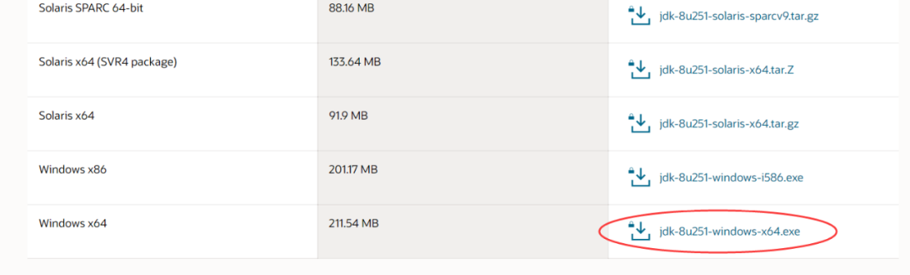

根据系统下载对应的jdk，下载后双击exe文件进行安装，可选择安装位置。

### 环境变量配置

依次点击`我的电脑` ->`属性`->`高级系统设置`->`环境变量`，在`系统变量`选项卡中，新建一个系统变量，如下，变量名为`JAVA_HOME`，变量值为本地安装java的路径。


添加好JAVA_HOME后，需要为`Path`变量增加值，选择`Path`变量（同样在系统变量中），点击编辑，弹出如下弹窗，新建两个值，分别为`%JAVA_HOME%\bin`和`%JAVA_HOME%\jre\bin`。

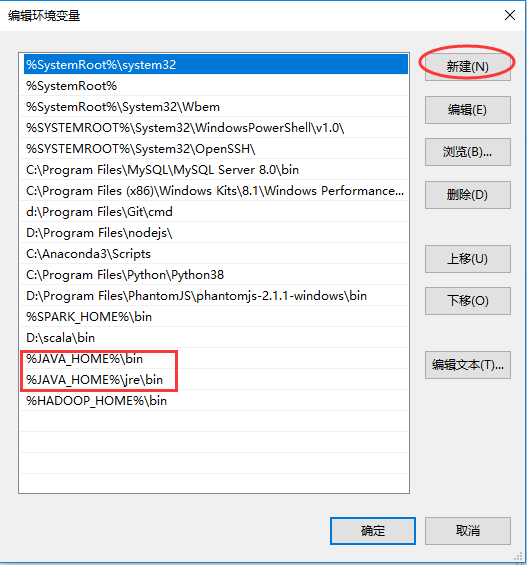

添加好后，确定、保存。

### 测试

环境变量配置好后，测试java是否安装成功，`win+R`打开运行对话框，输入`cmd`命令进入命令行窗口，输入`java -version`查看java版本，有输出则说明java安装成功。

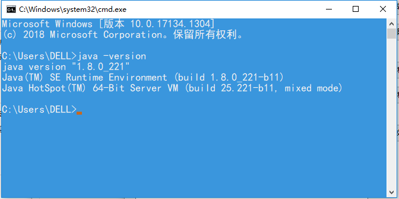

## Ⅱ. scala 安装 

### 下载

spark是由scala语言编写的，需要安装scala。

地址：https://www.scala-lang.org/download/

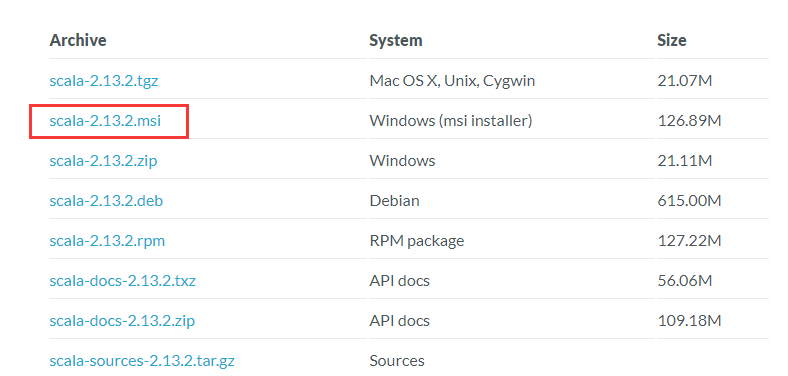

根据系统下载对应的版本，进行安装，安装位置可自行选择。

### 环境变量配置

同样，在系统变量的`Path`中，增加一个值，为scala的安装路径。

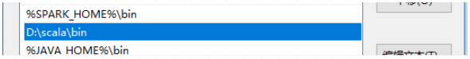

### 测试

同样，打开命令行窗口，输入`scala`，出现如下界面表示安装成功。

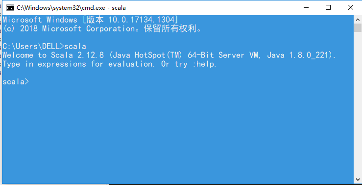

## Ⅲ. hadoop安装

### 下载

[地址](https://www.apache.org/dyn/closer.cgi/hadoop/common/hadoop-3.3.0/hadoop-3.3.0.tar.gz)：http://hadoop.apache.org/releases.html

下载，安装到本地。

[Windows10安装Hadoop3.0.0](https://www.cnblogs.com/yelao/p/12577412.html)

[winutils](https://github.com/steveloughran/winutils)

**「需要注意的是hadoop的安装路径中不要有空格」**，例如不要放在Program Files文件夹下。

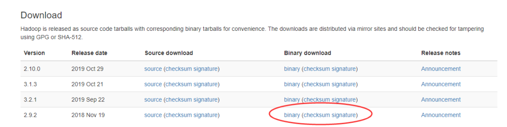

### 环境变量配置

新增`HADOOP_HOME`系统变量，值为本地hadoop安装路径。

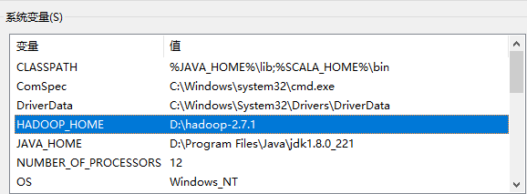

增加`Path`系统变量的值，为`%HADOOP_HOME%\bin`


## Ⅳ. spark安装

### 下载

[下载地址](https://www.apache.org/dyn/closer.lua/spark/spark-3.0.0/spark-3.0.0-bin-hadoop3.2.tgz)：http://spark.apache.org/downloads.html

下载，然后本地安装。

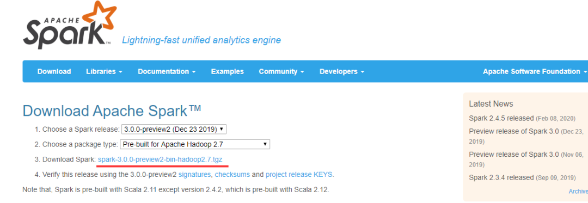

**「需要注意的是spark版本需要和hadoop版本对应」**，如界面所示的spark 3.0.0对应hadoop 2.7。

### 环境变量配置

新增`SPARK_HOME`系统变量，值为本地spark安装路径。

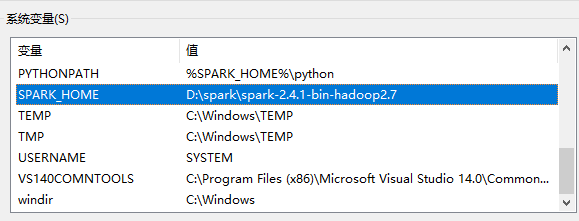

增加`Path`系统变量的值，为`%SPARK_HOME%\bin`。

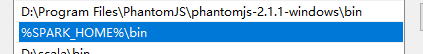

### 测试

在命令行窗口，输入`spark-shell`，出现如下界面，表示spark安装成功。

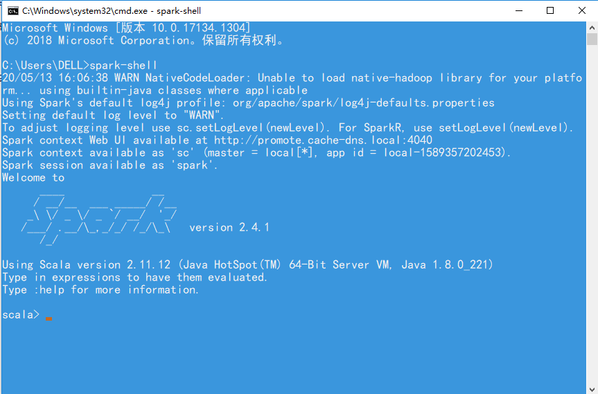

spark window单机版安装成功！单机版可以用来学习spark的基础使用，python用户可以用pyspark模块使用spark，R用户可以用SparkR包使用spark。

win10下安装pyspark：

https://blog.csdn.net/w417950004/article/details/77203501

https://blog.csdn.net/HJXINKKL/article/details/81951551

https://blog.csdn.net/weixin_38556445/article/details/78182264

https://github.com/steveloughran/winutils


## Ⅴ. Zeppelin安装

[下载地址](http://www.apache.org/dyn/closer.cgi/zeppelin/zeppelin-0.9.0-preview2/zeppelin-0.9.0-preview2-bin-all.tgz)

```
https://blog.csdn.net/u010720408/article/details/94908896

https://blog.csdn.net/u010720408/article/details/94969710


```


