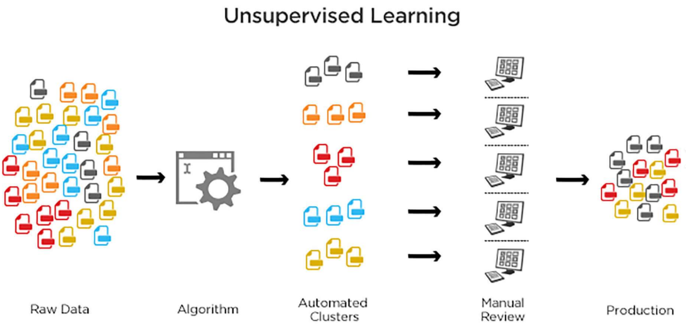
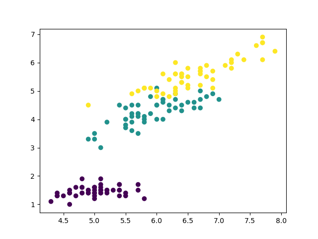
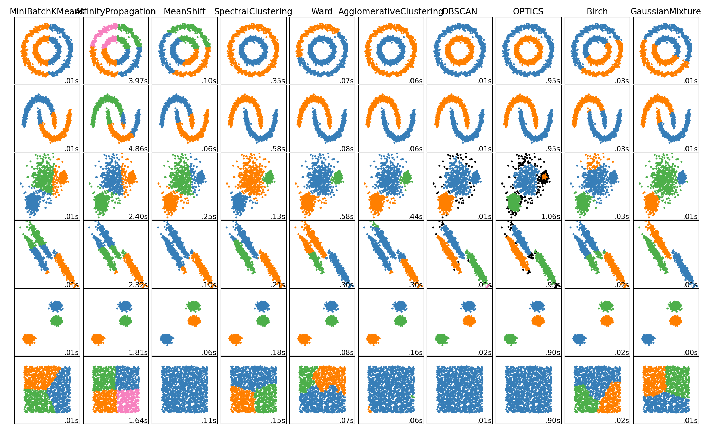
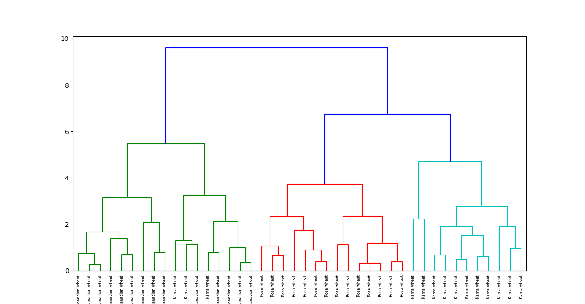
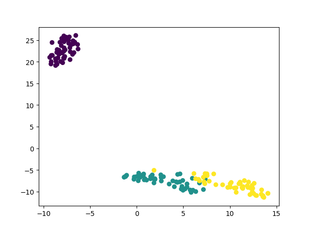

# 人员地理位置的聚类分析

## Ⅰ. 无监督学习

在监督学习中，系统试图从之前给出的例子中学习。而在无监督学习中，系统试图直接从给出的例子中找到模式。因此，如果数据集被标记则监督问题，那么数据集是未标记的，那么它是一个无监督问题。



这里使用Iris数据集（鸢尾花）来进行展示，该数据集包含150条记录。每条记录包含4个属性：

- 花瓣长度 petal length (cm)
- 花瓣宽度 petal width (cm)
- 萼片长度 sepal length (cm)
- 萼片宽度 sepal width (cm)

以及三个种类的 Iris：

- Setosa
- Virginica
- Versicolor

无监督算法需要根据鸢尾花的这四个特征预测它属于哪一类 Iris。可以在Python中使用sklearn库来加载Iris数据集，并使用matplotlib来进行数据可视化。

```python
# 引入模块
from sklearn import datasets
import matplotlib.pyplot as plt
# 加载数据集
iris_df= datasets.load_iris()
# 数据切分
x_axis= iris_df.data[:,0] # 萼片长度
y_axis= iris_df.data[:,2] # 萼片宽度
# 作图
plt.scatter(x_axis, y_axis, c=iris_df.target)
plt.show()
```


紫罗兰色：Setosa，绿色：Versicolor，黄色：Virginica

**聚类**

在上图中，可以看出数据在坐标系上被明显地分为了三个部分。这种根据数据的特征对数据进行分类的算法叫做聚类。简单的说就是将具有相似特征的群体分开并将它们分配到簇中并进行预测。

对于数据的聚类操作可以采用 Scikit-learn 工具包中的 sklearn-cluster 模块进行分析：



### K均值聚类

一种典型的划分聚类算法，它用一个聚类的中心来代表一个簇，即在迭代过程中选择的聚点不一定是聚类中的一个点。其目的是使各个簇（共k个）中的数据点与所在簇质心的误差平方和SSE(Sum of Squared Error）达到最小，这也是评价K-means算法最后聚类效果的评价标准。

KMeans 是一种迭代聚类算法，旨在找到每次迭代中的局部最大值。最初选择所需数量的簇。由于我们知道涉及3个类，因此我们通过将参数“n_clusters”传递到我们的KMeans模型中，将算法编程为将数据分组为3个类。现在随机将三个点（输入）分配到三个簇中。基于每个点之间的质心距离，下一个给定的输入被分离成最近的簇。然后，重新计算所有簇的质心。

簇的每个质心都是定义所得到的组的特征值的集合。检查质心特征权重可以用来定性地解释每个簇代表什么类型的组。

K均值在Python中的实现：

```python
# 引入模块
from sklearn import datasets
from sklearn.cluster import KMeans
# 加载数据集
iris_df= datasets.load_iris()
# Declaring Model
model= KMeans(n_clusters=3)
# Fitting Model
model.fit(iris_df.data)
# Predicitng a single input
predicted_label= model.predict([[7.2,3.5,0.8,1.6]])
# Prediction on the entire data
all_predictions= model.predict(iris_df.data)
# Printing Predictions
print(predicted_label)
print(all_predictions)
```

```
[0]
[0 0 0 0 0 0 0 0 0 0 0 0 0 0 0 0 0 0 0 0 0 0 0 0 0 0 0 0 0 0 0 0 0 0 0 0 0 0 0 0 0 0 0 0 0 0 0 0 0 0 2 2 1 2 2 2 2 2 2 2 2 2 2 2 2 2 2 2 2 2 2 2 2 2 2 2 2 1 2 2 2 2 2 2 2 2 2 2 2 2 2 2 2 2 2 2 2 2 2 2 1 2 1 1 1 1 2 1 1 1 1 1 1 2 2 1 1 1 1 2 1 2 1 2 1 1 2 2 1 1 1 1 1 2 1 1 1 1 2 1 1 1 2 1 1 1 2 1 1 2]
```

### 分层聚类

顾名思义，分层聚类是一种构建聚类层次结构的算法。算法从分配给它们自己的集群的所有数据开始。然后将最近的两个簇加入同一个簇。最后，只有剩下一个簇时，该算法才会结束。
层次聚类的完成可以使用树状图来显示。现在让我们看一个谷物数据的层次聚类的例子。数据集可以在这里找到。
数据集：[https://raw.githubusercontent.com/vihar/unsupervised-learning-with-python/master/seeds-less-rows.csv](https://raw.githubusercontent.com/vihar/unsupervised-learning-with-python/master/seeds-less-rows.csv)
Python中的分层聚类实现：

```python
# Importing Modules
from scipy.cluster.hierarchy import linkage, dendrogram
import matplotlib.pyplot as plt
import pandas as pd
# Reading the DataFrame
seeds_df = pd.read_csv("https://raw.githubusercontent.com/vihar/unsupervised-learning-with-python/master/seeds-less-rows.csv")
# Remove the grain species from the DataFrame, save for later
varieties = list(seeds_df.pop('grain_variety'))
# Extract the measurements as a NumPy array
samples = seeds_df.values
"""
Perform hierarchical clustering on samples using the
linkage() function with the method='complete' keyword argument.
Assign the result to mergings.
"""
mergings = linkage(samples, method='complete')
"""
Plot a dendrogram using the dendrogram() function on mergings,
specifying the keyword arguments labels=varieties, leaf_rotation=90,
and leaf_font_size=6.
"""
dendrogram(mergings, labels=varieties, leaf_rotation=90, leaf_font_size=6,)
plt.show()
```



**K均值与分层聚类的区别**

- 分层聚类不能很好地处理大数据，但K均值聚类可以。这是因为K均值的时间复杂度是线性阶，即O（n），而层次聚类的时间复杂度是平方阶，即O（n2）。
- 在K均值聚类中，当我们从簇的任意选择开始时，多次运行算法产生的结果可能会有所不同。而结果在分层聚类中可复现。
- 当簇的形状是超球面时（如二维中的圆，三维中的球），K均值工作良好。
- K-Means不允许有噪声的数据，而在分层聚类中，我们可以直接使用有噪声的数据集进行聚类。

### t-SNE聚类

t-SNE（t-distributed stochastic neighbor embedding）是用于可视化的无监督学习方法之一**。**它将高维空间映射到可以可视化的2或3维空间。具体而言，它通过二维点或三维点对每个高维物体进行建模，使得相似的对象由靠近的点建模，而不相似的对象以远离的点建模。
Python中的t-SNE簇的实现：

```python
# Importing Modules
from sklearn import datasets
from sklearn.manifold import TSNE
import matplotlib.pyplot as plt
# Loading dataset
iris_df = datasets.load_iris()
# Defining Model
model = TSNE(learning_rate=100)
# Fitting Model
transformed = model.fit_transform(iris_df.data)
# Plotting 2d t-Sne
x_axis = transformed[:, 0]
y_axis = transformed[:, 1]
plt.scatter(x_axis, y_axis, c=iris_df.target)
plt.show()
```


紫罗兰色：Setosa，绿色：Versicolor，黄色：Virginica
这里Iris数据集具有四个特征（4d），它被变换并以二维图形表示。类似地，t-SNE模型可以应用于具有n个特征的数据集。

### DBSCAN聚类

DBSCAN（Density-Based Spatial Clustering of Applications with Noise）是一种典型的基于密度的聚类算法，该算法采用空间索引技术来搜索对象的邻域，引入了“核心对象”和“密度可达”等概念，从核心对象出发，把所有密度可达的对象组成一个簇。

简单的说就是根据一个根据对象的密度不断扩展的过程的算法。一个对象O的密度可以用靠近O的对象数来判断。在DBSCAN算法中将数据点分为一下三类：

- 核心点：在半径Eps内含有超过MinPts数目的点
- 边界点：在半径Eps内点的数量小于MinPts，但是落在核心点的邻域内
- 噪音点：既不是核心点也不是边界点的点

这里有两个量，一个是半径Eps，另一个是指定的数目MinPts。

scikit-learn提供了eps和min_samples参数的默认值，但一般我们会调整这些参数。eps参数是在同一邻域中考虑的两个数据点之间的最大距离。min_samples参数是被认为是簇的邻域中的最小数据点数量。

Python中的DBSCAN聚类：

```python
# Importing Modules
from sklearn.datasets import load_iris
import matplotlib.pyplot as plt
from sklearn.cluster import DBSCAN
from sklearn.decomposition import PCA
# Load Dataset
iris= load_iris()
# Declaring Model
dbscan= DBSCAN()
# Fitting
dbscan.fit(iris.data)
# Transoring Using PCA
pca= PCA(n_components=2).fit(iris.data)
pca_2d= pca.transform(iris.data)
# Plot based on Class
for i in range(0, pca_2d.shape[0]):
    if dbscan.labels_[i]== 0:
        c1= plt.scatter(pca_2d[i,0], pca_2d[i,1], c='r', marker='+')
    elif dbscan.labels_[i]== 1:
        c2= plt.scatter(pca_2d[i,0], pca_2d[i,1], c='g', marker='o')
    elif dbscan.labels_[i]== -1:
        c3= plt.scatter(pca_2d[i,0], pca_2d[i,1], c='b', marker='*')
plt.legend([c1, c2, c3], ['Cluster 1','Cluster 2','Noise'])
plt.title('DBSCAN finds 2 clusters and Noise')
plt.show()
```


**更多无监督技术：**

- 主成分分析（Principal Components Analysis, PCA）
- 异常检测（Anomaly detection）
- 自编码器（Autoencoder）
- 深度信念网络（Deep Belief Nets, DBN）
- 赫布学习（Hebbian Learning）
- 生成对抗网络（Generative Adversarial Networks, GAN）
- 自组织映射（Self-Organizing Map, SOM）


## Ⅱ. 用户地理位置的聚类算法实现

### 一、基于DBSCAN和Kmeans的混合算法
#### 1. 数据说明

以下实现主要选取了基于划分的Kmeans算法和基于密度的DBSCAN算法来处理。

本实验用python实现，依赖numpy, pandas, sklearn, scipy等科学计算library。

数据来自收集得到的用户的地理位置信息，即经纬度数据的序列集。

```python
xy = numpy.array([[116.455788, 39.920767], [116.456065, 39.920965], [116.452312, 39.92304], 
                  [116.421385, 39.989539],[116.455685, 39.92069], [116.455876, 39.920845], 
                  [116.455973, 39.920902], [116.455645, 39.920657],[116.456022, 39.920934], 
                  [116.455685, 39.920691], [116.456023, 39.920671], [116.45596, 39.920864],
                  [116.455522, 39.920856], [116.455276, 39.920407], [116.455799, 39.920867],
                  [116.455349, 39.920425], [116.45511, 39.920377], [116.455318, 39.920442], 
                  [116.455298, 39.920474], [116.455839, 39.920636], [116.455979, 39.921168], 
                  [116.454281, 39.920006], [116.45598, 39.920612],[116.45388, 39.919584], 
                  [116.455474, 39.920737], [116.456009, 39.920641], [116.455439, 39.920574],
                  [116.455759, 39.920841], [116.455838, 39.920644], [116.455983, 39.920847],
                  [116.459803, 39.922041], [116.456029, 39.92088], [116.455539, 39.920603], 
                  [116.455989, 39.920851],[116.455719, 39.920789], [116.45601, 39.92082], 
                  [116.456229, 39.920564], [116.455906, 39.920771], [116.456248, 39.920868], 
                  [116.455805, 39.920544], [116.455896, 39.920758], [116.43692, 39.926767],
                  [116.454672, 39.92024], [116.454813, 39.917848], [116.381415, 40.00875], 
                  [116.422925, 39.980757], [116.422849, 39.9808], [116.38107, 40.009217], 
                  [116.456078, 39.920747], [116.455242, 39.919515],[116.455615, 39.920533], 
                  [116.422092, 39.991104], [116.454847, 39.917724], [116.456686, 39.924316], 
                  [116.45575, 39.920642], [116.456713, 39.924413], [116.455846, 39.920828],
                  [116.422108, 39.991098], [116.422075, 39.991139], [118.775572, 31.97337], 
                  [118.776968, 31.97392], [118.778187, 31.973121], [118.775695, 31.973254], 
                  [118.775302, 31.973807], [118.776303, 31.973692], [118.777541, 31.973439], 
                  [118.776196, 31.973489], [116.448944, 39.926799], [116.45487, 39.917804], 
                  [116.455762, 39.920645], [116.456146, 39.920441], [116.455857, 39.920043], 
                  [116.455458, 39.920826], [116.455533, 39.920791], [116.455426, 39.920896], 
                  [116.45566, 39.920811], [116.455696, 39.920621], [116.453667, 39.9259], 
                  [116.466606, 39.886322], [116.455917, 39.92062]])
```
#### 2. 基于Kmeans的聚类实现
假设用户的地理位置信息通常是工作地点和家，因此选取k值为2，代码如下
```python
res, idx = kmeans2(numpy.array(zip(xy[:, 0], xy[:, 1], z)), 2, iter=20, minit='points')
```
实现输出结果

但是实际上用户并未在河北出现过，用户经常出现的地方除了北京的工作地方和家，还曾经在南京出差一段时间。所以将K值设定为3，再次运行
```python
res, idx = kmeans2(numpy.array(zip(xy[:, 0], xy[:, 1], z)), 3, iter=20, minit='points')
```
输出结果

这样就将南京的地理位置区分出来了。工作地方和出差地方已经非常贴合了，但是家的地方离实际距离还是差了不少距离。
其实已经可以看出来，由于用户的出现地点不可预知，因此**很难确定K值**。并且**Kmeans聚合得到的结果取得是聚合簇的质心位置，并不是用户的实际地理位置**，而且我选取的是相似度量是欧式距离，而不是经纬度计算的球面距离。因此得到的结果并不理想。
#### 3. 基于DBSCAN的聚类实现
DBSCAN算法的重点是选取的聚合半径参数和聚合所需指定的MinPts数目。
在此使用球面距离来衡量地理位置的距离，来作为聚合的半径参数。
如下实验，选取2公里作为密度聚合的半径参数，MinPts个数为5.

```python
def haversine(lonlat1, lonlat2):
    lat1, lon1 = lonlat1
    lat2, lon2 = lonlat2
    lon1, lat1, lon2, lat2 = map(radians, [lon1, lat1, lon2, lat2])
    dlon = lon2 - lon1
    dlat = lat2 - lat1
    a = sin(dlat / 2) ** 2 + cos(lat1) * cos(lat2) * sin(dlon / 2) ** 2
    c = 2 * asin(sqrt(a))
    r = 6371  # Radius of earth in kilometers. Use 3956 for miles
    return c * r
def clustering_by_dbscan():
    ......
    distance_matrix = squareform(pdist(X, (lambda u, v: haversine(u, v))))
    db = DBSCAN(eps=2, min_samples=5, metric='precomputed')  
    y_db = db.fit_predict(distance_matrix)
    X['cluster'] = y_db
    ......
    plt.scatter(X['lat'], X['lng'], c=X['cluster'])
    plt.show()
```
输出如下

结果显示该用户的地理位置信息聚合簇为4块，在结果中分别用0.0,1.0，2.0，-1.0来标记。可以看出DBSCAN算法可以根据用户的活动半径，也就是设定的最小半径参数2公里，将用户的活动地理位置数据集合分为了4簇，而且每一簇**在空间上都是任意形状的**，分类聚合的效果是不错的，但是得到的结果是一个个的簇，也就是一个个的地理点的集合，并不是一个“中心”。并且存在的**噪声点**无法区分。
#### 4. 基于DBSCAN和Kmeans的混合算法实现
从上面的实验结果，Kmeans算法的关键的是 K值的选取，而我无法确定用户地理信息聚类的簇的个数，如果实际上的地理位置的分布过于分散，按照固定K值聚合，得到的质心的位置可能和实际位置相差甚远。而DBSCAN的算法，聚类结果不错，因为是按照设定的人的活动半径的密度可达来聚合的，但其结果是将数据集合分类，并不求出**中心点**。

因此我设计了一种基于DBSCAN和Kmeans的混合算法：先利用DBSCAN算法的密度可达特性将用户的地理位置数据集按照活动半径聚合成若干个簇，并且将每一簇的数据集作为新的输入，再利用Kmeans算法的迭代聚合求出**质心**的位置，设定**K值为1**。

代码如下

```python
def clustering_by_dbscan_and_kmeans2():
    X = pd.DataFrame(
        {"lat": [39.920767, 39.920965, 39.92304, 39.989539, 39.92069, 39.920845, 39.920902, 
                 39.920657, 39.920934, 39.920691, 39.920671, 39.920864, 39.920856, 39.920407, 
                 39.920867, 39.920425, 39.920377, 39.920442, 39.920474, 39.920636, 39.921168, 
                 39.920006, 39.920612, 39.919584, 39.920737, 39.920641, 39.920574, 39.920841, 
                 39.920644, 39.920847, 39.922041, 39.92088, 39.920603, 39.920851, 39.920789, 
                 39.92082, 39.920564, 39.920771, 39.920868, 39.920544, 39.920758, 39.926767, 
                 39.92024, 39.917848, 40.00875, 39.980757, 39.9808, 40.009217, 39.920747, 39.919515, 
                 39.920533, 39.991104, 39.917724, 39.924316, 39.920642, 39.924413, 39.920828, 
                 39.991098, 39.991139, 31.97337, 31.97392, 31.973121, 31.973254, 31.973807, 
                 31.973692, 31.973439, 31.973489, 39.926799, 39.917804, 39.920645, 39.920441, 
                 39.920043, 39.920826, 39.920791, 39.920896, 39.920811, 39.920621, 39.9259, 
                 39.886322, 39.92062],
         "lng": [116.455788, 116.456065, 116.452312, 116.421385, 116.455685, 116.455876, 116.455973, 
                 116.455645, 116.456022, 116.455685, 116.456023, 116.45596, 116.455522, 116.455276, 
                 116.455799, 116.455349, 116.45511, 116.455318, 116.455298, 116.455839, 116.455979, 
                 116.454281, 116.45598, 116.45388, 116.455474, 116.456009, 116.455439, 116.455759, 
                 116.455838, 116.455983, 116.459803, 116.456029, 116.455539, 116.455989, 116.455719, 
                 116.45601, 116.456229, 116.455906, 116.456248, 116.455805, 116.455896, 116.43692, 
                 116.454672, 116.454813, 116.381415, 116.422925, 116.422849, 116.38107, 116.456078, 
                 116.455242, 116.455615, 116.422092, 116.454847, 116.456686, 116.45575, 116.456713,
                 116.455846, 116.422108, 116.422075, 118.775572, 118.776968, 118.778187, 118.775695, 
                 118.775302, 118.776303, 118.777541, 118.776196, 116.448944, 116.45487, 116.455762, 
                 116.456146, 116.455857, 116.455458, 116.455533, 116.455426, 116.45566, 116.455696, 
                 116.453667, 116.466606, 116.455917]
         })
    distance_matrix = squareform(pdist(X, (lambda u, v: haversine(u, v))))
    db = DBSCAN(eps=2, min_samples=5, metric='precomputed')  
    y_db = db.fit_predict(distance_matrix)
    X['cluster'] = y_db
    results = {}
    for i in X.values:
        if i[2] not in results.keys():
            results[i[2]] = [[i[1], i[0]]]
        else:
            if results[i[2]]:
                results[i[2]].append([i[1], i[0]])
            else:
                results[i[2]] = [[i[1], i[0]]]
    print "DBSCAN output: ", len(results), results.keys()
    print "KMeans calc center as below: "
    for k in results.keys():
        xy = numpy.array(results[k])
        z = numpy.sin(xy[:, 1] - 0.2 * xy[:, 1])
        z = whiten(z)
        res, idx = kmeans2(numpy.array(zip(xy[:, 0], xy[:, 1], z)), 1, iter=20, minit='points')
        address_text = my_get_address_text_by_location(res[0][1], res[0][0])
        print res, address_text
```
输出如下

其中”家“，”公司“，”出差“的位置信息已经非常贴合用户的实际信息了。
但是仍然存在的**噪声点**的信息。这个暂时还没找到解决方案，下一步的思路是带入用户地理位置信息收集时候得到的附属信息如时间来辅助分析，希望可以有更好的结果。
### 二、聚类算法学习----之----sklearn.cluster.KMeans
`class sklearn.cluster.KMeans(n_clusters=8, init=’k-means++’, n_init=10, max_iter=300, tol=0.0001, precompute_distances=’auto’, verbose=0, random_state=None, copy_x=True, n_jobs=1, algorithm=’auto’)`
#### （一）输入参数：
（1）n_clusters：分成的簇数（要生成的质心数）=====>整型，[可选]，默认值=8；
`n_clusters : int, optional, default: 8  The number of clusters to form as well as the number of centroids to generate.`
（2）init：初始化质心的方法====>有三个可选值：'k-means++'， 'random'，或者传递一个ndarray向量，默认为'k-means++'
‘k-means++’ 用一种智能的方法选定初始质心从而能加速迭代过程的收敛，参见 k_init 的解释获取更多信息。
‘random’ 随机从训练数据中选取初始质心。
如果传递的是一个ndarray，则应该形如 (n_clusters, n_features) 并给出初始质心。
**init** : {‘k-means++’, ‘random’ or an ndarray}
Method for initialization, defaults to ‘k-means++’:
> ‘k-means++’ : selects initial cluster centers for k-mean clustering in a smart way to speed up convergence. See section Notes in k_init for more details.
> ‘random’: choose k observations (rows) at random from data for the initial centroids.
> If an ndarray is passed, it should be of shape (n_clusters, n_features) and gives the initial centers.

（3）n_init:：用不同的质心初始化值运行算法的次数====>整型，默认值=10次，最终解是在inertia意义下选出的最优结果。
（ps：每一次算法运行时开始的centroid seeds是随机生成的, 这样得到的结果也可能有好有坏. 所以要运行算法n_init次, 取其中最好的。）
**n_init** :  int, default: 10
Number of time the k-means algorithm will be run with different centroid seeds. The final results will be the best output of n_init consecutive runs in terms of inertia.
**max_iter** : int, default: 300
Maximum number of iterations of the k-means algorithm for a single run.
（5）tol：与inertia结合来确定收敛条件====> float型，默认值= 1e-4
**tol** : float, default: 1e-4
Relative tolerance with regards to inertia to declare convergence
（6）precompute_distances：预计算距离，计算速度更快但占用更多内存 ====>类型：（auto，True，False）三个值可选，,默认值=“auto”
‘auto’：如果样本数乘以聚类数大于 12million 的话则不预计算距离‘’
‘True‘：总是预先计算距离。
‘False‘：永远不预先计算距离。
这个参数会在空间和时间之间做权衡，如果是True 会把整个距离矩阵都放到内存中，auto 会默认在数据样本大于featurs*samples 的数量大于12e6 的时候False,False时
核心实现的方法是利用Cpython 来实现的
**precompute_distances** : {‘auto’, True, False}
Precompute distances (faster but takes more memory).
‘auto’ : do not precompute distances if n_samples * n_clusters > 12 million. This corresponds to about 100MB overhead per job usingdoubleprecision.
True : always precompute distances
False : never precompute distances
（7）verbose:是否输出详细信息====>类型：整型，默认值=0
**verbose** : int, default 0
Verbosity mode.
（8）random_state： 用于初始化质心的生成器（generator），和初始化中心有关。
**random_state** : int, RandomState instance or None, optional, default: None
If int, random_state is the seed used by the random number generator;
If RandomState instance, random_state is the random numbergenerator;
If None, the random number generator is the RandomState instance used by np.random.
（9）copy_x：是否对输入数据继续copy 操作====> 布尔型，默认值=True
当我们precomputing distances时，将数据中心化会得到更准确的结果。
如果把此参数值设为True，则原始数据不会被改变。
如果是False，则会直接在原始数据上做修改并在函数返回值时将其还原。
但是在计算过程中由于有对数据均值的加减运算，所以数据返回后，原始数据和计算前可能会有细小差别。
**copy_x** : boolean, default True
When pre-computing distances it is more numerically accurate to center the data first.
If copy_x is True, then the original data is not modified.
If False, the original data is modified, and put back before the function returns,
but small numerical differences may be introduced by subtracting and then adding the data mean.
（10）n_jobs：使用进程的数量，与电脑的CPU有关====>类型：整型，默认值=1
指定计算所用的进程数。内部原理是同时进行n_init指定次数的计算。
若值为 -1，则用所有的CPU进行运算。
若值为1，则不进行并行运算，这样的话方便调试。
若值小于-1，则用到的CPU数为(n_cpus + 1 + n_jobs)。因此如果 n_jobs值为-2，则用到的CPU数为总CPU数减1。
**n_jobs** :  int
The number of jobs to use for the computation. This works by computing  each of the n_init runs in parallel.
If -1 all CPUs are used.
If 1 is given, no parallel computing  code is used at all, which is useful for debugging.
For n_jobs below -1, (n_cpus +  1 + n_jobs) are used. Thus for n_jobs = -2, all CPUs but one are used.
（11）algorithm：k-means算法的种类====>（“auto”, “full” or “elkan”）三个值可选，默认值=‘auto’
“full”采用的是经典EM-style算法的。
“elkan”则在使用三角不等式时显得更为高效,但目前不支持稀疏数据。
“auto”则在密集数据时选择“elkan”，在稀疏数据是选择“full”。
algorithm : : “auto”, “full” or “elkan”, default=”auto”
K-means algorithm to use. The classical EM-style algorithm is “full”.
The “elkan” variation is more efficient by using the triangle inequality, but currently doesn’t support sparse data.
“auto” chooses “elkan” for dense data and “full” for sparse data.
#### （二）属性
cluster_centers_：向量，[n_clusters, n_features]
Coordinates of cluster centers (找出聚类中心)
Labels_:每个点的分类
inertia_：float型，每个点到其簇的质心的距离之和。
**cluster_centers_** : array, [n_clusters, n_features]
Coordinates of cluster centers
**labels_ :** :Labels of each point
**inertia_** : float,Sum of distances of samples to their closest cluster center.
#### （三）例子
```shell
>>> from sklearn.cluster import KMeans
>>> import numpy as np
>>> X = np.array([[1, 2], [1, 4], [1, 0],
...               [4, 2], [4, 4], [4, 0]])
>>> kmeans = KMeans(n_clusters=2, random_state=0).fit(X)
>>> kmeans.labels_
array([0, 0, 0, 1, 1, 1], dtype=int32)
>>> kmeans.predict([[0, 0], [4, 4]])
array([0, 1], dtype=int32)
>>> kmeans.cluster_centers_
array([[ 1.,  2.],
       [ 4.,  2.]])
```
#### （四）相关方法

| Methods | Description |
| ---- | ---- |
| fit(X[, y]) | Compute k-means clustering.计算k-means聚类 |
| [`fit_predict`](http://scikit-learn.org/stable/modules/generated/sklearn.cluster.KMeans.html#sklearn.cluster.KMeans.fit_predict)(X[, y]) | Compute cluster centers and predict cluster index for each sample.计算簇质心并给每个样本预测类别； |
| [`fit_transform`](http://scikit-learn.org/stable/modules/generated/sklearn.cluster.KMeans.html#sklearn.cluster.KMeans.fit_transform)(X[, y]) | Compute clustering and transform X to cluster-distance space.计算簇并把X装换到cluster-distance空间； |
| [`get_params`](http://scikit-learn.org/stable/modules/generated/sklearn.cluster.KMeans.html#sklearn.cluster.KMeans.get_params)([deep]) | Get parameters for this estimator.取得估计器的参数； |
| [`predict`](http://scikit-learn.org/stable/modules/generated/sklearn.cluster.KMeans.html#sklearn.cluster.KMeans.predict)(X) | Predict the closest cluster each sample in X belongs to.给每个样本估计最接近的簇； |
| [`score`](http://scikit-learn.org/stable/modules/generated/sklearn.cluster.KMeans.html#sklearn.cluster.KMeans.score)(X[, y]) | Opposite of the value of X on the K-means objective.算法目标相反的值； |
| [`set_params`](http://scikit-learn.org/stable/modules/generated/sklearn.cluster.KMeans.html#sklearn.cluster.KMeans.set_params)(`**params`) | Set the parameters of this estimator. |
| transform(X) | Transform X to a cluster-distance space.将X转换入cluster-distance 空间。 |

#### （五）测试
```python
#encoding = utf-8
"""
@version:??
@author: xq
@contact:xiaoq_xiaoq@163.com
@file: test.py
@time: 2017/10/18 14:29
"""
import pandas as pd
import matplotlib.pyplot as plt
from  sklearn.cluster import KMeans
from matplotlib.font_manager import FontProperties
class clusterApi(object):
    def __init__(self,data):
        self.data = data
        self.font = FontProperties(fname='C:/Windows/Fonts/msyh.ttf')#设置中文字体
    def initData(self):
        '''
        数据预处理,统一数据格式
        :return: 固定格式的数据
        '''
        initdata = pd.DataFrame(self.data)
        scatterData = initdata[['Id', 'lat', 'lng']]
        return scatterData
    def k_meansUp(self):
        pointsData = self.initData()#要分类的数据
        plt.figure()
        plt.subplot(331)#绘制子图
        lats = pointsData.lat
        lngs =pointsData.lng
        plt.title(u'样本',fontproperties=self.font)#设置图的标题
        plt.scatter(lngs, lats,s=3)#绘制样本图
        colors = ['b', 'g', 'r', 'c', 'm', 'y', 'k', 'b']#画图颜色
        markers = ['o', 's', 'D', 'v', '^', 'p', '*', '+']#画图形状
        testsK = [2, 3, 4, 5, 8]#k值的取值
        subplot_counter = 1#子图的位置
        for t in testsK:
            subplot_counter += 1
            plt.subplot(3, 2, subplot_counter)
            kmeans_model = KMeans(n_clusters=t).fit(pointsData)
            for i, l in enumerate(kmeans_model.labels_):
                plt.plot(lngs[i], lats[i],markersize=2,color=colors[l],marker=markers[l], ls='None')
                plt.title(u'K = %s' %t , fontproperties=self.font)
        plt.show()
def main():
    #测试数据
    stopList= [{'Id': '50001','lat': 28.571906,'lng': 112.337788},
               {'Id': '50001','lat': 28.573678,'lng': 112.381103},
               { 'Id': '50001','lat': 28.571915,'lng': 112.337533},
               { 'Id': '50001','lat': 28.573978,'lng': 112.35765},
                { 'Id': '50001','lat': 28.572656,'lng': 112.3366},
               {'Id': '50001', 'lat': 28.578011, 'lng': 112.330688},
               {'Id': '50001', 'lat': 28.572228, 'lng': 112.335841},
               {'Id': '50001', 'lat': 28.57849, 'lng': 112.3338},
               {'Id': '50001', 'lat': 28.57239, 'lng': 112.336491},
               {'Id': '50001', 'lat': 28.577943, 'lng': 112.330995},
               {'Id': '50001', 'lat': 28.571921, 'lng': 112.337783},
               {'Id': '50001', 'lat': 28.572401, 'lng': 112.3359},
               {'Id': '50001', 'lat': 28.569629, 'lng': 112.34005},
               {'Id': '50001', 'lat': 28.588048, 'lng': 112.337783},
               {'Id': '50001', 'lat': 28.572035, 'lng': 112.335683},
               {'Id': '50001', 'lat': 28.560938, 'lng': 112.378183},
               {'Id': '50001', 'lat': 28.544781, 'lng': 112.494936},
               {'Id': '50001', 'lat': 28.572296, 'lng': 112.336288},
               {'Id': '50001', 'lat': 28.571951, 'lng': 112.337806},
               {'Id': '50001', 'lat': 28.571551, 'lng': 112.32685}]
    print('共有%d个点'%len(stopList))
    clustertest = clusterApi(stopList)#实例化
    clustertest.k_meansUp()#聚类画图
if __name__ == '__main__':
    main()
```
