# NL2SQL的相关学习

**语义解析**（Semantic Parsing）是自然语言处理技术的核心任务之一，涉及语言学、计算语言学、机器学习以及认知语言等多个学科，在近几年中获得了广泛关注，语义解析任务有助于促进机器语言理解的快速发展。

本文重点介绍语义解析技术中的Text-to-SQL任务，让机器自动将用户输入的自然语言问题转成数据库可操作的SQL查询语句，实现基于数据库的自动问答能力。


## 任务介绍及研究动机
当前，大量信息存储在结构化和半结构化知识库中，如数据库。对于这类数据的分析和获取需要通过SQL等编程语言与数据库进行交互操作，SQL的使用难度限制了非技术用户，给数据分析和使用带来了较高的门槛。人们迫切需要技术或工具完成自然语言与数据库的交互，因此诞生了Text-to-SQL任务。

我们通过图1中的实例来介绍一下Text-to-SQL任务。该任务包含两部分：**Text-to-SQL解析器和SQL执行器**。

解析器的输入是给定的数据库和针对该数据库的问题，输出是问题对应的SQL查询语句，如图中红色箭头标示。SQL执行器在数据库上完成该查询语句的执行，及给出问题的最终答案，如图中绿色箭头标示。

SQL执行器有很多成熟的系统，如MySQL，SQLite等，该部分不是本文重点。本文主要介绍解析器，学术界中Text-to-SQL任务默认为Text-to-SQL解析模型。

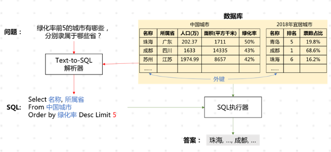


首先，我们介绍一下术语**“数据库”**和**“SQL查询语句”**：

1、数据库由一张或多张表格构成，表格之间的关系通过外键给出。在该实例中，数据库由表 “中国城市”和“2018年宜居城市” 构成，两张表通过外键：“中国城市”的“名称”列和“2018年宜居城市”的“名称”列关联；

2、SQL是数据库查询语言，其构成来自3部分：数据库（如实例SQL查询语句中蓝色标注的成分）、问题（如实例SQL查询语句红色标注的成分）、SQL关键词（如实例SQL查询语句中的Select、From、Where等）。

其次，我们介绍一下Text-to-SQL解析模型。根据SQL的构成，解析器需要完成两个任务，即“**问题与数据库的映射**”和“**SQL生成**”。

在问题与数据库的映射中，需要找出问题依赖的表格以及具体的列，如图1实例中，问题“绿化率前5的城市有哪些，分别隶属于哪些省？”依赖的数据库内容包括：表格“中国城市”，具体的列“名称”、“所属省”、“绿化率”（SQL查询语句蓝色标注成分）。

在SQL生成中，结合第一步识别结果以及问题包含信息，生成满足语法的SQL查询语句，如实例中的“Select 名称,所属省 From 中国城市 Where 绿化率 > 30%”。


## Text-to-SQL研究进展
Text-to-SQL技术能够有效地辅助人们对海量的数据库进行查询，因其有实用的应用场景，引起了学术界和工业界的广泛关注。我们接下来将从**相关数据集**和**模型**两方面介绍该技术的研究进展。

### 1、数据集介绍

下图给出了Text-to-SQL数据集发展趋势，代表数据集参见表1。

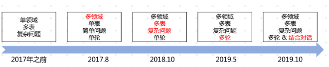

其中术语介绍：

- 根据包含领域数量，数据集分为单领域和多领域。
- 根据每个数据库包含表的数量，数据集分为单表和多表模式。在多表模式中，SQL生成涉及到表格的选择。
- 根据问题复杂度，数据集分为简单问题和复杂问题模式，其中问题复杂度由SQL查询语句涉及到的关键词数量、嵌套层次、子句数量等确定。
- 根据完整SQL生成所需轮数，数据集分为单轮和多轮。
- 若SQL生成融进渐进式对话，则数据集增加“结合对话”标记。当前只有CoSQL数据集是融进对话的数据集。

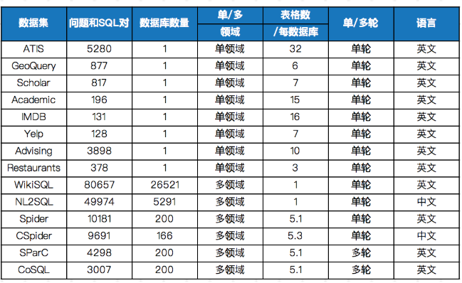

### 2、模型介绍

SQL查询语句是一个符合语法、有逻辑结构的序列，其构成来自三部分：**数据库、问题、SQL关键词**。

在当前深度学习研究背景下，Text-to-SQL任务可被看作是一个类似于神经机器翻译的序列到序列的生成任务，主要采用Seq2Seq模型框架。基线Seq2Seq模型加入注意力、拷贝等机制后，在单领域数据集上可以达到80%以上的准确率，但在多领域数据集上效果很差，准确率均低于25%。

**从编码和解码两个方面进行原因分析。**

**在编码阶段，问题与数据库之间需要形成很好的对齐或映射关系，即问题中涉及了哪些表格中的哪些元素（包含列名和表格元素值）；同时，问题与SQL语法也需要进行映射，即问题中词语触发了哪些关键词操作（如Group、Order、Select、Where等）、聚合操作（如Min、Max、Count等）等；最后，问题表达的逻辑结构需要表示并反馈到生成的SQL查询语句上，逻辑结构包括嵌套、多子句等。**

在解码阶段，SQL语言是一种有逻辑结构的语言，需要保证其语法合理性和可执行性。普通的Seq2Seq框架并不具备建模这些信息的能力。

当前基于Seq2Seq框架，主要有以下几种改进。

**1）基于Pointer Network的改进**

首先，SQL组成来自三部分：**数据库中元素**（如表名、列名、表格元素值）、**问题中词汇**、 **SQL关键字**。其次，当前公开的多领域数据集为了验证模型数据库无关，在划分训练集和测试集时要求数据库无交叉，这种划分方式导致测试集数据库中很大比例的元素属于未登录词。传统的Seq2Seq模型是解决不好这类问题的。

Pointer Network很好地解决了这一问题，其输出所用到的词表是随输入而变化的。具体做法是利用注意力机制，直接从输入序列中选取单词作为输出。在Text-to-SQL任务中，将问题中词汇、SQL关键词、对应数据库的所有元素作为输入序列，利用Pointer Network从输入序列中拷贝单词作为最终生成SQL的组成元素。

由于Pointer Network可以较好的满足具体数据库无关这一要求，在多领域数据集上的模型大多使用该网络，如Seq2SQL[1]、STAMP[8]、Coarse2Fine[9] 、IRNet[16]等模型。

**2）基于Sequence-to-set的改进**

在简单问题对应的数据集合上，其SQL查询语句形式简单（仅包含Select和Where关键词），为了解决Seq2Seq模型中顺序错误带来的影响（如“条件1 And 条件2”，预测为“条件2 And 条件1”，属于顺序错误，但对应的SQL是正确的），SQLNet[10]提出了Sequence-to-set模型，基于所有的列预测其属于哪个关键词（即属于Select还是Where，在SQLNet模型中仅预测是否属于Where），针对SQL 中每一个关键词选择概率最高的前K个列。

该模式适用于SQL形式简单的数据集，在WikiSQL和NL2SQL这两个数据集合上使用较多，且衍生出很多相关模型，如TypeSQL[11]、SQLova[12]、X-SQL[13]等。

### 3、评价方法

Text-to-SQL任务的评价方法主要包含两种：**精确匹配率**（Exact Match, Accqm）、**执行正确率**（Execution Accuracy, Accex）。

精确匹配率指,预测得到的SQL语句与标准SQL语句精确匹配成功的问题占比。为了处理由成分顺序带来的匹配错误，当前精确匹配评估将预测的SQL语句和标准SQL语句按着SQL关键词分成多个子句，每个子句中的成分表示为集合，当两个子句对应的集合相同则两个子句相同，当两个SQL所有子句相同则两个SQL精确匹配成功；
$$
Acc_{qm}=\frac{\text{预测 SQL 与标准 SQL 所有子句匹配成功的问题}}{\text{所有问题}}
$$
执行正确指，执行预测的SQL语句，数据库返回正确答案的问题占比。
$$
Acc_{ex}=\frac{\text{答案正确的问题}}{\text{所有问题}}
$$
目前仅WikiSQL数据集支持Accex，其他数据集仅支持Accqm。大部分数据集发布了对应的评估脚本，方便大家在同一个评估标准下进行算法研究。

参考：[https://mp.weixin.qq.com/s/FtsA4O_VTUqhhYS3Gq3G8Q](https://mp.weixin.qq.com/s/FtsA4O_VTUqhhYS3Gq3G8Q)


## 当前百度的研究

### 1、构建数据集DuSQL和模型DuParer的构建

百度从实际应用中随机抽取用户问题，就问题解决所需要的操作对问题类型进行了人工分析，结果如表2所示，可以看出涉及到计算、排序、比较等操作的问题有一定的占比。

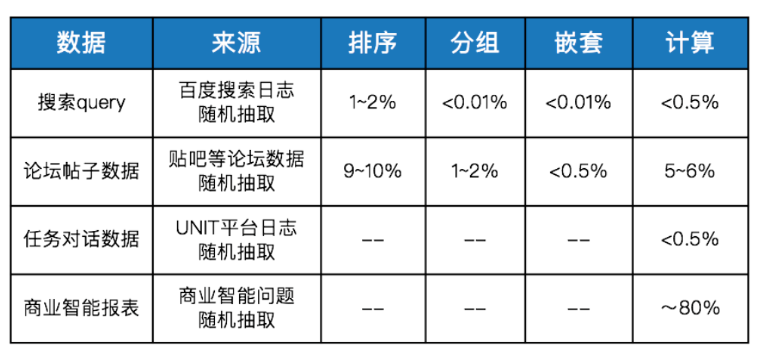

为了更好的理解，列举了一些问题类型及对应的问题实例：

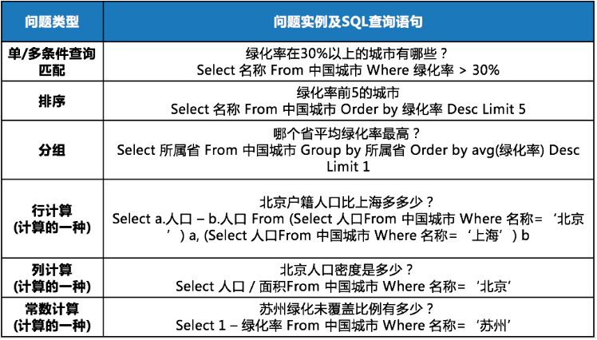


### 2、数据集的构建：

数据集构建主要分为两大步骤：**数据库构建**和**<问题，SQL查询语句>**构建。在数据库构建中，要保证数据库覆盖的领域足够广泛，在<问题, SQL查询语句>构建中，要保证覆盖实际应用中常见的问题类型。

数据库主要来自百科（包括三元组数据和百科页面中的表格）、权威网站（如国家统计局、天眼查、中国产业信息网、中关村在线等）、各行业年度报告以及论坛（如贴吧）等。

从这些网站挖掘到表格后，我们按表格的表头对同类表格进行了聚类，并根据表格中的实体链接等信息构建表格之间的关联，最终保留了813张表格，分为200个数据库。由于很多表格的内容较敏感，我们仅使用了表格的表头，对表格内容进行了随机填充，无法保证事实性。

基于一个半自动方案构建<问题, SQL查询语句>，首先需要基于SQL文法自动生成SQL查询语句和对应的伪语言问题描述，然后通过众包方式将伪语言问题描述改写为自然语言问题。在自动生成SQL查询语句时，我们设计了覆盖所有常见问题类型的SQL规约文法，最终构建了近2.4万的数据。

表4展示了DuSQL数据集与其他多领域数据集的对比情况。其中，时间计算属于常数计算，引入常量TIME_NOW（表示当前时间），比如数据库Schema为“{公司名称, 成立年份, 员工数, …}”，问题为“XX公司成立多少年了”， SQL查询语句为“Select TIME_NOW – 成立年份 Where 公司名称=XX”。在实际应用中，常数计算中的时间计算需求较大，因此我们构建了相关数据。

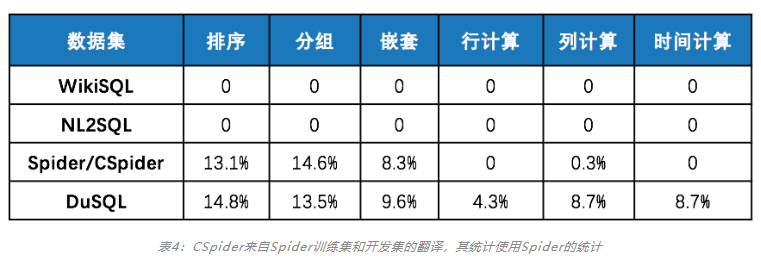


# 论文笔记

## 1. 作者简介
> Mounica Maddela, Wei Xu1, Daniel Preot¸iuc-Pietro
> Department of Computer Science and Engineering, The Ohio State University

## 2. 文献类型

ACL 2019

## 3. 存在问题

标签分割精度太低，对于标签的分割不能分割成一个有意义的单词序列

## 4. 主要工作

1. 标签分割精度降低了24.6%的误差
1. 利用新的神经方法将问题划分为两两排序，与以往忽略相对顺序的工作形成对比；
1. 一种多任务学习方法，它使用不同的特性集来处理不同类型的标签；
4. 建立了一个新的数据集，所有的工作都在这个数据集上完成
## 5. 方法概述
> 这部分写论文的实现方法，网络结构图
> 1. .当前最新的方法是使用最大熵和CRF模型，采用语言模型和手工制作的特征相结合，以预测每个字符是否在标签中是一个新词的开头。
> 2. 它使用一种波束搜索算法提取k个最佳分段，按n—gram语言模型概率排序：
>    - 
>    - 其中[W1，w2]....W]是切分s的单词序列，N是窗口的大小。
> 3. 不足之处：在以往的工作中，每个分段的排名分数都是独立计算的，忽略了前k个候选分段之间的相对顺序。为了解决这一限制，我们利用提出了一种新的两两排序策略，并提出了该任务的第一个神经模型。
>
> 改进的方法，也就是本文所提出来的方法：提出了一种多任务成对神经排序方法，以更好地融合和区分给定标签的候选片段之间的相对顺序。
> 举个例子：关于排序的问题
>

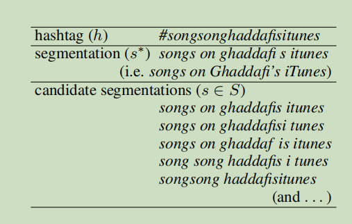


1. 评估函数：Levenshtein距离

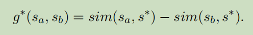

 2.两两神经排序模型

训练过程：对于输入候选对sa，sb，我们将它们的特征向量SA和SB连接起来，并将它们送入生成器g(sa，sb)的前馈网络中。特征向量sa或sb由语言组成。模型概率使用良好图灵和修正的Kneser-Ney平滑，词汇和语言特征用于生成器g，我们以所有可能的对hsa，SBI的k候选作为输入，他们的“金”分数g∗(sa，sb)作为目标。培训的目标是最小化均方误差(MSE)：

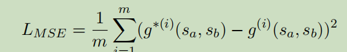

网络体系结构：

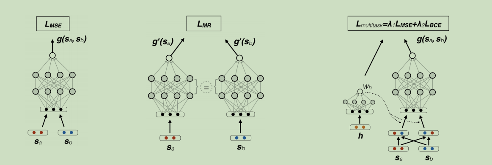

## 6. 实验
数据集：构建了一个由12，594个散列标签组成的数据集

实验结果：


## 7. 下一步工作
> 这部分写论文的自身缺点/下一步工作

1. 我们的模型通过实例级的选择性注意，将多实例学习与神经网络结合起来。它不仅可以用于远程监督关系的提取，还可以用于其他多实例学习任务。我们将在其他领域探索我们的模型，例如文本分类。
1. CNN是神经关系提取的有效神经网络之一。研究人员还提出了许多其他的神经网络模型来进行关联提取。在未来，我们将把我们的实例级选择性注意技术与这些模型进行关联提取。


## 8. 原文及源码
> 这部分写论文的原文链接和开源代码链接

[原文](https://www.aclweb.org/anthology/P16-1200)  

[源码](https://github.com/thunlp/OpenNRE)


# 使用语法和表感知的sql进行语义解析

## 1. 作者简介
> Yibo Sunx∗ , Duyu Tangz, Nan Duanz, Jianshu Ji\, Guihong Cao\,
>
> Xiaocheng Fengx, Bing Qinx, Ting Liux Ming Zhouz
>
> xHarbin Institute of Technology, Harbin, ChinazMicrosoft Research Asia, Beijing, China\Microsoft AI and Research, Redmond WA, USA

## 2. 文献类型
ACL 2018

## 3. 存在问题
此方法基于指针网络的方法，该方法通过一个由问题词、列名和sql关键字组成的词序进行复制，逐字生成一个sql查询。由于问题词和列名（或单元格）之间的不匹配生成的结果中，很大一部分是不正确或不可执行的，这也反应了用户并不总是使用完全相同的列名或单元格内容来表达问题 

## 4. 主要工作

1. 提出了一个生成式语义分析器；
1. 基于指针网络，将问题编码成连续的向量，并通过三个通道综合sql查询；
1. 模型学习何时生成列名、单元格或sql关键字；
1. 进一步合并列关系，减少格式错误

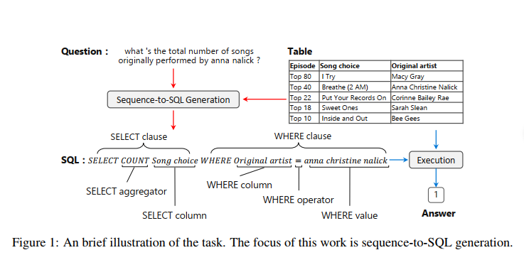
## 5. 方法概述

1. 使用Pointer Network模型来进行建模，这个模型在解码过程中使用了“拷贝”机制，即只从SQL的关键字和问句中的单词所组成的集合中选择每个时刻生成的单词，以达到减少预测空间大小的目的。在Pointer Network模型中，在每个时刻t，decoder选择问句中第i个单词xi的概率如公式1中所示：

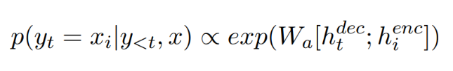（1）

a. htdec代表解码器中在第t个时间步长时的隐层状态

b. hienc代表编码器中第i个单词对应的隐层状态

2. 但是由于自然语言表达的多变性，问句中对表中内容的表述可能与表中的真实表述不一致。于是提出了模型(STAMP)如下图：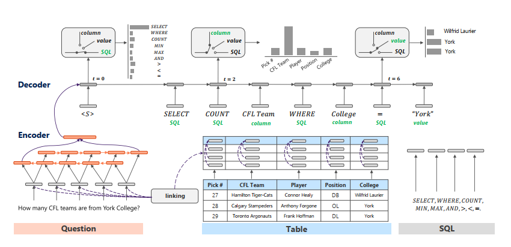

a. 这是一个序列到序列的模型，其编码器由双向的RNN组成，双向RNN的最终状态向量在首尾相连后作为解码器的初始状态。

b. 解码器则由三个通道和一个门单元组成。其中三个通道分别为Column、value、SQL通道，在每个频道中分别预测表中列名称、表中单元格名称和SQL语法关键字。三个通道中，column和value通道的候选由于由N个单词组成，所以用RNN建模，得到向量表示，而SQL通道的候选用对应的word embedding表示。在每个通道中，当前时刻生成元素的概率是由此时刻解码器RNN的状态向量和候选元素的向量表示之间通过计算相似度后归一化所得。

c. 门单元的概率输出则是直接由解码器RNN的状态向量经线性变化后经过softmax所得，其预测在每个时间节点应该选择哪个频道的预测结果作为输出。

d. 解码器在t时刻生成目标yt概率如公式2所示，其中zt代表由门单元选择的频道，pz(·)是选择频道的概率，而pw(·)类似于公式1，它是各自通道的概率输出。

    （2）

本质上每个通道都是一个注意力神经网络，对于value和SQL通道，注意力模块的输入只包含解码器的隐藏状态，计算公式如公式3

 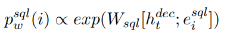（3）

a. eisql是表示sql关键字

b. htdec是解码器的隐藏状态

3. 在模型中加入了SQL语法和表结构的信息来提升性能。（主要是WHERE关键字）

a. 使用表中的单元格信息去帮助column通道的预测如公式4。将单元格的向量表示hjcell的加权求和与原列名称的向量表示hicol首尾相连，以此作为新的列名的向量表示。这个权重αjcell是由单元格中出现的单词在句子中复现的程度决定的。

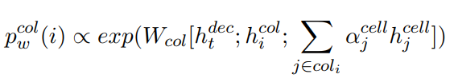（4）

b. 列名和单元格之间的关系也可以帮助value频道的预测如公式5。直观来看，要预测的单元格内容基本都出现在问句之中，所以进一步用上文中提到的由单词复现得到的权重αjcell和value通道预测的概率分布pˆwcell做一个加权求和，从而得到最终value通道道的预测概率。

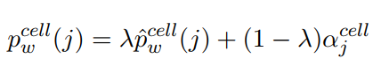（5）

## 6. 实验
数据集: wikisql,包含了61,297/9,145/17,284个训练/开发/测试样本。每个样本分别包含了一个问句、一张表、一个SQL表达式，以及问句在表中的答案。

实验结果：将精确度从69.0% 提升到74.4%

## 7. 下一步工作
计划使用更多样的监督信号学习适用于不同场景的语义分析算法。 
## 8. 原文及源码

[原文](https://arxiv.org/pdf/1804.08338.pdf) ：https://arxiv.org/pdf/1804.08338.pdf

[源码](https://github.com/thunlp/OpenNRE)


# Content Enhanced BERT-based
Text-to-SQL Generation

## 1. 作者简介
> Tong Guo1 Huilin Gao2
>
> China Electronic Technology Group Corporation Information Science Academy,<br />Beijing, China
>

## 2. 文献类型

## 3. 主要工作

1. 使用所有表格单元格的匹配信息和问题字符串来标记问题，并生成与问题长度相同的特征向量；
2. 使用所有表列名称和问题字符串的match inf来标记列，并生成与表头长度相同的特指向量。
## 4. 方法概述

1. 外部向量编码分为两步：问题特征向量和表头特征向量
   - 算法1为问句向量的构造；
   - 值1代表“开始”标签；
   - 值2代表“中间”标签；
   - 值3代表“结束”标签；

   

   - 算法2表头向量的构造（包含匹配单元格的列应该被标记）
   
   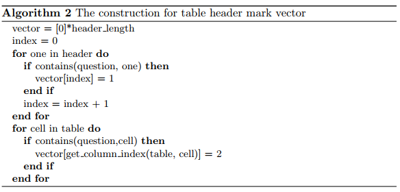
   
2. 基于wikiSQL数据集，使用三个子模型来预测SELECT part、AGG part和WHERE part。模型图如下


a. 问题和表头连接在一起作为bert的输入；

b. 将问题和表头的输出标记为Q和H；

c. bert层中：

问题列为 w1,w2,w3...wn;

表头为h1,h2,h3...hn;

即encoding [CLS]; w1; w2; :::; wn; [SEP]; h1; [SEP]; h2; [SEP]; :::; hn; [SEP]

d. SELECT column：

目标是预测表标题中的列名，输出的选择的列的可能性为计算公式1：
$$
P(sc|Q,H,QV,HV)
$$
其中QV,HV为外部特征表述向量

e. SELECT agg：

目标是预测AGG槽，输入为Q/QV，输出为计算公式2：
$$
P(sa|Q,QV)
$$
f. WHERE number：

目标是预测数量槽，输入为Q/H/QV/HV，输出为计算公式3：
$$
P(wn|Q,H,QV,HV)
$$
g. WHERE column:

目标是预测每个where条件子句中的列槽，输出为公式4：
$$
P(wc|Q,H,P_{wn},QV,HV)
$$
h. WHERE op:

目标是预测每个where条件子句中的列槽，输出为公式5：
$$
P(wo|Q,H,P_{wn},P_{wc})
$$
j. WHERE value:

目标是预测每个where条件子句中的列槽，输出为公式6：
$$
P(wv|Q,H.P_{wn},P_{wc},P_{wo},QV,HV)
$$


## 5. 实验
数据集: wikiSQL

实验结果：表头向量主要改善WHERE OP的结果，问题向量主要改善WHERE VALUE的结果。

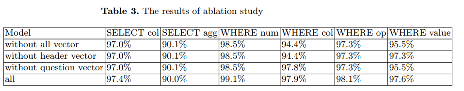

## 6. 原文及源码
[原文](https://arxiv.org/abs/1910.07179)

[源码](http://github.strcpy.cn/guotong1988/NL2SQL-BERT)


# X-SQL: reinforce schema representation with context

## 1. 作者简介
Pengcheng He, Yi Mao, Kaushik Chakrabarti, Weizhu Chen

Microsoft Dynamics 365 AI

## 2. 文献类型

## 3. 主要工作

1. 论文提出了一种新的网络体系结构x-sql；
1. x-sql提出利用bert风格的预训练模型（MT-DNN）的上下文输出来增强结构模式表示，并结合类型信息来学习用于下游任务的新模式表示；
1. 论文中模型包含三层结构，分别是SequenceEncoder、ContextEnhancedSchemaEncoder、OutputLayer

## 4. 方法描述

1. 第一层结构Sequence Encoder，在该结构中，我们为每个表增加一个empty列，然后段编码替换为类型编码，学习四个类型：question，categorial column，numerical column和empty column，使用MT-DNN初始化编码器。输出为：h_[CTX]; h_q1; · · · ; h_qn; h_[SEP]; h_C11; · · · ; h_[SEP]; h_C21; · · · h_[SEP]; · · · ; h_[EMPTY]; h[SEP]。其中问题中每一个词编码为h_qi，然后h_cij表示列i编码第j个标记，因为每个列名可能包含多个标记。
1. 第二层结构是Context Enhanced Schema Encoder结构图如下：

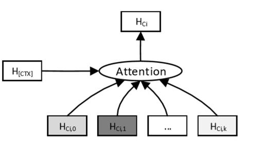

该结构用于增强在equence Encoder（序列编码器）得到的H_[CTX]，虽然在序列编码器的输出中已经捕获了某种程度的上下文，但这种影响是有限的，因为自我_关注_往往只_关注_某些区域。另一方面，[ctx]中捕获的全局上下文信息具有足够的多样性，因此用于补充序列编码器中的模式表示。通过这种方式可以捕获到哪一个查询词与哪一列最相关，从而得到增强的语义表示HCi它的计算过程如下图所示：

​                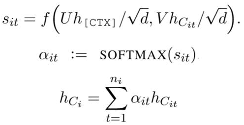

3. 第三层结构是Output Layer，它的核心是完成sql语句的生成，它将SQL语句分为六个子任务，对于每个子任务首先使用下面的子网络结构得到使用融合hci和hctx的rCi，它的模型图如下所示：

      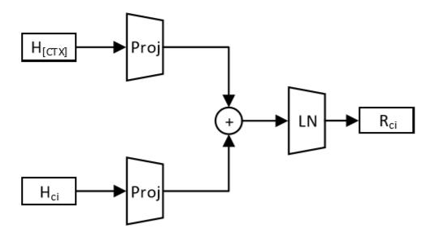

      需要注意的是每个子任务都具有一个这样的子网络，计算是针对每个子任务单独进行的，以便更好地将模式表示与每个子任务应该_关注_的自然语言问题的特定部分对齐。该子结构的计算机构如下所示：

      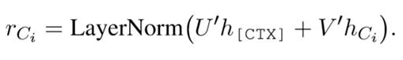

4. 接下来为6个子任务

      a. 第一个任务S-COL，这个任务表示SQL语句查询表的哪一列，我们使用前面得到的rci来完成这个子任务，使用softmax来找到最可能的列，计算公式如下所示： 

      ​                           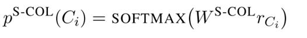

      b. 第二个子任务S-AGG，这个任务表示对第一个子任务使用什么函数操作，比如min、max，这里就需要注意我们前面提到字符串函数不可以应用min、max的问题，为了解决这个问题，我么们需要显式的将任务一得到的列类型Ectype嵌入到模型中，与其他子任务不同，我们在这里使用hci而不是rci，它的计算公式如下所示:

      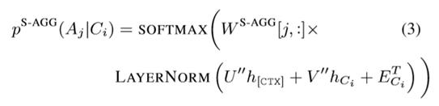

      c. 其余4个任务w-num、w-col、w-op和w-val一起决定了SQL语句的where部分，其中w-num决定了对表的几列进行约束，w-col表示对哪几列进行约束，w-op表示对这几列的操作符，比如＞、＜、＝等等，w-val表示对这几列进行约束的值。 

      d. 首先这w-col、w-op和w-val这三个任务是依赖w-num的，因为w-num决定了对几列进行约束，这样它们三个只需要取softmax最大的那几个就可以了。然后w-col和w-op也进行依赖，这个和任务二w-agg一样，字符串类型的列是不可以使用＜或者＞的，但是本论文实验过程中，这里并没有多少改善，所以我们这里可以不进行约束。

      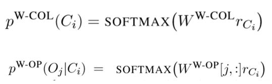

      e. 最后一个任务就是w-val，这个值是多少，只能来源于query的语句，所以这里我们预测value值在query语句中的起始位置，计算公式如下：

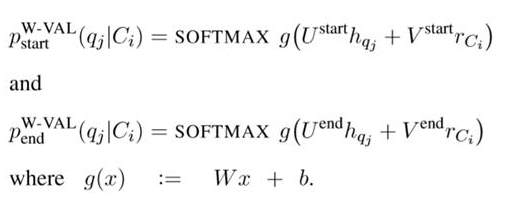


## 5. 实验和数据集
数据集：wikiSQL

实验结果：

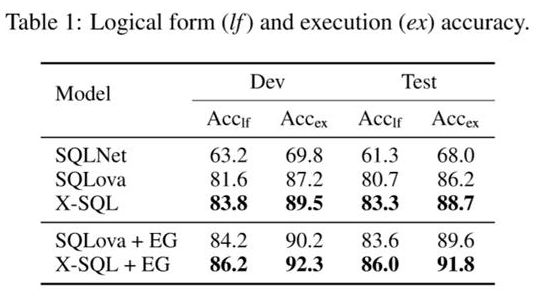

## 6. 存在问题
这是因为这个数据集只涉及到单表查询，想对来说语法比较简单，所以我们使用六个子任务就可以完成，但是如果有的数据集设计到多表联合查询，那么六个子任务是远远不够的，那么此时增加更多的子任务是否可以解决多表查询的任务，会成为负担。


# SQLNet:Generating Structured Queries From Natural Language Without Reinforcement Learning

## 1. 作者简介
> Xiaojun Xu∗
> Shanghai Jiao Tong University
> Chang Liu, Dawn Song
> University of the California, Berkeley

## 2. 文献类型
ICLR 2018

## 3. 主要贡献

1. 提出一种方法处理“序列到集合”的生成问题，避免where子句中的顺序相关
1. 提出一种全新的注意力结构，称为columns attention
1. 设计的SQLNet在WikiSQL数据集上提升了9-13个点

## 4. 方法概述

1. SQLNet 简化模型：

    输入：

   - natural language question
   - table(主要是列名)

   输出：

   - SQL query

   由于SQL query的句式具有一定的结构特点。所以SQL的生成并不是像机器翻译任务那样，而是采用像完型填空的形式填充$AGG,$Column,$OP,$VALUE(也就是预测这几个位置的值).

   SQL形式和图解如下：

   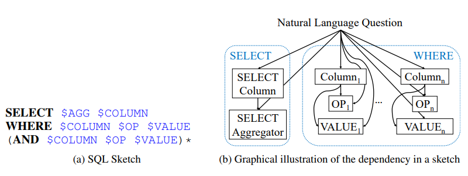

   (注意：这里一句SQL只对应于一张表) 

   ```
   AGG聚合操作：一般有五种：sum，max，min，std，count
   
   COLUMN：表中的列名 
   
   OP：有>,<,=等 
   
   VALUE:是出现在Natural Language Questing中substring。
   ```

2. 采用Column Attention的序列到集合的预测

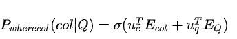

其中  和  是column名字的embedding和natural language question的embedding，他们是由两个BiLSTM的最后一个隐状态表示。注意这两个LSTM并不共享权重。

3. 引入注意力机制

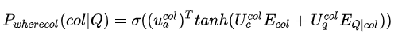

col是大小为d*d可训练矩阵，col是d维可训练向量

4. 完整模型

​    a. 预测Where子句

​        i. Where子句中的Column slot（由于Where中可能不不止一个Column所以模型先进行预测column个数）

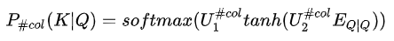

这里预测的是0-N中的一个值，而N是表中的columns数。这里K是top-k的column。文中没有说明$E_{Q|Q}$是什么估计是attention 机制，需要看代码。

​        ii. Where子句中的OP slot，预测三个操作{=,>,<} 计算：

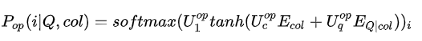

​        iii. Where子句中的VALUE slot：

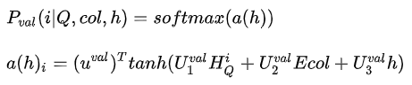

其中  是d-dimensional的训练向量，这里  _使用了column attention 机制，类似于_  的计算

​    b. 预测SELECT子句

​        i. SELECT子句中的 Column slot

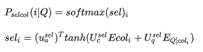

其中i 是1~C，C表示表中总列数。

​        ii. SELECT子句中的 AGG slot

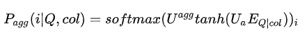


## 5. 实验

1. 注意不同slots之间不共享权重，但要共享embedding
1. 允许embedding更新，实验证明效果更好
1. 上述各个子模块都采用的标准的交叉熵loss。

数据集:wikiSQL

实验结果：

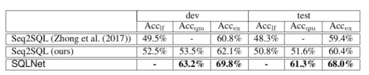

## 6. 原文及源码
[原文](https://arxiv.org/pdf/1711.04436.pdf)

[源码](https://github.com/xiaojunxu/SQLNet)


# TypeSQL: Knowledge-based Type-Aware Neural Text-to-SQL Generation

## 1. 作者简介
> [Tao Yu](https://arxiv.org/search/cs?searchtype=author&query=Yu%2C+T), [Zifan Li](https://arxiv.org/search/cs?searchtype=author&query=Li%2C+Z), [Zilin Zhang](https://arxiv.org/search/cs?searchtype=author&query=Zhang%2C+Z), [Rui Zhang](https://arxiv.org/search/cs?searchtype=author&query=Zhang%2C+R), [Dragomir Radev](https://arxiv.org/search/cs?searchtype=author&query=Radev%2C+D)

## 2. 文献类型
NAACL 2018

## 3. 主要工作

1. 提出一种新方法：TypeSQL；
1. TypeSQL采用了一种基于草图的方法，并将任务视为一个插槽填充问题；
1. TypeSQL显式地赋予每个单词类型。

## 4. 方法概述

1. 方法：

首先通过类型识别对问题输入进行预处理。 然后使用两个双向LSTM分别对问题中的单词及其类型和列名进行编码。将LSTM的输出隐藏状态用于预测SQL草图中插槽的值。

2. 模型介绍
   - 输入预处理-类型识别：将问句分割n-gram （n取2到6），并搜索数据库表、列。对于匹配成功的部分赋值column类型赋予数字、日期四种类型：INTEGER、FLOAT、DATE、YEAR。对于命名实体，通过搜索FREEBASE，确定5种类型：PERSON，PLACE，COUNTREY，ORGANIZATION，SPORT。这五种类型包括了大部分实体类型。当可以访问数据库内容时，进一步将匹配到的实体标记为具体列名（而不只是column类型）
   - 输入编码器：包含两个BI-LSTM，一个是输入query+type的编码器（左下方），另一个是表的列名的编码器（左上方）。
   - 槽填充模型：包含三个模型（右侧），（1）Model_col：预测select的列、条件的数量、条件的列；（2）Model_agg：预测聚合函数；（3）Model_opval：预测运算符、条件的取值。

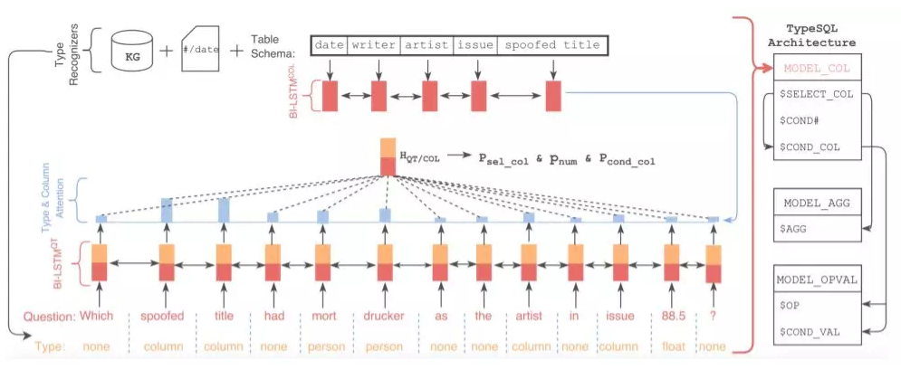

  i. 三个模型使用相同的方法来计算加权问题和类型表示形式HQT / COL（SQLNet提出）。

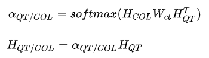

  i.  MODEL_COL模块

模块需要预测三部分：`SELECT_COL`,​ `COND_num`和`COND_COL` 这三个部分有个特点都是要结合question和表(所有列名)的特征。

预测​ `SELECT_COL`: 

​                    

预测 `COND_num`：

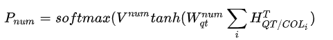

预测 `COND_COL`（这里在SQLNet中发现，SELECT_COL和COND_COL常常会预测相同的列名。所以这里作出了改变，在里面公式中新增了一个关于SELECT_COL列名的项.）：


  i.  MODEL_AGG模块

这部分与SQLNet一样，都是预测{NULL,MAX,MIN,COUNT,SUM,AVG}中的一种。

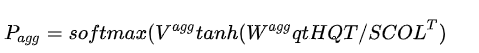

  i.  MODEL_OPVAL模块

需要预测两部分：$OP；$COND_VAL。

OP：预测{=,>,<}中的一种。

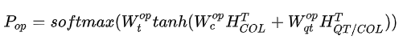

COND_VAL（借鉴了Pointernetwork的思想来从输入的Question中考虑Value里的值。）：

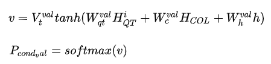

其中h是前一个生成的单词的隐状态。

## 5. 数据集
wikiSQL
## 6. 实验结果
TypeSQL达到了82.6%的正确率

## 7. 未来工作
将来，我们计划通过在数据库拆分设置下探索其他更复杂的数据集来推进这项工作。 通过这种方式，我们可以在更现实的文本到SQL任务（包括许多复杂的SQL和不同的数据库）上研究通用模型的性能。

## 8. 原文及源码
[原文](https://arxiv.org/abs/1804.09769)

[源码](https://github.com/taoyds/typesql)


# A Comprehensive Exploration on WikiSQL with Table-Aware Word Contextualization

## 1. 作者简介
> Wonseok Hwang Jinyeong Yim Seunghyun Park Minjoon Seo
> Clova AI, NAVER Corp.

## 2. 文献类型
KR2ML Workshop at NeurIPS 2019 
## 3. 主要贡献


## 4. 方法概述


## 5. 实验


## 6. 原文及源码
[原文](https://arxiv.org/abs/1902.01069)

[源码](https://github.com/naver/sqlova)


# 中文NL2SQL挑战赛

- 首届中文NL2SQL挑战赛第3名方案+代码 by beader GitHub：

  https://github.com/beader/tianchi_nl2sql

- 天池NL2SQL挑战赛冠军方案 by NUDT NLP GitHub：

  https://github.com/nudtnlp/tianchi-nl2sql-top1


# 【智能问答】从入门到放弃——DBQA与机器阅读理解

## DBQA与MRC入门

- - Abstract

  - Task of MRC

  - History of MRC

  - Dataset of MRC

  - - SQuAD
    - DuReader
    - DuReader_robust
    - CMRC 2018
    - DRCD

  - Models of MRC

  - - Stanford Attentive Reader
    - BiDAF
    - Others

  - Metric of MRC

  - Product in Clould

  - Conclusion

  - Reference

> DBQA是document-based Question and Answer 的简称，MRC是Machine Reading Comprehension机器阅读理解的简称。
> 按照个人浅薄的理解，**DBQA更加偏向于系统**，业务场景会比目前的阅读理解更复杂，**MRC则比较偏于任务本身**，用于指定内容（文档）中找答案（可以拒识）。如果简单的从文档中抽取出部分内容作为回答这个任务角度上，可以简单的把两者等价化，或者换句话说，我们可以用阅读理解的思路去实现DBQA。因此，虽然本文主要整理的是MRC也归类在问答中了（大部分参考斯坦福课程cs224n）
> PS：侧重于中文MRC，涉及论文较少（待后续补充）

### Abstract

机器阅读理解基础任务是根据问题（`Question`），在非结构化文档（`Passege`）寻找合适的答案（`Answer`）.

`MCTestReading`


通常来讲，基于文档的搜索（可以是QA）可以分为2个部分。

1. 从Query中识别特征，召回相关文档。这个过程一般成为（information retrieval），可以通过传统的信息检索/web搜索处理（tf-idf，BM25，etc...）
2. 从文档中检索出我们想要的答案，这个过程即MRC。

### Task of MRC

总的来看MRC任务大致可以分为四种类型

- **完形填空**
  该任务相对比较早，比较有代表性的有The Children’s Book Test，CMRC2017等。
- **多项选择/多项选择式**
  数据集为（文档，问题，候选答案集，答案）四元组形式，机器阅读文档和问题后，从候选答案集合中挑选正确的答案，如 MCTest 和 RACE。其中RACE 数据集源自`初高中英语考试`（英语阅读理解不好，可以学NLP，手动滑稽~）试题，包含约2.8万篇文章和10万个专家问题，用于测试机器的理解和推理能力。
- **片段抽取**
  片段抽取式任务要求从原文中抽取一段连续的句子或短语作为问题的答案，相比于完形填空任务填充单一实体，该任务面临更大的搜索空间，因此更具挑战性。SQuAD主要就是这样的问题。
- **自由作答**
  理想的境界，自由作答式阅读理解的答案形式更加灵活，正确答案可能需要从原文进行推理或归纳总结，不限制于是否来自原文句子片段，与现实人类作答习惯最为贴近。代表数据集有 CoQA、MS-MARCO、DuReader 等，通常涉及到多轮问答、多跳推理等技术。

### History of MRC

> A Brief History of Open-domain Question Answering

Simmons et al. (1964) 首先探索了如何基于匹配问题和答案的依赖关系解析，从说明性文本中回答问题
Murax(Kupiec1993) 旨在使用IR和浅层语言处理在在线百科全书上回答问题
NIST TREC QA track 始于1999年，首次严格调查了对大量文档的事实问题的回答
IBM的冒险！System (DeepQA, 2011)提出了一个版本的问题;它使用了许多方法的集合
DrQA(Chen et al. 2016)采用IR结合神经阅读理解，将深度学习引入开放领域的QA

补充：2018年以后，BERT及改进的预训练模型成为主流。

### Dataset of MRC

#### SQuAD

机器阅读理解，绕不开Stanford Question Answering Dataset（SQuAD），MRC界非常出名（最？）的评测数据集。

- `SQuAD 1.0` 所有问题都包括在文本段落中。

1. 100k examples
2. Answer must be a span in the passage
3. Extractive question answering/reading comprehension

*PS：SQuAD 1.1 评价方式改为F1&EM*

- `SQuAD 2.0` 新增了没有回答的问题。

1. Gold Answers: <No Answer>

- 局限性

1. 答案需直接截取自段落中的文字，没有是非判断、计数等问题。
2. 问题的选择依赖于段落，可能与实际中的信息获取需求不同那个。
3. 几乎没有跨句子之间的理解与推断（难！！！）

#### DuReader

> DuReader是百度发布的面向真实应用的、开放域的、最大规模的中文问答阅读理解数据集。
> 下载地址：https://ai.baidu.com/broad/introduction?dataset=dureader
> 评测地址：http://lic2019.ccf.org.cn/

主要特点如下：
（1）数据来源真实：DuReader的问题是百度搜索中用户提出的真实问题，文档来自于百度搜索和百度知道，并且答案都是人工标注的。
（2）问题类型丰富：DuReader提供了更加丰富的问题类型标注，每个问题的类型标注属于两个维度：第一个维度包括了实体类、描述类和是非类，第二个维度包括了事实类和观点类。（3）数据规模大：DuReader包含了30万问题，72万答案和150万文档。

#### DuReader_robust

> 数据集重点关注阅读理解模型在真实应用场景中的鲁棒性，挑战模型的过敏感性、过稳定性以及泛化能力等。(baidu)
> 数据下载地址：https://github.com/PaddlePaddle/Research/tree/master/NLP/DuReader-Robust-BASELINE
> 评测地址：http://lic2020.cipsc.org.cn/

该数据集共包含约21K问题，其中包括15K训练集，约1.4K领域内开发集和5K测试集。测试集包含了领域内测试集和鲁棒性测试集，其中鲁棒性测试集包括了过敏感测试集、过稳定测试集以及泛化能力测试集

#### CMRC 2018

> CMRC 2018数据集是哈工大讯飞联合实验室发布的中文机器阅读理解数据。
> 下载地址：https://github.com/ymcui/cmrc2018
> 评测地址：https://hfl-rc.github.io/cmrc2018/

该数据集聚焦于『篇章片段抽取型阅读理解』（Span-Extraction Reading Comprehension）。根据给定的一个段落和一个问题，机器需要从该段落中抽取出问题的答案。其中答案是段落中的某个连续片段，即预测答案在篇章中的起始位置和终止位置，并把对应的文本抽取出来。

#### DRCD

> DRCD（Delta Reading Comprehension Dataset）是由中国台湾台达研究院发布的面向通用领域的繁体中文机器阅读理解数据集。
> 下载地址：https://github.com/DRCKnowledgeTeam/DRCD
> 评测地址：N/A

该数据集是基于繁体中文的抽取式阅读理解数据集，其形式与SQuAD相同。该数据集中的文档来自于维基百科，包括了从2,108篇维基词条中整理出的10,014个段落，并针对这些段落标注了30,000多个问题。

### Models of MRC

#### Stanford Attentive Reader

Stanford Attentive Reader几乎是最简单的深度学习QA模型，其表现虽不及state-of-the-art模型，但是也不差，可以作为baseline。此外该模型对Attention的灵活运用也很值得学习。

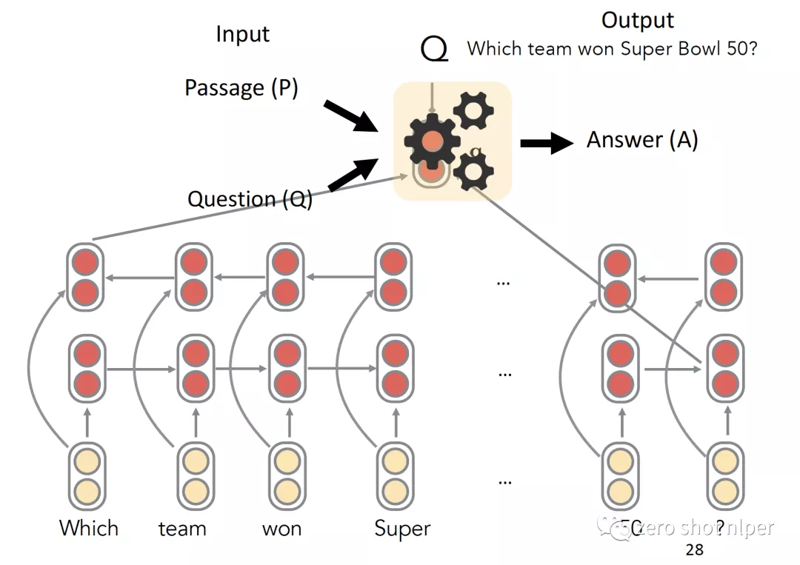

#### BiDAF

BiDAF在机器阅读理解领域所作的贡献十分的显著，提出的双向注意力机制更是成为了一种通用编码器或者推理单元基础架构中的一部分。

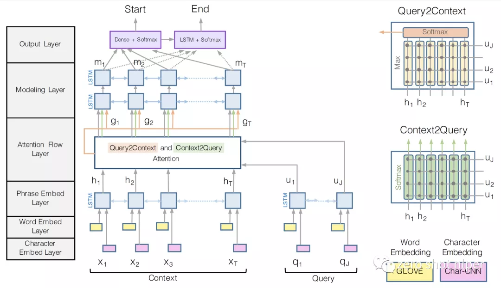

#### Others

其他还包括R-Net、DrQA（基于wiki）等，这边不一一展开，推荐斯坦福课程课件。

### Metric of MRC

目前主要的评价方式有以下几种（目前主流是EM以及F1）：

- Exact Match（EM）：即模型回答与任意一个标准答案匹配即计数为1，否则为零。统计整体的准确率。
- F1: 将标准答案与回答都算作BOW。
- 其他: 包括Bleu-4以及Rouge-L等。

### Apps of MRC (AI Could)

- 百度云
  百度云这个能力藏的比较深，在百度智能对话定制与服务平台--> 自定义技能-> 对话式文档文档。简单来说，上传文档，训练模型，即可以实现问答中问答对的抽取，事实类答案效果（如果文档中有的话）效果还好，如果不在文档中，或者文档复杂一点，答案就相对比较差了。

  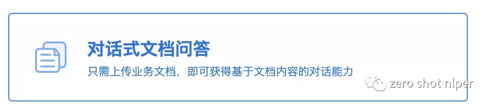

  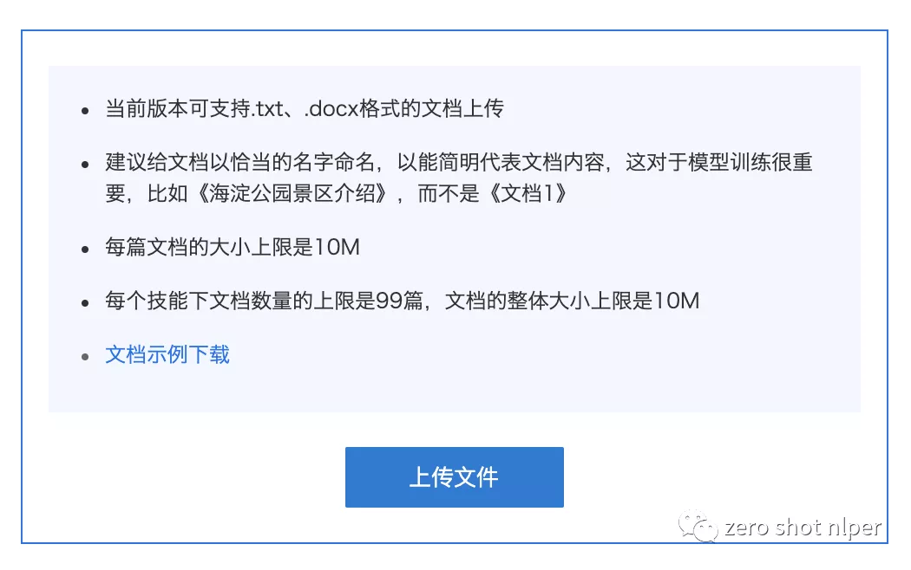

  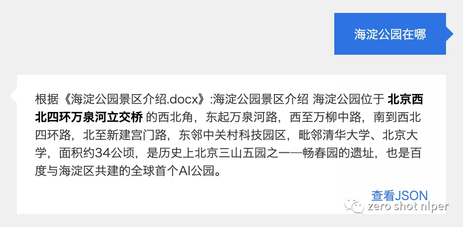

  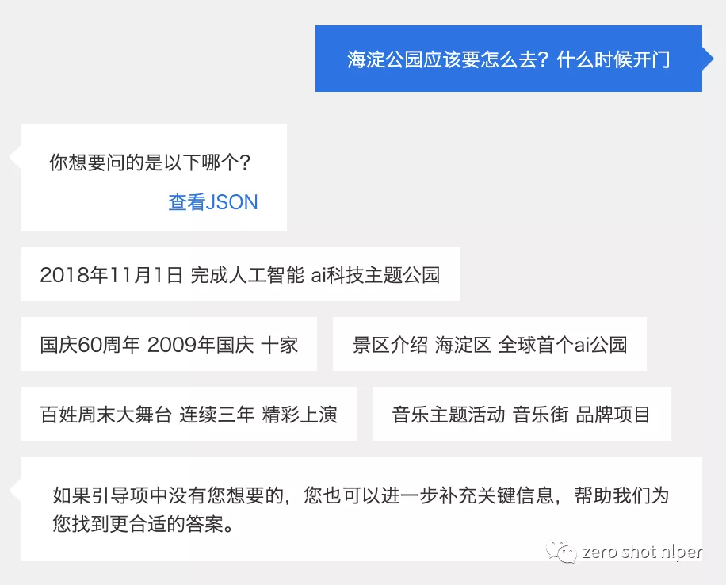

- 阿里云
  阿里目前还在公测，目测无法拿到公测资格~

  虽然名字叫MRC但是在API文档中又叫智能语义理解，包括2个功能：1、文本相似度计算。2、机器阅读理解（阿里推荐用于百科、客服类机器人）


   地址：https://cn.aliyun.com/product/iqa_mrc_pre

### Conclusion

基于MRC实现DBQA在限定领域，比如事实型检索，可以得到相对可以接受的结果。比如目前基于DuReader的SOTA，可以达到F1=82%以及EM=72%，但是对于开放领域的数据集，比如谷歌的NQ（https://ai.google.com/research/NaturalQuestions/leaderboard），截止2020-06-09，long answer SOTA的F1为77.78%，shot answer的SOTA答案为64.11%。

另外，从目前的调研结果来看，MRC整体是一个End-to-End的模型。且阅读理解目前工业应用虽然**不是特别成熟**，但是已经有头部厂商开始尝试（目测无限公测？），具体后续效果如何，拭目以待。

### Reference

- [1] CS224n: Natural Language Processing with Deep Learning (http://web.stanford.edu/class/cs224n)
- [2] Rajpurkar P , Zhang J , Lopyrev K , et al. SQuAD: 100,000+ Questions for Machine Comprehension of Text[J]. 2016.
- [3] Seo M , Kembhavi A , Farhadi A , et al. Bidirectional Attention Flow for Machine Comprehension[J]. 2016.


# 【智能问答】从入门到放弃——自然语言与数据库

- 背景

- NLP与DB的结合

- 数据库智能查询（NL2SQL）

- - NL2SQL

  - NL2SQL比赛&数据

  - - wikiSQL
    - Spider
    - 追一科技NL2SQL（2019）
    - 百度语义解析任务（2020）

  - NL2SQL产品

  - - C-Phrase（AWS云市场）
    - nlsql（app）
    - Analyza（google）
    - DBPal
    - thoughtspot【典型】
    - 阿里云 Quick BI【典型】

- 数据库性能优化

- - SQL语句智能分析

- 数据库智能分析（智能运维）

- 总结

- Reference

## 背景

> 近期笔者比较困惑，兜兜转转了一圈发现除了QA之外NLP很难在云上形成一个比较卖座的通用产品。然鹅，我司QA目前已被其他团队占坑（类似于百度的`理解与交互技术平台UNIT`），那么如何为NLP寻找足够有价值的、有技术前景的、有成就感的（~~后面两点对于血汗工厂来说，一般不重要!!!~~）的方向就摆到了面上来了。既然独立挣钱的路子走不通，那么只能考虑傍大腿了，本文即从傍大腿的角度做了一些调研与思考。
> 傍大腿，顾名思义找到云上最好卖的产品，捆绑销售！考虑到云上最卖座（最好卖）是资源类产品，云主机、硬盘之类的和NLP也没啥关系，然后兜兜转转），也就数据库这块还有一点搞头，所以本着学习的态度，怀揣着可不可以应用的动机从数据库和NLP结合角度，进行了一些粗浅的调研与分析（学术分析不到位的话，见谅~），虽然调研到最后又歪了。

## NLP与DB的结合

NLP与DB结合这块，着实找了不少时间，但是不管是国内云市场也好，相关产品也好。通过开脑洞+调研检索，发现在2个方向数据库和NLP有点关系（都是在SQL输入阶段）：

- 数据的查询检索（NL2SQL、也有叫Text2SQL的）
- 数据库的质量分析（未上线的SQL质量检查）
- 数据库的运维管理（已上线的数据库质量监控）

*PS：本处不讨论KGQA（还包括一些noSQL），主要概念有点大。虽然KG领域的QA最常用的手段之一就是Query转SPARQL，本质上其实和NL2SQL是一致的，但是除此之外KGQA还会涉及图谱构建（关系抽取、实体识别、etc...），图谱查询（实体链指、实体消歧），整体问题的复杂度会比NL2SQL的大很多，所以这边暂时不涉及，有需要的话，后续可以开多个系列讲~*

## 数据库智能查询（NL2SQL）

### NL2SQL

> 数据库的智能查询，这边主要特指NL2SQL，包括简介、具体方法、落地情况等等。

NL2SQL的起源，这边就不另外阐述了，自行百度应该能找到不少。

什么是NL2SQL，下面这种图可以很好的进行解释：

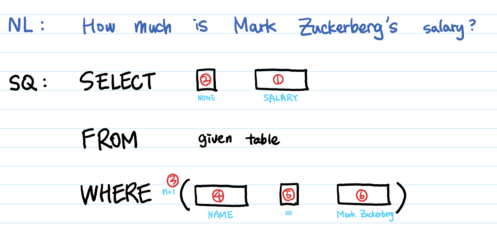

该技术最主要的功能就是将自然语言翻译为规范的、可查询的SQL语句，然后通过SQL预计进行数据查询。

通过直观的自然语言界面（你需要会编程、不需要考虑数据结构，只要会思考、会将你的想法落实到问题/要求）允许用户查找，比较，分析，操纵数据仓库中的现有信息（一般以查询分析为主）。`将数据分析学习成本降低为0！`不再需要通过excel、SQL进行数据分析

主要方法包括：基于策略模板、基于机器学习、基于机器翻译（Seq2SQL）等等。

### NL2SQL比赛&数据

> 毕竟不是无监督任务，没有数据说不过去，有了数据，不知道能做到啥样，不也是无解吗？

#### wikiSQL

WikiSQL是Salesforce在2017年提出的一个大型标注NL2SQL数据集，也是目前规模最大的NL2SQL数据集。其中包含了26,375张表、87,726条自然语言问句及相应的SQL语句。下图是其中的一条数据样例，包括一个table、一条SQL语句及该条SQL语句所对应的自然语言语句。

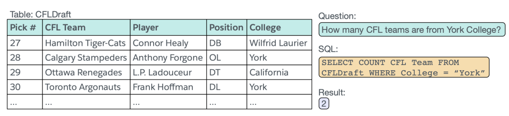

目前最高的效果（基于监督学习）可以达到92.2%，弱监督可以达到83.9%：
地址：https://github.com/salesforce/WikiSQL


#### Spider

Spider是耶鲁大学在2018年新提出的一个较大规模的NL2SQL数据集，最大的特点是引入了更多的SQL问法，比如group by，Order by。甚至还包括Join，更加贴近于真实场景，带来的问题就是准确率被极大的降低了，目前最高的准确率只有62.2%。


#### 追一科技NL2SQL（2019）

首届中文NL2SQL挑战赛，使用金融以及通用领域的表格数据作为数据源，提供在此基础上标注的自然语言与SQL语句的匹配对，因为NL2SQL本身算是偏冷门的研究领域

该任务甚至比wikiSQL还要简单，总体来说准确率也非常高，第一名达到了92.2%。


#### 百度语义解析任务（2020）

提供大规模开放领域的复杂中文Text-to-SQL数据集（目前来说，应该是最大的中文SQL类的数据集了），难度相对于去年2019年的难度要大不少，最终准确率在76%左右。

为了验证泛化能力，还包括了数据库无关性、表无关性，每个Database包含若干张表格（2-11张，平均4.1张），表与表之间还存在链接操作（这是向Spider靠齐了~）


### NL2SQL产品

> 没有产品说个鬼，总不能停留在理论层面吧，本文从商用角度找应用产品（并没有列全，列出了部分，有兴趣的大家可以自己进行检索）

#### C-Phrase（AWS云市场）

关键词检索NLP&DB，这个是唯一能够检索到的（独苗啊！），简单来说，这个产品就是可以通过自然语言对数据库进行插入、查询，用户不需要知道select语句怎么写，就能够实现数据的插入，更新等。
PS：标签是Business Applications、Machine learing


#### nlsql（app）

https://www.nlsql.com/solutions/
也是非常费劲才找到的，产品形态就是问答机器人（app），可以实现数据库的查询，点出了不少应用点。比如：Healthcare BI、Natural Language Interface for SAP、HR Analytics 


#### Analyza（google）

2017年谷歌发布的一款基于表格（可以是电子表格/数据库表格）中实现自然语言查询与分析的一款产品。

PS：图片引自Analyza


#### DBPal

论文的产物，不过最近一篇还提供弱监督的方法，没有体验过，不好评价，总得来说，还是定位为数据探索工具。18年开始发布工具，19年为弱监督工具，20年变成了可插拔的Pipeline训练工具。

#### thoughtspot【典型】

用户无需关心数据、无需关心报表格式等一切问题，只需要告诉thoughtspot，自己想要的数据，thoughtspot就会马上给出答案


#### 阿里云 Quick BI【典型】

智能小Q，如果不是从增强分析、检索到阿里云的Quick BI、然后再检索还真是不好找（典型的数据增强应用场景，划个重点，后续再研究研究，文档的最近更新日期是2019年10月份）。


## 数据库性能优化

#### SQL语句智能分析

对SQL语句结合DB的数据，索引进行分析，并给出具体建议。
比如：SOAR(SQL Optimizer And Rewriter) 是一个对 SQL 进行优化和改写的自动化工具。由小米人工智能与云平台的数据库团队开发与维护。


感觉人家已经做了不少了，需要大量技术积累。

## 数据库智能分析（智能运维）

包括访问控制、访问统计、健康检查、健康度、流量监控、故障定位、业务异常等，智能运维监控系统最终形成了一个监控闭环，包含问题发现、分析决策和问题的解决，具体的组成包括异常检测、报警收敛、关联分析、故障定位和自动处理五部分内容。

PS：内容有点大，和ML的关系更大，其中和NLP有关系的，类似于构建智能知识库（决策库），用于辅助解决，这部分不单独列出

## 总结

NLP与数据库的结合总体来看，`NL2SQL相对比较有应用市场`，且是和NLP关联度比较高的应用点，其他的其实和业务关联度比较高（偏智能运维、偏ML）。

而NL2SQL目前主要的应用场景在**`增强分析`**场景，引用Gartner 2020年最新发布的魔力象限报告的话来说：增强型分析功能是 BI 产品发展的最重要、也是最显著的发展趋势之一。

其实这也比较容易理解：当前企业使用的数据的规模和复杂度已经逐渐超过人类可以处理的程度，静态报表、仪表板等传统工具已经不能满足需求，智能分析场景可以让我们更快速的对数据进行分析，增强分析确实是一个比较好的场景（额，结论好像歪楼了，和数据库关系没有那么直接了~~）

## Reference

1. Victor Zhong, Caiming Xiong, and Richard Socher. 2017. Seq2SQL: Generating Structured Queries from Natural Language using Reinforcement Learning.
2. Weir N, Utama P, Galakatos A, et al. DBPal: A Fully Pluggable NL2SQL Training Pipeline[C]//Proceedings of the 2020 ACM SIGMOD International Conference on Management of Data. 2020: 2347-2361.
3. Basik F, Hättasch B, Ilkhechi A, et al. DBPal: A learned NL-interface for databases[C]//Proceedings of the 2018 International Conference on Management of Data. 2018: 1765-1768.
4. Weir N, Utama P, Galakatos A, et al. DBPal: A Fully Pluggable NL2SQL Training Pipeline[C]//Proceedings of the 2020 ACM SIGMOD International Conference on Management of Data. 2020: 2347-2361.
5. https://hackernoon.com/how-to-use-nlp-to-sql-api-i31tu30cc
6. https://yale-lily.github.io/spider
7. https://github.com/XiaoMi/soar


# 【知识图谱】从入门到放弃——KBQA数据整理

- CCKS KBQA相关数据调研

- - PKUBASE图谱数据说明

  - - 原始数据说明
    - neo4j格式数据说明

  - CCKS2019 Task6 数据说明

  - CCKS2020 实体链指数据说明

## PKUBASE图谱数据说明

### 原始数据说明

> pkubase-complete.txt
> 以三元组的形式存储

```
<美国奥可斯（香港）国际控股集团>        <类型>  <文学作品> .
<美国奥可斯（香港）国际控股集团>        <类型>  <文化> .
<寻美中国>      <类型>  <品牌> .
<青春是我和你一杯酒的深>        <类型>  <文学作品> .
<青春是我和你一杯酒的深>        <类型>  <网络小说> .
<青春是我和你一杯酒的深>        <类型>  <小说作品> .
<青春是我和你一杯酒的深>        <类型>  <小说> .
<青春是我和你一杯酒的深>        <类型>  <娱乐作品> .
<青春是我和你一杯酒的深>        <类型>  <书籍> .
<青春是我和你一杯酒的深>        <类型>  <中国文学> .
```


### neo4j格式数据说明

我们认为所有节点都是实体。
三元组的关系为：`Entity1`,`Relation`,`Entity2`
将三元组拆分为neo4j可以导入的格式，包括实体集合以及关系集合。

> node.csv

```
id:ID,name,:LABEL
1,<美国奥可斯（香港）国际控股集团>,Entity
2,<文学作品>,Entity
3,<文化>,Entity
4,<寻美中国>,Entity
5,<品牌>,Entity
6,<青春是我和你一杯酒的深>,Entity
7,<网络小说>,Entity
8,<小说作品>,Entity
9,<小说>,Entity
```

> relation.csv

```
:START_ID,:END_ID,:TYPE,name
1,2,Relation,<类型>
1,3,Relation,<类型>
3370673,25574421,Relation,<openkg_uri>
1183059,25574422,Relation,<openkg_uri>
25449392,25574423,Relation,<openkg_uri>
4601818,25574424,Relation,<openkg_uri>
7221504,25574425,Relation,<openkg_uri>
```

顺便提一下在验证CCKS2019第四名方案的时候导入neo4j的时候发现的一个坑。

- 数据的key长度超长无法建node索引

- - 导致问题：查询时间超长，约5s以上
  - 建议方案：1、将长度超过64(看neo4j字段说明8K以内即可)的node节点单独拉出来作为LongEntity。2、将以引号开头的节点作为Attribute。
  - 最终效果:


## CCKS2019 Task6 数据说明

数据主要分为3段式，包括问句ID&问句文本、SPARQL、答案，`example:`

```
q1:莫妮卡·贝鲁奇的代表作？
select ?x where { <莫妮卡·贝鲁奇> <代表作品> ?x. }
<西西里的美丽传说>
```

SPARQL语法规范：https://www.w3.org/TR/rdf-sparql-query/

## CCKS2020 实体链指数据说明

此次任务的输入输出定义如下：

输入：中文短文本以及该短文本中的实体集合（即实体提及已经做完了！）
输出：输出文本此中文短文本的实体链指结果。每个结果包含：实体 mention、在中文短文本中的位置偏移、其在给定知识库中的 id，如果为 NIL 情况，需要再给出实体的上位概念类型。

```json
{
    "text_id":"1",
    "text":"《琅琊榜》海宴_【原创小说|权谋小说】",
    "mention_data":[
        {
            "mention":"琅琊榜",
            "offset":"1"
        },
        {
            "mention":"海宴",
            "offset":"5"
        },
        {
            "mention":"原创小说",
            "offset":"9"
        },
        {
            "mention":"权谋小说",
            "offset":"14"
        }
    ]
}
```

输出实体为：

```json
{
    "text_id":"1",
    "text":"《琅琊榜》海宴_【原创小说|权谋小说】",
    "mention_data":[
        {
            "kb_id":"2135131",
            "mention":"琅琊榜",
            "offset":"1"
        },
        {
            "kb_id":"10572965",
            "mention":"海宴",
            "offset":"5"
        },
        {
            "kb_id":"215143",
            "mention":"原创小说",
            "offset":"9"
        },
        {
            "kb_id":" NIL_Work ",
            "mention":"权谋小说",
            "offset":"14"
        }
    ]
}
```

上位实体概念：即对不在图谱中的数据进行基本实体类型识别。比如：`NIL_WORK`。
部分概念如下，具体见百度竞赛任务书：https://www.biendata.xyz/competition/ccks_2020_el/


# 【智能问答】从入门到放弃——NLP与增强分析

背景与概述

- 什么是增强分析
- NLP的增强分析场景

NLP增强分析技术

- NL2SQL

- linguistic schema

- - 文本纠错技术
  - 知识图谱技术（增强类技术）

- NLG（场景待深入调研）

典型产品技术汇总

- Quick BI
- Power BI
- 帆软FineBI

方案总结

附录

Reference


> 如前文提到的NLP与BI的结合主要还在于增强分析，那么增强分析是什么，以及如果将NLP使用到增强分析里面去呢？这就是本文要进行讨论的。

## 背景与概述

> 增强分析是做什么的？自然语言处理与增强分析有什么关系？

`BI是什么`：Gartner将BI定义为一个概括性术语（Umbrella Term），泛指业务分析中用到的工具、基础设施设备、程序与软件，通过获取和处理数据，进而分析数据，获取有价值的信息以改进并优化决策和绩效，指导各种商业行为。
BI的本质是技术和工具和商业逻辑的结合，通过处理原始数据，以商务逻辑分析数据，为商业运营提供基于历史、当下和未来的分析视角，形成对商业行为有价值的洞察（insight）。

`传统BI场景`：由专业的业务分析师定制需要分析的项目，通过技术人员开发实施各种分析查询报表和报告等功能，然后部署成系统，最终发布给业务人员使用。
`敏捷BI场景`：也称之为自助式BI，数据分析的主角由专业的数据分析师、研发人员转变为没有技术基础的业务人员。

### 什么是增强分析

`增强分析`：Gartner在2017年[1]提出了“增强分析（Augmented Analytics）”这个概念，“增强分析”被誉为数据与分析市场内的下一波颠覆性技术，是数据分析的未来。

简单的来说，增强分析就是AI+BI，使用机器学习（包括自然语言处理）的手段来提高分析的效率以及效果。

- `增强数据准备`：包括自动化数据集成和数据湖（关于数据仓库、数据湖可以参考附录1）管理，简而言之就是简化了数据准备阶段的难度。可通过拖拉拽的方式实现多表、多数据库的数据映射，通过增强分析将一个个数据孤岛链接了起来，在终端上就可以完成数据的全流程获取。（结合了ETL以及数据管理）
- `增强商务智能（ML+NLP）`：此处商务智能增强的主要对象是指一般业务员（或者成为民间科学家），他们不需要是专业的统计分析领域的专家。增强分析能够实现自动的寻找数据之间的相关规律，并将结果可以以可视化的方式展示出来，从而可以让业务人员通过界面实现数据的探索、通过自然语言的方式实现重要数据的查找与展示，`简单来说，可以为业务员提供更广阔的数据洞察与探索空间`。
- `增强模型分析（ML+DM）`：这部分主要指的是，模型的分析能力的增强，能够实现模型的自动化建模、特征的自动选择等，让业务员更精于业务，让数据分析专家更精于研究创造性的模型。`或者说提供各种常见的业务分析算法，能够为业务员提供更多的数据分析纬度，而数据分析专家只需要提供更准确的分析手段即可`。

### NLP的增强分析场景

`场景1`：用户可以通过自然语言进行数据模型的建模，这种方式可以有更强的解释性。（当可选数据类型有成百上千个的时候，采用筛选与拖拉拽的方式也会显得很低效）。

`场景2`：手机端、移动端如何进行快速的数据分析呢？手机端很难提供一个完全版本的客户端，各种拖拉拽也相对比较麻烦，使用NLP交互，很显然可以提供更好的交互分析方式，用户可以通过手机端，移动端进行快速的数据分析，数据浏览。

`场景3`：现有政企单位内部（领导一般都喜欢看）、展会的信息展示，都非常喜欢大屏展示。但是单个大屏可以显示的内容相对比较有限，而实际显示的时候也不可以通过鼠标来回选择你想知道什么，那么通过语音的方式实现对大屏数据进行交互展示是否更酷呢？

`场景4`：可以预定义（发布与检索）各种分析组合，通过自然语言的方式可以一键式的进行查询与展示。比如业务员A做好了业务经营报表，发出出来之后，业务员B可以通过描述检索到相关的报表，从而不需要从头开始对数据进行分析与处理。

## NLP增强分析技术与场景

> 说了那么多BI的增强分析，那么自然语言处理如何落到增强分析的场景里面去呢？

### NL2SQL

> 简单来说就是将自然语言转换为SQL语句

比如在Text2SQL的比赛中有这样一句话[2]: `按作品数量降序给出在1812年2月7号之后出生作者姓名以及国籍`
转换成的SQL为：`select 姓名 , 国籍 from 作者 where 出生日期 > '1812-02-07' order by 作品数量 desc`

最常见的Baseline就是曾经wikiSQL[3]的SOTA模型X-SQL[4]，简单来说，就是以wikiSQL数据集为例，为SQL设计了一种结构化（模板）表示方法，将SQL语句进行了拆分如下:

- 使用sel定义查询目标列，其值是表格中对应列的序号；
- 使用agg定义聚合操作的编号，可能出现的聚合操作有['', 'MAX', 'MIN', 'COUNT', 'SUM', 'AVG']共6种；
- 使用conds定义筛选条件，可以有多个。每个条件用一个三元组(column_index, operator_index, condition)表示，可能的operator_index共有['=', '>', '<', 'OP']四种。


PS：此处不详细讨论NL2SQL细节，另外纯粹的使用模型在实际落地中是不靠谱的，可以增加文本解析等技术增强NL2SQL的问答能力[5]。

### linguistic schema

> 这部分的定义主要参考了PowerBI，总体来说就是通过各种语法、语义上的技术实现对能力的增强。

#### 文本纠错技术

也可以称为语义词典，在实际的问题中，存在专有名词，但是数据库中的词表与现有的名词无法对应起来，尤其对于中文来说，专业词典可以更有效的辅助分词的准确。一般对于数据问答来说，专业词典可以有效提高召回。

#### 知识图谱技术（增强类技术）

数据湖中的数据之间相互之间是如何关联的？数据表和数据表之间存在什么样的关系？如果没有知识图谱，相互之间的关系就只能是一种关系，无法定义多种关系的结合。

简单来说，如果存在N张数据表，那么如果你想知道一家公司的发展趋势，那么发展趋势和哪些指标能够关联起来？如果统计了按月的时间粒度公司GDP的发展趋势，如何引申到其他类型的指标呢？

知识图谱可以定义指标与指标之间的关系，通过预先关系的定义可以实现相关分析纬度的推荐，相关分析的洞察。

### NLG（场景待深入调研）

对于已经生成的图来说，如何通过图生成自然语言描述？这部分涉及到自然语言生成（NLG）技术。

最简单的自然语言生成技术即模板，通过预定义大量模板，将趋势信息，特征信息进行填充，从而可以实现描述信息生成。

其他相关待研究（其实是暂时想不到~）

## 典型产品技术汇总

### Quick BI

Quick BI需要指定数据源（初步来看，未看到可以映射表间关系），可以定制同义词，此外还可以配置推荐问答（常用为问题推荐，没有看到和QA的关系）。整体还处于初步阶段。


### Power BI

PowerBI提供了NLP组件，可以使用自然语言的形式生成图标，此外组件还提供了自定义词表，以及问题回顾与纠错的功能。（这部分和完整的QA很相似）


### 帆软FineBI

目前并未看到使用NLP。国内帆软主要还是以拖拉拽的方式满足用户数据分析需求。

## 方案总结

NLP在BI领域的应用主要还是集中在基于问答的数据查询与分析（也可以理解为NL2SQL）。从BI产品的本身的定位来说，当数据量（或者说字段数）不大的情况下，基于NLP的问答可能有一些多余，但是当数据结构越是复杂，相关数据越多的情况下，基于问答的数据分析则更加简单有效，NLG的应用目前没有找到，可能找的资料不够多，后续如果遇到的话会补充。

## 附录

1. 数据仓库、数据湖的概念：https://zhuanlan.zhihu.com/p/150478169

## Reference

1. https://www.gartner.com/en/documents/3773164/augmented-analytics-is-the-future-of-data-and-analytics
2. https://aistudio.baidu.com/aistudio/competition/detail/30?isFromCcf=true
3. Hwang W, Yim J, Park S, et al. A comprehensive exploration on wikisql with table-aware word contextualization[J]. arXiv preprint arXiv:1902.01069, 2019.
4. He P, Mao Y, Chakrabarti K, et al. X-SQL: reinforce schema representation with context[J]. arXiv preprint arXiv:1908.08113, 2019.
5. https://zhuanlan.zhihu.com/p/90170864
6. https://zhuanlan.zhihu.com/p/150478169


