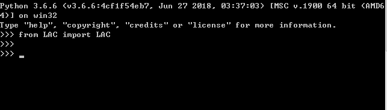
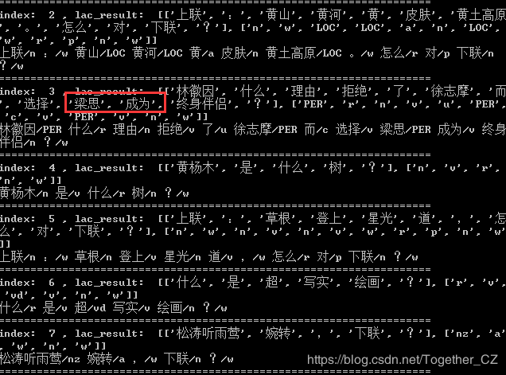
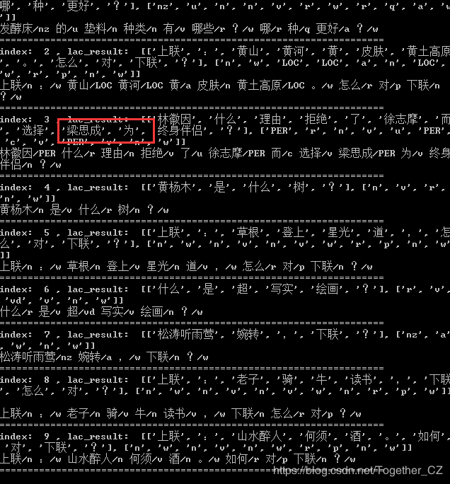
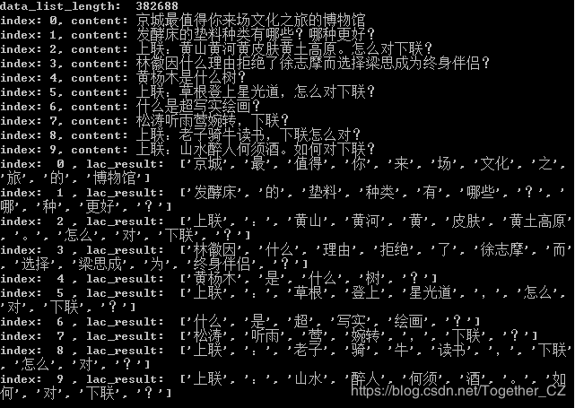

### 基于百度开源项目LAC实现文本分词、词性标注和命名实体识别

文本分词、词性标注和命名实体识别都是自然语言处理领域里面很基础的任务，他们的精度决定了下游任务的精度，今天在查资料的时候无意间发现了一个很好玩的开源项目，具体查了一下才知道这是百度开源的一个主要用于词性标注和命名实体识别的项目，决定拿来尝试一下。

首先是项目环境的配置安装，当前已经支持一键式安装了，具体命令如下所示：

```
python -m pip install LAC
```

简单进行一下安装验证，成功截图如下所示：



接下来就可以进行使用了，官方GitHub地址在这里`https://github.com/baidu/lac`。官方给出来的一些讲解如下所示：

#### 工具介绍

LAC全称`Lexical Analysis of Chinese`，是百度自然语言处理部研发的一款联合的词法分析工具，实现中文分词、词性标注、专名识别等功能。该工具具有以下特点与优势：

效果好：通过深度学习模型联合学习分词、词性标注、专名识别任务，整体效果F1值超过0.91，词性标注F1值超过0.94，专名识别F1值超过0.85，效果业内领先。

效率高：精简模型参数，结合Paddle预测库的性能优化，CPU单线程性能达800QPS，效率业内领先。

可定制：实现简单可控的干预机制，精准匹配用户词典对模型进行干预。词典支持长片段形式，使得干预更为精准。

调用便捷：支持一键安装，同时提供了Python、Java和C++调用接口与调用示例，实现快速调用和集成。

支持移动端: 定制超轻量级模型，体积仅为2M，主流千元手机单线程性能达200QPS，满足大多数移动端应用的需求，同等体积量级效果业内领先。

#### 安装与使用

在此我们主要介绍Python安装与使用，其他语言使用：

```
C++
JAVA
Android
```

#### 安装说明

代码兼容`Python2/3`

全自动安装: `pip install lac`

半自动下载：先下载`http://pypi.python.org/pypi/lac/`，解压后运行`python setup.py install`

安装完成后可在命令行输入`lac`或`lac --segonly`启动服务，进行快速体验

国内网络可使用百度源安装，安装速率更快：`pip install lac -i https://mirror.baidu.com/pypi/simple`

#### 功能与使用

分词

代码示例：

```python
from LAC import LAC
 
# 装载分词模型
lac = LAC(mode='seg')
 
# 单个样本输入，输入为Unicode编码的字符串
text = u"LAC是个优秀的分词工具"
seg_result = lac.run(text)
 
# 批量样本输入, 输入为多个句子组成的list，平均速率会更快
texts = [u"LAC是个优秀的分词工具", u"百度是一家高科技公司"]
seg_result = lac.run(texts)
```

输出：

【单样本】：seg_result = [LAC, 是, 个, 优秀, 的, 分词, 工具]

【批量样本】：seg_result = [[LAC, 是, 个, 优秀, 的, 分词, 工具], [百度, 是, 一家, 高科技, 公司]]

#### 词性标注与实体识别

代码示例：

```python
from LAC import LAC
 
# 装载LAC模型
lac = LAC(mode='lac')
 
# 单个样本输入，输入为Unicode编码的字符串
text = u"LAC是个优秀的分词工具"
lac_result = lac.run(text)
 
# 批量样本输入, 输入为多个句子组成的list，平均速率更快
texts = [u"LAC是个优秀的分词工具", u"百度是一家高科技公司"]
lac_result = lac.run(texts)
```

输出：

每个句子的输出其切词结果word_list以及对每个单词的标注tags_list，其格式为（word_list, tags_list)

```python
【单样本】：lac_result = ([百度, 是, 一家, 高科技, 公司], [ORG, v, m, n, n])
【批量样本】：lac_result = [
                    ([百度, 是, 一家, 高科技, 公司], [ORG, v, m, n, n]),
                    ([LAC, 是, 个, 优秀, 的, 分词, 工具], [nz, v, q, a, u, n, n])
                ]
```

词性和专名类别标签集合如下表，其中我们将最常用的4个专名类别标记为大写的形式：

```python
标签 含义 标签 含义 标签 含义 标签 含义
n 普通名词 f 方位名词 s 处所名词 nw 作品名
nz 其他专名 v 普通动词 vd 动副词 vn 名动词
a 形容词 ad 副形词 an 名形词 d 副词
m 数量词 q 量词 r 代词 p 介词
c 连词 u 助词 xc 其他虚词 w 标点符号
PER 人名 LOC 地名 ORG 机构名 TIME 时间
```

#### 定制化功能

在模型输出的基础上，LAC还支持用户配置定制化的切分结果和专名类型输出。当模型预测匹配到词典的中的item时，会用定制化的结果替代原有结果。为了实现更加精确的匹配，我们支持以由多个单词组成的长片段作为一个item。

我们通过装载词典文件的形式实现该功能，词典文件每行表示一个定制化的item，由一个单词或多个连续的单词组成，每个单词后使用'/'表示标签，如果没有'/'标签则会使用模型默认的标签。每个item单词数越多，干预效果会越精准。

#### 词典文件示例

这里仅作为示例，展现各种需求情况下的结果。后续还将开放以通配符配置词典的模式，敬请期待。

```python
春天/SEASON
花/n 开/v
秋天的风
落 阳
```

代码示例

```python
from LAC import LAC
lac = LAC()
 
# 装载干预词典
lac.load_customization('custom.txt')
 
# 干预后结果
custom_result = lac.run(u"春天的花开秋天的风以及冬天的落阳")
```

以输入“春天的花开秋天的风以及冬天的落阳”为例，原本输出结果为：

```python
春天/TIME 的/u 花开/v 秋天/TIME 的/u 风/n 以及/c 冬天/TIME 的/u 落阳/n
```

添加示例中的词典文件后的结果为：

```python
春天/SEASON 的/u 花/n 开/v 秋天的风/n 以及/c 冬天/TIME 的/u 落/n 阳/n
```

#### 增量训练

我们也提供了增量训练的接口，用户可以使用自己的数据，进行增量训练，首先需要将数据转换为模型输入的格式，并且所有数据文件均为"UTF-8"编码：

##### 1. 分词训练

数据样例

与大多数开源分词数据集格式一致，使用空格作为单词切分标记，如下所示：

```python
LAC 是 个 优秀 的 分词 工具 。
百度 是 一家 高科技 公司 。
春天 的 花开 秋天 的 风 以及 冬天 的 落阳 。
```

代码示例

```python
from LAC import LAC
 
# 选择使用分词模型
lac = LAC(mode = 'seg')
 
# 训练和测试数据集，格式一致
train_file = "./data/seg_train.tsv"
test_file = "./data/seg_test.tsv"
lac.train(model_save_dir='./my_seg_model/',train_data=train_file, test_data=test_file)
 
# 使用自己训练好的模型
my_lac = LAC(model_path='my_seg_model')
```

##### 2. 词法分析训练

样例数据

在分词数据的基础上，每个单词以“/type”的形式标记其词性或实体类别。值得注意的是，词法分析的训练目前仅支持标签体系与我们一致的数据。后续也会开放支持新的标签体系，敬请期待。

```
LAC/nz 是/v 个/q 优秀/a 的/u 分词/n 工具/n 。/w
百度/ORG 是/v 一家/m 高科技/n 公司/n 。/w
春天/TIME 的/u 花开/v 秋天/TIME 的/u 风/n 以及/c 冬天/TIME 的/u 落阳/n 。/w
```

代码示例

```python
from LAC import LAC
 
# 选择使用默认的词法分析模型
lac = LAC()
 
# 训练和测试数据集，格式一致
train_file = "./data/lac_train.tsv"
test_file = "./data/lac_test.tsv"
lac.train(model_save_dir='./my_lac_model/',train_data=train_file, test_data=test_file)
 
# 使用自己训练好的模型
my_lac = LAC(model_path='my_lac_model')
```

接下来，我们基于自己的数据集来编写一些有意思的功能，其实在做命名实体识别的时候我突然想到，这个模块可以代替人工自动生成有标注的数据集用于NER模型的训练，当然了这里自动生成的数据集可能是不准确的，大致是准确的，主要是想节省人工标注的成本。

首先是加载本地数据集，代码实现如下所示：

```python
def loadData(data='toutiao_news_dataset.txt'):
    '''
    加载本地数据集
    '''
    with open(data,encoding='utf-8') as f:
        data_list=[one.strip().split('#') for one in f.readlines() if one.strip()]
    print('data_list_length: ',len(data_list))
    for i in range(10):
        print('index: '+str(i)+', content: '+data_list[i][-1])
    return data_list
```

数据集样例数据如下所示：

```python
房产#。。。。。。。。。。。。。。。。。。。。。
房产#。。。。。。。。。。。。。。。。。。。。。
房产#。。。。。。。。。。。。。。。。。。。。。
汽车#。。。。。。。。。。。。。。。。。。。。。
汽车#。。。。。。。。。。。。。。。。。。。。。
汽车#。。。。。。。。。。。。。。。。。。。。。
```

由于官方审核限制，这里的数据集内容替换成了省略号。

接下来我们随机挑选数据集进行命名实体识别，代码实现如下所示：

```python
def NERModel(data_list):
    '''
    词性标注与命名实体识别
    结果实例：
             [['京城', '最', '值得', '你', '来', '场', '文化', '之', '旅', '的', '博物馆'], ['nz', 'd', 'v', 'r', 'v', 'q', 'n', 'u', 'n', 'u', 'n']]
    '''
    lac = LAC(mode='lac')
    texts = [one[-1] for one in data_list]
    lac_result = lac.run(texts)
    for i in range(10):
        print('index: ',str(i),', lac_result: ',lac_result[i])
        words, tags = lac_result[i]
        print(u" ".join(u"%s/%s" % (word, tag) for word, tag in zip(words, tags)))
        print('====================================================================')
```

结果如下所示：

```python
data_list_length:  382688
index: 0, content: 京城最值得你来场文化之旅的博物馆
index: 1, content: 发酵床的垫料种类有哪些？哪种更好？
index: 2, content: 上联：黄山黄河黄皮肤黄土高原。怎么对下联？
index: 3, content: 林徽因什么理由拒绝了徐志摩而选择梁思成为终身伴侣？
index: 4, content: 黄杨木是什么树？
index: 5, content: 上联：草根登上星光道，怎么对下联？
index: 6, content: 什么是超写实绘画？
index: 7, content: 松涛听雨莺婉转，下联？
index: 8, content: 上联：老子骑牛读书，下联怎么对？
index: 9, content: 上联：山水醉人何须酒。如何对下联？
index:  0 , lac_result:  [['京城', '最', '值得', '你', '来', '场', '文化', '之',
 '旅', '的', '博物馆'], ['nz', 'd', 'v', 'r', 'v', 'q', 'n', 'u', 'n', 'u', 'n']
]
京城/nz 最/d 值得/v 你/r 来/v 场/q 文化/n 之/u 旅/n 的/u 博物馆/n
====================================================================
index:  1 , lac_result:  [['发酵床', '的', '垫料', '种类', '有', '哪些', '？', '
哪', '种', '更好', '？'], ['nz', 'u', 'n', 'n', 'v', 'r', 'w', 'r', 'q', 'a', 'w
']]
发酵床/nz 的/u 垫料/n 种类/n 有/v 哪些/r ？/w 哪/r 种/q 更好/a ？/w
====================================================================
index:  2 , lac_result:  [['上联', '：', '黄山', '黄河', '黄', '皮肤', '黄土高原
', '。', '怎么', '对', '下联', '？'], ['n', 'w', 'LOC', 'LOC', 'a', 'n', 'LOC',
'w', 'r', 'p', 'n', 'w']]
上联/n ：/w 黄山/LOC 黄河/LOC 黄/a 皮肤/n 黄土高原/LOC 。/w 怎么/r 对/p 下联/n
？/w
====================================================================
index:  3 , lac_result:  [['林徽因', '什么', '理由', '拒绝', '了', '徐志摩', '而
', '选择', '梁思', '成为', '终身伴侣', '？'], ['PER', 'r', 'n', 'v', 'u', 'PER',
 'c', 'v', 'PER', 'v', 'n', 'w']]
林徽因/PER 什么/r 理由/n 拒绝/v 了/u 徐志摩/PER 而/c 选择/v 梁思/PER 成为/v 终身
伴侣/n ？/w
====================================================================
index:  4 , lac_result:  [['黄杨木', '是', '什么', '树', '？'], ['n', 'v', 'r',
'n', 'w']]
黄杨木/n 是/v 什么/r 树/n ？/w
====================================================================
index:  5 , lac_result:  [['上联', '：', '草根', '登上', '星光', '道', '，', '怎
么', '对', '下联', '？'], ['n', 'w', 'n', 'v', 'n', 'v', 'w', 'r', 'p', 'n', 'w'
]]
上联/n ：/w 草根/n 登上/v 星光/n 道/v ，/w 怎么/r 对/p 下联/n ？/w
====================================================================
index:  6 , lac_result:  [['什么', '是', '超', '写实', '绘画', '？'], ['r', 'v',
 'vd', 'v', 'n', 'w']]
什么/r 是/v 超/vd 写实/v 绘画/n ？/w
====================================================================
index:  7 , lac_result:  [['松涛听雨莺', '婉转', '，', '下联', '？'], ['nz', 'a'
, 'w', 'n', 'w']]
松涛听雨莺/nz 婉转/a ，/w 下联/n ？/w
====================================================================
index:  8 , lac_result:  [['上联', '：', '老子', '骑', '牛', '读书', '，', '下联
', '怎么', '对', '？'], ['n', 'w', 'n', 'v', 'n', 'v', 'w', 'n', 'r', 'p', 'w']]
 
上联/n ：/w 老子/n 骑/v 牛/n 读书/v ，/w 下联/n 怎么/r 对/p ？/w
====================================================================
index:  9 , lac_result:  [['上联', '：', '山水醉人', '何须', '酒', '。', '如何',
 '对', '下联', '？'], ['n', 'w', 'n', 'v', 'n', 'w', 'r', 'p', 'n', 'w']]
上联/n ：/w 山水醉人/n 何须/v 酒/n 。/w 如何/r 对/p 下联/n ？/w
====================================================================
```

这里我们发现了一处很明显的错误：



梁思成，我们都知道是一个人名，这里被拆分开了，也就是识别错误了，我们可以自定义实体字典来解决这二个问题，代码实现如下所示：

```python
def NERModel(data_list):
    '''
    词性标注与命名实体识别
    结果实例：
             [['京城', '最', '值得', '你', '来', '场', '文化', '之', '旅', '的', '博物馆'], ['nz', 'd', 'v', 'r', 'v', 'q', 'n', 'u', 'n', 'u', 'n']]
    '''
    lac = LAC(mode='lac')
    lac.load_customization('mydict.txt')
    texts = [one[-1] for one in data_list]
    lac_result = lac.run(texts)
    for i in range(10):
        print('index: ',str(i),', lac_result: ',lac_result[i])
        words, tags = lac_result[i]
        print(u" ".join(u"%s/%s" % (word, tag) for word, tag in zip(words, tags)))
        print('====================================================================')
```

这里`mydict.txt`内容如下所示：


接下来我们再来看下执行结果：



可以看到：梁思成这个名字已经正确识别出来了。

接下来我们实践一下分词功能，代码实现如下所示：

```python
def cutModel(data_list):
    '''
    分词
    结果实例：
            ['京城', '最', '值得', '你', '来', '场', '文化', '之','旅', '的', '博物馆']
    '''
    lac = LAC(mode = 'seg')
    texts = [one[-1] for one in data_list]
    lac_result = lac.run(texts)
    for i in range(10):
        print('index: ',str(i),', lac_result: ',lac_result[i])
```

测试结果输出如下所示：



整体来说，安装配置和使用实践都很简单，后面会结合命名实体识别任务来构建自动数据集。

作者：沂水寒城，CSDN博客专家，个人研究方向：机器学习、深度学习、NLP、CV

Blog: http://yishuihancheng.blog.csdn.net