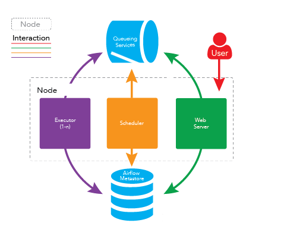
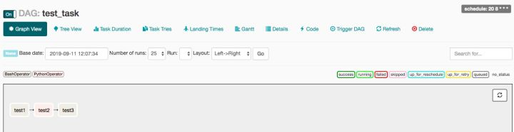
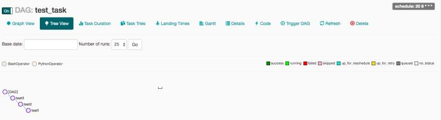

# Airflow 入门及使用

## 什么是 Airflow？

Airflow 是一个使用 python 语言编写的 data pipeline 调度和监控工作流的平台。 Airflow 是通过 DAG（Directed acyclic graph 有向无环图）来管理任务流程的任务调度工具， 不需要知道业务数据的具体内容，设置任务的依赖关系即可实现任务调度。

这个平台拥有和 Hive、Presto、MySQL、HDFS、Postgres 等数据源之间交互的能力，并且提供了钩子（hook）使其拥有很好地扩展性。 除了一个命令行界面，该工具还提供了一个基于 Web 的用户界面可以可视化管道的依赖关系、监控进度、触发任务等。

## Airflow 的架构

在一个可扩展的生产环境中，Airflow 含有以下组件：

- 元数据库：这个数据库存储有关任务状态的信息。
- 调度器：Scheduler 是一种使用 DAG 定义结合元数据中的任务状态来决定哪些任务需要被执行以及任务执行优先级的过程。 调度器通常作为服务运行。
- 执行器：Executor 是一个消息队列进程，它被绑定到调度器中，用于确定实际执行每个任务计划的工作进程。 有不同类型的执行器，每个执行器都使用一个指定工作进程的类来执行任务。 例如，LocalExecutor 使用与调度器进程在同一台机器上运行的并行进程执行任务。 其他像 CeleryExecutor 的执行器使用存在于独立的工作机器集群中的工作进程执行任务。
- Workers：这些是实际执行任务逻辑的进程，由正在使用的执行器确定。



## Airflow 解决哪些问题

通常，在一个运维系统，数据分析系统，或测试系统等大型系统中，我们会有各种各样的依赖需求。包括但不限于： *时间依赖：任务需要等待某一个时间点触发。* 外部系统依赖：任务依赖外部系统需要调用接口去访问。 *任务间依赖：任务 A 需要在任务 B 完成后启动，两个任务互相间会产生影响。* 资源环境依赖：任务消耗资源非常多， 或者只能在特定的机器上执行。

crontab 可以很好地处理定时执行任务的需求，但仅能管理时间上的依赖。

Airflow 的核心概念是 DAG (有向无环图)。DAG 由一个或多个 task 组成，而这个 DAG 正是解决了上文所说任务间的依赖问题。 任务执行的先后依赖顺序、多个 task 之间的依赖关系可以很好的用 DAG 表示完善。

Airflow 同样完整的支持 crontab 表达式，也支持直接使用 python 的 datatime 模块表述时间，还可以用 datatime 的 delta 表述时间差。

## Airflow 安装并运用

```bash
# 默认目录在~/airflow，也可以使用以下命令来指定目录
export AIRFLOW_HOME={yourpath}/airflow

pip install apache-airflow

# 配置文件中的 sql_alchemy_conn
vim airflow/airflow.cfg

# 初始化数据库
airflow initdb
```

## 定义第一个DAG

在 $AIRFLOW_HOME 目录下新建 dags 文件夹，后面的所有 dag 文件都要存储在这个目录。

新建 dag 文件 demo.py，语句含义见注释

```python
from datetime import datetime, timedelta

from airflow import DAG
from airflow.utils import dates
from airflow.utils.helpers import chain
from airflow.operators.bash_operator import BashOperator
from airflow.operators.python_operator import PythonOperator


def default_options():
    default_args = {
        'owner': 'airflow',  # 拥有者名称
        'start_date': dates.days_ago(1),  # 第一次开始执行的时间，为 UTC 时间
        'retries': 1,  # 失败重试次数
        'retry_delay': timedelta(seconds=5)  # 失败重试间隔
    }
    return default_args


# 定义DAG
def test1(dag):
    t = "pwd"
    # operator 支持多种类型， 这里使用 BashOperator
    task = BashOperator(
        task_id='test1',  # task_id
        bash_command=t,  # 指定要执行的命令
        dag=dag  # 指定归属的dag
    )
    return task


def hello_world_1():
    current_time = str(datetime.today())
    print('hello world at {}'.format(current_time))


def test2(dag):
    # PythonOperator
    task = PythonOperator(
        task_id='test2',
        python_callable=hello_world_1,  # 指定要执行的函数
        dag=dag)
    return task


def test3(dag):
    t = "date"
    task = BashOperator(
        task_id='test3',
        bash_command=t,
        dag=dag)
    return task


with DAG(
        'test_task',  # dag_id
        default_args=default_options(),  # 指定默认参数
        schedule_interval="20 8 * * *"  # 执行周期
) as d:
    task1 = test1(d)
    task2 = test2(d)
    task3 = test3(d)
    chain(task1, task2, task3)  # 指定执行顺序
```

写完后执行 `python $AIRFLOW_HOME/dags/demo.py` 检查是否有错误，如果命令行没有报错，就表示没问题。

命令行输入 `airflow list_dags -sd $AIRFLOW_HOME/dags` 查看生效的 dags

```bash
-------------------------------------------------------------------
DAGS
-------------------------------------------------------------------
test_task
```

## 也可以用位位移指定任务执行顺序

可以使用位移符号：

```text
task1 >> task2 >> task3
```

等价于

```text
task1.set_downstream(task2)
task2.set_downstream(task23)
```

## Web UI

启动命令 `airflow webserver`

> 任务图视图



> 任务树视图



## 常用命令

```bash
# 测试任务，格式：airflow test dag_id task_id execution_time
airflow test test_task test1 2019-09-10

# 开始运行任务(这一步也可以在web界面点trigger按钮)
airflow trigger_dag test_task

# 守护进程运行webserver, 默认端口为8080，也可以通过`-p`来指定
airflow webserver -D  

# 守护进程运行调度器     
airflow scheduler -D   

# 守护进程运行调度器    
airflow worker -D          

# 暂停任务
airflow pause dag_id　     

# 取消暂停，等同于在web管理界面打开off按钮
airflow unpause dag_id     

# 查看task列表
airflow list_tasks dag_id  查看task列表

# 清空任务状态
airflow clear dag_id       

# 运行task
airflow run dag_id task_id execution_date
```

## 更多

[Apache Airflow](https://airflow.apache.org/docs/stable/start.html#)

