# 《针对武汉疫情，聊一聊智慧城市建设中的灾害预防建设》

原标题《智慧城市：新型数据诉求及灾害预防应用》

根据这两天的全国疫情新增确诊病例来看，趋势有逐渐平缓的趋势，不过根据钟南山院士的判断，还不能过早乐观，仍需要做好防护与控制。

除了此次国内的新冠疫情之外，我们如果关注新闻的话还会惊讶地发现：澳大利亚的大火还在烧着，并且已经导致了5亿多动物丧生；西班牙的暴风雪导致9人死亡22万人无电可用；美国的流感已经感染了近2000万人并有约1万人死亡；菲律宾火山喷发引发了75场地震，至少45万人需要疏散；东非正遭遇25年来最严重蝗灾....... 

2020年不可能重新开启，面对这些天灾，我们要思考的是：在这个城市人口占大多数的时代，社会应该如何去主动预防及应对各种潜在的灾害。

这里我主要是想根据自己的经验以及思考，讲述一下在建设新型智慧城市的过程汇总，如何发掘及使用新型数据去提供包括城市治安，交通，电力、消防，地震，瘟疫，洪水等等的预防及应急措施。

- what：什么是城市灾害预防应用？
- why：为什么要解决这个问题？（中国城镇化进展及遭遇的问题和困境）
- how：现有技术已经达到可以解决的程度但是暂时由于政策无法解决。
- where：商业的驱动力从何而来，不同城市的需求是否有差异？
- who：谁来解决这些问题，也就是各类新型的分工。
- when：何时？如何果断时机是否成熟？以及数据建设的周期？

文中引用的数据都会标明来源，作图使用的是jupyter lab交互式环境，需要代码可以在后台留言索取。

## Ⅰ. 中国城镇化进展分析

首先阐述一下什么是城镇化。城镇包含城区和镇区两个概念，城区通常用市、区、街道来划分，镇区是指县和镇一级的管辖，而乡村是指除城区和镇区之外的其他地区。城镇化即为社会由以农业为主的传统乡村型社会向以工业（第二产业）和服务业（第三产业）等非农产业为主的现代城市型社会逐渐转变的过程。

改革开放已经过去了四十年，这也是中国城镇化快速发展的四个十年。截至2019年底，中国共有城镇人口约8.48亿，城镇化率已经达到了60.60%。

如上图所示，中国的城镇人口在改革开放后稳步增长，在2010年-2011年间首度城镇人口数量超过了乡村人口数量。但是如果我们将时间坐标轴拉长一点，如下图所示为从1949至2019年的中国城镇化变化图：

从上图可以发现几个规律：

1. 从1960年到1978年中国的城镇化率有一个横盘期，在此期间中国的城镇人口增长有限，反而乡村人口有了较明显的增长；
2. 在1978年到1997这十年间，乡村人口保持了一个较为平稳的台式，城镇人口稳步增长；
3. 从1998年开始，城镇化速度明显加快且保持着高速地增长。

以上数据来源于统计局的“国家数据”网站$^{[1]}$。：http://data.stats.gov.cn/

**中国城市化的提升空间还很大**，因为目前城市化率不足60%，而发达国家的城市化率通常在80%以上，也就是说，中国应该还有20%的上升空间。中国城镇化的两个很重要的影响因素是：**流动人口和人口年龄结构。**$^{[2]}$

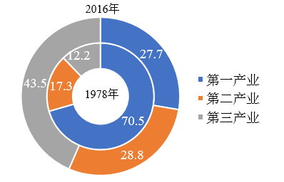

1978年、2016年就业结构（%） 

如上图所示，在改革开放的过程中，大量农村剩余劳动力进入城市，人口逐渐从第一产业转向更高工资和更高效率的第二和第三产业。这一波人口流动带来了巨大的人口红利，极大地促进了经济的发展和城镇化进程。

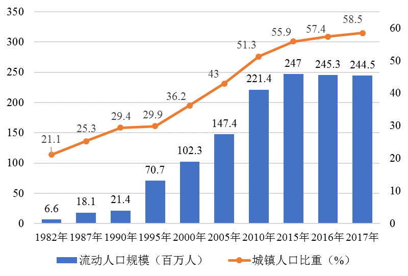

1982-2017年全国流动人口规模（单位：百万人，%）

然而根据国家卫健委发布的《中国流动人口发展报告2018》$^{[3]}$数据，2010年—2015年中国流动人口增长速度明显下降。如上图所示，流动人口数量从2015年起就从之前的持续上升转为缓慢下降。2016年全国流动人口规模比215年减少了171万人，2017年继续减少了82万人。

人口流动与人口年龄有关，年龄越大，流动性就越差。中国的城市化进程一直较快，这与政策导向有关，但目前农民工的平均年龄已经超过全国劳动力的平均年龄，今后外出农民工告老还乡的趋势会越来越明显。

由于已经完成的城镇化和人口老龄化，**以人口流动为特征的城镇化进程会逐渐结束，余下的是本地乡村的城镇化发展**。

去年十月份，摩根士丹利发布的的蓝皮书《中国城市化2.0: 超级都市圈》$^{[4]}$预测，到2030年中国的城市化率将升至75%，即增加2.2亿新市民，这主要得益于三大支柱：

- 一是城市群兴起將发挥集聚优势，同时缓解大城市病；
- 二是受益于新一代信息技术的应用，智慧城市将减少交通拥堵、安全隐患和污染；
- 三是农业的规模化和现代化有助提高劳动生产率，推动农村人口迁入城市。

报告认为，过去几十年，中国以前所未有的速度推进城市化，特别是硬件基础设施（铁公基等）大幅改善。下一个阶段，中国将通过结构化改革及数字科技的广泛应用，打造更快捷、安全、环保和宜居的城市。

报告当中列举了多个即将应用的新型技术对城市生活的影响，指出若想要保证中国的城镇化进程继续稳步提高并实现到2030年人均国民收入比当前翻一番的计划，那么除了继续大力推进信息基础设施建设，政策还应鼓励积极拥抱人工智能和大数据等新技术，奋力推进制度改革，这些都将有助于增强中心城市和城市群等经济发展优势区域的经济和人口承载能力，令都市生活将发生蜕变。

因此中国城镇化的趋势更多地是依靠智慧城市的建设而获得的。

## Ⅱ. 城市灾害预防包括哪些内容？

随着时代的发展和社会的进步，城市化进程逐步加快，城市人口的生活水平也渐渐提高。但是，在繁华的里，人们享受较高质量生活的同时，也承受着各种潜在的城市灾害的威胁，甚至每时每刻都有城市人遭受着不同程度的城市灾害。

城市的灾害大体可以分类两类：城市自然灾害（天灾）和城市人为灾害（人祸）。大部分自然灾害尚非人力可以抗拒,只能通过预防和抗灾来减轻损失。而人为灾害是人类疏忽或蓄意造成的,大部分是可以预防和制止的。城市自然灾害包含地质灾害、洪涝灾害、高温干旱灾害等。城市人为灾害主要指部分自然巨灾的人为化诱因、环境公害、火灾、城市事故（治安与交通）及恐怖袭击等。

还有一些灾害是在自然与人为两种因素同时作用导致的，比如：地下水的过量开采加上地壳运动和建筑物载荷的综合作用导致的地面沉降、裂缝以及塌陷；城市地下隧道施工或周边矿产资源开发与表面岩溶活动可能会产生突水、突泥、冲击地压、冒顶、瓦斯爆炸等灾害，造成人员伤亡、设备和工程毁坏、资源冻结。

这里以两个发生在美国比较有借鉴意义的事情展开叙述。

### 1. 卡特里娜飓风与美国联邦应急管理署

### 2. 911事件与美国国土安全局

2011年9月11日，在纽约发生了震惊世人的“911事件”。此次事件造成了2996人死亡（包括19名恐怖分子），美国的经济损失高达2000亿美元。事件发生后，美国政府整理所有有关恐怖分子的情报，发现美国联邦航空管理局（FAA）于2001年7月31日就发出了“已知恐怖组织正在规划和培训”的警告，而CIA在9·11袭击事件发生前一个多月就收到了可能存在威胁的迹象。这并不是CIA第一次收到有关涉及飞机的恐怖袭击的情报报告，但由于隶属于美国司法部的FBI才是打击美国国内恐怖活动的首要政府机构，CIA当时并没有及时的将这个信息与FBI共享。

911事件过后，美国政府不仅成立了一个新的联邦行政部门（美国国土安全部DHS）来负责国内安全及防止恐怖活动，还设立了美国国家情报总监（DNI），统领美国各个情报部门，同时加强美国情报界的情报共享。上图为美国现有的17个核心情报部门$^{[5]}$，分别为：

1. 国家情报总监及其办公室（Director of National Intelligence，DNI），2004年成立；
2. 中央情报局（Central Intelligence Agency，CIA），1947年成立；
3. 国家安全总局（National Security Agency，NSA），1952年成立；
4. 联邦调查局（Federal Bureau of Investigation，FBI），1935年成立；
5. 国防情报局（Defense Intelligence Agency，DIA），1961年成立；
6. 美国国家地理空间情报局（National Geospatial-Intelligence Agency，NGA），1972年成立；
7. 国家侦察办公室（National Reconnaissance Office，NRO），1961年成立；
8. 国务院情报研究局（Department of State's Bureau of Intelligence and Research, INR），1957年成立；
9. 空军情报监视侦察局（Air Force Intelligence, Surveillance, and Reconnaissance, AFISR），1948年成立；
10. 陆军情报和安全司令部（Intelligence and Security Command，INSCOM），1977年成立；
11. 能源部情报和反情报办公室（Office of Intelligence and Counterintelligence，OICI）；
12. 海岸警卫队情报机构（Coast Guard Intelligence，CGI），1915年成立；
13. 财政部的情报和分析办公室（Department of Treasury's Office of Intelligence and Analysis, OIA），2004年成立；
14. 美国缉毒局（Drug Enforcement Administration，DEA），1973年成立；
15. 海军陆战队情报部门（Marine Corps Intelligence，MCIA）；
16. 海军情报办公室（Office of Naval Intelligence，ONI），1882年成立；
17. 国土安全部情报分析办公室（DHS Office of Intelligence and Analysis，I&A），2002年成立；

### 

## Ⅲ. 智慧城市建设过程中对灾害预防的思考

## Ⅳ. 城市灾害预防的商业驱动力

微观领域来看，未来10年的新型城市化发展将为市场主体提供三大投资和发展主题：

1. 一是工业互联网兴起，利好5G、云服务和物联网企业；
2. 二是成熟产业数字化，无人驾驶、智能物流和电网有望提速发展，大数据助力金融企业精准定价、控制风险；
3. 三是智慧城市新生活。智能家居和医疗及高速通勤铁路让生活更便利；超级都市圈人口集聚，体验式服务消费有望大发展，利好职业培训机构等。

## Ⅴ. 舆情管控的新要求及新思路

精准辟谣和

大禹治水，宜疏不宜堵。防民之口，甚于防川。

## Ⅵ. 此次疫情控制的复盘总结

希望这次疫情带给我们的，除了灾痛，还有一次变革的契机。

## Ⅶ.

## Ⅷ.

## Ⅸ.

## Ⅹ.

## 疫情影响最大的10大行业与10大职业！

受影响的行业：

1. 电影行业
2. 餐饮行业
3. 交通运输行业
4. 零售行业
5. 旅游行业
6. 制造业
7. 原油及大宗商品
8. 出口行业
9. 地产业
10. 银行业

存在机遇的职业：

1. 医生及智能诊疗从业人员
2. 在线教育从业者
3. 人工智能及数据分析从业人员
4. 无人零售、无人餐饮、机器人快递从业人员
5. 远程办公、家庭办公及视频会议从业人员
6. 健身及保健类从业人员
7. 公共事务应急管理及社区网格化管理从业人员
8. 心理医生及私人医生
9. 短视频、直播及VR、AR、线上娱乐从业者
10. 上门服务、同城跑腿、订制服务从业者

## 新冠肺炎“次生灾难”正在发酵，要预防社会出现系统性崩溃

新冠病毒继续蔓延，已经引起了人道主义灾难，次生灾难也正在发酵。前两天有新闻报道，湖北省黄冈市下属的黄梅县有一个癌症患者，因为疫情的影响，无法就医，母女俩徒步走到九江长江大桥，希望过桥去江西治病。

随着春节假期的结束，这种情况会越来越多。很多的其他病人需要就医，但是现在不但武汉因为医疗资源匮乏而无法开展正常的医疗活动，其他城市的医院同样很难在短期内恢复正常。尤其是在各地的医院都相继发生了聚集性疫情，而防护服又普遍不足的情况下，医疗秩序更是难以恢复。

因为工厂停工，物流受阻，中国的公私事业都受到了很大的影响。社会无法正常运转，武汉市封城，湖北省几乎等于全省封省。民生问题受到了很大的影响，虽然新闻媒体一直在报道乐观的消息，但是在疫区确实出现了人道主义灾难，这个问题不能回避。

有些灾难现在看来，已经是不可避免的了。因为新冠病毒的传染性实在是超出了很多人的预料，短期内防控工作难以放松，否则的话，随着情况的进一步加重，整个社会有可能会发生系统性的崩溃，后果将更为严重。

从公开的流行病学调查信息来看，新冠肺炎的传染能力实在太强。现在的防护政策可以减缓疫情爆发的速度，但是可能很难阻挡新冠肺炎大范围的蔓延。

## 中国城镇化进入分化阶段

国家发改委首次提出了“收缩型中小城市”的概念。

2019年4月8日，国家发改委发布的《2019年新型城镇化建设重点任务》提出，收缩型中小城市要瘦身强体，转变惯性的增量规划思维，严控增量、盘活存量，引导人口和公共资源向城区集中。

这意味着，在城镇化过程中，并非所有的城市都能如愿发展壮大。事实上，在中国的城市化进程中，部分资源型城市、传统工业主导的城市，近年来在人口、经济等方面已出现了收缩现象。据清华大学建筑学院副教授龙瀛的统计数据，中国654个城市中已有180个收缩城市。

“应该说，中国城市化步入中后期，已经出现了城市发展分化的现象，一些收缩型城市未来的发展需要更加谨慎。”华南城市研究会会长、暨南大学教授胡刚在接受时代财经采访时表示。

**城镇化的必然趋势**

在国际上，收缩城市一般是指人口规模多于1万人、连续超过两年出现人口流失、且发生结构性经济危机的城市，这一定义在2004年也被国际收缩城市研究网络（the Shrinking City International Research Network）所使用。业内普遍认为，城市收缩也是城市发展的一种过程，是部分城市不可避免的必然趋势。

对中国而言，“增长”仍是大部分城市的主要发展趋势，但城市“收缩”现象也早已经发生。

一个典型的例子是，在2016年中山大学举行的首届收缩城市学术研讨会上，黑龙江省伊春市就被当作中国收缩城市的典型代表。

伊春是国家发改委确定的国家首批12个资源枯竭型城市之一。由于产业结构单一，林业资源枯竭，伊春在过去多年里出现人口负增长现象。伊春市统计局数据显示，从2011年到2018年间，伊春市总人口由126万减少至114万，8年减少12万人。

多位专家指出，伊春人口出现负增长，一方面源自经济结构调整，使得林业人口外迁，另一方面，伊春的人口自然增长率长期为负，其中，2018年伊春市死亡人口数量超过出生人口数量的2倍，人口自然增长率为-4.63‰

林业人口的外迁以及低出生率，进一步加深了当地的人口老龄化程度，也直接导致当地住房购买力需求不足。

武汉大学城市建设学院教授杜宁睿、舒会珍撰文指出，伊春市在2006年至2015年之间，房屋销售面积一直低于房屋施工面积，且2010年之后，房屋销售面积一直处于负增长状态。

上述文章还指出，伊春市国民生产总值十年内有所起伏，但总体上呈下降趋势，且2014年和2015年甚至出现了负增长，而财政总收入自2010年之后大幅下降，2014年开始出现财政赤字，对外经济和固定资产投资的发展也并不景气。

时代财经梳理发现，尽管2016年和2017年，伊春市国民生产总值有增长态势，但规模仍然没有超过2013年的274.6亿元。

伊春只是中国收缩城市的一个缩影。龙瀛结合统计数据指出，全国654个城市中已有180个发生了人口总量和密度的双下降，这意味着，中国至少存在着180个收缩城市，其中不乏晋江、义乌、景德镇等昔日经济增长较快的城市。它们的收缩，既有资源型城市在工业化进程中出现的收缩，也有传统工业城市工业衰落导致的收缩，还有欠发达地区人口迁移引发的收缩和行政区划调整导致的收缩。

此外，中国的收缩城市多集中在东北、中西部等地区，并且近年来收缩态势在进一步加剧。

以东北为例，同济大学建筑与城市规划学院学者范佳慧认为，2000年至2010年之间，东北地区36个地级市中有11个出现不同程度的收缩现象，295个区县有146个出现收缩；但在2008年至2014年期间，东北有31个地级市出现收缩，214个区县出现收缩，可以看出，东北的多数城市已出现收缩现象。

相比之下，胡刚指出，经济发达的广东、浙江、山东等地区的城市发展态势依然不错。

**不应过度对抗**

尽管部分城市已经出现收缩态势，但几乎每个收缩城市都有一个膨胀的规划。

以伊春为例，《伊春市城市总体规划（2001-2020）》将2020年的人口预期定位为140万。到了2017年9月，国务院批复的《伊春市城市总体规划（2011-2020年）》中，将2020年的人口总数修改为115～120万人。可以看出，人口在不断减少的情况下，伊春仍然在坚持人口规划扩张的事实。

“以前固有的规划理念认为，城市以后一定会发展、人口会增加、城市土地规模会扩大。”胡刚告诉时代财经，“而过去中国快速推进的城镇化，也确实使得城市人口增加，土地财政形式比较好。”

这造成的结果是，经济欠发达的中西部城市只有通过更多的规划人口，才能获得更多的城镇建设用地指标支持后续的城市开发，继而陷入土地财政的恶性循环。

与此同时，过去土地供给更倾向于中西部地区的政策，也让人口减少的城市反而获得了更多用地指标。

上海交通大学中国发展研究中心主任陆铭认为，在全国土地供给总量中，中西部土地供给的占比从2003年的29.5%上升到2010年的45%，这意味着，2003年后，作为人口流入地的东部地区，土地份额反而减少。这使得东部地区的土地供求关系更为紧张，而中西部地区的工业园、新城、基础设施总体上已经过剩。

不过，本次发布的《2019年新型城镇化建设重点任务》指出，全面落实城镇建设用地增加规模与吸纳农业转移人口落户数量挂钩政策，在安排各地区城镇新增建设用地规模时，进一步增加上年度农业转移人口落户数量的权重，探索落户城镇的农村贫困人口在原籍宅基地复垦腾退的建设用地指标由输入地使用。

也就是说，未来的城镇化将是“地随人走”，收缩城市的土地财政将难以为继。

这种背景下，胡刚认为，收缩型城市不应盲目乐观地规划大型基础设施，以免造成浪费，而应该根据当地发展的可能性来调整城市规划，将更多资源用于城市公共设施的维护上，“缩减城市的一个趋势是小而美，而不是高大上。”

无独有偶，陆铭亦指出，应在人口流出地做减量规划，防止收缩城市继续做增量规划和投资的局面，已经进行的投资要做科学的评估，同时重视上一轮投资中所形成的工业园、新城、基础设施等不动产所带来的地方金融和财政风险。

“不是所有的城市都将快速发展，以后部分中小城市的发展可能会比较缓慢，甚至出现停滞状态。”胡刚向时代财经表示，“一二线城市就业机会多、收入高、城市繁华，能吸引大量人口流入，这是世界趋势，有些城市改变不了人口流动的大趋势，面对城市收缩，应该顺势而为，不应过度对抗。”

## 数据大屏可视化系统助力大数据应用落地

随着社会的迅猛发展，信息化可视化需求也急剧增长，特别是一些监控中心、指挥中心、调度中心等重要场所，数据大屏可视化系统已经成为信息可视化不可或缺的展示平台。在科幻影视剧里，经常有看到大数据可视化系统的应用，其实，数据大屏可视化系统并不少见，是非常常见的大数据应用。帮助各行业领域管理者从多个方面提升智能化决策能力。

**1、公安领域**

大数据时代发展带动了公安领域信息化建设，信息资源已经成为公安部门重要的战斗力要素，信息化成为推动公安警务方式变革的重要引擎。如何打破原有各部门、各警种之间沟通、协作的壁垒，使警务资源得到了合理配置，实现警务效能的最优化，就需要有效整合公安大数据。基于指挥监控中心大屏可视化，实现突发事件下的可视化接处警、警情查询监控、辖区定位、应急指挥调度管理，满足公安行业平急结合的应用需求。

**2、交通领域**

随着经济社会的高速发展和城市化进程的加快，城市交通拥堵问题日趋严重，目前很多城市都在积极的探索依靠信息技术改善管理模式，以信息化带动城市交通管理现代化。

交通领域的大数据应用，可以实现从高速公路的运行情况到城市公交车辆、司乘人员、运行线路、站点场站管理、乘客统计等多个维度进行日常路网运行监测与协调管理；支持突发事件下的值班接警、信息处理发布、应急指挥调度管理，发挥交通资源最大效益。

**3、电力行业**

电力行业是重要的基础产业，电网是实现我国能源战略布局的重要手段、能源产业链的重要环节和国家综合运输体系的重要组成部分。如今，人类社会正面临着能源短缺的局面，可持续发展是当今社会发展的主流，所以电力行业的智能化管理有着更高的要求。如何实现电网的实时监测、预警、调度和智能化资源配置，就需要充分利用电力行业大数据，基于指挥监控中心大屏可视化，满足常态下电网信息的实时监测监管、应急态下协同处置指挥调度的需要。

**4、园区管理**

我国自上世纪80年试行推广产业园区的建设模式，然而经济的快速发展使得传统的产业园区遭遇到了前所未有的发展瓶颈，如何促进园区管理向创新化、科技化、智慧化转变，就需要充分利用园区大数据，基于指挥监控中心大屏可视化，实现从园区建设规划、管网运行、能耗监测、园区交通、安防管理、园区资源管理等多个维度进行日常运行监测与协调管理；从而全面加强园区创新、服务和管理能力，促进园区产业升级、提升园区企业竞争力。

数据大屏可视化系统多年来深扎行业领域，帮助很多企业实现智能化决策的需求，带动整个社会的快速发展。

## 智慧城市可视化设计全方案配解析

数据可视化不再是仅停留在把繁杂的数据图形化出来，更多的是结合真实的场景加上交互等处理手段，更精准的传达数据信息。

**项目背景**

城市化进程快速发展，带来了人口管理、交通拥堵、环境保护、安全等诸多问题，通过运用信息和通信技术手段感测、分析、整合城市运行核心系统的各项关键信息，从而对包括交通、民生、环保、公共安全、城市服务等在内的各种需求做出智能响应，并给出相应的结果与解决方案。连通各部门平台数据，在指挥大厅统一监控。特殊事件可以做到及时发现，及时分发处理。

**智慧城市数据可视化**

对于页面设计最大的要求就是信息层级准确、精准易读、高效操作。考虑到大屏的使用场景和不同的观看人群以及操作人员的长时间观看等情况。色调上不能特别活跃，布局和展示上数据逻辑、层级关系要非常明确，易于操作，屏幕中显示的数据不能过多，避免数据之间的影响。不同人群对数据又不同的需求，不同的数据又不能同时堆叠出来，满足不同用户对数据要求的同时，如何减少对用户的干扰。也是本次大屏设计的一个难点。

结合上面实际情况，下面做进一步分析。

可视化大屏分析

**痛点：**

“信息孤岛”严重，各部门各平台数据信息无法实现融合、信息共享。不能进行相关系统的系统联动，使之在日常工作效率难以提高。

**大屏建设目标**

建设智慧城市管理平台，通过集成建设，使得数据共享交换更加便捷，并可实现集中指挥调度、预案及辅助决策以及服务。

**目标用户群**

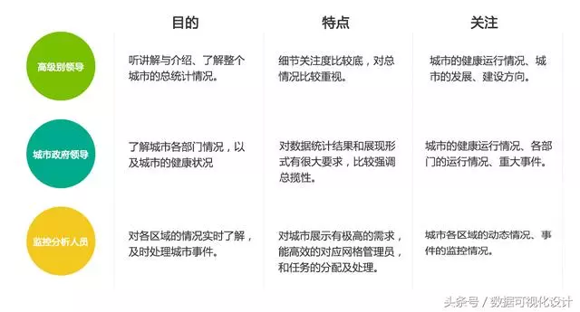

**设计-城市道路监控**

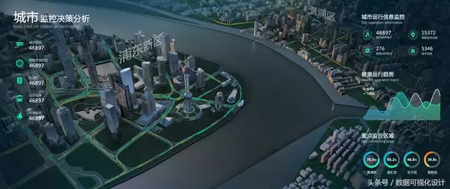

大致的需求是针对城市道路监控有整体的监控和预测、控制等能力。以充分保障交通安全，提升交通系统运行效率和管理水平。分析用户需求并结合当地交通状况大概整理情况如下：

1、对城市的整个交通情况有一个更直观全面的展示。我们做了三维地形，有助于快速定位路段。并通过该路段的地理环境，给出下一步解决方案。

2、效缓解交通拥堵，快速响应突发状况，精准定位事件问题所在路段。

3、通过对城市全路段的统计展示，来辅助相关部门对交通优化处理，及信息下发辅助车辆选择最优路线，缓解城市拥堵。

4、交通用色也是沿用大家对交通的认知色，方便观者快速认知，减少学习成本。

**设计-事件处理**

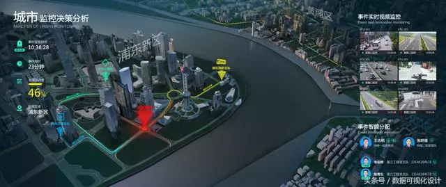

**事件处理**

这个页面主要是为用户解决事件统计和突发性事件高效快速处理。

开始由于各部门“信息孤岛”严重，各部门各平台数据信息无法实现融合、信息共享，不能进行相关系统的系统联动，当信息最后打通后我们做了以下设计处理：

1、我们把城市事件分类处理，并且把相关部门一一对应。为了方便不同的事件智能分发处理。

2、相关单位优选，会根据不同的事件优选处理单位智能分发指派，极大的节省事件提升效率。

3、当事件突发时，会定位的相应位置，同时右侧显示事件周边监控等情况。

4、同时可以对相关人员、网格管理员进行一对一，多对多通话视频等。

设计上我们对突发事件做了强化处理，把事件需要配合的部门突出显示，并把它们到现场的规划路线进行了处理，对事件的处理有一个全面的统揽展示，通过三维地图与音视频结合，使得指挥人员如同亲临现场，为每一步指挥组出更精准的判断。

处理突发事件时，三维地图有更好的场景感，处理突发事件需要对事件周边环境有更好的了解，才可以更高效精准的去处理，我们采用三维地图的设计，不单单是在视觉效果上的一次提升，更是一种高效的应用。同时提升了用户使用的兴趣感又解决二维地图所无法表达的信息。

这事整体的一个思路吧，很多东西没有展开更细的分支去写。不多说了上图!

**数据可视化设计图**

## 日本研究人员设计“无声地震”探测系统，地震预警更精确

2月3日，成都发生5.1级地震，震源深度21千米，好在无人员伤亡，民众情绪稳定。我们不得不感叹，在天灾面前人类总是如此渺小和脆弱。

随着科技的进步，人们不断尝试着预测地震的新方法。2018年8月，谷歌旗下人工智能部门和哈佛大学的研究人员就建立了一个AI模型，可以预测大地震一年后发生余震的位置。2019年3月，加州理工大学使用英伟达的GPU，开发了一种智能的地震预警AI系统，据称可在几秒内发出警报。

众所周知，日本地处全球最活跃的地震带——环太平洋地震带上，地震频发。为了能够更准确的预测大地震，东京大学的研究团队联合日本海岸警卫队开发了用于监测海底无声地震的系统。无声地震，即不产生震动或摇晃的慢滑事件。

该创新监测系统将卫星数据和海岸警卫队研究船收集的数据整合到名为“全球导航卫星-声波测距”的系统中（GNSS-A）。

卫星用于监测海表运动，同时海岸警卫队的研究船可以使用声波测距系统监测海底地壳变形，该系统能够追踪到两英寸的地壳细微变化。

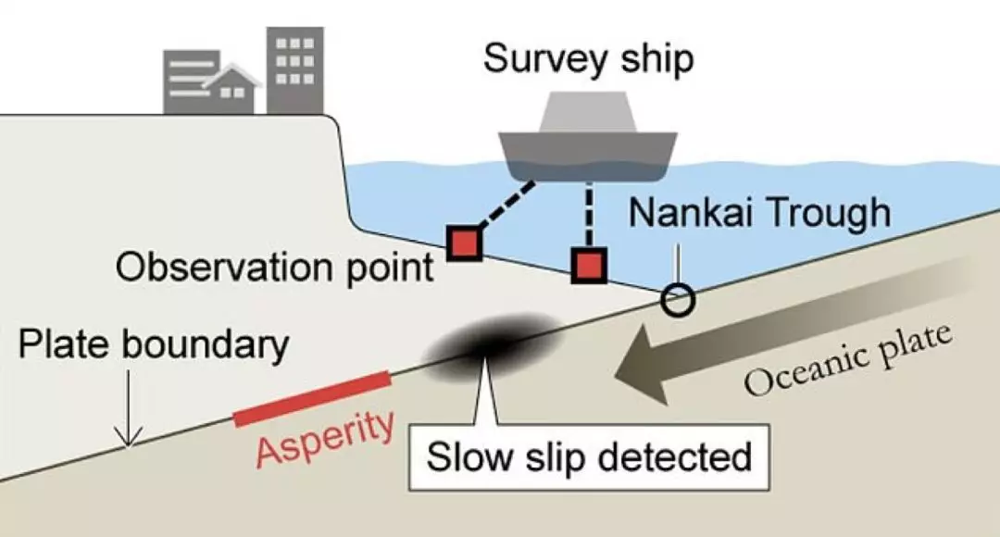

研究人员使用GNSS-A系统在2006到2018年间距日本南部海岸约30英里的南海海槽区域获取的数据进行分析。

研究发现沿海槽有七处不同位置发生过多次的慢滑事件，尺度在2到3英寸不等。

这些慢滑事件是由两块构造板块相对移动产生的，但移动不会产生可被探测到的震动。

这一现象在地表以下40英里处是比较常见的。

而滑移最常见的区域是地心附近，因为地心处构造板块被岩浆加热，柔韧性增强，导致板块相对滑动时不会产生即时的影响。

虽然大量的慢滑事件与大地震之间的关系尚不清楚，但东京大学的研究人员希望他们收集的新数据能够帮助弥补这一认知空白。

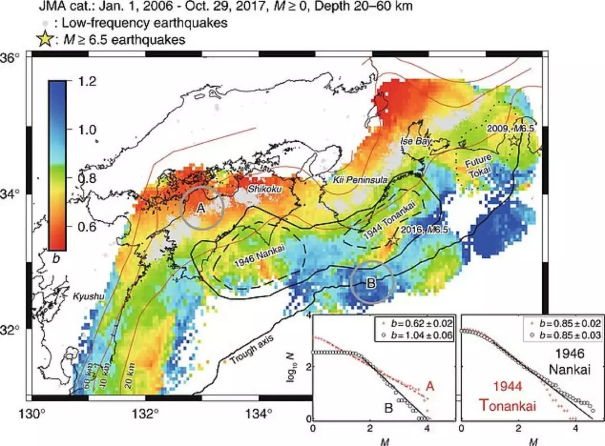

东京大学的横天祐介博士表示，这些区域之间的特征差异可能与不同区域地震的历史情况有关，并导致了不同的摩擦条件。

详细了解摩擦条件及它们如何与大型逆冲区地震事件产生时空关系对于实现准确的地震模拟十分必要。

因此，研究在日本南海海槽新发现的慢滑事件将有助于防灾和备灾。

一些人推测，2011年摧毁日本的海啸及后续日本南海海槽的地震可能与多次慢滑事件相关。

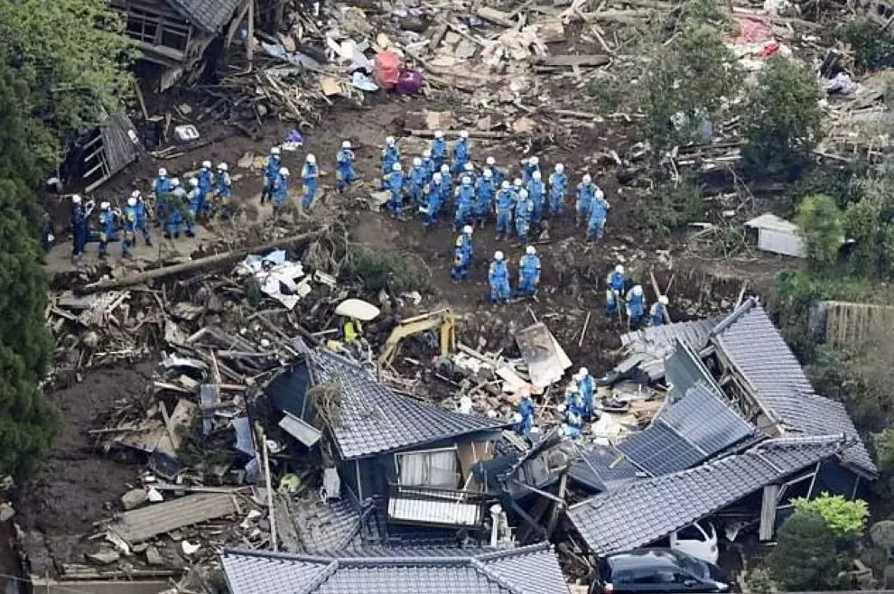

去年中国南华早报的一份报告中指出，在2011年大地震前夕，受慢滑现象影响约有20条死带鱼漂浮在海面上。

但带鱼是一种体型长、呈银色的深海鱼类，主要生活在大约3000英尺的深度，极少出现在海面。

海底构造板块之间压力在积聚的过程中，会释放负电荷。

有理论表明当地壳出现慢滑现象时会释放负电荷，这会导致如带鱼一类的鱼类死亡。

## 当城市不再长大，我们该怎么办？

4月8日,国家发改委发布的《2019年新型城镇化建设重点任务》（以下称《任务》）提到，收缩型中小城市要瘦身强体，转变惯性的增量规划思维，严控增量、盘活存量，引导人口和公共资源向城区集中。

多位城市领域专家向21世纪经济报道表示，这是官方文件中，首次提及“收缩型中小城市”的概念，这让收缩型城市的概念，从学术讨论的范畴，上升到官方认可的层次。

中国城市和小城镇发展改革中心学术委员会秘书长冯奎指出，此前官方文件中还没有提及这一概念，反映了中小城市要分级分类发展的趋势。

而中央财经大学城市管理系主任、副教授王伟则告诉21世纪经济报道记者，在过去几年中，官方曾在包括《国家新型城镇化规划（2014－2020年）》等重要文件内，提到资源枯竭城市等概念，这些城市与收缩型中小城市的群体大致匹配，但并未明确提出“收缩型城市”的概念。

王伟表示，“收缩型城市”是国外引入的概念，包括德国鲁尔、法国洛林和美国的休斯顿等地区，都经历过城市收缩的阶段。其主要体现在人口流失、产业衰退，城市空间和公共设施闲置等三个方面。而在我国，还有一种特有的城市收缩现象，即常住人口少于户籍人口的“户口倒挂”现象。

21世纪经济报道注意到，近年来，学术界开始注意到我国一些中小城市开始“收缩”的问题。

根据清华大学建筑学院特别研究员龙瀛的研究，在2000年到2010年间，中国有180个城市的人口在流失。

而首都经济贸易大学吴康副教授也曾发布研究成果称，2007~2016年间，中国有84座城市出现了“收缩”。这些城市都经历了连续3年或者3年以上的常住人口减少。

王伟则指出，实际上，城市的扩张和收缩有其必然性，是城市发展的一体两面。一方面，大城市的扩张，城市群的出现和人口在空间分布的不均衡，有其必然性。但另一方面， 城市的收缩也有其人为性，我国严格将城市按照行政级别划分，也导致了资源过度向行政级别高的大城市集中，导致这些城市出现了“虹吸效应”。

而此次《任务》文件中也提到，中小城市发展要分类施策，都市圈内和潜力型中小城市要 提高产业支撑能力、公共服务品质，促进人口就地就近城镇化；收缩型中小城市要瘦身强体，转变惯性的增量规划思维，严控增量、盘活存量，引导人口和公共资源向城区集中；强化边境城市稳边戍 边作用，推动公共资源倾斜性配置和对口支援；稳步增设一批中小 城市，落实非县级政府驻地特大镇设市。

## 突发公共事件应急管理——美国的经验与中国的改革

突发公共事件应急管理系统的建设是一个长期、细致、体系化的过程，在这方面我国并无多少经验可借鉴，而欧美发达国家在这方面却发展较早，体系也较为成熟，鉴于我国巨大的体量和复杂多样的地理与社会环境，我们也不大可能借鉴一些小的发达国家或地区的经验，而只能参考和借鉴美国和俄罗斯这样的大国的经验,特别是美国的经验。‍

**美国应急管理体系的经验**

美国应急管理体系的经验‍美国的应急管理组织体系源自1979年卡特政府成立的联邦应急事务管理总署（FEMA，Federal Emergency Management Agency），该机构协调27个其他联邦政府机构以应对各种突发应急事务；“9.11事件”爆发以后，美国政府于2003年进一步对其应急事务管理机构进行改组，在联邦应急事务管理总署的基础上，吸收其他22个联邦政府机构，成立了美国国土安全部，至此，美国国土安全部也就成为了美国最高的应急管理机构。‍

对应于联邦应急事务管理机构的重组，美国政府也出台了一系列国家应急管理的政策法规文件，其中主体是国家总体应急预案和五大框架。‍

首先是国家总体应急预案，1992年，《联邦响应预案》（Federal Response Plan,简称FRP）出台；2004年，“9.11”事件以后，美国各级政府基于“共同应对”理念，撰写《全国响应预案》（National Response Plan,简称NRP）；2008年，经历了卡特里娜飓风之后，联邦政府修订了NRP,由之前的预案，变成了《全国响应框架》（National Response Framework,简称NRF）；2011年，奥巴马总统发布了《第8号总统政策令》，强调了应急准备工作的重要性之处，应急准备需要覆盖预防（Prevent）、保护（Protect）、减除（Mitigate）、响应（Response）、恢复（Recover）5‍个领域（图1）。1‍

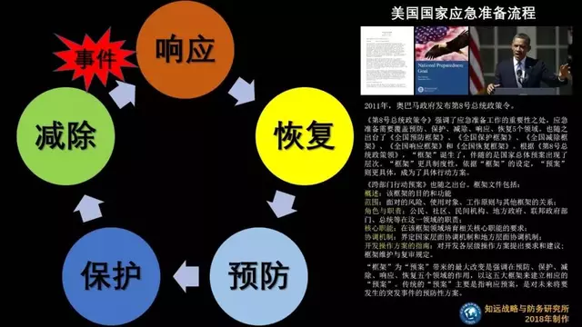

图1 应急管理流程循环

对应《第8号总统政策令》，也随之出台了《全国预防框架》、《全国保护框架》、《全国减除框架》、《全国响应框架》和《全国恢复框架》。同时，《跨部门行动预案》（Interagency Operational Plan）也随之出台。“框架”为“预案”带来的最大改变是强调在预防、保护、减除、响应、恢复五个领域的作用，以这五大框架来建立相应的“预案”。传统的“预案”主要是指响应预案，是对未来将要发生的突发事件的预防性方案。‍

通过“框架”和“预案”的出台及其细化，美国联邦政府建立起了一套统一管理、属地为主、分级响应、标准运行的从联邦政府到州县市，再到社区的完整高效的应急管理三级响应体系。其中联邦政府层面的国土安全部是最高的应急管理机构，主要负责援助与协调，不负责具体指挥；各州、县、市地方政府的应急管理机构负责辖区内突发应急事件处置，是所在区域的指挥协调中心，起着决定性作用；社区小城镇则设有大量志愿者性质的应急服务机构。‍

在整个应急管理体系中，还融入了国防军事力量以对突发危机事件进行支援，形成了军民联动的特征。首先，在联邦政府层级，通过国家作战中心进行总体协调；其次，在州一级作为主要应急管理机构的层级上通过国防协调官员进行现场层级的协调，体现在联合特遣队对应急事件处置的直接介入和支援，在最具体的事件上，体现在特遣队接受事件指挥所的指挥，且具备指挥特遣队权限的事件指挥所同时具备越过责任区指挥官直接向地方应急行动中心报告的权限。（图2）

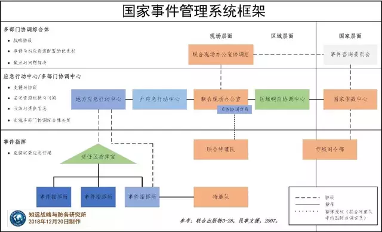

图2 美国国家事件管理系统框架

美国政府按照应急事件种类的差别，将其分成了12个领域 ：‍

1. 交通：提供平时和战时运输服务，主要由运输部负责。‍
2. 通讯：提供通讯服务，主要由国家通讯委员会负责。‍
3. 公共工程：恢复公共服务和公共设施，主要由国防部的美国陆军工程部队负责。‍
4. 防灾（消防）：发现并减轻森林大火、城乡火灾，主要由农业部的森林司负责。‍‍
5. 信息和规划：收集、分析公布重要信息，促进联邦紧急反应机制运行，主要由联邦紧急事务管理总署负责。‍
6. 公众关怀（公众救护）：管理并协调食品供应，安置并抢救伤员，分配救济物品，帮助家庭团聚，主要由美国红十字会负责。‍
7. 人力支持（资源支持）：在紧急事件处理时期为联邦机构提供设备、物资、物品和人力，主要由联邦总务局负责。‍
8. 医疗卫生服务：提供公共卫生和医疗援助，主要由卫生与公众服务部的公众卫生司负责。‍
9. 城市搜索与救援：发现、解救被夹在废墟中的受伤者并进行前期治疗，主要由国防部负责。‍
10. 危险物质：为实际或潜在疾病和危险物质防治提供联邦紧急支持，主要由环境保护署负责。‍
11. 食品：确认食品需要，确保食品到达受灾害影响地区，主要由农业部食品营养司负责。‍
12. 能源：恢复电力系统和能源供应，主要由能源部负责。‍

各地方政府的应急反应部门，包括消防、警察、医疗、非政府组织、非营利组织和公共部门等，在突发应急事件发生之后就可以在第一时间做出响应和处置。由于美国是联邦制国家，各州的应急服务部门在名称、建制和分工等方面也不尽相同，在各自的辖区内，根据各自辖区突发应急事件的不同特点，也可以合理投入资源对不同领域进行有针对性的建设。‍

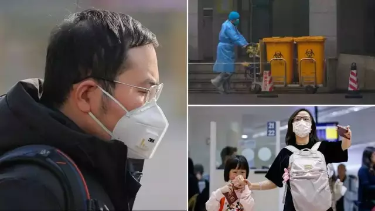

**中国应急管理体系的改革**

中国应急管理体系的改革中国国家领导人在主持政治局关于健全公共安全体系的第二十三次集体学习时曾强调,公共安全连着千家万户,确保公共安全,事关人民群众生命财产安全,事关改革发展稳定大局。党的十九大报告指出,坚持总体国家安全观。统筹发展和安全,增强忧患意识,做到居安思危,是我们党治国理政的一个重大原则。必须坚持国家利益至上,以人民安全为宗旨,以政治安全为根本,统筹外部安全和内部安全、国土安全和国民安全、传统安全和非传统安全、自身安全和共同安全,完善国家安全制度体系,加强国家安全能力建设,坚决维护国家主权、安全、发展利益。‍

经过一系列的制度体系建设和相关政策文件的出台，各级政府的应急处突能力得到了显著的增强，但是在最近几年诸如天津“812爆炸事件”、“东方之星沉船事件”等特大突发事件的具体处置和管控中仍然暴露出了一系列制度和机制上的深层次问题，其中最大的问题莫过于处理各种不同类型突发危机事件的部门太分散，在响应和处置突发危机事件的过程中很难高效协作，这表现在各级应急管理机构在处置突发危机事件协调其他相关各部门时表现出来的决策流程繁琐和不畅，结果严重地影响了应急处突的效率，给人民群众带来不必要的生命财产损失，也导致政府部门的公信力严重受损。从国务院应急管理办公室到各级地方政府应急管理办公室，作为一个政府下属职能部门，在处置每一次突发危机事件的过程中仍然需要协调、调动其他各平行政府相关职能部门，但是应急办并没有相应的人事权和行政命令权，所以在每次特定的突发危机事件中采取的是设立工作组、应急办主任进行业务领导，同时辅以当地政府主官行政领导以配合调动、协调其他平行部门，此种工作模式虽然一定程度上解决了跨部门协调的难题，但仍然没有能够从根本上解决这一基础性体制问题。所有这些都表明，我国突发应急事件管理体系仍然亟需一次从体制机制上的根本性改革才能解决难题。

2018年3月17日,第十三届全国人大一次会议表决通过了关于国务院机构改革方案的决定。根据国务院机构改革方案,将国家安全生产监督管理总局的职责,国务院办公厅的应急管理职责,公安部的消防管理职责,民政部的救灾职责,国土资源部的地质灾害防治、水利部的水旱灾害防治、农业部的草原防火、国家林业局的森林防火相关职责,中国地震局的震灾应急救援职责以及国家防汛抗旱总指挥部、国家减灾委员会、国务院抗震救灾指挥部、国家森林防火指挥部的职责整合,组建应急管理部,作为国务院组成部门（表1）。‍

应急管理部成立后,将相关部委的各种突发应急事件相关职能部门整合在了一起,有利于理顺应急管理工作体制机制,统一管理国家公共安全事务，为高效协调响应处置突发危机事件奠定了最基本的体制机制基础。‍

即便如此，整个应急管理体系的建设仍然任重道远。**首先，我们缺乏对各类突发危机事件进行系统梳理、分析并从中总结出体系化的知识系统以指导整个突发危机事件的响应和处置，这一点表现在各种类别突发危机事件不断重复发生所酿造的一系列悲剧之中，而且这项工作是长期性和基础性的，短期内吃力不讨好，也没有引起相关部门的足够重视；其次，我国处理突发危机事件的专业人员极度匮乏，在这方面表现在高校专业设置上的不足以及相关研究机构的缺乏，从而缺乏应对突发危机事件强有力的智力和咨询支撑；再次，在新一轮军改的大背景下，在应急管理领域如何做好军民融合、军民联动来应对突发事件也是一个需要深入研究的领域。**所有这些都迫使党和政府必须对整个应急管理体系进行深入的改革和持续的优化，如此方可适应不断发展演化的突发危机事件所带来的严峻挑战。 ‍

表1 突发事件种类及其主责部门一览表

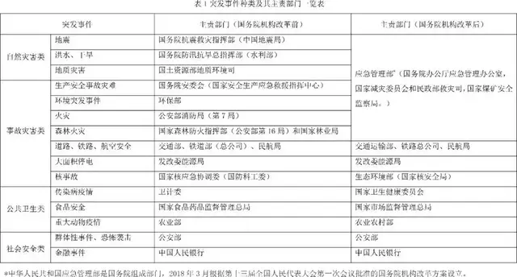

在此之前,根据2006年1月国务院颁布的《国家突发公共事件总体应急预案》规定，“根据突发公共事件的发生过程、性质和机理，突发公共事件主要分为以下四类：‍

- 自然灾害事件：主要包括水旱灾害、气象灾害、地震灾害、地质灾害、海洋灾害、生物灾害和森林草原火灾等。‍
- 事故灾难事件：主要包括工矿商贸等企业的各类安全事故、交通运输事故、公共设施和设备事故、环境污染和生态破坏事件等。‍
- 公共卫生事件：主要包括传染病疫情、群体性不明原因疾病、食品安全和职业危害、动物疫情、以及其他严重影响公众健康和生命安全的事件。‍
- 社会安全事件：主要包括恐怖袭击事件、经济安全事件和涉外突发事件等。‍

在2018年国务院机构改革之前，对上述四大类突发事件的应急管理，基本上采取的是以各级地方政府应急管理办公室为协调中心，应急业务领导和应急行政领导分离的二元领导机制来处理各种突发应急事件，在过去十几年一系列重大突发应急事件的处置中，这种分散分离的应急管理机制逐渐暴露出了难以克服的体制性缺陷。‍

而在2018年3月17日十三届全国人大一次会议通过了关于国务院机构改革方案的决定以后,新组建的中华人民共和国应急管理部则极大地整合了分散的应急管理机构。从表1可以看出,在四大类突发公共事件中有一半左右被纳入了应急管理部的管辖之下,事故灾害类的部分、公共卫生类和社会安全类的全部则仍然从属于以前的管辖机构，因此在现有的改革措施下，仍应坚持对未来应急管理部门和其他突发事件应急管理机构的横向工作协调机制建设，如此方可形成高效、统一的应急管理工作机制。‍‍

**突发公共事件应急管理系统建设**

为了更好地服务于突发事件的应急管理能力，建设涵盖各种类的突发公共事件应急管理数据库是一项必要的基础性工作，而突发公共事件应急管理推演系统则是整个突发事件应急管理系统建设的最高目标。‍

突发公共事件应急管理数据库的建设能使我们对各类突发公共事件及其应急管理的规律认识逐渐深入、完善和系统，同时一个详实、完整、系统的突发公共事件应急管理数据库最终将为我们提供一个坚实的基础来对突发公共事件的应急管理过程进行情景想定和桌面推演，使得我们在应对任何突发公共事件时更加有的放矢。突发公共事件应急管理系统建设应该包括以下几个方面：‍

**一是突发公共事件应急管理数据库收集目标国。**在完善本国以往突发事件应急管理案例的基础上，要重点收集整理美、俄、英、日等发达国家的案例为主。‍

**二是突发公共事件应急管理数据库的框架。**综合考虑美、俄、英、日等国的突发公共事件分类标准，同时结合本国情况，对各种突发公共事件分门别类进行收集、归类、统计，对每一类不同突发公共事件的性质及其处置方法进行全方位的描述。建立检索系统，可以满足在特定需求下按照不同的指标进行检索、查询和调取。‍

**三是突发公共事件应急管理推演系统。**在建立了详尽完善的突发公共事件应急管理数据库之后，可以结合计算机辅助技术进行突发公共事件应急管理情景想定和模拟推演。

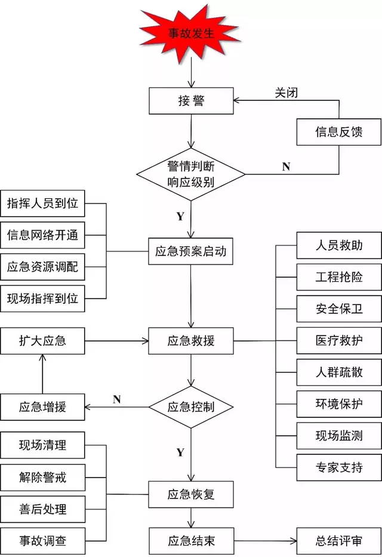

图3 应急事件处置流程框架图（来源并综合于网络）‍

在现场层面，一个具体的突发公共事件应急管理流程如图3所示，在突发公共事件应急管理数据库的基础上，设定和编写突发公共事件脚本，对可能的高风险地域、部门、时间节点的可能事件类型进行想定推演，未雨绸缪，防患于未然，为随时可能发生的突发公共事件做好预案和准备。

## 应急管理在美国—-FEMA（美国联邦应急管理署）

科技的发展提高了民众生活水平，但平静的生活仍然有可能被各种灾害打断，例如台风、洪水、森林大火等。今天让我们来谈一谈本文的主角，美国联邦应急管理署，FEMA。

**一、简介**

FEMA，全名美国联邦应急管理署，隶属美国国土安全部。成立于1979年4月1日，由美国政府管辖，总部坐落在美国华盛顿。发生灾难时州长须宣布紧急状态并请求总统命令FEMA和联邦政府来应对灾难。

FEMA成立之初的目的是协助灾难发生时的应急救助和接收分配国家和当地政府的资源。它的核心任务是在灾前，灾中，灾后帮助人们，保障人民的生命财产安全并且确保灾后的恢复重建工作。同时，作为应急准备工作的一部分，FEMA还为整个美国及其领土的应急人员培训提供资金。

**二、历史沿革**

19世纪初，新罕布什尔州的港口城市朴茨茅斯发生了一系列毁灭性的大火袭击。1803年第7美国国会通过了一项措施，为朴茨茅斯商户提供减免关税。这被广泛认为是联邦政府在灾后提供救济的第一部立法。在1803年至1930年之间，通过临时立法进行了100多次救济或赔偿。

1929年大萧条开始后，赫伯特·胡佛总统重建金融公司（RFC），目的是向银行和机构提供贷款以刺激经济，以及负责在灾难发生后分配联邦资金。RFC被认为是第一个有组织的联邦灾难应急机构。

多年来，国会不断地扩大所涵盖的援助类别及范围。通过颁布不同形式的立法，为各种类型的灾害和受害者建立了援助金计划。它规定了援助金资格，然后建立或委托给各联邦和非联邦机构。

1978年第3号重组计划之前，超过100个独立机构正在争夺对灾难的控制权和管辖权。FEMA作为独立机构成立后，这种情况得到改善。

 

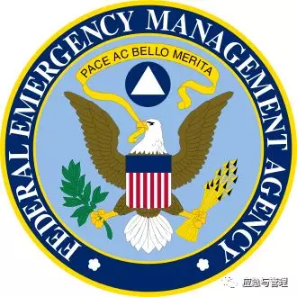

FEMA根据1978年第3号重组计划成立，并由吉米卡特总统于1979年4月1日签署命令启动。同年7月，卡特签署了第12148号行政条令，FEMA开始吸收联邦保险管理局，国家消防局，控制管理局，国家气象局，总务管理局联邦防范机构和联邦灾害援助管理局。

**国土安全部下属的FEMA（2003年至今）**

在2001年9月11日的袭击之后，国会在2002年创建了国土安全部（DHS），以便更好地执法，备灾，恢复，保护边境和民防。自2003年3月1日起，FEMA被国土安全部吸收。自此，FEMA成为国土安全部应急准备和应急理事会的一员，雇用了2,600多名全职员工。于2007年3月31日再次成立联邦紧急事务管理局，并保留在国土安全部。 

 

2008年秋季，FEMA 与广告委员会合作，接管了全国公共服务广告（PSA）活动。用于教育和授权国人准备和应对，其中包括自然和人为灾害在内的紧急情况。

**三、组织机构**

美国联邦紧急事务管理局由国家消防管理局、联邦洪水保险管理局、民防管理局、联邦灾害救济管理局和联邦防备局等机构合并而成，主要负责联邦政府对大型灾害的预防、监测、响应、救援和恢复工作。紧急事务管理局在全国常设10个区域办公室，每个区域办公室针对几个州，直接帮助各州开展救灾和减灾工作。

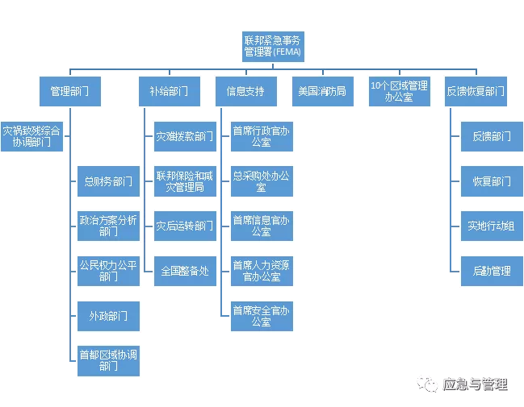

人员及预算

根据2012年统计，FEMA有10,000人左右的灾害协助员工，但是预备员工占总人数的60%。此人数不包含旗下机构人数，例如国家消防局。FEMA的年预算是130亿美金，根据各个州的灾害不同，每个州分配的资金也不同。年底会在FEMA网站上公布这些资金使用情况的年度清单。根据FEMA官网年度清单，2018年的国家应急管理资金为160亿美金。

 

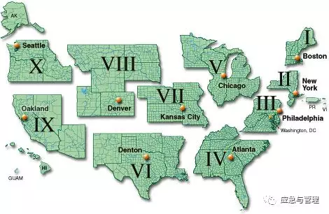

十个区域

​    \-   地区一，波士顿，马萨诸塞州- 管辖康涅狄格州，马萨诸塞州，缅因州，新罕布什尔州，罗德岛州，佛蒙特州    

​    \-    地区二，纽约，纽约州-管辖 新泽西州，纽约州

​    \-    地区三，费城，宾夕法尼亚州-管辖 华盛顿 DC，德拉瓦州，马里兰州，宾汐法尼亚州，维吉尼亚州，西维吉尼亚州

​    \-    地区四，亚特兰大，乔治亚州-管辖 阿拉巴马州，佛罗里达州，乔治亚州，肯塔基州，密西西比州，北卡罗莱纳州，南卡罗莱纳州，田纳西州

​    \-    地区五，芝加哥，伊利诺州-管辖 伊利诺州，印地安那州，密西根州，明尼苏达州，俄亥俄州，威斯康辛州

​    \-    地区六，德州丹顿，德克萨斯州-管辖 阿肯色州，路易斯安那州，新墨西哥州，奥克拉荷马州，德克萨斯州

​    \-    地区七，堪萨斯城，密苏里州-管辖 爱荷华州，堪萨斯州，密苏里州，内布拉斯加州

​    \-    地区八，丹佛，科罗拉多州-管辖 科罗拉多州，蒙大拿州，马里兰州，南达科他州，犹他州，怀俄明州

​    \-    地区九，奥克兰，加尼福尼亚州-管辖 亚利桑那州，加尼福尼亚州，夏威夷州，内华达州，密西根州

​    \-    地区十，博塞尔市，华盛顿州-管辖 阿拉斯加州，爱达荷州，奥勒冈州，华盛顿州

**四、应急等级机制**

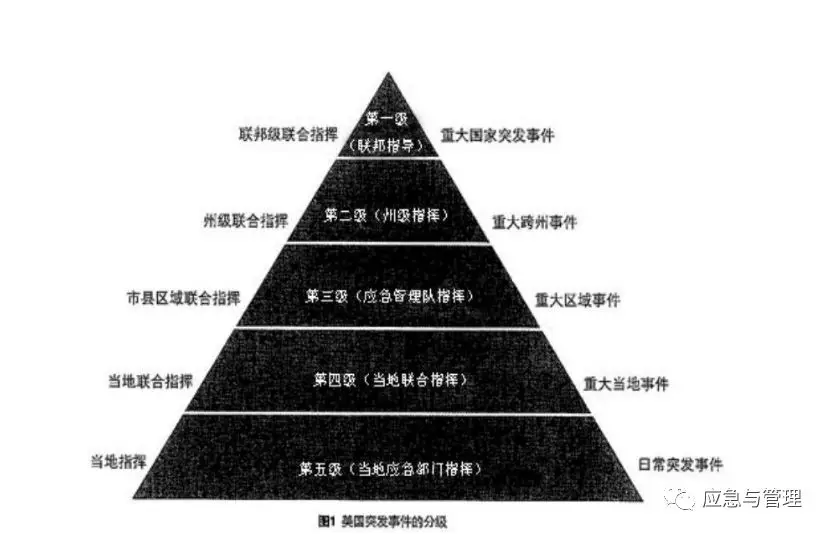

根据国家突发事件管理系统（NIMS）规定，突发事件由影响范围和受灾程度分为五级。第五级和第四级发生影响的范围为市县，由当地政府和应急部门指挥。第三级发生范围为一级或者大城市，由州政府及应急管理队指挥。第二级和第一级的影响范围为州一级或者国家层面，由州和联邦政府共同指挥。

\-    在地方层面，地方政府使用其资源来应对灾害和实施恢复工作。

\-    在州层面，州政府可能有许多地方辖区同时请求援助，州政府将充当地方政府的代理人，使用州政府资金来解决地方政府的短缺。

\-    在联邦层面，当一场灾难来袭，严重到地方政府和州政府无法提供所需的资源时，联邦政府会通过FEMA启动和实施联邦应急计划(FRP)。

**五、灾前减灾计划**

FEMA的减灾机构负责在灾难发生前采取行动，识别风险，减少财产损失和恢复时间。该机构有针对洪水，飓风和热带风暴，水坝和地震的特定计划。

FEMA致力于通过国家洪水保险计划为洪泛平原的房主提供洪水保险，并努力在已知的洪泛平原上实施建筑控制（无建筑区域），并重新安置或改造一些有风险的建筑物。灾前减灾补助金可用于购置房产，改造现有建筑物，建造龙卷风和风暴掩体和小型防洪项目。

**六、应急组织协调**

FEMA的应急基于国家灾害医疗系统（NDMS），城市搜索和救援（USAR），灾害受害人员应急小组（DMORT），灾难医疗援助小组（DMAT），移动紧急应急支持（MERS）等。

**国家应急协调中心（NRCC）**

FEMA的国家应急协调中心（NRCC）位于FEMA总部中心，负责联邦政府对重大灾害和紧急情况的支持，包括支持区域一级灾难事件。在应急的初始阶段，FEMA将观察潜在的或不断升级的灾害事件。NRCC与受影响地区进行协调，并提供所需资源和政策指导。

**国家灾害医疗系统（NDMS）**

NDMS由灾民医疗和联合护理的团队组成。这些团队包括医生，护士，药剂师等，通常由医院，公共安全机构或私人组织赞助。此外，还开发了快速部署部队（RDF）小组，由美国公共卫生服务委员会组成，以协助NDMS。

**城市搜救（US＆R）**

城市搜索与救援任务部队从结构坍塌或者密闭空间进行救援，例如，矿山塌陷和地震。

**移动紧急应急支持（MERS）**

公共安全提供通信为FEMA提供支持。例如，FEMA可以通过灾难附近的连接着卫星的通讯设备与受灾民众通信，以及可以在空运中使用的可移动电信系统（MATTS）。美国联邦紧急事务管理局于2018年10月3日对国家无线应急系统的第一次测试，向大约2.2亿个电子设备广播，该短信伴随着一个闪烁的警告标志和警告音。总统仅可在国家紧急情况下或在公众面临危险时命令FEMA播放此类警报，手机用户无法选择退出这些警告。

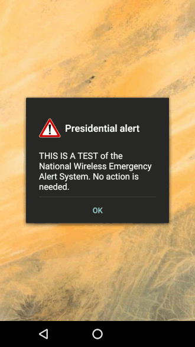

## 治道｜面对肺炎疫情，政府的数据开放还有很大空间

自武汉新型冠状病毒感染的肺炎疫情爆发以来，国家和地方各级政府部门通过各种渠道发布了许多领导指示、疫情通报、自我防护知识、相关政策通知，这些信息的发布有助于公众获知疫情的发展情况和相关知识，在一定程度上满足了公众的信息需求。

然而，进入了大数据时代，除了以上政府发布的信息，公众可能还想知道一些更具体的数据，比如：所在城市或区县每天有多少确诊和疑似病例，增长情况如何？也想了解一些有关病人基本情况的数据，比如：病人从哪里来，去过哪里，哪天发病的，那些疑似病例后来确诊了没有，如果没确诊，他们得的又是什么病？

虽然我也不断会从网上和身边的朋友那里得到各种各样的小道“消息”，但这些消息是真是假，难以确定。而且这些信息比较零碎，无法让我全面系统地了解疫情的进展情况。我想知道有关疫情的最新的、权威的、准确的官方数据。

**一、国家卫健委网站数据**

于是，我来到了国家卫生健康委员会的网站，看看这里有没有公开的官方数据。打开国家卫健委的官网后，首先在网页最上方位置看到了“全力做好新型冠状病毒感染的肺炎疫情防控工作”横条。（以下未经特别注明者，均截图于1月23日。）

国家卫生健康委员会网站首页，1月24日截图

点进横条，可以看到页面最上方是“疫情通报”、“防空动态”两个版块，在“疫情通报”中可以看到国家卫健委发布的各省确诊病例和疑似病例数据。

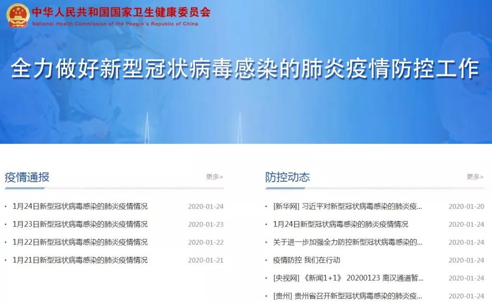

国家卫生健康委员会网站，1月24日截图

1月23日这天发布的疫情通报详细列出了17例死亡病例的病情介绍。但是，我如果还想知道其他几百例确诊和疑似病例的情况，就无从得知了。

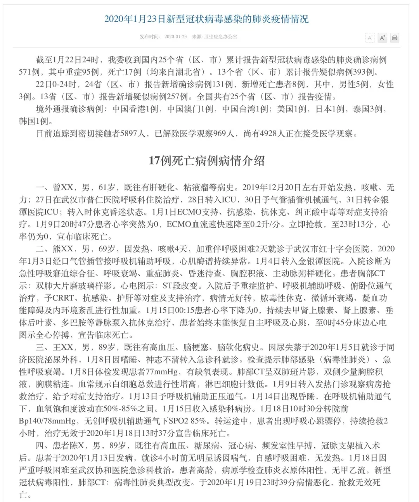

而且，虽然这些病例情况已足够详细，但**数据是以夹杂在文字中的形式出现的，而不是以结构化表格的形式展现，不够清晰直观，也不利于使用者进行分析利用。**假如我想用这些数据做一些分析的话，还需要自己先从这些文字中把数据提取和整理出来，做成表格或图。在这些大段的文字之外，如果还能有一张数据表格就能一目了然，方便很多。

此外，国家卫健委发布的数据只到了省一级，而没有每个城市或区的数据。于是，我搜到了武汉市卫健委的官网，来看看这里有没有城市一级的数据。

**二、武汉市卫健委网站数据**

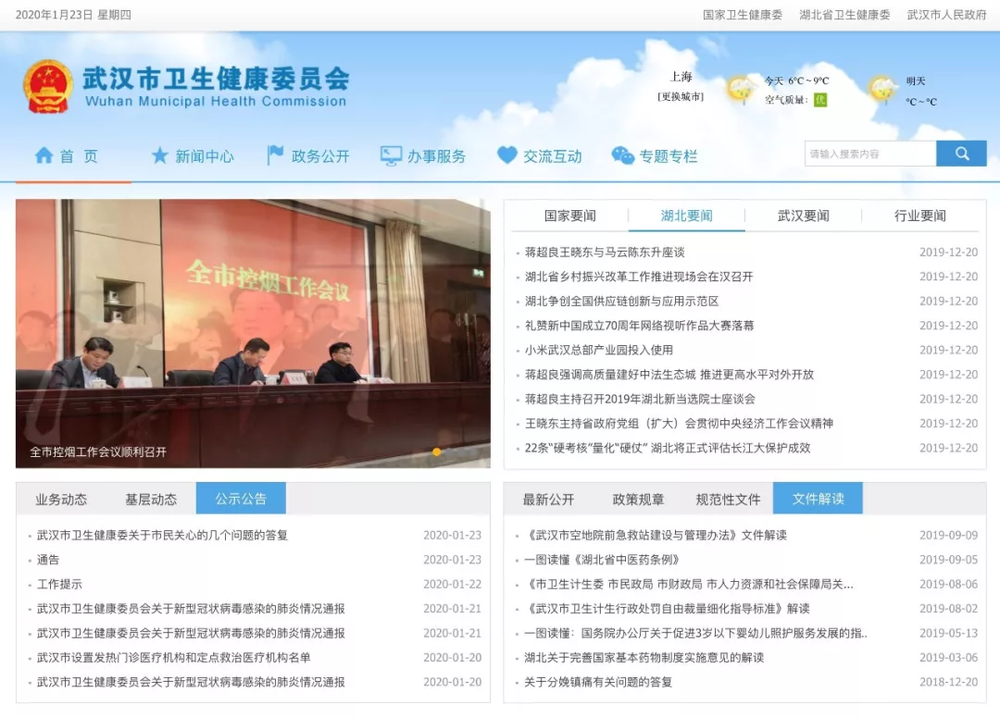

在这个网站的首页，第一眼看不到有关疫情的信息或栏目。逐个点开各个栏目后，才在“公示公告”这一栏目下找到了“肺炎情况通报”。

相关通报公布了武汉市的累积病例数量和当日新增病例数据。然而，这些数据仍然没有以表格的形式出现。在1月21日发布的情况通报里，只能看到20日那天的新增病例数据，想要知道20号之前的数据，就要再去翻找以前发布的通报。

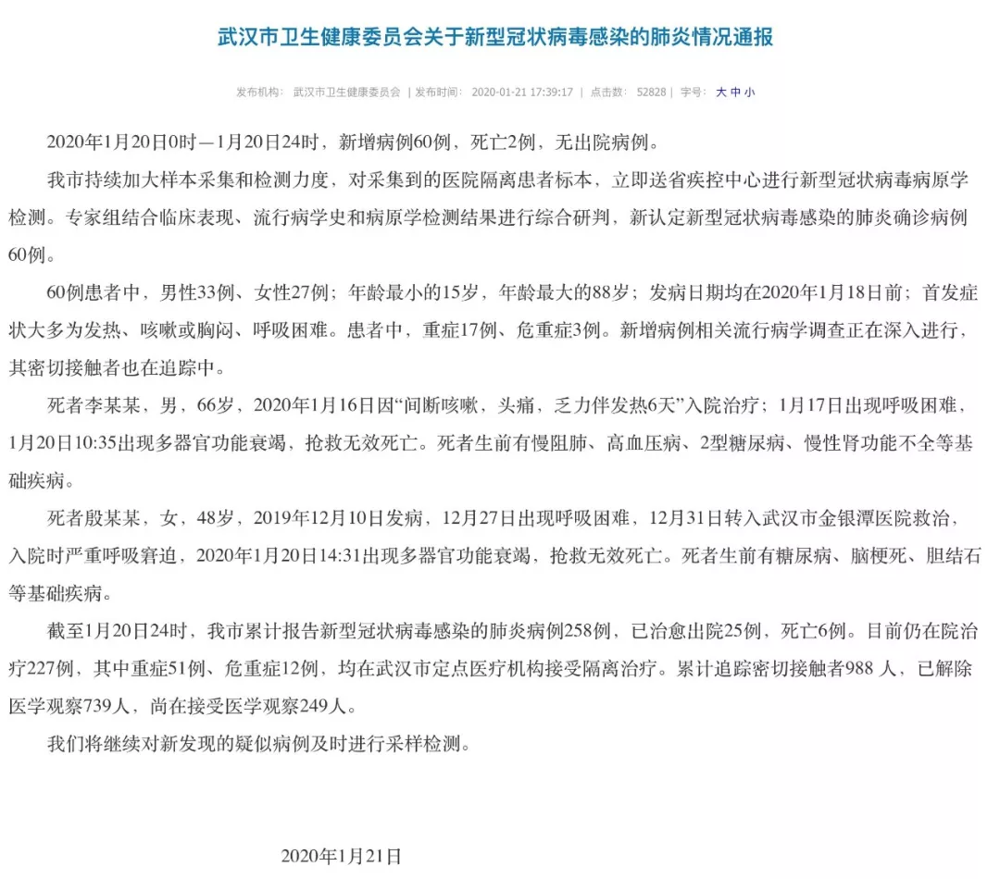

再进一步查找后发现，这些**情况通报是和医疗机构名单、知识问答、结果公示等其他信息夹杂在一起发布的，并不便于用户查找和获取。**更重要的是，这些情况通报不是每日都有更新，数据并不完整。比如，1月17号，以及1月6号至1月10号都没有发布情况通报。这几天是没有发现新增病例？还是没有发布新增病例？没有任何备注说明。

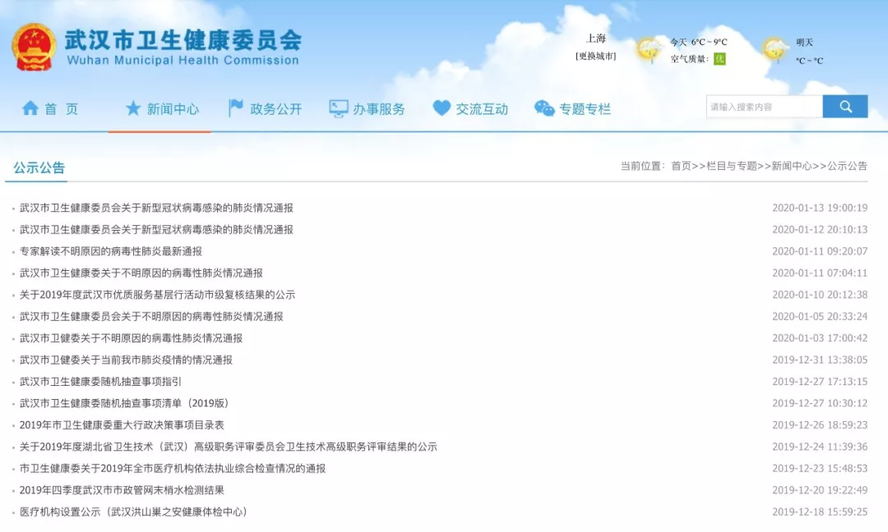

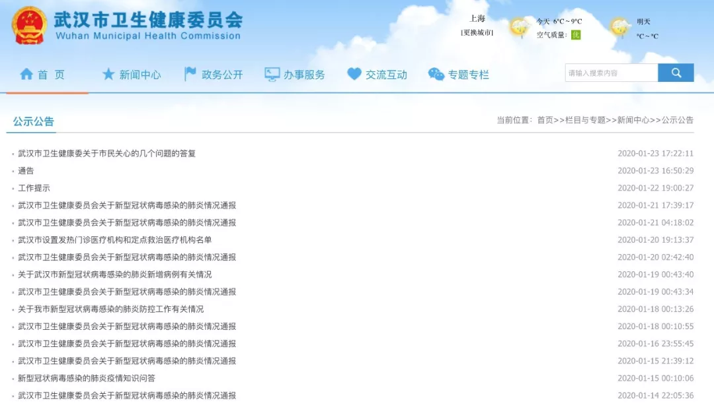

哪里能找到一张有关疫情数据的表格？这张表格不用很花哨，只需要把每个地方每天的疫情数据都清楚明白地展现出来就行。

然而，无论在国家、湖北，还是武汉卫健委的网站上，我都没有找到这样一张表格。实际情况是，**有关疫情的数据以碎片化的、不连续的、不完整的方式散落在不同的政府网站、页面和文件里。**大部分公众不可能有精力和能力去各个政府网站上提取和整理这些数据，其结果是，虽然各级政府认为它们已经发布了这些疫情数据，但老百姓并没有获得感。

武汉市卫健委发布的情况通报中还包括了新增病人的男女人数、病人最小和最大年龄等统计数据。然而，这些数据是对原始数据进行加工和归总形成的结果，并不是一手的原始数据。原始数据可以用来做进一步的深入分析，但统计数据的再利用空间就很小了。

比如，情况通报中公布了新增病例的最小年龄是15岁，最大年龄是88岁，但15岁到88岁这个区间实在是太大了，如果我想知道在15-88岁之间，病人主要集中在哪个年龄段，我和我的家人是否正好属于这个年龄段，仅通过15和88岁这两个统计数据是无法回答我的这些问题的，只有得到经过统计归总前的每一个病人的年龄数据才行。

当然，我并不需要知道每个病人的姓名、住址和电话等个人信息，而只需要得到有关他们的一些基本特征的数据就可以了。这些经过匿名化处理的数据，既能被用来做出有用的分析，又不会侵犯到病人的隐私。

之后，我还在人民日报官方微博上看到过每日发布的“疫情速报”，这些帖子以短平快的方式发布最新疫情。但这些数据仍然是碎片化的，无法帮助我系统全面地了解疫情全貌。

1月24日，我在北京市卫健委的官方微博“首都健康”上，找到了一张表格，展示了有关病人情况的一些基本数据。但这只是当日的新增病例数据，而不是每一天的数据，数据仍然不够完整。

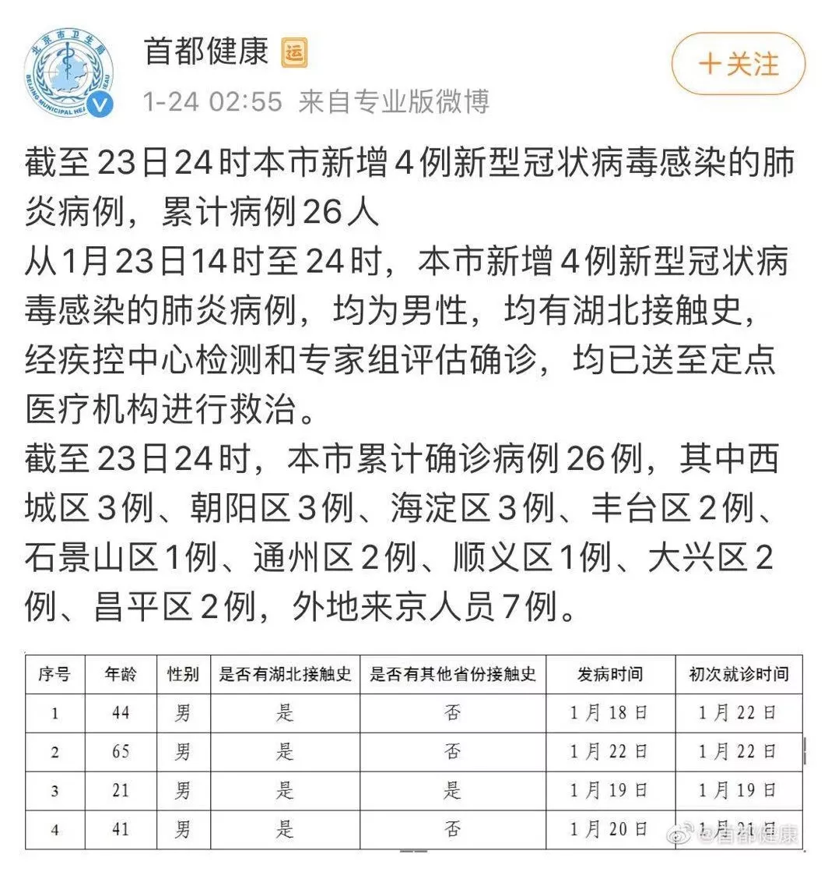

**三、社会化机构发布的疫情数据**

1月24日，我在手机上看到了由医学知识共享网站“丁香园”和澎湃新闻 “美数课”栏目制作的全国疫情数据，这些数据的呈现，相较于政府网站要系统、直观和清晰很多。

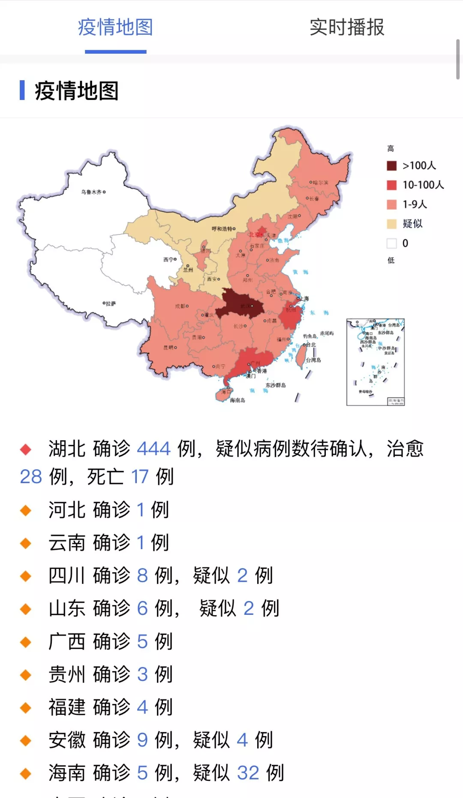

微信公众号“丁香园”，1月24日截图

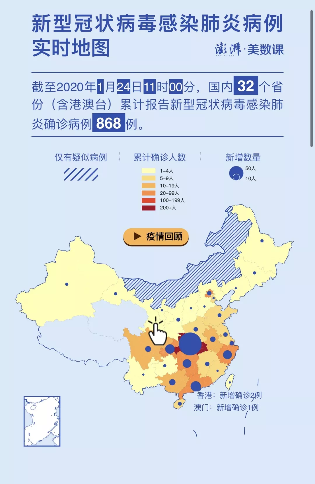

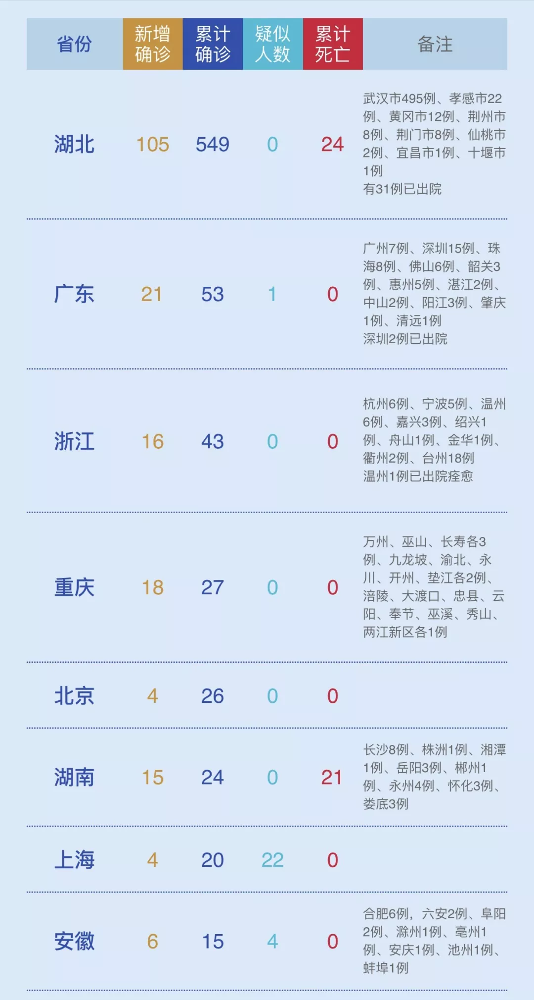

澎湃新闻“美数课”栏目，1月24日截图

为采集和整理这些数据并进行符合受众需要的制作，这些社会化机构一定花了不少时间和精力。然而，由于政府发布的数据具有碎片化、不完整、颗粒度低等特点，它们的数据展现方式虽然已经非常不错，但在展现内容上仍然无法提供出更全更细的数据。

**四、香港特区政府卫生署网站数据**
有鉴于此，我来到了香港特别行政区政府卫生署的网站。在这个网站的首页上，我在第一排的显眼位置就看到了“严重新型传染性病源体呼吸系统病”的版块。

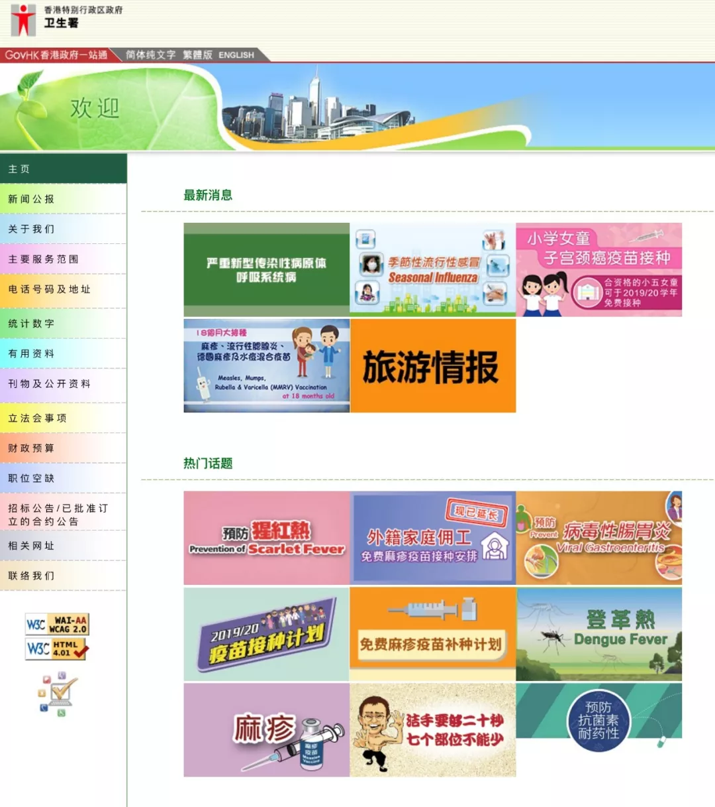

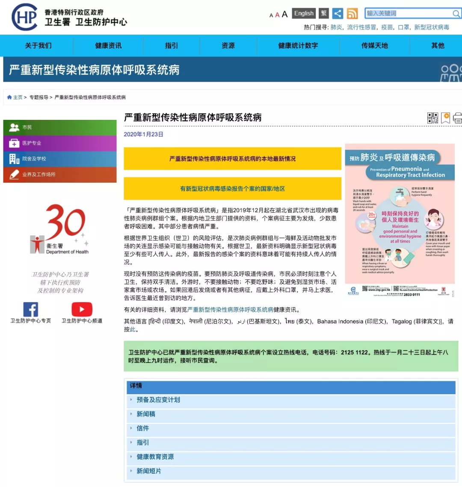

点进这个版块之后，在页面第一行的位置看到“本地最新情况”这条内容，点开后跳出了下面这份表格。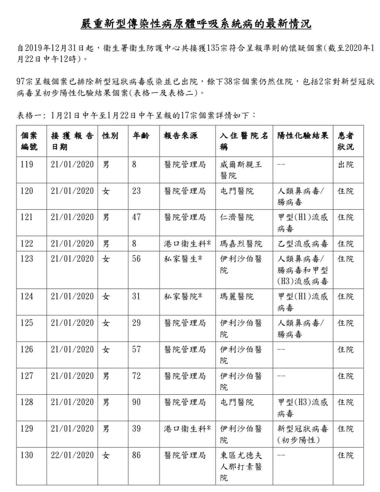

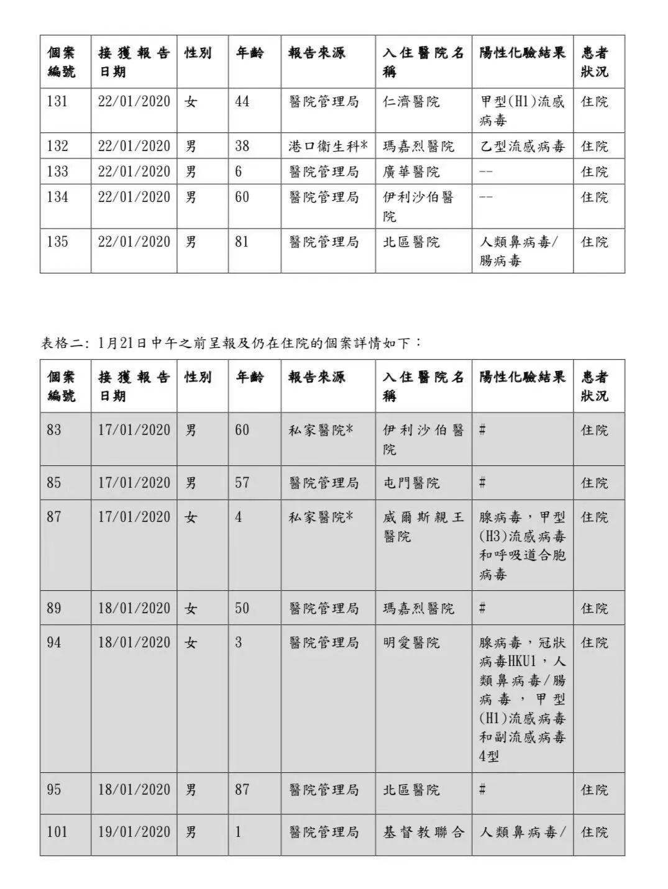

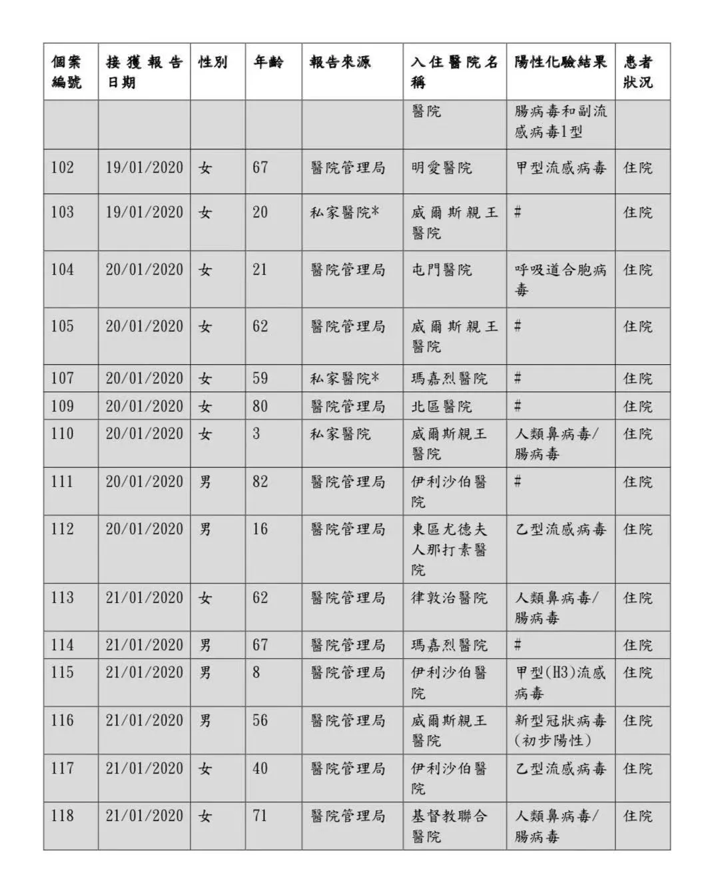

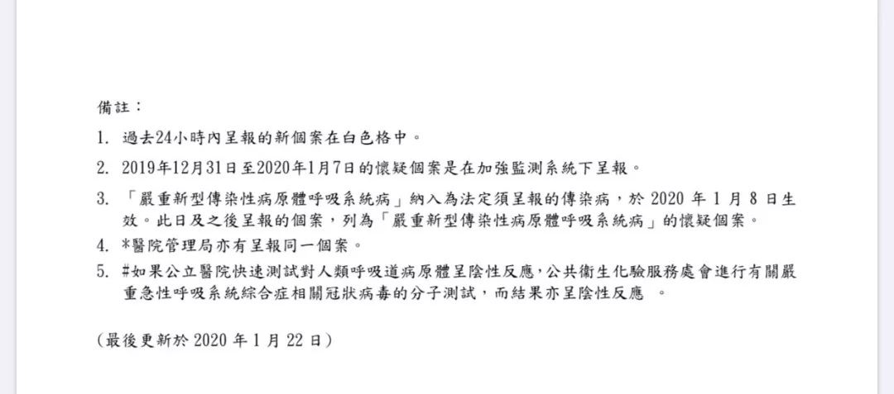

在这份表格上，可以看到**每一位疑似病人的急诊日期、性别、年龄、报告来源、医院名称、化验结果、患者状况。**表格结构清晰，字段丰富，内容详细，便于公众解读和分析利用。从表上能看到，经过化验，绝大部分疑似病人感染的并不是武汉的新型肺炎病毒，而是其他病毒，这些详情都一一列明了，令人信服。

同时，这张表格上还有多个细节值得关注。

首先，在发布病人基本信息的同时，去除了患者的具体姓名，保护了个人信息。

其次，在发布当日新增数据的同时，还在后面列出了之前发布的累计数据，并将当日数据和历史数据用白色和阴影两种颜色区分开来。这样公众就不用再去“爬楼”， 把之前发布的一个个表格下载下来再整合起来了。就这一个贴心的举手之劳，就给用户带来很大的便利。

第三，特别需要关注的一个细节是，在表格之后还附上了“备注”，对数据采集的背景方法和呈现方式进行了详细说明。不要小看这个备注，这能帮助公众更准确地理解和使用表格中的数据，避免误解和误用。

朴素干净的一张表，却填满了细节和温度，体现了背后真正的用户视角和数据思维。

唯一的小遗憾是，这些数据还是以PDF的格式发布的，还需要人工做一下转换处理后才能直接利用。PDF格式便于阅读，不易被修改，但不便机器读取，以进行加工利用。如果能在PDF格式之外，还能提供机器可以读取的excel或csv等格式，就更加便于专业研究者用户进行分析利用了。

**五、政府数据开放的基本原则**

畅想一下，如果类似“丁香园”这样的社会化机构也能得到这样的疫情数据，它们能开发出来的可视化应用会更全更细，给用户带来更好的体验。而且，它们也不再需要花费大量的时间精力去搜集整理各种碎片化的、不符合标准格式的政府数据，而是可以集中精力将数据可视化应用做得更直观更生动。

在这个过程中，政府作为数据的供给侧把数据开放出来，市场上的专业组织作为数据的利用者把数据开发成各种应用，然后一起为社会公众提供信息服务。政府和市场实际上以数据为原料实现了一种协同治理，便于共同应对疫情。

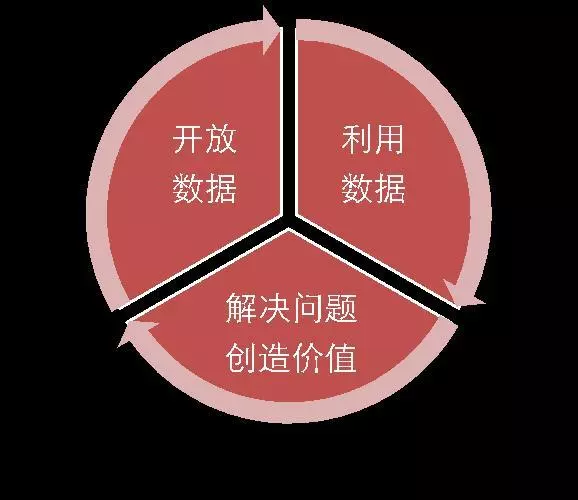

此外，将数据平等、无歧视地开放出来，让不同的社会化机构都可以对这些数据进行开发利用，可能还会做出比“丁香园”等更好的应用。这些机构之间还可以实现良性竞争，以最大限度有利于用户。这其中一个关键是，政府是否把完整的、准确的、及时的数据，以便于利用的格式提供给了利用者。否则“丁香园”之类机构即使手再巧，也难为无米之炊。

而这正是数据开放和信息公开的一个重要区别。政府信息公开的主要目标是保障公众的知情权，提高政府透明度，而政府数据开放则不仅要让社会知情，还要让社会能对政府数据进行开发利用，从而释放数据的能量，创造社会和经济价值。

目前，在各国的政府数据开放实践中，开放数据通常呈现为以电子化、结构化、可机读格式开放的数据集。数据集是指由数据组成的集合，通常以表格形式出现，每一列代表一个特定变量，每一行则代表一个样本单位，这样的形式更便于数据利用者进行开发利用。

为推动数据的开放和利用，2007年，一群开放数据倡导者提出了**政府数据开放的八项基本原则**：

第一，完整（Complete）。除非涉及国家安全、商业机密、个人隐私或其他特别限制，所有的政府数据都应开放，以开放为原则，不开放为例外。

第二，一手（Primary）。开放从源头采集到的一手数据，尽可能保持数据的高颗粒度，而不是开放被修改或加工过的数据。

第三，及时（Timely）。数据尽可能以最快速度发布，以保持数据的价值。

第四，可获取（Accessible）。尽可能地拓宽开放数据的用户范围和利用目的。

第五，可机读（Machine-readable）。对数据进行合理的结构化处理，使之可被计算机自动处理。

第六，非歧视性（Non-discriminatory）。数据对所有人都平等开放，无需登记。

第七，非专属性（Non-proprietary）。数据以非专属格式存在，从而使任何实体都不能独占和排他。

第八，免授权（License-free）。数据不受版权、专利、商标或贸易秘密规则的约束，除非有合理的隐私、安全和特别限制。

目前，该标准已被国际开放数据领域广泛接受。

六、面对疫情的政府数据开放当大有作为

面对疫情，公众只有掌握了充分的信息，才能做出更理性的决定，采取更有利的行动。有量化研究表明，媒体的报道量增加十倍，传染病的感染数将会减少33.5％。在互联网和社交媒体已如此发达的数字社会，公众如果不能及时获得来自政府的权威数据，而只能在网上看到各种真真假假的小道消息，只会增加他们的恐慌感。

因此，让公众在疫情初期就能获得充分的信息，从而加强自我防护，减少出行聚会，有利于政府防控疫情。反之，片面地以避免社会恐慌为出发点，采取“外松内紧”的策略，即政府虽然在内部努力防控，但却没有将疫情信息充分告知社会，会造成公众在不知情的情况下，继续毫无防护地四处游走，最终反而助长疫情的传播。

进入大数据时代，社会公众的信息需求也发生了变化。**面对疫情，公众想知道的不仅仅是自我防护知识、官方疫情通报、相关政策通知，还想获得权威的、完整的、一手的、准确的、及时的数据。显然，目前各级政府相关部门在各个渠道上发布的碎片化的、不连续的、不完整的数据，还不能满足公众的数据需求。**

传统的信息公开主要以非结构化的、文本的形式提供，而在大数据时代，公众希望能获得结构化的、可机读的数据，便于其理解和加工利用。政府数据开放由此走上前台，将开放的对象推进到了信息的底层——数据层。

而且，防控疫情也不能只靠政府一方来孤军奋战，还需要整个社会的充分参与。政府将自己掌握的疫情数据作为一种基本的原料开放给社会，然后社会力量可以将这些数据开发成各种应用，更好地满足公众的数据需求。最终，政府和社会之间可以实现协同治理，控制疫情，让广大民众受惠于大数据带来的便利。

近年来，我国中央和地方层面已出台了多项有关公共数据开放的政策法规。2017年2月，中央全面深化改革领导小组第三十二次审议通过了《关于推进公共信息资源开放的若干意见》，要求推进公共信息资源开放，促进信息惠民，着力推进重点领域公共信息资源开放，释放经济价值和社会效应。2018年1月，中央网信办等多部委联合印发了《公共信息资源开放试点工作方案》，确定在北京、上海、浙江、福建、贵州开展公共信息资源开放试点，并要求试点地区着力提高开放数据质量、促进社会化利用，探索建立制度规范。

2019年8月，上海市政府第61次常务会议审议通过了我国第一部专门针对公共数据开放的地方政府规章《上海市公共数据开放暂行办法》。该办法要求上海市各级公共管理和服务机构向社会提供具备原始性、可机器读取、可供社会化再利用的公共数据集。

近年来，我国的政府数据开放工作也正在稳步推进。根据复旦大学数字与移动治理实验室近期发布的《中国地方政府数据开放报告（2019年下半年）》，自上海市于2012年6月上线了我国第一个地方政府数据开放平台后，截至2019年下半年，我国内地已有102个地级以上的地方政府推出了数据开放平台，国家公共数据开放平台也将于近期上线。

然而，**当前的政府数据开放仍然面临着很多挑战和难点问题。**例如，政府数据开放，在字段和颗粒度上做到多细才合适？怎样开放数据才能既满足公众知情权，有利于社会对数据进行开发利用，又能维护社会安定和个人隐私？怎样防止数据在开放后被人滥用，以保护公共利益和第三方利益？如何才能在数据开放利用全过程的事前、事中、事后各个阶段既促进数据利用，又加强安全防护？如何面向不同人群，针对不同类型的数据，以不同的方式分级分类地开放？这些问题都还需要各地各级政府进一步探索和研究。

无论如何，面对疫情，政府数据开放还有很大空间可以作为。

## 邬贺铨：大数据技术助力新冠疫情防控

2月18日，中国互联网协会网来学院举办的“新一代信息技术助力疫情防控”公开课邀请到中国工程院院士、中国互联网协会咨询委员会主任邬贺铨作为授课嘉宾，围绕“大数据助力疫情防控”主题深入剖析了大数据在支撑服务疫情防控相关工作中发挥的重要作用。

https://mp.weixin.qq.com/s?__biz=MzA3NzQ0NDEzNA==&mid=2650219752&idx=1&sn=a1b05d0a034d8ec9b6e7ca5498493ae3&chksm=875261a1b025e8b737ede43f50db39a4f5c1cdad63ef45d9e87c309bc3332f1112e31104b67d&scene=90&xtrack=1&subscene=93&clicktime=1582529743&enterid=1582529743&ascene=56&devicetype=android-29&version=27000afd&nettype=WIFI&abtest_cookie=AAACAA%3D%3D&lang=zh_CN&exportkey=AuPWmhlhmKSQOrEDHY6IchI%3D&pass_ticket=ofx8HIRIJCPgRKB4ZKm%2Fo0AmhWooAHM8hIIXCZ1FGB8%3D&wx_header=1

以下为演讲整理稿，敬请阅读。

### 大数据助力疫情溯源与监测

各位网友晚上好，我今天跟大家谈一下“大数据助力疫情防控”。习总书记指出，要运用大数据等手段加强疫情的溯源和监测，这是对大数据作用的肯定，也是对互联网界的一个要求。

### 手机已经成为另一张“身份证”

现在手机已经成为我们个人的另一张身份证。我们在2018年移动通信普及率是112%，而全球是106%，独立移动通信用户的普及率，也就是说扣除了一人多号，我们是82%，接近发达国家的水平，移动互联网的普及率高于全球的平均水平。可以说，我们国家有独立活动能力的人群几乎都有手机，而且中国实行手机用户的实名制，从手机用户就可以识别持有人的身份。

### 手机可以关联持有人的位置

一般手机在待机的时候，用户会从一个小区移动到另一个小区，这个时候手机要不断接收基站发出的测量信号。读取基站下发的重选小区参数，选择最优小区，在非待机的时候实际上就是切换了。因为用户可能是在移动的，而蜂窝半径又比较密，因此，更新的时间要比较快。目前的更新是秒级，可以说具有实时性。

手机是根据什么定位呢?主要是利用基站，有几种方法，可以改进基站定位。如果说用比较好的方法，定位精度可以数十米，一般目前可能是一两百米，5G基站更密，定位精度就更高。

### 全球导航卫星+数字地图可提升定位精度

当然，除了基站定位以外，我们用全球导航卫星和数字地图都可以定位。现在的智能手机比例已经很高了，占手机用户的比例能够达到百分之八九十，而智能手机都装了全球导航卫星接收的能力。定位的精度一般数十米，更好的可以做到米级，但是无法定位室内用户。另外，数字地图公司有它的一些方法来扫描这个街道，因此它的定位甚至可以到每一栋楼。

一般来讲，手机用户如果下载了这种数字地图的APP，而且开机并启用了定位功能，它就会随着变化新的位置，发送信息给GPS。所以，能知道你所在的位置。当然，它的定位精度比基站的方法要好得多。但是，只限于装有数字地图APP的用户。我们有个比较知名的数字地图公司，目前它现有用户数是7个亿(下载)，占全国移动用户还不到一半，只有43%，所以说覆盖面是有限的。但是，尽管电信的运营商覆盖定位用户更多、更全面，但是精度并不一定比数字地图公司更好。

这里边，给出的是一个数字地图公司的大数据地图，它可以溯源，武汉春节前将近500万人流到什么地方去，这里可以给出一个很好的走势。

有了这些数据，怎么来分析疫情的传播?国际上通常用一种叫SEIR的模型。它把人群分成什么呢?I就是已经感染病的人群，E是密切接触者，S目前是健康的，R是最后运算结果是康复人群的，它有一套规律。中国的学者提出了一种改进C-SEIR，增加了P和Q，P是疑似人群，Q是确诊人群。现在我们国家也是分四类，从中可以计算出疫情传播的模型。

我们可以看到，这是从1月份到2月9日，全国的疫情传播模型。可以看到传播的状况，目前，中国的修正模型，考虑了政府采取措施和大众的对于防疫的意识，但所有上面的模型，还是基于城市里头感染者和没感染者，包括所有的加起来是一个常数，也就是说不考虑城市里面有流入的和流出的。实际上利用电信大数据，可以把流入流出的一部分人考虑进去，可以使得这个模型更精确。

### 大数据可视化——“疫情方寸间”

当然，有了模型，很多大数据还需要有一种可视化的表现。这里给出一种可视化的方式，每个方框表示每个省。比如说右下角的方框——湖北，它的背景颜色就比其他的深，也就是感染人群更多。其中绿色是治愈率，黑色是死亡率，可以看到治愈的比例也比其他省要少，死亡的比例反而还比较高。可以看到，这是一种直观的看法。

我们有了这种行为的大数据，可以精确到每一个小区。左图是百度，以上海为例，右图是腾讯，以深圳为例，它都可以以一种APP的方式来发布，老百姓可以用，下载可以查询，甚至可以查到哪个小区的具体位置，距离你所在地方有多远，里面有多少个是确诊病例。实际上，其中一家公司说，已经覆盖了200多个城市了。

现在开始复工了，这是2月10日，节后第一个复工日，人流的增加也为疫情的防控带来了一些新的压力。这里面给出了疫情期间城市的热力图，我们可以细化到每个县，可以让我们知道什么地方人最多，尽量避免人口的密集。

这里面是一个确诊患者的行程追踪。从底下看是1月21日他离开武汉，乘坐了高铁，到达一个地方，21日又换了一个高铁，到另外一个地方，一直到24日，他发现有症状了，当然他行程还得继续，27日又到了一个地方，30日又到了下一个地方，31日确诊了。根据这种确诊患者的行程追溯，我们可以很好地知道他到过哪里。现在有些地方是依靠流行病学的调查，去问这个患者，你什么时间到什么地方，一个是他记不准，另一个说不准，利用手机的大数据，可以很好的知道。同时，通过计费数据，也可以知道他平时比较密切的联系人，也可以知道有没有可能是密切接触者。

### 基于卫建委+交通+工信 数据查找密切接触者

我们把卫健委的数据、交通系统的数据、工信部门的数据组合起来，可以找出密切接触者。比如说，卫健委可以知道确诊患者的姓名、身份证号，然后通过交通部，可以给出这个患者半个多月来乘坐过的航班车次，卫健委让工信部提出，这些人的手机号是什么?根据手机号，地方政府可以找到密切接触者，当然这是从官方的查找。实际上平台也可以开放，同行者可以在同行查询平台查出我所坐的航班和车次及车厢，车上有没有确诊患者，可以很好地发现密切接触者。

### 电信疫情大数据平台用于个人自证无疫区行程

目前，是返程复工还有节后回家的时间，有些人隐瞒了自己来自疫区、到过疫区的经历，回到家、回到村子里头还到处走，虽然看上去没有症状，但是可能已经感染了，并且是有很强的传染性，导致了疫情扩散，导致几十人甚至上百人被隔离，或者已经被感染。通过手机定位，是可以知道这个用户是不是来自疫区，还是到过疫区，但是这种数据不能直接提供给街道、小区和乡镇，因为隐私的保护原因，如果我们开放给他们，很可能不一定是查患者，说不定用作其他，所以不能这样做。

现在怎么办呢?我们知道，根据《个人信息保护法》，本人是可以查询自己信息的。所以，工信部现在统筹三个运营商，提供了用户行程的服务。用户提出来，你可以查询你本人，在14天前到过什么地方，当时工信部提出是按停留4个小时以上，这个时候，你有清单，就可以上当地的用工单位、街道、小区来证明你自己没有到过疫区，这就是自证。目前，这件事情已经开放查询上千万人次了。

现在面临返程复工，有些地方的疫情防控措施甚至扩大化，对一些疫情确诊人数比较多的省，要求全部都不许人家回来。严控不能失控，硬核但不能乱来，所以实际上，返程的一些检查是必要的，当然就会对旅途带来一些影响，这里比如说以高德地图为例，他给出一个人从济南要到上海，沿途经过城市的疫情情况列出来了，上海市对进上海的人有什么管理及要求也列出来了，包括高速路入口、出口的车流量，以及大概这个过程中间有很多检查站，路程需要多长时间也列出，“返程直通车”平台也方便大家，如果返程的人知道，我路上大概要多长时间，要做好什么准备。

### 电力大数据在疫情防控中的作用

除了电信和互联网公司的大数据以外，事实上还有其他大数据。我这里讲的是电力大数据，一个家里边是否有人在家，是否有人回来，根据用电的情况是能区别出来。所以，国网电力杭州公司，做了1000多万条数据收集，开发出大数据分析的算法，能够很好地知道，这里边有没有居家隔离的人，有没有独居的人，社区可以根据这个来判断是不是做针对性地服务。利用电力的用电状况，我们也可以知道复工状况，根据用电量，广东在2月14日已经是正常时候用电量的60%，也就是复工率差不多60%。浙江2月14日的复工率不到1/3，尤其是温州，属于疫情比较严重的地方，复工率只有12%。这些是可以比较宏观地掌握了复工的趋势。

### 医疗大数据助力智能诊断

大数据不仅用于追踪人群等，还可以帮助智能诊断。从现在统计看，新冠肺炎患者的核酸检测，目前只有30%是阳性，尽管它是患病的人，确诊了，但是只有30%。原因是什么?取样是从口腔部来取样的，实际上这里边感染不算严重，肺部才严重。因此，判断还要根据CT，一个肺扫描出几百张这样CT照片，一张张看是比较难的，利用大数据，我们可以用人工智能的技术，可以把它还原回一个3D三维的肺，比较容易看有没有纤维化，有没有肺变为毛玻璃状。同时，现在还可以根据医疗的经验，开发出感染肺炎患者的CT影像大数据分析评价系统，不一定要医生看了，这些CT照片可以放系统上，进行分析，能帮助医生进行病灶分析。过去医生可能要看5个多小时，现在几分钟就可以，因为它把几百张变成一张了。

### 大数据在新冠病毒肺炎新药与疫苗研制中的作用

大数据本身在新冠肺炎新药研制和疫苗研制里，也会发挥作用。新药研制总体上过程是比较长的，新药的筛选、活性的评价、药理的分析、安全评价等等，到临床还要做很多工作。目前是没有特效药的，所以，另外一种途径是老药新用，把一些过去抗艾滋病、流感的药物重新检验一下，看它有没有可能对新冠肺炎有效。我们知道，已经上市的和临床实验的药有近万种，一种一种来筛选时间是很长的，而且现在去积累数据，已经不容易了，如果原来有积累更多的数据更好。这里举一个例子，清华的药学院，它的人工智能药物研发大数据平台，收集了以前冠状病毒研究里边涉及的900多个小分子的实验信息，利用这个就有可能加快药物的筛选。

### 大数据优化医疗紧缺物资的生产组织与调度

大数据也在优化医疗紧缺物资的生产组织和调度上有很好的用处。海尔开发了疫情医疗物资信息共享资源汇聚平台，一方面连接医院，780多家医院;另一方面联系需求的社区，以及能生产这些医疗物资的企业500多家，它发布了这个需求5000多万件，另外，它的采购不限于中国，还到全球，所以实现了抗疫资源的精准对接。湖北有一个医疗物资需求平台，是由志愿者开发的，它爬取网上的数据，按城市医院类别分类，登出需求、运输和联系方式。四川也开发了防控应急物资的管理系统，把物资的入库、调度、审批、库存、日常消耗需求汇总在一起，提高了应急物资配置的调度效率，当然这些都是从网上获取数据。

现在难题是什么?我们的卫健委，并没有得到所有医院的床位数据，因为过去是不联网的，这样导致我们不能实时地知道什么床位是有富余的，什么可以调度出来。所以这也说明，我们过去这方面的工作都不足。

相关数据的融合将能得到更有价值的结果

另外，数据需要融合，现在不少小区实行了封闭管理，现在已经有上线的专项排查APP，不用手登记，用手机一扫身份证，报上体温，数据自动联网。还可以记录下来现在到药店购买发烧药、咳嗽药的人的实名数据，因为有些人已经有病了，没到医院自己买药，实际上是有很大风险的。我们还可以将公交卡、网约车的数据结合起来，这次疫情也是考验我们，联防联控协调调度的机制，包括跨部门大数据的协调能力。

### 大数据协力企业复工

现在是复工了，很多企业需要工人，但是人员流动密集又有风险，因此企业面临两难。杭州采用一种绿红黄三色的健康码的管理方式，区别用户是不是接触过确诊患者、疑似患者，是不是来自重点疫区，以及隔离长短，可以分别对待。但是，你会担心填报是不是真实?这里边健康码是要联系到云端的，跟网上掌握的数据匹配，大数据能查出不实的信息。

### 大数据与隐私保护

大数据是双刃剑，怎么做到隐私保护。实际上，电信的大数据只考虑了信令和计费，不含通信的内容，但是尽管这样，患者的行为数据也是敏感的。电信大数据目前只限于疫情的管控，疫情结束以后，不会再保留有关的原始数据。现在特别要注意的是，除了国务院卫生健康部门依法授权的机构以外，其他任何单位和个人，不得以疫情防控，治病防治为由，未经被收集者同意收集用户的个人信息。这里就难了，又要保护个人信息，又要利用大数据联防联控，怎么办呢?有一种方法，就是原始数据可用不可见。什么叫可用不可见?有关部委，卫健委、交通部、公安部、工信部等可以上报数据的样本，帮助疫情大数据分析调试平台来调试我们的算法和程序，一旦调试好程序，再下发到相关部委，在相关部委的各自范围里头运行并产生结果。最后汇报给上面的结果已经不是原始数据了。这样不改变数据的归属所有权和存储位置，只带走了不含敏感数据的分析结果。

### 疫情大数据系统的信息安全防护

疫情大数据也是需要特别进行安全防护的，从右上角的图可以看出绿色是健康数据，健康数据是黑客所重点关注的，甚至2014年，我们国家的网站受攻击最多的是医疗卫生的网站。美国也统计过，遭遇黑客医疗数据的泄露损失很高，而且疫情大数据不但是商业利益问题，还关联国家政治社会问题，我们以为疫情大数据系统是内网就没问题，但实际上内网也会遭遇攻击。我们在疫情大数据的系统上，要明确接入权限与过程审计，用各种各样的安全措施来确保安全。

### 为何新冠疫情大数据姗姗来迟

为什么这次新冠疫情大数据来得晚呢?这上面是谷歌有一年某个地方发生流感，谷歌的报告流感比美国疾控中心还提前一个星期，相似度97%。它能提前预警，而中国的这次疫情大数据，基本上没有起到预警作用，为什么?网上人说，你们说得那么好，为什么你们没有早说出来?原因是网上信息很多，传染病根本没有被列到互联网界关注的优先点，另外在发现不明肺炎之初，医疗机构的信息中心也没有能够根据十多例的病情分析出人传人，掌握不了病毒控制的主动权，应该说，可惜我们信息技术人员敏感性不够。

### 大数据依赖真实数据的开放

另外一个更重要原因，是数据的披露开放不及时。在发现最初动物作为传染源的时候，案例是比较少的，很难触发疫情大数据的分析。发展到人传人的时候，电信以及互联网公司的人行为轨迹的大数据才有作用，我们知道，武汉的重症病例从发病到住院平均等待了将近10天，有些还没等到住院就不行了。整个获得信息延误了10天，再加上14天左右的潜伏期，病毒已经蔓延了一个多月，而且一些错误的信息，“不会人传人”“可防可控”在官方媒体发布。而真实的信息被当做谣言，疫情的数据没有对外公布，当公众知道病毒可以人传人的时候，已经错过了防控的黄金时间，造成了武汉疫情爆发长时间失控，这种公布数据，不仅仅是为了大数据分析。华盛顿大学有一个研究，“当媒体的报道量增加10倍，疾病的感染数会减少33.5%”，所以应该是更有用的。

### 大数据的应用需要有法律保证

另外，大数据的应用需要法律保证。《传染病防治法》规定，有关部门要报告疫情和监测，但是没有明确哪一级地方政府有权收集当地运营商跟疫情有关的数据，也没有明确政府应该开放什么数据，应该公布什么信息。所以，我们建议，要出台《传染病防治法》的实施细则，要明确省市政府对疫情防控数据的收集权限和政府各个部门，以及相关企业提供疫情防控有关数据的责任。

### 电信大数据对疫情防控有用但还不够

电信大数据对疫情防控有用，但不够。因为用户的信令数据面很广，而且实时性很好。实际上，每个用户平均每天有200条左右的信令数据，应该是很好的，很详尽。基站的定位精度只有百米的量级，实际上100米的半径里，根据这个来确定密切接触者是不准确的，因为有很多人隔100米和隔10米的情况是不同的。卫星导航+数字地图的定位精度是比电信基站的定位精度要优，但是它的用户数覆盖不够，所以两者的结合可能比较好。电信大数据对疫情防控是有很好作用的，但是还是有限的，所以仅有电信大数据不够，需要跟有关部委融合。

### 大数据是方法与辅助工具

大数据本身是一种方法，整个医疗不仅仅是在院中，还涉及到院前、院后和医院管理，涉及到很多环节。大数据也不是智慧医疗的唯一方法，也是要跟其他信息技术结合，同时也要跟医学专业知识结合，需要信息技术和医学界的紧密合作。

### 结束语

最后，跟17年前的非典疫情相比，本次疫情是更严峻的大考。但现在用上了先进的医疗技术和大数据等新一代信息技术，科学防治、精准施策。在党中央的坚强领导下，在疫情防控的人民战争中，大数据的应用环境将进一步优化，在联防联控精准施策中将发挥更大的作用。我们一定能够打赢疫情防控的人民战争、总体战、阻击战。

祝疫情防控早日取得决战的胜利，谢谢大家。

## 我们研究了763病例，还原病毒向全国扩散的路径

1月12日，一位常住湖北黄冈的居民坐上了前往广东珠海的高铁。到达的第二天，她开始咳嗽，以为是普通感冒，自己就先买了点药吃着，可是症状并没有得到缓解。1月19日，她因咳嗽加重来到中山大学附属第五医院诊治。三天后，晚上10点，她被确诊为新型冠状病毒感染肺炎患者。

这天是1月21日。她不知道的是，再过15天，黄冈会累计确诊1645例新冠肺炎病例，位居全国第二。

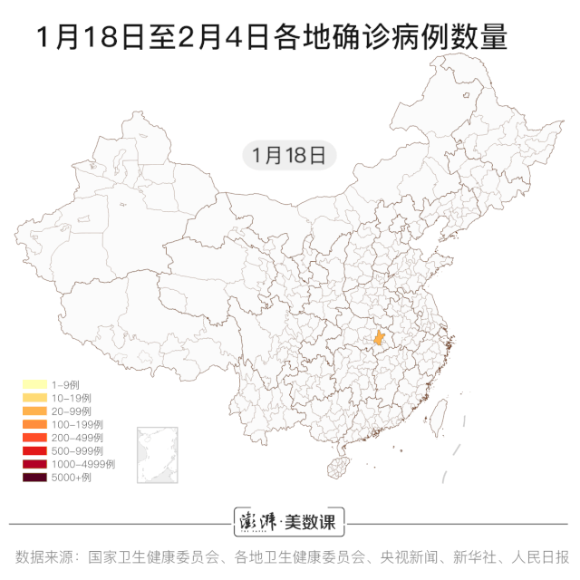

有类似情况的还有孝感、荆门和襄阳等湖北地级市。甚至1000公里外的浙江温州、广东广州、深圳等城市，也因与武汉的密切人员往来，随着春运返乡的开始，慢慢成为了重点疫区。

而这一切是怎么开始的？澎湃新闻（www.thepaper.cn）从截至1月27日的各地卫健委公布确诊病例中，搜集并分析了763例确诊患者的详情，试着还原病毒扩散的路径。值得指出的是，各地之间的个案数量差异主要因为政府的信息公开程度不同，因此地区之间的数量不具有可比性。

**368名后期确诊患者在武汉“封城”前一周离汉**

1月23日早上10点，武汉关闭机场、火车站离汉通道，而这距离今年春运正式开始的1月10日已经过去了13天。

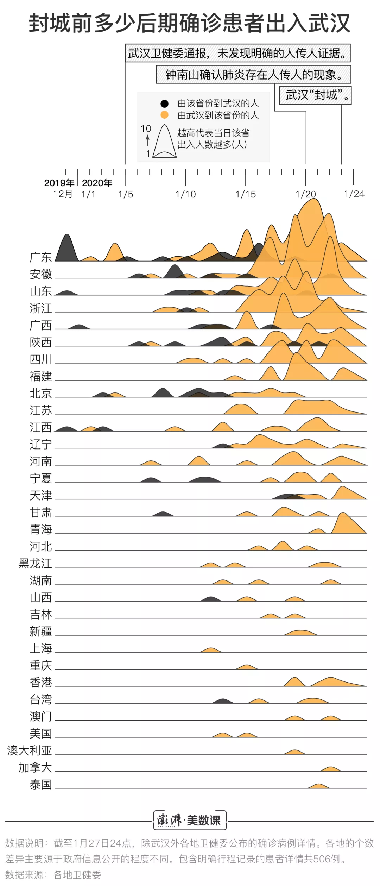

过去的这13天，正是每年人们固定返乡的日子。没有多少人被警示到，大家依旧像往年一样，拿起行李，探亲、出游、回家聚餐。

如上图所示，在506例有明确行程信息披露的病例里，368例在武汉“封城”前一周离汉。出入武汉的后期确诊患者人数高峰期在1月19日和20日，这两天一共有130名后来确诊的患者出城，占到了总数的27%。

1月20日晚，钟南山在央视《新闻1+1》栏目中确认了病毒具有人传人的特征。从那天晚上，再到武汉23号封城，又过去了3天时间。21日，56名后来确诊患者出城；22日，62名；23日，36名。

**47名患者离开武汉后曾去过不止一个城市**

来自河北邯郸的一名患者，1月15日和父母一起到武汉旅游，18日移动到厦门，19日发病，22日抵达深圳就立即入院就诊。

和他一样，离开武汉可能只是很多人春节出行的第一步。在公开的506例确诊患者行程中，47名患者从武汉离开后，又经过了多个目的地，占到了总数的9%。

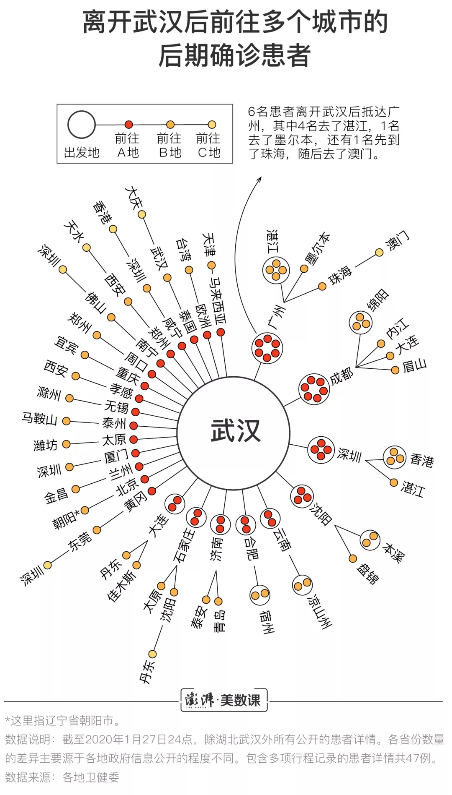

此外，还有28例确诊患者案例显示，他们和武汉并无直接交际，仅有湖北其他省份的旅游史。更有甚者只因在旅途中途经武汉而患病。

安徽合肥的叶某，1月9日前往湖南郴州出差，中途在武汉换乘，1月10日返回合肥。1月10日发病，1月23日确诊。

还有一名长居深圳的患者，1月19日从深圳出发前往天津，高铁在武汉停留了数分钟，1月22日到达吉林市，1月27日在当地确诊。

不过，停留时间的长短和后期是否患病确实没有直接关系。如下图所示，67名短暂停留过武汉的患者中，17人仅停留一天，4人停留了一天不到。

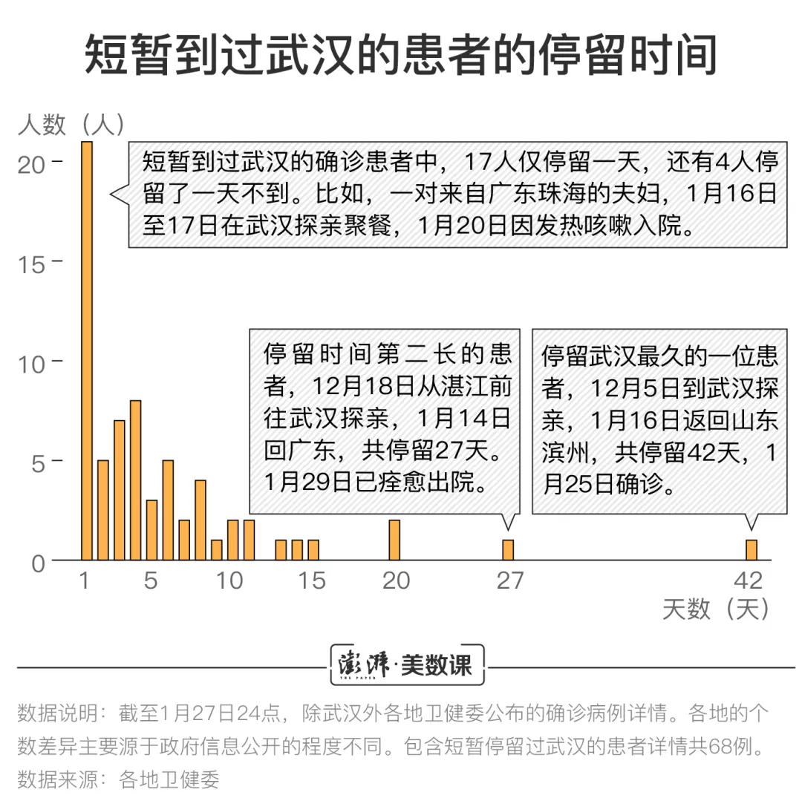

值得指出的是，上述数据也只反映了患者行程的一部分，只有少数患者的城市内部移动轨迹得以公示。

**从出现症状到就诊入院，最长间隔近一月**

防控在于警示。“这次疫情其实各方面对我们信息的披露是不满意的”，武汉市长周先旺27日接受央视访问时表示。

确诊患者从出现症状到就诊入院的时间间隔变化，侧面验证了这一现象。由于新冠肺炎症状和普通感冒很像，大多患者甚至医生一开始并不能察觉到患病的严重性。

陕西安康市的一名患者，长期在湖北十堰居住，他早在12月底就出现了症状，但直到1月21日才到白河县就诊。

山东成武县的患者田某，长期在湖北荆州工作。1月9日返回老家，1月20日出现症状，当日在村卫生室输液治疗，未见好转，22日前往成武县田集镇卫生院就诊，依旧未见好转，23日到成武县医院就诊，被隔离治疗。1月26日确诊。

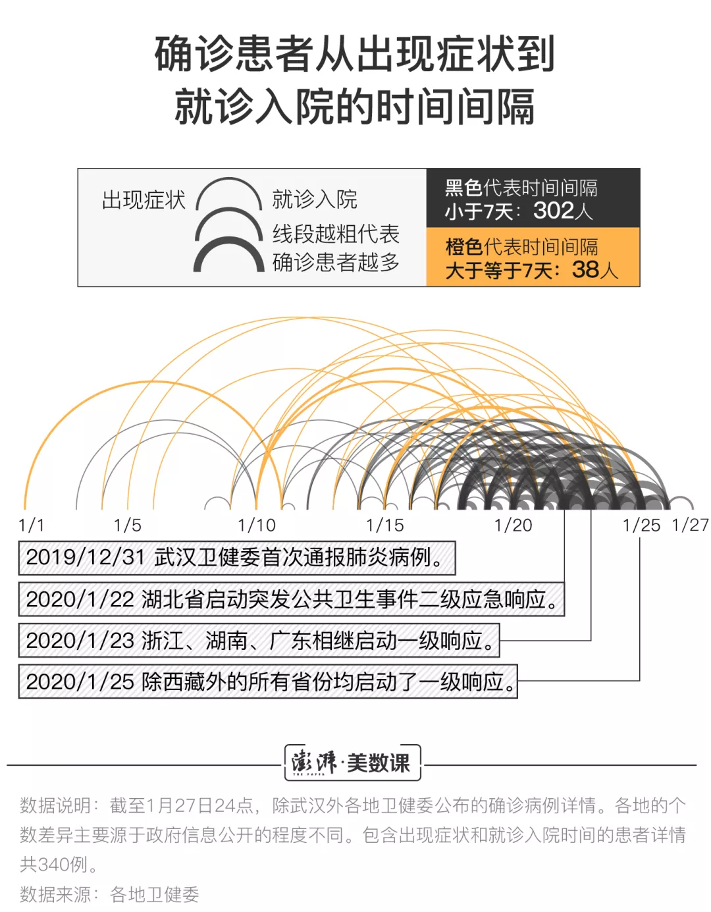

如上图所示，以1月18日作为分界点，前后的时间间隔差距很大。特别是从1月22日起，当日出现症状即就诊的患者数量剧增。这天，湖北省启动了突发公共卫生事件二级应急响应。第二天，浙江、湖南、广东相继启动了一级响应。

**家属和同事是人传人特征的主要受害者**

“今年上门，明年上坟”，这是网传河南防疫的硬核标语。虽然口气有些绝情，但不是没有道理。

以上所述的时空特征，再加上人传人的特征，带来的后果就是大批的后期确诊患者早已到达全国各地，将病毒带给密切接触者，甚至引发聚集性传染。据新华社报道，截至2月4日中午，山东省发现聚集性疫情60起，其中49起为家庭聚集性疫情。

总体而言，家属和同事是最主要受害者，因为他们属于每天在熟人空间能遇见的人。在151例人传人确诊患者中，共有64例属于这种情况。下图以山东和天津的两组传播为例。

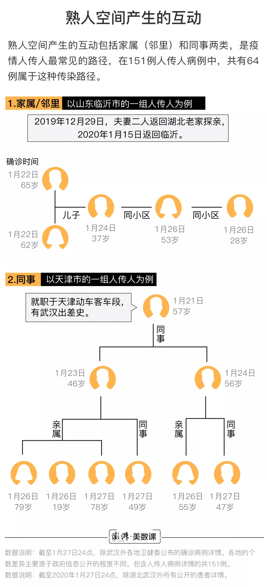

公共空间也是病毒传播的重要途径。在151例人传人确诊患者中，共有20例属于这种情况。他们之中，有的人是因为参加了同行者中有武汉籍患者的云南旅行团，有的人是因为和武汉籍患者同事聚餐，还有的人则是因为在公共交通工具上遇到了武汉旅客。

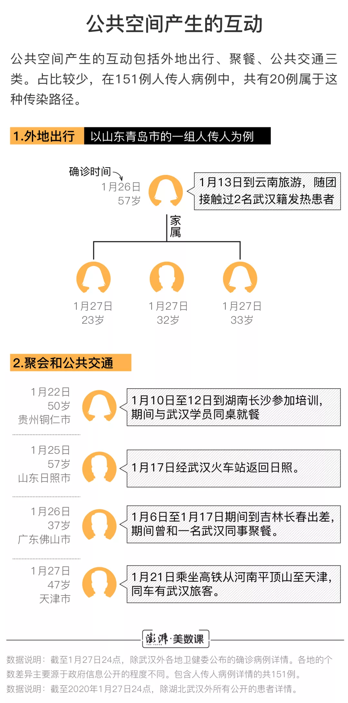

最后一种常见的人传人场景则是在医院。这种传染案例的详情公布得不多，截至1月27日，仅有以下来自江西新余市的5例。5名医院职工被感染，其中两名又分别将病毒传染给了自己的母亲和妻子。

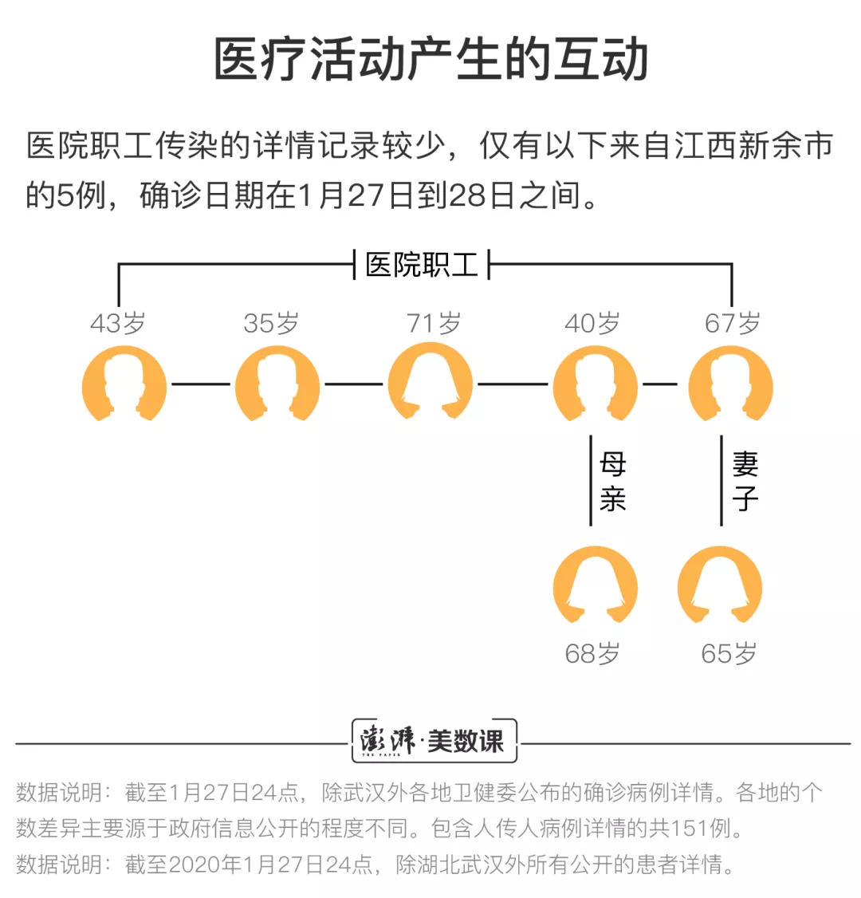

鸣谢：
王绪静、李虹萦、赵娅男参与数据整理工作

## 疫情之下春运人口回流“硬核”预测：往返这些超级网络节点城市有更大感染风险

https://mp.weixin.qq.com/s?__biz=MjM5MTQzNzU2NA==&mid=2651677142&idx=1&sn=7e371555075ec4fffb7c621a9544e359&chksm=bd4c46458a3bcf538d7f2ebb1ee172f7eb084f6482a54369ea4f2605bc127c7ea8dde62bc6e5&scene=126&sessionid=1581004160&key=1de96bf14ac83757205e24c0088bde08570853c85bbf17ecbcf66beb7f8adc11d83fcdbb72ab6bb97b4c62bc1c3f327b82bc4cf129ee449749b34cbccb45a2d11a2ede2368b2f12d8a78b4af99f740f7&ascene=1&uin=MTE0MDQwODgw&devicetype=Windows+7&version=6208006f&lang=zh_CN&exportkey=AuoszAvJsiHbSezhgFgQsnM%3D&pass_ticket=s%2BEZks%2BIMARwgNwp93aEcObBGQdbaJX37vCTgV%2FK6ME%3D

## 新闻和谣言齐飞！疫情之下，国内外社交平台如何精准辟谣？

https://mp.weixin.qq.com/s?__biz=MjM5MTQzNzU2NA==&mid=2651677101&idx=1&sn=d22f03f7667266e094178acd7cf6885e&chksm=bd4c463e8a3bcf28189be668b76cdbd6b4845965b03d626971376e480f0cf4394f027776b67c&scene=126&sessionid=1581004160&key=4c338841a430365bed2131e540add846a11cbcf403be117a3119aca064296e9411970d190027b8aea2c818a0f3b1e63cade84c474fca938f4b7b20e66d3de4522daa9ed8f1a9b607a7a1f62e3ff70e7e&ascene=1&uin=MTE0MDQwODgw&devicetype=Windows+7&version=6208006f&lang=zh_CN&exportkey=Ahfa%2F7h%2FBPRaxaCD%2FSh7P4U%3D&pass_ticket=s%2BEZks%2BIMARwgNwp93aEcObBGQdbaJX37vCTgV%2FK6ME%3D

## 从卫健委网站看疫情数据统计体系的建设

https://mp.weixin.qq.com/s?__biz=MzA5MjEyMTYwMg==&mid=2650246800&idx=1&sn=12e8ad2b98f1545bdd1b3671f9bef325&chksm=8872d1fdbf0558eb5518362c23fcc6d64d3e76aa28ec184a93277bc8c6d249bc40fdd5a1137f&scene=90&xtrack=1&subscene=93&clicktime=1581049893&enterid=1581049893&ascene=56&devicetype=android-29&version=27000a5e&nettype=WIFI&abtest_cookie=AAACAA%3D%3D&lang=zh_CN&exportkey=Aro41ILActNEt%2FrU2UwLy2s%3D&pass_ticket=2ROOSbPW6sS2hoQjFfL9VNqrxmnOkozY4QKUN2cC0T8%3D&wx_header=1

## 数据纪实 | 茅明睿：如何应用城市科学预警疾病传播？

https://mp.weixin.qq.com/s?__biz=MzI1MjQ2OTQ3Ng==&mid=2247499423&idx=1&sn=3f5abd6c931d85f519c6efe1d04293fb&chksm=e9e1f714de967e02801a42de0e3d86b081a07c965ba6b1f2ab328637e8a71bb3b9d888160b38&scene=90&xtrack=1&subscene=93&clicktime=1581160548&enterid=1581160548&ascene=56&devicetype=android-29&version=27000a5e&nettype=WIFI&abtest_cookie=AAACAA%3D%3D&lang=zh_CN&exportkey=Au%2Bd8u5x03n6gtNKWQ4fybI%3D&pass_ticket=Hd9fhGQ%2BExFZ%2F%2B3f5RittiN2eeutvi9JmzfLmf4priY%3D&wx_header=1

## 1949-1978年的中国流动人口迁移

http://www.chinaldrk.org.cn/wjw/#/nationalDay

## References

[1] 统计局的“国家数据”：http://data.stats.gov.cn/

[2] 中国流动人口的主要特征及对中国城市化的影响：https://kns.cnki.net/KCMS/detail/detail.aspx?dbcode=CJFQ&dbname=CJFD2013&filename=CSWT201303001&v=MjEyOTF2RkNybVU3N1BKajdjZXJHNEg5TE1ySTlGWllSOGVYMUx1eFlTN0RoMVQzcVRyV00xRnJDVVI3cWZaZWQ=

[3]《中国流动人口发展报告2018》：http://www.nhc.gov.cn/wjw/xwdt/201812/a32a43b225a740c4bff8f2168b0e9688.shtml

[4]《中国城市化2.0: 超级都市圈》：https://wuhan.house.ifeng.com/news/2019_10_17-52364929_0.shtml

[5] 美国情报机构概览：https://mp.weixin.qq.com/s?subscene=3&__biz=MzI2MTE0NTE3Mw==&mid=2651106424&idx=1&sn=d51657bd9f5c5d5899cf12ce8f3525fe&chksm=f1aedb42c6d95254712864c4306a7b0601259db4ee37ff0faf4df1cf26d5c4d5818990322b7b&scene=7&ascene=65&devicetype=android-29&version=27000a5e&nettype=WIFI&abtest_cookie=AAACAA%3D%3D&lang=zh_CN&exportkey=An5YKSZzDsAPKCTHdtWQ6IY%3D&pass_ticket=eYlLm7Q8LjVnWHsTv5sVidLKuDGo0L99I6Eh%2FX2z%2BSU%3D&wx_header=1

[6]

[7]

[8]

[9]

[10]