#  《新冠疫情复盘：突发公共事件应急管理与智慧城市建设》

惊蛰已过，这几日春光明媚，万物开始复苏生长。国内的新冠疫情的形势日益好转，澳大利亚的山火终于被扑灭，仿佛一切都向着好的方向迈进。可是回头再看，却发现：截至三月十二日，新冠肺炎已经扩散到一百多个国家，除中国外累积确诊近四万多例，累积死亡一千两百多人；澳大利亚山已经导致了近十亿动物丧生；美国的流感（可能包含新冠）已经感染了近2000万人并有约1.6万人死亡；东非蝗灾已经扩散到了亚洲西部和南部....... 

2020年不可能重新开启，面对这些天灾，我们要思考的是：在这个城市人口占大多数的时代，社会应该如何去主动预防及应对各种潜在的灾害。

突发公共事件应急管理系统的建设是一个长期、细致、体系化的过程。在这篇文章中我想先比较一下美国和中国在应急管理体系上的差异，然后通过分析中国城镇化过程中遇到的一些问题，探讨一下如何在智慧城市的建设过程中将突发公共事件应急管理纳入其中。

## 一、突发公共事件中的城市灾害预防

突发公共事件是指：突然发生，造成或者可能造成严重社会危害，需要采取应急处置措施予以应对的自然灾害、事故灾难、公共卫生事件和社会安全事件。随着时代的发展和社会的进步，城市化进程逐步加快，突发公共事件中城市灾害的比例不断攀升并占据主要地位。

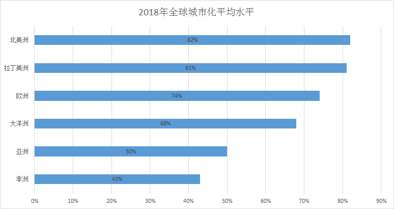

城市的灾害大体可以分类两类：城市自然灾害（天灾）和城市人为灾害（人祸）。大部分自然灾害尚非人力可以抗拒,只能通过预防和抗灾来减轻损失。而人为灾害是人类疏忽或蓄意造成的,大部分是可以预防和制止的。城市自然灾害包含地质灾害、洪涝灾害、高温干旱灾害等。城市人为灾害主要指部分自然巨灾的人为化诱因、环境公害、火灾、城市事故（治安与交通）及恐怖袭击等。

还有一些灾害是在自然与人为两种因素同时作用导致的，比如：地下水的过量开采加上地壳运动和建筑物载荷的综合作用导致的地面沉降、裂缝以及塌陷；城市地下隧道施工或周边矿产资源开发与表面岩溶活动可能会产生突水、突泥、冲击地压、冒顶、瓦斯爆炸等灾害，造成人员伤亡、设备和工程毁坏、资源冻结。

### Ⅰ.  “911”与卡特里娜飓风

2011年9月11日，在纽约发生了震惊世人的“911事件”。此次事件造成了2996人死亡（包括19名恐怖分子），美国的经济损失高达2000亿美元。

事件发生后，美国政府在整理情报时发现：美国联邦航空管理局（FAA）于2001年7月31日就发出了“已知恐怖组织正在规划和培训”的警告，而CIA在9·11袭击事件发生前一个多月就收到了可能存在威胁的迹象。这并不是CIA第一次收到有关涉及飞机的恐怖袭击的情报报告，但由于隶属于美国司法部的FBI才是打击美国国内恐怖活动的首要政府机构，CIA当时并没有及时的将这个信息与FBI共享。

911事件过后，美国政府不仅成立了一个新的联邦行政部门（美国国土安全部DHS）来负责国内安全及防止恐怖活动，还设立了美国国家情报总监（DNI），统领美国各个情报部门，同时加强美国情报界的情报共享。美国国土安全部也就成为了美国最高的应急管理机构。‍下图为美国现有的17个核心情报部门$^{[ 1 ]}$。

2005年8月23日到31日，飓风卡特里娜登录美国多个州，共造成1836人死亡和1250亿美元的财产损失$^{[ 2 ]}$。按照当年汇率算是1万亿人民币的损失，相当于中国那一年财政收入的三分之一。

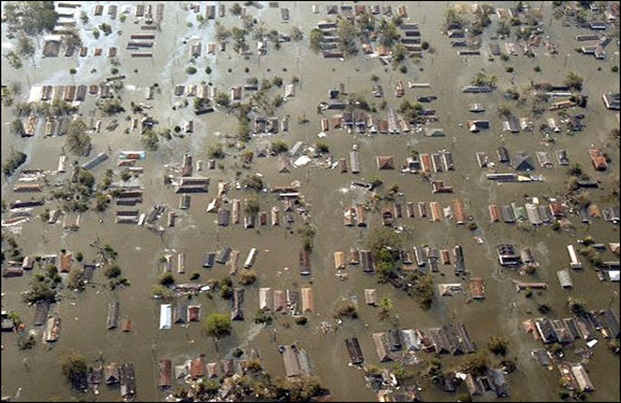

由于这次灾害的巨大破坏性以及美国政府应对不及时，导致大量民众只能长时间地待在缺乏食物、淡水以及电力的“避难所”里。

这样的情况导致了大量的犯罪行为发生，最终新奥尔良市当地1500名警察部队被强制命令放弃搜救任务，转而将注意力转向"更大规模"的打砸抢烧事件。直到灾后的第五天，联邦政府才派遣了7200名从伊拉克撤回的现役部队来帮助就搜救幸存人员和维持社会秩序，同时批准了105亿美元的救济方案。军队在灾难过后担负着赈灾和镇压的双重任务，甚至发生了武装劫匪和警察之间爆发的枪战。

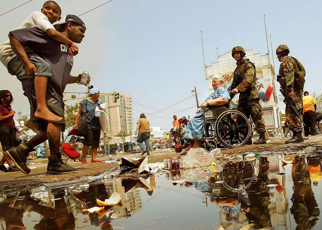

灾难发生一周后，饥肠辘辘的百姓终于从一片狼藉的“避难所”被慢慢的组织撤离。

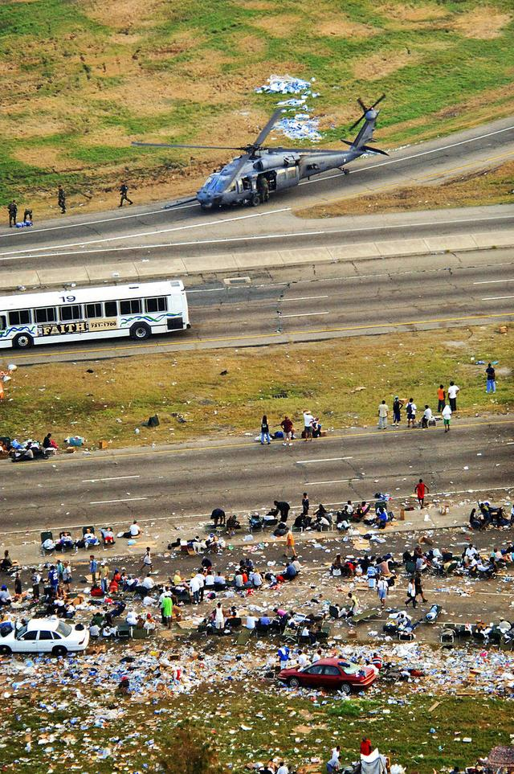

卡特里娜飓风对美国多个州都造成了巨大的破坏，也给美国政坛带来了巨大的风暴。但其实在飓风登陆美国本土前，美国国家飓风中心（National Hurricane Center）就已经提前两天就进行了预警，可为何还是造成了当时的后果？这里不得不先了解一下 FEMA——美国联邦应急管理署$^{[ 3 ]}$。

### Ⅱ. 美国联邦应急管理署FEMA

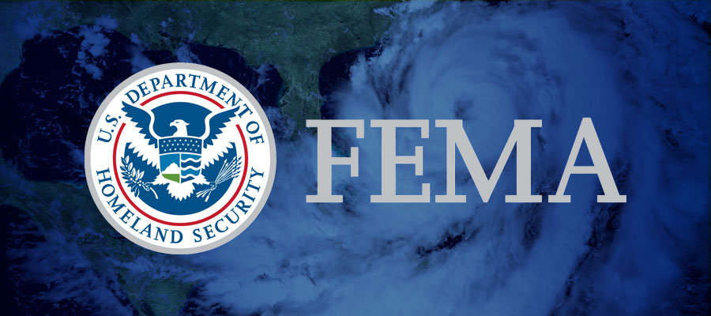

FEMA成立于1979年4月1日，由国家消防管理局、联邦洪水保险管理局、民防管理局、联邦灾害救济管理局和联邦防备局等机构合并而成，主要负责联邦政府对大型灾害的预防、监测、响应、救援和恢复工作。紧急事务管理局在全国常设10个区域办公室，每个区域办公室针对几个州，直接帮助各州开展救灾和减灾工作。

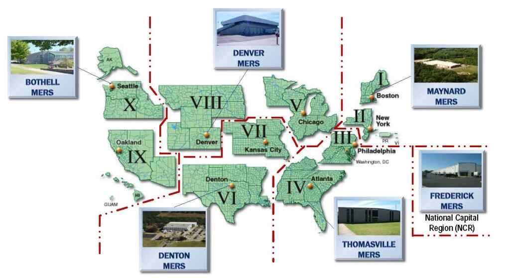

FEMA 成立之初的目的是协助灾难发生时的应急救助和接收分配国家和当地政府的资源。核心任务就是在灾前，灾中，灾后帮助人们，保障人民的生命财产安全并且确保灾后的恢复重建工作。同时，作为应急准备工作的一部分，FEMA还为整个美国及其领土的应急人员培训提供资金。发生灾难时州长须宣布紧急状态并请求总统命令FEMA和联邦政府来应对灾难。

在美国发生“911”恐怖袭击之后，为了更好地统一执法，备灾，恢复，保护边境和民防，美国国会在2002年创建了国土安全部（DHS）。从2003年3月1日起，FEMA被国土安全部吸收。自此，FEMA成为国土安全部应急准备和应急理事会的一员，并于2007年3月31日再次成立联邦紧急事务管理局，并保留在国土安全部。 

根据2012年统计，FEMA有10,000人左右的灾害协助员工，其中预备员工占总人数的60%。此人数不包含旗下机构人数，例如国家消防局。根据FEMA官网年度清单，2018年的国家应急管理资金为160亿美金，根据各个州的灾害不同，每个州分配的资金也不同。目前FEMA的组织架构如下图$^{[ 4 ]}$;

根据美国的国家突发事件管理系统（NIMS）规定$^{[ 5 ]}$，突发事件由影响范围和受灾程度分为五级。第五级和第四级发生影响的范围为市县，由当地政府和应急部门指挥。第三级发生范围为一级或者大城市，由州政府及应急管理队指挥。第二级和第一级的影响范围为州一级或者国家层面，由州和联邦政府共同指挥。

|  分级  |              指挥              |       说明       |
| :----: | :----------------------------: | :--------------: |
| 第一级 |         联邦级联合指挥         | 重大国家突发事件 |
| 第二级 |          州级联合指挥          |   重大跨州事件   |
| 第三级 | 市县区域（应急管理队）联合指挥 |   重大区域事件   |
| 第四级 |          当地联合指挥          |   重大当地事件   |
| 第五级 |      当地（应急部门）指挥      |   日常突发事件   |

FEMA将应急组织协调的工作分成了五大模块：

同时美国政府按照应急事件种类的差别，将其分成了12个领域$^{[ 6 ]}$ ：‍

各地方政府的应急反应部门，包括消防、警察、医疗、非政府组织、非营利组织和公共部门等，在突发应急事件发生之后就可以在第一时间做出响应和处置。由于美国是联邦制国家，各州的应急服务部门在名称、建制和分工等方面也不尽相同，在各自的辖区内，根据各自辖区突发应急事件的不同特点，也可以合理投入资源对不同领域进行有针对性的建设。‍

虽然对卡特里娜飓风的应急反应使美国政府备受指责，也暴露出其危机管理的一些不足之处，但我们依然可以从其后的快速评估检讨并相应做出的反应中看出其完备的减灾联动机制的一些优势。当政府和社会各界意识到飓风的严重性和初期对其的反应不足时，整个应急框架对前期应对工作迅速加以评估检讨并立即做出改进，美国危机管理的优势就发挥出来了。$^{[ 7 ]}$

### Ⅲ. 国内突发事件应急管理的发展

2003年非典疫情之后，党中央、国务院提出了加快突发公共事件应急机制建设的重大课题。也正是当年那次疫情，暴露了我国突发事件应急机制不健全，处理和管理危机能力不强；一些地方和部门缺乏应对突发事件的准备和能力。在持续多年的改革与建设，今年的新冠疫情大家明显感觉各级政府和相关单位的响应和实施有效措施的速度比17年前快了无数倍。

2004年9月，党的十六届四中全会进一步明确提出：要建立健全社会预警体系，形成统一指挥、功能齐全、反应灵敏、运转高效的应急机制，提高保障公共安全和处置突发事件的能力。自此之后，我国已经建立了多项法律法规用于公共突发事件的应急管理。

 

总体预案将突发公共事件主要分成4类：

- 自然灾害：包括水旱灾害、气象灾害、地震灾害、地质灾害、海洋灾害、生物灾害和森林草原火灾等； 
- 事故灾难：包括工矿商贸等企业的各类安全事故、交通运输事故、公共设施和设备事故、环境污染和生态破坏事件等； 
- 公共卫生事件：包括传染病疫情、群体性不明原因疾病、食品安全和职业危害、动物疫情以及其他严重影响公众健康和生命安全的事件； 
- 社会安全事件：包括恐怖袭击事件、经济安全事件、涉外突发事件等。 

按照各类突发公共事件的性质、严重程度、可控性和影响范围等因素，总体预案将突发公共事件分为四级，

- Ⅰ级（特别重大）
- Ⅱ级（重大）
- Ⅲ级（较大）
- Ⅳ级（一般）

同时还有军队处置突发事件总体应急预案：既与国家应急预案相互衔接又自成一体;是国家应急总体预案的一个重要组成部分。

经过一系列的制度体系建设和相关政策文件的出台，各级政府的应急处突能力得到了显著的增强，但是在最近几年诸如天津“812爆炸事件”、“东方之星沉船事件”等特大突发事件的具体处置和管控中仍然暴露出了一系列深层次问题。

1. 缺乏对各类突发危机事件进行系统梳理，没有体系化的知识系统去指导整个突发危机事件的响应和处置。
2. 我国处理突发危机事件的专业人员极度匮乏，应对突发危机事件时缺少强有力的智力和咨询支撑；
3. 应急管理领域如何做好军民融合、军民联动来应对突发事件也是一个需要深入研究的领域。
4. 处理各种不同类型突发危机事件的部门太分散，在响应和处置突发危机事件的过程中很难高效协作。

2018年3月17日根据第十三届全国人民代表大会第一次会议批准的国务院机构改革方案，中华人民共和国应急管理部被设立$^{[ 8 ]}$。此举极大地整合了分散的应急管理机构，四大类突发公共事件中有一半左右被纳入了应急管理部的管辖之下。‍‍

## 二、中国城镇化进展分析与“新基建”

### Ⅰ. 中国城镇化进展统计

首先阐述一下什么是城镇化。城镇包含城区和镇区两个概念，城区通常用市、区、街道来划分，镇区是指县和镇一级的管辖，而乡村是指除城区和镇区之外的其他地区。城镇化即为社会由以农业为主的传统乡村型社会向以工业（第二产业）和服务业（第三产业）等非农产业为主的现代城市型社会逐渐转变的过程。

改革开放已经过去了四十年，这也是中国城镇化快速发展的四个十年。截至2019年底，中国共有城镇人口约8.48亿，城镇化率已经达到了60.60%。

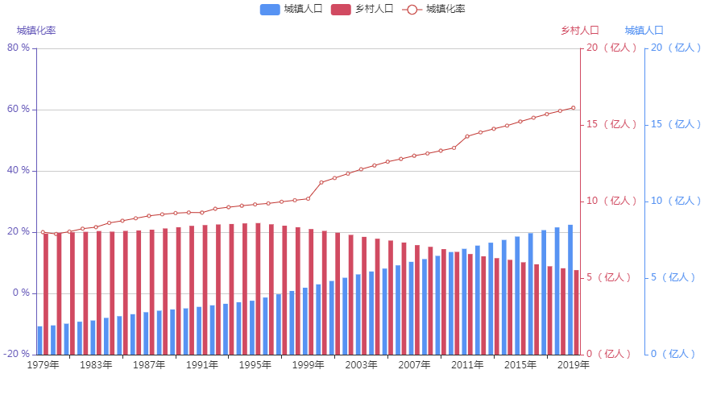

如上图所示，中国的城镇人口在改革开放后稳步增长，在2010年-2011年间首度城镇人口数量超过了乡村人口数量。但是如果我们将时间坐标轴拉长一点，如下图所示为从1949至2019年的中国城镇化变化图：

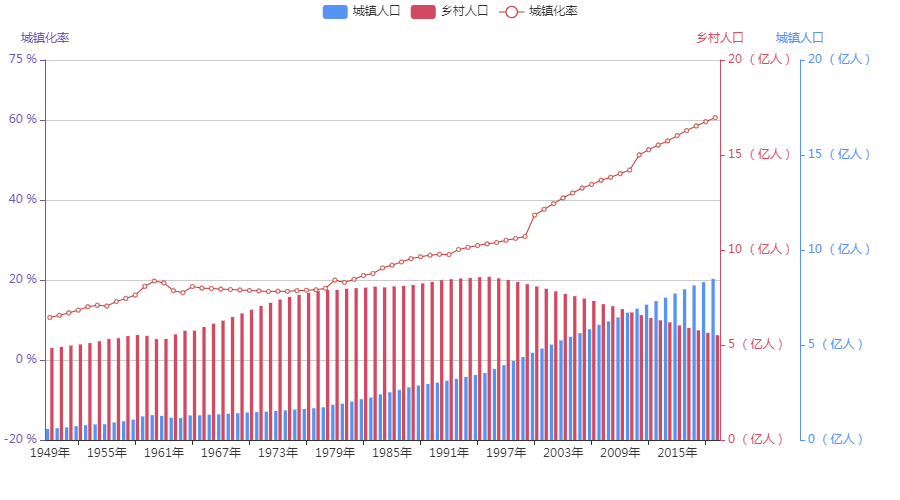

从上图可以发现几个规律：

1. 从1960年到1978年中国的城镇化率有一个横盘期，在此期间中国的城镇人口增长有限，反而乡村人口有了较明显的增长；
2. 在1978年到1997这十年间，乡村人口保持了一个较为平稳的台式，城镇人口稳步增长；
3. 从1998年开始，城镇化速度明显加快且保持着高速地增长。

以上数据来源于统计局的“国家数据”网站$^{[ 9 ]}$。

**中国城市化的提升空间还很大**，因为目前城市化率不足60%，而发达国家的城市化率通常在80%以上，也就是说，中国应该还有20%的上升空间。中国城镇化的两个很重要的影响因素是：**流动人口和人口年龄结构。**$^{[ 10 ]}$

1978年、2016年就业结构（%） 

如上图所示，在改革开放的过程中，大量农村剩余劳动力进入城市，人口逐渐从第一产业转向更高工资和更高效率的第二和第三产业。这一波人口流动带来了巨大的人口红利，极大地促进了经济的发展和城镇化进程。

1982-2017年全国流动人口规模（单位：百万人，%）

然而根据国家卫健委发布的《中国流动人口发展报告2018》$^{[11]}$数据，2010年—2015年中国流动人口增长速度明显下降。如上图所示，流动人口数量从2015年起就从之前的持续上升转为缓慢下降。2016年全国流动人口规模比215年减少了171万人，2017年继续减少了82万人。

人口流动与人口年龄有关，年龄越大，流动性就越差。中国的城市化进程一直较快，这与政策导向有关，但目前农民工的平均年龄已经超过全国劳动力的平均年龄，今后外出农民工告老还乡的趋势会越来越明显。

更多的流动人口分析可见国家卫健委的流动人口数据平台$^{[ 12 ]}$。

由于已经完成的城镇化和人口老龄化，**以人口流动为特征的城镇化进程会逐渐结束，余下的是本地乡村的城镇化发展**。

去年十月份，摩根士丹利发布的的蓝皮书《中国城市化2.0: 超级都市圈》$^{[ 13 ]}$预测，到2030年中国的城市化率将升至75%，即增加2.2亿新市民，这主要得益于三大支柱：

- 一是城市群兴起將发挥集聚优势，同时缓解大城市病；
- 二是受益于新一代信息技术的应用，智慧城市将减少交通拥堵、安全隐患和污染；
- 三是农业的规模化和现代化有助提高劳动生产率，推动农村人口迁入城市。

报告认为，过去几十年，中国以前所未有的速度推进城市化，特别是硬件基础设施（铁公基等）大幅改善。下一个阶段，中国将通过结构化改革及数字科技的广泛应用，打造更快捷、安全、环保和宜居的城市。

报告当中列举了多个即将应用的新型技术对城市生活的影响，指出若想要保证中国的城镇化进程继续稳步提高并实现到2030年人均国民收入比当前翻一番的计划，那么除了继续大力推进信息基础设施建设，政策还应鼓励积极拥抱人工智能和大数据等新技术，奋力推进制度改革，这些都将有助于增强中心城市和城市群等经济发展优势区域的经济和人口承载能力，令都市生活将发生蜕变。

因此中国城镇化的趋势更多地是依靠智慧城市的建设而获得的。

### Ⅱ. 进入分化阶段的中国城镇化

在《国家新型城镇化规划（2014－2020年）》$^{[ 14 ]}$中，官方多次提到资源枯竭城市等概念。2019年4月8日，国家发改委发布的《2019年新型城镇化建设重点任务》$^{[ 15 ]}$提到：收缩型中小城市要瘦身强体，转变惯性的增量规划思维，严控增量、盘活存量，引导人口和公共资源向城区集中。

“收缩型城市”是国外引入的概念，包括德国鲁尔、法国洛林和美国的休斯顿等地区，都经历过城市收缩的阶段。其主要体现在人口流失、产业衰退，城市空间和公共设施闲置等三个方面。而在我国，还有一种特有的城市收缩现象，即常住人口少于户籍人口的“户口倒挂”现象。

官方文件中提到的这些概念，反映了中小城市要分级分类发展的趋势。下图$^{[ 16 ]}$表示从2000年到2010年之间收缩的城市（蓝色）以及增长的城市（橙色和红色）。

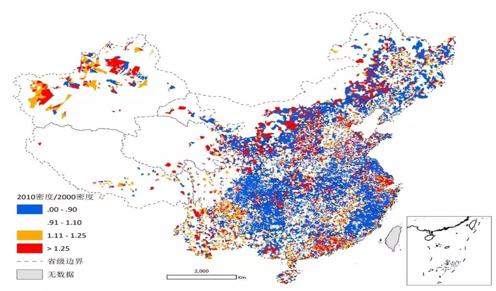

对中国而言，“增长”仍是大部分城市的主要发展趋势，但城市“收缩”现象也早已经发生。根据清华大学建筑学院副教授龙瀛的数据统计$^{[ 16 ]}$：全国654个城市中已有180个发生了人口总量和密度的双下降。这意味着，中国至少存在着180个收缩城市，其中不乏晋江、义乌、景德镇等昔日经济增长较快的城市。它们的收缩，既有资源型城市在工业化进程中出现的收缩，也有传统工业城市工业衰落导致的收缩，还有欠发达地区人口迁移引发的收缩和行政区划调整导致的收缩。

**中国城市化步入中后期，已经出现了城市发展分化的现象。**城市的扩张和收缩有其必然性，一二线城市就业机会多、收入高、城市繁华，能吸引大量人口流入。我国严格将城市按照行政级别划分，也导致了资源过度向行政级别高的大城市集中，导致这些城市出现了“虹吸效应”。所以**部分城市变为收缩型城市是城镇化的必然趋势，不应过度对抗。**

### Ⅲ. 近期热点：新基建

近期关于“新基建”的讨论非常的多，很多人认为这只是在疫情当下的一个“救市”举措，但如果从整个发布的时间线可以看出政府很早就在布局探索了。所以我更认为这是一种新形式下的“智慧城镇化”。

进入分化阶段的城镇化，面临着收缩型城市只能走“小而美”的路线。同时增长型城市也要考虑人口的红利总有到头的时候，不能永远都朝着“高大上”的方向前进。**当城市不再长大，我们该怎么办？**如果无法单纯从量上去提升，质的改变往往才是问题的关键。而“新基建”来的正是时候。

2018年12月，中央经济工作会议把5G、人工智能、工业互联网、物联网等新型基础设施建设列为2019年经济建设的重点任务之一。

2019年3月2日央视新闻的报道，“新基建”指发力于科技端的基础设施建设，主要包括七大领域：5G基建、特高压、城际高速铁路和城际轨道交通、新能源汽车充电桩、大数据中心、人工智能和工业互联网。

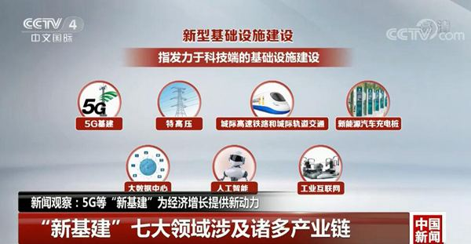

2020年3月4日，中共中央政治局常务委员会召开会议出，要加大公共卫生服务、应急物资保障领域投入，加快5G网络、数据中心等新型基础设施建设进度。

许多分析从微观领域来看，未来10年的新型城市化发展将为市场主体提供三大投资和发展主题：

1. 一是工业互联网兴起，利好5G、云服务和物联网企业；
2. 二是成熟产业数字化，无人驾驶、智能物流和电网有望提速发展，大数据助力金融企业精准定价、控制风险；
3. 三是智慧城市新生活。智能家居和医疗及高速通勤铁路让生活更便利；超级都市圈人口集聚，体验式服务消费有望大发展。

政府带来的这套“新基建”，本质上就是**智慧城镇化的商业驱动力！**而这也将帮助打通突发公共事件应急管理体系的“任督二脉”。

## 三、智慧城市建设过程中对灾害预防的思考

### Ⅰ. 大数据助力新冠疫情防控

大数据建设是智慧城市建设中重要的一环，而这一环在今年的新冠疫情中对于新冠疫情的防控起到了极为重要的作用，甚至在某些领域产生了决定性的影响。这里我整理了一下2月18日中国工程院院士邬贺铨在一次公开课上的演讲$^{[ 17 ]}$，阐述了各种大数据技术如何从各个方面帮助新冠疫情防控的。

#### 1. 大数据助力疫情溯源与监测

如今手机已经成为我们个人的另一张身份证。我国的独立移动通信用户的普及率（扣除一人多号）是82%，接近发达国家的水平，移动互联网的普及率高于全球的平均水平。这意味着我国有独立活动能力的人群几乎都有手机，而且中国实行手机用户的实名制，从手机用户就可以识别持有人的身份。

通过基站定位，手机可以关联持有人的位置，再通过数字地图公司的大数据地图，就可以溯源武汉春节前将近500万人流到什么地方去。有了这些数据，结合各类传染病模型，从中可以计算出疫情传播的模型。

更详细的分析可以参考以下两篇文章：

- [从首例到“封城”，这763份确诊详情还原了新冠病毒向全国扩散的路径](https://mp.weixin.qq.com/s?__biz=MzIxMzQ1MDE4NQ==&mid=2247483835&idx=1&sn=a9f7bf2afd6982eee51f3d8cd22e95f2&chksm=97b7ed1da0c0640b8968ae32067d1132d201227a58c05d6bd2d5e3e78f97f3a302293b9685c0&sessionid=0&scene=126&clicktime=1583652200&enterid=1583652200&ascene=3&devicetype=android-29&version=27000c34&nettype=WIFI&abtest_cookie=AAACAA%3D%3D&lang=zh_CN&exportkey=AoNTsHPX5e8LhvFHzE2PgRw%3D&pass_ticket=cmFZxMUcY0y20bAfAZB3JLVYJ%2FrhVFnwhdmohODkkfs%3D&wx_header=1)
- [疫情之下春运人口回流“硬核”预测：往返这些超级网络节点城市有更大感染风险](https://mp.weixin.qq.com/s?__biz=MjM5MTQzNzU2NA==&mid=2651677142&idx=1&sn=7e371555075ec4fffb7c621a9544e359&chksm=bd4c46458a3bcf538d7f2ebb1ee172f7eb084f6482a54369ea4f2605bc127c7ea8dde62bc6e5&scene=126&sessionid=1581004160&key=1de96bf14ac83757205e24c0088bde08570853c85bbf17ecbcf66beb7f8adc11d83fcdbb72ab6bb97b4c62bc1c3f327b82bc4cf129ee449749b34cbccb45a2d11a2ede2368b2f12d8a78b4af99f740f7&ascene=1&uin=MTE0MDQwODgw&devicetype=Windows+7&version=6208006f&lang=zh_CN&exportkey=AuoszAvJsiHbSezhgFgQsnM%3D&pass_ticket=s%2BEZks%2BIMARwgNwp93aEcObBGQdbaJX37vCTgV%2FK6ME%3D)

#### 2. 大数据可视化疫情

有了模型，很多大数据还需要有一种可视化的表现。这里给出北京大学可视化与可视分析实验室$^{[ 18 ]}$的一种可视化的方式：使用方块对全球疫情进行可视化，背景颜色表示累计确诊数， 绿色面积表示治愈率，黑色面积表示死亡率。在方块的右上角，分别使用红色、绿色和黑色的数字代表累计确诊数、治愈数和死亡数。这样就有了一个很直观的认识。

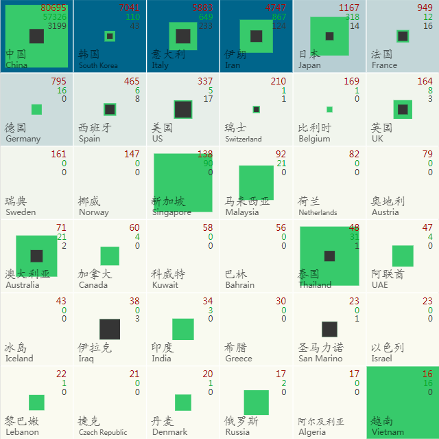

还有一些应用，普通民众通过登录就可以找到离自己最近的出现了疫情的小区。

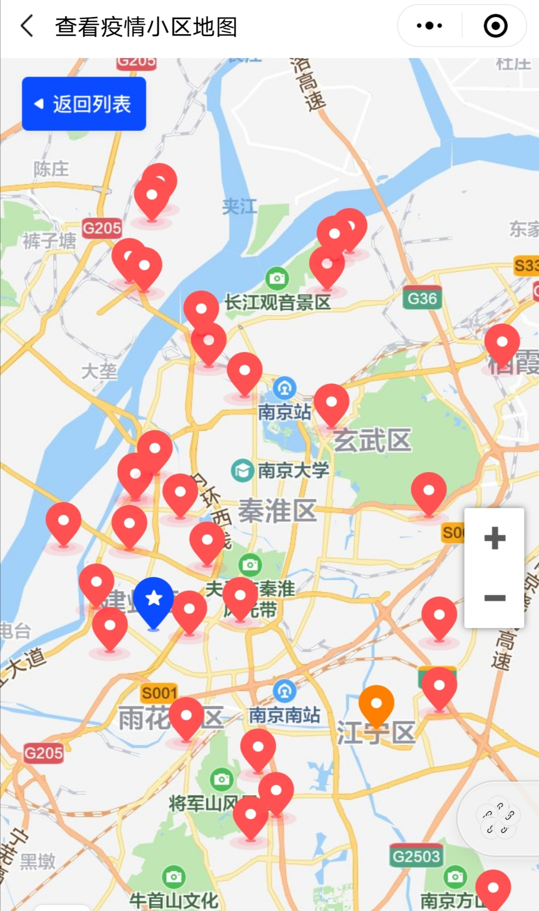

复工之后，通过查看城市的实时热力图，就可以知道什么地方人多，尽量避免人口的密集。

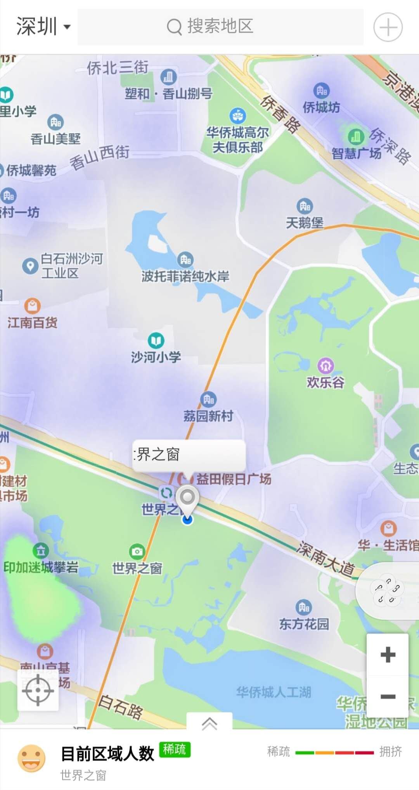

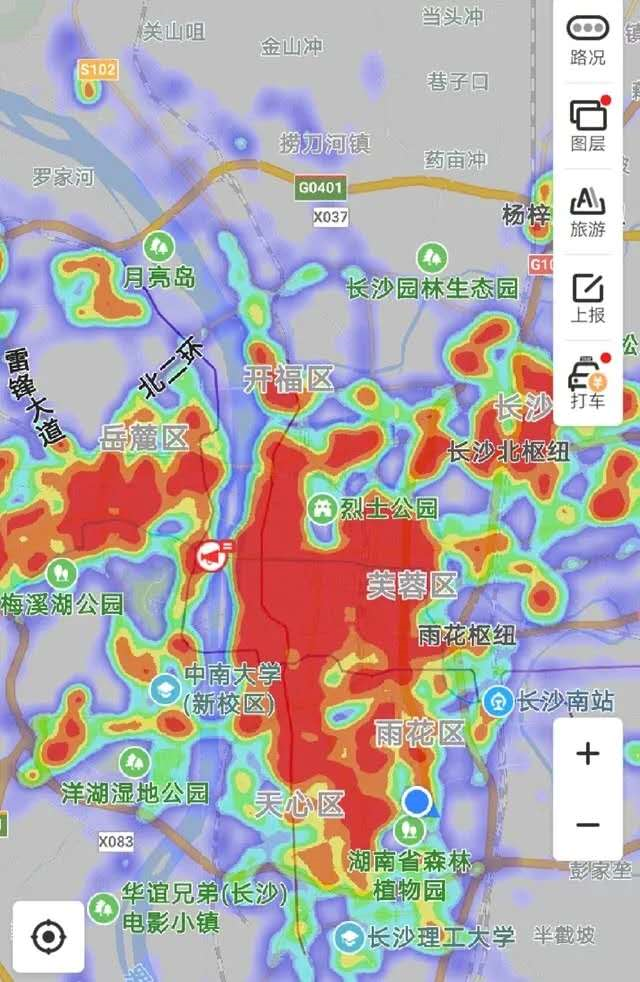

#### 3. 基于卫建委+交通+工信 数据查找密切接触者

把卫健委的数据、交通系统的数据、工信部门的数据组合起来，可以找出密切接触者。比如说，卫健委可以知道确诊患者的姓名、身份证号，然后通过交通部给出这个患者半个多月来乘坐过的航班车次。根据手机号，地方政府可以找到密切接触者。除了官方的查找，同行者也可以在同行查询平台查出所坐的航班和车次上有没有确诊患者，可以很好地发现密切接触者$^{[ 19 ]}$。

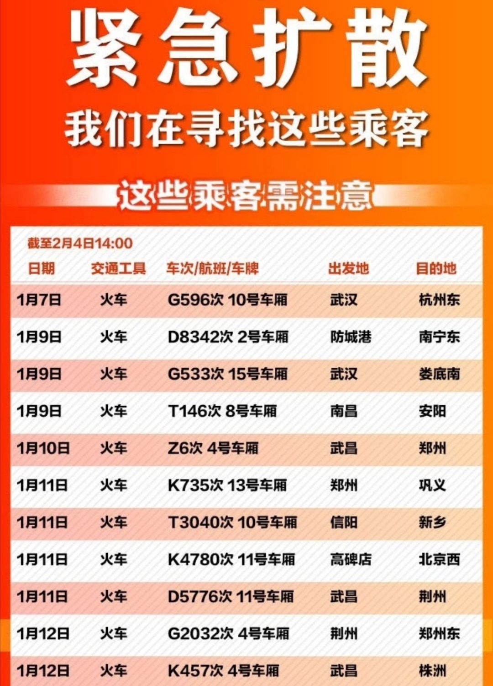

#### 4. 大数据助力复工复产

复工之后，会有人隐瞒了自己来自疫区、到过疫区的经历。其中有些人虽然看上去没有症状，但是可能已经感染了，并且是有很强的传染性。虽然可以通过手机定位判断其位置轨迹，但由于隐私的保护不能这样做。所以，工信部统筹三个运营商，提供了用户行程的服务。因为根据《个人信息保护法》，用户是可以查询自己信息的。这就是最近大家进程用到的各种健康码的由来$^{[ 20 ]}$。这种用于个人自证无疫区行程正是基于电信疫情大数据平台，为民众复工带来了极大的便利。

除了电信和互联网公司的大数据以外，还有许多其他种类的大数据也会发挥很多的作用。比如说通过电力大数据：社区可以根据用电的情况来判断每家每户多少人处于隔离的状态，从而提供送菜上门等针对性的服务；通过对工厂用电量的分析，又可以知道实际的复工情况。

所以无论是宏观还是微观，大数据对疫情期间的复工复产都带了巨大的积极影响。

当然大数据还在其他许多方面对此次抗击疫情起了不可替代的作用，以下简单罗列几个，不再一一展开：

- 医疗大数据助力智能诊断；
- 使用药物大数据加快药物的筛选来帮助新药与疫苗的研制；
- 大数据优化医疗紧缺物资的生产组织与调度

### Ⅱ. 疫情大数据不应姗姗来迟

谷歌曾经设计过一个很有名的流感预测系统（Google Flu Trends），是大数据在公共卫生领域的重要尝试。由于系统数据特征的单一性（仅仅依靠搜索关键词）以及“预测即干涉”等社会因素，导致其两三年后彻底失效$^{[ 21 ]}$。但留给后人很重要的启发：设计良好的大数据系统不仅可以在事后对我们的突发公共事件提供应急帮助，还可以在危机来临之前起到预警的作用。

然而这次新冠疫情中，大数据基本上没有起到预警作用。原因有很多，这里我就挑选几项重要的分析一下。

#### 1. 大数据需要真实

上面提到的“流感预测系统”失效很重要的一个原因就是“数据失真”。由于大家都对这个系统感兴趣，并经常对其进行有指向性地搜索，导致系统的数据来源有很大的人为干扰性，**无法客观地反应事实**。做过大数据分析的人都有过“数据清洗”的经历，因为数据分析师们知道不能将“有毒”的失真数据放入系统中。

此次疫情的起始阶段数据量较少，很难触发大数据分析。只有当发展到人传人的时候，行为轨迹类的大数据才开始起作用。不过由于各种原因，数据的披露延误了至少10天，再加上两周左右的潜伏期，导致病毒蔓延了一个多月后才引起社会的警觉。

另外官方媒体发布过的一些错误信息，如“不会人传人”、“可防可控”等也对疫情防控产生了极大的负面影响。公布真实的数据，不仅仅是为了大数据分析。2018年的一项研究表明：当媒体的报道量增加10倍，疾病的感染数会减少33.5%。$^{[ 22 ]}$

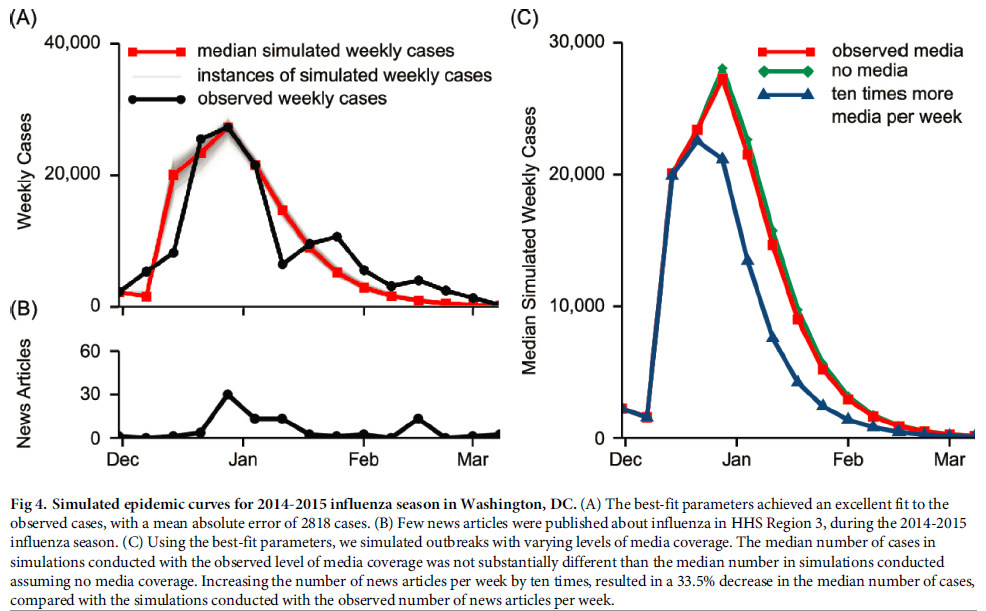

#### 2. 大数据需要融合

在此次疫情中我们看到了很多大数据技术带来的直观便利，也发现了不少的缺憾。比如在方舱医院建立之前，很多新冠病人的家属在社交媒体上求助，因为不知道可以送到哪里求助。而卫健委并没有所有医院的床位数据，因为过去这些数据是不联网的，这样导致我们不能实时地知道什么床位是有富余的，什么可以调度出来。

上面提到的电信大数据在防控中的作用，是因为用户的信令数据面很广，而且实时性很好。但基站的定位精度只有百米的量级，根据这个来确定密切接触者是不准确的。相比之下，卫星导航和数字地图的定位精度虽然高，但是它的用户数覆盖不够。所以将两者结合可能会产生更好的结果，而这需要有关部委对各两类数据进行融合。

另外，现在不少小区实行了封闭管理，使用专门的排查APP，可以对小区居民每日测量的体温进行上报，数据自动联网。还可以根据实名数据记录到药店购买发烧药、咳嗽药的人员。进一步还可以将公交卡、网约车的数据结合起来。相关数据的融合将能得到更有价值的结果，但也更加考验跨部门大数据的协调能力$^{[ 23 ]}$。

#### 3. 大数据需要开放

一月底的时候，我曾尝试汇总各方面的疫情公开数据，来进行一个可视化展示。然后做到一半不得不放弃，因为很多我认为应该是公开的数据却没有办法获取，或者只能获取一些excel文件的截图。当然后来一系列的数据公开和大量互联网公司的参与，让公众可以及时获知疫情的发展情况和相关知识，一定程度上满足了公众的信息需求。

然而在大数据时代，我们会不断从网络上得到各种各样难以辨别的“小道消息”，政府的公开数据不足以让公众获知一些更具体的数据$^{[ 24 ]}$。通过对疫情数据的分析和获取，我自身的感受是政府在相关事件中公布的数据存在以下几个问题：

- 碎片化：没有一个梳理较好的门户网站将各种类型数据归纳，需要去各个层级的政府部门搜集才能获得较为完整的数据概况。
- 不符合标准格式：由于大数据系统基础建设的差异，还存在有些地方的数据需要手工导入的情况，一些文本类型数据却使用截图去呈现，或者一些统计补全的表单数据就做可视化展示。
- 具有一定的歧视性：部分可面向公众的数据却特供某些人群，却完全不考虑这些人群能够真正发掘这些数据的价值。甚至有些网站拿疫情数据作为引流的手段。
- 时效性还需要进一步提升：虽然现在一天一更新的速度已经够快了，但随着实时流处理技术的广泛应用，很多数据的公开完全可以达到趋近实时的效果。

在资讯获取方面，我想我们大多数人也感受到了类似“丁香园”这样的社会机构所带来的数据展示的便利。毕竟不是所有的政府部门都擅长于满足用户需以及带来更好的用户体验，那么此时何不将数据开放给在这方面更加专业的团队呢？所以政府可以作为数据的管理者和供给者，让市场上的专业组织去利用数据开发成普通民众更加需要的应用，再一起给社会公众提供服务。甚至部分数据可以以更加友好公开的接口，开放给开源社区的开发者，激活各个不同领域的开发者集思广益。

从2008年汶川大地震开始，人们就意识到面对紧急的突发时间，光靠政府孤军奋战是不行的，必要的时候需要整个社会的充分参与。政府从传统的信息公示到将整个数据层进行共享是质的跨越，这也会让众多社会力量协助去更好地满足公众的数据需求，真正的让大数据普惠于民。自从2018年中央网信办等多部委联合印发了《公共信息资源开放试点工作方案》$^{[ 25 ]}$以来，我国已有超过一百个地方政府推出了数据开放平台$^{[ 26 ]}$。

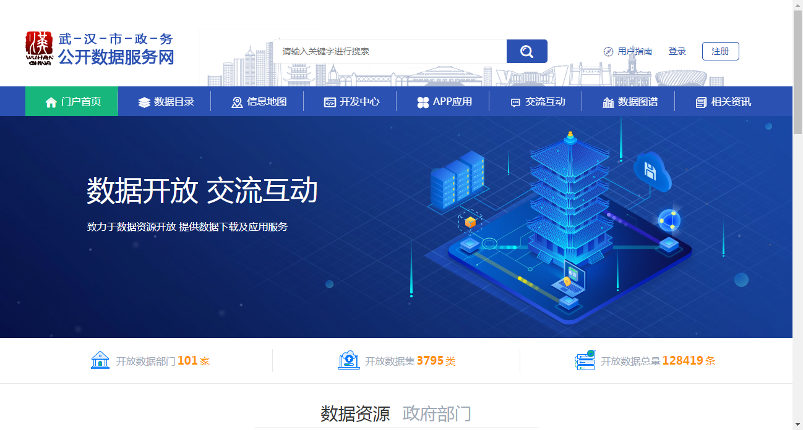

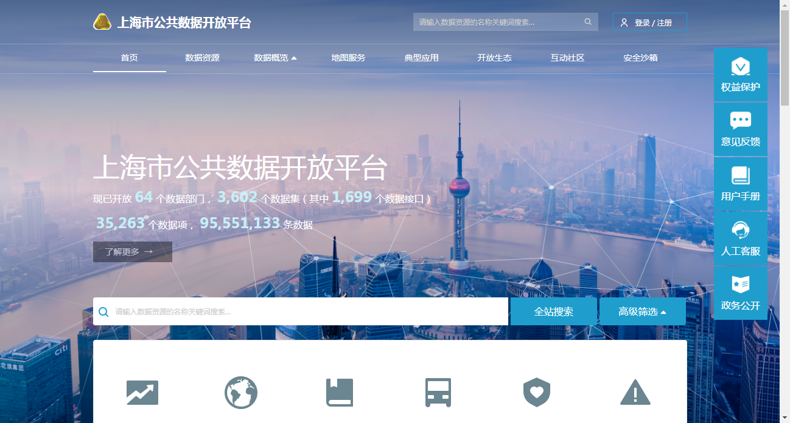

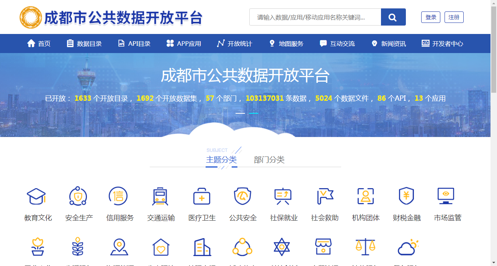

另外，大数据的开放及应用需要有法律保证。目前并没有明确政府应该开放什么数据，应该公布什么信息。特别是在突发公共事件当中，政府应该如何保证资讯的公开透明。所以，我们需要有相关的实施细则，去明确省规范政府各级部门，以及相关企业对突发公共事件防控数据的收集权限和管理责任。

在智慧城市建设的过程中，政府数据的开放仍然面临着很多挑战和难点问题。这些问题都需要各地各级政府进一步探索和研究。

### Ⅲ. 舆情管控的新要求及新思路

互联网时代谣言的流传速度和广度极其迅速，国内有丁香医生、腾讯“较真”等多个互联网平台开展辟谣工作，国外也有Facebook、Instagram、Google等在自己的社交和搜索领域花费大量力气去治理谣言。

防民之口，甚于防川。如今的舆情管控相较于过去困难了许多。

1. 首先是资讯传播的速度太快：造谣张张嘴，辟谣跑断腿。
2. 然后很多谣言的迷惑性让不具备专业知识，甚至专业领域不够深入的人都容易上当。
3. 谣言的载体从单纯的文字转变为了带文字的图片和无法判断真伪的视频、截图。

曾经那个QQ群里“今天是马XX生日，转发此条信息到X个QQ群就能得到88元红包”就骗到无数人的时代其实一直没有过去。只不过内容可能换成了“合格的口罩会吸附大量的纸屑，反之就是不合格的口罩”这种。因此要达到**精准、高效地辟谣**需要各类最新的大数据和AI技术：

1. 内容审查可以实时监控发布的消息，但又不能影响发布的速度；
2. 需要通过知识图谱构建事件的“线上专家系统”，能对更具迷惑性的内容进行判别甚至推理；
3. OCR和基于AI的视频流分析技术能够从图片、视频等提取出内容。

除了技术上的问题之外，更重要的是行政角度上要大禹治水，宜疏不宜堵。此次疫情也曾由于信息不够及时透明，将部分专业人事的“预警信息”误判为谣言，导致部分地方政府甚至短暂地陷入了“塔西佗陷阱”。幸亏后来政策及时调整，避免了更深的负面影响。

不顾这也为我们敲响了另一个警钟：**一刀切的舆情管控本身就是一种懒政。**

好的舆情管控必须要建立在足够公信力之上，这一点我们国家已经做得比世界上大多数国家要好了。但仍有不少境外媒体进行摸黑和污蔑，这些带有偏见的不实言论却也能影响到些许人。

除了技术和行政上的措施之外，我一直觉得国人要更有自信。“四个自信”${[ 27 ]}$是我们在做舆情工作中值得思考与理解的精神食量。

## 四、总结

**发展是人类社会永恒的主题，也是解决我国一切问题的基础和关键。**$^{[ 28 ]}$我国的城镇化发展目前已经进入了分化的阶段，在传统的基础设施之上建设智慧城市显得尤为重要。

本文先分别介绍了中美两国在突发公共事件中的应急管理，然后简单分析了“新基建”是中国城镇化升级为“智慧城镇化”的必经之路，最后通过总结智慧城市建设在此次疫情防控中的重要作用以及暴露出来的不足。

希望此次新冠疫情早日过去，也希望我们国家的突发公共事件应急管理能力能从中汲取更多有益的思考。

## References

[1] 美国情报机构概览：https://mp.weixin.qq.com/s?subscene=3&__biz=MzI2MTE0NTE3Mw==&mid=2651106424&idx=1&sn=d51657bd9f5c5d5899cf12ce8f3525fe&chksm=f1aedb42c6d95254712864c4306a7b0601259db4ee37ff0faf4df1cf26d5c4d5818990322b7b&scene=7&ascene=65&devicetype=android-29&version=27000a5e&nettype=WIFI&abtest_cookie=AAACAA%3D%3D&lang=zh_CN&exportkey=An5YKSZzDsAPKCTHdtWQ6IY%3D&pass_ticket=eYlLm7Q8LjVnWHsTv5sVidLKuDGo0L99I6Eh%2FX2z%2BSU%3D&wx_header=1

[2] 美国卡特里娜飓风：https://www.sohu.com/a/333732631_552814

[3] FEMA官网：https://www.fema.gov/

[4] FEMA组织架构：https://www.fema.gov/media-library/assets/documents/28183

[5] National Incident Management System：https://www.fema.gov/national-incident-management-system

[6] 突发公共事件应急管理——美国的经验与中国的改革 ：https://www.sohu.com/a/369192224_439965

[7]《从卡特里娜飓风灾害看美国的减灾联动机制》杨新红： https://www.docin.com/p-1657176850.html

[8] 中华人民共和国应急管理部：https://www.mem.gov.cn/

[9] 统计局的“国家数据”：http://data.stats.gov.cn/

[10] 中国流动人口的主要特征及对中国城市化的影响：https://kns.cnki.net/KCMS/detail/detail.aspx?dbcode=CJFQ&dbname=CJFD2013&filename=CSWT201303001&v=MjEyOTF2RkNybVU3N1BKajdjZXJHNEg5TE1ySTlGWllSOGVYMUx1eFlTN0RoMVQzcVRyV00xRnJDVVI3cWZaZWQ=

[11] 《中国流动人口发展报告2018》：http://www.nhc.gov.cn/wjw/xwdt/201812/a32a43b225a740c4bff8f2168b0e9688.shtml

[12] 流动人口数据平台：http://www.chinaldrk.org.cn/wjw/#/nationalDay

[13] 《中国城市化2.0: 超级都市圈》：https://wuhan.house.ifeng.com/news/2019_10_17-52364929_0.shtml

[14] 《国家新型城镇化规划（2014－2020年）》：http://www.gov.cn/gongbao/content/2014/content_2644805.htm

[15] 《2019年新型城镇化建设重点任务》：http://www.gov.cn/guowuyuan/2019-04/09/content_5380627.htm

[16] 收缩的城市：https://www.sohu.com/a/215910631_734359

[17] 邬贺铨：大数据技术助力新冠疫情防控：https://mp.weixin.qq.com/s?__biz=MzA3NzQ0NDEzNA==&mid=2650219752&idx=1&sn=a1b05d0a034d8ec9b6e7ca5498493ae3&chksm=875261a1b025e8b737ede43f50db39a4f5c1cdad63ef45d9e87c309bc3332f1112e31104b67d&scene=90&xtrack=1&subscene=93&clicktime=1582529743&enterid=1582529743&ascene=56&devicetype=android-29&version=27000afd&nettype=WIFI&abtest_cookie=AAACAA%3D%3D&lang=zh_CN&exportkey=AuPWmhlhmKSQOrEDHY6IchI%3D&pass_ticket=ofx8HIRIJCPgRKB4ZKm%2Fo0AmhWooAHM8hIIXCZ1FGB8%3D&wx_header=1

[18] 新冠病毒肺炎 — 疫情方寸间（国际版）：http://chinavis.org/ncov/square_world/index.html

[19] 急寻同行人：https://mp.weixin.qq.com/s?subscene=3&__biz=MjM5MjAxNDM4MA==&mid=2666292606&idx=1&sn=c2a7ad85ad5749831e9cfb91bf50fc85&chksm=bdb40c3d8ac3852b33b9294fcd5fccd16a317cc22f4dfd568345ff63c68f57e33a0cd2120169&scene=7&ascene=65&devicetype=android-29&version=27000c34&nettype=cmnet&abtest_cookie=AAACAA%3D%3D&lang=zh_CN&exportkey=AgdhAABWnhhybBHQdz9ASxc%3D&pass_ticket=2L2czhraOKz%2FWh%2BtvrhonkDqnA%2BGFUuL0BUk87bOXRc%3D&wx_header=1

[20] 助力战“疫”复工：http://www.zjscdb.com/detail.php?newsid=215722

[21] 谷歌流感趋势错在哪儿了？：https://www.guokr.com/article/438117/

[22] Incorporating media data into a model of infectious disease transmission: https://www.semanticscholar.org/paper/Incorporating-media-data-into-a-model-of-infectious-Kim-Fast/17e4de7b95ed440d0df3a87e85e9fca8b64b0de7

[23] 从卫健委网站看疫情数据统计体系的建设：https://mp.weixin.qq.com/s?__biz=MzA5MjEyMTYwMg==&mid=2650246800&idx=1&sn=12e8ad2b98f1545bdd1b3671f9bef325&chksm=8872d1fdbf0558eb5518362c23fcc6d64d3e76aa28ec184a93277bc8c6d249bc40fdd5a1137f&scene=90&xtrack=1&subscene=93&clicktime=1581049893&enterid=1581049893&ascene=56&devicetype=android-29&version=27000a5e&nettype=WIFI&abtest_cookie=AAACAA%3D%3D&lang=zh_CN&exportkey=Aro41ILActNEt%2FrU2UwLy2s%3D&pass_ticket=2ROOSbPW6sS2hoQjFfL9VNqrxmnOkozY4QKUN2cC0T8%3D&wx_header=1

[24] 面对肺炎疫情，政府的数据开放还有很大空间：https://mp.weixin.qq.com/s?subscene=3&__biz=MzIxNzAzMjMxNA==&mid=2650278411&idx=1&sn=8bc3e55a218e1d0b5f3d85b26331be30&chksm=8ff3591eb884d008a277deefd678553f7491495e9ffdbdfc98fefd139e908ad75019556db3b7&scene=7&ascene=65&devicetype=android-29&version=27000c34&nettype=cmnet&abtest_cookie=AAACAA%3D%3D&lang=zh_CN&exportkey=AvsBHDYWVhbogvC%2FuDENlvE%3D&pass_ticket=ltZqpq8F7aPj4RtvYd5pL61J0%2BjUQwKelxeCGIsT%2Fdk%3D&wx_header=1

[25] 《公共信息资源开放试点工作方案》：http://www.cac.gov.cn/2018-01/05/c_1122215495.htm

[26] 2019下半年中国地方政府数据开放报告：http://www.cbdio.com/BigData/2020-01/15/content_6154163.htm

[27] 推进国家治理体系和治理能力现代化若干重大问题的决定：http://www.qstheory.cn/yaowen/2019-11/07/c_1125202003.htm

[28] 发展是人类社会永恒的主题：http://cpc.people.com.cn/xuexi/n1/2019/0121/c385474-30579904.html