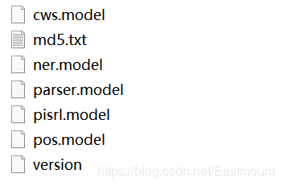

pyltp 是 [语言技术平台（Language Technology Platform, LTP）](https://github.com/HIT-SCIR/ltp) 的 Python 封装。

如需了解 LTP 的详细信息，请参考 LTP 的 [文档](https://github.com/HIT-SCIR/ltp) 。

# 目录

- 安装 pyltp
    - [使用 pip 安装](https://pyltp.readthedocs.io/zh_CN/latest/install.html#pip)
    - [从源码安装](https://pyltp.readthedocs.io/zh_CN/latest/install.html#id2)
- 使用 pyltp
    - [使用前请先下载完整模型](https://pyltp.readthedocs.io/zh_CN/latest/api.html#id2)
    - [请注意编码](https://pyltp.readthedocs.io/zh_CN/latest/api.html#id4)
    - [分句](https://pyltp.readthedocs.io/zh_CN/latest/api.html#id5)
    - [分词](https://pyltp.readthedocs.io/zh_CN/latest/api.html#id6)
    - [词性标注](https://pyltp.readthedocs.io/zh_CN/latest/api.html#id10)
    - [命名实体识别](https://pyltp.readthedocs.io/zh_CN/latest/api.html#id13)
    - [依存句法分析](https://pyltp.readthedocs.io/zh_CN/latest/api.html#id15)
    - [语义角色标注](https://pyltp.readthedocs.io/zh_CN/latest/api.html#id17)
    - [语义依存分析](https://pyltp.readthedocs.io/zh_CN/latest/api.html#id19)
    - [完整示例代码](https://pyltp.readthedocs.io/zh_CN/latest/api.html#id21)

# 安装 pyltp

- 注：由于新版本增加了新的第三方依赖如dynet等，不再支持 windows 下 python2 环境。

## 使用 pip 安装

使用 pip 安装前，请确保您已安装了 [pip](https://pip.pypa.io/)

```
$ pip install pyltp
```

接下来，需要下载 LTP 模型文件。

- 下载地址 - [`模型下载 http://ltp.ai/download.html`_](https://pyltp.readthedocs.io/zh_CN/latest/install.html#id3)
- 当前模型版本 - 3.4.0
- 注意在windows下 3.4.0 版本的 语义角色标注模块 模型需要单独下载，具体查看下载地址链接中的说明。

请确保下载的模型版本与当前版本的 pyltp 对应，否则会导致程序无法正确加载模型。

## 从源码安装

您也可以选择从源代码编译安装

```
$ git clone https://github.com/HIT-SCIR/pyltp
$ git submodule init
$ git submodule update
$ python setup.py install
```

安装完毕后，也需要下载相应版本的 LTP 模型文件。

# 使用 pyltp

pyltp 是 [LTP](https://github.com/HIT-SCIR/ltp) 的 Python 封装，提供了分词，词性标注，命名实体识别，依存句法分析，语义角色标注的功能。

关于各个模块任务的介绍、标注体系、性能指标，可以查阅 [这里](http://www.ltp-cloud.com/intro/#introduction) 的介绍。

## 使用前请先下载完整模型

请先下载完整的 LTP 模型文件

- 下载地址 - [百度云](http://pan.baidu.com/share/link?shareid=1988562907&uk=2738088569)
- 当前模型版本 - 3.4.0

请确保下载的模型版本与当前版本的 pyltp 对应，否则会导致程序无法正确加载模型。

## 请注意编码

pyltp 的所有输入的分析文本和输出的结果的编码均为 UTF-8。

如果您以非 UTF-8 编码的文本输入进行分析，结果可能为空。请注意源代码文件的默认编码。

由于 Windows 终端采用 GBK 编码显示，直接输出 pyltp 的分析结果会在终端显示为乱码。您可以将标准输出重定向到文件，以 UTF8 方式查看文件，就可以解决显示乱码的问题。

## 分句

使用 pyltp 进行分句示例如下

```python
# -*- coding: utf-8 -*-
from pyltp import SentenceSplitter
sents = SentenceSplitter.split('元芳你怎么看？我就趴窗口上看呗！')  # 分句
print('\n'.join(sents))
```

结果如下

```
元芳你怎么看？
我就趴窗口上看呗！
```

## 分词

使用 pyltp 进行分词示例如下

```python
# -*- coding: utf-8 -*-
import os
LTP_DATA_DIR = '/path/to/your/ltp_data'  # ltp模型目录的路径
cws_model_path = os.path.join(LTP_DATA_DIR, 'cws.model')  # 分词模型路径，模型名称为`cws.model`

from pyltp import Segmentor
segmentor = Segmentor()  # 初始化实例
segmentor.load(cws_model_path)  # 加载模型
words = segmentor.segment('元芳你怎么看')  # 分词
print ('\t'.join(words))
segmentor.release()  # 释放模型
```

结果如下

```
元芳  你       怎么      看
```

`words = segmentor.segment('元芳你怎么看')` 的返回值类型是native的VectorOfString类型，可以使用list转换成Python的列表类型，例如

```python
...
>>> words = segmentor.segment('元芳你怎么看')
>>> type(words)
<class 'pyltp.VectorOfString'>
>>> words_list = list(words)
>>> type(words_list)
<type 'list'>
>>> print(words_list)
['\xe5\xae\xa2\xe6\x9c\x8d', '\xe5\xa4\xaa', '\xe7\xb3\x9f\xe7\xb3\x95', '\xe4\xba\x86']
```

### 使用分词外部词典

pyltp 分词支持用户使用自定义词典。分词外部词典本身是一个文本文件（plain text），每行指定一个词，编码同样须为 UTF-8，样例如下所示

```
苯并芘
亚硝酸盐
```

示例如下

```python
# -*- coding: utf-8 -*-
import os
LTP_DATA_DIR = '/path/to/your/ltp_data'  # ltp模型目录的路径
cws_model_path = os.path.join(LTP_DATA_DIR, 'cws.model')  # 分词模型路径，模型名称为`cws.model`

from pyltp import Segmentor
segmentor = Segmentor()  # 初始化实例
segmentor.load_with_lexicon(cws_model_path, '/path/to/your/lexicon') # 加载模型，第二个参数是您的外部词典文件路径
words = segmentor.segment('亚硝酸盐是一种化学物质')
print('\t'.join(words))
segmentor.release()
```

### 使用个性化分词模型

个性化分词是 LTP 的特色功能。个性化分词为了解决测试数据切换到如小说、财经等不同于新闻领域的领域。 在切换到新领域时，用户只需要标注少量数据。 个性化分词会在原有新闻数据基础之上进行增量训练。 从而达到即利用新闻领域的丰富数据，又兼顾目标领域特殊性的目的。

pyltp 支持使用用户训练好的个性化模型。关于个性化模型的训练需使用 LTP，详细介绍和训练方法请参考 [个性化分词](http://ltp.readthedocs.org/zh_CN/latest/theory.html#customized-cws-reference-label) 。

在 pyltp 中使用个性化分词模型的示例如下

```python
# -*- coding: utf-8 -*-
import os
LTP_DATA_DIR = '/path/to/your/ltp_data'  # ltp模型目录的路径
cws_model_path = os.path.join(LTP_DATA_DIR, 'cws.model')  # 分词模型路径，模型名称为`cws.model`

from pyltp import CustomizedSegmentor
customized_segmentor = CustomizedSegmentor()  # 初始化实例
customized_segmentor.load(cws_model_path, '/path/to/your/customized_model') # 加载模型，第二个参数是您的增量模型路径
words = customized_segmentor.segment('亚硝酸盐是一种化学物质')
print('\t'.join(words))
customized_segmentor.release()
```

同样，使用个性化分词模型的同时也可以使用外部词典

```python
# -*- coding: utf-8 -*-
import os
LTP_DATA_DIR = '/path/to/your/ltp_data'  # ltp模型目录的路径
cws_model_path = os.path.join(LTP_DATA_DIR, 'cws.model')  # 分词模型路径，模型名称为`cws.model`

from pyltp import CustomizedSegmentor
customized_segmentor = CustomizedSegmentor()  # 初始化实例
customized_segmentor.load_with_lexicon(cws_model_path, '/path/to/your/customized_model', '/path/to/your/lexicon') # 加载模型
words = customized_segmentor.segment('亚硝酸盐是一种化学物质')
print('\t'.join(words))
customized_segmentor.release()
```

## 词性标注

使用 pyltp 进行词性标注示例如下

```python
# -*- coding: utf-8 -*-
import os
LTP_DATA_DIR = '/path/to/your/ltp_data'  # ltp模型目录的路径
pos_model_path = os.path.join(LTP_DATA_DIR, 'pos.model')  # 词性标注模型路径，模型名称为`pos.model`

from pyltp import Postagger
postagger = Postagger() # 初始化实例
postagger.load(pos_model_path)  # 加载模型

words = ['元芳', '你', '怎么', '看']  # 分词结果
postags = postagger.postag(words)  # 词性标注

print('\t'.join(postags))
postagger.release()  # 释放模型
```

结果如下

```
nh  r       r       v
```

参数 `words` 是分词模块的返回值，也支持Python原生的list类型，例如

```python
words = ['元芳', '你', '怎么', '看']
postags = postagger.postag(words)
```

LTP 使用 863 词性标注集，详细请参考 [词性标注集](http://ltp.readthedocs.org/zh_CN/latest/appendix.html#id3) 。

### 使用词性标注外部词典

pyltp 词性标注同样支持用户的外部词典。词性标注外部词典同样为一个文本文件，每行指定一个词，第一列指定单词，第二列之后指定该词的候选词性（可以有多项，每一项占一列），列与列之间用空格区分。示例如下

```
雷人 v a
】 wp
```

## 命名实体识别

使用 pyltp 进行命名实体识别示例如下

```python
# -*- coding: utf-8 -*-
import os
LTP_DATA_DIR = '/path/to/your/ltp_data'  # ltp模型目录的路径
ner_model_path = os.path.join(LTP_DATA_DIR, 'ner.model')  # 命名实体识别模型路径，模型名称为`pos.model`

from pyltp import NamedEntityRecognizer
recognizer = NamedEntityRecognizer() # 初始化实例
recognizer.load(ner_model_path)  # 加载模型

words = ['元芳', '你', '怎么', '看']
postags = ['nh', 'r', 'r', 'v']
netags = recognizer.recognize(words, postags)  # 命名实体识别

print('\t'.join(netags))
recognizer.release()  # 释放模型
```

其中，`words` 和 `postags` 分别为分词和词性标注的结果。同样支持Python原生的list类型。

结果如下

```
S-Nh        O       O       O
```

LTP 采用 BIESO 标注体系。B 表示实体开始词，I表示实体中间词，E表示实体结束词，S表示单独成实体，O表示不构成命名实体。

LTP 提供的命名实体类型为:人名（Nh）、地名（Ns）、机构名（Ni）。

B、I、E、S位置标签和实体类型标签之间用一个横线 `-` 相连；O标签后没有类型标签。

详细标注请参考 [命名实体识别标注集](http://ltp.readthedocs.org/zh_CN/latest/appendix.html#id4) 。

## 依存句法分析

使用 pyltp 进行依存句法分析示例如下

```python
# -*- coding: utf-8 -*-
import os
LTP_DATA_DIR = '/path/to/your/ltp_data'  # ltp模型目录的路径
par_model_path = os.path.join(LTP_DATA_DIR, 'parser.model')  # 依存句法分析模型路径，模型名称为`parser.model`

from pyltp import Parser
parser = Parser() # 初始化实例
parser.load(par_model_path)  # 加载模型

words = ['元芳', '你', '怎么', '看']
postags = ['nh', 'r', 'r', 'v']
arcs = parser.parse(words, postags)  # 句法分析

print("\t".join("%d:%s" % (arc.head, arc.relation) for arc in arcs))
parser.release()  # 释放模型
```

其中，`words` 和 `postags` 分别为分词和词性标注的结果。同样支持Python原生的list类型。

结果如下

```
4:SBV       4:SBV   4:ADV   0:HED
```

`arc.head` 表示依存弧的父节点词的索引。ROOT节点的索引是0，第一个词开始的索引依次为1、2、3…

`arc.relation` 表示依存弧的关系。

`arc.head` 表示依存弧的父节点词的索引，`arc.relation` 表示依存弧的关系。

标注集请参考 [依存句法关系](http://ltp.readthedocs.org/zh_CN/latest/appendix.html#id5) 。

## 语义角色标注

使用 pyltp 进行语义角色标注示例如下

```python
# -*- coding: utf-8 -*-
import os
LTP_DATA_DIR = '/path/to/your/ltp_data'  # ltp模型目录的路径
srl_model_path = os.path.join(LTP_DATA_DIR, 'srl')  # 语义角色标注模型目录路径，模型目录为`srl`。注意该模型路径是一个目录，而不是一个文件。

from pyltp import SementicRoleLabeller
labeller = SementicRoleLabeller() # 初始化实例
labeller.load(srl_model_path)  # 加载模型

words = ['元芳', '你', '怎么', '看']
postags = ['nh', 'r', 'r', 'v']
# arcs 使用依存句法分析的结果
roles = labeller.label(words, postags, arcs)  # 语义角色标注

# 打印结果
for role in roles:
    print(role.index, "".join(
        ["%s:(%d,%d)" % (arg.name, arg.range.start, arg.range.end) for arg in role.arguments]))
labeller.release()  # 释放模型
```

结果如下

```
3 A0:(0,0)A0:(1,1)ADV:(2,2)
```

第一个词开始的索引依次为0、1、2…

返回结果 `roles` 是关于多个谓词的语义角色分析的结果。由于一句话中可能不含有语义角色，所以结果可能为空。

`role.index` 代表谓词的索引， `role.arguments` 代表关于该谓词的若干语义角色。

`arg.name` 表示语义角色类型，`arg.range.start` 表示该语义角色起始词位置的索引，`arg.range.end` 表示该语义角色结束词位置的索引。

例如上面的例子，由于结果输出一行，所以“元芳你怎么看”有一组语义角色。 其谓词索引为3，即“看”。这个谓词有三个语义角色，范围分别是(0,0)即“元芳”，(1,1)即“你”，(2,2)即“怎么”，类型分别是A0、A0、ADV。

`arg.name` 表示语义角色关系，`arg.range.start` 表示起始词位置，`arg.range.end` 表示结束位置。

标注集请参考 [语义角色关系](http://ltp.readthedocs.org/zh_CN/latest/appendix.html#id6) 。

## 语义依存分析

pyltp 暂不提供语义依存分析功能。若需使用该功能，请使用 [语言云](http://www.ltp-cloud.com/) 。

## 完整示例代码

完整的示例代码可以参考 `example/example.py` 。


下载好的模型文件有：



|     模型名     |           说明           |
| :------------: | :----------------------: |
|  `cws.model`   |     分词模型，单文件     |
|  `pos.model`   |   词性标注模型，单文件   |
|  `ner.model`   | 命名实体识别模型，单文件 |
| `parser.model` | 依存句法分析模型，单文件 |
|  `srl_data/`   | 语义角色标注模型，多文件 |

在编写代码时，需要导入指定文件夹中的模型，再进行中文分词、词性标注、命名实体识别、依存句法分析、语义角色标注等分析。

