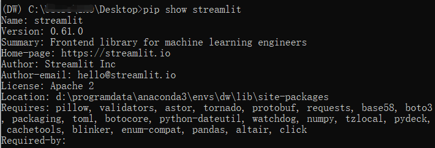
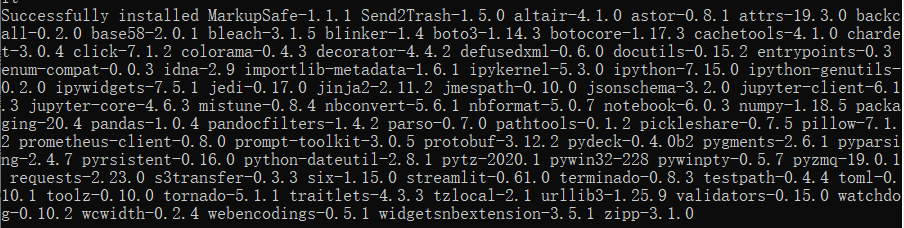
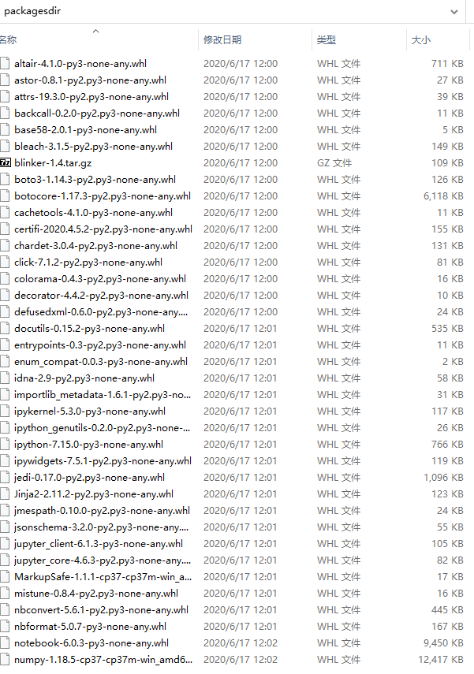
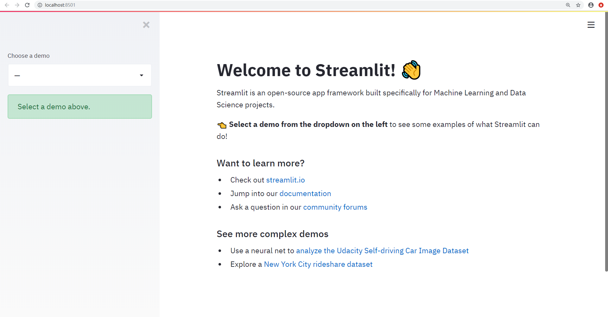

## 内网Windows快速安装python第三方包


Python的第三方包依赖比较复杂，特别是像深度学习中的Tensorflow和Pytorch等包。在外网环境下通过 `pip` 可以很方便地进行在线安装，但是在离线环境或者内网环境（没有内网Pypi源）中想要逐个安装第三方包就麻烦了许多，尤其是在新的内网机中安装配置自己常用的环境。

对于 Linux 系统可以使用 `docker` 镜像来迁移Python环境，同样的 Windows 系统下也有 `docker-toolbox` 可以使用。但对于开发环境或者数据分析环境，是否有更轻量级的方法呢？其实通过使用 `pip` 就可以实现。 

### 第一步：在外网安装所需要的第三方包

这里使用 `streamlit` 这个第三方包示例。如果在anaconda环境中查看该包的依赖：

```sehll
pip show streamlit
```



会发现依赖包有 `pillow validators tornado ` 等二十多个包，同时这些包也有很多不同的依赖包，如果逐个下载会非常麻烦。

首先在外网新建一个环境：

```
conda create -n DW python=3.7
```

以上命令创建了一个名为 DW 的环境，环境的Python版本为3.7。然后激活该环境并使用 `pip` 安装 `streamlit` ：

```
conda activate DW
pip install streamlit
```

使用 `pip` 安装的过程中如果网速较慢，可以尝试更换 PYPI 的镜像源，我用的是清华的镜像源：

https://mirrors.tuna.tsinghua.edu.cn/pypi/

安装成功后会显示配套安装了一大堆的第三方包：



### 第二步：下载离线包

在 DW 环境中cd到想要保存离线包的目录，这里我使用的是桌面路径，将环境中所有的包文件名及版本号导出到包列表文件 `requirements.txt` ：

```
pip freeze > requirements.txt
```

这时桌面（或者你自己选定的路径下）就会生成一个 `requirements.txt`文件，文件内为 `streamlit` 的依赖包列表及版本号 ：

```
altair==4.1.0
astor==0.8.1
attrs==19.3.0
backcall==0.2.0
base58==2.0.1
bleach==3.1.5
blinker==1.4
boto3==1.14.3
botocore==1.17.3
cachetools==4.1.0
certifi==2020.4.5.2
chardet==3.0.4
click==7.1.2
colorama==0.4.3
decorator==4.4.2
defusedxml==0.6.0
docutils==0.15.2
entrypoints==0.3
enum-compat==0.0.3
idna==2.9
importlib-metadata==1.6.1
ipykernel==5.3.0
ipython==7.15.0
ipython-genutils==0.2.0
ipywidgets==7.5.1
jedi==0.17.0
Jinja2==2.11.2
jmespath==0.10.0
jsonschema==3.2.0
jupyter-client==6.1.3
jupyter-core==4.6.3
MarkupSafe==1.1.1
mistune==0.8.4
nbconvert==5.6.1
nbformat==5.0.7
notebook==6.0.3
numpy==1.18.5
packaging==20.4
pandas==1.0.4
pandocfilters==1.4.2
parso==0.7.0
pathtools==0.1.2
pickleshare==0.7.5
Pillow==7.1.2
prometheus-client==0.8.0
prompt-toolkit==3.0.5
protobuf==3.12.2
pydeck==0.4.0b2
Pygments==2.6.1
pyparsing==2.4.7
pyrsistent==0.16.0
python-dateutil==2.8.1
pytz==2020.1
pywin32==228
pywinpty==0.5.7
pyzmq==19.0.1
requests==2.23.0
s3transfer==0.3.3
Send2Trash==1.5.0
six==1.15.0
streamlit==0.61.0
terminado==0.8.3
testpath==0.4.4
toml==0.10.1
toolz==0.10.0
tornado==5.1.1
traitlets==4.3.3
tzlocal==2.1
urllib3==1.25.9
validators==0.15.0
watchdog==0.10.2
wcwidth==0.2.4
webencodings==0.5.1
widgetsnbextension==3.5.1
wincertstore==0.2
zipp==3.1.0
```

然后就可以根据包清单文件下载离线包：

```
pip download -d packagesdir -r requirements.txt
```

这样就可以将清单里的包文件下载放在路径下的packagesdir文件夹中：



### 第三步：内网安装包

将上一步下载的packagesdir文件夹和requirements.txt文件导入到内网电脑中，放在指定的目录下，这里仍然以桌面为例。

在放置上述文件的位置打开需要安装的虚拟环境，然后使用下面的命令安装文件列表中的包：

```
pip install --no-index --ignore-installed --find-links=packagesdir -r requirements.txt
```

安装完成之后检查是否成功安装 `streamlit` 及其所有依赖包：

```
streamlit hello
```

如果在浏览器中可以看到以下界面说明成功：



以这种方法可以安装例如tensorflow/pytorch等第三方包，请自行尝试。