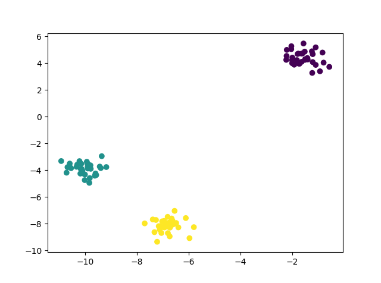
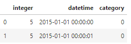
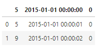
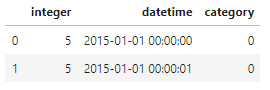
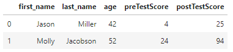

### 1. 简介

机器学习的第一个步骤都是把原始数据加载到系统中，原始数据可能是以下多种数据源：

- 日志文件
- 数据集文件
- 数据库

Pandas 是 Python 生态中十分重要的数据分析工具包，也提供了多种便捷的数据加载方法。

这篇文章主要讲解如何使用 Pandas 从不同的源（包括 CSV 文件和 SQL 数据库）加载数据，同时也会介绍使用 scikit-learn（Python 中的一个开源的机器学习库）生成符合需求的仿真实验数据的方法。

### 2. 加载样本数据集

scikit-learn 中预置了大量的流行数据集可供使用，以下为在 Jupyter lab 中加载已有的样本数据集 ：

```python
# 加载 scikit-learn 的数据集
from sklearn import datasets

# 加载手写数字数据集
digits = datasets.load_digits()

# 创建特征矩阵
features = digits.data

# 创建目标向量
target = digits.target

# 查看第一个样本数据
features[0]

# array([ 0., 0., 5., 13., 9., 1., 0., 0., 0., 0., 13.,
#        15., 10., 15., 5., 0., 0., 3., 15., 2., 0., 11.,
#        8., 0., 0., 4., 12., 0., 0., 8., 8., 0., 0.,
#        5., 8., 0., 0., 9., 8., 0., 0., 4., 11., 0.,
#        1., 12., 7., 0., 0., 2., 14., 5., 10., 12., 0.,
#        0., 0., 0., 6., 13., 10., 0., 0., 0.])
```

scikit-learn 预置的这些很容易加载的常见数据集，比现实中的数据集要小得多、干净得多，因此也被称为“玩具（toy）”数据集。比较常见的玩具数据集有 ：

- load_boston：包含 503 个波士顿房价的观察值。这是一个用于研究回归算法的优质数据集。
- load_iris：包含 150 个鸢尾花尺寸的观察值。这是一个用于研究分类算法的优质数据集。
- load_digits：包含 1797 个手写数字图片的观察值。这是一个用于研究图像分类算法的优质数据集。

### 3. 创建仿真数据集

scikit-learn 提供了很多创建仿真数据集的方法。

可以使用 make_regression 生成一个仿真数据集来做线性回归 ：

```python
# 加载库
from sklearn.datasets import make_regression

# 生成特征矩阵、目标向量以及模型的系数
features, target, coefficients = make_regression(n_samples = 100,
                                                 n_features = 3,
                                                 n_informative = 3,
                                                 n_targets = 1,
                                                 noise = 0.0,
                                                 coef = True,
                                                 random_state = 1)

# 查看特征矩阵和目标向量
print('Feature Matrix\n', features[:3])
print('Target Vector\n', target[:3])

# Feature Matrix
# [[ 1.29322588 -0.61736206 -0.11044703]
#  [-2.793085 0.36633201 1.93752881]
#  [ 0.80186103 -0.18656977 0.0465673 ]]
# Target Vector
# [-10.37865986 25.5124503 19.67705609]
```

可以使用 make_classification 创建一个仿真数据集来做分类：

```python
# 加载库
from sklearn.datasets import make_classification

# 生成特征矩阵和目标向量
features, target = make_classification(n_samples = 100,
                                       n_features = 3,
                                       n_informative = 3,
                                       n_redundant = 0,
                                       n_classes = 2,
                                       weights = [.25, .75],
                                       random_state = 1)
# 查看特征矩阵和目标向量
print('Feature Matrix\n', features[:3])
print('Target Vector\n', target[:3])

# Feature Matrix
# [[ 1.06354768 -1.42632219 1.02163151]
#  [ 0.23156977 1.49535261 0.33251578]
#  [ 0.15972951 0.83533515 -0.40869554]]
# Target Vector
# [1 0 0]
```

可以使用 make_blobs 创建一个适合做聚类处理的数据集：

```python
# 加载库
from sklearn.datasets import make_blobs

# 生成特征矩阵和目标向量
features, target = make_blobs(n_samples = 100,
                              n_features = 2,
                              centers = 3,
                              cluster_std = 0.5,
                              shuffle = True,
                              random_state = 1)

# 查看特征矩阵和目标向量
print('Feature Matrix\n', features[:3])
print('Target Vector\n', target[:3])

# Feature Matrix
# [[ -1.22685609 3.25572052]
#  [ -9.57463218 -4.38310652]
#  [-10.71976941 -4.20558148]]
# Target Vector
# [0 1 1]
```

其中， make_regression 返回一个浮点数的特征矩阵和一个浮点数的目标向量，而 make_classification 和 make_blobs 返回的是一个浮点数的特征矩阵和一个代表分类的整数目标矩阵。

scikit-learn 官方文档对所有参数都有完整的描述，再次说明几个重要的参数值：

- 在 make_regression 和 make_classification 中， n_informative 确定了用于生成目标向量的特征的数量。如果 n_informative 的值比总的特征数（n_features）小，则生成的数据集将包含多余的特征，这些特征可以通过特征选择技术识别出来。

- make_classification 包含了一个 weights 参数，可以利用它生成不均衡的仿真数据集。例如我们设置 weights = [.25, .75]，那么生成的数据集中， 25% 的观察值属于第一个分类， 75% 的观察值属于第二个分类。

- make_blobs 中的 centers 参数决定了要生成多少个聚类。

使用 matplotlib 可视化库，能将 make_blobs 生成的聚类可视化地显示出来：

```python
# 使用魔术方法
%matplotlib
# 加载库
import matplotlib.pyplot as plt

# 查看散点图
plt.scatter(features[:,0], features[:,1], c=target)
plt.show()
```




### 4. 加载 CSV 文件

CSV是以逗号为分隔符（Comma-Separated Values， CSV）的文件，使用 pandas 库的 read_csv 可以加载一个本地或远端的 CSV 文件 ：

```python
# 加载库
import pandas as pd

# 创建文件路径（本地）
file_path = r'./simulated_datasets/data.csv'

# 加载数据集
dataframe = pd.read_csv(file_path)

# 查看前两行数据
dataframe.head(2)
```



在加载 CSV 文件时，需要注意：

1. 在加载数据前快速地浏览一下文件内容会很用，这便于你事先了解数据集的结构以及在加载文件时需要设置什么参数。
2. read_csv 的参数超过了 30 个，需要熟悉那些参数来处理不同的 CSV 格式。
3. 对于 CSV 文件来说，使用除逗号之外的其他字符作为分隔符也很常见，比如制表符。 pandas 的 sep 参数可以设置文件的定界符。 
4. CSV 文件一般会有一个固定的格式（虽然也有例外）：文件的第一行指定列的数据头（例如上面的 integer、datetime、 category）。 header 参数可以指定是否存在数据头这一行以及它的位置。如果没有这一行，则需要设置 header=None。

### 5. 加载 Excel 文件

使用 pandas 库的 read_excel 来加载一个 Excel 数据表 ：

```python
# 加载库
import pandas as pd

# 创建文件路径
file_path = r'./simulated_datasets/data.xlsx'

# 加载数据
dataframe = pd.read_excel(file_path, sheet_name=0, header=1)

# 查看前两行
dataframe.head(2)
```



这个解决方案和加载 CSV 文件的解决方案很类似。主要的区别在于多了一个参数sheet_name，它指定在加载 Excel 文件时要加载哪一张数据表。 

sheet_name 可以是包含数据表名字的字符串，也可以是指向数据表所在位置的整数（从零开始编号）。

如果需要加载多张数据表，可以把它们放在一个列表中一起传入。例如， sheet_name=[0,1,2,"Monthly Sales"] 将返回一个值为 pandas DataFrame 类型的字典，该字典包含了第一张、第二张、第三张以及名为 Monthly Sales 的数据表。

### 6. 加载 JSON 文件

pandas 中的 read_json 可以加载一个 JSON 文件 ：

```python
# 加载库
import pandas as pd

# 创建一个 URL
file_path = r'./simulated_datasets/data.json'

# 加载数据
dataframe = pd.read_json(file_path, orient='columns')

# 查看前两行数据
dataframe.head(2)
```



orient 参数，它告诉了 pandas JSON 文件的结构是什么样的。但是如果要找到与 JSON 结构正好对应的参数值（split、 records、 index、 columns 和 values），可能需要花一些时间来做调研。 

pandas 还提供了一个有用的工具 json_normalize，它能将半结构化的 JSON 数据转换为 pandas 的 DataFrame 类型。

### 7. 查询 SQL 数据库

pandas 的 read_sql_query 能在数据库中执行一个 SQL 查询语句并加载结果 ：

```python
# 加载库
import pandas as pd
from sqlalchemy import create_engine

# 创建一个数据库的连接
database_connection = create_engine('sqlite:///simulated_datasets/sample.db')

# 加载数据
dataframe = pd.read_sql_query('SELECT * FROM data', database_connection)

# 查看前两行数据
dataframe.head(2)
```



SQL 是从数据库中提取数据的通用语言。我们首先用 create_engine 定义了一个到 SQLite 数据库引擎的连接，然后用 pandas 的 read_sql_query 通过 SQL 语句查询数据库，并将结果存入一个 DataFrame 中。

我们此处所用的 SQL 查询语句（SELECT * FROM data），查询了数据库并返回 data 表的所有列（*）。

SQLAlchemy连接sqlite的URL有两种形式：

1. `'sqlite:////tmp/test.db'`为绝对路径；
2. `'sqlite:///tmp/test.db'`为相对路径。


