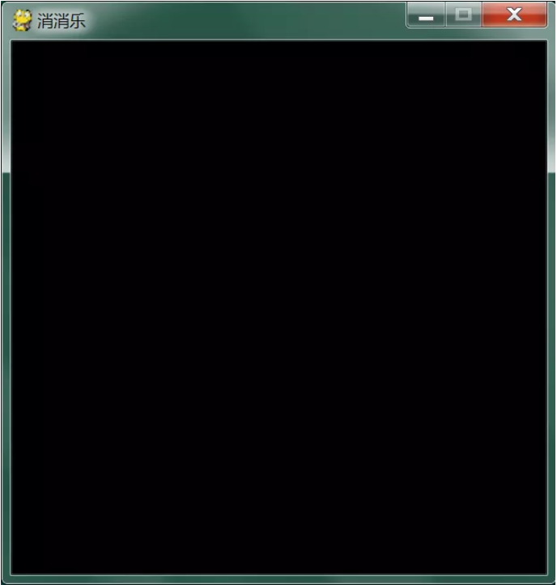
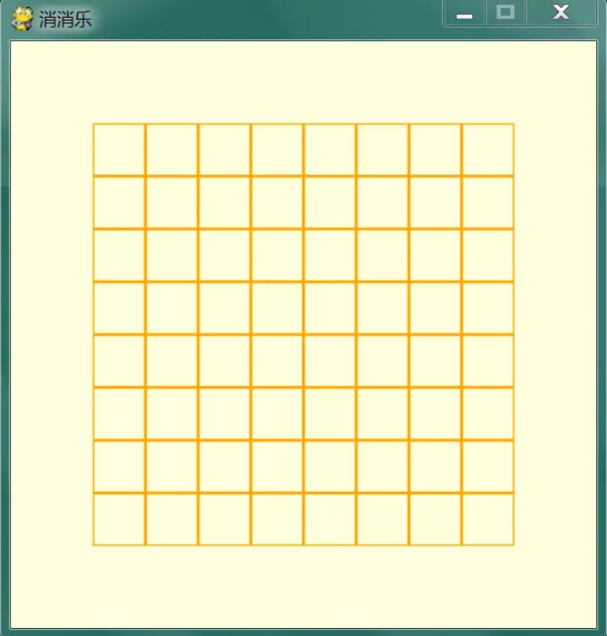
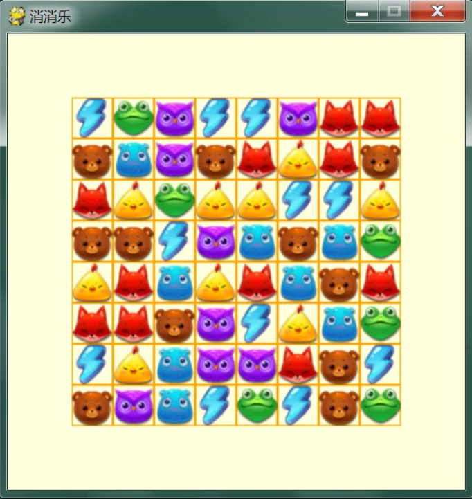
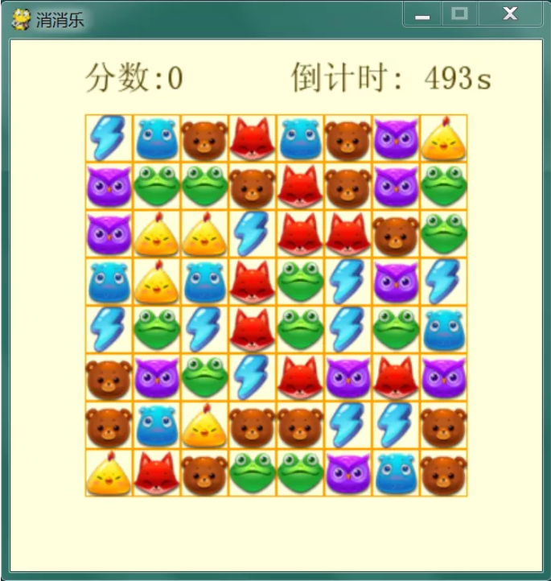
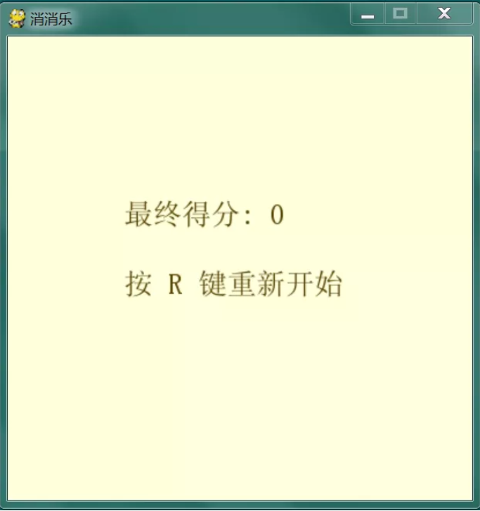
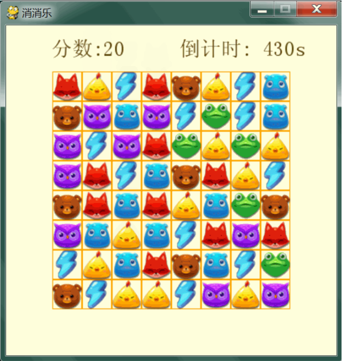

# 用 Python 写个消消乐小游戏

提到开心消消乐这款小游戏，相信大家都不陌生，其曾在 2015 年获得过玩家最喜爱的移动单机游戏奖，受欢迎程度可见一斑，本文我们使用 Python 来做个简单的消消乐小游戏。

## 实现

消消乐的构成主要包括三部分：游戏主体、计分器、计时器，下面来看一下具体实现。

先来看一下游戏所需 Python 库。

```python
import os
import sys
import time
import pygame
import random
```

定义一些常量，比如：窗口宽高、网格行列数等，代码如下：

```python
WIDTH = 400
HEIGHT = 400
NUMGRID = 8
GRIDSIZE = 36
XMARGIN = (WIDTH - GRIDSIZE * NUMGRID) // 2
YMARGIN = (HEIGHT - GRIDSIZE * NUMGRID) // 2
ROOTDIR = os.getcwd()
FPS = 30
```

接着创建一个主窗口，代码如下：

```python
pygame.init()
screen = pygame.display.set_mode((WIDTH, HEIGHT))
pygame.display.set_caption('消消乐')
```

看一下效果：



再接着在窗口中画一个 8 x 8 的网格，代码如下：

```python
screen.fill((255, 255, 220))
# 游戏界面的网格绘制
def drawGrids(self):
  for x in range(NUMGRID):
    for y in range(NUMGRID):
      rect = pygame.Rect((XMARGIN+x*GRIDSIZE, YMARGIN+y*GRIDSIZE, GRIDSIZE, GRIDSIZE))
      self.drawBlock(rect, color=(255, 165, 0), size=1
# 画矩形 block 框
def drawBlock(self, block, color=(255, 0, 0), size=2):
  pygame.draw.rect(self.screen, color, block, size)
```

看一下效果：



再接着在网格中随机放入各种拼图块，代码如下：

```python
while True:
  self.all_gems = []
  self.gems_group = pygame.sprite.Group()
  for x in range(NUMGRID):
    self.all_gems.append([])
    for y in range(NUMGRID):
      gem = Puzzle(img_path=random.choice(self.gem_imgs), size=(GRIDSIZE, GRIDSIZE), position=[XMARGIN+x*GRIDSIZE, YMARGIN+y*GRIDSIZE-NUMGRID*GRIDSIZE], downlen=NUMGRID*GRIDSIZE)
      self.all_gems[x].append(gem)
      self.gems_group.add(gem)
  if self.isMatch()[0] == 0:
    break
```

看一下效果：



再接着加入计分器和计时器，代码如下：

```python
# 显示得分
def drawScore(self):
  score_render = self.font.render('分数:'+str(self.score), 1, (85, 65, 0))
  rect = score_render.get_rect()
  rect.left, rect.top = (55, 15)
  self.screen.blit(score_render, rect)
# 显示加分
def drawAddScore(self, add_score):
  score_render = self.font.render('+'+str(add_score), 1, (255, 100, 100))
  rect = score_render.get_rect()
  rect.left, rect.top = (250, 250)
  self.screen.blit(score_render, rect)
# 显示剩余时间
def showRemainingTime(self):
  remaining_time_render = self.font.render('倒计时: %ss' % str(self.remaining_time), 1, (85, 65, 0))
  rect = remaining_time_render.get_rect()
  rect.left, rect.top = (WIDTH-190, 15)
  self.screen.blit(remaining_time_render, rect)
```

看一下效果：



当设置的游戏时间用尽时，我们可以生成一些提示信息，代码如下：

```python
while True:
  for event in pygame.event.get():
    if event.type == pygame.QUIT:
      pygame.quit()
      sys.exit()
    if event.type == pygame.KEYUP and event.key == pygame.K_r:
      flag = True
  if flag:
    break
  screen.fill((255, 255, 220))
  text0 = '最终得分: %s' % score
  text1 = '按 R 键重新开始'
  y = 140
  for idx, text in enumerate([text0, text1]):
    text_render = font.render(text, 1, (85, 65, 0))
    rect = text_render.get_rect()
    if idx == 0:
      rect.left, rect.top = (100, y)
    elif idx == 1:
      rect.left, rect.top = (100, y)
    y += 60
    screen.blit(text_render, rect)
  pygame.display.update()
```

看一下效果：



说完了游戏图形化界面相关的部分，我们再看一下游戏的主要处理逻辑。

我们通过鼠标来操纵拼图块，因此程序需要检查有无拼图块被选中，代码实现如下：

```python
def checkSelected(self, position):
  for x in range(NUMGRID):
    for y in range(NUMGRID):
      if self.getGemByPos(x, y).rect.collidepoint(*position):
        return [x, y]
  return None
```

我们需要将鼠标连续选择的拼图块进行位置交换，代码实现如下：

```python
def swapGem(self, gem1_pos, gem2_pos):
  margin = gem1_pos[0] - gem2_pos[0] + gem1_pos[1] - gem2_pos[1]
  if abs(margin) != 1:
    return False
  gem1 = self.getGemByPos(*gem1_pos)
  gem2 = self.getGemByPos(*gem2_pos)
  if gem1_pos[0] - gem2_pos[0] == 1:
    gem1.direction = 'left'
    gem2.direction = 'right'
  elif gem1_pos[0] - gem2_pos[0] == -1:
    gem2.direction = 'left'
    gem1.direction = 'right'
  elif gem1_pos[1] - gem2_pos[1] == 1:
    gem1.direction = 'up'
    gem2.direction = 'down'
  elif gem1_pos[1] - gem2_pos[1] == -1:
    gem2.direction = 'up'
    gem1.direction = 'down'
  gem1.target_x = gem2.rect.left
  gem1.target_y = gem2.rect.top
  gem1.fixed = False
  gem2.target_x = gem1.rect.left
  gem2.target_y = gem1.rect.top
  gem2.fixed = False
  self.all_gems[gem2_pos[0]][gem2_pos[1]] = gem1
  self.all_gems[gem1_pos[0]][gem1_pos[1]] = gem2
  return True
```

每一次交换拼图块时，我们需要判断是否有连续一样的三个及以上拼图块，代码实现如下：

```python
def isMatch(self):
  for x in range(NUMGRID):
    for y in range(NUMGRID):
      if x + 2 < NUMGRID:
        if self.getGemByPos(x, y).type == self.getGemByPos(x+1, y).type == self.getGemByPos(x+2, y).type:
          return [1, x, y]
      if y + 2 < NUMGRID:
        if self.getGemByPos(x, y).type == self.getGemByPos(x, y+1).type == self.getGemByPos(x, y+2).type:
          return [2, x, y]
  return [0, x, y]
```

当出现三个及以上拼图块时，需要将这些拼图块消除，代码实现如下：

```python
def removeMatched(self, res_match):
  if res_match[0] > 0:
    self.generateNewGems(res_match)
    self.score += self.reward
    return self.reward
  return 0
```

将匹配的拼图块消除之后，我们还需要随机生成新的拼图块，代码实现如下：

```python
def generateNewGems(self, res_match):
  if res_match[0] == 1:
    start = res_match[2]
    while start > -2:
      for each in [res_match[1], res_match[1]+1, res_match[1]+2]:
        gem = self.getGemByPos(*[each, start])
        if start == res_match[2]:
          self.gems_group.remove(gem)
          self.all_gems[each][start] = None
        elif start >= 0:
          gem.target_y += GRIDSIZE
          gem.fixed = False
          gem.direction = 'down'
          self.all_gems[each][start+1] = gem
        else:
          gem = Puzzle(img_path=random.choice(self.gem_imgs), size=(GRIDSIZE, GRIDSIZE), position=[XMARGIN+each*GRIDSIZE, YMARGIN-GRIDSIZE], downlen=GRIDSIZE)
          self.gems_group.add(gem)
          self.all_gems[each][start+1] = gem
      start -= 1
  elif res_match[0] == 2:
    start = res_match[2]
    while start > -4:
      if start == res_match[2]:
        for each in range(0, 3):
          gem = self.getGemByPos(*[res_match[1], start+each])
          self.gems_group.remove(gem)
          self.all_gems[res_match[1]][start+each] = None
      elif start >= 0:
        gem = self.getGemByPos(*[res_match[1], start])
        gem.target_y += GRIDSIZE * 3
        gem.fixed = False
        gem.direction = 'down'
        self.all_gems[res_match[1]][start+3] = gem
      else:
        gem = Puzzle(img_path=random.choice(self.gem_imgs), size=(GRIDSIZE, GRIDSIZE), position=[XMARGIN+res_match[1]*GRIDSIZE, YMARGIN+start*GRIDSIZE], downlen=GRIDSIZE*3)
        self.gems_group.add(gem)
        self.all_gems[res_match[1]][start+3] = gem
      start -= 1
```

之后反复执行这个过程，直至耗尽游戏时间，游戏结束。

最后，我们动态看一下游戏效果。



## 总结 

本文我们使用 Python 实现了一个简单的消消乐游戏，有兴趣的可以对游戏做进一步扩展，比如增加关卡等。

游戏源码：

https://github.com/JustDoPython/python-examples/tree/master/yeke/py-xxl