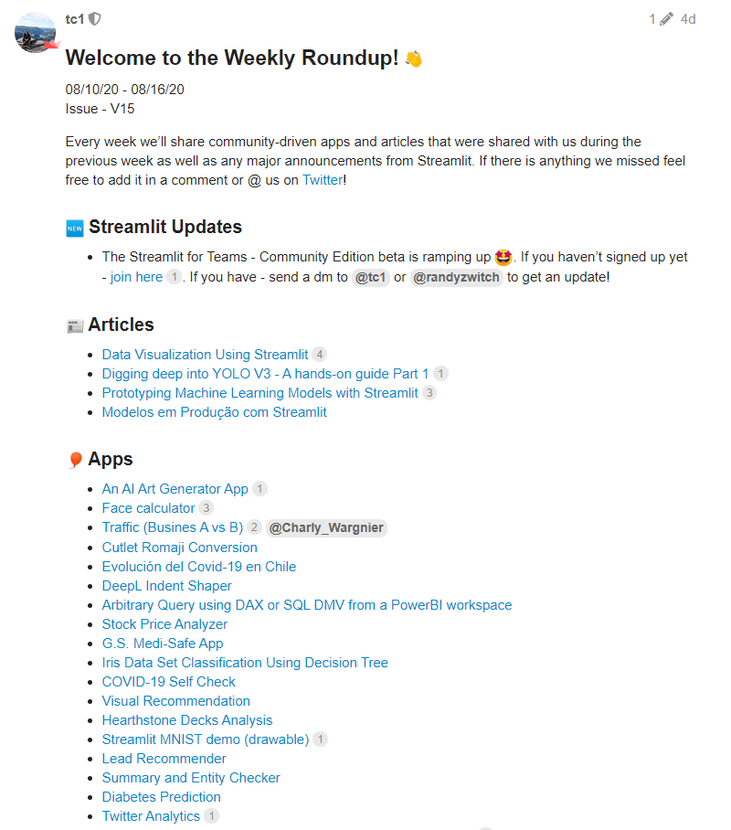
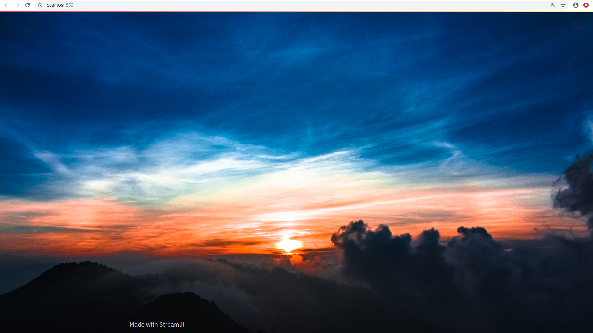
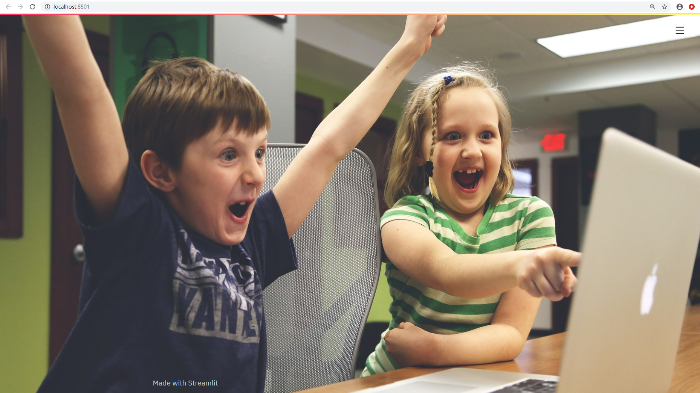

## 在Streamlit中设置背景图片和动图

去年发现了 Streamlit 这个宝藏项目之后，时不时会去跟进项目的发展进度。

截止今天，项目已经更新到了 Version_0.65，相比我最早使用的 Version_0.39 已经有了很多新的特性。

而且 Github 的 star 数已经过一万了，Contributors也有61人。

最令人吃惊的是，除了衍生了基于 Streamlit 的一些小工具之外，项目组还会在主页上发布周报！



点进去看了下，周报的内容大部分来自于twitter里的 `#streamlit` 标签。 看着周报里的各种emoji，不禁让人感慨项目组真的是满满的热情与热爱。

再看下项目的 issue 情况，基本上使用者提的问题很快就可以得到解答。

这里我整理了一下其中几个比较有趣的 issue，也可以展示下 Streamlit 能够实现的新功能。


### 在Streamlit中使用背景图片

讨论地址：

https://discuss.streamlit.io/t/how-do-i-use-a-background-image-on-streamlit/5067

一般的网站都有一个背景图片，由于Streamlit最初是将图片作为一种数据类型进行使用的，所有没有提供背景图片功能。

由于 Streamlit 的 `markdown` 模块支持 HTML，因此可以使用这种方式显示背景图片：

```python
import streamlit as st

page_bg_img = '''
<style>
body {
background-image: url("https://images.unsplash.com/photo-1542281286-9e0a16bb7366");
background-size: cover;
}
</style>
'''

st.markdown(page_bg_img, unsafe_allow_html=True)
```

运行之后显示：



通过修改以上代码第六行 url 中的链接就可以修改背景中的图片。

但是这种方式只能显示网络上的图片，如果想要使用本地图片就会报错。因为 CSS 代码无法调用本地的文件，这一点是浏览器基于安全的考虑。

想要调用本地的图片文件就要先使用 Streamlit 将文件打开，并将图片转化为 base64 格式的文件流，这样才能传输给浏览器。

Streamlit 使用本地图片文件设置页面背景的代码为：

```python
import streamlit as st
import base64

@st.cache(allow_output_mutation=True)
def get_base64_of_bin_file(bin_file):
    with open(bin_file, 'rb') as f:
        data = f.read()
    return base64.b64encode(data).decode()

def set_png_as_page_bg(png_file):
    bin_str = get_base64_of_bin_file(png_file)
    page_bg_img = '''
    <style>
    body {
    background-image: url("data:image/png;base64,%s");
    background-size: cover;
    }
    </style>
    ''' % bin_str
    
    st.markdown(page_bg_img, unsafe_allow_html=True)
    return

set_png_as_page_bg('background.png')
```

效果如下：




### 在 Streamlit 中使用 Gif 动图

讨论地址：

https://discuss.streamlit.io/t/showing-a-gif-while-st-spinner-runs/5084

在做数据处理或者模型训练的时候，经常会碰到等待的情况，这个时候如果有个动画会让枯燥的等待稍微有趣一点。

新版本的 Streamlit 已经支持 Gif 动画效果，这里模拟在后台运行时在页面播放以下的小火箭动图。


代码如下：

```python
import streamlit as st
import time


start_execution = st.button('Run model')
gif_path = 'rocket.gif'
if start_execution:
    gif_runner = st.image(gif_path)
    # result = run_model(args)
    time.sleep(5)
    gif_runner.empty()
    # display_output(result)
```

代码模拟在点击 `Run model` 后会出现小火箭的动图，然后休眠5秒钟（模拟数据处理过程）后动图消失。效果如下：


根据这种方法，可以自由设置背景图片和数据操作时的动画效果了。

整理一下完整代码为：

```python
import streamlit as st
import base64
import time


# page_bg_img = '''
# <style>
# body {
# background-image: url("https://images.unsplash.com/photo-1542281286-9e0a16bb7366");
# background-size: cover;
# }
# </style>
# '''
# 
# st.markdown(page_bg_img, unsafe_allow_html=True)


@st.cache(allow_output_mutation=True)
def get_base64_of_bin_file(bin_file):
    with open(bin_file, 'rb') as f:
        data = f.read()
    return base64.b64encode(data).decode()

def set_png_as_page_bg(png_file):
    bin_str = get_base64_of_bin_file(png_file)
    page_bg_img = '''
    <style>
    body {
    background-image: url("data:image/png;base64,%s");
    background-size: cover;
    }
    </style>
    ''' % bin_str
    
    st.markdown(page_bg_img, unsafe_allow_html=True)
    return

set_png_as_page_bg('background.png')


start_execution = st.button('Run model')
gif_path = 'rocket.gif'
if start_execution:
    gif_runner = st.image(gif_path)
    # result = run_model(args)
    time.sleep(3)
    gif_runner.empty()
    # display_output(result)
```


