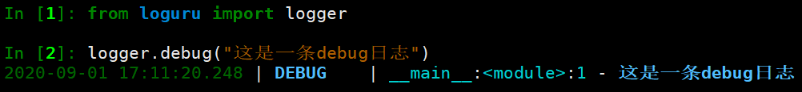
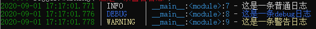

## 在Fastapi中使用Loguru记录日志

在运行程序时，我们需要使用日志来记录程序运行中的各种状况。但是Python自带的日志模块`logging`在使用时需要进行比较繁琐的配置过程。在比较了一些第三方日志模块后，发现Loguru是一个易学易用且性能优秀的解决方案。

本文就在一个Fastapi提供的机器学习模型的基础上，介绍使用Loguru记录Web服务日志的使用方法。


### Loguru简介


项目Github地址：https://github.com/Delgan/loguru

项目文档：https://loguru.readthedocs.io/en/stable/index.html

#### Loguru 安装

```python
pip install loguru
```

#### Loguru 使用

##### 基本日志输出

```python
from loguru import logger

logger.debug("这是一条debug日志")
```

结果显示彩色：



##### 配置日志格式

也可以根据自己的需求配置日志格式：

```python
import sys
from loguru import logger

#配置日志格式
logger.add(sys.stderr, format="{time} {level} {message}", filter="my_module", level="INFO")

logger.info("这是一条普通日志")
logger.debug("这是一条debug日志")
logger.warning("这是一条警告日志")
```

不同的颜色显示为：



##### 将日志输出到文件

如果要将记录的消息保存到文件，则只需使用字符串路径作为接收器。配置如下：

```python
from loguru import logger

logger.add("file_{time}.log")

logger.debug("这是一条debug日志")
logger.info("这是一条info日志")
```

这时目录下就会生成一个文件`file_2020-09-01_19-30-53_155126.log`，文件内容为：

```
2020-09-01 19:30:53.157 | DEBUG    | __main__:<module>:5 - 这是一条debug日志
2020-09-01 19:30:53.164 | INFO     | __main__:<module>:6 - 这是一条info日志
```

可以通过以下参数的配置来：

- 设置日志文件大小；
- 删除较旧的日志文件；
- 在关闭时压缩文件，并设置压缩格式。

```python
#rotation参数
logger.add("file_1.log", rotation="500 MB")    # 设置日志文件大小
logger.add("file_2.log", rotation="12:00")     # 中午12点创建日志文件
logger.add("file_3.log", rotation="1 week")    # 一周创建一个日志文件

#retention参数
logger.add("file_X.log", retention="10 days")  # 日志文件最长保留 10 天

#compression参数
logger.add("file_Y.log", compression="zip")    # 日志文件压缩格式为ZIP
```

##### 格式化日志规则

Loguru使用`str.format()`对输出的日志记录进行规范格式化。

```python
logger.info("如果你使用的Python版本是 {}, 那么肯定会更喜欢 {feature}!", 3.6, feature="f-strings")
```

这时便会输出：

```
2020-09-01T19:54:05.039647+0800 INFO 如果你使用的Python版本是 3.6, 那么肯定会更喜欢 f-strings!
```

##### 捕获Traceback错误

使用`catch()`装饰器/上下文管理器可以确保将任何错误信息正确保存到`logger`中，例如：

- 程序意外崩溃产生的日志；
- 线程中发生的异常。

```python
import sys
from loguru import logger

@logger.catch
def my_function(x, y, z):
    # An error? It's caught anyway!
    return 1 / (x + y + z)

my_function(1,-1,0)
```

报错信息如下：

```python
> File "<ipython-input-10-80ee511ba9ce>", line 9, in <module>
    my_function(1,-1,0)
    └ <function my_function at 0x000002787245D558>
  File "<ipython-input-10-80ee511ba9ce>", line 7, in my_function
    return 1 / (x + y + z)
                │   │   └ 0
                │   └ -1
                └ 1

ZeroDivisionError: division by zero
```

##### 色彩斑斓的日志

如果您的终端兼容，Loguru会自动为日志添加颜色。您可以通过使用接收器格式来自定义自己喜欢的样式。配置方式如下：

```python
logger.add(sys.stderr, colorize=True, format="<green>{time}</green> <level>{message}</level>",level="DEBUG")
```

结果，DEBUG及以上的信息或被自定义显示样式。

##### 异步写入日志

`logger`默认情况下，添加到的所有接收器都是线程安全的。它们不是多进程安全的，但是您可以`enqueue`通过消息来确保日志的完整性。如果要异步记录，也可以使用相同的参数。

```python
logger.add("somefile.log", enqueue=True)
```

##### 序列化日志

希望对日志进行序列化以便于解析或传递日志？使用该`serialize`参数，每条日志消息在发送到已配置的接收器之前将转换为JSON字符串。

```python
logger.add(custom_sink_function, serialize=True)
```

##### 配置日期格式

```python
logger.add(sys.stderr, format="{time:YYYY-MM-DD at HH:mm:ss} | {level} | {message}",level="DEBUG")

logger.info("If you're using Python {}, prefer {feature} of course!", 3.6, feature="f-strings")
logger.debug("That's debug")
logger.warning("That's warning")
```

##### 配置编码格式

```python
logger.add(log_file_path, rotation="500 MB", encoding='utf8')
```

还有更多的配置方法，详细请参考官方文档。


### FastAPI中使用Loguru

Loguru社区中相关的讨论：https://github.com/Delgan/loguru/issues/307


FastAPI社区中相关的讨论：https://github.com/tiangolo/fastapi/issues/1276#issuecomment-673893420


Slyfox的代码片段：https://gist.github.com/Slyfoxy/a3e31cfcc1b19cba8e1b626276148c49


### 实际案例


