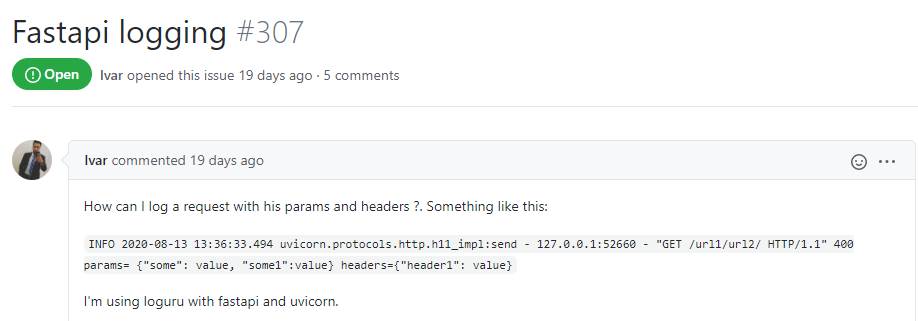
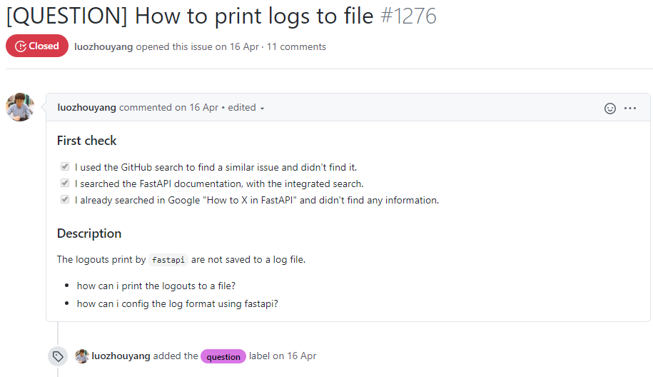
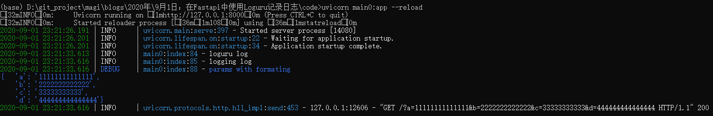

## 使用loguru记录FastAPI接口调用日志

在运行程序时，我们需要使用日志来记录程序运行中的各种状况。但是Python自带的日志模块`logging`在使用时需要进行比较繁琐的配置过程。在比较了一些第三方日志模块后，发现Loguru是一个易学易用且性能优秀的解决方案。

日志对于一个接口服务的作用：

-  监控服务的状态，一般程序中会增加一些跟踪或者提示性的日志，用来判断服务执行的详细情况，特别是执行一些复合功能的接口或者叫聚合接口非常有利于我们判断接口的执行情况。
-  安全，用来分析调用者的身份信息，防止接口被非法恶意调用等。
-  性能，可以统计每个接口的访问执行时间来分析系统的瓶颈。
-  异常分析，对于线上的异常，在没有debug的环境下，要想分析问题原因最有价值的就要算异常的堆栈信息。

本文就在一个Fastapi提供的机器学习模型的基础上，介绍使用Loguru记录Web服务日志的使用方法。


### Loguru简介


项目Github地址：https://github.com/Delgan/loguru

项目文档：https://loguru.readthedocs.io/en/stable/index.html

#### Loguru 安装

```python
pip install loguru
```

#### Loguru 使用

##### 基本日志输出

```python
from loguru import logger

logger.debug("这是一条debug日志")
```

结果显示彩色：


##### 配置日志格式

也可以根据自己的需求配置日志格式：

```python
import sys
from loguru import logger

#配置日志格式
logger.add(sys.stderr, format="{time} {level} {message}", filter="my_module", level="INFO")

logger.info("这是一条普通日志")
logger.debug("这是一条debug日志")
logger.warning("这是一条警告日志")
```

不同的颜色显示为：


##### 将日志输出到文件

如果要将记录的消息保存到文件，则只需使用字符串路径作为接收器。配置如下：

```python
from loguru import logger

logger.add("file_{time}.log")

logger.debug("这是一条debug日志")
logger.info("这是一条info日志")
```

这时目录下就会生成一个文件`file_2020-09-01_19-30-53_155126.log`，文件内容为：

```
2020-09-01 19:30:53.157 | DEBUG    | __main__:<module>:5 - 这是一条debug日志
2020-09-01 19:30:53.164 | INFO     | __main__:<module>:6 - 这是一条info日志
```

可以通过以下参数的配置来：

- 设置日志文件大小；
- 删除较旧的日志文件；
- 在关闭时压缩文件，并设置压缩格式。

```python
#rotation参数
logger.add("file_1.log", rotation="500 MB")    # 设置日志文件大小
logger.add("file_2.log", rotation="12:00")     # 中午12点创建日志文件
logger.add("file_3.log", rotation="1 week")    # 一周创建一个日志文件

#retention参数
logger.add("file_X.log", retention="10 days")  # 日志文件最长保留 10 天

#compression参数
logger.add("file_Y.log", compression="zip")    # 日志文件压缩格式为ZIP
```

##### 格式化日志规则

Loguru使用`str.format()`对输出的日志记录进行规范格式化。

```python
logger.info("如果你使用的Python版本是 {}, 那么肯定会更喜欢 {feature}!", 3.6, feature="f-strings")
```

这时便会输出：

```
2020-09-01T19:54:05.039647+0800 INFO 如果你使用的Python版本是 3.6, 那么肯定会更喜欢 f-strings!
```

##### 捕获Traceback错误

使用`catch()`装饰器/上下文管理器可以确保将任何错误信息正确保存到`logger`中，例如：

- 程序意外崩溃产生的日志；
- 线程中发生的异常。

```python
import sys
from loguru import logger

@logger.catch
def my_function(x, y, z):
    # An error? It's caught anyway!
    return 1 / (x + y + z)

my_function(1,-1,0)
```

报错信息如下：

```python
> File "<ipython-input-10-80ee511ba9ce>", line 9, in <module>
    my_function(1,-1,0)
    └ <function my_function at 0x000002787245D558>
  File "<ipython-input-10-80ee511ba9ce>", line 7, in my_function
    return 1 / (x + y + z)
                │   │   └ 0
                │   └ -1
                └ 1

ZeroDivisionError: division by zero
```

##### 色彩斑斓的日志

如果您的终端兼容，Loguru会自动为日志添加颜色。您可以通过使用接收器格式来自定义自己喜欢的样式。配置方式如下：

```python
logger.add(sys.stderr, colorize=True, format="<green>{time}</green> <level>{message}</level>",level="DEBUG")
```

结果，DEBUG及以上的信息或被自定义显示样式。

##### 异步写入日志

`logger`默认情况下，添加到的所有接收器都是线程安全的。它们不是多进程安全的，但是您可以`enqueue`通过消息来确保日志的完整性。如果要异步记录，也可以使用相同的参数。

```python
logger.add("somefile.log", enqueue=True)
```

##### 序列化日志

希望对日志进行序列化以便于解析或传递日志？使用该`serialize`参数，每条日志消息在发送到已配置的接收器之前将转换为JSON字符串。

```python
logger.add(custom_sink_function, serialize=True)
```

##### 配置日期格式

```python
logger.add(sys.stderr, format="{time:YYYY-MM-DD at HH:mm:ss} | {level} | {message}",level="DEBUG")

logger.info("If you're using Python {}, prefer {feature} of course!", 3.6, feature="f-strings")
logger.debug("That's debug")
logger.warning("That's warning")
```

##### 配置编码格式

```python
logger.add(log_file_path, rotation="500 MB", encoding='utf8')
```

还有更多的配置方法，详细请参考官方文档。


### 社区讨论

Loguru社区中相关的讨论：https://github.com/Delgan/loguru/issues/307

在8月14号loguru的社区有人发了 Fastapi logging #307 的 issue 来讨论在FastAPI中使用loguru。



这项讨论关联到了FastAPI社区中的一个类似讨论 [QUESTION] How to print logs to file #1276 。

FastAPI社区中相关的讨论：https://github.com/tiangolo/fastapi/issues/1276#issuecomment-673893420



其中有个很优秀的解决方案来自于一位ID叫做Slyfoxy的大神，他提供了一份示例代码：

```python
import logging
import sys
from pprint import pformat

from fastapi import FastAPI
from loguru import logger
from loguru._defaults import LOGURU_FORMAT
from starlette.requests import Request


class InterceptHandler(logging.Handler):
    """
    Default handler from examples in loguru documentaion.
    See https://loguru.readthedocs.io/en/stable/overview.html#entirely-compatible-with-standard-logging
    """

    def emit(self, record):
        # Get corresponding Loguru level if it exists
        try:
            level = logger.level(record.levelname).name
        except ValueError:
            level = record.levelno

        # Find caller from where originated the logged message
        frame, depth = logging.currentframe(), 2
        while frame.f_code.co_filename == logging.__file__:
            frame = frame.f_back
            depth += 1

        logger.opt(depth=depth, exception=record.exc_info).log(
            level, record.getMessage()
        )


def format_record(record: dict) -> str:
    """
    Custom format for loguru loggers.
    Uses pformat for log any data like request/response body during debug.
    Works with logging if loguru handler it.

    Example:
    >>> payload = [{"users":[{"name": "Nick", "age": 87, "is_active": True}, {"name": "Alex", "age": 27, "is_active": True}], "count": 2}]
    >>> logger.bind(payload=).debug("users payload")
    >>> [   {   'count': 2,
    >>>         'users': [   {'age': 87, 'is_active': True, 'name': 'Nick'},
    >>>                      {'age': 27, 'is_active': True, 'name': 'Alex'}]}]
    """
    format_string = LOGURU_FORMAT

    if record["extra"].get("payload") is not None:
        record["extra"]["payload"] = pformat(
            record["extra"]["payload"], indent=4, compact=True, width=88
        )
        format_string += "\n<level>{extra[payload]}</level>"

    format_string += "{exception}\n"
    return format_string


app = FastAPI(title="Logger Handler", debug=True)

# set loguru format for root logger
logging.getLogger().handlers = [InterceptHandler()]

# set format
logger.configure(
    handlers=[{"sink": sys.stdout, "level": logging.DEBUG, "format": format_record}]
)

# Also set loguru handler for uvicorn loger.
# Default format:
# INFO:     127.0.0.1:35238 - "GET / HTTP/1.1" 200 OK
#
# New format:
# 2020-04-18 16:33:49.728 | INFO     | uvicorn.protocols.http.httptools_impl:send:447 - 127.0.0.1:35942 - "GET / HTTP/1.1" 200

# uvicorn loggers: .error .access .asgi
# https://github.com/encode/uvicorn/blob/master/uvicorn/config.py#L243
logging.getLogger("uvicorn.access").handlers = [InterceptHandler()]


@app.get("/")
def index(request: Request) -> None:
    logger.info("loguru log")
    logging.info("logging log")

    logging.getLogger("fastapi").debug("fatapi info log")
    logger.bind(payload=dict(request.query_params)).debug("params with formating")
    return None
```

然后启动服务： `uvicorn main:app --reload`.

发送请求: `curl "localhost:8000/?a=11111111111111&b=2222222222222&c=33333333333&d=444444444444444"`

Check server logs:



```
(base) D:\git_project\magi\blogs\2020年\9月1日：在Fastapi中使用Loguru记录日志\code>uvicorn main0:app --reload
INFO:     Uvicorn running on http://127.0.0.1:8000 (Press CTRL+C to quit)
INFO:     Started reloader process [108] using statreload
2020-09-01 23:21:26.191 | INFO     | uvicorn.main:serve:397 - Started server process [14080]
2020-09-01 23:21:26.201 | INFO     | uvicorn.lifespan.on:startup:22 - Waiting for application startup.
2020-09-01 23:21:26.201 | INFO     | uvicorn.lifespan.on:startup:34 - Application startup complete.
2020-09-01 23:21:33.613 | INFO     | main0:index:84 - loguru log
2020-09-01 23:21:33.616 | INFO     | main0:index:85 - logging log
2020-09-01 23:21:33.616 | DEBUG    | main0:index:88 - params with formating
{   'a': '11111111111111',
    'b': '2222222222222',
    'c': '33333333333',
    'd': '444444444444444'}
2020-09-01 23:21:33.616 | INFO     | uvicorn.protocols.http.h11_impl:send:453 - 127.0.0.1:12606 - "GET /?a=11111111111111&b=2222222222222&c=33333333333&d=444444444444444 HTTP/1.1" 200
```

Slyfox的代码片段：https://gist.github.com/Slyfoxy/a3e31cfcc1b19cba8e1b626276148c49

最新的代码将日志代码和使用进行了分离：

`logger.py`

```python
"""Configure handlers and formats for application loggers."""
import logging
import sys
from pprint import pformat

# if you dont like imports of private modules
# you can move it to typing.py module
from loguru import logger
from loguru._defaults import LOGURU_FORMAT


class InterceptHandler(logging.Handler):
    """
    Default handler from examples in loguru documentaion.
    See https://loguru.readthedocs.io/en/stable/overview.html#entirely-compatible-with-standard-logging
    """

    def emit(self, record: logging.LogRecord):
        # Get corresponding Loguru level if it exists
        try:
            level = logger.level(record.levelname).name
        except ValueError:
            level = record.levelno

        # Find caller from where originated the logged message
        frame, depth = logging.currentframe(), 2
        while frame.f_code.co_filename == logging.__file__:
            frame = frame.f_back
            depth += 1

        logger.opt(depth=depth, exception=record.exc_info).log(
            level, record.getMessage()
        )


def format_record(record: dict) -> str:
    """
    Custom format for loguru loggers.
    Uses pformat for log any data like request/response body during debug.
    Works with logging if loguru handler it.
    Example:
    >>> payload = [{"users":[{"name": "Nick", "age": 87, "is_active": True}, {"name": "Alex", "age": 27, "is_active": True}], "count": 2}]
    >>> logger.bind(payload=).debug("users payload")
    >>> [   {   'count': 2,
    >>>         'users': [   {'age': 87, 'is_active': True, 'name': 'Nick'},
    >>>                      {'age': 27, 'is_active': True, 'name': 'Alex'}]}]
    """

    format_string = LOGURU_FORMAT
    if record["extra"].get("payload") is not None:
        record["extra"]["payload"] = pformat(
            record["extra"]["payload"], indent=4, compact=True, width=88
        )
        format_string += "\n<level>{extra[payload]}</level>"

    format_string += "{exception}\n"
    return format_string


def init_logging():
    """
    Replaces logging handlers with a handler for using the custom handler.
        
    WARNING!
    if you call the init_logging in startup event function, 
    then the first logs before the application start will be in the old format
    >>> app.add_event_handler("startup", init_logging)
    stdout:
    INFO:     Uvicorn running on http://127.0.0.1:8000 (Press CTRL+C to quit)
    INFO:     Started reloader process [11528] using statreload
    INFO:     Started server process [6036]
    INFO:     Waiting for application startup.
    2020-07-25 02:19:21.357 | INFO     | uvicorn.lifespan.on:startup:34 - Application startup complete.
    
    """

    # disable handlers for specific uvicorn loggers
    # to redirect their output to the default uvicorn logger
    # works with uvicorn==0.11.6
    loggers = (
        logging.getLogger(name)
        for name in logging.root.manager.loggerDict
        if name.startswith("uvicorn.")
    )
    for uvicorn_logger in loggers:
        uvicorn_logger.handlers = []

    # change handler for default uvicorn logger
    intercept_handler = InterceptHandler()
    logging.getLogger("uvicorn").handlers = [intercept_handler]

    # set logs output, level and format
    logger.configure(
        handlers=[{"sink": sys.stdout, "level": logging.DEBUG, "format": format_record}]
    )
```

`main.py`

```python
"""Gist for original issue https://github.com/tiangolo/fastapi/issues/1276#issuecomment-663748916"""
from fastapi import FastAPI
from starlette.requests import Request
from logger import init_logging

app = FastAPI(title="Test Uvicorn Handlers")

init_logging()

# view.py
@app.get("/")
def index(request: Request) -> None:
    logger.info("loguru info log")
    logging.info("logging info log")

    logging.getLogger("fastapi").debug("fatapi info log")
    logger.bind(payload=dict(request.query_params)).debug("params with formating")
    return None
```

以上代码都还是使用到了Python自带的`logging`模块，目的是在uvicon中打印相应的日志信息。但是我的需求是只需要记录接口调用的情况以及运行过程中可能产生的错误，所以下面我会尝试只使用loguru模块来将FastAPI接口的调用日志保存到文件中。


### FastAPI中使用Loguru

这里以一个简单的机器学习接口为例，应用以上方式记录接口的日志。

我们希望采集到的日志里包含如下有用的信息：

1. 调用方IP以及端口信息。

2. 服务端的IP以及端口信息。

3. 调用时间。

4. 调用的接口方法。
5. 调用的接口方法参数。
6. 异常分析，会自动将产生的未捕获异常信息记录到日志中，不需要手工的去处理异常的记录。


