# Markdown最新作图指南：flowchart.js & mermaid.js

> 从去年开始，我就逐步将手上的文档转化成后缀为**.md**的格式保存。最初的原因是我希望图片不会在文档中被压缩，以及代码块有语法高亮和正确的缩进。随着对markdown语法的熟悉，现在我基本上可以完全弃用微软的传统办公三件套。Markdown的方便易用以及多平台的兼容性。让它已经成为了我日常的一个高效生产力工具。这里我想分享一下Markdown中最新的绘图功能，目的是为了能部分取代Office中的Visio工具。


Markdown 是由约翰·格鲁伯（John Gruber）于2004年创建一种轻量级标记语言。它允许人们使用易读易写的纯文本格式编写文档，并且可以导出为 HTML 、Word、图像、PDF、Epub 等多种格式的文档。

Markdown 有多款优秀的编辑器，这里我使用的是一款**支持实时预览的免费编辑器**：Typora。

在Typora中有“实时预览模式”和“源代码模式”，可以直接通过快捷键组合 `Ctrl+/` 进行切换。

在“源代码模式”中是直接写Markdown源码的，相比之下我更习惯于在“实时预览模式”中直接通过各类快捷键组合进行编辑，这也是Typora这款软件的强大之处。

在“源代码模式”中插入代码块的方式是直接输入：

```
​```

​```
```

中间直接写入代码即可。

如果想要指定编程语言的高亮规则，只用在第一个```后面跟上相应语言的小写名称即可。例如：

```java
​```java
public class Hello {
    public static void main(String[] args) {
        System.out.println("Hello, world!");
    }
}
​```
```

在Typora的“实时预览模式”中插入代码就更加简单了。可以直接在菜单栏的段落中点击“代码块”后在生成的代码块右下角填入要选择的语言：


或者使用快捷键组合 `Ctrl+Shift+K` 快速插入。

Markdown本身没有作图功能，但是由于其优秀的设计理念和简洁的语法风格，吸引了很多开发者设计了兼容的领域特定语言（DSL）。

>领域特定语言（Domain Specific Language, DSL）是一种为解决特定领域问题而对某个特定领域操作和概念进行抽象的语言。

其中就包括本文主要讲到的两个JavaScript项目：

- **flowchart.js**


- **mermaid.js**


下面分别介绍如何在Markdown编辑器中使用这两个开源项目绘制常用图形。


## <font color=red>上篇：flowchart.js</font>

### Ⅰ. flowchart.js 简介

flowchart.js是一个用来制作流程图的领域特定语言（DSL），可以在浏览器或终端中生成可缩放矢量图形（SVG）。目前版本号为 `v1.13.0` 。

项目官网：http://flowchart.js.org/

Github地址为：https://github.com/adrai/flowchart.js

在Typora中如果想要使用flowchart.js，只需要将代码块的语言设置为`flow`就可以让代码块秒变流程图。


flowchart.js最大的特点是在流程图中的节点与连接是分开定义的。这样做的好处是节点可以被快速复用，连接也可以很方便地被修改。

如官方示例代码：

```flow
st=>start: Start:>http://www.google.com[blank]
e=>end:>http://www.google.com
op1=>operation: My Operation
sub1=>subroutine: My Subroutine
cond=>condition: Yes
or No?:>http://www.google.com
io=>inputoutput: catch something...
para=>parallel: parallel tasks

st->op1->cond
cond(yes)->io->e
cond(no)->para
para(path1, bottom)->sub1(right)->op1
para(path2, top)->op1
```

代码前半部分（1-8行）是节点类型及属性的定义，后半部分（10-14行）是定义节点之间的连接方式。

语法非常简洁易懂，最后得到的图形为：


### Ⅱ. flowchart.js语法

流程图的主要组成就是节点和节点之间的关系。

#### 1. 节点语法

**节点的语法**可以概括为：

`nodeName=>nodeType: nodeText[|flowstate][:>urlLink]`

其中`[]`中的内容为可选项，其他各项的含义如下：

- *nodeName* 节点名称：定义流程图文件当中节点变量的名称。
- *nodeType* 节点类型：定义节点所属的类型。
- *nodeText* 节点文本：节点中插入的文本，会在流程图中显示。
- *flowstate* 流程状态：可选项，使用 `|` 算子来为节点定义额外的样式。
- *urlLink* URL链接：可选项，使用 `:>` 算子来关联指向的链接。

一共有七种节点类型。

#### 2. 节点类型

##### ① start 开始

Used as the first node where flows start from. Default text is `Start`.

[](https://github.com/adrai/flowchart.js/blob/master/imgs/start.png)

```
st=>start: start
```

##### ② end 结束	

Used as the last node where a flow ends. Default text is `End`.

[](https://github.com/adrai/flowchart.js/blob/master/imgs/end.png)

```
e=>end: end
```

##### ③ operation 操作

Indicates that an operation needs to happen in the flow.

[](https://github.com/adrai/flowchart.js/blob/master/imgs/operation.png)

```
op1=>operation: operation
```

##### ④ inputoutput输入输出

Indicates that IO happens in a flow.

[](https://github.com/adrai/flowchart.js/blob/master/imgs/inputoutput.png)

```
io=>inputoutput: inputoutput
```

##### ⑤ subroutine 子流程

Indicates that a subroutine happens in the flow and that there should be another flowchart that documents this subroutine.

[](https://github.com/adrai/flowchart.js/blob/master/imgs/subroutine.png)

```
sub1=>subroutine: subroutine
```

##### ⑥ condition 条件选择

Allows for a conditional or logical statement to direct the flow into one of two paths.

[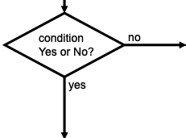](https://github.com/adrai/flowchart.js/blob/master/imgs/condition.png)

```
cond=>condition: condition
Yes or No?
```

##### ⑦ parallel 平行流

Allows for multiple flows to happen simultaneously.

[](https://github.com/adrai/flowchart.js/blob/master/imgs/parallel.png)

```
para=>parallel: parallel
```

#### 3. 节点连接

Connections are defined in their own section below the node definitions. The `->` operator specifies a connection from one node to another like `nodeVar1->nodeVar2->nodeVar3`.。

Not all nodes need to be specified in one string and can be separaged like so

```
nodeVar1->nodeVar2
nodeVar2->nodeVar3
```

Connection syntax is as follows:

```
<node variable name>[(<specificaion1>[, <specification2])]-><node variable name>[[(<specificaion1>[, <specification2])]-><node variable name>]
```

Items in `[]` are optional.

以简单的登录场景为例，流程图代码和效果如下：

```flow
start=>start: 开始
loginInfo=>inputoutput: 登录数据
verifyLogin=>subroutine: 登录验证
isSuccess=>condition: 验证成功？
respondSuccess=>operation: 响应成功
responseFailure=>operation: 响应失败
end=>end: 结束

start->loginInfo->verifyLogin->isSuccess
isSuccess(yes)->respondSuccess->end
isSuccess(no)->responseFailure->end
```

注意：冒号和名称之间需要有一个空格。

##### 连接方向

The following directions are availiable and define the direction the connection will leave the node from. If there are more than one specifiers, it is always the last. All nodes have a default direction making this an optional specification. ``will be used to indicate that one of the below should be used in its place.

- left
- right
- top
- bottom

方向调整：绘制流程图有时会出现比较一言难尽的情况，例如：

```flow
start=>start: start
operation1=>operation: operation1
isSuccess=>condition: success?
operation2=>operation: operation2
operation3=>operation: operation3
operation4=>operation: operation4
end=>end: 结束

start->operation1->isSuccess
isSuccess(yes)->operation2->end
isSuccess(no)->operation3->operation4->operation1
```

这种情况下可以使用left、right和bottom关键字来调整线条的位置使流程图更加清晰，例如此处给operation4元素添加right关键字，就可以分离重叠的线条。

```flow
start=>start: start
operation1=>operation: operation1
isSuccess=>condition: success?
operation2=>operation: operation2
operation3=>operation: operation3
operation4=>operation: operation4
end=>end: 结束

start->operation1->isSuccess
isSuccess(yes)->operation2->end
isSuccess(no)->operation3->operation4(right)->operation1
```

如果给condition元素添加这些关键字的话会调整整个分支的方向：

```flow
start=>start: start
operation1=>operation: operation1
isSuccess=>condition: success?
operation2=>operation: operation2
operation3=>operation: operation3
operation4=>operation: operation4
end=>end: 结束

start->operation1->isSuccess
isSuccess(yes)->operation2->end
isSuccess(no,left)->operation3->operation4(left)->operation1
```


#### ~~4. 节点状态标注~~

Each node variables has optional specifiers, like direction, and some have special specifiers depending on the node type that are defined below. Specifiers are added after the variable name in `()` and separated with `,` like `nodeVar(spec1, spec2)`.

##### start

Optional direction

```
startVar()->nextNode
```

##### end

No specifications because connections only go to the end node and do not leave from it.

```
previousNode->endVar
```

##### operation

Optional direction

```
operationVar()->nextNode
```

##### inputoutput

Optional direction

```
inputoutputVar()->nextNode
```

##### subroutine

Optional direction

```
subroutineVar()->nextNode
```

##### condition

Required logical specification of `yes` or `no`

Optional direction

```
conditionalVar(yes, <direction>)->nextNode1
conditionalVar(no,  <direction>)->nextNode2
```

##### parallel

Required path specification of `path1`, `path2`, or `path3`

Optional direction

```
parallelVar(path1, <direction>)->nextNode1
parallelVar(path2, <direction>)->nextNode2
parallelVar(path3, <direction>)->nextNode3
```

状态标记：Markdown会使用不同的颜色来标记状态，状态主要有以下几种：

- past
- current
- future
- approved
- rejected
- invalid

以软件生命周期的一部分为例：

```flow
start=>start: 开始|past
requirementAnalysis=>operation: 需求分析|past
design=>operation: 软件设计|past
coding=>operation: 编码|past
selfTestingPased=>condition: 自测通过？|approved
debug=>operation: debug|invalid
submitTestingPased=>condition: 提测通过？|rejected
modifyBug=>operation: 修bug|current
deploy=>operation: 部署|future
end=>end: 结束|future

start->requirementAnalysis->design->coding->selfTestingPased
selfTestingPased(no)->debug(right)->selfTestingPased
selfTestingPased(yes)->submitTestingPased
submitTestingPased(yes)->deploy->end
submitTestingPased(no)->modifyBug(right)->submitTestingPased
```


#### 5. 节点链接

A external link can be added to a node with the `:>` operator.

The `st` node is linked to `http://www.google.com` and will open a new tab because `[blank]` is at the end of the URL.

The `e` node is linked to `http://www.yahoo.com` and will cause the page to navigate to that page instead of opening a new tab.

```flow
st=>start: Start:>http://www.google.com[blank]
e=>end: End:>http://www.yahoo.com

st->e
```

#### 6. 路径高亮

Symbols that should possibly not be used in the text: `=>` and `->` and `:>` and `|` and `@>` and `:$`

If you want to emphasize a specific path in your flowchart, you can additionally define it like this:

```
st@>op1({"stroke":"Red"})@>cond({"stroke":"Red","stroke-width":6,"arrow-end":"classic-wide-long"})@>c2({"stroke":"Red"})@>op2({"stroke":"Red"})@>e({"stroke":"Red"})
```

箭头高亮：可以通过高亮某些箭头来标记出主流程：

```flow
start=>start: 开始
loginInfo=>inputoutput: 登录数据
verifyLogin=>subroutine: 登录验证
isSuccess=>condition: 验证成功？
respondSuccess=>operation: 响应成功
responseFailure=>operation: 响应失败
end=>end: 结束

start->loginInfo->verifyLogin->isSuccess
isSuccess(yes)->respondSuccess->end
isSuccess(no)->responseFailure->end

start@>loginInfo({"stroke":"Red"})@>verifyLogin({"stroke":"Red"})@>isSuccess({"stroke":"Red"})@>respondSuccess({"stroke":"Red"})@>end({"stroke":"Red","stroke-width":6,"arrow-end":"classic-wide-long"})
```


### Ⅲ. flowchart.js实例

```flow
st=>start: Start|past:>http://www.google.com[blank]
e=>end: End:>http://www.google.com
op1=>operation: My Operation|past:$myFunction
op2=>operation: Stuff|current
sub1=>subroutine: My Subroutine|invalid
cond=>condition: Yes
or No?|approved:>http://www.google.com
c2=>condition: Good idea|rejected
io=>inputoutput: catch something...|request
para=>parallel: parallel tasks

st->op1(right)->cond
cond(yes, right)->c2
cond(no)->para
c2(true)->io->e
c2(false)->e

para(path1, bottom)->sub1(left)->op1
para(path2, right)->op2->e
```


```flow
st=>start: Start:>http://www.google.com[blank]
e=>end:>http://www.google.com
op1=>operation: My Ooooperation:$myFunction
sub1=>subroutine: My Subroutine
cond=>condition: Yes
or No?:>http://www.google.com
io=>inputoutput: catch something...

st->op1->cond
cond(yes)->io->e
cond(no)->sub1(right)->op1
```

```flow
st=>start: Start:>http://www.google.com[blank] 
e=>end:>http://www.google.com 
op1=>operation: My Operation 
sub1=>subroutine: My Subroutine 
cond=>condition: Yes or No?:>http://www.google.com 
io=>inputoutput: catch something... 
para=>parallel: parallel tasks 

st->op1->cond 
cond(yes)->io->e 
cond(no)->para 
para(path1, bottom)->sub1(right)->op1 
para(path2, top)->op1
```


```flow
st=>start: Start|past:>http://www.google.com[blank] 
e=>end: End|future:>http://www.google.com 
op1=>operation: My Operation|past 
op2=>operation: Stuff|current 
sub1=>subroutine: My Subroutine|invalid 
cond=>condition: Yes or No?|approved:>http://www.google.com 
c2=>condition: Good idea|rejected 
io=>inputoutput: catch something...|future 

st->op1(right)->cond 
cond(yes, right)->c2 
cond(no)->sub1(left)->op1 
c2(yes)->io->e 
c2(no)->op2->e
```

```flow
st=>start: Improve your l10n process! 
e=>end: Continue to have fun!:>https://youtu.be/YQryHo1iHb8[blank] 
op1=>operation: Go to locize.com:>https://locize.com[blank] 
sub1=>subroutine: Read the awesomeness 
cond(align-next=no)=>condition: Interested to getting started? 
io=>inputoutput: Register:>https://www.locize.app/register[blank] 
sub2=>subroutine: Read about improving your localization workflow or another source:>https://medium.com/@adrai/8-signs-you-should-improve-your-localization-process-3dc075d53998[blank] 
op2=>operation: Login:>https://www.locize.app/login[blank] 
cond2=>condition: valid password? 
cond3=>condition: reset password? 
op3=>operation: send email 
sub3=>subroutine: Create a demo project 
sub4=>subroutine: Start your real project 
io2=>inputoutput: Subscribe 

st->op1->sub1->cond 
cond(yes)->io->op2->cond2 
cond2(no)->cond3 
cond3(no,bottom)->op2 
cond3(yes)->op3 
op3(right)->op2 
cond2(yes)->sub3 
sub3->sub4->io2->e 
cond(no)->sub2(right)->op1 

st@>op1({"stroke":"Red"})@>sub1({"stroke":"Red"})@>cond({"stroke":"Red"})@>io({"stroke":"Red"})@>op2({"stroke":"Red"})@>cond2({"stroke":"Red"})@>sub3({"stroke":"Red"})@>sub4({"stroke":"Red"})@>io2({"stroke":"Red"})@>e({"stroke":"Red","stroke-width":6,"arrow-end":"classic-wide-long"})
```


### Ⅳ. 小结

掌握四种表示类型：start,end,condition,operation


```
start=>start: 开始
isLogin=>condition: 是否登录
login=>operation: 登录
view=>operation: 浏览
end=>end: 结束

start->isLogin
isLogin(no)->login->view
isLogin(yes)->view
view->end
```

```flow
start=>start: 开始
isLogin=>condition: 是否登录
login=>operation: 登录
view=>operation: 浏览
end=>end: 结束

start->isLogin
isLogin(no)->login->view
isLogin(yes)->view
view->end
```


```flow
st=>start: Start|past:>http://www.google.com[blank]
e=>end: End:>http://www.google.com
op1=>operation: My Operation|past
op2=>operation: Stuff|current
sub1=>subroutine: My Subroutine|invalid
cond=>condition: Yes
or No?|approved:>http://www.google.com
c2=>condition: Good idea|rejected
io=>inputoutput: catch something...|request

st->op1(right)->cond
cond(yes, right)->c2
cond(no)->sub1(left)->op1
c2(yes)->io->e
c2(no)->op2->e
```

上面的这段Markdown流程图代码可以看做是一种进阶版流程图
**type类型由原来的四种增加到了六种，这六种分别是**

- start   **表示开始，以椭圆形表示**
- condition   **表示条件，以菱形四边形表示**
- operation   **表示操作，以矩形形表示**
- subroutine   **表示子程序，以三格矩形表示，这个就是多任务分支的一种形式**
- inputoutput   **表示输入输出流，以平行四边形形表示**
- end   **表示结束，以椭圆形表示**

**然后各个类型的type都可以用()来表示流程的走向**

- right **向右**
- left  **向左**
- up  **向上**
- down **向下，这个是默认选项**

**元素样式：使用| type来表示，目前有七种样式**

- ‘past’ : { ‘fill’ : ‘#CCCCCC’, ‘font-size’ : 12},
- ‘current’ : {‘fill’ : ‘yellow’, ‘font-color’ : ‘red’, ‘font-weight’ : ‘bold’},
- ‘future’ : { ‘fill’ : ‘#FFFF99’},
- ‘request’ : { ‘fill’ : ‘blue’},
- ‘invalid’: {‘fill’ : ‘#444444’},
- ‘approved’ : { ‘fill’ : ‘#58C4A3’, ‘font-size’ : 12, ‘yes-text’ : ‘APPROVED’, ‘no-text’ : ‘n/a’ },
- ‘rejected’ : { ‘fill’ : ‘#C45879’, ‘font-size’ : 12, ‘yes-text’ : ‘n/a’, ‘no-text’ : ‘REJECTED’ }

**使用:>地址[打开方式]来跟流块内的文字绑上链接,打开方式跟HTML中一致，如下：**  

- _blank — 在新窗口中打开链接
- _parent — 在父窗体中打开链接
- _self — 在当前窗体打开链接,此为默认值
- _top — 在当前窗体打开链接，并替换当前的整个窗体(框架页)


```flow
st=>start: 开始
e=>end: 结束
op=>operation: 我的操作
cond=>condition: 确认？

st->op->cond
cond(yes)->e
cond(no)->op
```


```flow
st=>start: 微信验证接入
e=>end: END
cond1=>condition: echostr == null

op2_1=>operation: 将token、timestamp、nonce三个参数进行字典序排序
op2_2=>operation: 将三个参数字符串拼接成一个字符串进行sha1加密
cond2=>condition: 加密字符串 == signature
io1=>inputoutput: 返回echostr

op1=>operation: 获取post，解析xml数据
op2=>operation: 判断信息内容，处理相关操作
io2=>inputoutput: post返回数据


st->cond1
cond1(yes)->op1->op2->io2->e
cond1(no)->op2_1(right)->op2_2->cond2
cond2(no)->e
cond2(yes)->io1->e
————————————————
版权声明：本文为CSDN博主「oollXianluo」的原创文章，遵循 CC 4.0 BY-SA 版权协议，转载请附上原文出处链接及本声明。
原文链接：https://blog.csdn.net/qq877728715/article/details/93643739
```


```flow
flowchat
st=>start: 开始
e=>end: 登录
io1=>inputoutput: 输入用户名密码
sub1=>subroutine: 数据库查询子类
cond=>condition: 是否有此用户
cond2=>condition: 密码是否正确
op=>operation: 读入用户信息

st->io1->sub1->cond
cond(yes,right)->cond2
cond(no)->io1(right)
cond2(yes,right)->op->e
cond2(no)->io1
```


```flow
st=>start: 开始
e=>end: 结束
op1=>operation: 新品开发流程
op2=>operation: 产品需求提出
op3=>operation: 产品试用 负责人：吴xx
op4=>operation: 包装
op5=>parallel: 继续讨论
op6=>operation: 讨论
cond=>condition: 确认？


st->op1->op2->op3->cond
cond(yes)->op4->e
cond(no)->op6->e
```


```flow
st=>start: 微信验证接入
e=>end: END
cond1=>condition: echostr == null

op2_1=>operation: 将token、timestamp、nonce三个参数进行字典序排序
op2_2=>operation: 将三个参数字符串拼接成一个字符串进行sha1加密
cond2=>condition: 加密字符串 == signature
io1=>inputoutput: 返回echostr

op1=>operation: 获取post，解析xml数据
op2=>operation: 判断信息内容，处理相关操作
io2=>inputoutput: post返回数据


st->cond1
cond1(yes)->op1->op2->io2->e
cond1(no)->op2_1(right)->op2_2->cond2
cond2(no)->e
cond2(yes)->io1->e
```


```flow
st=>start: index
op=>operation: 申请
op2=>operation: 结果页
op3=>operation: 查询本地
i1=>inputoutput: bid入库
i2=>inputoutput: 填写个人信息
c1=>condition: 检查登录
c2=>condition: 登录
c3=>condition: 查询本地记录
c4=>condition: 检测状态
c5=>operation: 风控审核
e=>end

st->op->c1()
c1(no)->c2(yes)->op()
c1(yes)->c3(no)->i1(right)->i2(right)->c5()->op2->e
c1(yes)->c3(yes)->c4(no)->i2
c1(yes)->c3(yes)->c4(yes)->op3->op2
c3()->e
```


## <font color=red>下篇：Mermaid.js</font>

项目地址：https://github.com/mermaid-js/mermaid

项目文档：https://mermaid-js.github.io/mermaid/#/

在线编辑器：https://mermaidjs.github.io/mermaid-live-editor/

注：**LR**（Left-Right）表示**横向左至右**流程图，**TD**（Top-Down）表示**纵向上至下**流程图用**TB**（Top-Bottom）也一样。**字母反过来就是相应箭头方向相反**。

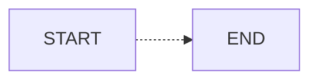


**关于图形框**

如上两种展示效果，一般无特殊的表示符号就是在**矩形框**中添加文字。
如果想要其他形式的话（如**圆角矩形框或圆形、菱形**），就请看下面展示，使用方法与上面的相同。
注：由于定义的是一个结点，所以不管LR还是其他的都不影响。

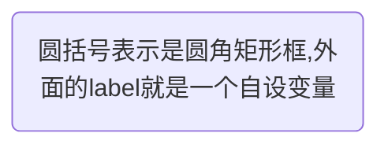

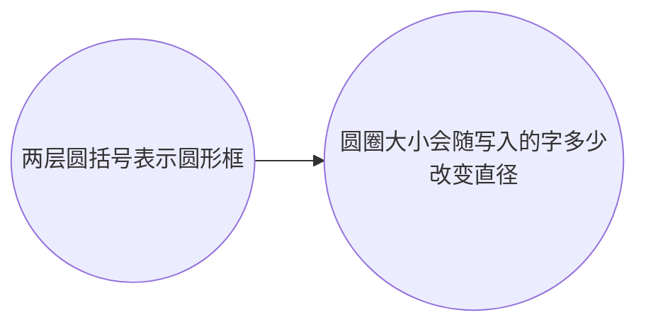

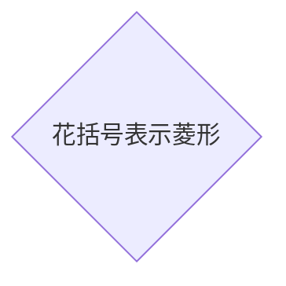


**关于连接方式**
可以注意到，上面的展示方式中，结点与结点之间的连接方式用到了"**–>**“和”**—**“还有”**-.->**“分别表示其间**有无箭头相连**以及**虚线连接**。如果要用更粗的连接还能使用”**==>**"表示**粗连接**。
其他还有在有箭头的连线上附加文字。如下：

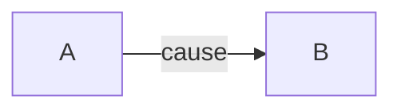


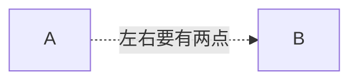


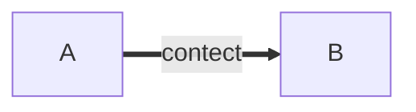


### Github示例

**FLow**

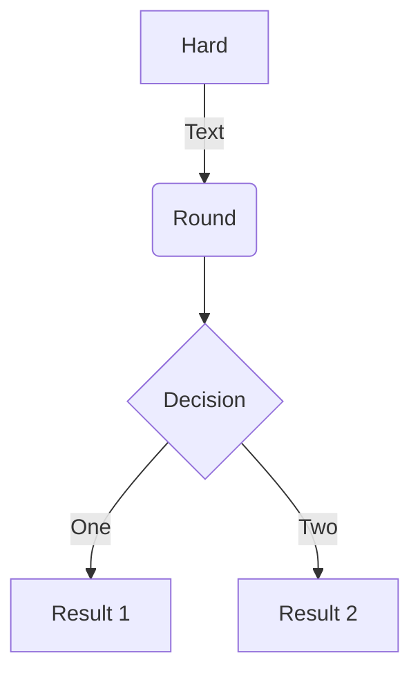


**Sequence**

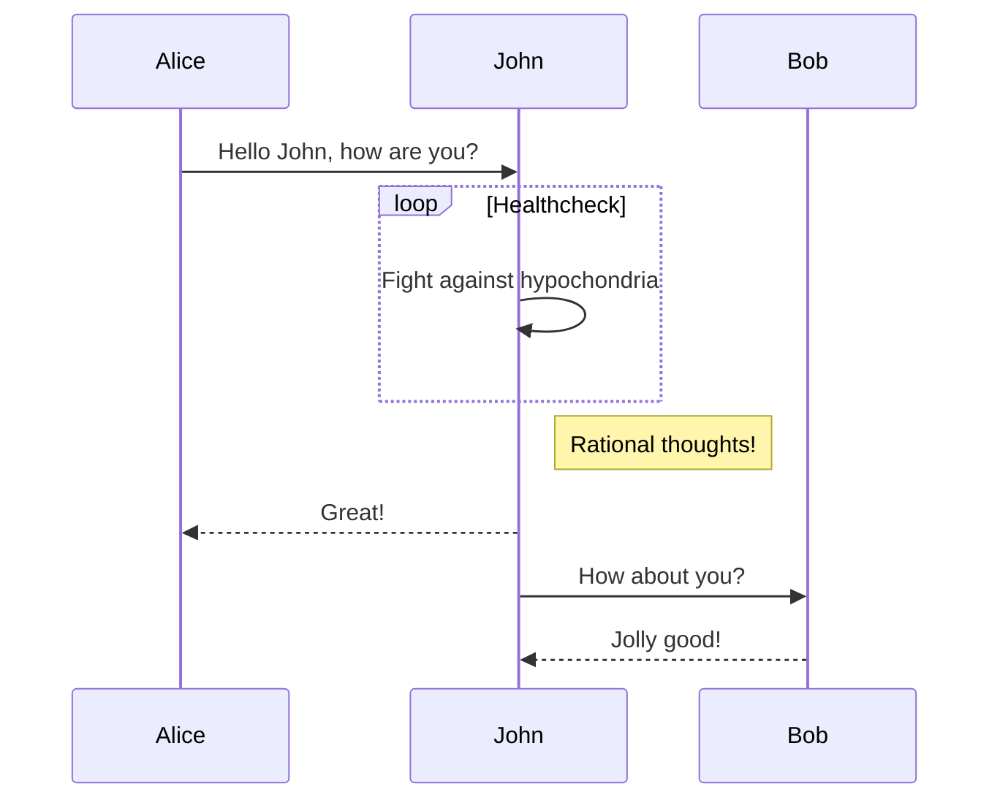

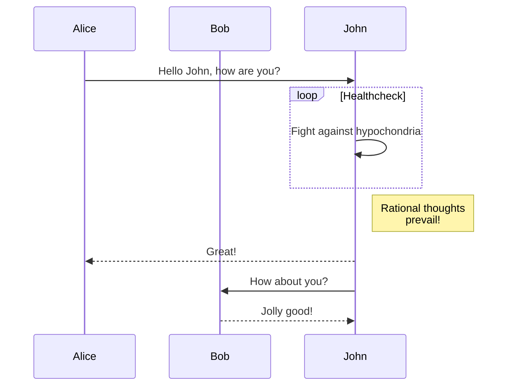


**Gantt**

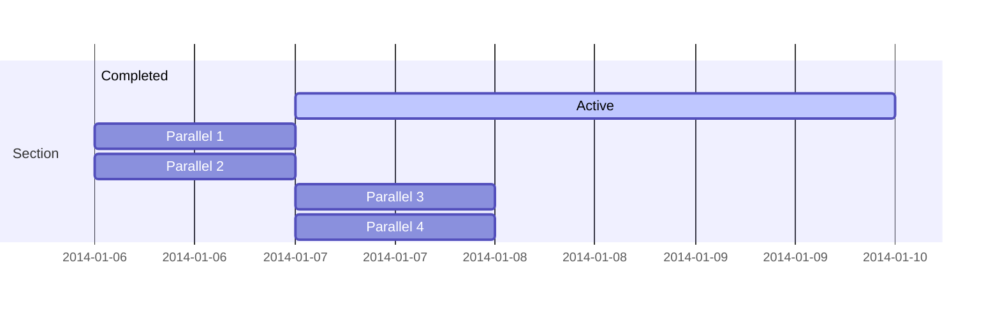

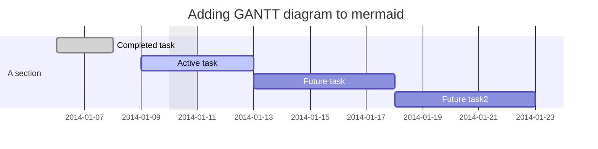


**Class**

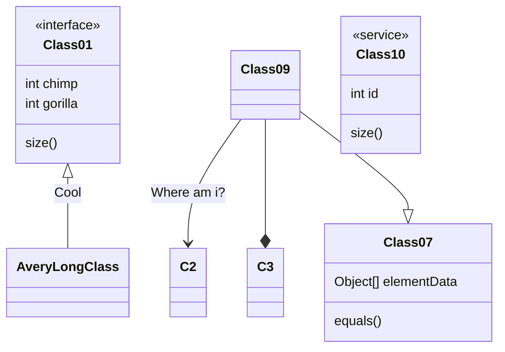

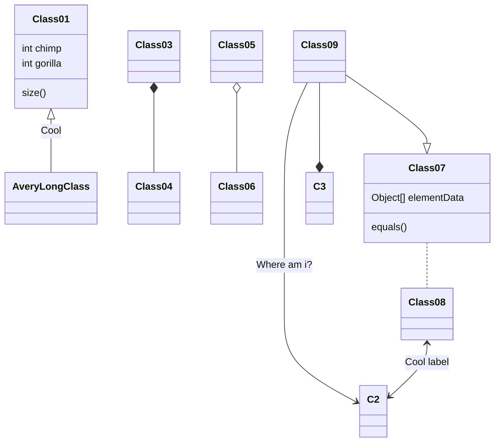


**State**

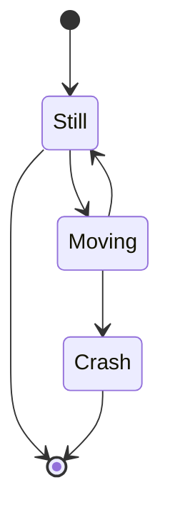

**Pie**

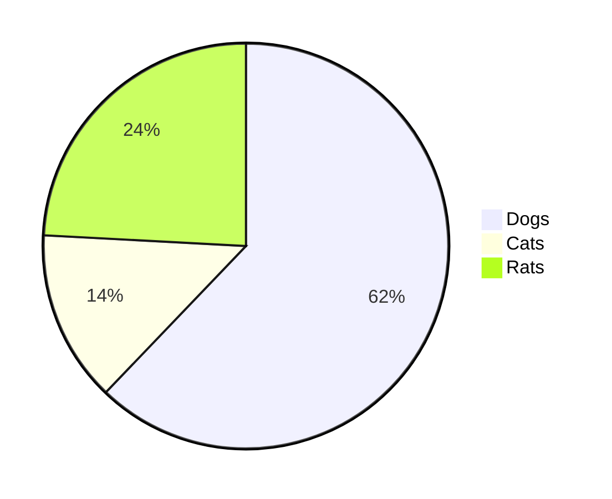

**Git**

*Coming soon!*


### 官方文档

可以看到在最新版的v8.4当中加入了不少新的图表类型，但是由于Typora还不能完全支持，所以可以在后续之中体验。

以下列出mermaid.js现有支持的图表类型：

#### Flowchart

```
graph TD;
    A-->B;
    A-->C;
    B-->D;
    C-->D;
```


#### Sequence diagram

```
sequenceDiagram
    participant Alice
    participant Bob
    Alice->>John: Hello John, how are you?
    loop Healthcheck
        John->>John: Fight against hypochondria
    end
    Note right of John: Rational thoughts <br/>prevail!
    John-->>Alice: Great!
    John->>Bob: How about you?
    Bob-->>John: Jolly good!
```


#### Gantt diagram

```
gantt
dateFormat  YYYY-MM-DD
title Adding GANTT diagram to mermaid
excludes weekdays 2014-01-10

section A section
Completed task            :done,    des1, 2014-01-06,2014-01-08
Active task               :active,  des2, 2014-01-09, 3d
Future task               :         des3, after des2, 5d
Future task2               :         des4, after des3, 5d
```


#### Class diagram -  experimental

```
classDiagram
Class01 <|-- AveryLongClass : Cool
Class03 *-- Class04
Class05 o-- Class06
Class07 .. Class08
Class09 --> C2 : Where am i?
Class09 --* C3
Class09 --|> Class07
Class07 : equals()
Class07 : Object[] elementData
Class01 : size()
Class01 : int chimp
Class01 : int gorilla
Class08 <--> C2: Cool label
```


#### ~~Git graph -  experimental~~

```
gitGraph:
options
{
    "nodeSpacing": 150,
    "nodeRadius": 10
}
end
commit
branch newbranch
checkout newbranch
commit
commit
checkout master
commit
commit
merge newbranch
```

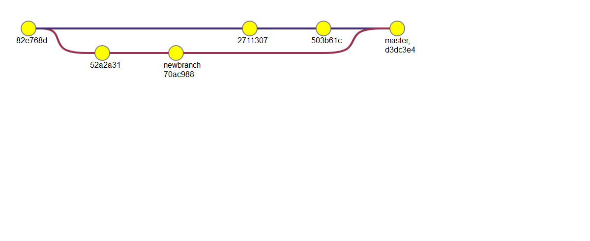

### FAQ

1. How to add title to flowchart?

     

2. How to specify custom CSS file?

     

3. How to fix tooltip misplacement issue?

     

4. How to specify gantt diagram xAxis format?

     

5. How to bind an event?

     

6. How to add newline in the text?

     

7. How to have special characters in link text?

     

8. How to change flowchart curve style?


