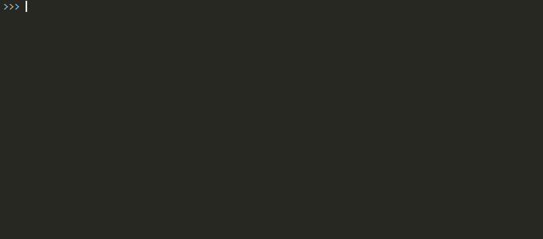

### 使用loguru记录日志

#### 安装：

```
pip install loguru
```

#### 基本使用：

```python
from loguru import logger

logger.debug('this is a debug message')
```

不需要进行配置，直接引入一个 `logger` ，然后调用其 `debug` 方法即可。

在 `loguru` 里面有且仅有一个主要对象，那就是 `logger` ，`loguru` 里面有且仅有一个 `logger` ，而且它已经被提前配置了一些基础信息，比如比较友好的格式化、文本颜色信息等。

以上的日志信息是直接输出到控制台的，并没有输出到其他的地方，如果想要输出到其他的位置，比如存为文件，我们只需要使用一行代码声明即可。

例如将结果同时输出到一个 `runtime.log` 文件里面，可以这么写：

```python
from loguru import logger

logger.add('runtime.log')
logger.debug('this is a debug')
```

不需要再声明一个 `FileHandler` 了，就一行 `add` 语句搞定，运行之后会发现目录下 `runtime.log` 里面同样出现了刚刚控制台输出的 `DEBUG` 信息。

```
2020-08-18 15:38:07.571 | DEBUG    | __main__:<module>:1 - this is a debug mesage
```

#### 详细使用：

既然是日志，那么最常见的就是输出到文件了。`loguru` 对输出到文件的配置有非常强大的支持，比如支持输出到多个文件，分级别分别输出，过大创建新文件，过久自动删除等等。

下面我们分别看看这些怎样来实现，这里基本上就是 `add` 方法的使用介绍。因为这个 `add` 方法就相当于给 `logger` 添加了一个 `Handler`，它给我们暴露了许多参数来实现 `Handler` 的配置，下面我们来详细介绍下。

首先看看它的方法定义吧：

```python
def add(
    self,
    sink,
    *,
    level=_defaults.LOGURU_LEVEL,
    format=_defaults.LOGURU_FORMAT,
    filter=_defaults.LOGURU_FILTER,
    colorize=_defaults.LOGURU_COLORIZE,
    serialize=_defaults.LOGURU_SERIALIZE,
    backtrace=_defaults.LOGURU_BACKTRACE,
    diagnose=_defaults.LOGURU_DIAGNOSE,
    enqueue=_defaults.LOGURU_ENQUEUE,
    catch=_defaults.LOGURU_CATCH,
    **kwargs
):
    r"""Add a handler sending log messages to a sink adequately configured.
```

看看它的源代码，它支持这么多的参数，如 `level`、`format`、`filter`、`color` 等等，另外我们还注意到它有个非常重要的参数 `sink`，我们看看官方文档：[sink](https://loguru.readthedocs.io/en/stable/api/logger.html#sink)，可以了解到通过 `sink` 我们可以传入多种不同的数据结构，汇总如下：

- `sink` 可以传入一个 `file` 对象，例如 `sys.stderr` 或者 `open('file.log', 'w')` 都可以。
- `sink` 可以直接传入一个 `str` 字符串或者 `pathlib.Path` 对象，其实就是代表文件路径的，如果识别到是这种类型，它会自动创建对应路径的日志文件并将日志输出进去。
- `sink` 可以是一个方法，可以自行定义输出实现。
- `sink` 可以是一个 `logging` 模块的 `Handler`，比如 `FileHandler`、`StreamHandler` 等等，或者上文中我们提到的 `CMRESHandler` 照样也是可以的，这样就可以实现自定义 `Handler` 的配置。
- `sink` 还可以是一个自定义的类，具体的实现规范可以参见官方文档。

所以说，刚才我们所演示的输出到文件，仅仅给它传了一个 `str` 字符串路径，他就给我们创建了一个日志文件，就是这个原理。

#### 基本参数

下面我们再了解下它的其他参数，例如 `format`、`filter`、`level` 等等。

其实它们的概念和格式和 `logging` 模块都是基本一样的了，例如这里使用`format`、`filter`、`level`来规定输出的格式：

```python
logger.add('runtime.log', format="{time} {level} {message}", filter="my_module", level="INFO")
```

#### 删除 sink

另外添加 `sink` 之后我们也可以对其进行删除，相当于重新刷新并写入新的内容。

删除的时候根据刚刚 `add` 方法返回的 `id` 进行删除即可，看下面的例子：

```python
from loguru import logger
 
trace = logger.add('runtime.log')
logger.debug('this is a debug message')
logger.remove(trace)
logger.debug('this is another debug message')
```

看这里，我们首先 `add` 了一个 `sink`，然后获取它的返回值，赋值为 `trace`。随后输出了一条日志，然后将 `trace` 变量传给`remove` 方法，再次输出一条日志，看看结果是怎样的。

控制台输出如下：

```
2019-11-06 23:03:24.368 | DEBUG    | __main__:<module>:4 - this is a debug message
2019-11-06 23:03:24.369 | DEBUG    | __main__:<module>:6 - this is another debug message
```

日志文件 `runtime.log` 内容如下：

```
cat runtime.log
2019-11-06 23:03:24.368 | DEBUG    | __main__:<module>:4 - this is a debug message
```

可以发现，在调用 `remove` 方法之后，确实将历史 `log` 删除了。

这样我们就可以实现日志的刷新重新写入操作。

#### rotation 配置

用了 `loguru` 我们还可以非常方便地使用`rotation` 配置，比如我们想一天输出一个日志文件，或者文件太大了自动分隔日志文件，我们可以直接使用 `add` 方法的 `rotation` 参数进行配置。

我们看看下面的例子：

```python
logger.add('runtime_{time}.log', rotation="500 MB")
```

通过这样的配置我们就可以实现每 500MB 存储一个文件，每个 log 文件过大就会新创建一个 log 文件。我们在配置 log 名字时加上了一个 `time` 占位符，这样在生成时可以自动将时间替换进去，生成一个文件名包含时间的 log 文件。

另外我们也可以使用 `rotation` 参数实现定时创建 log 文件，例如：

```python
logger.add('runtime_{time}.log', rotation='00:00')
```

这样就可以实现每天 0 点新创建一个 log 文件输出了。

另外我们也可以配置 log 文件的循环时间，比如每隔一周创建一个 log 文件，写法如下：

```python
logger.add('runtime_{time}.log', rotation='1 week')
```

这样我们就可以实现一周创建一个 log 文件了。

```python
- an |int| which corresponds to the maximum file size in bytes before that the current
  logged file is closed and a new one started over.
- a |timedelta| which indicates the frequency of each new rotation.
- a |time| which specifies the hour when the daily rotation should occur.
- a |str| for human-friendly parametrization of one of the previously enumerated types.
  Examples: ``"100 MB"``, ``"0.5 GB"``, ``"1 month 2 weeks"``, ``"4 days"``, ``"10h"``,
  ``"monthly"``, ``"18:00"``, ``"sunday"``, ``"w0"``, ``"monday at 12:00"``, ...
- a |function|_ which will be called before logging. It should accept two
  arguments: the logged message and the file object, and it should return ``True`` if
  the rotation should happen now, ``False`` otherwise.
```

#### retention 配置

很多情况下，一些非常久远的 log 对我们来说并没有什么用处了，它白白占据了一些存储空间，不清除掉就会非常浪费。`retention` 这个参数可以配置日志的最长保留时间。

比如我们想要设置日志文件最长保留 10 天，可以这么来配置：

```python
logger.add('runtime.log', retention='10 days')
```

这样 log 文件里面就会保留最新 10 天的 log，妈妈再也不用担心 log 沉积的问题啦。

我们看下源码看下这个参数可以设置为哪些值:

```python
- an |int| which indicates the number of log files to keep, while older files are removed.
- a |timedelta| which specifies the maximum age of files to keep.
- a |str| for human-friendly parametrization of the maximum age of files to keep.
  Examples: ``"1 week, 3 days"``, ``"2 months"``, ...
- a |function|_ which will be called before the retention process. It should accept the list
  of log files as argument and process to whatever it wants (moving files, removing them,
  etc.).
```

#### compression 配置

`loguru` 还可以配置文件的压缩格式，比如使用 `zip` 文件格式保存，示例如下：

```python
logger.add('runtime.log', compression='zip')
```

这样可以更加节省存储空间。

我们看下源码看下这个参数可以设置为哪些值:

```python
- a |str| which corresponds to the compressed or archived file extension. This can be one
  of: ``"gz"``, ``"bz2"``, ``"xz"``, ``"lzma"``, ``"tar"``, ``"tar.gz"``, ``"tar.bz2"``,
  ``"tar.xz"``, ``"zip"``.
- a |function|_ which will be called before file termination. It should accept the path
  of the log file as argument and process to whatever it wants (custom compression,
  network sending, removing it, etc.).
```

#### enqueue配置

`loguru`可以配置在多进程同时往日志文件写日志的时候使用队列达到异步功效。

```python
logger.add("somefile.log", enqueue=True)  # 异步写入
```

看下源码的解释:

```python
enqueue : |bool|, optional
    Whether the messages to be logged should first pass through a multiprocess-safe queue
    before reaching the sink. This is useful while logging to a file through multiple
    processes.
```

#### 字符串格式化

`loguru` 在输出 log 的时候还提供了非常友好的字符串格式化功能，像这样：

```python
logger.info('If you are using Python {}, prefer {feature} of course!', 3.6, feature='f-strings')
```

这样在添加参数就非常方便了。

#### Traceback 记录

在很多情况下，如果遇到运行错误，而我们在打印输出 log 的时候万一不小心没有配置好 Traceback 的输出，很有可能我们就没法追踪错误所在了。

但用了 loguru 之后，我们用它提供的装饰器就可以直接进行 Traceback 的记录，类似这样的配置即可：

```python
@logger.catch
def my_function(x, y, z):
    # An error? It's caught anyway!
    return 1 / (x + y + z)
```

我们做个测试，我们在调用时三个参数都传入 0，直接引发除以 0 的错误，看看会出现什么情况：

```python
my_function(0, 0, 0)
```

运行完毕之后，可以发现 log 里面就出现了 Traceback 信息，而且给我们输出了当时的变量值，真的是不能再赞了！结果如下：

```python
> File "run.py", line 15, in <module>
    my_function(0, 0, 0)
    └ <function my_function at 0x1171dd510>
 
  File "/private/var/py/logurutest/demo5.py", line 13, in my_function
    return 1 / (x + y + z)
                │   │   └ 0
                │   └ 0
                └ 0
 
ZeroDivisionError: division by zero
```

因此，用 loguru 可以非常方便地实现日志追踪，debug 效率可能要高上十倍了？

```python
class InterceptHandler(logging.Handler):
    def emit(self, record):
        # Retrieve context where the logging call occurred, this happens to be in the 6th frame upward
        logger_opt = logger.opt(depth=6, exception=record.exc_info)
        logger_opt.log(record.levelno, record.getMessage())

logging.basicConfig(handlers=[InterceptHandler()], level=0)
```


### Python编程：loguru管理日志输出

#### 输出日志

```python
from loguru import logger

logger.debug("这是一条debug日志")
```

#### 输出到文件

```python
from loguru import logger

logger.add("file_{time}.log")

logger.debug("这是一条debug日志")
logger.info("这是一条info日志")
```

#### 日志规则

```python
from loguru import logger

logger.add("file.log", format="{time} {level} {message}", filter="", level="INFO")

logger.debug("这是一条debug日志")
logger.info("这是一条info日志")
```

输出：

```
2019-03-14T20:01:25.392454+0800 INFO 这是一条info日志
```

#### 日志文件

文件管理方式

```python
logger.add("file_1.log", rotation="500 MB")    # 文件过大就会重新生成一个文件
logger.add("file_2.log", rotation="12:00")     # 每天12点创建新文件
logger.add("file_3.log", rotation="1 week")    # 文件时间过长就会创建新文件

logger.add("file_X.log", retention="10 days")  # 一段时间后会清空

logger.add("file_Y.log", compression="zip")    # 保存zip格式
```

#### 其他参数

```python
logger.add("somefile.log", enqueue=True)  # 异步写入

logger.add("somefile.log", serialize=True)  # 序列化为json
```

#### 时间格式化

```python
logger.add("file.log", format="{time:YYYY-MM-DD at HH:mm:ss} | {level} | {message}")
```

配合notifiers模块
github： https://github.com/notifiers/notifiers
文档：https://notifiers.readthedocs.io/en/latest/

#### 在工程中创建多个文件处理器对象并解决中文乱码问题

```python
# coding=utf-8
import os
import sys
from loguru import logger

BASE_DIR = os.path.dirname(os.path.dirname(os.path.abspath(__file__)))

log_file_path = os.path.join(BASE_DIR, 'Log/my.log')
err_log_file_path = os.path.join(BASE_DIR, 'Log/err.log')

logger.add(sys.stderr, format="{time} {level} {message}", filter="my_module", level="INFO")
# logger.add(s)
logger.add(log_file_path, rotation="500 MB", encoding='utf-8')  # Automatically rotate too big file
logger.add(err_log_file_path, rotation="500 MB", encoding='utf-8',
           level='ERROR')  # Automatically rotate too big file
logger.debug("That's it, beautiful and simple logging!")
logger.debug("中文日志可以不")
logger.error("严重错误")
```


### 更优美的python日志管理库Loguru

#### Loguru 简介

**Loguru**的主旨就是让程序员能方便优美的实现日志记录。您还记得配置记录器的繁琐过程吗？因为对此感到厌烦？让我们看看以前python日志记录器的创建过程吧。

```python
import logging

#创建日志级别
logger = logging.getLogger(__name__)
logger.setLevel(logging.INFO)

#创建日志文件
handler_warn = logging.FileHandler('warning_log.txt')
handler_warn.setLevel(logging.INFO)

#定义日志格式
formatter = logging.Formatter('%(asctime)s - %(name)s - %(levelname)s - %(message)s')
handler_warn.setFormatter(formatter)

#将日志处理程序记录到记录器
logger.addHandler(handler_warn)
```

以上还是最简单的配置过程，是否感到很繁琐。确实如此，但是记录是每个应用程序的基础，并简化了调试过程。使用**Loguru，**您没有理由不从一开始就使用日志记录，这很简单。只需要引入loguru库即可，而且loguru的性能也非常好，因为Loguru的关键功能将以C语言实现，以实现最高速度。

```python
from loguru import logger
```

另外，该库旨在通过添加一堆有用的功能来减轻Python日志记录的痛苦，这些功能可以解决标准记录器的问题。在您的应用程序中使用日志应该是自动的，**Loguru**试图使其变得既愉快又强大。

#### Loguru 安装

```python
pip install loguru
```

#### Loguru 使用

##### 1、简单使用

```python
from loguru import logger

logger.debug("That's it, beautiful and simple logging!")
```

结果显示彩色，非常的优美。

##### 2、日志格式

根据自己的需求配置日志格式，也非常简单，只需要简单配置即可完成。如下：

```python
import sys
from loguru import logger

#配置日志格式
logger.add(sys.stderr, format="{time} {level} {message}", filter="my_module", level="INFO")

logger.info("That's it, beautiful and simple logging!")
logger.debug("That's debug")
logger.warning("That's warning")
```

结果，不同的颜色显示：

##### 3、日志文件

如果要将记录的消息保存到文件，则只需使用字符串路径作为接收器。配置如下：

```python
logger.add("file_{time}.log")
```

如果需要设置日志文件大小、删除较旧的日志文件或希望在关闭时压缩文件，并设置压缩格式，这些都可以进行配置，而且配置起来非常简单。如下：

```python
#rotation参数
logger.add("file_1.log", rotation="500 MB")    # 设置日志文件大小
logger.add("file_2.log", rotation="12:00")     # 中午12点创建日志文件
logger.add("file_3.log", rotation="1 week")    # 一周创建一个日志文件

#retention参数
logger.add("file_X.log", retention="10 days")  # 日志文件最长保留 10 天

#compression参数
logger.add("file_Y.log", compression="zip")    # 日志文件压缩格式为ZIP
```

##### 4、字符串格式化

Loguru倾向于使用更优雅，更强大的`{}`格式`%`，日志记录功能实际上等效于`str.format()`。

```python
logger.info("If you're using Python {}, prefer {feature} of course!", 3.6, feature="f-strings")
```

##### 5、Traceback捕获

您是否曾经看到程序意外崩溃而没有在日志文件中看到任何内容？您是否注意到没有记录线程中发生的异常？这可以使用`catch()`装饰器/上下文管理器解决，该管理器可以确保将任何错误信息正确保存到`logger`中。配置如下：

```python
import sys
from loguru import logger

@logger.catch
def my_function(x, y, z):
    # An error? It's caught anyway!
    return 1 / (x + y + z)

my_function(1,-1,0)
```

##### 6、色彩斑斓的日志

如果您的终端兼容，Loguru会自动为日志添加颜色。您可以通过使用接收器格式来自定义自己喜欢的样式。配置方式如下：

```python
logger.add(sys.stderr, colorize=True, format="<green>{time}</green> <level>{message}</level>",level="DEBUG")
```

结果，DEBUG及以上的信息或被自定义显示样式。

##### 7、异步写入日志

`logger`默认情况下，添加到的所有接收器都是线程安全的。它们不是多进程安全的，但是您可以`enqueue`通过消息来确保日志的完整性。如果要异步记录，也可以使用相同的参数。

```python
logger.add("somefile.log", enqueue=True)
```

##### 8、序列化日志

希望对日志进行序列化以便于解析或传递日志？使用该`serialize`参数，每条日志消息在发送到已配置的接收器之前将转换为JSON字符串。

```python
logger.add(custom_sink_function, serialize=True)
```

##### 9、配置日期格式

```python
logger.add(sys.stderr, format="{time:YYYY-MM-DD at HH:mm:ss} | {level} | {message}",level="DEBUG")

logger.info("If you're using Python {}, prefer {feature} of course!", 3.6, feature="f-strings")
logger.debug("That's debug")
logger.warning("That's warning")
```

##### 10、配置编码格式

```
logger.add(log_file_path, rotation="500 MB", encoding='utf8')
```

还有更多的配置方法，详细请参考官方文档。

[文档](https://loguru.readthedocs.io/en/stable/overview.html)

[官方github](https://github.com/Delgan/loguru)


### Flask中的 logging 使用

#### 一、日志等级说明

- **等级：** **DEBUG < INFO < WARNING < ERROR < CRITICAL**
- **DEBUG ：** 最详细的日志信息，主要的应用场景问题的诊断，只限于开发人员使用的，用来在开发过程中进行调试
- **INFO ：** 详细程度仅次于debug模式，主要来记录关键节点的信息，确定程序是否正常如预期完成，一般的使用场景是重要的业务处理已经结束，我们通过这些INFO级别的日志信息，可以很快的了解应用正在做什么。
- **WARNING ：** 当某些不被期望的事情发生的时候，需要记录的信息，比如磁盘即将存满，注意当前的程序一依旧可以正常运行，不报错。也就是说发生这个级别的问题时，处理过程可以继续，但必须要对这个问题给予额外的关注。
- **ERROR ：** 出现严重问题，导致某些功能不能正常运行记录信息
- **CRITICAL：** 系统即将崩溃或者已经崩溃

#### 二、应用实例

###### 2.1 简单使用demo

```python
from flask import Flask
import logging

app = Flask(__name__)

@app.route('/')
def root():
    app.logger.info('info log')
    app.logger.warning('warning log')
    return 'hello'

if __name__ == '__main__':
    app.debug = True
    handler = logging.FileHandler('flask.log')
    app.logger.addHandler(handler)
    app.run()
```

###### 2.2 自定义设置打印格式（2+）

```python
import logging.handlers

handler = logging.FileHandler('flask.log', encoding='UTF-8')
handler.setLevel(logging.DEBUG)
logging_format = logging.Formatter('%(asctime)s - %(levelname)s - %(filename)s - %(funcName)s - %(lineno)s - %(message)s')
handler.setFormatter(logging_format)
app.logger.addHandler(handler)
```

```python
import logging
from logging.handlers import RotatingFileHandler

# 默认日志等级的设置
logging.basicConfig(level=logging.DEBUG)
# 创建日志记录器，指明日志保存路径,每个日志的大小，保存日志的上限
file_log_handler = RotatingFileHandler('WarningLogs.log', maxBytes=1024 * 1024, backupCount=10)
# 设置日志的格式                   发生时间    日志等级     日志信息文件名      函数名          行数        日志信息
formatter = logging.Formatter('%(asctime)s - %(levelname)s - %(filename)s - %(funcName)s - %(lineno)s - %(message)s')
# 将日志记录器指定日志的格式
file_log_handler.setFormatter(formatter)
# 日志等级的设置
# file_log_handler.setLevel(logging.WARNING)
# 为全局的日志工具对象添加日志记录器
logging.getLogger().addHandler(file_log_handler)
```

```python
# 测试
app.logger.info('info log')
app.logger.debug('debug log')
app.logger.warning('warning log')
app.logger.error('error log')
app.logger.critical('critical')
```

###### 2.3 自定义文件和格式设置

```python
import os
import logging
import time
from logging.handlers import RotatingFileHandler

# log配置，实现日志自动按日期生成日志文件
def make_dir(make_dir_path):
    path = make_dir_path.strip()
    if not os.path.exists(path):
        os.makedirs(path)

log_dir_name = "Logs"
log_file_name = 'logs-' + time.strftime('%Y-%m-%d', time.localtime(time.time())) + '.log'
log_file_folder = os.path.abspath(
    os.path.join(os.path.dirname(__file__), os.pardir)) + os.sep + log_dir_name
make_dir(log_file_folder)
log_file_str = log_file_folder + os.sep + log_file_name

# 默认日志等级的设置
logging.basicConfig(level=logging.WARNING)
# 创建日志记录器，指明日志保存路径,每个日志的大小，保存日志的上限
file_log_handler = RotatingFileHandler(log_file_str, maxBytes=1024 * 1024, backupCount=10)
# 设置日志的格式                   发生时间    日志等级     日志信息文件名      函数名          行数        日志信息
formatter = logging.Formatter('%(asctime)s - %(levelname)s - %(filename)s - %(funcName)s - %(lineno)s - %(message)s')
# 将日志记录器指定日志的格式
file_log_handler.setFormatter(formatter)
# 日志等级的设置
# file_log_handler.setLevel(logging.WARNING)
# 为全局的日志工具对象添加日志记录器
logging.getLogger().addHandler(file_log_handler)
```

#### 三、使用体验

简单讲，logging的使用就是三个步骤：

- 创建记录器
- 日志的格式、等级设置
- 添加记录器

#### 四、日志记录等级设置

如果是使用 **logging.basicConfig(level=logging.DEBUG)** 设置的话，那么使用 **app.logger** 打印的日志仍会不分等级均记录，而 **系统运行日志** 才会按照设置的等级进行记录。

使用 **file_log_handler.setLevel(logging.WARNING)** 设置等级的话，那么不管是 **app.logger** 打印的日志 还是 **系统运行日志** 均按照设置等级进行记录。

#### 五、日志格式的常用参数说明

| 参数                | 说明                                                         |
| ------------------- | ------------------------------------------------------------ |
| %(name)s            | Logger的名字                                                 |
| %(levelno)s         | 数字形式的日志级别                                           |
| %(levelname)s       | 文本形式的日志级别                                           |
| %(pathname)s        | 调用日志输出函数的模块的完整路径名，可能没有                 |
| %(filename)s        | 调用日志输出函数的模块的文件名                               |
| %(module)s          | 调用日志输出函数的模块名                                     |
| %(funcName)s        | 调用日志输出函数的函数名                                     |
| %(lineno)d          | 调用日志输出函数的语句所在的代码行                           |
| %(created)f         | 当前时间，用UNIX标准的表示时间的浮 点数表示                  |
| %(relativeCreated)d | 输出日志信息时的，自Logger创建以 来的毫秒数                  |
| %(asctime)s         | 字符串形式的当前时间。默认格式是 “2003-07-08 16:49:45,896”。逗号后面的是毫秒 |
| %(thread)d          | 线程ID。可能没有                                             |
| %(threadName)s      | 线程名。可能没有                                             |
| %(process)d         | 进程ID。可能没有                                             |
| %(message)s         | 用户输出的消息                                               |

------

参考文章：

【1】[Flask-log,日志](https://blog.csdn.net/weixin_43158056/article/details/95163598)
【2】[如何优雅的在flask中记录log](https://segmentfault.com/a/1190000018087099)
【3】[python web开发-flask中日志的使用](https://www.cnblogs.com/itxb/p/8635056.html)
【4】[Flask使用日志记录到文件示例](https://www.bbsmax.com/A/QW5YLRBBJm/)
【5】[flask 日志集成](https://blog.csdn.net/m0_37392631/article/details/84968416)
【6】[Logging — Flask Documentation (1.1.x)](https://flask.palletsprojects.com/en/master/logging/)
【7】[logging.config — Logging configuration — Python 3.7.5rc1 documentation](https://docs.python.org/3/library/logging.config.html?highlight=logging)
【8】[logging — Logging facility for Python — Python 3.7.5rc1 documentation](https://docs.python.org/3/library/logging.html#logger-objects)


[](https://loguru.readthedocs.io/en/stable/index.html#readme)

[](https://pypi.python.org/pypi/loguru) [](https://pypi.python.org/pypi/loguru) [](https://loguru.readthedocs.io/en/stable/index.html) [](https://travis-ci.com/Delgan/loguru) [](https://codecov.io/gh/delgan/loguru/branch/master) [](https://www.codacy.com/app/delgan-py/loguru/dashboard) [](https://github.com/Delgan/loguru/blob/master/LICENSE)

[](https://loguru.readthedocs.io/en/stable/index.html#readme)

------

**Loguru** is a library which aims to bring enjoyable logging in Python.

Did you ever feel lazy about configuring a logger and used `print()` instead?… I did, yet logging is fundamental to every application and eases the process of debugging. Using **Loguru** you have no excuse not to use logging from the start, this is as simple as `from loguru import logger`.

Also, this library is intended to make Python logging less painful by adding a bunch of useful functionalities that solve caveats of the standard loggers. Using logs in your application should be an automatism, **Loguru** tries to make it both pleasant and powerful.

# Table of contents

- Overview
  - [Installation](https://loguru.readthedocs.io/en/stable/overview.html#installation)
  - [Features](https://loguru.readthedocs.io/en/stable/overview.html#features)
  - [Take the tour](https://loguru.readthedocs.io/en/stable/overview.html#take-the-tour)
- API Reference
  - [`loguru.logger`](https://loguru.readthedocs.io/en/stable/api/logger.html)
  - [Type hints](https://loguru.readthedocs.io/en/stable/api/type_hints.html)
- Help & Guides
  - [Introduction to Logging in Python](https://docs.python.org/3/howto/logging.html)
  - [Switching from standard `logging` to `loguru`](https://loguru.readthedocs.io/en/stable/resources/migration.html)
  - [Code snippets and recipes for `loguru`](https://loguru.readthedocs.io/en/stable/resources/recipes.html)
- Project Information
  - [Contributing](https://loguru.readthedocs.io/en/stable/project/contributing.html)
  - [License](https://loguru.readthedocs.io/en/stable/project/license.html)
  - [Changelog](https://loguru.readthedocs.io/en/stable/project/changelog.html)

# Overview

## Installation

```
pip install loguru
```

## Features

- [Ready to use out of the box without boilerplate](https://loguru.readthedocs.io/en/stable/overview.html#ready-to-use-out-of-the-box-without-boilerplate)
- [No Handler, no Formatter, no Filter: one function to rule them all](https://loguru.readthedocs.io/en/stable/overview.html#no-handler-no-formatter-no-filter-one-function-to-rule-them-all)
- [Easier file logging with rotation / retention / compression](https://loguru.readthedocs.io/en/stable/overview.html#easier-file-logging-with-rotation-retention-compression)
- [Modern string formatting using braces style](https://loguru.readthedocs.io/en/stable/overview.html#modern-string-formatting-using-braces-style)
- [Exceptions catching within threads or main](https://loguru.readthedocs.io/en/stable/overview.html#exceptions-catching-within-threads-or-main)
- [Pretty logging with colors](https://loguru.readthedocs.io/en/stable/overview.html#pretty-logging-with-colors)
- [Asynchronous, Thread-safe, Multiprocess-safe](https://loguru.readthedocs.io/en/stable/overview.html#asynchronous-thread-safe-multiprocess-safe)
- [Fully descriptive exceptions](https://loguru.readthedocs.io/en/stable/overview.html#fully-descriptive-exceptions)
- [Structured logging as needed](https://loguru.readthedocs.io/en/stable/overview.html#structured-logging-as-needed)
- [Lazy evaluation of expensive functions](https://loguru.readthedocs.io/en/stable/overview.html#lazy-evaluation-of-expensive-functions)
- [Customizable levels](https://loguru.readthedocs.io/en/stable/overview.html#customizable-levels)
- [Better datetime handling](https://loguru.readthedocs.io/en/stable/overview.html#better-datetime-handling)
- [Suitable for scripts and libraries](https://loguru.readthedocs.io/en/stable/overview.html#suitable-for-scripts-and-libraries)
- [Entirely compatible with standard logging](https://loguru.readthedocs.io/en/stable/overview.html#entirely-compatible-with-standard-logging)
- [Personalizable defaults through environment variables](https://loguru.readthedocs.io/en/stable/overview.html#personalizable-defaults-through-environment-variables)
- [Convenient parser](https://loguru.readthedocs.io/en/stable/overview.html#convenient-parser)
- [Exhaustive notifier](https://loguru.readthedocs.io/en/stable/overview.html#exhaustive-notifier)
- ~~[10x faster than built-in logging](https://loguru.readthedocs.io/en/stable/overview.html#x-faster-than-built-in-logging)~~

## Take the tour

### Ready to use out of the box without boilerplate

The main concept of Loguru is that **there is one and only one** <kbd>[`logger`](https://loguru.readthedocs.io/en/stable/api/logger.html#loguru._logger.Logger)</kbd>.

For convenience, it is pre-configured and outputs to <kbd>`stderr`</kbd> to begin with (but that’s entirely configurable).

```python
from loguru import logger

logger.debug("That's it, beautiful and simple logging!")
```

The <kbd>[`logger`](https://loguru.readthedocs.io/en/stable/api/logger.html#loguru._logger.Logger)</kbd> is just an interface which dispatches log messages to configured handlers. Simple, right?

### No Handler, no Formatter, no Filter: one function to rule them all

How to add a handler? How to set up logs formatting? How to filter messages? How to set level?

One answer: the <kbd>[`add()`](https://loguru.readthedocs.io/en/stable/api/logger.html#loguru._logger.Logger.add)</kbd> function.

```python
logger.add(sys.stderr, format="{time} {level} {message}", filter="my_module", level="INFO")
```

This function should be used to register <kbd>[sinks](https://loguru.readthedocs.io/en/stable/api/logger.html#sink)</kbd> which are responsible for managing [log messages](https://loguru.readthedocs.io/en/stable/api/logger.html#message) contextualized with a [record dict](https://loguru.readthedocs.io/en/stable/api/logger.html#record). A sink can take many forms: a simple function, a string path, a file-like object, a coroutine function or a built-in Handler.

Note that you may also <kbd>[`remove()`](https://loguru.readthedocs.io/en/stable/api/logger.html#loguru._logger.Logger.remove)</kbd> a previously added handler by using the identifier returned while adding it. This is particularly useful if you want to supersede the default <kbd>`stderr`</kbd> handler: just call <kbd>`logger.remove()`</kbd> to make a fresh start.

### Easier file logging with rotation / retention / compression

If you want to send logged messages to a file, you just have to use a string path as the sink. It can be automatically timed too for convenience:

```python
logger.add("file_{time}.log")
```

It is also [easily configurable](https://loguru.readthedocs.io/en/stable/api/logger.html#file) if you need rotating logger, if you want to remove older logs, or if you wish to compress your files at closure.

```python
logger.add("file_1.log", rotation="500 MB")    # Automatically rotate too big file
logger.add("file_2.log", rotation="12:00")     # New file is created each day at noon
logger.add("file_3.log", rotation="1 week")    # Once the file is too old, it's rotated

logger.add("file_X.log", retention="10 days")  # Cleanup after some time

logger.add("file_Y.log", compression="zip")    # Save some loved space
```

### Modern string formatting using braces style

Loguru favors the much more elegant and powerful `{}` formatting over `%`, logging functions are actually equivalent to <kbd>`str.format()`</kbd>.

```
logger.info("If you're using Python {}, prefer {feature} of course!", 3.6, feature="f-strings")
```

### Exceptions catching within threads or main

Have you ever seen your program crashing unexpectedly without seeing anything in the log file? Did you ever noticed that exceptions occurring in threads were not logged? This can be solved using the <kbd>[`catch()`](https://loguru.readthedocs.io/en/stable/api/logger.html#loguru._logger.Logger.catch)</kbd> decorator / context manager which ensures that any error is correctly propagated to the <kbd>[`logger`](https://loguru.readthedocs.io/en/stable/api/logger.html#loguru._logger.Logger)</kbd>.

```python
@logger.catch
def my_function(x, y, z):
    # An error? It's caught anyway!
    return 1 / (x + y + z)
```

### Pretty logging with colors

Loguru automatically adds colors to your logs if your terminal is compatible. You can define your favorite style by using [markup tags](https://loguru.readthedocs.io/en/stable/api/logger.html#color) in the sink format.

```python
logger.add(sys.stdout, colorize=True, format="<green>{time}</green> <level>{message}</level>")
```

### Asynchronous, Thread-safe, Multiprocess-safe

All sinks added to the <kbd>[`logger`](https://loguru.readthedocs.io/en/stable/api/logger.html#loguru._logger.Logger)</kbd> are thread-safe by default. They are not multiprocess-safe, but you can <kbd>`enqueue`</kbd> the messages to ensure logs integrity. This same argument can also be used if you want async logging.

```python
logger.add("somefile.log", enqueue=True)
```

Coroutine functions used as sinks are also supported and should be awaited with <kbd>[`complete()`](https://loguru.readthedocs.io/en/stable/api/logger.html#loguru._logger.Logger.complete)</kbd>.

### Fully descriptive exceptions

Logging exceptions that occur in your code is important to track bugs, but it’s quite useless if you don’t know why it failed. Loguru helps you identify problems by allowing the entire stack trace to be displayed, including values of variables (thanks <kbd>[`better_exceptions`](https://github.com/Qix-/better-exceptions)</kbd> for this!).

The code:

```python
logger.add("output.log", backtrace=True, diagnose=True)  # Set 'False' to not leak sensitive data in prod

def func(a, b):
    return a / b

def nested(c):
    try:
        func(5, c)
    except ZeroDivisionError:
        logger.exception("What?!")

nested(0)
```

Would result in:

```python
2018-07-17 01:38:43.975 | ERROR    | __main__:nested:10 - What?!
Traceback (most recent call last):

  File "test.py", line 12, in <module>
    nested(0)
    └ <function nested at 0x7f5c755322f0>

> File "test.py", line 8, in nested
    func(5, c)
    │       └ 0
    └ <function func at 0x7f5c79fc2e18>

  File "test.py", line 4, in func
    return a / b
           │   └ 0
           └ 5

ZeroDivisionError: division by zero
```

### Structured logging as needed

Want your logs to be serialized for easier parsing or to pass them around? Using the <kbd><font color=red>`serialize`</font></kbd> argument, each log message will be converted to a JSON string before being sent to the configured sink.

```python
logger.add(custom_sink_function, serialize=True)
```

Using <kbd>[`bind()`](https://loguru.readthedocs.io/en/stable/api/logger.html#loguru._logger.Logger.bind)</kbd> you can contextualize your logger messages by modifying the extra record attribute.

```python
logger.add("file.log", format="{extra[ip]} {extra[user]} {message}")
context_logger = logger.bind(ip="192.168.0.1", user="someone")
context_logger.info("Contextualize your logger easily")
context_logger.bind(user="someone_else").info("Inline binding of extra attribute")
context_logger.info("Use kwargs to add context during formatting: {user}", user="anybody")
```

It is possible to modify a context-local state temporarily with <kbd>[`contextualize()`](https://loguru.readthedocs.io/en/stable/api/logger.html#loguru._logger.Logger.contextualize)</kbd>:

```python
with logger.contextualize(task=task_id):
    do_something()
    logger.info("End of task")
```

You can also have more fine-grained control over your logs by combining <kbd>[`bind()`](https://loguru.readthedocs.io/en/stable/api/logger.html#loguru._logger.Logger.bind)</kbd> and <kbd>`filter`</kbd>:

```python
logger.add("special.log", filter=lambda record: "special" in record["extra"])
logger.debug("This message is not logged to the file")
logger.bind(special=True).info("This message, though, is logged to the file!")
```

Finally, the <kbd>[`patch()`](https://loguru.readthedocs.io/en/stable/api/logger.html#loguru._logger.Logger.patch)</kbd> method allows dynamic values to be attached to the record dict of each new message:

```python
logger.add(sys.stderr, format="{extra[utc]} {message}")
logger = logger.patch(lambda record: record["extra"].update(utc=datetime.utcnow()))
```

### Lazy evaluation of expensive functions

Sometime you would like to log verbose information without performance penalty in production, you can use the <kbd>[`opt()`](https://loguru.readthedocs.io/en/stable/api/logger.html#loguru._logger.Logger.opt)</kbd> method to achieve this.

```python
logger.opt(lazy=True).debug("If sink level <= DEBUG: {x}", x=lambda: expensive_function(2**64))

# By the way, "opt()" serves many usages
logger.opt(exception=True).info("Error stacktrace added to the log message (tuple accepted too)")
logger.opt(colors=True).info("Per message <blue>colors</blue>")
logger.opt(record=True).info("Display values from the record (eg. {record[thread]})")
logger.opt(raw=True).info("Bypass sink formatting\n")
logger.opt(depth=1).info("Use parent stack context (useful within wrapped functions)")
logger.opt(capture=False).info("Keyword arguments not added to {dest} dict", dest="extra")
```

### Customizable levels

Loguru comes with all standard [logging levels](https://loguru.readthedocs.io/en/stable/api/logger.html#levels) to which <kbd>[`trace()`](https://loguru.readthedocs.io/en/stable/api/logger.html#loguru._logger.Logger.trace)</kbd> and <kbd>[`success()`](https://loguru.readthedocs.io/en/stable/api/logger.html#loguru._logger.Logger.success)</kbd> are added. Do you need more? Then, just create it by using the <kbd>[`level()`](https://loguru.readthedocs.io/en/stable/api/logger.html#loguru._logger.Logger.level)</kbd> function.

```python
new_level = logger.level("SNAKY", no=38, color="<yellow>", icon="🐍")

logger.log("SNAKY", "Here we go!")
```

### Better datetime handling

The standard logging is bloated with arguments like <kbd>`datefmt`</kbd> or <kbd>`msecs`</kbd>, <kbd>`%(asctime)s`</kbd> and <kbd>`%(created)s`</kbd>, naive datetimes without timezone information, not intuitive formatting, etc. Loguru [fixes it](https://loguru.readthedocs.io/en/stable/api/logger.html#time):

```python
logger.add("file.log", format="{time:YYYY-MM-DD at HH:mm:ss} | {level} | {message}")
```

### Suitable for scripts and libraries

Using the logger in your scripts is easy, and you can <kbd>[`configure()`](https://loguru.readthedocs.io/en/stable/api/logger.html#loguru._logger.Logger.configure)</kbd> it at start. To use Loguru from inside a library, remember to never call <kbd>[`add()`](https://loguru.readthedocs.io/en/stable/api/logger.html#loguru._logger.Logger.add)</kbd> but use <kbd>[`disable()`](https://loguru.readthedocs.io/en/stable/api/logger.html#loguru._logger.Logger.disable)</kbd> instead so logging functions become no-op. If a developer wishes to see your library’s logs, he can <kbd>[`enable()`](https://loguru.readthedocs.io/en/stable/api/logger.html#loguru._logger.Logger.enable)</kbd> it again.

```python
# For scripts
config = {
    "handlers": [
        {"sink": sys.stdout, "format": "{time} - {message}"},
        {"sink": "file.log", "serialize": True},
    ],
    "extra": {"user": "someone"}
}
logger.configure(**config)

# For libraries
logger.disable("my_library")
logger.info("No matter added sinks, this message is not displayed")
logger.enable("my_library")
logger.info("This message however is propagated to the sinks")
```

### Entirely compatible with standard logging

Wish to use built-in logging <kbd>`Handler`</kbd> as a _Loguru_ sink?

```python
handler = logging.handlers.SysLogHandler(address=('localhost', 514))
logger.add(handler)
```

Need to propagate Loguru messages to standard logging?

```python
class PropagateHandler(logging.Handler):
    def emit(self, record):
        logging.getLogger(record.name).handle(record)

logger.add(PropagateHandler(), format="{message}")
```

Want to intercept standard logging messages toward your Loguru sinks?

```python
class InterceptHandler(logging.Handler):
    def emit(self, record):
        # Get corresponding Loguru level if it exists
        try:
            level = logger.level(record.levelname).name
        except ValueError:
            level = record.levelno

        # Find caller from where originated the logged message
        frame, depth = logging.currentframe(), 2
        while frame.f_code.co_filename == logging.__file__:
            frame = frame.f_back
            depth += 1

        logger.opt(depth=depth, exception=record.exc_info).log(level, record.getMessage())

logging.basicConfig(handlers=[InterceptHandler()], level=0)
```

### Personalizable defaults through environment variables

Don’t like the default logger formatting? Would prefer another <kbd>`DEBUG`</kbd> color? [No problem](https://loguru.readthedocs.io/en/stable/api/logger.html#env):

```shell
# Linux / OSX
export LOGURU_FORMAT="{time} | <lvl>{message}</lvl>"

# Windows
setx LOGURU_DEBUG_COLOR "<green>"
```

### Convenient parser

It is often useful to extract specific information from generated logs, this is why Loguru provides a <kbd>[`parse()`](https://loguru.readthedocs.io/en/stable/api/logger.html#loguru._logger.Logger.parse)</kbd> method which helps to deal with logs and regexes.

```python
pattern = r"(?P<time>.*) - (?P<level>[0-9]+) - (?P<message>.*)"  # Regex with named groups
caster_dict = dict(time=dateutil.parser.parse, level=int)        # Transform matching groups

for groups in logger.parse("file.log", pattern, cast=caster_dict):
    print("Parsed:", groups)
    # {"level": 30, "message": "Log example", "time": datetime(2018, 12, 09, 11, 23, 55)}
```

### Exhaustive notifier

Loguru can easily be combined with the great <kbd>[`notifiers`](https://github.com/notifiers/notifiers)</kbd> library (must be installed separately) to receive an e-mail when your program fail unexpectedly or to send many other kind of notifications.

```python
import notifiers

params = {
    "username": "you@gmail.com",
    "password": "abc123",
    "to": "dest@gmail.com"
}

# Send a single notification
notifier = notifiers.get_notifier("gmail")
notifier.notify(message="The application is running!", **params)

# Be alerted on each error message
from notifiers.logging import NotificationHandler

handler = NotificationHandler("gmail", defaults=params)
logger.add(handler, level="ERROR")
```

**~~10x faster than built-in logging~~**

Although logging impact on performances is in most cases negligible, a zero-cost logger would allow to use it anywhere without much concern. In an upcoming release, Loguru’s critical functions will be implemented in C for maximum speed.

# API Reference

The Loguru library provides a pre-instanced logger to facilitate dealing with logging in Python.

Just <kbd><font color=red>`from loguru import logger`</font></kbd>.

- <kbd>[`Logger`](https://loguru.readthedocs.io/en/stable/api/logger.html#loguru._logger.Logger)</kbd>

  > - <kbd>[`add()`](https://loguru.readthedocs.io/en/stable/api/logger.html#loguru._logger.Logger.add)</kbd>
  >
  >   > - [The sink parameter](https://loguru.readthedocs.io/en/stable/api/logger.html#sink)
  >   > - [The logged message](https://loguru.readthedocs.io/en/stable/api/logger.html#message)
  >   > - [The severity levels](https://loguru.readthedocs.io/en/stable/api/logger.html#levels)
  >   > - [The record dict](https://loguru.readthedocs.io/en/stable/api/logger.html#record)
  >   > - [The time formatting](https://loguru.readthedocs.io/en/stable/api/logger.html#time)
  >   > - [The file sinks](https://loguru.readthedocs.io/en/stable/api/logger.html#file)
  >   > - [The color markups](https://loguru.readthedocs.io/en/stable/api/logger.html#color)
  >   > - [The environment variables](https://loguru.readthedocs.io/en/stable/api/logger.html#env)
  >
  > - <kbd>[`remove()`](https://loguru.readthedocs.io/en/stable/api/logger.html#loguru._logger.Logger.remove)</kbd>
  >
  > - <kbd>[`complete()`](https://loguru.readthedocs.io/en/stable/api/logger.html#loguru._logger.Logger.complete)</kbd>
  >
  > - <kbd>[`catch()`](https://loguru.readthedocs.io/en/stable/api/logger.html#loguru._logger.Logger.catch)</kbd>
  >
  > - <kbd>[`opt()`](https://loguru.readthedocs.io/en/stable/api/logger.html#loguru._logger.Logger.opt)</kbd>
  >
  > - <kbd>[`bind()`](https://loguru.readthedocs.io/en/stable/api/logger.html#loguru._logger.Logger.bind)</kbd>
  >
  > - <kbd>[`contextualize()`](https://loguru.readthedocs.io/en/stable/api/logger.html#loguru._logger.Logger.contextualize)</kbd>
  >
  > - <kbd>[`patch()`](https://loguru.readthedocs.io/en/stable/api/logger.html#loguru._logger.Logger.patch)</kbd>
  >
  > - <kbd>[`level()`](https://loguru.readthedocs.io/en/stable/api/logger.html#loguru._logger.Logger.level)</kbd>
  >
  > - <kbd>[`disable()`](https://loguru.readthedocs.io/en/stable/api/logger.html#loguru._logger.Logger.disable)</kbd>
  >
  > - <kbd>[`enable()`](https://loguru.readthedocs.io/en/stable/api/logger.html#loguru._logger.Logger.enable)</kbd>
  >
  > - <kbd>[`configure()`](https://loguru.readthedocs.io/en/stable/api/logger.html#loguru._logger.Logger.configure)</kbd>
  >
  > - <kbd>[`parse()`](https://loguru.readthedocs.io/en/stable/api/logger.html#loguru._logger.Logger.parse)</kbd>
  >
  > - <kbd>[`trace()`](https://loguru.readthedocs.io/en/stable/api/logger.html#loguru._logger.Logger.trace)</kbd>
  >
  > - <kbd>[`debug()`](https://loguru.readthedocs.io/en/stable/api/logger.html#loguru._logger.Logger.debug)</kbd>
  >
  > - <kbd>[`info()`](https://loguru.readthedocs.io/en/stable/api/logger.html#loguru._logger.Logger.info)</kbd>
  >
  > - <kbd>[`success()`](https://loguru.readthedocs.io/en/stable/api/logger.html#loguru._logger.Logger.success)</kbd>
  >
  > - <kbd>[`warning()`](https://loguru.readthedocs.io/en/stable/api/logger.html#loguru._logger.Logger.warning)</kbd>
  >
  > - <kbd>[`error()`](https://loguru.readthedocs.io/en/stable/api/logger.html#loguru._logger.Logger.error)</kbd>
  >
  > - <kbd>[`critical()`](https://loguru.readthedocs.io/en/stable/api/logger.html#loguru._logger.Logger.critical)</kbd>
  >
  > - <kbd>[`log()`](https://loguru.readthedocs.io/en/stable/api/logger.html#loguru._logger.Logger.log)</kbd>
  >
  > - <kbd>[`exception()`](https://loguru.readthedocs.io/en/stable/api/logger.html#loguru._logger.Logger.exception)</kbd>

- [Type hints](https://loguru.readthedocs.io/en/stable/api/type_hints.html#type-hints)

# <kbd><font color=red>`loguru.logger`</font></kbd>

> *class*  `Logger`  [[source\]](https://loguru.readthedocs.io/en/stable/_modules/loguru/_logger.html#Logger)

An object to dispatch logging messages to configured handlers.

The <kbd>[`Logger`](https://loguru.readthedocs.io/en/stable/api/logger.html#loguru._logger.Logger)</kbd> is the core object of <kbd>`loguru`</kbd>, every logging configuration and usage pass through a call to one of its methods. There is only one logger, so there is no need to retrieve one before usage.

Once the <kbd>`logger`</kbd> is imported, it can be used to write messages about events happening in your code. By reading the output logs of your application, you gain a better understanding of the flow of your program and you more easily track and debug unexpected behaviors.

Handlers to which the logger sends log messages are added using the <kbd>[`add()`](https://loguru.readthedocs.io/en/stable/api/logger.html#loguru._logger.Logger.add)</kbd> method. Note that you can use the <kbd>[`Logger`](https://loguru.readthedocs.io/en/stable/api/logger.html#loguru._logger.Logger)</kbd> right after import as it comes pre-configured (logs are emitted to <kbd>[`sys.stderr`](https://docs.python.org/3/library/sys.html#sys.stderr)</kbd> by default). Messages can be logged with different severity levels and using braces attributes like the <kbd>[`str.format()`](https://docs.python.org/3/library/stdtypes.html#str.format)</kbd> method do.

When a message is logged, a “record” is associated with it. This record is a dict which contains information about the logging context: time, function, file, line, thread, level… It also contains the <kbd>`__name__`</kbd> of the module, this is why you don’t need named loggers.

You should not instantiate a <kbd>[`Logger`](https://loguru.readthedocs.io/en/stable/api/logger.html#loguru._logger.Logger)</kbd> by yourself, use <kbd><font color=red>`from loguru import logger`</font></kbd> instead.

> `add(sink, *, level='DEBUG', format='<green>{time:YYYY-MM-DD HH:mm:ss.SSS}</green> | <level>{level: <8}</level> | <cyan>{name}</cyan>:<cyan>{function}</cyan>:<cyan>{line}</cyan> - <level>{message}</level>', filter=None, colorize=None, serialize=False, backtrace=True, diagnose=True, enqueue=False, catch=True, **kwargs)`  [source](https://loguru.readthedocs.io/en/stable/_modules/loguru/_logger.html#Logger.add)

Add a handler sending log messages to a sink adequately configured.

Parameters:

**sink** ([`file-like object`](https://docs.python.org/3/glossary.html#term-file-object), [`str`](https://docs.python.org/3/library/stdtypes.html#str), [`pathlib.Path`](https://docs.python.org/3/library/pathlib.html#pathlib.Path), [`callable`](https://docs.python.org/3/library/functions.html#callable), [`coroutine function`](https://docs.python.org/3/glossary.html#term-coroutine-function) or [`logging.Handler`](https://docs.python.org/3/library/logging.html#logging.Handler)) – An object in charge of receiving formatted logging messages and propagating them to an appropriate endpoint.

**level** ([`int`](https://docs.python.org/3/library/functions.html#int) or [`str`](https://docs.python.org/3/library/stdtypes.html#str), optional) – The minimum severity level from which logged messages should be sent to the sink.

**format** ([`str`](https://docs.python.org/3/library/stdtypes.html#str) or [`callable`](https://docs.python.org/3/library/functions.html#callable), optional) – The template used to format logged messages before being sent to the sink.

**filter** ([`callable`](https://docs.python.org/3/library/functions.html#callable), [`str`](https://docs.python.org/3/library/stdtypes.html#str) or [`dict`](https://docs.python.org/3/library/stdtypes.html#dict), optional) – A directive optionally used to decide for each logged message whether it should be sent to the sink or not.

**colorize** ([`bool`](https://docs.python.org/3/library/functions.html#bool), optional) – Whether the color markups contained in the formatted message should be converted to ansi codes for terminal coloration, or stripped otherwise. If `None`, the choice is automatically made based on the sink being a tty or not.

**serialize** ([`bool`](https://docs.python.org/3/library/functions.html#bool), optional) – Whether the logged message and its records should be first converted to a JSON string before being sent to the sink.

**backtrace** ([`bool`](https://docs.python.org/3/library/functions.html#bool), optional) – Whether the exception trace formatted should be extended upward, beyond the catching point, to show the full stacktrace which generated the error.

**diagnose** ([`bool`](https://docs.python.org/3/library/functions.html#bool), optional) – Whether the exception trace should display the variables values to eases the debugging. This should be set to `False` in production to avoid leaking sensitive data.

**enqueue** ([`bool`](https://docs.python.org/3/library/functions.html#bool), optional) – Whether the messages to be logged should first pass through a multiprocess-safe queue before reaching the sink. This is useful while logging to a file through multiple processes. This also has the advantage of making logging calls non-blocking.

**catch** ([`bool`](https://docs.python.org/3/library/functions.html#bool), optional) – Whether errors occurring while sink handles logs messages should be automatically caught. If `True`, an exception message is displayed on [`sys.stderr`](https://docs.python.org/3/library/sys.html#sys.stderr) but the exception is not propagated to the caller, preventing your app to crash.

***\*kwargs** – Additional parameters that are only valid to configure a coroutine or file sink (see below).

If and only if the sink is a coroutine function, the following parameter applies:

Parameters:**loop** ([`AbstractEventLoop`](https://docs.python.org/3/library/asyncio-eventloop.html#asyncio.AbstractEventLoop), optional) – The event loop in which the asynchronous logging task will be scheduled and executed. If `None`, the loop returned by [`asyncio.get_event_loop()`](https://docs.python.org/3/library/asyncio-eventloop.html#asyncio.get_event_loop) is used.

If and only if the sink is a file path, the following parameters apply:

Parameters:

**rotation** ([`str`](https://docs.python.org/3/library/stdtypes.html#str), [`int`](https://docs.python.org/3/library/functions.html#int), [`datetime.time`](https://docs.python.org/3/library/datetime.html#datetime.time), [`datetime.timedelta`](https://docs.python.org/3/library/datetime.html#datetime.timedelta) or [`callable`](https://docs.python.org/3/library/functions.html#callable), optional) – A condition indicating whenever the current logged file should be closed and a new one started.

**retention** ([`str`](https://docs.python.org/3/library/stdtypes.html#str), [`int`](https://docs.python.org/3/library/functions.html#int), [`datetime.timedelta`](https://docs.python.org/3/library/datetime.html#datetime.timedelta) or [`callable`](https://docs.python.org/3/library/functions.html#callable), optional) – A directive filtering old files that should be removed during rotation or end of program.

**compression** ([`str`](https://docs.python.org/3/library/stdtypes.html#str) or [`callable`](https://docs.python.org/3/library/functions.html#callable), optional) – A compression or archive format to which log files should be converted at closure.

**delay** ([`bool`](https://docs.python.org/3/library/functions.html#bool), optional) – Whether the file should be created as soon as the sink is configured, or delayed until first logged message. It defaults to `False`.

**mode** ([`str`](https://docs.python.org/3/library/stdtypes.html#str), optional) – The opening mode as for built-in [`open()`](https://docs.python.org/3/library/functions.html#open) function. It defaults to `"a"` (open the file in appending mode).

**buffering** ([`int`](https://docs.python.org/3/library/functions.html#int), optional) – The buffering policy as for built-in [`open()`](https://docs.python.org/3/library/functions.html#open) function. It defaults to `1` (line buffered file).

**encoding** ([`str`](https://docs.python.org/3/library/stdtypes.html#str), optional) – The file encoding as for built-in [`open()`](https://docs.python.org/3/library/functions.html#open) function. If `None`, it defaults to [`locale.getpreferredencoding()`](https://docs.python.org/3/library/locale.html#locale.getpreferredencoding).

***\*kwargs** – Others parameters are passed to the built-in [`open()`](https://docs.python.org/3/library/functions.html#open) function.

Returns:[`int`](https://docs.python.org/3/library/functions.html#int) – An identifier associated with the added sink and which should be used to [`remove()`](https://loguru.readthedocs.io/en/stable/api/logger.html#loguru._logger.Logger.remove) it.

Notes

Extended summary follows.

The sink parameter

The `sink` handles incoming log messages and proceed to their writing somewhere and somehow. A sink can take many forms:

A [`file-like object`](https://docs.python.org/3/glossary.html#term-file-object) like `sys.stderr` or `open("somefile.log", "w")`. Anything with a `.write()` method is considered as a file-like object. Custom handlers may also implement `flush()` (called after each logged message), `stop()` (called at sink termination) and `complete()` (awaited by the eponymous method).

A file path as [`str`](https://docs.python.org/3/library/stdtypes.html#str) or [`pathlib.Path`](https://docs.python.org/3/library/pathlib.html#pathlib.Path). It can be parametrized with some additional parameters, see below.

A [`callable`](https://docs.python.org/3/library/functions.html#callable) (such as a simple function) like `lambda msg: print(msg)`. This allows for logging procedure entirely defined by user preferences and needs.

A asynchronous [`coroutine function`](https://docs.python.org/3/glossary.html#term-coroutine-function) defined with the `async def` statement. The coroutine object returned by such function will be added to the event loop using [`loop.create_task()`](https://docs.python.org/3/library/asyncio-eventloop.html#asyncio.loop.create_task). The tasks should be awaited before ending the loop by using [`complete()`](https://loguru.readthedocs.io/en/stable/api/logger.html#loguru._logger.Logger.complete).

A built-in [`logging.Handler`](https://docs.python.org/3/library/logging.html#logging.Handler) like `logging.StreamHandler`. In such a case, the Loguru records are automatically converted to the structure expected by the [`logging`](https://docs.python.org/3/library/logging.html#module-logging) module.

Note that you should avoid using the `logger` inside any of your sinks as this would result in infinite recursion or dead lock if the module’s sink was not explicitly disabled.

The logged message

The logged message passed to all added sinks is nothing more than a string of the formatted log, to which a special attribute is associated: the `.record` which is a dict containing all contextual information possibly needed (see below).

Logged messages are formatted according to the `format` of the added sink. This format is usually a string containing braces fields to display attributes from the record dict.

If fine-grained control is needed, the `format` can also be a function which takes the record as parameter and return the format template string. However, note that in such a case, you should take care of appending the line ending and exception field to the returned format, while `"\n{exception}"` is automatically appended for convenience if `format` is a string.

The `filter` attribute can be used to control which messages are effectively passed to the sink and which one are ignored. A function can be used, accepting the record as an argument, and returning `True` if the message should be logged, `False` otherwise. If a string is used, only the records with the same `name` and its children will be allowed. One can also pass a `dict` mapping module names to minimum required level. In such case, each log record will search for it’s closest parent in the `dict` and use the associated level as the filter. The `dict` values can be `int` severity, `str` level name or `True` and `False` to respectively authorize and discard all module logs unconditionally. In order to set a default level, the `""` module name should be used as it is the parent of all modules (it does not suppress global `level` threshold, though).

Note that while calling a logging method, the keyword arguments (if any) are automatically added to the `extra` dict for convenient contextualization (in addition to being used for formatting).

The severity levels

Each logged message is associated with a severity level. These levels make it possible to prioritize messages and to choose the verbosity of the logs according to usages. For example, it allows to display some debugging information to a developer, while hiding it to the end user running the application.

The `level` attribute of every added sink controls the minimum threshold from which log messages are allowed to be emitted. While using the `logger`, you are in charge of configuring the appropriate granularity of your logs. It is possible to add even more custom levels by using the [`level()`](https://loguru.readthedocs.io/en/stable/api/logger.html#loguru._logger.Logger.level) method.

Here are the standard levels with their default severity value, each one is associated with a logging method of the same name:

| Level name | Severity value | Logger method                                                |
| ---------- | -------------- | ------------------------------------------------------------ |
| `TRACE`    | 5              | [`logger.trace()`](https://loguru.readthedocs.io/en/stable/api/logger.html#loguru._logger.Logger.trace) |
| `DEBUG`    | 10             | [`logger.debug()`](https://loguru.readthedocs.io/en/stable/api/logger.html#loguru._logger.Logger.debug) |
| `INFO`     | 20             | [`logger.info()`](https://loguru.readthedocs.io/en/stable/api/logger.html#loguru._logger.Logger.info) |
| `SUCCESS`  | 25             | [`logger.success()`](https://loguru.readthedocs.io/en/stable/api/logger.html#loguru._logger.Logger.success) |
| `WARNING`  | 30             | [`logger.warning()`](https://loguru.readthedocs.io/en/stable/api/logger.html#loguru._logger.Logger.warning) |
| `ERROR`    | 40             | [`logger.error()`](https://loguru.readthedocs.io/en/stable/api/logger.html#loguru._logger.Logger.error) |
| `CRITICAL` | 50             | [`logger.critical()`](https://loguru.readthedocs.io/en/stable/api/logger.html#loguru._logger.Logger.critical) |

The record dict

The record is just a Python dict, accessible from sinks by `message.record`. It contains all contextual information of the logging call (time, function, file, line, level, etc.).

Each of its key can be used in the handler’s `format` so the corresponding value is properly displayed in the logged message (e.g. `"{level}"` -> `"INFO"`). Some record’s values are objects with two or more attributes, these can be formatted with `"{key.attr}"` (`"{key}"` would display one by default). [Formatting directives](https://docs.python.org/3/library/string.html#format-string-syntax) like `"{key: >3}"` also works and is particularly useful for time (see below).

| Key       | Description                                                  | Attributes                                                   |
| --------- | ------------------------------------------------------------ | ------------------------------------------------------------ |
| elapsed   | The time elapsed since the start of the program              | See [`datetime.timedelta`](https://docs.python.org/3/library/datetime.html#datetime.timedelta) |
| exception | The formatted exception if any, `None` otherwise             | `type`, `value`, `traceback`                                 |
| extra     | The dict of attributes bound by the user (see [`bind()`](https://loguru.readthedocs.io/en/stable/api/logger.html#loguru._logger.Logger.bind)) | None                                                         |
| file      | The file where the logging call was made                     | `name` (default), `path`                                     |
| function  | The function from which the logging call was made            | None                                                         |
| level     | The severity used to log the message                         | `name` (default), `no`, `icon`                               |
| line      | The line number in the source code                           | None                                                         |
| message   | The logged message (not yet formatted)                       | None                                                         |
| module    | The module where the logging call was made                   | None                                                         |
| name      | The `__name__` where the logging call was made               | None                                                         |
| process   | The process in which the logging call was made               | `name`, `id` (default)                                       |
| thread    | The thread in which the logging call was made                | `name`, `id` (default)                                       |
| time      | The aware local time when the logging call was made          | See [`datetime.datetime`](https://docs.python.org/3/library/datetime.html#datetime.datetime) |

The time formatting

To use your favorite time representation, you can set it directly in the time formatter specifier of your handler format, like for example `format="{time:HH:mm:ss} {message}"`. Note that this datetime represents your local time, and it is also made timezone-aware, so you can display the UTC offset to avoid ambiguities.

The time field can be formatted using more human-friendly tokens. These constitute a subset of the one used by the [Pendulum](https://pendulum.eustace.io/docs/#tokens) library of [@sdispater](https://github.com/sdispater). To escape a token, just add square brackets around it, for example `"[YY]"` would display literally `"YY"`.

If you prefer to display UTC rather than local time, you can add `"!UTC"` at the very end of the time format, like `{time:HH:mm:ss!UTC}`. Doing so will convert the `datetime` to UTC before formatting.

If no time formatter specifier is used, like for example if `format="{time} {message}"`, the default one will use ISO 8601. 

<table>
    <thead valign="bottom">
        <tr class="row-odd">
            <th class="head">&#160;</th>
            <th class="head">Token</th>
            <th class="head">Output</th>
        </tr>
    </thead><tbody valign="top">
    <tr class="row-even">
        <td rowspan="2">Year</td>
        <td>YYYY</td>
        <td>2000, 2001, 2002 … 2012, 2013</td>
    </tr>
    <tr class="row-odd">
        <td>YY</td>
        <td>00, 01, 02 … 12, 13</td>
    </tr>
    <tr class="row-even">
        <td>Quarter</td>
        <td>Q</td>
        <td>1 2 3 4</td>
    </tr>
    <tr class="row-odd">
        <td rowspan="4">Month</td>
        <td>MMMM</td>
        <td>January, February, March …</td>
    </tr>
    <tr class="row-even">
        <td>MMM</td>
        <td>Jan, Feb, Mar …</td>
    </tr>
    <tr class="row-odd">
        <td>MM</td>
        <td>01, 02, 03 … 11, 12</td>
    </tr>
    <tr class="row-even">
        <td>M</td>
        <td>1, 2, 3 … 11, 12</td>
    </tr>
    <tr class="row-odd">
        <td rowspan="2">Day of Year</td>
        <td>DDDD</td>
        <td>001, 002, 003 … 364, 365</td>
    </tr>
    <tr class="row-even">
        <td>DDD</td>
        <td>1, 2, 3 … 364, 365</td>
    </tr>
    <tr class="row-odd">
        <td rowspan="2">Day of Month</td>
        <td>DD</td>
        <td>01, 02, 03 … 30, 31</td>
    </tr>
    <tr class="row-even">
        <td>D</td>
        <td>1, 2, 3 … 30, 31</td>
    </tr>
    <tr class="row-odd">
        <td rowspan="3">Day of Week</td>
        <td>dddd</td>
        <td>Monday, Tuesday, Wednesday …</td>
    </tr>
    <tr class="row-even">
        <td>ddd</td>
        <td>Mon, Tue, Wed …</td>
    </tr>
    <tr class="row-odd">
        <td>d</td>
        <td>0, 1, 2 … 6</td>
    </tr>
    <tr class="row-even">
        <td>Days of ISO Week</td>
        <td>E</td>
        <td>1, 2, 3 … 7</td>
    </tr>
    <tr class="row-odd">
        <td rowspan="4">Hour</td>
        <td>HH</td>
        <td>00, 01, 02 … 23, 24</td>
    </tr>
    <tr class="row-even">
        <td>H</td>
        <td>0, 1, 2 … 23, 24</td>
    </tr>
    <tr class="row-odd">
        <td>hh</td>
        <td>01, 02, 03 … 11, 12</td>
    </tr>
    <tr class="row-even">
        <td>h</td>
        <td>1, 2, 3 … 11, 12</td>
    </tr>
    <tr class="row-odd">
        <td rowspan="2">Minute</td>
        <td>mm</td>
        <td>00, 01, 02 … 58, 59</td>
    </tr>
    <tr class="row-even">
        <td>m</td>
        <td>0, 1, 2 … 58, 59</td>
    </tr>
    <tr class="row-odd">
        <td rowspan="2">Second</td>
        <td>ss</td>
        <td>00, 01, 02 … 58, 59</td>
    </tr>
    <tr class="row-even">
        <td>s</td>
        <td>0, 1, 2 … 58, 59</td>
    </tr>
    <tr class="row-odd">
        <td rowspan="5">Fractional Second</td>
        <td>S</td>
        <td>0 1 … 8 9</td>
    </tr>
    <tr class="row-even">
        <td>SS</td>
        <td>00, 01, 02 … 98, 99</td>
    </tr>
    <tr class="row-odd">
        <td>SSS</td>
        <td>000 001 … 998 999</td>
    </tr>
    <tr class="row-even">
        <td>SSSS…</td>
        <td>000[0..] 001[0..] … 998[0..] 999[0..]</td>
    </tr>
    <tr class="row-odd">
        <td>SSSSSS</td>
        <td>000000 000001 … 999998 999999</td>
    </tr>
    <tr class="row-even">
        <td>AM / PM</td>
        <td>A</td>
        <td>AM, PM</td>
    </tr>
    <tr class="row-odd">
        <td rowspan="3">Timezone</td>
        <td>Z</td>
        <td>-07:00, -06:00 … +06:00, +07:00</td>
    </tr>
    <tr class="row-even">
        <td>ZZ</td>
        <td>-0700, -0600 … +0600, +0700</td>
    </tr>
    <tr class="row-odd">
        <td>zz</td>
        <td>EST CST … MST PST</td>
    </tr>
    <tr class="row-even">
        <td>Seconds timestamp</td>
        <td>X</td>
        <td>1381685817, 1234567890.123</td>
    </tr>
    <tr class="row-odd">
        <td>Microseconds timestamp</td>
        <td>x</td>
        <td>1234567890123</td>
    </tr>
    </tbody>
</table>

The file sinks

If the sink is a [`str`](https://docs.python.org/3/library/stdtypes.html#str) or a [`pathlib.Path`](https://docs.python.org/3/library/pathlib.html#pathlib.Path), the corresponding file will be opened for writing logs. The path can also contain a special `"{time}"` field that will be formatted with the current date at file creation.

The `rotation` check is made before logging each message. If there is already an existing file with the same name that the file to be created, then the existing file is renamed by appending the date to its basename to prevent file overwriting. This parameter accepts:

- an [`int`](https://docs.python.org/3/library/functions.html#int) which corresponds to the maximum file size in bytes before that the current logged file is closed and a new one started over.
- a [`datetime.timedelta`](https://docs.python.org/3/library/datetime.html#datetime.timedelta) which indicates the frequency of each new rotation.
- a [`datetime.time`](https://docs.python.org/3/library/datetime.html#datetime.time) which specifies the hour when the daily rotation should occur.
- a [`str`](https://docs.python.org/3/library/stdtypes.html#str) for human-friendly parametrization of one of the previously enumerated types. Examples: `"100 MB"`, `"0.5 GB"`, `"1 month 2 weeks"`, `"4 days"`, `"10h"`, `"monthly"`, `"18:00"`, `"sunday"`, `"w0"`, `"monday at 12:00"`, …
- a [`callable`](https://docs.python.org/3/library/functions.html#callable) which will be invoked before logging. It should accept two arguments: the logged message and the file object, and it should return `True` if the rotation should happen now, `False` otherwise.

The `retention` occurs at rotation or at sink stop if rotation is `None`. Files are selected if they match the pattern `"basename(.*).ext(.*)"` (possible time fields are beforehand replaced with `.*`) based on the sink file. This parameter accepts:

- an [`int`](https://docs.python.org/3/library/functions.html#int) which indicates the number of log files to keep, while older files are removed.
- a [`datetime.timedelta`](https://docs.python.org/3/library/datetime.html#datetime.timedelta) which specifies the maximum age of files to keep.
- a [`str`](https://docs.python.org/3/library/stdtypes.html#str) for human-friendly parametrization of the maximum age of files to keep. Examples: `"1 week, 3 days"`, `"2 months"`, …
- a [`callable`](https://docs.python.org/3/library/functions.html#callable) which will be invoked before the retention process. It should accept the list of log files as argument and process to whatever it wants (moving files, removing them, etc.).

The `compression` happens at rotation or at sink stop if rotation is `None`. This parameter accepts:

- a [`str`](https://docs.python.org/3/library/stdtypes.html#str) which corresponds to the compressed or archived file extension. This can be one of: `"gz"`, `"bz2"`, `"xz"`, `"lzma"`, `"tar"`, `"tar.gz"`, `"tar.bz2"`, `"tar.xz"`, `"zip"`.
- a [`callable`](https://docs.python.org/3/library/functions.html#callable) which will be invoked before file termination. It should accept the path of the log file as argument and process to whatever it wants (custom compression, network sending, removing it, etc.).

Either way, if you use a custom function designed according to your preferences, you must be very careful not to use the `logger` within your function. Otherwise, there is a risk that your program hang because of a deadlock.

The color markups

To add colors to your logs, you just have to enclose your format string with the appropriate tags (e.g. `<red>some message</red>`). These tags are automatically removed if the sink doesn’t support ansi codes. For convenience, you can use `</>` to close the last opening tag without repeating its name (e.g. `<red>another message</>`).

The special tag `<level>` (abbreviated with `<lvl>`) is transformed according to the configured color of the logged message level.

Tags which are not recognized will raise an exception during parsing, to inform you about possible misuse. If you wish to display a markup tag literally, you can escape it by prepending a `\` like for example `\<blue>`. If, for some reason, you need to escape a string programmatically, note that the regex used internally to parse markup tags is `r"\\?</?((?:[fb]g\s)?[^<>\s]*)>"`.

Note that when logging a message with `opt(colors=True)`, color tags present in the formatting arguments (`args` and `kwargs`) are completely ignored. This is important if you need to log strings containing markups that might interfere with the color tags (in this case, do not use f-string).

Here are the available tags (note that compatibility may vary depending on terminal):

| Color (abbr) | Styles (abbr) |
| :----------: | :-----------: |
|  Black (k)   |   Bold (b)    |
|   Blue (e)   |    Dim (d)    |
|   Cyan (c)   |  Normal (n)   |
|  Green (g)   |  Italic (i)   |
| Magenta (m)  | Underline (u) |
|   Red (r)    |  Strike (s)   |
|  White (w)   |  Reverse (v)  |
|  Yellow (y)  |   Blink (l)   |
|              |   Hide (h)    |

Usage:

<table>
<thead valign="bottom">
<tr class="row-odd"><th class="head" rowspan="2">Description</th>
<th class="head" colspan="2">Examples</th>
</tr>
<tr class="row-even"><th class="head">Foreground</th>
<th class="head">Background</th>
</tr>
</thead>
<tbody valign="top">
<tr class="row-odd"><td>Basic colors</td>
<td><code class="docutils literal notranslate"><span class="pre">&lt;red&gt;</span></code>, <code class="docutils literal notranslate"><span class="pre">&lt;r&gt;</span></code></td>
<td><code class="docutils literal notranslate"><span class="pre">&lt;GREEN&gt;</span></code>, <code class="docutils literal notranslate"><span class="pre">&lt;G&gt;</span></code></td>
</tr>
<tr class="row-even"><td>Light colors</td>
<td><code class="docutils literal notranslate"><span class="pre">&lt;light-blue&gt;</span></code>, <code class="docutils literal notranslate"><span class="pre">&lt;le&gt;</span></code></td>
<td><code class="docutils literal notranslate"><span class="pre">&lt;LIGHT-CYAN&gt;</span></code>, <code class="docutils literal notranslate"><span class="pre">&lt;LC&gt;</span></code></td>
</tr>
<tr class="row-odd"><td>8-bit colors</td>
<td><code class="docutils literal notranslate"><span class="pre">&lt;fg</span> <span class="pre">86&gt;</span></code>, <code class="docutils literal notranslate"><span class="pre">&lt;fg</span> <span class="pre">255&gt;</span></code></td>
<td><code class="docutils literal notranslate"><span class="pre">&lt;bg</span> <span class="pre">42&gt;</span></code>, <code class="docutils literal notranslate"><span class="pre">&lt;bg</span> <span class="pre">9&gt;</span></code></td>
</tr>
<tr class="row-even"><td>Hex colors</td>
<td><code class="docutils literal notranslate"><span class="pre">&lt;fg</span> <span class="pre">#00005f&gt;</span></code>, <code class="docutils literal notranslate"><span class="pre">&lt;fg</span> <span class="pre">#EE1&gt;</span></code></td>
<td><code class="docutils literal notranslate"><span class="pre">&lt;bg</span> <span class="pre">#AF5FD7&gt;</span></code>, <code class="docutils literal notranslate"><span class="pre">&lt;bg</span> <span class="pre">#fff&gt;</span></code></td>
</tr>
<tr class="row-odd"><td>RGB colors</td>
<td><code class="docutils literal notranslate"><span class="pre">&lt;fg</span> <span class="pre">0,95,0&gt;</span></code></td>
<td><code class="docutils literal notranslate"><span class="pre">&lt;bg</span> <span class="pre">72,119,65&gt;</span></code></td>
</tr>
<tr class="row-even"><td>Stylizing</td>
<td colspan="2"><code class="docutils literal notranslate"><span class="pre">&lt;bold&gt;</span></code>, <code class="docutils literal notranslate"><span class="pre">&lt;b&gt;</span></code>,  <code class="docutils literal notranslate"><span class="pre">&lt;underline&gt;</span></code>, <code class="docutils literal notranslate"><span class="pre">&lt;u&gt;</span></code></td>
</tr>
</tbody>

The environment variables

The default values of sink parameters can be entirely customized. This is particularly useful if you don’t like the log format of the pre-configured sink.

Each of the [`add()`](https://loguru.readthedocs.io/en/stable/api/logger.html#loguru._logger.Logger.add) default parameter can be modified by setting the `LOGURU_[PARAM]` environment variable. For example on Linux: `export LOGURU_FORMAT="{time} - {message}"` or `export LOGURU_DIAGNOSE=NO`.

The default levels’ attributes can also be modified by setting the `LOGURU_[LEVEL]_[ATTR]` environment variable. For example, on Windows: `setx LOGURU_DEBUG_COLOR "<blue>"` or `setx LOGURU_TRACE_ICON "🚀"`. If you use the `set` command, do not include quotes but escape special symbol as needed, e.g. `set LOGURU_DEBUG_COLOR=^<blue^>`.

If you want to disable the pre-configured sink, you can set the `LOGURU_AUTOINIT` variable to `False`.On Linux, you will probably need to edit the `~/.profile` file to make this persistent. On Windows, don’t forget to restart your terminal for the change to be taken into account.

**Examples**

```python
>>> logger.add(sys.stdout, format="{time} - {level} - {message}", filter="sub.module")
```

```python
>>> logger.add("file_{time}.log", level="TRACE", rotation="100 MB")
```

```python
>>> def debug_only(record): 
...     return record["level"].name == "DEBUG" 
... 
>>> logger.add("debug.log", filter=debug_only)  # Other levels are filtered out
```

```python
>>> def my_sink(message): 
...     record = message.record 
...     update_db(message, time=record["time"], level=record["level"]) 
... 
>>> logger.add(my_sink)
```

```python
>>> level_per_module = { 
...     "": "DEBUG", 
...     "third.lib": "WARNING", 
...     "anotherlib": False 
... } 
>>> logger.add(lambda m: print(m, end=""), filter=level_per_module, level=0)
```

```python
>>> async def publish(message): 
...     await api.post(message) 
... 
>>> logger.add(publish, serialize=True)
```

```python
>>> from logging import StreamHandler 
>>> logger.add(StreamHandler(sys.stderr), format="{message}")
```

```python
>>> class RandomStream:
...     def __init__(self, seed, threshold): 
...         self.threshold = threshold 
...         random.seed(seed) 
...     def write(self, message): 
...         if random.random() > self.threshold: 
...             print(message) 
... 
>>> stream_object = RandomStream(seed=12345, threshold=0.25) 
>>> logger.add(stream_object, level="INFO") 
```

> `remove(handler_id=None)`    [source](https://loguru.readthedocs.io/en/stable/_modules/loguru/_logger.html#Logger.remove)

Remove a previously added handler and stop sending logs to its sink.

Parameters:    **handler_id** ([`int`](https://docs.python.org/3/library/functions.html#int) or `None`) – The id of the sink to remove, as it was returned by the [`add()`](https://loguru.readthedocs.io/en/stable/api/logger.html#loguru._logger.Logger.add) method. If `None`, all handlers are removed. The pre-configured handler is guaranteed to have the index `0`.

Raises:    [**ValueError**](https://docs.python.org/3/library/exceptions.html#ValueError) – If `handler_id` is not `None` but there is no active handler with such id.

Examples

```python
>>> i = logger.add(sys.stderr, format="{message}") 
>>> logger.info("Logging") 
Logging 
>>> logger.remove(i) 
>>> logger.info("No longer logging") 
```

> `complete`()    [[source\]](https://loguru.readthedocs.io/en/stable/_modules/loguru/_logger.html#Logger.complete)

Wait for the end of enqueued messages and asynchronous tasks scheduled by handlers.

This method proceeds in two steps: first it waits for all logging messages added to handlers with `enqueue=True` to be processed, then it returns an object that can be awaited to finalize all logging tasks added to the event loop by coroutine sinks.

It can be called from non-asynchronous code. This is especially recommended when the `logger` is utilized with `multiprocessing` to ensure messages put to the internal queue have been properly transmitted before leaving a child process.

The returned object should be awaited before the end of a coroutine executed by [`asyncio.run()`](https://docs.python.org/3/library/asyncio-task.html#asyncio.run) or [`loop.run_until_complete()`](https://docs.python.org/3/library/asyncio-eventloop.html#asyncio.loop.run_until_complete) to ensure all asynchronous logging messages are processed. The function [`asyncio.get_event_loop()`](https://docs.python.org/3/library/asyncio-eventloop.html#asyncio.get_event_loop) is called beforehand, only tasks scheduled in the same loop that the current one will be awaited by the method.

Returns:    [awaitable](https://docs.python.org/3/glossary.html#term-awaitable) – An awaitable object which ensures all asynchronous logging calls are completed when awaited.

Examples

```python
>>> async def sink(message): 
...     await asyncio.sleep(0.1)  # IO processing... 
...     print(message, end="") 
... 
>>> async def work(): 
...     logger.info("Start") 
...     logger.info("End") 
...     await logger.complete() 
... 
>>> logger.add(sink) 
1 
>>> asyncio.run(work()) 
Start 
End 
```

```python
>>> def process(): 
...     logger.info("Message sent from the child") 
...     logger.complete() 
... 
>>> logger.add(sys.stderr, enqueue=True) 
1 
>>> process = multiprocessing.Process(target=process) 
>>> process.start() 
>>> process.join() 
Message sent from the child
```

> `catch(exception=<class 'Exception'>, *, level='ERROR', reraise=False, onerror=None, exclude=None, default=None, message="An error has been caught in function '{record[function]}', process '{record[process].name}' ({record[process].id}), thread '{record[thread].name}' ({record[thread].id}):")`     [source](https://loguru.readthedocs.io/en/stable/_modules/loguru/_logger.html#Logger.catch)

Return a decorator to automatically log possibly caught error in wrapped function.

This is useful to ensure unexpected exceptions are logged, the entire program can be wrapped by this method. This is also very useful to decorate [`Thread.run()`](https://docs.python.org/3/library/threading.html#threading.Thread.run) methods while using threads to propagate errors to the main logger thread.

Note that the visibility of variables values (which uses the great [`better_exceptions`](https://github.com/Qix-/better-exceptions) library from [@Qix-](https://github.com/Qix-)) depends on the `diagnose` option of each configured sink.

The returned object can also be used as a context manager.

Parameters:

- **exception** ([`Exception`](https://docs.python.org/3/library/exceptions.html#Exception), optional) – The type of exception to intercept. If several types should be caught, a tuple of exceptions can be used too.
- **level** ([`str`](https://docs.python.org/3/library/stdtypes.html#str) or [`int`](https://docs.python.org/3/library/functions.html#int), optional) – The level name or severity with which the message should be logged.
- **reraise** ([`bool`](https://docs.python.org/3/library/functions.html#bool), optional) – Whether the exception should be raised again and hence propagated to the caller.
- **onerror** ([`callable`](https://docs.python.org/3/library/functions.html#callable), optional) – A function that will be called if an error occurs, once the message has been logged. It should accept the exception instance as it sole argument.
- **exclude** ([`Exception`](https://docs.python.org/3/library/exceptions.html#Exception), optional) – A type of exception (or a tuple of types) that will be purposely ignored and hence propagated to the caller without being logged.
- **default** (*optional*) – The value to be returned by the decorated function if an error occurred without being re-raised.
- **message** ([`str`](https://docs.python.org/3/library/stdtypes.html#str), optional) – The message that will be automatically logged if an exception occurs. Note that it will be formatted with the `record` attribute.

Returns:    [decorator](https://docs.python.org/3/glossary.html#term-decorator) / [context manager](https://docs.python.org/3/glossary.html#term-context-manager) – An object that can be used to decorate a function or as a context manager to log exceptions possibly caught.

Examples

```python
>>> @logger.catch 
... def f(x): 
...     100 / x 
... 
>>> def g(): 
...     f(10) 
...     f(0) 
... 
>>> g() 
ERROR - An error has been caught in function 'g', process 'Main' (367), thread 'ch1' (1398): 
Traceback (most recent call last):  
    File "program.py", line 12, in <module>    
    g()    
    └ <function g at 0x7f225fe2bc80> 
> File "program.py", line 10, in g    
    f(0)    
    └ <function f at 0x7f225fe2b9d8>  
  File "program.py", line 6, in f    
    100 / x          
          └ 0 
ZeroDivisionError: division by zero 
```

```python
>>> with logger.catch(message="Because we never know..."): 
...    main()  # No exception, no logs 
```

```python
>>> # Use 'onerror' to prevent the program exit code to be 0 (if 'reraise=False') while 
>>> # also avoiding the stacktrace to be duplicated on stderr (if 'reraise=True'). 
>>> @logger.catch(onerror=lambda _: sys.exit(1)) 
... def main(): 
...     1 / 0 
```

> opt(*, exception=None, record=False, lazy=False, colors=False, raw=False, capture=True, depth=0, ansi=False)    [source](https://loguru.readthedocs.io/en/stable/_modules/loguru/_logger.html#Logger.opt)

Parametrize a logging call to slightly change generated log message.

Note that it’s not possible to chain [`opt()`](https://loguru.readthedocs.io/en/stable/api/logger.html#loguru._logger.Logger.opt) calls, the last one takes precedence over the others as it will “reset” the options to their default values.

Parameters:

- **exception** ([`bool`](https://docs.python.org/3/library/functions.html#bool), [`tuple`](https://docs.python.org/3/library/stdtypes.html#tuple) or [`Exception`](https://docs.python.org/3/library/exceptions.html#Exception), optional) – If it does not evaluate as `False`, the passed exception is formatted and added to the log message. It could be an [`Exception`](https://docs.python.org/3/library/exceptions.html#Exception) object or a `(type, value, traceback)` tuple, otherwise the exception information is retrieved from [`sys.exc_info()`](https://docs.python.org/3/library/sys.html#sys.exc_info).
- **record** ([`bool`](https://docs.python.org/3/library/functions.html#bool), optional) – If `True`, the record dict contextualizing the logging call can be used to format the message by using `{record[key]}` in the log message.
- **lazy** ([`bool`](https://docs.python.org/3/library/functions.html#bool), optional) – If `True`, the logging call attribute to format the message should be functions which will be called only if the level is high enough. This can be used to avoid expensive functions if not necessary.
- **colors** ([`bool`](https://docs.python.org/3/library/functions.html#bool), optional) – If `True`, logged message will be colorized according to the markups it possibly contains.
- **raw** ([`bool`](https://docs.python.org/3/library/functions.html#bool), optional) – If `True`, the formatting of each sink will be bypassed and the message will be sent as is.
- **capture** ([`bool`](https://docs.python.org/3/library/functions.html#bool), optional) – If `False`, the `**kwargs` of logged message will not automatically populate the `extra` dict (although they are still used for formatting).
- **depth** ([`int`](https://docs.python.org/3/library/functions.html#int), optional) – Specify which stacktrace should be used to contextualize the logged message. This is useful while using the logger from inside a wrapped function to retrieve worthwhile information.
- **ansi** ([`bool`](https://docs.python.org/3/library/functions.html#bool), optional) – Deprecated since version 0.4.1: the `ansi` parameter will be removed in Loguru 1.0.0, it is replaced by `colors` which is a more appropriate name.

Returns:    [`Logger`](https://loguru.readthedocs.io/en/stable/api/logger.html#loguru._logger.Logger) – A logger wrapping the core logger, but transforming logged message adequately before sending.

Examples

```python
>>> try: 
...     1 / 0 
... except ZeroDivisionError: 
...    logger.opt(exception=True).debug("Exception logged with debug level:") 
... 
[18:10:02] DEBUG in '<module>' - Exception logged with debug level: 
Traceback (most recent call last, catch point marked): 
> File "<stdin>", line 2, in <module> 
ZeroDivisionError: division by zero 
```

```python
>>> logger.opt(record=True).info("Current line is: {record[line]}") 
[18:10:33] INFO in '<module>' - Current line is: 1 
```

```python
>>> logger.opt(lazy=True).debug("If sink <= DEBUG: {x}", x=lambda: math.factorial(2**5)) 
[18:11:19] DEBUG in '<module>' - If sink <= DEBUG: 263130836933693530167218012160000000 
```

```python
>>> logger.opt(colors=True).warning("We got a <red>BIG</red> problem") 
[18:11:30] WARNING in '<module>' - We got a BIG problem 
```

```python
>>> logger.opt(raw=True).debug("No formatting\n") 
No formatting 
```

```python
>>> logger.opt(capture=False).info("Displayed but not captured: {value}", value=123) 
[18:11:41] Displayed but not captured: 123 
```

```python
>>> def wrapped(): 
...     logger.opt(depth=1).info("Get parent context") 
... 
>>> def func(): 
...     wrapped() 
... 
>>> func() 
[18:11:54] DEBUG in 'func' - Get parent context
```


> `bind(**kwargs)`    [source](https://loguru.readthedocs.io/en/stable/_modules/loguru/_logger.html#Logger.bind)

 Bind attributes to the `extra` dict of each logged message record.

This is used to add custom context to each logging call.

Parameters:    ***\*kwargs** – Mapping between keys and values that will be added to the `extra` dict.

Returns:    [`Logger`](https://loguru.readthedocs.io/en/stable/api/logger.html#loguru._logger.Logger) – A logger wrapping the core logger, but which sends record with the customized `extra` dict.

Examples

```python
>>> logger.add(sys.stderr, format="{extra[ip]} - {message}") 
>>> class Server: 
...     def __init__(self, ip): 
...         self.ip = ip 
...         self.logger = logger.bind(ip=ip) 
...     def call(self, message): 
...         self.logger.info(message) 
... 
>>> instance_1 = Server("192.168.0.200") 
>>> instance_2 = Server("127.0.0.1") 
>>> instance_1.call("First instance") 
192.168.0.200 - First instance 
>>> instance_2.call("Second instance") 
127.0.0.1 - Second instance ``
```


> `contextualize(**kwds)`    [source](https://loguru.readthedocs.io/en/stable/_modules/loguru/_logger.html#Logger.contextualize)

Bind attributes to the context-local `extra` dict while inside the `with` block.

Contrary to [`bind()`](https://loguru.readthedocs.io/en/stable/api/logger.html#loguru._logger.Logger.bind) there is no `logger` returned, the `extra` dict is modified in-place and updated globally. Most importantly, it uses [`contextvars`](https://docs.python.org/3/library/contextvars.html#module-contextvars) which means that contextualized values are unique to each threads and asynchronous tasks.

The `extra` dict will retrieve its initial state once the context manager is exited.

Parameters:    ***\*kwargs** – Mapping between keys and values that will be added to the context-local `extra` dict.

Returns:    [context manager](https://docs.python.org/3/glossary.html#term-context-manager) / [decorator](https://docs.python.org/3/glossary.html#term-decorator) – A context manager (usable as a decorator too) that will bind the attributes once entered and restore the initial state of the `extra` dict while exited.

Examples

```python
>>> logger.add(sys.stderr, format="{message} | {extra}") 1 
>>> def task(): 
...     logger.info("Processing!") 
... 
>>> with logger.contextualize(task_id=123): 
...     task() 
... 
Processing! | {'task_id': 123} 
>>> logger.info("Done.") 
Done. | {} 
```

> `patch(patcher)`    [source](https://loguru.readthedocs.io/en/stable/_modules/loguru/_logger.html#Logger.patch)

Attach a function to modify the record dict created by each logging call.

The `patcher` may be used to update the record on-the-fly before it’s propagated to the handlers. This allows the “extra” dict to be populated with dynamic values and also permits advanced modifications of the record emitted while logging a message. The function is called once before sending the log message to the different handlers.

It is recommended to apply modification on the `record["extra"]` dict rather than on the `record` dict itself, as some values are used internally by Loguru, and modify them may produce unexpected results.

Parameters:    **patcher** ([`callable`](https://docs.python.org/3/library/functions.html#callable)) – The function to which the record dict will be passed as the sole argument. This function is in charge of updating the record in-place, the function does not need to return any value, the modified record object will be re-used.

Returns:    [`Logger`](https://loguru.readthedocs.io/en/stable/api/logger.html#loguru._logger.Logger) – A logger wrapping the core logger, but which records are passed through the `patcher` function before being sent to the added handlers.

Examples

```python
>>> logger.add(sys.stderr, format="{extra[utc]} {message}") 
>>> logger = logger.patch(lambda record: record["extra"].update(utc=datetime.utcnow()) 
>>> logger.info("That's way, you can log messages with time displayed in UTC") 
```

```python
>>> def wrapper(func): 
...     @functools.wraps(func) 
...     def wrapped(*args, **kwargs): 
...         logger.patch(lambda r: r.update(function=func.__name__)).info("Wrapped!") 
...         return func(*args, **kwargs) 
...     return wrapped 
```

```python
>>> def recv_record_from_network(pipe): 
...     record = pickle.loads(pipe.read()) 
...     level, message = record["level"], record["message"] 
...     logger.patch(lambda r: r.update(record)).log(level, message)
```

> `level(name, no=None, color=None, icon=None)`    [source](https://loguru.readthedocs.io/en/stable/_modules/loguru/_logger.html#Logger.level)

Add, update or retrieve a logging level.

Logging levels are defined by their `name` to which a severity `no`, an ansi `color` tag and an `icon` are associated and possibly modified at run-time. To [`log()`](https://loguru.readthedocs.io/en/stable/api/logger.html#loguru._logger.Logger.log) to a custom level, you should necessarily use its name, the severity number is not linked back to levels name (this implies that several levels can share the same severity).

To add a new level, its `name` and its `no` are required. A `color` and an `icon` can also be specified or will be empty by default.

To update an existing level, pass its `name` with the parameters to be changed. It is not possible to modify the `no` of a level once it has been added.

To retrieve level information, the `name` solely suffices.

Parameters:

- **name** ([`str`](https://docs.python.org/3/library/stdtypes.html#str)) – The name of the logging level.
- **no** ([`int`](https://docs.python.org/3/library/functions.html#int)) – The severity of the level to be added or updated.
- **color** ([`str`](https://docs.python.org/3/library/stdtypes.html#str)) – The color markup of the level to be added or updated.
- **icon** ([`str`](https://docs.python.org/3/library/stdtypes.html#str)) – The icon of the level to be added or updated.

Returns:    `Level` – A [`namedtuple`](https://docs.python.org/3/library/collections.html#collections.namedtuple) containing information about the level.

Raises:    [**ValueError**](https://docs.python.org/3/library/exceptions.html#ValueError) – If there is no level registered with such `name`.

Examples

```python
>>> level = logger.level("ERROR") 
>>> print(level) 
Level(name='ERROR', no=40, color='<red><bold>', icon='❌') 
>>> logger.add(sys.stderr, format="{level.no} {level.icon} {message}") 
1 
>>> logger.level("CUSTOM", no=15, color="<blue>", icon="@") 
Level(name='CUSTOM', no=15, color='<blue>', icon='@') 
>>> logger.log("CUSTOM", "Logging...") 
15 @ Logging... 
>>> logger.level("WARNING", icon=r"/!\") 
Level(name='WARNING', no=30, color='<yellow><bold>', icon='/!\\') 
>>> logger.warning("Updated!") 
30 /!\ Updated!
```

> disable(name)    [source](https://loguru.readthedocs.io/en/stable/_modules/loguru/_logger.html#Logger.disable)

Disable logging of messages coming from `name` module and its children.

Developers of library using Loguru should absolutely disable it to avoid disrupting users with unrelated logs messages.

Note that in some rare circumstances, it is not possible for Loguru to determine the module’s `__name__` value. In such situation, `record["name"]` will be equal to `None`, this is why `None` is also a valid argument.

Parameters:    **name** ([`str`](https://docs.python.org/3/library/stdtypes.html#str) or `None`) – The name of the parent module to disable.

Examples

```python
>>> logger.info("Allowed message by default") 
[22:21:55] Allowed message by default 
>>> logger.disable("my_library") 
>>> logger.info("While publishing a library, don't forget to disable logging")
```

> enable(name)    [source](https://loguru.readthedocs.io/en/stable/_modules/loguru/_logger.html#Logger.enable)

Enable logging of messages coming from `name` module and its children.

Logging is generally disabled by imported library using Loguru, hence this function allows users to receive these messages anyway.

To enable all logs regardless of the module they are coming from, an empty string <kbd><font color=red>`""`</font></kbd> can be passed.

Parameters:    **name** ([`str`](https://docs.python.org/3/library/stdtypes.html#str) or `None`) – The name of the parent module to re-allow.

Examples

```python
>>> logger.disable("__main__") 
>>> logger.info("Disabled, so nothing is logged.") 
>>> logger.enable("__main__") 
>>> logger.info("Re-enabled, messages are logged.") 
[22:46:12] Re-enabled, messages are logged.
```

> `configure(*, handlers=None, levels=None, extra=None, patcher=None, activation=None)`    [source](https://loguru.readthedocs.io/en/stable/_modules/loguru/_logger.html#Logger.configure)

Configure the core logger.

It should be noted that `extra` values set using this function are available across all modules, so this is the best way to set overall default values.

Parameters:

- **handlers** ([`list`](https://docs.python.org/3/library/stdtypes.html#list) of [`dict`](https://docs.python.org/3/library/stdtypes.html#dict), optional) – A list of each handler to be added. The list should contain dicts of params passed to the [`add()`](https://loguru.readthedocs.io/en/stable/api/logger.html#loguru._logger.Logger.add) function as keyword arguments. If not `None`, all previously added handlers are first removed.
- **levels** ([`list`](https://docs.python.org/3/library/stdtypes.html#list) of [`dict`](https://docs.python.org/3/library/stdtypes.html#dict), optional) – A list of each level to be added or updated. The list should contain dicts of params passed to the [`level()`](https://loguru.readthedocs.io/en/stable/api/logger.html#loguru._logger.Logger.level) function as keyword arguments. This will never remove previously created levels.
- **extra** ([`dict`](https://docs.python.org/3/library/stdtypes.html#dict), optional) – A dict containing additional parameters bound to the core logger, useful to share common properties if you call [`bind()`](https://loguru.readthedocs.io/en/stable/api/logger.html#loguru._logger.Logger.bind) in several of your files modules. If not `None`, this will remove previously configured `extra` dict.
- **patcher** ([`callable`](https://docs.python.org/3/library/functions.html#callable), optional) – A function that will be applied to the record dict of each logged messages across all modules using the logger. It should modify the dict in-place without returning anything. The function is executed prior to the one possibly added by the [`patch()`](https://loguru.readthedocs.io/en/stable/api/logger.html#loguru._logger.Logger.patch) method. If not `None`, this will replace previously configured `patcher` function.
- **activation** ([`list`](https://docs.python.org/3/library/stdtypes.html#list) of [`tuple`](https://docs.python.org/3/library/stdtypes.html#tuple), optional) – A list of `(name, state)` tuples which denotes which loggers should be enabled (if `state` is `True`) or disabled (if `state` is `False`). The calls to [`enable()`](https://loguru.readthedocs.io/en/stable/api/logger.html#loguru._logger.Logger.enable) and [`disable()`](https://loguru.readthedocs.io/en/stable/api/logger.html#loguru._logger.Logger.disable) are made accordingly to the list order. This will not modify previously activated loggers, so if you need a fresh start prepend your list with `("", False)` or `("", True)`.

Returns:    [`list`](https://docs.python.org/3/library/stdtypes.html#list) of [`int`](https://docs.python.org/3/library/functions.html#int) – A list containing the identifiers of added sinks (if any).

Examples

```python
>>> logger.configure( 
...     handlers=[ 
...         dict(sink=sys.stderr, format="[{time}] {message}"), 
...         dict(sink="file.log", enqueue=True, serialize=True), 
...     ], 
...     levels=[dict(name="NEW", no=13, icon="¤", color="")], 
...     extra={"common_to_all": "default"}, 
...     patcher=lambda record: record["extra"].update(some_value=42), 
...     activation=[("my_module.secret", False), ("another_library.module", True)], ... ) 
[1, 2] 
```

```python
>>> # Set a default "extra" dict to logger across all modules, without "bind()" 
>>> extra = {"context": "foo"} 
>>> logger.configure(extra=extra) 
>>> logger.add(sys.stderr, format="{extra[context]} - {message}") 
>>> logger.info("Context without bind") 
>>> # => "foo - Context without bind" 
>>> logger.bind(context="bar").info("Suppress global context") 
>>> # => "bar - Suppress global context"
```


> static `parse(file, pattern, *, cast={}, chunk=65536)`    [[source\]](https://loguru.readthedocs.io/en/stable/_modules/loguru/_logger.html#Logger.parse)

Parse raw logs and extract each entry as a [`dict`](https://docs.python.org/3/library/stdtypes.html#dict).

The logging format has to be specified as the regex `pattern`, it will then be used to parse the `file` and retrieve each entry based on the named groups present in the regex.

Parameters:

- **file** ([`str`](https://docs.python.org/3/library/stdtypes.html#str), [`pathlib.Path`](https://docs.python.org/3/library/pathlib.html#pathlib.Path) or [`file-like object`](https://docs.python.org/3/glossary.html#term-file-object)) – The path of the log file to be parsed, or an already opened file object.
- **pattern** ([`str`](https://docs.python.org/3/library/stdtypes.html#str) or [`re.Pattern`](https://docs.python.org/3/library/re.html#re-objects)) – The regex to use for logs parsing, it should contain named groups which will be included in the returned dict.
- **cast** ([`callable`](https://docs.python.org/3/library/functions.html#callable) or [`dict`](https://docs.python.org/3/library/stdtypes.html#dict), optional) – A function that should convert in-place the regex groups parsed (a dict of string values) to more appropriate types. If a dict is passed, it should be a mapping between keys of parsed log dict and the function that should be used to convert the associated value.
- **chunk** ([`int`](https://docs.python.org/3/library/functions.html#int), optional) – The number of bytes read while iterating through the logs, this avoids having to load the whole file in memory.

Yields:    [`dict`](https://docs.python.org/3/library/stdtypes.html#dict) – The dict mapping regex named groups to matched values, as returned by [`re.Match.groupdict()`](https://docs.python.org/3/library/re.html#re.Match.groupdict) and optionally converted according to `cast` argument.

Examples

```python
>>> reg = r"(?P<lvl>[0-9]+): (?P<msg>.*)"    # If log format is "{level.no} - {message}" 
>>> for e in logger.parse("file.log", reg):  # A file line could be "10 - A debug message" 
...     print(e)                             # => {'lvl': '10', 'msg': 'A debug message'} 
```

```python
>>> caster = dict(lvl=int)                   # Parse 'lvl' key as an integer 
>>> for e in logger.parse("file.log", reg, cast=caster): 
...     print(e)                             # => {'lvl': 10, 'msg': 'A debug message'} 
```

```python
>>> def cast(groups): 
...     if "date" in groups: 
...         groups["date"] = datetime.strptime(groups["date"], "%Y-%m-%d %H:%M:%S") 
... 
>>> with open("file.log") as file: 
...     for log in logger.parse(file, reg, cast=cast): 
...         print(log["date"], log["something_else"]) ``
```

> `trace(_Logger__message, *args, **kwargs)`    [

Log `message.format(*args, **kwargs)` with severity `'TRACE'`.

> `debug(_Logger__message, *args, **kwargs)`    [[source\]](https://loguru.readthedocs.io/en/stable/_modules/loguru/_logger.html#Logger.debug)

Log `message.format(*args, **kwargs)` with severity `'DEBUG'`.

> `info(_Logger__message, *args, **kwargs)`    [[source\]](https://loguru.readthedocs.io/en/stable/_modules/loguru/_logger.html#Logger.info)

Log `message.format(*args, **kwargs)` with severity `'INFO'`.

> `success(_Logger__message, **kwargs)`    [[source\]](https://loguru.readthedocs.io/en/stable/_modules/loguru/_logger.html#Logger.success)

Log `message.format(*args, **kwargs)` with severity `'SUCCESS'`.

> `warning(_Logger__message, *args, **kwargs)`    [[source\]](https://loguru.readthedocs.io/en/stable/_modules/loguru/_logger.html#Logger.warning)

Log `message.format(*args, **kwargs)` with severity `'WARNING'`.

> `error(_Logger__message, *args, **kwargs) `   [[source\]](https://loguru.readthedocs.io/en/stable/_modules/loguru/_logger.html#Logger.error)

Log `message.format(*args, **kwargs)` with severity `'ERROR'`.

> `critical(_Logger__message, *args, **kwargs)`    [[source\]](https://loguru.readthedocs.io/en/stable/_modules/loguru/_logger.html#Logger.critical)

Log `message.format(*args, **kwargs)` with severity `'CRITICAL'`.

> `exception(_Logger__message, *args, **kwargs)`    [[source\]](https://loguru.readthedocs.io/en/stable/_modules/loguru/_logger.html#Logger.exception)

Convenience method for logging an `'ERROR'` with exception information.

> `log(_Logger__level, _Logger__message, **args, **kwargs)`    [[source\]](https://loguru.readthedocs.io/en/stable/_modules/loguru/_logger.html#Logger.log)

Log `message.format(*args, **kwargs)` with severity `level`.

> `start(*args, **kwargs)`    [[source\]](https://loguru.readthedocs.io/en/stable/_modules/loguru/_logger.html#Logger.start)

Deprecated function to [`add()`](https://loguru.readthedocs.io/en/stable/api/logger.html#loguru._logger.Logger.add) a new handler.

> Warning
>
> ---
>
> *Deprecated since version 0.2.2:* `start()` will be removed in Loguru 1.0.0, it is replaced by `add()` which is a less confusing name.

> `stop(*args, **kwargs)`    [[source\]](https://loguru.readthedocs.io/en/stable/_modules/loguru/_logger.html#Logger.stop)    

Deprecated function to [`remove()`](https://loguru.readthedocs.io/en/stable/api/logger.html#loguru._logger.Logger.remove) an existing handler.

> Warning
>
> ---
>
> *Deprecated since version 0.2.2:* `stop()` will be removed in Loguru 1.0.0, it is replaced by `remove()` which is a less confusing name.


# Type hints

Loguru relies on a [stub file](https://www.python.org/dev/peps/pep-0484/#stub-files) to document its types. This implies that these types are not accessible during execution of your program, however they can be used by type checkers and IDE. Also, this means that your Python interpreter has to support [postponed evaluation of annotations](https://www.python.org/dev/peps/pep-0563/) to prevent error at runtime. This is achieved with a [`__future__`](https://www.python.org/dev/peps/pep-0563/#enabling-the-future-behavior-in-python-3-7) import in Python 3.7+ or by using [string literals](https://www.python.org/dev/peps/pep-0484/#forward-references) for earlier versions.

A basic usage example could look like this:

```python
from __future__ import annotations

import loguru
from loguru import logger

def good_sink(message: loguru.Message):
    print("My name is", message.record["name"])

def bad_filter(record: loguru.Record):
    return record["invalid"]

logger.add(good_sink, filter=bad_filter)
```

```python
$ mypy test.py
test.py:8: error: TypedDict "Record" has no key 'invalid'
Found 1 error in 1 file (checked 1 source file)
```

There are several internal types to which you can be exposed using Loguru’s public API, they are listed here and might be useful to type hint your code:

- `Logger`: the usual [`Logger`](https://loguru.readthedocs.io/en/stable/api/logger.html#loguru._logger.Logger) object (also returned by [`opt()`](https://loguru.readthedocs.io/en/stable/api/logger.html#loguru._logger.Logger.opt), [`bind()`](https://loguru.readthedocs.io/en/stable/api/logger.html#loguru._logger.Logger.bind) and [`patch()`](https://loguru.readthedocs.io/en/stable/api/logger.html#loguru._logger.Logger.patch)).
- `Message`: the formatted logging message sent to the sinks (a [`str`](https://docs.python.org/3/library/stdtypes.html#str) with `record` attribute).
- `Record`: the [`dict`](https://docs.python.org/3/library/stdtypes.html#dict) containing all contextual information of the logged message.
- `Level`: the [`namedtuple`](https://docs.python.org/3/library/collections.html#collections.namedtuple) returned by [`level()`](https://loguru.readthedocs.io/en/stable/api/logger.html#loguru._logger.Logger.level) (with `name`, `no`, `color` and `icon` attributes).
- `Catcher`: the context decorator returned by [`catch()`](https://loguru.readthedocs.io/en/stable/api/logger.html#loguru._logger.Logger.catch).
- `Contextualizer`: the context decorator returned by [`contextualize()`](https://loguru.readthedocs.io/en/stable/api/logger.html#loguru._logger.Logger.contextualize).
- `AwaitableCompleter`: the awaitable object returned by [`complete()`](https://loguru.readthedocs.io/en/stable/api/logger.html#loguru._logger.Logger.complete).
- `RecordFile`: the `record["file"]` with `name` and `path` attributes.
- `RecordLevel`: the `record["level"]` with `name`, `no` and `icon` attributes.
- `RecordThread`: the `record["thread"]` with `id` and `name` attributes.
- `RecordProcess`: the `record["process"]` with `id` and `name` attributes.
- `RecordException`: the `record["exception"]` with `type`, `value` and `traceback` attributes.

See also: [Source code for type hints](https://loguru.readthedocs.io/en/stable/api/type_hints_source.html#type-hints-source).


# Help & Guides

- [Introduction to Logging in Python](https://docs.python.org/3/howto/logging.html)
- Switching from standard `logging` to `loguru`
  - [Fundamental differences between `logging` and `loguru`](https://loguru.readthedocs.io/en/stable/resources/migration.html#fundamental-differences-between-logging-and-loguru)
  - [Replacing `getLogger()` function](https://loguru.readthedocs.io/en/stable/resources/migration.html#replacing-getlogger-function)
  - [Replacing `Logger` objects](https://loguru.readthedocs.io/en/stable/resources/migration.html#replacing-logger-objects)
  - [Replacing `Handler`, `Filter` and `Formatter` objects](https://loguru.readthedocs.io/en/stable/resources/migration.html#replacing-handler-filter-and-formatter-objects)
  - [Replacing `%` style formatting of messages](https://loguru.readthedocs.io/en/stable/resources/migration.html#replacing-style-formatting-of-messages)
  - [Replacing `exc_info` argument](https://loguru.readthedocs.io/en/stable/resources/migration.html#replacing-exc-info-argument)
  - [Replacing `extra` argument and `LoggerAdapter` objects](https://loguru.readthedocs.io/en/stable/resources/migration.html#replacing-extra-argument-and-loggeradapter-objects)
  - [Replacing `isEnabledFor()` method](https://loguru.readthedocs.io/en/stable/resources/migration.html#replacing-isenabledfor-method)
  - [Replacing `addLevelName()` and `getLevelName()` functions](https://loguru.readthedocs.io/en/stable/resources/migration.html#replacing-addlevelname-and-getlevelname-functions)
  - [Replacing `basicConfig()` and `dictConfig()` functions](https://loguru.readthedocs.io/en/stable/resources/migration.html#replacing-basicconfig-and-dictconfig-functions)
  - [Making things work with Pytest and caplog](https://loguru.readthedocs.io/en/stable/resources/migration.html#making-things-work-with-pytest-and-caplog)
- Code snippets and recipes for `loguru`
  - [Changing the level of an existing handler](https://loguru.readthedocs.io/en/stable/resources/recipes.html#changing-the-level-of-an-existing-handler)
  - [Sending and receiving log messages across network or processes](https://loguru.readthedocs.io/en/stable/resources/recipes.html#sending-and-receiving-log-messages-across-network-or-processes)
  - [Resolving `UnicodeEncodeError` and other encoding issues](https://loguru.readthedocs.io/en/stable/resources/recipes.html#resolving-unicodeencodeerror-and-other-encoding-issues)
  - [Logging entry and exit of functions with a decorator](https://loguru.readthedocs.io/en/stable/resources/recipes.html#logging-entry-and-exit-of-functions-with-a-decorator)
  - [Using logging function based on custom added levels](https://loguru.readthedocs.io/en/stable/resources/recipes.html#using-logging-function-based-on-custom-added-levels)
  - [Preserving an `opt()` parameter for the whole module](https://loguru.readthedocs.io/en/stable/resources/recipes.html#preserving-an-opt-parameter-for-the-whole-module)
  - [Serializing log messages using a custom function](https://loguru.readthedocs.io/en/stable/resources/recipes.html#serializing-log-messages-using-a-custom-function)
  - [Rotating log file based on both size and time](https://loguru.readthedocs.io/en/stable/resources/recipes.html#rotating-log-file-based-on-both-size-and-time)
  - [Dynamically formatting messages to properly align values with padding](https://loguru.readthedocs.io/en/stable/resources/recipes.html#dynamically-formatting-messages-to-properly-align-values-with-padding)
  - [Customizing the formatting of exceptions](https://loguru.readthedocs.io/en/stable/resources/recipes.html#customizing-the-formatting-of-exceptions)
  - [Displaying a stacktrace without using the error context](https://loguru.readthedocs.io/en/stable/resources/recipes.html#displaying-a-stacktrace-without-using-the-error-context)
  - [Manipulating newline terminator to write multiple logs on the same line](https://loguru.readthedocs.io/en/stable/resources/recipes.html#manipulating-newline-terminator-to-write-multiple-logs-on-the-same-line)
  - [Capturing standard `stdout`, `stderr` and `warnings`](https://loguru.readthedocs.io/en/stable/resources/recipes.html#capturing-standard-stdout-stderr-and-warnings)
  - [Circumventing modules whose `__name__` value is absent](https://loguru.readthedocs.io/en/stable/resources/recipes.html#circumventing-modules-whose-name-value-is-absent)
  - [Interoperability with `tqdm` iterations](https://loguru.readthedocs.io/en/stable/resources/recipes.html#interoperability-with-tqdm-iterations)
  - [Using Loguru’s `logger` within a Cython module](https://loguru.readthedocs.io/en/stable/resources/recipes.html#using-loguru-s-logger-within-a-cython-module)
  - [Creating independent loggers with separate set of handlers](https://loguru.readthedocs.io/en/stable/resources/recipes.html#creating-independent-loggers-with-separate-set-of-handlers)
  - [Compatibility with `multiprocessing` using `enqueue` argument](https://loguru.readthedocs.io/en/stable/resources/recipes.html#compatibility-with-multiprocessing-using-enqueue-argument)


# Switching from standard <kbd><font color=red>`logging`</font></kbd> to  <kbd><font color=red>`loguru`</font></kbd>

## Fundamental differences between <kbd><font color=red>`logging`</font></kbd> and <kbd><font color=red>`loguru`</font></kbd>

Although `loguru` is written “from scratch” and does not rely on standard `logging` internally, both libraries serve the same purpose: provide functionalities to implement a flexible event logging system. The main difference is that standard `logging` requires the user to explicitly instantiate named `Logger` and configure them with `Handler`, `Formatter` and `Filter`, while `loguru` tries to narrow down the amount of configuration steps.

Apart from that, usage is globally the same, once the `logger` object is created or imported you can start using it to log messages with the appropriate severity (`logger.debug("Dev message")`, `logger.warning("Danger!")`, etc.), messages which are then sent to the configured handlers.

As for standard logging, default logs are sent to `sys.stderr` rather than `sys.stdout`. The POSIX standard specifies that `stderr` is the correct stream for “diagnostic output”. The main compelling case in favor or logging to `stderr` is that it avoids mixing the actual output of the application with debug information. Consider for example pipe-redirection like `python my_app.py | other_app` which would not be possible if logs were emitted to `stdout`. Another major benefit is that Python resolves encoding issues on `sys.stderr` by escaping faulty characters (`"backslashreplace"` policy) while it raises an `UnicodeEncodeError` (`"strict"` policy) on `sys.stdout`.

## Replacing `getLogger()` function

It is usual to call [`getLogger()`](https://docs.python.org/3/library/logging.html#logging.getLogger) at the beginning of each file to retrieve and use a logger across your module, like this: `logger = logging.getLogger(__name__)`.

Using Loguru, there is no need to explicitly get and name a logger, `from loguru import logger` suffices. Each time this imported logger is used, a [record](https://loguru.readthedocs.io/en/stable/api/logger.html#record) is created and will automatically contain the contextual `__name__` value.

As for standard logging, the `name` attribute can then be used to format and filter your logs.

## Replacing `Logger` objects

Loguru replaces the standard [`Logger`](https://docs.python.org/3/library/logging.html#logging.Logger) configuration by a proper [sink](https://loguru.readthedocs.io/en/stable/api/logger.html#sink) definition. Instead of configuring a logger, you should [`add()`](https://loguru.readthedocs.io/en/stable/api/logger.html#loguru._logger.Logger.add) and parametrize your handlers. The [`setLevel()`](https://docs.python.org/3/library/logging.html#logging.Logger.setLevel) and [`addFilter()`](https://docs.python.org/3/library/logging.html#logging.Logger.addFilter) are suppressed by the configured sink `level` and `filter` parameters. The [`propagate`](https://docs.python.org/3/library/logging.html#logging.Logger.propagate) attribute and `disable()` method can be replaced by the `filter` option too. The [`makeRecord()`](https://docs.python.org/3/library/logging.html#logging.Logger.makeRecord) method can be replaced using the `record["extra"]` dict.

Sometimes, more fine-grained control is required over a particular logger. In such case, Loguru provides the [`bind()`](https://loguru.readthedocs.io/en/stable/api/logger.html#loguru._logger.Logger.bind) method which can be in particular used to generate a specifically named logger.

For example, by calling `other_logger = logger.bind(name="other")`, each [message](https://loguru.readthedocs.io/en/stable/api/logger.html#message) logged using `other_logger` will populate the `record["extra"]` dict with the `name` value, while using `logger` won’t. This permits differentiating logs from `logger` or `other_logger` from within your sink or filter function.

Let suppose you want a sink to log only some very specific messages:

```python
def specific_only(record):
    return "specific" in record["extra"]

logger.add("specific.log", filter=specific_only)

specific_logger = logger.bind(specific=True)

logger.info("General message")          # This is filtered-out by the specific sink
specific_logger.info("Module message")  # This is accepted by the specific sink (and others)
```

Another example, if you want to attach one sink to one named logger:

```python
# Only write messages from "a" logger
logger.add("a.log", filter=lambda record: record["extra"].get("name") == "a")
# Only write messages from "b" logger
logger.add("b.log", filter=lambda record: record["extra"].get("name") == "b")

logger_a = logger.bind(name="a")
logger_b = logger.bind(name="b")

logger_a.info("Message A")
logger_b.info("Message B")
```

## Replacing `Handler`, `Filter` and `Formatter` objects

Standard `logging` requires you to create an [`Handler`](https://docs.python.org/3/library/logging.html#logging.Handler) object and then call [`addHandler()`](https://docs.python.org/3/library/logging.html#logging.Logger.addHandler). Using Loguru, the handlers are started using [`add()`](https://loguru.readthedocs.io/en/stable/api/logger.html#loguru._logger.Logger.add). The sink defines how the handler should manage incoming logging messages, as would do [`handle()`](https://docs.python.org/3/library/logging.html#logging.Handler.handle) or [`emit()`](https://docs.python.org/3/library/logging.html#logging.Handler.emit). To log from multiple modules, you just have to import the logger, all messages will be dispatched to the added handlers.

While calling [`add()`](https://loguru.readthedocs.io/en/stable/api/logger.html#loguru._logger.Logger.add), the `level` parameter replaces [`setLevel()`](https://docs.python.org/3/library/logging.html#logging.Handler.setLevel), the `format` parameter replaces [`setFormatter()`](https://docs.python.org/3/library/logging.html#logging.Handler.setFormatter), the `filter` parameter replaces [`addFilter()`](https://docs.python.org/3/library/logging.html#logging.Handler.addFilter). The thread-safety is managed automatically by Loguru, so there is no need for [`createLock()`](https://docs.python.org/3/library/logging.html#logging.Handler.createLock), [`acquire()`](https://docs.python.org/3/library/logging.html#logging.Handler.acquire) nor [`release()`](https://docs.python.org/3/library/logging.html#logging.Handler.release). The equivalent method of [`removeHandler()`](https://docs.python.org/3/library/logging.html#logging.Logger.removeHandler) is [`remove()`](https://loguru.readthedocs.io/en/stable/api/logger.html#loguru._logger.Logger.remove) which should be used with the identifier returned by [`add()`](https://loguru.readthedocs.io/en/stable/api/logger.html#loguru._logger.Logger.add).

Note that you don’t necessarily need to replace your [`Handler`](https://docs.python.org/3/library/logging.html#logging.Handler) objects because [`add()`](https://loguru.readthedocs.io/en/stable/api/logger.html#loguru._logger.Logger.add) accepts them as valid sinks.

In short, you can replace:

```python
logger.setLevel(logging.DEBUG)

fh = logging.FileHandler("spam.log")
fh.setLevel(logging.DEBUG)

ch = logging.StreamHandler()
ch.setLevel(logging.ERROR)

formatter = logging.Formatter("%(asctime)s - %(name)s - %(levelname)s - %(message)s")
fh.setFormatter(formatter)
ch.setFormatter(formatter)

logger.addHandler(fh)
logger.addHandler(ch)
```

With:

```python
fmt = "{time} - {name} - {level} - {message}"
logger.add("spam.log", level="DEBUG", format=fmt)
logger.add(sys.stderr, level="ERROR", format=fmt)
```

## Replacing `%` style formatting of messages

Loguru only supports `{}`-style formatting.

You have to replace `logger.debug("Some variable: %s", var)` with `logger.debug("Some variable: {}", var)`. All `*args` and `**kwargs` passed to a logging function are used to call `message.format(*args, **kwargs)`. Arguments which do not appear in the message string are simply ignored. Note that passing arguments to logging functions like this may be useful to (slightly) improve performances: it avoids formatting the message if the level is too low to pass any configured handler.

For converting the general format used by [`Formatter`](https://docs.python.org/3/library/logging.html#logging.Formatter), refer to [list of available record tokens](https://loguru.readthedocs.io/en/stable/api/logger.html#record).

For converting the date format used by `datefmt`, refer to [list of available date tokens](https://loguru.readthedocs.io/en/stable/api/logger.html#time).

## Replacing `exc_info` argument

While calling standard logging function, you can pass `exc_info` as an argument to add stacktrace to the message. Instead of that, you should use the [`opt()`](https://loguru.readthedocs.io/en/stable/api/logger.html#loguru._logger.Logger.opt) method with `exception` parameter, replacing `logger.debug("Debug error:", exc_info=True)` with `logger.opt(exception=True).debug("Debug error:")`.

The formatted exception will include the whole stacktrace and variables. To prevent that, make sure to use `backtrace=False` and `diagnose=False` while adding your sink.

## Replacing `extra` argument and `LoggerAdapter` objects

To pass contextual information to log messages, replace `extra` by inlining [`bind()`](https://loguru.readthedocs.io/en/stable/api/logger.html#loguru._logger.Logger.bind) method:

```python
context = {"clientip": "192.168.0.1", "user": "fbloggs"}

logger.info("Protocol problem", extra=context)   # Standard logging
logger.bind(**context).info("Protocol problem")  # Loguru
```

This will add context information to the `record["extra"]` dict of your logged message, so make sure to configure your handler format adequately:

```python
fmt = "%(asctime)s %(clientip)s %(user)s %(message)s"     # Standard logging
fmt = "{time} {extra[clientip]} {extra[user]} {message}"  # Loguru
```

You can also replace [`LoggerAdapter`](https://docs.python.org/3/library/logging.html#logging.LoggerAdapter) by calling `logger = logger.bind(clientip="192.168.0.1")` before using it, or by assigning the bound logger to a class instance:

```python
class MyClass:

    def __init__(self, clientip):
        self.logger = logger.bind(clientip=clientip)

    def func(self):
        self.logger.debug("Running func")
```

## Replacing `isEnabledFor()` method

If you wish to log useful information for your debug logs, but don’t want to pay the performance penalty in release mode while no debug handler is configured, standard logging provides the [`isEnabledFor()`](https://docs.python.org/3/library/logging.html#logging.Logger.isEnabledFor) method:

```python
if logger.isEnabledFor(logging.DEBUG):
    logger.debug("Message data: %s", expensive_func())
```

You can replace this with the [`opt()`](https://loguru.readthedocs.io/en/stable/api/logger.html#loguru._logger.Logger.opt) method and `lazy` option:

```python
# Arguments should be functions which will be called if needed
logger.opt(lazy=True).debug("Message data: {}", expensive_func)
```

## Replacing `addLevelName()` and `getLevelName()` functions

To add a new custom level, you can replace [`addLevelName()`](https://docs.python.org/3/library/logging.html#logging.addLevelName) with the [`level()`](https://loguru.readthedocs.io/en/stable/api/logger.html#loguru._logger.Logger.level) function:

```python
logging.addLevelName(33, "CUSTOM")                       # Standard logging
logger.level("CUSTOM", no=45, color="<red>", icon="🚨")  # Loguru
```

The same function can be used to replace [`getLevelName()`](https://docs.python.org/3/library/logging.html#logging.getLevelName):

```python
logger.getLevelName(33)  # => "CUSTOM"
logger.level("CUSTOM")   # => (name='CUSTOM', no=33, color="<red>", icon="🚨")
```

Note that contrary to standard logging, Loguru doesn’t associate severity number to any level, levels are only identified by their name.

## Replacing `basicConfig()` and `dictConfig()` functions

The [`basicConfig()`](https://docs.python.org/3/library/logging.html#logging.basicConfig) and [`dictConfig()`](https://docs.python.org/3/library/logging.config.html#logging.config.dictConfig) functions are replaced by the [`configure()`](https://loguru.readthedocs.io/en/stable/api/logger.html#loguru._logger.Logger.configure) method.

This does not accept `config.ini` files, though, so you have to handle that yourself using your favorite format.

## Making things work with Pytest and caplog

[`pytest`](https://docs.pytest.org/en/latest/) is a very common testing framework. The [`caplog`](https://docs.pytest.org/en/latest/logging.html?highlight=caplog#caplog-fixture) fixture captures logging output so that it can be tested against. For example:

```python
# `some_func` adds two numbers, and logs a warning if the first is < 1
def test_some_func_logs_warning(caplog):
    assert some_func(-1, 3) == 2
    assert "Oh no!" in caplog.text
```

If you’ve followed all the migration guidelines thus far, you’ll notice that this test will fail. This is because [`pytest`](https://docs.pytest.org/en/latest/) links to the standard library’s `logging` module.

So to fix things, we need to add a sink that propogates Loguru to `logging`. This is done on the fixture itself by mokeypatching [`caplog`](https://docs.pytest.org/en/latest/logging.html?highlight=caplog#caplog-fixture). In your `conftest.py` file, add the following:

```python
import logging
import pytest
from _pytest.logging import caplog as _caplog
from loguru import logger

@pytest.fixture
def caplog(_caplog):
    class PropogateHandler(logging.Handler):
        def emit(self, record):
            logging.getLogger(record.name).handle(record)

    handler_id = logger.add(PropogateHandler(), format="{message}")
    yield _caplog
    logger.remove(handler_id)
```

Run your tests and things should all be working as expected. Additional information can be found in [GH#59](https://github.com/Delgan/loguru/issues/59).

# Code snippets and recipes for `loguru`

## Changing the level of an existing handler

Once a handler has been added, it is actually not possible to update it. This is a deliberate choice in order to keep the Loguru’s API minimal. Several solutions are possible, tough, if you need to change the configured `level` of a handler. Chose the one that best fits your use case.

The most straightforward workaround is to [`remove()`](https://loguru.readthedocs.io/en/stable/api/logger.html#loguru._logger.Logger.remove) your handler and then re-[`add()`](https://loguru.readthedocs.io/en/stable/api/logger.html#loguru._logger.Logger.add) it with the updated `level` parameter. To do so, you have to keep a reference to the identifier number returned while adding a handler:

```python
handler_id = logger.add(sys.stderr, level="WARNING")

logger.info("Logging 'WARNING' or higher messages only")

...

logger.remove(handler_id)
logger.add(sys.stderr, level="DEBUG")

logger.debug("Logging 'DEBUG' messages too")
```

Alternatively, you can combine the [`bind()`](https://loguru.readthedocs.io/en/stable/api/logger.html#loguru._logger.Logger.bind) method with the `filter` argument to provide a function dynamically filtering logs based on their level:

```python
def my_filter(record):
    if record["extra"].get("warn_only"):  # "warn_only" is bound to the logger and set to 'True'
        return record["level"].no >= logger.level("WARNING").no
    return True  # Fallback to default 'level' configured while adding the handler


logger.add(sys.stderr, filter=my_filter, level="DEBUG")

# Use this logger first, debug messages are filtered out
logger = logger.bind(warn_only=True)
logger.warn("Initialization in progress")

# Then you can use this one to log all messages
logger = logger.bind(warn_only=False)
logger.debug("Back to debug messages")
```

Finally, more advanced control over handler’s level can be achieved by using a callable object as the `filter`:

```python
class MyFilter:

    def __init__(self, level):
        self.level = level

    def __call__(self, record):
        levelno = logger.level(self.level).no
        return record["level"].no >= levelno

my_filter = MyFilter("WARNING")
logger.add(sys.stderr, filter=my_filter, level=0)

logger.warning("OK")
logger.debug("NOK")

my_filter.level = "DEBUG"
logger.debug("OK")
```

## Sending and receiving log messages across network or processes

It is possible to transmit logs between different processes and even between different computer if needed. Once the connection is established between the two Python programs, this requires serializing the logging record in one side while re-constructing the message on the other hand.

This can be achieved using a custom sink for the client and [`patch()`](https://loguru.readthedocs.io/en/stable/api/logger.html#loguru._logger.Logger.patch) for the server.

```python
# client.py
import sys
import socket
import struct
import time
import pickle

from loguru import logger


class SocketHandler:

    def __init__(self, host, port):
        self.sock = socket.socket(socket.AF_INET, socket.SOCK_STREAM)
        self.sock.connect((host, port))

    def write(self, message):
        record = message.record
        data = pickle.dumps(record)
        slen = struct.pack(">L", len(data))
        self.sock.send(slen + data)

logger.configure(handlers=[{"sink": SocketHandler('localhost', 9999)}])

while 1:
    time.sleep(1)
    logger.info("Sending message from the client")
```

```python
# server.py
import socketserver
import pickle
import struct

from loguru import logger


class LoggingStreamHandler(socketserver.StreamRequestHandler):

    def handle(self):
        while True:
            chunk = self.connection.recv(4)
            if len(chunk) < 4:
                break
            slen = struct.unpack('>L', chunk)[0]
            chunk = self.connection.recv(slen)
            while len(chunk) < slen:
                chunk = chunk + self.connection.recv(slen - len(chunk))
            record = pickle.loads(chunk)
            level, message = record["level"], record["message"]
            logger.patch(lambda record: record.update(record)).log(level, message)

server = socketserver.TCPServer(('localhost', 9999), LoggingStreamHandler)
server.serve_forever()
```

Keep in mind though that [pickling is unsafe](https://intoli.com/blog/dangerous-pickles/), use this with care.

## Resolving `UnicodeEncodeError` and other encoding issues

When you write a log message, the handler may need to encode the received [unicode](https://docs.python.org/3/howto/unicode.html) string to a specific sequence of bytes. The `encoding` used to perform this operation varies depending on the sink type and your environment. Problem may occur if you try to write a character which is not supported by the handler `encoding`. In such case, it’s likely that Python will raise an [`UnicodeEncodeError`](https://docs.python.org/3/library/exceptions.html#UnicodeEncodeError).

For example, this may happen while printing to the terminal:

```python
print("天")
# UnicodeEncodeError: 'charmap' codec can't encode character '\u5929' in position 0: character maps to <undefined>
```

A similar error may occur while writing to a file which has not been opened using an appropriate encoding. Most common problem happen while logging to standard output or to a file on Windows. So, how to avoid such error? Simply by properly configuring your handler so that it can process any kind of unicode string.

If you are encountering this error while logging to `stdout`, you have several options:

- Use [`sys.stderr`](https://docs.python.org/3/library/sys.html#sys.stderr) instead of [`sys.stdout`](https://docs.python.org/3/library/sys.html#sys.stdout) (the former will escape faulty characters rather than raising exception)
- Set the [`PYTHONIOENCODING`](https://docs.python.org/3/using/cmdline.html#envvar-PYTHONIOENCODING) environment variable to `utf-8`
- Call [`sys.stdout.reconfigure()`](https://docs.python.org/3/library/io.html#io.TextIOWrapper.reconfigure) with `encoding='utf-8'` and / or `errors='backslashreplace'`

If you are using a file sink, you can configure the `errors` or `encoding` parameter while adding the handler like `logger.add("file.log", encoding="utf8")` for example. All additional `**kwargs` argument are passed to the built-in [`open()`](https://docs.python.org/3/library/functions.html#open) function.

For other types of handlers, you have to check if there is a way to parametrize encoding or fallback policy.

## Logging entry and exit of functions with a decorator

In some cases, it might be useful to log entry and exit values of a function. Although Loguru doesn’t provide such feature out of the box, it can be easily implemented by using Python decorators:

```python
import functools
from loguru import logger


def logger_wraps(*, entry=True, exit=True, level="DEBUG"):

    def wrapper(func):
        name = func.__name__

        @functools.wraps(func)
        def wrapped(*args, **kwargs):
            logger_ = logger.opt(depth=1)
            if entry:
                logger_.log(level, "Entering '{}' (args={}, kwargs={})", name, args, kwargs)
            result = func(*args, **kwargs)
            if exit:
                logger_.log(level, "Exiting '{}' (result={})", name, result)
            return result

        return wrapped

    return wrapper
```

You could then use it like this:

```python
@logger_wraps()
def foo(a, b, c):
    logger.info("Inside the function")
    return a * b * c

def bar():
    foo(2, 4, c=8)

bar()
```

Which would result in:

```python
2019-04-07 11:08:44.198 | DEBUG    | __main__:bar:30 - Entering 'foo' (args=(2, 4), kwargs={'c': 8})
2019-04-07 11:08:44.198 | INFO     | __main__:foo:26 - Inside the function
2019-04-07 11:08:44.198 | DEBUG    | __main__:bar:30 - Exiting 'foo' (result=64)
```

Here is another simple example to record timing of a function:

```python
def timeit(func):

    def wrapped(*args, **kwargs):
        start = time.time()
        result = func(*args, **kwargs)
        end = time.time()
        logger.debug("Function '{}' executed in {:f} s", func.__name__, end - start)
        return result

    return wrapped
```

## Using logging function based on custom added levels

After adding a new level, it’s habitually used with the [`log()`](https://loguru.readthedocs.io/en/stable/api/logger.html#loguru._logger.Logger.log) function:

```python
logger.level("foobar", no=33, icon="🤖", color="<blue>")

logger.log("foobar", "A message")
```

For convenience, one can assign a new logging function which automatically uses the custom added level:

```python
from functools import partialmethod

logger.__class__.foobar = partialmethod(logger.__class__.log, "foobar")

logger.foobar("A message")
```

The new method need to be added only once and will be usable across all your files importing the `logger`. Assigning the method to `logger.__class__` rather than `logger` directly ensures that it stays available even after calling `logger.bind()`, `logger.patch()` and `logger.opt()` (because these functions return a new `logger` instance).

## Preserving an `opt()` parameter for the whole module

Supposing you wish to color each of your log messages without having to call `logger.opt(colors=True)` every time, you can add this at the very beginning of your module:

```python
logger = logger.opt(colors=True)

logger.info("It <green>works</>!")
```

However, it should be noted that it’s not possible to chain [`opt()`](https://loguru.readthedocs.io/en/stable/api/logger.html#loguru._logger.Logger.opt) calls, using this method again will reset the `colors` option to its default value (which is `False`). For this reason, it is also necessary to patch the [`opt()`](https://loguru.readthedocs.io/en/stable/api/logger.html#loguru._logger.Logger.opt) method so that all subsequent calls continue to use the desired value:

```python
from functools import partial

logger = logger.opt(colors=True)
logger.opt = partial(logger.opt, colors=True)

logger.opt(raw=True).info("It <green>still</> works!\n")
```

## Serializing log messages using a custom function

Each handler added with `serialize=True` will create messages by converting the logging record to a valid JSON string. Depending on the sink for which the messages are intended, it may be useful to make changes to the generated string. Instead of using the `serialize` parameter, you can implement your own serialization function and use it directly in your sink:

```python
def serialize(record):
    subset = {"timestamp": record["time"].timestamp(), "message": record["message"]}
    return json.dumps(subset)

def sink(message):
    serialized = serialize(message.record)
    print(serialized)

logger.add(sink)
```

If you need to send structured logs to a file (or any kind of sink in general), a similar result can be obtained by using a custom `format` function:

```python
def formatter(record):
    # Note this function returns the string to be formatted, not the actual message to be logged
    record["extra"]["serialized"] = serialize(record)
    return "{extra[serialized]}\n"

logger.add("file.log", format=formatter)
```

You can also use [`patch()`](https://loguru.readthedocs.io/en/stable/api/logger.html#loguru._logger.Logger.patch) for this, so the serialization function will be called only once in case you want to use it in multiple sinks:

```python
def patching(record):
    record["extra"]["serialized"] = serialize(record)

logger = logger.patch(patching)

# Note that if "format" is not a function, possible exception will be appended to the message
logger.add(sys.stderr, format="{extra[serialized]}")
logger.add("file.log", format="{extra[serialized]}")
```

## Rotating log file based on both size and time

The `rotation` argument of file sinks accept size or time limits but not both for simplification reasons. However, it is possible to create a custom function to support more advanced scenarios:

```python
import datetime

class Rotator:

    def __init__(self, *, size, at):
        now = datetime.datetime.now()

        self._size_limit = size
        self._time_limit = now.replace(hour=at.hour, minute=at.minute, second=at.second)

        if now >= self._time_limit:
            # The current time is already past the target time so it would rotate already.
            # Add one day to prevent an immediate rotation.
            self._time_limit += datetime.timedelta(days=1)

    def should_rotate(self, message, file):
        file.seek(0, 2)
        if file.tell() + len(message) > self._size_limit:
            return True
        if message.record["time"].timestamp() > self._time_limit.timestamp():
            self._time_limit += datetime.timedelta(days=1)
            return True
        return False

# Rotate file if over 500 MB or at midnight every day
rotator = Rotator(size=5e+8, at=datetime.time(0, 0, 0))
logger.add("file.log", rotation=rotator.should_rotate)
```

## Dynamically formatting messages to properly align values with padding

The default formatter is unable to vertically align log messages because the length of `{name}`, `{function}` and `{line}` are not fixed.

One workaround consists of using padding with some maximum value that should suffice most of the time, like this for example:

```python
fmt = "{time} | {level: <8} | {name: ^15} | {function: ^15} | {line: >3} | {message}"
logger.add(sys.stderr, format=fmt)
```

Others solutions are possible by using a formatting function or class. For example, it is possible to dynamically adjust the padding length based on previously encountered values:

```python
class Formatter:

    def __init__(self):
        self.padding = 0
        self.fmt = "{time} | {level: <8} | {name}:{function}:{line}{extra[padding]} | {message}\n{exception}"

    def format(self, record):
        length = len("{name}:{function}:{line}".format(**record))
        self.padding = max(self.padding, length)
        record["extra"]["padding"] = " " * (self.padding - length)
        return self.fmt

formatter = Formatter()

logger.remove()
logger.add(sys.stderr, format=formatter.format)
```

## Customizing the formatting of exceptions

Loguru will automatically add the traceback of occurring exception while using `logger.exception()` or `logger.opt(exception=True)`:

```python
def inverse(x):
    try:
        1 / x
    except ZeroDivisionError:
        logger.exception("Oups...")

if __name__ == "__main__":
    inverse(0)
```

```python
2019-11-15 10:01:13.703 | ERROR    | __main__:inverse:8 - Oups...
Traceback (most recent call last):
File "foo.py", line 6, in inverse
    1 / x
ZeroDivisionError: division by zero
```

If the handler is added with `backtrace=True`, the traceback is extended to see where the exception came from:

```python
2019-11-15 10:11:32.829 | ERROR    | __main__:inverse:8 - Oups...
Traceback (most recent call last):
  File "foo.py", line 16, in <module>
    inverse(0)
> File "foo.py", line 6, in inverse
    1 / x
ZeroDivisionError: division by zero
```

If the handler is added with `diagnose=True`, then the traceback is annotated to see what caused the problem:

```python
Traceback (most recent call last):

File "foo.py", line 6, in inverse
    1 / x
        └ 0

ZeroDivisionError: division by zero
```

It is possible to further personalize the formatting of exception by adding an handler with a custom `format` function. For example, supposing you want to format errors using the [`stackprinter`](https://github.com/cknd/stackprinter) library:

```python
import stackprinter

def format(record):
    format_ = "{time} {message}\n"

    if record["exception"] is not None:
        record["extra"]["stack"] = stackprinter.format(record["exception"])
        format_ += "{extra[stack]}\n"

    return format_

logger.add(sys.stderr, format=format)
```

```python
2019-11-15T10:46:18.059964+0100 Oups...
File foo.py, line 17, in inverse
    15   def inverse(x):
    16       try:
--> 17           1 / x
    18       except ZeroDivisionError:
    ..................................................
    x = 0
    ..................................................

ZeroDivisionError: division by zero
```


## Displaying a stacktrace without using the error context

It may be useful in some cases to display the traceback at the time your message is logged, while no exceptions have been raised. Although this feature is not built-in into Loguru as it is more related to debugging than logging, it is possible to [`patch()`](https://loguru.readthedocs.io/en/stable/api/logger.html#loguru._logger.Logger.patch) your logger and then display the stacktrace as needed (using the [`traceback`](https://docs.python.org/3/library/traceback.html#module-traceback) module):

```python
import traceback

def add_traceback(record):
    extra = record["extra"]
    if extra.get("with_traceback", False):
        extra["traceback"] = "\n" + "".join(traceback.format_stack())
    else:
        extra["traceback"] = ""

logger = logger.patch(add_traceback)
logger.add(sys.stderr, format="{time} - {message}{extra[traceback]}")

logger.info("No traceback")
logger.bind(with_traceback=True).info("With traceback")
```

Here is another example that demonstrates how to prefix the logged message with the full call stack:

```python
import traceback
from itertools import takewhile

def tracing_formatter(record):
    # Filter out frames coming from Loguru internals
    frames = takewhile(lambda f: "/loguru/" not in f.filename, traceback.extract_stack())
    stack = " > ".join("{}:{}:{}".format(f.filename, f.name, f.lineno) for f in frames)
    record["extra"]["stack"] = stack
    return "{level} | {extra[stack]} - {message}\n{exception}"

def foo():
    logger.info("Deep call")

def bar():
    foo()

logger.remove()
logger.add(sys.stderr, format=tracing_formatter)

bar()
# Output: "INFO | script.py:<module>:23 > script.py:bar:18 > script.py:foo:15 - Deep call"
```

## Manipulating newline terminator to write multiple logs on the same line

You can temporarily log a message on a continuous line by combining the use of [`bind()`](https://loguru.readthedocs.io/en/stable/api/logger.html#loguru._logger.Logger.bind), [`opt()`](https://loguru.readthedocs.io/en/stable/api/logger.html#loguru._logger.Logger.opt) and a custom `format` function. This is especially useful if you want to illustrate a step-by-step process in progress, for example:

```python
def formatter(record):
    end = record["extra"].get("end", "\n")
    return "[{time}] {message}" + end + "{exception}"

logger.add(sys.stderr, format=formatter)
logger.add("foo.log", mode="w")

logger.bind(end="").debug("Progress: ")

for _ in range(5):
    logger.opt(raw=True).debug(".")

logger.opt(raw=True).debug("\n")

logger.info("Done")
[2020-03-26T22:47:01.708016+0100] Progress: .....
[2020-03-26T22:47:01.709031+0100] Done
```

Note, however, that you may encounter difficulties depending on the sinks you use. Logging is not always appropriate for this type of end-user message.

## Capturing standard `stdout`, `stderr` and `warnings`

The use of logging should be privileged over [`print()`](https://docs.python.org/3/library/functions.html#print), yet, it may happen that you don’t have plain control over code executed in your application. If you wish to capture standard output, you can suppress [`sys.stdout`](https://docs.python.org/3/library/sys.html#sys.stdout) (and [`sys.stderr`](https://docs.python.org/3/library/sys.html#sys.stderr)) with a custom stream object using [`contextlib.redirect_stdout()`](https://docs.python.org/3/library/contextlib.html#contextlib.redirect_stdout). You have to take care of first removing the default handler, and not adding a new stdout sink once redirected or that would cause dead lock (you may use [`sys.__stdout__`](https://docs.python.org/3/library/sys.html#sys.__stdout__) instead):

```python
import contextlib
import sys
from loguru import logger

class StreamToLogger:

    def __init__(self, level="INFO"):
        self._level = level

    def write(self, buffer):
        for line in buffer.rstrip().splitlines():
            logger.opt(depth=1).log(self._level, line.rstrip())

    def flush(self):
        pass

logger.remove()
logger.add(sys.__stdout__)

stream = StreamToLogger()
with contextlib.redirect_stdout(stream):
    print("Standard output is sent to added handlers.")
```

You may also capture warnings emitted by your application by replacing [`warnings.showwarning()`](https://docs.python.org/3/library/warnings.html#warnings.showwarning):

```python
import warnings
from loguru import logger

showwarning_ = warnings.showwarning

def showwarning(message, *args, **kwargs):
    logger.warning(message)
    showwarning_(message, *args, **kwargs)

warnings.showwarning = showwarning
```

## Circumventing modules whose `__name__` value is absent

Loguru makes use of the global variable `__name__` to determine from where the logged message is coming from. However, it may happen in very specific situation (like some Dask distributed environment) that this value is not set. In such case, Loguru will use `None` to make up for the lack of the value. This implies that if you want to [`disable()`](https://loguru.readthedocs.io/en/stable/api/logger.html#loguru._logger.Logger.disable) messages coming from such special module, you have to explicitly call `logger.disable(None)`.

Similar considerations should be taken into account while dealing with the `filter` attribute. As `__name__` is missing, Loguru will assign the `None` value to the `record["name"]` entry. It also means that once formatted in your log messages, the `{name}` token will be equals to `"None"`. This can be worked around by manually overriding the `record["name"]` value using [`patch()`](https://loguru.readthedocs.io/en/stable/api/logger.html#loguru._logger.Logger.patch) from inside the faulty module:

```python
# If Loguru fails to retrieve the proper "name" value, assign it manually
logger = logger.patch(lambda record: record.update(name="my_module"))
```

You probably should not worry about all of this except if you noticed that your code is subject to this behavior.

## Interoperability with `tqdm` iterations

Trying to use the Loguru’s `logger` during an iteration wrapped by the `tqdm` library may disturb the displayed progress bar. As a workaround, one can use the `tqdm.write()` function instead of writings logs directly to `sys.stderr`:

```python
import time

from loguru import logger
from tqdm import tqdm

logger.remove()
logger.add(lambda msg: tqdm.write(msg, end=""))

logger.info("Initializing")

for x in tqdm(range(100)):
    logger.info("Iterating #{}", x)
    time.sleep(0.1)
```

You may encounter problems with colorization of your logs after importing `tqdm` using Spyder on Windows. This issue is discussed in [GH#132](https://github.com/Delgan/loguru/issues/132). You can easily circumvent the problem by calling `colorama.deinit()` right after your import.

## Using Loguru’s `logger` within a Cython module

Loguru and Cython do not interoperate very well. This is because Loguru (and logging generally) heavily relies on Python stack frames while Cython, being an alternative Python implementation, try to get rid of these frames for optimization reasons.

Calling the `logger` from code compiled with Cython may raise this kind of exception:

```python
ValueError: call stack is not deep enough
```

This error happens when Loguru tries to access a stack frame which has been suppressed by Cython. There is no way for Loguru to retrieve contextual information of the logged message, but there exists a workaround that will at least prevent your application to crash:

```python
# Add this at the start of your file
logger = logger.opt(depth=-1)
```

Note that logged messages should be displayed correctly, but function name and other information will be incorrect. This issue is discussed in [GH#88](https://github.com/Delgan/loguru/issues/88).

## Creating independent loggers with separate set of handlers

Loguru is fundamentally designed to be usable with exactly one global `logger` object dispatching logging messages to the configured handlers. In some circumstances, it may be useful to have specific messages logged to specific handlers.

For example, supposing you want to split your logs in two files based on an arbitrary identifier, you can achieve that by combining [`bind()`](https://loguru.readthedocs.io/en/stable/api/logger.html#loguru._logger.Logger.bind) and `filter`:

```python
from loguru import logger

def task_A():
    logger_a = logger.bind(task="A")
    logger_a.info("Starting task A")
    do_something()
    logger_a.success("End of task A")

def task_B():
    logger_b = logger.bind(task="B")
    logger_b.info("Starting task B")
    do_something_else()
    logger_b.success("End of task B")

logger.add("file_A.log", filter=lambda record: record["extra"]["task"] == "A")
logger.add("file_B.log", filter=lambda record: record["extra"]["task"] == "B")

task_A()
task_B()
```

That way, `"file_A.log"` and `"file_B.log"` will only contains logs from respectively the `task_A()` and `task_B()` function.

Now, supposing that you have a lot of these tasks. It may be a bit cumbersome to configure every handlers like this. Most importantly, it may unnecessarily slow down your application as each log will need to be checked by the `filter` function of each handler. In such case, it is recommended to rely on the [`copy.deepcopy()`](https://docs.python.org/3/library/copy.html#copy.deepcopy) built-in method that will create an independent `logger` object. If you add a handler to a deep copied `logger`, it will not be shared with others functions using the original `logger`:

```python
import copy
from loguru import logger

def task(task_id, logger):
    logger.info("Starting task {}", task_id)
    do_something(task_id)
    logger.success("End of task {}", task_id)

logger.remove()

for task_id in ["A", "B", "C", "D", "E"]:
    logger_ = copy.deepcopy(logger)
    logger_.add("file_%s.log" % task_id)
    task(task_id, logger_)
```

Note that you may encounter errors if you try to copy a `logger` to which non-picklable handlers have been added. For this reason, it is generally advised to remove all handlers before calling `copy.deepcopy(logger)`.

## Compatibility with `multiprocessing` using `enqueue` argument

On Linux, thanks to [`os.fork()`](https://docs.python.org/3/library/os.html#os.fork) there is no pitfall while using the `logger` inside another process started by the [`multiprocessing`](https://docs.python.org/3/library/multiprocessing.html#module-multiprocessing) module. The child process will automatically inherit added handlers, the `enqueue=True` parameter is optional but is recommended as it would avoid concurrent access of your sink:

```python
# Linux implementation
import multiprocessing
from loguru import logger

def my_process():
    logger.info("Executing function in child process")
    logger.complete()

if __name__ == "__main__":
    logger.add("file.log", enqueue=True)

    process = multiprocessing.Process(target=my_process)
    process.start()
    process.join()

    logger.info("Done")
```

Things get a little more complicated on Windows. Indeed, this operating system does not support forking, so Python has to use an alternative method to create sub-processes called “spawning”. This procedure requires the whole file where the child process is created to be reloaded from scratch. This does not interoperate very well with Loguru, causing handlers to be added twice without any synchronization or, on the contrary, not being added at all (depending on `add()` and `remove()` being called inside or outside the `__main__` branch). For this reason, the `logger` object need to be explicitly passed as an initializer argument of your child process:

```python
# Windows implementation
import multiprocessing
from loguru import logger

def my_process(logger_):
    logger_.info("Executing function in child process")
    logger_.complete()

if __name__ == "__main__":
    logger.remove()  # Default "sys.stderr" sink is not picklable
    logger.add("file.log", enqueue=True)

    process = multiprocessing.Process(target=my_process, args=(logger, ))
    process.start()
    process.join()

    logger.info("Done")
```

Windows requires the added sinks to be picklable or otherwise will raise an error while creating the child process. Many stream objects like standard output and file descriptors are not picklable. In such case, the `enqueue=True` argument is required as it will allow the child process to only inherit the queue object where logs are sent.

The [`multiprocessing`](https://docs.python.org/3/library/multiprocessing.html#module-multiprocessing) library is also commonly used to start a pool of workers using for example [`map()`](https://docs.python.org/3/library/multiprocessing.html#multiprocessing.pool.Pool.map) or [`apply()`](https://docs.python.org/3/library/multiprocessing.html#multiprocessing.pool.Pool.apply). Again, it will work flawlessly on Linux, but it will require some tinkering on Windows. You will probably not be able to pass the `logger` as an argument for your worker functions because it needs to be picklable, but altough handlers added using `enqueue=True` are “inheritable”, they are not “picklable”. Instead, you will need to make use of the `initializer` and `initargs` parameters while creating the [`Pool`](https://docs.python.org/3/library/multiprocessing.html#multiprocessing.pool.Pool) object in a way allowing your workers to access the shared `logger`. You can either assign it to a class attribute or override the global logger of your child processes:

```python
# workers_a.py
class Worker:

    _logger = None

    @staticmethod
    def set_logger(logger_):
        Worker._logger = logger_

    def work(self, x):
        self._logger.info("Square rooting {}", x)
        return x**0.5
```

```python
# workers_b.py
from loguru import logger

def set_logger(logger_):
    global logger
    logger = logger_

def work(x):
    logger.info("Square rooting {}", x)
    return x**0.5
```

```python
# main.py
from multiprocessing import Pool
from loguru import logger
import workers_a
import workers_b

if __name__ == "__main__":
    logger.remove()
    logger.add("file.log", enqueue=True)

    worker = workers_a.Worker()
    with Pool(4, initializer=worker.set_logger, initargs=(logger, )) as pool:
        resuts = pool.map(worker.work, [1, 10, 100])

    with Pool(4, initializer=workers_b.set_logger, initargs=(logger, )) as pool:
        results = pool.map(workers_b.work, [1, 10, 100])

    logger.info("Done")
```

Independently of the operating system, note that the process in which a handler is added with `enqueue=True` is in charge of the queue internally used. This means that you should avoid to `.remove()` such handler from the parent process is any child is likely to continue using it. More importantly, note that a [`Thread`](https://docs.python.org/3/library/threading.html#threading.Thread) is started internally to consume the queue. Therefore, it is recommended to call [`complete()`](https://loguru.readthedocs.io/en/stable/api/logger.html#loguru._logger.Logger.complete) before leaving [`Process`](https://docs.python.org/3/library/multiprocessing.html#multiprocessing.Process) to make sure the queue is left in a stable state.


