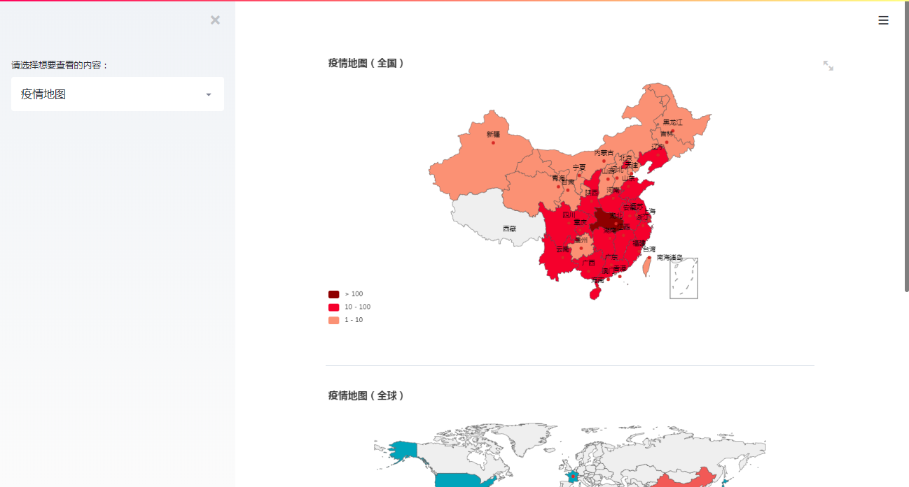
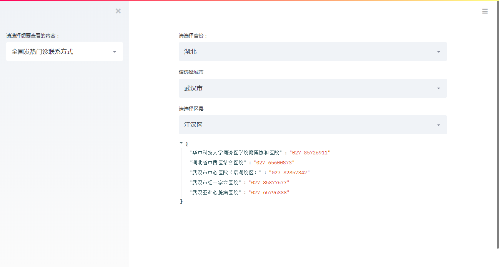
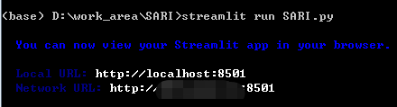
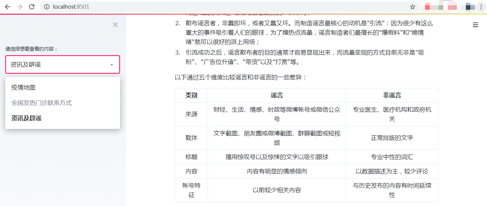
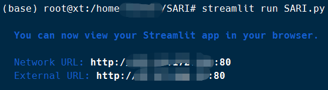

## Ⅰ. 说在前面的话
首先祝贺大家新春快乐，本该今天是一个阖家团圆的幸福节假日，但是由于近期的新型肺炎导致今年春节尤其特别。在此向奋战在一线的医护工作者以及在全国各地辛苦执勤的各部门工作人员说一声“辛苦了”！同时也提醒大家“少出门，戴口罩，勤洗手”，让我们一起击退这来势汹汹的病毒疫情。

本来我的老家也在湖北，但是在临回家前几个小时临时做决定不回去了，改在外地一个人“封闭式”地过年。除了跟亲朋好友们通过网络“云过年”之外也想做点有意义的事情。看到不少公号都及时地提供了新型肺疫情的实时动态，联想最近用来做机器学习快速应用的Streamlit框架，就想着也做一个疫情跟进的可视化小工具。

请你打开浏览器，输入以下链接：

http://www.saritrend.com/

就可以直接看到相应界面（网站目前处于备案状态，预计两到三天后可以访问）。

应用的全部源代码，我都会上传到 Github 上，可以访问这个[网址](https://github.com/xSumner/SARI_Trend)获取。

## Ⅱ. 数据获取
首先要获取详细且准确的疫情数据，由于各个公众号大部分由个人或企业运营，因此无法判断其实时性和准确性。开始我想的是从人民日报的微博数据获取， 后来发现卫健委（中国人民共和国国家卫生健康委员会）上有实时公布的疫情防控动态，这些数据是从各地方的卫健委上报而来，应该可以作为最精准的官方数据。以下为1月25日公布的最新数据：

同时再以人民日报与丁香园一起公布的数据一起，整理成两份csv格式的数据，一份是国内的的疫情数据，一份是世界的疫情数据。
使用Pandas分别读取两份数据:


```python
import pandas as pd

# 读取国内疫情数据
df_china = pd.read_csv("china_20200125.csv", encoding='utf-8', sep=",")

# 读取世界疫情数据
df_world = pd.read_csv("world_20200125.csv", encoding='utf-8', sep=",")
```


```python
df_china
```


<div>
<style scoped>
    .dataframe tbody tr th:only-of-type {
        vertical-align: middle;
    }

    .dataframe tbody tr th {
        vertical-align: top;
    }
    
    .dataframe thead th {
        text-align: right;
    }
</style>
<table border="1" class="dataframe">
  <thead>
    <tr style="text-align: right;">
      <th></th>
      <th>地区</th>
      <th>确诊</th>
      <th>死亡</th>
      <th>治愈</th>
    </tr>
  </thead>
  <tbody>
    <tr>
      <th>0</th>
      <td>湖北</td>
      <td>730</td>
      <td>39.0</td>
      <td>32.0</td>
    </tr>
    <tr>
      <th>1</th>
      <td>广东</td>
      <td>78</td>
      <td>NaN</td>
      <td>2.0</td>
    </tr>
    <tr>
      <th>2</th>
      <td>浙江</td>
      <td>62</td>
      <td>NaN</td>
      <td>1.0</td>
    </tr>
    <tr>
      <th>3</th>
      <td>重庆</td>
      <td>57</td>
      <td>NaN</td>
      <td>NaN</td>
    </tr>
    <tr>
      <th>4</th>
      <td>湖南</td>
      <td>43</td>
      <td>NaN</td>
      <td>NaN</td>
    </tr>
    <tr>
      <th>5</th>
      <td>安徽</td>
      <td>39</td>
      <td>NaN</td>
      <td>NaN</td>
    </tr>
    <tr>
      <th>6</th>
      <td>北京</td>
      <td>41</td>
      <td>NaN</td>
      <td>2.0</td>
    </tr>
    <tr>
      <th>7</th>
      <td>上海</td>
      <td>33</td>
      <td>NaN</td>
      <td>1.0</td>
    </tr>
    <tr>
      <th>8</th>
      <td>河南</td>
      <td>32</td>
      <td>NaN</td>
      <td>NaN</td>
    </tr>
    <tr>
      <th>9</th>
      <td>四川</td>
      <td>28</td>
      <td>NaN</td>
      <td>NaN</td>
    </tr>
    <tr>
      <th>10</th>
      <td>广西</td>
      <td>23</td>
      <td>NaN</td>
      <td>NaN</td>
    </tr>
    <tr>
      <th>11</th>
      <td>山东</td>
      <td>27</td>
      <td>NaN</td>
      <td>NaN</td>
    </tr>
    <tr>
      <th>12</th>
      <td>江西</td>
      <td>18</td>
      <td>NaN</td>
      <td>NaN</td>
    </tr>
    <tr>
      <th>13</th>
      <td>江苏</td>
      <td>18</td>
      <td>NaN</td>
      <td>1.0</td>
    </tr>
    <tr>
      <th>14</th>
      <td>海南</td>
      <td>19</td>
      <td>NaN</td>
      <td>NaN</td>
    </tr>
    <tr>
      <th>15</th>
      <td>辽宁</td>
      <td>16</td>
      <td>NaN</td>
      <td>NaN</td>
    </tr>
    <tr>
      <th>16</th>
      <td>福建</td>
      <td>18</td>
      <td>NaN</td>
      <td>NaN</td>
    </tr>
    <tr>
      <th>17</th>
      <td>黑龙江</td>
      <td>9</td>
      <td>1.0</td>
      <td>NaN</td>
    </tr>
    <tr>
      <th>18</th>
      <td>天津</td>
      <td>10</td>
      <td>NaN</td>
      <td>NaN</td>
    </tr>
    <tr>
      <th>19</th>
      <td>河北</td>
      <td>8</td>
      <td>1.0</td>
      <td>NaN</td>
    </tr>
    <tr>
      <th>20</th>
      <td>山西</td>
      <td>6</td>
      <td>NaN</td>
      <td>NaN</td>
    </tr>
    <tr>
      <th>21</th>
      <td>云南</td>
      <td>11</td>
      <td>NaN</td>
      <td>NaN</td>
    </tr>
    <tr>
      <th>22</th>
      <td>香港</td>
      <td>5</td>
      <td>NaN</td>
      <td>NaN</td>
    </tr>
    <tr>
      <th>23</th>
      <td>陕西</td>
      <td>15</td>
      <td>NaN</td>
      <td>NaN</td>
    </tr>
    <tr>
      <th>24</th>
      <td>贵州</td>
      <td>4</td>
      <td>NaN</td>
      <td>NaN</td>
    </tr>
    <tr>
      <th>25</th>
      <td>吉林</td>
      <td>4</td>
      <td>NaN</td>
      <td>NaN</td>
    </tr>
    <tr>
      <th>26</th>
      <td>甘肃</td>
      <td>4</td>
      <td>NaN</td>
      <td>NaN</td>
    </tr>
    <tr>
      <th>27</th>
      <td>宁夏</td>
      <td>3</td>
      <td>NaN</td>
      <td>NaN</td>
    </tr>
    <tr>
      <th>28</th>
      <td>台湾</td>
      <td>3</td>
      <td>NaN</td>
      <td>NaN</td>
    </tr>
    <tr>
      <th>29</th>
      <td>新疆</td>
      <td>3</td>
      <td>NaN</td>
      <td>NaN</td>
    </tr>
    <tr>
      <th>30</th>
      <td>澳门</td>
      <td>2</td>
      <td>NaN</td>
      <td>NaN</td>
    </tr>
    <tr>
      <th>31</th>
      <td>内蒙古</td>
      <td>7</td>
      <td>NaN</td>
      <td>NaN</td>
    </tr>
    <tr>
      <th>32</th>
      <td>青海</td>
      <td>1</td>
      <td>NaN</td>
      <td>NaN</td>
    </tr>
  </tbody>
</table>
</div>


```python
df_world
```


<div>
<style scoped>
    .dataframe tbody tr th:only-of-type {
        vertical-align: middle;
    }

    .dataframe tbody tr th {
        vertical-align: top;
    }
    
    .dataframe thead th {
        text-align: right;
    }
</style>
<table border="1" class="dataframe">
  <thead>
    <tr style="text-align: right;">
      <th></th>
      <th>国家</th>
      <th>确诊</th>
      <th>死亡</th>
      <th>治愈</th>
    </tr>
  </thead>
  <tbody>
    <tr>
      <th>0</th>
      <td>China</td>
      <td>1377</td>
      <td>41.0</td>
      <td>38.0</td>
    </tr>
    <tr>
      <th>1</th>
      <td>Tailand</td>
      <td>4</td>
      <td>NaN</td>
      <td>2.0</td>
    </tr>
    <tr>
      <th>2</th>
      <td>Japan</td>
      <td>2</td>
      <td>NaN</td>
      <td>1.0</td>
    </tr>
    <tr>
      <th>3</th>
      <td>Korea</td>
      <td>2</td>
      <td>NaN</td>
      <td>NaN</td>
    </tr>
    <tr>
      <th>4</th>
      <td>United States</td>
      <td>2</td>
      <td>NaN</td>
      <td>NaN</td>
    </tr>
    <tr>
      <th>5</th>
      <td>Vietnam</td>
      <td>2</td>
      <td>NaN</td>
      <td>NaN</td>
    </tr>
    <tr>
      <th>6</th>
      <td>Singapore</td>
      <td>3</td>
      <td>NaN</td>
      <td>NaN</td>
    </tr>
    <tr>
      <th>7</th>
      <td>Nepal</td>
      <td>1</td>
      <td>NaN</td>
      <td>NaN</td>
    </tr>
    <tr>
      <th>8</th>
      <td>France</td>
      <td>2</td>
      <td>NaN</td>
      <td>NaN</td>
    </tr>
  </tbody>
</table>
</div>


## Ⅲ. 可视化展示
Streamlit本身支持altair及ploty等可视化框架，但是这些框架的地图类图表接口在国内较难使用，因此这里直接使用pyecharts制作疫情热力图后再进行页面展示。

- **pyecharts的安装：**
直接使用pip安装，然后安装对应的地图拓展包：
```
$ pip install echarts
$ pip install echarts-countries-pypkg
$ pip install echarts-china-provinces-pypkg
$ pip install echarts-china-cities-pypkg
$ pip install echarts-china-counties-pypkg
$ pip install echarts-china-misc-pypkg
$ pip install echarts-united-kingdom-pypkg
```

这里我使用的版本是 pyecharts-1.6.2，比这个高的版本应该都兼容，但注意不要使用低于1.0的版本（两个大版本）。
Pyecharts中的主要地图来源于charts模块中的 Map，因此先导入以及其他必要的模块：


```python
# 使用jupyter lab时要提前声明
from pyecharts.globals import CurrentConfig, NotebookType
CurrentConfig.NOTEBOOK_TYPE = NotebookType.JUPYTER_LAB

from pyecharts.charts import Map, Geo
from pyecharts import options as opts
```

- **世界各国疫情地图：**


```python
# 将dataframe中的数据转化为list
zone_n = df_world['国家'].tolist()
value_n = df_world['确诊'].tolist()

# 定义地图可视化函数
def map_world(nations, values):
    m = (
        Map()
        .add("", [list(z) for z in zip(nations, values)], "world")
        .set_series_opts(label_opts=opts.LabelOpts(is_show=False))
        .set_global_opts(
            title_opts=opts.TitleOpts(title="疫情地图（全球）"),
            visualmap_opts=opts.VisualMapOpts(max_=1500),
        )
    )
    return m

# 实例化地图函数
n = map_world(nations=zone_n, values=value_n)
n.render(path="世界地图.html")
```


    'D:\\work_area\\SARI\\世界地图.html'


- **国内各地疫情地图：**


```python
# 将dataframe中的数据转化为list
zone_c = df_china['地区'].tolist()
value_c = df_china['确诊'].tolist()

# 定义地图可视化函数
def map_visualmap(nations, values):
    c = (
        Map()
        .add("", [list(z) for z in zip(nations, values)], "china")
        .set_global_opts(
            title_opts=opts.TitleOpts(title="疫情地图（全国）"),
            visualmap_opts=opts.VisualMapOpts(max_=800, is_piecewise=True, pieces=[
                {"min": 100, "color": "Maroon"}, 
                {"min": 10, "max": 100, "color": "Crimson"},
                {"min": 1, "max": 10, "color": "DarkSalmon"}
            ]),
            
        )
    )
    return c

# 实例化地图函数
c = map_visualmap(nations=zone_c, values=value_c)
c.render(path="中国地图.html")
```


    'D:\\work_area\\SARI\\中国地图.html'


- 将可视化结果保存为图片

pyecharts 提供了 selenium, phantomjs 和 pyppeteer 三种方式渲染成图片，具体可以参考Pyecharts的[官方文档](http://pyecharts.org/#/zh-cn/render_images)。

这里我偷懒直接使用浏览器中打开然后另存为图片的方式,将可视化结果保存为"world_20200125.png"和"china_20200125.png"。


```python
c.render(path="test.png")
```


    'D:\\work_area\\SARI\\test.png'


## Ⅳ. 制作Web APP

Streamlit是一个使用纯Python就可以快速搭建网络应用的工具，即使完全没有web开发基础也可以直接上手。项目迭代速度较快，目前更新到Version 0.53，其使用方法可见其[接口文档](https://docs.streamlit.io/index.html)。

这里我只简单介绍代码的逻辑，以及使用到的控件作用。

- **安装Streamlit：**

在互联网上安装可以直接使用`pip install streamlit`进行安装，由于其依赖的包较多，因此在离线安装较为麻烦，
建议先在联网环境下安装成功后再将依赖包全部导入安装。

- **代码解析：**

首先引入streamlit


```python
import streamlit as st
```

然后加入侧边栏，在侧边栏中我们可以通过下拉框从三个选项中进行选择：

1. 查看疫情地图；
2. 寻找全国发热门诊联系方式；
3. 获取重要咨询以及辨别网络谣言。

Streamlit中的侧边栏控件为sidebar，下拉选择框为selectbox，代码如下：


```python
option = st.sidebar.selectbox("请选择想要查看的内容：", ("疫情地图", "全国发热门诊联系方式", "咨询及辟谣"))
```

侧边栏中的下拉框的效果如图：


从代码中可以看出，下拉框的选择结果会传递给option这个变量，因此，只要通过判断option的值就可以控制页面主要区域里的内容。

首先当我们选择疫情地图的时候直接显示绘制好的疫情地图。

Streamlit中显示图片需要调用PIL库，保证已经安装 6.2 及以上版本，使用pip安装的方法为`pip in stall pillow`

然后就可以使用以下代码在页面中显示疫情地图：


```python
from PIL import Image

if option == "疫情地图":
    image_c = Image.open('china_20200125.png')
    image_w = Image.open('world_20200125.png')
    st.image(image_c, use_column_width=True)
    st.markdown('''---''')    # 添加一条分割线
    st.image(image_w, use_column_width=True)
```

至此，我么可以得到一个Web APP的大致雏形：



但是由于疫情是动态的，疫情数据每天都有新的变化，因此可以引入时间来进行选择，根据选择的天数来查看当天的疫情地图。

同时疫情地图只能看到大致的分布，如果想要看到各个地区具体的数字还可以将dataframe直接显示出来，代码如下：


```python
import datetime
if option == "疫情地图":
    d = st.date_input("请选择想要查看的日期：", datetime.date(2020, 1, 25))
    d = d.strftime('%Y%m%d')
    try:
        image_c = Image.open('china_%s.png'%d)
        image_w = Image.open('world_%s.png'%d)
        # 读取国内疫情数据
        df_china = pd.read_csv("china_%s.csv"%d, encoding='utf-8', sep=",", index_col=0)
        # 读取世界疫情数据
        df_world = pd.read_csv("world_%s.csv"%d, encoding='utf-8', sep=",", index_col=0)
        # 显示疫情地图以及疫情数据
        st.image(image_c, use_column_width=True)
        st.table(df_china.style.highlight_max(axis=0))
        st.markdown('''---''')
        st.image(image_w, use_column_width=True)
        st.table(df_world.style.highlight_max(axis=0))
    except:
        st.write("抱歉，没有当天的数据！")
```

这样，“疫情地图”部分基本完成，下面就是进行“全国发热门诊联系方式”相关内容的展示。

由获取的数据可知，全国各个地市有多家发热门诊，使用嵌套字典的数据结构可以进行较为方便的查询。

同样通过丁香园提供的[数据](https://assets.dxycdn.com/gitrepo/tod-assets/output/default/pneumonia/index.htm)，搜集整理成字典结构，然后使用python的pickle模块将数据存储在fever_clinic.pkl文件当中。

这部分数据在网络上都是非机构化的数据，而且有些地市放出来的只是Excel截图，因此我在后续会逐步转化为结构化数据并放在Github项目文档中。

这里在界面只通过两个下拉框选择后进行检索就可以了，暂时不用稍复杂的搜索模糊匹配（后面也可能会加上）。


```python
if option == "全国发热门诊联系方式":
    province = st.selectbox("请选择省份：", province_tuple)
    city = st.selectbox("请选择城市", city_tuple)
    county = st.selectbox("请选择区县", county_tuple)
    st.write(hospitals[province][city][county])
```

这样就会将选择区域内的发热门诊及联系方式显示出来，由于数据是以JSON的形式存储在pickle中，所以显示的也是JSON结构。

如果想要对数据的显示进一步处理为表格等样式也可以。

效果显示如下图：



最后一个栏目就是“资讯与辟谣”，其实这块内容也比较发散。
目前腾讯官方已经上线了辟谣和最新资讯功能，具体见[链接](https://news.qq.com/zt2020/page/feiyan.htm)。

如果我们想要自己发布一些文字为主的内容，Streamlit里面的markdown模块可以很好的支持文本类数据。

授人以鱼不如授人以渔，这里我就以数据分析的思路对一些谣言进行谣言进行特征提取，方便大家在官方辟谣之前对谣言进行一定的鉴别。
当然如果积累的样本多了，还可以使用机器学习的方法对谣言进行自动识别。

可以先看一下丁香园提供的“谣言排行榜”：

|   NO.1    |        熏醋可以杀死新型冠状病毒？        |
| :-------: | :--------------------------------------: |
| **NO.2**  |      抗流感药物可以预防新型冠状病毒      |
| **NO.3**  |         有疫情的地方才需要戴口罩         |
| **NO.4**  |            出门需要佩戴护目镜            |
| **NO.5**  |           开空调暖气能杀死病毒           |
| **NO.6**  |  益生菌、乳铁蛋白可以增加抵抗力预防病毒  |
| **NO.7**  |  奥司他韦、板蓝根等可以用来预防新型肺炎  |
| **NO.8**  | 病毒只传给大人不传染给孩子，婴幼儿很安全 |
| **NO.9**  |           开空调暖气能杀死病毒           |
| **NO.10** |          盐水漱口能预防冠状病毒          |
| **NO.11** |        饮用高度酒能够抵抗冠状病毒        |
| **NO.12** |     只要不吃野味、海鲜，就不会被感染     |
| **NO.13** |       服用 VC 可以预防新型冠状病毒       |
| **NO.14** |     病毒感染的都是老年人，年轻人没事     |

与此同时腾讯较真上实时辟谣在1月26号主要是有关“封城”、“采访”等民众比较关心的实时问题，丁香园上排名的谣言是防护预防这些前期累积了一段时间的谣言。所以可见谣言也是与时俱进的，时刻把握住了普罗大众的焦点。

因为没有来得及一条一条地分析所有的谣言，我这边只是凭经验描述一下谣言的一些特点：

1. 除了官媒之外，民众获取信息最快的渠道目前莫过于“微博”、“微信公众号”以及“微信群聊”，而这“三股交流道”也是谣言最主要的扩散方式；
2. 散布谣言者，非蠢即坏，或者又蠢又坏。而制造谣言最核心的动机是“引流”：因为很少有这么重大的事件吸引着人们的眼球，为了蹭热点流量，谣言制造者们最擅长的“爆假料”和“煽情绪”就可以很好的派上用场；
3. 引流成功之后，谣言散布者的目的通常才容易显现出来，而流量变现的方式目前无非是“吸粉”、“广告位升值”、“带货”以及“打赏”等。

以下通过五个维度比较谣言和非谣言的一些差异：

|   类别   |                     谣言                     |            非谣言            |
| :------: | :------------------------------------------: | :--------------------------: |
|   来源   | 财经、生活、情感、时政等微博帐号或微信公众号 | 专业医生、医疗机构和政府机关 |
|   载体   | 文字截图、朋友圈或微博截图、群聊截图或短视频 |        正常排版的文字        |
|   标题   |      擅用惊叹号以及惊悚的文字以吸引眼球      |        专业中性的词汇        |
|   内容   |             内容有明显的情感倾向             |   以数据描述为主，较少评论   |
| 帐号特征 |               以前较少相关内容               | 与历史发布的内容有时间延续性 |

这里暂时先不做量化指标，只是将以上文字以markdown形式发布在页面上，相应代码为：


```python
if option == "资讯及辟谣":
    st.markdown(rumor_content)
```

- 运行APP

如果想要运行我们做好的WEB APP，在配置好环境后直接运行主程序即可，运行命令为：

`streamlit run SARI.py`

如果实在本地运行，那么运行成功后会如下图显示：



然后通过http://localhost:8501/ 访问即可，streamlit默认的端口是8501：



如果是通过远程云服务器运行，那么运行后会显示对应的访问URL：



注意这里我将访问端口从默认的8501改为了80，具体修改方式可以查询streamlit官方文档，这里就不赘述了。

Ⅴ. 总结

在这篇文章中我描述了一个非常简单的基于数据分析的WEB APP制作流程，麻雀虽小五脏俱全，这其中包括数据的采集、可视化分析以及使用streamlit快速搭建网络服务。虽然数据清洗部分略过，也没有引入什么复杂的机器学习算法，但是基本上覆盖了主要流程，而且代码100%使用Python, 简单好上手。

目前网上已经有了不少跟踪疫情进展的服务，这里并不是推荐大家重复造轮子。只是今年春节大家在被SARI“封锁”在家中，如果无事可以顺便学习一下已经非常主流的pyecharts和即将变为主流的streamlit。

最后还是提醒大家注意防护，共同抗击这次的新型冠状病毒肺炎，也请勿听信谣言，相信国家和政府能够带领大家共渡难关。

所有的代码和数据都会逐步上传到[项目](https://github.com/xSumner/SARI_Trend)中，请大家及时关注。

