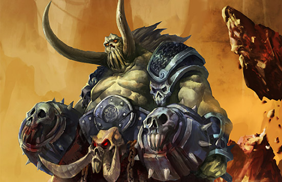

# 数据分析师之后，我们何去何从？

当我们离开学校，出现在新手村，手拿着木剑身着粗布衣，准备冲出去大干一番。

环顾四周，却发现不知道从哪里开始。

好不容易明白了业务，熟悉了常用的工具，了解了如何处理日常的各种工作以及与同事、客户打交道。逐渐也有了一些完成工作的成就感。

然而有一天，你在跟客户进行交流的时候，当你正想纠正一下客户的思路时，客户突然怼你：你就按照我说得来，你把你数据提取的本质工作做好就行了。顿时如一当头棒喝，原来在客户眼中，你还只是个“提数工程师”。

“提数工程师”只是个戏称，真正 ETL 工程师的工作把工程团队的模块产生的数据，不管是日志、数据表，还是埋点的数据，进行清洗、转换，建模成利于数据分析的数据。ETL 是 Extract – Transform – Load 的缩写。虽然很多工作可能有人工写脚本的操作，但是严谨准确的操作以及对数据库、操作系统的熟悉让他们在整个数据分析的过程中必不可少。

客户的无心之言却深深地刺激到你了，从此你立下决心，怒刷算法。过了一年半载，不管是周志华的西瓜书还是李航统计学书中的公司，你都可以随手推断。在jupyter notebook中调用Scikit-Learn，TensorFlow进行机器学习任务，再用Bokeh或者plotly输出个精美的分析图表都不在话下。这时候一个人面对客户时随便就掏出各种算法把客户唬得一愣一愣的，公司销售也对你赞赏有加，同你建立了不可持续性的酒肉友谊。

都说三角关系是最牢靠的，你以为你和客户、公司销售三个人就像蜜月期里的情侣，直到有天你听到销售当着你和客户A的面给客户B打电话。“王总呐，听说你找小张有一些需求，可他这会在新疆走不开。急缺人呐，那我让公司派小李去您那，再不行再加个小陈！反正我们是按人头收费的，价格公道，童叟无欺~诶，对对对...”那一刻你终于明白了，果然你和客户、公司销售是蜜月期里的情侣，只不过他们才是一对儿，你只是他们的“心形石头”。

由于大数据行业发展的前沿性，导致这时候的你有些失落和沮丧，网上寻找资料，最后对于职位的分类大致是这么几种：

- 计算机科学家：研究数学模型，开发算法。
- 数据收集/处理专家：如何获取语言数据/双语数据；网上爬取，购买，标注，过滤，分析，生成。
- 软件工程师：编写软件/代码实现算法，测试，发布产品。
- 数据平台工程师：负责数据平台的研发，牵涉到从数据采集到分析的相关组件开发。
- 数据挖掘工程师：利用机器学习/数据挖掘相关技术，研发算法模型，用于个性化推荐、用户画像、精准广告等。

- 数据产品经理：把数据相关的需求抽象为数据平台的功能产品。

这些职业都是有自生的专业背景，而半路出家的你，再次陷入了迷茫。曾经与客户还有同事之间的甜蜜也似乎也显露出了一丝丝无味。回头望向城外，却发现技术和市场日行月起，各路兵马一顿厮杀。

兵荒马乱之中，你又看到了几个特别恐怖的怪物，给我军阵营带来了步步杀机。

**分布式异构计算机系统**

大数据的发展带来了分布式计算机系统，人工智能的发展带来了GPU、FPGA、ASIC等不一样的计算单元，物联网的发展又带来了边缘计算的需求。这一切都是那么复杂难懂，而与业务场景进行结合更是难上加难，如何高效熟练地解决这个怪物成为横立在友军前的一个难点。

**高可用、高并发、高实时系统架构**

人们对在线服务的需求日益增多，5G时代的到来势必会在现有的基础上引入更多的数据。如何在数据爆炸的年代有效可靠并且实时地提供各类服务，这个是每家公司都不得不面对的问题。

**AI场景落地**

有一个笑话说："PPT是AI界最好的语言"。不过现在人工智能的泡沫逐渐会散去，浪潮退去之后自然会看见谁是在裸泳。AI能够有效地解决一些问题，如何将其更好地和业务去结合，是各方都关心的现实。

**大数据运维**

己方个个都是好手，他们骁勇善战但是被敌军冲击的七零八落，只能各自为战，这时我们的传令兵要怎么去通知他们一起合歼对方大BOSS？微服务带来了各种好处，也带来了许多新的问题。还好这时我们手上有了很好的武器，只是要把这个武器及时投送到战场上去。

还有更多的怪物在向我们步步逼近，前方的友军也被逐渐逼退到城墙脚下。还好此时从远方走来了几位新的英雄，他们身上闪亮的盔甲还有武器上萦绕着的魔法，吸引着你讶异的目光。

这三个全新的英雄人物，不仅给战场带来了转机，是不是也给身在数据分析师甚至"提数工程师"的职位上彷徨的你带来了几道曙光。

这里我们先简要地看一看这三位新英雄的技能树，同时对比一下数据分析师常有的技能树。后面有机会再详细聊一聊数据分析师之后的进阶之路。

**数据分析师与ETL工程师**

- 数据结构与算法
    - 语言基础（此处推荐Python）
    - 算法分析
    - 基本数据结构类型
    - 递归
    - 排序与搜索
    - 树和树算法
    - 图和图算法
- 数据库与操作系统
    - Linux系统基础
    - 关系型数据库
    - NOSQL数据库
    - 海量数据库
- 统计机器学习
    - 模型评估
    - 线形模型
    - 贝叶斯模型
    - 集成学习
    - 聚类算法
    - 特征选择
    - 半监督学习
    - 神经网络
- 业务分析
    - 数据可视化
    - 文档撰写
    - 业务知识

**AI架构师**

- 数据库与消息中间件
    - MongoDB
    - Elasticsearch
    - Neo4j
    - Redis
    - Kafka
    - RabbitMQ
    - ActiveMQ
- 大数据平台
    - Hadoop
    - Spark
    - Flink
- 深度学习框架及应用
    - PyTorch\TensorFlow\PaddlePaddle
    - 自动机器学习（AutoML）
    - 图神经网络算法
    - 推荐算法
    - 自然语言处理（NLP）
    - 计算机视觉（CV）
    - 音频信号处理（ASP）
- 系统架构设计
- 运维架构设计
    - Kubernetes
    - Prometheus
- AIOT（人工智能物联网）
    - TensorFlow-Lite
- 业务沟通能力和系统性思考能力

**AI产品经理**

- AI 基础知识
    - 领域术语
    - 技术架构
    - 数据类型
    - 测试方法
- 平台和硬件支撑
    - 云计算
    - 大数据
    - 人工智能平台
    - 智能芯片
    - 传感器
- Al核心技术
    - 自然语言处理
    - 语音识别
    - 图像识别
    - 人机交互
    - 虚拟现实
- Al产品类型
    - 语音和文字处理
    - 视觉识别
    - 大数据分析预测
- Al行业知识
    - 行业特点
    - 商业模式
    - 政府管制
    - 行业整合
    - 行业趋势
    - 竞争力因素
- AI 产品需求分析
    - 功能性需求分析
    - 非功能性需求分析
        - 安全性
        - 可用性
        - 可靠性
        - 性能
        - 可持续性
- AI 产品体系
    - 基础设施
        - 传感器
        - 芯片
        - 基础平台
    - 数据采集
        - 数据来源
        - 数据质量
    - 数据处理
    - 系统协调
    - 运维管理
- 人工智能产品开发
    1. 设定清晰的目标（场景描述、痛点来源、痛点全方位剖析、市场分析）
    2. 技术预研（领域技术基本现状和趋势、领域前沿技术、常见技术逻辑、判断技术切入点）
    3. 需求分析和产品设计（少即是多原则、从微观到宏观逐步深入、放宽眼界有效整合资源、同理心、）
    4. 合理制定产品需求优先级（卡诺模型、相似组分类法、加权得分法、价值VS复杂度矩阵）
    5. 充分参与研发过程（提供优质数据、模型训练、测试调优、目标管控）
    6. 持续的产品运营

**AI业务专家**

- 人工智能领域在学术界和应用的前瞻性
    - 结合实际业务场景规划AI产品
    - 把握未来短期该领域方向
- 机器学习、深度学习领域相关技术、方法、工具
    - TensorFlow
    - Torch
    - PaddlePaddle
- 学习和研究能力
- 沟通能力
    - 与客户沟通
    - 与团队沟通
- 项目管理能力
- 良好团队合作精神
- 抗压能力

互联网行业中的“低垂果实”基本已被摘掇干净，而要想在新的时代绽放自己，我们就要继续眼光向远处看，双手向上够。

