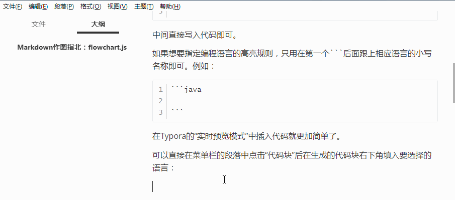
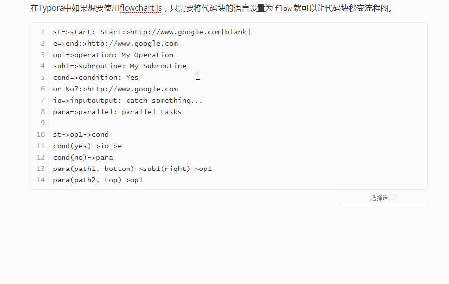
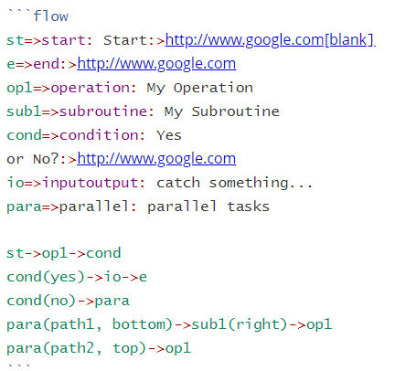

# Markdown作图指北：flowchart.js

> 从去年起，我就将手上的部分文档逐步转化成后缀为**.md**的格式保存。最开始的原因是我不希望图片在被插入到word中后有压缩，以及代码中的缩进不会被奇怪地改变。随着我对markdown的语法越来越熟悉，后面我基本上完全放弃了使用微软的传统办公三件套。Markdown的方便易用以及多平台的兼容性。让它已经成为了我日常的一个高效生产力工具。这里我想写两个小短篇分享Markdown中的进阶绘图技巧，用到的是使用JavaScript开发的flowchart.js和mermaid.js。

>古人语，上北下南，此篇即为上，主要讲解如何在Markdown中使用flowchart.js。

Markdown 是由约翰·格鲁伯（John Gruber）于2004年创建一种轻量级标记语言。它允许人们使用易读易写的纯文本格式编写文档，并且可以导出为 HTML 、Word、图像、PDF、Epub 等多种格式的文档。

Markdown 有多款优秀的编辑器，这里我使用的是一款**支持实时预览的免费编辑器**：Typora。


## Ⅰ. 基础操作

在Typora中有“实时预览模式”和“源代码模式”，可以直接通过快捷键组合 `Ctrl+/` 进行切换。

在“源代码模式”中是直接写Markdown源码的，相比之下我更习惯于在“实时预览模式”中直接通过各类快捷键组合进行编辑，这也是Typora这款软件的强大之处。

在“源代码模式”中插入代码块的方式是直接输入：

```
​```

​```
```

中间直接写入代码即可。

如果想要指定编程语言的高亮规则，只用在第一个```后面跟上相应语言的小写名称即可。例如：

```
​```java

​```
```

在Typora的“实时预览模式”中插入代码就更加简单了。

可以直接在菜单栏的段落中点击“代码块”后在生成的代码块右下角填入要选择的语言：



或者使用快捷键组合 `Ctrl+Shift+K` 快速插入。

在Typora中如果想要使用flowchart.js，只需要将代码块的语言设置为`flow`就可以让代码块秒变流程图。







## Ⅱ. flowchart.js 简介

flowchart.js是一个用来制作流程图的领域特定语言（DSL），可以在浏览器或终端中生成可缩放矢量图形（SVG）。目前版本号为 `v1.13.0` 。

>领域特定语言（Domain Specific Language, DSL）是一种为解决特定领域问题而对某个特定领域操作和概念进行抽象的语言。

项目官网：http://flowchart.js.org/

Github地址为：https://github.com/adrai/flowchart.js

flowchart.js最大的特点是在流程图中的节点与连接是分开定义的。这样做的好处是节点可以被快速复用，连接也可以很方便地被修改。

如官方示例代码：

```
st=>start: Start:>http://www.google.com[blank]
e=>end:>http://www.google.com
op1=>operation: My Operation
sub1=>subroutine: My Subroutine
cond=>condition: Yes
or No?:>http://www.google.com
io=>inputoutput: catch something...
para=>parallel: parallel tasks

st->op1->cond
cond(yes)->io->e
cond(no)->para
para(path1, bottom)->sub1(right)->op1
para(path2, top)->op1
```

代码前半部分是节点类型及属性的定义，后半部分是定义节点之间的连接方式。

语法非常简洁易懂，最后得到的图形为：


节点的语法为：

`nodeName=>nodeType: nodeText[|flowstate][:>urlLink]`

其中`[]`中的内容为可选项，以下逐个解释各项的含义。

- *nodeName* 节点名称：定义流程图文件当中节点变量的名称。
- *nodeType* 节点类型：定义节点所属的类型。
- *nodeText* 节点文本：节点中插入的文本，会在流程图中显示。
- *flowstate* 流程状态：可选项，使用 `|` 算子来为节点定义额外的样式。
- *urlLink* URL链接：可选项，使用 `:>` 算子来关联指向的链接。

节点类型


## Ⅲ. flowchart.js实例

```flow
st=>start: Start|past:>http://www.google.com[blank]
e=>end: End:>http://www.google.com
op1=>operation: My Operation|past:$myFunction
op2=>operation: Stuff|current
sub1=>subroutine: My Subroutine|invalid
cond=>condition: Yes
or No?|approved:>http://www.google.com
c2=>condition: Good idea|rejected
io=>inputoutput: catch something...|request
para=>parallel: parallel tasks

st->op1(right)->cond
cond(yes, right)->c2
cond(no)->para
c2(true)->io->e
c2(false)->e

para(path1, bottom)->sub1(left)->op1
para(path2, right)->op2->e
```


```flow
st=>start: Start:>http://www.google.com[blank]
e=>end:>http://www.google.com
op1=>operation: My Ooooperation:$myFunction
sub1=>subroutine: My Subroutine
cond=>condition: Yes
or No?:>http://www.google.com
io=>inputoutput: catch something...

st->op1->cond
cond(yes)->io->e
cond(no)->sub1(right)->op1
```

```flow
st=>start: Start:>http://www.google.com[blank] 
e=>end:>http://www.google.com 
op1=>operation: My Operation 
sub1=>subroutine: My Subroutine 
cond=>condition: Yes or No?:>http://www.google.com 
io=>inputoutput: catch something... 
para=>parallel: parallel tasks 

st->op1->cond 
cond(yes)->io->e 
cond(no)->para 
para(path1, bottom)->sub1(right)->op1 
para(path2, top)->op1
```


```flow
st=>start: Start|past:>http://www.google.com[blank] 
e=>end: End|future:>http://www.google.com 
op1=>operation: My Operation|past 
op2=>operation: Stuff|current 
sub1=>subroutine: My Subroutine|invalid 
cond=>condition: Yes or No?|approved:>http://www.google.com 
c2=>condition: Good idea|rejected 
io=>inputoutput: catch something...|future 

st->op1(right)->cond 
cond(yes, right)->c2 
cond(no)->sub1(left)->op1 
c2(yes)->io->e 
c2(no)->op2->e
```

```flow
st=>start: Improve your l10n process! 
e=>end: Continue to have fun!:>https://youtu.be/YQryHo1iHb8[blank] 
op1=>operation: Go to locize.com:>https://locize.com[blank] 
sub1=>subroutine: Read the awesomeness 
cond(align-next=no)=>condition: Interested to getting started? 
io=>inputoutput: Register:>https://www.locize.app/register[blank] 
sub2=>subroutine: Read about improving your localization workflow or another source:>https://medium.com/@adrai/8-signs-you-should-improve-your-localization-process-3dc075d53998[blank] 
op2=>operation: Login:>https://www.locize.app/login[blank] 
cond2=>condition: valid password? 
cond3=>condition: reset password? 
op3=>operation: send email 
sub3=>subroutine: Create a demo project 
sub4=>subroutine: Start your real project 
io2=>inputoutput: Subscribe 

st->op1->sub1->cond 
cond(yes)->io->op2->cond2 
cond2(no)->cond3 
cond3(no,bottom)->op2 
cond3(yes)->op3 
op3(right)->op2 
cond2(yes)->sub3 
sub3->sub4->io2->e 
cond(no)->sub2(right)->op1 

st@>op1({"stroke":"Red"})@>sub1({"stroke":"Red"})@>cond({"stroke":"Red"})@>io({"stroke":"Red"})@>op2({"stroke":"Red"})@>cond2({"stroke":"Red"})@>sub3({"stroke":"Red"})@>sub4({"stroke":"Red"})@>io2({"stroke":"Red"})@>e({"stroke":"Red","stroke-width":6,"arrow-end":"classic-wide-long"})
```


## Ⅳ. 小结

掌握四种表示类型：start,end,condition,operation


```
start=>start: 开始
isLogin=>condition: 是否登录
login=>operation: 登录
view=>operation: 浏览
end=>end: 结束

start->isLogin
isLogin(no)->login->view
isLogin(yes)->view
view->end
```

```flow
start=>start: 开始
isLogin=>condition: 是否登录
login=>operation: 登录
view=>operation: 浏览
end=>end: 结束

start->isLogin
isLogin(no)->login->view
isLogin(yes)->view
view->end
```


```
st=>start: Start|past:>http://www.google.com[blank]
e=>end: End:>http://www.google.com
op1=>operation: My Operation|past
op2=>operation: Stuff|current
sub1=>subroutine: My Subroutine|invalid
cond=>condition: Yes
or No?|approved:>http://www.google.com
c2=>condition: Good idea|rejected
io=>inputoutput: catch something...|request

st->op1(right)->cond
cond(yes, right)->c2
cond(no)->sub1(left)->op1
c2(yes)->io->e
c2(no)->op2->e
```


```flow
st=>start: Start|past:>http://www.google.com[blank]
e=>end: End:>http://www.google.com
op1=>operation: My Operation|past
op2=>operation: Stuff|current
sub1=>subroutine: My Subroutine|invalid
cond=>condition: Yes
or No?|approved:>http://www.google.com
c2=>condition: Good idea|rejected
io=>inputoutput: catch something...|request

st->op1(right)->cond
cond(yes, right)->c2
cond(no)->sub1(left)->op1
c2(yes)->io->e
c2(no)->op2->e
```

上面的这段Markdown流程图代码可以看做是一种进阶版流程图
**type类型由原来的四种增加到了六种，这六种分别是**

- start   **表示开始，以椭圆形表示**
- condition   **表示条件，以菱形四边形表示**
- operation   **表示操作，以矩形形表示**
- subroutine   **表示子程序，以三格矩形表示，这个就是多任务分支的一种形式**
- inputoutput   **表示输入输出流，以平行四边形形表示**
- end   **表示结束，以椭圆形表示**

**然后各个类型的type都可以用()来表示流程的走向**

- right **向右**
- left  **向左**
- up  **向上**
- down **向下，这个是默认选项**

**元素样式：使用| type来表示，目前有七种样式**

- ‘past’ : { ‘fill’ : ‘#CCCCCC’, ‘font-size’ : 12},
- ‘current’ : {‘fill’ : ‘yellow’, ‘font-color’ : ‘red’, ‘font-weight’ : ‘bold’},
- ‘future’ : { ‘fill’ : ‘#FFFF99’},
- ‘request’ : { ‘fill’ : ‘blue’},
- ‘invalid’: {‘fill’ : ‘#444444’},
- ‘approved’ : { ‘fill’ : ‘#58C4A3’, ‘font-size’ : 12, ‘yes-text’ : ‘APPROVED’, ‘no-text’ : ‘n/a’ },
- ‘rejected’ : { ‘fill’ : ‘#C45879’, ‘font-size’ : 12, ‘yes-text’ : ‘n/a’, ‘no-text’ : ‘REJECTED’ }

**使用:>地址[打开方式]来跟流块内的文字绑上链接,打开方式跟HTML中一致，如下：**  

- _blank — 在新窗口中打开链接
- _parent — 在父窗体中打开链接
- _self — 在当前窗体打开链接,此为默认值
- _top — 在当前窗体打开链接，并替换当前的整个窗体(框架页)


