# Markdown最新作图指南：flowchart.js & mermaid.js

> 从去年开始，我就逐步将手上的文档转化成后缀为**.md**的格式保存。最初的原因是我希望图片不会在文档中被压缩，以及代码块有语法高亮和正确的缩进。随着对markdown语法的熟悉，现在我基本上可以完全弃用微软的传统办公三件套。Markdown的方便易用以及多平台的兼容性。让它已经成为了我日常的一个高效生产力工具。这里我想分享一下Markdown中最新的绘图功能，目的是为了能部分取代Office中的Visio工具。


Markdown 是由约翰·格鲁伯（John Gruber）于2004年创建一种轻量级标记语言。它允许人们使用易读易写的纯文本格式编写文档，并且可以导出为 HTML 、Word、图像、PDF、Epub 等多种格式的文档。

Markdown 有多款优秀的编辑器，这里我使用的是一款**支持实时预览的免费编辑器**：Typora。

在Typora中有“实时预览模式”和“源代码模式”，可以直接通过快捷键组合 `Ctrl+/` 进行切换。

在“源代码模式”中是直接写Markdown源码的，相比之下我更习惯于在“实时预览模式”中直接通过各类快捷键组合进行编辑，这也是Typora这款软件的强大之处。

在“源代码模式”中插入代码块的方式是直接输入：

```
​```

​```
```

中间直接写入代码即可。

如果想要指定编程语言的高亮规则，只用在第一个```后面跟上相应语言的小写名称即可。例如：

```java
​```java
public class Hello {
    public static void main(String[] args) {
        System.out.println("Hello, world!");
    }
}
​```
```

在Typora的“实时预览模式”中插入代码就更加简单了。可以直接在菜单栏的段落中点击“代码块”后在生成的代码块右下角填入要选择的语言：


或者使用快捷键组合 `Ctrl+Shift+K` 快速插入。

Markdown本身没有作图功能，但是由于其优秀的设计理念和简洁的语法风格，吸引了很多开发者设计了兼容的领域特定语言（DSL）。

>领域特定语言（Domain Specific Language, DSL）是一种为解决特定领域问题而对某个特定领域操作和概念进行抽象的语言。

其中就包括本文主要讲到的两个JavaScript项目：

- **flowchart.js**

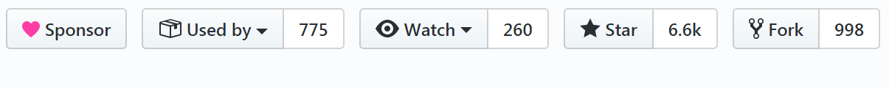

- **mermaid.js**

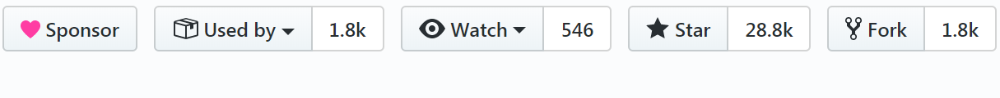

下面分别介绍如何在Markdown编辑器中使用这两个开源项目绘制常用图形。


## <font color=red>上篇：flowchart.js</font>

### Ⅰ. flowchart.js 简介

flowchart.js是一个用来制作流程图的领域特定语言（DSL），可以在浏览器或终端中生成可缩放矢量图形（SVG）。目前版本号为 `v1.13.0` 。

项目官网：http://flowchart.js.org/

Github地址为：https://github.com/adrai/flowchart.js

在Typora中如果想要使用flowchart.js，只需要将代码块的语言设置为`flow`就可以让代码块秒变流程图。


flowchart.js最大的特点是在流程图中的节点与连接是分开定义的。这样做的好处是节点可以被快速复用，连接也可以很方便地被修改。

如官方示例代码：

```
st=>start: Start:>http://www.google.com[blank]
e=>end:>http://www.google.com
op1=>operation: My Operation
sub1=>subroutine: My Subroutine
cond=>condition: Yes
or No?:>http://www.google.com
io=>inputoutput: catch something...
para=>parallel: parallel tasks

st->op1->cond
cond(yes)->io->e
cond(no)->para
para(path1, bottom)->sub1(right)->op1
para(path2, top)->op1
```

代码前半部分（1-8行）是节点类型及属性的定义，后半部分（10-14行）是定义节点之间的连接方式。

语法非常简洁易懂，最后得到的图形为：

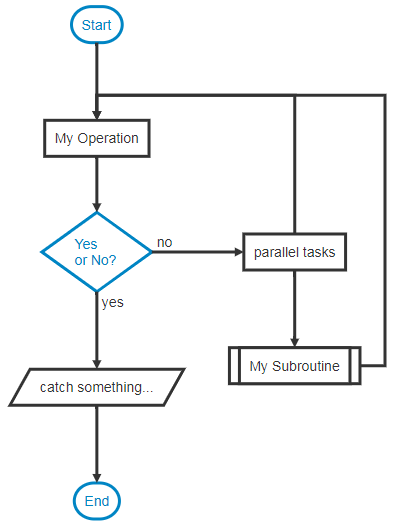

### Ⅱ. flowchart.js语法

流程图的主要组成就是节点和节点之间的关系。

#### 1. 节点语法

**节点的语法**可以概括为：

`nodeName=>nodeType: nodeText[|flowstate][:>urlLink]`

其中`[]`中的内容为可选项，其他各项的含义如下：

- *nodeName* 节点名称：定义流程图文件当中节点变量的名称。
- *nodeType* 节点类型：定义节点所属的类型。
- *nodeText* 节点文本：节点中插入的文本，会在流程图中显示。
- *flowstate* 流程状态：可选项，使用 `|` 算子来为节点定义额外的样式。
- *urlLink* URL链接：可选项，使用 `:>` 算子来关联指向的链接。

一共有七种节点类型。

#### 2. 节点类型

##### ① start 开始

Used as the first node where flows start from. Default text is `Start`.

[](https://github.com/adrai/flowchart.js/blob/master/imgs/start.png)

```
st=>start: start
```

##### ② end 结束	

Used as the last node where a flow ends. Default text is `End`.

[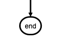](https://github.com/adrai/flowchart.js/blob/master/imgs/end.png)

```
e=>end: end
```

##### ③ operation 操作

Indicates that an operation needs to happen in the flow.

[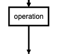](https://github.com/adrai/flowchart.js/blob/master/imgs/operation.png)

```
op1=>operation: operation
```

##### ④ inputoutput输入输出

Indicates that IO happens in a flow.

[](https://github.com/adrai/flowchart.js/blob/master/imgs/inputoutput.png)

```
io=>inputoutput: inputoutput
```

##### ⑤ subroutine 子流程

Indicates that a subroutine happens in the flow and that there should be another flowchart that documents this subroutine.

[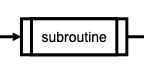](https://github.com/adrai/flowchart.js/blob/master/imgs/subroutine.png)

```
sub1=>subroutine: subroutine
```

##### ⑥ condition 条件选择

Allows for a conditional or logical statement to direct the flow into one of two paths.

[](https://github.com/adrai/flowchart.js/blob/master/imgs/condition.png)

```
cond=>condition: condition
Yes or No?
```

##### ⑦ parallel 平行流

Allows for multiple flows to happen simultaneously.

[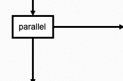](https://github.com/adrai/flowchart.js/blob/master/imgs/parallel.png)

```
para=>parallel: parallel
```

#### 3. 节点连接

Connections are defined in their own section below the node definitions. The `->` operator specifies a connection from one node to another like `nodeVar1->nodeVar2->nodeVar3`.。

Not all nodes need to be specified in one string and can be separaged like so

```
nodeVar1->nodeVar2
nodeVar2->nodeVar3
```

Connection syntax is as follows:

```
<node variable name>[(<specificaion1>[, <specification2])]-><node variable name>[[(<specificaion1>[, <specification2])]-><node variable name>]
```

Items in `[]` are optional.

以简单的登录场景为例，流程图代码和效果如下：

```
start=>start: 开始
loginInfo=>inputoutput: 登录数据
verifyLogin=>subroutine: 登录验证
isSuccess=>condition: 验证成功？
respondSuccess=>operation: 响应成功
responseFailure=>operation: 响应失败
end=>end: 结束

start->loginInfo->verifyLogin->isSuccess
isSuccess(yes)->respondSuccess->end
isSuccess(no)->responseFailure->end
```

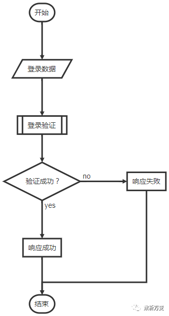

可以看到，其中的 `isSuccess `是一个 `condition `类型的节点，所以在连接中要分别用 `(yes)` 和 `(no)` 标明相应的流向。

##### *连接方向

在上述例子中，流程图会自动根据连接的定义来选择对线条进行布局。同时也可以使用下面四个关键字来调整线条的位置，以便使流程图更加清晰。

- left
- right
- top
- bottom

例如以下代码的流程图中，如果使用默认模式，会让线条之间出现重叠：

```
start=>start: start
operation1=>operation: operation1
isSuccess=>condition: success?
operation2=>operation: operation2
operation3=>operation: operation3
operation4=>operation: operation4
end=>end: 结束

start->operation1->isSuccess
isSuccess(yes)->operation2->end
isSuccess(no)->operation3->operation4->operation1
```

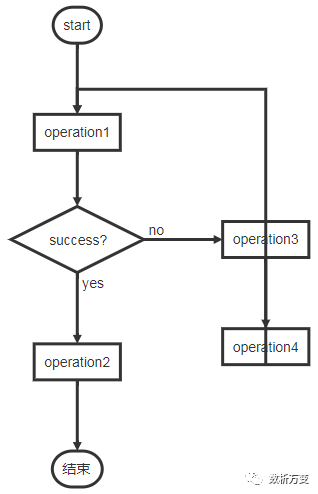

此时只要给`operation4`元素添加`right`关键字，就可以分离重叠的线条。

```
start=>start: start
operation1=>operation: operation1
isSuccess=>condition: success?
operation2=>operation: operation2
operation3=>operation: operation3
operation4=>operation: operation4
end=>end: 结束

start->operation1->isSuccess
isSuccess(yes)->operation2->end
isSuccess(no)->operation3->operation4(right)->operation1
```

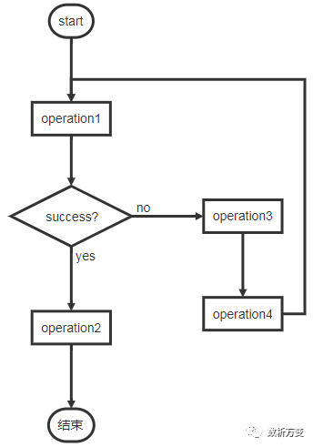

如果给condition元素添加这些关键字的话会调整整个分支的方向：

```
start=>start: start
operation1=>operation: operation1
isSuccess=>condition: success?
operation2=>operation: operation2
operation3=>operation: operation3
operation4=>operation: operation4
end=>end: 结束

start->operation1->isSuccess
isSuccess(yes)->operation2->end
isSuccess(no,left)->operation3->operation4(left)->operation1
```

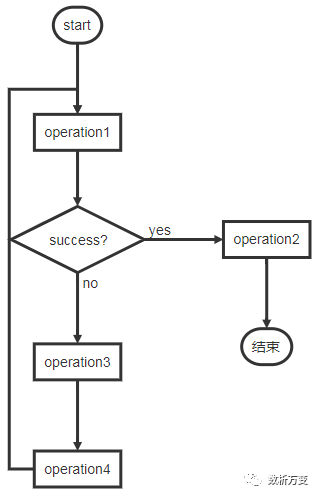

#### ~~4. 节点状态标注~~

Each node variables has optional specifiers, like direction, and some have special specifiers depending on the node type that are defined below. Specifiers are added after the variable name in `()` and separated with `,` like `nodeVar(spec1, spec2)`.

##### start

Optional direction

```
startVar()->nextNode
```

##### end

No specifications because connections only go to the end node and do not leave from it.

```
previousNode->endVar
```

##### operation

Optional direction

```
operationVar()->nextNode
```

##### inputoutput

Optional direction

```
inputoutputVar()->nextNode
```

##### subroutine

Optional direction

```
subroutineVar()->nextNode
```

##### condition

Required logical specification of `yes` or `no`

Optional direction

```
conditionalVar(yes, <direction>)->nextNode1
conditionalVar(no,  <direction>)->nextNode2
```

##### parallel

Required path specification of `path1`, `path2`, or `path3`

Optional direction

```
parallelVar(path1, <direction>)->nextNode1
parallelVar(path2, <direction>)->nextNode2
parallelVar(path3, <direction>)->nextNode3
```

状态标记：Markdown会使用不同的颜色来标记状态，状态主要有以下几种：

- past
- current
- future
- approved
- rejected
- invalid

以软件生命周期的一部分为例：

```flow
start=>start: 开始|past
requirementAnalysis=>operation: 需求分析|past
design=>operation: 软件设计|past
coding=>operation: 编码|past
selfTestingPased=>condition: 自测通过？|approved
debug=>operation: debug|invalid
submitTestingPased=>condition: 提测通过？|rejected
modifyBug=>operation: 修bug|current
deploy=>operation: 部署|future
end=>end: 结束|future

start->requirementAnalysis->design->coding->selfTestingPased
selfTestingPased(no)->debug(right)->selfTestingPased
selfTestingPased(yes)->submitTestingPased
submitTestingPased(yes)->deploy->end
submitTestingPased(no)->modifyBug(right)->submitTestingPased
```


#### 5. 节点链接

可以在节点定义后面使用`:>` 运算符添加一个外链，节点的颜色也会变为蓝色。

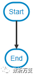

```
st=>start: Start:>http://www.google.com[blank]
e=>end: End:>http://www.yahoo.com

st->e
```

上述代码中， `st` 节点指向 `http://www.baidu``.com` ，并且由于尾部带有 `[blank]` 所以会打开一个新的标签页。

而 `e` 节点指向 `http://www.bing.com` 且链接尾部没有指示所以会将当前浏览器页面跳转到相应链接，而不是重新打开一个标签页。


#### 6. 路径高亮

绘制完流程图后，如果想要特别标出其中的一条路径（例如主流程），可以在最后添加一条类似下面的语句：

```
st@>op1({"stroke":"Red"})@>cond({"stroke":"Red","stroke-width":6,"arrow-end":"classic-wide-long"})@>c2({"stroke":"Red"})@>op2({"stroke":"Red"})@>e({"stroke":"Red"})
```

箭头高亮：可以通过高亮某些箭头来标记出主流程：

```
start=>start: 开始
loginInfo=>inputoutput: 登录数据
verifyLogin=>subroutine: 登录验证
isSuccess=>condition: 验证成功？
respondSuccess=>operation: 响应成功
responseFailure=>operation: 响应失败
end=>end: 结束

start->loginInfo->verifyLogin->isSuccess
isSuccess(yes)->respondSuccess->end
isSuccess(no)->responseFailure->end

start@>loginInfo({"stroke":"Red"})@>verifyLogin({"stroke":"Red"})@>isSuccess({"stroke":"Red"})@>respondSuccess({"stroke":"Red"})@>end({"stroke":"Red","stroke-width":6,"arrow-end":"classic-wide-long"})
```

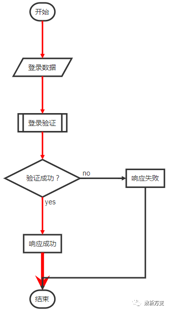

可以通过改变下列属性中的值，达到自己想要的效果：

- "stroke":"Red"
- "stroke-width":6
- "arrow-end":"classic-wide-long"


### Ⅲ. flowchart.js实例

下面列举几个在Typora中使用flowchart.js作图的实际案例。

#### 1. 用户登录验证流程

```f
flowchat
st=>start: 开始
e=>end: 登录
io1=>inputoutput: 输入用户名密码
sub1=>subroutine: 数据库查询子类
cond=>condition: 是否有此用户
cond2=>condition: 密码是否正确
op=>operation: 读入用户信息

st->io1->sub1->cond
cond(yes,right)->cond2
cond(no)->io1(right)
cond2(yes,right)->op->e
cond2(no)->io1
```

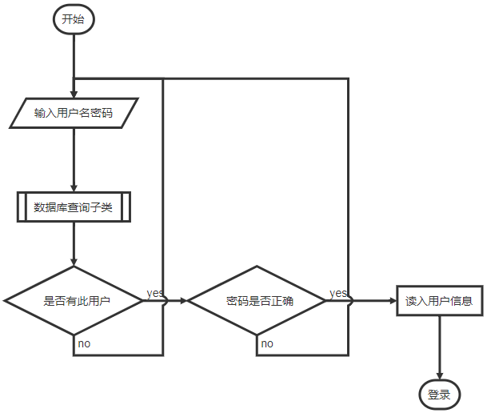

#### 2. 产品开发简易流程

```f
st=>start: 开始
e=>end: 结束
op1=>operation: 新品开发流程
op2=>operation: 产品需求提出
op3=>operation: 产品试用 负责人：吴xx
op4=>operation: 包装
op5=>parallel: 继续讨论
op6=>operation: 讨论
cond=>condition: 确认？


st->op1->op2->op3->cond
cond(yes)->op4->e
cond(no)->op6->e
```

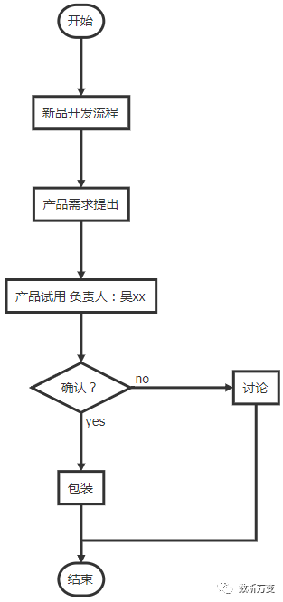

#### 3. 微信接入验证流程

```
st=>start: 微信验证接入
e=>end: END
cond1=>condition: echostr == null

op2_1=>operation: 将token、timestamp、nonce三个参数进行字典序排序
op2_2=>operation: 将三个参数字符串拼接成一个字符串进行sha1加密
cond2=>condition: 加密字符串 == signature
io1=>inputoutput: 返回echostr

op1=>operation: 获取post，解析xml数据
op2=>operation: 判断信息内容，处理相关操作
io2=>inputoutput: post返回数据


st->cond1
cond1(yes)->op1->op2->io2->e
cond1(no)->op2_1(right)->op2_2->cond2
cond2(no)->e
cond2(yes)->io1->e
```

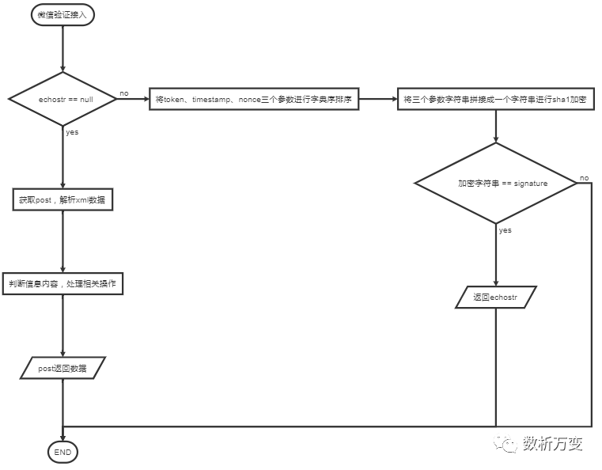

#### 4. 在线招投标流程

```
st=>start: index
op=>operation: 申请
op2=>operation: 结果页
op3=>operation: 查询本地
i1=>inputoutput: bid入库
i2=>inputoutput: 填写个人信息
c1=>condition: 检查登录
c2=>condition: 登录
c3=>condition: 查询本地记录
c4=>condition: 检测状态
c5=>operation: 风控审核
e=>end

st->op->c1()
c1(no)->c2(yes)->op()
c1(yes)->c3(no)->i1(right)->i2(right)->c5()->op2->e
c1(yes)->c3(yes)->c4(no)->i2
c1(yes)->c3(yes)->c4(yes)->op3->op2
c3()->e
```

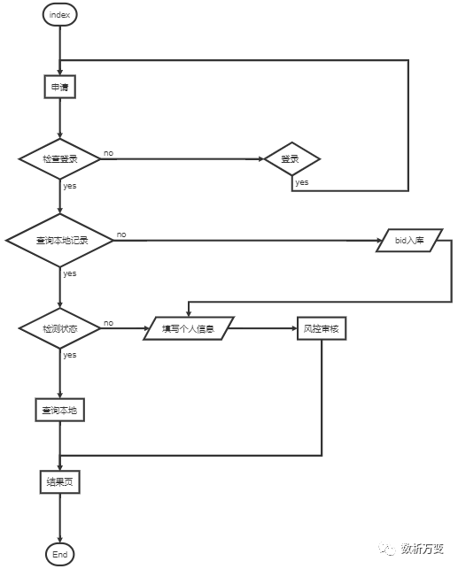


### Ⅳ. 小结

`Flowchart.js` 是一个可以在Typora中快速绘制流程图的方法，特别是对于相对简单的组织架构图形，可以用极低的学习成本立即构建。

由于该项目只有七种节点类型，连接方法和形式也非常简单，很难胜任更加复杂的需求。接着我继续介绍另一个功能更强大，样式更加丰富的项目。


## <font color=red>下篇：mermaid.js</font>


### Ⅰ. mermaid.js 简介

相比于`flowchart.js`专注于流程图领域，`mermaid.js`的“野心”要大得多：在其官方文档中就直接说明想以`markdown`的风格替换掉`Visio`等较重的工具。

>Generation of diagrams and flowcharts from text in a similar manner as markdown.
>
>Ever wanted to simplify documentation and avoid heavy tools like Visio when explaining your code?
>
>This is why mermaid was born, a simple markdown-like script language for generating charts from text via javascript.

> **Mermaid was nominated and won the JS Open Source Awards (2019) in the category "The most exciting use of technology"!!! Thanks to all involved, people committing pull requests, people answering questions and special thanks to Tyler Long who is helping me maintain the project.**

不过作者也并非吹牛，除了在Github上收获28.8k的Star数，还获得了 **JS Open Source Awards (2019)**

项目发起人对该项目的介绍：

https://github.com/mermaid-js/mermaid/issues/866

项目地址：https://github.com/mermaid-js/mermaid

项目文档：https://mermaid-js.github.io/mermaid/#/

在线编辑器：https://mermaidjs.github.io/mermaid-live-editor/

项目最新版本为为 v8.4，支持的图表类型有：

- **Flow**：流程图
- **Sequence**：序列图
- **Gantt**：甘特图
- **Class**：类图
- **State**：状态图
- **Pie**：饼图
- ~~**Git**：Git图（尚在测试）~~

目前除了Git图，其余六种图表都已经在最新版的Typora中可以使用。


### Ⅱ. mermaid.js语法


### Flowcharts - Basic Syntax

#### Graph

This statement declares a new graph and the direction of the graph layout.

This declares a graph oriented from top to bottom (`TD` or `TB`).

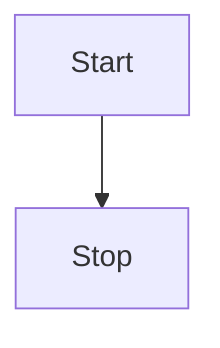

This declares a graph oriented from left to right (`LR`).

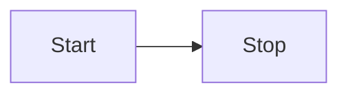

Possible directions are:

- TB - top bottom
- BT - bottom top
- RL - right left
- LR - left right
- TD - same as TB

#### Nodes & shapes

##### A node (default)

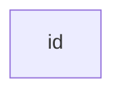

Note that the id is what is displayed in the box.

##### A node with text

It is also possible to set text in the box that differs from the id. If this is done several times, it is the last text found for the node that will be used. Also if you define edges for the node later on, you can omit text definitions. The one previously defined will be used when rendering the box.

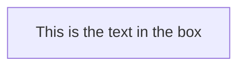

##### A node with round edges

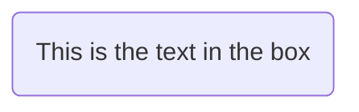

##### A stadium-shaped node

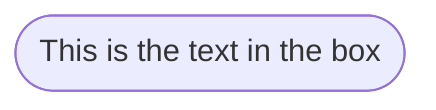

##### A node in a cylindrical shape

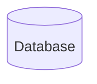

##### A node in the form of a circle

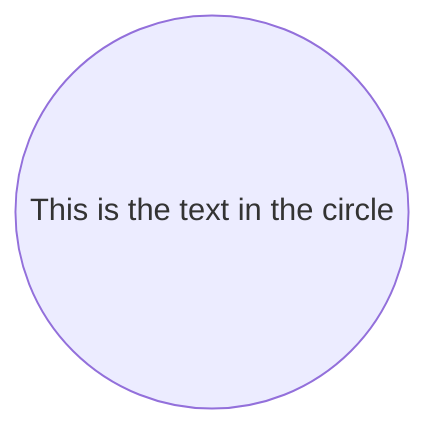

##### A node in an asymetric shape

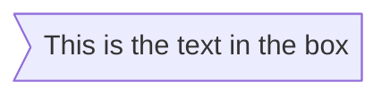

currently only the shape above is possible and not its mirror. *This might change with future releases.*

##### A node (rhombus)

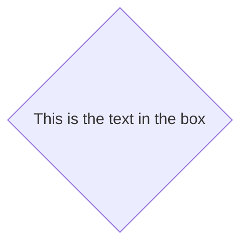

##### A hexagon node

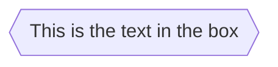

##### Parallelogram

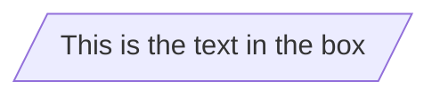

##### Parallelogram alt

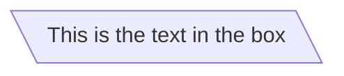

##### Trapezoid

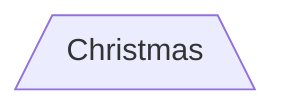

##### Trapezoid alt

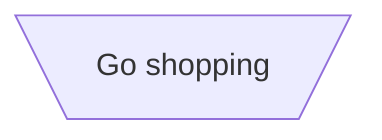

#### Links between nodes

Nodes can be connected with links/edges. It is possible to have different types of links or attach a text string to a link.

##### A link with arrow head

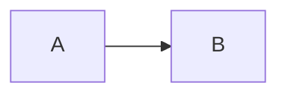

##### An open link

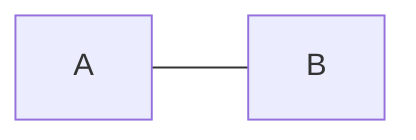

##### Text on links

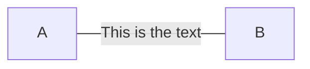

or


##### A link with arrow head and text

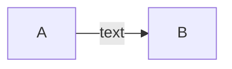

or

```mermaid
graph LR
    A-- text -->B
```

##### Dotted link

```mermaid
graph LR;
   A-.->B;
```

##### Dotted link with text

```mermaid
graph LR
   A-. text .-> B
```

##### Thick link

```mermaid
graph LR
   A ==> B
```

##### Thick link with text

```mermaid
graph LR
   A == text ==> B
```

##### Chaining of links

It is possible declare many links in the same line as per below:

```mermaid
graph LR
   A -- text --> B -- text2 --> C
```

It is also possible to declare multiple nodes links in the same line as per below:

```mermaid
graph LR
   a --> b & c--> d
```

You can then describe dependencies in a very expressive way. Like the onliner below:

```mermaid
graph TB
    A & B--> C & D
```


If you describe the same diagram using the the basic syntax, it will take four lines. A word of warning, one could go overboard with this making the graph harder to read in markdown form. The Swedish word `lagom` comes to mind. It means, not to much and not to little. This goes for expressive syntaxes as well.

```mermaid
graph TB
    A --> C
    A --> D
    B --> C
    B --> D
```

##### Special characters that break syntax

It is possible to put text within quotes in order to render more troublesome characters. As in the example below:

```mermaid
graph LR
    id1["This is the (text) in the box"]
```

##### Entity codes to escape characters

It is possible to escape characters using the syntax examplified here.

```mermaid
    graph LR
        A["A double quote:#quot;"] -->B["A dec char:#9829;"]
```

#### Subgraphs

```
subgraph title
    graph definition
end
```

An example below:

```mermaid
graph TB
    c1-->a2
    subgraph one
    a1-->a2
    end
    subgraph two
    b1-->b2
    end
    subgraph three
    c1-->c2
    end
```

#### Interaction

It is possible to bind a click event to a node, the click can lead to either a javascript callback or to a link which will be opened in a new browser tab. **Note**: This functionality is disabled when using `securityLevel='strict'` and enabled when using `securityLevel='loose'`.

```
click nodeId callback
```

- nodeId is the id of the node
- callback is the name of a javascript function defined on the page displaying the graph, the function will be called with the nodeId as parameter.

Examples of tooltip usage below:

```
<script>
    var callback = function(){
        alert('A callback was triggered');
    }
<script>
graph LR;
    A-->B;
    click A callback "Tooltip for a callback"
    click B "http://www.github.com" "This is a tooltip for a link"
```

The tooltip text is surrounded in double quotes. The styles of the tooltip are set by the class .mermaidTooltip.

```mermaid
graph LR;
    A-->B;
    click A callback "Tooltip for a callback"
    click B "http://www.github.com" "This is a tooltip for a link"
```

#### Styling and classes

##### Styling links

It is possible to style links. For instance you might want to style a link that is going backwards in the flow. As links have no ids in the same way as nodes, some other way of deciding what style the links should be attached to is required. Instead of ids, the order number of when the link was defined in the graph is used. In the example below the style defined in the linkStyle statement will belong to the fourth link in the graph:

```
linkStyle 3 stroke:#ff3,stroke-width:4px,color:red;
```

##### Styling a node

It is possible to apply specific styles such as a thicker border or a different background color to a node.

```mermaid
graph LR
    id1(Start)-->id2(Stop)
    style id1 fill:#f9f,stroke:#333,stroke-width:4px
    style id2 fill:#bbf,stroke:#f66,stroke-width:2px,color:#fff,stroke-dasharray: 5, 5
```

##### Classes

More convenient then defining the style every time is to define a class of styles and attach this class to the nodes that should have a different look.

a class definition looks like the example below:

```
    classDef className fill:#f9f,stroke:#333,stroke-width:4px;
```

Attachment of a class to a node is done as per below:

```
    class nodeId1 className;
```

It is also possible to attach a class to a list of nodes in one statement:

```
    class nodeId1,nodeId2 className;
```

A shorter form of adding a class is to attach the classname to the node using the `:::`operator as per below:

```mermaid
graph LR
    A:::someclass --> B
    classDef someclass fill:#f96;
```

##### Css classes

It is also possible to predefine classes in css styles that can be applied from the graph definition as in the example below:

**Example style**

```html
<style>
    .cssClass > rect{
        fill:#FF0000;
        stroke:#FFFF00;
        stroke-width:4px;
    }
</style>
```

**Example definition**

```mermaid
graph LR;
    A-->B[AAA<span>BBB</span>];
    B-->D;
    class A cssClass;
```

##### Default class

If a class is named default it will be assigned to all classes without specific class definitions.

```
    classDef default fill:#f9f,stroke:#333,stroke-width:4px;
```

#### Basic support for fontawesome

It is possible to add icons from fontawesome.

The icons are acessed via the syntax fa:#icon class name#.

```mermaid
graph TD
    B["fa:fa-twitter for peace"]
    B-->C[fa:fa-ban forbidden]
    B-->D(fa:fa-spinner);
    B-->E(A fa:fa-camera-retro perhaps?);
```

#### Graph declarations with spaces between vertices and link and without semicolon

- In graph declarations, the statements also can now end without a semicolon. After release 0.2.16, ending a graph statement with semicolon is just optional. So the below graph declaration is also valid along with the old declarations of the graph.
- A single space is allowed between vertices and the link. However there should not be any space between a vertex and its text and a link and its text. The old syntax of graph declaration will also work and hence this new feature is optional and is introduce to improve readability.

Below is the new declaration of the graph edges which is also valid along with the old declaration of the graph edges.

```mermaid
graph LR
    A[Hard edge] -->|Link text| B(Round edge)
    B --> C{Decision}
    C -->|One| D[Result one]
    C -->|Two| E[Result two]
```


### Sequence diagrams

> A Sequence diagram is an interaction diagram that shows how processes operate with one another and in what order.

Mermaid can render sequence diagrams.

```mermaid
sequenceDiagram
    Alice->>John: Hello John, how are you?
    John-->>Alice: Great!
```

#### Syntax

##### Participants

The participants can be defined implicitly as in the first example on this page. The participants or actors are rendered in order of appearance in the diagram source text. Sometimes you might want to show the participants in a different order than how they appear in the first message. It is possible to specify the actor's order of appearance by doing the following:

```mermaid
sequenceDiagram
    participant John
    participant Alice
    Alice->>John: Hello John, how are you?
    John-->>Alice: Great!
```

##### Aliases

The actor can have a convenient identifier and a descriptive label.

```mermaid
sequenceDiagram
    participant A as Alice
    participant J as John
    A->>J: Hello John, how are you?
    J->>A: Great!
```

#### Messages

Messages can be of two displayed either solid or with a dotted line.

```
[Actor][Arrow][Actor]:Message text
```

There are six types of arrows currently supported:

| Type | Description                                 |
| ---- | ------------------------------------------- |
| ->   | Solid line without arrow                    |
| -->  | Dotted line without arrow                   |
| ->>  | Solid line with arrowhead                   |
| -->> | Dotted line with arrowhead                  |
| -x   | Solid line with a cross at the end (async)  |
| --x  | Dotted line with a cross at the end (async) |

#### Activations

It is possible to activate and deactivate an actor. (de)activation can be dedicated declarations:

```mermaid
sequenceDiagram
    Alice->>John: Hello John, how are you?
    activate John
    John-->>Alice: Great!
    deactivate John
```

There is also a shortcut notation by appending `+`/`-` suffix to the message arrow:

```mermaid
sequenceDiagram
    Alice->>+John: Hello John, how are you?
    John-->>-Alice: Great!
```

Activations can be stacked for same actor:

```mermaid
sequenceDiagram
    Alice->>+John: Hello John, how are you?
    Alice->>+John: John, can you hear me?
    John-->>-Alice: Hi Alice, I can hear you!
    John-->>-Alice: I feel great!
```

#### Notes

It is possible to add notes to a sequence diagram. This is done by the notation Note [ right of | left of | over ] [Actor]: Text in note content

See the example below:

```mermaid
sequenceDiagram
    participant John
    Note right of John: Text in note
```

It is also possible to create notes spanning two participants:

```mermaid
sequenceDiagram
    Alice->John: Hello John, how are you?
    Note over Alice,John: A typical interaction
```

#### Loops

It is possible to express loops in a sequence diagram. This is done by the notation

```
loop Loop text
... statements ...
end
```

See the example below:

```mermaid
sequenceDiagram
    Alice->John: Hello John, how are you?
    loop Every minute
        John-->Alice: Great!
    end
```

#### Alt

It is possible to express alternative paths in a sequence diagram. This is done by the notation

```
alt Describing text
... statements ...
else
... statements ...
end
```

or if there is sequence that is optional (if without else).

```
opt Describing text
... statements ...
end
```

See the example below:

```mermaid
sequenceDiagram
    Alice->>Bob: Hello Bob, how are you?
    alt is sick
        Bob->>Alice: Not so good :(
    else is well
        Bob->>Alice: Feeling fresh like a daisy
    end
    opt Extra response
        Bob->>Alice: Thanks for asking
    end
```

#### Background Highlighting

It is possible to highlight flows by providing colored background rects. This is done by the notation

The colors are defined using rgb and rgba syntax.

```
rect rgb(0, 255, 0)
... content ...
end

rect rgba(0, 0, 255, .1)
... content ...
end
```

See the examples below:


#### Comments

Comments can be entered within a sequence diagram, which will be ignored by the parser. Comments need to be on their own line, and must be prefaced with `%%` (double percent signs). Any text after the start of the comment to the next newline will be treated as a comment, including any diagram syntax

```
sequenceDiagram
    Alice->>John: Hello John, how are you?
    %% this is a comment
    John-->>Alice: Great!
```

#### sequenceNumbers

It is possible to get a sequence number attached to each arrow in a sequence diagram. This can be configured when adding mermaid to the website as shown below:

```
    <script>
      mermaid.initialize({
        sequence: { showSequenceNumbers: true },
      });
    </script>
```

It can also be be turned on via the diagram code as in the diagram:

```mermaid
sequenceDiagram
    autonumber
    Alice->>John: Hello John, how are you?
    loop Healthcheck
        John->>John: Fight against hypochondria
    end
    Note right of John: Rational thoughts!
    John-->>Alice: Great!
    John->>Bob: How about you?
    Bob-->>John: Jolly good!
```


#### Styling

Styling of a sequence diagram is done by defining a number of css classes. During rendering these classes are extracted from the file located at src/themes/sequence.scss

##### Classes used

| Class        | Description                                                 |
| ------------ | ----------------------------------------------------------- |
| actor        | Style for the actor box at the top of the diagram.          |
| text.actor   | Styles for text in the actor box at the top of the diagram. |
| actor-line   | The vertical line for an actor.                             |
| messageLine0 | Styles for the solid message line.                          |
| messageLine1 | Styles for the dotted message line.                         |
| messageText  | Defines styles for the text on the message arrows.          |
| labelBox     | Defines styles label to left in a loop.                     |
| labelText    | Styles for the text in label for loops.                     |
| loopText     | Styles for the text in the loop box.                        |
| loopLine     | Defines styles for the lines in the loop box.               |
| note         | Styles for the note box.                                    |
| noteText     | Styles for the text on in the note boxes.                   |

##### Sample stylesheet

```
body {
    background: white;
}

.actor {
    stroke: #CCCCFF;
    fill: #ECECFF;
}
text.actor {
    fill:black;
    stroke:none;
    font-family: Helvetica;
}

.actor-line {
    stroke:grey;
}

.messageLine0 {
    stroke-width:1.5;
    stroke-dasharray: "2 2";
    marker-end:"url(#arrowhead)";
    stroke:black;
}

.messageLine1 {
    stroke-width:1.5;
    stroke-dasharray: "2 2";
    stroke:black;
}

#arrowhead {
    fill:black;

}

.messageText {
    fill:black;
    stroke:none;
    font-family: 'trebuchet ms', verdana, arial;
    font-size:14px;
}

.labelBox {
    stroke: #CCCCFF;
    fill: #ECECFF;
}

.labelText {
    fill:black;
    stroke:none;
    font-family: 'trebuchet ms', verdana, arial;
}

.loopText {
    fill:black;
    stroke:none;
    font-family: 'trebuchet ms', verdana, arial;
}

.loopLine {
    stroke-width:2;
    stroke-dasharray: "2 2";
    marker-end:"url(#arrowhead)";
    stroke: #CCCCFF;
}

.note {
    stroke: #decc93;
    stroke: #CCCCFF;
    fill: #fff5ad;
}

.noteText {
    fill:black;
    stroke:none;
    font-family: 'trebuchet ms', verdana, arial;
    font-size:14px;
}
```

#### Configuration

Is it possible to adjust the margins for rendering the sequence diagram.

This is done by defining `mermaid.sequenceConfig` or by the CLI to use a json file with the configuration. How to use the CLI is described in the [mermaidCLI](https://mermaid-js.github.io/mermaid/#/mermaidCLI.html) page. `mermaid.sequenceConfig` can be set to a JSON string with config parameters or the corresponding object.

```javascript
mermaid.sequenceConfig = {
    diagramMarginX:50,
    diagramMarginY:10,
    boxTextMargin:5,
    noteMargin:10,
    messageMargin:35,
    mirrorActors:true
};
```

##### Possible configuration params:

| Param           | Description                                                  | Default value |
| --------------- | ------------------------------------------------------------ | ------------- |
| mirrorActor     | Turns on/off the rendering of actors below the diagram as well as above it | false         |
| bottomMarginAdj | Adjusts how far down the graph ended. Wide borders styles with css could generate unwanted clipping which is why this config param exists. | 1             |

### Class diagrams

> "In software engineering, a class diagram in the Unified Modeling Language (UML) is a type of static structure diagram that describes the structure of a system by showing the system's classes, their attributes, operations (or methods), and the relationships among objects." Wikipedia

The class diagram is the main building block of object-oriented modeling. It is used for general conceptual modeling of the structure of the application, and for detailed modeling translating the models into programming code. Class diagrams can also be used for data modeling. The classes in a class diagram represent both the main elements, interactions in the application, and the classes to be programmed.

Mermaid can render class diagrams.

```mermaid
 classDiagram
      Animal <|-- Duck
      Animal <|-- Fish
      Animal <|-- Zebra
      Animal : +int age
      Animal : +String gender
      Animal: +isMammal()
      Animal: +mate()
      class Duck{
          +String beakColor
          +swim()
          +quack()
      }
      class Fish{
          -int sizeInFeet
          -canEat()
      }
      class Zebra{
          +bool is_wild
          +run()
      }
```

#### Syntax

##### Class

UML provides mechanisms to represent class members, such as attributes and methods, and additional information about them. A single instance of a class in the diagram contains three compartments:

- The top compartment contains the name of the class. It is printed in bold and centered, and the first letter is capitalized. It may also contain optional annotation text describing the nature of the class.
- The middle compartment contains the attributes of the class. They are left-aligned and the first letter is lowercase.
- The bottom compartment contains the operations the class can execute. They are also left-aligned and the first letter is lowercase.

```mermaid
classDiagram
    class BankAccount
    BankAccount : +String owner
    BankAccount : +Bigdecimal balance
    BankAccount : +deposit(amount)
    BankAccount : +withdrawl(amount)
```

#### Define a class

There are two ways to define a class:

- Explicitly defining a class using keyword **class** like `class Animal`. This defines the Animal class
- Define two classes via a **relationship** between them `Vehicle <|-- Car`. This defines two classes Vehicle and Car along with their relationship.

```mermaid
classDiagram
    class Animal
    Vehicle <|-- Car
```

Naming convention: a class name should be composed of alphanumeric (unicode allowed) and underscore characters.

#### Defining Members of a class

UML provides mechanisms to represent class members, such as attributes and methods, and additional information about them.

Mermaid distinguishes between attributes and functions/methods based on if the **parenthesis** `()` are present or not. The ones with `()` are treated as functions/methods, and others as attributes.

There are two ways to define the members of a class, and regardless of whichever syntax is used to define the members, the output will still be same. The two different ways are :

- Associate a member of a class using **:** (colon) followed by member name, useful to define one member at a time. For example:

    ```mermaid
    classDiagram
    class BankAccount
    BankAccount : +String owner
    BankAccount : +BigDecimal balance
    BankAccount : +deposit(amount)
    BankAccount : +withdrawal(amount)
    ```

- Associate members of a class using **{}** brackets, where members are grouped within curly brackets. Suitable for defining multiple members at once. For example:

```mermaid
classDiagram
class BankAccount{
  +String owner
  +BigDecimal balance
  +deposit(amount) bool
  +withdrawl(amount)
}
```

##### Return Type

Optionally you can end the method/function definition with the data type that will be returned (note: there must be a space between the final `)` of the method definition and return type example:

```mermaid
classDiagram
class BankAccount{
    +String owner
    +BigDecimal balance
    +deposit(amount) bool
    +withdrawl(amount) int
}
```

##### Generic Types

Members can be defined using generic types, such as `List`, for fields, parameters and return types by enclosing the type within `~` (**tilde**). Note: **nested** type declarations (such as `List>`) are not currently supported

This can be done as part of either class definition method:

```
classDiagram
class Square~Shape~{
    int id
    List~int~ position
    setPoints(List~int~ points)
    getPoints() List~int~
}

Square : -List~string~ messages
Square : +setMessages(List~string~ messages)
Square : +getMessages() List~string~
```

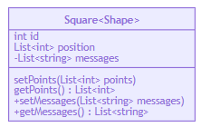

##### Return Type

Optionally you can end the method/function definition with the data type that will be returned

##### Visibility

To specify the visibility of a class member (i.e. any attribute or method), these notations may be placed before the member's name, but it is optional:

- `+` Public
- `-` Private
- `#` Protected
- `~` Package/Internal

> *note* you can also include additional *classifers* to a method definition by adding the following notations to the end of the method, i.e.: after the `()`:
>
> - `*` Abstract e.g.: `someAbstractMethod()*`
> - `$` Static e.g.: `someStaticMethod()$`

#### Defining Relationship

A relationship is a general term covering the specific types of logical connections found on class and object diagrams.

```
[classA][Arrow][ClassB]:LabelText
```

There are different types of relations defined for classes under UML which are currently supported:

| Type  | Description   |
| ----- | ------------- |
| <\|-- | Inheritance   |
| *--   | Composition   |
| o--   | Aggregation   |
| -->   | Association   |
| --    | Link (Solid)  |
| ..>   | Dependency    |
| ..\|> | Realization   |
| ..    | Link (Dashed) |

```mermaid
classDiagram
classA <|-- classB
classC *-- classD
classE o-- classF
classG <-- classH
classI -- classJ
classK <.. classL
classM <|.. classN
classO .. classP
```

We can use the labels to describe nature of relation between two classes. Also, arrowheads can be used in opposite directions as well :

```mermaid
classDiagram
classA --|> classB : Inheritance
classC --* classD : Composition
classE --o classF : Aggregation
classG --> classH : Association
classI -- classJ : Link(Solid)
classK ..> classL : Dependency
classM ..|> classN : Realization
classO .. classP : Link(Dashed)
```

#### Labels on Relations

It is possible to add a label text to a relation:

```
[classA][Arrow][ClassB]:LabelText
```


```mermaid
classDiagram
classA <|-- classB : implements
classC *-- classD : composition
classE o-- classF : association
```

##### Cardinality / Multiplicity on relations

Multiplicity or cardinality in class diagrams indicates the number of instances of one class linked to one instance of the other class. For example, one company will have one or more employees, but each employee works for just one company.

Multiplicity notations are placed near the ends of an association.

The different cardinality options are :

- `0..1` Zero or one
- `1` Only 1
- `0..1` Zero or One
- `1..*` One or more
- `*` Many
- `n` n {where n>1}
- `0..n` zeor to n {where n>1}
- `1..n` one to n {where n>1}

Cardinality can be easily defined by placing cardinality text within qoutes `"` before(optional) and after(optional) a given arrow.

```
[classA] "cardinality1" [Arrow] "cardinality2" [ClassB]:LabelText
```


```mermaid
classDiagram
    Customer "1" --> "*" Ticket
    Student "1" --> "1..*" Course
    Galaxy --> "many" Star : Contains
```

#### Annotations on classes

It is possible to annotate classes with a specific marker text which is like meta-data for the class, giving a clear indication about its nature. Some common annotations examples could be:

- `<>` To represent an Interface class
- `<>` To represent an abstract class
- `<>` To represent a service class
- `<>` To represent an enum

Annotations are defined within the opening `<<` and closing `>>`. There are two ways to add an annotation to a class and regardless of the syntax used output will be same. The two ways are :

- In a *separate line* after a class is defined. For example:

    ```
    classDiagram
    class Shape
    <<interface>> Shape
    ```

    

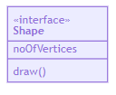

- In a *nested structure* along with class definition. For example:

```mermaid
classDiagram
class Shape{
    <<interface>>
    noOfVertices
    draw()
}
class Color{
    <<enumeration>>
    RED
    BLUE
    GREEN
    WHITE
    BLACK
}
```

#### Comments

Comments can be entered within a class diagram, which will be ignored by the parser. Comments need to be on their own line, and must be prefaced with `%%` (double percent signs). Any text after the start of the comment to the next newline will be treated as a comment, including any class diagram syntax

```
classDiagram
%% This whole line is a comment classDiagram class Shape <<interface>>
class Shape{
    <<interface>>
    noOfVertices
    draw()
}
```

#### Interaction

It is possible to bind a click event to a node, the click can lead to either a javascript callback or to a link which will be opened in a new browser tab. **Note**: This functionality is disabled when using `securityLevel='strict'` and enabled when using `securityLevel='loose'`.

You would define these actions on a separate line after all classes have been declared.

```
action className "reference" "tooltip"
```

- *action* is either `link` or `callback`, depending on which type of interaction you want to have called
- *className* is the id of the node that the action will be associated with
- *reference* is either the url link, or the function name for callback. (note: callback function will be called with the nodeId as parameter).
- (*optional*) tooltip is a string to be displayed when hovering over element (note: The styles of the tooltip are set by the class .mermaidTooltip.)

##### Examples:

*URL Link:*

```
classDiagram
class Shape
link Shape "http://www.github.com" "This is a tooltip for a link"
```

*Callback:*

```
classDiagram
class Shape
callback Shape "callbackFunction" "This is a tooltip for a callback"
<script>
    var callbackFunction = function(){
        alert('A callback was triggered');
    }
<script>
```


> **Success** The tooltip functionality and the ability to link to urls are available from version 0.5.2.

Beginners tip, a full example using interactive links in an html context:

```
<body>
  <div class="mermaid">
    classDiagram
    Animal <|-- Duck
    Animal <|-- Fish
    Animal <|-- Zebra
    Animal : +int age
    Animal : +String gender
    Animal: +isMammal()
    Animal: +mate()
    class Duck{
      +String beakColor
      +swim()
      +quack()
      }
    class Fish{
      -int sizeInFeet
      -canEat()
      }
    class Zebra{
      +bool is_wild
      +run()
      }

        callback Duck callback "Tooltip"
        click Zebra "http://www.github.com" "This is a link"
  </div>

  <script>
      var callback = function(){
        alert('A callback was triggered');
    }
    var config = {
      startOnLoad:true,
      securityLevel:'loose',
    };

    mermaid.initialize(config);
  </script>
</body>
```

#### Styling

Styling of the class diagram is done by defining a number of css classes. During rendering these classes are extracted from the file located at src/themes/class.scss

##### Styling Classes used

| Class              | Description                                                  |
| ------------------ | ------------------------------------------------------------ |
| g.classGroup text  | Styles for general class text                                |
| classGroup .title  | Styles for general class title                               |
| g.classGroup rect  | Styles for class diagram rectangle                           |
| g.classGroup line  | Styles for class diagram line                                |
| .classLabel .box   | Styles for class label box                                   |
| .classLabel .label | Styles for class label text                                  |
| composition        | Styles for componsition arrow head and arrow line            |
| aggregation        | Styles for aggregation arrow head and arrow line(dashed or solid) |
| dependency         | Styles for dependency arrow head and arrow line              |

##### Sample stylesheet

```css
body {
    background: white;
}

g.classGroup text {
  fill: $nodeBorder;
  stroke: none;
  font-family: 'trebuchet ms', verdana, arial;
  font-family: var(--mermaid-font-family);
  font-size: 10px;

  .title {
    font-weight: bolder;
  }
}

g.classGroup rect {
  fill: $nodeBkg;
  stroke: $nodeBorder;
}

g.classGroup line {
  stroke: $nodeBorder;
  stroke-width: 1;
}

.classLabel .box {
  stroke: none;
  stroke-width: 0;
  fill: $nodeBkg;
  opacity: 0.5;
}

.classLabel .label {
  fill: $nodeBorder;
  font-size: 10px;
}

.relation {
  stroke: $nodeBorder;
  stroke-width: 1;
  fill: none;
}

@mixin composition {
  fill: $nodeBorder;
  stroke: $nodeBorder;
  stroke-width: 1;
}

#compositionStart {
  @include composition;
}

#compositionEnd {
  @include composition;
}

@mixin aggregation {
  fill: $nodeBkg;
  stroke: $nodeBorder;
  stroke-width: 1;
}

#aggregationStart {
  @include aggregation;
}

#aggregationEnd {
  @include aggregation;
}

#dependencyStart {
  @include composition;
}

#dependencyEnd {
  @include composition;
}

#extensionStart {
  @include composition;
}

#extensionEnd {
  @include composition;
}
```

#### Configuration

```
Coming soon
```


### State diagrams

> "A state diagram is a type of diagram used in computer science and related fields to describe the behavior of systems. State diagrams require that the system described is composed of a finite number of states; sometimes, this is indeed the case, while at other times this is a reasonable abstraction." Wikipedia

Mermaid can render state diagrams. The syntax tries to be compliant with the syntax used in plantUml as this will make it easier for users to share diagrams between mermaid and plantUml.

```mermaid
stateDiagram
    [*] --> Still
    Still --> [*]

    Still --> Moving
    Moving --> Still
    Moving --> Crash
    Crash --> [*]
```

In state diagrams systems are described in terms of its states and how the systems state can change to another state via a transitions. The example diagram above shows three states **Still**, **Moving** and **Crash**. You start in the state of Still. From Still you can change the state to Moving. In Moving you can change the state either back to Still or to Crash. There is no transition from Still to Crash.

#### States

A state can be declares in multiple ways. The simplest way is to define a state id as a description.

```mermaid
stateDiagram
    s1
```

Another way is by using the state keyword with a description as per below:

```mermaid
stateDiagram
    state "This is a state description" as s2
```

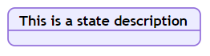

Another way to define a state with a description is to define the state id followed by a colon and the description:

```mermaid
stateDiagram
    s2 : This is a state description
```

#### Transitions

Transitions are path/edges when one state passes into another. This is represented using text arrow, "-->".

When you define a transition between two states and the states are not already defined the undefined states are defined with the id from the transition. You can later add descriptions to states defined this way.

```mermaid
stateDiagram
    s1 --> s2
```

It is possible to add text to a transition. To describe what it represents.

```mermaid
stateDiagram
    s1 --> s2: A transition
```

#### Start and End

There are two special states indicating the start and stop of the diagram. These are written with the [*] syntax and the direction of the transition to it defines it either as a start or a stop state.

```mermaid
stateDiagram
    [*] --> s1
    s1 --> [*]
```

#### Composite states

In a real world use of state diagrams you often end up with diagrams that are multi-dimensional as one state can have several internal states. These are called composite states in this terminology.

In order to define a composite state you need to use the state keyword followed by and id and the body of the composite state between {}. See the example below:

```mermaid
stateDiagram
    [*] --> First
    state First {
        [*] --> second
        second --> [*]
    }
```

You can do this in several layers:

```mermaid
stateDiagram
    [*] --> First

    state First {
        [*] --> Second

        state Second {
            [*] --> second
            second --> Third

            state Third {
                [*] --> third
                third --> [*]
            }
        }
    }
```

You can also define transitions also between composite states:

```mermaid
stateDiagram
    [*] --> First
    First --> Second
    First --> Third

    state First {
        [*] --> fir
        fir --> [*]
    }
    state Second {
        [*] --> sec
        sec --> [*]
    }
    state Third {
        [*] --> thi
        thi --> [*]
    }
```

*You can not define transitions between internal states belonging to different composite states*

#### Forks

It is possible to specify a fork in the diagram using <<fork>> <<join>>.

```mermaid
   stateDiagram
    state fork_state <<fork>>
      [*] --> fork_state
      fork_state --> State2
      fork_state --> State3

      state join_state <<join>>
      State2 --> join_state
      State3 --> join_state
      join_state --> State4
      State4 --> [*]
```

#### Notes

Sometimes nothing says it better then a Post-it note. That is also the case in state diagrams.

Here you can choose to put the note to the *right of* or to the *left of* a node.

```mermaid
    stateDiagram
        State1: The state with a note
        note right of State1
            Important information! You can write
            notes.
        end note
        State1 --> State2
        note left of State2 : This is the note to the left.
```


#### Concurrency

As in plantUml you can specify concurrency using the -- symbol.

```mermaid
    stateDiagram
        [*] --> Active

        state Active {
            [*] --> NumLockOff
            NumLockOff --> NumLockOn : EvNumLockPressed
            NumLockOn --> NumLockOff : EvNumLockPressed
            --
            [*] --> CapsLockOff
            CapsLockOff --> CapsLockOn : EvCapsLockPressed
            CapsLockOn --> CapsLockOff : EvCapsLockPressed
            --
            [*] --> ScrollLockOff
            ScrollLockOff --> ScrollLockOn : EvCapsLockPressed
            ScrollLockOn --> ScrollLockOff : EvCapsLockPressed
        }
```

#### Comments

Comments can be entered within a state diagram chart, which will be ignored by the parser. Comments need to be on their own line, and must be prefaced with `%%` (double percent signs). Any text after the start of the comment to the next newline will be treated as a comment, including any diagram syntax

```
stateDiagram
    [*] --> Still
    Still --> [*]
%% this is a comment
    Still --> Moving
    Moving --> Still %% another comment
    Moving --> Crash
    Crash --> [*]
```

#### Styling

Styling of the a state diagram is done by defining a number of css classes. During rendering these classes are extracted from the file located at src/themes/state.scss

### Gantt diagrams

> A Gantt chart is a type of bar chart, first developed by Karol Adamiecki in 1896, and independently by Henry Gantt in the 1910s, that illustrates a project schedule. Gantt charts illustrate the start and finish dates of the terminal elements and summary elements of a project.

Mermaid can render Gantt diagrams.

```mermaid
gantt
    title A Gantt Diagram
    dateFormat  YYYY-MM-DD
    section Section
    A task           :a1, 2014-01-01, 30d
    Another task     :after a1  , 20d
    section Another
    Task in sec      :2014-01-12  , 12d
    another task      : 24d
```

#### Syntax

```mermaid
gantt
       dateFormat  YYYY-MM-DD
       title Adding GANTT diagram functionality to mermaid

       section A section
       Completed task            :done,    des1, 2014-01-06,2014-01-08
       Active task               :active,  des2, 2014-01-09, 3d
       Future task               :         des3, after des2, 5d
       Future task2              :         des4, after des3, 5d

       section Critical tasks
       Completed task in the critical line :crit, done, 2014-01-06,24h
       Implement parser and jison          :crit, done, after des1, 2d
       Create tests for parser             :crit, active, 3d
       Future task in critical line        :crit, 5d
       Create tests for renderer           :2d
       Add to mermaid                      :1d

       section Documentation
       Describe gantt syntax               :active, a1, after des1, 3d
       Add gantt diagram to demo page      :after a1  , 20h
       Add another diagram to demo page    :doc1, after a1  , 48h

       section Last section
       Describe gantt syntax               :after doc1, 3d
       Add gantt diagram to demo page      :20h
       Add another diagram to demo page    :48h
```

It is possible to set multiple depenendenies separated by space:

```mermaid
    gantt
        apple :a, 2017-07-20, 1w
        banana :crit, b, 2017-07-23, 1d
        cherry :active, c, after b a, 1d

```

```mermaid
    gantt
        apple :a, 2017-07-20, 1w
        banana :crit, b, 2017-07-23, 1d
        cherry :active, c, after b a, 1d
```

##### Title

Tbd

#### Sections statements

Tbd

#### Setting dates

Tbd

##### Date format

The default date format is YYYY-MM-DD. You can define your `dateFormat`. For example:

```
dateFormat YYYY MM DD
```

##### Diagram definition

Input Example Description:

```
YYYY    2014    4 digit year
YY    14    2 digit year
Q    1..4    Quarter of year. Sets month to first month in quarter.
M MM    1..12    Month number
MMM MMMM    January..Dec    Month name in locale set by moment.locale()
D DD    1..31    Day of month
Do    1st..31st    Day of month with ordinal
DDD DDDD    1..365    Day of year
X    1410715640.579    Unix timestamp
x    1410715640579    Unix ms timestamp

Input    Example    Description
H HH    0..23    24 hour time
h hh    1..12    12 hour time used with a A.
a A    am pm    Post or ante meridiem
m mm    0..59    Minutes
s ss    0..59    Seconds
S    0..9    Tenths of a second
SS    0..99    Hundreds of a second
SSS    0..999    Thousandths of a second
Z ZZ    +12:00    Offset from UTC as +-HH:mm, +-HHmm, or Z
```

More info in: http://momentjs.com/docs/#/parsing/string-format/

##### Scale

```
%a - abbreviated weekday name.
%A - full weekday name.
%b - abbreviated month name.
%B - full month name.
%c - date and time, as "%a %b %e %H:%M:%S %Y".
%d - zero-padded day of the month as a decimal number [01,31].
%e - space-padded day of the month as a decimal number [ 1,31]; equivalent to %_d.
%H - hour (24-hour clock) as a decimal number [00,23].
%I - hour (12-hour clock) as a decimal number [01,12].
%j - day of the year as a decimal number [001,366].
%m - month as a decimal number [01,12].
%M - minute as a decimal number [00,59].
%L - milliseconds as a decimal number [000, 999].
%p - either AM or PM.
%S - second as a decimal number [00,61].
%U - week number of the year (Sunday as the first day of the week) as a decimal number [00,53].
%w - weekday as a decimal number [0(Sunday),6].
%W - week number of the year (Monday as the first day of the week) as a decimal number [00,53].
%x - date, as "%m/%d/%Y".
%X - time, as "%H:%M:%S".
%y - year without century as a decimal number [00,99].
%Y - year with century as a decimal number.
%Z - time zone offset, such as "-0700".
%% - a literal "%" character.
```

More info in: https://github.com/mbostock/d3/wiki/Time-Formatting

#### Comments

Comments can be entered within a gantt chart, which will be ignored by the parser. Comments need to be on their own line, and must be prefaced with `%%` (double percent signs). Any text after the start of the comment to the next newline will be treated as a comment, including any diagram syntax

```
gantt
    title A Gantt Diagram
    %% this is a comment
    dateFormat  YYYY-MM-DD
    section Section
    A task           :a1, 2014-01-01, 30d
    Another task     :after a1  , 20d
    section Another
    Task in sec      :2014-01-12  , 12d
    another task      : 24d
```

#### Styling

Styling of the a gantt diagram is done by defining a number of css classes. During rendering these classes are extracted from the

##### Classes used

| Class        | Description                                                 |
| ------------ | ----------------------------------------------------------- |
| actor        | Style for the actor box at the top of the diagram.          |
| text.actor   | Styles for text in the actor box at the top of the diagram. |
| actor-line   | The vertical line for an actor.                             |
| messageLine0 | Styles for the solid message line.                          |
| messageLine1 | Styles for the dotted message line.                         |
| messageText  | Defines styles for the text on the message arrows.          |
| labelBox     | Defines styles label to left in a loop.                     |
| labelText    | Styles for the text in label for loops.                     |
| loopText     | Styles for the text in the loop box.                        |
| loopLine     | Defines styles for the lines in the loop box.               |
| note         | Styles for the note box.                                    |
| noteText     | Styles for the text on in the note boxes.                   |

##### Sample stylesheet

```css
.grid .tick {
    stroke: lightgrey;
    opacity: 0.3;
    shape-rendering: crispEdges;
}
.grid path {
    stroke-width: 0;
}

#tag {
    color: white;
    background: #FA283D;
    width: 150px;
    position: absolute;
    display: none;
    padding:3px 6px;
    margin-left: -80px;
    font-size: 11px;
}

#tag:before {
    border: solid transparent;
    content: ' ';
    height: 0;
    left: 50%;
    margin-left: -5px;
    position: absolute;
    width: 0;
    border-width: 10px;
    border-bottom-color: #FA283D;
    top: -20px;
}
.taskText {
    fill:white;
    text-anchor:middle;
}
.taskTextOutsideRight {
    fill:black;
    text-anchor:start;
}
.taskTextOutsideLeft {
    fill:black;
    text-anchor:end;
}
```

#### Configuration

Is it possible to adjust the margins for rendering the gantt diagram.

This is done by defining the `ganttConfig` part of the configuration object. How to use the CLI is described in the [mermaidCLI](https://mermaid-js.github.io/mermaid/#/mermaidCLI.html) page.

mermaid.ganttConfig can be set to a JSON string with config parameters or the corresponding object.

```javascript
mermaid.ganttConfig = {
    titleTopMargin:25,
    barHeight:20,
    barGap:4,
    topPadding:75,
    sidePadding:75
}
```

##### Possible configration params:

| Param           | Descriotion                                                  | Default value |
| --------------- | ------------------------------------------------------------ | ------------- |
| mirrorActor     | Turns on/off the rendering of actors below the diagram as well as above it | false         |
| bottomMarginAdj | Adjusts how far down the graph ended. Wide borders styles with css could generate unwantewd clipping which is why this config param exists. | 1             |

#### Interaction

It is possible to bind a click event to a task, the click can lead to either a javascript callback or to a link which will be opened in the current browser tab. **Note**: This functionality is disabled when using `securityLevel='strict'` and enabled when using `securityLevel='loose'`.

```
click taskId call callback(arguments)
click taskId href URL
```

- taskId is the id of the task
- callback is the name of a javascript function defined on the page displaying the graph, the function will be called with the taskId as the parameter if no other arguments are specified..

Beginners tip, a full example using interactive links in an html context:

```
<body>
  <div class="mermaid">
    gantt
      dateFormat  YYYY-MM-DD

      section Clickable
      Visit mermaidjs           :active, cl1, 2014-01-07, 3d
      Print arguments         :cl2, after cl1, 3d
      Print task              :cl3, after cl2, 3d

      click cl1 href "https://mermaidjs.github.io/"
      click cl2 call printArguments("test1", "test2", test3)
      click cl3 call printTask()
  </div>

  <script>
    var printArguments = function(arg1, arg2, arg3) {
      alert('printArguments called with arguments: ' + arg1 + ', ' + arg2 + ', ' + arg3);
    }
    var printTask = function(taskId) {
      alert('taskId: ' + taskId);
    }
    var config = {
      startOnLoad:true,
      securityLevel:'loose',
    };
    mermaid.initialize(config);
  </script>
</body>
```

### Pie chart diagrams

> A pie chart (or a circle chart) is a circular statistical graphic, which is divided into slices to illustrate numerical proportion. In a pie chart, the arc length of each slice (and consequently its central angle and area), is proportional to the quantity it represents. While it is named for its resemblance to a pie which has been sliced, there are variations on the way it can be presented. The earliest known pie chart is generally credited to William Playfair's Statistical Breviary of 1801 -Wikipedia

Mermaid can render Pie Chart diagrams.

```mermaid
pie title Pets adopted by volunteers
    "Dogs" : 386
    "Cats" : 85
    "Rats" : 15 
```

#### Syntax

Drawing a pie chart is really simple in mermaid.

- Start with `pie` keyword to begin the diagram
- Followed by title keyword and its value in string to give a title to the pie-chart. This is *OPTIONAL*
- Followed by dataSet
    - `label` for a section in the pie diagram within `" "` quotes.
    - Followed by `:` semi-colon as separator
    - Followed by `positive numeric value` (supported upto two decimal places)

[pie] [title] [titlevalue] (OPTIONAL)
"[datakey1]" : [dataValue1]
"[datakey2]" : [dataValue2]
"[datakey3]" : [dataValue3]
.
.

#### Example

```mermaid
pie
    title Key elements in Product X
    "Calcium" : 42.96
    "Potassium" : 50.05
    "Magnesium" : 10.01
    "Iron" :  5
```


### Ⅲ. mermaid.js实例

注：**LR**（Left-Right）表示**横向左至右**流程图，**TD**（Top-Down）表示**纵向上至下**流程图用**TB**（Top-Bottom）也一样。**字母反过来就是相应箭头方向相反**。

```mermaid
graph LR  
    START -.-> END
```

```mermaid
graph TD
    A-->B
    A-->C
    B-->D
    C-->D
```

**关于图形框**

如上两种展示效果，一般无特殊的表示符号就是在**矩形框**中添加文字。
如果想要其他形式的话（如**圆角矩形框或圆形、菱形**），就请看下面展示，使用方法与上面的相同。
注：由于定义的是一个结点，所以不管LR还是其他的都不影响。

```mermaid
graph LR
    label(圆括号表示是圆角矩形框,外面的label就是一个自设变量)
```

```mermaid
graph LR
    label((两层圆括号表示圆形框))-->
    Label((圆圈大小会随写入的字多少改变直径))
```

```mermaid
graph LR
L{花括号表示菱形}
```


```mermaid
graph LR
    L>书签型,左尖括号,右方括号]
```

**关于连接方式**
可以注意到，上面的展示方式中，结点与结点之间的连接方式用到了"**–>**“和”**—**“还有”**-.->**“分别表示其间**有无箭头相连**以及**虚线连接**。如果要用更粗的连接还能使用”**==>**"表示**粗连接**。
其他还有在有箭头的连线上附加文字。如下：

```mermaid
graph LR
  A-->| cause |B
```

```mermaid
graph LR
    A-- cause -->B
```

```mermaid
graph LR
   A-. 左右要有两点 .-> B
```


```mermaid
graph LR
   A ==>|contect| B 
```


​    

### Basic Pie Chart

```mermaid
pie title NETFLIX
         "Time spent looking for movie" : 90
         "Time spent watching it" : 10
```

```mermaid
pie title What Voldemort doesn't have?
         "FRIENDS" : 2
         "FAMILY" : 3
         "NOSE" : 45
```

### Basic sequence diagram

```mermaid
sequenceDiagram
    Alice ->> Bob: Hello Bob, how are you?
    Bob-->>John: How about you John?
    Bob--x Alice: I am good thanks!
    Bob-x John: I am good thanks!
    Note right of John: Bob thinks a long<br/>long time, so long<br/>that the text does<br/>not fit on a row.

    Bob-->Alice: Checking with John...
    Alice->John: Yes... John, how are you?
```

### Basic flowchart

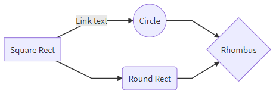

### Larger flowchart with some styling

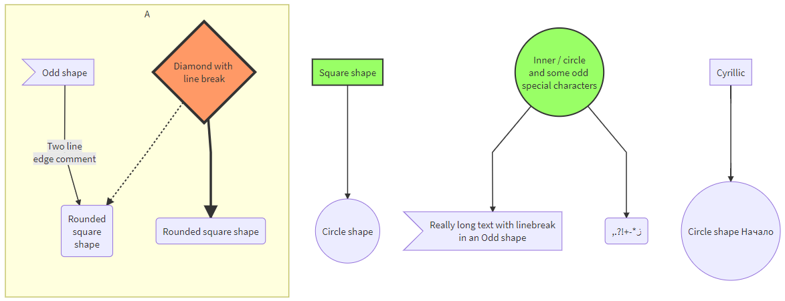

### Loops, alt and opt

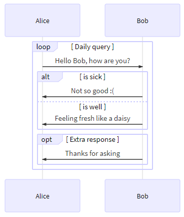

### Message to self in loop

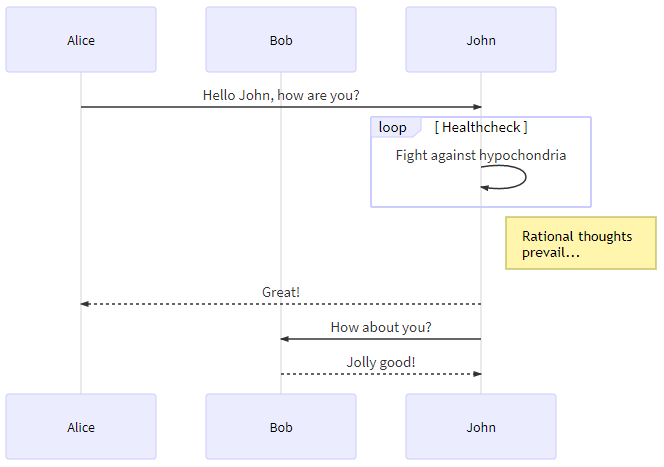


### Ⅳ. 小结

注：**LR**（Left-Right）表示**横向左至右**流程图，**TD**（Top-Down）表示**纵向上至下**流程图用**TB**（Top-Bottom）也一样。**字母反过来就是相应箭头方向相反**。

```mermaid
graph LR  
    START -.-> END
```

```mermaid
graph TD
    A-->B
    A-->C
    B-->D
    C-->D
```

**关于图形框**

如上两种展示效果，一般无特殊的表示符号就是在**矩形框**中添加文字。
如果想要其他形式的话（如**圆角矩形框或圆形、菱形**），就请看下面展示，使用方法与上面的相同。
注：由于定义的是一个结点，所以不管LR还是其他的都不影响。

```mermaid
graph LR
    label(圆括号表示是圆角矩形框,外面的label就是一个自设变量)
```

```mermaid
graph LR
    label((两层圆括号表示圆形框))-->
    Label((圆圈大小会随写入的字多少改变直径))
```

```mermaid
graph LR
L{花括号表示菱形}
```


```mermaid
graph LR
    L>书签型,左尖括号,右方括号]
```

**关于连接方式**
可以注意到，上面的展示方式中，结点与结点之间的连接方式用到了"**–>**“和”**—**“还有”**-.->**“分别表示其间**有无箭头相连**以及**虚线连接**。如果要用更粗的连接还能使用”**==>**"表示**粗连接**。
其他还有在有箭头的连线上附加文字。如下：

```mermaid
graph LR
  A-->| cause |B
```

```mermaid
graph LR
    A-- cause -->B
```

```mermaid
graph LR
   A-. 左右要有两点 .-> B
```


```mermaid
graph LR
   A ==>|contect| B 
```


### Github示例

**FLow**

```mermaid
graph TD
A[Hard] -->|Text| B(Round)
B --> C{Decision}
C -->|One| D[Result 1]
C -->|Two| E[Result 2]
```

```mermaid
graph TD;
    A-->B;
    A-->C;
    B-->D;
    C-->D;
```


**Sequence**

```mermaid
sequenceDiagram
Alice->>John: Hello John, how are you?
loop Healthcheck
    John->>John: Fight against hypochondria
end
Note right of John: Rational thoughts!
John-->>Alice: Great!
John->>Bob: How about you?
Bob-->>John: Jolly good!
```

```mermaid
sequenceDiagram
    participant Alice
    participant Bob
    Alice->>John: Hello John, how are you?
    loop Healthcheck
        John->>John: Fight against hypochondria
    end
    Note right of John: Rational thoughts <br/>prevail!
    John-->>Alice: Great!
    John->>Bob: How about you?
    Bob-->>John: Jolly good!
```


**Gantt**

```mermaid
gantt
section Section
Completed :done,    des1, 2014-01-06,2014-01-08
Active        :active,  des2, 2014-01-07, 3d
Parallel 1   :         des3, after des1, 1d
Parallel 2   :         des4, after des1, 1d
Parallel 3   :         des5, after des3, 1d
Parallel 4   :         des6, after des4, 1d
```

```mermaid
gantt
dateFormat  YYYY-MM-DD
title Adding GANTT diagram to mermaid
excludes weekdays 2014-01-10

section A section
Completed task            :done,    des1, 2014-01-06,2014-01-08
Active task               :active,  des2, 2014-01-09, 3d
Future task               :         des3, after des2, 5d
Future task2               :         des4, after des3, 5d
```


**Class**

```mermaid
classDiagram
Class01 <|-- AveryLongClass : Cool
<<interface>> Class01
Class09 --> C2 : Where am i?
Class09 --* C3
Class09 --|> Class07
Class07 : equals()
Class07 : Object[] elementData
Class01 : size()
Class01 : int chimp
Class01 : int gorilla
class Class10 {
  <<service>>
  int id
  size()
}
```

```mermaid
classDiagram
Class01 <|-- AveryLongClass : Cool
Class03 *-- Class04
Class05 o-- Class06
Class07 .. Class08
Class09 --> C2 : Where am i?
Class09 --* C3
Class09 --|> Class07
Class07 : equals()
Class07 : Object[] elementData
Class01 : size()
Class01 : int chimp
Class01 : int gorilla
Class08 <--> C2: Cool label
```


**State**

```mermaid
stateDiagram
[*] --> Still
Still --> [*]
Still --> Moving
Moving --> Still
Moving --> Crash
Crash --> [*]
```

**Pie**

```mermaid
pie
"Dogs" : 386
"Cats" : 85
"Rats" : 150 
```

**Git**

*Coming soon!*


### 官方文档

可以看到在最新版的v8.4当中加入了不少新的图表类型，但是由于Typora还不能完全支持，所以可以在后续之中体验。

以下列出mermaid.js现有支持的图表类型：

#### Flowchart

```
graph TD;
    A-->B;
    A-->C;
    B-->D;
    C-->D;
```

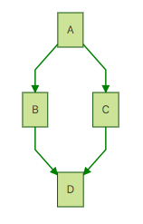

#### Sequence diagram

```
sequenceDiagram
    participant Alice
    participant Bob
    Alice->>John: Hello John, how are you?
    loop Healthcheck
        John->>John: Fight against hypochondria
    end
    Note right of John: Rational thoughts <br/>prevail!
    John-->>Alice: Great!
    John->>Bob: How about you?
    Bob-->>John: Jolly good!
```

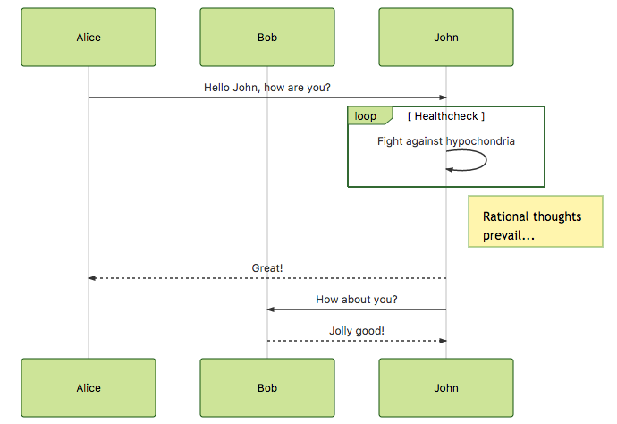

#### Gantt diagram

```
gantt
dateFormat  YYYY-MM-DD
title Adding GANTT diagram to mermaid
excludes weekdays 2014-01-10

section A section
Completed task            :done,    des1, 2014-01-06,2014-01-08
Active task               :active,  des2, 2014-01-09, 3d
Future task               :         des3, after des2, 5d
Future task2               :         des4, after des3, 5d
```

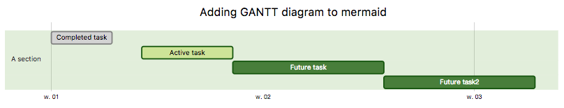

#### Class diagram -  experimental

```
classDiagram
Class01 <|-- AveryLongClass : Cool
Class03 *-- Class04
Class05 o-- Class06
Class07 .. Class08
Class09 --> C2 : Where am i?
Class09 --* C3
Class09 --|> Class07
Class07 : equals()
Class07 : Object[] elementData
Class01 : size()
Class01 : int chimp
Class01 : int gorilla
Class08 <--> C2: Cool label
```

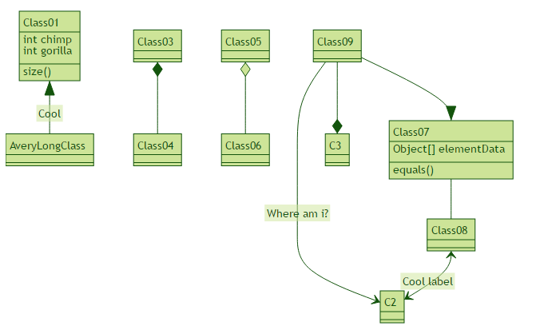

#### ~~Git graph -  experimental~~

```
gitGraph:
options
{
    "nodeSpacing": 150,
    "nodeRadius": 10
}
end
commit
branch newbranch
checkout newbranch
commit
commit
checkout master
commit
commit
merge newbranch
```


### FAQ

1. How to add title to flowchart?

     有两种方式

    ```mermaid
    graph TD
    
    title[<u>My Title</u>]
    title-->FirstStep
    style title fill:#FFF,stroke:#FFF
    linkStyle 0 stroke:#FFF,stroke-width:0;
    
    FirstStep-->...
    ```

    ```mermaid
    graph LR
      subgraph This is my caption
        A --> B
      end
    ```

    

2. How to add newline in the text?

     

    ```mermaid
    graph TD;
    
    subgraph Line breaks <br /> don't work in <br /> Subgraphs
        inset[Line breaks <br />work in <br />Insets]
    end
    
        inset-->A
    
      A(Line breaks<br />work in<br />rounded rec nodes)
      B{Line breaks <br />work in<br />decision nodes}
      C[Line breaks<br />work in<br /> rectangles]
      D((Line breaks <br />work in <br />circles))
      E>Line breaks <br />work in <br />flag nodes]
    
    
        A-->B
        B--yes-->C
        B--no-->E
        C-->D
     
    
    
    style A fill:#ed6,stroke:#333,stroke-width:2px;
    style B fill:#ed6,stroke:#333,stroke-width:2px;
    style C fill:#ed6,stroke:#333,stroke-width:2px;
    style D fill:#ed6,stroke:#333,stroke-width:2px;
    style E fill:#ed6,stroke:#333,stroke-width:2px;
    style inset fill:#ed6,stroke:#333,stroke-width:2px;
    ```

    ```mermaid
    graph TD
    
    Y(BEHAVIOUR OUTSIDE<br/>OF SUBGRAPHS)
    Z(BEHAVIOUR OUTSIDE<br>OF SUBGRAPHS)
    a-- long arrow message line 1<br>line 2 of long arrow message --> b
    c-- long arrow message line 1<br/>line 2 of long arrow message --> d
    
    subgraph BEHAVIOUR INSIDE<br>OF SUBGRAPHS
      e-- long arrow message line 1<br>line 2 of long arrow message --> f
    end
    
    subgraph BEHAVIOUR INSIDE<br/>OF SUBGRAPHS
      g-- long arrow message line 1<br/>line 2 of long arro- message --> h
    end
    ```

    

3. How to change flowchart curve style?

    ```mermaid
    graph TD
      %% Set edges to be curved (try monotoneX for a nice alternative)
      linkStyle default interpolate basis
      A[Christmas] -->|Get money| B(Go shopping)
      B --> C{Let me think}
      C -->|One| D[Laptop]
      C -->|Two| E[iPhone]
      C -->|Three| F[fa:fa-car Car]
    ```

    


