# Markdown最新作图指南：flowchart.js & mermaid.js


## <font color=red>下篇：mermaid.js</font>


### Ⅰ. mermaid.js 简介

相比于`flowchart.js`专注于流程图领域，`mermaid.js`的“野心”要大得多：在其官方文档中就直接说明想以`markdown`的风格替换掉`Visio`等较重的工具。

>Generation of diagrams and flowcharts from text in a similar manner as markdown.
>
>Ever wanted to simplify documentation and avoid heavy tools like Visio when explaining your code?
>
>This is why mermaid was born, a simple markdown-like script language for generating charts from text via javascript.

> **Mermaid was nominated and won the JS Open Source Awards (2019) in the category "The most exciting use of technology"!!! Thanks to all involved, people committing pull requests, people answering questions and special thanks to Tyler Long who is helping me maintain the project.**

不过作者也并非吹牛，除了在Github上收获28.8k的Star数，还获得了 **JS Open Source Awards (2019)**

项目发起人对该项目的介绍：

https://github.com/mermaid-js/mermaid/issues/866

项目地址：https://github.com/mermaid-js/mermaid

项目文档：https://mermaid-js.github.io/mermaid/#/

在线编辑器：https://mermaidjs.github.io/mermaid-live-editor/

项目最新版本为为 v8.4，支持的图表类型有：

- **Flow**：流程图
- **Sequence**：序列图
- **Gantt**：甘特图
- **Class**：类图
- **State**：状态图
- **Pie**：饼图
- ~~**Git**：Git图（尚在测试）~~

目前除了Git图，其余六种图表都已经在最新版的Typora中可以使用。


### Ⅱ. mermaid.js语法

不同于 flowchart.js，由于mermaid.js支持多种不同类别的图形，所以在作图之前需要先声明图形的种类，然后再按照对应的语法绘图。

#### 1. 流程图(Flowcharts)

流程图的声明方式为关键字 graph 加上流程图对应的结构，例如：

This statement declares a new graph and the direction of the graph layout.

This declares a graph oriented from top to bottom (`TD` or `TB`).

```
graph TD
    Start --> Stop
```

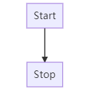

This declares a graph oriented from left to right (`LR`).

```
graph LR
    Start --> Stop
```

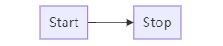

可以定义的流程图结构有：

- TB - top bottom：由上到下
- BT - bottom top：由下到上
- RL - right left：从右到左
- LR - left right：从左到右
- TD - same as TB：cong

##### 节点形状 Nodes & shapes

###### A node (default)

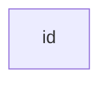

Note that the id is what is displayed in the box.

###### A node with text

It is also possible to set text in the box that differs from the id. If this is done several times, it is the last text found for the node that will be used. Also if you define edges for the node later on, you can omit text definitions. The one previously defined will be used when rendering the box.

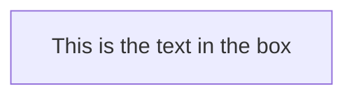

###### A node with round edges

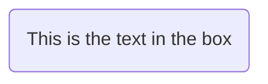

###### A node in the form of a circle

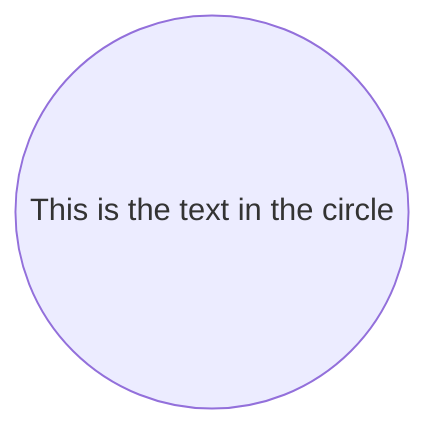

###### A node in an asymetric shape

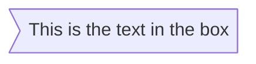

currently only the shape above is possible and not its mirror. *This might change with future releases.*

###### A node (rhombus)

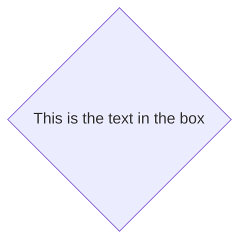

###### A hexagon node

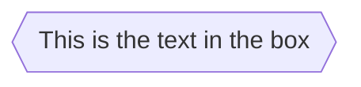

###### Parallelogram

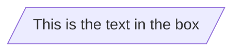

###### Parallelogram alt

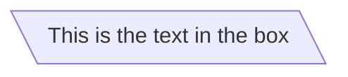

###### Trapezoid

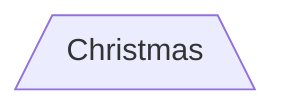

###### Trapezoid alt

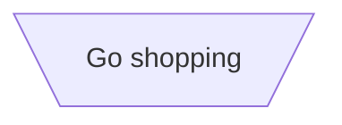

##### 节点间连线Links between nodes

Nodes can be connected with links/edges. It is possible to have different types of links or attach a text string to a link.

###### A link with arrow head


###### An open link

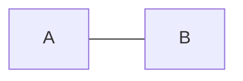

###### Text on links

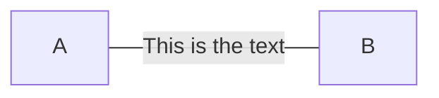

or


###### A link with arrow head and text

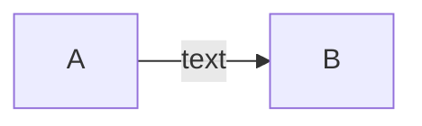

or


###### Dotted link

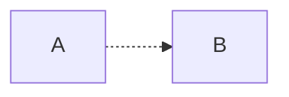

###### Dotted link with text

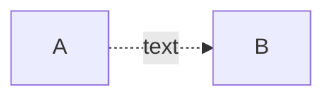

###### Chaining of links

It is possible declare many links in the same line as per below:

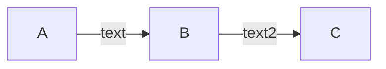

If you describe the same diagram using the the basic syntax, it will take four lines. A word of warning, one could go overboard with this making the graph harder to read in markdown form. The Swedish word `lagom` comes to mind. It means, not to much and not to little. This goes for expressive syntaxes as well.

```mermaid
graph TB
    A --> C
    A --> D
    B --> C
    B --> D
```

##### Subgraphs

```
subgraph title
    graph definition
end
```

An example below:

```mermaid
graph TB
    c1-->a2
    subgraph one
    a1-->a2
    end
    subgraph two
    b1-->b2
    end
    subgraph three
    c1-->c2
    end
```


##### 样式和类Styling and classes

###### Styling a node

It is possible to apply specific styles such as a thicker border or a different background color to a node.

```mermaid
graph LR
    id1(Start)-->id2(Stop)
    style id1 fill:#f9f,stroke:#333,stroke-width:4px
    style id2 fill:#bbf,stroke:#f66,stroke-width:2px,color:#fff,stroke-dasharray: 5, 5
```

###### Classes

More convenient then defining the style every time is to define a class of styles and attach this class to the nodes that should have a different look.

a class definition looks like the example below:

```
    classDef className fill:#f9f,stroke:#333,stroke-width:4px;
```

Attachment of a class to a node is done as per below:

```
    class nodeId1 className;
```

It is also possible to attach a class to a list of nodes in one statement:

```
    class nodeId1,nodeId2 className;
```

A shorter form of adding a class is to attach the classname to the node using the `:::`operator as per below:

```mermaid
graph LR
    A:::someclass --> B:::otherclass
    classDef someclass fill:#f9f,stroke:#333,stroke-width:4px;
    classDef otherclass fil:#f96;
```

#### 2. 序列图(Sequence diagrams)

> A Sequence diagram is an interaction diagram that shows how processes operate with one another and in what order.
>
> 序列图是对对象之间传送消息的时间顺序的可视化表示。

Mermaid can render sequence diagrams.

```mermaid
sequenceDiagram
    Alice->>John: Hello John, how are you?
    John-->>Alice: Great!
```

##### Participants

The participants can be defined implicitly as in the first example on this page. The participants or actors are rendered in order of appearance in the diagram source text. Sometimes you might want to show the participants in a different order than how they appear in the first message. It is possible to specify the actor's order of appearance by doing the following:

```mermaid
sequenceDiagram
    participant John
    participant Alice
    Alice->>John: Hello John, how are you?
    John-->>Alice: Great!
```

##### Aliases

The actor can have a convenient identifier and a descriptive label.

```mermaid
sequenceDiagram
    participant A as Alice
    participant J as John
    A->>J: Hello John, how are you?
    J->>A: Great!
```

##### Messages

Messages can be of two displayed either solid or with a dotted line.

```
[Actor][Arrow][Actor]:Message text
```

There are six types of arrows currently supported:

| Type | Description                                 |
| ---- | ------------------------------------------- |
| ->   | Solid line without arrow                    |
| -->  | Dotted line without arrow                   |
| ->>  | Solid line with arrowhead                   |
| -->> | Dotted line with arrowhead                  |
| -x   | Solid line with a cross at the end (async)  |
| --x  | Dotted line with a cross at the end (async) |

##### Activations

It is possible to activate and deactivate an actor. (de)activation can be dedicated declarations:

```mermaid
sequenceDiagram
    Alice->>John: Hello John, how are you?
    activate John
    John-->>Alice: Great!
    deactivate John
```

There is also a shortcut notation by appending `+`/`-` suffix to the message arrow:

```mermaid
sequenceDiagram
    Alice->>+John: Hello John, how are you?
    John-->>-Alice: Great!
```

Activations can be stacked for same actor:

```mermaid
sequenceDiagram
    Alice->>+John: Hello John, how are you?
    Alice->>+John: John, can you hear me?
    John-->>-Alice: Hi Alice, I can hear you!
    John-->>-Alice: I feel great!
```

##### Notes

It is possible to add notes to a sequence diagram. This is done by the notation Note [ right of | left of | over ] [Actor]: Text in note content

See the example below:

```mermaid
sequenceDiagram
    participant John
    Note right of John: Text in note
```

It is also possible to create notes spanning two participants:

```mermaid
sequenceDiagram
    Alice->John: Hello John, how are you?
    Note over Alice,John: A typical interaction
```

##### Loops

It is possible to express loops in a sequence diagram. This is done by the notation

```
loop Loop text
... statements ...
end
```

See the example below:

```mermaid
sequenceDiagram
    Alice->John: Hello John, how are you?
    loop Every minute
        John-->Alice: Great!
    end
```

##### Alt

It is possible to express alternative paths in a sequence diagram. This is done by the notation

```
alt Describing text
... statements ...
else
... statements ...
end
```

or if there is sequence that is optional (if without else).

```
opt Describing text
... statements ...
end
```

See the example below:

```mermaid
sequenceDiagram
    Alice->>Bob: Hello Bob, how are you?
    alt is sick
        Bob->>Alice: Not so good :(
    else is well
        Bob->>Alice: Feeling fresh like a daisy
    end
    opt Extra response
        Bob->>Alice: Thanks for asking
    end
```

##### Background Highlighting

It is possible to highlight flows by providing colored background rects. This is done by the notation

The colors are defined using rgb and rgba syntax.

```
rect rgb(0, 255, 0)
... content ...
end

rect rgba(0, 0, 255, .1)
... content ...
end
```

See the examples below:

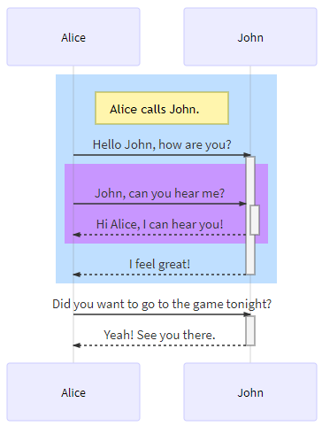

##### Comments

Comments can be entered within a sequence diagram, which will be ignored by the parser. Comments need to be on their own line, and must be prefaced with `%%` (double percent signs). Any text after the start of the comment to the next newline will be treated as a comment, including any diagram syntax

```
sequenceDiagram
    Alice->>John: Hello John, how are you?
    %% this is a comment
    John-->>Alice: Great!
```


It can also be be turned on via the diagram code as in the diagram:

```mermaid
sequenceDiagram
    Alice->>John: Hello John, how are you?
    loop Healthcheck
        John->>John: Fight against hypochondria
    end
    Note right of John: Rational thoughts!
    John-->>Alice: Great!
    John->>Bob: How about you?
    Bob-->>John: Jolly good!
```

#### 3. 类图（Class diagrams）

> "In software engineering, a class diagram in the Unified Modeling Language (UML) is a type of static structure diagram that describes the structure of a system by showing the system's classes, their attributes, operations (or methods), and the relationships among objects." Wikipedia
>
> 类图是面向对象建模的主要组成部分，显示了模型的静态结构，特别是模型中存在的类、类的内部结构以及它们与其他类的关系等。无论是在面向对象编程还是数据建模，类图都有着很广泛的应用。


The class diagram is the main building block of object-oriented modeling. It is used for general conceptual modeling of the structure of the application, and for detailed modeling translating the models into programming code. Class diagrams can also be used for data modeling. The classes in a class diagram represent both the main elements, interactions in the application, and the classes to be programmed.

Mermaid can render class diagrams.

```
 classDiagram
      Animal <|-- Duck
      Animal <|-- Fish
      Animal <|-- Zebra
      Animal : +int age
      Animal : +String gender
      Animal: +isMammal()
      Animal: +mate()
      class Duck{
          +String beakColor
          +swim()
          +quack()
      }
      class Fish{
          -int sizeInFeet
          -canEat()
      }
      class Zebra{
          +bool is_wild
          +run()
      }
```

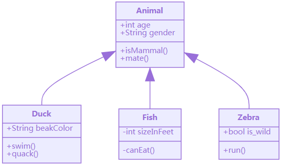

##### Class

UML provides mechanisms to represent class members, such as attributes and methods, and additional information about them. A single instance of a class in the diagram contains three compartments:

- The top compartment contains the name of the class. It is printed in bold and centered, and the first letter is capitalized. It may also contain optional annotation text describing the nature of the class.
- The middle compartment contains the attributes of the class. They are left-aligned and the first letter is lowercase.
- The bottom compartment contains the operations the class can execute. They are also left-aligned and the first letter is lowercase.

类图的基本组成单元包含三层：

- 顶层主要显示类的名称，以粗体的形式居中，并且首字母为大写，可以含有可选的注释；
- 中间层包含类的属性，左对齐且属性首字母小写，通常属性的字段类型会被标出；
- 底层包含可以对类执行的操作方法，左对齐且首字母小写，只要在后面加上 `()` 就会被自动归为这层。

```mermaid
classDiagram
    class BankAccount
    BankAccount : +String owner
    BankAccount : +Bigdecimal balance
    BankAccount : +deposit(amount)
    BankAccount : +withdrawl(amount)
```

例如上图中，`BankAccount`是类名，包含两个属性`owner`和`balance`，他们数据类型为`String`和`Bigdecimal`。可以对这个进行操作的方法有`deposit`和`withdraw`，这两种方法操作的过程要带上变量`amount`。

##### Define a class

There are two ways to define a class:

- Explicitly defining a class using keyword **class** like `class Animal`. This defines the Animal class
- Define two classes via a **relationship** between them `Vehicle <|-- Car`. This defines two classes Vehicle and Car along with their relationship.

```mermaid
classDiagram
    class Animal
    Vehicle <|-- Car
```

Naming convention: a class name should be composed of alphanumeric (unicode allowed) and underscore characters.

定义类的方法有两种：

- 使用关键词`class`显式地定义，如`class Animal`；
- 使用关系来定义两个类，如`Vehicle <|-- Car`。


##### Defining Relationship

A relationship is a general term covering the specific types of logical connections found on class and object diagrams.

类和对象之间的联系使用逻辑连接符号，语法规则为：

```
[classA][Arrow][ClassB]:LabelText
```

There are different types of relations defined for classes under UML which are currently supported:

| Type  | Description   |
| ----- | ------------- |
| <\|-- | Inheritance   |
| *--   | Composition   |
| o--   | Aggregation   |
| -->   | Association   |
| --    | Link (Solid)  |
| ..>   | Dependency    |
| ..\|> | Realization   |
| ..    | Link (Dashed) |

```mermaid
classDiagram
classA <|-- classB
classC *-- classD
classE o-- classF
classG <-- classH
classI -- classJ
classK <.. classL
classM <|.. classN
classO .. classP
```

We can use the labels to describe nature of relation between two classes. Also, arrowheads can be used in opposite directions as well :

```mermaid
classDiagram
classA --|> classB : Inheritance
classC --* classD : Composition
classE --o classF : Aggregation
classG --> classH : Association
classI -- classJ : Link(Solid)
classK ..> classL : Dependency
classM ..|> classN : Realization
classO .. classP : Link(Dashed)
```

##### Labels on Relations

It is possible to add a label text to a relation:

```
[classA][Arrow][ClassB]:LabelText
```


```mermaid
classDiagram
classA <|-- classB : implements
classC *-- classD : composition
classE o-- classF : association
```

###### Cardinality / Multiplicity on relations

Multiplicity or cardinality in class diagrams indicates the number of instances of one class linked to one instance of the other class. For example, one company will have one or more employees, but each employee works for just one company.

Multiplicity notations are placed near the ends of an association.

The different cardinality options are :

- `0..1` Zero or one
- `1` Only 1
- `0..1` Zero or One
- `1..*` One or more
- `*` Many
- `n` n {where n>1}
- `0..n` zeor to n {where n>1}
- `1..n` one to n {where n>1}

Cardinality can be easily defined by placing cardinality text within qoutes `"` before(optional) and after(optional) a given arrow.

```
[classA] "cardinality1" [Arrow] "cardinality2" [ClassB]:LabelText
```


```mermaid
classDiagram
    Customer "1" --> "*" Ticket
    Student "1" --> "1..*" Course
    Galaxy --> "many" Star : Contains
```

##### Annotations on classes

我们可以在类图中的类名旁边加上注释，来表示该类的自然属性，常见的注释有：

- `<<Interface>>` 表明为接口类
- `<<abstract>>` 表明为抽象类
- `<<Service>>` 表明为服务类
- `<<enumeration>>` 表明是枚举类

It is possible to annotate classes with a specific marker text which is like meta-data for the class, giving a clear indication about its nature. Some common annotations examples could be:

- `<<Interface>>` To represent an Interface class
- `<<abstract>>` To represent an abstract class
- `<<Service>>` To represent a service class
- `<<enumeration>>` To represent an enum

Annotations are defined within the opening `<<` and closing `>>`. There are two ways to add an annotation to a class and regardless of the syntax used output will be same. The two ways are :

添加的方式有以下两种：

- In a *separate line* after a class is defined. For example:

    ```mermaid
    classDiagram
    	class Shape
    	<<interface>> Shape
    ```


- In a *nested structure* along with class definition. For example:

```mermaid
classDiagram
class Shape{
    <<interface>>
    noOfVertices
    draw()
}
class Color{
    <<enumeration>>
    RED
    BLUE
    GREEN
    WHITE
    BLACK
}
```


#### 4. 状态图（State diagrams）

> "A state diagram is a type of diagram used in computer science and related fields to describe the behavior of systems. State diagrams require that the system described is composed of a finite number of states; sometimes, this is indeed the case, while at other times this is a reasonable abstraction." Wikipedia

状态图是描述一个实体基于事件反应的动态行为，显示了该实体如何根据当前所处的状态对不同的事件做出反应。mermaid.js中使用状态图需要先用`stateDiagram`进行声明。

Mermaid can render state diagrams. The syntax tries to be compliant with the syntax used in plantUml as this will make it easier for users to share diagrams between mermaid and plantUml.

```mermaid
stateDiagram
    [*] --> Still
    Still --> [*]

    Still --> Moving
    Moving --> Still
    Moving --> Crash
    Crash --> [*]
```

上图中存在三个状态：Still、Moving和Crash。其中Still和Moving可以互相转化，Moving可以单向转化为Crash，Still不能直接转化为Crash。

In state diagrams systems are described in terms of its states and how the systems state can change to another state via a transitions. The example diagram above shows three states **Still**, **Moving** and **Crash**. You start in the state of Still. From Still you can change the state to Moving. In Moving you can change the state either back to Still or to Crash. There is no transition from Still to Crash.

##### States

状态类似于一个节点，可以通过以下方式进行：

A state can be declares in multiple ways. The simplest way is to define a state id as a description.

```mermaid
stateDiagram
    s1
```

Another way is by using the state keyword with a description as per below:

```mermaid
stateDiagram
    state "This is a state description" as s2
```

Another way to define a state with a description is to define the state id followed by a colon and the description:

```mermaid
stateDiagram
    s2 : This is a state description
```

##### Transitions

Transitions are path/edges when one state passes into another. This is represented using text arrow, "-->".

When you define a transition between two states and the states are not already defined the undefined states are defined with the id from the transition. You can later add descriptions to states defined this way.

转变类似于节点之间的连线/边，使用`-->`就可以进行表示。转变可以先用于还未定义的状态，然后再对状态进行定义。

```mermaid
stateDiagram
    s1 --> s2
```

It is possible to add text to a transition. To describe what it represents.

```mermaid
stateDiagram
    s1 --> s2: A transition
```

##### Start and End

There are two special states indicating the start and stop of the diagram. These are written with the [*] syntax and the direction of the transition to it defines it either as a start or a stop state.

开始和结束是两个两个比较特殊的状态，直接用`[*] `就可以表示，然后解析器会根据连线箭头的方向判断是开始状态还是结束状态。

```mermaid
stateDiagram
    [*] --> s1
    s1 --> [*]
```

##### Composite states

状态图的实际应用中经常会碰到一个状态包含多个内部状态，这时我们可以使用复合状态图来表示。

In a real world use of state diagrams you often end up with diagrams that are multi-dimensional as one state can have several internal states. These are called composite states in this terminology.

In order to define a composite state you need to use the state keyword followed by and id and the body of the composite state between {}. See the example below:

```mermaid
stateDiagram
    [*] --> First
    state First {
        [*] --> second
        second --> [*]
    }
```

You can do this in several layers:

```mermaid
stateDiagram
    [*] --> First

    state First {
        [*] --> Second

        state Second {
            [*] --> second
            second --> Third

            state Third {
                [*] --> third
                third --> [*]
            }
        }
    }
```

You can also define transitions also between composite states:

```mermaid
stateDiagram
    [*] --> First
    First --> Second
    First --> Third

    state First {
        [*] --> fir
        fir --> [*]
    }
    state Second {
        [*] --> sec
        sec --> [*]
    }
    state Third {
        [*] --> thi
        thi --> [*]
    }
```

*You can not define transitions between internal states belonging to different composite states*

##### Forks

It is possible to specify a fork in the diagram using <<fork>> <<join>>.

```mermaid
   stateDiagram
    state fork_state <<fork>>
      [*] --> fork_state
      fork_state --> State2
      fork_state --> State3

      state join_state <<join>>
      State2 --> join_state
      State3 --> join_state
      join_state --> State4
      State4 --> [*]
```

##### Notes

Sometimes nothing says it better then a Post-it note. That is also the case in state diagrams.

Here you can choose to put the note to the *right of* or to the *left of* a node.

状态图中的批注可以使用  *right of* 或 *left of* 来设置相对于指定节点的位置：

```mermaid
    stateDiagram
        State1: The state with a note
        note right of State1
            Important information! You can write
            notes.
        end note
        State1 --> State2
        note left of State2 : This is the note to the left.
```


##### Concurrency

As in plantUml you can specify concurrency using the -- symbol.

```mermaid
    stateDiagram
        [*] --> Active

        state Active {
            [*] --> NumLockOff
            NumLockOff --> NumLockOn : EvNumLockPressed
            NumLockOn --> NumLockOff : EvNumLockPressed
            --
            [*] --> CapsLockOff
            CapsLockOff --> CapsLockOn : EvCapsLockPressed
            CapsLockOn --> CapsLockOff : EvCapsLockPressed
            --
            [*] --> ScrollLockOff
            ScrollLockOff --> ScrollLockOn : EvCapsLockPressed
            ScrollLockOn --> ScrollLockOff : EvCapsLockPressed
        }
```

##### Comments

Comments can be entered within a state diagram chart, which will be ignored by the parser. Comments need to be on their own line, and must be prefaced with `%%` (double percent signs). Any text after the start of the comment to the next newline will be treated as a comment, including any diagram syntax

```mermaid
stateDiagram
    [*] --> Still
    Still --> [*]
%% this is a comment
    Still --> Moving
    Moving --> Still %% another comment
    Moving --> Crash
    Crash --> [*]
```


#### 5. 甘特图（Gantt diagrams）

> A Gantt chart is a type of bar chart, first developed by Karol Adamiecki in 1896, and independently by Henry Gantt in the 1910s, that illustrates a project schedule. Gantt charts illustrate the start and finish dates of the terminal elements and summary elements of a project.

Mermaid can render Gantt diagrams.

甘特图是一种用来显示项目进展横向条形图，mermaid.js中使用甘特图需要先用`gantt`进行声明，如下图：

```mermaid
gantt
    title A Gantt Diagram
    dateFormat  YYYY-MM-DD
    section Section
    A task           :a1, 2014-01-01, 30d
    Another task     :after a1  , 20d
    section Another
    Task in sec      :2014-01-12  , 12d
    another task      : 24d
```

下面是一个更为详细的例子：

```mermaid
gantt
       dateFormat  YYYY-MM-DD
       title Adding GANTT diagram functionality to mermaid

       section A section
       Completed task            :done,    des1, 2014-01-06,2014-01-08
       Active task               :active,  des2, 2014-01-09, 3d
       Future task               :         des3, after des2, 5d
       Future task2              :         des4, after des3, 5d

       section Critical tasks
       Completed task in the critical line :crit, done, 2014-01-06,24h
       Implement parser and jison          :crit, done, after des1, 2d
       Create tests for parser             :crit, active, 3d
       Future task in critical line        :crit, 5d
       Create tests for renderer           :2d
       Add to mermaid                      :1d

       section Documentation
       Describe gantt syntax               :active, a1, after des1, 3d
       Add gantt diagram to demo page      :after a1  , 20h
       Add another diagram to demo page    :doc1, after a1  , 48h

       section Last section
       Describe gantt syntax               :after doc1, 3d
       Add gantt diagram to demo page      :20h
       Add another diagram to demo page    :48h
```

##### Date format

The default date format is YYYY-MM-DD. You can define your `dateFormat`. For example:

甘特图中默认的时间格式为 YYYY-MM-DD，可以通过关键词 `dateFormat`自定义时间格式。

```
dateFormat YYYY MM DD
```

##### Diagram definition

Input Example Description:

```
YYYY    2014    4 digit year
YY    14    2 digit year
Q    1..4    Quarter of year. Sets month to first month in quarter.
M MM    1..12    Month number
MMM MMMM    January..Dec    Month name in locale set by moment.locale()
D DD    1..31    Day of month
Do    1st..31st    Day of month with ordinal
DDD DDDD    1..365    Day of year
X    1410715640.579    Unix timestamp
x    1410715640579    Unix ms timestamp

Input    Example    Description
H HH    0..23    24 hour time
h hh    1..12    12 hour time used with a A.
a A    am pm    Post or ante meridiem
m mm    0..59    Minutes
s ss    0..59    Seconds
S    0..9    Tenths of a second
SS    0..99    Hundreds of a second
SSS    0..999    Thousandths of a second
Z ZZ    +12:00    Offset from UTC as +-HH:mm, +-HHmm, or Z
```


##### Comments

Comments can be entered within a gantt chart, which will be ignored by the parser. Comments need to be on their own line, and must be prefaced with `%%` (double percent signs). Any text after the start of the comment to the next newline will be treated as a comment, including any diagram syntax

```mermaid
gantt
    title A Gantt Diagram
    %% this is a comment
    dateFormat  YYYY-MM-DD
    section Section
    A task           :a1, 2014-01-01, 30d
    Another task     :after a1  , 20d
    section Another
    Task in sec      :2014-01-12  , 12d
    another task      : 24d
```

#### 6. 饼图（Pie chart diagrams）

> A pie chart (or a circle chart) is a circular statistical graphic, which is divided into slices to illustrate numerical proportion. In a pie chart, the arc length of each slice (and consequently its central angle and area), is proportional to the quantity it represents. While it is named for its resemblance to a pie which has been sliced, there are variations on the way it can be presented. The earliest known pie chart is generally credited to William Playfair's Statistical Breviary of 1801 -Wikipedia

Mermaid can render Pie Chart diagrams.

```mermaid
pie title Pets adopted by volunteers
    "Dogs" : 386
    "Cats" : 85
    "Rats" : 15 
```


Drawing a pie chart is really simple in mermaid.

- Start with `pie` keyword to begin the diagram
- Followed by title keyword and its value in string to give a title to the pie-chart. This is *OPTIONAL*
- Followed by dataSet
    - `label` for a section in the pie diagram within `" "` quotes.
    - Followed by `:` semi-colon as separator
    - Followed by `positive numeric value` (supported upto two decimal places)

[pie] [title] [titlevalue] (OPTIONAL)
"[datakey1]" : [dataValue1]
"[datakey2]" : [dataValue2]
"[datakey3]" : [dataValue3]
.
.

- 以关键字 `pie` 开头声明。
- 然后跟着关键字 `title` 和一个字符串作为饼图的标题（此项为可选）。
- 然后就是数据集
    - `"label"` 标明饼图中类别的标签名；
    - 冒号 `:` 作为标签和值的分隔符；
    - 冒号后面的值会被自动计算为饼图中的比例，必须为正。


### Ⅲ. mermaid.js实例

#### 1. FLow

```mermaid
graph TD
A[Hard] -->|Text| B(Round)
B --> C{Decision}
C -->|One| D[Result 1]
C -->|Two| E[Result 2]
```

```mermaid
graph TD;
    A-->B;
    A-->C;
    B-->D;
    C-->D;
```


1. How to add title to flowchart?

     有两种方式

    ```mermaid
    graph TD
    
    title[<u>My Title</u>]
    title-->FirstStep
    style title fill:#FFF,stroke:#FFF
    linkStyle 0 stroke:#FFF,stroke-width:0;
    
    FirstStep-->...
    ```

    ```mermaid
    graph LR
      subgraph This is my caption
        A --> B
      end
    ```

    

2. How to add newline in the text?

     

    ```mermaid
    graph TD
    a-- 很长的第一行<br>很长的第二行 --> b
    subgraph BEHAVIOUR
      e-- 很长的第三行<br>很长的第四行 --> f
    end
    ```
    
    
    
3. How to change flowchart curve style?

    ```mermaid
    graph TD
      %% Set edges to be curved (try monotoneX for a nice alternative)
      linkStyle default interpolate basis
      A[Christmas] -->|Get money| B(Go shopping)
      B --> C{Let me think}
      C -->|One| D[Laptop]
      C -->|Two| E[iPhone]
      C -->|Three| F[fa:fa-car Car]
    ```

#### 2. Sequence

```mermaid
sequenceDiagram
Alice->>John: Hello John, how are you?
loop Healthcheck
    John->>John: Fight against hypochondria
end
Note right of John: Rational thoughts!
John-->>Alice: Great!
John->>Bob: How about you?
Bob-->>John: Jolly good!
```

Message to self in loop

```mermaid
sequenceDiagram
    participant Alice
    participant Bob
    Alice->>John: Hello John, how are you?
    loop Healthcheck
        John->>John: Fight against hypochondria
    end
    Note right of John: Rational thoughts <br/>prevail!
    John-->>Alice: Great!
    John->>Bob: How about you?
    Bob-->>John: Jolly good!
```


```mermaid
sequenceDiagram
    Alice ->> Bob: Hello Bob, how are you?
    Bob-->>John: How about you John?
    Bob--x Alice: I am good thanks!
    Bob-x John: I am good thanks!
    Note right of John: Bob thinks a long<br/>long time, so long<br/>that the text does<br/>not fit on a row.

    Bob-->Alice: Checking with John...
    Alice->John: Yes... John, how are you?
```


#### 3. Class

```mermaid
classDiagram
Class01 <|-- AveryLongClass : Cool
<<interface>> Class01
Class09 --> C2 : Where am i?
Class09 --* C3
Class09 --|> Class07
Class07 : equals()
Class07 : Object[] elementData
Class01 : size()
Class01 : int chimp
Class01 : int gorilla
class Class10 {
  <<service>>
  int id
  size()
}
```

```mermaid
classDiagram
Class01 <|-- AveryLongClass : Cool
Class03 *-- Class04
Class05 o-- Class06
Class07 .. Class08
Class09 --> C2 : Where am i?
Class09 --* C3
Class09 --|> Class07
Class07 : equals()
Class07 : Object[] elementData
Class01 : size()
Class01 : int chimp
Class01 : int gorilla
Class08 <--> C2: Cool label
```


#### 4. Pie

```mermaid
pie
    title Key elements in Product X
    "Calcium" : 42.96
    "Potassium" : 50.05
    "Magnesium" : 10.01
    "Iron" :  5
```


### Ⅳ. 小结


