## Python开发NLP应用新思路：Streamlit与FastAPI双剑合璧


## Ⅰ. Hanlp

HanLP是一系列模型与算法组成的NLP工具包，目前HanLP 2.0正处于alpha测试阶段。我们可以使用该工具包快速构建分词、词性标注、命名实体识别、依存句法分析、语义依存分析等功能。

Hanlp 2.0 是直接支持 Java 和 Python接口的，这点与 Hanlp 1.x版本不同。1.x版本主要支持 java，使用python调用实际调用的是 pyhanlp相关接口。具体项目详情可以登录相关项目主页：

https://github.com/hankcs/HanLP

由于Hanlp 2.0基于 TensorFlow 2.1，因此需要先安装最新版 TensorFlow：

`pip install tensorflow`

我用的是云服务器，没有安装GPU版本，直接安装会安装 TensorFlow 1.x 的版本，可以使用以下命令升级：

`pip install tensorflow --upgrade`

完成后可以测试一下是否安装成功：

```python
import tensorflow as tf

print(tf.__version__)
```

```
'2.1.0'
```

显示了正确的版本好，然后就可以直接安装 Hanlp：

`pip install hanlp`

Hanlp会自动根据已经安装的tensorflow版本安装相应版本，同样通过测试版本号验证是否安装成功：

```python
import hanlp

print(hanlp.__version__)
```

```
'2.0.0-alpha.38'
```

建议大家尽量使用云服务器并且新建专用环境进行管理，因为相关依赖较多，容易与其他项目出现包冲突。另外hanlp虽然本身文件不大，但是需要的预训练模型较大，如果下载到本地请预留足够的空间。

打印 `hanlp.pretrained.ALL` 可以列出HanLP中的所有预训练模型。

```python
print(hanlp.pretrained.ALL)
```

```python
{'CHNSENTICORP_BERT_BASE_ZH': 'https://file.hankcs.com/hanlp/classification/chnsenticorp_bert_base_20200104_164655.zip',
 'CONLL03_NER_BERT_BASE_UNCASED_EN': 'https://file.hankcs.com/hanlp/ner/ner_conll03_bert_base_uncased_en_20200104_194352.zip',
 'CONVSEG_W2V_NEWS_TENSITE': 'https://file.hankcs.com/hanlp/embeddings/convseg_embeddings.zip',
 'CONVSEG_W2V_NEWS_TENSITE_CHAR': 'https://file.hankcs.com/hanlp/embeddings/convseg_embeddings.zip#news_tensite.w2v200',
 'CONVSEG_W2V_NEWS_TENSITE_WORD_MSR': 'https://file.hankcs.com/hanlp/embeddings/convseg_embeddings.zip#news_tensite.msr.words.w2v50',
 'CONVSEG_W2V_NEWS_TENSITE_WORD_PKU': 'https://file.hankcs.com/hanlp/embeddings/convseg_embeddings.zip#news_tensite.pku.words.w2v50',
 'CTB5_BIAFFINE_DEP_ZH': 'https://file.hankcs.com/hanlp/dep/biaffine_ctb5_20191229_025833.zip',
 'CTB5_FASTTEXT_300_CN': 'https://file.hankcs.com/hanlp/embeddings/ctb.fasttext.300.txt.zip',
 'CTB5_POS_RNN': 'https://file.hankcs.com/hanlp/pos/ctb5_pos_rnn_20200113_235925.zip',
 'CTB5_POS_RNN_FASTTEXT_ZH': 'https://file.hankcs.com/hanlp/pos/ctb5_pos_rnn_fasttext_20191230_202639.zip',
 'CTB6_CONVSEG': 'https://file.hankcs.com/hanlp/cws/ctb6_convseg_nowe_nocrf_20200110_004046.zip',
 'CTB7_BIAFFINE_DEP_ZH': 'https://file.hankcs.com/hanlp/dep/biaffine_ctb7_20200109_022431.zip',
 'EMPATHETIC_DIALOGUES_SITUATION_ALBERT_BASE_EN': 'https://file.hankcs.com/hanlp/classification/empathetic_dialogues_situation_albert_base_20200122_212250.zip',
 'EMPATHETIC_DIALOGUES_SITUATION_ALBERT_LARGE_EN': 'https://file.hankcs.com/hanlp/classification/empathetic_dialogues_situation_albert_large_20200123_142724.zip',
 'FLAIR_LM_BW_WMT11_EN': 'https://file.hankcs.com/hanlp/lm/flair_lm_wmt11_en_20200211_091932.zip#flair_lm_bw_wmt11_en',
 'FLAIR_LM_FW_WMT11_EN': 'https://file.hankcs.com/hanlp/lm/flair_lm_wmt11_en_20200211_091932.zip#flair_lm_fw_wmt11_en',
 'GLOVE_6B_100D': 'http://downloads.cs.stanford.edu/nlp/data/glove.6B.zip#glove.6B.100d.txt',
 'GLOVE_6B_200D': 'http://downloads.cs.stanford.edu/nlp/data/glove.6B.zip#glove.6B.200d.txt',
 'GLOVE_6B_300D': 'http://downloads.cs.stanford.edu/nlp/data/glove.6B.zip#glove.6B.300d.txt',
 'GLOVE_6B_50D': 'http://downloads.cs.stanford.edu/nlp/data/glove.6B.zip#glove.6B.50d.txt',
 'GLOVE_6B_ROOT': 'http://downloads.cs.stanford.edu/nlp/data/glove.6B.zip',
 'GLOVE_840B_300D': 'http://nlp.stanford.edu/data/glove.840B.300d.zip',
 'MSRA_NER_ALBERT_BASE_ZH': 'https://file.hankcs.com/hanlp/ner/ner_albert_base_zh_msra_20200111_202919.zip',
 'MSRA_NER_BERT_BASE_ZH': 'https://file.hankcs.com/hanlp/ner/ner_bert_base_msra_20200104_185735.zip',
 'PKU_NAME_MERGED_SIX_MONTHS_CONVSEG': 'https://file.hankcs.com/hanlp/cws/pku98_6m_conv_ngram_20200110_134736.zip',
 'PTB_BIAFFINE_DEP_EN': 'https://file.hankcs.com/hanlp/dep/ptb_dep_biaffine_20200101_174624.zip',
 'PTB_POS_RNN_FASTTEXT_EN': 'https://file.hankcs.com/hanlp/pos/ptb_pos_rnn_fasttext_20200103_145337.zip',
 'RADICAL_CHAR_EMBEDDING_100': 'https://file.hankcs.com/hanlp/embeddings/radical_char_vec_20191229_013849.zip#character.vec.txt',
 'SEMEVAL15_DM_BIAFFINE_EN': 'https://file.hankcs.com/hanlp/sdp/semeval15_biaffine_dm_20200106_122808.zip',
 'SEMEVAL15_PAS_BIAFFINE_EN': 'https://file.hankcs.com/hanlp/sdp/semeval15_biaffine_pas_20200103_152405.zip',
 'SEMEVAL15_PSD_BIAFFINE_EN': 'https://file.hankcs.com/hanlp/sdp/semeval15_biaffine_psd_20200106_123009.zip',
 'SEMEVAL16_EMBEDDINGS_300_NEWS_CN': 'https://file.hankcs.com/hanlp/embeddings/semeval16_embeddings.zip#news.fasttext.300.txt',
 'SEMEVAL16_EMBEDDINGS_300_TEXT_CN': 'https://file.hankcs.com/hanlp/embeddings/semeval16_embeddings.zip#text.fasttext.300.txt',
 'SEMEVAL16_EMBEDDINGS_CN': 'https://file.hankcs.com/hanlp/embeddings/semeval16_embeddings.zip',
 'SEMEVAL16_NEWS_BIAFFINE_ZH': 'https://file.hankcs.com/hanlp/sdp/semeval16-news-biaffine_20191231_235407.zip',
 'SEMEVAL16_TEXT_BIAFFINE_ZH': 'https://file.hankcs.com/hanlp/sdp/semeval16-text-biaffine_20200101_002257.zip',
 'SIGHAN2005_MSR_CONVSEG': 'https://file.hankcs.com/hanlp/cws/convseg-msr-nocrf-noembed_20200110_153524.zip',
 'SIGHAN2005_PKU_CONVSEG': 'https://file.hankcs.com/hanlp/cws/sighan2005-pku-convseg_20200110_153722.zip',
 'SST2_ALBERT_BASE_EN': 'https://file.hankcs.com/hanlp/classification/sst2_albert_base_20200122_205915.zip',
 'SST2_BERT_BASE_EN': 'https://file.hankcs.com/hanlp/classification/sst2_bert_base_uncased_en_20200210_090240.zip',
 'TENCENT_AI_LAB_EMBEDDING': 'https://ai.tencent.com/ailab/nlp/data/Tencent_AILab_ChineseEmbedding.tar.gz#Tencent_AILab_ChineseEmbedding.txt'}
```

|                    模型名称                    |                           下载地址                           | 功能说明           |
| :--------------------------------------------: | :----------------------------------------------------------: | ------------------ |
|           CHNSENTICORP_BERT_BASE_ZH            | https://file.hankcs.com/hanlp/classification/chnsenticorp_bert_base_20200104_164655.zip | 分类               |
|        CONLL03_NER_BERT_BASE_UNCASED_EN        | https://file.hankcs.com/hanlp/ner/ner_conll03_bert_base_uncased_en_20200104_194352.zip | 命名实体识别       |
|            CONVSEG_W2V_NEWS_TENSITE            | https://file.hankcs.com/hanlp/embeddings/convseg_embeddings.zip | 词嵌入             |
|         CONVSEG_W2V_NEWS_TENSITE_CHAR          | https://file.hankcs.com/hanlp/embeddings/convseg_embeddings.zip#news_tensite.w2v200 | 词嵌入             |
|       CONVSEG_W2V_NEWS_TENSITE_WORD_MSR        | https://file.hankcs.com/hanlp/embeddings/convseg_embeddings.zip#news_tensite.msr.words.w2v50 | 词嵌入             |
|       CONVSEG_W2V_NEWS_TENSITE_WORD_PKU        | https://file.hankcs.com/hanlp/embeddings/convseg_embeddings.zip#news_tensite.pku.words.w2v50 | 词嵌入             |
|              CTB5_BIAFFINE_DEP_ZH              | https://file.hankcs.com/hanlp/dep/biaffine_ctb5_20191229_025833.zip | 依存解析           |
|              CTB5_FASTTEXT_300_CN              | https://file.hankcs.com/hanlp/embeddings/ctb.fasttext.300.txt.zip | 词嵌入             |
|                  CTB5_POS_RNN                  | https://file.hankcs.com/hanlp/pos/ctb5_pos_rnn_20200113_235925.zip | 词性标注           |
|            CTB5_POS_RNN_FASTTEXT_ZH            | https://file.hankcs.com/hanlp/pos/ctb5_pos_rnn_fasttext_20191230_202639.zip | 词性标注           |
|                  CTB6_CONVSEG                  | https://file.hankcs.com/hanlp/cws/ctb6_convseg_nowe_nocrf_20200110_004046.zip | 分词               |
|              CTB7_BIAFFINE_DEP_ZH              | https://file.hankcs.com/hanlp/dep/biaffine_ctb7_20200109_022431.zip | 依存解析           |
| EMPATHETIC_DIALOGUES_SITUATION_ALBERT_BASE_EN  | https://file.hankcs.com/hanlp/classification/empathetic_dialogues_situation_albert_base_20200122_212250.zip | 分类               |
| EMPATHETIC_DIALOGUES_SITUATION_ALBERT_LARGE_EN | https://file.hankcs.com/hanlp/classification/empathetic_dialogues_situation_albert_large_20200123_142724.zip | 分类               |
|              FLAIR_LM_BW_WMT11_EN              | https://file.hankcs.com/hanlp/lm/flair_lm_wmt11_en_20200211_091932.zip#flair_lm_bw_wmt11_en | 语言模型           |
|              FLAIR_LM_FW_WMT11_EN              | https://file.hankcs.com/hanlp/lm/flair_lm_wmt11_en_20200211_091932.zip#flair_lm_fw_wmt11_en | 语言模型           |
|                 GLOVE_6B_100D                  | http://downloads.cs.stanford.edu/nlp/data/glove.6B.zip#glove.6B.100d.txt | 英文单词词向量数据 |
|                 GLOVE_6B_200D                  | http://downloads.cs.stanford.edu/nlp/data/glove.6B.zip#glove.6B.200d.txt | 英文单词词向量数据 |
|                 GLOVE_6B_300D                  | http://downloads.cs.stanford.edu/nlp/data/glove.6B.zip#glove.6B.300d.txt | 英文单词词向量数据 |
|                  GLOVE_6B_50D                  | http://downloads.cs.stanford.edu/nlp/data/glove.6B.zip#glove.6B.50d.txt | 英文单词词向量数据 |
|                 GLOVE_6B_ROOT                  |    http://downloads.cs.stanford.edu/nlp/data/glove.6B.zip    | 英文单词词向量数据 |
|                GLOVE_840B_300D                 |       http://nlp.stanford.edu/data/glove.840B.300d.zip       | 英文单词词向量数据 |
|            MSRA_NER_ALBERT_BASE_ZH             | https://file.hankcs.com/hanlp/ner/ner_albert_base_zh_msra_20200111_202919.zip | 命名实体识别       |
|             MSRA_NER_BERT_BASE_ZH              | https://file.hankcs.com/hanlp/ner/ner_bert_base_msra_20200104_185735.zip | 命名实体识别       |
|       PKU_NAME_MERGED_SIX_MONTHS_CONVSEG       | https://file.hankcs.com/hanlp/cws/pku98_6m_conv_ngram_20200110_134736.zip | 分词               |
|              PTB_BIAFFINE_DEP_EN               | https://file.hankcs.com/hanlp/dep/ptb_dep_biaffine_20200101_174624.zip | 依存解析           |
|            PTB_POS_RNN_FASTTEXT_EN             | https://file.hankcs.com/hanlp/pos/ptb_pos_rnn_fasttext_20200103_145337.zip | 词性标注           |
|           RADICAL_CHAR_EMBEDDING_100           | https://file.hankcs.com/hanlp/embeddings/radical_char_vec_20191229_013849.zip#character.vec.txt | 词嵌入             |
|            SEMEVAL15_DM_BIAFFINE_EN            | https://file.hankcs.com/hanlp/sdp/semeval15_biaffine_dm_20200106_122808.zip | 语义依存分析       |
|           SEMEVAL15_PAS_BIAFFINE_EN            | https://file.hankcs.com/hanlp/sdp/semeval15_biaffine_pas_20200103_152405.zip | 语义依存分析       |
|           SEMEVAL15_PSD_BIAFFINE_EN            | https://file.hankcs.com/hanlp/sdp/semeval15_biaffine_psd_20200106_123009.zip | 语义依存分析       |
|        SEMEVAL16_EMBEDDINGS_300_NEWS_CN        | https://file.hankcs.com/hanlp/embeddings/semeval16_embeddings.zip#news.fasttext.300.txt | 词嵌入             |
|        SEMEVAL16_EMBEDDINGS_300_TEXT_CN        | https://file.hankcs.com/hanlp/embeddings/semeval16_embeddings.zip#text.fasttext.300.txt | 词嵌入             |
|            SEMEVAL16_EMBEDDINGS_CN             | https://file.hankcs.com/hanlp/embeddings/semeval16_embeddings.zip | 词嵌入             |
|           SEMEVAL16_NEWS_BIAFFINE_ZH           | https://file.hankcs.com/hanlp/sdp/semeval16-news-biaffine_20191231_235407.zip | 语义依存分析       |
|           SEMEVAL16_TEXT_BIAFFINE_ZH           | https://file.hankcs.com/hanlp/sdp/semeval16-text-biaffine_20200101_002257.zip | 语义依存分析       |
|             SIGHAN2005_MSR_CONVSEG             | https://file.hankcs.com/hanlp/cws/convseg-msr-nocrf-noembed_20200110_153524.zip | 分词               |
|             SIGHAN2005_PKU_CONVSEG             | https://file.hankcs.com/hanlp/cws/sighan2005-pku-convseg_20200110_153722.zip | 分词               |
|              SST2_ALBERT_BASE_EN               | https://file.hankcs.com/hanlp/classification/sst2_albert_base_20200122_205915.zip | 分类               |
|               SST2_BERT_BASE_EN                | https://file.hankcs.com/hanlp/classification/sst2_bert_base_uncased_en_20200210_090240.zip | 分类               |
|            TENCENT_AI_LAB_EMBEDDING            | https://ai.tencent.com/ailab/nlp/data/Tencent_AILab_ChineseEmbedding.tar.gz#Tencent_AILab_ChineseEmbedding.txt} | 词嵌入             |

可用中文模型：

| 序号 |              模型名称              |       类型       |
| :--: | :--------------------------------: | :--------------: |
|  1   | PKU_NAME_MERGED_SIX_MONTHS_CONVSEG |     中文分词     |
|  2   |       rules.tokenize_english       |     英文分词     |
|  3   |       MSRA_NER_BERT_BASE_ZH        | 中文命名实体识别 |
|  4   |        CTB7_BIAFFINE_DEP_ZH        | 中文依存句法分析 |

以下逐一说明：

### 1. 中文分词

引入模型：

```python
import hanlp
tokenizer = hanlp.load('PKU_NAME_MERGED_SIX_MONTHS_CONVSEG')
```

单句分词：

```python
tokenizer('商品和服务')
```

```python
['商品', '和', '服务']
```

批量并行分词：

```python
tokenizer(['萨哈夫说，伊拉克将同联合国销毁伊拉克大规模杀伤性武器特别委员会继续保持合作。',
           '上海华安工业（集团）公司董事长谭旭光和秘书张晚霞来到美国纽约现代艺术博物馆参观。',
           'HanLP支援臺灣正體、香港繁體，具有新詞辨識能力的中文斷詞系統'])
```

### 2. 英文分词

基于规则的普通函数足够了：

```python
tokenizer = hanlp.utils.rules.tokenize_english
tokenizer("Don't go gentle into that good night.")
```

### 3.中文命名实体识别

中文命名实体识别是字符级模型，输入使用 `list`将字符串转换为字符列表。输出格式为 `(entity, type, begin, end)`。

```python
recognizer = hanlp.load(hanlp.pretrained.ner.MSRA_NER_BERT_BASE_ZH)
recognizer([list('上海华安工业（集团）公司董事长谭旭光和秘书张晚霞来到美国纽约现代艺术博物馆参观。'),
            list('萨哈夫说，伊拉克将同联合国销毁伊拉克大规模杀伤性武器特别委员会继续保持合作。')])
```

```python
[[('上海华安工业（集团）公司', 'NT', 0, 12), 
  ('谭旭光', 'NR', 15, 18), 
  ('张晚霞', 'NR', 21, 24), 
  ('美国', 'NS', 26, 28), 
  ('纽约现代艺术博物馆', 'NS', 28, 37)], 
 [('萨哈夫', 'NR', 0, 3), 
  ('伊拉克', 'NS', 5, 8), 
  ('联合国销毁伊拉克大规模杀伤性武器特别委员会', 'NT', 10, 31)]]
```

### 4.中文依存句法分析

句法分析器的输入是单词列表及词性列表，输出是 CoNLL-X 格式 `[^conllx]` 的句法树。

```python
syntactic_parser = hanlp.load(hanlp.pretrained.dep.CTB7_BIAFFINE_DEP_ZH)
print(syntactic_parser([('蜡烛', 'NN'), ('两', 'CD'), ('头', 'NN'), ('烧', 'VV')]))
```

```python
1	蜡烛	_	NN	_	_	4	nsubj	_	_
2	两	_	CD	_	_	3	nummod	_	_
3	头	_	NN	_	_	4	dep	_	_
4	烧	_	VV	_	_	0	root	_	_
```

这里简单罗列一下34种依存句法关系标签：

```
定中关系ATT
数量关系QUN（quantity）
并列关系COO（coordinate）
同位关系APP（appositive）
附加关系ADJ（adjunct）
动宾关系VOB（verb-object）
介宾关系POB（preposition-object）
主谓关系SBV（subject-verb）
比拟关系SIM（similarity）
时间关系TMP（temporal）
处所关系LOC（locative）
“的”字结构DE
“地”字结构DI
“得”字结构DEI
“所”字结构SUO
“把”字结构BA
“被”字结构BEI
状中结构ADV（adverbial）
动补结构CMP（complement）
兼语结构DBL（double）
关联词CNJ（conjunction）
关联结构 CS(conjunctive structure)
语态结构MT（mood-tense）
连谓结构VV（verb-verb）
核心HED（head）
前置宾语FOB（fronting object）
双宾语DOB（double object）
主题TOP（topic）
独立结构IS（independent structure）
独立分句IC（independent clause）
依存分句DC（dependent clause）
叠词关系VNV （verb-no-verb or verb-one-verb)
一个词YGC
标点 WP
```

由于预训练模型都较大，这里只展示这四个功能，下面介绍 FastAPI 以及这些NLP功能的接口封装。


## Ⅱ. FastAPI

2005年的时候就有人说过：“Python是一门web框架比关键字还多的语言“。近几年随着Python的流行，Django和Flask框架也经常被人们使用。相较于Django的繁重，Flask的低耦合以及清晰的设计文档被人们津津乐道，因此常常被用作微服务的接口开发。不过Flask最为人诟病的是其异步性能，往往需要花费较大精力处理其并发需求。

Python自从在python3.5正式将协程做为底层技术引入之后，关于如何构建标准的异步web框架的讨论就源源不绝。之后便诞生了一些基于 ASGI (Asynchronous Server Gateway Interface异步网关协议接口)的 web 框架，如：API Star、Uvicorn、Starlette、FastAPI等等。其中FastAPI是个比较有趣的项目：它并非一个从零开始的项目，而是基于Starlette和Pydantic，Starlette本身又是基于Uvicorn的。

这里我们可以看一下FastAPI的源码，在dependencies文件夹下的 `utils.py` 引用部分：

```python
from fastapi.dependencies.models import Dependant, SecurityRequirement
from fastapi.security.base import SecurityBase
from fastapi.security.oauth2 import OAuth2, SecurityScopes
from fastapi.security.open_id_connect_url import OpenIdConnect
from fastapi.utils import PYDANTIC_1, get_field_info, get_path_param_names
from pydantic import BaseConfig, BaseModel, create_model
from pydantic.error_wrappers import ErrorWrapper
from pydantic.errors import MissingError
from pydantic.utils import lenient_issubclass
from starlette.background import BackgroundTasks
from starlette.concurrency import run_in_threadpool
from starlette.datastructures import FormData, Headers, QueryParams, UploadFile
from starlette.requests import Request
from starlette.responses import Response
from starlette.websockets import WebSocket
```

因此可以将FastAPI看做对Starlette的高级封装，并引入了Pydantic来对数据进行数据验证和设置管理。单从性能上来说应该是 Uvicorn > Starlette > FastAPI ，FastAPI的官方项目文档也同意这一点。

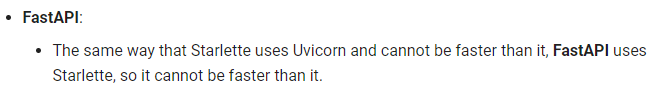

不过并不是哪个性能最好就用使用哪一个，那样的话所有人都只能用机器语言进行开发。FastAPI最吸引人的优点是易于开发，可以编写比传统 web 框架更少的代码并且快速进行接口文档输出。项目官网列出了FastAPI的主要优点，在近期的使用过程中，深以为然：

- **性能快**：高性能，可以和**NodeJS**和**Go**相提并论；
- **快速开发**：开发功能速度提高约200%至300%；
- **更少的Bug**：减少40%开发人员容易引发的错误；
- **直观**：完美的编辑支持，补全功能缩减了debugging的时间；
- **简单**: 易于使用和学习，减少阅读文档的时间；
- **代码简洁**：很大程度上减少代码重复。每个参数可以声明多个功能，减少bug的发生；
- **标准化**：基于并完全兼容API的开发标准： `OpenAPI`（以前称为 `Swagger`）和 `JSON Schema`。

以下简单介绍以下FastAPI的使用。

### 1. 安装

直接使用 `pip`安装：

```
pip install fastapi
```

如果用于生产，那么你还需要一个ASGI服务器，如Uvicorn或Hypercorn

```
pip install uvicorn
```

### 2. 创建FastAPI项目

创建main.py文件

```python
from fastapi import FastAPI

# 实例化
app = FastAPI()

# 创建一个get请求
@app.get("/")
def first_fuc():
    return {"Hello": "World"}

# 再创建一个get请求
@app.get("/any/{item_id}")
def second_fuc(item_id: int, q: str = None):
    return {"item_id": item_id, "q": q}
```

> 如果代码需要用到异步async/await，使用async def，如下所示：

```python
from fastapi import FastAPI

app = FastAPI()

@app.get("/")
async def first_fuc():
    return {"Hello": "World"}

@app.get("/any/{item_id}")
async def second_fuc(item_id: int, q: str = None):
    return {"item_id": item_id, "q": q}
```

### 3. 运行项目

运行服务器：

```css
uvicorn main:app --reload
```

> 命令 `uvicorn main:app --reload` 指的是：
>
> - main：main.py文件
> - app：app = FastAPI() 在main.py内创建的对象。
> - --reload：在代码更改后重新启动服务器。 只有在开发时才使用这个参数。

在Terminal中启动成功后便会显示如下：

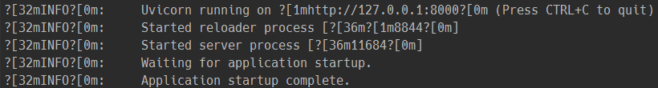

### 4. 检查项目

在你的浏览器打开网址：http://127.0.0.1:8000

你将看见json格式的响应数据：


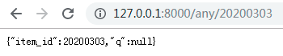

> 这样便创建了一个API：
>
> - url： / 和 / any / {item_id}，两个url都可以接收HTTP请求。
> - / 和  / any / {item_id} 都采用GET方式的HTTP请求方法
> - / any / {item_id}包含路径参数item_id，格式为int
> - / any / {item_id}还包含一个可选的参数q，格式为str

### 5. 交互的API文档

现在进入 http://127.0.0.1:8000/docs

你将会看见自动的交互式API文档，该文档由 Swagger UI 提供。

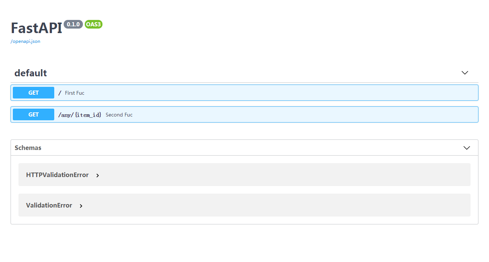

在这个界面可以点开不同的HTTP请求，然后进行接口测试，具体效果见下方动图：

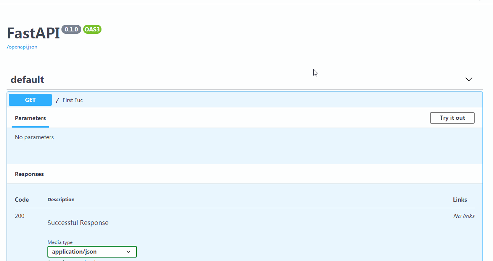


### 6. 备用API文档

现在，转到 http://127.0.0.1:8000/redoc

您将看到备用自动文档（由ReDoc提供）。

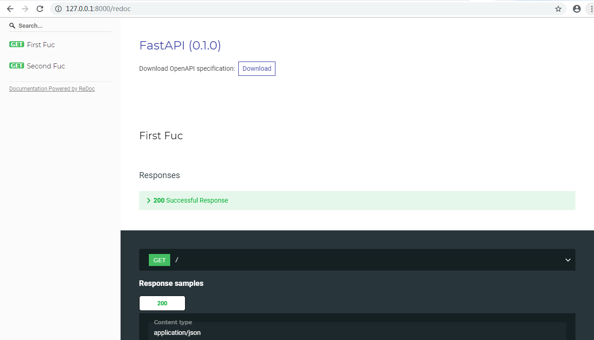

### 7. 下载API接口文档

如果你需要提供你的API接口，那么只需要一行命令，即可下载api文件，一般保存为api.json

```linux
curl -o api.json http://127.0.0.1:8000/openapi.json
```

### 8. 对hanlp进行接口封装

由第Ⅰ部分可得，我们需要调用的四个模型功能中，“中文分词”和“英文分词”两个模型的输入是字符串，“中文命名实体识别”和“中文依存句法分析”两个模型的输入是列表，此处为了方便统一为列表。

因此设计设计接口的输入为以下格式的 JSON 字符串：

```json
{
    "model_name": str,
    "input": list,
}
```

接口的返回输出为：

```json
{
    "success": bool，
    "rlt": list
}
```

下面直接贴出全部的后端代码：

```python
#!/usr/bin/python
# -*- coding: UTF-8 -*-

from fastapi import FastAPI
from pydantic import BaseModel
import hanlp

# 应用实例化
app = FastAPI()

# 导入Hanlp相关模型
tokenizer_zh = hanlp.load('PKU_NAME_MERGED_SIX_MONTHS_CONVSEG')
tokenizer_en = hanlp.utils.rules.tokenize_english
recognizer = hanlp.load(hanlp.pretrained.ner.MSRA_NER_BERT_BASE_ZH)
syntactic_parser = hanlp.load(hanlp.pretrained.dep.CTB7_BIAFFINE_DEP_ZH)


# 定义数据格式
class Data(BaseModel):
    model_name: str
    input: list

# 中文分词接口
@app.post('/tok_zh')
def split_cn(data_zh: Data):
    msg = data_zh.input
    rlt = [tokenizer_zh(x) for x in msg]
    return {'success': True, 'rlt': rlt}

# 英文分词接口
@app.post('/tok_en')
def split_en(data_en: Data):
    msg = data_en.input
    rlt = [tokenizer_en(x) for x in msg]
    return {'success': True, 'rlt': rlt}

# 中文命名实体识别
@app.post('/ner')
def ner(data_zh: Data):
    msg = data_zh.input
    rlt = [recognizer(x) for x in msg]
    return {'success': True, 'rlt': rlt}

# 中文依存句法分析接口
@app.post('/parser')
def parser(data_zh: Data):
    msg = data_zh.input
    rlt = syntactic_parser(msg)
    return {'success': True, 'rlt': rlt}
```

如果希望程序支持异步执行，只需要将以上代码中 `def` 修改为 `async def` 即可。

### 9. 在服务器上启动项目

由于使用了云服务器，所以在运行时要设置 ip 以及端口号：

```
uvicorn main:app --reload --host 0.0.0.0 --port:80
```

其中 `--host` 是设置ip地址，`0.0.0.0`意思就是使用本机的公网 ip， 然后 `--port:80` 是指将端口号设置为80。由于云服务器的安全策略，如果是使用其他端口需要进入控制台开放相应端口的外网访问权限。更多的设置可以通过 `uvicorn --help` 进行查询。项目启动后如果显示以下内容则表示启动成功。

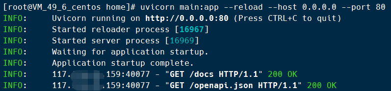

然后在浏览器中输入 `ip 地址/docs` 进入到如下接口页面便可以对接口进行调试：

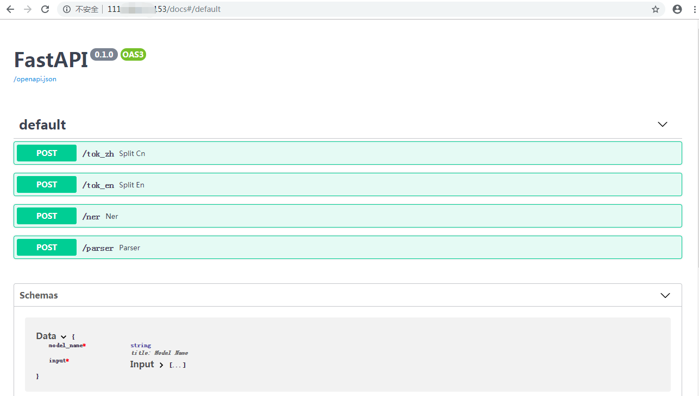

从图中可以看出一共有四个接口，都是 `POST` 类型的，后面有相对路径和函数名。具体测试方法与上文相同，不再赘述。


## Ⅲ. Streamlit

要说2019年开源社区的宝藏项目，Streamlit绝对排的上号。本公众号在之前的文章《使用Python快速制作一个疫情数据分析应用》中也有简单介绍。官方宣称它是：**The fastest way to build custom ML tools**。具体有多块呢？可见下图展示的例子，使用两百多行代码就制作了一个用于自动驾驶的车辆检测应用：


当然 Streamlit 相对于传统前端还是有很多的问题，比如控件数量较少、可修改的自由度有限。而且框架中没有传统的递归，每次请求都相当于重新运行整个脚本或者要使用 `cache` 改进性能。不过作为快速应用的开发，以及机器学习工具的配置前端都是十分得心应手的。毕竟相比花费一、两周制作一个完美的页面，一个小时就能展示模型能力更加吸引 AI 开发者。

这里我就直接贴出使用Streamlit搭建前端的代码：

```python
#!/usr/bin/python
# -*- coding: UTF-8 -*-

import streamlit as st
import requests

# 定义接口查询函数
def send2back(data_bin):
    rlt = requests.post('http://111.229.217.153:80/ner', json=data_bin).json()

st.title("自然语言处理APP")
html_tmp = """
    <div style="background-color:tomato;padding:10px">
    <h2 style="color:white;text-align:center;">基于Hanlp与FastAPI制作</h2>
    </div>
    """
st.markdown(html_tmp, unsafe_allow_html=True)

st.markdown('---')

option = st.selectbox('请选择你想要使用的功能：',
                      ('', '中文分词', '英文分词', '中文命名实体识别', '中文依存句法分析'))
content = st.text_input('请输入待分析的内容：')

if option == '中文分词':
    if st.button("中文分词") & (content != ''):
        data_bin = {'model_name': 'tok_zh', 'input': [content]}
        rlt = requests.post('http://111.229.217.153:80/tok_zh', json=data_bin).json()
        st.text(rlt['rlt'][0])
elif option == '英文分词':
    if st.button("英文分词") & (content != ''):
        data_bin = {'model_name': 'tok_en', 'input': [content]}
        rlt = requests.post('http://111.229.217.153:80/tok_en', json=data_bin).json()
        st.text(rlt['rlt'][0])
elif option == '中文命名实体识别':
    if st.button("命名实体识别") & (content != ''):
        data_bin = {'model_name': 'ner', 'input': [list(content)]}
        rlt = requests.post('http://111.229.217.153:80/ner', json=data_bin).json()
        st.write(rlt)
elif option == '中文依存句法分析':
    if st.button("依存句法分析") & (content != ''):
        data_bin = {'model_name': 'parser', 'input': [content]}
        rlt = requests.post('http://111.229.217.153:80/parser', json=data_bin).json()
        st.write(rlt)
else:
    pass
```

代码中除了前端的页面之外，调用后台接口主要使用的是Python的HTTP库 `requests`。如果后台使用了 `async def`异步函数，那么建议将 `requests` 替换为同为异步的 `aiohttp`。

将以上代码保存为文件 `front.py`，然后在终端中运行：

```
streamlit run front.py
```

运行成功后终端中便会显示如下图：

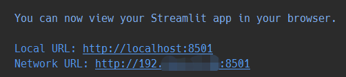

因为我是在本地电脑上运行，默认端口是8501，如果在服务器上运行，具体可以查看文档：

https://docs.streamlit.io/

运行成功后在浏览器中输入：http://localhost:8501/便可看到我们NLP应用的界面：

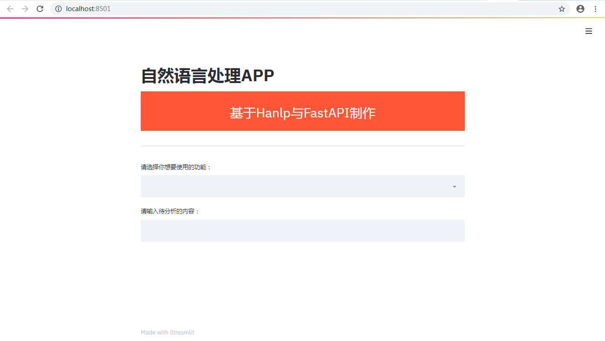

然后我们测试一下：

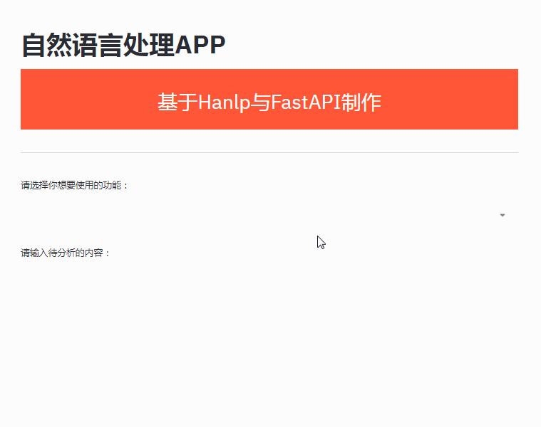

Streamlit的另外一个优点是：开发出来的应用可以基于设备自适应，因此在手机端浏览也会有较好的体验效果。有兴趣的小伙伴可以自行尝试。


## Ⅳ. 进阶

以上简单介绍了使用Hanlp、FastAPI以及Streamlit开发一款自然语言处理应用的方法。其实这也揭示了一种APP开发的趋势：**使用更高级的框架，尽可能地忽略掉底层的细节，以此达到快速开发和迭代的目的**。这并不意味着以后开发人员就不用弄懂web的各种细节，相反，只有明白底层细节同时能够快速上手高级框架并且不至于陷入高度抽象的陷阱当中。

本文提到的三种框架中，Hanlp是基于Tensorflow，FastAPI是基于Scarlett和Pydantic，Streamlit依赖于tornado。想要更多个性化的定制或者提高系统性能，还需要深入了解底层架构，说不定到时可以自己写出基于 pytorch 的 `Hambugerlp` 或者基于 Flink 的 `FasterAPI `。

> 突然觉得 `Hamburgerlp` 和 `FasterAPI` 这两个名字很有创意，看到的童鞋不要抢注。


