### 1. 简介

“数据整理（data wrangling）”是指将原始数据转换得整洁有序的过程，也是数据预处理中的一个重要的步骤。

我们常使用 Pandas 中的数据帧（ data frame）作为数据整理的数据结构，例如用泰坦尼克号乘客的数据创建的数据帧 ：

```python
# 加载库
import pandas as pd

# 创建文件路径
file_path = r'./simulated_datasets/titanic.csv'

# 将数据作为数据帧加载进来
dataframe = pd.read_csv(file_path)

# 查看前 5 行数据
dataframe.head(5)

Name PClass Age Sex Survived SexCode
0 Allen, Miss Elisabeth Walton 1st 29.00 female 1 1
1 Allison, Miss Helen Loraine 1st 2.00 female 0 1
2 Allison, Mr Hudson Joshua Creighton 1st 30.00 male 0 0
3 Allison, Mrs Hudson JC(Bessie waldo Daniels) 1st 25.00 female 0 1
4 Allison, Master Hudson Trevor 1st 0.92 male 1 0
```

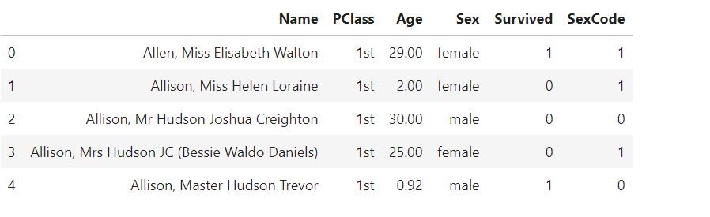

注意在这个数据帧中：

1. 每一行都对应一个观察值（例如，一位乘客），每一列都对应一个特征（性别、年龄等）。例如第一个观察值可知， Elisabeth Walton Allen 小姐住在头等舱，当年 29 岁，在灾难中活了下来。

2. 每一列有一个数据头（例如， Name、 PClass、 Age），每一行有一个索引（例如，Elisabeth Walton Allen 的索引号是 0）。这些数据能用于选择及操作观察值与特征。

3. Sex 和 SexCode 这两列虽然用的是不同的表现形式，但是包含了同样的信息。在Sex 列中，女性用字符串 female 表示，而在 SexCode 列中，女性用整数 1 表示。如果想让所有的特征都是唯一的，需要删除这两列中的一列。


本文会调用 pandas 库，使用各种不同的方法来操作数据帧。

### 2. 创建一个数据帧

使用 DataFrame 创建一个空数据帧并分别定义好每一列 ：

```python
# 加载库
import pandas as pd

# 创建数据帧
dataframe = pd.DataFrame()

# 增加列
dataframe['Name'] = ['Jacky Jackson', 'Steven Stevenson']
dataframe['Age'] = [38, 25]
dataframe['Driver'] = [True, False]

# 查看数据帧
dataframe

Name Age Driver
0 Jacky Jackson 38 True
1 Steven Stevenson 25 False
```

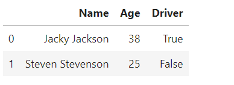

创建完数据帧对象后，往其底部添加新的数据行 ：

```python
# 创建一行
new_person = pd.Series(['Molly Mooney', 40, True], index=['Name','Age','Driver'])

# 附加一行
dataframe.append(new_person, ignore_index=True)

Name Age Driver
0 Jacky Jackson 38 True
1 Steven Stevenson 25 False
2 Molly Mooney 40 True
```

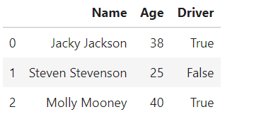


### 3. 描述数据

在加载完数据之后，使用 head 查看前几行数据：

```python
# 加载库
import pandas as pd

# 创建文件路径
file_path = r'./simulated_datasets/titanic.csv'

# 加载数据
dataframe = pd.read_csv(file_path)

# 查看前两行数据
dataframe.head(2)

Name PClass Age Sex Survived SexCode
0 Allen, Miss Elisabeth Walton 1st 29.0 female 1 1
1 Allison, Miss Helen Loraine 1st 2.0 female 0 1
```

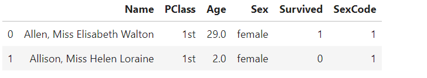

也可以查看行和列的数量 ：

```python
# 查看维数
dataframe.shape

# (1313, 6)
```

或者，也可以使用 describe 来获取任何数值型列的描述性统计量 ：

```python
# 查看描述性统计量
dataframe.describe()

Age Survived SexCode
count 756.000000 1313.000000 1313.000000
mean 30.397989 0.342727 0.351866
std 14.259049 0.474802 0.477734
min 0.170000 0.000000 0.000000
25% 21.000000 0.000000 0.000000
50% 28.000000 0.000000 0.000000
75% 39.000000 1.000000 1.000000
max 71.000000 1.000000 1.000000
```

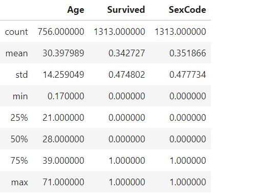

使用 head 可以查看数据集的前几行（默认查看前 5 行），使用 tail 可以查看最后几行 ；使用shape 可以查看数据帧中包含了多少行和多少列 ；最后，使用 describe 能查看任何数值型的列的基本描述性统计量。

描述性统计量并不一定能全面反映数据的情况。例如 SexCode（代表乘客的性别）列的标准差，不能提供很直观的结论。

### 4. 浏览数据帧

使用 loc 或 iloc 能从一个数据帧中挑出单个数据或一部分数据 ：

```python
# 加载库
import pandas as pd

# 创建文件路径
file_path = r'./simulated_datasets/titanic.csv'

# 加载数据
dataframe = pd.read_csv(file_path)

# 选择第一行
dataframe.iloc[0]

Name Allen, Miss Elisabeth Walton
PClass 1st
Age 29
Sex female
Survived 1
SexCode 1
Name: 0, dtype: object
```

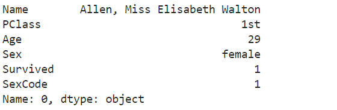

可以使用冒号“: ”来定义想要选择哪些行。比如选择第 2、 3、 4 行 ：

```python
# 选择三行
dataframe.iloc[1:4]
```

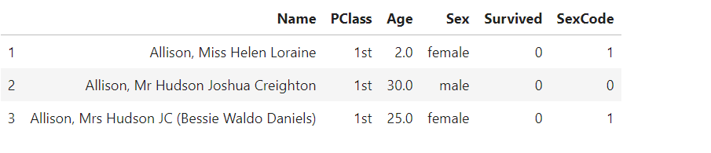

获取到第 4 行为止的所有行 ：

```python
# 获取到第 4 行为止的所有行
dataframe.iloc[:4]

Name PClass Age Sex Survived SexCode
1 Allison, Miss Helen Loraine 1st 2.0 female 0 1
2 Allison, Mr Hudson Joshua Creighton 1st 30.0 male 0 0
3 Allison, Mrs Hudson JC (Bessie Waldo Daniels) 1st 25.0 female 0 1
```

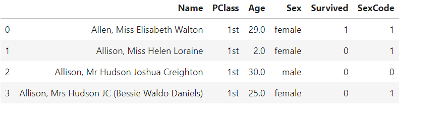

数据帧的索引不必非得是数值型。只要某一列在数据帧中每一行的值是唯一的，就可以将其设置为索引。

可以将乘客的名字设置为索引，然后通过名字来选择行：

```python
# 设置索引
dataframe = dataframe.set_index(dataframe['Name'])

# 查看行
dataframe.loc['Allen, Miss Elisabeth Walton']

Name Allen, Miss Elisabeth Walton
PClass 1st
Age 29
Sex female
Survived 1
SexCode 1
Name: Allen, Miss Elisabeth Walton, dtype: object
        
Name PClass Age Sex Survived SexCode
0 Allen, Miss Elisabeth Walton 1st 29.0 female 1 1
1 Allison, Miss Helen Loraine 1st 2.0 female 0 1
2 Allison, Mr Hudson Joshua Creighton 1st 30.0 male 0 0
3 Allison, Mrs Hudson JC (Bessie Waldo Daniels) 1st 25.0 female 0 1
```

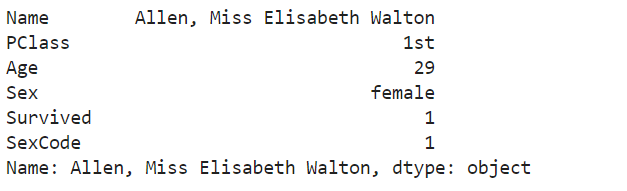


### 5. 根据条件语句来选择行

利用 pandas 根据某个条件语句来选择数据帧的行数据。例如，选择泰坦尼克号上所有女性乘客的数据 ：

```python
# 加载库
import pandas as pd

# 创建文件路径
file_path = r'./simulated_datasets/titanic.csv'

# 加载数据
dataframe = pd.read_csv(file_path)

# 展示 Sex 列的值是 female 的前两行
dataframe[dataframe['Sex'] == 'female'].head(2)

Name PClass Age Sex Survived SexCode
0 Allen, Miss Elisabeth Walton 1st 29.0 female 1 1
1 Allison, Miss Helen Loraine 1st 2.0 female 0 1
```

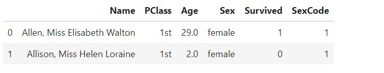

dataframe['Sex'] == 'female' 是条件语句，在它的外面包了一层 dataframe[] 来“选择数据帧中所有 dataFrame['Sex'] 的值是 'female' 的行数据”。

也可以使用多个条件语句，下面的代码就筛选出了所有年龄大于或等于 65 岁的女性乘客的行数据 ：

```python
# 过滤行
dataframe[(dataframe['Sex'] == 'female') & (dataframe['Age'] >= 65)]

Name PClass Age Sex Survived SexCode
73 Crosby, Mrs Edward Gi ord (Catherine Elizabet... 1st 69.0 female 1 1
```


### 6. 替换值

用 pandas 的 replace 方法能很容易地找到并替换数据帧中的一些值。例如，用 "Woman" 来替换 Sex 列中所有的 "female" ：

```python
# 加载库
import pandas as pd

# 创建文件路径
file_path = r'./simulated_datasets/titanic.csv'

# 加载数据
dataframe = pd.read_csv(file_path)

# 替换一些值，并查看两行数据
dataframe['Sex'].replace("female", "Woman").head(2)

0 Woman
1 Woman
Name: Sex, dtype: object
```

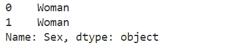

也能同时替换多个值 ：

```python
# 用 "Woman" 和 "Man" 分别替换 "female" 和 "male"
dataframe['Sex'].replace(["female","male"], ["Woman","Man"]).head(5)

0 Woman
1 Woman
2 Man
3 Woman
4 Man
Name: Sex, dtype: object
```

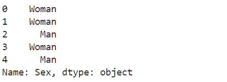

可以通过 Dataframe 对象在整个数据帧中查找和替换值，而不仅限于在单个列中查找和替换值 ：

```python
# 替换一些值，并查看两行数据
dataframe.replace(1, "One").head(2)

Name PClass Age Sex Survived SexCode
0 Allen, Miss Elisabeth Walton 1st 29 female One One
1 Allison, Miss Helen Loraine 1st 2 female 0 One
```

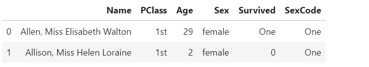

replace 也接受正则表达式 ：

```python
# 替换一些值，并查看两行数据
dataframe.replace(r"1st", "First", regex=True).head(2)

Name PClass Age Sex Survived SexCode
0 Allen, Miss Elisabeth Walton First 29.0 female 1 1
1 Allison, Miss Helen Loraine First 2.0 female 0 1
```

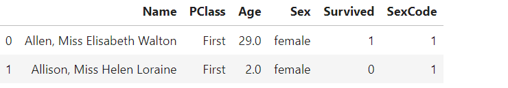


### 7. 重命名列

用 rename 方法来重命名 pandas 数据帧中的列 ：

```python
# 加载库
import pandas as pd

# 创建文件路径
file_path = r'./simulated_datasets/titanic.csv'

# 加载数据
dataframe = pd.read_csv(file_path)

# 重命名列，查看两行数据
dataframe.rename(columns={'PClass': 'Passenger Class'}).head(2)

Name Passenger Class Age Sex Survived SexCode
0 Allen, Miss Elisabeth Walton 1st 29.0 female 1 1
1 Allison, Miss Helen Loraine 1st 2.0 female 0 1
```

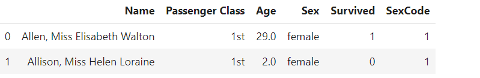

rename 方法可以传入一个字典作为参数，同时改变多个列名 ：

```python
# 重命名列，查看两行数据
dataframe.rename(columns={'PClass': 'Passenger Class', 'Sex': 'Gender'}).head(2)

Name Passenger Class Age Gender Survived SexCode
0 Allen, Miss Elisabeth Walton 1st 29.0 female 1 1
1 Allison, Miss Helen Loraine 1st 2.0 female 0 1
```

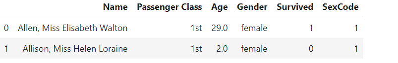

以字典作为 columns 参数使用 rename 来重命名列能同时为多个列重命名。如果想同时为所有的列重命名，可以用旧列名为键、空字符串为值，创建了一个字典 ：

```python
# 加载库
from collections import defaultdict

# 创建字典
column_names = defaultdict(str)

# 创建键
for name in dataframe.columns:
    column_names[name]

# 查看字典
column_names

defaultdict(str,
            {'Age': '',
             'Name': '',
             'PClass': '',
             'Sex': '',
             'SexCode': '',
             'Survived': ''})
```


### 8. 计算最小值、最大值、总和、平均值与计数值

pandas 提供了一些内置的方法来计算常见的描述性统计量，如计算一个数值列的最小值、最大值、总和、平均值与计数值 ：

```python
# 加载库
import pandas as pd

# 创建文件路径
file_path = r'./simulated_datasets/titanic.csv'

# 加载数据
dataframe = pd.read_csv(file_path)

# 计算描述统计量
print('Maximum:', dataframe['Age'].max())
print('Minimum:', dataframe['Age'].min())
print('Mean:', dataframe['Age'].mean())
print('Sum:', dataframe['Age'].sum())
print('Count:', dataframe['Age'].count())

# Maximum: 71.0
# Minimum: 0.17
# Mean: 30.397989417989415
# Sum: 22980.879999999997
# Count: 756
```

除此之外， pandas 还提供了计算方差（var）、标准差（std）、峰态（kurt）、偏态（skew）、平均值标准误差（sem）、众数（mode）、中位数（median）以及很多其他描述性统计量的方法。

```python
# 查看计数
dataframe.count()

# Name 1313
# PClass 1313
# Age 756
# Sex 1313
# Survived 1313
# SexCode 1313
# dtype: int64
```


### 9. 查找唯一值

使用 unique 来找出一列中所有的唯一值 ：

```python
# 加载库
import pandas as pd

# 创建文件路径
file_path = r'./simulated_datasets/titanic.csv'

# 加载数据
dataframe = pd.read_csv(file_path)

# 筛选出唯一值
dataframe['Sex'].unique()

# array(['female', 'male'], dtype=object)
```

使用 value_counts 会显示所有的唯一值以及它们出现的次数 ：

```python
# 查看计数
dataframe['Sex'].value_counts()

# male 851
# female 462
# Name: Sex, dtype: int64
```

unique 和 value_counts 都可以用来处理和探索分类型数据的（categorical）

泰坦尼克号中有三种级别的船票，PClass 这个列是用来表示乘客船票级别的。如果使用 value_counts，我们就能看出数据中的一个问题 ：

```python
# 查看计数
dataframe['PClass'].value_counts()

# 3rd 711
# 1st 322
# 2nd 279
# * 1
# Name: PClass, dtype: int64
```

几乎所有乘客的船票都在这三种级别中，但有一位乘客的船票级别是 *。这类“异常”类型的数据在分类型数据中很常见，不应该忽视它们。

可以使用 nunique 统计有多少个唯一值：

```python
# 查看唯一值的个数
dataframe['PClass'].nunique()

# 4
```


### 10. 处理缺失值

使用 isnull 和 notnull 筛选出数据帧中的缺失值 ：

```python
# 加载库
import pandas as pd

# 创建文件路径
file_path = r'./simulated_datasets/titanic.csv'

# 加载数据
dataframe = pd.read_csv(file_path)

# 筛选出缺失值，查看两行
dataframe[dataframe['Age'].isnull()].head(2)

Name PClass Age Sex Survived SexCode
12 Aubert, Mrs Leontine Pauline 1st NaN female 1 1
13 Barkworth, Mr Algernon H 1st NaN male 1 0
```

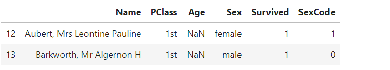

Pandas 使用 Numpy 的 NaN（“Not A Number”）来表示缺失值。但Pandas 没有实现 NaN，如果想要将所有包含 male 的字符串替换为缺失值的话，就会得到一条错误消息 ：

```python
# 尝试用 NaN 去替换值
dataframe['Sex'] = dataframe['Sex'].replace('male', NaN)

------------------------------------------------------------------------
NameError Traceback (most recent call last)
<ipython-input-7-5682d714f87d> in <module>()
1 # 尝试用 NaN 去替换值
----> 2 dataframe['Sex'] = dataframe['Sex'].replace('male', NaN)
NameError: name 'NaN' is not defined
------------------------------------------------------------------------
```

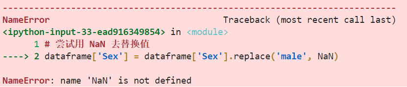

要想使用 NaN 就需要先导入 Numpy 库 ：

```python
# 加载库
import numpy as np

# 用 NaN 替换一些值
dataframe['Sex'] = dataframe['Sex'].replace('male', np.nan)
```

有时候一个数据集会使用特殊的值来表示缺失的观察值，比如 NONE、 -999 或者 .。

pandas 的 read_csv 中有一个参数，允许用户指定一个值来代表缺失值 ：

```python
# 加载数据，设置缺失值
dataframe = pd.read_csv(file_path, na_values=[np.nan, 'NONE', -999])
```


### 11. 删除一列

从数据帧中删除一列，最好的方式是使用 drop 方法，并传入参数 axis=1（即坐标轴列）：

```python
# 加载库
import pandas as pd

# 创建文件路径
file_path = r'./simulated_datasets/titanic.csv'

# 加载数据
dataframe = pd.read_csv(file_path)

# 删除列
dataframe.drop('Age', axis=1).head(2)

Name PClass Sex Survived SexCode
0 Allen, Miss Elisabeth Walton 1st female 1 1
1 Allison, Miss Helen Loraine 1st female 0 1
```


也可以使用一组列名作为参数一次删除多列 ：

```python
# 删除多列
dataframe.drop(['Age', 'Sex'], axis=1).head(2)

Name PClass Survived SexCode
0 Allen, Miss Elisabeth Walton 1st 1 1
1 Allison, Miss Helen Loraine 1st 0 1
```


如果某一列没有名字，可以使用 dataframe.columns 通过指定列下标的方式删除该列 ：

```python
# 删除一列
dataframe.drop(dataframe.columns[1], axis=1).head(2)

Name Age Sex Survived SexCode
0 Allen, Miss Elisabeth Walton 29.0 female 1 1
1 Allison, Miss Helen Loraine 2.0 female 0 1
```

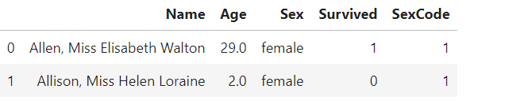

drop 是删除一列的常用方法,还有一种方法是 del dataframe['Age']，但一般不推荐使用。

很多 pandas 的方法都包含一个 inplace 参数，当其被设置为 True 时，会直接修改数据帧本身。推荐在进行数据处理时将数据帧视为不可变对象。例如 ：

```python
# 创建一个新的数据帧
dataframe_name_dropped = dataframe.drop(dataframe.columns[0], axis=1)
```

这个没有改变 dataframe，而是返回了一个新的数据帧对象，这样会省去很多麻烦。

### 12. 删除一行

创建一个新的数据帧并从中删除一行或多行数据 ：

```python
# 加载库
import pandas as pd

# 创建文件路径
file_path = r'./simulated_datasets/titanic.csv'

# 加载数据
dataframe = pd.read_csv(file_path)

# 删除一些行，查看输出结果的前两行
dataframe[dataframe['Sex'] != 'male'].head(2)

Name PClass Age Sex Survived SexCode
0 Allen, Miss Elisabeth Walton 1st 29.0 female 1 1
1 Allison, Miss Helen Loraine 1st 2.0 female 0 1
```


可以使用 df.drop([0, 1], axis=0 来删除前两行，但更实用的方式是在 df[] 中插入布尔条件，因为可以利用条件语句来删除一行或一次删除多行。

使用布尔条件通过匹配唯一值的方式可以轻松删除一行 ：

```python
# 删除一行，查看输出结果的前两行
dataframe[dataframe['Name'] != 'Allison, Miss Helen Loraine'].head(2)

Name PClass Age Sex Survived SexCode
0 Allen, Miss Elisabeth Walton 1st 29.0 female 1 1
2 Allison, Mr Hudson Joshua Creighton 1st 30.0 male 0 0
```

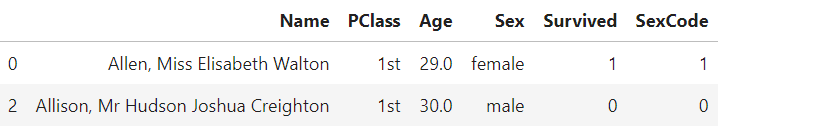

甚至可以通过这种方式根据行的下标来删除一行 ：

```python
# 删除一行，查看输出结果的前两行
dataframe[dataframe.index != 0].head(2)

Name PClass Age Sex Survived SexCode
1 Allison, Miss Helen Loraine 1st 2.0 female 0 1
2 Allison, Mr Hudson Joshua Creighton 1st 30.0 male 0 0
```

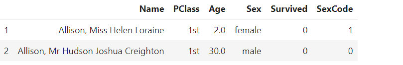

### 13. 删除重复行

使用 drop_duplicates，删除数据帧中重复的行，但是需要留意它的参数 ：

```python
# 加载库
import pandas as pd

# 创建文件路径
file_path = r'./simulated_datasets/titanic.csv'

# 加载数据
dataframe = pd.read_csv(file_path)

# 删除重复行，查看输出结果的前两行
dataframe.drop_duplicates().head(2)

Name PClass Age Sex Survived SexCode
0 Allen, Miss Elisabeth Walton 1st 29.0 female 1 1
1 Allison, Miss Helen Loraine 1st 2.0 female 0 1
```

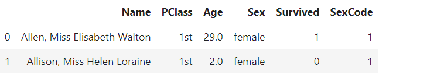

实际上没有删除任何行 ：

```python
# 查看行数
print("Number Of Rows In The Original DataFrame:", len(dataframe))
print("Number Of Rows After Deduping:", len(dataframe.drop_duplicates()))

# Number Of Rows In The Original DataFrame: 1313
# Number Of Rows After Deduping: 1313
```

这是因为 drop_duplicates 默认只删除那些所有列都完美匹配的行，使用 subset 参数能实现只用某些列来检查重复行 ：

```python
# 删除重复行
dataframe.drop_duplicates(subset=['Sex'])

Name PClass Age Sex Survived SexCode
0 Allen, Miss Elisabeth Walton 1st 29.0 female 1 1
2 Allison, Mr Hudson Joshua Creighton 1st 30.0 male 0 0
```

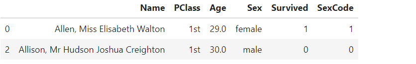

drop_duplicates 默认保留重复行中先出现的行，然后将剩余的行删除。可以通过 keep 参数来改变这个行为 ：

```python
# 删除重复行
dataframe.drop_duplicates(subset=['Sex'], keep='last')

Name PClass Age Sex Survived SexCode
1307 Zabour, Miss Tamini 3rd NaN female 0 1
1312 Zimmerman, Leo 3rd 29.0 male 0 0
```

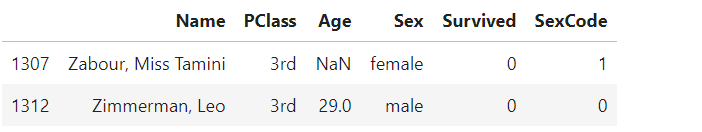

还有一个相关的方法是 duplicated，它返回一个布尔序列来表示某一行是否为重复的行。


### 14. 根据值对行分组

数据整理中经常会遇到这种情况 ：数据帧的每一行代表的是一个人或者一个事件，而我们需要根据某些标准对这些行分组并计算某个统计量。

groupby 是 pandas 中最强大的功能之一 ，可以根据一些共有的值（shared value）对行分组：

```python
# 加载库
import pandas as pd

# 创建文件路径
file_path = r'./simulated_datasets/titanic.csv'

# 加载数据
dataframe = pd.read_csv(file_path)

# 根据 Sex 列的值来对行分组，并计算每一组的平均值
dataframe.groupby('Sex').mean()

Sex Age Survived SexCode
female 29.396424 0.666667 1.0
male 31.014338 0.166863 0.0
```

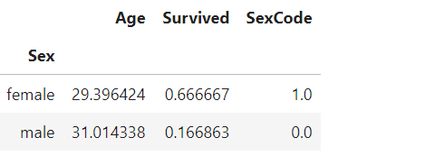


groupby 的返回值为 ：

```python
# 对行进行分组
dataframe.groupby('Sex')

# <pandas.core.groupby.generic.DataFrameGroupBy object at 0x000002546B24ED08>
```

groupby 需要和一些作用于组（group）的操作配合使用，比如计算一个综合统计量（例如，平均值、中位数、总和）。

为了让分组能更有用，我们需要根据某种标准进行分组，然后对每一组应用一个函数 ：

```python
# 按行分组，计算行数
dataframe.groupby('Survived')['Name'].count()

Survived
0 863
1 450
Name: Name, dtype: int64
```

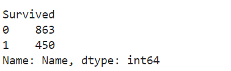

我们先按照乘客是否幸存做了分组，然后计算了每一组名字的数量（也就是乘客的数量）。

也可以先按照第一列分组，再按照第二列对前面的结果进行二次分组 ：

```python
# 对行分组，计算平均值
dataframe.groupby(['Sex','Survived'])['Age'].mean()

Sex Survived
female 0 24.901408
1 30.867143
male 0 32.320780
1 25.951875
Name: Age, dtype: float64
```

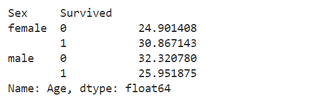

### 15. 按时间段对行分组

使用 resample 按照时间段对行分组 ：

```python
# 加载库
import pandas as pd
import numpy as np

# 创建日期范围
time_index = pd.date_range('06/06/2020', periods=100000, freq='30S')

# 创建数据帧
dataframe = pd.DataFrame(index=time_index)

# 创建一列随机变量
dataframe['Sale_Amount'] = np.random.randint(1, 10, 100000)

# 按周对行分组 , 计算每一周的总和
dataframe.resample('W').sum()

Sale_Amount
2017-06-11 86423
2017-06-18 101045
2017-06-25 100867
2017-07-02 100894
2017-07-09 100438
2017-07-16 10297
```

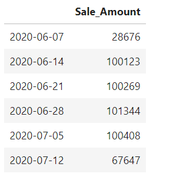

这里生成了一个简单的数据帧，每一行都是一条销售记录。对于每一条销售记录，日期、时间以及金额都是已知的。

原始数据看起来是这样的 ：

```python
# 查看 3 行
dataframe.head(3)

Sale_Amount
2017-06-11 00:00:00 7
2017-06-11 00:00:30 2
2017-06-11 00:01:00 7
```


注意，每一条销售记录的日期和时间都是数据帧的索引，这是因为 resample 要求索引的类型必须是类 datetime 的值。

使用 resample 可以按一组时间间隔（偏移）来对行分组，然后计算每一个时间组的某个统计量 ：

```python
# 按两周分组，计算平均值
dataframe.resample('2W').mean()

Sale_Amount
2017-06-11 5.001331
2017-06-25 5.007738
2017-07-09 4.993353
2017-07-23 4.950481


```

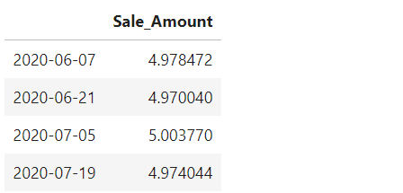

```
# 按月分组，计算行数
dataframe.resample('M').count()

Sale_Amount
2017-06-30 72000
2017-07-31 28000
```

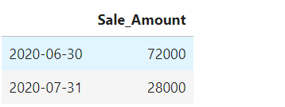

尽管分别按周和按月对行分组，但输出的结果都是以日期作为索引的。这是因为在默认情况下， resample 会返回时间组的右边界的值（最后一个标签）作为这个组的标签。可以通过使用 label 参数改变这个行为 ：

```python
# 按月分组 , 计算行数
dataframe.resample('M', label='left').count()

Sale_Amount
2017-05-31 72000
2017-06-30 28000
```

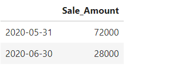

### 16. 遍历一个列的数据

将 pandas 的列视为与 Python 中的其他序列一样，遍历一个列中的所有元素，并做某个操作 ：

```python
# 加载库
import pandas as pd

# 创建文件路径
file_path = r'./simulated_datasets/titanic.csv'

# 加载数据
dataframe = pd.read_csv(file_path)

# 以大写的形式打印前两行中的名字
for name in dataframe['Name'][0:2]:
    print(name.upper())

# ALLEN, MISS ELISABETH WALTON
# ALLISON, MISS HELEN LORAINE
```

除了循环（常称为 for 循环），还可以使用列表解析式 ：

```python
# 以大写的形式打印前两行的名字
[name.upper() for name in dataframe['Name'][0:2]]

# ['ALLEN, MISS ELISABETH WALTON', 'ALLISON, MISS HELEN LORAINE']
```


### 17. 对一列的所有元素应用某个函数

使用 apply 对一列的所有元素应用一个内置的或者自定义的函数 ：

```python
# 加载库
import pandas as pd

# 创建文件路径
file_path = r'./simulated_datasets/titanic.csv'

# 加载数据
dataframe = pd.read_csv(file_path)

# 创建一个函数
def uppercase(x):
    return x.upper()

# 应用函数，查看两行
dataframe['Name'].apply(uppercase)[0:2]

0 ALLEN, MISS ELISABETH WALTON
1 ALLISON, MISS HELEN LORAINE
Name: Name, dtype: object
```

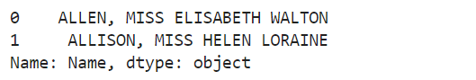

在数据清洗和数据整理中， apply 是一个功能非常强大的函数。通常需要先写一个函数来执行某个有用的操作，然后对一列中的所有元素应用这个函数。

### 18. 对所有分组应用一个函数

联合使用 groupby 和 apply ，可以对每一组数据应用一个函数 ：

```python
# 加载库
import pandas as pd

# 创建文件路径
file_path = r'./simulated_datasets/titanic.csv'

# 加载数据
dataframe = pd.read_csv(file_path)

# 对行分组，然后在每一组上应用函数
dataframe.groupby('Sex').apply(lambda x: x.count())

Sex Name PClass Age Sex Survived SexCode
female 462 462 288 462 462 462
male 851 851 468 851 851 851
```

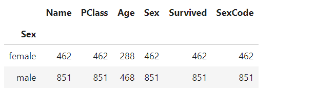


### 19. 连接多个数据帧

使用 concat 连接（concatenate）两个数据帧 ：

```python
# 加载库
import pandas as pd

# 创建数据帧
data_a = {'id': ['1', '2', '3'],
          'first': ['Alex', 'Amy', 'Allen'],
          'last': ['Anderson', 'Ackerman', 'Ali']}
dataframe_a = pd.DataFrame(data_a, columns = ['id', 'first', 'last'])

# 创建数据帧
data_b = {'id': ['4', '5', '6'],
          'first': ['Billy', 'Brian', 'Bran'],
          'last': ['Bonder', 'Black', 'Balwner']}
dataframe_b = pd.DataFrame(data_b, columns = ['id', 'first', 'last'])

# 沿着行的方向连接两个数据帧
pd.concat([dataframe_a, dataframe_b], axis=0)

id first last
0 1 Alex Anderson
1 2 Amy Ackerman
2 3 Allen Ali
0 4 Billy Bonder
1 5 Brian Black
2 6 Bran Balwner
```

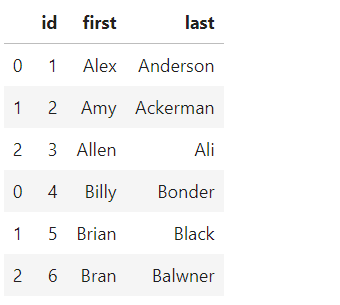

使用 axis=1 可以在列的方向上做连接 ：

```python
# 在列的方向上连接两个数据帖
pd.concat([dataframe_a, dataframe_b], axis=1)

id first last id first last
0 1 Alex Anderson 4 Billy Bonder
1 2 Amy Ackerman 5 Brian Black
2 3 Allen Ali 6 Bran Balwner
```


concatenate 的官方定义是将两个对象黏在一起，并且 axis 参数会指出，是将它们叠在一起还是并列排放。

append 也能将一行新数据附加（append）到数据帧中 ：

```python
# 创建一行
row = pd.Series([10, 'Chris', 'Chillon'], index=['id', 'first', 'last'])

# 附加一行
dataframe_a.append(row, ignore_index=True)

id first last
0 1 Alex Anderson
1 2 Amy Ackerman
2 3 Allen Ali
3 10 Chris Chillon
```


### 20. 合并两个数据帧

要进行等值连接（inner join）合并两个数据帧，就需要使用 merge 并用 on 参数来指定哪些列要合并 ：

```python
# 加载库
import pandas as pd

# 创建 DataFrame
employee_data = {'employee_id': ['1', '2', '3', '4'],
                 'name': ['Amy Jones', 'Allen Keys', 'Alice Bees',
                          'Tim Horton']}
dataframe_employees = pd.DataFrame(employee_data, columns = ['employee_id',
                                                             'name'])

# 创建 DataFrame
sales_data = {'employee_id': ['3', '4', '5', '6'],
              'total_sales': [23456, 2512, 2345, 1455]}
dataframe_sales = pd.DataFrame(sales_data, columns = ['employee_id',
                                                      'total_sales'])

# 合并数据帧
pd.merge(dataframe_employees, dataframe_sales, on='employee_id')

employee_id name total_sales
0 3 Alex Bees 23456
1 4 Tim Horton 2512
```

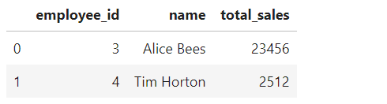

merge 默认进行等值连接。如果要进行外连接（outer join），可以通过 how 参数来指定 ：

```python
# 合并两个数据帧
pd.merge(dataframe_employees, dataframe_sales, on='employee_id', how='outer')

employee_id name total_sales
0 1 Amy Jones NaN
1 2 Allen Keys NaN
2 3 Alice Bees 23456.0
3 4 Tim Horton 2512.0
4 5 NaN 2345.0
5 6 NaN 1455.0
```

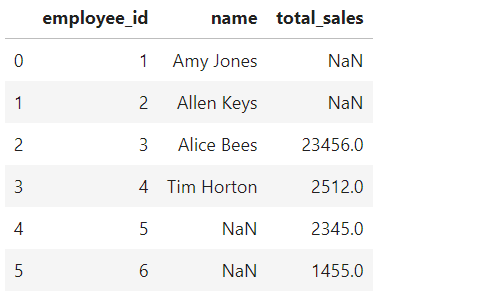

使用 how 参数还可以指定是左连接还是右连接 ：

```python
# 合并两个数据帧
pd.merge(dataframe_employees, dataframe_sales, on='employee_id', how='left')

employee_id name total_sales
0 1 Amy Jones NaN
1 2 Allen Keys NaN
2 3 Alice Bees 23456.0
3 4 Tim Horton 2512.0
```

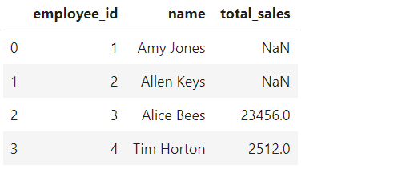

也可以指定每个数据帧中的列名来进行合并 ：

```python
# 合并两个数据帧
pd.merge(dataframe_employees,
         dataframe_sales,
         left_on='employee_id',
         right_on='employee_id')

employee_id name total_sales
0 3 Alice Bees 23456
1 4 Tim Horton 2512
```

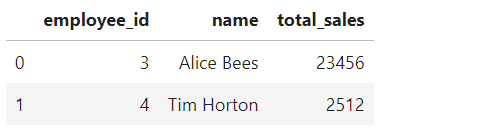

如果想根据数据帧的索引合并两列，可以将 left_on 和 right_on 参数替换成 right_index=True 以及 left_index=True。

合并操作的类型，由 how 参数来指定， merge 支持如下 4 个主要的连接类型：

- Inner：只返回指定列的值在两个数据帧中都存在的行。例如，只有 employee_id 的值在dataframe_employees 和 dataframe_sales 中都出现时，才会返回行。

- Outer：返回两个数据帧的所有行。如果某一行只在其中一个数据帧中存在，就用 NaN 来填充缺失的值。例如，返回 dataframe_employees 和 dataframe_sales 的所有行。

- Left：返回左数据帧的所有行，对于右数据帧，只返回在左数据帧中能找到匹配值的行。用 NaN 来填充缺失的值。例如，返回 dataframe_employees 的所有行，但是对于dataframe_sales，只返回它的 employee_id 出现在 dataframe_employees 中的那些行。

- Right：返回右数据帧的所有行，对于左数据帧，只返回在右数据帧中能找到匹配值的行。用 NaN 来填充缺失的值。例如，返回 dataframe_sales 的所有行，但是对于dataframe_employees，只返回它的 employee_id 出现在 dataframe_sales 中的那些行。


