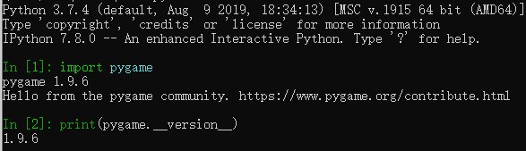
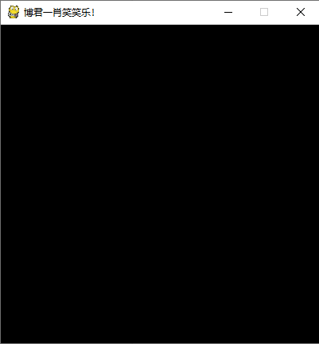
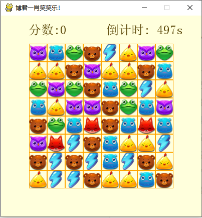
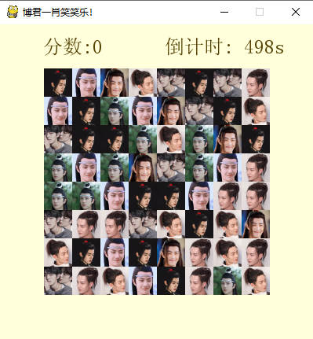
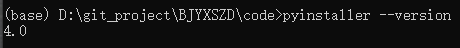
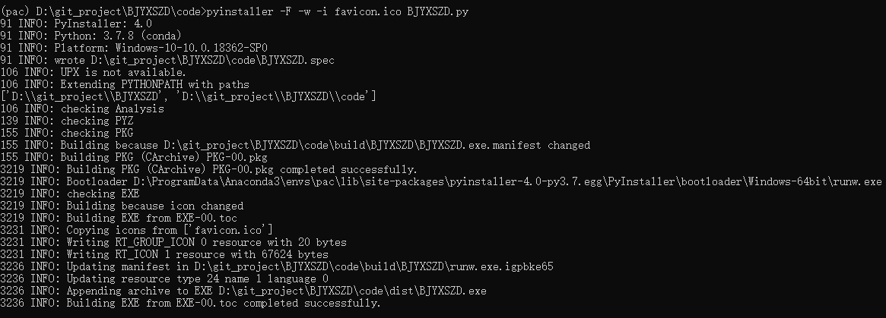

# 程序员的七夕礼物：博君一肖笑笑乐

明天就是七夕情人节了，办公室里一堆程序员小伙伴实在想不出给女朋友送什么礼物。其中一位小伙伴说出了大家的心声：上次费尽心思送给对象的一个礼物，被喷得体无完肤，到最后还不如不送了！

话虽这么说，可该送的还是要送的，不然相信该来的也还是会来的。


前几天正一筹莫展的时候，在网上冲浪时突然发现一个Python实现的消消乐小游戏，灵机一动，想到了某人最近沉迷于磕“博君一肖”的真人CP，不如做个博肖的“情头”做个小游戏哄她开心，从而实现低成本过关。

## 说干就干

项目的地址为：https://github.com/xSumner/BJYXSZD

参考的项目地址为：https://github.com/JustDoPython/python-examples/tree/master/yeke/py-xxl

项目的主要依赖库是pygame，这是一个利用SDL库写就的游戏库。


pygame的安装很简单，直接在线：

```
pip install pygame
```

然后在环境终端中输入：

```python
import pygame

print(pygame.__version__)
```

显示如下则说明安装成功。



游戏中依赖的其他 Python 库都是内置库，具体如下：

```python
import os
import sys
import time
import pygame
import random
```

然后便是定义一些游戏窗口的常量，比如：窗口宽高、网格行列数等，代码如下：

```python
WIDTH = 400
HEIGHT = 400
NUMGRID = 8
GRIDSIZE = 36
XMARGIN = (WIDTH - GRIDSIZE * NUMGRID) // 2
YMARGIN = (HEIGHT - GRIDSIZE * NUMGRID) // 2
ROOTDIR = os.getcwd()
FPS = 30
```

接着创建一个主窗口测试一下（注意不要使用QQ输入法，否则会报iCCP错误）：

```python
if __name__ == '__main__':
    pygame.init()
    screen = pygame.display.set_mode((WIDTH, HEIGHT))
    pygame.display.set_caption('博君一肖笑笑乐！')
```

效果如下：



消消乐的构成主要包括三部分：游戏主体、计分器、计时器。

源代码中使用了 Puzzle 和 Game 两个类进行实现，详细请直接参考源码。

这里直接看一下效果：



下一步就是用BJYX的“情头”素材替换掉原来游戏里的小动物。


直接搜索”博君一肖cp情头“，然后随便选几张替换掉原有目录下的图片，注意修改名称：


在终端中重新运行一下游戏：

```shell
python BJYXSZD.py
```



图片有点小，不过朦胧就是美，粉丝们肯定会喜欢的。（~~主要是没时间懒得改~~）

最后看一下动态效果：


## 游戏打包

到目前为止，小游戏还只是个python程序，想要让女朋友能够在电脑上玩，还需要打包成可执行文件。

这里使用 `pyinstaller` 模块将程序打包成 `.exe` 的可执行文件。

同样要先下载安装 `pyinstaller` ：

```
pip install pyinstaller
```

然后在命令窗口中输入：

```
pyinstaller --version
```

显示如下表示安装成功：



在打包前还需要为游戏程序找一个图标，同样直接在网上搜索，选择一个合适的：


尝试了一下发现效果不是很好，所以换了一个相对简单的图案：


在线转换成 `favicon.ico` 的[图标文件](https://www.easyicon.net/covert/)，并将文件与代码放置在同一个目录下，在终端中输入：

```shell
pyinstaller -F -w -i favicon.ico BJYXSZD.py
```



其中几个参数的含义为：

- -F：打包成一个单独文件，否则会生成一个文件夹；
- -w：程序运行时隐藏命令行窗口；
- -i：使用指定文件作为 `.exe` 文件的图标，注意一定腰围 `.ico` 格式的图片文件。

最后注意将images图片文件夹和字体文件与可执行文件放在同一目录下，然后双击 `BJYXSZD.exe` 就可以尽情的玩耍了。


> 建议最好新建一个虚拟环境进行打包，否则最终生成的文件会包含很多不用的包，我第一次打包的文件大小是两百多兆，只安装 `pygame` 及 `pyinstaller` 后打包就只有十几兆。


## 游戏下载

在后台回复“BJYX”即可免费获得文中的小程序下载链接。

对于该项目有兴趣的也欢迎提交issue：

https://github.com/xSumner/BJYXSZD/issues