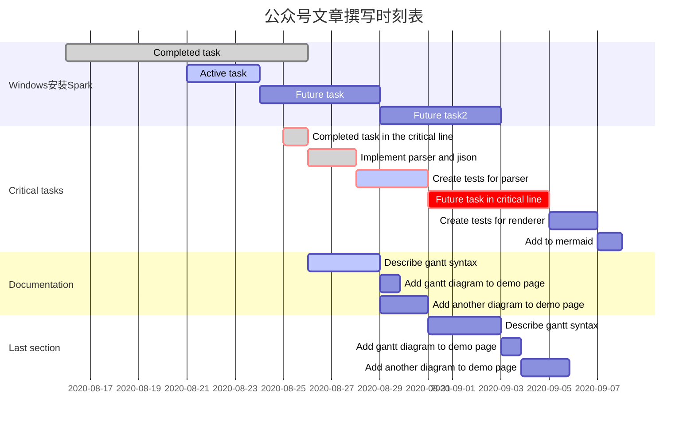

# 数析万变 DataMagi

> 公众号注册时间：2019年11月12日


## 2020年目录


### 二月写作计划


### 三月写作计划


### 四月写作计划


### 五月写作计划


### 六月写作计划


### 七月写作计划


### 八月写作计划



### 九月写作计划

```

```


### 十月写作计划

```

```


### 十一月写作计划

```

```


### 十二月写作计划

```

```


