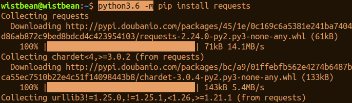
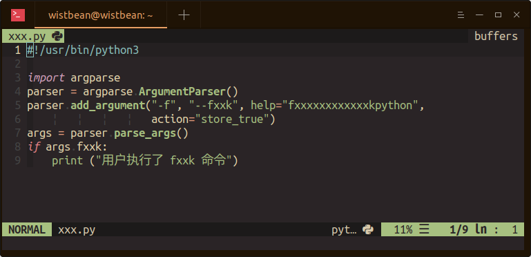

## 你真的会使用 Python 命令吗？

我想你最常用到的 Python 命令就是运行 Python 脚本文件，像这样：

### python xxx.py

不过你知道为什么这样就可以直接执行 Python 代码么？

还有， Python 还有一些常用的命令可玩，你试过吗？

接下来，就是学习 Python 的正确姿势：

我们来说说那些我们常用到的 Python 命令。

### python xxx.py

当你通过 Python 执行脚本文件的时候，sys.argv[0] 会存储这个 py 文件名称：

而当你在 python xxx.py 后面再添加一些参数的时候，sys.argv 也同样可以接收到相关的参数：

而且，它会把你的执行的 py 文件路径添加到 sys.path 中来，将它作为主模块来运行：

除了直接使用 python 执行脚本文件之外，你也可以使用 Python 执行整个 Python 项目目录或者压缩文件，不过在这里面你需要定义一个 __main__.py ，要不然解释器无法识别运行：

而当你的目录中有定义 `__main__.py` 的时候，它就可以将 main 添加到 sys.path 中来，作为 main 模块执行：

除此之外，你还可以直接使用脚本的文件执行 Python 代码，在你的脚本文件的第一行定义 Python 环境：

接着添加脚本文件的执行权限，然后就可以直接用脚本文件名称直接运行 Python 了：

### python -c

使用 python -c 可以让你在命令行中写 Python 代码执行，可以使用 ； 进行代码分行：

一种更好的方式是使用空行对代码进行分行：

当你在 python 解释器中使用 -c 命令的时候，它会将 -c 添加到 sys.argv[0] 中，将当前的路径添加到 sys.path 中：

###  python -m

使用 -m 模块可以以脚本的方式执行 Python 的模块或者包，因为执行的是模块，所以就不用像执行脚本文件那样把 .py 扩展名称写出来。

可以看到，模块的完全路径会添加到 sys.argv[0]，将当前的路径添加到 sys.path 中，将模块名作为 main 执行。

你能体会到 python xxx.py 和 python -m xxx 之间的区别么？

当然，你也可以使用 -m 来执行包中的模块：

通过 -m 的形式，解释器会通过搜索路径找到相应的模块执行，这样你就不需要想执行 .py 那样写入文件的绝对路径啦。

使用 python -m 的一个常用场景是在不同的版本环境中执行相应的模块，比如使用 pip 安装模块的时候：

###  python -i

当你使用 -c 命令的时候，还想执行完相关代码后进入 Python 交互模式就可以使用 -i ：

还有其它的命令，你可以通过 python -h 找到相关的解释：

可能有时候你也想要提供一些命令给别人使用，Python 内置了一个 argparse 的库，你可以使用它来创建你要提供的命令，比如这样：

执行的时候就可以使用相关的命令了：

除此之外，还有一个叫做 click 的第三方库，也是用来创建命令的，不同的是它可以用装饰器的方式实现，你可以直接使用 @click.option 来定义命令选项，用起来相对简单，这是一个官方的例子：

使用起来是这样的：

当然，它还提供了多种创建命令的方式，你可以在以下链接中找到：

https://click.palletsprojects.com/en/6.x/

ok，以上就是小帅b今天给你带来的分享，希望对你有帮助，那么我们下回见，**peace！**