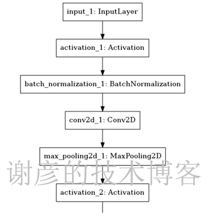
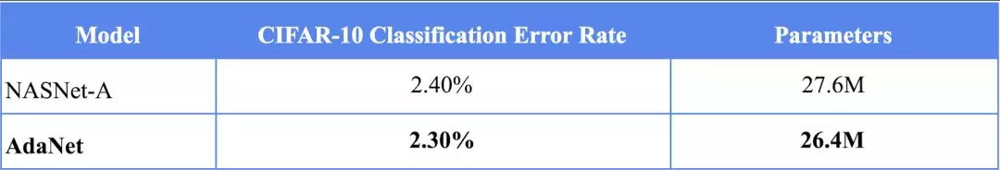

# AutoML自动化机器学习


## 一、自动机器学习简述（AutoML）


### 为什么需要自动机器学习

对于机器学习的新用户而言，使用机器学习算法的一个主要的障碍就是算法的性能受许多的设计决策影响。随着深度学习的流行，工程师需要选择相应的神经网络架构，训练过程，正则化方法，超参数，等等，所有的这些都对算法的性能有很大的影响。于是深度学习工程师也被戏称为调参工程师。

自动机器学习（AutoML）的目标就是使用自动化的数据驱动方式来做出上述的决策。用户只要提供数据，自动机器学习系统自动的决定最佳的方案。领域专家不再需要苦恼于学习各种机器学习的算法。

自动机器学习不光包括大家熟知的算法选择，超参数优化，和神经网络架构搜索，还覆盖机器学习工作流的每一步：


- 自动准备数据
- 自动特征选择
- 自动选择算法
- 超参数优化
- 自动流水线/工作流构建
- 神经网络架构搜索
- 自动模型选择和集成学习


### 超参数优化 Hyper-parameter Optimization

学习器模型中一般有两类参数，一类是可以从数据中学习估计得到，还有一类参数时无法从数据中估计，只能靠人的经验进行设计指定，后者成为超参数。比如，支持向量机里面的C, Kernal, game；朴素贝叶斯里面的alpha等。

超参数优化有很多方法：

最常见的类型是黑盒优化 （black-box function optimization）。所谓黑盒优化，就是将决策网络当作是一个黑盒来进行优化，仅关心输入和输出，而忽略其内部机制。决策网络通常是可以参数化的，这时候我们进行优化首先要考虑的是**收敛性。**

以下的几类方法都是属于黑盒优化：

- 网格搜索 （grid search）
  Grid search大家都应该比较熟悉，是一种通过遍历给定的参数组合来优化模型表现的方法。网格搜索的问题是很容易发生维度灾难，优点是很容易并行。
- 随机搜索 （random search）
  随机搜索是利用随机数求极小点而求得函数近似的最优解的方法。
  
  很多时候，随机搜索比网格搜索效果要更好，但是我们可以从上图看出，它们都不能保证找到最优解。
- [贝叶斯优化](https：//en.wikipedia.org/wiki/Bayesian_optimization)
  贝叶斯优化是一种迭代的优化算法，包含两个主要的元素，**输入数据假设的模型**和一个**采集函数**用来来决定下一步要评估哪一个点。每一步迭代，都使用所有的观测数据fit模型，然后利用激活函数预测模型的概率分布，决定如何利用参数点，权衡是Explaoration还是Exploitation。相对于其它的黑盒优化算法，激活函数的计算量要少很多，这也是为什么贝叶斯优化被认为是更好的超参数调优的算法。

黑盒优化的一些工具：

- [hyperopt](https：//github.com/hyperopt/hyperopt-sklearn)
  **hyperopt** 是一个Python库，可以用来寻找实数,离散值,条件维度等搜索空间的最佳值。
- [Google Vizier](https：//static.googleusercontent.com/media/research.google.com/en//pubs/archive/46180.pdf)
  Google的内部的机器学习系统 Google Vizier能够利用迁移学习等技术自动优化其他机器学习系统的超参数
- [advisor](https：//github.com/tobegit3hub/advisor)
  Google Vizier的开源实现。
- [katib](https：//github.com/kubeflow/katib) 
  基于Kubernetes的超参数优化工具

由于优化目标具有不连续、不可导等数学性质，所以一些搜索和非梯度优化算法被用来求解该问题，包括我们上面提到的这些黑盒算法。此类算法通过采样和对采样的评价进行搜索，往往需要大量对采样的评价才能获得比较好的结果。然而，在自动机器学习任务中评价往往通过 k 折交叉验证获得，在大数据集的机器学习任务上，获得一个评价的时间代价巨大。这也影响了优化算法在自动机器学习问题上的效果。所以一些减少评价代价的方法被提出来，其中**多保真度优化（**multi-fidelity methods**）**就是其中的一种。这里的技术包括：基于学习曲线来决定是否要提前终止训练，探索-利用困境（exploration exploitation）的[多臂老虎机算法](https：//en.wikipedia.org/wiki/Multi-armed_bandit) （Multi-armed bandit）等等。

另外还有一些研究是基于梯度下降的优化。

超参数优化面临许多挑战：

- 对于大规模的模型或者复杂的机器学习流水线而言，需要评估的空间规模非常大
- 配置空间很复杂
- 无法或者很难利用损失函数的梯度变化
- 训练集合的规模太小
- 很容易过拟合

相关参考

- https：//docs.aws.amazon.com/sagemaker/latest/dg/automatic-model-tuning.html
- http：//numbbo.github.io/workshops/index.html
- https：//www.blog.google/products/google-cloud/cloud-automl-making-ai-accessible-every-business/
- https：//scikit-learn.org/stable/modules/grid_search.html
- https：//yq.aliyun.com/articles/68266
- https：//arxiv.org/abs/1807.02811
- http：//gpss.cc/gpmc17/slides/LancasterMasterclass_1.pdf
- https：//yq.aliyun.com/articles/661786
- https：//blog.csdn.net/xbinworld/article/details/79372777


### 元学习 Meta Learning

元学习也就是‘学习如何学习’，通过对现有的学习任务之间的性能差异进行系统的观测，然后学习已有的经验和元数据，用于更好的执行新的学习任务。这样做可以极大的改进机器学习流水线或者神经网络架构的设计，也可以用数据驱动的方式取代手工作作坊似的算法工程工作。

从某种意义上来说，元学习覆盖了超参数优化，因为元数据的学习包含了：超参数，流水线的构成，神经网络架构，模型构成，元特征等等。

机器学习的算法我们又称为‘学习器’，学习器就是假定一个模型，该模型拥有很多未知参数，利用训练数据和优化算法来找到最适合这些训练数据的参数，生成一个新的算法，或者参数已知的模型，并利用该模型/算法来预测新的未知数据。如果说世界上只有一个模型，那么问题就简单了，问题是模型有很多，不同的模型拥有不同的超参数，我们往往还会把模型和算法组装在一起构成复合模型和机器学习的流水线，这个时候，我就需要知道解决不同的问题要构建那些不同的模型。元学习就在这个时候，我们可以把超参数，流水线，神经网络架构这些都看成是一个新的模型的未知参数，把不同学习任务的性能指标看成是输入数据，这样我们就可以利用优化算法来找到性能最好的那组参数。这个模式可以一直嵌套，也就是说，你可以有‘元元元学习‘，当然我希望你不要走得太远，找不到回来的路。

元学习的方法包括：

- 通过模型评估来学习
- 通过任务的属性，元特征来学习
  以下列出了一些常见的元特征
  
- 从现有的模型中学习，包括：
  - 迁移学习
  - 利用RNN在学习过程中修改自己的权重

元学习的一个很大的挑战就是如果通过很少的训练数据来学习一个复杂的模型，这就是[one-shot](https：//en.wikipedia.org/wiki/One-shot_learning)或者few-shot的问题。

像人类的学习一样，每次学习无论成功失败，我们都收获一定的经验，人类很少从头学习。在构建自动学习的时候，我们也应该充分利用已有的每一次的学习经验，逐步的改进，使得新的学习更加有效。

相关参考：

- https：//en.wikipedia.org/wiki/Meta_learning_(computer_science)
- https：//lilianweng.github.io/lil-log/2018/11/30/meta-learning.html
- https：//towardsdatascience.com/whats-new-in-deep-learning-research-understanding-meta-learning-91fef1295660
- https：//medium.com/huggingface/from-zero-to-research-an-introduction-to-meta-learning-8e16e677f78a
- https：//bair.berkeley.edu/blog/2017/07/18/learning-to-learn/


### 神经网络架构搜索 Neural Architecture Search

提起AutoML，其实大多数人都是因为Google的AutoML系统才知道这个故事的。随着深度学习的流行，神经网络的架构变得越来越复杂，越来越多的手工工程也随之而来。神经网络架构搜索就是为了解决这个问题。

NAS主要包含三个部分：

- 搜索空间 search space
- 搜索策略 search strategy
- 性能估计策略 performance estimation strategy


相关参考

- https：//medium.com/aifrontiers/understand-automl-and-neural-architecture-search-4260a0942116
- https：//towardsdatascience.com/everything-you-need-to-know-about-automl-and-neural-architecture-search-8db1863682bf
- https：//ai.googleblog.com/2017/11/automl-for-large-scale-image.html
- https：//www.fast.ai/2018/07/16/auto-ml2/


### 自动化特征工程

自动化特征工程可以帮助数据科学家基于数据集自动创建能够最好的用于训练的特征。

[Featuretools](https：//www.featuretools.com/)是一个开源库，用来实现自动化特征工程。它是一个很好的工具，旨在加快特征生成的过程，从而让大家有更多的时间专注于构建机器学习模型的其他方面。换句话说，它使你的数据处于“等待机器学习”的状态。


Featuretools程序包中的三个主要组件：

- 实体（Entities）
- 深度特征综合（Deep Feature Synthesis ，DFS）
- 特征基元（Feature primitives）
- 一个Entity可以视作是一个Pandas的数据框的表示，多个实体的集合称为Entityset。
- 深度特征综合（DFS）与深度学习无关，不用担心。实际上，DFS是一种特征工程方法，是Featuretools的主干。它支持从单个或者多个数据框中构造新特征。
- DFS通过将特征基元应用于Entityset的实体关系来构造新特征。这些特征基元是手动生成特征时常用的方法。例如，基元“mean”将在聚合级别上找到变量的平均值。

 

参考：

- https：//towardsdatascience.com/automated-feature-engineering-in-python-99baf11cc219
- https：//towardsdatascience.com/why-automated-feature-engineering-will-change-the-way-you-do-machine-learning-5c15bf188b96
- https：//www.kaggle.com/willkoehrsen/automated-feature-engineering-tutorial
- https：//medium.com/data-from-the-trenches/automatic-feature-engineering-an-event-driven-approach-b2ca09d166f
- https：//medium.com/@rrfd/simple-automatic-feature-engineering-using-featuretools-in-python-for-classification-b1308040e183
- https：//blog.datarobot.com/automated-feature-engineering


### 其它自动机器学习工具集

以下列出一些开源的自动机器学习工具空大家参考，选择。

- [Auto-Sklearn ](https：//www.ml4aad.org/automl/auto-sklearn/)
- [AutoKeras](https：//autokeras.com/)
- [TPOT](https：//automl.info/tpot/)
- [H2O AutoML ](http：//docs.h2o.ai/h2o/latest-stable/h2o-docs/automl.html)
- [Python auto_ml](https：//github.com/ClimbsRocks/auto_ml)


### 参考

- [自动机器学习（AutoML）最新综述](https：//www.jiqizhixin.com/articles/2018-11-07-18)
- [自动机器学习工具全景图：精选22种框架，解放炼丹师](https：//zhuanlan.zhihu.com/p/42715527)
- [开源自动机器学习(AutoML)框架盘点](https：//my.oschina.net/knifecms/blog/1606595)
- [揭秘 | 谷歌自动化机器学习真的那么神吗？](https：//www.leiphone.com/news/201807/kT8hOtaJUHN26j0W.html)
- [分享一篇比较全面的AutoML综述](https：//zhuanlan.zhihu.com/p/48642938)


## 二、开源自动机器学习(AutoML)框架盘点

到目前为止，从网上显示的信息来看，深度学习这块大多没有实现的源码，还出于理论和论文阶段，而机器学习领域则产生了一些在一定程度上可以自动化的工具。

目前，在github上能实现一定程度auto ml的主要有如下几类：

### [1.tpot](https：//github.com/rhiever/tpot)

**工作流程：**


    

1. 分析数据集的多项式特征(线性回归等)；
2. 分析数据集的主成份(PCA)；
3. 将多项式特征与主成份分析结果合并起来；
4. 使用GP算法反复迭代，选取交叉熵最小的组合；
5. 使用随机森林对结果分类；

**输出结果：**

​	最佳模型组合及其参数(python文件)和最佳得分

**优劣：**

​	tpot在数据治理阶段采用了PCA主成份分析，在模型选择过程中可以使用组合方法，分析的过程比起其他工具更科学，并能直接生成一个写好参数的python文件，但输出可参考的结果较少，不利于进一步分析。


### [2.auto_ml](https：//github.com/ClimbsRocks/auto_ml)

**工作流程：**

1. 首先自动将所有字段归一化；
2. 自动尝试选用tree-based models (DecisionTree, RandomForest, XGBoost/GradientBoosted trees, etc.), and regression models (LinearRegression, LogisticRegression, Ridge)等模型；
3. 系统不会自动筛除相关性较高的字段，所以需要自行手工预处理；
4. 自动将数据集划分为10等分，分别对每个子集计算特征值；
5. random forest会报告广泛适用的特征，而regression models则会返回这些特征的权重；
6. 在树模型中，根据特征标准差的变化，得到特征的权重；
7. 深度学习模型作为插件(可选)，使用深度学习模型学习特征，然后再使用Gradient Boosting作为预测，通常能让精度提高5%。

**输出结果：**

​    最佳模型名称，字段的权重及得分情况，模型具体错误及得分情况

**优劣：**

​    auto_ml并未使用PCA和组合方法，所以分析速度很快，得到的分析结果也很详细，但分析方法较为单一，导致过拟合的风险也会增大；auto_ml也是目前唯一引入了深度学习做分析的框架，值得一试。


### [3.machineJS](https：//github.com/ClimbsRocks/machineJS)

​    machineJS其实与auto_ml都是同一个作者，这个家伙有点飘忽不定，一会说要放弃auto_ml，但实际观察发现auto_ml的热度要高于machineJS，所以这里就不再废话了。


### [4.auto_sklearn](https：//github.com/automl/auto-sklearn)

**工作流程：**


​     使用穷举法在有限的时间内逐个尝试最优模型，上图是它的架构体系，看的出来他的工作逻辑是目前的开源框架中最复杂的一款，步骤就不细说了，大体过程应该是与Tpot相似的。

**输出结果：**

​    计算过程以及最终模型的准确率。

**优劣：**

​    穷举法简单粗暴，但也是最靠谱的，如果时间充裕的情况下可以加大预算周期不断让机器尝试最优解，但输出结果太少，基本上对进一步数据分析的帮助不大。

​    不过据说auto-sklearn赢得了2017年的一次 AutoML Challenge，它的更新频率也很高，值得关注！


### [5.Parris](https：//github.com/jgreenemi/Parris)

​    严格来说Parris并不算是一款自动化机器学习的工具，而是当你确定好模型后的一款自动化调参工具。不过调参也是很费神的，能自动化也不错！


[6.ATM](https：//github.com/HDI-Project/ATM)


## 三、AutoML自动化机器学习技术深入

基于上一部分，通过分析了AutoML相关框架的源码，见微知著，希望能更全面准确的把握目前的AutoML技术现状。

先拿Auto_ML这块框架作为切入点，分析了框架源码的工作流，以及用到的技术，再与其他框架进行了横向比较，分析记录如下：

### AutoML

1. 首先创建 Predictor 预测器；

   一个Predictor预测器支持两种类型的任务：分类和回归

   主要设置两个参数 type_of_estimator 和 column_descriptions

   type_of_estimator 指定了任务类型（classifier 或者 regressor）

   column_descriptions 指定了字段描述信息，如果为分类任务时，需指定Y所在的列（output）

 

2. 调用Predictor 预测器的train方法训练模型；

   一个简单的train方法，却做了很多事情：

   a)

   `_clean_data_and_prepare_for_training`：数据清洗和准备

   `_prepare_for_training`：准备X和Y；删除X中的重复字段；删除Y值缺失的记录；将X中所有字段转换为float类型；将Y值标准化；

   b)

   `fit_transformation_pipeline`：数据转换并输入管道

   如果要使用深度学习组件，这里就会多一步特征学习的过程，调用方法名为：`fit_feature_learning_and_transformation_pipeline`

   适应X值，并将X值放置到合适的“管道”中去；什么是“管道”：对数据处理流程的抽象；为什么使用“管道”：为了更方便的处理数据；

   c)

   `train_ml_estimator` ：训练模型评价器

   找到最佳模型：这里值得注意的是，模型评价器在未指定模型名称的情况下，回归任务默认使用 GradientBoostingRegressor，分类任务默认使用 GradientBoostingClassifier

   （在train方法中加入参数 compare_all_models=True 才会比较所有模型）

   `fit_grid_search` ： 如果没有使用CatBoost模型或者需要搜索的参数的个数大于50个，使用 EvolutionaryAlgorithmSearchCV 搜索候选模型的最优超参数，否则使用 GridSearchCV 搜索候选模型的最优参数

   GridSearchCV的介绍：http：//blog.csdn.net/sinat_32547403/article/details/73008127

   这里我们会比较关心GridSearchCV针对每种不同的模型，初始化的Grid参数集合是什么样的，下面是部分截图，GridSearchCV的完整搜索空间见auto_ml源码 utils_models.py 第306行：`get_search_params`

   

   这里以GradientBoostingClassifier为例：

   损失函数尝试了两种：deviance,exponential

   max_depth尝试了：1~15

   max_features尝试了：sqrt,log2

   learning_rate尝试了：0.001 ~ 0.2

   ……

   这些对于一个粗粒度的模型来说足够了，还需要用户自己做精细化的调整

   EvolutionaryAlgorithmSearchCV没有找到中文介绍，本质上属于一种启发式搜索，利用遗传算法的思想，寻找最优超参数

   d)

   `_train_ensemble` ：训练集成模型

   如果设置了集成学习参数ensemble_config，则进行集成学习模型训练：目前集成学习部分的逻辑还比较简单，用户配置需要做集成学习的模型集合，用一个for循环遍历这个集合，找到每个子集下的最优模型

   e)

   `_create_uncertainty_model`：创建不确定模型

   当设置了不确定模型参数need_to_train_uncertainty_model，则进行不确定模型训练，这块就是使用GradientBoostingClassifier对不确定模型进行建模，目前还没想到这块用来做什么，该怎么用？

   f)

   `_calibrate_final_model`：调整最终模型

   使用CalibratedClassifierCV进行模型概率校准

   CalibratedClassifierCV的介绍：http：//blog.csdn.net/u013426066/article/details/78650793

   为什么要进行概率校准：为了让模型预测的概率具备更好的置信度

   g)

   `_prepare_for_verify_features`：准备验证特征

   如果打开了特征验证参数verify_features，则执行_prepare_for_verify_features，为特征验证做准备（这块暂时没查到具体的用法）

 

3. 调用Predictor 预测器的score方法输出模型分；

   这里就没有什么特殊处理了，使用sklearn的包对模型分进行了输出；

 综上所述，我们可以看出auto_ml的核心和重点就在于train过程中的模型选择和超参数调整，而这些在模型规模较小时主要是通过GridSearchCV完成的，auto_ml手工实现了一个超参数搜索空间集合，选择模型的标准也是根据在有限的超参数空间集合中搜索到得分最高的组合。所以实际上auto_ml采取的策略还是很粗放的，所谓的最佳模型和参数实际上只是一个预置好的近似值。

 

### Tpot

而再仔细深入到tpot的源码中，我们发现同样tpot也提供了类似的搜索空间：


注意到上述搜索空间中很多参数给出来的都是范围，而不是某几个值，所以搜索出来的参数估计会更精确，但模型选择和超参数选择这块则使用了GP算法（gp_deap），也就是牺牲了一定的运行时间为了得到更准确的结果吧。

 

### Auto-sklearn

auto-sklearn在这里采取了一种极端的策略：给出了一个非常庞大而细致的搜索空间，如下图所示：


一共划分了72种任务，每种任务里又有100多种参数组合，而在模型选择算法上也用到了GridSearchCV，所以对auto-sklearn不做限制，它的运行时间会很长，通常一个普通的任务会需要1-2个小时，但最终会得到一个非常准确的结果，完全是牺牲时间换结果。

值得一提的是auto-sklearn使用到了metalearning技术，metalearning是一种针对学习的学习算法，比较新，这里有一篇[metalearning技术的介绍](https：//www.leiphone.com/news/201708/tSXB6oo1mdnbKvkd.html)。

以上技术是不是最恰当最合适，还需要更多的实践检验。


## 四、2018年度自动机器学习框架盘点

自动机器学习在过去的一年里呈爆发式的增长态势，一个又一个新的自动化学习框架的诞生让人眼花缭乱，目不暇接

为了方便持续关注该领域的动态，作为对之前的更新和补充，这里将目前发现和关注的框架再汇总一下：


### [**Tpot**](https://github.com/EpistasisLab/tpot)

Tpot的增长势头很猛，眼睁睁从去年的2k多星增长到了5k多星，不仅是关注的人增加了，框架本身的迭代升级也很快。

好消息是经过这一年多的努力，Tpot开始可以支持Xgboost了。

坏消息是框架也越来越臃肿庞大，笔者尝试在16核32G上的服务器上跑了一些小任务，结果进程经常就莫名崩溃了。

由此可见Tpot目前还缺乏稳定的运行机制，只能做一些小数据集的探索，对于打造自动化模型构建系统来说，还欠缺火候。


### [**AutoKeras**](https://github.com/keras-team/autokeras)

AutoKeras无疑是过去一年，AutoML领域增长最快的一套框架，从发布到现在短短1年多，便收集了5k+star。

为什么会这么迅速的崛起，除了AutoKeras项目本身的快速迭代更新以外，更重要的是，它是继auto_ml（部分支持深度学习）之后，第一个完全自动化深度学习的框架。大家想必也知道，深度学习的超参数调整一般会比较耗时，AutoKeras抓住了发展时机，给出了一种自动调参的途径。

可能大家就很好奇，AutoKeras采取的是什么方法和手段进行参数调整呢？那就是[NAS](https://autokeras.com/nas/)（neural architecture search），好像很高大上的名词，其实我们可以把它理解为一堆搜索策略的组合：随机搜索、网格搜索、贪婪搜索和贝叶斯优化，这方面的介绍文章也很多了，不做深入介绍了。

从目前采用的策略来看，也是一个PU beast，比较消耗CPU和GPU。


### [**h2o-3**](https://github.com/h2oai/h2o-3)

知道h2o有几年了，但一直以为是一个类似于orange或SAS的机器学习平台，找了一下发现也有AutoML的部分，不过并没有开源，而且仅限于企业版，想要使用需要填写一个申请表格，这样就能得到一个license。


### [**Featuretools**](https://github.com/Featuretools/featuretools)

Featuretools不能算是一个自动机器学习框架，只是一个半自动的特征组合工具，而且组合特征之前必须先转换成它定义好的类型。虽然关注的人不少，不过相信真正能在工作中用起来的并不多。好不容易算是一个填补自动化空缺的工具，却还是这么难用。


### [auto-sklearn](https://github.com/automl/auto-sklearn)

auto-sklearn在之前的文章里也介绍过了，这一年多发展的不温不火，然而糟糕的是，目前更新频率好像越来越慢，有点要放弃的势头，所以在这里也不继续深入介绍了。


### [AdaNet](https://github.com/tensorflow/adanet) 

AdaNet给人眼前一亮的感觉，号称是tensorflow团队非官方的项目，一图胜千言，一看就懂。


框架的亮点就在于 ANAS（渐进式的神经网络结构搜索），这个特征非常符合建模准则：奥卡姆剃刀、模型集成方法等，所以也是非常值得期待的，可以持续保持关注。

可是，目前这个框架只能算是一种搜索算法，只能通过包的形式使用，还缺少一个工程化的壳子。


### [NNI ](https://github.com/Microsoft/nni)

这个世界上的软件项目，怎么能缺少微软呢，微软出品的这套NNI框架，设计条理清晰，结构简单合理，只可惜不支持windows平台。可以继续保持关注。


不过NII的确实值得想要打造自动化机器学习平台的朋友的关注，该框架目前已经集成了绝大多数调节器包括：

TPE, Random Search, Anneal, Naive Evolution, SMAC, Batch ,Grid Search, Hyperband, Network Morphism, ENAS, Metis Tuner,BOHB。NNI还在快速的迭代中。


### [PocketFlow](https://github.com/Tencent/PocketFlow) 

Tensorflow团队的自动化模型压缩框架，亮点也很多，顾名思义，是为移动设备准备的。


### [darts](https://github.com/quark0/darts)

严格意义上来说，darts也只是一种算法框架，主要面向的是卷积和递归神经网络结构的搜索问题，所以它的命运很可能与Adanet类似是成熟后被集成到其他框架中去。


### [**TransmogrifAI**](https://github.com/salesforce/TransmogrifAI) 

TransmogrifAI，这个框架又是一个鸡肋般的存在，使用scala编写，运行在spark之上，想想就很“沉重”，更何况以一己之力去维护这么一堆生态圈上的各个系统，简直就是自杀行为，有兴趣可以去关注。

在此表达一点个人的观点：只有足够轻量的东西才能快速迭代，现在的自动化机器学习技术远不算成熟，把不成熟的思想封装到厚重的盒子里，会是什么后果呢？


### [**automl-gs**](https://github.com/minimaxir/automl-gs)

automl-gs，这个好，简单小巧，有点“沙漠之鹰”的味道，一键输入，一键输出，值得关注。

相比其他框架，最大的亮点：0代码，哈哈，懒人们有福了，不过会不会有更大的坑埋在里面呢？自己探索去吧。


### [**Auto_ml**](https://github.com/ClimbsRocks/auto_ml)

之前的文章里也介绍过这款框架，不过不幸的是，和auto-sklearn类似，这款框架也有走下坡路的趋势，更糟的是已经1年没更新了。 


### [**Ludwig**](https://github.com/uber/ludwig) 

Ludwig，[uber](https://github.com/uber)推出的机器学习“盒子”，与nni类似，未来这两款盒子谁将成为主导，还说不好，只能都保持关注。

 

综上，自动化机器学习领域正受到越来越多巨头的关注，深度学习自动化，以及机器学习工程化的东西也越来越多了。一个掌握机器学习技术的人，能够使用这些工具创造价值、产生生产力的可能性也越来越大，机器学习专家的极客时代就要到来！


## 五、自动机器学习框架之一：Auto-Sklearn

​		当我们做完了特征工程之后，就可以代入模型训练和预测，对于模型的选择及调参，主要根据分析者的经验。在具体使用时，经常遇到同一批数据，同一种模型，不同的分析者得出的结果相差很多。

​		几种常用的机器学习方法原理以及适用场景，对于完全没有经验的开发者，只要有足够时间，尝试足够多的算法和参数组合，理论上也能达到最优的训练结果，同理程序也能实现该功能，并通过算法优化该过程，自动寻找最优的模型解决方案，即自动机器学习框架。

​		从这部分开始分别为大家介绍三个常用的机器学习框架：auto-sklearn、auto-ml 和 auto-keras。

​		Auto-Sklearn主要基于sklearn机器学习库，使用方法也与之类似，这让熟悉sklearn的开发者很容易切换到Auto-Sklearn。在模型方面，除了sklearn提供的机器学习模型，还加入了xgboost算法支持；在框架整体调优方面，使用了贝叶斯优化。


### 1. 安装

​		Auto-sklearn需要基于python3.5以上版本，且依赖swig，因此需要先安装该库，具体方法如下：

```shell
$ sudo apt-get install build-essential swig
$ pip install auto-sklearn
```

​		由于关于auto-sklearn的文档和例程不多，推荐下载auto-sklearn的源码，并阅读其中的example和doc，以便更多地了解auto-sklearn的功能和用法。

```shell
$ git clone https://github.com/automl/auto-sklearn.git
```


### 2. Auto-Sklearn 的优缺点

​		通常情况下，我们只能依据个人的经验，基于机器性能、特征多少、数据量大小、算法以及迭代次数来估计模型训练时间，而Auto-Sklearn支持设置单次训练时间和总体训练时间，使得工具既能限制训练时间，又能充分利用时间和算力。

​		Auto-Sklearn支持切分训练/测试集的方式，也支持使用交叉验证。从而减少了训练模型的代码量和程序的复杂程度。另外，Auto-Sklearn支持加入扩展模型以及扩展预测处理方法，具体用法可参见其源码example中的示例。

​		其缺点是Auto-Sklearn输出携带的信息较少，如果想进一步训练只能重写代码。


### 3. 举例

​		本例使用96年美国大选数据，将”投票vote”作为因变量，它有只0/1两种取值，因此使用分类方法AutoSklearnClassifier，例程中将训练时间指定为两分钟，模型指定为只选择随机森机random_forest，训练后输出其在训练集上的打分score。

```python
import autosklearn.classification
import statsmodels.api as sm

data = sm.datasets.anes96.load_pandas().data
label = 'vote'
features = [i for i in data.columns if i != label]
X_train = data[features]
y_train = data[label]
# 两分钟
automl = autosklearn.classification.AutoSklearnClassifier(time_left_for_this_task=120, per_run_time_limit=120, include_estimators=["random_forest"])
automl.fit(X_train, y_train)
print(automl.score(X_train, y_train))
# 返回结果: 0.94173728813559321
```


### 4.关键参数

​		Auto-sklearn支持的参数较多，以分类器为例，参数及其默认值如下图所示：


​		下面介绍其常用参数，分为四个部分：

**(1) 控制训练时间和内存使用量**

 	参数默认训练总时长为一小时（3600），一般使用以下参数按需重置，单位是秒。

- time_left_for_this_task：设置所有模型训练时间总和
- per_run_time_limit：设置单个模型训练最长时间
- ml_memory_limit：设置最大内存用量

**(2) 模型存储**

 	参数默认为训练完成后删除训练的暂存目录和输出目录，使用以下参数，可指定其暂存目录及是否删除。

- tmp_folder：暂存目录
- output_folder：输出目录
- delete_tmp_folder_after_terminate：训练完成后是否删除暂存目录
- delete_output_folder_after_terminate：训练完成后是否删除输出目录
- shared_mode：是否共享模型

**(3) 数据切分**

​	 使用resampling_strategy参数可设置训练集与测试集的切分方法，以防止过拟合，用以下方法设置五折交叉验证：

- resampling_strategy='cv'

- resampling_strategy_arguments={'folds': 5}

  用以下方法设置将数据切分为训练集和测集，其中训练集数据占2/3。

- resampling_strategy='holdout',

- resampling_strategy_arguments={'train_size': 0.67}

**(4) 模型选择**

​		参数支持指定备选的机器学习模型，或者从所有模型中去掉一些机器学习模型，这两个参数只需要设置其中之一。

- include_estimators：指定可选模型
- exclude_estimators：从所有模型中去掉指定模型

​	 auto-sklearn除了支持sklearn中的模型以外，还支持xgboost模型。具体模型及其在auto-sklearn中对应的名称可通过查看源码中具体实现方法获取，通过以下目录内容查看支持的分类模型：autosklearn/pipeline/components/classification/，可看到其中包含：adaboost、extra_trees、random_forest、libsvm_svc、xgradient_boosting等方法。


## 六、自动机器学习框架之二：AutoML

​		Auto ML（Auto Machine Learning）自动机器学习是个宽泛的概念，有不只一个软件以此命名，本篇介绍的Auto-ML并非谷歌基于云平台的 AUTOML。本篇介绍的Auto-ML也是一款开源的离线工具，它的优势在于简单快速，且输出信息比较丰富。它默认支持Keras、TensorFlow、XGBoost、LightGBM 、CatBoost和 Sklearn等机器学习模型，整体使用进化网格搜索的方法完成特征处理和模型优化。


### 1. 安装

 Auto-ML安装方法如下：

```shell
$ pip install auto-ml
```

 为更多地了解auto-ml的功能和用法，建议下载其源码：

```shell
$ git clone https://github.com/ClimbsRocks/auto_ml
```


### 2. 举例

 	本例也使用96年美国大选数据，将”投票vote”作为因变量，它有只0/1两种取值，因此使用分类方法type_of_estimator=’classifier’，训练时需要用字典的方式指定各字段类型：其中包括：因变量output，分类型变量categorical，时间型变量date，文本nlp，以及不参与训练的变量ignore。

```python
from auto_ml import Predictor
import statsmodels.api as sm

data = sm.datasets.anes96.load_pandas().data
column_descriptions = {
     'vote': 'output',
     'TVnews': 'categorical',
     'educ': 'categorical',
     'income': 'categorical',
}

ml_predictor = Predictor(type_of_estimator='classifier', 
                         column_descriptions=column_descriptions)
model = ml_predictor.train(data)
model.score(data, data.vote)
```

 	程序的输出较多，不在此列出，相对Auto-Sklearn，Auto-ML的输出内容丰富得多，包含最佳模型，特征重要性，对预测结果的各种评分，建议读者自行运行上述例程。由于它同时支持深度学习模型和机器学习模型，可使用深度学习模型提取特征，用机器学习模型完成具体的预测，从而得到更好的训练结果。


### 3. 实践

​		以波士顿房价数据为例，简单的一个小例子如下：

```python
def bostonSimpleFunc():
    '''
    波士顿房价数据的简单应用实例
    '''
    train_data,test_data = get_boston_dataset()
    column_descriptions = {'MEDV': 'output', 'CHAS': 'categorical'}
    ml_predictor = Predictor(type_of_estimator='regressor', column_descriptions=column_descriptions)
    ml_predictor.train(train_data)
    ml_predictor.score(test_data, test_data.MEDV)
```

​		运行结果如下：

```
Welcome to auto_ml! We're about to go through and make sense of your data using machine learning, and give you a production-ready pipeline to get predictions with.
 
If you have any issues, or new feature ideas, let us know at http://auto.ml
You are running on version 2.9.10
Now using the model training_params that you passed in:
{}
After overwriting our defaults with your values, here are the final params that will be used to initialize the model:
{'presort': False, 'warm_start': True, 'learning_rate': 0.1}
Running basic data cleaning
Fitting DataFrameVectorizer
Now using the model training_params that you passed in:
{}
After overwriting our defaults with your values, here are the final params that will be used to initialize the model:
{'presort': False, 'warm_start': True, 'learning_rate': 0.1}
 
 
********************************************************************************************
About to fit the pipeline for the model GradientBoostingRegressor to predict MEDV
Started at:
2019-06-12 09:14:59
[1] random_holdout_set_from_training_data's score is: -9.82
[2] random_holdout_set_from_training_data's score is: -9.054
[3] random_holdout_set_from_training_data's score is: -8.48
[4] random_holdout_set_from_training_data's score is: -7.925
[5] random_holdout_set_from_training_data's score is: -7.424
[6] random_holdout_set_from_training_data's score is: -7.051
[7] random_holdout_set_from_training_data's score is: -6.608
[8] random_holdout_set_from_training_data's score is: -6.315
[9] random_holdout_set_from_training_data's score is: -6.0
[10] random_holdout_set_from_training_data's score is: -5.728
[11] random_holdout_set_from_training_data's score is: -5.499
[12] random_holdout_set_from_training_data's score is: -5.288
[13] random_holdout_set_from_training_data's score is: -5.126
[14] random_holdout_set_from_training_data's score is: -4.918
[15] random_holdout_set_from_training_data's score is: -4.775
[16] random_holdout_set_from_training_data's score is: -4.625
[17] random_holdout_set_from_training_data's score is: -4.513
[18] random_holdout_set_from_training_data's score is: -4.365
[19] random_holdout_set_from_training_data's score is: -4.281
[20] random_holdout_set_from_training_data's score is: -4.196
[21] random_holdout_set_from_training_data's score is: -4.133
[22] random_holdout_set_from_training_data's score is: -4.033
[23] random_holdout_set_from_training_data's score is: -4.004
[24] random_holdout_set_from_training_data's score is: -3.945
[25] random_holdout_set_from_training_data's score is: -3.913
[26] random_holdout_set_from_training_data's score is: -3.852
[27] random_holdout_set_from_training_data's score is: -3.844
[28] random_holdout_set_from_training_data's score is: -3.795
[29] random_holdout_set_from_training_data's score is: -3.824
[30] random_holdout_set_from_training_data's score is: -3.795
[31] random_holdout_set_from_training_data's score is: -3.778
[32] random_holdout_set_from_training_data's score is: -3.748
[33] random_holdout_set_from_training_data's score is: -3.739
[34] random_holdout_set_from_training_data's score is: -3.72
[35] random_holdout_set_from_training_data's score is: -3.721
[36] random_holdout_set_from_training_data's score is: -3.671
[37] random_holdout_set_from_training_data's score is: -3.644
[38] random_holdout_set_from_training_data's score is: -3.639
[39] random_holdout_set_from_training_data's score is: -3.617
[40] random_holdout_set_from_training_data's score is: -3.62
[41] random_holdout_set_from_training_data's score is: -3.614
[42] random_holdout_set_from_training_data's score is: -3.643
[43] random_holdout_set_from_training_data's score is: -3.647
[44] random_holdout_set_from_training_data's score is: -3.624
[45] random_holdout_set_from_training_data's score is: -3.589
[46] random_holdout_set_from_training_data's score is: -3.578
[47] random_holdout_set_from_training_data's score is: -3.565
[48] random_holdout_set_from_training_data's score is: -3.555
[49] random_holdout_set_from_training_data's score is: -3.549
[50] random_holdout_set_from_training_data's score is: -3.539
[52] random_holdout_set_from_training_data's score is: -3.571
[54] random_holdout_set_from_training_data's score is: -3.545
[56] random_holdout_set_from_training_data's score is: -3.588
[58] random_holdout_set_from_training_data's score is: -3.587
[60] random_holdout_set_from_training_data's score is: -3.584
[62] random_holdout_set_from_training_data's score is: -3.585
[64] random_holdout_set_from_training_data's score is: -3.589
[66] random_holdout_set_from_training_data's score is: -3.59
[68] random_holdout_set_from_training_data's score is: -3.558
[70] random_holdout_set_from_training_data's score is: -3.587
[72] random_holdout_set_from_training_data's score is: -3.583
[74] random_holdout_set_from_training_data's score is: -3.58
[76] random_holdout_set_from_training_data's score is: -3.578
[78] random_holdout_set_from_training_data's score is: -3.577
[80] random_holdout_set_from_training_data's score is: -3.591
[82] random_holdout_set_from_training_data's score is: -3.592
[84] random_holdout_set_from_training_data's score is: -3.586
[86] random_holdout_set_from_training_data's score is: -3.58
[88] random_holdout_set_from_training_data's score is: -3.562
[90] random_holdout_set_from_training_data's score is: -3.561
The number of estimators that were the best for this training dataset: 50
The best score on the holdout set: -3.539421497275334
Finished training the pipeline!
Total training time:
0:00:01
 
 
Here are the results from our GradientBoostingRegressor
predicting MEDV
Calculating feature responses, for advanced analytics.
The printed list will only contain at most the top 100 features.
+----+----------------+--------------+----------+-------------------+-------------------+-----------+-----------+-----------+-----------+
|    | Feature Name   |   Importance |    Delta |   FR_Decrementing |   FR_Incrementing |   FRD_abs |   FRI_abs |   FRD_MAD |   FRI_MAD |
|----+----------------+--------------+----------+-------------------+-------------------+-----------+-----------+-----------+-----------|
|  1 | ZN             |       0.0001 |  11.5619 |           -0.0027 |            0.0050 |    0.0027 |    0.0050 |    0.0000 |    0.0000 |
| 13 | CHAS=1.0       |       0.0011 | nan      |          nan      |          nan      |  nan      |  nan      |  nan      |  nan      |
| 12 | CHAS=0.0       |       0.0012 | nan      |          nan      |          nan      |  nan      |  nan      |  nan      |  nan      |
|  2 | INDUS          |       0.0013 |   3.4430 |            0.0070 |           -0.0539 |    0.0070 |    0.0539 |    0.0000 |    0.0000 |
|  7 | RAD            |       0.0029 |   4.2895 |           -0.7198 |            0.0463 |    0.7198 |    0.0463 |    0.3296 |    0.0000 |
|  5 | AGE            |       0.0145 |  13.9801 |            0.0757 |           -0.0292 |    0.2862 |    0.2393 |    0.0000 |    0.0000 |
|  8 | TAX            |       0.0160 |  82.9834 |            0.9411 |           -0.3538 |    0.9691 |    0.3538 |    0.0398 |    0.0000 |
| 10 | B              |       0.0171 |  45.7266 |           -0.1144 |            0.0896 |    0.1746 |    0.1200 |    0.1503 |    0.0000 |
|  3 | NOX            |       0.0193 |   0.0588 |            0.1792 |           -0.1584 |    0.1996 |    0.2047 |    0.0000 |    0.0000 |
|  9 | PTRATIO        |       0.0247 |   1.1130 |            0.5625 |           -0.2905 |    0.5991 |    0.2957 |    0.4072 |    0.1155 |
|  0 | CRIM           |       0.0252 |   4.4320 |           -0.0986 |           -0.4012 |    0.3789 |    0.4623 |    0.0900 |    0.0900 |
|  6 | DIS            |       0.0655 |   1.0643 |            3.4743 |           -0.2346 |    3.5259 |    0.5256 |    0.5473 |    0.2233 |
| 11 | LSTAT          |       0.3086 |   3.5508 |            1.5328 |           -1.6693 |    1.5554 |    1.6703 |    1.3641 |    1.6349 |
|  4 | RM             |       0.5026 |   0.3543 |           -1.1450 |            1.7191 |    1.1982 |    1.8376 |    0.4338 |    0.8010 |
+----+----------------+--------------+----------+-------------------+-------------------+-----------+-----------+-----------+-----------+
 
 
*******
Legend:
Importance = Feature Importance
     Explanation: A weighted measure of how much of the variance the model is able to explain is due to this column
FR_delta = Feature Response Delta Amount
     Explanation: Amount this column was incremented or decremented by to calculate the feature reponses
FR_Decrementing = Feature Response From Decrementing Values In This Column By One FR_delta
     Explanation: Represents how much the predicted output values respond to subtracting one FR_delta amount from every value in this column
FR_Incrementing = Feature Response From Incrementing Values In This Column By One FR_delta
     Explanation: Represents how much the predicted output values respond to adding one FR_delta amount to every value in this column
FRD_MAD = Feature Response From Decrementing- Median Absolute Delta
     Explanation: Takes the absolute value of all changes in predictions, then takes the median of those. Useful for seeing if decrementing this feature provokes strong changes that are both positive and negative
FRI_MAD = Feature Response From Incrementing- Median Absolute Delta
     Explanation: Takes the absolute value of all changes in predictions, then takes the median of those. Useful for seeing if incrementing this feature provokes strong changes that are both positive and negative
FRD_abs = Feature Response From Decrementing Avg Absolute Change
     Explanation: What is the average absolute change in predicted output values to subtracting one FR_delta amount to every value in this column. Useful for seeing if output is sensitive to a feature, but not in a uniformly positive or negative way
FRI_abs = Feature Response From Incrementing Avg Absolute Change
     Explanation: What is the average absolute change in predicted output values to adding one FR_delta amount to every value in this column. Useful for seeing if output is sensitive to a feature, but not in a uniformly positive or negative way
*******
 
None
 
 
***********************************************
Advanced scoring metrics for the trained regression model on this particular dataset:
 
Here is the overall RMSE for these predictions:
2.9415706036925924
 
Here is the average of the predictions:
21.3944468736
 
Here is the average actual value on this validation set:
21.4882352941
 
Here is the median prediction:
20.688959488015513
 
Here is the median actual value:
20.15
 
Here is the mean absolute error:
2.011340247445387
 
Here is the median absolute error (robust to outliers):
1.4717184675805761
 
Here is the explained variance:
0.8821274319123865
 
Here is the R-squared value:
0.882007483541501
Count of positive differences (prediction > actual):
51
Count of negative differences:
51
Average positive difference:
1.91755182694
Average negative difference:
-2.10512866795
 
 
***********************************************
 
 
[Finished in 2.8s]
```

​		这个auto_ml是为了产品研发的，提供了很完整的应用，这里从训练测试数据集划分、模型训练、模型持久化、模型加载、模型预测几个部分来拿波士顿房价数据做一个完成的实践，具体如下：

```python
def bostonWholeFunc():
    '''
    波士顿房价数据的一个比较完整的实例
    包括： 训练测试数据集划分、模型训练、模型持久化、模型加载、模型预测
    '''
    train_data,test_data = get_boston_dataset()
    column_descriptions = {'MEDV': 'output', 'CHAS': 'categorical'}
    ml_predictor = Predictor(type_of_estimator='regressor', column_descriptions=column_descriptions)
    ml_predictor.train(train_data)
    test_score = ml_predictor.score(test_data, test_data.MEDV)
    file_name = ml_predictor.save()
    trained_model = load_ml_model(file_name)
    predictions = trained_model.predict(test_data)
    print('=====================predictions===========================')
    print(predictions)
    predictions = trained_model.predict_proba(test_data)
    print('=====================predictions===========================')
    print(predictions)
```

​		结果如下：

```
Welcome to auto_ml! We're about to go through and make sense of your data using machine learning, and give you a production-ready pipeline to get predictions with.
If you have any issues, or new feature ideas, let us know at http://auto.ml
You are running on version 2.9.10
Now using the model training_params that you passed in:
{}
After overwriting our defaults with your values, here are the final params that will be used to initialize the model:
{'presort': False, 'warm_start': True, 'learning_rate': 0.1}
Running basic data cleaning
Fitting DataFrameVectorizer
Now using the model training_params that you passed in:
{}
After overwriting our defaults with your values, here are the final params that will be used to initialize the model:
{'presort': False, 'warm_start': True, 'learning_rate': 0.1}
********************************************************************************************
About to fit the pipeline for the model GradientBoostingRegressor to predict MEDV
Started at:
2019-06-12 09:21:21
[1] random_holdout_set_from_training_data's score is: -9.93
[2] random_holdout_set_from_training_data's score is: -9.281
[3] random_holdout_set_from_training_data's score is: -8.683
[4] random_holdout_set_from_training_data's score is: -8.03
[5] random_holdout_set_from_training_data's score is: -7.494
[6] random_holdout_set_from_training_data's score is: -7.074
[7] random_holdout_set_from_training_data's score is: -6.649
[8] random_holdout_set_from_training_data's score is: -6.374
[9] random_holdout_set_from_training_data's score is: -6.115
[10] random_holdout_set_from_training_data's score is: -5.877
[11] random_holdout_set_from_training_data's score is: -5.566
[12] random_holdout_set_from_training_data's score is: -5.391
[13] random_holdout_set_from_training_data's score is: -5.088
[14] random_holdout_set_from_training_data's score is: -4.911
[15] random_holdout_set_from_training_data's score is: -4.692
[16] random_holdout_set_from_training_data's score is: -4.566
[17] random_holdout_set_from_training_data's score is: -4.379
[18] random_holdout_set_from_training_data's score is: -4.296
[19] random_holdout_set_from_training_data's score is: -4.14
[20] random_holdout_set_from_training_data's score is: -4.009
[21] random_holdout_set_from_training_data's score is: -3.92
[22] random_holdout_set_from_training_data's score is: -3.856
[23] random_holdout_set_from_training_data's score is: -3.81
[24] random_holdout_set_from_training_data's score is: -3.72
[25] random_holdout_set_from_training_data's score is: -3.632
[26] random_holdout_set_from_training_data's score is: -3.601
[27] random_holdout_set_from_training_data's score is: -3.538
[28] random_holdout_set_from_training_data's score is: -3.487
[29] random_holdout_set_from_training_data's score is: -3.459
[30] random_holdout_set_from_training_data's score is: -3.458
[31] random_holdout_set_from_training_data's score is: -3.422
[32] random_holdout_set_from_training_data's score is: -3.408
[33] random_holdout_set_from_training_data's score is: -3.356
[34] random_holdout_set_from_training_data's score is: -3.335
[35] random_holdout_set_from_training_data's score is: -3.323
[36] random_holdout_set_from_training_data's score is: -3.313
[37] random_holdout_set_from_training_data's score is: -3.262
[38] random_holdout_set_from_training_data's score is: -3.236
[39] random_holdout_set_from_training_data's score is: -3.207
[40] random_holdout_set_from_training_data's score is: -3.214
[41] random_holdout_set_from_training_data's score is: -3.198
[42] random_holdout_set_from_training_data's score is: -3.188
[43] random_holdout_set_from_training_data's score is: -3.174
[44] random_holdout_set_from_training_data's score is: -3.164
[45] random_holdout_set_from_training_data's score is: -3.122
[46] random_holdout_set_from_training_data's score is: -3.122
[47] random_holdout_set_from_training_data's score is: -3.109
[48] random_holdout_set_from_training_data's score is: -3.11
[49] random_holdout_set_from_training_data's score is: -3.119
[50] random_holdout_set_from_training_data's score is: -3.113
[52] random_holdout_set_from_training_data's score is: -3.113
[54] random_holdout_set_from_training_data's score is: -3.099
[56] random_holdout_set_from_training_data's score is: -3.102
[58] random_holdout_set_from_training_data's score is: -3.097
[60] random_holdout_set_from_training_data's score is: -3.069
[62] random_holdout_set_from_training_data's score is: -3.061
[64] random_holdout_set_from_training_data's score is: -3.024
[66] random_holdout_set_from_training_data's score is: -2.999
[68] random_holdout_set_from_training_data's score is: -2.999
[70] random_holdout_set_from_training_data's score is: -2.984
[72] random_holdout_set_from_training_data's score is: -2.978
[74] random_holdout_set_from_training_data's score is: -2.96
[76] random_holdout_set_from_training_data's score is: -2.943
[78] random_holdout_set_from_training_data's score is: -2.947
[80] random_holdout_set_from_training_data's score is: -2.938
[82] random_holdout_set_from_training_data's score is: -2.921
[84] random_holdout_set_from_training_data's score is: -2.914
[86] random_holdout_set_from_training_data's score is: -2.91
[88] random_holdout_set_from_training_data's score is: -2.901
[90] random_holdout_set_from_training_data's score is: -2.906
[92] random_holdout_set_from_training_data's score is: -2.892
[94] random_holdout_set_from_training_data's score is: -2.885
[96] random_holdout_set_from_training_data's score is: -2.884
[98] random_holdout_set_from_training_data's score is: -2.894
[100] random_holdout_set_from_training_data's score is: -2.88
[103] random_holdout_set_from_training_data's score is: -2.893
[106] random_holdout_set_from_training_data's score is: -2.889
[109] random_holdout_set_from_training_data's score is: -2.886
[112] random_holdout_set_from_training_data's score is: -2.869
[115] random_holdout_set_from_training_data's score is: -2.875
[118] random_holdout_set_from_training_data's score is: -2.852
[121] random_holdout_set_from_training_data's score is: -2.855
[124] random_holdout_set_from_training_data's score is: -2.848
[127] random_holdout_set_from_training_data's score is: -2.854
[130] random_holdout_set_from_training_data's score is: -2.86
[133] random_holdout_set_from_training_data's score is: -2.857
[136] random_holdout_set_from_training_data's score is: -2.854
[139] random_holdout_set_from_training_data's score is: -2.856
[142] random_holdout_set_from_training_data's score is: -2.854
[145] random_holdout_set_from_training_data's score is: -2.845
[148] random_holdout_set_from_training_data's score is: -2.84
[151] random_holdout_set_from_training_data's score is: -2.838
[154] random_holdout_set_from_training_data's score is: -2.838
[157] random_holdout_set_from_training_data's score is: -2.839
[160] random_holdout_set_from_training_data's score is: -2.837
[163] random_holdout_set_from_training_data's score is: -2.838
[166] random_holdout_set_from_training_data's score is: -2.838
[169] random_holdout_set_from_training_data's score is: -2.84
[172] random_holdout_set_from_training_data's score is: -2.828
[175] random_holdout_set_from_training_data's score is: -2.836
[178] random_holdout_set_from_training_data's score is: -2.834
[181] random_holdout_set_from_training_data's score is: -2.836
[184] random_holdout_set_from_training_data's score is: -2.837
[187] random_holdout_set_from_training_data's score is: -2.86
[190] random_holdout_set_from_training_data's score is: -2.862
[193] random_holdout_set_from_training_data's score is: -2.856
[196] random_holdout_set_from_training_data's score is: -2.855
[199] random_holdout_set_from_training_data's score is: -2.857
[202] random_holdout_set_from_training_data's score is: -2.856
[205] random_holdout_set_from_training_data's score is: -2.86
[208] random_holdout_set_from_training_data's score is: -2.859
[211] random_holdout_set_from_training_data's score is: -2.857
[214] random_holdout_set_from_training_data's score is: -2.855
[217] random_holdout_set_from_training_data's score is: -2.852
[220] random_holdout_set_from_training_data's score is: -2.849
[223] random_holdout_set_from_training_data's score is: -2.853
[226] random_holdout_set_from_training_data's score is: -2.845
[229] random_holdout_set_from_training_data's score is: -2.846
[232] random_holdout_set_from_training_data's score is: -2.849
The number of estimators that were the best for this training dataset: 172
The best score on the holdout set: -2.827876248876794
Finished training the pipeline!
Total training time:
0:00:01
 
 
Here are the results from our GradientBoostingRegressor
predicting MEDV
Calculating feature responses, for advanced analytics.
The printed list will only contain at most the top 100 features.
+----+----------------+--------------+----------+-------------------+-------------------+-----------+-----------+-----------+-----------+
|    | Feature Name   |   Importance |    Delta |   FR_Decrementing |   FR_Incrementing |   FRD_abs |   FRI_abs |   FRD_MAD |   FRI_MAD |
|----+----------------+--------------+----------+-------------------+-------------------+-----------+-----------+-----------+-----------|
| 12 | CHAS=0.0       |       0.0000 | nan      |          nan      |          nan      |  nan      |  nan      |  nan      |  nan      |
|  1 | ZN             |       0.0004 |  11.5619 |           -0.0194 |            0.0204 |    0.0205 |    0.0230 |    0.0000 |    0.0000 |
| 13 | CHAS=1.0       |       0.0005 | nan      |          nan      |          nan      |  nan      |  nan      |  nan      |  nan      |
|  2 | INDUS          |       0.0031 |   3.4430 |            0.1103 |            0.0494 |    0.1565 |    0.1543 |    0.0597 |    0.0000 |
|  7 | RAD            |       0.0059 |   4.2895 |           -0.3558 |            0.0537 |    0.3620 |    0.1431 |    0.3727 |    0.0000 |
|  5 | AGE            |       0.0105 |  13.9801 |            0.2805 |           -0.3050 |    0.5735 |    0.4734 |    0.3615 |    0.2435 |
| 10 | B              |       0.0118 |  45.7266 |           -0.1885 |            0.1507 |    0.3139 |    0.2903 |    0.1688 |    0.0582 |
|  8 | TAX            |       0.0167 |  82.9834 |            1.1477 |           -0.4399 |    1.2920 |    0.4563 |    0.2671 |    0.2617 |
|  9 | PTRATIO        |       0.0247 |   1.1130 |            0.5095 |           -0.2323 |    0.5599 |    0.4590 |    0.2984 |    0.3357 |
|  0 | CRIM           |       0.0284 |   4.4320 |           -0.4701 |           -0.2061 |    0.7788 |    0.4938 |    0.5027 |    0.2806 |
|  3 | NOX            |       0.0298 |   0.0588 |            0.3083 |           -0.1691 |    0.4285 |    0.3968 |    0.0745 |    0.0745 |
|  6 | DIS            |       0.0608 |   1.0643 |            3.4966 |           -0.3628 |    3.5823 |    0.8045 |    0.9935 |    0.3655 |
|  4 | RM             |       0.3571 |   0.3543 |           -1.2174 |            1.4995 |    1.3628 |    1.7090 |    0.7740 |    1.0375 |
| 11 | LSTAT          |       0.4504 |   3.5508 |            1.9849 |           -1.8635 |    2.0343 |    1.9289 |    1.8354 |    1.5375 |
+----+----------------+--------------+----------+-------------------+-------------------+-----------+-----------+-----------+-----------+
*******
Legend:
Importance = Feature Importance
     Explanation: A weighted measure of how much of the variance the model is able to explain is due to this column
FR_delta = Feature Response Delta Amount
     Explanation: Amount this column was incremented or decremented by to calculate the feature reponses
FR_Decrementing = Feature Response From Decrementing Values In This Column By One FR_delta
     Explanation: Represents how much the predicted output values respond to subtracting one FR_delta amount from every value in this column
FR_Incrementing = Feature Response From Incrementing Values In This Column By One FR_delta
     Explanation: Represents how much the predicted output values respond to adding one FR_delta amount to every value in this column
FRD_MAD = Feature Response From Decrementing- Median Absolute Delta
     Explanation: Takes the absolute value of all changes in predictions, then takes the median of those. Useful for seeing if decrementing this feature provokes strong changes that are both positive and negative
FRI_MAD = Feature Response From Incrementing- Median Absolute Delta
     Explanation: Takes the absolute value of all changes in predictions, then takes the median of those. Useful for seeing if incrementing this feature provokes strong changes that are both positive and negative
FRD_abs = Feature Response From Decrementing Avg Absolute Change
     Explanation: What is the average absolute change in predicted output values to subtracting one FR_delta amount to every value in this column. Useful for seeing if output is sensitive to a feature, but not in a uniformly positive or negative way
FRI_abs = Feature Response From Incrementing Avg Absolute Change
     Explanation: What is the average absolute change in predicted output values to adding one FR_delta amount to every value in this column. Useful for seeing if output is sensitive to a feature, but not in a uniformly positive or negative way
*******
None
***********************************************
Advanced scoring metrics for the trained regression model on this particular dataset:
Here is the overall RMSE for these predictions:
2.4474947386663786
Here is the average of the predictions:
21.2925792927
Here is the average actual value on this validation set:
21.4882352941
Here is the median prediction:
20.457423442279662
Here is the median actual value:
20.15
Here is the mean absolute error:
1.844793596155306
Here is the median absolute error (robust to outliers):
1.3340192567295777
Here is the explained variance:
0.9188375538746201
Here is the R-squared value:
0.9183155397464807
Count of positive differences (prediction > actual):
51
Count of negative differences:
51
Average positive difference:
1.64913759477
Average negative difference:
-2.04044959754
***********************************************
We have saved the trained pipeline to a filed called "auto_ml_saved_pipeline.dill"
It is saved in the directory: 
C:\Users\18706\Desktop\myBlogs\auto_ml_use
To use it to get predictions, please follow the following flow (adjusting for your own uses as necessary:
`from auto_ml.utils_models import load_ml_model
`trained_ml_pipeline = load_ml_model("auto_ml_saved_pipeline.dill")
`trained_ml_pipeline.predict(data)`
Note that this pickle/dill file can only be loaded in an environment with the same modules installed, and running the same Python version.
This version of Python is:
sys.version_info(major=2, minor=7, micro=13, releaselevel='final', serial=0)
When passing in new data to get predictions on, columns that were not present (or were not found to be useful) in the training data will be silently ignored.
It is worthwhile to make sure that you feed in all the most useful data points though, to make sure you can get the highest quality predictions.
=====================predictions===========================
[23.503099796820333, 32.63486484873551, 17.607843570794248, 22.96364141712182, 18.037259790025, 22.154154350077157, 18.157171399351753, 14.490724400217747, 20.91569106207268, 21.371745165599958, 19.978460029298827, 17.617959317911595, 6.657480263073871, 21.259425283809687, 19.30470390603625, 23.54754498054679, 20.616057833202493, 8.569816325663448, 45.01902942229479, 15.319975928505148, 23.84765254861352, 24.49050663723932, 12.344561585629016, 23.24874551694055, 15.137348894013865, 15.067038653704085, 21.674735923166942, 12.88017013620315, 19.43339890697579, 20.933210490656045, 20.235546222120107, 22.99264652948031, 20.45638944287541, 20.50831821637611, 14.026411558432988, 17.14000803427353, 34.322736768893236, 19.82116882409099, 20.757084718131125, 23.523990773770624, 17.92101235838185, 30.745980540024213, 45.09505946725109, 18.76719301853909, 23.69250732281568, 14.627546717865679, 15.404318347865019, 23.856332667077602, 18.597560915078148, 28.295069087679007, 20.335783749261154, 35.49551328178157, 17.049478769941757, 27.36240739278428, 49.168123673644864, 21.919364008618228, 16.431621230418827, 32.50614954154076, 22.60486571683311, 17.190717714534216, 24.86659240393153, 34.726632201151446, 32.56154963374883, 17.991423510542266, 23.19139847589728, 16.3827778391806, 13.763406903575234, 23.041746542718485, 28.897952087920405, 15.16115409656009, 20.54704218671605, 27.630784534960636, 9.265217126500687, 20.218468086624206, 22.678130640115423, 3.978712919679104, 20.458457441683915, 44.47945990229906, 12.603336785642627, 11.482102006681343, 21.066151218556975, 13.559181962607349, 21.19973222974325, 10.447704116792627, 20.110776756244167, 28.928923567731772, 15.527462244687818, 23.24725371877329, 25.743821297087276, 18.04671684265537, 22.950747524482065, 9.088864852661203, 19.075035374223955, 18.42257896844079, 23.564483816162195, 19.647455910849818, 44.12778583727594, 11.427374611849514, 12.040264853009598, 16.998049081305517, 20.25692214075818, 22.80453061159547]
=====================predictions===========================
[[1, 0], [1, 0], [1, 0], [1, 0], [1, 0], [1, 0], [1, 0], [1, 0], [1, 0], [1, 0], [1, 0], [1, 0], [1, 0], [1, 0], [1, 0], [1, 0], [1, 0], [1, 0], [1, 0], [1, 0], [1, 0], [1, 0], [1, 0], [1, 0], [1, 0], [1, 0], [1, 0], [1, 0], [1, 0], [1, 0], [1, 0], [1, 0], [1, 0], [1, 0], [1, 0], [1, 0], [1, 0], [1, 0], [1, 0], [1, 0], [1, 0], [1, 0], [1, 0], [1, 0], [1, 0], [1, 0], [1, 0], [1, 0], [1, 0], [1, 0], [1, 0], [1, 0], [1, 0], [1, 0], [1, 0], [1, 0], [1, 0], [1, 0], [1, 0], [1, 0], [1, 0], [1, 0], [1, 0], [1, 0], [1, 0], [1, 0], [1, 0], [1, 0], [1, 0], [1, 0], [1, 0], [1, 0], [1, 0], [1, 0], [1, 0], [1, 0], [1, 0], [1, 0], [1, 0], [1, 0], [1, 0], [1, 0], [1, 0], [1, 0], [1, 0], [1, 0], [1, 0], [1, 0], [1, 0], [1, 0], [1, 0], [1, 0], [1, 0], [1, 0], [1, 0], [1, 0], [1, 0], [1, 0], [1, 0], [1, 0], [1, 0], [1, 0]]
[Finished in 3.3s]
```

​		在官方提供的原始实例上，我对输出多加了一层类别的输出。 完整的程序如下：

```python
#!usr/bin/env python
#encoding:utf-8
from __future__ import division
 
'''
GitHub地址：https://github.com/yishuihanhan/auto_ml
官方文档：https://auto-ml.readthedocs.io/en/latest/formatting_data.html
'''
 
 
from auto_ml import Predictor
from auto_ml.utils import get_boston_dataset
from auto_ml.utils_models import load_ml_model
 
 
 
def bostonSimpleFunc():
    '''
    波士顿房价数据的简单应用实例
    '''
    train_data,test_data = get_boston_dataset()
    column_descriptions = {'MEDV': 'output', 'CHAS': 'categorical'}
    ml_predictor = Predictor(type_of_estimator='regressor', column_descriptions=column_descriptions)
    ml_predictor.train(train_data)
    ml_predictor.score(test_data, test_data.MEDV)
 
 
def bostonWholeFunc():
    '''
    波士顿房价数据的一个比较完整的实例
    包括： 训练测试数据集划分、模型训练、模型持久化、模型加载、模型预测
    '''
    train_data,test_data = get_boston_dataset()
    column_descriptions = {
      'MEDV': 'output', 
      'CHAS': 'categorical'
    }
    ml_predictor = Predictor(type_of_estimator='regressor', column_descriptions=column_descriptions)
    ml_predictor.train(train_data)
    test_score = ml_predictor.score(test_data, test_data.MEDV)
    file_name = ml_predictor.save()
    trained_model = load_ml_model(file_name)
    predictions = trained_model.predict(test_data)
    print('=====================predictions===========================')
    print(predictions)
    predictions = trained_model.predict_proba(test_data)
    print('=====================predictions===========================')
    print(predictions)
 
 
if __name__=='__main__':
    bostonSimpleFunc()
 
    bostonWholeFunc()
```


## 七、自动机器学习框架之三：Auto-Keras

​		对于训练深度学习，设计神经网络结构是其中技术含高最高的任务，优秀的网络架构往往依赖建构模型的经验，专业领域知识，以及大量的算力试错。实际应用中往往基于类似功能的神经网络微调生成新的网络结构。

 	Auto-Keras是一个离线使用的开源库，用于构建神经网络结构和搜索超参数，支持RNN，CNN神经网络，它使用了高效神经网络搜索ENAS，利用迁移学习的原理将在前面任务中学到的权值应用于后期的模型中，效率相对较高。除了支持keras，它还提供TensorFlow他PyTorch的版本。


### 1. 安装

​	 由于需要把输出的神经网络结构保存成图片，使用了pydot和graphviz图像工具支持，auto-keras支持torch等多种工具支持，因此，安装时会下载大量依赖软件。使用以下方法安装auto-keras：

```shell
$ apt install graphviz 
$ pip3 install pydot
$ pip3 install autokeras
```

 使用以下方法下载源码：

```shell
$ git clone https://github.com/jhfjhfj1/autokeras
```


### 2. 举例

 	本例中使用了mnist数据集，它是一个入门级的图像识别数据集，用于训练手写数字识别模型，例程自动下载训练数据，然后创建了图片分类器，训练时间设置为10分钟，模型在测试集上的正确率为99.21%。建议使用带GPU的机器训练模型，它比使用CPU训练速度快几十倍。

```python
from keras.datasets import mnist
from autokeras import ImageClassifier
from autokeras.constant import Constant
import autokeras
from keras.utils import plot_model
    
if __name__ == '__main__':
    (x_train, y_train), (x_test, y_test) = mnist.load_data()
    x_train = x_train.reshape(x_train.shape + (1,))
    x_test = x_test.reshape(x_test.shape + (1,))
    clf = ImageClassifier(verbose=True, augment=False)
    clf.fit(x_train, y_train, time_limit=10 * 60)
    clf.final_fit(x_train, y_train, x_test, y_test, retrain=True)
    y = clf.evaluate(x_test, y_test)
    print(y * 100)
    clf.export_keras_model('model.h5')
    plot_model(clf, to_file='model.png')
# 返回值: 99.21
```

 	上述程序在机器上运行后训练出了17层网络，其中包括dropout层，池化层，卷积层，全连接层等，程序以图片方式将描述信息保存在model.png中，下面截取了图片中的部分层作为示例，如下图所示：



  


## 八、谷歌开源AdaNet：基于TensorFlow的AutoML框架

​		谷歌开源了基于 TensorFlow 的轻量级框架 AdaNet，该框架可以使用少量专家干预来自动学习高质量模型。据介绍，AdaNet 在谷歌近期的强化学习和基于进化的 AutoML 的基础上构建，快速灵活同时能够提供学习保证（learning guarantee）。重要的是，AdaNet 提供通用框架，不仅能用于学习神经网络架构，还能学习集成架构以获取更好的模型。

- 相关论文： [AdaNet: Adaptive Structural Learning of Artificial Neural Networks](http://proceedings.mlr.press/v70/cortes17a/cortes17a.pdf)
- Github 项目地址：https://github.com/tensorflow/adanet
- 教程 notebook：https://github.com/tensorflow/adanet/tree/v0.1.0/adanet/examples/tutorials

​		结合不同机器学习模型预测的集成学习在神经网络中得到广泛使用以获得最优性能，它从其悠久历史和理论保证中受益良多，从而在 Netflix Prize 和多项 Kaggle 竞赛等挑战赛中取得胜利。但是，因其训练时间长、机器学习模型的选择要求领域专业知识，它们在实践中并不那么常用。而随着算力、深度学习专用硬件（如 TPU）的发展，机器学习模型将越来越大，集成技术也将越发重要。现在，想象一个工具，它能够自动搜索神经架构，学习将最好的神经架构集成起来构建高质量模型。

​		AdaNet 易于使用，能够创建高质量模型，节省 ML 从业者在选择最优神经网络架构上所花费的时间，实现学习神经架构作为集成子网络的自适应算法。AdaNet 能够添加不同深度、宽度的子网络，从而创建不同的集成，并在性能改进和参数数量之间进行权衡。


*注：AdaNet 适应性地增长集成中神经网络的数量。在每次迭代中，AdaNet 衡量每个候选神经网络的集成损失，然后选择最好的神经架构进入下一次迭代。*

**快速易用**

​		AdaNet 实现了 TensorFlow Estimator 接口，通过压缩训练、评估、预测和导出极大地简化了机器学习编程。它整合如 TensorFlow Hub modules、TensorFlow Model Analysis、Google Cloud』s Hyperparameter Tuner 这样的开源工具。它支持分布式训练，极大减少了训练时间，使用可用 CPU 和加速器（例如 GPU）实现线性扩展。


*注：AdaNet 在 CIFAR-100 上每个训练步（x 轴）对应的准确率（y 轴）。蓝线是训练集上的准确率，红线是测试集上的性能。每一百万个训练步开始一个新的子网络，最终提高整个集成网络的性能。灰色和绿色线是添加新的子网络之前的集成准确率。*

​		TensorBoard 是 TensorFlow 最好的功能之一，能够可视化训练过程中的模型指标。AdaNet 将 TensorBoard 无缝集成，以监控子网络的训练、集成组合和性能。AdaNet 完成训练后将导出一个 SavedModel，可使用 TensorFlow Serving 进行部署。

**学习保证**

​		构建神经网络集成存在多个挑战：最佳子网络架构是什么？重复使用同样的架构好还是鼓励差异化好？虽然具备更多参数的复杂子网络在训练集上表现更好，但也因其极大的复杂性它们难以泛化到未见过的数据上。这些挑战源自对模型性能的评估。我们可以在训练集分留出的数据集上评估模型表现，但是这么做会降低训练神经网络的样本数量。

​		不同的是，AdaNet 的方法是优化一个目标函数，在神经网络集成在训练集上的表现与泛化能力之间进行权衡。直观上，即仅在候选子网络改进网络集成训练损失的程度超过其对泛化能力的影响时，选择该候选子网络。这保证了：

1. 集成网络的泛化误差受训练误差和复杂度的约束。
2. 通过优化这一目标函数，能够直接最小化这一约束。

​		优化这一目标函数的实际收益是它能减少选择哪个候选子网络加入集成时对留出数据集的需求。另一个益处是允许使用更多训练数据来训练子网络。

​		[AdaNet 目标函数教程](https://github.com/tensorflow/adanet/blob/v0.1.0/adanet/examples/tutorials/adanet_objective.ipynb)

**可扩展**

​		谷歌认为，创建有用的 AutoML 框架的关键是：研究和产品使用方面不仅能够提供合理的默认设置，还要让用户尝试自己的子网络/模型定义。这样，机器学习研究者、从业者、喜爱者都能够使用 tf.layers 这样的 API 定义自己的 AdaNet adanet.subnetwork.Builder。

​		已在自己系统中融合 TensorFlow 模型的用户可以轻松将 TensorFlow 代码转换到 AdaNet 子网络中，并使用 adanet.Estimator 来提升模型表现同时获取学习保证。AdaNet 将探索他们定义的候选子网络搜索空间，并学习集成这些子网络。例如，采用 NASNet-A CIFAR 架构的开源实现，把它迁移到一个子网络，经过 8 次 AdaNet 迭代后提高其在 CIFAR-10 上的当前最优结果。此外，获得的模型在更少参数的情况下获得了以下结果：



*注：在 CIFAR-10 数据集上，NASNet-A 模型的表现 vs 结合多个小型 NASNet-A 子网络的 AdaNet 的表现。*

​		通过固定或自定义 tf.contrib.estimator.Heads，用户可以使用自己定义的损失函数作为 AdaNet 目标函数的一部分来训练回归、分类和多任务学习问题。

​		用户也可以通过拓展 adanet.subnetwork.Generator 类别，完全定义要探索的候选子网络搜索空间。这使得用户能够基于硬件扩大或缩小搜索空间范围。子网络的搜索空间可以简单到复制具备不同随机种子的同一子网络配置，从而训练数十种具备不同超参数组合的子网络，并让 AdaNet 选择其中一个进入最终的集成模型。


## 九、谷歌将AutoML应用于Transformer架构

​		为了探索AutoML在序列域中的应用是否能够取得的成功，谷歌的研究团队在进行基于进化的神经架构搜索（NAS）之后，使用了翻译作为一般的序列任务的代理，并找到了Evolved Transformer这一新的Transformer架构。Evolved Transformer不仅实现了最先进的翻译结果，与原始的Transformer相比，它还展示了语言建模的改进性能。

​		自几年前推出以来，Google的Transformer架构已经应用于从制作奇幻小说到编写音乐和声的各种挑战。重要的是，Transformer的高性能已经证明，当应用于序列任务（例如语言建模和翻译）时，前馈神经网络可以与递归神经网络一样有效。虽然用于序列问题的Transformer和其他前馈模型越来越受欢迎，但它们的架构几乎完全是手动设计的，与计算机视觉领域形成鲜明对比。AutoML方法已经找到了最先进的模型，其性能优于手工设计的模型。当然，我们想知道AutoML在序列域中的应用是否同样成功。

​		在进行基于进化的神经架构搜索（NAS）之后，我们使用翻译作为一般的序列任务的代理，我们找到了Evolved Transformer，这是一种新的Transformer架构，它展示了对各种自然语言处理（NLP）任务的有希望的改进。Evolved Transformer不仅实现了最先进的翻译结果，而且与原始的Transformer相比，它还展示了语言建模的改进性能。我们是将此新模型作为Tensor2Tensor的部分发布，它可用于任何序列问题。


### 1. 开发技术

​		要开始进化NAS，我们有必要开发新技术，因为用于评估每个架构的“适应性”的任务——WMT'14英语-德语翻译——计算量很大。这使得搜索比在视觉领域中执行的类似搜索更加昂贵，这可以利用较小的数据集，如CIFAR-10。

​		这些技术中的第一种是温启动——在初始进化种群中播种Transformer架构而不是随机模型。这有助于在我们熟悉的搜索空间区域中进行搜索，从而使其能够更快地找到更好的模型。

​		第二种技术是我们开发的一种称为渐进动态障碍（PDH）（Progressive Dynamic Hurdles ）的新方法，这种算法增强了进化搜索，以便为最强的候选者分配更多的资源，这与先前的工作相反，其中NAS的每个候选模型被分配相同的评估时的资源量。如果模型明显不好，PDH允许我们提前终止对模型的评估，从而使有前途的架构获得更多资源。


### 2. Evolved Transformer简介

​		使用这些方法，我们在翻译任务上进行了大规模的NAS，并发现了Evolved Transformer（ET）。与大多数序列到序列（seq2seq）神经网络体系结构一样，它有一个编码器，将输入序列编码为嵌入，解码器使用这些嵌入构造输出序列；在翻译的情况下，输入序列是要翻译的句子，输出序列是翻译。

​		演化变压器最有趣的特征是其编码器和解码器模块底部的卷积层，在两个地方都以类似的分支模式添加（即输入在加到一起之前通过两个单独的卷积层）。


​		Evolved Transformer与原始Transformer编码器架构的比较。注意模块底部的分支卷积结构，它独立地在编码器和解码器中形成。

​		这一点特别有趣，因为在NAS期间编码器和解码器架构不共享，因此独立发现该架构对编码器和解码器都很有用，这说明了该设计的优势。虽然最初的Transformer完全依赖于自我关注，但Evolved Transformer是一种混合体，利用了自我关注和广泛卷积的优势。


### 3. 对Evolved Transformer的评估

​		为了测试这种新架构的有效性，我们首先将它与我们在搜索期间使用的英语-德语翻译任务的原始Transformer进行了比较。我们发现在所有参数尺寸下，Evolved Transformer具有更好的BLEU和 perplexity performance，拥有最大增益与移动设备兼容（约700万个参数），证明了参数的有效使用。在更大的尺寸上，Evolved Transformer在WMT'14 En-De上达到了最先进的性能，BLEU得分为29.8，SacreBLEU得分为29.2。


 		不同尺寸的WMT'14 En-De Evolved Transformer与原Transformer的比较。性能的最大提高发生在较小的尺寸上，而ET在较大的尺寸上也显示出强度，优于最大的Transformer，参数减少37.6%（要比较的模型用绿色圈出）。

​		为了测试普遍性，我们还在其他NLP任务上将ET与Transformer进行了比较。首先，我们研究了使用不同语言对的翻译，发现ET表现提升，其边缘与英语-德语相似; 再次，由于其有效使用参数，对于中型模型观察到了最大的提升。我们还比较了使用LM1B进行语言建模的两种模型的解码器，并且看到性能提升近2个perplexity。


 

### 4. 未来工作

​		这些结果是探索体系结构搜索在前馈序列模型中应用的第一步。Evolved Transformer 作为Tensor2Tensor的一部分已开源，在那里它可以用于任何序列问题。为了提高可重复性，我们还开源了我们用于搜索的搜索空间，以及实施渐进动态障碍的Colab。我们期待着看到研究团体用新模型做了什么，并希望其他人能够利用这些新的搜索技术！

参考链接：https://ai.googleblog.com/2019/06/applying-automl-to-transformer.html

论文地址：https://arxiv.org/abs/1901.11117


## 十、AutoML 的十大开源库


​		典型的机器学习项目包含不同的步骤：收集原始数据、合并数据源、清理数据、特征工程、模型构建、超参数调整、模型验证和部署。数据科学家可以为模型构建阶段贡献自己的聪明才智，但有趣的是，最耗时的机器学习部分似乎是特征工程和超参数调整。因此，很多模型并不是最优的，由于受到时间限制，它们过早地从实验阶段进入到生产环境，或者因为花了太多时间调优导致到生产环境的部署被延迟。

​		自动机器学习（AutoML）框架减少了数据科学家的负担，他们可以花更少的时间进行特征工程和超参数调整，花更多的时间用于试验模型架构。快速探索解决方案空间不仅让数据科学家可以快速地评估数据集，还为模型改进提供了基线性能。

### 1. 概 述

​		我们调研了一些开源框架，它们可以用于自动化机器学习管道的一个或多个部分。机器学习管道的这些部分可以通过自动框架进行模型构建、特征工程和超参数优化，因此我们对声称可以优化这些任务的成熟框架进行了分析。我们选择能够让数据科学团队以最少的工作量把它们包含在机器学习管道中的库。我们的评估标准包括：库要实现的目标、库实现的统计方法，以及在决定是否将其与新项目或现有项目进行集成时需要考虑的主要因素。


### 2. 局部管道解决方案

​		一些 AutoML 解决方案解决了数据科学管道的单个部分。它们不提供端到端的解决方案，一般侧重于实现最前沿的方法来解决特定问题，或被用在具有独特约束的特定环境中。

---

**NO.1  特征工程 feature-tools**

项目地址：https://github.com/Featuretools/featuretools

Star：1,347

Fork：139

最新发布：2018 年 5 月 30 日（0.1.21）

featuretools 是一个旨在通过利用关系数据库数据集中的模式来解决特征工程问题的开源库。它使用了深度特征合成（DFS）算法，这个算法会遍历关系数据库模式所描述的数据关系路径。DFS 在遍历这些路径时，通过应用于数据的操作（如 sum、average、count）来生成合成特征。例如，它可以对来自给定客户 ID 的事务列表进行 sum 操作。不过这是一个深度操作，算法可以遍历更深层的特征。featuretools 的最大优势在于它的可靠性以及在使用时间序列数据时处理信息泄漏的能力。

---

**NO.2  boruta-py**

项目地址：https://github.com/scikit-learn-contrib/boruta_py

Star：318

Fork：82

最新发布：2017 年 3 月 5 日（0.1.5）

boruta-py 是 brouta 特征消减策略的一种实现，其中问题是以“完全相关”的方式进行构建，算法将保留对模型有显著贡献的所有特征。这与其他很多特征消减算法所使用的“最小化最优”特征集相反。

boruta 通过创建由目标特征的随机排序值组成的合成特征来确定特征重要性，然后在原始特征集上训练基于简单树的分类器和在合成特征中替换目标特征的特征集。所有特征的性能差异被用于计算相关性。

---

**NO.3  categorical-encoding**

项目地址：https://github.com/scikit-learn-contrib/categorical-encoding

Star：494

Fork：115

最新发布：2018 年 1 月 22 日（1.2.6）

这个库扩展了很多实现 scikit-learn 数据转换器接口的分类编码方法，并实现了常见的分类编码方法，例如单热编码和散列编码，也有更利基的编码方法，如基本编码和目标编码。这个库对于处理现实世界的分类变量来说很有用，比如那些具有高基数的变量。这个库还可以直接与 pandas 一起使用，用于计算缺失值，以及处理训练集之外的变换值。

---

**NO.4  tsfresh**

项目地址：https://github.com/blue-yonder/tsfresh

Star：2,781

Fork：340

最新发布：2017 年 10 月 14 日（0.11.0）

这个库专注于基于时间序列数据生成特征，由德国零售分析公司开源，并提供支持。它从时间序列数据中提取描述时间序列趋势的特征列表。这些特征包括像方差一样简单的特征和与近似熵一样复杂的特征。这个库能够从数据中提取趋势，让机器学习算法更容易地解释时间序列数据集。它通过假设检验来获取大量生成的特征集，并将其消减到最能解释趋势的特征。tsfresh 与 pandas 和 sklearn 兼容，从而可以插入到现有的数据科学管道中。Tsfresh 的主要功能是它的可伸缩数据处理能力，并已在具有大量时间序列数据的生产系统中得到了验证。

---

**NO.5  Trane**

项目地址：https://github.com/HDI-Project/Trane

Star：4

Fork：1

最新发布：2018 年 2 月 5 日（0.1.0）

这个库是麻省理工学院 HDI 项目的产品。Trane 可以处理存储在关系数据库中的时间序列数据，用于表述时间序列问题。数据科学家可以通过指定数据集元信息让这个引擎表述数据库的时间序列数据的监督问题。这个过程通过 json 文件进行描述，数据科学家将在这个文件中描述列和数据类型。这个框架会处理这个文件，并生成可能的预测问题，而这些问题又可用于修改数据集。这个项目可用于以半自动化的方式生成其他特征。

---

**NO.6  FeatureHub**

项目地址：https://github.com/HDI-Project/FeatureHub

Star：32

Fork：5

最新发布：2018 年 5 月 9 日（0.3.0）

来自麻省理工学院 HDI 实验室的另一个项目，FeatureHub 建立在 JupyterHub 之上，可以让数据科学家在开发特征工程方法时进行协作。FeatureHub 会自动给生成的特征“打分”，以确定模型的总体价值。

---

**NO.7  超参数优化器 Skopt**

项目地址：https://scikit-optimize.github.io/

Star：880

Fork：340

最新发布：2011 年 3 月 25 日（0.5.2）

Skopt 是一个超参数优化库，包括随机搜索、贝叶斯搜索、决策森林和梯度提升树。这个库提供了可靠的优化方法，不过这些模型在给定较小的搜索空间和良好的初始估计值时表现最佳。

---

**NO.8  Hyperopt**

项目地址：https://github.com/hyperopt/hyperopt-sklearn

Star：2,161

Fork：473

最新发布：2016 年 11 月 20 日（0.1）

Hyperopt 是一个超参数优化库，可以调整“笨拙”的条件或受约束的搜索空间。它支持跨多台机器的并行化，使用 MongoDb 作为存储超参数组合结果的中心数据库。这个库通过 hyperopt-sklearn 和 hyperas 来实现，而这两个模型选择和优化库又分别是基于 scikit-learn 和 keras 构建的。

---

**NO.9  simple(x)**

项目地址：https://github.com/chrisstroemel/Simple

Star：362

Fork：22

最新发布：处于实验阶段，需要手动安装

simple(x) 是一个优化库，是贝叶斯优化算法的一个替代方案。与贝叶斯搜索一样，simple(x) 尝试使用尽可能少的样本进行优化，并将计算复杂度从 n降低到 log(n)，因此对大型搜索空间非常有用。这个库使用单形（n 维三角形）而不是超立方体（n 维立方体）对搜索空间进行建模，这样做可以避免计算成本高昂的高斯过程。

---

**NO.10  Ray.tune**

项目地址：https://github.com/ray-project/ray/tree/master/python/ray/tune

Star：3,435

Fork：462

最新发布：2018 年 3 月 27 日（0.4.0）

Ray.tune 是一个超参数优化库，主要针对深度学习和强化学习模型。它结合了很多尖端的算法，如超频（最低限度地训练可用于确定超参数效果的模型的算法）、基于人口的训练（在共享超参数的同时调整多个模型的算法）、响应面算法和中值停止规则（如果模型的性能低于中值就将其停止）。这一切都运行在 Ray 分布式计算平台之上，这使得它具有极高的可扩展性。

---

**NO.11  Chocolate**

项目地址：https://github.com/AIworx-Labs/chocolate

Star：26

Fork：26

最新发布：处于实验阶段，需要手动安装

Chocolate 是一种分散的（支持没有中央主节点的并行计算集群）超参数优化库，它使用公共数据库来联合各个任务的执行，支持网格搜索、随机搜索、准随机搜索、贝叶斯搜索和协方差矩阵自适应进化策略。它的独特的功能包括支持受约束的搜索空间和优化多个损失函数（多目标优化）。

---

**NO.12  GpFlowOpt**

项目地址：https://github.com/GPflow/GPflowOpt

Star：102

Fork：27

最新发布：2017 年 9 月 11 日（0.1.0）

GpFlowOpt 是一个基于 GpFlow 的高斯过程优化器，GpFlow 是一个使用 Tensorflow 在 GPU 上运行高斯过程任务的库。如果需要贝叶斯优化并且具有可用的 GPU 计算资源，那么 GpFlowOpt 会是一个理想的优化器。

---

**NO.13  FAR-HO**

项目地址：https://github.com/lucfra/FAR-HO

Star：22

Fork：5

最新发布：处于实验阶段，需要手动安装

FAR-HO 是一个包含了一组在运行在 Tensorflow 上的基于梯度的优化器。这个库的目的是提供对 Tensorflow 中基于梯度的超参数优化器的访问，允许在 GPU 或其他针对张量优化的计算环境中进行模型训练和超参数优化。

---

**NO.14  Xcessiv**

项目地址：https://github.com/reiinakano/xcessiv

Star：1,055

Fork：76

最新发布：2017 年 8 月 20 日（0.5.1）

Xcessiv 是一个用于大规模模型开发、执行和集成的框架。它的强大之处在于能够通过单个 GUI 来管理大量机器学习模型的训练、执行和评估。它还提供了多个集成工具，用于组合这些模型以实现最佳性能。它提供了一个贝叶斯搜索参数优化器，支持高水平的并行，并且还支持与 TPOT 的集成。

---

**NO.15  HORD**

项目地址：https://github.com/ilija139/HORD

Star：52

Fork：8

最新发布：处于实验阶段，需要手动安装

HORD 是一种用于超参数优化的独立算法。它为黑盒模型生成一个代理函数，并使用代理函数来生成可能接近理想的超参数，以消减对完整模型的评估。与 parzen estimator、SMAC 和高斯过程相比，它始终表现出更高的一致性和更低的错误率。它特别适用于具有极高维度的情况。

---

**NO.16  ENAS-pytorch**

项目地址：https://github.com/ilija139/HORD

Star：848

Fork：135

最新发布：处于实验阶段，需要手动安装

ENAS-pytorch 使用 pytorch 实现了高效的神经架构搜索。它通过共享参数来实现最快的网络，非常适用于深度学习架构搜索。

---


### 3. 其 他

其他开源解决方案，要么与前面提到的解决方案很相似，要么仍在开发当中。在这里列在供参考：

- Gpy/GpyOpt（高斯过程超优化库）
- auto-keras（Keras 架构和超参数搜索库）
- randopt（实验管理和超参数搜索库）

**付费解决方案**

随着机器学习的不断发展，很多公司如雨后春笋般涌现，以解决整个数据科学过程中出现的各种问题。以下是一些 AutoML 公司列表。由于我们没有对这些解决方案进行基准测试，因此不对它们的功效或特性进行评论。

- H2O 无人驾驶 AI（全管道）
- Mljar（全管道）
- DataRobot（全管道）
- MateLabs（全管道）
- SigOpt（超参数优化）

### 4. 全管道解决方案

---

**NO.1  ATM**

项目地址：https://github.com/HDI-Project/ATM

Star：251

Fork：56

最新发布：处于实验阶段，需要手动安装

Auto-Tune Models 是由麻省理工学院的“人与数据交互”项目（与 featuretools 相同）开发的框架，用于快速培训机器学习模型，而且工作量很小。它使用穷举搜索和超参数优化来执行模型选择。ATM 仅支持分类问题，并支持 AWS 上的分布式计算。

---

**NO.2  MLBox**

项目地址：https://github.com/AxeldeRomblay/MLBox

Star：504

Fork：115

最新发布：2017 年 8 月 25 日（0.5.0）

MLBox 是一个自动化机器学习框架，其目标是为自动机器学习提供更新的途径。除了现有框架已经实现的特征工程之外，它还提供数据收集、数据清理和训练测试漂移检测。它使用 Tree Parzen Estimator 来优化所选模型类型的超参数。

---

**NO.3  auto_ml**

项目地址：https://github.com/ClimbsRocks/auto_ml

Star：793

Fork：146

最新发布：2017 年 9 月 11 日（2.7.0）

auto_ml 是一种旨在不需要做太多工作就能从数据中获取价值的工具。这个框架使用基于进化网格搜索的方法完成特征处理和模型优化。它通过利用高度优化的库（如 XGBoost、TensorFlow、Keras、LightGBM 和 sklearn）来提高速度。最多 1 毫秒的预测时间是它的亮点。这个框架可快速洞察数据集，如特征重要性，并创建初始预测模型。

---

**NO.4  auto-sklearn**

项目地址：https://github.com/automl/auto-sklearn

Star：2,271

Fork：438

最新发布：2018 年 1 月 5 日（0.3.0）

auto-sklearn 使用贝叶斯搜索来优化机器学习管道中使用的数据预处理器、特征预处理器和分类器。多个管道经过训练并整合成一个完整的模型。这个框架由弗莱堡大学的 ML4AAD 实验室开发。它的优化过程使用由同一研究实验室开发的 SMAC3 框架来完成。顾名思义，这个模型实现了 sklearn。auto-sklearn 的主要特点是一致性和稳定性。

---

**NO.5  H2O**

项目地址：https://github.com/h2oai/h2o-3

Star：3,132

Fork：1,217

最新发布：2018 年 6 月 7 日（3.20.0.1）

H2O 是一个使用 Java 开发的机器学习平台，它在与机器学习库（如 sklearn）类似的抽象级别上运行。它还提供了一个自动机器学习模块，这个模块利用自身包含的算法来创建机器学习模型。该框架对内置于 H2O 系统的预处理器执行详尽搜索，并使用笛卡尔网格搜索或随机网格搜索来优化超参数。H2O 最大的优势在于它能够形成大型计算机集群，从而能够进行大规模伸缩。它还支持与 python、javascript、tableau、R 和 Flow（web UI）集成。

---

**NO.6  TPOT**

项目地址：https://github.com/EpistasisLab/tpot

Star：4,130

Fork：705

最新发布：2017 年 9 月 27 日（0.9）

TPOT（基于树的管道优化工具）是一种用于查找和生成最佳数据科学管道代码的遗传编程框架。TPOT 从 sklearn 中获取算法，与其他自动机器学习框架一样。TPOT 最大的优势在于其独特的优化方法，可以提供更多独特的管道。它还提供了一个将训练好的管道直接转换为代码的工具，这对于希望进一步调整生成模型的数据科学家来说是一个很大的好处。

---

**结 论**

这些框架为常见的数据科学问题提供了有价值的解决方案，它们能够显著提高数据科学团队的工作效率，这样他们就可以减少花在实现算法上的时间，并花更多的时间思考理论。[英文原文](https://medium.com/georgian-impact-blog/automatic-machine-learning-aml-landscape-survey-f75c3ae3bbf2)

