## 使用FastAPI快速构建基于深度学习的图片分类接口

### Ⅰ. 写在前面的话


### Ⅱ. FashionMNIST数据集

Fashion-MNIST是一个由德国电商公司Zalando提供的图像数据集，它的作用是用来替代已经被使用了十几年的MNIST手写数字集。其涵盖了来自10种类别的共7万个不同商品的正面图片。这个数据集的样子大致如下（每个类别占三行，28x28的灰度图片）：


#### 类别标注

每个训练和测试样本都按照以下类别进行了标注：

| 标注编号 | 描述               |
| -------- | ------------------ |
| 0        | T-shirt/top（T恤） |
| 1        | Trouser（裤子）    |
| 2        | Pullover（套衫）   |
| 3        | Dress（裙子）      |
| 4        | Coat（外套）       |
| 5        | Sandal（凉鞋）     |
| 6        | Shirt（汗衫）      |
| 7        | Sneaker（运动鞋）  |
| 8        | Bag（包）          |
| 9        | Ankle boot（踝靴） |

#### 获取数据

很多的机器学习库已经内置了Fashion-MNIST数据或接口，方便你直接使用。以下列出支持的机器学习库以及使用数据集的文档地址：

- Apache MXNet Gluon：https://mxnet.incubator.apache.org/api/python/gluon/data.html
- deeplearn.js：https://deeplearnjs.org/demos/model-builder/
- Kaggle：https://www.kaggle.com/zalando-research/fashionmnist
- Tensorflow：https://www.tensorflow.org/tutorials/keras/basic_classification
- Pytorch：http://pytorch.org/docs/master/torchvision/datasets.html#fashion-mnist
- Keras：https://keras.io/datasets/#fashion-mnist-database-of-fashion-articles
- Edward：http://edwardlib.org/api/observations/fashion_mnist
- Tensorflow：https://www.tensorflow.org/versions/r1.5/api_docs/python/tf/keras/datasets/fashion_mnist
- Torch：https://github.com/mingloo/fashion-mnist
- JuliaML：https://github.com/JuliaML/MLDatasets.jl
- Chainer (latest)：https://docs.chainer.org/en/latest/reference/generated/chainer.datasets.get_fashion_mnist.html?highlight=fashion-mnist

如果想要直接下载数据集，可以从相应的Github项目中下载，地址为：

https://github.com/zalandoresearch/fashion-mnist/tree/master/data/fashion

#### 加载数据

这里使用Pytorch 1.3加载数据并进行可视化展示。

通过访问Pytorch官网获取其调用Fashion-MNIST数据集的接口为：

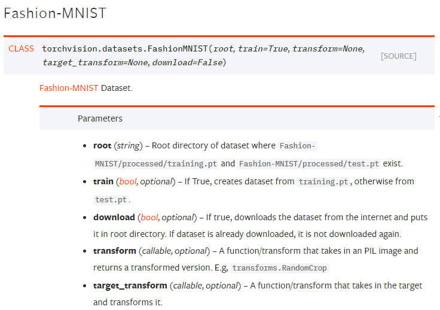

其中的参数`download`为`True`时会从国外的源直接下载数据集，如果网速不是特别优秀的情况下建议提前下载好并将此参数设置为`False`。

我们可以用`torch.utils.data.Dataset`来加载批量的图像/标签数据。这是一个表示数据集的抽象类，可以让我们统一地将变换应用于我们的数据，例如将所有图像转换为用于训练神经网络的张量。

```python
# 引入基础库
import torch
import torchvision
from torchvision.datasets import FashionMNIST
from torch.utils.data import DataLoader
from torchvision import transforms
 
# 实例化一个转换器
data_transform = transforms.ToTensor()

# 读取训练数据，并使用转换器将读入的PILImage格式数据转化为张量
train_data = FashionMNIST(root='./data', train=False, download=True, transform=data_transform)
test_data = FashionMNIST(root='./data', train=False, download=False, transform=data_transform)

# 打印数据量，确定数据读取正确
print('Train data, number of images: ', len(train_data))
print('Test data, number of images: ', len(test_data))	
```

```
Train data, number of images:  60000
Test data, number of images:  10000
```

#### 数据迭代与批处理

`torch.utils.data.DataLoader`是一个可以批量处理数据并置乱数据的迭代器。这里我们用它将数据置乱，并以大小为20的批量加载图像/标签数据。

```python
# 将批量大小设置为20
batch_size = 20

# 构建训练器
train_loader = DataLoader(train_data, batch_size=batch_size, shuffle=True)
 
# 给图片类别命名
classes = ['T-shirt/top', 'Trouser', 'Pullover', 'Dress', 'Coat',
           'Sandal', 'Shirt', 'Sneaker', 'Bag', 'Ankle boot']
```

#### 训练数据可视化

这个单元格会遍历该训练数据集，并使用dataiter.next()加载一个随机批次的图像/标签数据。然后，它会在2 x batch_size/2网格中将这批图像和标签可视化。

```python
import numpy as np
import matplotlib.pyplot as plt
 
%matplotlib inline
     
# obtain one batch of training images
dataiter = iter(train_loader)
images, labels = dataiter.next()
images = images.numpy()
 
# plot the images in the batch, along with the corresponding labels
fig = plt.figure(figsize=(25, 4))
for idx in np.arange(batch_size):
    ax = fig.add_subplot(2, batch_size/2, idx+1, xticks=[], yticks=[])
    ax.imshow(np.squeeze(images[idx]), cmap='gray')
    ax.set_title(classes[labels[idx]])
```

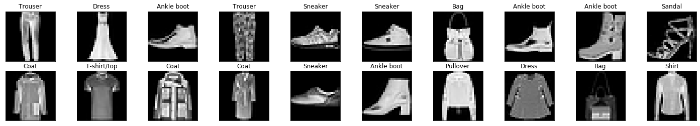


更详细地查看图像

该数据集中的每个图像都是28x28像素且已归一化的灰度图像。

关于归一化的说明

归一化可以确保在训练CNN的过程中，先后经历前馈与反向传播步骤时，每个图像特征都将落入类似的值范围内，而不是过度激活该网络中的特定层。在前馈步骤期间，该神经网络会接收输入图像并将每个输入像素乘以一些卷积滤波器权重并加上偏差，然后应用一些激活和池化函数。如果没有归一化，反向传播步骤中的计算梯度将会非常大，并且会导致我们的损失增加而不是收敛。

```python
# select an image by index
idx = 2
img = np.squeeze(images[idx])
 
# display the pixel values in that image
fig = plt.figure(figsize = (12,12))
ax = fig.add_subplot(111)
ax.imshow(img, cmap='gray')
width, height = img.shape
thresh = img.max()/2.5
for x in range(width):
    for y in range(height):
        val = round(img[x][y],2) if img[x][y] !=0 else 0
        ax.annotate(str(val), xy=(y,x),
                    horizontalalignment='center',
                    verticalalignment='center',
                    color='white' if img[x][y]<thresh else 'black')
```

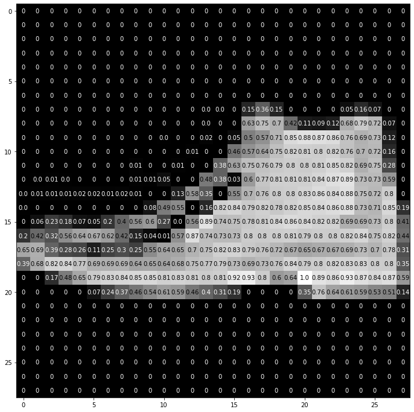


### Ⅲ. Fast API


### Ⅳ. Datalore

不过，在此之前，先让我们保存一下当前的版本，以备以后继续使用。

通过菜单`Tools` -> `Add history checkpoint`，我们可以添加一个checkpoint，比如说，起名为`keras-mnist-cnn`.

然后，通过菜单`Tools` -> `History`，我们可以查看workbook的历史。其中，第一个checkpoint是创建workbook时的状态。除此之外，勾选左上角的`Show inactivity checkpoints`之后，我们能看到很多Datalore自动保存的checkpoint，你再也不用担心不小心丢失代码了。没错，如果你接触过JetBrain系的IDE，这就是其历史功能。

你不仅可以查看不同的checkpoint，还可以比较不同checkpoint之间的区别：

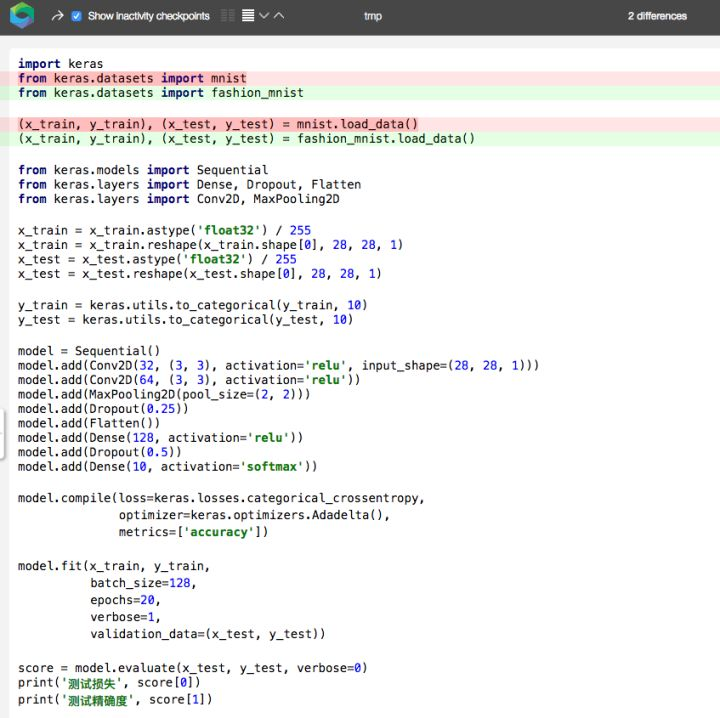

这个功能在调bug的时候是非常方便的。说到调bug，在Datalore下调bug还是比较方便的。比如，假设我们把模型的输入形状改一下，故意改成错误的：

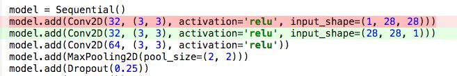

这虽然是一个故意编造的简单错误，但确实是可能出现的错误。因为有的情况下，频道是放在最前的。有的时候不小心，就会出现这种失误。

一旦我们做了这个改动后，Datalore几乎立刻反应过来。

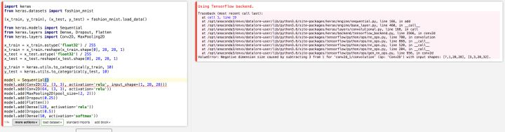

从上图我们可以看到：

1. 代码单元左边框为红色，提示我们这里有误。正常情况下，左边框为闪烁的绿色（提示正在进行运算）或黄色（提示运算完成）。
2. 右侧结果为报错的Trackback.
3. 左侧代码的出错行有红色波浪线标识。悬浮鼠标于其上，我们能看到报错信息，如下图所示。

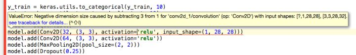


其实很多地方，悬浮鼠标都能给出相应的提示，比如悬浮到`y_train`后，会提示这是一个变量（而不是函数），甚至Datalore能推断其类型`numpy.ndarray`。

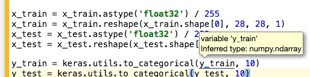

而单击一个变量后，Datalore会高亮这一变量的所有用例：

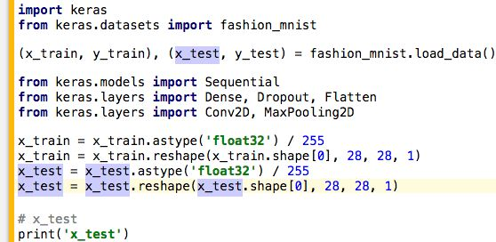


从上图我们可以看到，Datalore没有直接简单粗暴地匹配字符串，最后两行中，注释和字符串里的`x_test`并没有高亮。

好了，说了这么多。让我们回到之前的MNIST数据集训练上来。如前所述将两处`fashion_mnist`替换为`mnist`后，我们在MNIST数据集上训练模型，并评估其表现。

最终训练了一个多小时（和Fashion-MNIST时间差不多，毕竟这两个数据集的图像规格是一样的，都是28x28的灰度图像），20个epoch后精确度为0.9918，看来Keras文档所言不虚。

当然，除了代码之外，workbook里还能写文档。文档使用Markdown格式，加上了LaTeX公式扩展。

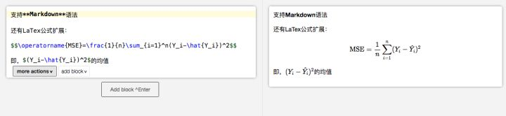

另外，线上开发环境的一大优势就是方便协作。Datalore也不例外。通过菜单`File` -> `Share`即可邀请别人协作，一起开发。

分享共有3种方式：

1. 输入Datalore用户名或邮箱，邀请对方协作开发。
2. 分享一个链接，通过这个链接访问的用户可以协作开发。
3. 同样是分享一个链接，只不过这是一个只读链接，通过这个链接访问的用户只能查看，无法修改。

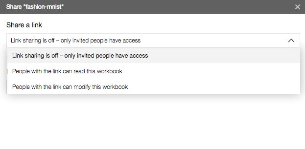

最后，附上快捷键列表（有些已经在前文中介绍过）：

- `C-空格` （`C`在mac os x上是Command键，其他平台上是ctrl键）可以触发自动补全。
- `C-d` 重复当前行
- 在Markdown单元中，按alt + 左右方向键可以在单词间跳转。


### Ⅴ. 总结


