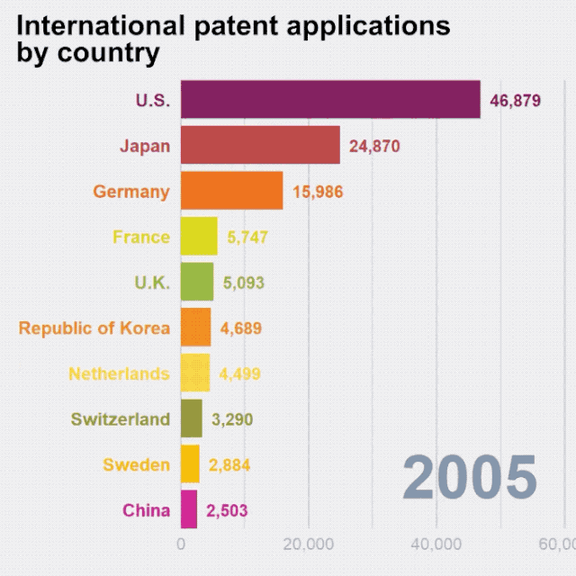

## 中国用时40年将美国拉下王座，专利申请20年增长200倍；世界知识产权最新报告发布，网友：多不意味强

全球专利申请数量的第一王座，在2019年首次易主。

不是日本，也不是德国，把美国拉下马的，是中国——用时40年。

就在世界知识产权组织(WIPO)的最新报告中：**2019年中国全球专利申请数量首次超越美国**。

这是自1978年，WIPO运行《专利合作条约》体系(PCT)以来，美国首次丢掉头把交椅。

报告中指出：

> 中国通过PCT共提交了**58990**件申请(2018年53345件)，位列全球第一。
>
> 美国以**57840**件申请(2018年56142件)位列全球第二。

除此之外，**华为**是连续三年稳居全球专利申请数量第一的企业，仅2019年国际专利申请数量就达到了4411件。

专利所有权，被广泛的视为一个国家经济实力和工业技术的重要标志。

WIPO总干事Francis Gurry表示：

> 中国的成功归功于领导层深思熟虑的战略，不断推进创新，使中国成为一个经济运行在更高价值水平上的国家。
>
> 中国迅速跃升至专利申请首位，这突出表明，长期以来，创新地理格局在向东方转移，亚洲申请人提交的申请现已占全部申请的半数以上。

但这还不是这份报告的全部，也别着急给出评价，我们先看看完整报告，再看看意味着什么？

## 中国20年暴涨200倍，华为清华等是主力

最亮眼的暴涨逆袭，从1999年开始计算，当年中国仅向WIPO提交了**276份**申请。

相比2019年的58990件申请数，20年来暴涨200倍。

但如果你以为专利申请以科研机构为主力，就错了。

报告数据中，企业是主力。

比如在Top 5的申请者中，**华为**以4411件专利申请数位列全球第一，目前已经是连续三年位居榜首，与排名第二的日本三菱集团（2661）拉开一个身位——而20年来，华为从深圳交换机小厂商，成为了全球第一电信巨头。

其次，第二梯队：韩国三星电子（2334）、美国高通（2127），以及**中国公司OPPO（1927）**。

没错，那个“充电五分钟……”的OPPO。

而在排名前50的申请单位中，**京东方**（BOE）排名第6，**平安科技**排名第8，**中兴**排名第18，**大疆DJI**排名第23。

在BAT大头里，**阿里巴巴**排名第25名，**腾讯**排名第43。

值得一提的是，**OPPO**可谓进步神速，2018年还在10名开外，但短短一年之间，竟然挤进前五？！

OPPO的蓝厂兄弟vivo，也找得到名字，以603件申请数排名第34——同样也是一年之间暴涨，因为2018年只有179件专利申请数。

整体来说，中国公司在这份报告里很突出。前五名占了2个席位，前十占据4席，前五十占比26%。

毫不夸张地说，正是这些狂飙突进的中国公司，合力把中国送上了专利数第一的王座。

当然，来自科研机构和高校的力量，同样功不可没。

在教育机构中，加州大学（包含各大分校）在2019年保持着最高排名，已公布的申请数为470件。

来自中国的**清华大学**（265）位居第二，**深圳大学（247）**则位列第三，甚至超过了麻省理工学院（230），第五名也来自中国：**华南理工大学**（164） 。

在排名前五十的大学中，美国大学有20所，中国大学有14所。

最后，说一下国家向排名。

除中美位居第一第二以外，日本以**49706**件申请数量位居第三，德国位居第四（19742件），韩国第五（19085）。

而且值得注意的是，在2019年申请数中，亚洲申请数占2019全球申请数的**52.4%**，而欧洲（23.2％）和北美（22.8％）分别不到四分之一。

## 这份报告权威吗？

当然，报告结果，算是在抗疫巨大努力后鼓舞人心了。

那么问题来了，这份报告权威吗？

**相当权威**。

因为出品方，可是联合国啊。世界知识产权组织(简称：WIPO)成立于1967年，是联合国15个专门机构之一。其宗旨是 “鼓励创造性活动，在全世界范围内促进对知识产权的保护”。

世界知识产权组织目前有193个成员国，包括联合国190个成员国以及库克群岛、罗马教廷和纽埃。总部设在瑞士日内瓦，管理着26项国际条约。

按照其职责，每年都会从专利申请等维度，来看待国家、企业发展和创新。

所以随着报告统计以来就雄霸第一的美国被拉下马，WIPO也认为，这说明了中国在创新模型推动方面的成功。

也有外媒就该报告问其总干事Francis Gurry：跟中国政策性补贴推动创新有无关系？跟美国鼓励创新的模式，有没有高下之分？

Gurry也给出了回答：中西有不同的制度和模式，之前西方主要采取的是高绩效经济模式，这也是美国始终是创新领域佼佼者的原因。但如果单纯就此来比较中美孰高孰下，还无法有定论。

嗯，滴水不漏。

不过倒是国内外，似乎对专利申请数第一易主这件事，早就不奇怪了。

因为之前，就已有其他维度的征兆。

## AI专利已先超越美国

实际上，此次我国在专利申请上的飞跃进展，并非毫无征兆。

在去年12月2日出炉的《人工智能技术专利深度分析报告》中，我国**AI领域**的专利申请数量便超过了美国。

报告中，统计了自2000年以来的情况，中国人工智能领域的专利申请量总体上呈逐年上升趋势，且增长率不断提高。

按照申请年份进行统计可以发现，2010年后增长速度明显加快，2014年后增长率又上了一个台阶。2016年AlphaGo人机大战之后，这两年的增长率又再度增高。到了2018年，专利申请数量已经是2010年的近20倍

截至2019年10月，中国人工智能专利申请量已经超越美国，成为AI领域专利申请量最高的国家。

同样这份报告中，AI专利也以企业领衔，百度和腾讯位列前两名，微软第三，高校中**西安电子科技大学**和**浙大**最靠前，都进入了前十。

当时甚至还引起日媒感叹，称中国在AI等前沿科技领域的创新力度，真是惊人。

不过，无论是当时日媒的感叹，还是如今WIPO的“毒奶”，倒也没让国内受众沸腾。

因为对于见惯了增长的中国网友，量变早已见怪不怪。

## 专利多不意味着强，创新不是零和游戏

就在WIPO报告出炉后，评论显得克制。

虽然WIPO总干事说，专利申请数量越多，一定程度上能够体现一个经济体的创新能力……

但不少网友认为，不仅要量变，更要质变：

> 坦白讲，专利质量还有待进一步提高。

> 慢慢来，我们和发达国家还是差距十几年的。但是已经是大进步了。

> 等质量人均都超了的时候，中国就是最强国了。

也有网友提供了另一维度的担忧：

> 知识产权是打压对手的一个手段，如果不灵，说不定又“退群”了。就如碳排放就曾是一个新的打压手段。不定哪天搞个人权指数什么的，改变规则只是为了掠夺更多的利益。

也正如总干事所说，虽然知识产权日益成为全球竞争的核心，但**创新不是零和游戏**，全球创新净增长意味着新药、新通信技术和应对全球挑战新方案的出现，将使所有人受益。

你认同吗？你怎么看这个结果？

参考链接：

WIPO官方报道：
https://www.wipo.int/pressroom/en/articles/2020/article_0005.html

路透社报道：
https://www.reuters.com/article/us-usa-china-patents/in-a-first-china-knocks-u-s-from-top-spot-in-global-patent-race-idUSKBN21P1P9

