# 快速入门 Julia 语言 | 罗秀哲

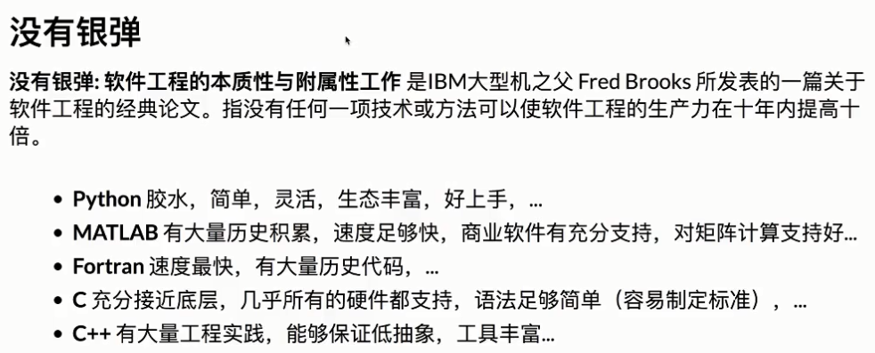

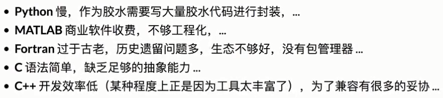

劣势往往是优势所带来的

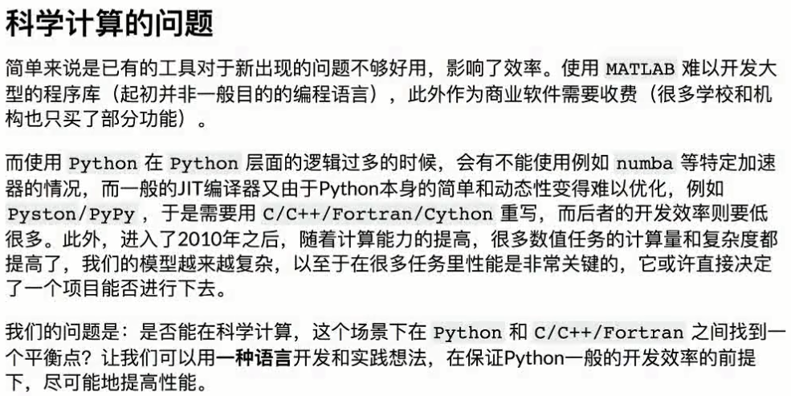

## Julia 的特点

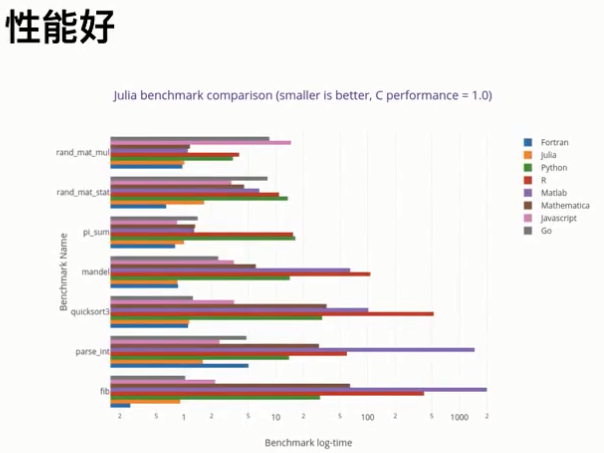

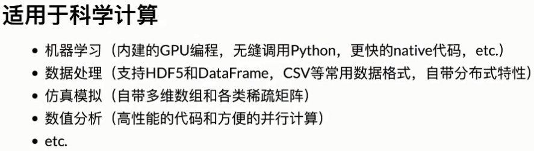

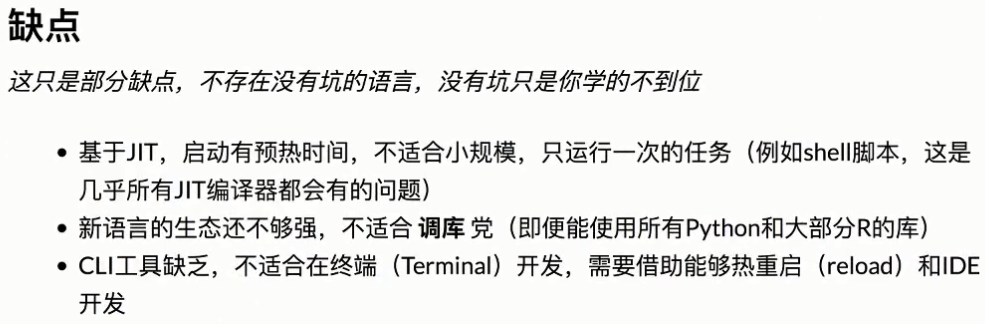

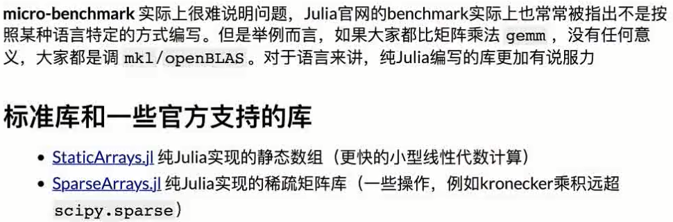

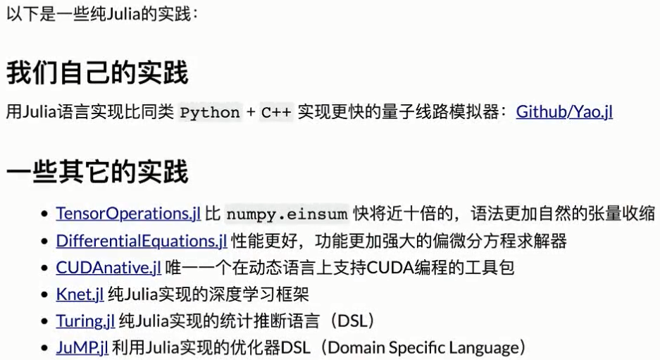

## 如何安装和配置 Julia 开发环境

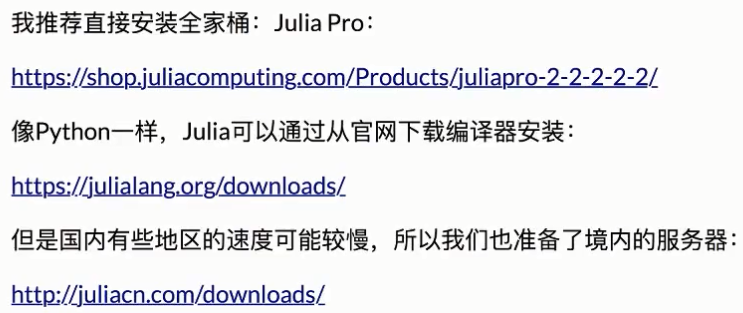

## 如何从源码编译 Julia

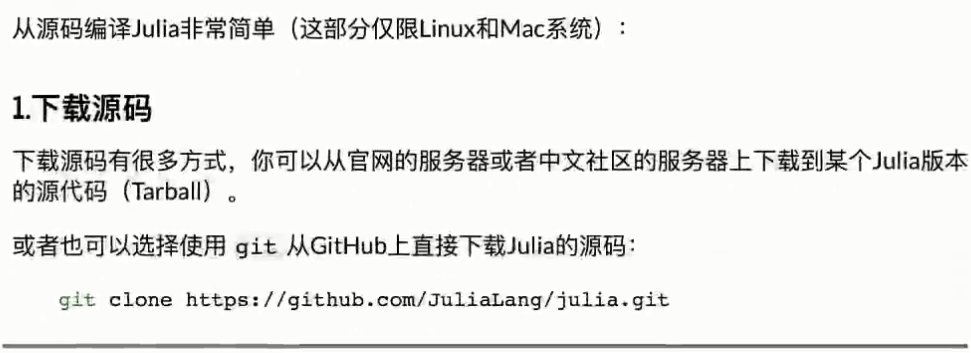

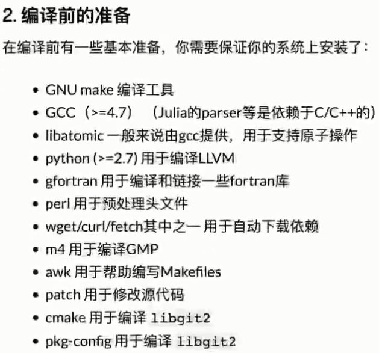

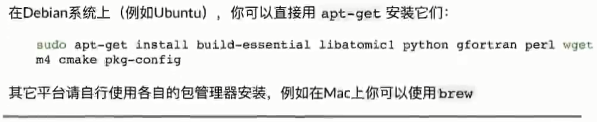

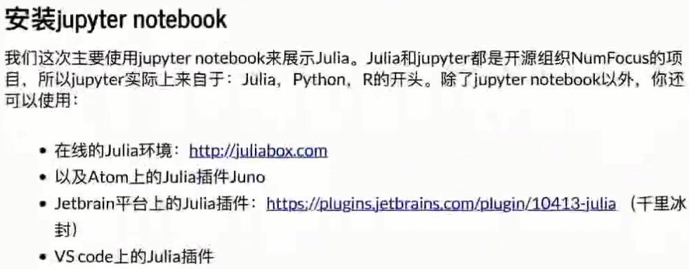

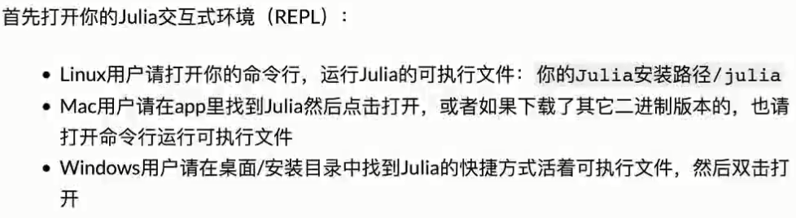

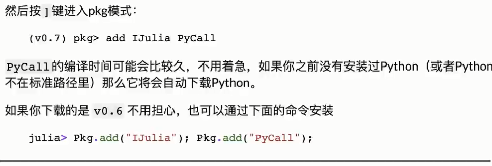

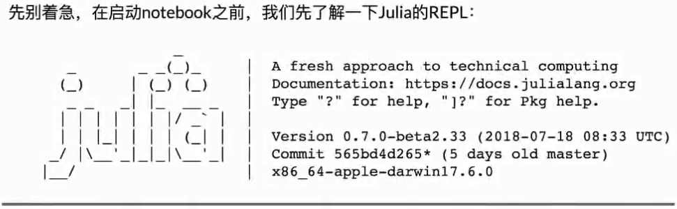

- help模式：查文档，按问号进入；
- shell模式：按分号进入；
- package模式：按右方括号进入，0.7版本之后才有。

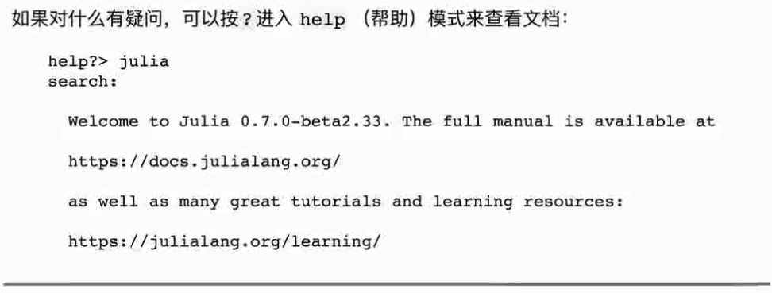

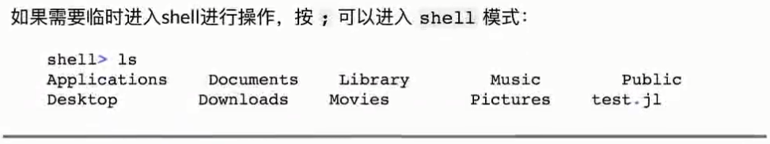

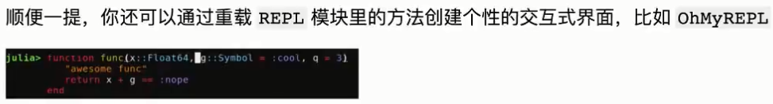

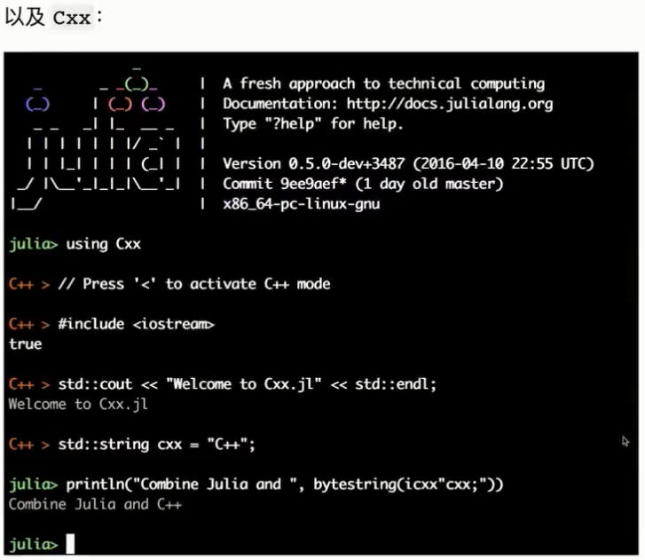

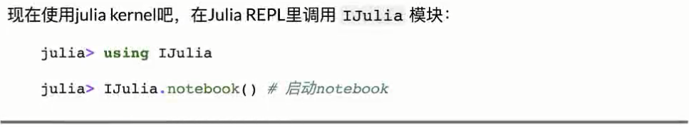

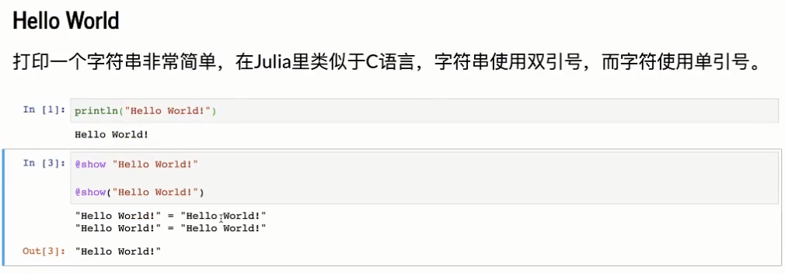

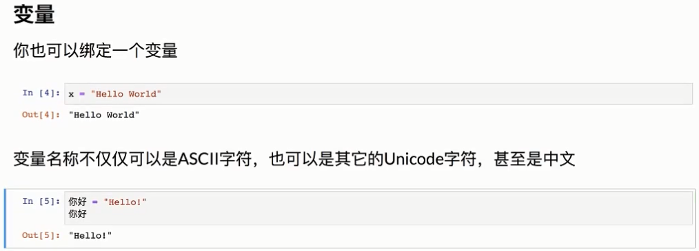

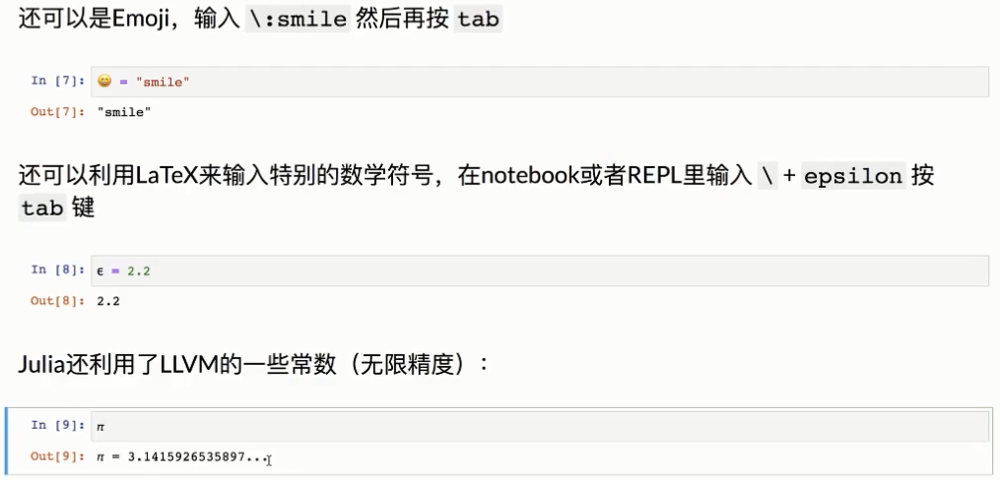

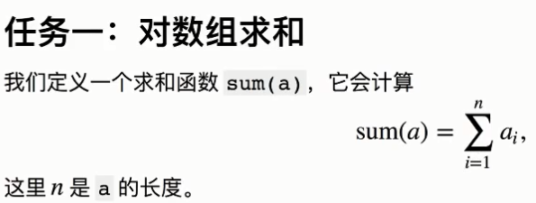

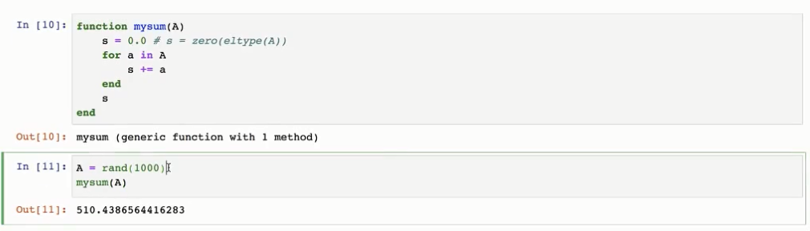

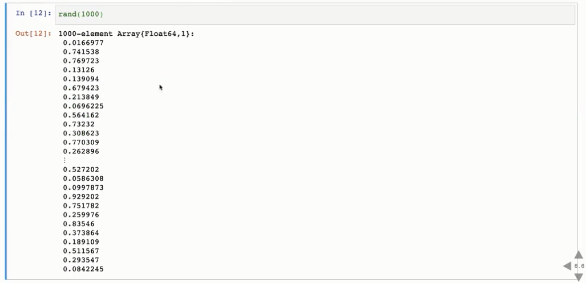

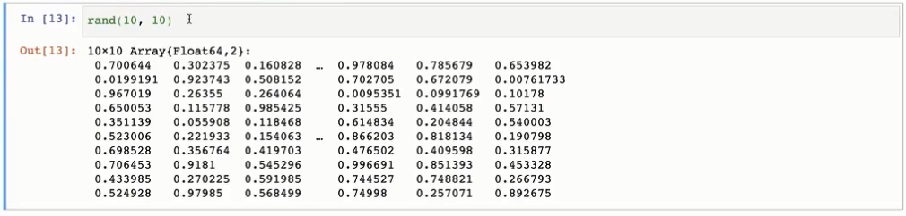

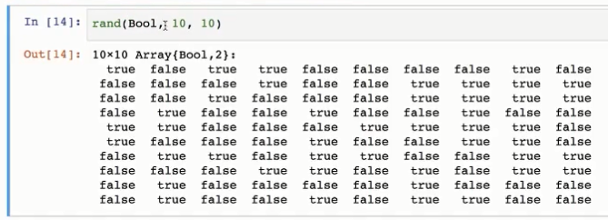

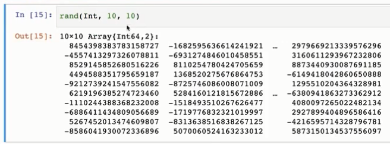

