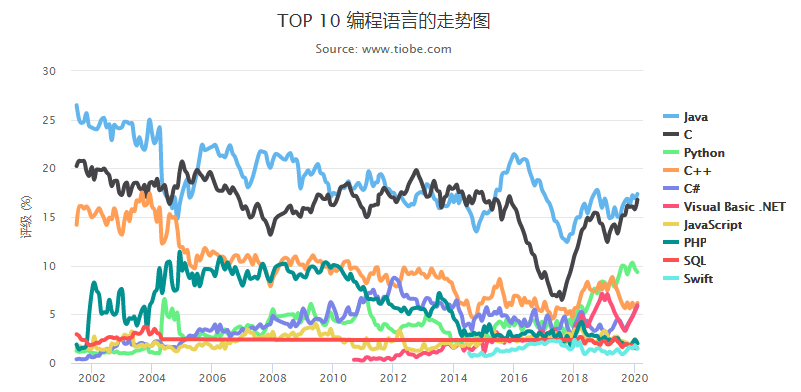

七天七语言
Kotlin
Go
C#
Java
Scala
Python
JavaSript

hello,world

基本数据类型与类型系统

关键字与操作符

循环与分支

字符串与数组

集合类

面向对象编程

函数式编程

文件IO

正则表达式

多线程

Json序列化

http编程API

## 编程语言排行榜 TOP 50 榜单

| 排名 | 编程语言             | 流行度  | 对比上月 | 年度明星语言     |
| ---- | -------------------- | ------- | -------- | ---------------- |
| 1    | **Java**             | 17.358% | 0.462%   | 2015, 2005       |
| 2    | C                    | 16.766% | 0.993%   | 2017, 2008, 2019 |
| 3    | Python               | 9.345%  | 0.359%   | 2010, 2007, 2018 |
| 4    | C++                  | 6.164%  | 0.59%    | 2003             |
| 5    | C#                   | 5.927%  | 0.578%   |                  |
| 6    | Visual Basic .NET    | 5.862%  | 0.575%   |                  |
| 7    | **JavaScript**       | 2.060%  | 0.391%   | 2014             |
| 8    | PHP                  | 2.018%  | 0.387%   | 2004             |
| 9    | SQL                  | 1.526%  | 0.022%   |                  |
| 10   | Swift                | 1.460%  | 0.335%   |                  |
| 11   | **Go**               | 1.131%  | 0.231%   | 2016, 2009       |
| 12   | Assembly language    | 1.111%  | 0.234%   |                  |
| 13   | R                    | 1.005%  | 0.197%   |                  |
| 14   | D                    | 0.917%  | 0.092%   |                  |
| 15   | Ruby                 | 0.844%  | 0.219%   | 2006             |
| 16   | MATLAB               | 0.794%  | 0.057%   |                  |
| 17   | PL/SQL               | 0.764%  | 0.189%   |                  |
| 18   | Delphi/Object Pascal | 0.748%  | 0.249%   |                  |
| 19   | Perl                 | 0.697%  | 0.049%   |                  |
| 20   | Objective-C          | 0.688%  | 0.241%   | 2012, 2011       |
| 21   | SAS                  | 0.656%  | 0.052%   |                  |
| 22   | Visual Basic         | 0.603%  | 0.228%   |                  |
| 23   | **Dart**             | 0.553%  | 0.082%   |                  |
| 24   | Scratch              | 0.532%  | 0.042%   |                  |
| 25   | Scala                | 0.450%  | 0.072%   |                  |
| 26   | Groovy               | 0.413%  | 0.195%   |                  |
| 27   | Transact-SQL         | 0.379%  | 0.032%   | 2013             |
| 28   | F#                   | 0.352%  | 0.12%    |                  |
| 29   | Rust                 | 0.346%  | 0.049%   |                  |
| 30   | COBOL                | 0.339%  | 0.043%   |                  |
| 31   | ABAP                 | 0.309%  | 0.055%   |                  |
| 32   | Lisp                 | 0.294%  | 0.104%   |                  |
| 33   | Kotlin               | 0.267%  | 0.027%   |                  |
| 34   | Logo                 | 0.253%  | 0.161%   |                  |
| 35   | RPG                  | 0.240%  | 0.157%   |                  |
| 36   | Lua                  | 0.235%  | 0.009%   |                  |
| 37   | Fortran              | 0.229%  | 0.084%   |                  |
| 38   | PowerShell           | 0.209%  | 新上榜   |                  |
| 39   | Ada                  | 0.206%  | 0.056%   |                  |
| 40   | LabVIEW              | 0.176%  | 0.024%   |                  |
| 41   | Erlang               | 0.174%  | 新上榜   |                  |
| 42   | Julia                | 0.170%  | 0.014%   |                  |
| 43   | ML                   | 0.169%  | 0.105%   |                  |
| 44   | Scheme               | 0.169%  | 0.028%   |                  |
| 45   | Haskell              | 0.160%  | 0.035%   |                  |
| 46   | TypeScript           | 0.155%  | 0.025%   |                  |
| 47   | OpenEdge ABL         | 0.150%  | 0.068%   |                  |
| 48   | LiveCode             | 0.146%  | 0.131%   |                  |
| 49   | PostScript           | 0.144%  | 新上榜   |                  |
| 50   | ActionScript         | 0.142%  | 0.07%    |                  |