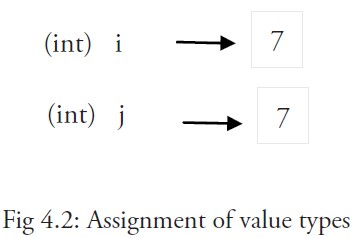
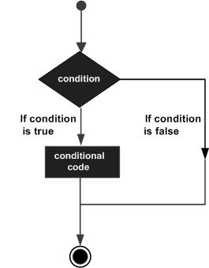
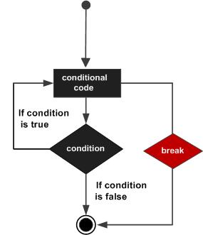
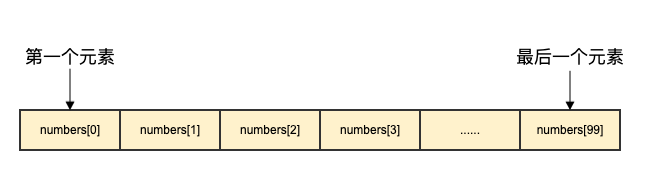
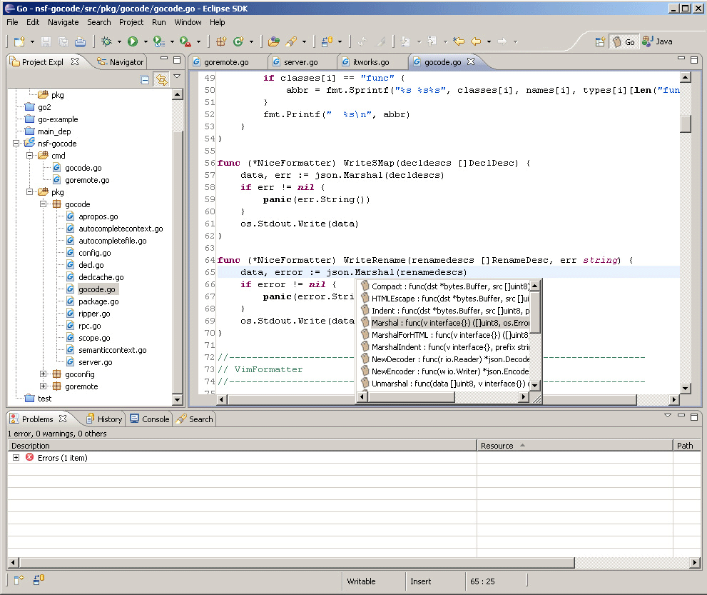
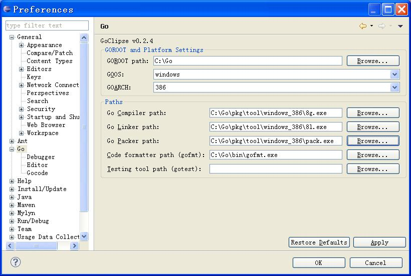
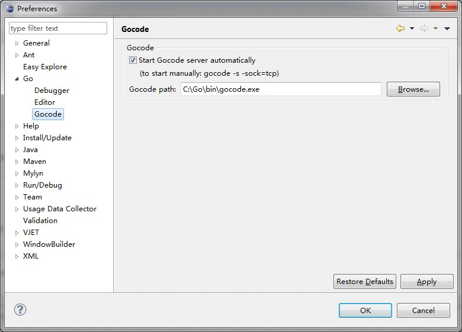

# Go 语言教程


Go 是一个开源的编程语言，它能让构造简单、可靠且高效的软件变得容易。

Go是从2007年末由Robert Griesemer, Rob Pike, Ken Thompson主持开发，后来还加入了Ian Lance Taylor, Russ Cox等人，并最终于2009年11月开源，在2012年早些时候发布了Go 1稳定版本。现在Go的开发已经是完全开放的，并且拥有一个活跃的社区。

------

## Go 语言特色

- 简洁、快速、安全
- 并行、有趣、开源
- 内存管理、数组安全、编译迅速

------

## Go 语言用途

Go 语言被设计成一门应用于搭载 Web 服务器，存储集群或类似用途的巨型中央服务器的系统编程语言。

对于高性能分布式系统领域而言，Go 语言无疑比大多数其它语言有着更高的开发效率。它提供了海量并行的支持，这对于游戏服务端的开发而言是再好不过了。

------

## 第一个 Go 程序

接下来我们来编写第一个 Go 程序 `hello.go`（Go 语言源文件的扩展是 .go），代码如下：

## hello.go 文件

```go
package main

import "fmt"

func main() {
  fmt.Println("Hello, World!")
}
```

要执行 Go 语言代码可以使用 **go run** 命令。

执行以上代码输出:

```shell
$ go run hello.go 
Hello, World!
```

此外我们还可以使用 **go build** 命令来生成二进制文件：

```shell
$ go build hello.go 
$ ls
hello    hello.go
$ ./hello 
Hello, World!
```

> 计算机软件经历了数十年的发展，形成了多种学术流派，有面向过程编程、面向对象编程、函数式编程、面向消息编程等，这些思想究竟孰优孰劣，众说纷纭。
>
> 除了OOP外，近年出现了一些小众的编程哲学，Go语言对这些思想亦有所吸收。例如，Go语言接受了函数式编程的一些想法，支持匿名函数与闭包。再如，Go语言接受了以Erlang语言为代表的面向消息编程思想，支持goroutine和通道，并推荐使用消息而不是共享内存来进行并发编程。总体来说，Go语言是一个非常现代化的语言，精小但非常强大。
>
> Go 语言最主要的特性：
>
> - 自动垃圾回收
> - 更丰富的内置类型
> - 函数多返回值
> - 错误处理
> - 匿名函数和闭包
> - 类型和接口
> - 并发编程
> - 反射
> - 语言交互性


# Go 语言环境安装

Go 语言支持以下系统：

- Linux
- FreeBSD
- Mac OS X（也称为 Darwin）
- Windows

安装包下载地址为：https://golang.org/dl/。

如果打不开可以使用这个地址：https://golang.google.cn/dl/。

各个系统对应的包名：

| 操作系统 | 包名                           |
| :------- | :----------------------------- |
| Windows  | go1.4.windows-amd64.msi        |
| Linux    | go1.4.linux-amd64.tar.gz       |
| Mac      | go1.4.darwin-amd64-osx10.8.pkg |
| FreeBSD  | go1.4.freebsd-amd64.tar.gz     |


------

## UNIX/Linux/Mac OS X, 和 FreeBSD 安装

以下介绍了在UNIX/Linux/Mac OS X, 和 FreeBSD系统下使用源码安装方法：

1、下载二进制包：go1.4.linux-amd64.tar.gz。

2、将下载的二进制包解压至 /usr/local目录。

```
tar -C /usr/local -xzf go1.4.linux-amd64.tar.gz
```

3、将 /usr/local/go/bin 目录添加至PATH环境变量：

```
export PATH=$PATH:/usr/local/go/bin
```

> **注意：**MAC 系统下你可以使用 **.pkg** 结尾的安装包直接双击来完成安装，安装目录在 **/usr/local/go/** 下。

------

## Windows 系统下安装

Windows 下可以使用 .msi 后缀(在下载列表中可以找到该文件，如go1.4.2.windows-amd64.msi)的安装包来安装。

默认情况下 **.msi** 文件会安装在 **c:\Go** 目录下。你可以将 **c:\Go\bin** 目录添加到 **Path** 环境变量中。添加后你需要重启命令窗口才能生效。

**安装测试**

创建工作目录 **C:\>Go_WorkSpace**。

**test.go 文件代码：**

```go
package main

import "fmt"

func main() {
  fmt.Println("Hello, World!")
}
```

使用 go 命令执行以上代码输出结果如下：

```shell
C:\Go_WorkSpace>go run test.go

Hello, World!
```

# Go 语言结构

在我们开始学习 Go 编程语言的基础构建模块前，让我们先来了解 Go 语言最简单程序的结构。

------

## Go Hello World 实例

Go 语言的基础组成有以下几个部分：

- 包声明
- 引入包
- 函数
- 变量
- 语句 & 表达式
- 注释

接下来让我们来看下简单的代码，该代码输出了"Hello World!":

**实例**

```go
package main

import "fmt"

func main() {
  /* 这是我的第一个简单的程序 */
  fmt.Println("Hello, World!")
}
```

让我们来看下以上程序的各个部分：

1. 第一行代码 `package main` 定义了包名。你必须在源文件中非注释的第一行指明这个文件属于哪个包，如：package main。package main表示一个可独立执行的程序，每个 Go 应用程序都包含一个名为 main 的包。
2. 下一行 `import "fmt"` 告诉 Go 编译器这个程序需要使用 fmt 包（的函数，或其他元素），fmt 包实现了格式化 IO（输入/输出）的函数。
3. 下一行 `func main()` 是程序开始执行的函数。main 函数是每一个可执行程序所必须包含的，一般来说都是在启动后第一个执行的函数（如果有 `init()` 函数则会先执行该函数）。
4. 下一行 `/*...*/` 是注释，在程序执行时将被忽略。单行注释是最常见的注释形式，你可以在任何地方使用以 `//` 开头的单行注释。多行注释也叫块注释，均已以 `/*` 开头，并以 `*/` 结尾，且不可以嵌套使用，多行注释一般用于包的文档描述或注释成块的代码片段。
5. 下一行 `fmt.Println(...)` 可以将字符串输出到控制台，并在最后自动增加换行字符 `\n`。
   使用 `fmt.Print("hello, world\n")` 可以得到相同的结果。
   Print 和 Println 这两个函数也支持使用变量，如：`fmt.Println(arr)`。如果没有特别指定，它们会以默认的打印格式将变量 arr 输出到控制台。
6. 当标识符（包括常量、变量、类型、函数名、结构字段等等）以一个大写字母开头，如：Group1，那么使用这种形式的标识符的对象就可以被外部包的代码所使用（客户端程序需要先导入这个包），这被称为导出（像面向对象语言中的 public）；标识符如果以小写字母开头，则对包外是不可见的，但是他们在整个包的内部是可见并且可用的（像面向对象语言中的 protected ）。

------

## 执行 Go 程序

让我们来看下如何编写 Go 代码并执行它。步骤如下：

1. 打开编辑器如Sublime2，将以上代码添加到编辑器中。

2. 将以上代码保存为 `hello.go`

3. 打开命令行，并进入程序文件保存的目录中。

4. 输入命令 `go run hello.go` 并按回车执行代码。

5. 如果操作正确你将在屏幕上看到 `Hello World!` 字样的输出。

   ```
   $ go run hello.go
   Hello, World!
   ```

6. 我们还可以使用 **go build** 命令来生成二进制文件：

   ```
   $ go build hello.go 
   $ ls
   hello    hello.go
   $ ./hello 
   Hello, World!
   ```

**注意**

需要注意的是 `{` 不能单独放在一行，所以以下代码在运行时会产生错误：

**实例**

```go
package main

import "fmt"

func main() 
{ // 错误，{ 不能在单独的行上
  fmt.Println("Hello, World!")
}
```

当前的调试部分可以使用 **go run filename.go** 来执行。

可以生成一个 **build.sh** 脚本，用于在指定位置产生已编译好的 可执文件:

```shell
#!/usr/bin/env bash

CURRENT_DIR=`pwd`
OLD_GO_PATH="$GOPATH"  #例如: /usr/local/go
OLD_GO_BIN="$GOBIN"    #例如: /usr/local/go/bin

export GOPATH="$CURRENT_DIR" 
export GOBIN="$CURRENT_DIR/bin"

#指定并整理当前的源码路径
gofmt -w src

go install test_hello

export GOPATH="$OLD_GO_PATH"
export GOBIN="$OLD_GO_BIN"
```

关于包，根据本地测试得出以下几点：

-  文件名与包名没有直接关系，不一定要将文件名与包名定成同一个。
-  文件夹名与包名没有直接关系，并非需要一致。
-  同一个文件夹下的文件只能有一个包名，否则编译报错。

文件结构:

```shell
Test
--helloworld.go

myMath
--myMath1.go
--myMath2.go
```

测试代码:

```go
// helloworld.go
package main

import (
"fmt"
"./myMath"
)

func main(){
    fmt.Println("Hello World!")
    fmt.Println(mathClass.Add(1,1))
    fmt.Println(mathClass.Sub(1,1))
}
```

```go
// myMath1.go
package mathClass
func Add(x,y int) int {
    return x + y
}
```

```go
// myMath2.go
package mathClass
func Sub(x,y int) int {
    return x - y
}
```


# Go 语言基础语法

上一章节我们已经了解了 Go 语言的基本组成结构，本章节我们将学习 Go 语言的基础语法。

------

## Go 标记

Go 程序可以由多个标记组成，可以是关键字，标识符，常量，字符串，符号。如以下 GO 语句由 6 个标记组成：

```go
fmt.Println("Hello, World!")
```

6 个标记是(每行一个)：

```go
fmt
.
Println
(
"Hello, World!"
)
```

------

## 行分隔符

在 Go 程序中，一行代表一个语句结束。每个语句不需要像 C 家族中的其它语言一样以分号 ; 结尾，因为这些工作都将由 Go 编译器自动完成。

如果你打算将多个语句写在同一行，它们则必须使用 ; 人为区分，但在实际开发中我们并不鼓励这种做法。

以下为两个语句：

```go
fmt.Println("Hello, World!")
fmt.Println("菜鸟教程：runoob.com")
```

------

## 注释

注释不会被编译，每一个包应该有相关注释。

单行注释是最常见的注释形式，你可以在任何地方使用以 // 开头的单行注释。多行注释也叫块注释，均已以 /* 开头，并以 */ 结尾。如：

```go
// 单行注释
/*
 Author by 菜鸟教程
 我是多行注释
 */
```

------

## 标识符

标识符用来命名变量、类型等程序实体。一个标识符实际上就是一个或是多个字母(A~Z和a~z)数字(0~9)、下划线_组成的序列，但是第一个字符必须是字母或下划线而不能是数字。

以下是有效的标识符：

```go
mahesh   kumar   abc   move_name   a_123
myname50   _temp   j   a23b9   retVal
```

以下是无效的标识符：

- 1ab（以数字开头）
- case（Go 语言的关键字）
- a+b（运算符是不允许的）

------

## 字符串连接

Go 语言的字符串可以通过 **+** 实现：

## 实例

```go
package main
import "fmt"
func main() {
  fmt.Println("Google" + "Runoob")
}
```

以上实例输出结果为：

```go
GoogleRunoob
```

------

## 关键字

下面列举了 Go 代码中会使用到的 25 个关键字或保留字：

| break    | default     | func   | interface | select |
| -------- | ----------- | ------ | --------- | ------ |
| case     | defer       | go     | map       | struct |
| chan     | else        | goto   | package   | switch |
| const    | fallthrough | if     | range     | type   |
| continue | for         | import | return    | var    |

除了以上介绍的这些关键字，Go 语言还有 36 个预定义标识符：

| append | bool    | byte    | cap     | close  | complex | complex64 | complex128 | uint16  |
| ------ | ------- | ------- | ------- | ------ | ------- | --------- | ---------- | ------- |
| copy   | false   | float32 | float64 | imag   | int     | int8      | int16      | uint32  |
| int32  | int64   | iota    | len     | make   | new     | nil       | panic      | uint64  |
| print  | println | real    | recover | string | true    | uint      | uint8      | uintptr |

程序一般由关键字、常量、变量、运算符、类型和函数组成。

程序中可能会使用到这些分隔符：括号 `()`，中括号 `[]` 和大括号 `{}`。

程序中可能会使用到这些标点符号：`.`、`,`、`;`、`:` 和 `…`。

------

## Go 语言的空格

Go 语言中变量的声明必须使用空格隔开，如：

```go
var age int;
```

语句中适当使用空格能让程序更易阅读。

无空格：

```go
fruit=apples+oranges;
```

在变量与运算符间加入空格，程序看起来更加美观，如：

```go
fruit = apples + oranges; 
```

# Go 语言数据类型

在 Go 编程语言中，数据类型用于声明函数和变量。

数据类型的出现是为了把数据分成所需内存大小不同的数据，编程的时候需要用大数据的时候才需要申请大内存，就可以充分利用内存。

Go 语言按类别有以下几种数据类型：

| 序号 | 类型和描述                                                   |
| :--- | :----------------------------------------------------------- |
| 1    | **布尔型** <br>布尔型的值只可以是常量 true 或者 false。一个简单的例子：var b bool = true。 |
| 2    | **数字类型** <br/>整型 int 和浮点型 float32、float64，Go 语言支持整型和浮点型数字，并且支持复数，其中位的运算采用补码。 |
| 3    | **字符串类型:** <br/>字符串就是一串固定长度的字符连接起来的字符序列。Go 的字符串是由单个字节连接起来的。Go 语言的字符串的字节使用 UTF-8 编码标识 Unicode 文本。 |
| 4    | **派生类型:** <br/>包括：<br/>(a) 指针类型（Pointer）<br/>(b) 数组类型<br/>(c) 结构化类型(struct)<br/>(d) Channel 类型<br/>(e) 函数类型<br/>(f) 切片类型<br/>(g) 接口类型（interface）<br/>(h) Map 类型 |

------

## 数字类型

Go 也有基于架构的类型，例如：int、uint 和 uintptr。

| 序号 | 类型和描述                                                   |
| :--- | :----------------------------------------------------------- |
| 1    | **uint8** <br/>无符号 8 位整型 (0 到 255)                    |
| 2    | **uint16** <br/>无符号 16 位整型 (0 到 65535)                |
| 3    | **uint32** <br/>无符号 32 位整型 (0 到 4294967295)           |
| 4    | **uint64** <br/>无符号 64 位整型 (0 到 18446744073709551615) |
| 5    | **int8** <br/>有符号 8 位整型 (-128 到 127)                  |
| 6    | **int16** <br/>有符号 16 位整型 (-32768 到 32767)            |
| 7    | **int32** <br/>有符号 32 位整型 (-2147483648 到 2147483647)  |
| 8    | **int64** <br/>有符号 64 位整型 (-9223372036854775808 到 9223372036854775807) |

### 浮点型

| 序号 | 类型和描述                             |
| :--- | :------------------------------------- |
| 1    | **float32** <br/>IEEE-754 32位浮点型数 |
| 2    | **float64** <br/>IEEE-754 64位浮点型数 |
| 3    | **complex64** <br/>32 位实数和虚数     |
| 4    | **complex128** <br/>64 位实数和虚数    |

------

## 其他数字类型

以下列出了其他更多的数字类型：

| 序号 | 类型和描述                                    |
| :--- | :-------------------------------------------- |
| 1    | **byte** <br/>类似 uint8                      |
| 2    | **rune** <br/>类似 int32                      |
| 3    | **uint** <br/>32 或 64 位                     |
| 4    | **int** <br/>与 uint 一样大小                 |
| 5    | **uintptr** <br/>无符号整型，用于存放一个指针 |

# Go 语言变量

变量来源于数学，是计算机语言中能储存计算结果或能表示值抽象概念。

变量可以通过变量名访问。

Go 语言变量名由字母、数字、下划线组成，其中首个字符不能为数字。

声明变量的一般形式是使用 var 关键字：

```go
var identifier type
```

可以一次声明多个变量：

```go
var identifier1, identifier2 type
```

**实例**

```go
package main
import "fmt"
func main() {
  var a string = "Runoob"
  fmt.Println(a)

  var b, c int = 1, 2
  fmt.Println(b, c)
}
```

以上实例输出结果为：

```go
Runoob
1 2
```

## 变量声明

**第一种，指定变量类型，如果没有初始化，则变量默认为零值**。

```go
var v_name v_type
v_name = value
```

零值就是变量没有做初始化时系统默认设置的值。

**实例**

```go
package main
import "fmt"
func main() {

  // 声明一个变量并初始化
  var a = "RUNOOB"
  fmt.Println(a)

  // 没有初始化就为零值
  var b int
  fmt.Println(b)

  // bool 零值为 false
  var c bool
  fmt.Println(c)
}
```

以上实例执行结果为：

```go
RUNOOB
0
false
```

- 数值类型（包括complex64/128）为 **0**

- 布尔类型为 **false**

- 字符串为 **""**（空字符串）

- 以下几种类型为 **nil**：

  ```go
  var a *int
  var a []int
  var a map[string] int
  var a chan int
  var a func(string) int
  var a error // error 是接口
  ```

**实例**

```go
package main

import "fmt"

func main() {
  var i int
  var f float64
  var b bool
  var s string
  fmt.Printf("%v %v %v %q\n", i, f, b, s)
}
```

输出结果是：

```go
0 0 false ""
```

**第二种，根据值自行判定变量类型。**

```go
var v_name = value
```

**实例**

```go
package main
import "fmt"
func main() {
  var d = true
  fmt.Println(d)
}
```

输出结果是：

```go
true
```

**第三种，省略 var, 注意 \**:=\** 左侧如果没有声明新的变量，就产生编译错误，格式：**

```go
v_name := value
```

例如：

```go
var intVal int 

intVal :=1 // 这时候会产生编译错误

intVal,intVal1 := 1,2 // 此时不会产生编译错误，因为有声明新的变量，因为 := 是一个声明语句
```

可以将 `var f string = "Runoob"` 简写为 `f := "Runoob"` 。

**实例**

```go
package main
import "fmt"
func main() {
  f := "Runoob" // var f string = "Runoob"

  fmt.Println(f)
}
```

输出结果是：

```go
Runoob
```

## 多变量声明

```go
//类型相同多个变量, 非全局变量
var vname1, vname2, vname3 type
vname1, vname2, vname3 = v1, v2, v3

var vname1, vname2, vname3 = v1, v2, v3 // 和 python 很像,不需要显示声明类型，自动推断

vname1, vname2, vname3 := v1, v2, v3 // 出现在 := 左侧的变量不应该是已经被声明过的，否则会导致编译错误


// 这种因式分解关键字的写法一般用于声明全局变量
var (
    vname1 v_type1
    vname2 v_type2
)
```

**实例**

```go
package main

var x, y int
var ( // 这种因式分解关键字的写法一般用于声明全局变量
  a int
  b bool
)

var c, d int = 1, 2
var e, f = 123, "hello"

//这种不带声明格式的只能在函数体中出现
//g, h := 123, "hello"

func main(){
  g, h := 123, "hello"
  println(x, y, a, b, c, d, e, f, g, h)
}
```

以上实例执行结果为：

```go
0 0 0 false 1 2 123 hello 123 hello
```

------

## 值类型和引用类型

所有像 int、float、bool 和 string 这些基本类型都属于值类型，使用这些类型的变量直接指向存在内存中的值：


当使用等号 `=` 将一个变量的值赋值给另一个变量时，如：`j = i`，实际上是在内存中将 i 的值进行了拷贝：



你可以通过 `&i` 来获取变量 i 的内存地址，例如：0xf840000040（每次的地址都可能不一样）。值类型的变量的值存储在栈中。

内存地址会根据机器的不同而有所不同，甚至相同的程序在不同的机器上执行后也会有不同的内存地址。因为每台机器可能有不同的存储器布局，并且位置分配也可能不同。

更复杂的数据通常会需要使用多个字，这些数据一般使用引用类型保存。

一个引用类型的变量 r1 存储的是 r1 的值所在的内存地址（数字），或内存地址中第一个字所在的位置。


这个内存地址为称之为指针，这个指针实际上也被存在另外的某一个值中。

同一个引用类型的指针指向的多个字可以是在连续的内存地址中（内存布局是连续的），这也是计算效率最高的一种存储形式；也可以将这些字分散存放在内存中，每个字都指示了下一个字所在的内存地址。

当使用赋值语句 r2 = r1 时，只有引用（地址）被复制。

如果 r1 的值被改变了，那么这个值的所有引用都会指向被修改后的内容，在这个例子中，r2 也会受到影响。

------

## 简短形式，使用 := 赋值操作符

我们知道可以在变量的初始化时省略变量的类型而由系统自动推断，声明语句写上 var 关键字其实是显得有些多余了，因此我们可以将它们简写为 a := 50 或 b := false。

a 和 b 的类型（int 和 bool）将由编译器自动推断。

这是使用变量的首选形式，但是它只能被用在函数体内，而不可以用于全局变量的声明与赋值。使用操作符 := 可以高效地创建一个新的变量，称之为初始化声明。

**注意事项**

如果在相同的代码块中，我们不可以再次对于相同名称的变量使用初始化声明，例如：a := 20 就是不被允许的，编译器会提示错误 no new variables on left side of :=，但是 a = 20 是可以的，因为这是给相同的变量赋予一个新的值。

如果你在定义变量 a 之前使用它，则会得到编译错误 undefined: a。

如果你声明了一个局部变量却没有在相同的代码块中使用它，同样会得到编译错误，例如下面这个例子当中的变量 a：

**实例**

```go
package main

import "fmt"

func main() {
  var a string = "abc"
  fmt.Println("hello, world")
}
```

尝试编译这段代码将得到错误 **a declared and not used**。

此外，单纯地给 a 赋值也是不够的，这个值必须被使用，所以使用

```go
fmt.Println("hello, world", a)
```

会移除错误。

但是全局变量是允许声明但不使用的。 同一类型的多个变量可以声明在同一行，如：

```go
var a, b, c int
```

多变量可以在同一行进行赋值，如：

```go
var a, b int
var c string
a, b, c = 5, 7, "abc"
```

上面这行假设了变量 a，b 和 c 都已经被声明，否则的话应该这样使用：

```go
a, b, c := 5, 7, "abc"
```

右边的这些值以相同的顺序赋值给左边的变量，所以 a 的值是 5， b 的值是 7，c 的值是 "abc"。

这被称为 并行 或 同时 赋值。

如果你想要交换两个变量的值，则可以简单地使用 **a, b = b, a**，两个变量的类型必须是相同。

空白标识符 `_` 也被用于抛弃值，如值 5 在：`_, b = 5, 7` 中被抛弃。

`_` 实际上是一个只写变量，你不能得到它的值。这样做是因为 Go 语言中你必须使用所有被声明的变量，但有时你并不需要使用从一个函数得到的所有返回值。

并行赋值也被用于当一个函数返回多个返回值时，比如这里的 val 和错误 err 是通过调用 Func1 函数同时得到：`val, err = Func1(var1)`。

空白标识符在函数返回值时的使用：

```go
package main

import "fmt"

func main() {
  _,numb,strs := numbers() //只获取函数返回值的后两个
  fmt.Println(numb,strs)
}

//一个可以返回多个值的函数
func numbers()(int,int,string){
  a , b , c := 1 , 2 , "str"
  return a,b,c
}
```

输出结果：

```go
2 str
```


# Go 语言常量

常量是一个简单值的标识符，在程序运行时，不会被修改的量。

常量中的数据类型只可以是布尔型、数字型（整数型、浮点型和复数）和字符串型。

常量的定义格式：

```go
const identifier [type] = value
```

你可以省略类型说明符 [type]，因为编译器可以根据变量的值来推断其类型。

- 显式类型定义： `const b string = "abc"`
- 隐式类型定义： `const b = "abc"`

多个相同类型的声明可以简写为：

```go
const c_name1, c_name2 = value1, value2
```

以下实例演示了常量的应用：

**实例**

```go
package main

import "fmt"

func main() {
  const LENGTH int = 10
  const WIDTH int = 5 
  var area int
  const a, b, c = 1, false, "str" //多重赋值

  area = LENGTH * WIDTH
  fmt.Printf("面积为 : %d", area)
  println()
  println(a, b, c) 
}
```

以上实例运行结果为：

```go
面积为 : 50
1 false str
```

常量还可以用作枚举：

```go
const (
    Unknown = 0
    Female = 1
    Male = 2
)
```

数字 0、1 和 2 分别代表未知性别、女性和男性。

常量可以用len(), cap(), unsafe.Sizeof()函数计算表达式的值。常量表达式中，函数必须是内置函数，否则编译不过：

**实例**

```go
package main

import "unsafe"
const (
  a = "abc"
  b = len(a)
  c = unsafe.Sizeof(a)
)

func main(){
  println(a, b, c)
}
```

以上实例运行结果为：

```go
abc 3 16
```

------

## iota

iota，特殊常量，可以认为是一个可以被编译器修改的常量。

iota 在 const关键字出现时将被重置为 0(const 内部的第一行之前)，const 中每新增一行常量声明将使 iota 计数一次(iota 可理解为 const 语句块中的行索引)。

iota 可以被用作枚举值：

```go
const (
    a = iota
    b = iota
    c = iota
)
```

第一个 iota 等于 0，每当 iota 在新的一行被使用时，它的值都会自动加 1；所以 a=0, b=1, c=2 可以简写为如下形式：

```go
const (
    a = iota
    b
    c
)
```

## iota 用法

**实例**

```go
package main

import "fmt"

func main() {
  const (
      a = iota  //0
      b      //1
      c      //2
      d = "ha"  //独立值，iota += 1
      e      //"ha"  iota += 1
      f = 100   //iota +=1
      g      //100  iota +=1
      h = iota  //7,恢复计数
      i      //8
  )
  fmt.Println(a,b,c,d,e,f,g,h,i)
}
```

以上实例运行结果为：

```go
0 1 2 ha ha 100 100 7 8
```

再看个有趣的的 iota 实例：

**实例**

```go
package main

import "fmt"
const (
  i=1<<iota
  j=3<<iota
  k
  l
)

func main() {
  fmt.Println("i=",i)
  fmt.Println("j=",j)
  fmt.Println("k=",k)
  fmt.Println("l=",l)
}
```

以上实例运行结果为：

```go
i= 1
j= 6
k= 12
l= 24
```

iota 表示从 0 开始自动加 1，所以 **i=1<<0**, **j=3<<1**（**<<** 表示左移的意思），即：i=1, j=6，这没问题，关键在 k 和 l，从输出结果看 **k=3<<2**，**l=3<<3**。

简单表述:

- i=1

- ：左移 0 位,不变仍为 1;

- **j=3**：左移 1 位,变为二进制 110, 即 6;
- **k=3**：左移 2 位,变为二进制 1100, 即 12;
- **l=3**：左移 3 位,变为二进制 11000,即 24。

注：**<<n==\*(2^n)**。

# Go 语言运算符

运算符用于在程序运行时执行数学或逻辑运算。

Go 语言内置的运算符有：

- 算术运算符
- 关系运算符
- 逻辑运算符
- 位运算符
- 赋值运算符
- 其他运算符

接下来让我们来详细看看各个运算符的介绍。

------

## 算术运算符

下表列出了所有Go语言的算术运算符。假定 A 值为 10，B 值为 20。

| 运算符 | 描述 | 实例               |
| :----- | :--- | :----------------- |
| +      | 相加 | A + B 输出结果 30  |
| -      | 相减 | A - B 输出结果 -10 |
| *      | 相乘 | A * B 输出结果 200 |
| /      | 相除 | B / A 输出结果 2   |
| %      | 求余 | B % A 输出结果 0   |
| ++     | 自增 | A++ 输出结果 11    |
| --     | 自减 | A-- 输出结果 9     |

以下实例演示了各个算术运算符的用法：

**实例**

```go
package main

import "fmt"

func main() {

  var a int = 21
  var b int = 10
  var c int

  c = a + b
  fmt.Printf("第一行 - c 的值为 %d\n", c )
  c = a - b
  fmt.Printf("第二行 - c 的值为 %d\n", c )
  c = a * b
  fmt.Printf("第三行 - c 的值为 %d\n", c )
  c = a / b
  fmt.Printf("第四行 - c 的值为 %d\n", c )
  c = a % b
  fmt.Printf("第五行 - c 的值为 %d\n", c )
  a++
  fmt.Printf("第六行 - a 的值为 %d\n", a )
  a=21  // 为了方便测试，a 这里重新赋值为 21
  a--
  fmt.Printf("第七行 - a 的值为 %d\n", a )
}
```

以上实例运行结果：

```
第一行 - c 的值为 31
第二行 - c 的值为 11
第三行 - c 的值为 210
第四行 - c 的值为 2
第五行 - c 的值为 1
第六行 - a 的值为 22
第七行 - a 的值为 20
```

## 关系运算符

下表列出了所有Go语言的关系运算符。假定 A 值为 10，B 值为 20。

| 运算符 | 描述                                                         | 实例              |
| :----- | :----------------------------------------------------------- | :---------------- |
| ==     | 检查两个值是否相等，如果相等返回 True 否则返回 False。       | (A == B) 为 False |
| !=     | 检查两个值是否不相等，如果不相等返回 True 否则返回 False。   | (A != B) 为 True  |
| >      | 检查左边值是否大于右边值，如果是返回 True 否则返回 False。   | (A > B) 为 False  |
| <      | 检查左边值是否小于右边值，如果是返回 True 否则返回 False。   | (A < B) 为 True   |
| >=     | 检查左边值是否大于等于右边值，如果是返回 True 否则返回 False。 | (A >= B) 为 False |
| <=     | 检查左边值是否小于等于右边值，如果是返回 True 否则返回 False。 | (A <= B) 为 True  |

以下实例演示了关系运算符的用法：

**实例**

```go
package main

import "fmt"

func main() {
  var a int = 21
  var b int = 10

  if( a == b ) {
   fmt.Printf("第一行 - a 等于 b\n" )
  } else {
   fmt.Printf("第一行 - a 不等于 b\n" )
  }
  if ( a < b ) {
   fmt.Printf("第二行 - a 小于 b\n" )
  } else {
   fmt.Printf("第二行 - a 不小于 b\n" )
  }

  if ( a > b ) {
   fmt.Printf("第三行 - a 大于 b\n" )
  } else {
   fmt.Printf("第三行 - a 不大于 b\n" )
  }
  /* Lets change value of a and b */
  a = 5
  b = 20
  if ( a <= b ) {
   fmt.Printf("第四行 - a 小于等于 b\n" )
  }
  if ( b >= a ) {
   fmt.Printf("第五行 - b 大于等于 a\n" )
  }
}
```

以上实例运行结果：

```go
第一行 - a 不等于 b
第二行 - a 不小于 b
第三行 - a 大于 b
第四行 - a 小于等于 b
第五行 - b 大于等于 a
```

------

## 逻辑运算符

下表列出了所有Go语言的逻辑运算符。假定 A 值为 True，B 值为 False。

| 运算符 | 描述                                                         | 实例               |
| :----- | :----------------------------------------------------------- | :----------------- |
| &&     | 逻辑 AND 运算符。 如果两边的操作数都是 True，则条件 True，否则为 False。 | (A && B) 为 False  |
| \|\|   | 逻辑 OR 运算符。 如果两边的操作数有一个 True，则条件 True，否则为 False。 | (A \|\| B) 为 True |
| !      | 逻辑 NOT 运算符。 如果条件为 True，则逻辑 NOT 条件 False，否则为 True。 | !(A && B) 为 True  |

以下实例演示了逻辑运算符的用法：

**实例**

```go
package main

import "fmt"

func main() {
  var a bool = true
  var b bool = false
  if ( a && b ) {
   fmt.Printf("第一行 - 条件为 true\n" )
  }
  if ( a || b ) {
   fmt.Printf("第二行 - 条件为 true\n" )
  }
  /* 修改 a 和 b 的值 */
  a = false
  b = true
  if ( a && b ) {
   fmt.Printf("第三行 - 条件为 true\n" )
  } else {
   fmt.Printf("第三行 - 条件为 false\n" )
  }
  if ( !(a && b) ) {
   fmt.Printf("第四行 - 条件为 true\n" )
  }
}
```

以上实例运行结果：

```
第二行 - 条件为 true
第三行 - 条件为 false
第四行 - 条件为 true
```

------

## 位运算符

位运算符对整数在内存中的二进制位进行操作。

下表列出了位运算符 &, |, 和 ^ 的计算：

| p    | q    | p & q | p \| q | p ^ q |
| :--- | :--- | :---- | :----- | :---- |
| 0    | 0    | 0     | 0      | 0     |
| 0    | 1    | 0     | 1      | 1     |
| 1    | 1    | 1     | 1      | 0     |
| 1    | 0    | 0     | 1      | 1     |

假定 A = 60; B = 13; 其二进制数转换为：

```go
A = 0011 1100

B = 0000 1101

-----------------

A&B = 0000 1100

A|B = 0011 1101

A^B = 0011 0001
```

Go 语言支持的位运算符如下表所示。假定 A 为60，B 为13：

| 运算符 | 描述                                                         | 实例                                   |
| :----- | :----------------------------------------------------------- | :------------------------------------- |
| &      | 按位与运算符"&"是双目运算符。 其功能是参与运算的两数各对应的二进位相与。 | (A & B) 结果为 12, 二进制为 0000 1100  |
| \|     | 按位或运算符"\|"是双目运算符。 其功能是参与运算的两数各对应的二进位相或 | (A \| B) 结果为 61, 二进制为 0011 1101 |
| ^      | 按位异或运算符"^"是双目运算符。 其功能是参与运算的两数各对应的二进位相异或，当两对应的二进位相异时，结果为1。 | (A ^ B) 结果为 49, 二进制为 0011 0001  |
| <<     | 左移运算符"<<"是双目运算符。左移n位就是乘以2的n次方。 其功能把"<<"左边的运算数的各二进位全部左移若干位，由"<<"右边的数指定移动的位数，高位丢弃，低位补0。 | A << 2 结果为 240 ，二进制为 1111 0000 |
| >>     | 右移运算符">>"是双目运算符。右移n位就是除以2的n次方。 其功能是把">>"左边的运算数的各二进位全部右移若干位，">>"右边的数指定移动的位数。 | A >> 2 结果为 15 ，二进制为 0000 1111  |

以下实例演示了位运算符的用法：

**实例**

```go
package main

import "fmt"

func main() {

  var a uint = 60   /* 60 = 0011 1100 */ 
  var b uint = 13   /* 13 = 0000 1101 */
  var c uint = 0      

  c = a & b    /* 12 = 0000 1100 */
  fmt.Printf("第一行 - c 的值为 %d\n", c )

  c = a | b    /* 61 = 0011 1101 */
  fmt.Printf("第二行 - c 的值为 %d\n", c )

  c = a ^ b    /* 49 = 0011 0001 */
  fmt.Printf("第三行 - c 的值为 %d\n", c )

  c = a << 2   /* 240 = 1111 0000 */
  fmt.Printf("第四行 - c 的值为 %d\n", c )

  c = a >> 2   /* 15 = 0000 1111 */
  fmt.Printf("第五行 - c 的值为 %d\n", c )
}
```

以上实例运行结果：

```
第一行 - c 的值为 12
第二行 - c 的值为 61
第三行 - c 的值为 49
第四行 - c 的值为 240
第五行 - c 的值为 15
```

------

## 赋值运算符

下表列出了所有Go语言的赋值运算符。

| 运算符 | 描述                                           | 实例                                  |
| :----- | :--------------------------------------------- | :------------------------------------ |
| =      | 简单的赋值运算符，将一个表达式的值赋给一个左值 | C = A + B 将 A + B 表达式结果赋值给 C |
| +=     | 相加后再赋值                                   | C += A 等于 C = C + A                 |
| -=     | 相减后再赋值                                   | C -= A 等于 C = C - A                 |
| *=     | 相乘后再赋值                                   | C *= A 等于 C = C * A                 |
| /=     | 相除后再赋值                                   | C /= A 等于 C = C / A                 |
| %=     | 求余后再赋值                                   | C %= A 等于 C = C % A                 |
| <<=    | 左移后赋值                                     | C <<= 2 等于 C = C << 2               |
| >>=    | 右移后赋值                                     | C >>= 2 等于 C = C >> 2               |
| &=     | 按位与后赋值                                   | C &= 2 等于 C = C & 2                 |
| ^=     | 按位异或后赋值                                 | C ^= 2 等于 C = C ^ 2                 |
| \|=    | 按位或后赋值                                   | C \|= 2 等于 C = C \| 2               |

以下实例演示了赋值运算符的用法：

**实例**

```go
package main

import "fmt"

func main() {
  var a int = 21
  var c int

  c = a
  fmt.Printf("第 1 行 - =  运算符实例，c 值为 = %d\n", c )

  c += a
  fmt.Printf("第 2 行 - += 运算符实例，c 值为 = %d\n", c )

  c -= a
  fmt.Printf("第 3 行 - -= 运算符实例，c 值为 = %d\n", c )

  c *= a
  fmt.Printf("第 4 行 - *= 运算符实例，c 值为 = %d\n", c )

  c /= a
  fmt.Printf("第 5 行 - /= 运算符实例，c 值为 = %d\n", c )

  c  = 200;

  c <<= 2
  fmt.Printf("第 6行  - <<= 运算符实例，c 值为 = %d\n", c )

  c >>= 2
  fmt.Printf("第 7 行 - >>= 运算符实例，c 值为 = %d\n", c )

  c &= 2
  fmt.Printf("第 8 行 - &= 运算符实例，c 值为 = %d\n", c )

  c ^= 2
  fmt.Printf("第 9 行 - ^= 运算符实例，c 值为 = %d\n", c )

  c |= 2
  fmt.Printf("第 10 行 - |= 运算符实例，c 值为 = %d\n", c )

}
```

以上实例运行结果：

```
第 1 行 - =  运算符实例，c 值为 = 21
第 2 行 - += 运算符实例，c 值为 = 42
第 3 行 - -= 运算符实例，c 值为 = 21
第 4 行 - *= 运算符实例，c 值为 = 441
第 5 行 - /= 运算符实例，c 值为 = 21
第 6行  - <<= 运算符实例，c 值为 = 800
第 7 行 - >>= 运算符实例，c 值为 = 200
第 8 行 - &= 运算符实例，c 值为 = 0
第 9 行 - ^= 运算符实例，c 值为 = 2
第 10 行 - |= 运算符实例，c 值为 = 2
```

------

## 其他运算符

下表列出了Go语言的其他运算符。

| 运算符 | 描述             | 实例                       |
| :----- | :--------------- | :------------------------- |
| &      | 返回变量存储地址 | &a; 将给出变量的实际地址。 |
| *      | 指针变量。       | *a; 是一个指针变量         |

以下实例演示了其他运算符的用法：

**实例**

```go
package main

import "fmt"

func main() {
  var a int = 4
  var b int32
  var c float32
  var ptr *int

  /* 运算符实例 */
  fmt.Printf("第 1 行 - a 变量类型为 = %T\n", a );
  fmt.Printf("第 2 行 - b 变量类型为 = %T\n", b );
  fmt.Printf("第 3 行 - c 变量类型为 = %T\n", c );

  /*  & 和 * 运算符实例 */
  ptr = &a   /* 'ptr' 包含了 'a' 变量的地址 */
  fmt.Printf("a 的值为  %d\n", a);
  fmt.Printf("*ptr 为 %d\n", *ptr);
}
```

以上实例运行结果：

```go
第 1 行 - a 变量类型为 = int
第 2 行 - b 变量类型为 = int32
第 3 行 - c 变量类型为 = float32
a 的值为  4
*ptr 为 4
```

------

## 运算符优先级

有些运算符拥有较高的优先级，二元运算符的运算方向均是从左至右。下表列出了所有运算符以及它们的优先级，由上至下代表优先级由高到低：

| 优先级 | 运算符           |
| :----- | :--------------- |
| 5      | * / % << >> & &^ |
| 4      | + - \| ^         |
| 3      | == != < <= > >=  |
| 2      | &&               |
| 1      | \|\|             |

当然，你可以通过使用括号来临时提升某个表达式的整体运算优先级。

以上实例运行结果：

**实例**

```go
package main

import "fmt"

func main() {
  var a int = 20
  var b int = 10
  var c int = 15
  var d int = 5
  var e int;

  e = (a + b) * c / d;    // ( 30 * 15 ) / 5
  fmt.Printf("(a + b) * c / d 的值为 : %d\n", e );

  e = ((a + b) * c) / d;   // (30 * 15 ) / 5
  fmt.Printf("((a + b) * c) / d 的值为  : %d\n" , e );

  e = (a + b) * (c / d);  // (30) * (15/5)
  fmt.Printf("(a + b) * (c / d) 的值为  : %d\n", e );

  e = a + (b * c) / d;   //  20 + (150/5)
  fmt.Printf("a + (b * c) / d 的值为  : %d\n" , e ); 
}
```

以上实例运行结果：

```
(a + b) * c / d 的值为 : 90
((a + b) * c) / d 的值为  : 90
(a + b) * (c / d) 的值为  : 90
a + (b * c) / d 的值为  : 50
```

指针变量 ***** 和地址值 **&** 的区别：指针变量保存的是一个地址值，会分配独立的内存来存储一个整型数字。当变量前面有 ***** 标识时，才等同于 **&** 的用法，否则会直接输出一个整型数字。

```go
func main() {
   var a int = 4
   var ptr *int
   ptr = &a
   println("a的值为", a);    // 4
   println("*ptr为", *ptr);  // 4
   println("ptr为", ptr);    // 824633794744
}
```

Go 的自增，自减只能作为表达式使用，而不能用于赋值语句。

```go
a++ // 这是允许的，类似 a = a + 1,结果与 a++ 相同
a-- //与 a++ 相似
a = a++ // 这是不允许的，会出现变异错误 syntax error: unexpected ++ at end of statement
```


# Go 语言条件语句

条件语句需要开发者通过指定一个或多个条件，并通过测试条件是否为 true 来决定是否执行指定语句，并在条件为 false 的情况在执行另外的语句。

下图展示了程序语言中条件语句的结构：



Go 语言提供了以下几种条件判断语句：

| 语句                                                         | 描述                                                         |
| :----------------------------------------------------------- | :----------------------------------------------------------- |
| [if 语句](https://www.runoob.com/go/go-if-statement.html)    | **if 语句** 由一个布尔表达式后紧跟一个或多个语句组成。       |
| [if...else 语句](https://www.runoob.com/go/go-if-else-statement.html) | **if 语句** 后可以使用可选的 **else 语句**, else 语句中的表达式在布尔表达式为 false 时执行。 |
| [if 嵌套语句](https://www.runoob.com/go/go-nested-if-statements.html) | 你可以在 **if** 或 **else if** 语句中嵌入一个或多个 **if** 或 **else if** 语句。 |
| [switch 语句](https://www.runoob.com/go/go-switch-statement.html) | **switch** 语句用于基于不同条件执行不同动作。                |
| [select 语句](https://www.runoob.com/go/go-select-statement.html) | **select** 语句类似于 **switch** 语句，但是select会随机执行一个可运行的case。如果没有case可运行，它将阻塞，直到有case可运行。 |

> 注意：Go 没有三目运算符，所以不支持 **?:** 形式的条件判断。

## Go 语言 if 语句

if 语句由布尔表达式后紧跟一个或多个语句组成。

**语法**

Go 编程语言中 if 语句的语法如下：

```go
if 布尔表达式 {
   /* 在布尔表达式为 true 时执行 */
}
```

If 在布尔表达式为 true 时，其后紧跟的语句块执行，如果为 false 则不执行。

流程图如下：


**实例**

使用 if 判断一个数字变量的大小：

```go
package main

import "fmt"

func main() {
  /* 定义局部变量 */
  var a int = 10
 
  /* 使用 if 语句判断布尔表达式 */
  if a < 20 {
    /* 如果条件为 true 则执行以下语句 */
    fmt.Printf("a 小于 20\n" )
  }
  fmt.Printf("a 的值为 : %d\n", a)
}
```

以上代码执行结果为：

```go
a 小于 20
a 的值为 : 10
```

用 If 语句判断偶数:

```go
package main

import "fmt"

func main() {
    var s int ;    // 声明变量 s 是需要判断的数
    fmt.Println("输入一个数字：")
    fmt.Scan(&s)

    if s%2 == 0  { //     取 s 处以 2 的余数是否等于 0
        fmt.Print("s 是偶数\n") ;//如果成立
    }else {
        fmt.Print("s 不是偶数\n") ;//否则
    }
    fmt.Print("s 的值是：",s) ;
}
```

Go 的 if 还有一个强大的地方就是条件判断语句里面允许声明一个变量，这个变量的作用域只能在该条件逻辑块内，其他地方就不起作用了，如下所示:

```go
package main
  
import "fmt"
func main() {
    if num := 9; num < 0 {
        fmt.Println(num, "is negative")
    } else if num < 10 {
        fmt.Println(num, "has 1 digit")
    } else {
        fmt.Println(num, "has multiple digits")
    }
}
```

运行结果：

```go
9 has 1 digit
```

if 语句使用 **tips**：

1. 不需使用括号将条件包含起来

2. 大括号{}必须存在，即使只有一行语句

3. 左括号必须在if或else的同一行

4. 在if之后，条件语句之前，可以添加变量初始化语句，使用；进行分隔

5. 在有返回值的函数中，最终的return不能在条件语句中

if 还有另外一种形式，它包含一个 statement 可选语句部分，该组件在条件判断之前运行。它的语法是：

```go
if statement; condition {  
}
```

例子：

```go
package main

import (  
    "fmt"
)

func main() {  
    if num := 10; num % 2 == 0 { // 判断数字是否为偶数
        fmt.Println(num,"偶数") 
    }  else {
        fmt.Println(num,"奇数")
    }
}
```

## Go 语言 if...else 语句

if 语句 后可以使用可选的 else 语句, else 语句中的表达式在布尔表达式为 false 时执行。

**语法**

Go 编程语言中 if...else 语句的语法如下：

```go
if 布尔表达式 {
   /* 在布尔表达式为 true 时执行 */
} else {
  /* 在布尔表达式为 false 时执行 */
}
```

If 在布尔表达式为 true 时，其后紧跟的语句块执行，如果为 false 则执行 else 语句块。

流程图如下：


**实例**

使用 if else 判断一个数的大小：

```go
package main

import "fmt"

func main() {
  /* 局部变量定义 */
  var a int = 100;
 
  /* 判断布尔表达式 */
  if a < 20 {
    /* 如果条件为 true 则执行以下语句 */
    fmt.Printf("a 小于 20\n" );
  } else {
    /* 如果条件为 false 则执行以下语句 */
    fmt.Printf("a 不小于 20\n" );
  }
  fmt.Printf("a 的值为 : %d\n", a);

}
```

以上代码执行结果为：

```go
a 不小于 20
a 的值为 : 100
```

寻找到 100 以内的所有的素数:

```go
package main

import "fmt"
func main(){
    // var count,c int   //定义变量不使用也会报错
    var count int
    var flag bool
    count=1
    //while(count<100) {    //go没有while
    for count < 100 {
        count++
        flag = true;
        //注意tmp变量  :=
        for tmp:=2;tmp<count;tmp++ {
            if count%tmp==0{
                flag = false
            }
        }

        // 每一个 if else 都需要加入括号 同时 else 位置不能在新一行
        if flag == true {
            fmt.Println(count,"素数")
        }else{
            continue
        }
    }
}
```

**if ... else if ... else...** 实例：

```go
package main

import "fmt"

func main() {
    var age int = 23
    if age == 25 {
        fmt.Println("true")
    } else if age < 25 {
        fmt.Println("too small")
    } else {
        fmt.Println("too big")
    }
}
```

## Go 语言 if 语句嵌套

你可以在 if 或 else if 语句中嵌入一个或多个 if 或 else if 语句。

**语法**

Go 编程语言中 if...else 语句的语法如下：

```go
if 布尔表达式 1 {
   /* 在布尔表达式 1 为 true 时执行 */
   if 布尔表达式 2 {
      /* 在布尔表达式 2 为 true 时执行 */
   }
}
```

你可以以同样的方式在 if 语句中嵌套 **else if...else** 语句

**实例**

嵌套使用 if 语句：

```go
package main

import "fmt"

func main() {
  /* 定义局部变量 */
  var a int = 100
  var b int = 200
 
  /* 判断条件 */
  if a == 100 {
    /* if 条件语句为 true 执行 */
    if b == 200 {
     /* if 条件语句为 true 执行 */
     fmt.Printf("a 的值为 100 ， b 的值为 200\n" );
    }
  }
  fmt.Printf("a 值为 : %d\n", a );
  fmt.Printf("b 值为 : %d\n", b );
}
```

以上代码执行结果为：

```go
a 的值为 100 ， b 的值为 200
a 值为 : 100
b 值为 : 200
```

判断用户密码输入：

```go
package main 

import"fmt"

func main(){
    var a int 
    var b int
    fmt.Printf("请输入密码：   \n")
    fmt.Scan(&a)
    if a == 5211314 {
    fmt.Printf("请再次输入密码：")
    fmt.Scan(&b)
        if b == 5211314 {
            fmt.Printf("密码正确，门锁已打开")
        }else{
            fmt.Printf("非法入侵，已自动报警")
        }
    }else{
        fmt.Printf("非法入侵，已自动报警")
    }
}
```

## Go 语言 switch 语句

switch 语句用于基于不同条件执行不同动作，每一个 case 分支都是唯一的，从上至下逐一测试，直到匹配为止。

switch 语句执行的过程从上至下，直到找到匹配项，匹配项后面也不需要再加 break。

switch 默认情况下 case 最后自带 break 语句，匹配成功后就不会执行其他 case，如果我们需要执行后面的 case，可以使用 **fallthrough** 。

**语法**

Go 编程语言中 switch 语句的语法如下：

```go
switch var1 {
    case val1:
        ...
    case val2:
        ...
    default:
        ...
}
```

变量 var1 可以是任何类型，而 val1 和 val2 则可以是同类型的任意值。类型不被局限于常量或整数，但必须是相同的类型；或者最终结果为相同类型的表达式。

您可以同时测试多个可能符合条件的值，使用逗号分割它们，例如：case val1, val2, val3。

流程图：


**实例**

```go
package main

import "fmt"

func main() {
  /* 定义局部变量 */
  var grade string = "B"
  var marks int = 90

  switch marks {
   case 90: grade = "A"
   case 80: grade = "B"
   case 50,60,70 : grade = "C"
   default: grade = "D" 
  }

  switch {
   case grade == "A" :
     fmt.Printf("优秀!\n" )   
   case grade == "B", grade == "C" :
     fmt.Printf("良好\n" )    
   case grade == "D" :
     fmt.Printf("及格\n" )    
   case grade == "F":
     fmt.Printf("不及格\n" )
   default:
     fmt.Printf("差\n" );
  }
  fmt.Printf("你的等级是 %s\n", grade );    
}
```

以上代码执行结果为：

```go
优秀!
你的等级是 A
```

------

### Type Switch

switch 语句还可以被用于 type-switch 来判断某个 interface 变量中实际存储的变量类型。

Type Switch 语法格式如下：

```go
switch x.(type){
    case type:
       statement(s);      
    case type:
       statement(s); 
    /* 你可以定义任意个数的case */
    default: /* 可选 */
       statement(s);
}
```

**实例**

```go
package main

import "fmt"

func main() {
  var x interface{}
   
  switch i := x.(type) {
   case nil: 
     fmt.Printf(" x 的类型 :%T",i)         
   case int: 
     fmt.Printf("x 是 int 型")            
   case float64:
     fmt.Printf("x 是 float64 型")      
   case func(int) float64:
     fmt.Printf("x 是 func(int) 型")            
   case bool, string:
     fmt.Printf("x 是 bool 或 string 型" )    
   default:
     fmt.Printf("未知型")   
  } 
}
```

以上代码执行结果为：

```go
x 的类型 :<nil>
```

### fallthrough

使用 fallthrough 会强制执行后面的 case 语句，fallthrough 不会判断下一条 case 的表达式结果是否为 true。

**实例**

```go
package main

import "fmt"

func main() {

  switch {
  case false:
      fmt.Println("1、case 条件语句为 false")
      fallthrough
  case true:
      fmt.Println("2、case 条件语句为 true")
      fallthrough
  case false:
      fmt.Println("3、case 条件语句为 false")
      fallthrough
  case true:
      fmt.Println("4、case 条件语句为 true")
  case false:
      fmt.Println("5、case 条件语句为 false")
      fallthrough
  default:
      fmt.Println("6、默认 case")
  }
}
```

以上代码执行结果为：

```go
2、case 条件语句为 true
3、case 条件语句为 false
4、case 条件语句为 true
```

从以上代码输出的结果可以看出：switch 从第一个判断表达式为 true 的 case 开始执行，如果 case 带有 fallthrough，程序会继续执行下一条 case，且它不会去判断下一个 case 的表达式是否为 true。

1. 支持多条件匹配

```go
switch{
    case 1,2,3,4:
    default:
}
```

2. 不同的 case 之间不使用 break 分隔，默认只会执行一个 case。

3. 如果想要执行多个 case，需要使用 fallthrough 关键字，也可用 break 终止。

```go
switch{
    case 1:
    ...
    if(...){
        break
    }

    fallthrough // 此时switch(1)会执行case1和case2，但是如果满足if条件，则只执行case1

    case 2:
    ...
    case 3:
}
```

## Go 语言 select 语句

select 是 Go 中的一个控制结构，类似于用于通信的 switch 语句。每个 case 必须是一个通信操作，要么是发送要么是接收。

select 随机执行一个可运行的 case。如果没有 case 可运行，它将阻塞，直到有 case 可运行。一个默认的子句应该总是可运行的。

**语法**

Go 编程语言中 select 语句的语法如下：

```go
select {
  case communication clause  :
    statement(s);    
  case communication clause  :
    statement(s);
  /* 你可以定义任意数量的 case */
  default : /* 可选 */
    statement(s);
}
```

以下描述了 select 语句的语法：

- 每个 case 都必须是一个通信
- 所有 channel 表达式都会被求值
- 所有被发送的表达式都会被求值
- 如果任意某个通信可以进行，它就执行，其他被忽略。
- 如果有多个 case 都可以运行，Select 会随机公平地选出一个执行。其他不会执行。

否则：

1. 如果有 default 子句，则执行该语句。
2. 如果没有 default 子句，select 将阻塞，直到某个通信可以运行；Go 不会重新对 channel 或值进行求值。

**实例**

select 语句应用演示：

```go
package main

import "fmt"

func main() {
  var c1, c2, c3 chan int
  var i1, i2 int
  select {
   case i1 = <-c1:
     fmt.Printf("received ", i1, " from c1\n")
   case c2 <- i2:
     fmt.Printf("sent ", i2, " to c2\n")
   case i3, ok := (<-c3): // same as: i3, ok := <-c3
     if ok {
      fmt.Printf("received ", i3, " from c3\n")
     } else {
      fmt.Printf("c3 is closed\n")
     }
   default:
     fmt.Printf("no communication\n")
  }   
}
```

以上代码执行结果为：

```go
no communication
```

select 会循环检测条件，如果有满足则执行并退出，否则一直循环检测。

```go
package main

import (
    "fmt"
    "time"
)

func Chann(ch chan int, stopCh chan bool) {
    var i int
    i = 10
    for j := 0; j < 10; j++ {
        ch <- i
        time.Sleep(time.Second)
    }
    stopCh <- true
}

func main() {

    ch := make(chan int)
    c := 0
    stopCh := make(chan bool)

    go Chann(ch, stopCh)

    for {
        select {
        case c = <-ch:
            fmt.Println("Recvice", c)
            fmt.Println("channel")
        case s := <-ch:
            fmt.Println("Receive", s)
        case _ = <-stopCh:
            goto end
        }
    }
end:
}
```


# Go 语言循环语句

在不少实际问题中有许多具有规律性的重复操作，因此在程序中就需要重复执行某些语句。

以下为大多编程语言循环程序的流程图： 


Go 语言提供了以下几种类型循环处理语句：

| 循环类型                                                   | 描述                                 |
| :--------------------------------------------------------- | :----------------------------------- |
| [for 循环](https://www.runoob.com/go/go-for-loop.html)     | 重复执行语句块                       |
| [循环嵌套](https://www.runoob.com/go/go-nested-loops.html) | 在 for 循环中嵌套一个或多个 for 循环 |

## Go 语言 for 循环

for 循环是一个循环控制结构，可以执行指定次数的循环。

**语法**

Go 语言的 For 循环有 3 种形式，只有其中的一种使用分号。

和 C 语言的 for 一样：

```go
for init; condition; post { }
```

和 C 的 while 一样：

```go
for condition { }
```

和 C 的 for(;;) 一样：

```go
for { }
```

- init： 一般为赋值表达式，给控制变量赋初值；
- condition： 关系表达式或逻辑表达式，循环控制条件；
- post： 一般为赋值表达式，给控制变量增量或减量。

for语句执行过程如下：

1. 先对表达式 1 赋初值；
2. 判别赋值表达式 init 是否满足给定条件，若其值为真，满足循环条件，则执行循环体内语句，然后执行 post，进入第二次循环，再判别 condition；否则判断 condition 的值为假，不满足条件，就终止for循环，执行循环体外语句。

for 循环的 range 格式可以对 slice、map、数组、字符串等进行迭代循环。格式如下：

```
for key, value := range oldMap {
    newMap[key] = value
}
```

for语句语法流程如下图所示：


**实例**

计算 1 到 10 的数字之和：

```go
package main

import "fmt"

func main() {
    sum := 0
    for i := 0; i <= 10; i++ {
        sum += i
    }
    fmt.Println(sum)
}
```

输出结果为：

```go
55
```

init 和 post 参数是可选的，我们可以直接省略它，类似 While 语句。

以下实例在 sum 小于 10 的时候计算 sum 自相加后的值：

**实例**

```go
package main

import "fmt"

func main() {
    sum := 1
    for ; sum <= 10; {
        sum += sum
    }
    fmt.Println(sum)

   // 这样写也可以，更像 While 语句形式
   for sum <= 10{
       sum += sum
   }
   fmt.Println(sum)
}
```

输出结果为：

```go
16
16
```

无限循环:

**实例**

```go
package main

import "fmt"

func main() {
    sum := 0
    for {
      sum++ // 无限循环下去
    }
    fmt.Println(sum) // 无法输出
}
```

要停止无限循环，可以在命令窗口按下**ctrl-c** 。

**For-each range 循环**

这种格式的循环可以对字符串、数组、切片等进行迭代输出元素。

**实例**

```go
package main
import "fmt"

func main() {
    strings := []string{"google", "runoob"}
    for i, s := range strings {
        fmt.Println(i, s)
    }


    numbers := [6]int{1, 2, 3, 5}
    for i,x:= range numbers {
        fmt.Printf("第 %d 位 x 的值 = %d\n", i,x)
    } 
}
```

以上实例运行输出结果为:

```go
0 google
1 runoob
第 0 位 x 的值 = 1
第 1 位 x 的值 = 2
第 2 位 x 的值 = 3
第 3 位 x 的值 = 5
第 4 位 x 的值 = 0
第 5 位 x 的值 = 0
```

## Go 语言循环嵌套

Go 语言允许用户在循环内使用循环。接下来我们将为大家介绍嵌套循环的使用。

**语法**

以下为 Go 语言嵌套循环的格式：

```go
for [condition | ( init; condition; increment ) | Range]
{
  for [condition | ( init; condition; increment ) | Range]
  {
   statement(s);
  }
  statement(s);
}
```

**实例**

以下实例使用循环嵌套来输出 2 到 100 间的素数：

```go
package main

import "fmt"

func main() {
  /* 定义局部变量 */
  var i, j int

  for i=2; i < 100; i++ {
   for j=2; j <= (i/j); j++ {
     if(i%j==0) {
      break; // 如果发现因子，则不是素数
     }
   }
   if(j > (i/j)) {
     fmt.Printf("%d  是素数\n", i);
   }
  } 
}
```

以上实例运行输出结果为:

```go
2  是素数
3  是素数
5  是素数
7  是素数
11  是素数
13  是素数
17  是素数
19  是素数
23  是素数
29  是素数
31  是素数
37  是素数
41  是素数
43  是素数
47  是素数
53  是素数
59  是素数
61  是素数
67  是素数
71  是素数
73  是素数
79  是素数
83  是素数
89  是素数
97  是素数
```

九九乘法表：

```go
package main 

import "fmt"

func main() {
    for m := 1; m < 10; m++ {
    /*    fmt.Printf("第%d次：\n",m) */
        for n := 1; n <= m; n++ {
            fmt.Printf("%dx%d=%d ",n,m,m*n)
        }
        fmt.Println("")
    }
}
```

------

## 循环控制语句

循环控制语句可以控制循环体内语句的执行过程。

GO 语言支持以下几种循环控制语句：

| 控制语句                                                     | 描述                                             |
| :----------------------------------------------------------- | :----------------------------------------------- |
| [break 语句](https://www.runoob.com/go/go-break-statement.html) | 经常用于中断当前 for 循环或跳出 switch 语句      |
| [continue 语句](https://www.runoob.com/go/go-continue-statement.html) | 跳过当前循环的剩余语句，然后继续进行下一轮循环。 |
| [goto 语句](https://www.runoob.com/go/go-goto-statement.html) | 将控制转移到被标记的语句。                       |

### Go 语言 break 语句

Go 语言中 break 语句用于以下两方面：

- 用于循环语句中跳出循环，并开始执行循环之后的语句。
- break 在 switch（开关语句）中在执行一条 case 后跳出语句的作用。
- 在多重循环中，可以用标号 label 标出想 break 的循环。

**语法**

break 语法格式如下：

```go
break;
```

break 语句流程图如下：



**实例**

在变量 a 大于 15 的时候跳出循环：

```go
package main

import "fmt"

func main() {
  /* 定义局部变量 */
  var a int = 10

  /* for 循环 */
  for a < 20 {
   fmt.Printf("a 的值为 : %d\n", a);
   a++;
   if a > 15 {
     /* 使用 break 语句跳出循环 */
     break;
   }
  }
}
```

以上实例执行结果为：

```go
a 的值为 : 10
a 的值为 : 11
a 的值为 : 12
a 的值为 : 13
a 的值为 : 14
a 的值为 : 15
```

以下实例有多重循环，演示了使用标记和不使用标记的区别：

**实例**

```go
package main

import "fmt"

func main() {

  // 不使用标记
  fmt.Println("---- break ----")
  for i := 1; i <= 3; i++ {
    fmt.Printf("i: %d\n", i)
        for i2 := 11; i2 <= 13; i2++ {
            fmt.Printf("i2: %d\n", i2)
            break
        }
    }

  // 使用标记
  fmt.Println("---- break label ----")
  re:
    for i := 1; i <= 3; i++ {
      fmt.Printf("i: %d\n", i)
      for i2 := 11; i2 <= 13; i2++ {
        fmt.Printf("i2: %d\n", i2)
        break re
      }
    }
}
```

以上实例执行结果为：

```go
---- break ----
i: 1
i2: 11
i: 2
i2: 11
i: 3
i2: 11
---- break label ----
i: 1
i2: 11    
```

### Go 语言 continue 语句

Go 语言的 continue 语句 有点像 break 语句。但是 continue 不是跳出循环，而是跳过当前循环执行下一次循环语句。

for 循环中，执行 continue 语句会触发 for 增量语句的执行。

在多重循环中，可以用标号 label 标出想 continue 的循环。

**语法**

continue 语法格式如下：

```go
continue;
```

continue 语句流程图如下：


**实例**

在变量 a 等于 15 的时候跳过本次循环执行下一次循环：

```go
package main

import "fmt"

func main() {
  /* 定义局部变量 */
  var a int = 10

  /* for 循环 */
  for a < 20 {
   if a == 15 {
     /* 跳过此次循环 */
     a = a + 1;
     continue;
   }
   fmt.Printf("a 的值为 : %d\n", a);
   a++;   
  } 
}
```

以上实例执行结果为：

```go
a 的值为 : 10
a 的值为 : 11
a 的值为 : 12
a 的值为 : 13
a 的值为 : 14
a 的值为 : 16
a 的值为 : 17
a 的值为 : 18
a 的值为 : 19
```

以下实例有多重循环，演示了使用标记和不使用标记的区别：

**实例**

```go
package main

import "fmt"

func main() {

  // 不使用标记
  fmt.Println("---- continue ---- ")
  for i := 1; i <= 3; i++ {
    fmt.Printf("i: %d\n", i)
      for i2 := 11; i2 <= 13; i2++ {
        fmt.Printf("i2: %d\n", i2)
        continue
      }
  }

  // 使用标记
  fmt.Println("---- continue label ----")
  re:
    for i := 1; i <= 3; i++ {
      fmt.Printf("i: %d\n", i)
        for i2 := 11; i2 <= 13; i2++ {
          fmt.Printf("i2: %d\n", i2)
          continue re
        }
    }
}
```

以上实例执行结果为：

```go
---- continue ---- 
i: 1
i2: 11
i2: 12
i2: 13
i: 2
i2: 11
i2: 12
i2: 13
i: 3
i2: 11
i2: 12
i2: 13
---- continue label ----
i: 1
i2: 11
i: 2
i2: 11
i: 3
i2: 11
```

### Go 语言 goto 语句

Go 语言的 goto 语句可以无条件地转移到过程中指定的行。

goto 语句通常与条件语句配合使用。可用来实现条件转移， 构成循环，跳出循环体等功能。

但是，在结构化程序设计中一般不主张使用 goto 语句， 以免造成程序流程的混乱，使理解和调试程序都产生困难。

**语法**

goto 语法格式如下：

```go
goto label;
..
.
label: statement;
```

goto 语句流程图如下：


**实例**

在变量 a 等于 15 的时候跳过本次循环并回到循环的开始语句 LOOP 处：

```go
package main

import "fmt"

func main() {
  /* 定义局部变量 */
  var a int = 10

  /* 循环 */
  LOOP: for a < 20 {
   if a == 15 {
     /* 跳过迭代 */
     a = a + 1
     goto LOOP
   }
   fmt.Printf("a的值为 : %d\n", a)
   a++   
  } 
}
```

以上实例执行结果为：

```go
a的值为 : 10
a的值为 : 11
a的值为 : 12
a的值为 : 13
a的值为 : 14
a的值为 : 16
a的值为 : 17
a的值为 : 18
a的值为 : 19
```

打印九九乘法表:

```go
package main 

import "fmt"

func main() {
    //print9x()
    gotoTag()
}

//嵌套for循环打印九九乘法表
func print9x() {
    for m := 1; m < 10; m++ {
        for n := 1; n <= m; n++ {
      fmt.Printf("%dx%d=%d ",n,m,m*n)
        }
        fmt.Println("")
    }
}

//for循环配合goto打印九九乘法表
func gotoTag() {
    for m := 1; m < 10; m++ {
    n := 1
    LOOP: if n <= m {
        fmt.Printf("%dx%d=%d ",n,m,m*n)
        n++
        goto LOOP
    } else {
        fmt.Println("")
    }
    n++
    }
}
```

------

## 无限循环

如果循环中条件语句永远不为 false 则会进行无限循环，我们可以通过 for 循环语句中只设置一个条件表达式来执行无限循环：

**实例**

```go
package main

import "fmt"

func main() {
  for true {
    fmt.Printf("这是无限循环。\n");
  }
}
```


# Go 语言函数

函数是基本的代码块，用于执行一个任务。

Go 语言最少有个 main() 函数。

你可以通过函数来划分不同功能，逻辑上每个函数执行的是指定的任务。

函数声明告诉了编译器函数的名称，返回类型，和参数。

Go 语言标准库提供了多种可动用的内置的函数。例如，len() 函数可以接受不同类型参数并返回该类型的长度。如果我们传入的是字符串则返回字符串的长度，如果传入的是数组，则返回数组中包含的元素个数。

------

## 函数定义

Go 语言函数定义格式如下：

```
func function_name( [parameter list] ) [return_types] {
   函数体
}
```

函数定义解析：

- func：函数由 func 开始声明
- function_name：函数名称，函数名和参数列表一起构成了函数签名。
- parameter list：参数列表，参数就像一个占位符，当函数被调用时，你可以将值传递给参数，这个值被称为实际参数。参数列表指定的是参数类型、顺序、及参数个数。参数是可选的，也就是说函数也可以不包含参数。
- return_types：返回类型，函数返回一列值。return_types 是该列值的数据类型。有些功能不需要返回值，这种情况下 return_types 不是必须的。
- 函数体：函数定义的代码集合。

**实例**

以下实例为 max() 函数的代码，该函数传入两个整型参数 num1 和 num2，并返回这两个参数的最大值：

```go
/* 函数返回两个数的最大值 */
func max(num1, num2 int) int {
  /* 声明局部变量 */
  var result int

  if (num1 > num2) {
   result = num1
  } else {
   result = num2
  }
  return result
}
```


## 函数调用

当创建函数时，你定义了函数需要做什么，通过调用该函数来执行指定任务。

调用函数，向函数传递参数，并返回值，例如：

**实例**

```go
package main

import "fmt"

func main() {
  /* 定义局部变量 */
  var a int = 100
  var b int = 200
  var ret int

  /* 调用函数并返回最大值 */
  ret = max(a, b)

  fmt.Printf( "最大值是 : %d\n", ret )
}

/* 函数返回两个数的最大值 */
func max(num1, num2 int) int {
  /* 定义局部变量 */
  var result int

  if (num1 > num2) {
   result = num1
  } else {
   result = num2
  }
  return result
}
```

以上实例在 main() 函数中调用 max（）函数，执行结果为：

```go
最大值是 : 200
```

------

## 函数返回多个值

Go 函数可以返回多个值，例如：

**实例**

```go
package main

import "fmt"

func swap(x, y string) (string, string) {
  return y, x
}

func main() {
  a, b := swap("Google", "Runoob")
  fmt.Println(a, b)
}
```

以上实例执行结果为：

```
Runoob Google
```

------

## 函数参数

函数如果使用参数，该变量可称为函数的形参。

形参就像定义在函数体内的局部变量。

调用函数，可以通过两种方式来传递参数：

| 传递类型                                                     | 描述                                                         |
| :----------------------------------------------------------- | :----------------------------------------------------------- |
| [值传递](https://www.runoob.com/go/go-function-call-by-value.html) | 值传递是指在调用函数时将实际参数复制一份传递到函数中，这样在函数中如果对参数进行修改，将不会影响到实际参数。 |
| [引用传递](https://www.runoob.com/go/go-function-call-by-reference.html) | 引用传递是指在调用函数时将实际参数的地址传递到函数中，那么在函数中对参数所进行的修改，将影响到实际参数。 |

默认情况下，Go 语言使用的是值传递，即在调用过程中不会影响到实际参数。

------

## 函数用法

| 函数用法                                                     | 描述                                     |
| :----------------------------------------------------------- | :--------------------------------------- |
| [函数作为另外一个函数的实参](https://www.runoob.com/go/go-function-as-values.html) | 函数定义后可作为另外一个函数的实参数传入 |
| [闭包](https://www.runoob.com/go/go-function-closures.html)  | 闭包是匿名函数，可在动态编程中使用       |
| [方法](https://www.runoob.com/go/go-method.html)             | 方法就是一个包含了接受者的函数           |

# Go 语言变量作用域

作用域为已声明标识符所表示的常量、类型、变量、函数或包在源代码中的作用范围。

Go 语言中变量可以在三个地方声明：

- 函数内定义的变量称为局部变量
- 函数外定义的变量称为全局变量
- 函数定义中的变量称为形式参数

接下来让我们具体了解局部变量、全局变量和形式参数。

------

## 局部变量

在函数体内声明的变量称之为局部变量，它们的作用域只在函数体内，参数和返回值变量也是局部变量。

以下实例中 main() 函数使用了局部变量 a, b, c：

**实例**

```go
package main

import "fmt"

func main() {
  /* 声明局部变量 */
  var a, b, c int

  /* 初始化参数 */
  a = 10
  b = 20
  c = a + b

  fmt.Printf ("结果： a = %d, b = %d and c = %d\n", a, b, c)
}
```

以上实例执行输出结果为：

```
结果： a = 10, b = 20 and c = 30
```

------

## 全局变量

在函数体外声明的变量称之为全局变量，全局变量可以在整个包甚至外部包（被导出后）使用。

全局变量可以在任何函数中使用，以下实例演示了如何使用全局变量：

**实例**

```go
package main

import "fmt"

/* 声明全局变量 */
var g int

func main() {

  /* 声明局部变量 */
  var a, b int

  /* 初始化参数 */
  a = 10
  b = 20
  g = a + b

  fmt.Printf("结果： a = %d, b = %d and g = %d\n", a, b, g)
}
```

以上实例执行输出结果为：

```go
结果： a = 10, b = 20 and g = 30
```

Go 语言程序中全局变量与局部变量名称可以相同，但是函数内的局部变量会被优先考虑。实例如下：

**实例**

```go
package main

import "fmt"

/* 声明全局变量 */
var g int = 20

func main() {
  /* 声明局部变量 */
  var g int = 10

  fmt.Printf ("结果： g = %d\n", g)
}
```

以上实例执行输出结果为：

```
结果： g = 10
```

------

## 形式参数

形式参数会作为函数的局部变量来使用。实例如下：

**实例**

```go
package main

import "fmt"

/* 声明全局变量 */
var a int = 20;

func main() {
  /* main 函数中声明局部变量 */
  var a int = 10
  var b int = 20
  var c int = 0

  fmt.Printf("main()函数中 a = %d\n", a);
  c = sum( a, b);
  fmt.Printf("main()函数中 c = %d\n", c);
}

/* 函数定义-两数相加 */
func sum(a, b int) int {
  fmt.Printf("sum() 函数中 a = %d\n", a);
  fmt.Printf("sum() 函数中 b = %d\n", b);

  return a + b;
}
```

以上实例执行输出结果为：

```go
main()函数中 a = 10
sum() 函数中 a = 10
sum() 函数中 b = 20
main()函数中 c = 30
```

------

## 初始化局部和全局变量

不同类型的局部和全局变量默认值为：

| 数据类型 | 初始化默认值 |
| :------- | :----------- |
| int      | 0            |
| float32  | 0            |
| pointer  | nil          |

# Go 语言数组

Go 语言提供了数组类型的数据结构。

数组是具有相同唯一类型的一组已编号且长度固定的数据项序列，这种类型可以是任意的原始类型例如整形、字符串或者自定义类型。

相对于去声明 **number0, number1, ..., number99** 的变量，使用数组形式 **numbers[0], numbers[1] ..., numbers[99]** 更加方便且易于扩展。

数组元素可以通过索引（位置）来读取（或者修改），索引从 0 开始，第一个元素索引为 0，第二个索引为 1，以此类推。



------

## 声明数组

Go 语言数组声明需要指定元素类型及元素个数，语法格式如下：

```go
var variable_name [SIZE] variable_type
```

以上为一维数组的定义方式。例如以下定义了数组 balance 长度为 10 类型为 float32：

```go
var balance [10] float32
```

------

## 初始化数组

以下演示了数组初始化：

```go
var balance = [5]float32{1000.0, 2.0, 3.4, 7.0, 50.0}
```

初始化数组中 {} 中的元素个数不能大于 [] 中的数字。

如果忽略 [] 中的数字不设置数组大小，Go 语言会根据元素的个数来设置数组的大小：

```go
 var balance = [...]float32{1000.0, 2.0, 3.4, 7.0, 50.0}
```

该实例与上面的实例是一样的，虽然没有设置数组的大小。

```go
 balance[4] = 50.0
```

以上实例读取了第五个元素。数组元素可以通过索引（位置）来读取（或者修改），索引从0开始，第一个元素索引为 0，第二个索引为 1，以此类推。


------

## 访问数组元素

数组元素可以通过索引（位置）来读取。格式为数组名后加中括号，中括号中为索引的值。例如：

```go
var salary float32 = balance[9]
```

以上实例读取了数组balance第10个元素的值。

以下演示了数组完整操作（声明、赋值、访问）的实例：

**实例**

```go
package main

import "fmt"

func main() {
  var n [10]int /* n 是一个长度为 10 的数组 */
  var i,j int

  /* 为数组 n 初始化元素 */     
  for i = 0; i < 10; i++ {
   n[i] = i + 100 /* 设置元素为 i + 100 */
  }

  /* 输出每个数组元素的值 */
  for j = 0; j < 10; j++ {
   fmt.Printf("Element[%d] = %d\n", j, n[j] )
  }
}
```

以上实例执行结果如下：

```go
Element[0] = 100
Element[1] = 101
Element[2] = 102
Element[3] = 103
Element[4] = 104
Element[5] = 105
Element[6] = 106
Element[7] = 107
Element[8] = 108
Element[9] = 109
```

------

## 更多内容

数组对 Go 语言来说是非常重要的，以下我们将介绍数组更多的内容：

| 内容                                                         | 描述                                            |
| :----------------------------------------------------------- | :---------------------------------------------- |
| [多维数组](https://www.runoob.com/go/go-multi-dimensional-arrays.html) | Go 语言支持多维数组，最简单的多维数组是二维数组 |
| [向函数传递数组](https://www.runoob.com/go/go-passing-arrays-to-functions.html) | 你可以向函数传递数组参数                        |

# Go 语言指针

Go 语言中指针是很容易学习的，Go 语言中使用指针可以更简单的执行一些任务。

接下来让我们来一步步学习 Go 语言指针。

我们都知道，变量是一种使用方便的占位符，用于引用计算机内存地址。

Go 语言的取地址符是 &，放到一个变量前使用就会返回相应变量的内存地址。

以下实例演示了变量在内存中地址：

**实例**

```go
package main

import "fmt"

func main() {
  var a int = 10 

  fmt.Printf("变量的地址: %x\n", &a  )
}
```

执行以上代码输出结果为：

```go
变量的地址: 20818a220
```

现在我们已经了解了什么是内存地址和如何去访问它。接下来我们将具体介绍指针。

------

## 什么是指针

一个指针变量指向了一个值的内存地址。

类似于变量和常量，在使用指针前你需要声明指针。指针声明格式如下：

```go
var var_name *var-type
```

var-type 为指针类型，var_name 为指针变量名，* 号用于指定变量是作为一个指针。以下是有效的指针声明：

```go
var ip *int        /* 指向整型*/
var fp *float32    /* 指向浮点型 */
```

本例中这是一个指向 int 和 float32 的指针。

------

## 如何使用指针

指针使用流程：

- 定义指针变量。
- 为指针变量赋值。
- 访问指针变量中指向地址的值。

在指针类型前面加上 * 号（前缀）来获取指针所指向的内容。

**实例**

```go
package main

import "fmt"

func main() {
  var a int= 20  /* 声明实际变量 */
  var ip *int     /* 声明指针变量 */

  ip = &a  /* 指针变量的存储地址 */

  fmt.Printf("a 变量的地址是: %x\n", &a  )

  /* 指针变量的存储地址 */
  fmt.Printf("ip 变量储存的指针地址: %x\n", ip )

  /* 使用指针访问值 */
  fmt.Printf("*ip 变量的值: %d\n", *ip )
}
```

以上实例执行输出结果为：

```go
a 变量的地址是: 20818a220
ip 变量储存的指针地址: 20818a220
*ip 变量的值: 20
```

------

## Go 空指针

当一个指针被定义后没有分配到任何变量时，它的值为 nil。

nil 指针也称为空指针。

nil在概念上和其它语言的null、None、nil、NULL一样，都指代零值或空值。

一个指针变量通常缩写为 ptr。

查看以下实例：

**实例**

```go
package main

import "fmt"

func main() {
  var ptr *int

  fmt.Printf("ptr 的值为 : %x\n", ptr  )
}
```

以上实例输出结果为：

```go
ptr 的值为 : 0
```

空指针判断：

```go
if(ptr != nil)     /* ptr 不是空指针 */
if(ptr == nil)    /* ptr 是空指针 */
```

------

## Go指针更多内容

接下来我们将为大家介绍Go语言中更多的指针应用：

| 内容                                                         | 描述                                         |
| :----------------------------------------------------------- | :------------------------------------------- |
| [Go 指针数组](https://www.runoob.com/go/go-array-of-pointers.html) | 你可以定义一个指针数组来存储地址             |
| [Go 指向指针的指针](https://www.runoob.com/go/go-pointer-to-pointer.html) | Go 支持指向指针的指针                        |
| [Go 向函数传递指针参数](https://www.runoob.com/go/go-passing-pointers-to-functions.html) | 通过引用或地址传参，在函数调用时可以改变其值 |

# Go 语言结构体

Go 语言中数组可以存储同一类型的数据，但在结构体中我们可以为不同项定义不同的数据类型。

结构体是由一系列具有相同类型或不同类型的数据构成的数据集合。

结构体表示一项记录，比如保存图书馆的书籍记录，每本书有以下属性：

- Title ：标题
- Author ： 作者
- Subject：学科
- ID：书籍ID

------

## 定义结构体

结构体定义需要使用 type 和 struct 语句。struct 语句定义一个新的数据类型，结构体中有一个或多个成员。type 语句设定了结构体的名称。结构体的格式如下：

```go
type struct_variable_type struct {
   member definition
   member definition
   ...
   member definition
}
```

一旦定义了结构体类型，它就能用于变量的声明，语法格式如下：

```go
variable_name := structure_variable_type {value1, value2...valuen}
或
variable_name := structure_variable_type { key1: value1, key2: value2..., keyn: valuen}
```

实例如下：

**实例**

```go
package main

import "fmt"

type Books struct {
  title string
  author string
  subject string
  book_id int
}


func main() {

  // 创建一个新的结构体
  fmt.Println(Books{"Go 语言", "www.runoob.com", "Go 语言教程", 6495407})

  // 也可以使用 key => value 格式
  fmt.Println(Books{title: "Go 语言", author: "www.runoob.com", subject: "Go 语言教程", book_id: 6495407})

  // 忽略的字段为 0 或 空
  fmt.Println(Books{title: "Go 语言", author: "www.runoob.com"})
}
```

输出结果为：

```go
{Go 语言 www.runoob.com Go 语言教程 6495407}
{Go 语言 www.runoob.com Go 语言教程 6495407}
{Go 语言 www.runoob.com  0}
```

------

## 访问结构体成员

如果要访问结构体成员，需要使用点号 **.** 操作符，格式为：

```
结构体.成员名"
```

结构体类型变量使用 struct 关键字定义，实例如下：

**实例**

```go
package main

import "fmt"

type Books struct {
  title string
  author string
  subject string
  book_id int
}

func main() {
  var Book1 Books     /* 声明 Book1 为 Books 类型 */
  var Book2 Books     /* 声明 Book2 为 Books 类型 */

  /* book 1 描述 */
  Book1.title = "Go 语言"
  Book1.author = "www.runoob.com"
  Book1.subject = "Go 语言教程"
  Book1.book_id = 6495407

  /* book 2 描述 */
  Book2.title = "Python 教程"
  Book2.author = "www.runoob.com"
  Book2.subject = "Python 语言教程"
  Book2.book_id = 6495700

  /* 打印 Book1 信息 */
  fmt.Printf( "Book 1 title : %s\n", Book1.title)
  fmt.Printf( "Book 1 author : %s\n", Book1.author)
  fmt.Printf( "Book 1 subject : %s\n", Book1.subject)
  fmt.Printf( "Book 1 book_id : %d\n", Book1.book_id)

  /* 打印 Book2 信息 */
  fmt.Printf( "Book 2 title : %s\n", Book2.title)
  fmt.Printf( "Book 2 author : %s\n", Book2.author)
  fmt.Printf( "Book 2 subject : %s\n", Book2.subject)
  fmt.Printf( "Book 2 book_id : %d\n", Book2.book_id)
}
```

以上实例执行运行结果为：

```
Book 1 title : Go 语言
Book 1 author : www.runoob.com
Book 1 subject : Go 语言教程
Book 1 book_id : 6495407
Book 2 title : Python 教程
Book 2 author : www.runoob.com
Book 2 subject : Python 语言教程
Book 2 book_id : 6495700
```

------

## 结构体作为函数参数

你可以像其他数据类型一样将结构体类型作为参数传递给函数。并以以上实例的方式访问结构体变量：

**实例**

```go
package main

import "fmt"

type Books struct {
  title string
  author string
  subject string
  book_id int
}

func main() {
  var Book1 Books     /* 声明 Book1 为 Books 类型 */
  var Book2 Books     /* 声明 Book2 为 Books 类型 */

  /* book 1 描述 */
  Book1.title = "Go 语言"
  Book1.author = "www.runoob.com"
  Book1.subject = "Go 语言教程"
  Book1.book_id = 6495407

  /* book 2 描述 */
  Book2.title = "Python 教程"
  Book2.author = "www.runoob.com"
  Book2.subject = "Python 语言教程"
  Book2.book_id = 6495700

  /* 打印 Book1 信息 */
  printBook(Book1)

  /* 打印 Book2 信息 */
  printBook(Book2)
}

func printBook( book Books ) {
  fmt.Printf( "Book title : %s\n", book.title)
  fmt.Printf( "Book author : %s\n", book.author)
  fmt.Printf( "Book subject : %s\n", book.subject)
  fmt.Printf( "Book book_id : %d\n", book.book_id)
}
```

以上实例执行运行结果为：

```go
Book title : Go 语言
Book author : www.runoob.com
Book subject : Go 语言教程
Book book_id : 6495407
Book title : Python 教程
Book author : www.runoob.com
Book subject : Python 语言教程
Book book_id : 6495700
```

------

## 结构体指针

你可以定义指向结构体的指针类似于其他指针变量，格式如下：

```
var struct_pointer *Books
```

以上定义的指针变量可以存储结构体变量的地址。查看结构体变量地址，可以将 & 符号放置于结构体变量前：

```
struct_pointer = &Book1
```

使用结构体指针访问结构体成员，使用 "." 操作符：

```
struct_pointer.title
```

接下来让我们使用结构体指针重写以上实例，代码如下：

**实例**

```go
package main

import "fmt"

type Books struct {
  title string
  author string
  subject string
  book_id int
}

func main() {
  var Book1 Books     /* Declare Book1 of type Book */
  var Book2 Books     /* Declare Book2 of type Book */

  /* book 1 描述 */
  Book1.title = "Go 语言"
  Book1.author = "www.runoob.com"
  Book1.subject = "Go 语言教程"
  Book1.book_id = 6495407

  /* book 2 描述 */
  Book2.title = "Python 教程"
  Book2.author = "www.runoob.com"
  Book2.subject = "Python 语言教程"
  Book2.book_id = 6495700

  /* 打印 Book1 信息 */
  printBook(&Book1)

  /* 打印 Book2 信息 */
  printBook(&Book2)
}
func printBook( book *Books ) {
  fmt.Printf( "Book title : %s\n", book.title)
  fmt.Printf( "Book author : %s\n", book.author)
  fmt.Printf( "Book subject : %s\n", book.subject)
  fmt.Printf( "Book book_id : %d\n", book.book_id)
}
```

以上实例执行运行结果为：

```
Book title : Go 语言
Book author : www.runoob.com
Book subject : Go 语言教程
Book book_id : 6495407
Book title : Python 教程
Book author : www.runoob.com
Book subject : Python 语言教程
Book book_id : 6495700
```

# Go 语言切片(Slice)

Go 语言切片是对数组的抽象。

Go 数组的长度不可改变，在特定场景中这样的集合就不太适用，Go中提供了一种灵活，功能强悍的内置类型切片("动态数组"),与数组相比切片的长度是不固定的，可以追加元素，在追加时可能使切片的容量增大。

------

## 定义切片

你可以声明一个未指定大小的数组来定义切片：

```
var identifier []type
```

切片不需要说明长度。

或使用make()函数来创建切片:

```
var slice1 []type = make([]type, len)

也可以简写为

slice1 := make([]type, len)
```

也可以指定容量，其中capacity为可选参数。

```
make([]T, length, capacity)
```

这里 len 是数组的长度并且也是切片的初始长度。

### 切片初始化

```
s :=[] int {1,2,3 } 
```

直接初始化切片，[]表示是切片类型，{1,2,3}初始化值依次是1,2,3.其cap=len=3

```
s := arr[:] 
```

初始化切片s,是数组arr的引用

```
s := arr[startIndex:endIndex] 
```

将arr中从下标startIndex到endIndex-1 下的元素创建为一个新的切片

```
s := arr[startIndex:] 
```

默认 endIndex 时将表示一直到arr的最后一个元素

```
s := arr[:endIndex] 
```

默认 startIndex 时将表示从arr的第一个元素开始

```
s1 := s[startIndex:endIndex] 
```

通过切片s初始化切片s1

```
s :=make([]int,len,cap) 
```

通过内置函数make()初始化切片s,[]int 标识为其元素类型为int的切片

------

## len() 和 cap() 函数

切片是可索引的，并且可以由 len() 方法获取长度。

切片提供了计算容量的方法 cap() 可以测量切片最长可以达到多少。

以下为具体实例：

**实例**

```go
package main

import "fmt"

func main() {
  var numbers = make([]int,3,5)

  printSlice(numbers)
}

func printSlice(x []int){
  fmt.Printf("len=%d cap=%d slice=%v\n",len(x),cap(x),x)
}
```

以上实例运行输出结果为:

```
len=3 cap=5 slice=[0 0 0]
```

------

## 空(nil)切片

一个切片在未初始化之前默认为 nil，长度为 0，实例如下：

**实例**

```go
package main

import "fmt"

func main() {
  var numbers []int

  printSlice(numbers)

  if(numbers == nil){
   fmt.Printf("切片是空的")
  }
}

func printSlice(x []int){
  fmt.Printf("len=%d cap=%d slice=%v\n",len(x),cap(x),x)
}
```

以上实例运行输出结果为:

```
len=0 cap=0 slice=[]
切片是空的
```

------

## 切片截取

可以通过设置下限及上限来设置截取切片 *[lower-bound:upper-bound]*，实例如下：

**实例**

```go
package main

import "fmt"

func main() {
  /* 创建切片 */
  numbers := []int{0,1,2,3,4,5,6,7,8} 
  printSlice(numbers)

  /* 打印原始切片 */
  fmt.Println("numbers ==", numbers)

  /* 打印子切片从索引1(包含) 到索引4(不包含)*/
  fmt.Println("numbers[1:4] ==", numbers[1:4])

  /* 默认下限为 0*/
  fmt.Println("numbers[:3] ==", numbers[:3])

  /* 默认上限为 len(s)*/
  fmt.Println("numbers[4:] ==", numbers[4:])

  numbers1 := make([]int,0,5)
  printSlice(numbers1)

  /* 打印子切片从索引  0(包含) 到索引 2(不包含) */
  number2 := numbers[:2]
  printSlice(number2)

  /* 打印子切片从索引 2(包含) 到索引 5(不包含) */
  number3 := numbers[2:5]
  printSlice(number3)

}

func printSlice(x []int){
  fmt.Printf("len=%d cap=%d slice=%v\n",len(x),cap(x),x)
}
```

执行以上代码输出结果为：

```
len=9 cap=9 slice=[0 1 2 3 4 5 6 7 8]
numbers == [0 1 2 3 4 5 6 7 8]
numbers[1:4] == [1 2 3]
numbers[:3] == [0 1 2]
numbers[4:] == [4 5 6 7 8]
len=0 cap=5 slice=[]
len=2 cap=9 slice=[0 1]
len=3 cap=7 slice=[2 3 4]
```

------

## append() 和 copy() 函数

如果想增加切片的容量，我们必须创建一个新的更大的切片并把原分片的内容都拷贝过来。

下面的代码描述了从拷贝切片的 copy 方法和向切片追加新元素的 append 方法。

**实例**

```go
package main

import "fmt"

func main() {
  var numbers []int
  printSlice(numbers)

  /* 允许追加空切片 */
  numbers = append(numbers, 0)
  printSlice(numbers)

  /* 向切片添加一个元素 */
  numbers = append(numbers, 1)
  printSlice(numbers)

  /* 同时添加多个元素 */
  numbers = append(numbers, 2,3,4)
  printSlice(numbers)

  /* 创建切片 numbers1 是之前切片的两倍容量*/
  numbers1 := make([]int, len(numbers), (cap(numbers))*2)

  /* 拷贝 numbers 的内容到 numbers1 */
  copy(numbers1,numbers)
  printSlice(numbers1) 
}

func printSlice(x []int){
  fmt.Printf("len=%d cap=%d slice=%v\n",len(x),cap(x),x)
}
```

以上代码执行输出结果为：

```
len=0 cap=0 slice=[]
len=1 cap=1 slice=[0]
len=2 cap=2 slice=[0 1]
len=5 cap=6 slice=[0 1 2 3 4]
len=5 cap=12 slice=[0 1 2 3 4]
```

# Go 语言范围(Range)

Go 语言中 range 关键字用于 for 循环中迭代数组(array)、切片(slice)、通道(channel)或集合(map)的元素。在数组和切片中它返回元素的索引和索引对应的值，在集合中返回 key-value 对。

**实例**

```go
package main
import "fmt"
func main() {
  //这是我们使用range去求一个slice的和。使用数组跟这个很类似
  nums := []int{2, 3, 4}
  sum := 0
  for , num := range nums {
    sum += num
  }
  fmt.Println("sum:", sum)
  *//在数组上使用range将传入index和值两个变量。上面那个例子我们不需要使用该元素的序号，所以我们使用空白符""省略了。有时侯我们确实需要知道它的索引。*
  for i, num := range nums {
    if num == 3 {
      fmt.Println("index:", i)
    }
  }
  //range也可以用在map的键值对上。
  kvs := map[string]string{"a": "apple", "b": "banana"}
  for k, v := range kvs {
    fmt.Printf("%s -> %s\n", k, v)
  }
  //range也可以用来枚举Unicode字符串。第一个参数是字符的索引，第二个是字符（Unicode的值）本身。
  for i, c := range "go" {
    fmt.Println(i, c)
  }
}
```

以上实例运行输出结果为：

```
sum: 9
index: 1
a -> apple
b -> banana
0 103
1 111
```

# Go 语言Map(集合)

Map 是一种无序的键值对的集合。Map 最重要的一点是通过 key 来快速检索数据，key 类似于索引，指向数据的值。

Map 是一种集合，所以我们可以像迭代数组和切片那样迭代它。不过，Map 是无序的，我们无法决定它的返回顺序，这是因为 Map 是使用 hash 表来实现的。

### 定义 Map

可以使用内建函数 make 也可以使用 map 关键字来定义 Map:

```
/* 声明变量，默认 map 是 nil */
var map_variable map[key_data_type]value_data_type

/* 使用 make 函数 */
map_variable := make(map[key_data_type]value_data_type)
```

如果不初始化 map，那么就会创建一个 nil map。nil map 不能用来存放键值对

**实例**

下面实例演示了创建和使用map:

```go
package main

import "fmt"

func main() {
  var countryCapitalMap map[string]string /*创建集合 */
  countryCapitalMap = make(map[string]string)

  /* map插入key - value对,各个国家对应的首都 */
  countryCapitalMap [ "France" ] = "巴黎"
  countryCapitalMap [ "Italy" ] = "罗马"
  countryCapitalMap [ "Japan" ] = "东京"
  countryCapitalMap [ "India " ] = "新德里"

  /*使用键输出地图值 */
  for country := range countryCapitalMap {
    fmt.Println(country, "首都是", countryCapitalMap [country])
  }

  /*查看元素在集合中是否存在 */
  capital, ok := countryCapitalMap [ "American" ] /*如果确定是真实的,则存在,否则不存在 */
  /*fmt.Println(capital) */
  /*fmt.Println(ok) */
  if (ok) {
    fmt.Println("American 的首都是", capital)
  } else {
    fmt.Println("American 的首都不存在")
  }
}
```

以上实例运行结果为：

```
France 首都是 巴黎
Italy 首都是 罗马
Japan 首都是 东京
India  首都是 新德里
American 的首都不存在
```

------

## delete() 函数

delete() 函数用于删除集合的元素, 参数为 map 和其对应的 key。实例如下：

**实例**

```go
package main

import "fmt"

func main() {
    /* 创建map */
    countryCapitalMap := map[string]string{"France": "Paris", "Italy": "Rome", "Japan": "Tokyo", "India": "New delhi"}

    fmt.Println("原始地图")

    /* 打印地图 */
    for country := range countryCapitalMap {
        fmt.Println(country, "首都是", countryCapitalMap [ country ])
    }

    /*删除元素*/ delete(countryCapitalMap, "France")
    fmt.Println("法国条目被删除")

    fmt.Println("删除元素后地图")

    /*打印地图*/
    for country := range countryCapitalMap {
        fmt.Println(country, "首都是", countryCapitalMap [ country ])
    }
}
```

以上实例运行结果为：

```go
原始地图
India 首都是 New delhi
France 首都是 Paris
Italy 首都是 Rome
Japan 首都是 Tokyo
法国条目被删除
删除元素后地图
Italy 首都是 Rome
Japan 首都是 Tokyo
India 首都是 New delhi
```

# Go 语言递归函数

递归，就是在运行的过程中调用自己。

语法格式如下：

```
func recursion() {
  recursion() /* 函数调用自身 */
}

func main() {
  recursion()
}
```

Go 语言支持递归。但我们在使用递归时，开发者需要设置退出条件，否则递归将陷入无限循环中。

递归函数对于解决数学上的问题是非常有用的，就像计算阶乘，生成斐波那契数列等。

------

## 阶乘

以下实例通过 Go 语言的递归函数实例阶乘：

**实例**

```go
package main

import "fmt"

func Factorial(n uint64)(result uint64) {
  if (n > 0) {
    result = n * Factorial(n-1)
    return result
  }
  return 1
}

func main() { 
  var i int = 15
  fmt.Printf("%d 的阶乘是 %d\n", i, Factorial(uint64(i)))
}
```

以上实例执行输出结果为：

```go
15 的阶乘是 1307674368000
```

------

## 斐波那契数列

以下实例通过 Go 语言的递归函数实现斐波那契数列：

**实例**

```go
package main

import "fmt"

func fibonacci(n int) int {
 if n < 2 {
  return n
 }
 return fibonacci(n-2) + fibonacci(n-1)
}

func main() {
  var i int
  for i = 0; i < 10; i++ {
    fmt.Printf("%d\t", fibonacci(i))
  }
}
```

以上实例执行输出结果为：

```go
0    1    1    2    3    5    8    13    21    34
```

# Go 语言类型转换

类型转换用于将一种数据类型的变量转换为另外一种类型的变量。Go 语言类型转换基本格式如下：

```
type_name(expression)
```

type_name 为类型，expression 为表达式。

**实例**

以下实例中将整型转化为浮点型，并计算结果，将结果赋值给浮点型变量：

```go
package main

import "fmt"

func main() {
  var sum int = 17
  var count int = 5
  var mean float32

  mean = float32(sum)/float32(count)
  fmt.Printf("mean 的值为: %f\n",mean)
}
```

以上实例执行输出结果为：

```go
mean 的值为: 3.400000
```

# Go 语言接口

Go 语言提供了另外一种数据类型即接口，它把所有的具有共性的方法定义在一起，任何其他类型只要实现了这些方法就是实现了这个接口。

**实例**

```go
/* 定义接口 */
type interface_name interface {
  method_name1 [return_type]
  method_name2 [return_type]
  method_name3 [return_type]
  ...
  method_namen [return_type]
}

/* 定义结构体 */
type struct_name struct {
  /* variables */
}

/* 实现接口方法 */
func (struct_name_variable struct_name) method_name1() [return_type] {
  /* 方法实现 */
}
...
func (struct_name_variable struct_name) method_namen() [return_type] {
  /* 方法实现*/
}
```

**实例**

```go
package main

import (
  "fmt"
)

type Phone interface {
  call()
}

type NokiaPhone struct {
}

func (nokiaPhone NokiaPhone) call() {
  fmt.Println("I am Nokia, I can call you!")
}

type IPhone struct {
}

func (iPhone IPhone) call() {
  fmt.Println("I am iPhone, I can call you!")
}

func main() {
  var phone Phone

  phone = new(NokiaPhone)
  phone.call()

  phone = new(IPhone)
  phone.call()

}
```

在上面的例子中，我们定义了一个接口Phone，接口里面有一个方法call()。然后我们在main函数里面定义了一个Phone类型变量，并分别为之赋值为NokiaPhone和IPhone。然后调用call()方法，输出结果如下：

```go
I am Nokia, I can call you!
I am iPhone, I can call you!
```

# Go 错误处理

Go 语言通过内置的错误接口提供了非常简单的错误处理机制。

error类型是一个接口类型，这是它的定义：

```
type error interface {
    Error() string
}
```

我们可以在编码中通过实现 error 接口类型来生成错误信息。

函数通常在最后的返回值中返回错误信息。使用errors.New 可返回一个错误信息：

```go
func Sqrt(f float64) (float64, error) {
    if f < 0 {
        return 0, errors.New("math: square root of negative number")
    }
    // 实现
}
```

在下面的例子中，我们在调用Sqrt的时候传递的一个负数，然后就得到了non-nil的error对象，将此对象与nil比较，结果为true，所以fmt.Println(fmt包在处理error时会调用Error方法)被调用，以输出错误，请看下面调用的示例代码：

```go
result, err:= Sqrt(-1)

if err != nil {
   fmt.Println(err)
}
```

**实例**

```go
package main

import (
  "fmt"
)

// 定义一个 DivideError 结构
type DivideError struct {
  dividee int
  divider int
}

// 实现 error 接口
func (de *DivideError) Error() string {
  strFormat := Cannot proceed, the divider is zero.
  dividee: %d
  divider: 0
  return fmt.Sprintf(strFormat, de.dividee)
}

// 定义 int 类型除法运算的函数
func Divide(varDividee int, varDivider int) (result int, errorMsg string) {
  if varDivider == 0 {
      dData := DivideError{
          dividee: varDividee,
          divider: varDivider,
      }
      errorMsg = dData.Error()
      return
  } else {
      return varDividee / varDivider, ""
  }

}

func main() {

  // 正常情况
  if result, errorMsg := Divide(100, 10); errorMsg == "" {
      fmt.Println("100/10 = ", result)
  }
  // 当除数为零的时候会返回错误信息
  if _, errorMsg := Divide(100, 0); errorMsg != "" {
      fmt.Println("errorMsg is: ", errorMsg)
  }

}
```

执行以上程序，输出结果为：

```go
100/10 =  10
errorMsg is:  
    Cannot proceed, the divider is zero.
    dividee: 100
    divider: 0
```

# Go 并发

Go 语言支持并发，我们只需要通过 go 关键字来开启 goroutine 即可。

goroutine 是轻量级线程，goroutine 的调度是由 Golang 运行时进行管理的。

goroutine 语法格式：

```
go 函数名( 参数列表 )
```

例如：

```
go f(x, y, z)
```

开启一个新的 goroutine:

```
f(x, y, z)
```

Go 允许使用 go 语句开启一个新的运行期线程， 即 goroutine，以一个不同的、新创建的 goroutine 来执行一个函数。 同一个程序中的所有 goroutine 共享同一个地址空间。

**实例**

```go
package main

import (
    "fmt"
    "time"
)

func say(s string) {
    for i := 0; i < 5; i++ {
        time.Sleep(100 * time.Millisecond)
        fmt.Println(s)
    }
}

func main() {
    go say("world")
    say("hello")
}
```

执行以上代码，你会看到输出的 hello 和 world 是没有固定先后顺序。因为它们是两个 goroutine 在执行：

```go
world
hello
hello
world
world
hello
hello
world
world
hello
```

------

## 通道（channel）

通道（channel）是用来传递数据的一个数据结构。

通道可用于两个 goroutine 之间通过传递一个指定类型的值来同步运行和通讯。操作符 `<-` 用于指定通道的方向，发送或接收。如果未指定方向，则为双向通道。

```
ch <- v    // 把 v 发送到通道 ch
v := <-ch  // 从 ch 接收数据
           // 并把值赋给 v
```

声明一个通道很简单，我们使用chan关键字即可，通道在使用前必须先创建：

```
ch := make(chan int)
```

**注意**：默认情况下，通道是不带缓冲区的。发送端发送数据，同时必须有接收端相应的接收数据。

以下实例通过两个 goroutine 来计算数字之和，在 goroutine 完成计算后，它会计算两个结果的和：

**实例**

```go
package main

import "fmt"

func sum(s []int, c chan int) {
    sum := 0
    for _, v := range s {
        sum += v
    }
    c <- sum // 把 sum 发送到通道 c
}

func main() {
    s := []int{7, 2, 8, -9, 4, 0}

    c := make(chan int)
    go sum(s[:len(s)/2], c)
    go sum(s[len(s)/2:], c)
    x, y := <-c, <-c // 从通道 c 中接收

    fmt.Println(x, y, x+y)
}
```

输出结果为：

```
-5 17 12
```

### 通道缓冲区

通道可以设置缓冲区，通过 make 的第二个参数指定缓冲区大小：

```
ch := make(chan int, 100)
```

带缓冲区的通道允许发送端的数据发送和接收端的数据获取处于异步状态，就是说发送端发送的数据可以放在缓冲区里面，可以等待接收端去获取数据，而不是立刻需要接收端去获取数据。

不过由于缓冲区的大小是有限的，所以还是必须有接收端来接收数据的，否则缓冲区一满，数据发送端就无法再发送数据了。

**注意**：如果通道不带缓冲，发送方会阻塞直到接收方从通道中接收了值。如果通道带缓冲，发送方则会阻塞直到发送的值被拷贝到缓冲区内；如果缓冲区已满，则意味着需要等待直到某个接收方获取到一个值。接收方在有值可以接收之前会一直阻塞。

**实例**

```go
package main

import "fmt"

func main() {
  // 这里我们定义了一个可以存储整数类型的带缓冲通道
    // 缓冲区大小为2
    ch := make(chan int, 2)

    // 因为 ch 是带缓冲的通道，我们可以同时发送两个数据
    // 而不用立刻需要去同步读取数据
    ch <- 1
    ch <- 2

    // 获取这两个数据
    fmt.Println(<-ch)
    fmt.Println(<-ch)
}
```

执行输出结果为：

```
1
2
```

### Go 遍历通道与关闭通道

Go 通过 range 关键字来实现遍历读取到的数据，类似于与数组或切片。格式如下：

```
v, ok := <-ch
```

如果通道接收不到数据后 ok 就为 false，这时通道就可以使用 **close()** 函数来关闭。

**实例**

```go
package main

import (
    "fmt"
)

func fibonacci(n int, c chan int) {
    x, y := 0, 1
    for i := 0; i < n; i++ {
        c <- x
        x, y = y, x+y
    }
    close(c)
}

func main() {
    c := make(chan int, 10)
    go fibonacci(cap(c), c)
    // range 函数遍历每个从通道接收到的数据，因为 c 在发送完 10 个
    // 数据之后就关闭了通道，所以这里我们 range 函数在接收到 10 个数据
    // 之后就结束了。如果上面的 c 通道不关闭，那么 range 函数就不
    // 会结束，从而在接收第 11 个数据的时候就阻塞了。
    for i := range c {
        fmt.Println(i)
    }
}
```

执行输出结果为：

```go
0
1
1
2
3
5
8
13
21
34
```

# Go 语言开发工具

------

## GoLand

GoLand 是 Jetbrains 家族的 Go 语言 IDE，有 30 天的免费试用期。

安装也很简单访问 [Gogland 的下载页面](https://www.jetbrains.com/go/)，根据你当期的系统环境三大平台（Mac、Linux、Windows）下载对应的软件。


------

## LiteIDE

LiteIDE 是一款开源、跨平台的轻量级 Go 语言集成开发环境（IDE）。

### 支持的 操作系统

- Windows x86 (32-bit or 64-bit)
- Linux x86 (32-bit or 64-bit)

下载地址 ：http://sourceforge.net/projects/liteide/files/

源码地址 ：https://github.com/visualfc/liteide


------

## Eclipse

Eclipse 也是非常常用的开发利器，以下介绍如何使用 Eclipse 来编写 Go 程序。



Eclipse 编辑 Go 的主界面

1. 首先下载并安装好 [Eclipse](http://www.eclipse.org/)

2. 下载 [goclipse](http://goclipse.github.io/) 插件 https://github.com/GoClipse/goclipse/blob/latest/documentation/Installation.md#installation

3. 下载 gocode，用于 go 的代码补全提示

   gocode 的 github 地址：

   ```
   https://github.com/nsf/gocode
   ```

   在 Windows下要安装 git，通常用 [msysgit](https://gitforwindows.org/)。

   再在 cmd 下安装：

   ```
   go get -u github.com/nsf/gocode
   ```

   也可以下载代码，直接用 go build 来编译，会生成 gocode.exe

4. 下载 [MinGW](http://sourceforge.net/projects/mingw/files/MinGW/) 并按要求装好

5. 配置插件

   Windows->Reference->Go

   (1)、配置 Go 的编译器

   

   设置 Go 的一些基础信息

   (2)、配置 Gocode（可选，代码补全），设置 Gocode 路径为之前生成的 gocode.exe 文件

   

   设置 gocode 信息

   (3)、配置 GDB（可选，做调试用），设置 GDB 路径为 MingW 安装目录下的 gdb.exe 文件

   

   设置 GDB 信息

6. 测试是否成功

   新建一个 go 工程，再建立一个 hello.go。如下图：

   

   新建项目编辑文件

   调试如下（要在 console 中用输入命令来调试）：

   

   图 1.16 调试 Go 程序