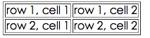
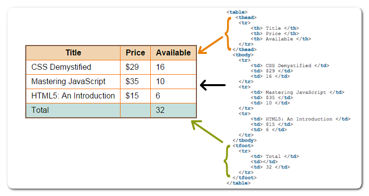

# HTML 教程- (HTML5 标准)

超文本标记语言（英语：HyperText Markup Language，简称：HTML）是一种用于创建网页的标准标记语言。

您可以使用 HTML 来建立自己的 WEB 站点，HTML 运行在浏览器上，由浏览器来解析。

在本教程中，您将学习如何使用 HTML 来创建站点。

HTML 很容易学习！相信您能很快学会它！

## HTML 实例

本教程包含了数百个 HTML 实例。

使用本站的编辑器，您可以轻松实现在线修改 HTML，并查看实例运行结果。

> **注意：**对于中文网页需要使用 **<meta charset="utf-8">** 声明编码，否则会出现乱码。有些浏览器(如 360 浏览器)会设置 GBK 为默认编码，则你需要设置为 **<meta charset="gbk">。**

**实例**

```html
<!DOCTYPE html>
<html>
<head>
<meta charset="utf-8">
<title>菜鸟教程(runoob.com)</title>
</head>
<body>
    <h1>我的第一个标题</h1>
    <p>我的第一个段落。</p>
</body>
</html>
```

[尝试一下 »](https://www.runoob.com/try/try.php?filename=tryhtml_intro)

点击 "尝试一下" 按钮查看在线实例

------

## HTML文档的后缀名

- .html
- .htm

以上两种后缀名没有区别，都可以使用。

[开始学习HTML!](https://www.runoob.com/html/html-intro.html)

## HTML 实例

在 HTML 手册中包含了数百个在线实例，您可以在线编辑并查看运行结果。

[查看 HTML 实例！](https://www.runoob.com/html/html-examples.html)

## HTML 参考手册

在菜鸟教程中，我们提供了完整的 HTML 参考手册，其中包括标签、属性、颜色、实体等等。

[HTML 标签参考手册](https://www.runoob.com/tags/html-reference.html)

## HTML/CSS/JS 在线工具

HTML/CSS/JS 在线工具可以在线编辑 HTML、CSS、JS 代码，并实时查看效果，你也可以将优质代码保存分享：https://c.runoob.com/front-end/61

## 笔记

**注意:**HTML中不支持 空格、回车、制表符，它们都会被解析成一个空白字符。

**实例**

```html
菜     鸟
教程
```

### utf-8 和 utf8 的区别

"UTF-8" 是标准写法，php 在 Windows 下边英文不区分大小写，所以也可以写成 "utf-8"。"UTF-8" 也可以把中间的"-"省略，写成 "UTF8"。一般程序都能识别，但也有例外（如下文），为了严格一点，最好用标准的大写"UTF-8"。

在数据库中只能使用"utf8"(MySQL) 在MySQL的命令模式中只能使用"utf8"，不能使用"utf-8"，也就是说在PHP程序中只能使用 "set names utf8(不加小横杠)"，如果你加了"-"此行命令将不会生效，但是在 PHP 中 header 时却要加上"-"，因为 IE 不认识没杠的"utf8"，原因见下文。

PHP 中的 header：

```php
<?php header('Content-Type: text/html; charset=UTF-8'); ?> //奇怪了：Content-Type 用冒号，Chatset却是等号。
```

静态文件使用：

总结：【只有在MySQL中可以使用"utf-8"的别名"utf8"，但是在其他地方一律使用大写"UTF-8"。】

具体为：

除了在命令 **"mysql_query(set names utf8)"** 外一律用大写"UTF-8"。

### htm 与 html 的区别

前者是超文本标记(Hypertext Markup)

后者是超文本标记语言(Hypertext Markup Language)

可以说 htm = html

同时，这两种都是静态网页文件的扩展名，扩展名可以互相更换而不会引起错误（这是指打开而言，但是对于一个链接来说，如果它指向的是一个htm文件，而那个htm文件被更改为html文件，那么是找不到这个链接的）

**那为什么出现两种文件格式呢？**

htm 是来源于老的 8.3 文件格式，DOS 操作系统只能支持长度为三位的后缀名，所以是 htm,但在 windows 下无所谓 HTM 与 HTML，html 是为长文件名的格式命名的。所以 htm 是为了兼容过去的DOS命名格式存在的，在效果上没有区别的。以前 htm 和 html 作为不同的服务器上的超文本文件，但现在通用。

什么是8.3文件格式？ 这是一种在老的16位Win95或Win98文件系统的短文件名文件格式，扩展名只限于3位，文件名只限于8位。 如果要与16位系统交互，比如说，要把一个路径传给一个16位的程序，你就不能用长文件名，而必须对它进行转换。例如把 `C ： /MyLongestPath/MyLongerPath/MyFilename.txt` 转换成 `C ： /Mylong~1/MyLong~2/Myfile~1.txt`

了解这个有什么用？ 在FAT磁盘格式下的DOS中只支持8.3文件格式，如果你要在这个环境下做应用，应该要注意这个文件格式问题。在NTFS下，默认可以兼容这种文件格式，同时也支持长文件名，你也可以通过调整注册表来取消对8.3文件格式也支持。

**后缀名选择：用 htm 还是用 html ?**

推荐使用长后缀名 **html** 。

命名应该遵从含义清晰、简洁、一致性原则。含义清晰指见名知义，比如这里的 htm（hypertext markup） 和 html (hypertext markup language) 均采用的是英文单词首字母缩写，含义清晰。简洁要求变量命名尽量简短，比如此处后缀名使用首字母缩写而不使用全单词。一致性原则要求同环境下的大量变量命名符合同样的规则，比如有的朋友习惯于Linux文件夹命名规则后，使用win系统时新建文件夹命名仍拒绝使用空格，这便造成了新文件夹名与旧文件夹名命名规则不一致。

一致性原则往往更为重要。比如合作开发时，不能各守其是，人为提高开发难度。因此，从 htm 和 html 中选择时，也应该选择无限制长度命名方式的 html 。

###  `<!DOCTYPE html>` 的意思

它是 HTML5 标准网页声明，全称为 Document Type HyperText Mark-up Language，是一条标示语言。支持 HTML5 标准的主流浏览器都认识这个声明。表示网页采用 HTML5，**<!DOCTYPE html>** 声明位于文档中的最前面的位置，处于 `<html>` 标签之前。此标签可告知浏览器文档使用哪种 HTML 或 XHTML 规范。

# HTML 简介

**HTML 实例**

```html
<!DOCTYPE html>
<html>
<head>
<meta charset="utf-8">
<title>菜鸟教程(runoob.com)</title>
</head>
<body>
 
<h1>我的第一个标题</h1>
 
<p>我的第一个段落。</p>
 
</body>
</html>
```

[尝试一下 »](https://www.runoob.com/try/try.php?filename=tryhtml_intro)

## 实例解析

- `<!DOCTYPE html>` 声明为 HTML5 文档
- `<html>` 元素是 HTML 页面的根元素
- `<head>` 元素包含了文档的元（meta）数据，如 `<meta charset="utf-8">` 定义网页编码格式为 **utf-8**。
- `<title>` 元素描述了文档的标题
- `<body>` 元素包含了可见的页面内容
- `<h1>` 元素定义一个大标题
- `<p>` 元素定义一个段落

**注：**在浏览器的页面上使用键盘上的 F12 按键开启调试模式，就可以看到组成标签。


------

## 什么是HTML?

HTML 是用来描述网页的一种语言。

- HTML 指的是超文本标记语言: **H**yper**T**ext **M**arkup **L**anguage
- HTML 不是一种编程语言，而是一种**标记**语言
- 标记语言是一套**标记标签** (markup tag)
- HTML 使用标记标签来**描述**网页
- HTML 文档包含了HTML **标签**及**文本**内容
- HTML文档也叫做 **web 页面**

------

## HTML 标签

HTML 标记标签通常被称为 HTML 标签 (HTML tag)。

- HTML 标签是由*尖括号*包围的关键词，比如 `<html>`
- HTML 标签通常是*成对出现*的，比如 `<b>` 和 `</b>`
- 标签对中的第一个标签是*开始标签*，第二个标签是*结束标签*
- 开始和结束标签也被称为*开放标签*和*闭合标签*

<kbd><标签>内容</标签></kbd>

------

## HTML 元素

"HTML 标签" 和 "HTML 元素" 通常都是描述同样的意思.

但是严格来讲, 一个 HTML 元素包含了开始标签与结束标签，如下实例:

HTML 元素:

<kbd>`<p>这是一个段落。</p>`</kbd>

------

## Web 浏览器

Web浏览器（如谷歌浏览器，Internet Explorer，Firefox，Safari）是用于读取HTML文件，并将其作为网页显示。

浏览器并不是直接显示的HTML标签，但可以使用标签来决定如何展现HTML页面的内容给用户：


------

## HTML 网页结构

下面是一个可视化的HTML页面结构：


|  | 只有 <body> 区域 (白色部分) 才会在浏览器中显示。 |
| --------------------- | ------------------------------------------------ |
|                       |                                                  |

------

## HTML版本

从初期的网络诞生后，已经出现了许多HTML版本:

| 版本      | 发布时间 |
| :-------- | :------- |
| HTML      | 1991     |
| HTML+     | 1993     |
| HTML 2.0  | 1995     |
| HTML 3.2  | 1997     |
| HTML 4.01 | 1999     |
| XHTML 1.0 | 2000     |
| HTML5     | 2012     |
| XHTML5    | 2013     |

------

## <!DOCTYPE> 声明

<!DOCTYPE>声明有助于浏览器中正确显示网页。

网络上有很多不同的文件，如果能够正确声明HTML的版本，浏览器就能正确显示网页内容。

doctype 声明是不区分大小写的，以下方式均可：

```html
<!DOCTYPE html>

<!DOCTYPE HTML>

<!doctype html>

<!Doctype Html>
```


## 通用声明

**HTML5**

```html
<!DOCTYPE html>
```

**HTML 4.01**

```html
<!DOCTYPE HTML PUBLIC "-//W3C//DTD HTML 4.01 Transitional//EN"
"http://www.w3.org/TR/html4/loose.dtd">
```

**XHTML 1.0**

```html
<!DOCTYPE html PUBLIC "-//W3C//DTD XHTML 1.0 Transitional//EN"
"http://www.w3.org/TR/xhtml1/DTD/xhtml1-transitional.dtd">
```


查看完整网页声明类型 [DOCTYPE 参考手册](https://www.runoob.com/tags/tag-doctype.html)。

------

## 中文编码

目前在大部分浏览器中，直接输出中文会出现中文乱码的情况，这时候我们就需要在头部将字符声明为 UTF-8 或 GBK。

**HTML 实例**

```html
<!DOCTYPE html>
<html>
<head>
<meta charset="UTF-8">
<title>
页面标题</title>
</head>
<body>
 
<h1>我的第一个标题</h1>
 
<p>我的第一个段落。</p>
 
</body>
</html>
```

[尝试一下 »](https://www.runoob.com/try/try.php?filename=tryhtml_intro_utf8)

## 笔记

1. doctype 声明是不区分大小写的，用来告知 Web 浏览器页面使用了哪种 HTML 版本。

   在HTML 4.01 中，<!DOCTYPE> 声明需引用 DTD （文档类型声明），因为 HTML 4.01 是基于 SGML（Standard Generalized Markup Language 标准通用标记语言）。

   HTML 4.01 规定了三种不同的 <!DOCTYPE> 声明，分别是：Strict、Transitional 和 Frameset

   HTML5 不是基于 SGML，因此不要求引用 DTD。

2. 对于中文网页需要使用 `<meta charset="utf-8">` 声明编码，否则会出现乱码。有些浏览器(如 360 浏览器)会设置 GBK 为默认编码，则你需要设置为 `<meta charset="gbk">`。

   目前在大部分浏览器中，直接输出中文会出现中文乱码的情况，这时候需要在头部将字符声明为 UTF-8。

# HTML 编辑器

------

## HTML 编辑器推荐

可以使用专业的 HTML 编辑器来编辑 HTML，菜鸟教程为大家推荐几款常用的编辑器：

- VS Code：https://code.visualstudio.com/
- Sublime Text：http://www.sublimetext.com/

你可以从以上软件的官网中下载对应的软件，按步骤安装即可。

接下来我们将为大家演示如何使用 VS Code 工具来创建 HTML 文件。

------

## VS Code

Visual Studio Code（简称 VS Code）是一个由微软开发，同时支持 Windows 、 Linux 和 macOS 等操作系统且开放源代码的代码编辑器，编辑器中内置了扩展程序管理的功能。

### 步骤 1: 新建 HTML 文件

在 VS Code 安装完成后，选择" 文件(F)->新建文件(N) "，在新建的文件中输入以下代码：

```html
<!DOCTYPE html>
<html>
<head>
<meta charset="utf-8">
<title>菜鸟教程(runoob.com)</title>
</head>
<body>
 
<h1>我的第一个标题</h1>
 
<p>我的第一个段落。</p>
 
</body>
</html>
```


### 步骤 2: 另存为 HTML 文件

然后选择" 文件(F)->另存为(A) "，文件名为 runoob.html:


当您保存 HTML 文件时，既可以使用 **.htm** 也可以使用 **.html** 扩展名。两者没有区别，完全根据您的喜好，我建议统一用 **.html**。

在一个容易记忆的文件夹中保存这个文件，比如 **runoob**

### 步骤 3: 在浏览器中运行这个 HTML 文件

然后鼠标右击编辑器上的文件名，选择在默认浏览器打开（也可以其他的浏览器）:


运行显示结果类似如下:


> VS Code 和 Sublime Text 还可以配合 Emmet 插件来提高编码速度。
>
> Emmet 官网：http://emmet.io/

每一种操作系统都带有简单的文本编辑器：

-  Windows 用户可以使用记事本；
-  Linux 用户可以选择几种不同的文本编辑器，如 vi、vim 或者 emacs ；
-  Mac 用户可以使用 OS X 预装的 TextEdit。

# HTML 基础- 4个实例

------

不要担心本章中您还没有学过的例子。

您将在下面的章节中学到它们。

------

## HTML 标题

HTML 标题（Heading）是通过<h1> - <h6> 标签来定义的。

**实例**

```html
<h1>这是一个标题</h1>
<h2>这是一个标题</h2>
<h3>这是一个标题</h3>
```

[尝试一下 »](https://www.runoob.com/try/try.php?filename=tryhtml_headers)

------

## HTML 段落

HTML 段落是通过标签 <p> 来定义的。

**实例**

```html
<p>这是一个段落。</p>
<p>这是另外一个段落。</p>
```

[尝试一下 »](https://www.runoob.com/try/try.php?filename=tryhtml_paragraphs1)

------

## HTML 链接

HTML 链接是通过标签 <a> 来定义的。

**实例**

```python
<a href="https://www.runoob.com">这是一个链接</a>
```


[尝试一下 »](https://www.runoob.com/try/try.php?filename=tryhtml_basic_link)

**提示:**在 href 属性中指定链接的地址。

(您将在本教程稍后的章节中学习更多有关属性的知识)。

------

## HTML 图像

HTML 图像是通过标签 `` 来定义的.

**实例**

```html

```


[尝试一下 »](https://www.runoob.com/try/try.php?filename=tryhtml_basic_img)

**注意：** 图像的名称和尺寸是以属性的形式提供的。

## 笔记

1、`*.html` 文件跟 `*.jpg` 文件(f盘)在不同目录下：

```html

```

2、`*.html` 文件跟 `*.jpg` 图片在相同目录下：

```html

```

3、`*.html` 文件跟 `*.jpg` 图片在不同目录下：

a、图片 `*.jpg` 在 `image` 文件夹中，`*.html` 跟 `image` 在同一目录下：

```html

```

b、图片 `*.jpg` 在 `image` 文件夹中，`*.html` 在 `connage` 文件夹中，`image` 跟 `connage` 在同一目录下：

```python

```

4、如果图片来源于网络，那么写绝对路径：

```python

```

### HTML 中 href、src 区别

**href** 是 Hypertext Reference 的缩写，表示超文本引用。用来建立当前元素和文档之间的链接。常用的有：link、a。例如：

```
<link href="reset.css" rel=”stylesheet“/>
```

浏览器会识别该文档为 css 文档，并行下载该文档，并且不会停止对当前文档的处理。这也是建议使用 link，而不采用 @import 加载 css 的原因。 

**src** 是 source 的缩写，src 的内容是页面必不可少的一部分，是引入。src 指向的内容会嵌入到文档中当前标签所在的位置。常用的有：img、script、iframe。例如:

```
<script src="script.js"></script>
```

当浏览器解析到该元素时，会暂停浏览器的渲染，直到该资源加载完毕。这也是将js脚本放在底部而不是头部得原因。

简而言之，src 用于替换当前元素；href 用于在当前文档和引用资源之间建立联系。**src** 的内容，是页面必不可少的一部分，是引入。**href** 的内容，是与该页面有关联，是引用。区别就是，引入和引用。

### MacOS 如何加载图片以及文件目录有空格

MacOS 是没有硬盘分区的，所以引用文件直接：

```html

```

假设文件目录有空格，直接将空格换成：

```html
%20
```

如下:

```html

```

记录一下 html 相对路径的写法：

-  `./`：代表文件所在的目录（可以省略不写）如果写成 `image/background` 就相当于是在html文件下找image文件夹，当然是找不到的
-  `../`：代表文件所在的父级目录
-  `../../`：代表文件所在的父级目录的父级目录
-  `/`：代表文件所在的根目录

# HTML 元素

------

HTML 文档由 HTML 元素定义。

------

## HTML 元素

| 开始标签 *               | 元素内容     | 结束标签 * |
| :----------------------- | :----------- | :--------- |
| `<p>`                    | 这是一个段落 | `</p>`     |
| `<a href="default.htm">` | 这是一个链接 | `</a>`     |
| `<br>`                   | 换行         |            |

*****开始标签常被称为**起始标签（opening tag）**，结束标签常称为**闭合标签（closing tag）**。

------

## HTML 元素语法

- HTML 元素以**开始标签**起始
- HTML 元素以**结束标签**终止
- **元素的内容**是开始标签与结束标签之间的内容
- 某些 HTML 元素具有**空内容（empty content）**
- 空元素**在开始标签中进行关闭**（以开始标签的结束而结束）
- 大多数 HTML 元素可拥有**属性**

**注释:** 您将在本教程的下一章中学习更多有关属性的内容。

------

## 嵌套的 HTML 元素

大多数 HTML 元素可以嵌套（HTML 元素可以包含其他 HTML 元素）。

HTML 文档由相互嵌套的 HTML 元素构成。

------

## HTML 文档实例

```python
<!DOCTYPE html>
<html>

<body>
<p>这是第一个段落。</p>
</body>

</html>
```

以上实例包含了三个 HTML 元素。

------

## HTML 实例解析

**`<p>` 元素:**

```html
<p>这是第一个段落。</p>
```

这个 `<p>` 元素定义了 HTML 文档中的一个段落。
这个元素拥有一个开始标签 `<p>` 以及一个结束标签 `</p>`.
元素内容是: 这是第一个段落。

**`<body>` 元素:**

```html
<body>
<p>这是第一个段落。</p>
</body>
```

`<body>` 元素定义了 HTML 文档的主体。
这个元素拥有一个开始标签 `<body>` 以及一个结束标签 `</body>`。
元素内容是另一个 HTML 元素（p 元素）。

**`<html>` 元素：**

```html
<html>

<body>
<p>这是第一个段落。</p>
</body>

</html>
```

`<html>` 元素定义了整个 HTML 文档。
这个元素拥有一个开始标签 `<html>` ，以及一个结束标签 `</html>`.
元素内容是另一个 HTML 元素（body 元素）。

------

## 不要忘记结束标签

即使您忘记了使用结束标签，大多数浏览器也会正确地显示 HTML：

```html
<p>这是一个段落
<p>这是一个段落
```


以上实例在浏览器中也能正常显示，因为关闭标签是可选的。

但不要依赖这种做法。忘记使用结束标签会产生不可预料的结果或错误。

------

## HTML 空元素

没有内容的 HTML 元素被称为空元素。空元素是在开始标签中关闭的。

`<br>` 就是没有关闭标签的空元素（`<br>` 标签定义换行）。

在 XHTML、XML 以及未来版本的 HTML 中，所有元素都必须被关闭。

在开始标签中添加斜杠，比如 `<br />`，是关闭空元素的正确方法，HTML、XHTML 和 XML 都接受这种方式。

即使 `<br>` 在所有浏览器中都是有效的，但使用 `<br />` 其实是更长远的保障。

------

## HTML 提示：使用小写标签

HTML 标签对大小写不敏感：`<P>` 等同于 `<p>`。许多网站都使用大写的 HTML 标签。

菜鸟教程使用的是小写标签，因为万维网联盟（W3C）在 HTML 4 中**推荐**使用小写，而在未来 (X)HTML 版本中**强制**使用小写。


# HTML 属性

------

属性是 HTML 元素提供的附加信息。

------

## HTML 属性

- HTML 元素可以设置**属性**
- 属性可以在元素中添加**附加信息**
- 属性一般描述于**开始标签**
- 属性总是以名称/值对的形式出现，**比如：name="value"**。

------

## 属性实例

HTML 链接由 <a> 标签定义。链接的地址在 **href 属性**中指定：

## 实例

<a href="http://www.runoob.com">这是一个链接</a>


[尝试一下 »](https://www.runoob.com/try/try.php?filename=tryhtml_basic_link)


------

## HTML 属性常用引用属性值

属性值应该始终被包括在引号内。

双引号是最常用的，不过使用单引号也没有问题。

**提示:** 在某些个别的情况下，比如属性值本身就含有双引号，那么您必须使用单引号，例如：name='John "ShotGun" Nelson'

------

## HTML 提示：使用小写属性

属性和属性值对大小写不敏感。

不过，万维网联盟在其 HTML 4 推荐标准中推荐小写的属性/属性值。

而新版本的 (X)HTML 要求使用小写属性。

------

## HTML 属性参考手册

查看完整的HTML属性列表: [HTML 标签参考手册](https://www.runoob.com/tags/html-reference.html)。

下面列出了适用于大多数 HTML 元素的属性：

| 属性  | 描述                                                         |
| :---- | :----------------------------------------------------------- |
| class | 为html元素定义一个或多个类名（classname）(类名从样式文件引入) |
| id    | 定义元素的唯一id                                             |
| style | 规定元素的行内样式（inline style）                           |
| title | 描述了元素的额外信息 (作为工具条使用)                        |

更多标准属性说明： [HTML 标准属性参考手册](https://www.runoob.com/tags/ref-standardattributes.html).


- 属性和属性值，尽量小写，本来这样做也方便些。
- class 属性可以多用 **class=" "** （引号里面可以填入多个class属性）
- id 属性只能单独设置 **id=" "**（只能填写一个，多个无效）


# HTML 标题

------

在 HTML 文档中，标题很重要。

------

## HTML 标题

标题（Heading）是通过 <h1> - <h6> 标签进行定义的。

<h1> 定义最大的标题。 <h6> 定义最小的标题。

## 实例

<h1>这是一个标题。</h1> <h2>这是一个标题。</h2> <h3>这是一个标题。</h3>


[尝试一下 »](https://www.runoob.com/try/try.php?filename=tryhtml_headers)

**注释:** 浏览器会自动地在标题的前后添加空行。

------

## 标题很重要

请确保将 HTML 标题 标签只用于标题。不要仅仅是为了生成**粗体**或**大号**的文本而使用标题。

搜索引擎使用标题为您的网页的结构和内容编制索引。

因为用户可以通过标题来快速浏览您的网页，所以用标题来呈现文档结构是很重要的。

应该将 h1 用作主标题（最重要的），其后是 h2（次重要的），再其次是 h3，以此类推。

------

## HTML 水平线

<hr> 标签在 HTML 页面中创建水平线。

hr 元素可用于分隔内容。

## 实例

<p>这是一个段落。</p> <hr> <p>这是一个段落。</p> <hr> <p>这是一个段落。</p>


[尝试一下 »](https://www.runoob.com/try/try.php?filename=tryhtml_hr)


------

## HTML 注释

可以将注释插入 HTML 代码中，这样可以提高其可读性，使代码更易被人理解。浏览器会忽略注释，也不会显示它们。

注释写法如下:

## 实例

<!-- 这是一个注释 -->


[尝试一下 »](https://www.runoob.com/try/try.php?filename=tryhtml_comment)

**注释:** 开始括号之后（左边的括号）需要紧跟一个叹号，结束括号之前（右边的括号）不需要，合理地使用注释可以对未来的代码编辑工作产生帮助。

------

## HTML 提示 - 如何查看源代码

你是否看过一些网页然后惊叹它是如何实现的。

如果您想找到其中的奥秘，只需要单击右键，然后选择"查看源文件"（IE）或"查看页面源代码"（Firefox），其他浏览器的做法也是类似的。这么做会打开一个包含页面 HTML 代码的窗口。

------


## 本站实例

[标题](https://www.runoob.com/try/try.php?filename=tryhtml_headers)
如何在 HTML 文档中显示标题。

[隐藏注释](https://www.runoob.com/try/try.php?filename=tryhtml_comment)
如何在 HTML 源代码中插入注释。

[水平线](https://www.runoob.com/try/try.php?filename=tryhtml_hr)
如何插入水平线。

------

## HTML 标签参考手册

菜鸟教程的标签参考手册提供了有关这些标题及其属性的更多信息。

您将在本教程下面的章节中学到更多有关 HTML 标签和属性的知识。

| 标签                                             | 描述           |
| :----------------------------------------------- | :------------- |
| [](https://www.runoob.com/tags/tag-html.html)    | 定义 HTML 文档 |
| [](https://www.runoob.com/tags/tag-body.html)    | 定义文档的主体 |
| [ - ](https://www.runoob.com/tags/tag-hn.html)   | 定义 HTML 标题 |
| [](https://www.runoob.com/tags/tag-hr.html)      | 定义水平线     |
| [](https://www.runoob.com/tags/tag-comment.html) | 定义注释       |

## 标题大小与字体大小的关系

1到6号标题与1到6号字体逆序对应，比如1号字体对应6号标题，2号字体对应5号标题。

```
<h1>这是1号标题</h1>
<font size="6">这是6号字体文本</font>

<h2>这是2号标题</h2>
<font size="5">这是5号字体文本</font>

<h3>这是3号标题</h3>
<font size="4">这是4号字体文本</font>

<h4>这是4号标题</h4>
<font size="3">这是3号字体文本</font>

<h5>这是5号标题</h5>
<font size="2">这是2号字体文本</font>

<h6>这是6号标题</h6>
<font size="1">这是1号字体文本</font>
```

# HTML 段落

------

HTML 可以将文档分割为若干段落。

------

## HTML 段落

段落是通过 <p> 标签定义的。

## 实例

<p>这是一个段落 </p> <p>这是另一个段落</p>


[尝试一下 »](https://www.runoob.com/try/try.php?filename=tryhtml_paragraphs1)

**注意：**浏览器会自动地在段落的前后添加空行。（</p> 是块级元素）

------

## 不要忘记结束标签

即使忘了使用结束标签，大多数浏览器也会正确地将 HTML 显示出来：

## 实例

<p>这是一个段落 <p>这是另一个段落


[尝试一下 »](https://www.runoob.com/try/try.php?filename=tryhtml_paragraphs0)

上面的例子在大多数浏览器中都没问题，但不要依赖这种做法。忘记使用结束标签会产生意想不到的结果和错误。

**注释:** 在未来的 HTML 版本中，不允许省略结束标签。

------

## HTML 折行

如果您希望在不产生一个新段落的情况下进行换行（新行），请使用 **<br>** 标签：

## 实例

<p>这个<br>段落<br>演示了分行的效果</p>


[尝试一下 »](https://www.runoob.com/try/try.php?filename=tryhtml_paragraphs)

<br /> 元素是一个空的 HTML 元素。由于关闭标签没有任何意义，因此它没有结束标签。

------

## HTML 输出- 使用提醒

我们无法确定 HTML 被显示的确切效果。屏幕的大小，以及对窗口的调整都可能导致不同的结果。

对于 HTML，您无法通过在 HTML 代码中添加额外的空格或换行来改变输出的效果。

当显示页面时，浏览器会移除源代码中多余的空格和空行。所有连续的空格或空行都会被算作一个空格。需要注意的是，HTML 代码中的所有连续的空行（换行）也被显示为一个空格。

[尝试一下](https://www.runoob.com/try/try.php?filename=tryhtml_poem)

（这个例子演示了一些 HTML 格式化方面的问题）

------


## 本站实例

[HTML 段落](https://www.runoob.com/try/try.php?filename=tryhtml_paragraphs1)
如何在浏览器中显示 HTML 段落。

[换行](https://www.runoob.com/try/try.php?filename=tryhtml_paragraphs)
在 HTML 文档中使用换行。

[在 HTML 代码中的排版一首唐诗](https://www.runoob.com/try/try.php?filename=tryhtml_poem)
浏览器在显示 HTML 时，会省略源代码中多余的空白字符（空格或回车等）。

## 更多实例

[更多段落](https://www.runoob.com/try/try.php?filename=tryhtml_paragraphs2)
段落的默认行为。

------

## HTML 标签参考手册

菜鸟教程的标签参考手册提供了有关 HTML 元素及其属性的更多信息。

| 标签                                        | 描述                 |
| :------------------------------------------ | :------------------- |
| [](https://www.runoob.com/tags/tag-p.html)  | 定义一个段落         |
| [](https://www.runoob.com/tags/tag-br.html) | 插入单个折行（换行） |

**区分一下： <br>, <br/> 以及 <br />（带有空格）**

**<br>** 是 HTML 写法。**
**是 XHTML1.1 的写法, 也是 XML 写法。**<br/>** 是 XHTML 为兼容 HTML 的写法,也是 XML 写法。HTML5 因为兼容 XHTML，所以三种写法都可以使用。

早期发布的 HTML 规范当中，<br> 与  等元素是不用封闭自身的，但是这种元素造成了 HTML 规范的不严谨，于是在之后发布的 XHTML 语言中，参考了更为严谨的 XML 规范，在这些不用自身封闭的元素后加 **/** 来表示自行封闭，在逻辑上来讲等同于<br>....</br>（但是没有 **</br>** 这种写法），这样一来保证了较少的代码量，二来保证了规范的严谨。


# HTML 文本格式化


## HTML 文本格式化

**加粗文本**

*斜体文本*

```
电脑自动输出
```

这是 下标 和 上标


[尝试一下 »](https://www.runoob.com/try/try.php?filename=tryhtml_formatting)

------

## HTML 格式化标签

HTML 使用标签 <b>("bold") 与 <i>("italic") 对输出的文本进行格式, 如：**粗体** or *斜体*

这些HTML标签被称为格式化标签（请查看底部完整标签参考手册）。

|  | **通常标签 <strong> 替换加粗标签 <b> 来使用, <em> 替换 <i>标签使用。**  然而，这些标签的含义是不同的：  <b> 与<i> 定义粗体或斜体文本。  <strong> 或者 <em>意味着你要呈现的文本是重要的，所以要突出显示。现今所有主要浏览器都能渲染各种效果的字体。不过，未来浏览器可能会支持更好的渲染效果。 |
| ----------------------- | ------------------------------------------------------------ |
|                         |                                                              |


------


## 在线实例

[文本格式化](https://www.runoob.com/try/try.php?filename=tryhtml_formattingch)
此例演示如何在一个 HTML 文件中对文本进行格式化

[预格式文本](https://www.runoob.com/try/try.php?filename=tryhtml_pre)
此例演示如何使用 pre 标签对空行和空格进行控制。

["计算机输出"标签](https://www.runoob.com/try/try.php?filename=tryhtml_computeroutput)
此例演示不同的"计算机输出"标签的显示效果。

[地址](https://www.runoob.com/try/try.php?filename=tryhtml_address)
此例演示如何在 HTML 文件中写地址。

[缩写和首字母缩写](https://www.runoob.com/try/try.php?filename=tryhtml_abbr)
此例演示如何实现缩写或首字母缩写。

[文字方向](https://www.runoob.com/try/try.php?filename=tryhtml_bdo)
此例演示如何改变文字的方向。

[块引用](https://www.runoob.com/try/try.php?filename=tryhtml_q)
此例演示如何实现长短不一的引用语。

[删除字效果和插入字效果](https://www.runoob.com/try/try.php?filename=tryhtml_del)
此例演示如何标记删除文本和插入文本。

------

## HTML 文本格式化标签

| 标签                                                | 描述         |
| :-------------------------------------------------- | :----------- |
| [](https://www.runoob.com/tags/tag-b.html)          | 定义粗体文本 |
| [](https://www.runoob.com/tags/tag-em.html)         | 定义着重文字 |
| [](https://www.runoob.com/tags/tag-i.html)          | 定义斜体字   |
| [](https://www.runoob.com/tags/tag-small.html)      | 定义小号字   |
| [](https://www.runoob.com/tags/tag-strong.html)     | 定义加重语气 |
| [](https://www.runoob.com/tags/tag-sub.html)        | 定义下标字   |
| [](https://www.runoob.com/html/m/tags/tag-sup.html) | 定义上标字   |
| [](https://www.runoob.com/tags/tag-ins.html)        | 定义插入字   |
| [](https://www.runoob.com/tags/tag-del.html)        | 定义删除字   |

## HTML "计算机输出" 标签

| 标签                                          | 描述               |
| :-------------------------------------------- | :----------------- |
| [](https://www.runoob.com/tags/tag-code.html) | 定义计算机代码     |
| [](https://www.runoob.com/tags/tag-kbd.html)  | 定义键盘码         |
| [](https://www.runoob.com/tags/tag-samp.html) | 定义计算机代码样本 |
| [](https://www.runoob.com/tags/tag-var.html)  | 定义变量           |
| [](https://www.runoob.com/tags/tag-pre.html)  | 定义预格式文本     |

## HTML 引文, 引用, 及标签定义

| 标签                                                | 描述               |
| :-------------------------------------------------- | :----------------- |
| [](https://www.runoob.com/tags/tag-abbr.html)       | 定义缩写           |
| [](https://www.runoob.com/tags/tag-address.html)    | 定义地址           |
| [](https://www.runoob.com/tags/tag-bdo.html)        | 定义文字方向       |
| [](https://www.runoob.com/tags/tag-blockquote.html) | 定义长的引用       |
| [](https://www.runoob.com/tags/tag-q.html)          | 定义短的引用语     |
| [](https://www.runoob.com/tags/tag-cite.html)       | 定义引用、引证     |
| [](https://www.runoob.com/tags/tag-dfn.html)        | 定义一个定义项目。 |

文本显示为单行，超过部分隐藏并使用省略号，实例:

```
overflow:hidden;
text-overflow:ellipsis;
white-space:nowrap;
```

[尝试一下 »](https://c.runoob.com/codedemo/2808)

使用 display:-webkit-box; 让文本显示为多行(只有-webkit内核才有作用)，实例:

```
overflow:hidden;
text-overflow:ellipsis;
display:-webkit-box;
-webkit-line-clamp: 2;
-webkit-box-orient:vertical;
width:100px;
```

[尝试一下 »](https://c.runoob.com/codedemo/2809)


**关于 <b> 和 <strong>**

在显示上，这两个标签都可是加粗文本，呢么为什么会有两个功能"相同"的标签呢？而且好像 strong 并非个例。

-  首先，这两个并非完全相同。比如，如果使用网页阅读器阅读网页（盲人使用），strong 会重读，b 则不会。
-  其次，从起源上来说，strong 是为了在未来建设语义网而诞生的。应该知道的是，html 是负责显示的标记，不能表示语义。也就是说，浏览器知道这个标签如何显示，而不知道标签所标记的内容应该是什么含义。而 strong 在语义上走出了第一步。


**1、<em> 把文本定义为强调的内容**

**<em>** 标签告诉浏览器把其中的文本表示为强调的内容。对于所有浏览器来说，这意味着要把这段文字用斜体来显示。

尽管现在 **<em>** 标签修饰的内容都是用斜体字来显示，但这些内容也具有更广泛的含义，将来的某一天，浏览器也可能会使用其他的特殊效果来显示强调的文本。如果你只想使用斜体字来显示文本的话，请使用 **<i>** 标签。除此之外，文档中还可以包括用来改变文本显示的级联样式定义。

**2、<i>显示斜体文本效果**

**<i>** 标签和基于内容的样式标签 **<em>** 类似。它告诉浏览器将包含其中的文本以斜体字（italic）或者倾斜（oblique）字体显示。如果这种斜体字对该浏览器不可用的话，可以使用高亮、反白或加下划线等样式。

**3、<dfn>定义一个定义项目**

**<dfn>** 标签可标记那些对特殊术语或短语的定义。

现在流行的浏览器通常用斜体来显示 **<dfn>** 中的文本。将来，**<dfn>** 还可能有助于创建文档的索引或术语表。

与其他许多基于内容的样式和物理样式标签一样，**<dfn>** 标签尽量少用为妙。

也就是说它们要实现的目的不同，但都用同样的表现方式，就是斜体。


关于<abbr>和<acronym>:

都是表示缩略词的标签

不同点：

abbr：表示全词的缩写；

acronym：表示标记一个首字母缩写；

PS:其实看起来的效果都一样，只是内在表达的不一样而已，所以看不出什么区别，重点是现在acronym已经淘汰不用了，所以尽量改用abbr就好

**HTML 要素中的 b、em、strong 有什么区别？**

应该说，在默认的 HTML 样式表定义中，**b** 和 **strong** 的样式一样，为 **{ font-weight: bolder }** 而 **em** 的默认样式为 **{ font-style: italic }**，与 **i** 相同。

在 HTML 4 中，**em** 表示 emphasized text，**strong** 表示 strong emphasized text，故 strong 的强度要更强。而在 HTML 5 中，**strong** 的定义改成了 important text。当然 emphasized 和 strong emphasized 乃至 important 之间怎么界定很模糊，关键是在自己编写 HTML 代码的时候保持使用上一致。b 和 i 仅仅表示「这里应该用粗体显示」或者「这里应该用斜体显示」。

所有标签缩写的全称：

<b>---bold

<em>---emphasize

<i>---italic

<sub>---subscript

<sup>---superscript

<ins>---insert

<del>---delete

<kbd>---keyboard

<bdo>---Bi-Directional Override

<q>---quate

<dfn>---define


# HTML 链接

------

HTML 使用超级链接与网络上的另一个文档相连。几乎可以在所有的网页中找到链接。点击链接可以从一张页面跳转到另一张页面。

------


## 尝试一下 - 实例

[HTML 链接](https://www.runoob.com/try/try.php?filename=tryhtml_links)
如何在HTML文档中创建链接。

(可以在本页底端找到更多实例)

------

## HTML 超链接（链接）

HTML使用标签 <a>来设置超文本链接。

超链接可以是一个字，一个词，或者一组词，也可以是一幅图像，您可以点击这些内容来跳转到新的文档或者当前文档中的某个部分。

当您把鼠标指针移动到网页中的某个链接上时，箭头会变为一只小手。

在标签<a> 中使用了href属性来描述链接的地址。

默认情况下，链接将以以下形式出现在浏览器中：

- 一个未访问过的链接显示为蓝色字体并带有下划线。
- 访问过的链接显示为紫色并带有下划线。
- 点击链接时，链接显示为红色并带有下划线。

> 注意：如果为这些超链接设置了 CSS 样式，展示样式会根据 CSS 的设定而显示。

------

## HTML 链接语法

链接的 HTML 代码很简单。它类似这样：

<a href="url">链接文本</a>

href 属性描述了链接的目标。.

## 实例

<a href="https://www.runoob.com/">访问菜鸟教程</a>

上面这行代码显示为：[访问菜鸟教程](https://www.runoob.com/)

点击这个超链接会把用户带到菜鸟教程的首页。

**提示:** *"链接文本"* 不必一定是文本。图片或其他 HTML 元素都可以成为链接。

------

## HTML 链接 - target 属性

使用 target 属性，你可以定义被链接的文档在何处显示。

下面的这行会在新窗口打开文档：

## 实例

<a href="https://www.runoob.com/" target="_blank" rel="noopener noreferrer">访问菜鸟教程!</a>


[尝试一下 »](https://www.runoob.com/try/try.php?filename=tryhtml_link_target)


------

## HTML 链接- id 属性

id属性可用于创建在一个HTML文档书签标记。

**提示:** 书签是不以任何特殊的方式显示，在HTML文档中是不显示的，所以对于读者来说是隐藏的。

## 实例

在HTML文档中插入ID:

<a id="tips">有用的提示部分</a>

在HTML文档中创建一个链接到"有用的提示部分(id="tips"）"：

<a href="#tips">访问有用的提示部分</a>

或者，从另一个页面创建一个链接到"有用的提示部分(id="tips"）"：

<a href="https://www.runoob.com/html/html-links.html#tips">访问有用的提示部分</a>


------

## 基本的注意事项 - 有用的提示

**注释：** 请始终将正斜杠添加到子文件夹。假如这样书写链接：href="https://www.runoob.com/html"，就会向服务器产生两次 HTTP 请求。这是因为服务器会添加正斜杠到这个地址，然后创建一个新的请求，就像这样：href="https://www.runoob.com/html/"。

------


## 更多实例

[图片链接](https://www.runoob.com/try/try.php?filename=tryhtml_imglink)
如何使用图片链接。

[在当前页面链接到指定位置](https://www.runoob.com/try/try.php?filename=tryhtml_link_locations&basepath=0)
如何使用书签

[跳出框架](https://www.runoob.com/try/try.php?filename=tryhtml_frame_getfree)
本例演示如何跳出框架，假如你的页面被固定在框架之内。

[创建电子邮件链接](https://www.runoob.com/try/try.php?filename=tryhtml_mailto)
本例演示如何链接到一个邮件。（本例在安装邮件客户端程序后才能工作。）

[创建电子邮件链接 2](https://www.runoob.com/try/try.php?filename=tryhtml_mailto2)
本例演示更加复杂的邮件链接。

------

## HTML 链接标签

| 标签                                       | 描述             |
| :----------------------------------------- | :--------------- |
| [](https://www.runoob.com/tags/tag-a.html) | 定义一个超级链接 |

**关于创建电子邮件链接时如何发送邮件内容**

在进行邮件内容发送时，需要使用关键字：**mailto**

示例如下：

```
<a href="mailto:zhangrr601@163.com?subject=这是邮件的主题&body=这是邮件的内容" rel="nofollow">发送邮件</a>
```

[尝试一下 »](https://c.runoob.com/codedemo/5346)

这样会调启系统默认的邮件程序发送给 zhangrr601@163.com，并且收件人那里已经填上了我邮箱的地址。

关于创建电子邮件链接时如何进行抄送，密送.

在进行抄送时，需要使用关键字：**cc**

在进行密送时，需要使用关键字：**bcc**

示例如下：

```
<a href="mailto:zhangrr601@163.com?cc=someone@163.com&bcc=somebody@163.com" rel="nofollow">发送邮件</a>
```

[尝试一下 »](https://c.runoob.com/codedemo/5346)

参数说明：

| 参数                    | 描述             |
| :---------------------- | :--------------- |
| mailto:*name@email.com* | 邮件接收地址     |
| cc=*name@email.com*     | 抄送地址         |
| bcc=*name@email.com*    | 密件抄送地址     |
| subject=*subject text*  | 邮件主题         |
| body=*body text*        | 邮件内容         |
| ?                       | 第一个参数分隔符 |
| &                       | 其他参数分隔符   |

注：多个邮件地址用 **;** 隔开，空格用 **%20** 代替。

**抄送：**

英文名称：Carbon Copy，又简称为 CC。在网络术语中，抄送就是将邮件同时发送给收信人以外的人，用户所写的邮件抄送一份给别人，对方可以看见该用户的 E-mail。同收件人地址栏一样，不可以超过 1024 个字符。一般来说，使用"抄送"服务时，多人抄送的电子邮件地址使用 **;** 分隔。

**密件抄送：**

英文名称：Blind Carbon Copy ，又称“盲抄送”，和抄送的唯一区别就是它能够让各个收件人无法查看到这封邮件同时还发送给了哪些人。密件抄送是个很实用的功能，假如一次向成百上千位收件人发送邮件，最好采用密件抄送方式，这样一来可以保护各个收件人的地址不被其他人轻易获得，二来可以使收件人节省下收取大量抄送的 E-mail 地址的时间。

nofollow 是 HTML 页面中 a 标签的属性值。这个标签的意义是告诉搜索引擎"不要追踪此网页上的链接或不要追踪此特定链接"。

nofollow 是 HTML 页面中 a 标签的属性值。它的出现为网站管理员提供了一种方式，即告诉搜索引擎"不要追踪此网页上的链接"或"不要追踪此特定链接"。这个标签的意义是告诉搜索引擎这个链接不是经过作者信任的，所以这个链接不是一个信任票。

```
<a href="http://www.runoob.com/" target="_blank" rel="noopener noreferrer">访问菜鸟教程!</a> 
```

后面最好加上：

```
rel="noopener noreferrer"
```

意思是不会打开其他的网站，因为恶意病毒可能会修改你的浏览器空白页地址。

# HTML <head>

------


## 查看在线实例

[ - 定义了HTML文档的标题](https://www.runoob.com/try/try.php?filename=tryhtml_title)
使用 <title> 标签定义HTML文档的标题

[ - 定义了所有链接的URL](https://www.runoob.com/try/try.php?filename=tryhtml_base)
使用 <base> 定义页面中所有链接默认的链接目标地址。

<meta> - 提供了HTML文档的meta标记使用 <meta> 元素来描述HTML文档的描述，关键词，作者，字符集等。
------

## HTML <head> 元素

<head> 元素包含了所有的头部标签元素。在 <head>元素中你可以插入脚本（scripts）, 样式文件（CSS），及各种meta信息。

可以添加在头部区域的元素标签为: <title>, <style>, <meta>, <link>, <script>, <noscript> 和 <base>。

------

## HTML <title> 元素

<title> 标签定义了不同文档的标题。

<title> 在 HTML/XHTML 文档中是必须的。

<title> 元素:

- 定义了浏览器工具栏的标题
- 当网页添加到收藏夹时，显示在收藏夹中的标题
- 显示在搜索引擎结果页面的标题

一个简单的 HTML 文档:

## 实例

<!DOCTYPE html> <html> <head>  <meta charset="utf-8">  <title>文档标题</title> </head>  <body> 文档内容...... </body>  </html>


------

## HTML <base> 元素

<base> 标签描述了基本的链接地址/链接目标，该标签作为HTML文档中所有的链接标签的默认链接:

```
<head>
<base href="http://www.runoob.com/images/" target="_blank">
</head>
```

------

## HTML <link> 元素

<link> 标签定义了文档与外部资源之间的关系。

<link> 标签通常用于链接到样式表:

```
<head>
<link rel="stylesheet" type="text/css" href="mystyle.css">
</head>
```


------

## HTML <style> 元素

<style> 标签定义了HTML文档的样式文件引用地址.

在<style> 元素中你也可以直接添加样式来渲染 HTML 文档:

```
<head>
<style type="text/css">
body {background-color:yellow}
p {color:blue}
</style>
</head>
```


------

## HTML <meta> 元素

meta标签描述了一些基本的元数据。

<meta> 标签提供了元数据.元数据也不显示在页面上，但会被浏览器解析。

META 元素通常用于指定网页的描述，关键词，文件的最后修改时间，作者，和其他元数据。

元数据可以使用于浏览器（如何显示内容或重新加载页面），搜索引擎（关键词），或其他Web服务。

<meta> 一般放置于 <head> 区域

## <meta> 标签- 使用实例

为搜索引擎定义关键词:

```
<meta name="keywords" content="HTML, CSS, XML, XHTML, JavaScript">
```

为网页定义描述内容:

```
<meta name="description" content="免费 Web & 编程 教程">
```

定义网页作者:

```
<meta name="author" content="Runoob">
```

每30秒钟刷新当前页面:

```
<meta http-equiv="refresh" content="30">
```


------

## HTML <script> 元素

<script>标签用于加载脚本文件，如： JavaScript。

<script> 元素在以后的章节中会详细描述。
------

## HTML head 元素

| 标签                                            | 描述                               |
| :---------------------------------------------- | :--------------------------------- |
| [](https://www.runoob.com/tags/tag-head.html)   | 定义了文档的信息                   |
| [](https://www.runoob.com/tags/tag-title.html)  | 定义了文档的标题                   |
| [](https://www.runoob.com/tags/tag-base.html)   | 定义了页面链接标签的默认链接地址   |
| [](https://www.runoob.com/tags/tag-link.html)   | 定义了一个文档和外部资源之间的关系 |
| [](https://www.runoob.com/tags/tag-meta.html)   | 定义了HTML文档中的元数据           |
| [](https://www.runoob.com/tags/tag-script.html) | 定义了客户端的脚本文件             |
| [](https://www.runoob.com/tags/tag-style.html)  | 定义了HTML文档的样式文件           |

HTML<title>元素不仅可以显示文本，也可以在左侧显示logo等图片。

显示时，要将<link>标签放入<head>里。

举例：

```
<!doctype HTML>
<html>
<head>
<link rel="shortcut icon" href="图片url">
<title>这是一个带图片的标签</title>
</head>
<body>
……
……
……
</body>
</html>
```

**head 标签和 header 标签的不同**

head 标签用于定义文档头部，它是所有头部元素的容器。<head> 中的元素可以引用脚本、指示浏览器在哪里找到样式表、提供元信息等等。

如：

```
<html>
  <head>
     <title>文档标题</title>
  </head>
</html>
```

header 标签用于定义文档的页眉（介绍信息）。

如：

```
<html>
  <body>
    <header>
        <p>段落</p>
        <h1>一级标题</h1>
    </header>
  </body>
</html>
```

注意千万不要弄混。

# HTML 样式- CSS

------

CSS (Cascading Style Sheets) 用于渲染HTML元素标签的样式。

# Look! Styles and colors

Manipulate Text

Colors, Boxes

and more...


[尝试一下 »](https://www.runoob.com/try/try.php?filename=tryhtml_styles)

------


## 尝试一下 - 实例

[HTML使用样式](https://www.runoob.com/try/try.php?filename=tryhtml_style)
本例演示如何使用添加到 <head> 部分的样式信息对 HTML 进行格式化。

[本例演示如何使用样式属性做一个没有下划线的链接。](https://www.runoob.com/try/try.php?filename=tryhtml_linknoline)
如何使用 style 属性制作一个没有下划线的链接。

[链接到一个外部样式表](https://www.runoob.com/try/try.php?filename=tryhtml_link)
本例演示如何 标签链接到一个外部样式表。

------

## 如何使用CSS

CSS 是在 HTML 4 开始使用的,是为了更好的渲染HTML元素而引入的.

CSS 可以通过以下方式添加到HTML中:

- 内联样式- 在HTML元素中使用"style" **属性**
- 内部样式表 -在HTML文档头部 <head> 区域使用<style> **元素** 来包含CSS
- 外部引用 - 使用外部 CSS **文件**

最好的方式是通过外部引用CSS文件.

在本站的HTML教程中我们使用了内联CSS样式来介绍实例，这是为了简化的例子，也使得你能更容易在线编辑代码并在线运行实例。

你可以通过本站的 [CSS 教程](https://www.runoob.com/css/css-tutorial.html) 学习更多的 CSS 知识。

------

## 内联样式

当特殊的样式需要应用到个别元素时，就可以使用内联样式。 使用内联样式的方法是在相关的标签中使用样式属性。样式属性可以包含任何 CSS 属性。以下实例显示出如何改变段落的颜色和左外边距。

```
<p style="color:blue;margin-left:20px;">这是一个段落。</p>
```

学习更多样式，请访问 [CSS 教程](https://www.runoob.com/css/).

------

## HTML样式实例 - 背景颜色

背景色属性（background-color）定义一个元素的背景颜色：

## 实例

<body style="background-color:yellow;"> <h2 style="background-color:red;">这是一个标题</h2> <p style="background-color:green;">这是一个段落。</p> </body>


[尝试一下 »](https://www.runoob.com/try/try.php?filename=tryhtml_bodybgstyle)

早期背景色属性（background-color）是使用 bgcolor 属性定义。

[尝试一下: 旧版HTML来设置背景方式](https://www.runoob.com/try/try.php?filename=tryhtml_bodybgcol)

------

## HTML 样式实例 - 字体, 字体颜色 ，字体大小

我们可以使用font-family（字体），color（颜色），和font-size（字体大小）属性来定义字体的样式:

## 实例

<h1 style="font-family:verdana;">一个标题</h1> <p style="font-family:arial;color:red;font-size:20px;">一个段落。</p>


[尝试一下 »](https://www.runoob.com/try/try.php?filename=tryhtml_newfont)

现在通常使用font-family（字体），color（颜色），和font-size（字体大小）属性来定义文本样式，而不是使用<font>标签。

------

## HTML 样式实例 - 文本对齐方式

使用 text-align（文字对齐）属性指定文本的水平与垂直对齐方式：

## 实例

<h1 style="text-align:center;">居中对齐的标题</h1> <p>这是一个段落。</p>


[尝试一下 »](https://www.runoob.com/try/try.php?filename=tryhtml_headeralign)

文本对齐属性 text-align取代了旧标签 <center> 。

[尝试一下](https://www.runoob.com/try/try.php?filename=tryhtml_header)

------

## 内部样式表

当单个文件需要特别样式时，就可以使用内部样式表。你可以在<head> 部分通过 <style>标签定义内部样式表:

```
<head>
<style type="text/css">
body {background-color:yellow;}
p {color:blue;}
</style>
</head>
```


------

## 外部样式表

当样式需要被应用到很多页面的时候，外部样式表将是理想的选择。使用外部样式表，你就可以通过更改一个文件来改变整个站点的外观。

```
<head>
<link rel="stylesheet" type="text/css" href="mystyle.css">
</head>
```


------

## HTML 样式标签

| 标签                                           | 描述             |
| :--------------------------------------------- | :--------------- |
| [](https://www.runoob.com/tags/tag-style.html) | 定义文本样式     |
| [](https://www.runoob.com/tags/tag-link.html)  | 定义资源引用地址 |


------

## 已弃用的标签和属性

在HTML 4, 原来支持定义HTML元素样式的标签和属性已被弃用。这些标签将不支持新版本的HTML标签。

不建议使用的标签有: <font>, <center>, <strike>

不建议使用的属性: color 和 bgcolor.

CSS修饰标签的样式，有 "内联" 和 "外引" 两种方式。

对于大部分标签，以上两种方法均可，且修改父级标签，子级标签特性也会改变。但某些标签确无法通过修改父级标签来改变子级标签特性，如a标签，修改其颜色特性，必须直接修改 a 标签的特性才可。

实例：

```
<a href="#" style="color:red;" rel="nofollow">只能使用"内联"方式</a>
```


# HTML 图像


## 实例

## Norwegian Mountain Trip


[尝试一下 »](https://www.runoob.com/try/try.php?filename=tryhtml_pulpitimage)

------


## 在线实例

[插入图像](https://www.runoob.com/try/try.php?filename=tryhtml_images)
本例演示如何在网页中显示图像。

[从不同的位置插入图片](https://www.runoob.com/try/try.php?filename=tryhtml_images2)
本例演示如何将其他文件夹或服务器的图片显示到网页中。

（可以在本页底端找到更多实例。）

------

## HTML 图像- 图像标签（ ）和源属性（Src）

在 HTML 中，图像由 标签定义。

 是空标签，意思是说，它只包含属性，并且没有闭合标签。

要在页面上显示图像，你需要使用源属性（src）。src 指 "source"。源属性的值是图像的 URL 地址。

**定义图像的语法是：**


URL 指存储图像的位置。如果名为 "pulpit.jpg" 的图像位于 www.runoob.com 的 images 目录中，那么其 URL 为 [http://www.runoob.com/images/pulpit.jpg](https://www.runoob.com/images/pulpit.jpg)。

浏览器将图像显示在文档中图像标签出现的地方。如果你将图像标签置于两个段落之间，那么浏览器会首先显示第一个段落，然后显示图片，最后显示第二段。

------

## HTML 图像- Alt属性

alt 属性用来为图像定义一串预备的可替换的文本。

替换文本属性的值是用户定义的。


在浏览器无法载入图像时，替换文本属性告诉读者她们失去的信息。此时，浏览器将显示这个替代性的文本而不是图像。为页面上的图像都加上替换文本属性是个好习惯，这样有助于更好的显示信息，并且对于那些使用纯文本浏览器的人来说是非常有用的。

------

## HTML 图像- 设置图像的高度与宽度

height（高度） 与 width（宽度）属性用于设置图像的高度与宽度。

属性值默认单位为像素:


**提示:** 指定图像的高度和宽度是一个很好的习惯。如果图像指定了高度宽度，页面加载时就会保留指定的尺寸。如果没有指定图片的大小，加载页面时有可能会破坏HTML页面的整体布局。

------

## 基本的注意事项 - 有用的提示：

**注意:** 假如某个 HTML 文件包含十个图像，那么为了正确显示这个页面，需要加载 11 个文件。加载图片是需要时间的，所以我们的建议是：慎用图片。

**注意:** 加载页面时，要注意插入页面图像的路径，如果不能正确设置图像的位置，浏览器无法加载图片，图像标签就会显示一个破碎的图片。

------


## 更多实例

[排列图片](https://www.runoob.com/try/try.php?filename=tryhtml_image_align)
本例演示如何在文字中排列图像。

[浮动图像](https://www.runoob.com/try/try.php?filename=tryhtml_image_float)
本例演示如何使图片浮动至段落的左边或右边。

[设置图像链接](https://www.runoob.com/try/try.php?filename=tryhtml_imglink)
本例演示如何将图像作为一个链接使用。

[创建图像映射](https://www.runoob.com/try/try.php?filename=tryhtml_areamap)
本例显示如何创建带有可供点击区域的图像地图。其中的每个区域都是一个超级链接。

------

## HTML 图像标签

| 标签                                          | 描述                       |
| :-------------------------------------------- | :------------------------- |
| [](https://www.runoob.com/tags/tag-img.html)  | 定义图像                   |
| [](https://www.runoob.com/tags/tag-map.html)  | 定义图像地图               |
| [](https://www.runoob.com/tags/tag-area.html) | 定义图像地图中的可点击区域 |

示例"[创建图像映射](https://www.runoob.com/try/try.php?filename=tryhtml_areamap)"中的代码：

```
<map name="planetmap">
  <area shape="rect" coords="0,0,82,126" alt="Sun" href="sun.htm">
  <area shape="circle" coords="90,58,3" alt="Mercury" href="mercur.htm">
  <area shape="circle" coords="124,58,8" alt="Venus" href="venus.htm">
</map>
```

该段代码中的shape指的是点击区域的形状，coords指的应该是链接区域在图片中的坐标（像素为单位）

1、矩形：(左上角顶点坐标为(x1,y1)，右下角顶点坐标为(x2,y2))

```
<area shape="rect" coords="x1,y1,x2,y2" href=url>
```

2、圆形：(圆心坐标为(X1,y1)，半径为r)

```
<area shape="circle" coords="x1,y1,r" href=url>
```

3、多边形：(各顶点坐标依次为(x1,y1)、(x2,y2)、(x3,y3) ......)

```
<area shape="poly" coords="x1,y1,x2,y2 ......" href=url>
```

# HTML 表格

------

## HTML 表格实例:

| First Name | Last Name | Points |
| :--------- | :-------- | :----- |
| Jill       | Smith     | 50     |
| Eve        | Jackson   | 94     |
| John       | Doe       | 80     |
| Adam       | Johnson   | 67     |


------


## 在线实例

[表格](https://www.runoob.com/try/try.php?filename=tryhtml_tables)
这个例子演示如何在 HTML 文档中创建表格。

（可以在本页底端找到更多实例。）

------

## HTML 表格

表格由 <table> 标签来定义。每个表格均有若干行（由 <tr> 标签定义），每行被分割为若干单元格（由 <td> 标签定义）。字母 td 指表格数据（table data），即数据单元格的内容。数据单元格可以包含文本、图片、列表、段落、表单、水平线、表格等等。

## 表格实例

## 实例

<table border="1">     <tr>         <td>row 1, cell 1</td>         <td>row 1, cell 2</td>     </tr>     <tr>         <td>row 2, cell 1</td>         <td>row 2, cell 2</td>     </tr> </table>

在浏览器显示如下：:



------

## HTML 表格和边框属性

如果不定义边框属性，表格将不显示边框。有时这很有用，但是大多数时候，我们希望显示边框。

使用边框属性来显示一个带有边框的表格：

## 实例

<table border="1">     <tr>         <td>Row 1, cell 1</td>         <td>Row 1, cell 2</td>     </tr> </table>

------

## HTML 表格表头

表格的表头使用 <th> 标签进行定义。

大多数浏览器会把表头显示为粗体居中的文本：

## 实例

<table border="1">     <tr>         <th>Header 1</th>         <th>Header 2</th>     </tr>     <tr>         <td>row 1, cell 1</td>         <td>row 1, cell 2</td>     </tr>     <tr>         <td>row 2, cell 1</td>         <td>row 2, cell 2</td>     </tr> </table>

在浏览器显示如下：


------


## 更多实例

[没有边框的表格](https://www.runoob.com/try/try.php?filename=tryhtml_tables3)
本例演示一个没有边框的表格。

[表格中的表头(Heading)](https://www.runoob.com/try/try.php?filename=tryhtml_table_headers)
本例演示如何显示表格表头。

[带有标题的表格](https://www.runoob.com/try/try.php?filename=tryhtml_tables2)
本例演示一个带标题 (caption) 的表格

[跨行或跨列的表格单元格](https://www.runoob.com/try/try.php?filename=tryhtml_table_span)
本例演示如何定义跨行或跨列的表格单元格。

[表格内的标签](https://www.runoob.com/try/try.php?filename=tryhtml_table_elements)
本例演示如何在不同的元素内显示元素。

[单元格边距(Cell padding)](https://www.runoob.com/try/try.php?filename=tryhtml_table_cellpadding)
本例演示如何使用 Cell padding 来创建单元格内容与其边框之间的空白。

[单元格间距(Cell spacing)](https://www.runoob.com/try/try.php?filename=tryhtml_table_cellspacing)
本例演示如何使用 Cell spacing 增加单元格之间的距离。

[漂亮的表格](https://c.runoob.com/codedemo/3187)

------

## HTML 表格标签

| 标签                                            | 描述                 |
| :---------------------------------------------- | :------------------- |
| [](https://www.runoob.com/tags/tag-table.html)  | 定义表格             |
| ](https://www.runoob.com/tags/tag-th.html)      | 定义表格的表头       |
|                                                 | 定义表格的行         |
| ](https://www.runoob.com/tags/tag-td.html)      | 定义表格单元         |
| ](https://www.runoob.com/tags/tag-caption.html) | 定义表格标题         |
|                                                 | 定义表格列的组       |
|                                                 | 定义用于表格列的属性 |
|                                                 | 定义表格的页眉       |
|                                                 | 定义表格的主体       |
|                                                 | 定义表格的页脚       |


如上图的表格：tr 是行数，td 是单元格数，th 是标题性质的 td

确定 tr 和 td（th 同 td）的方法:

1、从上到下，最细分到几行便是几个 tr

2、如上是三种基本单元格形式。A 是基本单元格，其余的变种都是基本单元格合并而成。B 是合并上下单元格组合而成，

C 是合并左右单元格。合并后的 B 种单元格算到第二行第一个单元格中，C 种单元格算到第四行第一个单元格中（按上表

从上到下从左到右算），所以第一行 6 个 td，第二行 6 个 td，第三行 5 个 td，第四行 1 个，第五行 6 个 td，第六行 5 个 td。

合并后用 colspan 和 rowspan 来标示 B 和 C 变种单元格是横向还是纵向吃了几个单元格(算他自己）

3、第四种变种单元格是又横向又纵向合并，这个时候同时标示 rowspan 和 colspan（空格隔开）

合并后的单元格归属原则都是左上原则，即下归上，右归左，越往左上角越优先

HTML 课程表实例：https://c.runoob.com/codedemo/2902

HTML Work表实例：https://c.runoob.com/codedemo/2913

HTML中的table可以大致分为三个部分：

-  thead ---------表格的页眉
-  tbody ---------表格的主体
-  tfoot ---------定义表格的页脚

thead, tbody, tfoot 相当于三间房子，每间房子都可以用来放东西。

**<tr> </tr>** 这个标签就是放在三间房子里面的东西，每一个 **<tr> </tr>** 就是表格一行。

表格的每一行被分为一个个单元格。

每一个单元格就是用来存放数据的，这个数据分为两种：一，数据的名称；二，数据本身。

用 **<th></th>** 表示数据的名称(标题) ,

<td></td>

表示真正的数据内容。


一个简单实例：



表格三要素 **table、tr、td** 缺一不可。

<table> 标签常用属性：

```
border="1"   表格边框的宽度
bordercolor="#fff"   表格边框的颜色
cellspacing="5"   单元格之间的间距
width="500"   表格的总宽度
height="100"   表格的总高度
align="right"   表格整体对齐方式    (参数有  left、center、right)
bgcolor="#fff"   表格整体的背景色
```

<tr> 标签的常用属性:

```
bgcolor="#fff"    行的颜色
align="right"    行内文字的水平对齐方式    (参数有left、center、right)
valign="top"     行内文字的垂直对齐方式    (参数有top、middle、bottom)
```

<td>、<th> 标签的常用属性:

```
width="500"    单元格的宽度，设置后对当前一列的单元格都有影响
height="100"   单元格的高度，设置后对当前一行的单元格都有影响
bgcolor="fff"  单元格的背景色
align="right"  单元格文字的水平对齐方式    (参数left、center、right)
rowspan="3"    合并垂直水平方向的单元格
colspan="3"    合并水平方向单元格
valign="top"   单元格文字的垂直对齐方式    (参数middle、bottom、top) 
```

引号里的数字和颜色代码均可以更改。

表格结构语义标签：

-  1.<table>：表格根元素。
-  2.<thead>：表格头。
-  3.<tbody>：表格体。
-  4.<tfoot>：表格尾，一般可忽略该结构。
-  5.<tr>：表格行。

表格内容标签：

-  1.<th>：表头单元格。
-  2.<td>：表体单元格。

跨列：colspan

跨行：rowspan

单元格内边距：cellpadding

单元格外边距：cellspacing

col 和 colgroup 用于便捷定义表格指定列的样式。

# HTML 列表

------

HTML 支持有序、无序和定义列表:

## HTML 列表

| 有序列表第一个列表项第二个列表项第三个列表项 | 无序列表列表项列表项列表项 |
| -------------------------------------------- | -------------------------- |
|                                              |                            |

------

|  | 在线实例 |
| ------------------------- | -------- |
|                           |          |

[无序列表](https://www.runoob.com/try/try.php?filename=tryhtml_lists4)
本例演示无序列表。

[有序列表](https://www.runoob.com/try/try.php?filename=tryhtml_lists)
本例演示有序列表。

（可以在本页底端找到更多实例。）

------

## HTML无序列表

无序列表是一个项目的列表，此列项目使用粗体圆点（典型的小黑圆圈）进行标记。

无序列表使用 <ul> 标签

<ul>
<li>Coffee</li>
<li>Milk</li>
</ul>

浏览器显示如下：

- Coffee
- Milk

------

## HTML 有序列表

同样，有序列表也是一列项目，列表项目使用数字进行标记。 有序列表始于 <ol> 标签。每个列表项始于 <li> 标签。

列表项使用数字来标记。

<ol>
<li>Coffee</li>
<li>Milk</li>
</ol>

浏览器中显示如下：

1. Coffee
2. Milk

------

## HTML 自定义列表

自定义列表不仅仅是一列项目，而是项目及其注释的组合。

自定义列表以 <dl> 标签开始。每个自定义列表项以 <dt> 开始。每个自定义列表项的定义以 <dd> 开始。

<dl>
<dt>Coffee</dt>
<dd>- black hot drink</dd>
<dt>Milk</dt>
<dd>- white cold drink</dd>
</dl>

浏览器显示如下：

- Coffee

  - black hot drink

- Milk

  - white cold drink

------

## 注意事项 - 有用提示

**提示:** 列表项内部可以使用段落、换行符、图片、链接以及其他列表等等。

------


## 更多实例

[不同类型的有序列表](https://www.runoob.com/try/try.php?filename=tryhtml_lists_ordered)
本例演示不同类型的有序列表。

[不同类型的无序列表](https://www.runoob.com/try/try.php?filename=tryhtml_lists_unordered)
本例演示不同类型的无序列表。

[嵌套列表](https://www.runoob.com/try/try.php?filename=tryhtml_lists2)
本例演示如何嵌套列表。

[嵌套列表 2](https://www.runoob.com/try/try.php?filename=tryhtml_nestedlists2)
本例演示更复杂的嵌套列表。

[自定义列表](https://www.runoob.com/try/try.php?filename=tryhtml_lists3)
本例演示一个定义列表。

------

## HTML 列表标签

| 标签                                        | 描述                 |
| :------------------------------------------ | :------------------- |
| [](https://www.runoob.com/tags/tag-ol.html) | 定义有序列表         |
| [](https://www.runoob.com/tags/tag-ul.html) | 定义无序列表         |
| [](https://www.runoob.com/tags/tag-li.html) | 定义列表项           |
| [](https://www.runoob.com/tags/tag-dl.html) | 定义列表             |
| [](https://www.runoob.com/tags/tag-dt.html) | 自定义列表项目       |
| [](https://www.runoob.com/tags/tag-dd.html) | 定义自定列表项的描述 |

HTML：My 列表 实例:https://c.runoob.com/codedemo/2915

# HTML <div> 和<span>

------

HTML 可以通过 <div> 和 <span>将元素组合起来。

------

## HTML 区块元素

大多数 HTML 元素被定义为**块级元素**或**内联元素**。

块级元素在浏览器显示时，通常会以新行来开始（和结束）。

实例: <h1>, <p>, <ul>, <table>

------

## HTML 内联元素

内联元素在显示时通常不会以新行开始。

实例: <b>, <td>, <a>, 

------

## HTML <div> 元素

HTML <div> 元素是块级元素，它可用于组合其他 HTML 元素的容器。

<div> 元素没有特定的含义。除此之外，由于它属于块级元素，浏览器会在其前后显示折行。

如果与 CSS 一同使用，<div> 元素可用于对大的内容块设置样式属性。

<div> 元素的另一个常见的用途是文档布局。它取代了使用表格定义布局的老式方法。使用 <table> 元素进行文档布局不是表格的正确用法。<table> 元素的作用是显示表格化的数据。
------

## HTML <span> 元素

HTML <span> 元素是内联元素，可用作文本的容器

<span> 元素也没有特定的含义。

当与 CSS 一同使用时，<span> 元素可用于为部分文本设置样式属性。

------

## HTML 分组标签

| 标签                                          | 描述                                        |
| :-------------------------------------------- | :------------------------------------------ |
| [](https://www.runoob.com/tags/tag-div.html)  | 定义了文档的区域，块级 (block-level)        |
| [](https://www.runoob.com/tags/tag-span.html) | 用来组合文档中的行内元素， 内联元素(inline) |

# HTML 布局

------

网页布局对改善网站的外观非常重要。

请慎重设计您的网页布局。

------


## 在线实例

[使用  元素的网页布局](https://www.runoob.com/try/try.php?filename=tryhtml_layout_divs)
如何使用 <div> 元素添加布局。

[使用  元素的网页布局](https://www.runoob.com/try/try.php?filename=tryhtml_layout_tables)
如何使用 <table> 元素添加布局。

------

## 网站布局

大多数网站会把内容安排到多个列中（就像杂志或报纸那样）。

大多数网站可以使用 <div> 或者 <table> 元素来创建多列。CSS 用于对元素进行定位，或者为页面创建背景以及色彩丰富的外观。

|  | 虽然我们可以使用HTML table标签来设计出漂亮的布局，但是table标签是不建议作为布局工具使用的 - 表格不是布局工具。 |
| --------------------- | ------------------------------------------------------------ |
|                       |                                                              |


------

## HTML 布局 - 使用<div> 元素

div 元素是用于分组 HTML 元素的块级元素。

下面的例子使用五个 div 元素来创建多列布局：

## 实例

<!DOCTYPE html> <html> <head>  <meta charset="utf-8">  <title>菜鸟教程(runoob.com)</title>  </head> <body>   <div id="container" style="width:500px">   <div id="header" style="background-color:#FFA500;"> <h1 style="margin-bottom:0;">主要的网页标题</h1></div>   <div id="menu" style="background-color:#FFD700;height:200px;width:100px;float:left;"> <b>菜单</b><br> HTML<br> CSS<br> JavaScript</div>   <div id="content" style="background-color:#EEEEEE;height:200px;width:400px;float:left;"> 内容在这里</div>   <div id="footer" style="background-color:#FFA500;clear:both;text-align:center;"> 版权 © runoob.com</div>   </div>   </body> </html>


[尝试一下 »](https://www.runoob.com/try/try.php?filename=tryhtml_layout_divs)

上面的 HTML 代码会产生如下结果：


------

## HTML 布局 - 使用表格

使用 HTML <table> 标签是创建布局的一种简单的方式。

大多数站点可以使用 <div> 或者 <table> 元素来创建多列。CSS 用于对元素进行定位，或者为页面创建背景以及色彩丰富的外观。

|  | 即使可以使用 HTML 表格来创建漂亮的布局，但设计表格的目的是呈现表格化数据 - 表格不是布局工具！ |
| --------------------- | ------------------------------------------------------------ |
|                       |                                                              |

下面的例子使用三行两列的表格 - 第一和最后一行使用 colspan 属性来横跨两列：

## 实例

<!DOCTYPE html> <html> <head>  <meta charset="utf-8">  <title>菜鸟教程(runoob.com)</title>  </head> <body>   <table width="500" border="0"> <tr> <td colspan="2" style="background-color:#FFA500;"> <h1>主要的网页标题</h1> </td> </tr>   <tr> <td style="background-color:#FFD700;width:100px;"> <b>菜单</b><br> HTML<br> CSS<br> JavaScript </td> <td style="background-color:#eeeeee;height:200px;width:400px;"> 内容在这里</td> </tr>   <tr> <td colspan="2" style="background-color:#FFA500;text-align:center;"> 版权 © runoob.com</td> </tr> </table>   </body> </html>


[尝试一下 »](https://www.runoob.com/try/try.php?filename=tryhtml_layout_tables)

上面的 HTML 代码会产生以下结果：


------

## HTML 布局 - 有用的提示

**Tip:** 使用 CSS 最大的好处是，如果把 CSS 代码存放到外部样式表中，那么站点会更易于维护。通过编辑单一的文件，就可以改变所有页面的布局。如需学习更多有关 CSS 的知识，请访问我们的[CSS 教程](https://www.runoob.com/css/css-tutorial.html)。

**Tip:** 由于创建高级的布局非常耗时，使用模板是一个快速的选项。通过搜索引擎可以找到很多免费的网站模板（您可以使用这些预先构建好的网站布局，并优化它们）。

------

## HTML 布局标签

| 标签                                          | 描述                                  |
| :-------------------------------------------- | :------------------------------------ |
| [](https://www.runoob.com/tags/tag-div.html)  | 定义文档区块，块级(block-level)       |
| [](https://www.runoob.com/tags/tag-span.html) | 定义 span，用来组合文档中的行内元素。 |

Div布局实例:https://c.runoob.com/codedemo/2917

在 css 里面定义：

```
p {margin:0; padding:0}
```

即可，用全局样式把 p 的边距给归零。

不过这样的副作用是网页所有的 p 都被重置了，所以你也可以指定专门标签下的 p。例如，如果这个 p 是在一个 class 为 content 的 div 下的，想去掉它的边距，就这么定义：

```
.content p {margin:0; padding:0;}
```

# HTML 表单和输入

------

HTML 表单用于收集不同类型的用户输入。

------


## 在线实例

[创建文本字段 (Text field)](https://www.runoob.com/try/try.php?filename=tryhtml_input)
本例演示如何在 HTML 页面创建文本域。用户可以在文本域中写入文本。

[创建密码字段](https://www.runoob.com/try/try.php?filename=tryhtml_inputpassword)
本例演示如何创建 HTML 的密码域。

（在本页底端可以找到更多实例。）

------

## HTML 表单

表单是一个包含表单元素的区域。

表单元素是允许用户在表单中输入内容,比如：文本域(textarea)、下拉列表、单选框(radio-buttons)、复选框(checkboxes)等等。

表单使用表单标签 <form> 来设置:

<form>
.
*input 元素*
.
</form>


------

## HTML 表单 - 输入元素

多数情况下被用到的表单标签是输入标签（<input>）。

输入类型是由类型属性（type）定义的。大多数经常被用到的输入类型如下：

------

## 文本域（Text Fields）

文本域通过<input type="text"> 标签来设定，当用户要在表单中键入字母、数字等内容时，就会用到文本域。

<form>
First name: <input type="text" name="firstname"><br>
Last name: <input type="text" name="lastname">
</form>

浏览器显示如下：

First name: 
Last name: 

**注意:**表单本身并不可见。同时，在大多数浏览器中，文本域的默认宽度是 20 个字符。

------

## 密码字段

密码字段通过标签<input type="password"> 来定义:

<form>
Password: <input type="password" name="pwd">
</form>

浏览器显示效果如下:

Password: 

**注意:**密码字段字符不会明文显示，而是以星号或圆点替代。

------

## 单选按钮（Radio Buttons）

<input type="radio"> 标签定义了表单单选框选项

<form>
<input type="radio" name="sex" value="male">Male<br>
<input type="radio" name="sex" value="female">Female
</form>

浏览器显示效果如下:

Male
Female

------

## 复选框（Checkboxes）

<input type="checkbox"> 定义了复选框. 用户需要从若干给定的选择中选取一个或若干选项。

<form>
<input type="checkbox" name="vehicle" value="Bike">I have a bike<br>
<input type="checkbox" name="vehicle" value="Car">I have a car
</form>

浏览器显示效果如下:

I have a bike
I have a car

------

## 提交按钮(Submit Button)

<input type="submit"> 定义了提交按钮.

当用户单击确认按钮时，表单的内容会被传送到另一个文件。表单的动作属性定义了目的文件的文件名。由动作属性定义的这个文件通常会对接收到的输入数据进行相关的处理。:

<form name="input" action="html_form_action.php" method="get">
Username: <input type="text" name="user">
<input type="submit" value="Submit">
</form>

浏览器显示效果如下:

Username: 

假如您在上面的文本框内键入几个字母，然后点击确认按钮，那么输入数据会传送到 "html_form_action.php" 的页面。该页面将显示出输入的结果。

------

##  更多实例

[单选按钮(Radio buttons)](https://www.runoob.com/try/try.php?filename=tryhtml_radio)
本例演示如何在 HTML 中创建单选按钮。

[复选框(Checkboxes)](https://www.runoob.com/try/try.php?filename=tryhtml_checkbox)
本例演示如何在 HTML 页中创建复选框。用户可以选中或取消选取复选框。

[简单的下拉列表](https://www.runoob.com/try/try.php?filename=tryhtml_select2)
本例演示如何在 HTML 页面中创建简单的下拉列表框。下拉列表框是一个可选列表。

[预选下拉列表](https://www.runoob.com/try/try.php?filename=tryhtml_select3)
本例演示如何创建一个简单的带有预选值的下拉列表。

[文本域(Textarea)](https://www.runoob.com/try/try.php?filename=tryhtml_textarea)
本例演示如何创建文本域（多行文本输入控件）。用户可在文本域中写入文本。可写入字符的字数不受限制。

[创建按钮](https://www.runoob.com/try/try.php?filename=tryhtml_button)
本例演示如何创建按钮。你可以对按钮上的文字进行自定义。

##  表单实例

[带边框的表单](https://www.runoob.com/try/try.php?filename=tryhtml_legend)
本例演示如何在数据周围绘制一个带标题的框。

[带有输入框和确认按钮的表单](https://www.runoob.com/try/try.php?filename=tryhtml_form_submit)
本例演示如何向页面添加表单。此表单包含两个输入框和一个确认按钮。

[带有复选框的表单](https://www.runoob.com/try/try.php?filename=tryhtml_form_checkbox)
此表单包含两个复选框和一个确认按钮。

[带有单选按钮的表单](https://www.runoob.com/try/try.php?filename=tryhtml_form_radio)
此表单包含两个单选框和一个确认按钮。

[从表单发送电子邮件](https://www.runoob.com/try/try.php?filename=tryhtml_form_mail)
此例演示如何从表单发送电子邮件。

------

## HTML 表单标签

**New** : HTML5新标签

| 标签                                                     | 描述                                         |
| :------------------------------------------------------- | :------------------------------------------- |
| [](https://www.runoob.com/tags/tag-form.html)            | 定义供用户输入的表单                         |
| [](https://www.runoob.com/tags/tag-input.html)           | 定义输入域                                   |
| [](https://www.runoob.com/tags/tag-textarea.html)        | 定义文本域 (一个多行的输入控件)              |
| [](https://www.runoob.com/tags/tag-label.html)           | 定义了 <input> 元素的标签，一般为输入标题    |
| [](https://www.runoob.com/tags/tag-fieldset.html)        | 定义了一组相关的表单元素，并使用外框包含起来 |
| [](https://www.runoob.com/tags/tag-legend.html)          | 定义了 <fieldset> 元素的标题                 |
| [](https://www.runoob.com/tags/tag-select.html)          | 定义了下拉选项列表                           |
| [](https://www.runoob.com/tags/tag-optgroup.html)        | 定义选项组                                   |
| [](https://www.runoob.com/tags/tag-option.html)          | 定义下拉列表中的选项                         |
| [](https://www.runoob.com/tags/tag-button.html)          | 定义一个点击按钮                             |
| [](https://www.runoob.com/tags/tag-datalist.html)**New** | 指定一个预先定义的输入控件选项列表           |
| [](https://www.runoob.com/tags/tag-keygen.html)**New**   | 定义了表单的密钥对生成器字段                 |
| [](https://www.runoob.com/tags/tag-output.html)**New**   | 定义一个计算结果                             |

<input type="reset">定义重置按钮

<input type="reset" name="button" id="button" value="重置">

点击之后会将重置按钮所在的表单中填写的内容重新设置为默认值。

[尝试一下 »](https://www.runoob.com/try/try.php?filename=tryhtml5_input_type_reset)

表单中的单选按钮可以设置以下几个属性：value、name、checked

-  value：提交数据到服务器的值（后台程序PHP使用）
-  name：为控件命名，以备后台程序 ASP、PHP 使用
-  checked：当设置 checked="checked" 时，该选项被默认选中

```
<form>
<p>你生活在哪个国家？</p>
<input type="radio" name="country" value="China" checked="checked">中国<br />
<input type="radio" name="country" value="the USA">美国
</form>
```

**注意：**同一组的单选按钮，name 取值一定要一致，比如上面例子为同一个名称“country”，这样同一组的单选按钮才可以起到单选的作用。

# HTML 框架

------

通过使用框架，你可以在同一个浏览器窗口中显示不止一个页面。

<iframe src="https://www.runoob.com/html/" height="300px" width="99%" style="border: 0px; margin: 0px; padding: 0px; color: rgb(51, 51, 51); font-family: &quot;Helvetica Neue&quot;, Helvetica, &quot;PingFang SC&quot;, &quot;Hiragino Sans GB&quot;, &quot;Microsoft YaHei&quot;, &quot;Noto Sans CJK SC&quot;, &quot;WenQuanYi Micro Hei&quot;, Arial, sans-serif; font-size: 12px; font-style: normal; font-variant-ligatures: normal; font-variant-caps: normal; font-weight: 400; letter-spacing: normal; orphans: 2; text-align: start; text-indent: 0px; text-transform: none; white-space: normal; widows: 2; word-spacing: 0px; -webkit-text-stroke-width: 0px; background-color: rgb(255, 255, 255); text-decoration-style: initial; text-decoration-color: initial;"></iframe>


------

**iframe语法:**

<iframe src="URL"></iframe>

该URL指向不同的网页。

------

## Iframe - 设置高度与宽度

height 和 width 属性用来定义iframe标签的高度与宽度。

属性默认以像素为单位, 但是你可以指定其按比例显示 (如："80%")。

## 实例

<iframe src="demo_iframe.htm" width="200" height="200"></iframe>


[尝试一下 »](https://www.runoob.com/try/try.php?filename=tryhtml_iframe_height_width)


------

## Iframe - 移除边框

frameborder 属性用于定义iframe表示是否显示边框。

设置属性值为 "0" 移除iframe的边框:

## 实例

<iframe src="demo_iframe.htm" frameborder="0"></iframe>


[尝试一下 »](https://www.runoob.com/try/try.php?filename=tryhtml_iframe_frameborder)


------

## 使用iframe来显示目标链接页面

iframe可以显示一个目标链接的页面

目标链接的属性必须使用iframe的属性，如下实例:

## 实例

<iframe src="demo_iframe.htm" name="iframe_a"></iframe> <p><a href="http://www.runoob.com" target="iframe_a">RUNOOB.COM</a></p>


[尝试一下 »](https://www.runoob.com/try/try.php?filename=tryhtml_iframe_target)


------

## HTML iframe 标签

| 标签                                            | 说明                 |
| :---------------------------------------------- | :------------------- |
| [](https://www.runoob.com/tags/tag-iframe.html) | 定义一个内联的iframe |

# HTML 颜色

------

HTML 颜色由红色、绿色、蓝色混合而成。

------

## 颜色值

HTML 颜色由一个十六进制符号来定义，这个符号由红色、绿色和蓝色的值组成（RGB）。

每种颜色的最小值是0（十六进制：#00）。最大值是255（十六进制：#FF）。

这个表格给出了由三种颜色混合而成的具体效果：

## 颜色值

| 颜色(Color) | 颜色十六进制(Color HEX) | 颜色RGB(Color RGB) |
| :---------- | :---------------------- | :----------------- |
|             | #000000                 | rgb(0,0,0)         |
|             | #FF0000                 | rgb(255,0,0)       |
|             | #00FF00                 | rgb(0,255,0)       |
|             | #0000FF                 | rgb(0,0,255)       |
|             | #FFFF00                 | rgb(255,255,0)     |
|             | #00FFFF                 | rgb(0,255,255)     |
|             | #FF00FF                 | rgb(255,0,255)     |
|             | #C0C0C0                 | rgb(192,192,192)   |
|             | #FFFFFF                 | rgb(255,255,255)   |


[尝试一下 »](https://www.runoob.com/try/try.php?filename=tryhtml_colorhex)

------

## 1600万种不同颜色

三种颜色 红，绿，蓝的组合从0到255，一共有1600万种不同颜色(256 x 256 x 256)。

在下面的颜色表中你会看到不同的结果，从0到255的红色，同时设置绿色和蓝色的值为0,随着红色的值变化，不同的值都显示了不同的颜色。

| Red Light | Color HEX | Color RGB    |
| :-------- | :-------- | :----------- |
|           | #000000   | rgb(0,0,0)   |
|           | #080000   | rgb(8,0,0)   |
|           | #100000   | rgb(16,0,0)  |
|           | #180000   | rgb(24,0,0)  |
|           | #200000   | rgb(32,0,0)  |
|           | #280000   | rgb(40,0,0)  |
|           | #300000   | rgb(48,0,0)  |
|           | #380000   | rgb(56,0,0)  |
|           | #400000   | rgb(64,0,0)  |
|           | #480000   | rgb(72,0,0)  |
|           | #500000   | rgb(80,0,0)  |
|           | #580000   | rgb(88,0,0)  |
|           | #600000   | rgb(96,0,0)  |
|           | #680000   | rgb(104,0,0) |
|           | #700000   | rgb(112,0,0) |
|           | #780000   | rgb(120,0,0) |
|           | #800000   | rgb(128,0,0) |
|           | #880000   | rgb(136,0,0) |
|           | #900000   | rgb(144,0,0) |
|           | #980000   | rgb(152,0,0) |
|           | #A00000   | rgb(160,0,0) |
|           | #A80000   | rgb(168,0,0) |
|           | #B00000   | rgb(176,0,0) |
|           | #B80000   | rgb(184,0,0) |
|           | #C00000   | rgb(192,0,0) |
|           | #C80000   | rgb(200,0,0) |
|           | #D00000   | rgb(208,0,0) |
|           | #D80000   | rgb(216,0,0) |
|           | #E00000   | rgb(224,0,0) |
|           | #E80000   | rgb(232,0,0) |
|           | #F00000   | rgb(240,0,0) |
|           | #F80000   | rgb(248,0,0) |
|           | #FF0000   | rgb(255,0,0) |


------

## 灰暗色调

以下展示了黑色到灰色的渐变

| Gray Shades | Color HEX | Color RGB        |
| :---------- | :-------- | :--------------- |
|             | #000000   | rgb(0,0,0)       |
|             | #080808   | rgb(8,8,8)       |
|             | #101010   | rgb(16,16,16)    |
|             | #181818   | rgb(24,24,24)    |
|             | #202020   | rgb(32,32,32)    |
|             | #282828   | rgb(40,40,40)    |
|             | #303030   | rgb(48,48,48)    |
|             | #383838   | rgb(56,56,56)    |
|             | #404040   | rgb(64,64,64)    |
|             | #484848   | rgb(72,72,72)    |
|             | #505050   | rgb(80,80,80)    |
|             | #585858   | rgb(88,88,88)    |
|             | #606060   | rgb(96,96,96)    |
|             | #686868   | rgb(104,104,104) |
|             | #707070   | rgb(112,112,112) |
|             | #787878   | rgb(120,120,120) |
|             | #808080   | rgb(128,128,128) |
|             | #888888   | rgb(136,136,136) |
|             | #909090   | rgb(144,144,144) |
|             | #989898   | rgb(152,152,152) |
|             | #A0A0A0   | rgb(160,160,160) |
|             | #A8A8A8   | rgb(168,168,168) |
|             | #B0B0B0   | rgb(176,176,176) |
|             | #B8B8B8   | rgb(184,184,184) |
|             | #C0C0C0   | rgb(192,192,192) |
|             | #C8C8C8   | rgb(200,200,200) |
|             | #D0D0D0   | rgb(208,208,208) |
|             | #D8D8D8   | rgb(216,216,216) |
|             | #E0E0E0   | rgb(224,224,224) |
|             | #E8E8E8   | rgb(232,232,232) |
|             | #F0F0F0   | rgb(240,240,240) |
|             | #F8F8F8   | rgb(248,248,248) |
|             | #FFFFFF   | rgb(255,255,255) |


------

## Web安全色?

数年以前，当大多数计算机仅支持 256 种颜色的时候，一系列 216 种 Web 安全色作为 Web 标准被建议使用。其中的原因是，微软和 Mac 操作系统使用了 40 种不同的保留的固定系统颜色（双方大约各使用 20 种）。

我们不确定如今这么做的意义有多大，因为越来越多的计算机有能力处理数百万种颜色，不过做选择还是你自己。

最初，216 跨平台 web 安全色被用来确保：当计算机使用 256 色调色板时，所有的计算机能够正确地显示所有的颜色。


| 000000 | 000033 | 000066 | 000099 | 0000CC | 0000FF |
| ------ | ------ | ------ | ------ | ------ | ------ |
| 003300 | 003333 | 003366 | 003399 | 0033CC | 0033FF |
| 006600 | 006633 | 006666 | 006699 | 0066CC | 0066FF |
| 009900 | 009933 | 009966 | 009999 | 0099CC | 0099FF |
| 00CC00 | 00CC33 | 00CC66 | 00CC99 | 00CCCC | 00CCFF |
| 00FF00 | 00FF33 | 00FF66 | 00FF99 | 00FFCC | 00FFFF |
| 330000 | 330033 | 330066 | 330099 | 3300CC | 3300FF |
| 333300 | 333333 | 333366 | 333399 | 3333CC | 3333FF |
| 336600 | 336633 | 336666 | 336699 | 3366CC | 3366FF |
| 339900 | 339933 | 339966 | 339999 | 3399CC | 3399FF |
| 33CC00 | 33CC33 | 33CC66 | 33CC99 | 33CCCC | 33CCFF |
| 33FF00 | 33FF33 | 33FF66 | 33FF99 | 33FFCC | 33FFFF |
| 660000 | 660033 | 660066 | 660099 | 6600CC | 6600FF |
| 663300 | 663333 | 663366 | 663399 | 6633CC | 6633FF |
| 666600 | 666633 | 666666 | 666699 | 6666CC | 6666FF |
| 669900 | 669933 | 669966 | 669999 | 6699CC | 6699FF |
| 66CC00 | 66CC33 | 66CC66 | 66CC99 | 66CCCC | 66CCFF |
| 66FF00 | 66FF33 | 66FF66 | 66FF99 | 66FFCC | 66FFFF |
| 990000 | 990033 | 990066 | 990099 | 9900CC | 9900FF |
| 993300 | 993333 | 993366 | 993399 | 9933CC | 9933FF |
| 996600 | 996633 | 996666 | 996699 | 9966CC | 9966FF |
| 999900 | 999933 | 999966 | 999999 | 9999CC | 9999FF |
| 99CC00 | 99CC33 | 99CC66 | 99CC99 | 99CCCC | 99CCFF |
| 99FF00 | 99FF33 | 99FF66 | 99FF99 | 99FFCC | 99FFFF |
| CC0000 | CC0033 | CC0066 | CC0099 | CC00CC | CC00FF |
| CC3300 | CC3333 | CC3366 | CC3399 | CC33CC | CC33FF |
| CC6600 | CC6633 | CC6666 | CC6699 | CC66CC | CC66FF |
| CC9900 | CC9933 | CC9966 | CC9999 | CC99CC | CC99FF |
| CCCC00 | CCCC33 | CCCC66 | CCCC99 | CCCCCC | CCCCFF |
| CCFF00 | CCFF33 | CCFF66 | CCFF99 | CCFFCC | CCFFFF |
| FF0000 | FF0033 | FF0066 | FF0099 | FF00CC | FF00FF |
| FF3300 | FF3333 | FF3366 | FF3399 | FF33CC | FF33FF |
| FF6600 | FF6633 | FF6666 | FF6699 | FF66CC | FF66FF |
| FF9900 | FF9933 | FF9966 | FF9999 | FF99CC | FF99FF |
| FFCC00 | FFCC33 | FFCC66 | FFCC99 | FFCCCC | FFCCFF |
| FFFF00 | FFFF33 | FFFF66 | FFFF99 | FFFFCC | FFFFFF |

RGBA 的意思是（Red-Green-Blue-Alpha）它是在 RGB 上扩展包括了 **“alpha”** 通道，运行对颜色值设置透明度。

```
div {

background:rgba(255,0,0,0.5);

}
```

相对于使用 rgb(255,255,0)，使用 rgba(255,255,0,0.5) 可以实现设置颜色透明度的功能，这里的 0.5 表示透明度，范围 0~1，0 表示全透明。

通常我们为了省略一个 0:

```
div {
    background:rgba(255,0,0,.5);
}
```

实例：

```
<p style="background-color:rgb(255,255,0)">
通过 rbg 值设置背景颜色
</p>
<p style="background-color:rgba(255,255,0,0.25)">
通过 rbg 值设置背景颜色
</p>
<p style="background-color:rgba(255,255,0,0.5)">
通过 rbg 值设置背景颜色
</p>
<p style="background-color:rgba(255,255,0,0.75)">
通过 rbg 值设置背景颜色
</p>
```

[尝试一下 »](https://c.runoob.com/codedemo/2980)

# HTML 颜色名

------

## 目前所有浏览器都支持以下颜色名。

141个颜色名称是在HTML和CSS颜色规范定义的（17标准颜色，再加124）。下表列出了所有颜色的值，包括十六进制值。

 **提示:** 17标准颜色：黑色，蓝色，水，紫红色，灰色，绿色，石灰，栗色，海军，橄榄，橙，紫，红，白，银，蓝绿色，黄色。点击其中一个颜色名称（或一个十六进制值）就可以查看与不同文字颜色搭配的背景颜色。

------

## 按颜色名排序

[按十六进制的值排序](https://www.runoob.com/html/html-colorvalues.html)

单击一个颜色名或者 16 进制值，就可以查看与不同文字颜色搭配的背景颜色。

| 颜色名                                                       | HEX                                                        | Color |
| :----------------------------------------------------------- | :--------------------------------------------------------- | :---- |
| [AliceBlue](https://www.runoob.com/try/color.php?color=AliceBlue) | [#F0F8FF](https://www.runoob.com/try/color.php?hex=F0F8FF) |       |
| [AntiqueWhite](https://www.runoob.com/try/color.php?color=AntiqueWhite) | [#FAEBD7](https://www.runoob.com/try/color.php?hex=FAEBD7) |       |
| [Aqua](https://www.runoob.com/try/color.php?color=Aqua)      | [#00FFFF](https://www.runoob.com/try/color.php?hex=00FFFF) |       |
| [Aquamarine](https://www.runoob.com/try/color.php?color=Aquamarine) | [#7FFFD4](https://www.runoob.com/try/color.php?hex=7FFFD4) |       |
| [Azure](https://www.runoob.com/try/color.php?color=Azure)    | [#F0FFFF](https://www.runoob.com/try/color.php?hex=F0FFFF) |       |
| [Beige](https://www.runoob.com/try/color.php?color=Beige)    | [#F5F5DC](https://www.runoob.com/try/color.php?hex=F5F5DC) |       |
| [Bisque](https://www.runoob.com/try/color.php?color=Bisque)  | [#FFE4C4](https://www.runoob.com/try/color.php?hex=FFE4C4) |       |
| [Black](https://www.runoob.com/try/color.php?color=Black)    | [#000000](https://www.runoob.com/try/color.php?hex=000000) |       |
| [BlanchedAlmond](https://www.runoob.com/try/color.php?color=BlanchedAlmond) | [#FFEBCD](https://www.runoob.com/try/color.php?hex=FFEBCD) |       |
| [Blue](https://www.runoob.com/try/color.php?color=Blue)      | [#0000FF](https://www.runoob.com/try/color.php?hex=0000FF) |       |
| [BlueViolet](https://www.runoob.com/try/color.php?color=BlueViolet) | [#8A2BE2](https://www.runoob.com/try/color.php?hex=8A2BE2) |       |
| [Brown](https://www.runoob.com/try/color.php?color=Brown)    | [#A52A2A](https://www.runoob.com/try/color.php?hex=A52A2A) |       |
| [BurlyWood](https://www.runoob.com/try/color.php?color=BurlyWood) | [#DEB887](https://www.runoob.com/try/color.php?hex=DEB887) |       |
| [CadetBlue](https://www.runoob.com/try/color.php?color=CadetBlue) | [#5F9EA0](https://www.runoob.com/try/color.php?hex=5F9EA0) |       |
| [Chartreuse](https://www.runoob.com/try/color.php?color=Chartreuse) | [#7FFF00](https://www.runoob.com/try/color.php?hex=7FFF00) |       |
| [Chocolate](https://www.runoob.com/try/color.php?color=Chocolate) | [#D2691E](https://www.runoob.com/try/color.php?hex=D2691E) |       |
| [Coral](https://www.runoob.com/try/color.php?color=Coral)    | [#FF7F50](https://www.runoob.com/try/color.php?hex=FF7F50) |       |
| [CornflowerBlue](https://www.runoob.com/try/color.php?color=CornflowerBlue) | [#6495ED](https://www.runoob.com/try/color.php?hex=6495ED) |       |
| [Cornsilk](https://www.runoob.com/try/color.php?color=Cornsilk) | [#FFF8DC](https://www.runoob.com/try/color.php?hex=FFF8DC) |       |
| [Crimson](https://www.runoob.com/try/color.php?color=Crimson) | [#DC143C](https://www.runoob.com/try/color.php?hex=DC143C) |       |
| [Cyan](https://www.runoob.com/try/color.php?color=Cyan)      | [#00FFFF](https://www.runoob.com/try/color.php?hex=00FFFF) |       |
| [DarkBlue](https://www.runoob.com/try/color.php?color=DarkBlue) | [#00008B](https://www.runoob.com/try/color.php?hex=00008B) |       |
| [DarkCyan](https://www.runoob.com/try/color.php?color=DarkCyan) | [#008B8B](https://www.runoob.com/try/color.php?hex=008B8B) |       |
| [DarkGoldenRod](https://www.runoob.com/try/color.php?color=DarkGoldenRod) | [#B8860B](https://www.runoob.com/try/color.php?hex=B8860B) |       |
| [DarkGray](https://www.runoob.com/try/color.php?color=DarkGray) | [#A9A9A9](https://www.runoob.com/try/color.php?hex=A9A9A9) |       |
| [DarkGreen](https://www.runoob.com/try/color.php?color=DarkGreen) | [#006400](https://www.runoob.com/try/color.php?hex=006400) |       |
| [DarkKhaki](https://www.runoob.com/try/color.php?color=DarkKhaki) | [#BDB76B](https://www.runoob.com/try/color.php?hex=BDB76B) |       |
| [DarkMagenta](https://www.runoob.com/try/color.php?color=DarkMagenta) | [#8B008B](https://www.runoob.com/try/color.php?hex=8B008B) |       |
| [DarkOliveGreen](https://www.runoob.com/try/color.php?color=DarkOliveGreen) | [#556B2F](https://www.runoob.com/try/color.php?hex=556B2F) |       |
| [DarkOrange](https://www.runoob.com/try/color.php?color=DarkOrange) | [#FF8C00](https://www.runoob.com/try/color.php?hex=FF8C00) |       |
| [DarkOrchid](https://www.runoob.com/try/color.php?color=DarkOrchid) | [#9932CC](https://www.runoob.com/try/color.php?hex=9932CC) |       |
| [DarkRed](https://www.runoob.com/try/color.php?color=DarkRed) | [#8B0000](https://www.runoob.com/try/color.php?hex=8B0000) |       |
| [DarkSalmon](https://www.runoob.com/try/color.php?color=DarkSalmon) | [#E9967A](https://www.runoob.com/try/color.php?hex=E9967A) |       |
| [DarkSeaGreen](https://www.runoob.com/try/color.php?color=DarkSeaGreen) | [#8FBC8F](https://www.runoob.com/try/color.php?hex=8FBC8F) |       |
| [DarkSlateBlue](https://www.runoob.com/try/color.php?color=DarkSlateBlue) | [#483D8B](https://www.runoob.com/try/color.php?hex=483D8B) |       |
| [DarkSlateGray](https://www.runoob.com/try/color.php?color=DarkSlateGray) | [#2F4F4F](https://www.runoob.com/try/color.php?hex=2F4F4F) |       |
| [DarkTurquoise](https://www.runoob.com/try/color.php?color=DarkTurquoise) | [#00CED1](https://www.runoob.com/try/color.php?hex=00CED1) |       |
| [DarkViolet](https://www.runoob.com/try/color.php?color=DarkViolet) | [#9400D3](https://www.runoob.com/try/color.php?hex=9400D3) |       |
| [DeepPink](https://www.runoob.com/try/color.php?color=DeepPink) | [#FF1493](https://www.runoob.com/try/color.php?hex=FF1493) |       |
| [DeepSkyBlue](https://www.runoob.com/try/color.php?color=DeepSkyBlue) | [#00BFFF](https://www.runoob.com/try/color.php?hex=00BFFF) |       |
| [DimGray](https://www.runoob.com/try/color.php?color=DimGray) | [#696969](https://www.runoob.com/try/color.php?hex=696969) |       |
| [DodgerBlue](https://www.runoob.com/try/color.php?color=DodgerBlue) | [#1E90FF](https://www.runoob.com/try/color.php?hex=1E90FF) |       |
| [FireBrick](https://www.runoob.com/try/color.php?color=FireBrick) | [#B22222](https://www.runoob.com/try/color.php?hex=B22222) |       |
| [FloralWhite](https://www.runoob.com/try/color.php?color=FloralWhite) | [#FFFAF0](https://www.runoob.com/try/color.php?hex=FFFAF0) |       |
| [ForestGreen](https://www.runoob.com/try/color.php?color=ForestGreen) | [#228B22](https://www.runoob.com/try/color.php?hex=228B22) |       |
| [Fuchsia](https://www.runoob.com/try/color.php?color=Fuchsia) | [#FF00FF](https://www.runoob.com/try/color.php?hex=FF00FF) |       |
| [Gainsboro](https://www.runoob.com/try/color.php?color=Gainsboro) | [#DCDCDC](https://www.runoob.com/try/color.php?hex=DCDCDC) |       |
| [GhostWhite](https://www.runoob.com/try/color.php?color=GhostWhite) | [#F8F8FF](https://www.runoob.com/try/color.php?hex=F8F8FF) |       |
| [Gold](https://www.runoob.com/try/color.php?color=Gold)      | [#FFD700](https://www.runoob.com/try/color.php?hex=FFD700) |       |
| [GoldenRod](https://www.runoob.com/try/color.php?color=GoldenRod) | [#DAA520](https://www.runoob.com/try/color.php?hex=DAA520) |       |
| [Gray](https://www.runoob.com/try/color.php?color=Gray)      | [#808080](https://www.runoob.com/try/color.php?hex=808080) |       |
| [Green](https://www.runoob.com/try/color.php?color=Green)    | [#008000](https://www.runoob.com/try/color.php?hex=008000) |       |
| [GreenYellow](https://www.runoob.com/try/color.php?color=GreenYellow) | [#ADFF2F](https://www.runoob.com/try/color.php?hex=ADFF2F) |       |
| [HoneyDew](https://www.runoob.com/try/color.php?color=HoneyDew) | [#F0FFF0](https://www.runoob.com/try/color.php?hex=F0FFF0) |       |
| [HotPink](https://www.runoob.com/try/color.php?color=HotPink) | [#FF69B4](https://www.runoob.com/try/color.php?hex=FF69B4) |       |
| [IndianRed ](https://www.runoob.com/try/color.php?color=IndianRed) | [#CD5C5C](https://www.runoob.com/try/color.php?hex=CD5C5C) |       |
| [Indigo ](https://www.runoob.com/try/color.php?color=Indigo) | [#4B0082](https://www.runoob.com/try/color.php?hex=4B0082) |       |
| [Ivory](https://www.runoob.com/try/color.php?color=Ivory)    | [#FFFFF0](https://www.runoob.com/try/color.php?hex=FFFFF0) |       |
| [Khaki](https://www.runoob.com/try/color.php?color=Khaki)    | [#F0E68C](https://www.runoob.com/try/color.php?hex=F0E68C) |       |
| [Lavender](https://www.runoob.com/try/color.php?color=Lavender) | [#E6E6FA](https://www.runoob.com/try/color.php?hex=E6E6FA) |       |
| [LavenderBlush](https://www.runoob.com/try/color.php?color=LavenderBlush) | [#FFF0F5](https://www.runoob.com/try/color.php?hex=FFF0F5) |       |
| [LawnGreen](https://www.runoob.com/try/color.php?color=LawnGreen) | [#7CFC00](https://www.runoob.com/try/color.php?hex=7CFC00) |       |
| [LemonChiffon](https://www.runoob.com/try/color.php?color=LemonChiffon) | [#FFFACD](https://www.runoob.com/try/color.php?hex=FFFACD) |       |
| [LightBlue](https://www.runoob.com/try/color.php?color=LightBlue) | [#ADD8E6](https://www.runoob.com/try/color.php?hex=ADD8E6) |       |
| [LightCoral](https://www.runoob.com/try/color.php?color=LightCoral) | [#F08080](https://www.runoob.com/try/color.php?hex=F08080) |       |
| [LightCyan](https://www.runoob.com/try/color.php?color=LightCyan) | [#E0FFFF](https://www.runoob.com/try/color.php?hex=E0FFFF) |       |
| [LightGoldenRodYellow](https://www.runoob.com/try/color.php?color=LightGoldenRodYellow) | [#FAFAD2](https://www.runoob.com/try/color.php?hex=FAFAD2) |       |
| [LightGray](https://www.runoob.com/try/color.php?color=LightGray) | [#D3D3D3](https://www.runoob.com/try/color.php?hex=D3D3D3) |       |
| [LightGreen](https://www.runoob.com/try/color.php?color=LightGreen) | [#90EE90](https://www.runoob.com/try/color.php?hex=90EE90) |       |
| [LightPink](https://www.runoob.com/try/color.php?color=LightPink) | [#FFB6C1](https://www.runoob.com/try/color.php?hex=FFB6C1) |       |
| [LightSalmon](https://www.runoob.com/try/color.php?color=LightSalmon) | [#FFA07A](https://www.runoob.com/try/color.php?hex=FFA07A) |       |
| [LightSeaGreen](https://www.runoob.com/try/color.php?color=LightSeaGreen) | [#20B2AA](https://www.runoob.com/try/color.php?hex=20B2AA) |       |
| [LightSkyBlue](https://www.runoob.com/try/color.php?color=LightSkyBlue) | [#87CEFA](https://www.runoob.com/try/color.php?hex=87CEFA) |       |
| [LightSlateGray](https://www.runoob.com/try/color.php?color=LightSlateGray) | [#778899](https://www.runoob.com/try/color.php?hex=778899) |       |
| [LightSteelBlue](https://www.runoob.com/try/color.php?color=LightSteelBlue) | [#B0C4DE](https://www.runoob.com/try/color.php?hex=B0C4DE) |       |
| [LightYellow](https://www.runoob.com/try/color.php?color=LightYellow) | [#FFFFE0](https://www.runoob.com/try/color.php?hex=FFFFE0) |       |
| [Lime](https://www.runoob.com/try/color.php?color=Lime)      | [#00FF00](https://www.runoob.com/try/color.php?hex=00FF00) |       |
| [LimeGreen](https://www.runoob.com/try/color.php?color=LimeGreen) | [#32CD32](https://www.runoob.com/try/color.php?hex=32CD32) |       |
| [Linen](https://www.runoob.com/try/color.php?color=Linen)    | [#FAF0E6](https://www.runoob.com/try/color.php?hex=FAF0E6) |       |
| [Magenta](https://www.runoob.com/try/color.php?color=Magenta) | [#FF00FF](https://www.runoob.com/try/color.php?hex=FF00FF) |       |
| [Maroon](https://www.runoob.com/try/color.php?color=Maroon)  | [#800000](https://www.runoob.com/try/color.php?hex=800000) |       |
| [MediumAquaMarine](https://www.runoob.com/try/color.php?color=MediumAquaMarine) | [#66CDAA](https://www.runoob.com/try/color.php?hex=66CDAA) |       |
| [MediumBlue](https://www.runoob.com/try/color.php?color=MediumBlue) | [#0000CD](https://www.runoob.com/try/color.php?hex=0000CD) |       |
| [MediumOrchid](https://www.runoob.com/try/color.php?color=MediumOrchid) | [#BA55D3](https://www.runoob.com/try/color.php?hex=BA55D3) |       |
| [MediumPurple](https://www.runoob.com/try/color.php?color=MediumPurple) | [#9370DB](https://www.runoob.com/try/color.php?hex=9370DB) |       |
| [MediumSeaGreen](https://www.runoob.com/try/color.php?color=MediumSeaGreen) | [#3CB371](https://www.runoob.com/try/color.php?hex=3CB371) |       |
| [MediumSlateBlue](https://www.runoob.com/try/color.php?color=MediumSlateBlue) | [#7B68EE](https://www.runoob.com/try/color.php?hex=7B68EE) |       |
| [MediumSpringGreen](https://www.runoob.com/try/color.php?color=MediumSpringGreen) | [#00FA9A](https://www.runoob.com/try/color.php?hex=00FA9A) |       |
| [MediumTurquoise](https://www.runoob.com/try/color.php?color=MediumTurquoise) | [#48D1CC](https://www.runoob.com/try/color.php?hex=48D1CC) |       |
| [MediumVioletRed](https://www.runoob.com/try/color.php?color=MediumVioletRed) | [#C71585](https://www.runoob.com/try/color.php?hex=C71585) |       |
| [MidnightBlue](https://www.runoob.com/try/color.php?color=MidnightBlue) | [#191970](https://www.runoob.com/try/color.php?hex=191970) |       |
| [MintCream](https://www.runoob.com/try/color.php?color=MintCream) | [#F5FFFA](https://www.runoob.com/try/color.php?hex=F5FFFA) |       |
| [MistyRose](https://www.runoob.com/try/color.php?color=MistyRose) | [#FFE4E1](https://www.runoob.com/try/color.php?hex=FFE4E1) |       |
| [Moccasin](https://www.runoob.com/try/color.php?color=Moccasin) | [#FFE4B5](https://www.runoob.com/try/color.php?hex=FFE4B5) |       |
| [NavajoWhite](https://www.runoob.com/try/color.php?color=NavajoWhite) | [#FFDEAD](https://www.runoob.com/try/color.php?hex=FFDEAD) |       |
| [Navy](https://www.runoob.com/try/color.php?color=Navy)      | [#000080](https://www.runoob.com/try/color.php?hex=000080) |       |
| [OldLace](https://www.runoob.com/try/color.php?color=OldLace) | [#FDF5E6](https://www.runoob.com/try/color.php?hex=FDF5E6) |       |
| [Olive](https://www.runoob.com/try/color.php?color=Olive)    | [#808000](https://www.runoob.com/try/color.php?hex=808000) |       |
| [OliveDrab](https://www.runoob.com/try/color.php?color=OliveDrab) | [#6B8E23](https://www.runoob.com/try/color.php?hex=6B8E23) |       |
| [Orange](https://www.runoob.com/try/color.php?color=Orange)  | [#FFA500](https://www.runoob.com/try/color.php?hex=FFA500) |       |
| [OrangeRed](https://www.runoob.com/try/color.php?color=OrangeRed) | [#FF4500](https://www.runoob.com/try/color.php?hex=FF4500) |       |
| [Orchid](https://www.runoob.com/try/color.php?color=Orchid)  | [#DA70D6](https://www.runoob.com/try/color.php?hex=DA70D6) |       |
| [PaleGoldenRod](https://www.runoob.com/try/color.php?color=PaleGoldenRod) | [#EEE8AA](https://www.runoob.com/try/color.php?hex=EEE8AA) |       |
| [PaleGreen](https://www.runoob.com/try/color.php?color=PaleGreen) | [#98FB98](https://www.runoob.com/try/color.php?hex=98FB98) |       |
| [PaleTurquoise](https://www.runoob.com/try/color.php?color=PaleTurquoise) | [#AFEEEE](https://www.runoob.com/try/color.php?hex=AFEEEE) |       |
| [PaleVioletRed](https://www.runoob.com/try/color.php?color=PaleVioletRed) | [#DB7093](https://www.runoob.com/try/color.php?hex=DB7093) |       |
| [PapayaWhip](https://www.runoob.com/try/color.php?color=PapayaWhip) | [#FFEFD5](https://www.runoob.com/try/color.php?hex=FFEFD5) |       |
| [PeachPuff](https://www.runoob.com/try/color.php?color=PeachPuff) | [#FFDAB9](https://www.runoob.com/try/color.php?hex=FFDAB9) |       |
| [Peru](https://www.runoob.com/try/color.php?color=Peru)      | [#CD853F](https://www.runoob.com/try/color.php?hex=CD853F) |       |
| [Pink](https://www.runoob.com/try/color.php?color=Pink)      | [#FFC0CB](https://www.runoob.com/try/color.php?hex=FFC0CB) |       |
| [Plum](https://www.runoob.com/try/color.php?color=Plum)      | [#DDA0DD](https://www.runoob.com/try/color.php?hex=DDA0DD) |       |
| [PowderBlue](https://www.runoob.com/try/color.php?color=PowderBlue) | [#B0E0E6](https://www.runoob.com/try/color.php?hex=B0E0E6) |       |
| [Purple](https://www.runoob.com/try/color.php?color=Purple)  | [#800080](https://www.runoob.com/try/color.php?hex=800080) |       |
| [Red](https://www.runoob.com/try/color.php?color=Red)        | [#FF0000](https://www.runoob.com/try/color.php?hex=FF0000) |       |
| [RosyBrown](https://www.runoob.com/try/color.php?color=RosyBrown) | [#BC8F8F](https://www.runoob.com/try/color.php?hex=BC8F8F) |       |
| [RoyalBlue](https://www.runoob.com/try/color.php?color=RoyalBlue) | [#4169E1](https://www.runoob.com/try/color.php?hex=4169E1) |       |
| [SaddleBrown](https://www.runoob.com/try/color.php?color=SaddleBrown) | [#8B4513](https://www.runoob.com/try/color.php?hex=8B4513) |       |
| [Salmon](https://www.runoob.com/try/color.php?color=Salmon)  | [#FA8072](https://www.runoob.com/try/color.php?hex=FA8072) |       |
| [SandyBrown](https://www.runoob.com/try/color.php?color=SandyBrown) | [#F4A460](https://www.runoob.com/try/color.php?hex=F4A460) |       |
| [SeaGreen](https://www.runoob.com/try/color.php?color=SeaGreen) | [#2E8B57](https://www.runoob.com/try/color.php?hex=2E8B57) |       |
| [SeaShell](https://www.runoob.com/try/color.php?color=SeaShell) | [#FFF5EE](https://www.runoob.com/try/color.php?hex=FFF5EE) |       |
| [Sienna](https://www.runoob.com/try/color.php?color=Sienna)  | [#A0522D](https://www.runoob.com/try/color.php?hex=A0522D) |       |
| [Silver](https://www.runoob.com/try/color.php?color=Silver)  | [#C0C0C0](https://www.runoob.com/try/color.php?hex=C0C0C0) |       |
| [SkyBlue](https://www.runoob.com/try/color.php?color=SkyBlue) | [#87CEEB](https://www.runoob.com/try/color.php?hex=87CEEB) |       |
| [SlateBlue](https://www.runoob.com/try/color.php?color=SlateBlue) | [#6A5ACD](https://www.runoob.com/try/color.php?hex=6A5ACD) |       |
| [SlateGray](https://www.runoob.com/try/color.php?color=SlateGray) | [#708090](https://www.runoob.com/try/color.php?hex=708090) |       |
| [Snow](https://www.runoob.com/try/color.php?color=Snow)      | [#FFFAFA](https://www.runoob.com/try/color.php?hex=FFFAFA) |       |
| [SpringGreen](https://www.runoob.com/try/color.php?color=SpringGreen) | [#00FF7F](https://www.runoob.com/try/color.php?hex=00FF7F) |       |
| [SteelBlue](https://www.runoob.com/try/color.php?color=SteelBlue) | [#4682B4](https://www.runoob.com/try/color.php?hex=4682B4) |       |
| [Tan](https://www.runoob.com/try/color.php?color=Tan)        | [#D2B48C](https://www.runoob.com/try/color.php?hex=D2B48C) |       |
| [Teal](https://www.runoob.com/try/color.php?color=Teal)      | [#008080](https://www.runoob.com/try/color.php?hex=008080) |       |
| [Thistle](https://www.runoob.com/try/color.php?color=Thistle) | [#D8BFD8](https://www.runoob.com/try/color.php?hex=D8BFD8) |       |
| [Tomato](https://www.runoob.com/try/color.php?color=Tomato)  | [#FF6347](https://www.runoob.com/try/color.php?hex=FF6347) |       |
| [Turquoise](https://www.runoob.com/try/color.php?color=Turquoise) | [#40E0D0](https://www.runoob.com/try/color.php?hex=40E0D0) |       |
| [Violet](https://www.runoob.com/try/color.php?color=Violet)  | [#EE82EE](https://www.runoob.com/try/color.php?hex=EE82EE) |       |
| [Wheat](https://www.runoob.com/try/color.php?color=Wheat)    | [#F5DEB3](https://www.runoob.com/try/color.php?hex=F5DEB3) |       |
| [White](https://www.runoob.com/try/color.php?color=White)    | [#FFFFFF](https://www.runoob.com/try/color.php?hex=FFFFFF) |       |
| [WhiteSmoke](https://www.runoob.com/try/color.php?color=WhiteSmoke) | [#F5F5F5](https://www.runoob.com/try/color.php?hex=F5F5F5) |       |
| [Yellow](https://www.runoob.com/try/color.php?color=Yellow)  | [#FFFF00](https://www.runoob.com/try/color.php?hex=FFFF00) |       |
| [YellowGreen](https://www.runoob.com/try/color.php?color=YellowGreen) | [#9ACD32](https://www.runoob.com/try/color.php?hex=9ACD32) |       |

# HTML 颜色值

颜色由红(R)、绿(G)、蓝(B)组成。

------

## 颜色值

颜色值由十六进制来表示红、绿、蓝（RGB）。

每个颜色的最低值为 0(十六进制为 00)，最高值为 255(十六进制为FF)。

十六进制值的写法为 # 号后跟三个或六个十六进制字符。

三位数表示法为：#RGB，转换为6位数表示为：#RRGGBB。

## 颜色实例

| 颜色 | 3位十六进制颜色值 | 6位十六进制颜色值 | RGB              |
| :--- | :---------------- | :---------------- | :--------------- |
|      | #000              | #000000           | rgb(0,0,0)       |
|      | #F00              | #FF0000           | rgb(255,0,0)     |
|      | #0F0              | #00FF00           | rgb(0,255,0)     |
|      | #00F              | #0000FF           | rgb(0,0,255)     |
|      | #FF0              | #FFFF00           | rgb(255,255,0)   |
|      | #0FF              | #00FFFF           | rgb(0,255,255)   |
|      | #F0F              | #FF00FF           | rgb(255,0,255)   |
|      | #888              | #888888           | rgb(136,136,136) |
|      | #FFF              | #FFFFFF           | rgb(255,255,255) |


[尝试一下 »](https://www.runoob.com/try/tryit.php?filename=tryhtml_colorhex)

------

## 通过十六进制（Hex）的颜色值排序

[查看以颜色名称排序的颜色列表](https://www.runoob.com/html/html-colornames.html)

| Color Name                                                   | HEX                                                        | Color |
| :----------------------------------------------------------- | :--------------------------------------------------------- | :---- |
| [Black](https://www.runoob.com/try/color.php?color=Black)    | [#000000](https://www.runoob.com/try/color.php?hex=000000) |       |
| [Navy](https://www.runoob.com/try/color.php?color=Navy)      | [#000080](https://www.runoob.com/try/color.php?hex=000080) |       |
| [DarkBlue](https://www.runoob.com/try/color.php?color=DarkBlue) | [#00008B](https://www.runoob.com/try/color.php?hex=00008B) |       |
| [MediumBlue](https://www.runoob.com/try/color.php?color=MediumBlue) | [#0000CD](https://www.runoob.com/try/color.php?hex=0000CD) |       |
| [Blue](https://www.runoob.com/try/color.php?color=Blue)      | [#0000FF](https://www.runoob.com/try/color.php?hex=0000FF) |       |
| [DarkGreen](https://www.runoob.com/try/color.php?color=DarkGreen) | [#006400](https://www.runoob.com/try/color.php?hex=006400) |       |
| [Green](https://www.runoob.com/try/color.php?color=Green)    | [#008000](https://www.runoob.com/try/color.php?hex=008000) |       |
| [Teal](https://www.runoob.com/try/color.php?color=Teal)      | [#008080](https://www.runoob.com/try/color.php?hex=008080) |       |
| [DarkCyan](https://www.runoob.com/try/color.php?color=DarkCyan) | [#008B8B](https://www.runoob.com/try/color.php?hex=008B8B) |       |
| [DeepSkyBlue](https://www.runoob.com/try/color.php?color=DeepSkyBlue) | [#00BFFF](https://www.runoob.com/try/color.php?hex=00BFFF) |       |
| [DarkTurquoise](https://www.runoob.com/try/color.php?color=DarkTurquoise) | [#00CED1](https://www.runoob.com/try/color.php?hex=00CED1) |       |
| [MediumSpringGreen](https://www.runoob.com/try/color.php?color=MediumSpringGreen) | [#00FA9A](https://www.runoob.com/try/color.php?hex=00FA9A) |       |
| [Lime](https://www.runoob.com/try/color.php?color=Lime)      | [#00FF00](https://www.runoob.com/try/color.php?hex=00FF00) |       |
| [SpringGreen](https://www.runoob.com/try/color.php?color=SpringGreen) | [#00FF7F](https://www.runoob.com/try/color.php?hex=00FF7F) |       |
| [Aqua](https://www.runoob.com/try/color.php?color=Aqua)      | [#00FFFF](https://www.runoob.com/try/color.php?hex=00FFFF) |       |
| [Cyan](https://www.runoob.com/try/color.php?color=Cyan)      | [#00FFFF](https://www.runoob.com/try/color.php?hex=00FFFF) |       |
| [MidnightBlue](https://www.runoob.com/try/color.php?color=MidnightBlue) | [#191970](https://www.runoob.com/try/color.php?hex=191970) |       |
| [DodgerBlue](https://www.runoob.com/try/color.php?color=DodgerBlue) | [#1E90FF](https://www.runoob.com/try/color.php?hex=1E90FF) |       |
| [LightSeaGreen](https://www.runoob.com/try/color.php?color=LightSeaGreen) | [#20B2AA](https://www.runoob.com/try/color.php?hex=20B2AA) |       |
| [ForestGreen](https://www.runoob.com/try/color.php?color=ForestGreen) | [#228B22](https://www.runoob.com/try/color.php?hex=228B22) |       |
| [SeaGreen](https://www.runoob.com/try/color.php?color=SeaGreen) | [#2E8B57](https://www.runoob.com/try/color.php?hex=2E8B57) |       |
| [DarkSlateGray](https://www.runoob.com/try/color.php?color=DarkSlateGray) | [#2F4F4F](https://www.runoob.com/try/color.php?hex=2F4F4F) |       |
| [LimeGreen](https://www.runoob.com/try/color.php?color=LimeGreen) | [#32CD32](https://www.runoob.com/try/color.php?hex=32CD32) |       |
| [MediumSeaGreen](https://www.runoob.com/try/color.php?color=MediumSeaGreen) | [#3CB371](https://www.runoob.com/try/color.php?hex=3CB371) |       |
| [Turquoise](https://www.runoob.com/try/color.php?color=Turquoise) | [#40E0D0](https://www.runoob.com/try/color.php?hex=40E0D0) |       |
| [RoyalBlue](https://www.runoob.com/try/color.php?color=RoyalBlue) | [#4169E1](https://www.runoob.com/try/color.php?hex=4169E1) |       |
| [SteelBlue](https://www.runoob.com/try/color.php?color=SteelBlue) | [#4682B4](https://www.runoob.com/try/color.php?hex=4682B4) |       |
| [DarkSlateBlue](https://www.runoob.com/try/color.php?color=DarkSlateBlue) | [#483D8B](https://www.runoob.com/try/color.php?hex=483D8B) |       |
| [MediumTurquoise](https://www.runoob.com/try/color.php?color=MediumTurquoise) | [#48D1CC](https://www.runoob.com/try/color.php?hex=48D1CC) |       |
| [Indigo ](https://www.runoob.com/try/color.php?color=Indigo) | [#4B0082](https://www.runoob.com/try/color.php?hex=4B0082) |       |
| [DarkOliveGreen](https://www.runoob.com/try/color.php?color=DarkOliveGreen) | [#556B2F](https://www.runoob.com/try/color.php?hex=556B2F) |       |
| [CadetBlue](https://www.runoob.com/try/color.php?color=CadetBlue) | [#5F9EA0](https://www.runoob.com/try/color.php?hex=5F9EA0) |       |
| [CornflowerBlue](https://www.runoob.com/try/color.php?color=CornflowerBlue) | [#6495ED](https://www.runoob.com/try/color.php?hex=6495ED) |       |
| [MediumAquaMarine](https://www.runoob.com/try/color.php?color=MediumAquaMarine) | [#66CDAA](https://www.runoob.com/try/color.php?hex=66CDAA) |       |
| [DimGray](https://www.runoob.com/try/color.php?color=DimGray) | [#696969](https://www.runoob.com/try/color.php?hex=696969) |       |
| [SlateBlue](https://www.runoob.com/try/color.php?color=SlateBlue) | [#6A5ACD](https://www.runoob.com/try/color.php?hex=6A5ACD) |       |
| [OliveDrab](https://www.runoob.com/try/color.php?color=OliveDrab) | [#6B8E23](https://www.runoob.com/try/color.php?hex=6B8E23) |       |
| [SlateGray](https://www.runoob.com/try/color.php?color=SlateGray) | [#708090](https://www.runoob.com/try/color.php?hex=708090) |       |
| [LightSlateGray](https://www.runoob.com/try/color.php?color=LightSlateGray) | [#778899](https://www.runoob.com/try/color.php?hex=778899) |       |
| [MediumSlateBlue](https://www.runoob.com/try/color.php?color=MediumSlateBlue) | [#7B68EE](https://www.runoob.com/try/color.php?hex=7B68EE) |       |
| [LawnGreen](https://www.runoob.com/try/color.php?color=LawnGreen) | [#7CFC00](https://www.runoob.com/try/color.php?hex=7CFC00) |       |
| [Chartreuse](https://www.runoob.com/try/color.php?color=Chartreuse) | [#7FFF00](https://www.runoob.com/try/color.php?hex=7FFF00) |       |
| [Aquamarine](https://www.runoob.com/try/color.php?color=Aquamarine) | [#7FFFD4](https://www.runoob.com/try/color.php?hex=7FFFD4) |       |
| [Maroon](https://www.runoob.com/try/color.php?color=Maroon)  | [#800000](https://www.runoob.com/try/color.php?hex=800000) |       |
| [Purple](https://www.runoob.com/try/color.php?color=Purple)  | [#800080](https://www.runoob.com/try/color.php?hex=800080) |       |
| [Olive](https://www.runoob.com/try/color.php?color=Olive)    | [#808000](https://www.runoob.com/try/color.php?hex=808000) |       |
| [Gray](https://www.runoob.com/try/color.php?color=Gray)      | [#808080](https://www.runoob.com/try/color.php?hex=808080) |       |
| [SkyBlue](https://www.runoob.com/try/color.php?color=SkyBlue) | [#87CEEB](https://www.runoob.com/try/color.php?hex=87CEEB) |       |
| [LightSkyBlue](https://www.runoob.com/try/color.php?color=LightSkyBlue) | [#87CEFA](https://www.runoob.com/try/color.php?hex=87CEFA) |       |
| [BlueViolet](https://www.runoob.com/try/color.php?color=BlueViolet) | [#8A2BE2](https://www.runoob.com/try/color.php?hex=8A2BE2) |       |
| [DarkRed](https://www.runoob.com/try/color.php?color=DarkRed) | [#8B0000](https://www.runoob.com/try/color.php?hex=8B0000) |       |
| [DarkMagenta](https://www.runoob.com/try/color.php?color=DarkMagenta) | [#8B008B](https://www.runoob.com/try/color.php?hex=8B008B) |       |
| [SaddleBrown](https://www.runoob.com/try/color.php?color=SaddleBrown) | [#8B4513](https://www.runoob.com/try/color.php?hex=8B4513) |       |
| [DarkSeaGreen](https://www.runoob.com/try/color.php?color=DarkSeaGreen) | [#8FBC8F](https://www.runoob.com/try/color.php?hex=8FBC8F) |       |
| [LightGreen](https://www.runoob.com/try/color.php?color=LightGreen) | [#90EE90](https://www.runoob.com/try/color.php?hex=90EE90) |       |
| [MediumPurple](https://www.runoob.com/try/color.php?color=MediumPurple) | [#9370DB](https://www.runoob.com/try/color.php?hex=9370DB) |       |
| [DarkViolet](https://www.runoob.com/try/color.php?color=DarkViolet) | [#9400D3](https://www.runoob.com/try/color.php?hex=9400D3) |       |
| [PaleGreen](https://www.runoob.com/try/color.php?color=PaleGreen) | [#98FB98](https://www.runoob.com/try/color.php?hex=98FB98) |       |
| [DarkOrchid](https://www.runoob.com/try/color.php?color=DarkOrchid) | [#9932CC](https://www.runoob.com/try/color.php?hex=9932CC) |       |
| [YellowGreen](https://www.runoob.com/try/color.php?color=YellowGreen) | [#9ACD32](https://www.runoob.com/try/color.php?hex=9ACD32) |       |
| [Sienna](https://www.runoob.com/try/color.php?color=Sienna)  | [#A0522D](https://www.runoob.com/try/color.php?hex=A0522D) |       |
| [Brown](https://www.runoob.com/try/color.php?color=Brown)    | [#A52A2A](https://www.runoob.com/try/color.php?hex=A52A2A) |       |
| [DarkGray](https://www.runoob.com/try/color.php?color=DarkGray) | [#A9A9A9](https://www.runoob.com/try/color.php?hex=A9A9A9) |       |
| [LightBlue](https://www.runoob.com/try/color.php?color=LightBlue) | [#ADD8E6](https://www.runoob.com/try/color.php?hex=ADD8E6) |       |
| [GreenYellow](https://www.runoob.com/try/color.php?color=GreenYellow) | [#ADFF2F](https://www.runoob.com/try/color.php?hex=ADFF2F) |       |
| [PaleTurquoise](https://www.runoob.com/try/color.php?color=PaleTurquoise) | [#AFEEEE](https://www.runoob.com/try/color.php?hex=AFEEEE) |       |
| [LightSteelBlue](https://www.runoob.com/try/color.php?color=LightSteelBlue) | [#B0C4DE](https://www.runoob.com/try/color.php?hex=B0C4DE) |       |
| [PowderBlue](https://www.runoob.com/try/color.php?color=PowderBlue) | [#B0E0E6](https://www.runoob.com/try/color.php?hex=B0E0E6) |       |
| [FireBrick](https://www.runoob.com/try/color.php?color=FireBrick) | [#B22222](https://www.runoob.com/try/color.php?hex=B22222) |       |
| [DarkGoldenRod](https://www.runoob.com/try/color.php?color=DarkGoldenRod) | [#B8860B](https://www.runoob.com/try/color.php?hex=B8860B) |       |
| [MediumOrchid](https://www.runoob.com/try/color.php?color=MediumOrchid) | [#BA55D3](https://www.runoob.com/try/color.php?hex=BA55D3) |       |
| [RosyBrown](https://www.runoob.com/try/color.php?color=RosyBrown) | [#BC8F8F](https://www.runoob.com/try/color.php?hex=BC8F8F) |       |
| [DarkKhaki](https://www.runoob.com/try/color.php?color=DarkKhaki) | [#BDB76B](https://www.runoob.com/try/color.php?hex=BDB76B) |       |
| [Silver](https://www.runoob.com/try/color.php?color=Silver)  | [#C0C0C0](https://www.runoob.com/try/color.php?hex=C0C0C0) |       |
| [MediumVioletRed](https://www.runoob.com/try/color.php?color=MediumVioletRed) | [#C71585](https://www.runoob.com/try/color.php?hex=C71585) |       |
| [IndianRed ](https://www.runoob.com/try/color.php?color=IndianRed) | [#CD5C5C](https://www.runoob.com/try/color.php?hex=CD5C5C) |       |
| [Peru](https://www.runoob.com/try/color.php?color=Peru)      | [#CD853F](https://www.runoob.com/try/color.php?hex=CD853F) |       |
| [Chocolate](https://www.runoob.com/try/color.php?color=Chocolate) | [#D2691E](https://www.runoob.com/try/color.php?hex=D2691E) |       |
| [Tan](https://www.runoob.com/try/color.php?color=Tan)        | [#D2B48C](https://www.runoob.com/try/color.php?hex=D2B48C) |       |
| [LightGray](https://www.runoob.com/try/color.php?color=LightGray) | [#D3D3D3](https://www.runoob.com/try/color.php?hex=D3D3D3) |       |
| [Thistle](https://www.runoob.com/try/color.php?color=Thistle) | [#D8BFD8](https://www.runoob.com/try/color.php?hex=D8BFD8) |       |
| [Orchid](https://www.runoob.com/try/color.php?color=Orchid)  | [#DA70D6](https://www.runoob.com/try/color.php?hex=DA70D6) |       |
| [GoldenRod](https://www.runoob.com/try/color.php?color=GoldenRod) | [#DAA520](https://www.runoob.com/try/color.php?hex=DAA520) |       |
| [PaleVioletRed](https://www.runoob.com/try/color.php?color=PaleVioletRed) | [#DB7093](https://www.runoob.com/try/color.php?hex=DB7093) |       |
| [Crimson](https://www.runoob.com/try/color.php?color=Crimson) | [#DC143C](https://www.runoob.com/try/color.php?hex=DC143C) |       |
| [Gainsboro](https://www.runoob.com/try/color.php?color=Gainsboro) | [#DCDCDC](https://www.runoob.com/try/color.php?hex=DCDCDC) |       |
| [Plum](https://www.runoob.com/try/color.php?color=Plum)      | [#DDA0DD](https://www.runoob.com/try/color.php?hex=DDA0DD) |       |
| [BurlyWood](https://www.runoob.com/try/color.php?color=BurlyWood) | [#DEB887](https://www.runoob.com/try/color.php?hex=DEB887) |       |
| [LightCyan](https://www.runoob.com/try/color.php?color=LightCyan) | [#E0FFFF](https://www.runoob.com/try/color.php?hex=E0FFFF) |       |
| [Lavender](https://www.runoob.com/try/color.php?color=Lavender) | [#E6E6FA](https://www.runoob.com/try/color.php?hex=E6E6FA) |       |
| [DarkSalmon](https://www.runoob.com/try/color.php?color=DarkSalmon) | [#E9967A](https://www.runoob.com/try/color.php?hex=E9967A) |       |
| [Violet](https://www.runoob.com/try/color.php?color=Violet)  | [#EE82EE](https://www.runoob.com/try/color.php?hex=EE82EE) |       |
| [PaleGoldenRod](https://www.runoob.com/try/color.php?color=PaleGoldenRod) | [#EEE8AA](https://www.runoob.com/try/color.php?hex=EEE8AA) |       |
| [LightCoral](https://www.runoob.com/try/color.php?color=LightCoral) | [#F08080](https://www.runoob.com/try/color.php?hex=F08080) |       |
| [Khaki](https://www.runoob.com/try/color.php?color=Khaki)    | [#F0E68C](https://www.runoob.com/try/color.php?hex=F0E68C) |       |
| [AliceBlue](https://www.runoob.com/try/color.php?color=AliceBlue) | [#F0F8FF](https://www.runoob.com/try/color.php?hex=F0F8FF) |       |
| [HoneyDew](https://www.runoob.com/try/color.php?color=HoneyDew) | [#F0FFF0](https://www.runoob.com/try/color.php?hex=F0FFF0) |       |
| [Azure](https://www.runoob.com/try/color.php?color=Azure)    | [#F0FFFF](https://www.runoob.com/try/color.php?hex=F0FFFF) |       |
| [SandyBrown](https://www.runoob.com/try/color.php?color=SandyBrown) | [#F4A460](https://www.runoob.com/try/color.php?hex=F4A460) |       |
| [Wheat](https://www.runoob.com/try/color.php?color=Wheat)    | [#F5DEB3](https://www.runoob.com/try/color.php?hex=F5DEB3) |       |
| [Beige](https://www.runoob.com/try/color.php?color=Beige)    | [#F5F5DC](https://www.runoob.com/try/color.php?hex=F5F5DC) |       |
| [WhiteSmoke](https://www.runoob.com/try/color.php?color=WhiteSmoke) | [#F5F5F5](https://www.runoob.com/try/color.php?hex=F5F5F5) |       |
| [MintCream](https://www.runoob.com/try/color.php?color=MintCream) | [#F5FFFA](https://www.runoob.com/try/color.php?hex=F5FFFA) |       |
| [GhostWhite](https://www.runoob.com/try/color.php?color=GhostWhite) | [#F8F8FF](https://www.runoob.com/try/color.php?hex=F8F8FF) |       |
| [Salmon](https://www.runoob.com/try/color.php?color=Salmon)  | [#FA8072](https://www.runoob.com/try/color.php?hex=FA8072) |       |
| [AntiqueWhite](https://www.runoob.com/try/color.php?color=AntiqueWhite) | [#FAEBD7](https://www.runoob.com/try/color.php?hex=FAEBD7) |       |
| [Linen](https://www.runoob.com/try/color.php?color=Linen)    | [#FAF0E6](https://www.runoob.com/try/color.php?hex=FAF0E6) |       |
| [LightGoldenRodYellow](https://www.runoob.com/try/color.php?color=LightGoldenRodYellow) | [#FAFAD2](https://www.runoob.com/try/color.php?hex=FAFAD2) |       |
| [OldLace](https://www.runoob.com/try/color.php?color=OldLace) | [#FDF5E6](https://www.runoob.com/try/color.php?hex=FDF5E6) |       |
| [Red](https://www.runoob.com/try/color.php?color=Red)        | [#FF0000](https://www.runoob.com/try/color.php?hex=FF0000) |       |
| [Fuchsia](https://www.runoob.com/try/color.php?color=Fuchsia) | [#FF00FF](https://www.runoob.com/try/color.php?hex=FF00FF) |       |
| [Magenta](https://www.runoob.com/try/color.php?color=Magenta) | [#FF00FF](https://www.runoob.com/try/color.php?hex=FF00FF) |       |
| [DeepPink](https://www.runoob.com/try/color.php?color=DeepPink) | [#FF1493](https://www.runoob.com/try/color.php?hex=FF1493) |       |
| [OrangeRed](https://www.runoob.com/try/color.php?color=OrangeRed) | [#FF4500](https://www.runoob.com/try/color.php?hex=FF4500) |       |
| [Tomato](https://www.runoob.com/try/color.php?color=Tomato)  | [#FF6347](https://www.runoob.com/try/color.php?hex=FF6347) |       |
| [HotPink](https://www.runoob.com/try/color.php?color=HotPink) | [#FF69B4](https://www.runoob.com/try/color.php?hex=FF69B4) |       |
| [Coral](https://www.runoob.com/try/color.php?color=Coral)    | [#FF7F50](https://www.runoob.com/try/color.php?hex=FF7F50) |       |
| [DarkOrange](https://www.runoob.com/try/color.php?color=DarkOrange) | [#FF8C00](https://www.runoob.com/try/color.php?hex=FF8C00) |       |
| [LightSalmon](https://www.runoob.com/try/color.php?color=LightSalmon) | [#FFA07A](https://www.runoob.com/try/color.php?hex=FFA07A) |       |
| [Orange](https://www.runoob.com/try/color.php?color=Orange)  | [#FFA500](https://www.runoob.com/try/color.php?hex=FFA500) |       |
| [LightPink](https://www.runoob.com/try/color.php?color=LightPink) | [#FFB6C1](https://www.runoob.com/try/color.php?hex=FFB6C1) |       |
| [Pink](https://www.runoob.com/try/color.php?color=Pink)      | [#FFC0CB](https://www.runoob.com/try/color.php?hex=FFC0CB) |       |
| [Gold](https://www.runoob.com/try/color.php?color=Gold)      | [#FFD700](https://www.runoob.com/try/color.php?hex=FFD700) |       |
| [PeachPuff](https://www.runoob.com/try/color.php?color=PeachPuff) | [#FFDAB9](https://www.runoob.com/try/color.php?hex=FFDAB9) |       |
| [NavajoWhite](https://www.runoob.com/try/color.php?color=NavajoWhite) | [#FFDEAD](https://www.runoob.com/try/color.php?hex=FFDEAD) |       |
| [Moccasin](https://www.runoob.com/try/color.php?color=Moccasin) | [#FFE4B5](https://www.runoob.com/try/color.php?hex=FFE4B5) |       |
| [Bisque](https://www.runoob.com/try/color.php?color=Bisque)  | [#FFE4C4](https://www.runoob.com/try/color.php?hex=FFE4C4) |       |
| [MistyRose](https://www.runoob.com/try/color.php?color=MistyRose) | [#FFE4E1](https://www.runoob.com/try/color.php?hex=FFE4E1) |       |
| [BlanchedAlmond](https://www.runoob.com/try/color.php?color=BlanchedAlmond) | [#FFEBCD](https://www.runoob.com/try/color.php?hex=FFEBCD) |       |
| [PapayaWhip](https://www.runoob.com/try/color.php?color=PapayaWhip) | [#FFEFD5](https://www.runoob.com/try/color.php?hex=FFEFD5) |       |
| [LavenderBlush](https://www.runoob.com/try/color.php?color=LavenderBlush) | [#FFF0F5](https://www.runoob.com/try/color.php?hex=FFF0F5) |       |
| [SeaShell](https://www.runoob.com/try/color.php?color=SeaShell) | [#FFF5EE](https://www.runoob.com/try/color.php?hex=FFF5EE) |       |
| [Cornsilk](https://www.runoob.com/try/color.php?color=Cornsilk) | [#FFF8DC](https://www.runoob.com/try/color.php?hex=FFF8DC) |       |
| [LemonChiffon](https://www.runoob.com/try/color.php?color=LemonChiffon) | [#FFFACD](https://www.runoob.com/try/color.php?hex=FFFACD) |       |
| [FloralWhite](https://www.runoob.com/try/color.php?color=FloralWhite) | [#FFFAF0](https://www.runoob.com/try/color.php?hex=FFFAF0) |       |
| [Snow](https://www.runoob.com/try/color.php?color=Snow)      | [#FFFAFA](https://www.runoob.com/try/color.php?hex=FFFAFA) |       |
| [Yellow](https://www.runoob.com/try/color.php?color=Yellow)  | [#FFFF00](https://www.runoob.com/try/color.php?hex=FFFF00) |       |
| [LightYellow](https://www.runoob.com/try/color.php?color=LightYellow) | [#FFFFE0](https://www.runoob.com/try/color.php?hex=FFFFE0) |       |
| [Ivory](https://www.runoob.com/try/color.php?color=Ivory)    | [#FFFFF0](https://www.runoob.com/try/color.php?hex=FFFFF0) |       |
| [White](https://www.runoob.com/try/color.php?color=White)    | [#FFFFFF](https://www.runoob.com/try/color.php?hex=FFFFFF) |       |

# HTML 脚本

------

JavaScript 使 HTML 页面具有更强的动态和交互性。

------


## 在线实例

[插入一段脚本](https://www.runoob.com/try/try.php?filename=tryhtml_script)
如何将脚本插入 HTML 文档。

[使用  标签](https://www.runoob.com/try/try.php?filename=tryhtml_noscript)
如何应对不支持脚本或禁用脚本的浏览器。

------

## HTML <script> 标签

<script> 标签用于定义客户端脚本，比如 JavaScript。

<script> 元素既可包含脚本语句，也可通过 src 属性指向外部脚本文件。

JavaScript 最常用于图片操作、表单验证以及内容动态更新。

下面的脚本会向浏览器输出"Hello World!"：

## 实例

<script> document.write("Hello World!"); </script>


[尝试一下 »](https://www.runoob.com/try/try.php?filename=tryhtml_script)

**Tip:** 学习更多关于Javascript教程，请查看[JavaScript 教程](https://www.runoob.com/js/js-tutorial.html)!

------

## HTML<noscript> 标签

<noscript> 标签提供无法使用脚本时的替代内容，比方在浏览器禁用脚本时，或浏览器不支持客户端脚本时。

<noscript>元素可包含普通 HTML 页面的 body 元素中能够找到的所有元素。

只有在浏览器不支持脚本或者禁用脚本时，才会显示 <noscript> 元素中的内容：

## 实例

<script> document.write("Hello World!") </script> <noscript>抱歉，你的浏览器不支持 JavaScript!</noscript>


[尝试一下 »](https://www.runoob.com/try/try.php?filename=tryhtml_noscript)


------

## JavaScript体验(来自本站javascript教程)

JavaScript实例代码:

## JavaScript可以直接在HTML输出:

document.write("<p>这是一个段落。</p>");


[尝试一下 »](https://www.runoob.com/try/try.php?filename=tryjs_intro_document_write)


## JavaScript事件响应:

<button type="button" onclick="myFunction()">点我！</button>


[尝试一下 »](https://www.runoob.com/try/try.php?filename=tryjs_intro_event)


## JavaScript处理 HTML 样式:

document.getElementById("demo").style.color="#ff0000";


[尝试一下 »](https://www.runoob.com/try/try.php?filename=tryjs_intro_style)


------

## HTML 脚本标签

| 标签                                              | 描述                             |
| :------------------------------------------------ | :------------------------------- |
| [](https://www.runoob.com/tags/tag-script.html)   | 定义了客户端脚本                 |
| [](https://www.runoob.com/tags/tag-noscript.html) | 定义了不支持脚本浏览器输出的文本 |

# HTML 字符实体

------

HTML 中的预留字符必须被替换为字符实体。

一些在键盘上找不到的字符也可以使用字符实体来替换。

------

## HTML 实体

在 HTML 中，某些字符是预留的。

在 HTML 中不能使用小于号（<）和大于号（>），这是因为浏览器会误认为它们是标签。

如果希望正确地显示预留字符，我们必须在 HTML 源代码中使用字符实体（character entities）。 字符实体类似这样：

&*entity_name*;

或

&#*entity_number*;

如需显示小于号，我们必须这样写：**<** 或 **<** 或 **<**

**提示：** 使用实体名而不是数字的好处是，名称易于记忆。不过坏处是，浏览器也许并不支持所有实体名称（对实体数字的支持却很好）。

------

## 不间断空格(Non-breaking Space)

HTML 中的常用字符实体是不间断空格(&nbsp;)。

浏览器总是会截短 HTML 页面中的空格。如果您在文本中写 10 个空格，在显示该页面之前，浏览器会删除它们中的 9 个。如需在页面中增加空格的数量，您需要使用 &nbsp; 字符实体。

------

## 结合音标符

发音符号是加到字母上的一个"glyph(字形)"。

一些变音符号, 如 尖音符 ( ̀) 和 抑音符 ( ́) 。

变音符号可以出现字母的上面和下面，或者字母里面，或者两个字母间。

变音符号可以与字母、数字字符的组合来使用。

以下是一些实例:

| 音标符 | 字符 | Construct | 输出结果 |
| :----- | :--- | :-------- | :------- |
| ̀       | a    | a&#768;   | à        |
| ́       | a    | a&#769;   | á        |
| ̂       | a    | a&#770;   | â        |
| ̃       | a    | a&#771;   | ã        |
| ̀       | O    | O&#768;   | Ò        |
| ́       | O    | O&#769;   | Ó        |
| ̂       | O    | O&#770;   | Ô        |
| ̃       | O    | O&#771;   | Õ        |


------

## HTML字符实体

|  | 实体名称对大小写敏感！ |
| --------------------- | ---------------------- |
|                       |                        |


| 显示结果 | 描述        | 实体名称          | 实体编号 |
| :------- | :---------- | :---------------- | :------- |
|          | 空格        | &nbsp;            | &#160;   |
| <        | 小于号      | &lt;              | &#60;    |
| >        | 大于号      | &gt;              | &#62;    |
| &        | 和号        | &amp;             | &#38;    |
| "        | 引号        | &quot;            | &#34;    |
| '        | 撇号        | &apos; (IE不支持) | &#39;    |
| ￠       | 分          | &cent;            | &#162;   |
| £        | 镑          | &pound;           | &#163;   |
| ¥        | 人民币/日元 | &yen;             | &#165;   |
| €        | 欧元        | &euro;            | &#8364;  |
| §        | 小节        | &sect;            | &#167;   |
| ©        | 版权        | &copy;            | &#169;   |
| ®        | 注册商标    | &reg;             | &#174;   |
| ™        | 商标        | &trade;           | &#8482;  |
| ×        | 乘号        | &times;           | &#215;   |
| ÷        | 除号        | &divide;          | &#247;   |

虽然 html 不区分大小写，但实体字符对大小写敏感。

查看本站完整的HTML实体：请点击 [HTML 实体参考手册](https://www.runoob.com/tags/ref-entities.html)。

# HTML 统一资源定位器(Uniform Resource Locators)

------

URL 是一个网页地址。

URL可以由字母组成，如"runoob.com"，或互联网协议（IP）地址： 192.68.20.50。大多数人进入网站使用网站域名来访问，因为 名字比数字更容易记住。

------

## URL - 统一资源定位器

Web浏览器通过URL从Web服务器请求页面。

当您点击 HTML 页面中的某个链接时，对应的 <a> 标签指向万维网上的一个地址。

一个统一资源定位器(URL) 用于定位万维网上的文档。

一个网页地址实例: http://www.runoob.com/html/html-tutorial.html 语法规则:

**scheme`://`host.domain`:`port`/`path`/`filename**

说明:

- - scheme - 定义因特网服务的类型。最常见的类型是 http
  - host - 定义域主机（http 的默认主机是 www）
  - domain - 定义因特网域名，比如 runoob.com
  - :port - 定义主机上的端口号（http 的默认端口号是 80）
  - path - 定义服务器上的路径（如果省略，则文档必须位于网站的根目录中）。
  - filename - 定义文档/资源的名称

------

## 常见的 URL Scheme

以下是一些URL scheme：

| Scheme | 访问               | 用于...                             |
| :----- | :----------------- | :---------------------------------- |
| http   | 超文本传输协议     | 以 http:// 开头的普通网页。不加密。 |
| https  | 安全超文本传输协议 | 安全网页，加密所有信息交换。        |
| ftp    | 文件传输协议       | 用于将文件下载或上传至网站。        |
| file   |                    | 您计算机上的文件。                  |


------

## URL 字符编码

URL 只能使用 [ASCII 字符集](https://www.runoob.com/tags/html-ascii.html).

来通过因特网进行发送。由于 URL 常常会包含 ASCII 集合之外的字符，URL 必须转换为有效的 ASCII 格式。

URL 编码使用 "%" 其后跟随两位的十六进制数来替换非 ASCII 字符。

URL 不能包含空格。URL 编码通常使用 + 来替换空格。

------

## 在线实例

如果您点击下面的"提交"按钮，浏览器会在发送输入之前对其进行 URL 编码。服务器上的页面会显示出接收到的输入。

 

试着输入一些字符，然后再次点击提交按钮。

------

## URL 编码实例

| 字符 | URL 编码 |
| :--- | :------- |
| €    | %80      |
| £    | %A3      |
| ©    | %A9      |
| ®    | %AE      |
| À    | %C0      |
| Á    | %C1      |
| Â    | %C2      |
| Ã    | %C3      |
| Ä    | %C4      |
| Å    | %C5      |

如需完整的 URL 编码参考，请访问我们的 [URL 编码参考手册](https://www.runoob.com/tags/html-urlencode.html)。

# HTML 速查列表

------

HTML 速查列表. 你可以打印它，以备日常使用。

------

## HTML 基本文档

<!DOCTYPE html> <html> <head> <title>文档标题</title> </head> <body> 可见文本... </body> </html>
------

## 基本标签（Basic Tags）

<h1>最大的标题</h1> <h2> . . . </h2> <h3> . . . </h3> <h4> . . . </h4> <h5> . . . </h5> <h6>最小的标题</h6>   <p>这是一个段落。</p> <br> （换行） <hr> （水平线） <!-- 这是注释 -->

------

## 文本格式化（Formatting）

<b>粗体文本</b> <code>计算机代码</code> <em>强调文本</em> <i>斜体文本</i> <kbd>键盘输入</kbd>  <pre>预格式化文本</pre> <small>更小的文本</small> <strong>重要的文本</strong>   <abbr> （缩写） <address> （联系信息） <bdo> （文字方向） <blockquote> （从另一个源引用的部分） <cite> （工作的名称） <del> （删除的文本） <ins> （插入的文本） <sub> （下标文本） <sup> （上标文本）

------

## 链接（Links）

普通的链接：<a href="http://www.example.com/">链接文本</a> 图像链接： <a href="http://www.example.com/"></a> 邮件链接： <a href="mailto:webmaster@example.com">发送e-mail</a> 书签： <a id="tips">提示部分</a> <a href="#tips">跳到提示部分</a>

------

## 图片（Images）


------

## 样式/区块（Styles/Sections）

<style type="text/css">

h1 {color:red;} p {color:blue;}

</style> <div>文档中的块级元素</div> <span>文档中的内联元素</span>

------

## 无序列表

<ul>    <li>项目</li>    <li>项目</li> </ul>

------

## 有序列表

<ol>    <li>第一项</li>    <li>第二项</li> </ol>

------

## 定义列表

<dl>  <dt>项目 1</dt>    <dd>描述项目 1</dd>  <dt>项目 2</dt>    <dd>描述项目 2</dd> </dl>

------

## 表格（Tables）

<table border="1">   <tr>     <th>表格标题</th>     <th>表格标题</th>   </tr>   <tr>     <td>表格数据</td>     <td>表格数据</td>   </tr> </table>

------

## 框架（Iframe）

<iframe src="demo_iframe.htm"></iframe>

------

## 表单（Forms）

<form action="demo_form.php" method="post/get"> <input type="text" name="email" size="40" maxlength="50"> <input type="password"> <input type="checkbox" checked="checked"> <input type="radio" checked="checked"> <input type="submit" value="Send"> <input type="reset"> <input type="hidden"> <select> <option>苹果</option> <option selected="selected">香蕉</option> <option>樱桃</option> </select> <textarea name="comment" rows="60" cols="20"></textarea>  </form>

------

## 实体（Entities）

&lt; 等同于 < &gt; 等同于 > &#169; 等同于 ©

# HTML 标签简写及全称

下表列出了 HTML 标签简写及全称：

| 标签        | 英文全称                  | 中文说明                       |
| :---------- | :------------------------ | :----------------------------- |
| a           | Anchor                    | 锚                             |
| abbr        | Abbreviation              | 缩写词                         |
| acronym     | Acronym                   | 取首字母的缩写词               |
| address     | Address                   | 地址                           |
| alt         | alter                     | 替用(一般是图片显示不出的提示) |
| b           | Bold                      | 粗体（文本）                   |
| bdo         | Direction of Text Display | 文本显示方向                   |
| big         | Big                       | 变大（文本）                   |
| blockquote  | Block Quotation           | 区块引用语                     |
| br          | Break                     | 换行                           |
| cell        | cell                      | 巢                             |
| cellpadding | cellpadding               | 巢补白                         |
| cellspacing | cellspacing               | 巢空间                         |
| center      | Centered                  | 居中（文本）                   |
| cite        | Citation                  | 引用                           |
| code        | Code                      | 源代码（文本）                 |
| dd          | Definition Description    | 定义描述                       |
| del         | Deleted                   | 删除（的文本）                 |
| dfn         | Defines a Definition Term | 定义定义条目                   |
| div         | Division                  | 分隔                           |
| dl          | Definition List           | 定义列表                       |
| dt          | Definition Term           | 定义术语                       |
| em          | Emphasized                | 加重（文本）                   |
| font        | Font                      | 字体                           |
| h1~h6       | Header 1 to Header 6      | 标题1到标题6                   |
| hr          | Horizontal Rule           | 水平尺                         |
| href        | hypertext reference       | 超文本引用                     |
| i           | Italic                    | 斜体（文本）                   |
| iframe      | Inline frame              | 定义内联框架                   |
| ins         | Inserted                  | 插入（的文本）                 |
| kbd         | Keyboard                  | 键盘（文本）                   |
| li          | List Item                 | 列表项目                       |
| nl          | navigation lists          | 导航列表                       |
| ol          | Ordered List              | 排序列表                       |
| optgroup    | Option group              | 定义选项组                     |
| p           | Paragraph                 | 段落                           |
| pre         | Preformatted              | 预定义格式（文本 ）            |
| q           | Quotation                 | 引用语                         |
| rel         | Reload                    | 加载                           |
| s/ strike   | Strikethrough             | 删除线                         |
| samp        | Sample                    | 示例（文本                     |
| small       | Small                     | 变小（文本）                   |
| span        | Span                      | 范围                           |
| src         | Source                    | 源文件链接                     |
| strong      | Strong                    | 加重（文本）                   |
| sub         | Subscripted               | 下标（文本）                   |
| sup         | Superscripted             | 上标（文本）                   |
| td          | table data cell           | 表格中的一个单元格             |
| th          | table header cell         | 表格中的表头                   |
| tr          | table row                 | 表格中的一行                   |
| tt          | Teletype                  | 打印机（文本）                 |
| u           | Underlined                | 下划线（文本）                 |
| ul          | Unordered List            | 不排序列表                     |
| var         | Variable                  | 变量（文本）                   |

# 你已经完成了 HTML 的学习，下一步该学习什么呢？

------

## HTML 总结

本教程已教你如何使用 HTML 创建站点。

HTML 是一种在 Web 上使用的通用标记语言。HTML 允许你格式化文本，添加图片，创建链接、输入表单、框架和表格等等，并可将之存为文本文件，浏览器即可读取和显示。

HTML 的关键是标签，其作用是指示将出现的内容。

如需更多关于 HTML 的信息，请查看我们的 [HTML 教程](https://www.runoob.com/html/html-tutorial.html) 和 [HTML 参考手册](https://www.runoob.com/tags/html-reference.html) 。

------

## 现在，你已学完HTML，接下来该学习什么呢？

------

## 学习 CSS

CSS被用来同时控制多重网页的样式和布局。

通过使用 CSS，所有的格式化均可从 HTML 中剥离出来，并存储于一个独立的文件中。

如需学习如何创建样式表，请访问我们的 [CSS 教程](https://www.runoob.com/css/css-tutorial.html) 。

------

## 学习 JavaScript

JavaScript 可以让你的网页更加生动。

如果你只想展示内容，静态网站是很好的展示形象，如果你想与用户进行交换或者让网页更加生动那就需要使用到Javascript。

JavaScript是互联网上最流行的脚本语言，目前所有主流浏览器都支持Javascript。

如果你想学习更多关于Javascript的知识，可以访问本站的[JavaScript 教程](https://www.runoob.com/js/js-tutorial.html).

------

## 站点服务器

在自己的服务器上托管网站始终是一个选项。有几点需要考虑：

### 硬件支出

如果要运行"真正"的网站，您不得不购买强大的服务器硬件。不要指望低价的 PC 能够应付这些工作。您还需要稳定的（一天 24 小时）高速连接。

### 软件支出

请记住，服务器授权通常比客户端授权更昂贵。同时请注意，服务器授权也许有用户数量限制。

### 人工费

不要指望低廉的人工费用。您必须安装自己的硬件和软件。您同时要处理漏洞和病毒，以确保您的服务器时刻正常地运行于一个"任何事都可能发生"的环境中。

------

## 使用因特网服务提供商（ISP）

从 ISP 租用服务器也很常见。

大多数小公司会把网站存放到由 ISP 提供的服务器上。其优势有以下几点：

### 连接速度

大多数 ISP 都拥有连接因特网的高速连接。

### 强大的硬件

ISP 的 web 服务器通常强大到能够由若干网站分享资源。您还要看一下 ISP 是否提供高效的负载平衡，以及必要的备份服务器。

### 安全性和可靠性

ISP 是网站托管方面的专家。他们应该提供 99% 以上的在线时间，最新的软件补丁，以及最好的病毒防护。

------

## 选择 ISP 时的注意事项

### 24 小时支持

确保 ISP 提供 24 小时支持。不要使自己置于无法解决严重问题的尴尬境地，同时还必须等待第二个工作日。如果您不希望支付长途电话费，那么免费电话服务也是必要的。

### 每日备份

确保 ISP 会执行每日备份的例行工作，否则您有可能损失有价值的数据。

### 流量

研究一下 ISP 的流量限制。如果出现由于网站受欢迎而激增的不可预期的访问量，那么您要确保不会因此支付额外费用。

### 带宽或内容限制

研究一下 ISP 的带宽和内容限制。如果您计划发布图片或播出视频或音频，请确保您有此权限。

### E-mail 功能

请确保 ISP 支持您需要的 e-mail 功能。

### 数据库访问

如果您计划使用网站数据库中的数据，那么请确保您的 ISP 支持您需要的数据库访问。

在您选取一家 ISP 之前，请务必阅读菜鸟教程的 [Web 主机教程。](https://www.runoob.com/hosting/hosting-tutorial.html)

# HTML - XHTML

------

XHTML 是以 XML 格式编写的 HTML。

------

## 什么是 XHTML?

- XHTML 指的是可扩展超文本标记语言
- XHTML 与 HTML 4.01 几乎是相同的
- XHTML 是更严格更纯净的 HTML 版本
- XHTML 是以 XML 应用的方式定义的 HTML
- XHTML 是 [2001 年 1 月](https://www.runoob.com/w3c/w3c-xhtml.html)发布的 W3C 推荐标准
- XHTML 得到所有主流浏览器的支持

------

## 为什么使用 XHTML?

因特网上的很多页面包含了"糟糕"的 HTML。

如果在浏览器中查看，下面的 HTML 代码运行起来非常正常（即使它并未遵守 HTML 规则）：

<html> <head> <meta charset="utf-8"> <title>这是一个不规范的 HTML</title> <body> <h1>不规范的 HTML <p>这是一个段落 </body>

XML 是一种必须正确标记且格式良好的标记语言。

如果希望学习 XML，请阅读我们的[ XML 教程](https://www.runoob.com/xml/xml-tutorial.html)。

今日的科技界存在一些不同的浏览器技术。其中一些在计算机上运行，而另一些可能在移动电话或其他小型设备上运行。小型设备往往缺乏解释"糟糕"的标记语言的资源和能力。

所以 - 通过结合 XML 和 HTML 的长处，开发出了 XHTML。XHTML 是作为 XML 被重新设计的 HTML。

------

## 与 HTML 相比最重要的区别：

### 文档结构

- XHTML DOCTYPE 是*强制性的*
- <html> 中的 XML namespace 属性是*强制性的*
- <html>、<head>、<title> 以及 <body> 也是*强制性的*

### 元素语法

- XHTML 元素必须*正确嵌套*
- XHTML 元素必须始终*关闭*
- XHTML 元素必须*小写*
- XHTML 文档必须有*一个根元素*

### 属性语法

- XHTML 属性必须使用*小写*
- XHTML 属性值必须用*引号包围*
- XHTML 属性最小化也是*禁止的*

------

## <!DOCTYPE ....>是强制性的

XHTML 文档必须进行 XHTML 文档类型声明（XHTML DOCTYPE declaration）。

您可以在菜鸟教程的标签参考手册中找到完整的 [XHTML 文档类型。](https://www.runoob.com/tags/tag-doctype.html)

<html>, <head>, <title>, 和 <body> 元素也必须存在，并且必须使用 <html> 中的 xmlns 属性为文档规定 xml 命名空间。

下面的例子展示了带有最少的必需标签的 XHTML 文档：

<!DOCTYPE html PUBLIC "-//W3C//DTD XHTML 1.0 Transitional//EN" "http://www.w3.org/TR/xhtml1/DTD/xhtml1-transitional.dtd">  <html xmlns="http://www.w3.org/1999/xhtml">  <head>  <meta charset="utf-8">  <title>文档标题</title> </head>  <body> 文档内容 </body>  </html>


------

## XHTML 元素必须合理嵌套

在 HTML 中，一些元素可以不互相嵌套，像这样：

<b><i>粗体和斜体文本</b></i>

在 XHTML 中，所有的元素都必须互相合理地嵌套，像这样：

<b><i>粗体和斜体文本</i></b>


------

## XHTML 元素必须有关闭标签

错误示例：

<p>这是一个段落 <p>这是另外一个段落

正确示例：

<p>这是一个段落</p> <p>这是另外一个段落</p>


------

## 空元素必须包含关闭标签

错误示例：

分行:<br> 水平线: <hr> 图片: 

正确示例：

分行:<br /> 水平线: <hr /> 图片: 


------

## XHTML 元素必须是小写

错误示例:

<BODY> <P>这是一个段落</P> </BODY>

正确示例：

<body> <p>这是一个段落</p> </body>


------

## 属性名称必须是小写

错误示例：

<table WIDTH="100%">

正确示例:

<table width="100%">


------

## 属性值必须有引号

错误示例：

<table width=100%>

正确示例：

<table width="100%">


------

## 不允许属性简写

错误示例：

<input checked> <input readonly> <input disabled> <option selected>

正确示例：

<input checked="checked"> <input readonly="readonly"> <input disabled="disabled"> <option selected="selected">


------

## 如何将 HTML 转换为 XHTML

1. 添加一个 XHTML <!DOCTYPE> 到你的网页中
2. 添加 xmlns 属性添加到每个页面的html元素中。
3. 改变所有的元素为小写
4. 关闭所有的空元素
5. 修改所有的属性名称为小写
6. 所有属性值添加引号

------

## 使用 W3C 验证器来测试你的 XHTML

请在下面的输入框中输入您的网址：


