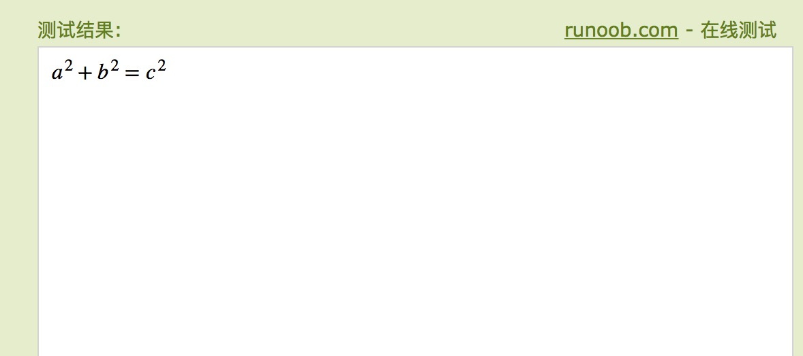
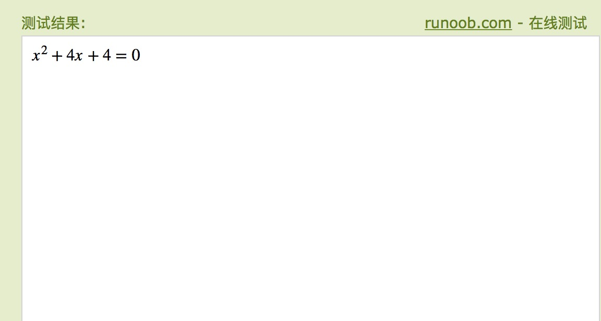
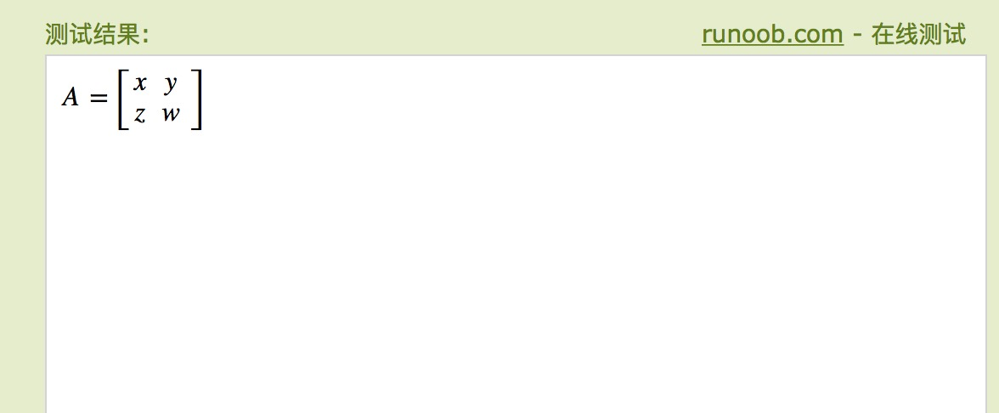
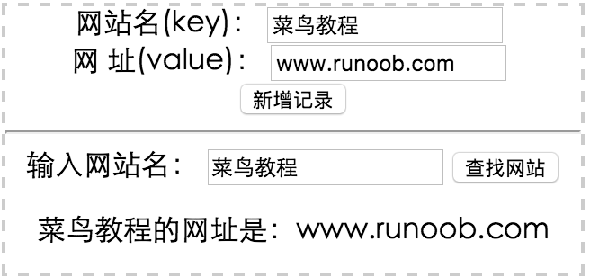
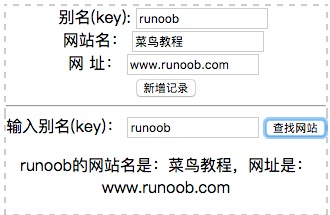
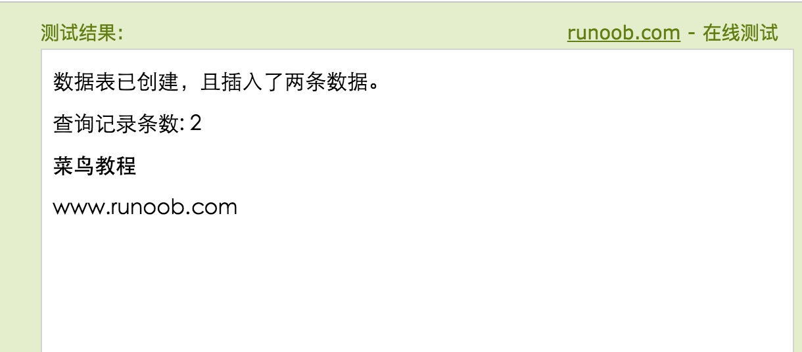

# HTML5 简介


HTML5是HTML最新的修订版本，2014年10月由万维网联盟（W3C）完成标准制定。

HTML5的设计目的是为了在移动设备上支持多媒体。

HTML5 简单易学。

------

## 什么是 HTML5?

HTML5 是下一代 HTML 标准。

HTML , HTML 4.01的上一个版本诞生于 1999 年。自从那以后，Web 世界已经经历了巨变。

HTML5 仍处于完善之中。然而，大部分现代浏览器已经具备了某些 HTML5 支持。

------

## HTML5 是如何起步的？

HTML5 是 W3C 与 WHATWG 合作的结果,WHATWG 指 Web Hypertext Application Technology Working Group。

WHATWG 致力于 web 表单和应用程序，而 W3C 专注于 XHTML 2.0。在 2006 年，双方决定进行合作，来创建一个新版本的 HTML。

HTML5 中的一些有趣的新特性：

- 用于绘画的 canvas 元素
- 用于媒介回放的 video 和 audio 元素
- 对本地离线存储的更好的支持
- 新的特殊内容元素，比如 article、footer、header、nav、section
- 新的表单控件，比如 calendar、date、time、email、url、search

------

## HTML5 <!DOCTYPE>

<!doctype> 声明必须位于 HTML5 文档中的第一行,使用非常简单:


<!DOCTYPE html>
------


## 最小的HTML5文档

下面是一个简单的HTML5文档：

<!DOCTYPE html> <html> <head> <meta charset="utf-8"> <title>文档标题</title> </head>  <body> 文档内容...... </body>  </html>


> **注意：**对于中文网页需要使用 **<meta charset="utf-8">** 声明编码，否则会出现乱码。

------

## HTML5 的改进

- 新元素
- 新属性
- 完全支持 CSS3
- Video 和 Audio
- 2D/3D 制图
- 本地存储
- 本地 SQL 数据
- Web 应用

------

## HTML5 多媒体

使用 HTML5 你可以简单的在网页中播放 视频(video)与音频 (audio) 。

- HTML5 [](https://www.runoob.com/html/html5-video.html)
- HTML5 [](https://www.runoob.com/html/html5-audio.html)

------

## HTML5 应用

使用 HTML5 你可以简单地开发应用

- 本地数据存储
- 访问本地文件
- 本地 SQL 数据
- 缓存引用
- Javascript 工作者
- XHTMLHttpRequest 2

------

## HTML5 图形

使用 HTML5 你可以简单的绘制图形:

- 使用 [](https://www.runoob.com/html/html5-canvas.html) 元素。
- 使用内联 [SVG](https://www.runoob.com/html/html5-svg.html)。
- 使用 [CSS3 2D 转换](https://www.runoob.com/css3/css3-2dtransforms.html)、[CSS3 3D 转换](https://www.runoob.com/css3/css3-3dtransforms.html)。

------

## HTML5 使用 CSS3

- 新选择器
- 新属性
- 动画
- 2D/3D 转换
- 圆角
- 阴影效果
- 可下载的字体

了解更多CSS3知识请查看本站的 [CSS3 教程。](https://www.runoob.com/css3/css3-tutorial.html)

------

## 语义元素

HTML5 添加了很多语义元素如下所示：

| 标签         | 描述                                                         |
| :----------- | :----------------------------------------------------------- |
| <article>    | 定义页面独立的内容区域。                                     |
| <aside>      | 定义页面的侧边栏内容。                                       |
| <bdi>        | 允许您设置一段文本，使其脱离其父元素的文本方向设置。         |
| <command>    | 定义命令按钮，比如单选按钮、复选框或按钮                     |
| <details>    | 用于描述文档或文档某个部分的细节                             |
| <dialog>     | 定义对话框，比如提示框                                       |
| <summary>    | 标签包含 details 元素的标题                                  |
| <figure>     | 规定独立的流内容（图像、图表、照片、代码等等）。             |
| <figcaption> | 定义 <figure> 元素的标题                                     |
| <footer>     | 定义 section 或 document 的页脚。                            |
| <header>     | 定义了文档的头部区域                                         |
| <mark>       | 定义带有记号的文本。                                         |
| <meter>      | 定义度量衡。仅用于已知最大和最小值的度量。                   |
| <nav>        | 定义导航链接的部分。                                         |
| <progress>   | 定义任何类型的任务的进度。                                   |
| <ruby>       | 定义 ruby 注释（中文注音或字符）。                           |
| <rt>         | 定义字符（中文注音或字符）的解释或发音。                     |
| <rp>         | 在 ruby 注释中使用，定义不支持 ruby 元素的浏览器所显示的内容。 |
| <section>    | 定义文档中的节（section、区段）。                            |
| <time>       | 定义日期或时间。                                             |
| <wbr>        | 规定在文本中的何处适合添加换行符。                           |

## HTML5 表单

新表单元素, 新属性，新输入类型，自动验证。

------

## 已移除元素

以下的 HTML 4.01 元素在HTML5中已经被删除:

- <acronym>

- <applet>

- <basefont>

- <big>

- <center>

- <dir>

- <font>

- <frame>

- <frameset>

- <noframes>

- <strike>

------

## 每一章中的实例

通过我们的 HTML 编辑器，您能够编辑 HTML，然后点击按钮来查看结果。

## 实例

<!DOCTYPE HTML> <html> <head> <meta charset="utf-8"> <title>菜鸟教程(runoob.com)</title> </head> <body>  <video width="320" height="240" controls>  <source src="movie.mp4" type="video/mp4">  <source src="movie.ogg" type="video/ogg">  你的浏览器不支持 video 标签。 </video>  </body> </html>


[尝试一下 »](https://www.runoob.com/try/try.php?filename=tryhtml5_video_bear)

**点击 "尝试一下" 按钮查看在线运行结果。**

------

## HTML5 浏览器支持

最新版本的 Safari、Chrome、Firefox 以及 Opera 支持某些 HTML5 特性。Internet Explorer 9 将支持某些 HTML5 特性。


IE9 以下版本浏览器兼容HTML5的方法，使用本站的静态资源的html5shiv包：

<!--[if lt IE 9]>    <script src="http://cdn.static.runoob.com/libs/html5shiv/3.7/html5shiv.min.js"></script> <![endif]-->

载入后，初始化新标签的CSS：

/*html5*/ article,aside,dialog,footer,header,section,nav,figure,menu{display:block}


## HTML5 参考手册

在本站中你可以找到关于HTML5 的标签及属性描述，详细请点击 [HTML5参考手册](https://www.runoob.com/html/tags/html-reference.html)。


# HTML5 浏览器支持

------

你可以让一些较早的浏览器（不支持HTML5）支持 HTML5。

------

## HTML5 浏览器支持

现代的浏览器都支持 HTML5。

此外，所有浏览器，包括旧的和最新的，对无法识别的元素会作为内联元素自动处理。

正因为如此，你可以 **"教会"** 浏览器处理 **"未知"** 的 HTML 元素。


|  | 甚至你可以教会 IE6 (Windows XP 2001) 浏览器处理未知的 HTML 元素。 |
| --------------------- | ------------------------------------------------------------ |
|                       |                                                              |

------

## 将 HTML5 元素定义为块元素

HTML5 定了 8 个新的 HTML **语义（semantic）** 元素。所有这些元素都是 **块级** 元素。

为了能让旧版本的浏览器正确显示这些元素，你可以设置 CSS 的 **display** 属性值为 **block**:

## 实例

header, section, footer, aside, nav, main, article, figure {    display: block;  }


------

## 为 HTML 添加新元素

你可以为 HTML 添加新的元素。

该实例向 HTML 添加的新的元素，并为该元素定义样式，元素名为 **<myHero>** ：

## 实例

<!DOCTYPE html> <html> <head> <meta charset="utf-8"> <title>为 HTML 添加新元素</title> <script>


document.createElement("myHero")

</script> <style>

myHero {    display: block;    background-color: #ddd;    padding: 50px;    font-size: 30px; }

</style>  </head>   <body>   <h1>我的第一个标题</h1>   <p>我的第一个段落。</p>   <myHero>我的第一个新元素</myHero>   </body> </html>


[尝试一下 »](https://www.runoob.com/try/try.php?filename=tryhtml5_browsers_myhero)

JavaScript 语句 **document.createElement("myHero")** 是为 IE 浏览器添加新的元素。

------

## Internet Explorer 浏览器问题

你可以使用以上的方法来为 IE 浏览器添加 HTML5 元素，但是：


|  | Internet Explorer 8 及更早 IE 版本的浏览器不支持以上的方式。 |
| --------------------- | ------------------------------------------------------------ |
|                       |                                                              |

我们可以使用 Sjoerd Visscher 创建的 "HTML5 Enabling JavaScript", " **shiv**" 来解决该问题:

<!--[if lt IE 9]>

 <script src="http://html5shiv.googlecode.com/svn/trunk/html5.js"></script>

<![endif]-->

以上代码是一个注释，作用是在 IE 浏览器的版本小于 IE9 时将读取 html5.js 文件，并解析它。

**注意：**国内用户请使用本站静态资源库（Google 资源库在国内不稳定）：

<!--[if lt IE 9]>

 <script src="http://cdn.static.runoob.com/libs/html5shiv/3.7/html5shiv.min.js"></script>

<![endif]-->

针对IE浏览器html5shiv 是比较好的解决方案。html5shiv主要解决HTML5提出的新的元素不被IE6-8识别，这些新元素不能作为父节点包裹子元素，并且不能应用CSS样式。

------

## 完美的 Shiv 解决方案

## 实例

<!DOCTYPE html> <html> <head> <meta charset="utf-8"> <title>渲染 HTML5</title>   <!--[if lt IE 9]>   <script src="http://cdn.static.runoob.com/libs/html5shiv/3.7/html5shiv.min.js"></script>   <![endif]--> </head>   <body>   <h1>我的第一篇文章</h1>   <article> 菜鸟教程 —— 学的不仅是技术，更是梦想！！！ </article>   </body> </html>


[尝试一下 »](https://www.runoob.com/try/try.php?filename=tryhtml5_browsers_theshiv)

html5shiv.js 引用代码必须放在 <head> 元素中，因为 IE 浏览器在解析 HTML5 新元素时需要先加载该文件。

# HTML5 新元素

------

## HTML5 新元素

自1999年以后HTML 4.01 已经改变了很多,今天，在HTML 4.01中的几个已经被废弃，这些元素在HTML5中已经被删除或重新定义。

为了更好地处理今天的互联网应用，HTML5添加了很多新元素及功能，比如: 图形的绘制，多媒体内容，更好的页面结构，更好的形式 处理，和几个api拖放元素，定位，包括网页 应用程序缓存，存储，网络工作者，等。

------

## <canvas> 新元素

| 标签                                            | 描述                                                         |
| :---------------------------------------------- | :----------------------------------------------------------- |
| [](https://www.runoob.com/tags/tag-canvas.html) | 标签定义图形，比如图表和其他图像。该标签基于 JavaScript 的绘图 API |


------

## 新多媒体元素

| 标签                                            | 描述                                                       |
| :---------------------------------------------- | :--------------------------------------------------------- |
| [](https://www.runoob.com/tags/tag-audio.html)  | 定义音频内容                                               |
| [](https://www.runoob.com/tags/tag-video.html)  | 定义视频（video 或者 movie）                               |
| [](https://www.runoob.com/tags/tag-source.html) | 定义多媒体资源 <video> 和 <audio>                          |
| [](https://www.runoob.com/tags/tag-embed.html)  | 定义嵌入的内容，比如插件。                                 |
| [](https://www.runoob.com/tags/tag-track.html)  | 为诸如 <video> 和 <audio> 元素之类的媒介规定外部文本轨道。 |


------

## 新表单元素

| 标签                                              | 描述                                                         |
| :------------------------------------------------ | :----------------------------------------------------------- |
| [](https://www.runoob.com/tags/tag-datalist.html) | 定义选项列表。请与 input 元素配合使用该元素，来定义 input 可能的值。 |
| [](https://www.runoob.com/tags/tag-keygen.html)   | 规定用于表单的密钥对生成器字段。                             |
| [](https://www.runoob.com/tags/tag-output.html)   | 定义不同类型的输出，比如脚本的输出。                         |


------

## 新的语义和结构元素

HTML5提供了新的元素来创建更好的页面结构：

| 标签                                                | 描述                                                         |
| :-------------------------------------------------- | :----------------------------------------------------------- |
| [](https://www.runoob.com/tags/tag-article.html)    | 定义页面独立的内容区域。                                     |
| [](https://www.runoob.com/tags/tag-aside.html)      | 定义页面的侧边栏内容。                                       |
| [](https://www.runoob.com/tags/tag-bdi.html)        | 允许您设置一段文本，使其脱离其父元素的文本方向设置。         |
| [](https://www.runoob.com/tags/tag-command.html)    | 定义命令按钮，比如单选按钮、复选框或按钮                     |
| [](https://www.runoob.com/tags/tag-details.html)    | 用于描述文档或文档某个部分的细节                             |
| [](https://www.runoob.com/tags/tag-dialog.html)     | 定义对话框，比如提示框                                       |
| [](https://www.runoob.com/tags/tag-summary.html)    | 标签包含 details 元素的标题                                  |
| [](https://www.runoob.com/tags/tag-figure.html)     | 规定独立的流内容（图像、图表、照片、代码等等）。             |
| [](https://www.runoob.com/tags/tag-figcaption.html) | 定义 <figure> 元素的标题                                     |
| [](https://www.runoob.com/tags/tag-footer.html)     | 定义 section 或 document 的页脚。                            |
| [](https://www.runoob.com/tags/tag-header.html)     | 定义了文档的头部区域                                         |
| [](https://www.runoob.com/tags/tag-mark.html)       | 定义带有记号的文本。                                         |
| [](https://www.runoob.com/tags/tag-meter.html)      | 定义度量衡。仅用于已知最大和最小值的度量。                   |
| [](https://www.runoob.com/tags/tag-nav.html)        | 定义导航链接的部分。                                         |
| [](https://www.runoob.com/tags/tag-progress.html)   | 定义任何类型的任务的进度。                                   |
| [](https://www.runoob.com/tags/tag-ruby.html)       | 定义 ruby 注释（中文注音或字符）。                           |
| [](https://www.runoob.com/tags/tag-rt.html)         | 定义字符（中文注音或字符）的解释或发音。                     |
| [](https://www.runoob.com/tags/tag-rp.html)         | 在 ruby 注释中使用，定义不支持 ruby 元素的浏览器所显示的内容。 |
| [](https://www.runoob.com/tags/tag-section.html)    | 定义文档中的节（section、区段）。                            |
| [](https://www.runoob.com/tags/tag-time.html)       | 定义日期或时间。                                             |
| [](https://www.runoob.com/tags/tag-wbr.html)        | 规定在文本中的何处适合添加换行符。                           |


------

## 已移除的元素

以下的 HTML 4.01 元素在HTML5中已经被删除:

- <acronym>

- <applet>

- <basefont>

- <big>

- <center>

- <dir>

- <font>

- <frame>

- <frameset>

- <noframes>

- <strike>

- <tt>


# HTML5 Canvas

------

<canvas> 标签定义图形，比如图表和其他图像，您必须使用脚本来绘制图形。


在画布上（Canvas）画一个红色矩形，渐变矩形，彩色矩形，和一些彩色的文字。


------

## 什么是 canvas?

HTML5 <canvas> 元素用于图形的绘制，通过脚本 (通常是JavaScript)来完成.

<canvas> 标签只是图形容器，您必须使用脚本来绘制图形。


你可以通过多种方法使用 canvas 绘制路径,盒、圆、字符以及添加图像。

------

## 浏览器支持

表格中的数字表示支持 <canvas> 元素的第一个浏览器版本号。

| 元素     |      |      |      |      |      |
| :------- | ---- | ---- | ---- | ---- | ---- |
| <canvas> | 4.0  | 9.0  | 2.0  | 3.1  | 9.0  |

------

## 创建一个画布（Canvas）

一个画布在网页中是一个矩形框，通过 <canvas> 元素来绘制.

**注意:** 默认情况下 <canvas> 元素没有边框和内容。

<canvas>简单实例如下:


<canvas id="myCanvas" width="200" height="100"></canvas>

**注意:** 标签通常需要指定一个id属性 (脚本中经常引用), width 和 height 属性定义的画布的大小.

**提示:**你可以在HTML页面中使用多个 <canvas> 元素.

使用 style 属性来添加边框:

## 实例

<canvas id="myCanvas" width="200" height="100" style="border:1px solid #000000;"> </canvas>


[尝试一下 »](https://www.runoob.com/try/try.php?filename=tryhtml5_canvas_empty)


------

## 使用 JavaScript 来绘制图像

canvas 元素本身是没有绘图能力的。所有的绘制工作必须在 JavaScript 内部完成：


## 实例

var c=document.getElementById("myCanvas"); var ctx=c.getContext("2d"); ctx.fillStyle="#FF0000"; ctx.fillRect(0,0,150,75);


[尝试一下 »](https://www.runoob.com/try/try.php?filename=tryhtml5_canvas_first)

**实例解析:**

首先，找到 <canvas> 元素:

var c=document.getElementById("myCanvas");

然后，创建 context 对象：

var ctx=c.getContext("2d");

getContext("2d") 对象是内建的 HTML5 对象，拥有多种绘制路径、矩形、圆形、字符以及添加图像的方法。

下面的两行代码绘制一个红色的矩形：

ctx.fillStyle="#FF0000";
ctx.fillRect(0,0,150,75);

设置fillStyle属性可以是CSS颜色，渐变，或图案。fillStyle 默认设置是#000000（黑色）。

fillRect(*x,y,width,height*) 方法定义了矩形当前的填充方式。

------

## Canvas 坐标

canvas 是一个二维网格。

canvas 的左上角坐标为 (0,0)

上面的 fillRect 方法拥有参数 (0,0,150,75)。

意思是：在画布上绘制 150x75 的矩形，从左上角开始 (0,0)。

**坐标实例**

如下图所示，画布的 X 和 Y 坐标用于在画布上对绘画进行定位。鼠标移动的矩形框上，显示定位坐标。

X

Y

<iframe src="https://www.runoob.com/try/demo_source/tryhtml5_canvas_coordinates.htm" frameborder="0" style="border: 0px; margin: 0px; padding: 0px; overflow: hidden; width: 400px; height: 120px;"></iframe>

------

## Canvas - 路径

在Canvas上画线，我们将使用以下两种方法：

- moveTo(*x,y*) 定义线条开始坐标
- lineTo(*x,y*) 定义线条结束坐标

绘制线条我们必须使用到 "ink" 的方法，就像stroke().

## 实例

定义开始坐标(0,0), 和结束坐标 (200,100)。然后使用 stroke() 方法来绘制线条:

JavaScript:

var c=document.getElementById("myCanvas"); var ctx=c.getContext("2d"); ctx.moveTo(0,0); ctx.lineTo(200,100); ctx.stroke();


[尝试一下 »](https://www.runoob.com/try/try.php?filename=tryhtml5_canvas_tut_path)

在canvas中绘制圆形, 我们将使用以下方法:

```
arc(x,y,r,start,stop)
```

实际上我们在绘制圆形时使用了 "ink" 的方法, 比如 stroke() 或者 fill().

## 实例

使用 arc() 方法 绘制一个圆:

JavaScript:

var c=document.getElementById("myCanvas"); var ctx=c.getContext("2d"); ctx.beginPath(); ctx.arc(95,50,40,0,2*Math.PI); ctx.stroke();


[尝试一下 »](https://www.runoob.com/try/try.php?filename=tryhtml5_canvas_tut_path2)


------

## Canvas - 文本

使用 canvas 绘制文本，重要的属性和方法如下：

- font - 定义字体
- fillText(*text,x,y*) - 在 canvas 上绘制实心的文本
- strokeText(*text,x,y*) - 在 canvas 上绘制空心的文本

使用 fillText():

## 实例

使用 "Arial" 字体在画布上绘制一个高 30px 的文字（实心）：

JavaScript:

var c=document.getElementById("myCanvas"); var ctx=c.getContext("2d"); ctx.font="30px Arial"; ctx.fillText("Hello World",10,50);


[尝试一下 »](https://www.runoob.com/try/try.php?filename=tryhtml5_canvas_tut_text)

使用 strokeText():

## 实例

使用 "Arial" 字体在画布上绘制一个高 30px 的文字（空心）：

JavaScript:

var c=document.getElementById("myCanvas"); var ctx=c.getContext("2d"); ctx.font="30px Arial"; ctx.strokeText("Hello World",10,50);


[尝试一下 »](https://www.runoob.com/try/try.php?filename=tryhtml5_canvas_tut_text2)


------

## Canvas - 渐变

渐变可以填充在矩形, 圆形, 线条, 文本等等, 各种形状可以自己定义不同的颜色。

以下有两种不同的方式来设置Canvas渐变：

- createLinearGradient(*x,y,x1,y1*) - 创建线条渐变
- createRadialGradient(*x,y,r,x1,y1,r1*) - 创建一个径向/圆渐变

当我们使用渐变对象，必须使用两种或两种以上的停止颜色。

addColorStop()方法指定颜色停止，参数使用坐标来描述，可以是0至1.

使用渐变，设置fillStyle或strokeStyle的值为 渐变，然后绘制形状，如矩形，文本，或一条线。

使用 createLinearGradient():

## 实例

创建一个线性渐变。使用渐变填充矩形:

JavaScript:

var c=document.getElementById("myCanvas"); var ctx=c.getContext("2d");  // 创建渐变 var grd=ctx.createLinearGradient(0,0,200,0); grd.addColorStop(0,"red"); grd.addColorStop(1,"white");  // 填充渐变 ctx.fillStyle=grd; ctx.fillRect(10,10,150,80);


[尝试一下 »](https://www.runoob.com/try/try.php?filename=tryhtml5_canvas_tut_grad)

使用 createRadialGradient():

## 实例

创建一个径向/圆渐变。使用渐变填充矩形：

JavaScript:

var c=document.getElementById("myCanvas"); var ctx=c.getContext("2d");  // 创建渐变 var grd=ctx.createRadialGradient(75,50,5,90,60,100); grd.addColorStop(0,"red"); grd.addColorStop(1,"white");  // 填充渐变 ctx.fillStyle=grd; ctx.fillRect(10,10,150,80);


[尝试一下 »](https://www.runoob.com/try/try.php?filename=tryhtml5_canvas_tut_grad2)


------

## Canvas - 图像

把一幅图像放置到画布上, 使用以下方法:

- drawImage(*image,x,y*)

## 使用图像:


## 实例

把一幅图像放置到画布上:

JavaScript:

var c=document.getElementById("myCanvas"); var ctx=c.getContext("2d"); var img=document.getElementById("scream"); ctx.drawImage(img,10,10);


[尝试一下 »](https://www.runoob.com/try/try.php?filename=tryhtml5_canvas_tut_img)


------

## HTML Canvas 参考手册

标签的完整属性可以参考[Canvas 参考手册.](https://www.runoob.com/tags/ref-canvas.html)

## HTML <canvas> 标签

| Tag                                             | 描述                                                   |
| :---------------------------------------------- | :----------------------------------------------------- |
| [](https://www.runoob.com/tags/tag-canvas.html) | HTML5 的 canvas 元素使用 JavaScript 在网页上绘制图像。 |

> 更多内容可参考：[学习 HTML5 Canvas 这一篇文章就够了](https://www.runoob.com/w3cnote/html5-canvas-intro.html)


# HTML5 内联 SVG

------

HTML5 支持内联 SVG。


------

## 什么是SVG？

- SVG 指可伸缩矢量图形 (Scalable Vector Graphics)
- SVG 用于定义用于网络的基于矢量的图形
- SVG 使用 XML 格式定义图形
- SVG 图像在放大或改变尺寸的情况下其图形质量不会有损失
- SVG 是万维网联盟的标准

------

## SVG优势

与其他图像格式相比（比如 JPEG 和 GIF），使用 SVG 的优势在于：

- SVG 图像可通过文本编辑器来创建和修改
- SVG 图像可被搜索、索引、脚本化或压缩
- SVG 是可伸缩的
- SVG 图像可在任何的分辨率下被高质量地打印
- SVG 可在图像质量不下降的情况下被放大

------

## 浏览器支持


Internet Explorer 9+, Firefox, Opera, Chrome, 和 Safari 支持内联SVG。

------

## 把 SVG 直接嵌入 HTML 页面

在 HTML5 中，您能够将 SVG 元素直接嵌入 HTML 页面中：

## 实例

<!DOCTYPE html> <html> <body>  <svg xmlns="http://www.w3.org/2000/svg" version="1.1" height="190">  <polygon points="100,10 40,180 190,60 10,60 160,180"  style="fill:lime;stroke:purple;stroke-width:5;fill-rule:evenodd;"> </svg>  </body> </html>


[尝试一下 »](https://www.runoob.com/try/try.php?filename=tryhtml5_svg_ex)

结果：

抱歉, 你的浏览器不支持内联SVG.

学习更多关于 SVG 教程, 请访问 [SVG 教程](https://www.runoob.com/svg/svg-tutorial.html).

------

## SVG 与 Canvas两者间的区别

SVG 是一种使用 XML 描述 2D 图形的语言。

Canvas 通过 JavaScript 来绘制 2D 图形。

SVG 基于 XML，这意味着 SVG DOM 中的每个元素都是可用的。您可以为某个元素附加 JavaScript 事件处理器。

在 SVG 中，每个被绘制的图形均被视为对象。如果 SVG 对象的属性发生变化，那么浏览器能够自动重现图形。

Canvas 是逐像素进行渲染的。在 canvas 中，一旦图形被绘制完成，它就不会继续得到浏览器的关注。如果其位置发生变化，那么整个场景也需要重新绘制，包括任何或许已被图形覆盖的对象。

------

## Canvas 与 SVG 的比较

下表列出了 canvas 与 SVG 之间的一些不同之处。

| Canvas                                                       | SVG                                                          |
| :----------------------------------------------------------- | :----------------------------------------------------------- |
| 依赖分辨率不支持事件处理器弱的文本渲染能力能够以 .png 或 .jpg 格式保存结果图像最适合图像密集型的游戏，其中的许多对象会被频繁重绘 | 不依赖分辨率支持事件处理器最适合带有大型渲染区域的应用程序（比如谷歌地图）复杂度高会减慢渲染速度（任何过度使用 DOM 的应用都不快）不适合游戏应用 |

# HTML5 MathML

HTML5 可以在文档中使用 MathML 元素，对应的标签是 <math>...</math> 。

MathML 是数学标记语言，是一种基于XML（标准通用标记语言的子集）的标准，用来在互联网上书写数学符号和公式的置标语言。

> **注意：**大部分浏览器都支持 MathML 标签，如果你的浏览器不支持该标签，可以使用最新版的 Firefox 或 Safari 浏览器查看。

------

## MathML 实例

以下是一个简单的 MathML 实例：

```
<!DOCTYPE html>
<html>
   <head>
      <meta charset="UTF-8">
      <title>菜鸟教程(runoob.com)</title>
   </head>
    
   <body>
    
      <math xmlns="http://www.w3.org/1998/Math/MathML">
        
         <mrow>
            <msup><mi>a</mi><mn>2</mn></msup>
            <mo>+</mo>
                
            <msup><mi>b</mi><mn>2</mn></msup>
            <mo>=</mo>
                
            <msup><mi>c</mi><mn>2</mn></msup>
         </mrow>
            
      </math>
        
   </body>
</html> 
```

[尝试一下 »](https://www.runoob.com/try/try.php?filename=tryhtml5_mathml)

运行结果图，如下所示：



以下实例添加了一些运算符：

```
<!DOCTYPE html>
<html>
   <head>
      <meta charset="UTF-8">
      <title>菜鸟教程(runoob.com)</title>
   </head>
    
   <body>
    
      <math xmlns="http://www.w3.org/1998/Math/MathML">
        
         <mrow>            
            <mrow>
                
               <msup>
                  <mi>x</mi>
                  <mn>2</mn>
               </msup>
                    
               <mo>+</mo>
                    
               <mrow>
                  <mn>4</mn>
                  <mo>⁢</mo>
                  <mi>x</mi>
               </mrow>
                    
               <mo>+</mo>
               <mn>4</mn>
                    
            </mrow>
                
            <mo>=</mo>
            <mn>0</mn>
                 
         </mrow>
      </math>
        
   </body>
</html> 
```

[尝试一下 »](https://www.runoob.com/try/try.php?filename=tryhtml5_mathml1)

运行结果图，如下所示：



以下实例是一个 2×2 矩阵，可以在 Firefox 3.5 以上版本查看到效果：

```
<!DOCTYPE html>
<html>
   <head>
      <meta charset="UTF-8">
      <title>菜鸟教程(runoob.com)</title>
   </head>
    
   <body>
      <math xmlns="http://www.w3.org/1998/Math/MathML">
        
         <mrow>
            <mi>A</mi>
            <mo>=</mo>
            
            <mfenced open="[" close="]">
            
               <mtable>
                  <mtr>
                     <mtd><mi>x</mi></mtd>
                     <mtd><mi>y</mi></mtd>
                  </mtr>
                    
                  <mtr>
                     <mtd><mi>z</mi></mtd>
                     <mtd><mi>w</mi></mtd>
                  </mtr>
               </mtable>
               
            </mfenced>
         </mrow>
      </math>
      
   </body>
</html> 
```

[尝试一下 »](https://www.runoob.com/try/try.php?filename=tryhtml5_mathml2)

运行结果图，如下所示：




# HTML5 拖放（Drag 和 Drop）

------

拖放（Drag 和 drop）是 HTML5 标准的组成部分。

------


将 **RUNOOB.COM** 图标拖动到矩形框中。

------

## 拖放

拖放是一种常见的特性，即抓取对象以后拖到另一个位置。

在 HTML5 中，拖放是标准的一部分，任何元素都能够拖放。

------

## 浏览器支持


Internet Explorer 9+, Firefox, Opera, Chrome, 和 Safari 支持拖动。

**注意:**Safari 5.1.2不支持拖动.

------

## HTML5 拖放实例

下面的例子是一个简单的拖放实例：

## 实例

<!DOCTYPE HTML> <html> <head> <meta charset="utf-8">  <title>菜鸟教程(runoob.com)</title> <style type="text/css"> #div1 {width:350px;height:70px;padding:10px;border:1px solid #aaaaaa;} </style> <script> function allowDrop(ev) {     ev.preventDefault(); }   function drag(ev) {     ev.dataTransfer.setData("Text",ev.target.id); }   function drop(ev) {     ev.preventDefault();     var data=ev.dataTransfer.getData("Text");     ev.target.appendChild(document.getElementById(data)); } </script> </head> <body>   <p>拖动 RUNOOB.COM 图片到矩形框中:</p>   <div id="div1" ondrop="drop(event)" ondragover="allowDrop(event)"></div> <br>    </body> </html>


[尝试一下 »](https://www.runoob.com/try/try.php?filename=tryhtml5_draganddrop)

它看上去也许有些复杂，不过我们可以分别研究拖放事件的不同部分。

------

## 设置元素为可拖放

首先，为了使元素可拖动，把 draggable 属性设置为 true ：


------

## 拖动什么 - ondragstart 和 setData()

然后，规定当元素被拖动时，会发生什么。

在上面的例子中，ondragstart 属性调用了一个函数，drag(event)，它规定了被拖动的数据。

dataTransfer.setData() 方法设置被拖数据的数据类型和值：

function drag(ev)
{
  ev.dataTransfer.setData("Text",ev.target.id);
}

Text 是一个 DOMString 表示要添加到 drag object 的拖动数据的类型。值是可拖动元素的 id ("drag1")。

------

## 放到何处 - ondragover

ondragover 事件规定在何处放置被拖动的数据。

默认地，无法将数据/元素放置到其他元素中。如果需要设置允许放置，我们必须阻止对元素的默认处理方式。

这要通过调用 ondragover 事件的 event.preventDefault() 方法：

*event*.preventDefault()


------

## 进行放置 - ondrop

当放置被拖数据时，会发生 drop 事件。

在上面的例子中，ondrop 属性调用了一个函数，drop(event)：

function drop(ev)
{
  ev.preventDefault();
  var data=ev.dataTransfer.getData("Text");
  ev.target.appendChild(document.getElementById(data));
}

代码解释：

- 调用 preventDefault() 来避免浏览器对数据的默认处理（drop 事件的默认行为是以链接形式打开）
- 通过 dataTransfer.getData("Text") 方法获得被拖的数据。该方法将返回在 setData() 方法中设置为相同类型的任何数据。
- 被拖数据是被拖元素的 id ("drag1")
- 把被拖元素追加到放置元素（目标元素）中


------


## 更多实例

[来回拖放图片](https://www.runoob.com/try/try.php?filename=tryhtml5_draganddrop2)
如何在两个 <div> 元素之间拖放图像。

# HTML5 Geolocation（地理定位）

------

HTML5 Geolocation（地理定位）用于定位用户的位置。

------

## 定位用户的位置

HTML5 Geolocation API 用于获得用户的地理位置。

鉴于该特性可能侵犯用户的隐私，除非用户同意，否则用户位置信息是不可用的。

------

## 浏览器支持


Internet Explorer 9+, Firefox, Chrome, Safari 和 Opera 支持Geolocation（地理定位）.

**注意:** Geolocation（地理定位）对于拥有 GPS 的设备，比如 iPhone，地理定位更加精确。

------

## HTML5 - 使用地理定位

请使用 getCurrentPosition() 方法来获得用户的位置。

下例是一个简单的地理定位实例，可返回用户位置的经度和纬度:

## 实例

var x=document.getElementById("demo"); function getLocation() {    if (navigator.geolocation)    {        navigator.geolocation.getCurrentPosition(showPosition);    }    else    {        x.innerHTML="该浏览器不支持获取地理位置。";    } }  function showPosition(position) {    x.innerHTML="纬度: " + position.coords.latitude +     "<br>经度: " + position.coords.longitude;     }


[尝试一下 »](https://www.runoob.com/try/try.php?filename=tryhtml5_geolocation)

实例解析:

- 检测是否支持地理定位
- 如果支持，则运行 getCurrentPosition() 方法。如果不支持，则向用户显示一段消息。
- 如果 getCurrentPosition() 运行成功，则向参数showPosition中规定的函数返回一个 coordinates 对象
- showPosition() 函数获得并显示经度和纬度

上面的例子是一个非常基础的地理定位脚本，不含错误处理。

------

## 处理错误和拒绝

getCurrentPosition() 方法的第二个参数用于处理错误。它规定当获取用户位置失败时运行的函数：

## 实例

function showError(error) {    switch(error.code)     {        case error.PERMISSION_DENIED:            x.innerHTML="用户拒绝对获取地理位置的请求。"            break;        case error.POSITION_UNAVAILABLE:            x.innerHTML="位置信息是不可用的。"            break;        case error.TIMEOUT:            x.innerHTML="请求用户地理位置超时。"            break;        case error.UNKNOWN_ERROR:            x.innerHTML="未知错误。"            break;    } }


[尝试一下 »](https://www.runoob.com/try/try.php?filename=tryhtml5_geolocation_error)

错误代码：

- Permission denied - 用户不允许地理定位
- Position unavailable - 无法获取当前位置
- Timeout - 操作超时

------

## 在地图中显示结果

如需在地图中显示结果，您需要访问可使用经纬度的地图服务，比如谷歌地图或百度地图：

## 实例

function showPosition(position) {    var latlon=position.coords.latitude+","+position.coords.longitude;     var img_url="http://maps.googleapis.com/maps/api/staticmap?center="    +latlon+"&zoom=14&size=400x300&sensor=false";    document.getElementById("mapholder").innerHTML=""; }


[尝试一下 »](https://www.runoob.com/try/try.php?filename=tryhtml5_geolocation_map)

在上例中，我们使用返回的经纬度数据在谷歌地图中显示位置（使用静态图像）。

[Google地图脚本](https://www.runoob.com/try/try.php?filename=tryhtml5_geolocation_map_script)
上面的链接向您演示如何使用脚本来显示带有标记、缩放和拖曳选项的交互式地图。

------

## 给定位置的信息

本页演示的是如何在地图上显示用户的位置。不过，地理定位对于给定位置的信息同样很有用处。

实例:

- 更新本地信息
- 显示用户周围的兴趣点
- 交互式车载导航系统 (GPS)

------

## getCurrentPosition() 方法 - 返回数据

T若成功，则 getCurrentPosition() 方法返回对象。始终会返回 latitude、longitude 以及 accuracy 属性。如果可用，则会返回其他下面的属性。

| 属性                    | 描述                   |
| :---------------------- | :--------------------- |
| coords.latitude         | 十进制数的纬度         |
| coords.longitude        | 十进制数的经度         |
| coords.accuracy         | 位置精度               |
| coords.altitude         | 海拔，海平面以上以米计 |
| coords.altitudeAccuracy | 位置的海拔精度         |
| coords.heading          | 方向，从正北开始以度计 |
| coords.speed            | 速度，以米/每秒计      |
| timestamp               | 响应的日期/时间        |


------

## Geolocation 对象 - 其他有趣的方法

watchPosition() - 返回用户的当前位置，并继续返回用户移动时的更新位置（就像汽车上的 GPS）。

clearWatch() - 停止 watchPosition() 方法

下面的例子展示 watchPosition() 方法。您需要一台精确的 GPS 设备来测试该例（比如 iPhone）：

## 实例

var x=document.getElementById("demo"); function getLocation() {    if (navigator.geolocation)    {        navigator.geolocation.watchPosition(showPosition);    }    else    {        x.innerHTML="该浏览器不支持获取地理位置。";    } } function showPosition(position) {    x.innerHTML="纬度: " + position.coords.latitude +     "<br>经度: " + position.coords.longitude;  }


[尝试一下 »](https://www.runoob.com/try/try.php?filename=tryhtml5_geolocation_watchposition)


百度获取经纬度的例子（各浏览器适用，含IE5）：

```
<!DOCTYPE html>
<html>
<head>
    <meta charset="utf-8" />
    <title></title>
    <!--引入百度 API，"ak=" 后面一串码是密钥，最好自己申请-->
    <script type="text/javascript" src="https://api.map.baidu.com/api?v=2.0&ak=7a6QKaIilZftIMmKGAFLG7QT1GLfIncg"></script>
</head>
<body>
    <input type="button" onclick="getLocation()" value="确认" />
    <div id="position"></div>
    <script type="text/javascript">
    var x = document.getElementById('position');
    function getLocation() {
        // 创建百度地理位置实例，代替 navigator.geolocation
        var geolocation = new BMap.Geolocation();
        geolocation.getCurrentPosition(function(e) {
            if(this.getStatus() == BMAP_STATUS_SUCCESS){
                // 百度 geolocation 的经纬度属性不同，此处是 point.lat 而不是 coords.latitude
                x.innerHTML = '纬度：' + e.point.lat + '<br/>经度：' + e.point.lng;
            } else {
                x.innerHTML = 'failed' + this.getStatus();
            }
        });
    }
    </script>
</body>
</html>
```

# HTML5 Video(视频)

------

很多站点都会使用到视频. HTML5 提供了展示视频的标准。

## 检测您的浏览器是否支持 HTML5 视频：

检测


------

## Web站点上的视频

直到现在，仍然不存在一项旨在网页上显示视频的标准。

今天，大多数视频是通过插件（比如 Flash）来显示的。然而，并非所有浏览器都拥有同样的插件。

HTML5 规定了一种通过 video 元素来包含视频的标准方法。

------

## 浏览器支持


Internet Explorer 9+, Firefox, Opera, Chrome, 和 Safari 支持 <video> 元素.

**注意:** Internet Explorer 8 或者更早的IE版本不支持 <video> 元素。

------

## HTML5 (视频)- 如何工作

如需在 HTML5 中显示视频，您所有需要的是：

## 实例

<video width="320" height="240" controls>   <source src="movie.mp4" type="video/mp4">   <source src="movie.ogg" type="video/ogg"> 您的浏览器不支持Video标签。 </video>


[尝试一下 »](https://www.runoob.com/try/try.php?filename=tryhtml5_video_all)

<video> 元素提供了 播放、暂停和音量控件来控制视频。


同时 <video> 元素也提供了 width 和 height 属性控制视频的尺寸.如果设置的高度和宽度，所需的视频空间会在页面加载时保留。如果没有设置这些属性，浏览器不知道大小的视频，浏览器就不能再加载时保留特定的空间，页面就会根据原始视频的大小而改变。

<video> 与</video> 标签之间插入的内容是提供给不支持 video 元素的浏览器显示的。

<video> 元素支持多个 <source> 元素. <source> 元素可以链接不同的视频文件。浏览器将使用第一个可识别的格式：
------


## 视频格式与浏览器的支持

当前， <video> 元素支持三种视频格式： MP4, WebM, 和 Ogg:

| 浏览器            | MP4                  | WebM | Ogg  |
| :---------------- | :------------------- | :--- | :--- |
| Internet Explorer | YES                  | NO   | NO   |
| Chrome            | YES                  | YES  | YES  |
| Firefox           | YES                  | YES  | YES  |
| Safari            | YES                  | NO   | NO   |
| Opera             | YES (从 Opera 25 起) | YES  | YES  |

- MP4 = 带有 H.264 视频编码和 AAC 音频编码的 MPEG 4 文件
- WebM = 带有 VP8 视频编码和 Vorbis 音频编码的 WebM 文件
- Ogg = 带有 Theora 视频编码和 Vorbis 音频编码的 Ogg 文件

------

## 视频格式

| 格式 | MIME-type  |
| :--- | :--------- |
| MP4  | video/mp4  |
| WebM | video/webm |
| Ogg  | video/ogg  |


------

## HTML5 <video> - 使用 DOM 进行控制

HTML5 <video> 和 <audio> 元素同样拥有方法、属性和事件。

<video> 和 <audio>元素的方法、属性和事件可以使用JavaScript进行控制.


其中的方法用于播放、暂停以及加载等。其中的属性（比如时长、音量等）可以被读取或设置。其中的 DOM 事件能够通知您，比方说，<video> 元素开始播放、已暂停，已停止，等等。

例中简单的方法，向我们演示了如何使用 <video> 元素，读取并设置属性，以及如何调用方法。

## 实例 1

为视频创建简单的播放/暂停以及调整尺寸控件：


播放/暂停 放大 缩小 普通


<video id="video1" width="480" style="display: block;"></video>

上面的例子调用了两个方法：play() 和 pause()。它同时使用了两个属性：paused 和 width。

[尝试一下 »](https://www.runoob.com/try/try.php?filename=tryhtml5_video_js_prop)

更多参考请查看 [HTML5 Audio/Video DOM 参考手册](https://www.runoob.com/tags/ref-av-dom.html)。

------

## HTML5 Video 标签

| 标签                                            | 描述                                    |
| :---------------------------------------------- | :-------------------------------------- |
| [](https://www.runoob.com/tags/tag-video.html)  | 定义一个视频                            |
| [](https://www.runoob.com/tags/tag-source.html) | 定义多种媒体资源,比如 <video> 和<audio> |
| [](https://www.runoob.com/tags/tag-track.html)  | 定义在媒体播放器文本轨迹                |

# HTML5 Audio(音频)

------

HTML5 提供了播放音频文件的标准。

------

## 互联网上的音频

直到现在，仍然不存在一项旨在网页上播放音频的标准。

今天，大多数音频是通过插件（比如 Flash）来播放的。然而，并非所有浏览器都拥有同样的插件。

HTML5 规定了在网页上嵌入音频元素的标准，即使用 <audio> 元素。

------

## 浏览器支持


Internet Explorer 9+, Firefox, Opera, Chrome, 和 Safari 都支持 <audio> 元素.

**注意:** Internet Explorer 8 及更早IE版本不支持 <audio> 元素.

------

## HTML5 Audio - 如何工作

如需在 HTML5 中播放音频，你需要使用以下代码：

## 实例

<audio controls>   <source src="horse.ogg" type="audio/ogg">   <source src="horse.mp3" type="audio/mpeg"> 您的浏览器不支持 audio 元素。 </audio>


[尝试一下 »](https://www.runoob.com/try/try.php?filename=tryhtml5_audio_all)

control 属性供添加播放、暂停和音量控件。

在<audio> 与 </audio> 之间你需要插入浏览器不支持的<audio>元素的提示文本 。

<audio> 元素允许使用多个 <source> 元素. <source> 元素可以链接不同的音频文件，浏览器将使用第一个支持的音频文件
------


## 音频格式及浏览器支持

目前, <audio>元素支持三种音频格式文件: MP3, Wav, 和 Ogg:

| 浏览器               | MP3  | Wav  | Ogg  |
| :------------------- | :--- | :--- | :--- |
| Internet Explorer 9+ | YES  | NO   | NO   |
| Chrome 6+            | YES  | YES  | YES  |
| Firefox 3.6+         | YES  | YES  | YES  |
| Safari 5+            | YES  | YES  | NO   |
| Opera 10+            | YES  | YES  | YES  |


------

## 音频格式的MIME类型

| Format | MIME-type  |
| :----- | :--------- |
| MP3    | audio/mpeg |
| Ogg    | audio/ogg  |
| Wav    | audio/wav  |


------

## HTML5 Audio 标签

| 标签                                            | 描述                                                         |
| :---------------------------------------------- | :----------------------------------------------------------- |
| [](https://www.runoob.com/tags/tag-audio.html)  | 定义了声音内容                                               |
| [](https://www.runoob.com/tags/tag-source.html) | 规定了多媒体资源, 可以是多个，在 <video> 与 <audio>标签中使用 |

## HTML5 新的 Input 类型

HTML5 拥有多个新的表单输入类型。这些新特性提供了更好的输入控制和验证。

本章全面介绍这些新的输入类型：

- color
- date
- datetime
- datetime-local
- email
- month
- number
- range
- search
- tel
- time
- url
- week

**注意:**并不是所有的主流浏览器都支持新的input类型，不过您已经可以在所有主流的浏览器中使用它们了。即使不被支持，仍然可以显示为常规的文本域。

------

## Input 类型: color

color 类型用在input字段主要用于选取颜色，如下所示：


## 实例

从拾色器中选择一个颜色:

选择你喜欢的颜色: <input type="color" name="favcolor">


[尝试一下 »](https://www.runoob.com/try/try.php?filename=tryhtml5_input_type_color)


------

## Input 类型: date

date 类型允许你从一个日期选择器选择一个日期。


## 实例

定义一个时间控制器:

生日: <input type="date" name="bday">


[尝试一下 »](https://www.runoob.com/try/try.php?filename=tryhtml5_input_type_date)


------

## Input 类型: datetime

datetime 类型允许你选择一个日期（UTC 时间）。


## 实例

定义一个日期和时间控制器（本地时间）:

生日 (日期和时间): <input type="datetime" name="bdaytime">


[尝试一下 »](https://www.runoob.com/try/try.php?filename=tryhtml5_input_type_datetime)


------

## Input 类型: datetime-local

datetime-local 类型允许你选择一个日期和时间 (无时区).


## 实例

定义一个日期和时间 (无时区):

生日 (日期和时间): <input type="datetime-local" name="bdaytime">


[尝试一下 »](https://www.runoob.com/try/try.php?filename=tryhtml5_input_type_datetime-local)


------

## Input 类型: email

email 类型用于应该包含 e-mail 地址的输入域。


## 实例

在提交表单时，会自动验证 email 域的值是否合法有效:

E-mail: <input type="email" name="email">


[尝试一下 »](https://www.runoob.com/try/try.php?filename=tryhtml5_input_type_email)

**提示:** iPhone 中的 Safari 浏览器支持 email 输入类型，并通过改变触摸屏键盘来配合它（添加 @ 和 .com 选项）。

------

## Input 类型: month

month 类型允许你选择一个月份。


## 实例

定义月与年 (无时区):

生日 (月和年): <input type="month" name="bdaymonth">


[尝试一下 »](https://www.runoob.com/try/try.php?filename=tryhtml5_input_type_month)


------

## Input 类型: number

number 类型用于应该包含数值的输入域。

您还能够设定对所接受的数字的限定：


## 实例

定义一个数值输入域(限定):

数量 ( 1 到 5 之间 ): <input type="number" name="quantity" min="1" max="5">


[尝试一下 »](https://www.runoob.com/try/try.php?filename=tryhtml5_input_type_number)

使用下面的属性来规定对数字类型的限定：

| 属性      | 描述                       |
| :-------- | :------------------------- |
| disabled  | 规定输入字段是禁用的       |
| max       | 规定允许的最大值           |
| maxlength | 规定输入字段的最大字符长度 |
| min       | 规定允许的最小值           |
| pattern   | 规定用于验证输入字段的模式 |
| readonly  | 规定输入字段的值无法修改   |
| required  | 规定输入字段的值是必需的   |
| size      | 规定输入字段中的可见字符数 |
| step      | 规定输入字段的合法数字间隔 |
| value     | 规定输入字段的默认值       |

尝试一下带有所有限定属性的例子 [尝试一下](https://www.runoob.com/try/try.php?filename=tryhtml5_form_number_adv)

------

## Input 类型: range

range 类型用于应该包含一定范围内数字值的输入域。

range 类型显示为滑动条。


## 实例

定义一个不需要非常精确的数值（类似于滑块控制）:

<input type="range" name="points" min="1" max="10">


[尝试一下 »](https://www.runoob.com/try/try.php?filename=tryhtml5_input_type_range)

请使用下面的属性来规定对数字类型的限定：

- max - 规定允许的最大值
- min - 规定允许的最小值
- step - 规定合法的数字间隔
- value - 规定默认值

------

## Input 类型: search

search 类型用于搜索域，比如站点搜索或 Google 搜索。


## 实例

定义一个搜索字段 (类似站点搜索或者Google搜索):

Search Google: <input type="search" name="googlesearch">


[尝试一下 »](https://www.runoob.com/try/try.php?filename=tryhtml5_input_type_search)


------

## Input 类型: tel


## 实例

定义输入电话号码字段:

电话号码: <input type="tel" name="usrtel">


[尝试一下 »](https://www.runoob.com/try/try.php?filename=tryhtml5_input_type_tel)


------

## Input 类型: time

time 类型允许你选择一个时间。


## 实例

定义可输入时间控制器（无时区）：

选择时间: <input type="time" name="usr_time">


[尝试一下 »](https://www.runoob.com/try/try.php?filename=tryhtml5_input_type_time)


------

## Input 类型: url

url 类型用于应该包含 URL 地址的输入域。

在提交表单时，会自动验证 url 域的值。


## 实例

定义输入URL字段:

添加您的主页: <input type="url" name="homepage">


[尝试一下 »](https://www.runoob.com/try/try.php?filename=tryhtml5_input_type_url)

**提示:** iPhone 中的 Safari 浏览器支持 url 输入类型，并通过改变触摸屏键盘来配合它（添加 .com 选项）。

------

## Input 类型: week

week 类型允许你选择周和年。


## 实例

定义周和年 (无时区):

选择周: <input type="week" name="week_year">


[尝试一下 »](https://www.runoob.com/try/try.php?filename=tryhtml5_input_type_week)


------

## HTML5 <input> 标签

| 标签                                           | 描述            |
| :--------------------------------------------- | :-------------- |
| [](https://www.runoob.com/tags/tag-input.html) | 描述input输入器 |

# HTML5 表单元素

------

## HTML5 新的表单元素

HTML5 有以下新的表单元素:

- <datalist>

- <keygen>

- <output>

**注意:**不是所有的浏览器都支持HTML5 新的表单元素，但是你可以在使用它们，即使浏览器不支持表单属性，仍然可以显示为常规的表单元素。

------

## HTML5 <datalist> 元素

<datalist> 元素规定输入域的选项列表。


<datalist> 属性规定 form 或 input 域应该拥有自动完成功能。当用户在自动完成域中开始输入时，浏览器应该在该域中显示填写的选项：


使用 <input> 元素的列表属性与 <datalist> 元素绑定.


## 实例

<input> 元素使用<datalist>预定义值:

<input list="browsers">  <datalist id="browsers">  <option value="Internet Explorer">  <option value="Firefox">  <option value="Chrome">  <option value="Opera">  <option value="Safari"> </datalist>


[尝试一下 »](https://www.runoob.com/try/try.php?filename=tryhtml5_datalist)


------

## HTML5 <keygen> 元素

<keygen> 元素的作用是提供一种验证用户的可靠方法。

<keygen>标签规定用于表单的密钥对生成器字段。

当提交表单时，会生成两个键，一个是私钥，一个公钥。

私钥（private key）存储于客户端，公钥（public key）则被发送到服务器。公钥可用于之后验证用户的客户端证书（client certificate）。


## 实例

带有keygen字段的表单:

<form action="demo_keygen.asp" method="get"> 用户名: <input type="text" name="usr_name"> 加密: <keygen name="security"> <input type="submit"> </form>


[尝试一下 »](https://www.runoob.com/try/try.php?filename=tryhtml5_keygen)


------

## HTML5 <output> 元素

<output> 元素用于不同类型的输出，比如计算或脚本输出：


## 实例

将计算结果显示在 <output> 元素:

<form oninput="x.value=parseInt(a.value)+parseInt(b.value)">0 <input type="range" id="a" value="50">100 + <input type="number" id="b" value="50">= <output name="x" for="a b"></output> </form>


[尝试一下 »](https://www.runoob.com/try/try.php?filename=tryhtml5_output)


------

## HTML5 新表单元素

| 标签                                              | 描述                                                         |
| :------------------------------------------------ | :----------------------------------------------------------- |
| [](https://www.runoob.com/tags/tag-datalist.html) | <input>标签定义选项列表。请与 input 元素配合使用该元素，来定义 input 可能的值。 |
| [](https://www.runoob.com/tags/tag-keygen.html)   | <keygen> 标签规定用于表单的密钥对生成器字段。                |
| [](https://www.runoob.com/tags/tag-output.html)   | <output> 标签定义不同类型的输出，比如脚本的输出。            |


# HTML5 表单属性

------

## HTML5 新的表单属性

HTML5 的 <form> 和 <input>标签添加了几个新属性.

<form>新属性：


- autocomplete
- novalidate

<input>新属性：

- autocomplete
- autofocus
- form
- formaction
- formenctype
- formmethod
- formnovalidate
- formtarget
- height 与 width
- list
- min 与 max
- multiple
- pattern (regexp)
- placeholder
- required
- step

------

## <form> / <input> autocomplete 属性

autocomplete 属性规定 form 或 input 域应该拥有自动完成功能。

当用户在自动完成域中开始输入时，浏览器应该在该域中显示填写的选项。

**提示:** autocomplete 属性有可能在 form元素中是开启的，而在input元素中是关闭的。

**注意:** autocomplete 适用于 <form> 标签，以及以下类型的 <input> 标签：text, search, url, telephone, email, password, datepickers, range 以及 color。


## 实例

HTML form 中开启 autocomplete (一个 input 字段关闭 autocomplete ):

<form action="demo-form.php" autocomplete="on">  First name:<input type="text" name="fname"><br>  Last name: <input type="text" name="lname"><br>  E-mail: <input type="email" name="email" autocomplete="off"><br>  <input type="submit"> </form>


[尝试一下 »](https://www.runoob.com/try/try.php?filename=tryhtml5_input_autocomplete)

**提示:**某些浏览器中，您可能需要启用自动完成功能，以使该属性生效。

------

## <form> novalidate 属性

novalidate 属性是一个 boolean(布尔) 属性.

novalidate 属性规定在提交表单时不应该验证 form 或 input 域。


## 实例

无需验证提交的表单数据

<form action="demo-form.php" novalidate>  E-mail: <input type="email" name="user_email">  <input type="submit"> </form>


[尝试一下 »](https://www.runoob.com/try/try.php?filename=tryhtml5_form_novalidate)


------

## <input> autofocus 属性

autofocus 属性是一个 boolean 属性.

autofocus 属性规定在页面加载时，域自动地获得焦点。


## 实例

让 "First name" input 输入域在页面载入时自动聚焦：

First name:<input type="text" name="fname" autofocus>


[尝试一下 »](https://www.runoob.com/try/try.php?filename=tryhtml5_input_autofocus)


------

## <input> form 属性

form 属性规定输入域所属的一个或多个表单。

**提示:**如需引用一个以上的表单，请使用空格分隔的列表。


## 实例

位于form表单外的 input 字段引用了 HTML form (该 input 表单仍然属于form表单的一部分):

<form action="demo-form.php" id="form1">  First name: <input type="text" name="fname"><br>  <input type="submit" value="提交"> </form>  Last name: <input type="text" name="lname" form="form1">


[尝试一下 »](https://www.runoob.com/try/try.php?filename=tryhtml5_input_form)


------

## <input> formaction 属性

The formaction 属性用于描述表单提交的URL地址.

The formaction 属性会覆盖<form> 元素中的action属性.

**注意:** The formaction 属性用于 type="submit" 和 type="image".


## 实例

以下HTMLform表单包含了两个不同地址的提交按钮：

<form action="demo-form.php">  First name: <input type="text" name="fname"><br>  Last name: <input type="text" name="lname"><br>  <input type="submit" value="提交"><br>  <input type="submit" formaction="demo-admin.php"  value="提交"> </form>


[尝试一下 »](https://www.runoob.com/try/try.php?filename=tryhtml5_input_formaction)


------

## <input> formenctype 属性

formenctype 属性描述了表单提交到服务器的数据编码 (只对form表单中 method="post" 表单)

formenctype 属性覆盖 form 元素的 enctype 属性。

**主要:** 该属性与 type="submit" 和 type="image" 配合使用。


## 实例

第一个提交按钮已默认编码发送表单数据，第二个提交按钮以 "multipart/form-data" 编码格式发送表单数据:

<form action="demo-post_enctype.php" method="post">  First name: <input type="text" name="fname"><br>  <input type="submit" value="提交">  <input type="submit" formenctype="multipart/form-data"  value="以 Multipart/form-data 提交"> </form>


[尝试一下 »](https://www.runoob.com/try/try.php?filename=tryhtml5_input_formenctype)


------

## <input> formmethod 属性

formmethod 属性定义了表单提交的方式。

formmethod 属性覆盖了 <form> 元素的 method 属性。

**注意:** 该属性可以与 type="submit" 和 type="image" 配合使用。


## 实例

重新定义表单提交方式实例:

<form action="demo-form.php" method="get">  First name: <input type="text" name="fname"><br>  Last name: <input type="text" name="lname"><br>  <input type="submit" value="提交">  <input type="submit" formmethod="post" formaction="demo-post.php"  value="使用 POST 提交"> </form>


[尝试一下 »](https://www.runoob.com/try/try.php?filename=tryhtml5_input_formmethod)


------

## <input> formnovalidate 属性

novalidate 属性是一个 boolean 属性.

novalidate属性描述了 <input> 元素在表单提交时无需被验证。

formnovalidate 属性会覆盖 <form> 元素的novalidate属性.

**注意:** formnovalidate 属性与type="submit一起使用


## 实例

两个提交按钮的表单(使用与不适用验证 ):

<form action="demo-form.php">
 E-mail: <input type="email" name="userid"><br>
 <input type="submit" value="提交"><br>
 <input type="submit" formnovalidate value="不验证提交">
</form>


[尝试一下 »](https://www.runoob.com/try/try.php?filename=tryhtml5_input_formnovalidate)


------

## <input> formtarget 属性

formtarget 属性指定一个名称或一个关键字来指明表单提交数据接收后的展示。

The formtarget 属性覆盖 <form>元素的target属性.

**注意:** formtarget 属性与type="submit" 和 type="image"配合使用.


## 实例

两个提交按钮的表单, 在不同窗口中显示:

<form action="demo-form.php">
 First name: <input type="text" name="fname"><br>
 Last name: <input type="text" name="lname"><br>
 <input type="submit" value="正常提交">
 <input type="submit" formtarget="_blank"
 value="提交到一个新的页面上">
</form>


[尝试一下 »](https://www.runoob.com/try/try.php?filename=tryhtml5_input_formtarget)


------

## <input> height 和 width 属性

height 和 width 属性规定用于 image 类型的 <input> 标签的图像高度和宽度。

**注意:** height 和 width 属性只适用于 image 类型的<input> 标签。

**提示:**图像通常会同时指定高度和宽度属性。如果图像设置高度和宽度，图像所需的空间 在加载页时会被保留。如果没有这些属性， 浏览器不知道图像的大小，并不能预留 适当的空间。图片在加载过程中会使页面布局效果改变 （尽管图片已加载）。


## 实例

定义了一个图像提交按钮, 使用了 height 和 width 属性:

<input type="image" src="img_submit.gif" alt="Submit" width="48" height="48">


[尝试一下 »](https://www.runoob.com/try/try.php?filename=tryhtml5_input_height_width)


------

## <input> list 属性

list 属性规定输入域的 datalist。datalist 是输入域的选项列表。


## 实例

在 <datalist>中预定义 <input> 值:

<input list="browsers">

<datalist id="browsers">
 <option value="Internet Explorer">
 <option value="Firefox">
 <option value="Chrome">
 <option value="Opera">
 <option value="Safari">
</datalist>


[尝试一下 »](https://www.runoob.com/try/try.php?filename=tryhtml5_datalist)


------

## <input> min 和 max 属性

min、max 和 step 属性用于为包含数字或日期的 input 类型规定限定（约束）。

**注意:** min、max 和 step 属性适用于以下类型的 <input> 标签：date pickers、number 以及 range。


## 实例

<input> 元素最小值与最大值设置:

Enter a date before 1980-01-01:
<input type="date" name="bday" max="1979-12-31">

Enter a date after 2000-01-01:
<input type="date" name="bday" min="2000-01-02">

Quantity (between 1 and 5):
<input type="number" name="quantity" min="1" max="5">


[尝试一下 »](https://www.runoob.com/try/try.php?filename=tryhtml5_input_max_min)


------

## <input> multiple 属性

multiple 属性是一个 boolean 属性.

multiple 属性规定<input> 元素中可选择多个值。

**注意:** multiple 属性适用于以下类型的 <input> 标签：email 和 file:


## 实例

上传多个文件:

Select images: <input type="file" name="img" multiple>


[尝试一下 »](https://www.runoob.com/try/try.php?filename=tryhtml5_input_multiple)


------

## <input> pattern 属性

pattern 属性描述了一个正则表达式用于验证 <input> 元素的值。

**注意:**pattern 属性适用于以下类型的 <input> 标签: text, search, url, tel, email, 和 password.

**提示：** 是用来全局 [title](https://www.runoob.com/tags/tag-title.html) 属性描述了模式.

**提示：** 您可以在我们的 [JavaScript 教程](https://www.runoob.com/js/js-tutorial.html)中学习到有关正则表达式的内容


## 实例

下面的例子显示了一个只能包含三个字母的文本域（不含数字及特殊字符）：

Country code: <input type="text" name="country_code" pattern="[A-Za-z]{3}" title="Three letter country code">


[尝试一下 »](https://www.runoob.com/try/try.php?filename=tryhtml5_input_pattern)


------

## <input> placeholder 属性

placeholder 属性提供一种提示（hint），描述输入域所期待的值。

简短的提示在用户输入值前会显示在输入域上。

**注意:** placeholder 属性适用于以下类型的 <input> 标签：text, search, url, telephone, email 以及 password。


## 实例

input 字段提示文本t:

<input type="text" name="fname" placeholder="First name">


[尝试一下 »](https://www.runoob.com/try/try.php?filename=tryhtml5_input_placeholder)


------

## <input> required 属性

required 属性是一个 boolean 属性.

required 属性规定必须在提交之前填写输入域（不能为空）。

**注意:**required 属性适用于以下类型的 <input> 标签：text, search, url, telephone, email, password, date pickers, number, checkbox, radio 以及 file。


## 实例

不能为空的input字段:

Username: <input type="text" name="usrname" required>


[尝试一下 »](https://www.runoob.com/try/try.php?filename=tryhtml5_input_required)


------

## <input> step 属性

step 属性为输入域规定合法的数字间隔。

如果 step="3"，则合法的数是 -3,0,3,6 等

**提示：** step 属性可以与 max 和 min 属性创建一个区域值.

**注意:** step 属性与以下type类型一起使用: number, range, date, datetime, datetime-local, month, time 和 week.


## 实例

规定input step步长为3:

<input type="number" name="points" step="3">


[尝试一下 »](https://www.runoob.com/try/try.php?filename=tryhtml5_input_step)


------

## HTML5 <input> 标签

| 标签                                           | 描述              |
| :--------------------------------------------- | :---------------- |
| [](https://www.runoob.com/tags/tag-form.html)  | 定义一个form表单  |
| [](https://www.runoob.com/tags/tag-input.html) | 定义一个 input 域 |

# HTML5 语义元素

------

语义= 意义

语义元素 = 有意义的元素

------

## 什么是语义元素?

一个语义元素能够清楚的描述其意义给浏览器和开发者。

**无语义** 元素实例: <div> 和 <span> - 无需考虑内容.

**语义**元素实例: <form>, <table>, and  - 清楚的定义了它的内容.

------

## 浏览器支持


Internet Explorer 9+, Firefox, Chrome, Safari 和 Opera 支持语义元素。

**注意:** Internet Explorer 8 及更早版本不支持该元素。 但是文章底部提供了兼容的解决方法.

------

## HTML5中新的语义元素

许多现有网站都包含以下HTML代码： <div id="nav">, <div class="header">, 或者 <div id="footer">, 来指明导航链接, 头部, 以及尾部.

HTML5 提供了新的语义元素来明确一个Web页面的不同部分:

- <header>

- <nav>

- <section>

- <article>

- <aside>

- <figcaption>

- <figure>

- <footer>


------

## HTML5 <section> 元素

<section> 标签定义文档中的节（section、区段）。比如章节、页眉、页脚或文档中的其他部分。


根据W3C HTML5文档: section 包含了一组内容及其标题。

## 实例

<section>  <h1>WWF</h1>  <p>The World Wide Fund for Nature (WWF) is....</p> </section>


[尝试一下 »](https://www.runoob.com/try/try.php?filename=tryhtml5_section)


------

## HTML5 <article> 元素

<article> 标签定义独立的内容。.


<article> 元素使用实例:


- Forum post
- Blog post
- News story
- Comment

## 实例

<article>  <h1>Internet Explorer 9</h1>  <p>Windows Internet Explorer 9(缩写为 IE9 )在2011年3月14日21:00 发布。</p> </article>


[尝试一下 »](https://www.runoob.com/try/try.php?filename=tryhtml5_article)


------

## HTML5 <nav> 元素

<nav> 标签定义导航链接的部分。


<nav> 元素用于定义页面的导航链接部分区域，但是，不是所有的链接都需要包含在 <nav> 元素中!


## 实例

<nav>    <a href="/html/">HTML</a> |    <a href="/css/">CSS</a> |    <a href="/js/">JavaScript</a> |    <a href="/jquery/">jQuery</a> </nav>


[尝试一下 »](https://www.runoob.com/try/try.php?filename=tryhtml5_nav)


------

## HTML5 <aside> 元素

<aside> 标签定义页面主区域内容之外的内容（比如侧边栏）。


aside 标签的内容应与主区域的内容相关.

## 实例

<p>My family and I visited The Epcot center this summer.</p>   <aside>   <h4>Epcot Center</h4>   <p>The Epcot Center is a theme park in Disney World, Florida.</p> </aside>


[尝试一下 »](https://www.runoob.com/try/try.php?filename=tryhtml5_aside)


------

## HTML5 <header> 元素

<header>元素描述了文档的头部区域


<header>元素主要用于定义内容的介绍展示区域.


在页面中你可以使用多个<header> 元素.

以下实例定义了文章的头部:

## 实例

<article>  <header>    <h1>Internet Explorer 9</h1>    <p><time pubdate datetime="2011-03-15"></time></p>  </header>  <p>Windows Internet Explorer 9(缩写为 IE9 )是在2011年3月14日21:00发布的</p> </article>


[尝试一下 »](https://www.runoob.com/try/try.php?filename=tryhtml5_header)


------

## HTML5 <footer> 元素

<footer> 元素描述了文档的底部区域.


<footer> 元素应该包含它的包含元素


一个页脚通常包含文档的作者，著作权信息，链接的使用条款，联系信息等

文档中你可以使用多个 <footer>元素.

## 实例

<footer>  <p>Posted by: Hege Refsnes</p>  <p><time pubdate datetime="2012-03-01"></time></p> </footer>


[尝试一下 »](https://www.runoob.com/try/try.php?filename=tryhtml5_footer)


------

## HTML5 <figure> 和 <figcaption> 元素

<figure>标签规定独立的流内容（图像、图表、照片、代码等等）。


<figure> 元素的内容应该与主内容相关，但如果被删除，则不应对文档流产生影响。


<figcaption> 标签定义 <figure> 元素的标题.

<figcaption>元素应该被置于 "figure" 元素的第一个或最后一个子元素的位置。

## 实例

<figure>      <figcaption>Fig1. - The Pulpit Pock, Norway.</figcaption> </figure>


[尝试一下 »](https://www.runoob.com/try/try.php?filename=tryhtml5_figcaption)


------

## 我们可以开始使用这些语义元素吗?

以上的元素都是块元素(除了<figcaption>).

为了让这些块及元素在所有版本的浏览器中生效，你需要在样式表文件中设置一下属性 (以下样式代码可以让旧版本浏览器支持本章介绍的块级元素):

header, section, footer, aside, nav, article, figure
{
  display: block;
}

## Internet Explorer 8 及更早IE版本中的问题

IE8 及更早IE版本无法在这些元素中渲染CSS效果，以至于你不能使用 <header>, <section>, <footer>, <aside>, <nav>, <article>, <figure>, 或者其他的HTML5 elements.

**解决办法:** 你可以使用HTML5 Shiv Javascript脚本来解决IE的兼容问题。HTML5 Shiv下载地址：[https://cdn.static.runoob.com/libs/html5shiv/3.7/html5shiv.min.js](http://cdn.static.runoob.com/libs/html5shiv/3.7/html5shiv.min.js)

下载后，将以下代码放入到网页中：

<!--[if lt IE 9]>

<script src="html5shiv.js"></script>

<![endif]-->

以上代码在浏览器小于IE9版本时会加载html5shiv.js文件. 你必须将其放置于<head> 元素中，因为 IE浏览器需要在头部加载后渲染这些HTML5的新元素

# HTML5 Web 存储

------

HTML5 web 存储,一个比cookie更好的本地存储方式。

------

## 什么是 HTML5 Web 存储?

使用HTML5可以在本地存储用户的浏览数据。

早些时候,本地存储使用的是 cookie。但是Web 存储需要更加的安全与快速. 这些数据不会被保存在服务器上，但是这些数据只用于用户请求网站数据上.它也可以存储大量的数据，而不影响网站的性能.

数据以 键/值 对存在, web网页的数据只允许该网页访问使用。

------

## 浏览器支持


Internet Explorer 8+, Firefox, Opera, Chrome, 和 Safari支持Web 存储。

**注意:** Internet Explorer 7 及更早IE版本不支持web 存储.

------

## localStorage 和 sessionStorage 

客户端存储数据的两个对象为：

- localStorage - 用于长久保存整个网站的数据，保存的数据没有过期时间，直到手动去除。
- sessionStorage - 用于临时保存同一窗口(或标签页)的数据，在关闭窗口或标签页之后将会删除这些数据。

在使用 web 存储前,应检查浏览器是否支持 localStorage 和sessionStorage:

if(typeof(Storage)!=="undefined") {    // 是的! 支持 localStorage  sessionStorage 对象!    // 一些代码..... } else {    // 抱歉! 不支持 web 存储。 }


------

## localStorage 对象

localStorage 对象存储的数据没有时间限制。第二天、第二周或下一年之后，数据依然可用。

## 实例

localStorage.sitename="菜鸟教程"; document.getElementById("result").innerHTML="网站名：" + localStorage.sitename;


[尝试一下 »](https://www.runoob.com/try/try.php?filename=tryhtml5_webstorage_local)

实例解析：

- 使用 key="sitename" 和 value="菜鸟教程" 创建一个 localStorage 键/值对。
- 检索键值为"sitename" 的值然后将数据插入 id="result"的元素中。

以上实例也可以这么写：

// 存储 localStorage.sitename = "菜鸟教程"; // 查找 document.getElementById("result").innerHTML = localStorage.sitename;

移除 localStorage 中的 "sitename" :

localStorage.removeItem("sitename");

不管是 localStorage，还是 sessionStorage，可使用的API都相同，常用的有如下几个（以localStorage为例）：

- 保存数据：localStorage.setItem(key,value);
- 读取数据：localStorage.getItem(key);
- 删除单个数据：localStorage.removeItem(key);
- 删除所有数据：localStorage.clear();
- 得到某个索引的key：localStorage.key(index);

**提示:** 键/值对通常以字符串存储，你可以按自己的需要转换该格式。

下面的实例展示了用户点击按钮的次数。

代码中的字符串值转换为数字类型:

## 实例

if (localStorage.clickcount) {    localStorage.clickcount=Number(localStorage.clickcount)+1; } else {    localStorage.clickcount=1; } document.getElementById("result").innerHTML=" 你已经点击了按钮 " + localStorage.clickcount + " 次 ";


[尝试一下 »](https://www.runoob.com/try/try.php?filename=tryhtml5_webstorage_local_clickcount)


------

## sessionStorage 对象

sessionStorage 方法针对一个 session 进行数据存储。当用户关闭浏览器窗口后，数据会被删除。

如何创建并访问一个 sessionStorage：

## 实例

if (sessionStorage.clickcount) {    sessionStorage.clickcount=Number(sessionStorage.clickcount)+1; } else {    sessionStorage.clickcount=1; } document.getElementById("result").innerHTML="在这个会话中你已经点击了该按钮 " + sessionStorage.clickcount + " 次 ";


[尝试一下 »](https://www.runoob.com/try/try.php?filename=tryhtml5_webstorage_session)

------

## Web Storage 开发一个简单的网站列表程序

网站列表程序实现以下功能：

- 可以输入网站名，网址，以网站名作为key存入localStorage；
- 根据网站名，查找网址；
- 列出当前已保存的所有网站；

以下代码用于保存于查找数据：

## save() 与 find() 方法

//保存数据   function save(){      var siteurl = document.getElementById("siteurl").value;      var sitename = document.getElementById("sitename").value;      localStorage.setItem(sitename, siteurl);    alert("添加成功"); } //查找数据   function find(){      var search_site = document.getElementById("search_site").value;      var sitename = localStorage.getItem(search_site);      var find_result = document.getElementById("find_result");      find_result.innerHTML = search_site + "的网址是：" + sitename;   }

完整实例演示如下：

## 实例

<div style="border: 2px dashed #ccc;width:320px;text-align:center;">          <label for="sitename">网站名(key)：</label>       <input type="text" id="sitename" name="sitename" class="text"/>       <br/>       <label for="siteurl">网 址(value)：</label>       <input type="text" id="siteurl" name="siteurl"/>       <br/>       <input type="button" onclick="save()" value="新增记录"/>       <hr/>       <label for="search_site">输入网站名：</label>       <input type="text" id="search_site" name="search_site"/>       <input type="button" onclick="find()" value="查找网站"/>       <p id="find_result"><br/></p>   </div>


[尝试一下 »](https://www.runoob.com/try/try.php?filename=tryhtml5_webstorage_demo)

实现效果截图：



以上实例只是演示了简单的 localStorage 存储与查找，更多情况下我们存储的数据会更复杂。

接下来我们将使用 [JSON.stringify](https://www.runoob.com/js/javascript-json-stringify.html) 来存储对象数据，[JSON.stringify](https://www.runoob.com/js/javascript-json-stringify.html) 可以将对象转换为字符串。

var site = new Object; ... var str = JSON.stringify(site); // 将对象转换为字符串

之后我们使用 [JSON.parse](https://www.runoob.com/js/javascript-json-parse.html) 方法将字符串转换为 JSON 对象：

var site = JSON.parse(str);

JavaScript 实现代码：

## save() 与 find() 方法

//保存数据   function save(){      var site = new Object;    site.keyname = document.getElementById("keyname").value;    site.sitename = document.getElementById("sitename").value;      site.siteurl = document.getElementById("siteurl").value;    var str = JSON.stringify(site); // 将对象转换为字符串    localStorage.setItem(site.keyname,str);      alert("保存成功"); }   //查找数据   function find(){      var search_site = document.getElementById("search_site").value;      var str = localStorage.getItem(search_site);      var find_result = document.getElementById("find_result");    var site = JSON.parse(str);      find_result.innerHTML = search_site + "的网站名是：" + site.sitename + "，网址是：" + site.siteurl;   }

完整实例如下：

## 实例

<div style="border: 2px dashed #ccc;width:320px;text-align:center;">     <label for="keyname">别名(key):</label>       <input type="text" id="keyname" name="keyname" class="text"/>       <br/>       <label for="sitename">网站名：</label>       <input type="text" id="sitename" name="sitename" class="text"/>       <br/>       <label for="siteurl">网 址：</label>       <input type="text" id="siteurl" name="siteurl"/>       <br/>       <input type="button" onclick="save()" value="新增记录"/>       <hr/>       <label for="search_site">输入别名(key)：</label>       <input type="text" id="search_site" name="search_site"/>       <input type="button" onclick="find()" value="查找网站"/>       <p id="find_result"><br/></p>   </div>


[尝试一下 »](https://www.runoob.com/try/try.php?filename=tryhtml5_webstorage_demo2)

实例中的 loadAll 输出了所有存储的数据，你需要确保 localStorage 存储的数据都为 JSON 格式，否则 JSON.parse(str) 将会报错。

输出结果演示：



增加了删除方法，并简单优化了添加和删除，每次执行完都会刷新页面显示最新操作的数据：

```
//删除数据   
function del(name) {
  localStorage.removeItem(name);
  alert("删除成功!");
  loadAll();
}
```

[尝试一下 »](https://c.runoob.com/codedemo/5397)


- 

  这里的`作用域`指的是：如何隔离开不同页面之间的localStorage（总不能在百度的页面上能读到腾讯的localStorage吧，哈哈哈）。

- 

  `localStorage`只要在相同的协议、相同的主机名、相同的端口下，就能读取/修改到同一份localStorage数据。

- 

  `sessionStorage`比`localStorage`更严苛一点，除了协议、主机名、端口外，还要求在同一**窗口**（也就是浏览器的标签页）下。

# HTML5 Web SQL 数据库

Web SQL 数据库 API 并不是 HTML5 规范的一部分，但是它是一个独立的规范，引入了一组使用 SQL 操作客户端数据库的 APIs。

如果你是一个 Web 后端程序员，应该很容易理解 SQL 的操作。

你也可以参考我们的 [SQL 教程](https://www.runoob.com/sql/sql-tutorial.html)，了解更多数据库操作知识。

Web SQL 数据库可以在最新版的 Safari, Chrome 和 Opera 浏览器中工作。

------

## 核心方法

以下是规范中定义的三个核心方法：

1. **openDatabase**：这个方法使用现有的数据库或者新建的数据库创建一个数据库对象。
2. **transaction**：这个方法让我们能够控制一个事务，以及基于这种情况执行提交或者回滚。
3. **executeSql**：这个方法用于执行实际的 SQL 查询。

------

## 打开数据库

我们可以使用 openDatabase() 方法来打开已存在的数据库，如果数据库不存在，则会创建一个新的数据库，使用代码如下：

```
var db = openDatabase('mydb', '1.0', 'Test DB', 2 * 1024 * 1024);
```

openDatabase() 方法对应的五个参数说明：

1. 数据库名称
2. 版本号
3. 描述文本
4. 数据库大小
5. 创建回调

第五个参数，创建回调会在创建数据库后被调用。

------

## 执行查询操作

执行操作使用 database.transaction() 函数：

var db = openDatabase('mydb', '1.0', 'Test DB', 2 * 1024 * 1024); db.transaction(function (tx) {     tx.executeSql('CREATE TABLE IF NOT EXISTS LOGS (id unique, log)'); });

上面的语句执行后会在 'mydb' 数据库中创建一个名为 LOGS 的表。

------

## 插入数据

在执行上面的创建表语句后，我们可以插入一些数据：

var db = openDatabase('mydb', '1.0', 'Test DB', 2 * 1024 * 1024); db.transaction(function (tx) {   tx.executeSql('CREATE TABLE IF NOT EXISTS LOGS (id unique, log)');   tx.executeSql('INSERT INTO LOGS (id, log) VALUES (1, "菜鸟教程")');   tx.executeSql('INSERT INTO LOGS (id, log) VALUES (2, "www.runoob.com")'); });

我们也可以使用动态值来插入数据：

var db = openDatabase('mydb', '1.0', 'Test DB', 2 * 1024 * 1024); db.transaction(function (tx) {    tx.executeSql('CREATE TABLE IF NOT EXISTS LOGS (id unique, log)');  tx.executeSql('INSERT INTO LOGS (id,log) VALUES (?, ?)', [e_id, e_log]); });

实例中的 e_id 和 e_log 是外部变量，executeSql 会映射数组参数中的每个条目给 "?"。

------

## 读取数据

以下实例演示了如何读取数据库中已经存在的数据：

var db = openDatabase('mydb', '1.0', 'Test DB', 2 * 1024 * 1024);  db.transaction(function (tx) {   tx.executeSql('CREATE TABLE IF NOT EXISTS LOGS (id unique, log)');   tx.executeSql('INSERT INTO LOGS (id, log) VALUES (1, "菜鸟教程")');   tx.executeSql('INSERT INTO LOGS (id, log) VALUES (2, "www.runoob.com")'); });  db.transaction(function (tx) {   tx.executeSql('SELECT * FROM LOGS', [], function (tx, results) {      var len = results.rows.length, i;      msg = "<p>查询记录条数: " + len + "</p>";      document.querySelector('#status').innerHTML +=  msg;          for (i = 0; i < len; i++){         alert(results.rows.item(i).log );      }       }, null); });

------

## 完整实例

## 实例

var db = openDatabase('mydb', '1.0', 'Test DB', 2 * 1024 * 1024); var msg;  db.transaction(function (tx) {    tx.executeSql('CREATE TABLE IF NOT EXISTS LOGS (id unique, log)');    tx.executeSql('INSERT INTO LOGS (id, log) VALUES (1, "菜鸟教程")');    tx.executeSql('INSERT INTO LOGS (id, log) VALUES (2, "www.runoob.com")');    msg = '<p>数据表已创建，且插入了两条数据。</p>';    document.querySelector('#status').innerHTML =  msg; });  db.transaction(function (tx) { tx.executeSql('SELECT * FROM LOGS', [], function (tx, results) {    var len = results.rows.length, i;    msg = "<p>查询记录条数: " + len + "</p>";    document.querySelector('#status').innerHTML +=  msg;     for (i = 0; i < len; i++){        msg = "<p><b>" + results.rows.item(i).log + "</b></p>";        document.querySelector('#status').innerHTML +=  msg;    } }, null); });


[尝试一下 »](https://www.runoob.com/try/try.php?filename=tryhtml5_websql)

以上实例运行结果如下图所示：



------

## 删除记录

删除记录使用的格式如下：

```
db.transaction(function (tx) {
    tx.executeSql('DELETE FROM LOGS  WHERE id=1');
});
```

删除指定的数据id也可以是动态的：

```
db.transaction(function(tx) {
    tx.executeSql('DELETE FROM LOGS WHERE id=?', [id]);
});
```

------

## 更新记录

更新记录使用的格式如下：

```
db.transaction(function (tx) {
    tx.executeSql('UPDATE LOGS SET log=\'www.w3cschool.cc\' WHERE id=2');
});
```

更新指定的数据id也可以是动态的：

```
db.transaction(function(tx) {
    tx.executeSql('UPDATE LOGS SET log=\'www.w3cschool.cc\' WHERE id=?', [id]);
});
```

------

## 完整实例

## 实例

var db = openDatabase('mydb', '1.0', 'Test DB', 2 * 1024 * 1024); var msg;  db.transaction(function (tx) {    tx.executeSql('CREATE TABLE IF NOT EXISTS LOGS (id unique, log)');    tx.executeSql('INSERT INTO LOGS (id, log) VALUES (1, "菜鸟教程")');    tx.executeSql('INSERT INTO LOGS (id, log) VALUES (2, "www.runoob.com")');    msg = '<p>数据表已创建，且插入了两条数据。</p>';    document.querySelector('#status').innerHTML =  msg; });  db.transaction(function (tx) {      tx.executeSql('DELETE FROM LOGS  WHERE id=1');      msg = '<p>删除 id 为 1 的记录。</p>';      document.querySelector('#status').innerHTML =  msg; });  db.transaction(function (tx) {     tx.executeSql('UPDATE LOGS SET log=\'www.w3cschool.cc\' WHERE id=2');      msg = '<p>更新 id 为 2 的记录。</p>';      document.querySelector('#status').innerHTML =  msg; });  db.transaction(function (tx) {    tx.executeSql('SELECT * FROM LOGS', [], function (tx, results) {       var len = results.rows.length, i;       msg = "<p>查询记录条数: " + len + "</p>";       document.querySelector('#status').innerHTML +=  msg;              for (i = 0; i < len; i++){          msg = "<p><b>" + results.rows.item(i).log + "</b></p>";          document.querySelector('#status').innerHTML +=  msg;       }    }, null); });


[尝试一下 »](https://www.runoob.com/try/try.php?filename=tryhtml5_websql2)

以上实例运行结果如下图所示：


# HTML5 应用程序缓存

------

使用 HTML5，通过创建 cache manifest 文件，可以轻松地创建 web 应用的离线版本。

------

## 什么是应用程序缓存（Application Cache）？

HTML5 引入了应用程序缓存，这意味着 web 应用可进行缓存，并可在没有因特网连接时进行访问。

应用程序缓存为应用带来三个优势：

1. 离线浏览 - 用户可在应用离线时使用它们
2. 速度 - 已缓存资源加载得更快
3. 减少服务器负载 - 浏览器将只从服务器下载更新过或更改过的资源。

------

## 浏览器支持


Internet Explorer 10, Firefox, Chrome, Safari 和 Opera 支持应用程序缓存.

------

## HTML5 Cache Manifest 实例

下面的例子展示了带有 cache manifest 的 HTML 文档（供离线浏览）：

## 实例

<!DOCTYPE HTML>
<html manifest="demo.appcache">


<body>
文档内容......
</body>

</html>


[尝试一下 »](https://www.runoob.com/try/try.php?filename=tryhtml5_html_manifest)


------

## Cache Manifest 基础

如需启用应用程序缓存，请在文档的<html> 标签中包含 manifest 属性：

<!DOCTYPE HTML>
<html manifest="demo.appcache">
...
</html>


每个指定了 manifest 的页面在用户对其访问时都会被缓存。如果未指定 manifest 属性，则页面不会被缓存（除非在 manifest 文件中直接指定了该页面）。

manifest 文件的建议的文件扩展名是：".appcache"。

 请注意，manifest 文件需要配置正确的 MIME-type，即 "text/cache-manifest"。必须在 web 服务器上进行配置。

------

## Manifest 文件

manifest 文件是简单的文本文件，它告知浏览器被缓存的内容（以及不缓存的内容）。

manifest 文件可分为三个部分：

- *CACHE MANIFEST* - 在此标题下列出的文件将在首次下载后进行缓存
- *NETWORK* - 在此标题下列出的文件需要与服务器的连接，且不会被缓存
- *FALLBACK* - 在此标题下列出的文件规定当页面无法访问时的回退页面（比如 404 页面）

### CACHE MANIFEST

第一行，CACHE MANIFEST，是必需的：

CACHE MANIFEST
/theme.css
/logo.gif
/main.js

上面的 manifest 文件列出了三个资源：一个 CSS 文件，一个 GIF 图像，以及一个 JavaScript 文件。当 manifest 文件加载后，浏览器会从网站的根目录下载这三个文件。然后，无论用户何时与因特网断开连接，这些资源依然是可用的。

### NETWORK

下面的 NETWORK 小节规定文件 "login.php" 永远不会被缓存，且离线时是不可用的：

NETWORK:
login.php

可以使用星号来指示所有其他资源/文件都需要因特网连接：

NETWORK:
*

### FALLBACK

下面的 FALLBACK 小节规定如果无法建立因特网连接，则用 "offline.html" 替代 /html5/ 目录中的所有文件：

FALLBACK:
/html/ /offline.html

**注意:** 第一个 URI 是资源，第二个是替补。

------

## 更新缓存

一旦应用被缓存，它就会保持缓存直到发生下列情况：

- 用户清空浏览器缓存
- manifest 文件被修改（参阅下面的提示）
- 由程序来更新应用缓存

## 实例 - 完整的 Manifest 文件

CACHE MANIFEST
\# 2012-02-21 v1.0.0
/theme.css
/logo.gif
/main.js

NETWORK:
login.php

FALLBACK:
/html/ /offline.html

**提示:**以 "#" 开头的是注释行，但也可满足其他用途。应用的缓存会在其 manifest 文件更改时被更新。如果您编辑了一幅图片，或者修改了一个 JavaScript 函数，这些改变都不会被重新缓存。更新注释行中的日期和版本号是一种使浏览器重新缓存文件的办法。

------

## 关于应用程序缓存的说明

请留心缓存的内容。

一旦文件被缓存，则浏览器会继续展示已缓存的版本，即使您修改了服务器上的文件。为了确保浏览器更新缓存，您需要更新 manifest 文件。

**注意:** 浏览器对缓存数据的容量限制可能不太一样（某些浏览器设置的限制是每个站点 5MB）。

# HTML5 Web Workers

------

web worker 是运行在后台的 JavaScript，不会影响页面的性能。

------

## 什么是 Web Worker？

当在 HTML 页面中执行脚本时，页面的状态是不可响应的，直到脚本已完成。

web worker 是运行在后台的 JavaScript，独立于其他脚本，不会影响页面的性能。您可以继续做任何愿意做的事情：点击、选取内容等等，而此时 web worker 在后台运行。

------

## 浏览器支持


Internet Explorer 10, Firefox, Chrome, Safari 和 Opera 都支持Web workers.

------

## HTML5 Web Workers 实例

下面的例子创建了一个简单的 web worker，在后台计数：

## 实例

计数:


开始 Worker 停止 Worker


[尝试一下 »](https://www.runoob.com/try/try.php?filename=tryhtml5_webworker)

demo_workers.js 文件代码：

var i=0;

function timedCount()
{
  i=i+1;
  postMessage(i);
  setTimeout("timedCount()",500);
}

timedCount();


------

## 检测浏览器是否支持 Web Worker

在创建 web worker 之前，请检测用户的浏览器是否支持它：

if(typeof(Worker)!=="undefined")
{
  // 是的! Web worker 支持!
  // *一些代码.....*
}
else
{
  //抱歉! Web Worker 不支持
}


------

## 创建 web worker 文件

现在，让我们在一个外部 JavaScript 中创建我们的 web worker。

在这里，我们创建了计数脚本。该脚本存储于 "demo_workers.js" 文件中：

var i=0;

function timedCount()
{
  i=i+1;
  postMessage(i);
  setTimeout("timedCount()",500);
}

timedCount();

以上代码中重要的部分是 postMessage() 方法 - 它用于向 HTML 页面传回一段消息。

**注意:** web worker 通常不用于如此简单的脚本，而是用于更耗费 CPU 资源的任务。

------

## 创建 Web Worker 对象

我们已经有了 web worker 文件，现在我们需要从 HTML 页面调用它。

下面的代码检测是否存在 worker，如果不存在，- 它会创建一个新的 web worker 对象，然后运行 "demo_workers.js" 中的代码：

if(typeof(w)=="undefined")
{
  w=new Worker("demo_workers.js");
}

然后我们就可以从 web worker 发生和接收消息了。

向 web worker 添加一个 "onmessage" 事件监听器：

w.onmessage=function(event){
  document.getElementById("result").innerHTML=event.data;
};

------

## 终止 Web Worker

当我们创建 web worker 对象后，它会继续监听消息（即使在外部脚本完成之后）直到其被终止为止。

如需终止 web worker，并释放浏览器/计算机资源，请使用 terminate() 方法：

w.terminate();


------

## 完整的 Web Worker 实例代码

我们已经看到了 .js 文件中的 Worker 代码。下面是 HTML 页面的代码：

## 实例

<!DOCTYPE html> <html> <head>  <meta charset="utf-8">  <title>菜鸟教程(runoob.com)</title>  </head> <body>   <p>计数： <output id="result"></output></p> <button onclick="startWorker()">开始工作</button>  <button onclick="stopWorker()">停止工作</button>   <p><strong>注意：</strong> Internet Explorer 9 及更早 IE 版本浏览器不支持 Web Workers.</p>   <script>


var w;  function startWorker() {    if(typeof(Worker) !== "undefined") {        if(typeof(w) == "undefined") {            w = new Worker("demo_workers.js");        }        w.onmessage = function(event) {            document.getElementById("result").innerHTML = event.data;        };    } else {        document.getElementById("result").innerHTML = "抱歉，你的浏览器不支持 Web Workers...";    } }  function stopWorker()  {     w.terminate();    w = undefined; }

</script>  </body> </html>


[尝试一下 »](https://www.runoob.com/try/try.php?filename=tryhtml5_webworker)


------

## Web Workers 和 DOM

由于 web worker 位于外部文件中，它们无法访问下列 JavaScript 对象：

- window 对象
- document 对象
- parent 对象


# HTML5 服务器发送事件(Server-Sent Events)

------

HTML5 服务器发送事件（server-sent event）允许网页获得来自服务器的更新。

------

## Server-Sent 事件 - 单向消息传递

Server-Sent 事件指的是网页自动获取来自服务器的更新。

以前也可能做到这一点，前提是网页不得不询问是否有可用的更新。通过服务器发送事件，更新能够自动到达。

例子：Facebook/Twitter 更新、股价更新、新的博文、赛事结果等。

------

## 浏览器支持


所有主流浏览器均支持服务器发送事件，除了 Internet Explorer。

------

## 接收 Server-Sent 事件通知

EventSource 对象用于接收服务器发送事件通知：

## 实例

var source=new EventSource("demo_sse.php"); source.onmessage=function(event) {    document.getElementById("result").innerHTML+=event.data + "<br>"; };


[尝试一下 »](https://www.runoob.com/try/try.php?filename=tryhtml5_sse)

实例解析：

- 创建一个新的 EventSource 对象，然后规定发送更新的页面的 URL（本例中是 "demo_sse.php"）
- 每接收到一次更新，就会发生 onmessage 事件
- 当 onmessage 事件发生时，把已接收的数据推入 id 为 "result" 的元素中

------

## 检测 Server-Sent 事件支持

以下实例，我们编写了一段额外的代码来检测服务器发送事件的浏览器支持情况：

```
if(typeof(EventSource)!=="undefined")
{
    // 浏览器支持 Server-Sent
    // 一些代码.....
}
else
{
    // 浏览器不支持 Server-Sent..
}
```


------

## 服务器端代码实例

为了让上面的例子可以运行，您还需要能够发送数据更新的服务器（比如 PHP 和 ASP）。

服务器端事件流的语法是非常简单的。把 "Content-Type" 报头设置为 "text/event-stream"。现在，您可以开始发送事件流了。

## 实例

<?php
header('Content-Type: text/event-stream');
header('Cache-Control: no-cache');

$time = date('r');
echo "data: The server time is: {$time}\n\n";
flush();
?>

ASP 代码 (VB) (demo_sse.asp):

```
<%
Response.ContentType="text/event-stream"
Response.Expires=-1
Response.Write("data: " & now())
Response.Flush()
%>
```

代码解释:

- 把报头 "Content-Type" 设置为 "text/event-stream"
- 规定不对页面进行缓存
- 输出发送日期（始终以 "data: " 开头）
- 向网页刷新输出数据

------

## EventSource 对象

在上面的例子中，我们使用 onmessage 事件来获取消息。不过还可以使用其他事件：

| 事件      | 描述                     |
| :-------- | :----------------------- |
| onopen    | 当通往服务器的连接被打开 |
| onmessage | 当接收到消息             |
| onerror   | 当发生错误               |

在上面 asp 代码里，别忘记 **\n\n**。

如果你用ASP.NET C#制作，则 demo_sse.aspx 代码如下：

```
<%@ Page Language="C#"   %>

<script runat="server">
    protected void Page_Load(object sender, EventArgs e)
    {
        Response.ContentType = "text/event-stream";
        Response.Expires = -1;
        Response.Write("data:" + DateTime.Now + "\n\n");
        Response.Flush();
    }
</script>
```

需要以 **\n\n** 结尾，否则，会得不到数据。

# HTML5 WebSocket

WebSocket 是 HTML5 开始提供的一种在单个 TCP 连接上进行全双工通讯的协议。

WebSocket 使得客户端和服务器之间的数据交换变得更加简单，允许服务端主动向客户端推送数据。在 WebSocket API 中，浏览器和服务器只需要完成一次握手，两者之间就直接可以创建持久性的连接，并进行双向数据传输。

在 WebSocket API 中，浏览器和服务器只需要做一个握手的动作，然后，浏览器和服务器之间就形成了一条快速通道。两者之间就直接可以数据互相传送。

现在，很多网站为了实现推送技术，所用的技术都是 Ajax 轮询。轮询是在特定的的时间间隔（如每1秒），由浏览器对服务器发出HTTP请求，然后由服务器返回最新的数据给客户端的浏览器。这种传统的模式带来很明显的缺点，即浏览器需要不断的向服务器发出请求，然而HTTP请求可能包含较长的头部，其中真正有效的数据可能只是很小的一部分，显然这样会浪费很多的带宽等资源。

HTML5 定义的 WebSocket 协议，能更好的节省服务器资源和带宽，并且能够更实时地进行通讯。


浏览器通过 JavaScript 向服务器发出建立 WebSocket 连接的请求，连接建立以后，客户端和服务器端就可以通过 TCP 连接直接交换数据。

当你获取 Web Socket 连接后，你可以通过 **send()** 方法来向服务器发送数据，并通过 **onmessage** 事件来接收服务器返回的数据。

以下 API 用于创建 WebSocket 对象。

```
var Socket = new WebSocket(url, [protocol] );
```

以上代码中的第一个参数 url, 指定连接的 URL。第二个参数 protocol 是可选的，指定了可接受的子协议。

------

## WebSocket 属性

以下是 WebSocket 对象的属性。假定我们使用了以上代码创建了 Socket 对象：

| 属性                  | 描述                                                         |
| :-------------------- | :----------------------------------------------------------- |
| Socket.readyState     | 只读属性 **readyState** 表示连接状态，可以是以下值：0 - 表示连接尚未建立。1 - 表示连接已建立，可以进行通信。2 - 表示连接正在进行关闭。3 - 表示连接已经关闭或者连接不能打开。 |
| Socket.bufferedAmount | 只读属性 **bufferedAmount** 已被 send() 放入正在队列中等待传输，但是还没有发出的 UTF-8 文本字节数。 |

------

## WebSocket 事件

以下是 WebSocket 对象的相关事件。假定我们使用了以上代码创建了 Socket 对象：

| 事件    | 事件处理程序     | 描述                       |
| :------ | :--------------- | :------------------------- |
| open    | Socket.onopen    | 连接建立时触发             |
| message | Socket.onmessage | 客户端接收服务端数据时触发 |
| error   | Socket.onerror   | 通信发生错误时触发         |
| close   | Socket.onclose   | 连接关闭时触发             |

------

## WebSocket 方法

以下是 WebSocket 对象的相关方法。假定我们使用了以上代码创建了 Socket 对象：

| 方法           | 描述             |
| :------------- | :--------------- |
| Socket.send()  | 使用连接发送数据 |
| Socket.close() | 关闭连接         |

------

## WebSocket 实例

WebSocket 协议本质上是一个基于 TCP 的协议。

为了建立一个 WebSocket 连接，客户端浏览器首先要向服务器发起一个 HTTP 请求，这个请求和通常的 HTTP 请求不同，包含了一些附加头信息，其中附加头信息"Upgrade: WebSocket"表明这是一个申请协议升级的 HTTP 请求，服务器端解析这些附加的头信息然后产生应答信息返回给客户端，客户端和服务器端的 WebSocket 连接就建立起来了，双方就可以通过这个连接通道自由的传递信息，并且这个连接会持续存在直到客户端或者服务器端的某一方主动的关闭连接。

### 客户端的 HTML 和 JavaScript

目前大部分浏览器支持 WebSocket() 接口，你可以在以下浏览器中尝试实例： Chrome, Mozilla, Opera 和 Safari。

runoob_websocket.html 文件内容

```
<!DOCTYPE HTML>
<html>
   <head>
   <meta charset="utf-8">
   <title>菜鸟教程(runoob.com)</title>
    
      <script type="text/javascript">
         function WebSocketTest()
         {
            if ("WebSocket" in window)
            {
               alert("您的浏览器支持 WebSocket!");
               
               // 打开一个 web socket
               var ws = new WebSocket("ws://localhost:9998/echo");
                
               ws.onopen = function()
               {
                  // Web Socket 已连接上，使用 send() 方法发送数据
                  ws.send("发送数据");
                  alert("数据发送中...");
               };
                
               ws.onmessage = function (evt) 
               { 
                  var received_msg = evt.data;
                  alert("数据已接收...");
               };
                
               ws.onclose = function()
               { 
                  // 关闭 websocket
                  alert("连接已关闭..."); 
               };
            }
            
            else
            {
               // 浏览器不支持 WebSocket
               alert("您的浏览器不支持 WebSocket!");
            }
         }
      </script>
        
   </head>
   <body>
   
      <div id="sse">
         <a href="javascript:WebSocketTest()">运行 WebSocket</a>
      </div>
      
   </body>
</html>
```

------

## 安装 pywebsocket

在执行以上程序前，我们需要创建一个支持 WebSocket 的服务。从 [pywebsocket](https://github.com/google/pywebsocket) 下载 mod_pywebsocket ,或者使用 git 命令下载：

```
git clone https://github.com/google/pywebsocket.git
```

mod_pywebsocket 需要 python 环境支持

mod_pywebsocket 是一个 Apache HTTP 的 Web Socket扩展，安装步骤如下：


- 解压下载的文件。

- 进入 **pywebsocket** 目录。

- 执行命令：

  ```
  $ python setup.py build
  $ sudo python setup.py install
  ```

- 查看文档说明:

  ```
  $ pydoc mod_pywebsocket
  ```

### 开启服务

在 **pywebsocket/mod_pywebsocket** 目录下执行以下命令：

```
$ sudo python standalone.py -p 9998 -w ../example/
```

以上命令会开启一个端口号为 9998 的服务，使用 -w 来设置处理程序 echo_wsh.py 所在的目录。

现在我们可以在 Chrome 浏览器打开前面创建的 runoob_websocket.html 文件。如果你的浏览器支持 WebSocket(), 点击"运行 WebSocket"，你就可以看到整个流程各个步骤弹出的窗口，流程 Gif 演示：


在我们停止服务后，会弹出 "连接已关闭..."。

Websocket 使用 ws 或 wss 的统一资源标志符，类似于 HTTPS，其中 wss 表示在 TLS 之上的 Websocket。如：

```
ws://example.com/wsapi
wss://secure.example.com/
```

Websocket 使用和 HTTP 相同的 TCP 端口，可以绕过大多数防火墙的限制。默认情况下，Websocket 协议使用 80 端口；运行在 TLS 之上时，默认使用 443 端口。

**一个典型的Websocket握手请求如下：**

客户端请求

```
GET / HTTP/1.1
Upgrade: websocket
Connection: Upgrade
Host: example.com
Origin: http://example.com
Sec-WebSocket-Key: sN9cRrP/n9NdMgdcy2VJFQ==
Sec-WebSocket-Version: 13
```

服务器回应

```
HTTP/1.1 101 Switching Protocols
Upgrade: websocket
Connection: Upgrade
Sec-WebSocket-Accept: fFBooB7FAkLlXgRSz0BT3v4hq5s=
Sec-WebSocket-Location: ws://example.com/
```

-  Connection 必须设置 Upgrade，表示客户端希望连接升级。
-  Upgrade 字段必须设置 Websocket，表示希望升级到 Websocket 协议。
-  Sec-WebSocket-Key 是随机的字符串，服务器端会用这些数据来构造出一个 SHA-1 的信息摘要。把 “Sec-WebSocket-Key” 加上一个特殊字符串 “258EAFA5-E914-47DA-95CA-C5AB0DC85B11”，然后计算 SHA-1 摘要，之后进行 BASE-64 编码，将结果做为 “Sec-WebSocket-Accept” 头的值，返回给客户端。如此操作，可以尽量避免普通 HTTP 请求被误认为 Websocket 协议。
-  Sec-WebSocket-Version 表示支持的 Websocket 版本。RFC6455 要求使用的版本是 13，之前草案的版本均应当弃用。
-  Origin 字段是可选的，通常用来表示在浏览器中发起此 Websocket 连接所在的页面，类似于 Referer。但是，与 Referer 不同的是，Origin 只包含了协议和主机名称。
-  其他一些定义在 HTTP 协议中的字段，如 Cookie 等，也可以在 Websocket 中使用。

在服务器方面，网上都有不同对websocket支持的服务器：

- php - http://code.google.com/p/phpwebsocket/
- jetty - http://jetty.codehaus.org/jetty/（版本7开始支持websocket）
- netty - http://www.jboss.org/netty
- ruby - http://github.com/gimite/web-socket-ruby
- Kaazing - https://web.archive.org/web/20100923224709/http://www.kaazing.org/confluence/display/KAAZING/Home
- Tomcat - [http://tomcat.apache.org/（7.0.27支持websocket，建议用tomcat8，7.0.27中的接口已经过时）](http://tomcat.apache.org/)
- WebLogic - [http://www.oracle.com/us/products/middleware/cloud-app-foundation/weblogic/overview/index.html（12.1.2開始支持）](http://www.oracle.com/us/products/middleware/cloud-app-foundation/weblogic/overview/index.html)
- node.js - https://github.com/Worlize/WebSocket-Node
- node.js - [http://socket.io](http://socket.io/)
- nginx - http://nginx.com/
- mojolicious - http://mojolicio.us/
- python - https://github.com/abourget/gevent-socketio
- Django - https://github.com/stephenmcd/django-socketio
- erlang - https://github.com/ninenines/cowboy.git

说到 websocket 我觉得有必要说下跟 socket 的区别。

软件通信有七层结构，下三层结构偏向与数据通信，上三层更偏向于数据处理，中间的传输层则是连接上三层与下三层之间的桥梁，每一层都做不同的工作，上层协议依赖与下层协议。基于这个通信结构的概念。

Socket 其实并不是一个协议，是应用层与 TCP/IP 协议族通信的中间软件抽象层，它是一组接口。当两台主机通信时，让 Socket 去组织数据，以符合指定的协议。TCP 连接则更依靠于底层的 IP 协议，IP 协议的连接则依赖于链路层等更低层次。

WebSocket 则是一个典型的应用层协议。

总的来说：Socket 是传输控制层协议，WebSocket 是应用层协议。

# HTML5 测验

- [HTML5 测验一](https://c.runoob.com/quiz/5589)
- [HTML5 测验二](https://c.runoob.com/quiz/5590)
- [HTML5 测验三](https://c.runoob.com/quiz/5591)
- [HTML5 测验四](https://c.runoob.com/quiz/5592)
- [HTML5 测验五](https://c.runoob.com/quiz/5593)
- [HTML5 测验六](https://c.runoob.com/quiz/5594)
- [HTML5 测验七](https://c.runoob.com/quiz/5595)


# HTML(5) 代码规范

------

## HTML 代码约定

很多 Web 开发人员对 HTML 的代码规范知之甚少。

在2000年至2010年，许多Web开发人员从 HTML 转换到 XHTML。

使用 XHTML 开发人员逐渐养成了比较好的 HTML 编写规范。

而针对于 HTML5 ，我们应该形成比较好的代码规范，以下提供了几种规范的建议。

------

## 使用正确的文档类型

文档类型声明位于HTML文档的第一行：

<!DOCTYPE html>


如果你想跟其他标签一样使用小写，可以使用以下代码：

<!doctype html>
------


## 使用小写元素名

HTML5 元素名可以使用大写和小写字母。

推荐使用小写字母：

- 混合了大小写的风格是非常糟糕的。
- 开发人员通常使用小写 (类似 XHTML)。
- 小写风格看起来更加清爽。
- 小写字母容易编写。

### 不推荐:

<SECTION>
 <p>这是一个段落。</p>
</SECTION>


### 非常糟糕:

<Section>
 <p>这是一个段落。</p>
</SECTION>


### 推荐:

<section>
 <p>这是一个段落。</p>
</section>
------

## 关闭所有 HTML 元素

在 HTML5 中, 你不一定要关闭所有元素 (例如 <p> 元素)，但我们建议每个元素都要添加关闭标签。

不推荐:

<section>
 <p>这是一个段落。
 <p>这是一个段落。
</section>


推荐:

<section>
 <p>这是一个段落。</p>
 <p>这是一个段落。</p>
</section>
------

## 关闭空的 HTML 元素

在 HTML5 中, 空的 HTML 元素也不一定要关闭：

我们可以这么写：

<meta charset="utf-8">


也可以这么写：

<meta charset="utf-8" />

在 XHTML 和 XML 中斜线 (/) 是必须的。

如果你期望 XML 软件使用你的页面，使用这种风格是非常好的。

------

## 使用小写属性名

HTML5 属性名允许使用大写和小写字母。

我们推荐使用小写字母属性名:

- 同时使用大小写是非常不好的习惯。
- 开发人员通常使用小写 (类似 XHTML)。
- 小写风格看起来更加清爽。
- 小写字母容易编写。

不推荐：

<div CLASS="menu">


推荐：

<div class="menu">
------


## 属性值

HTML5 属性值可以不用引号。

属性值我们推荐使用引号:

- 如果属性值含有空格需要使用引号。
- 混合风格不推荐的，建议统一风格。
- 属性值使用引号易于阅读。

以下实例属性值包含空格，没有使用引号，所以不能起作用:

<table class=table striped>


以下使用了双引号，是正确的：

<table class="table striped">
------


## 图片属性

图片通常使用 **alt** 属性。 在图片不能显示时，它能替代图片显示。


定义好图片的尺寸，在加载时可以预留指定空间，减少闪烁。


------

## 空格和等号

等号前后可以使用空格。

<link rel = "stylesheet" href = "styles.css">

但我们推荐少用空格:

<link rel="stylesheet" href="styles.css">

------

## 避免一行代码过长

使用 HTML 编辑器，左右滚动代码是不方便的。

每行代码尽量少于 80 个字符。

------

## 空行和缩进

不要无缘无故添加空行。

为每个逻辑功能块添加空行，这样更易于阅读。

缩进使用两个空格，不建议使用 TAB。

比较短的代码间不要使用不必要的空行和缩进。

### 不必要的空行和缩进:

<body>

 <h1>菜鸟教程</h1>

 <h2>HTML</h2>

 <p>
  菜鸟教程，学的不仅是技术，更是梦想。
  菜鸟教程，学的不仅是技术，更是梦想。
  菜鸟教程，学的不仅是技术，更是梦想,
  菜鸟教程，学的不仅是技术，更是梦想。
 </p>


</body>

### 推荐:

<body>

<h1>菜鸟教程</h1>

<h2></h2>
<p>菜鸟教程，学的不仅是技术，更是梦想。
菜鸟教程，学的不仅是技术，更是梦想。
菜鸟教程，学的不仅是技术，更是梦想。
菜鸟教程，学的不仅是技术，更是梦想。</p>


</body>

### 表格实例:

<table>  <tr>    <th>Name</th>    <th>Description</th>  </tr>  <tr>    <td>A</td>    <td>Description of A</td>  </tr>  <tr>    <td>B</td>    <td>Description of B</td>  </tr></table>

### 列表实例:

<ol>
 <li>London</li>
 <li>Paris</li>
 <li>Tokyo</li>
</ol>
------

## 省略 <html> 和 <body>?

在标准 HTML5 中， <html> 和 <body> 标签是可以省略的。

以下 HTML5 文档是正确的:

### 实例:

<!DOCTYPE html>
<head>
 <title>页面标题</title>
</head>


<h1>这是一个标题</h1>
<p>这是一个段落。</p>


[尝试一下 »](https://www.runoob.com/try/try.php?filename=tryhtml_syntax_nobody)

**不推荐省略 <html> 和 <body> 标签。**

<html> 元素是文档的根元素，用于描述页面的语言：

<!DOCTYPE html>
<html lang="zh">


声明语言是为了方便屏幕阅读器及搜索引擎。

省略 <html> 或 <body> 在 DOM 和 XML 软件中会崩溃。

省略 <body> 在旧版浏览器 (IE9)会发生错误。

------

## 省略 <head>?

在标准 HTML5 中， <head>标签是可以省略的。

默认情况下，浏览器会将 <body> 之前的内容添加到一个默认的 <head> 元素上。

### 实例

<!DOCTYPE html>
<html>
<title>页面标题</title>


<body>

 <h1>这是一个标题</h1>
 <p>这是一个段落。</p>

</body>

</html>


[尝试一下 »](https://www.runoob.com/try/try.php?filename=tryhtml_syntax_nohead)

|  | 现在省略 head 标签还不推荐使用。 |
| --------------------- | -------------------------------- |
|                       |                                  |

------

## 元数据

HTML5 中 <title> 元素是必须的，标题名描述了页面的主题:

<title>菜鸟教程</title>

标题和语言可以让搜索引擎很快了解你页面的主题:

<!DOCTYPE html>
<html lang="zh">
<head>
 <meta charset="UTF-8">
 <title>菜鸟教程</title>
</head>
------


## HTML 注释

注释可以写在 <!-- 和 --> 中:

<!-- 这是注释 -->

比较长的评论可以在 <!-- 和 --> 中分行写：

<!--
 这是一个较长评论。 这是 一个较长评论。这是一个较长评论。
 这是 一个较长评论 这是一个较长评论。 这是 一个较长评论。
-->

长评论第一个字符缩进两个空格，更易于阅读。

------

## 样式表

样式表使用简洁的语法格式 ( type 属性不是必须的):

<link rel="stylesheet" href="styles.css">

短的规则可以写成一行:

p.into {font-family: Verdana; font-size: 16em;}

长的规则可以写成多行:

body {
 background-color: lightgrey;
 font-family: "Arial Black", Helvetica, sans-serif;
 font-size: 16em;
 color: black;
}

- 将左花括号与选择器放在同一行。
- 左花括号与选择器间添加一个空格。
- 使用两个空格来缩进。
- 冒号与属性值之间添加一个空格。
- 逗号和符号之后使用一个空格。
- 每个属性与值结尾都要使用分号。
- 只有属性值包含空格时才使用引号。
- 右花括号放在新的一行。
- 每行最多 80 个字符。

|  | 在逗号和冒号后添加空格是常用的一个规则。 |
| --------------------- | ---------------------------------------- |
|                       |                                          |

------

## 在 HTML 中载入 JavaScript

使用简洁的语法来载入外部的脚本文件 ( type 属性不是必须的 ):

<script src="myscript.js">
------


## 使用 JavaScript 访问 HTML 元素

一个糟糕的 HTML 格式可能会导致 JavaScript 执行错误。

以下两个 JavaScript 语句会输出不同结果:

### 实例

var obj = getElementById("Demo")

var obj = getElementById("demo")


[尝试一下 »](https://www.runoob.com/try/try.php?filename=tryhtml_syntax_javascript)

HTML 中 JavaScript 尽量使用相同的命名规则。

[访问 JavaScript 代码规范](https://www.runoob.com/js/js-conventions.html)。

------

## 使用小写文件名

大多 Web 服务器 (Apache, Unix) 对大小写敏感： london.jpg 不能通过 London.jpg 访问。

其他 Web 服务器 (Microsoft, IIS) 对大小写不敏感： london.jpg 可以通过 London.jpg 或 london.jpg 访问。

你必须保持统一的风格，我们建议统一使用小写的文件名。

------

## 文件扩展名

HTML 文件后缀可以是 **.html** (或 **.htm**)。

CSS 文件后缀是 **.css** 。

JavaScript 文件后缀是 **.js** 。

------

## .htm 和 .html 的区别

.htm 和 .html 的扩展名文件本质上是没有区别的。浏览器和 Web 服务器都会把它们当作 HTML 文件来处理。

区别在于：

.htm 应用在早期 DOS 系统，系统现在或者只能有三个字符。

在 Unix 系统中后缀没有特别限制，一般用 .html。

## 技术上区别

如果一个 URL 没有指定文件名 (如 http://www.runoob.com/css/), 服务器会返回默认的文件名。通常默认文件名为 index.html, index.htm, default.html, 和 default.htm。

如果服务器只配置了 "index.html" 作为默认文件，你必须将文件命名为 "index.html", 而不是 "index.htm"。

但是，通常服务器可以设置多个默认文件，你可以根据需要设置默认文件名。

不管怎样，HTML 完整的后缀是 ".html"。

