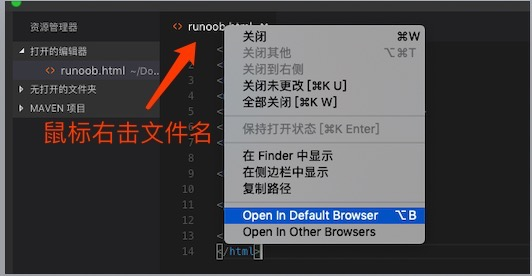
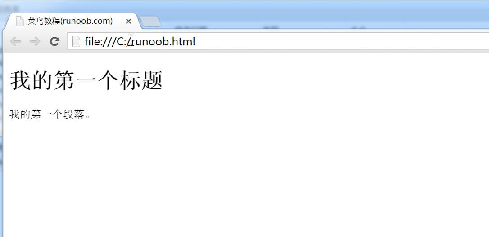
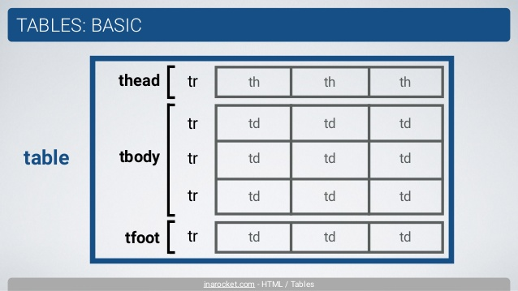
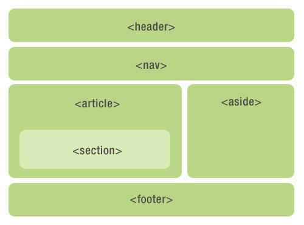

# HTML 教程- (HTML5 标准)

超文本标记语言（英语：HyperText Markup Language，简称：HTML）是一种用于创建网页的标准标记语言。

您可以使用 HTML 来建立自己的 WEB 站点，HTML 运行在浏览器上，由浏览器来解析。

在本教程中，您将学习如何使用 HTML 来创建站点。

HTML 很容易学习！相信您能很快学会它！

## HTML 实例

本教程包含了数百个 HTML 实例。

使用本站的编辑器，您可以轻松实现在线修改 HTML，并查看实例运行结果。

> **注意：**对于中文网页需要使用 **<meta charset="utf-8">** 声明编码，否则会出现乱码。有些浏览器(如 360 浏览器)会设置 GBK 为默认编码，则你需要设置为 **<meta charset="gbk">。**

**实例**

```html
<!DOCTYPE html>
<html>
<head>
<meta charset="utf-8">
<title>菜鸟教程(runoob.com)</title>
</head>
<body>
    <h1>我的第一个标题</h1>
    <p>我的第一个段落。</p>
</body>
</html>
```

[尝试一下 »](https://www.runoob.com/try/try.php?filename=tryhtml_intro)

点击 "尝试一下" 按钮查看在线实例

------

## HTML文档的后缀名

- .html
- .htm

以上两种后缀名没有区别，都可以使用。

[开始学习HTML!](https://www.runoob.com/html/html-intro.html)

## HTML 实例

在 HTML 手册中包含了数百个在线实例，您可以在线编辑并查看运行结果。

[查看 HTML 实例！](https://www.runoob.com/html/html-examples.html)

## HTML 参考手册

在菜鸟教程中，我们提供了完整的 HTML 参考手册，其中包括标签、属性、颜色、实体等等。

[HTML 标签参考手册](https://www.runoob.com/tags/html-reference.html)

## HTML/CSS/JS 在线工具

HTML/CSS/JS 在线工具可以在线编辑 HTML、CSS、JS 代码，并实时查看效果，你也可以将优质代码保存分享：https://c.runoob.com/front-end/61

**注意:**HTML中不支持 空格、回车、制表符，它们都会被解析成一个空白字符。

**实例**

```html
菜     鸟
教程
```

在使用中常常遇到 utf-8 和 utf8，现在终于弄明白他们的使用不同之处了，现在来和大家分享一下，下面我们看一下 utf-8 和 utf8 有什么区别。

"UTF-8" 是标准写法，php 在 Windows 下边英文不区分大小写，所以也可以写成 "utf-8"。"UTF-8" 也可以把中间的"-"省略，写成 "UTF8"。一般程序都能识别，但也有例外（如下文），为了严格一点，最好用标准的大写"UTF-8"。

在数据库中只能使用"utf8"(MySQL) 在MySQL的命令模式中只能使用"utf8"，不能使用"utf-8"，也就是说在PHP程序中只能使用 "set names utf8(不加小横杠)"，如果你加了"-"此行命令将不会生效，但是在 PHP 中 header 时却要加上"-"，因为 IE 不认识没杠的"utf8"，原因见下文。

PHP 中的 header：

```html
<?php header('Content-Type: text/html; charset=UTF-8'); ?> //奇怪了：Content-Type 用冒号，Chatset却是等号。
```

静态文件使用：

总结：【只有在MySQL中可以使用"utf-8"的别名"utf8"，但是在其他地方一律使用大写"UTF-8"。】

具体为：

除了在命令 **"mysql_query(set names utf8)"** 外一律用大写"UTF-8"。

**htm 与 html 的区别**

前者是超文本标记(Hypertext Markup)

后者是超文本标记语言(Hypertext Markup Language)

可以说 htm = html

同时，这两种都是静态网页文件的扩展名，扩展名可以互相更换而不会引起错误（这是指打开而言，但是对于一个链接来说，如果它指向的是一个htm文件，而那个htm文件被更改为html文件，那么是找不到这个链接的）

**那为什么出现两种文件格式呢？**

htm 是来源于老的 8.3 文件格式，DOS 操作系统只能支持长度为三位的后缀名，所以是 htm,但在 windows 下无所谓 HTM 与 HTML，html 是为长文件名的格式命名的。所以 htm 是为了兼容过去的DOS命名格式存在的，在效果上没有区别的。以前 htm 和 html 作为不同的服务器上的超文本文件，但现在通用。

什么是8.3文件格式？ 这是一种在老的16位Win95或Win98文件系统的短文件名文件格式，扩展名只限于3位，文件名只限于8位。 如果要与16位系统交互，比如说，要把一个路径传给一个16位的程序，你就不能用长文件名，而必须对它进行转换。例如把“C ： /MyLongestPath/MyLongerPath/MyFilename.txt”转换成“C ： /Mylong~1/MyLong~2/Myfile~1.txt”

了解这个有什么用？ 在FAT磁盘格式下的DOS中只支持8.3文件格式，如果你要在这个环境下做应用，应该要注意这个文件格式问题。在NTFS下，默认可以兼容这种文件格式，同时也支持长文件名，你也可以通过调整注册表来取消对8.3文件格式也支持。

推荐使用长后缀名 **html** 。

命名应该遵从含义清晰、简洁、一致性原则。含义清晰指见名知义，比如这里的 htm（hypertext markup） 和 html (hypertext markup language) 均采用的是英文单词首字母缩写，含义清晰。简洁要求变量命名尽量简短，比如此处后缀名使用首字母缩写而不使用全单词。一致性原则要求同环境下的大量变量命名符合同样的规则，比如有的朋友习惯于Linux文件夹命名规则后，使用win系统时新建文件夹命名仍拒绝使用空格，这便造成了新文件夹名与旧文件夹名命名规则不一致。

一致性原则往往更为重要。比如合作开发时，不能各守其是，人为提高开发难度。

从一路风尘的笔记中，我们了解到 htm 是历史遗留的8.3字符限制命名方式，而现在我们在命名时并未遵守8.3规则。因此，从 htm 和 html 中选择时，也应该选择无限制长度命名方式的 html 。

总是不知道为什么，每次编程序时，有这么一句话 **<!DOCTYPE html>**。现在我终于明白这是什么意思了!

它是 HTML5 标准网页声明，全称为 Document Type HyperText Mark-up Language，是一条标示语言。支持 HTML5 标准的主流浏览器都认识这个声明。表示网页采用 HTML5，**<!DOCTYPE html>** 声明位于文档中的最前面的位置，处于 <html> 标签之前。此标签可告知浏览器文档使用哪种 HTML 或 XHTML 规范。

# HTML 简介

## HTML 实例

<!DOCTYPE html> <html> <head> <meta charset="utf-8"> <title>菜鸟教程(runoob.com)</title> </head> <body>  <h1>我的第一个标题</h1>  <p>我的第一个段落。</p>  </body> </html>


[尝试一下 »](https://www.runoob.com/try/try.php?filename=tryhtml_intro)

## 实例解析

- **<!DOCTYPE html>** 声明为 HTML5 文档
- **<html>** 元素是 HTML 页面的根元素
- **<head>** 元素包含了文档的元（meta）数据，如 **<meta charset="utf-8">** 定义网页编码格式为 **utf-8**。
- **<title>** 元素描述了文档的标题
- **<body>** 元素包含了可见的页面内容
- **<h1>** 元素定义一个大标题
- **<p>** 元素定义一个段落

**注：**在浏览器的页面上使用键盘上的 F12 按键开启调试模式，就可以看到组成标签。


------

## 什么是HTML?

HTML 是用来描述网页的一种语言。

- HTML 指的是超文本标记语言: **H**yper**T**ext **M**arkup **L**anguage
- HTML 不是一种编程语言，而是一种**标记**语言
- 标记语言是一套**标记标签** (markup tag)
- HTML 使用标记标签来**描述**网页
- HTML 文档包含了HTML **标签**及**文本**内容
- HTML文档也叫做 **web 页面**

------

## HTML 标签

HTML 标记标签通常被称为 HTML 标签 (HTML tag)。

- HTML 标签是由*尖括号*包围的关键词，比如 <html>
- HTML 标签通常是*成对出现*的，比如 <b> 和 </b>
- 标签对中的第一个标签是*开始标签*，第二个标签是*结束标签*
- 开始和结束标签也被称为*开放标签*和*闭合标签*

<标签>内容</标签>


------

## HTML 元素

"HTML 标签" 和 "HTML 元素" 通常都是描述同样的意思.

但是严格来讲, 一个 HTML 元素包含了开始标签与结束标签，如下实例:

HTML 元素:

<p>这是一个段落。</p>


------

## Web 浏览器

Web浏览器（如谷歌浏览器，Internet Explorer，Firefox，Safari）是用于读取HTML文件，并将其作为网页显示。

浏览器并不是直接显示的HTML标签，但可以使用标签来决定如何展现HTML页面的内容给用户：


------

## HTML 网页结构

下面是一个可视化的HTML页面结构：

<html>

<head>

<title>页面标题</title>

</head>

<body>

<h1>这是一个标题</h1>

<p>这是一个段落。</p>

<p>这是另外一个段落。</p>

</body>

</html>


|  | 只有 <body> 区域 (白色部分) 才会在浏览器中显示。 |
| --------------------- | ------------------------------------------------ |
|                       |                                                  |


------

## HTML版本

从初期的网络诞生后，已经出现了许多HTML版本:

| 版本      | 发布时间 |
| :-------- | :------- |
| HTML      | 1991     |
| HTML+     | 1993     |
| HTML 2.0  | 1995     |
| HTML 3.2  | 1997     |
| HTML 4.01 | 1999     |
| XHTML 1.0 | 2000     |
| HTML5     | 2012     |
| XHTML5    | 2013     |


------

## <!DOCTYPE> 声明

<!DOCTYPE>声明有助于浏览器中正确显示网页。

网络上有很多不同的文件，如果能够正确声明HTML的版本，浏览器就能正确显示网页内容。

doctype 声明是不区分大小写的，以下方式均可：

<!DOCTYPE html>

<!DOCTYPE HTML>

<!doctype html>

<!Doctype Html>

------

## 通用声明

### HTML5

<!DOCTYPE html>

### HTML 4.01

<!DOCTYPE HTML PUBLIC "-//W3C//DTD HTML 4.01 Transitional//EN"
"http://www.w3.org/TR/html4/loose.dtd">

### XHTML 1.0

<!DOCTYPE html PUBLIC "-//W3C//DTD XHTML 1.0 Transitional//EN"
"http://www.w3.org/TR/xhtml1/DTD/xhtml1-transitional.dtd">

查看完整网页声明类型 [DOCTYPE 参考手册](https://www.runoob.com/tags/tag-doctype.html)。

------

## 中文编码

目前在大部分浏览器中，直接输出中文会出现中文乱码的情况，这时候我们就需要在头部将字符声明为 UTF-8 或 GBK。

## HTML 实例

<!DOCTYPE html> <html> <head> <meta charset="UTF-8"> <title> 页面标题</title> </head> <body>  <h1>我的第一个标题</h1>  <p>我的第一个段落。</p>  </body> </html>


[尝试一下 »](https://www.runoob.com/try/try.php?filename=tryhtml_intro_utf8)

\1. doctype 声明是不区分大小写的，用来告知 Web 浏览器页面使用了哪种 HTML 版本。

在HTML 4.01 中，<!DOCTYPE> 声明需引用 DTD （文档类型声明），因为 HTML 4.01 是基于 SGML（Standard Generalized Markup Language 标准通用标记语言）。

HTML 4.01 规定了三种不同的 <!DOCTYPE> 声明，分别是：Strict、Transitional 和 Frameset。

HTML5 不是基于 SGML，因此不要求引用 DTD。

\2. 对于中文网页需要使用 <meta charset="utf-8"> 声明编码，否则会出现乱码。有些浏览器(如 360 浏览器)会设置 GBK 为默认编码，则你需要设置为 <meta charset="gbk">。

目前在大部分浏览器中，直接输出中文会出现中文乱码的情况，这时候需要在头部将字符声明为 UTF-8。

# HTML 编辑器

------

## HTML 编辑器推荐

可以使用专业的 HTML 编辑器来编辑 HTML，菜鸟教程为大家推荐几款常用的编辑器：

- VS Code：https://code.visualstudio.com/
- Sublime Text：http://www.sublimetext.com/

你可以从以上软件的官网中下载对应的软件，按步骤安装即可。

接下来我们将为大家演示如何使用 VS Code 工具来创建 HTML 文件。

------

## VS Code

Visual Studio Code（简称 VS Code）是一个由微软开发，同时支持 Windows 、 Linux 和 macOS 等操作系统且开放源代码的代码编辑器，编辑器中内置了扩展程序管理的功能。

### 步骤 1: 新建 HTML 文件

在 VS Code 安装完成后，选择" 文件(F)->新建文件(N) "，在新建的文件中输入以下代码：

<!DOCTYPE html> <html> <head> <meta charset="utf-8"> <title>菜鸟教程(runoob.com)</title> </head> <body>  <h1>我的第一个标题</h1>  <p>我的第一个段落。</p>  </body> </html>


### 步骤 2: 另存为 HTML 文件

然后选择" 文件(F)->另存为(A) "，文件名为 runoob.html:


当您保存 HTML 文件时，既可以使用 **.htm** 也可以使用 **.html** 扩展名。两者没有区别，完全根据您的喜好，我建议统一用 **.html**。

在一个容易记忆的文件夹中保存这个文件，比如 **runoob**

### 步骤 3: 在浏览器中运行这个 HTML 文件

然后鼠标右击编辑器上的文件名，选择在默认浏览器打开（也可以其他的浏览器）:



运行显示结果类似如下:



> VS Code 和 Sublime Text 还可以配合 Emmet 插件来提高编码速度。
>
> Emmet 官网：http://emmet.io/

每一种操作系统都带有简单的文本编辑器：

-  Windows 用户可以使用记事本；
-  Linux 用户可以选择几种不同的文本编辑器，如 vi、vim 或者 emacs ；
-  Mac 用户可以使用 OS X 预装的 TextEdit。

# HTML 基础- 4个实例

------

不要担心本章中您还没有学过的例子。

您将在下面的章节中学到它们。

------

## HTML 标题

HTML 标题（Heading）是通过<h1> - <h6> 标签来定义的。

## 实例

<h1>这是一个标题</h1> <h2>这是一个标题</h2> <h3>这是一个标题</h3>


[尝试一下 »](https://www.runoob.com/try/try.php?filename=tryhtml_headers)


------

## HTML 段落

HTML 段落是通过标签 <p> 来定义的。

## 实例

<p>这是一个段落。</p> <p>这是另外一个段落。</p>


[尝试一下 »](https://www.runoob.com/try/try.php?filename=tryhtml_paragraphs1)


------

## HTML 链接

HTML 链接是通过标签 <a> 来定义的。

## 实例

<a href="https://www.runoob.com">这是一个链接</a>


[尝试一下 »](https://www.runoob.com/try/try.php?filename=tryhtml_basic_link)

**提示:**在 href 属性中指定链接的地址。

(您将在本教程稍后的章节中学习更多有关属性的知识)。

------

## HTML 图像

HTML 图像是通过标签  来定义的.

## 实例


[尝试一下 »](https://www.runoob.com/try/try.php?filename=tryhtml_basic_img)

**注意：** 图像的名称和尺寸是以属性的形式提供的。


1、***.html** 文件跟 ***.jpg** 文件(f盘)在不同目录下：

```

```

2、***.html** 文件跟 ***.jpg** 图片在相同目录下：

```

```

3、***.html** 文件跟 ***.jpg** 图片在不同目录下：

a、图片 ***.jpg** 在 **image** 文件夹中，*.html 跟 **image** 在同一目录下：

```

```

b、图片 ***.jpg** 在 **image** 文件夹中，***.html** 在 **connage** 文件夹中，**image** 跟 **connage** 在同一目录下：

```

```

4、如果图片来源于网络，那么写绝对路径：

```

```

**HTML 中 href、src 区别**

href 是 Hypertext Reference 的缩写，表示超文本引用。用来建立当前元素和文档之间的链接。常用的有：link、a。例如：

```
<link href="reset.css" rel=”stylesheet“/>
```

浏览器会识别该文档为 css 文档，并行下载该文档，并且不会停止对当前文档的处理。这也是建议使用 link，而不采用 @import 加载 css 的原因。 src 是 source 的缩写，src 的内容是页面必不可少的一部分，是引入。src 指向的内容会嵌入到文档中当前标签所在的位置。常用的有：img、script、iframe。例如:

```
<script src="script.js"></script>
```

当浏览器解析到该元素时，会暂停浏览器的渲染，直到该资源加载完毕。这也是将js脚本放在底部而不是头部得原因。

简而言之，src 用于替换当前元素；href 用于在当前文档和引用资源之间建立联系。

**HTML 中的 href 和 src 有什么区别**

**href** 表示超文本引用（hypertext reference），在 link和a 等元素上使用。src 表示来源地址，在 img、script、iframe 等元素上。

**src** 的内容，是页面必不可少的一部分，是引入。href 的内容，是与该页面有关联，是引用。区别就是，引入和引用。

**MacOS 如何加载图片以及文件目录有空格**

MacOS 是没有硬盘分区的，所以引用文件直接：

```

```

假设文件目录有空格，直接将空格换成：

```
%20
```

如下:

```

```

记录一下 html 相对路径的写法：

-  **./**：代表文件所在的目录（可以省略不写）如果写成image/background就相当于是在html文件下找image文件夹，当然是找不到的
-  **../**：代表文件所在的父级目录
-  **../../**：代表文件所在的父级目录的父级目录
-  **/**：代表文件所在的根目录

# HTML 元素

------

HTML 文档由 HTML 元素定义。

------

## HTML 元素

| 开始标签 *             | 元素内容     | 结束标签 * |
| :--------------------- | :----------- | :--------- |
| <p>                    | 这是一个段落 | </p>       |
| <a href="default.htm"> | 这是一个链接 | </a>       |
| <br>                   | 换行         |            |

*****开始标签常被称为**起始标签（opening tag）**，结束标签常称为**闭合标签（closing tag）**。

------

## HTML 元素语法

- HTML 元素以**开始标签**起始
- HTML 元素以**结束标签**终止
- **元素的内容**是开始标签与结束标签之间的内容
- 某些 HTML 元素具有**空内容（empty content）**
- 空元素**在开始标签中进行关闭**（以开始标签的结束而结束）
- 大多数 HTML 元素可拥有**属性**

**注释:** 您将在本教程的下一章中学习更多有关属性的内容。

------

## 嵌套的 HTML 元素

大多数 HTML 元素可以嵌套（HTML 元素可以包含其他 HTML 元素）。

HTML 文档由相互嵌套的 HTML 元素构成。

------

## HTML 文档实例

<!DOCTYPE html>
<html>

<body>
<p>这是第一个段落。</p>
</body>

</html>

以上实例包含了三个 HTML 元素。

------

## HTML 实例解析

<p> 元素:

<p>这是第一个段落。</p>

这个 <p> 元素定义了 HTML 文档中的一个段落。
这个元素拥有一个开始标签 <p> 以及一个结束标签 </p>.
元素内容是: 这是第一个段落。

**<body> 元素:**

<body>
<p>这是第一个段落。</p>
</body>

<body> 元素定义了 HTML 文档的主体。
这个元素拥有一个开始标签 <body> 以及一个结束标签 </body>。
元素内容是另一个 HTML 元素（p 元素）。

**<html> 元素：**

<html>

<body>
<p>这是第一个段落。</p>
</body>

</html>

<html> 元素定义了整个 HTML 文档。
这个元素拥有一个开始标签 <html> ，以及一个结束标签 </html>.
元素内容是另一个 HTML 元素（body 元素）。

------

## 不要忘记结束标签

即使您忘记了使用结束标签，大多数浏览器也会正确地显示 HTML：

<p>这是一个段落<p>这是一个段落

以上实例在浏览器中也能正常显示，因为关闭标签是可选的。

但不要依赖这种做法。忘记使用结束标签会产生不可预料的结果或错误。

------

## HTML 空元素

没有内容的 HTML 元素被称为空元素。空元素是在开始标签中关闭的。

<br> 就是没有关闭标签的空元素（<br> 标签定义换行）。

在 XHTML、XML 以及未来版本的 HTML 中，所有元素都必须被关闭。

在开始标签中添加斜杠，比如 <br />，是关闭空元素的正确方法，HTML、XHTML 和 XML 都接受这种方式。

即使 <br> 在所有浏览器中都是有效的，但使用 <br /> 其实是更长远的保障。

------

## HTML 提示：使用小写标签

HTML 标签对大小写不敏感：<P> 等同于 <p>。许多网站都使用大写的 HTML 标签。

菜鸟教程使用的是小写标签，因为万维网联盟（W3C）在 HTML 4 中**推荐**使用小写，而在未来 (X)HTML 版本中**强制**使用小写。

\1. 一些标签的使用，切记所有标签都需要闭合，不管是单体标签还是成对标签。（尽管目前浏览器是识别有些标签不闭合的情况，但是取的最好的保证兼容性，使用闭合）

\2. 标签写法要用小写字母（有些版本对大小写可认为相同，而xhtml中强制使用小写）

# HTML 属性

------

属性是 HTML 元素提供的附加信息。

------

## HTML 属性

- HTML 元素可以设置**属性**
- 属性可以在元素中添加**附加信息**
- 属性一般描述于**开始标签**
- 属性总是以名称/值对的形式出现，**比如：name="value"**。

------

## 属性实例

HTML 链接由 <a> 标签定义。链接的地址在 **href 属性**中指定：

## 实例

<a href="http://www.runoob.com">这是一个链接</a>


[尝试一下 »](https://www.runoob.com/try/try.php?filename=tryhtml_basic_link)


------

## HTML 属性常用引用属性值

属性值应该始终被包括在引号内。

双引号是最常用的，不过使用单引号也没有问题。

**提示:** 在某些个别的情况下，比如属性值本身就含有双引号，那么您必须使用单引号，例如：name='John "ShotGun" Nelson'

------

## HTML 提示：使用小写属性

属性和属性值对大小写不敏感。

不过，万维网联盟在其 HTML 4 推荐标准中推荐小写的属性/属性值。

而新版本的 (X)HTML 要求使用小写属性。

------

## HTML 属性参考手册

查看完整的HTML属性列表: [HTML 标签参考手册](https://www.runoob.com/tags/html-reference.html)。

下面列出了适用于大多数 HTML 元素的属性：

| 属性  | 描述                                                         |
| :---- | :----------------------------------------------------------- |
| class | 为html元素定义一个或多个类名（classname）(类名从样式文件引入) |
| id    | 定义元素的唯一id                                             |
| style | 规定元素的行内样式（inline style）                           |
| title | 描述了元素的额外信息 (作为工具条使用)                        |

更多标准属性说明： [HTML 标准属性参考手册](https://www.runoob.com/tags/ref-standardattributes.html).


- 属性和属性值，尽量小写，本来这样做也方便些。
- class 属性可以多用 **class=" "** （引号里面可以填入多个class属性）
- id 属性只能单独设置 **id=" "**（只能填写一个，多个无效）


# HTML 标题

------

在 HTML 文档中，标题很重要。

------

## HTML 标题

标题（Heading）是通过 <h1> - <h6> 标签进行定义的。

<h1> 定义最大的标题。 <h6> 定义最小的标题。

## 实例

<h1>这是一个标题。</h1> <h2>这是一个标题。</h2> <h3>这是一个标题。</h3>


[尝试一下 »](https://www.runoob.com/try/try.php?filename=tryhtml_headers)

**注释:** 浏览器会自动地在标题的前后添加空行。

------

## 标题很重要

请确保将 HTML 标题 标签只用于标题。不要仅仅是为了生成**粗体**或**大号**的文本而使用标题。

搜索引擎使用标题为您的网页的结构和内容编制索引。

因为用户可以通过标题来快速浏览您的网页，所以用标题来呈现文档结构是很重要的。

应该将 h1 用作主标题（最重要的），其后是 h2（次重要的），再其次是 h3，以此类推。

------

## HTML 水平线

<hr> 标签在 HTML 页面中创建水平线。

hr 元素可用于分隔内容。

## 实例

<p>这是一个段落。</p> <hr> <p>这是一个段落。</p> <hr> <p>这是一个段落。</p>


[尝试一下 »](https://www.runoob.com/try/try.php?filename=tryhtml_hr)


------

## HTML 注释

可以将注释插入 HTML 代码中，这样可以提高其可读性，使代码更易被人理解。浏览器会忽略注释，也不会显示它们。

注释写法如下:

## 实例

<!-- 这是一个注释 -->


[尝试一下 »](https://www.runoob.com/try/try.php?filename=tryhtml_comment)

**注释:** 开始括号之后（左边的括号）需要紧跟一个叹号，结束括号之前（右边的括号）不需要，合理地使用注释可以对未来的代码编辑工作产生帮助。

------

## HTML 提示 - 如何查看源代码

你是否看过一些网页然后惊叹它是如何实现的。

如果您想找到其中的奥秘，只需要单击右键，然后选择"查看源文件"（IE）或"查看页面源代码"（Firefox），其他浏览器的做法也是类似的。这么做会打开一个包含页面 HTML 代码的窗口。

------


## 本站实例

[标题](https://www.runoob.com/try/try.php?filename=tryhtml_headers)
如何在 HTML 文档中显示标题。

[隐藏注释](https://www.runoob.com/try/try.php?filename=tryhtml_comment)
如何在 HTML 源代码中插入注释。

[水平线](https://www.runoob.com/try/try.php?filename=tryhtml_hr)
如何插入水平线。

------

## HTML 标签参考手册

菜鸟教程的标签参考手册提供了有关这些标题及其属性的更多信息。

您将在本教程下面的章节中学到更多有关 HTML 标签和属性的知识。

| 标签                                             | 描述           |
| :----------------------------------------------- | :------------- |
| [](https://www.runoob.com/tags/tag-html.html)    | 定义 HTML 文档 |
| [](https://www.runoob.com/tags/tag-body.html)    | 定义文档的主体 |
| [ - ](https://www.runoob.com/tags/tag-hn.html)   | 定义 HTML 标题 |
| [](https://www.runoob.com/tags/tag-hr.html)      | 定义水平线     |
| [](https://www.runoob.com/tags/tag-comment.html) | 定义注释       |

## 标题大小与字体大小的关系

1到6号标题与1到6号字体逆序对应，比如1号字体对应6号标题，2号字体对应5号标题。

```
<h1>这是1号标题</h1>
<font size="6">这是6号字体文本</font>

<h2>这是2号标题</h2>
<font size="5">这是5号字体文本</font>

<h3>这是3号标题</h3>
<font size="4">这是4号字体文本</font>

<h4>这是4号标题</h4>
<font size="3">这是3号字体文本</font>

<h5>这是5号标题</h5>
<font size="2">这是2号字体文本</font>

<h6>这是6号标题</h6>
<font size="1">这是1号字体文本</font>
```

# HTML 段落

------

HTML 可以将文档分割为若干段落。

------

## HTML 段落

段落是通过 <p> 标签定义的。

## 实例

<p>这是一个段落 </p> <p>这是另一个段落</p>


[尝试一下 »](https://www.runoob.com/try/try.php?filename=tryhtml_paragraphs1)

**注意：**浏览器会自动地在段落的前后添加空行。（</p> 是块级元素）

------

## 不要忘记结束标签

即使忘了使用结束标签，大多数浏览器也会正确地将 HTML 显示出来：

## 实例

<p>这是一个段落 <p>这是另一个段落


[尝试一下 »](https://www.runoob.com/try/try.php?filename=tryhtml_paragraphs0)

上面的例子在大多数浏览器中都没问题，但不要依赖这种做法。忘记使用结束标签会产生意想不到的结果和错误。

**注释:** 在未来的 HTML 版本中，不允许省略结束标签。

------

## HTML 折行

如果您希望在不产生一个新段落的情况下进行换行（新行），请使用 **<br>** 标签：

## 实例

<p>这个<br>段落<br>演示了分行的效果</p>


[尝试一下 »](https://www.runoob.com/try/try.php?filename=tryhtml_paragraphs)

<br /> 元素是一个空的 HTML 元素。由于关闭标签没有任何意义，因此它没有结束标签。

------

## HTML 输出- 使用提醒

我们无法确定 HTML 被显示的确切效果。屏幕的大小，以及对窗口的调整都可能导致不同的结果。

对于 HTML，您无法通过在 HTML 代码中添加额外的空格或换行来改变输出的效果。

当显示页面时，浏览器会移除源代码中多余的空格和空行。所有连续的空格或空行都会被算作一个空格。需要注意的是，HTML 代码中的所有连续的空行（换行）也被显示为一个空格。

[尝试一下](https://www.runoob.com/try/try.php?filename=tryhtml_poem)

（这个例子演示了一些 HTML 格式化方面的问题）

------


## 本站实例

[HTML 段落](https://www.runoob.com/try/try.php?filename=tryhtml_paragraphs1)
如何在浏览器中显示 HTML 段落。

[换行](https://www.runoob.com/try/try.php?filename=tryhtml_paragraphs)
在 HTML 文档中使用换行。

[在 HTML 代码中的排版一首唐诗](https://www.runoob.com/try/try.php?filename=tryhtml_poem)
浏览器在显示 HTML 时，会省略源代码中多余的空白字符（空格或回车等）。

## 更多实例

[更多段落](https://www.runoob.com/try/try.php?filename=tryhtml_paragraphs2)
段落的默认行为。

------

## HTML 标签参考手册

菜鸟教程的标签参考手册提供了有关 HTML 元素及其属性的更多信息。

| 标签                                        | 描述                 |
| :------------------------------------------ | :------------------- |
| [](https://www.runoob.com/tags/tag-p.html)  | 定义一个段落         |
| [](https://www.runoob.com/tags/tag-br.html) | 插入单个折行（换行） |

**区分一下： <br>, <br/> 以及 <br />（带有空格）**

**<br>** 是 HTML 写法。**
**是 XHTML1.1 的写法, 也是 XML 写法。**<br/>** 是 XHTML 为兼容 HTML 的写法,也是 XML 写法。HTML5 因为兼容 XHTML，所以三种写法都可以使用。

早期发布的 HTML 规范当中，<br> 与  等元素是不用封闭自身的，但是这种元素造成了 HTML 规范的不严谨，于是在之后发布的 XHTML 语言中，参考了更为严谨的 XML 规范，在这些不用自身封闭的元素后加 **/** 来表示自行封闭，在逻辑上来讲等同于<br>....</br>（但是没有 **</br>** 这种写法），这样一来保证了较少的代码量，二来保证了规范的严谨。


# HTML 文本格式化


## HTML 文本格式化

**加粗文本**

*斜体文本*

```
电脑自动输出
```

这是 下标 和 上标


[尝试一下 »](https://www.runoob.com/try/try.php?filename=tryhtml_formatting)

------

## HTML 格式化标签

HTML 使用标签 <b>("bold") 与 <i>("italic") 对输出的文本进行格式, 如：**粗体** or *斜体*

这些HTML标签被称为格式化标签（请查看底部完整标签参考手册）。

|  | **通常标签 <strong> 替换加粗标签 <b> 来使用, <em> 替换 <i>标签使用。**  然而，这些标签的含义是不同的：  <b> 与<i> 定义粗体或斜体文本。  <strong> 或者 <em>意味着你要呈现的文本是重要的，所以要突出显示。现今所有主要浏览器都能渲染各种效果的字体。不过，未来浏览器可能会支持更好的渲染效果。 |
| ----------------------- | ------------------------------------------------------------ |
|                         |                                                              |


------


## 在线实例

[文本格式化](https://www.runoob.com/try/try.php?filename=tryhtml_formattingch)
此例演示如何在一个 HTML 文件中对文本进行格式化

[预格式文本](https://www.runoob.com/try/try.php?filename=tryhtml_pre)
此例演示如何使用 pre 标签对空行和空格进行控制。

["计算机输出"标签](https://www.runoob.com/try/try.php?filename=tryhtml_computeroutput)
此例演示不同的"计算机输出"标签的显示效果。

[地址](https://www.runoob.com/try/try.php?filename=tryhtml_address)
此例演示如何在 HTML 文件中写地址。

[缩写和首字母缩写](https://www.runoob.com/try/try.php?filename=tryhtml_abbr)
此例演示如何实现缩写或首字母缩写。

[文字方向](https://www.runoob.com/try/try.php?filename=tryhtml_bdo)
此例演示如何改变文字的方向。

[块引用](https://www.runoob.com/try/try.php?filename=tryhtml_q)
此例演示如何实现长短不一的引用语。

[删除字效果和插入字效果](https://www.runoob.com/try/try.php?filename=tryhtml_del)
此例演示如何标记删除文本和插入文本。

------

## HTML 文本格式化标签

| 标签                                                | 描述         |
| :-------------------------------------------------- | :----------- |
| [](https://www.runoob.com/tags/tag-b.html)          | 定义粗体文本 |
| [](https://www.runoob.com/tags/tag-em.html)         | 定义着重文字 |
| [](https://www.runoob.com/tags/tag-i.html)          | 定义斜体字   |
| [](https://www.runoob.com/tags/tag-small.html)      | 定义小号字   |
| [](https://www.runoob.com/tags/tag-strong.html)     | 定义加重语气 |
| [](https://www.runoob.com/tags/tag-sub.html)        | 定义下标字   |
| [](https://www.runoob.com/html/m/tags/tag-sup.html) | 定义上标字   |
| [](https://www.runoob.com/tags/tag-ins.html)        | 定义插入字   |
| [](https://www.runoob.com/tags/tag-del.html)        | 定义删除字   |

## HTML "计算机输出" 标签

| 标签                                          | 描述               |
| :-------------------------------------------- | :----------------- |
| [](https://www.runoob.com/tags/tag-code.html) | 定义计算机代码     |
| [](https://www.runoob.com/tags/tag-kbd.html)  | 定义键盘码         |
| [](https://www.runoob.com/tags/tag-samp.html) | 定义计算机代码样本 |
| [](https://www.runoob.com/tags/tag-var.html)  | 定义变量           |
| [](https://www.runoob.com/tags/tag-pre.html)  | 定义预格式文本     |

## HTML 引文, 引用, 及标签定义

| 标签                                                | 描述               |
| :-------------------------------------------------- | :----------------- |
| [](https://www.runoob.com/tags/tag-abbr.html)       | 定义缩写           |
| [](https://www.runoob.com/tags/tag-address.html)    | 定义地址           |
| [](https://www.runoob.com/tags/tag-bdo.html)        | 定义文字方向       |
| [](https://www.runoob.com/tags/tag-blockquote.html) | 定义长的引用       |
| [](https://www.runoob.com/tags/tag-q.html)          | 定义短的引用语     |
| [](https://www.runoob.com/tags/tag-cite.html)       | 定义引用、引证     |
| [](https://www.runoob.com/tags/tag-dfn.html)        | 定义一个定义项目。 |

文本显示为单行，超过部分隐藏并使用省略号，实例:

```
overflow:hidden;
text-overflow:ellipsis;
white-space:nowrap;
```

[尝试一下 »](https://c.runoob.com/codedemo/2808)

使用 display:-webkit-box; 让文本显示为多行(只有-webkit内核才有作用)，实例:

```
overflow:hidden;
text-overflow:ellipsis;
display:-webkit-box;
-webkit-line-clamp: 2;
-webkit-box-orient:vertical;
width:100px;
```

[尝试一下 »](https://c.runoob.com/codedemo/2809)


**关于 <b> 和 <strong>**

在显示上，这两个标签都可是加粗文本，呢么为什么会有两个功能"相同"的标签呢？而且好像 strong 并非个例。

-  首先，这两个并非完全相同。比如，如果使用网页阅读器阅读网页（盲人使用），strong 会重读，b 则不会。
-  其次，从起源上来说，strong 是为了在未来建设语义网而诞生的。应该知道的是，html 是负责显示的标记，不能表示语义。也就是说，浏览器知道这个标签如何显示，而不知道标签所标记的内容应该是什么含义。而 strong 在语义上走出了第一步。


**1、<em> 把文本定义为强调的内容**

**<em>** 标签告诉浏览器把其中的文本表示为强调的内容。对于所有浏览器来说，这意味着要把这段文字用斜体来显示。

尽管现在 **<em>** 标签修饰的内容都是用斜体字来显示，但这些内容也具有更广泛的含义，将来的某一天，浏览器也可能会使用其他的特殊效果来显示强调的文本。如果你只想使用斜体字来显示文本的话，请使用 **<i>** 标签。除此之外，文档中还可以包括用来改变文本显示的级联样式定义。

**2、<i>显示斜体文本效果**

**<i>** 标签和基于内容的样式标签 **<em>** 类似。它告诉浏览器将包含其中的文本以斜体字（italic）或者倾斜（oblique）字体显示。如果这种斜体字对该浏览器不可用的话，可以使用高亮、反白或加下划线等样式。

**3、<dfn>定义一个定义项目**

**<dfn>** 标签可标记那些对特殊术语或短语的定义。

现在流行的浏览器通常用斜体来显示 **<dfn>** 中的文本。将来，**<dfn>** 还可能有助于创建文档的索引或术语表。

与其他许多基于内容的样式和物理样式标签一样，**<dfn>** 标签尽量少用为妙。

也就是说它们要实现的目的不同，但都用同样的表现方式，就是斜体。


关于<abbr>和<acronym>:

都是表示缩略词的标签

不同点：

abbr：表示全词的缩写；

acronym：表示标记一个首字母缩写；

PS:其实看起来的效果都一样，只是内在表达的不一样而已，所以看不出什么区别，重点是现在acronym已经淘汰不用了，所以尽量改用abbr就好

**HTML 要素中的 b、em、strong 有什么区别？**

应该说，在默认的 HTML 样式表定义中，**b** 和 **strong** 的样式一样，为 **{ font-weight: bolder }** 而 **em** 的默认样式为 **{ font-style: italic }**，与 **i** 相同。

在 HTML 4 中，**em** 表示 emphasized text，**strong** 表示 strong emphasized text，故 strong 的强度要更强。而在 HTML 5 中，**strong** 的定义改成了 important text。当然 emphasized 和 strong emphasized 乃至 important 之间怎么界定很模糊，关键是在自己编写 HTML 代码的时候保持使用上一致。b 和 i 仅仅表示「这里应该用粗体显示」或者「这里应该用斜体显示」。

所有标签缩写的全称：

<b>---bold

<em>---emphasize

<i>---italic

<sub>---subscript

<sup>---superscript

<ins>---insert

<del>---delete

<kbd>---keyboard

<bdo>---Bi-Directional Override

<q>---quate

<dfn>---define


# HTML 链接

------

HTML 使用超级链接与网络上的另一个文档相连。几乎可以在所有的网页中找到链接。点击链接可以从一张页面跳转到另一张页面。

------


## 尝试一下 - 实例

[HTML 链接](https://www.runoob.com/try/try.php?filename=tryhtml_links)
如何在HTML文档中创建链接。

(可以在本页底端找到更多实例)

------

## HTML 超链接（链接）

HTML使用标签 <a>来设置超文本链接。

超链接可以是一个字，一个词，或者一组词，也可以是一幅图像，您可以点击这些内容来跳转到新的文档或者当前文档中的某个部分。

当您把鼠标指针移动到网页中的某个链接上时，箭头会变为一只小手。

在标签<a> 中使用了href属性来描述链接的地址。

默认情况下，链接将以以下形式出现在浏览器中：

- 一个未访问过的链接显示为蓝色字体并带有下划线。
- 访问过的链接显示为紫色并带有下划线。
- 点击链接时，链接显示为红色并带有下划线。

> 注意：如果为这些超链接设置了 CSS 样式，展示样式会根据 CSS 的设定而显示。

------

## HTML 链接语法

链接的 HTML 代码很简单。它类似这样：

<a href="url">链接文本</a>

href 属性描述了链接的目标。.

## 实例

<a href="https://www.runoob.com/">访问菜鸟教程</a>

上面这行代码显示为：[访问菜鸟教程](https://www.runoob.com/)

点击这个超链接会把用户带到菜鸟教程的首页。

**提示:** *"链接文本"* 不必一定是文本。图片或其他 HTML 元素都可以成为链接。

------

## HTML 链接 - target 属性

使用 target 属性，你可以定义被链接的文档在何处显示。

下面的这行会在新窗口打开文档：

## 实例

<a href="https://www.runoob.com/" target="_blank" rel="noopener noreferrer">访问菜鸟教程!</a>


[尝试一下 »](https://www.runoob.com/try/try.php?filename=tryhtml_link_target)


------

## HTML 链接- id 属性

id属性可用于创建在一个HTML文档书签标记。

**提示:** 书签是不以任何特殊的方式显示，在HTML文档中是不显示的，所以对于读者来说是隐藏的。

## 实例

在HTML文档中插入ID:

<a id="tips">有用的提示部分</a>

在HTML文档中创建一个链接到"有用的提示部分(id="tips"）"：

<a href="#tips">访问有用的提示部分</a>

或者，从另一个页面创建一个链接到"有用的提示部分(id="tips"）"：

<a href="https://www.runoob.com/html/html-links.html#tips">访问有用的提示部分</a>


------

## 基本的注意事项 - 有用的提示

**注释：** 请始终将正斜杠添加到子文件夹。假如这样书写链接：href="https://www.runoob.com/html"，就会向服务器产生两次 HTTP 请求。这是因为服务器会添加正斜杠到这个地址，然后创建一个新的请求，就像这样：href="https://www.runoob.com/html/"。

------


## 更多实例

[图片链接](https://www.runoob.com/try/try.php?filename=tryhtml_imglink)
如何使用图片链接。

[在当前页面链接到指定位置](https://www.runoob.com/try/try.php?filename=tryhtml_link_locations&basepath=0)
如何使用书签

[跳出框架](https://www.runoob.com/try/try.php?filename=tryhtml_frame_getfree)
本例演示如何跳出框架，假如你的页面被固定在框架之内。

[创建电子邮件链接](https://www.runoob.com/try/try.php?filename=tryhtml_mailto)
本例演示如何链接到一个邮件。（本例在安装邮件客户端程序后才能工作。）

[创建电子邮件链接 2](https://www.runoob.com/try/try.php?filename=tryhtml_mailto2)
本例演示更加复杂的邮件链接。

------

## HTML 链接标签

| 标签                                       | 描述             |
| :----------------------------------------- | :--------------- |
| [](https://www.runoob.com/tags/tag-a.html) | 定义一个超级链接 |

**关于创建电子邮件链接时如何发送邮件内容**

在进行邮件内容发送时，需要使用关键字：**mailto**

示例如下：

```
<a href="mailto:zhangrr601@163.com?subject=这是邮件的主题&body=这是邮件的内容" rel="nofollow">发送邮件</a>
```

[尝试一下 »](https://c.runoob.com/codedemo/5346)

这样会调启系统默认的邮件程序发送给 zhangrr601@163.com，并且收件人那里已经填上了我邮箱的地址。

关于创建电子邮件链接时如何进行抄送，密送.

在进行抄送时，需要使用关键字：**cc**

在进行密送时，需要使用关键字：**bcc**

示例如下：

```
<a href="mailto:zhangrr601@163.com?cc=someone@163.com&bcc=somebody@163.com" rel="nofollow">发送邮件</a>
```

[尝试一下 »](https://c.runoob.com/codedemo/5346)

参数说明：

| 参数                    | 描述             |
| :---------------------- | :--------------- |
| mailto:*name@email.com* | 邮件接收地址     |
| cc=*name@email.com*     | 抄送地址         |
| bcc=*name@email.com*    | 密件抄送地址     |
| subject=*subject text*  | 邮件主题         |
| body=*body text*        | 邮件内容         |
| ?                       | 第一个参数分隔符 |
| &                       | 其他参数分隔符   |

注：多个邮件地址用 **;** 隔开，空格用 **%20** 代替。

**抄送：**

英文名称：Carbon Copy，又简称为 CC。在网络术语中，抄送就是将邮件同时发送给收信人以外的人，用户所写的邮件抄送一份给别人，对方可以看见该用户的 E-mail。同收件人地址栏一样，不可以超过 1024 个字符。一般来说，使用"抄送"服务时，多人抄送的电子邮件地址使用 **;** 分隔。

**密件抄送：**

英文名称：Blind Carbon Copy ，又称“盲抄送”，和抄送的唯一区别就是它能够让各个收件人无法查看到这封邮件同时还发送给了哪些人。密件抄送是个很实用的功能，假如一次向成百上千位收件人发送邮件，最好采用密件抄送方式，这样一来可以保护各个收件人的地址不被其他人轻易获得，二来可以使收件人节省下收取大量抄送的 E-mail 地址的时间。

nofollow 是 HTML 页面中 a 标签的属性值。这个标签的意义是告诉搜索引擎"不要追踪此网页上的链接或不要追踪此特定链接"。

nofollow 是 HTML 页面中 a 标签的属性值。它的出现为网站管理员提供了一种方式，即告诉搜索引擎"不要追踪此网页上的链接"或"不要追踪此特定链接"。这个标签的意义是告诉搜索引擎这个链接不是经过作者信任的，所以这个链接不是一个信任票。

```
<a href="http://www.runoob.com/" target="_blank" rel="noopener noreferrer">访问菜鸟教程!</a> 
```

后面最好加上：

```
rel="noopener noreferrer"
```

意思是不会打开其他的网站，因为恶意病毒可能会修改你的浏览器空白页地址。

# HTML <head>

------


## 查看在线实例

[ - 定义了HTML文档的标题](https://www.runoob.com/try/try.php?filename=tryhtml_title)
使用 <title> 标签定义HTML文档的标题

[ - 定义了所有链接的URL](https://www.runoob.com/try/try.php?filename=tryhtml_base)
使用 <base> 定义页面中所有链接默认的链接目标地址。

<meta> - 提供了HTML文档的meta标记使用 <meta> 元素来描述HTML文档的描述，关键词，作者，字符集等。

------

## HTML <head> 元素

<head> 元素包含了所有的头部标签元素。在 <head>元素中你可以插入脚本（scripts）, 样式文件（CSS），及各种meta信息。

可以添加在头部区域的元素标签为: <title>, <style>, <meta>, <link>, <script>, <noscript> 和 <base>。

------

## HTML <title> 元素

<title> 标签定义了不同文档的标题。

<title> 在 HTML/XHTML 文档中是必须的。

<title> 元素:

- 定义了浏览器工具栏的标题
- 当网页添加到收藏夹时，显示在收藏夹中的标题
- 显示在搜索引擎结果页面的标题

一个简单的 HTML 文档:

## 实例

<!DOCTYPE html> <html> <head>  <meta charset="utf-8">  <title>文档标题</title> </head>  <body> 文档内容...... </body>  </html>


------

## HTML <base> 元素

<base> 标签描述了基本的链接地址/链接目标，该标签作为HTML文档中所有的链接标签的默认链接:

```
<head>
<base href="http://www.runoob.com/images/" target="_blank">
</head>
```

------

## HTML <link> 元素

<link> 标签定义了文档与外部资源之间的关系。

<link> 标签通常用于链接到样式表:

```
<head>
<link rel="stylesheet" type="text/css" href="mystyle.css">
</head>
```


------

## HTML <style> 元素

<style> 标签定义了HTML文档的样式文件引用地址.

在<style> 元素中你也可以直接添加样式来渲染 HTML 文档:

```
<head>
<style type="text/css">
body {background-color:yellow}
p {color:blue}
</style>
</head>
```


------

## HTML <meta> 元素

meta标签描述了一些基本的元数据。

<meta> 标签提供了元数据.元数据也不显示在页面上，但会被浏览器解析。

META 元素通常用于指定网页的描述，关键词，文件的最后修改时间，作者，和其他元数据。

元数据可以使用于浏览器（如何显示内容或重新加载页面），搜索引擎（关键词），或其他Web服务。

<meta> 一般放置于 <head> 区域

## <meta> 标签- 使用实例

为搜索引擎定义关键词:

```
<meta name="keywords" content="HTML, CSS, XML, XHTML, JavaScript">
```

为网页定义描述内容:

```
<meta name="description" content="免费 Web & 编程 教程">
```

定义网页作者:

```
<meta name="author" content="Runoob">
```

每30秒钟刷新当前页面:

```
<meta http-equiv="refresh" content="30">
```


------

## HTML <script> 元素

<script>标签用于加载脚本文件，如： JavaScript。

<script> 元素在以后的章节中会详细描述。

------

## HTML head 元素

| 标签                                            | 描述                               |
| :---------------------------------------------- | :--------------------------------- |
| [](https://www.runoob.com/tags/tag-head.html)   | 定义了文档的信息                   |
| [](https://www.runoob.com/tags/tag-title.html)  | 定义了文档的标题                   |
| [](https://www.runoob.com/tags/tag-base.html)   | 定义了页面链接标签的默认链接地址   |
| [](https://www.runoob.com/tags/tag-link.html)   | 定义了一个文档和外部资源之间的关系 |
| [](https://www.runoob.com/tags/tag-meta.html)   | 定义了HTML文档中的元数据           |
| [](https://www.runoob.com/tags/tag-script.html) | 定义了客户端的脚本文件             |
| [](https://www.runoob.com/tags/tag-style.html)  | 定义了HTML文档的样式文件           |

HTML<title>元素不仅可以显示文本，也可以在左侧显示logo等图片。

显示时，要将<link>标签放入<head>里。

举例：

```
<!doctype HTML>
<html>
<head>
<link rel="shortcut icon" href="图片url">
<title>这是一个带图片的标签</title>
</head>
<body>
……
……
……
</body>
</html>
```

**head 标签和 header 标签的不同**

head 标签用于定义文档头部，它是所有头部元素的容器。<head> 中的元素可以引用脚本、指示浏览器在哪里找到样式表、提供元信息等等。

如：

```
<html>
  <head>
     <title>文档标题</title>
  </head>
</html>
```

header 标签用于定义文档的页眉（介绍信息）。

如：

```
<html>
  <body>
    <header>
        <p>段落</p>
        <h1>一级标题</h1>
    </header>
  </body>
</html>
```

注意千万不要弄混。

# HTML 样式- CSS

------

CSS (Cascading Style Sheets) 用于渲染HTML元素标签的样式。

# Look! Styles and colors

Manipulate Text

Colors, Boxes

and more...


[尝试一下 »](https://www.runoob.com/try/try.php?filename=tryhtml_styles)

------


## 尝试一下 - 实例

[HTML使用样式](https://www.runoob.com/try/try.php?filename=tryhtml_style)
本例演示如何使用添加到 <head> 部分的样式信息对 HTML 进行格式化。

[本例演示如何使用样式属性做一个没有下划线的链接。](https://www.runoob.com/try/try.php?filename=tryhtml_linknoline)
如何使用 style 属性制作一个没有下划线的链接。

[链接到一个外部样式表](https://www.runoob.com/try/try.php?filename=tryhtml_link)
本例演示如何 标签链接到一个外部样式表。

------

## 如何使用CSS

CSS 是在 HTML 4 开始使用的,是为了更好的渲染HTML元素而引入的.

CSS 可以通过以下方式添加到HTML中:

- 内联样式- 在HTML元素中使用"style" **属性**
- 内部样式表 -在HTML文档头部 <head> 区域使用<style> **元素** 来包含CSS
- 外部引用 - 使用外部 CSS **文件**

最好的方式是通过外部引用CSS文件.

在本站的HTML教程中我们使用了内联CSS样式来介绍实例，这是为了简化的例子，也使得你能更容易在线编辑代码并在线运行实例。

你可以通过本站的 [CSS 教程](https://www.runoob.com/css/css-tutorial.html) 学习更多的 CSS 知识。

------

## 内联样式

当特殊的样式需要应用到个别元素时，就可以使用内联样式。 使用内联样式的方法是在相关的标签中使用样式属性。样式属性可以包含任何 CSS 属性。以下实例显示出如何改变段落的颜色和左外边距。

```
<p style="color:blue;margin-left:20px;">这是一个段落。</p>
```

学习更多样式，请访问 [CSS 教程](https://www.runoob.com/css/).

------

## HTML样式实例 - 背景颜色

背景色属性（background-color）定义一个元素的背景颜色：

## 实例

<body style="background-color:yellow;"> <h2 style="background-color:red;">这是一个标题</h2> <p style="background-color:green;">这是一个段落。</p> </body>


[尝试一下 »](https://www.runoob.com/try/try.php?filename=tryhtml_bodybgstyle)

早期背景色属性（background-color）是使用 bgcolor 属性定义。

[尝试一下: 旧版HTML来设置背景方式](https://www.runoob.com/try/try.php?filename=tryhtml_bodybgcol)

------

## HTML 样式实例 - 字体, 字体颜色 ，字体大小

我们可以使用font-family（字体），color（颜色），和font-size（字体大小）属性来定义字体的样式:

## 实例

<h1 style="font-family:verdana;">一个标题</h1> <p style="font-family:arial;color:red;font-size:20px;">一个段落。</p>


[尝试一下 »](https://www.runoob.com/try/try.php?filename=tryhtml_newfont)

现在通常使用font-family（字体），color（颜色），和font-size（字体大小）属性来定义文本样式，而不是使用<font>标签。

------

## HTML 样式实例 - 文本对齐方式

使用 text-align（文字对齐）属性指定文本的水平与垂直对齐方式：

## 实例

<h1 style="text-align:center;">居中对齐的标题</h1> <p>这是一个段落。</p>


[尝试一下 »](https://www.runoob.com/try/try.php?filename=tryhtml_headeralign)

文本对齐属性 text-align取代了旧标签 <center> 。

[尝试一下](https://www.runoob.com/try/try.php?filename=tryhtml_header)

------

## 内部样式表

当单个文件需要特别样式时，就可以使用内部样式表。你可以在<head> 部分通过 <style>标签定义内部样式表:

```
<head>
<style type="text/css">
body {background-color:yellow;}
p {color:blue;}
</style>
</head>
```


------

## 外部样式表

当样式需要被应用到很多页面的时候，外部样式表将是理想的选择。使用外部样式表，你就可以通过更改一个文件来改变整个站点的外观。

```
<head>
<link rel="stylesheet" type="text/css" href="mystyle.css">
</head>
```


------

## HTML 样式标签

| 标签                                           | 描述             |
| :--------------------------------------------- | :--------------- |
| [](https://www.runoob.com/tags/tag-style.html) | 定义文本样式     |
| [](https://www.runoob.com/tags/tag-link.html)  | 定义资源引用地址 |


------

## 已弃用的标签和属性

在HTML 4, 原来支持定义HTML元素样式的标签和属性已被弃用。这些标签将不支持新版本的HTML标签。

不建议使用的标签有: <font>, <center>, <strike>

不建议使用的属性: color 和 bgcolor.

CSS修饰标签的样式，有 "内联" 和 "外引" 两种方式。

对于大部分标签，以上两种方法均可，且修改父级标签，子级标签特性也会改变。但某些标签确无法通过修改父级标签来改变子级标签特性，如a标签，修改其颜色特性，必须直接修改 a 标签的特性才可。

实例：

```
<a href="#" style="color:red;" rel="nofollow">只能使用"内联"方式</a>
```


# HTML 图像


## 实例

## Norwegian Mountain Trip


[尝试一下 »](https://www.runoob.com/try/try.php?filename=tryhtml_pulpitimage)

------


## 在线实例

[插入图像](https://www.runoob.com/try/try.php?filename=tryhtml_images)
本例演示如何在网页中显示图像。

[从不同的位置插入图片](https://www.runoob.com/try/try.php?filename=tryhtml_images2)
本例演示如何将其他文件夹或服务器的图片显示到网页中。

（可以在本页底端找到更多实例。）

------

## HTML 图像- 图像标签（ ）和源属性（Src）

在 HTML 中，图像由 标签定义。

 是空标签，意思是说，它只包含属性，并且没有闭合标签。

要在页面上显示图像，你需要使用源属性（src）。src 指 "source"。源属性的值是图像的 URL 地址。

**定义图像的语法是：**


URL 指存储图像的位置。如果名为 "pulpit.jpg" 的图像位于 www.runoob.com 的 images 目录中，那么其 URL 为 [http://www.runoob.com/images/pulpit.jpg](https://www.runoob.com/images/pulpit.jpg)。

浏览器将图像显示在文档中图像标签出现的地方。如果你将图像标签置于两个段落之间，那么浏览器会首先显示第一个段落，然后显示图片，最后显示第二段。

------

## HTML 图像- Alt属性

alt 属性用来为图像定义一串预备的可替换的文本。

替换文本属性的值是用户定义的。


在浏览器无法载入图像时，替换文本属性告诉读者她们失去的信息。此时，浏览器将显示这个替代性的文本而不是图像。为页面上的图像都加上替换文本属性是个好习惯，这样有助于更好的显示信息，并且对于那些使用纯文本浏览器的人来说是非常有用的。

------

## HTML 图像- 设置图像的高度与宽度

height（高度） 与 width（宽度）属性用于设置图像的高度与宽度。

属性值默认单位为像素:


**提示:** 指定图像的高度和宽度是一个很好的习惯。如果图像指定了高度宽度，页面加载时就会保留指定的尺寸。如果没有指定图片的大小，加载页面时有可能会破坏HTML页面的整体布局。

------

## 基本的注意事项 - 有用的提示：

**注意:** 假如某个 HTML 文件包含十个图像，那么为了正确显示这个页面，需要加载 11 个文件。加载图片是需要时间的，所以我们的建议是：慎用图片。

**注意:** 加载页面时，要注意插入页面图像的路径，如果不能正确设置图像的位置，浏览器无法加载图片，图像标签就会显示一个破碎的图片。

------


## 更多实例

[排列图片](https://www.runoob.com/try/try.php?filename=tryhtml_image_align)
本例演示如何在文字中排列图像。

[浮动图像](https://www.runoob.com/try/try.php?filename=tryhtml_image_float)
本例演示如何使图片浮动至段落的左边或右边。

[设置图像链接](https://www.runoob.com/try/try.php?filename=tryhtml_imglink)
本例演示如何将图像作为一个链接使用。

[创建图像映射](https://www.runoob.com/try/try.php?filename=tryhtml_areamap)
本例显示如何创建带有可供点击区域的图像地图。其中的每个区域都是一个超级链接。

------

## HTML 图像标签

| 标签                                          | 描述                       |
| :-------------------------------------------- | :------------------------- |
| [](https://www.runoob.com/tags/tag-img.html)  | 定义图像                   |
| [](https://www.runoob.com/tags/tag-map.html)  | 定义图像地图               |
| [](https://www.runoob.com/tags/tag-area.html) | 定义图像地图中的可点击区域 |

示例"[创建图像映射](https://www.runoob.com/try/try.php?filename=tryhtml_areamap)"中的代码：

```
<map name="planetmap">
  <area shape="rect" coords="0,0,82,126" alt="Sun" href="sun.htm">
  <area shape="circle" coords="90,58,3" alt="Mercury" href="mercur.htm">
  <area shape="circle" coords="124,58,8" alt="Venus" href="venus.htm">
</map>
```

该段代码中的shape指的是点击区域的形状，coords指的应该是链接区域在图片中的坐标（像素为单位）

1、矩形：(左上角顶点坐标为(x1,y1)，右下角顶点坐标为(x2,y2))

```
<area shape="rect" coords="x1,y1,x2,y2" href=url>
```

2、圆形：(圆心坐标为(X1,y1)，半径为r)

```
<area shape="circle" coords="x1,y1,r" href=url>
```

3、多边形：(各顶点坐标依次为(x1,y1)、(x2,y2)、(x3,y3) ......)

```
<area shape="poly" coords="x1,y1,x2,y2 ......" href=url>
```

# HTML 表格

------

## HTML 表格实例:

| First Name | Last Name | Points |
| :--------- | :-------- | :----- |
| Jill       | Smith     | 50     |
| Eve        | Jackson   | 94     |
| John       | Doe       | 80     |
| Adam       | Johnson   | 67     |


------


## 在线实例

[表格](https://www.runoob.com/try/try.php?filename=tryhtml_tables)
这个例子演示如何在 HTML 文档中创建表格。

（可以在本页底端找到更多实例。）

------

## HTML 表格

表格由 <table> 标签来定义。每个表格均有若干行（由 <tr> 标签定义），每行被分割为若干单元格（由 <td> 标签定义）。字母 td 指表格数据（table data），即数据单元格的内容。数据单元格可以包含文本、图片、列表、段落、表单、水平线、表格等等。

## 表格实例

## 实例

<table border="1">     <tr>         <td>row 1, cell 1</td>         <td>row 1, cell 2</td>     </tr>     <tr>         <td>row 2, cell 1</td>         <td>row 2, cell 2</td>     </tr> </table>

在浏览器显示如下：:


------

## HTML 表格和边框属性

如果不定义边框属性，表格将不显示边框。有时这很有用，但是大多数时候，我们希望显示边框。

使用边框属性来显示一个带有边框的表格：

## 实例

<table border="1">     <tr>         <td>Row 1, cell 1</td>         <td>Row 1, cell 2</td>     </tr> </table>

------

## HTML 表格表头

表格的表头使用 <th> 标签进行定义。

大多数浏览器会把表头显示为粗体居中的文本：

## 实例

<table border="1">     <tr>         <th>Header 1</th>         <th>Header 2</th>     </tr>     <tr>         <td>row 1, cell 1</td>         <td>row 1, cell 2</td>     </tr>     <tr>         <td>row 2, cell 1</td>         <td>row 2, cell 2</td>     </tr> </table>

在浏览器显示如下：


------


## 更多实例

[没有边框的表格](https://www.runoob.com/try/try.php?filename=tryhtml_tables3)
本例演示一个没有边框的表格。

[表格中的表头(Heading)](https://www.runoob.com/try/try.php?filename=tryhtml_table_headers)
本例演示如何显示表格表头。

[带有标题的表格](https://www.runoob.com/try/try.php?filename=tryhtml_tables2)
本例演示一个带标题 (caption) 的表格

[跨行或跨列的表格单元格](https://www.runoob.com/try/try.php?filename=tryhtml_table_span)
本例演示如何定义跨行或跨列的表格单元格。

[表格内的标签](https://www.runoob.com/try/try.php?filename=tryhtml_table_elements)
本例演示如何在不同的元素内显示元素。

[单元格边距(Cell padding)](https://www.runoob.com/try/try.php?filename=tryhtml_table_cellpadding)
本例演示如何使用 Cell padding 来创建单元格内容与其边框之间的空白。

[单元格间距(Cell spacing)](https://www.runoob.com/try/try.php?filename=tryhtml_table_cellspacing)
本例演示如何使用 Cell spacing 增加单元格之间的距离。

[漂亮的表格](https://c.runoob.com/codedemo/3187)

------

## HTML 表格标签

| 标签                                            | 描述                 |
| :---------------------------------------------- | :------------------- |
| [](https://www.runoob.com/tags/tag-table.html)  | 定义表格             |
| ](https://www.runoob.com/tags/tag-th.html)      | 定义表格的表头       |
|                                                 | 定义表格的行         |
| ](https://www.runoob.com/tags/tag-td.html)      | 定义表格单元         |
| ](https://www.runoob.com/tags/tag-caption.html) | 定义表格标题         |
|                                                 | 定义表格列的组       |
|                                                 | 定义用于表格列的属性 |
|                                                 | 定义表格的页眉       |
|                                                 | 定义表格的主体       |
|                                                 | 定义表格的页脚       |


如上图的表格：tr 是行数，td 是单元格数，th 是标题性质的 td

确定 tr 和 td（th 同 td）的方法:

1、从上到下，最细分到几行便是几个 tr

2、如上是三种基本单元格形式。A 是基本单元格，其余的变种都是基本单元格合并而成。B 是合并上下单元格组合而成，

C 是合并左右单元格。合并后的 B 种单元格算到第二行第一个单元格中，C 种单元格算到第四行第一个单元格中（按上表

从上到下从左到右算），所以第一行 6 个 td，第二行 6 个 td，第三行 5 个 td，第四行 1 个，第五行 6 个 td，第六行 5 个 td。

合并后用 colspan 和 rowspan 来标示 B 和 C 变种单元格是横向还是纵向吃了几个单元格(算他自己）

3、第四种变种单元格是又横向又纵向合并，这个时候同时标示 rowspan 和 colspan（空格隔开）

合并后的单元格归属原则都是左上原则，即下归上，右归左，越往左上角越优先

HTML 课程表实例：https://c.runoob.com/codedemo/2902

HTML Work表实例：https://c.runoob.com/codedemo/2913

HTML中的table可以大致分为三个部分：

-  thead ---------表格的页眉
-  tbody ---------表格的主体
-  tfoot ---------定义表格的页脚

thead, tbody, tfoot 相当于三间房子，每间房子都可以用来放东西。

**<tr> </tr>** 这个标签就是放在三间房子里面的东西，每一个 **<tr> </tr>** 就是表格一行。

表格的每一行被分为一个个单元格。

每一个单元格就是用来存放数据的，这个数据分为两种：一，数据的名称；二，数据本身。

用 **<th></th>** 表示数据的名称(标题) ,

<td></td>

表示真正的数据内容。




一个简单实例：


表格三要素 **table、tr、td** 缺一不可。

<table> 标签常用属性：

```
border="1"   表格边框的宽度
bordercolor="#fff"   表格边框的颜色
cellspacing="5"   单元格之间的间距
width="500"   表格的总宽度
height="100"   表格的总高度
align="right"   表格整体对齐方式    (参数有  left、center、right)
bgcolor="#fff"   表格整体的背景色
```

<tr> 标签的常用属性:

```
bgcolor="#fff"    行的颜色
align="right"    行内文字的水平对齐方式    (参数有left、center、right)
valign="top"     行内文字的垂直对齐方式    (参数有top、middle、bottom)
```

<td>、<th> 标签的常用属性:

```
width="500"    单元格的宽度，设置后对当前一列的单元格都有影响
height="100"   单元格的高度，设置后对当前一行的单元格都有影响
bgcolor="fff"  单元格的背景色
align="right"  单元格文字的水平对齐方式    (参数left、center、right)
rowspan="3"    合并垂直水平方向的单元格
colspan="3"    合并水平方向单元格
valign="top"   单元格文字的垂直对齐方式    (参数middle、bottom、top) 
```

引号里的数字和颜色代码均可以更改。

表格结构语义标签：

-  1.<table>：表格根元素。
-  2.<thead>：表格头。
-  3.<tbody>：表格体。
-  4.<tfoot>：表格尾，一般可忽略该结构。
-  5.<tr>：表格行。

表格内容标签：

-  1.<th>：表头单元格。
-  2.<td>：表体单元格。

跨列：colspan

跨行：rowspan

单元格内边距：cellpadding

单元格外边距：cellspacing

col 和 colgroup 用于便捷定义表格指定列的样式。

# HTML 列表

------

HTML 支持有序、无序和定义列表:

## HTML 列表

| 有序列表第一个列表项第二个列表项第三个列表项 | 无序列表列表项列表项列表项 |
| -------------------------------------------- | -------------------------- |
|                                              |                            |

------

|  | 在线实例 |
| ------------------------- | -------- |
|                           |          |

[无序列表](https://www.runoob.com/try/try.php?filename=tryhtml_lists4)
本例演示无序列表。

[有序列表](https://www.runoob.com/try/try.php?filename=tryhtml_lists)
本例演示有序列表。

（可以在本页底端找到更多实例。）

------

## HTML无序列表

无序列表是一个项目的列表，此列项目使用粗体圆点（典型的小黑圆圈）进行标记。

无序列表使用 <ul> 标签

<ul>
<li>Coffee</li>
<li>Milk</li>
</ul>

浏览器显示如下：

- Coffee
- Milk

------

## HTML 有序列表

同样，有序列表也是一列项目，列表项目使用数字进行标记。 有序列表始于 <ol> 标签。每个列表项始于 <li> 标签。

列表项使用数字来标记。

<ol>
<li>Coffee</li>
<li>Milk</li>
</ol>

浏览器中显示如下：

1. Coffee
2. Milk

------

## HTML 自定义列表

自定义列表不仅仅是一列项目，而是项目及其注释的组合。

自定义列表以 <dl> 标签开始。每个自定义列表项以 <dt> 开始。每个自定义列表项的定义以 <dd> 开始。

<dl>
<dt>Coffee</dt>
<dd>- black hot drink</dd>
<dt>Milk</dt>
<dd>- white cold drink</dd>
</dl>

浏览器显示如下：

- Coffee

  - black hot drink

- Milk

  - white cold drink

------

## 注意事项 - 有用提示

**提示:** 列表项内部可以使用段落、换行符、图片、链接以及其他列表等等。

------


## 更多实例

[不同类型的有序列表](https://www.runoob.com/try/try.php?filename=tryhtml_lists_ordered)
本例演示不同类型的有序列表。

[不同类型的无序列表](https://www.runoob.com/try/try.php?filename=tryhtml_lists_unordered)
本例演示不同类型的无序列表。

[嵌套列表](https://www.runoob.com/try/try.php?filename=tryhtml_lists2)
本例演示如何嵌套列表。

[嵌套列表 2](https://www.runoob.com/try/try.php?filename=tryhtml_nestedlists2)
本例演示更复杂的嵌套列表。

[自定义列表](https://www.runoob.com/try/try.php?filename=tryhtml_lists3)
本例演示一个定义列表。

------

## HTML 列表标签

| 标签                                        | 描述                 |
| :------------------------------------------ | :------------------- |
| [](https://www.runoob.com/tags/tag-ol.html) | 定义有序列表         |
| [](https://www.runoob.com/tags/tag-ul.html) | 定义无序列表         |
| [](https://www.runoob.com/tags/tag-li.html) | 定义列表项           |
| [](https://www.runoob.com/tags/tag-dl.html) | 定义列表             |
| [](https://www.runoob.com/tags/tag-dt.html) | 自定义列表项目       |
| [](https://www.runoob.com/tags/tag-dd.html) | 定义自定列表项的描述 |

HTML：My 列表 实例:https://c.runoob.com/codedemo/2915

# HTML <div> 和<span>

------

HTML 可以通过 <div> 和 <span>将元素组合起来。

------

## HTML 区块元素

大多数 HTML 元素被定义为**块级元素**或**内联元素**。

块级元素在浏览器显示时，通常会以新行来开始（和结束）。

实例: <h1>, <p>, <ul>, <table>

------

## HTML 内联元素

内联元素在显示时通常不会以新行开始。

实例: <b>, <td>, <a>, 

------

## HTML <div> 元素

HTML <div> 元素是块级元素，它可用于组合其他 HTML 元素的容器。

<div> 元素没有特定的含义。除此之外，由于它属于块级元素，浏览器会在其前后显示折行。

如果与 CSS 一同使用，<div> 元素可用于对大的内容块设置样式属性。

<div> 元素的另一个常见的用途是文档布局。它取代了使用表格定义布局的老式方法。使用 <table> 元素进行文档布局不是表格的正确用法。<table> 元素的作用是显示表格化的数据。

------

## HTML <span> 元素

HTML <span> 元素是内联元素，可用作文本的容器

<span> 元素也没有特定的含义。

当与 CSS 一同使用时，<span> 元素可用于为部分文本设置样式属性。

------

## HTML 分组标签

| 标签                                          | 描述                                        |
| :-------------------------------------------- | :------------------------------------------ |
| [](https://www.runoob.com/tags/tag-div.html)  | 定义了文档的区域，块级 (block-level)        |
| [](https://www.runoob.com/tags/tag-span.html) | 用来组合文档中的行内元素， 内联元素(inline) |

# HTML 布局

------

网页布局对改善网站的外观非常重要。

请慎重设计您的网页布局。

------


## 在线实例

[使用  元素的网页布局](https://www.runoob.com/try/try.php?filename=tryhtml_layout_divs)
如何使用 <div> 元素添加布局。

[使用  元素的网页布局](https://www.runoob.com/try/try.php?filename=tryhtml_layout_tables)
如何使用 <table> 元素添加布局。

------

## 网站布局

大多数网站会把内容安排到多个列中（就像杂志或报纸那样）。

大多数网站可以使用 <div> 或者 <table> 元素来创建多列。CSS 用于对元素进行定位，或者为页面创建背景以及色彩丰富的外观。

|  | 虽然我们可以使用HTML table标签来设计出漂亮的布局，但是table标签是不建议作为布局工具使用的 - 表格不是布局工具。 |
| --------------------- | ------------------------------------------------------------ |
|                       |                                                              |


------

## HTML 布局 - 使用<div> 元素

div 元素是用于分组 HTML 元素的块级元素。

下面的例子使用五个 div 元素来创建多列布局：

## 实例

<!DOCTYPE html> <html> <head>  <meta charset="utf-8">  <title>菜鸟教程(runoob.com)</title>  </head> <body>   <div id="container" style="width:500px">   <div id="header" style="background-color:#FFA500;"> <h1 style="margin-bottom:0;">主要的网页标题</h1></div>   <div id="menu" style="background-color:#FFD700;height:200px;width:100px;float:left;"> <b>菜单</b><br> HTML<br> CSS<br> JavaScript</div>   <div id="content" style="background-color:#EEEEEE;height:200px;width:400px;float:left;"> 内容在这里</div>   <div id="footer" style="background-color:#FFA500;clear:both;text-align:center;"> 版权 © runoob.com</div>   </div>   </body> </html>


[尝试一下 »](https://www.runoob.com/try/try.php?filename=tryhtml_layout_divs)

上面的 HTML 代码会产生如下结果：


------

## HTML 布局 - 使用表格

使用 HTML <table> 标签是创建布局的一种简单的方式。

大多数站点可以使用 <div> 或者 <table> 元素来创建多列。CSS 用于对元素进行定位，或者为页面创建背景以及色彩丰富的外观。

|  | 即使可以使用 HTML 表格来创建漂亮的布局，但设计表格的目的是呈现表格化数据 - 表格不是布局工具！ |
| --------------------- | ------------------------------------------------------------ |
|                       |                                                              |

下面的例子使用三行两列的表格 - 第一和最后一行使用 colspan 属性来横跨两列：

## 实例

<!DOCTYPE html> <html> <head>  <meta charset="utf-8">  <title>菜鸟教程(runoob.com)</title>  </head> <body>   <table width="500" border="0"> <tr> <td colspan="2" style="background-color:#FFA500;"> <h1>主要的网页标题</h1> </td> </tr>   <tr> <td style="background-color:#FFD700;width:100px;"> <b>菜单</b><br> HTML<br> CSS<br> JavaScript </td> <td style="background-color:#eeeeee;height:200px;width:400px;"> 内容在这里</td> </tr>   <tr> <td colspan="2" style="background-color:#FFA500;text-align:center;"> 版权 © runoob.com</td> </tr> </table>   </body> </html>


[尝试一下 »](https://www.runoob.com/try/try.php?filename=tryhtml_layout_tables)

上面的 HTML 代码会产生以下结果：


------

## HTML 布局 - 有用的提示

**Tip:** 使用 CSS 最大的好处是，如果把 CSS 代码存放到外部样式表中，那么站点会更易于维护。通过编辑单一的文件，就可以改变所有页面的布局。如需学习更多有关 CSS 的知识，请访问我们的[CSS 教程](https://www.runoob.com/css/css-tutorial.html)。

**Tip:** 由于创建高级的布局非常耗时，使用模板是一个快速的选项。通过搜索引擎可以找到很多免费的网站模板（您可以使用这些预先构建好的网站布局，并优化它们）。

------

## HTML 布局标签

| 标签                                          | 描述                                  |
| :-------------------------------------------- | :------------------------------------ |
| [](https://www.runoob.com/tags/tag-div.html)  | 定义文档区块，块级(block-level)       |
| [](https://www.runoob.com/tags/tag-span.html) | 定义 span，用来组合文档中的行内元素。 |

Div布局实例:https://c.runoob.com/codedemo/2917

在 css 里面定义：

```
p {margin:0; padding:0}
```

即可，用全局样式把 p 的边距给归零。

不过这样的副作用是网页所有的 p 都被重置了，所以你也可以指定专门标签下的 p。例如，如果这个 p 是在一个 class 为 content 的 div 下的，想去掉它的边距，就这么定义：

```
.content p {margin:0; padding:0;}
```

# HTML 表单和输入

------

HTML 表单用于收集不同类型的用户输入。

------


## 在线实例

[创建文本字段 (Text field)](https://www.runoob.com/try/try.php?filename=tryhtml_input)
本例演示如何在 HTML 页面创建文本域。用户可以在文本域中写入文本。

[创建密码字段](https://www.runoob.com/try/try.php?filename=tryhtml_inputpassword)
本例演示如何创建 HTML 的密码域。

（在本页底端可以找到更多实例。）

------

## HTML 表单

表单是一个包含表单元素的区域。

表单元素是允许用户在表单中输入内容,比如：文本域(textarea)、下拉列表、单选框(radio-buttons)、复选框(checkboxes)等等。

表单使用表单标签 <form> 来设置:

<form>
.
*input 元素*
.
</form>


------

## HTML 表单 - 输入元素

多数情况下被用到的表单标签是输入标签（<input>）。

输入类型是由类型属性（type）定义的。大多数经常被用到的输入类型如下：

------

## 文本域（Text Fields）

文本域通过<input type="text"> 标签来设定，当用户要在表单中键入字母、数字等内容时，就会用到文本域。

<form>
First name: <input type="text" name="firstname"><br>
Last name: <input type="text" name="lastname">
</form>

浏览器显示如下：

First name: 
Last name: 

**注意:**表单本身并不可见。同时，在大多数浏览器中，文本域的默认宽度是 20 个字符。

------

## 密码字段

密码字段通过标签<input type="password"> 来定义:

<form>
Password: <input type="password" name="pwd">
</form>

浏览器显示效果如下:

Password: 

**注意:**密码字段字符不会明文显示，而是以星号或圆点替代。

------

## 单选按钮（Radio Buttons）

<input type="radio"> 标签定义了表单单选框选项

<form>
<input type="radio" name="sex" value="male">Male<br>
<input type="radio" name="sex" value="female">Female
</form>

浏览器显示效果如下:

Male
Female

------

## 复选框（Checkboxes）

<input type="checkbox"> 定义了复选框. 用户需要从若干给定的选择中选取一个或若干选项。

<form>
<input type="checkbox" name="vehicle" value="Bike">I have a bike<br>
<input type="checkbox" name="vehicle" value="Car">I have a car
</form>

浏览器显示效果如下:

I have a bike
I have a car

------

## 提交按钮(Submit Button)

<input type="submit"> 定义了提交按钮.

当用户单击确认按钮时，表单的内容会被传送到另一个文件。表单的动作属性定义了目的文件的文件名。由动作属性定义的这个文件通常会对接收到的输入数据进行相关的处理。:

<form name="input" action="html_form_action.php" method="get">
Username: <input type="text" name="user">
<input type="submit" value="Submit">
</form>

浏览器显示效果如下:

Username: 

假如您在上面的文本框内键入几个字母，然后点击确认按钮，那么输入数据会传送到 "html_form_action.php" 的页面。该页面将显示出输入的结果。

------

##  更多实例

[单选按钮(Radio buttons)](https://www.runoob.com/try/try.php?filename=tryhtml_radio)
本例演示如何在 HTML 中创建单选按钮。

[复选框(Checkboxes)](https://www.runoob.com/try/try.php?filename=tryhtml_checkbox)
本例演示如何在 HTML 页中创建复选框。用户可以选中或取消选取复选框。

[简单的下拉列表](https://www.runoob.com/try/try.php?filename=tryhtml_select2)
本例演示如何在 HTML 页面中创建简单的下拉列表框。下拉列表框是一个可选列表。

[预选下拉列表](https://www.runoob.com/try/try.php?filename=tryhtml_select3)
本例演示如何创建一个简单的带有预选值的下拉列表。

[文本域(Textarea)](https://www.runoob.com/try/try.php?filename=tryhtml_textarea)
本例演示如何创建文本域（多行文本输入控件）。用户可在文本域中写入文本。可写入字符的字数不受限制。

[创建按钮](https://www.runoob.com/try/try.php?filename=tryhtml_button)
本例演示如何创建按钮。你可以对按钮上的文字进行自定义。

##  表单实例

[带边框的表单](https://www.runoob.com/try/try.php?filename=tryhtml_legend)
本例演示如何在数据周围绘制一个带标题的框。

[带有输入框和确认按钮的表单](https://www.runoob.com/try/try.php?filename=tryhtml_form_submit)
本例演示如何向页面添加表单。此表单包含两个输入框和一个确认按钮。

[带有复选框的表单](https://www.runoob.com/try/try.php?filename=tryhtml_form_checkbox)
此表单包含两个复选框和一个确认按钮。

[带有单选按钮的表单](https://www.runoob.com/try/try.php?filename=tryhtml_form_radio)
此表单包含两个单选框和一个确认按钮。

[从表单发送电子邮件](https://www.runoob.com/try/try.php?filename=tryhtml_form_mail)
此例演示如何从表单发送电子邮件。

------

## HTML 表单标签

**New** : HTML5新标签

| 标签                                                     | 描述                                         |
| :------------------------------------------------------- | :------------------------------------------- |
| [](https://www.runoob.com/tags/tag-form.html)            | 定义供用户输入的表单                         |
| [](https://www.runoob.com/tags/tag-input.html)           | 定义输入域                                   |
| [](https://www.runoob.com/tags/tag-textarea.html)        | 定义文本域 (一个多行的输入控件)              |
| [](https://www.runoob.com/tags/tag-label.html)           | 定义了 <input> 元素的标签，一般为输入标题    |
| [](https://www.runoob.com/tags/tag-fieldset.html)        | 定义了一组相关的表单元素，并使用外框包含起来 |
| [](https://www.runoob.com/tags/tag-legend.html)          | 定义了 <fieldset> 元素的标题                 |
| [](https://www.runoob.com/tags/tag-select.html)          | 定义了下拉选项列表                           |
| [](https://www.runoob.com/tags/tag-optgroup.html)        | 定义选项组                                   |
| [](https://www.runoob.com/tags/tag-option.html)          | 定义下拉列表中的选项                         |
| [](https://www.runoob.com/tags/tag-button.html)          | 定义一个点击按钮                             |
| [](https://www.runoob.com/tags/tag-datalist.html)**New** | 指定一个预先定义的输入控件选项列表           |
| [](https://www.runoob.com/tags/tag-keygen.html)**New**   | 定义了表单的密钥对生成器字段                 |
| [](https://www.runoob.com/tags/tag-output.html)**New**   | 定义一个计算结果                             |

<input type="reset">定义重置按钮

<input type="reset" name="button" id="button" value="重置">

点击之后会将重置按钮所在的表单中填写的内容重新设置为默认值。

[尝试一下 »](https://www.runoob.com/try/try.php?filename=tryhtml5_input_type_reset)

表单中的单选按钮可以设置以下几个属性：value、name、checked

-  value：提交数据到服务器的值（后台程序PHP使用）
-  name：为控件命名，以备后台程序 ASP、PHP 使用
-  checked：当设置 checked="checked" 时，该选项被默认选中

```
<form>
<p>你生活在哪个国家？</p>
<input type="radio" name="country" value="China" checked="checked">中国<br />
<input type="radio" name="country" value="the USA">美国
</form>
```

**注意：**同一组的单选按钮，name 取值一定要一致，比如上面例子为同一个名称“country”，这样同一组的单选按钮才可以起到单选的作用。

# HTML 框架

------

通过使用框架，你可以在同一个浏览器窗口中显示不止一个页面。

<iframe src="https://www.runoob.com/html/" height="300px" width="99%" style="border: 0px; margin: 0px; padding: 0px; color: rgb(51, 51, 51); font-family: &quot;Helvetica Neue&quot;, Helvetica, &quot;PingFang SC&quot;, &quot;Hiragino Sans GB&quot;, &quot;Microsoft YaHei&quot;, &quot;Noto Sans CJK SC&quot;, &quot;WenQuanYi Micro Hei&quot;, Arial, sans-serif; font-size: 12px; font-style: normal; font-variant-ligatures: normal; font-variant-caps: normal; font-weight: 400; letter-spacing: normal; orphans: 2; text-align: start; text-indent: 0px; text-transform: none; white-space: normal; widows: 2; word-spacing: 0px; -webkit-text-stroke-width: 0px; background-color: rgb(255, 255, 255); text-decoration-style: initial; text-decoration-color: initial;"></iframe>


------

**iframe语法:**

<iframe src="URL"></iframe>

该URL指向不同的网页。

------

## Iframe - 设置高度与宽度

height 和 width 属性用来定义iframe标签的高度与宽度。

属性默认以像素为单位, 但是你可以指定其按比例显示 (如："80%")。

## 实例

<iframe src="demo_iframe.htm" width="200" height="200"></iframe>


[尝试一下 »](https://www.runoob.com/try/try.php?filename=tryhtml_iframe_height_width)


------

## Iframe - 移除边框

frameborder 属性用于定义iframe表示是否显示边框。

设置属性值为 "0" 移除iframe的边框:

## 实例

<iframe src="demo_iframe.htm" frameborder="0"></iframe>


[尝试一下 »](https://www.runoob.com/try/try.php?filename=tryhtml_iframe_frameborder)


------

## 使用iframe来显示目标链接页面

iframe可以显示一个目标链接的页面

目标链接的属性必须使用iframe的属性，如下实例:

## 实例

<iframe src="demo_iframe.htm" name="iframe_a"></iframe> <p><a href="http://www.runoob.com" target="iframe_a">RUNOOB.COM</a></p>


[尝试一下 »](https://www.runoob.com/try/try.php?filename=tryhtml_iframe_target)


------

## HTML iframe 标签

| 标签                                            | 说明                 |
| :---------------------------------------------- | :------------------- |
| [](https://www.runoob.com/tags/tag-iframe.html) | 定义一个内联的iframe |

# HTML 颜色

------

HTML 颜色由红色、绿色、蓝色混合而成。

------

## 颜色值

HTML 颜色由一个十六进制符号来定义，这个符号由红色、绿色和蓝色的值组成（RGB）。

每种颜色的最小值是0（十六进制：#00）。最大值是255（十六进制：#FF）。

这个表格给出了由三种颜色混合而成的具体效果：

## 颜色值

| 颜色(Color) | 颜色十六进制(Color HEX) | 颜色RGB(Color RGB) |
| :---------- | :---------------------- | :----------------- |
|             | #000000                 | rgb(0,0,0)         |
|             | #FF0000                 | rgb(255,0,0)       |
|             | #00FF00                 | rgb(0,255,0)       |
|             | #0000FF                 | rgb(0,0,255)       |
|             | #FFFF00                 | rgb(255,255,0)     |
|             | #00FFFF                 | rgb(0,255,255)     |
|             | #FF00FF                 | rgb(255,0,255)     |
|             | #C0C0C0                 | rgb(192,192,192)   |
|             | #FFFFFF                 | rgb(255,255,255)   |


[尝试一下 »](https://www.runoob.com/try/try.php?filename=tryhtml_colorhex)

------

## 1600万种不同颜色

三种颜色 红，绿，蓝的组合从0到255，一共有1600万种不同颜色(256 x 256 x 256)。

在下面的颜色表中你会看到不同的结果，从0到255的红色，同时设置绿色和蓝色的值为0,随着红色的值变化，不同的值都显示了不同的颜色。

| Red Light | Color HEX | Color RGB    |
| :-------- | :-------- | :----------- |
|           | #000000   | rgb(0,0,0)   |
|           | #080000   | rgb(8,0,0)   |
|           | #100000   | rgb(16,0,0)  |
|           | #180000   | rgb(24,0,0)  |
|           | #200000   | rgb(32,0,0)  |
|           | #280000   | rgb(40,0,0)  |
|           | #300000   | rgb(48,0,0)  |
|           | #380000   | rgb(56,0,0)  |
|           | #400000   | rgb(64,0,0)  |
|           | #480000   | rgb(72,0,0)  |
|           | #500000   | rgb(80,0,0)  |
|           | #580000   | rgb(88,0,0)  |
|           | #600000   | rgb(96,0,0)  |
|           | #680000   | rgb(104,0,0) |
|           | #700000   | rgb(112,0,0) |
|           | #780000   | rgb(120,0,0) |
|           | #800000   | rgb(128,0,0) |
|           | #880000   | rgb(136,0,0) |
|           | #900000   | rgb(144,0,0) |
|           | #980000   | rgb(152,0,0) |
|           | #A00000   | rgb(160,0,0) |
|           | #A80000   | rgb(168,0,0) |
|           | #B00000   | rgb(176,0,0) |
|           | #B80000   | rgb(184,0,0) |
|           | #C00000   | rgb(192,0,0) |
|           | #C80000   | rgb(200,0,0) |
|           | #D00000   | rgb(208,0,0) |
|           | #D80000   | rgb(216,0,0) |
|           | #E00000   | rgb(224,0,0) |
|           | #E80000   | rgb(232,0,0) |
|           | #F00000   | rgb(240,0,0) |
|           | #F80000   | rgb(248,0,0) |
|           | #FF0000   | rgb(255,0,0) |


------

## 灰暗色调

以下展示了黑色到灰色的渐变

| Gray Shades | Color HEX | Color RGB        |
| :---------- | :-------- | :--------------- |
|             | #000000   | rgb(0,0,0)       |
|             | #080808   | rgb(8,8,8)       |
|             | #101010   | rgb(16,16,16)    |
|             | #181818   | rgb(24,24,24)    |
|             | #202020   | rgb(32,32,32)    |
|             | #282828   | rgb(40,40,40)    |
|             | #303030   | rgb(48,48,48)    |
|             | #383838   | rgb(56,56,56)    |
|             | #404040   | rgb(64,64,64)    |
|             | #484848   | rgb(72,72,72)    |
|             | #505050   | rgb(80,80,80)    |
|             | #585858   | rgb(88,88,88)    |
|             | #606060   | rgb(96,96,96)    |
|             | #686868   | rgb(104,104,104) |
|             | #707070   | rgb(112,112,112) |
|             | #787878   | rgb(120,120,120) |
|             | #808080   | rgb(128,128,128) |
|             | #888888   | rgb(136,136,136) |
|             | #909090   | rgb(144,144,144) |
|             | #989898   | rgb(152,152,152) |
|             | #A0A0A0   | rgb(160,160,160) |
|             | #A8A8A8   | rgb(168,168,168) |
|             | #B0B0B0   | rgb(176,176,176) |
|             | #B8B8B8   | rgb(184,184,184) |
|             | #C0C0C0   | rgb(192,192,192) |
|             | #C8C8C8   | rgb(200,200,200) |
|             | #D0D0D0   | rgb(208,208,208) |
|             | #D8D8D8   | rgb(216,216,216) |
|             | #E0E0E0   | rgb(224,224,224) |
|             | #E8E8E8   | rgb(232,232,232) |
|             | #F0F0F0   | rgb(240,240,240) |
|             | #F8F8F8   | rgb(248,248,248) |
|             | #FFFFFF   | rgb(255,255,255) |


------

## Web安全色?

数年以前，当大多数计算机仅支持 256 种颜色的时候，一系列 216 种 Web 安全色作为 Web 标准被建议使用。其中的原因是，微软和 Mac 操作系统使用了 40 种不同的保留的固定系统颜色（双方大约各使用 20 种）。

我们不确定如今这么做的意义有多大，因为越来越多的计算机有能力处理数百万种颜色，不过做选择还是你自己。

最初，216 跨平台 web 安全色被用来确保：当计算机使用 256 色调色板时，所有的计算机能够正确地显示所有的颜色。


| 000000 | 000033 | 000066 | 000099 | 0000CC | 0000FF |
| ------ | ------ | ------ | ------ | ------ | ------ |
| 003300 | 003333 | 003366 | 003399 | 0033CC | 0033FF |
| 006600 | 006633 | 006666 | 006699 | 0066CC | 0066FF |
| 009900 | 009933 | 009966 | 009999 | 0099CC | 0099FF |
| 00CC00 | 00CC33 | 00CC66 | 00CC99 | 00CCCC | 00CCFF |
| 00FF00 | 00FF33 | 00FF66 | 00FF99 | 00FFCC | 00FFFF |
| 330000 | 330033 | 330066 | 330099 | 3300CC | 3300FF |
| 333300 | 333333 | 333366 | 333399 | 3333CC | 3333FF |
| 336600 | 336633 | 336666 | 336699 | 3366CC | 3366FF |
| 339900 | 339933 | 339966 | 339999 | 3399CC | 3399FF |
| 33CC00 | 33CC33 | 33CC66 | 33CC99 | 33CCCC | 33CCFF |
| 33FF00 | 33FF33 | 33FF66 | 33FF99 | 33FFCC | 33FFFF |
| 660000 | 660033 | 660066 | 660099 | 6600CC | 6600FF |
| 663300 | 663333 | 663366 | 663399 | 6633CC | 6633FF |
| 666600 | 666633 | 666666 | 666699 | 6666CC | 6666FF |
| 669900 | 669933 | 669966 | 669999 | 6699CC | 6699FF |
| 66CC00 | 66CC33 | 66CC66 | 66CC99 | 66CCCC | 66CCFF |
| 66FF00 | 66FF33 | 66FF66 | 66FF99 | 66FFCC | 66FFFF |
| 990000 | 990033 | 990066 | 990099 | 9900CC | 9900FF |
| 993300 | 993333 | 993366 | 993399 | 9933CC | 9933FF |
| 996600 | 996633 | 996666 | 996699 | 9966CC | 9966FF |
| 999900 | 999933 | 999966 | 999999 | 9999CC | 9999FF |
| 99CC00 | 99CC33 | 99CC66 | 99CC99 | 99CCCC | 99CCFF |
| 99FF00 | 99FF33 | 99FF66 | 99FF99 | 99FFCC | 99FFFF |
| CC0000 | CC0033 | CC0066 | CC0099 | CC00CC | CC00FF |
| CC3300 | CC3333 | CC3366 | CC3399 | CC33CC | CC33FF |
| CC6600 | CC6633 | CC6666 | CC6699 | CC66CC | CC66FF |
| CC9900 | CC9933 | CC9966 | CC9999 | CC99CC | CC99FF |
| CCCC00 | CCCC33 | CCCC66 | CCCC99 | CCCCCC | CCCCFF |
| CCFF00 | CCFF33 | CCFF66 | CCFF99 | CCFFCC | CCFFFF |
| FF0000 | FF0033 | FF0066 | FF0099 | FF00CC | FF00FF |
| FF3300 | FF3333 | FF3366 | FF3399 | FF33CC | FF33FF |
| FF6600 | FF6633 | FF6666 | FF6699 | FF66CC | FF66FF |
| FF9900 | FF9933 | FF9966 | FF9999 | FF99CC | FF99FF |
| FFCC00 | FFCC33 | FFCC66 | FFCC99 | FFCCCC | FFCCFF |
| FFFF00 | FFFF33 | FFFF66 | FFFF99 | FFFFCC | FFFFFF |

RGBA 的意思是（Red-Green-Blue-Alpha）它是在 RGB 上扩展包括了 **“alpha”** 通道，运行对颜色值设置透明度。

```
div {

background:rgba(255,0,0,0.5);

}
```

相对于使用 rgb(255,255,0)，使用 rgba(255,255,0,0.5) 可以实现设置颜色透明度的功能，这里的 0.5 表示透明度，范围 0~1，0 表示全透明。

通常我们为了省略一个 0:

```
div {
    background:rgba(255,0,0,.5);
}
```

实例：

```
<p style="background-color:rgb(255,255,0)">
通过 rbg 值设置背景颜色
</p>
<p style="background-color:rgba(255,255,0,0.25)">
通过 rbg 值设置背景颜色
</p>
<p style="background-color:rgba(255,255,0,0.5)">
通过 rbg 值设置背景颜色
</p>
<p style="background-color:rgba(255,255,0,0.75)">
通过 rbg 值设置背景颜色
</p>
```

[尝试一下 »](https://c.runoob.com/codedemo/2980)

# HTML 颜色名

------

## 目前所有浏览器都支持以下颜色名。

141个颜色名称是在HTML和CSS颜色规范定义的（17标准颜色，再加124）。下表列出了所有颜色的值，包括十六进制值。

 **提示:** 17标准颜色：黑色，蓝色，水，紫红色，灰色，绿色，石灰，栗色，海军，橄榄，橙，紫，红，白，银，蓝绿色，黄色。点击其中一个颜色名称（或一个十六进制值）就可以查看与不同文字颜色搭配的背景颜色。

------

## 按颜色名排序

[按十六进制的值排序](https://www.runoob.com/html/html-colorvalues.html)

单击一个颜色名或者 16 进制值，就可以查看与不同文字颜色搭配的背景颜色。

| 颜色名                                                       | HEX                                                        | Color |
| :----------------------------------------------------------- | :--------------------------------------------------------- | :---- |
| [AliceBlue](https://www.runoob.com/try/color.php?color=AliceBlue) | [#F0F8FF](https://www.runoob.com/try/color.php?hex=F0F8FF) |       |
| [AntiqueWhite](https://www.runoob.com/try/color.php?color=AntiqueWhite) | [#FAEBD7](https://www.runoob.com/try/color.php?hex=FAEBD7) |       |
| [Aqua](https://www.runoob.com/try/color.php?color=Aqua)      | [#00FFFF](https://www.runoob.com/try/color.php?hex=00FFFF) |       |
| [Aquamarine](https://www.runoob.com/try/color.php?color=Aquamarine) | [#7FFFD4](https://www.runoob.com/try/color.php?hex=7FFFD4) |       |
| [Azure](https://www.runoob.com/try/color.php?color=Azure)    | [#F0FFFF](https://www.runoob.com/try/color.php?hex=F0FFFF) |       |
| [Beige](https://www.runoob.com/try/color.php?color=Beige)    | [#F5F5DC](https://www.runoob.com/try/color.php?hex=F5F5DC) |       |
| [Bisque](https://www.runoob.com/try/color.php?color=Bisque)  | [#FFE4C4](https://www.runoob.com/try/color.php?hex=FFE4C4) |       |
| [Black](https://www.runoob.com/try/color.php?color=Black)    | [#000000](https://www.runoob.com/try/color.php?hex=000000) |       |
| [BlanchedAlmond](https://www.runoob.com/try/color.php?color=BlanchedAlmond) | [#FFEBCD](https://www.runoob.com/try/color.php?hex=FFEBCD) |       |
| [Blue](https://www.runoob.com/try/color.php?color=Blue)      | [#0000FF](https://www.runoob.com/try/color.php?hex=0000FF) |       |
| [BlueViolet](https://www.runoob.com/try/color.php?color=BlueViolet) | [#8A2BE2](https://www.runoob.com/try/color.php?hex=8A2BE2) |       |
| [Brown](https://www.runoob.com/try/color.php?color=Brown)    | [#A52A2A](https://www.runoob.com/try/color.php?hex=A52A2A) |       |
| [BurlyWood](https://www.runoob.com/try/color.php?color=BurlyWood) | [#DEB887](https://www.runoob.com/try/color.php?hex=DEB887) |       |
| [CadetBlue](https://www.runoob.com/try/color.php?color=CadetBlue) | [#5F9EA0](https://www.runoob.com/try/color.php?hex=5F9EA0) |       |
| [Chartreuse](https://www.runoob.com/try/color.php?color=Chartreuse) | [#7FFF00](https://www.runoob.com/try/color.php?hex=7FFF00) |       |
| [Chocolate](https://www.runoob.com/try/color.php?color=Chocolate) | [#D2691E](https://www.runoob.com/try/color.php?hex=D2691E) |       |
| [Coral](https://www.runoob.com/try/color.php?color=Coral)    | [#FF7F50](https://www.runoob.com/try/color.php?hex=FF7F50) |       |
| [CornflowerBlue](https://www.runoob.com/try/color.php?color=CornflowerBlue) | [#6495ED](https://www.runoob.com/try/color.php?hex=6495ED) |       |
| [Cornsilk](https://www.runoob.com/try/color.php?color=Cornsilk) | [#FFF8DC](https://www.runoob.com/try/color.php?hex=FFF8DC) |       |
| [Crimson](https://www.runoob.com/try/color.php?color=Crimson) | [#DC143C](https://www.runoob.com/try/color.php?hex=DC143C) |       |
| [Cyan](https://www.runoob.com/try/color.php?color=Cyan)      | [#00FFFF](https://www.runoob.com/try/color.php?hex=00FFFF) |       |
| [DarkBlue](https://www.runoob.com/try/color.php?color=DarkBlue) | [#00008B](https://www.runoob.com/try/color.php?hex=00008B) |       |
| [DarkCyan](https://www.runoob.com/try/color.php?color=DarkCyan) | [#008B8B](https://www.runoob.com/try/color.php?hex=008B8B) |       |
| [DarkGoldenRod](https://www.runoob.com/try/color.php?color=DarkGoldenRod) | [#B8860B](https://www.runoob.com/try/color.php?hex=B8860B) |       |
| [DarkGray](https://www.runoob.com/try/color.php?color=DarkGray) | [#A9A9A9](https://www.runoob.com/try/color.php?hex=A9A9A9) |       |
| [DarkGreen](https://www.runoob.com/try/color.php?color=DarkGreen) | [#006400](https://www.runoob.com/try/color.php?hex=006400) |       |
| [DarkKhaki](https://www.runoob.com/try/color.php?color=DarkKhaki) | [#BDB76B](https://www.runoob.com/try/color.php?hex=BDB76B) |       |
| [DarkMagenta](https://www.runoob.com/try/color.php?color=DarkMagenta) | [#8B008B](https://www.runoob.com/try/color.php?hex=8B008B) |       |
| [DarkOliveGreen](https://www.runoob.com/try/color.php?color=DarkOliveGreen) | [#556B2F](https://www.runoob.com/try/color.php?hex=556B2F) |       |
| [DarkOrange](https://www.runoob.com/try/color.php?color=DarkOrange) | [#FF8C00](https://www.runoob.com/try/color.php?hex=FF8C00) |       |
| [DarkOrchid](https://www.runoob.com/try/color.php?color=DarkOrchid) | [#9932CC](https://www.runoob.com/try/color.php?hex=9932CC) |       |
| [DarkRed](https://www.runoob.com/try/color.php?color=DarkRed) | [#8B0000](https://www.runoob.com/try/color.php?hex=8B0000) |       |
| [DarkSalmon](https://www.runoob.com/try/color.php?color=DarkSalmon) | [#E9967A](https://www.runoob.com/try/color.php?hex=E9967A) |       |
| [DarkSeaGreen](https://www.runoob.com/try/color.php?color=DarkSeaGreen) | [#8FBC8F](https://www.runoob.com/try/color.php?hex=8FBC8F) |       |
| [DarkSlateBlue](https://www.runoob.com/try/color.php?color=DarkSlateBlue) | [#483D8B](https://www.runoob.com/try/color.php?hex=483D8B) |       |
| [DarkSlateGray](https://www.runoob.com/try/color.php?color=DarkSlateGray) | [#2F4F4F](https://www.runoob.com/try/color.php?hex=2F4F4F) |       |
| [DarkTurquoise](https://www.runoob.com/try/color.php?color=DarkTurquoise) | [#00CED1](https://www.runoob.com/try/color.php?hex=00CED1) |       |
| [DarkViolet](https://www.runoob.com/try/color.php?color=DarkViolet) | [#9400D3](https://www.runoob.com/try/color.php?hex=9400D3) |       |
| [DeepPink](https://www.runoob.com/try/color.php?color=DeepPink) | [#FF1493](https://www.runoob.com/try/color.php?hex=FF1493) |       |
| [DeepSkyBlue](https://www.runoob.com/try/color.php?color=DeepSkyBlue) | [#00BFFF](https://www.runoob.com/try/color.php?hex=00BFFF) |       |
| [DimGray](https://www.runoob.com/try/color.php?color=DimGray) | [#696969](https://www.runoob.com/try/color.php?hex=696969) |       |
| [DodgerBlue](https://www.runoob.com/try/color.php?color=DodgerBlue) | [#1E90FF](https://www.runoob.com/try/color.php?hex=1E90FF) |       |
| [FireBrick](https://www.runoob.com/try/color.php?color=FireBrick) | [#B22222](https://www.runoob.com/try/color.php?hex=B22222) |       |
| [FloralWhite](https://www.runoob.com/try/color.php?color=FloralWhite) | [#FFFAF0](https://www.runoob.com/try/color.php?hex=FFFAF0) |       |
| [ForestGreen](https://www.runoob.com/try/color.php?color=ForestGreen) | [#228B22](https://www.runoob.com/try/color.php?hex=228B22) |       |
| [Fuchsia](https://www.runoob.com/try/color.php?color=Fuchsia) | [#FF00FF](https://www.runoob.com/try/color.php?hex=FF00FF) |       |
| [Gainsboro](https://www.runoob.com/try/color.php?color=Gainsboro) | [#DCDCDC](https://www.runoob.com/try/color.php?hex=DCDCDC) |       |
| [GhostWhite](https://www.runoob.com/try/color.php?color=GhostWhite) | [#F8F8FF](https://www.runoob.com/try/color.php?hex=F8F8FF) |       |
| [Gold](https://www.runoob.com/try/color.php?color=Gold)      | [#FFD700](https://www.runoob.com/try/color.php?hex=FFD700) |       |
| [GoldenRod](https://www.runoob.com/try/color.php?color=GoldenRod) | [#DAA520](https://www.runoob.com/try/color.php?hex=DAA520) |       |
| [Gray](https://www.runoob.com/try/color.php?color=Gray)      | [#808080](https://www.runoob.com/try/color.php?hex=808080) |       |
| [Green](https://www.runoob.com/try/color.php?color=Green)    | [#008000](https://www.runoob.com/try/color.php?hex=008000) |       |
| [GreenYellow](https://www.runoob.com/try/color.php?color=GreenYellow) | [#ADFF2F](https://www.runoob.com/try/color.php?hex=ADFF2F) |       |
| [HoneyDew](https://www.runoob.com/try/color.php?color=HoneyDew) | [#F0FFF0](https://www.runoob.com/try/color.php?hex=F0FFF0) |       |
| [HotPink](https://www.runoob.com/try/color.php?color=HotPink) | [#FF69B4](https://www.runoob.com/try/color.php?hex=FF69B4) |       |
| [IndianRed ](https://www.runoob.com/try/color.php?color=IndianRed) | [#CD5C5C](https://www.runoob.com/try/color.php?hex=CD5C5C) |       |
| [Indigo ](https://www.runoob.com/try/color.php?color=Indigo) | [#4B0082](https://www.runoob.com/try/color.php?hex=4B0082) |       |
| [Ivory](https://www.runoob.com/try/color.php?color=Ivory)    | [#FFFFF0](https://www.runoob.com/try/color.php?hex=FFFFF0) |       |
| [Khaki](https://www.runoob.com/try/color.php?color=Khaki)    | [#F0E68C](https://www.runoob.com/try/color.php?hex=F0E68C) |       |
| [Lavender](https://www.runoob.com/try/color.php?color=Lavender) | [#E6E6FA](https://www.runoob.com/try/color.php?hex=E6E6FA) |       |
| [LavenderBlush](https://www.runoob.com/try/color.php?color=LavenderBlush) | [#FFF0F5](https://www.runoob.com/try/color.php?hex=FFF0F5) |       |
| [LawnGreen](https://www.runoob.com/try/color.php?color=LawnGreen) | [#7CFC00](https://www.runoob.com/try/color.php?hex=7CFC00) |       |
| [LemonChiffon](https://www.runoob.com/try/color.php?color=LemonChiffon) | [#FFFACD](https://www.runoob.com/try/color.php?hex=FFFACD) |       |
| [LightBlue](https://www.runoob.com/try/color.php?color=LightBlue) | [#ADD8E6](https://www.runoob.com/try/color.php?hex=ADD8E6) |       |
| [LightCoral](https://www.runoob.com/try/color.php?color=LightCoral) | [#F08080](https://www.runoob.com/try/color.php?hex=F08080) |       |
| [LightCyan](https://www.runoob.com/try/color.php?color=LightCyan) | [#E0FFFF](https://www.runoob.com/try/color.php?hex=E0FFFF) |       |
| [LightGoldenRodYellow](https://www.runoob.com/try/color.php?color=LightGoldenRodYellow) | [#FAFAD2](https://www.runoob.com/try/color.php?hex=FAFAD2) |       |
| [LightGray](https://www.runoob.com/try/color.php?color=LightGray) | [#D3D3D3](https://www.runoob.com/try/color.php?hex=D3D3D3) |       |
| [LightGreen](https://www.runoob.com/try/color.php?color=LightGreen) | [#90EE90](https://www.runoob.com/try/color.php?hex=90EE90) |       |
| [LightPink](https://www.runoob.com/try/color.php?color=LightPink) | [#FFB6C1](https://www.runoob.com/try/color.php?hex=FFB6C1) |       |
| [LightSalmon](https://www.runoob.com/try/color.php?color=LightSalmon) | [#FFA07A](https://www.runoob.com/try/color.php?hex=FFA07A) |       |
| [LightSeaGreen](https://www.runoob.com/try/color.php?color=LightSeaGreen) | [#20B2AA](https://www.runoob.com/try/color.php?hex=20B2AA) |       |
| [LightSkyBlue](https://www.runoob.com/try/color.php?color=LightSkyBlue) | [#87CEFA](https://www.runoob.com/try/color.php?hex=87CEFA) |       |
| [LightSlateGray](https://www.runoob.com/try/color.php?color=LightSlateGray) | [#778899](https://www.runoob.com/try/color.php?hex=778899) |       |
| [LightSteelBlue](https://www.runoob.com/try/color.php?color=LightSteelBlue) | [#B0C4DE](https://www.runoob.com/try/color.php?hex=B0C4DE) |       |
| [LightYellow](https://www.runoob.com/try/color.php?color=LightYellow) | [#FFFFE0](https://www.runoob.com/try/color.php?hex=FFFFE0) |       |
| [Lime](https://www.runoob.com/try/color.php?color=Lime)      | [#00FF00](https://www.runoob.com/try/color.php?hex=00FF00) |       |
| [LimeGreen](https://www.runoob.com/try/color.php?color=LimeGreen) | [#32CD32](https://www.runoob.com/try/color.php?hex=32CD32) |       |
| [Linen](https://www.runoob.com/try/color.php?color=Linen)    | [#FAF0E6](https://www.runoob.com/try/color.php?hex=FAF0E6) |       |
| [Magenta](https://www.runoob.com/try/color.php?color=Magenta) | [#FF00FF](https://www.runoob.com/try/color.php?hex=FF00FF) |       |
| [Maroon](https://www.runoob.com/try/color.php?color=Maroon)  | [#800000](https://www.runoob.com/try/color.php?hex=800000) |       |
| [MediumAquaMarine](https://www.runoob.com/try/color.php?color=MediumAquaMarine) | [#66CDAA](https://www.runoob.com/try/color.php?hex=66CDAA) |       |
| [MediumBlue](https://www.runoob.com/try/color.php?color=MediumBlue) | [#0000CD](https://www.runoob.com/try/color.php?hex=0000CD) |       |
| [MediumOrchid](https://www.runoob.com/try/color.php?color=MediumOrchid) | [#BA55D3](https://www.runoob.com/try/color.php?hex=BA55D3) |       |
| [MediumPurple](https://www.runoob.com/try/color.php?color=MediumPurple) | [#9370DB](https://www.runoob.com/try/color.php?hex=9370DB) |       |
| [MediumSeaGreen](https://www.runoob.com/try/color.php?color=MediumSeaGreen) | [#3CB371](https://www.runoob.com/try/color.php?hex=3CB371) |       |
| [MediumSlateBlue](https://www.runoob.com/try/color.php?color=MediumSlateBlue) | [#7B68EE](https://www.runoob.com/try/color.php?hex=7B68EE) |       |
| [MediumSpringGreen](https://www.runoob.com/try/color.php?color=MediumSpringGreen) | [#00FA9A](https://www.runoob.com/try/color.php?hex=00FA9A) |       |
| [MediumTurquoise](https://www.runoob.com/try/color.php?color=MediumTurquoise) | [#48D1CC](https://www.runoob.com/try/color.php?hex=48D1CC) |       |
| [MediumVioletRed](https://www.runoob.com/try/color.php?color=MediumVioletRed) | [#C71585](https://www.runoob.com/try/color.php?hex=C71585) |       |
| [MidnightBlue](https://www.runoob.com/try/color.php?color=MidnightBlue) | [#191970](https://www.runoob.com/try/color.php?hex=191970) |       |
| [MintCream](https://www.runoob.com/try/color.php?color=MintCream) | [#F5FFFA](https://www.runoob.com/try/color.php?hex=F5FFFA) |       |
| [MistyRose](https://www.runoob.com/try/color.php?color=MistyRose) | [#FFE4E1](https://www.runoob.com/try/color.php?hex=FFE4E1) |       |
| [Moccasin](https://www.runoob.com/try/color.php?color=Moccasin) | [#FFE4B5](https://www.runoob.com/try/color.php?hex=FFE4B5) |       |
| [NavajoWhite](https://www.runoob.com/try/color.php?color=NavajoWhite) | [#FFDEAD](https://www.runoob.com/try/color.php?hex=FFDEAD) |       |
| [Navy](https://www.runoob.com/try/color.php?color=Navy)      | [#000080](https://www.runoob.com/try/color.php?hex=000080) |       |
| [OldLace](https://www.runoob.com/try/color.php?color=OldLace) | [#FDF5E6](https://www.runoob.com/try/color.php?hex=FDF5E6) |       |
| [Olive](https://www.runoob.com/try/color.php?color=Olive)    | [#808000](https://www.runoob.com/try/color.php?hex=808000) |       |
| [OliveDrab](https://www.runoob.com/try/color.php?color=OliveDrab) | [#6B8E23](https://www.runoob.com/try/color.php?hex=6B8E23) |       |
| [Orange](https://www.runoob.com/try/color.php?color=Orange)  | [#FFA500](https://www.runoob.com/try/color.php?hex=FFA500) |       |
| [OrangeRed](https://www.runoob.com/try/color.php?color=OrangeRed) | [#FF4500](https://www.runoob.com/try/color.php?hex=FF4500) |       |
| [Orchid](https://www.runoob.com/try/color.php?color=Orchid)  | [#DA70D6](https://www.runoob.com/try/color.php?hex=DA70D6) |       |
| [PaleGoldenRod](https://www.runoob.com/try/color.php?color=PaleGoldenRod) | [#EEE8AA](https://www.runoob.com/try/color.php?hex=EEE8AA) |       |
| [PaleGreen](https://www.runoob.com/try/color.php?color=PaleGreen) | [#98FB98](https://www.runoob.com/try/color.php?hex=98FB98) |       |
| [PaleTurquoise](https://www.runoob.com/try/color.php?color=PaleTurquoise) | [#AFEEEE](https://www.runoob.com/try/color.php?hex=AFEEEE) |       |
| [PaleVioletRed](https://www.runoob.com/try/color.php?color=PaleVioletRed) | [#DB7093](https://www.runoob.com/try/color.php?hex=DB7093) |       |
| [PapayaWhip](https://www.runoob.com/try/color.php?color=PapayaWhip) | [#FFEFD5](https://www.runoob.com/try/color.php?hex=FFEFD5) |       |
| [PeachPuff](https://www.runoob.com/try/color.php?color=PeachPuff) | [#FFDAB9](https://www.runoob.com/try/color.php?hex=FFDAB9) |       |
| [Peru](https://www.runoob.com/try/color.php?color=Peru)      | [#CD853F](https://www.runoob.com/try/color.php?hex=CD853F) |       |
| [Pink](https://www.runoob.com/try/color.php?color=Pink)      | [#FFC0CB](https://www.runoob.com/try/color.php?hex=FFC0CB) |       |
| [Plum](https://www.runoob.com/try/color.php?color=Plum)      | [#DDA0DD](https://www.runoob.com/try/color.php?hex=DDA0DD) |       |
| [PowderBlue](https://www.runoob.com/try/color.php?color=PowderBlue) | [#B0E0E6](https://www.runoob.com/try/color.php?hex=B0E0E6) |       |
| [Purple](https://www.runoob.com/try/color.php?color=Purple)  | [#800080](https://www.runoob.com/try/color.php?hex=800080) |       |
| [Red](https://www.runoob.com/try/color.php?color=Red)        | [#FF0000](https://www.runoob.com/try/color.php?hex=FF0000) |       |
| [RosyBrown](https://www.runoob.com/try/color.php?color=RosyBrown) | [#BC8F8F](https://www.runoob.com/try/color.php?hex=BC8F8F) |       |
| [RoyalBlue](https://www.runoob.com/try/color.php?color=RoyalBlue) | [#4169E1](https://www.runoob.com/try/color.php?hex=4169E1) |       |
| [SaddleBrown](https://www.runoob.com/try/color.php?color=SaddleBrown) | [#8B4513](https://www.runoob.com/try/color.php?hex=8B4513) |       |
| [Salmon](https://www.runoob.com/try/color.php?color=Salmon)  | [#FA8072](https://www.runoob.com/try/color.php?hex=FA8072) |       |
| [SandyBrown](https://www.runoob.com/try/color.php?color=SandyBrown) | [#F4A460](https://www.runoob.com/try/color.php?hex=F4A460) |       |
| [SeaGreen](https://www.runoob.com/try/color.php?color=SeaGreen) | [#2E8B57](https://www.runoob.com/try/color.php?hex=2E8B57) |       |
| [SeaShell](https://www.runoob.com/try/color.php?color=SeaShell) | [#FFF5EE](https://www.runoob.com/try/color.php?hex=FFF5EE) |       |
| [Sienna](https://www.runoob.com/try/color.php?color=Sienna)  | [#A0522D](https://www.runoob.com/try/color.php?hex=A0522D) |       |
| [Silver](https://www.runoob.com/try/color.php?color=Silver)  | [#C0C0C0](https://www.runoob.com/try/color.php?hex=C0C0C0) |       |
| [SkyBlue](https://www.runoob.com/try/color.php?color=SkyBlue) | [#87CEEB](https://www.runoob.com/try/color.php?hex=87CEEB) |       |
| [SlateBlue](https://www.runoob.com/try/color.php?color=SlateBlue) | [#6A5ACD](https://www.runoob.com/try/color.php?hex=6A5ACD) |       |
| [SlateGray](https://www.runoob.com/try/color.php?color=SlateGray) | [#708090](https://www.runoob.com/try/color.php?hex=708090) |       |
| [Snow](https://www.runoob.com/try/color.php?color=Snow)      | [#FFFAFA](https://www.runoob.com/try/color.php?hex=FFFAFA) |       |
| [SpringGreen](https://www.runoob.com/try/color.php?color=SpringGreen) | [#00FF7F](https://www.runoob.com/try/color.php?hex=00FF7F) |       |
| [SteelBlue](https://www.runoob.com/try/color.php?color=SteelBlue) | [#4682B4](https://www.runoob.com/try/color.php?hex=4682B4) |       |
| [Tan](https://www.runoob.com/try/color.php?color=Tan)        | [#D2B48C](https://www.runoob.com/try/color.php?hex=D2B48C) |       |
| [Teal](https://www.runoob.com/try/color.php?color=Teal)      | [#008080](https://www.runoob.com/try/color.php?hex=008080) |       |
| [Thistle](https://www.runoob.com/try/color.php?color=Thistle) | [#D8BFD8](https://www.runoob.com/try/color.php?hex=D8BFD8) |       |
| [Tomato](https://www.runoob.com/try/color.php?color=Tomato)  | [#FF6347](https://www.runoob.com/try/color.php?hex=FF6347) |       |
| [Turquoise](https://www.runoob.com/try/color.php?color=Turquoise) | [#40E0D0](https://www.runoob.com/try/color.php?hex=40E0D0) |       |
| [Violet](https://www.runoob.com/try/color.php?color=Violet)  | [#EE82EE](https://www.runoob.com/try/color.php?hex=EE82EE) |       |
| [Wheat](https://www.runoob.com/try/color.php?color=Wheat)    | [#F5DEB3](https://www.runoob.com/try/color.php?hex=F5DEB3) |       |
| [White](https://www.runoob.com/try/color.php?color=White)    | [#FFFFFF](https://www.runoob.com/try/color.php?hex=FFFFFF) |       |
| [WhiteSmoke](https://www.runoob.com/try/color.php?color=WhiteSmoke) | [#F5F5F5](https://www.runoob.com/try/color.php?hex=F5F5F5) |       |
| [Yellow](https://www.runoob.com/try/color.php?color=Yellow)  | [#FFFF00](https://www.runoob.com/try/color.php?hex=FFFF00) |       |
| [YellowGreen](https://www.runoob.com/try/color.php?color=YellowGreen) | [#9ACD32](https://www.runoob.com/try/color.php?hex=9ACD32) |       |

# HTML 颜色值

颜色由红(R)、绿(G)、蓝(B)组成。

------

## 颜色值

颜色值由十六进制来表示红、绿、蓝（RGB）。

每个颜色的最低值为 0(十六进制为 00)，最高值为 255(十六进制为FF)。

十六进制值的写法为 # 号后跟三个或六个十六进制字符。

三位数表示法为：#RGB，转换为6位数表示为：#RRGGBB。

## 颜色实例

| 颜色 | 3位十六进制颜色值 | 6位十六进制颜色值 | RGB              |
| :--- | :---------------- | :---------------- | :--------------- |
|      | #000              | #000000           | rgb(0,0,0)       |
|      | #F00              | #FF0000           | rgb(255,0,0)     |
|      | #0F0              | #00FF00           | rgb(0,255,0)     |
|      | #00F              | #0000FF           | rgb(0,0,255)     |
|      | #FF0              | #FFFF00           | rgb(255,255,0)   |
|      | #0FF              | #00FFFF           | rgb(0,255,255)   |
|      | #F0F              | #FF00FF           | rgb(255,0,255)   |
|      | #888              | #888888           | rgb(136,136,136) |
|      | #FFF              | #FFFFFF           | rgb(255,255,255) |


[尝试一下 »](https://www.runoob.com/try/tryit.php?filename=tryhtml_colorhex)

------

## 通过十六进制（Hex）的颜色值排序

[查看以颜色名称排序的颜色列表](https://www.runoob.com/html/html-colornames.html)

| Color Name                                                   | HEX                                                        | Color |
| :----------------------------------------------------------- | :--------------------------------------------------------- | :---- |
| [Black](https://www.runoob.com/try/color.php?color=Black)    | [#000000](https://www.runoob.com/try/color.php?hex=000000) |       |
| [Navy](https://www.runoob.com/try/color.php?color=Navy)      | [#000080](https://www.runoob.com/try/color.php?hex=000080) |       |
| [DarkBlue](https://www.runoob.com/try/color.php?color=DarkBlue) | [#00008B](https://www.runoob.com/try/color.php?hex=00008B) |       |
| [MediumBlue](https://www.runoob.com/try/color.php?color=MediumBlue) | [#0000CD](https://www.runoob.com/try/color.php?hex=0000CD) |       |
| [Blue](https://www.runoob.com/try/color.php?color=Blue)      | [#0000FF](https://www.runoob.com/try/color.php?hex=0000FF) |       |
| [DarkGreen](https://www.runoob.com/try/color.php?color=DarkGreen) | [#006400](https://www.runoob.com/try/color.php?hex=006400) |       |
| [Green](https://www.runoob.com/try/color.php?color=Green)    | [#008000](https://www.runoob.com/try/color.php?hex=008000) |       |
| [Teal](https://www.runoob.com/try/color.php?color=Teal)      | [#008080](https://www.runoob.com/try/color.php?hex=008080) |       |
| [DarkCyan](https://www.runoob.com/try/color.php?color=DarkCyan) | [#008B8B](https://www.runoob.com/try/color.php?hex=008B8B) |       |
| [DeepSkyBlue](https://www.runoob.com/try/color.php?color=DeepSkyBlue) | [#00BFFF](https://www.runoob.com/try/color.php?hex=00BFFF) |       |
| [DarkTurquoise](https://www.runoob.com/try/color.php?color=DarkTurquoise) | [#00CED1](https://www.runoob.com/try/color.php?hex=00CED1) |       |
| [MediumSpringGreen](https://www.runoob.com/try/color.php?color=MediumSpringGreen) | [#00FA9A](https://www.runoob.com/try/color.php?hex=00FA9A) |       |
| [Lime](https://www.runoob.com/try/color.php?color=Lime)      | [#00FF00](https://www.runoob.com/try/color.php?hex=00FF00) |       |
| [SpringGreen](https://www.runoob.com/try/color.php?color=SpringGreen) | [#00FF7F](https://www.runoob.com/try/color.php?hex=00FF7F) |       |
| [Aqua](https://www.runoob.com/try/color.php?color=Aqua)      | [#00FFFF](https://www.runoob.com/try/color.php?hex=00FFFF) |       |
| [Cyan](https://www.runoob.com/try/color.php?color=Cyan)      | [#00FFFF](https://www.runoob.com/try/color.php?hex=00FFFF) |       |
| [MidnightBlue](https://www.runoob.com/try/color.php?color=MidnightBlue) | [#191970](https://www.runoob.com/try/color.php?hex=191970) |       |
| [DodgerBlue](https://www.runoob.com/try/color.php?color=DodgerBlue) | [#1E90FF](https://www.runoob.com/try/color.php?hex=1E90FF) |       |
| [LightSeaGreen](https://www.runoob.com/try/color.php?color=LightSeaGreen) | [#20B2AA](https://www.runoob.com/try/color.php?hex=20B2AA) |       |
| [ForestGreen](https://www.runoob.com/try/color.php?color=ForestGreen) | [#228B22](https://www.runoob.com/try/color.php?hex=228B22) |       |
| [SeaGreen](https://www.runoob.com/try/color.php?color=SeaGreen) | [#2E8B57](https://www.runoob.com/try/color.php?hex=2E8B57) |       |
| [DarkSlateGray](https://www.runoob.com/try/color.php?color=DarkSlateGray) | [#2F4F4F](https://www.runoob.com/try/color.php?hex=2F4F4F) |       |
| [LimeGreen](https://www.runoob.com/try/color.php?color=LimeGreen) | [#32CD32](https://www.runoob.com/try/color.php?hex=32CD32) |       |
| [MediumSeaGreen](https://www.runoob.com/try/color.php?color=MediumSeaGreen) | [#3CB371](https://www.runoob.com/try/color.php?hex=3CB371) |       |
| [Turquoise](https://www.runoob.com/try/color.php?color=Turquoise) | [#40E0D0](https://www.runoob.com/try/color.php?hex=40E0D0) |       |
| [RoyalBlue](https://www.runoob.com/try/color.php?color=RoyalBlue) | [#4169E1](https://www.runoob.com/try/color.php?hex=4169E1) |       |
| [SteelBlue](https://www.runoob.com/try/color.php?color=SteelBlue) | [#4682B4](https://www.runoob.com/try/color.php?hex=4682B4) |       |
| [DarkSlateBlue](https://www.runoob.com/try/color.php?color=DarkSlateBlue) | [#483D8B](https://www.runoob.com/try/color.php?hex=483D8B) |       |
| [MediumTurquoise](https://www.runoob.com/try/color.php?color=MediumTurquoise) | [#48D1CC](https://www.runoob.com/try/color.php?hex=48D1CC) |       |
| [Indigo ](https://www.runoob.com/try/color.php?color=Indigo) | [#4B0082](https://www.runoob.com/try/color.php?hex=4B0082) |       |
| [DarkOliveGreen](https://www.runoob.com/try/color.php?color=DarkOliveGreen) | [#556B2F](https://www.runoob.com/try/color.php?hex=556B2F) |       |
| [CadetBlue](https://www.runoob.com/try/color.php?color=CadetBlue) | [#5F9EA0](https://www.runoob.com/try/color.php?hex=5F9EA0) |       |
| [CornflowerBlue](https://www.runoob.com/try/color.php?color=CornflowerBlue) | [#6495ED](https://www.runoob.com/try/color.php?hex=6495ED) |       |
| [MediumAquaMarine](https://www.runoob.com/try/color.php?color=MediumAquaMarine) | [#66CDAA](https://www.runoob.com/try/color.php?hex=66CDAA) |       |
| [DimGray](https://www.runoob.com/try/color.php?color=DimGray) | [#696969](https://www.runoob.com/try/color.php?hex=696969) |       |
| [SlateBlue](https://www.runoob.com/try/color.php?color=SlateBlue) | [#6A5ACD](https://www.runoob.com/try/color.php?hex=6A5ACD) |       |
| [OliveDrab](https://www.runoob.com/try/color.php?color=OliveDrab) | [#6B8E23](https://www.runoob.com/try/color.php?hex=6B8E23) |       |
| [SlateGray](https://www.runoob.com/try/color.php?color=SlateGray) | [#708090](https://www.runoob.com/try/color.php?hex=708090) |       |
| [LightSlateGray](https://www.runoob.com/try/color.php?color=LightSlateGray) | [#778899](https://www.runoob.com/try/color.php?hex=778899) |       |
| [MediumSlateBlue](https://www.runoob.com/try/color.php?color=MediumSlateBlue) | [#7B68EE](https://www.runoob.com/try/color.php?hex=7B68EE) |       |
| [LawnGreen](https://www.runoob.com/try/color.php?color=LawnGreen) | [#7CFC00](https://www.runoob.com/try/color.php?hex=7CFC00) |       |
| [Chartreuse](https://www.runoob.com/try/color.php?color=Chartreuse) | [#7FFF00](https://www.runoob.com/try/color.php?hex=7FFF00) |       |
| [Aquamarine](https://www.runoob.com/try/color.php?color=Aquamarine) | [#7FFFD4](https://www.runoob.com/try/color.php?hex=7FFFD4) |       |
| [Maroon](https://www.runoob.com/try/color.php?color=Maroon)  | [#800000](https://www.runoob.com/try/color.php?hex=800000) |       |
| [Purple](https://www.runoob.com/try/color.php?color=Purple)  | [#800080](https://www.runoob.com/try/color.php?hex=800080) |       |
| [Olive](https://www.runoob.com/try/color.php?color=Olive)    | [#808000](https://www.runoob.com/try/color.php?hex=808000) |       |
| [Gray](https://www.runoob.com/try/color.php?color=Gray)      | [#808080](https://www.runoob.com/try/color.php?hex=808080) |       |
| [SkyBlue](https://www.runoob.com/try/color.php?color=SkyBlue) | [#87CEEB](https://www.runoob.com/try/color.php?hex=87CEEB) |       |
| [LightSkyBlue](https://www.runoob.com/try/color.php?color=LightSkyBlue) | [#87CEFA](https://www.runoob.com/try/color.php?hex=87CEFA) |       |
| [BlueViolet](https://www.runoob.com/try/color.php?color=BlueViolet) | [#8A2BE2](https://www.runoob.com/try/color.php?hex=8A2BE2) |       |
| [DarkRed](https://www.runoob.com/try/color.php?color=DarkRed) | [#8B0000](https://www.runoob.com/try/color.php?hex=8B0000) |       |
| [DarkMagenta](https://www.runoob.com/try/color.php?color=DarkMagenta) | [#8B008B](https://www.runoob.com/try/color.php?hex=8B008B) |       |
| [SaddleBrown](https://www.runoob.com/try/color.php?color=SaddleBrown) | [#8B4513](https://www.runoob.com/try/color.php?hex=8B4513) |       |
| [DarkSeaGreen](https://www.runoob.com/try/color.php?color=DarkSeaGreen) | [#8FBC8F](https://www.runoob.com/try/color.php?hex=8FBC8F) |       |
| [LightGreen](https://www.runoob.com/try/color.php?color=LightGreen) | [#90EE90](https://www.runoob.com/try/color.php?hex=90EE90) |       |
| [MediumPurple](https://www.runoob.com/try/color.php?color=MediumPurple) | [#9370DB](https://www.runoob.com/try/color.php?hex=9370DB) |       |
| [DarkViolet](https://www.runoob.com/try/color.php?color=DarkViolet) | [#9400D3](https://www.runoob.com/try/color.php?hex=9400D3) |       |
| [PaleGreen](https://www.runoob.com/try/color.php?color=PaleGreen) | [#98FB98](https://www.runoob.com/try/color.php?hex=98FB98) |       |
| [DarkOrchid](https://www.runoob.com/try/color.php?color=DarkOrchid) | [#9932CC](https://www.runoob.com/try/color.php?hex=9932CC) |       |
| [YellowGreen](https://www.runoob.com/try/color.php?color=YellowGreen) | [#9ACD32](https://www.runoob.com/try/color.php?hex=9ACD32) |       |
| [Sienna](https://www.runoob.com/try/color.php?color=Sienna)  | [#A0522D](https://www.runoob.com/try/color.php?hex=A0522D) |       |
| [Brown](https://www.runoob.com/try/color.php?color=Brown)    | [#A52A2A](https://www.runoob.com/try/color.php?hex=A52A2A) |       |
| [DarkGray](https://www.runoob.com/try/color.php?color=DarkGray) | [#A9A9A9](https://www.runoob.com/try/color.php?hex=A9A9A9) |       |
| [LightBlue](https://www.runoob.com/try/color.php?color=LightBlue) | [#ADD8E6](https://www.runoob.com/try/color.php?hex=ADD8E6) |       |
| [GreenYellow](https://www.runoob.com/try/color.php?color=GreenYellow) | [#ADFF2F](https://www.runoob.com/try/color.php?hex=ADFF2F) |       |
| [PaleTurquoise](https://www.runoob.com/try/color.php?color=PaleTurquoise) | [#AFEEEE](https://www.runoob.com/try/color.php?hex=AFEEEE) |       |
| [LightSteelBlue](https://www.runoob.com/try/color.php?color=LightSteelBlue) | [#B0C4DE](https://www.runoob.com/try/color.php?hex=B0C4DE) |       |
| [PowderBlue](https://www.runoob.com/try/color.php?color=PowderBlue) | [#B0E0E6](https://www.runoob.com/try/color.php?hex=B0E0E6) |       |
| [FireBrick](https://www.runoob.com/try/color.php?color=FireBrick) | [#B22222](https://www.runoob.com/try/color.php?hex=B22222) |       |
| [DarkGoldenRod](https://www.runoob.com/try/color.php?color=DarkGoldenRod) | [#B8860B](https://www.runoob.com/try/color.php?hex=B8860B) |       |
| [MediumOrchid](https://www.runoob.com/try/color.php?color=MediumOrchid) | [#BA55D3](https://www.runoob.com/try/color.php?hex=BA55D3) |       |
| [RosyBrown](https://www.runoob.com/try/color.php?color=RosyBrown) | [#BC8F8F](https://www.runoob.com/try/color.php?hex=BC8F8F) |       |
| [DarkKhaki](https://www.runoob.com/try/color.php?color=DarkKhaki) | [#BDB76B](https://www.runoob.com/try/color.php?hex=BDB76B) |       |
| [Silver](https://www.runoob.com/try/color.php?color=Silver)  | [#C0C0C0](https://www.runoob.com/try/color.php?hex=C0C0C0) |       |
| [MediumVioletRed](https://www.runoob.com/try/color.php?color=MediumVioletRed) | [#C71585](https://www.runoob.com/try/color.php?hex=C71585) |       |
| [IndianRed ](https://www.runoob.com/try/color.php?color=IndianRed) | [#CD5C5C](https://www.runoob.com/try/color.php?hex=CD5C5C) |       |
| [Peru](https://www.runoob.com/try/color.php?color=Peru)      | [#CD853F](https://www.runoob.com/try/color.php?hex=CD853F) |       |
| [Chocolate](https://www.runoob.com/try/color.php?color=Chocolate) | [#D2691E](https://www.runoob.com/try/color.php?hex=D2691E) |       |
| [Tan](https://www.runoob.com/try/color.php?color=Tan)        | [#D2B48C](https://www.runoob.com/try/color.php?hex=D2B48C) |       |
| [LightGray](https://www.runoob.com/try/color.php?color=LightGray) | [#D3D3D3](https://www.runoob.com/try/color.php?hex=D3D3D3) |       |
| [Thistle](https://www.runoob.com/try/color.php?color=Thistle) | [#D8BFD8](https://www.runoob.com/try/color.php?hex=D8BFD8) |       |
| [Orchid](https://www.runoob.com/try/color.php?color=Orchid)  | [#DA70D6](https://www.runoob.com/try/color.php?hex=DA70D6) |       |
| [GoldenRod](https://www.runoob.com/try/color.php?color=GoldenRod) | [#DAA520](https://www.runoob.com/try/color.php?hex=DAA520) |       |
| [PaleVioletRed](https://www.runoob.com/try/color.php?color=PaleVioletRed) | [#DB7093](https://www.runoob.com/try/color.php?hex=DB7093) |       |
| [Crimson](https://www.runoob.com/try/color.php?color=Crimson) | [#DC143C](https://www.runoob.com/try/color.php?hex=DC143C) |       |
| [Gainsboro](https://www.runoob.com/try/color.php?color=Gainsboro) | [#DCDCDC](https://www.runoob.com/try/color.php?hex=DCDCDC) |       |
| [Plum](https://www.runoob.com/try/color.php?color=Plum)      | [#DDA0DD](https://www.runoob.com/try/color.php?hex=DDA0DD) |       |
| [BurlyWood](https://www.runoob.com/try/color.php?color=BurlyWood) | [#DEB887](https://www.runoob.com/try/color.php?hex=DEB887) |       |
| [LightCyan](https://www.runoob.com/try/color.php?color=LightCyan) | [#E0FFFF](https://www.runoob.com/try/color.php?hex=E0FFFF) |       |
| [Lavender](https://www.runoob.com/try/color.php?color=Lavender) | [#E6E6FA](https://www.runoob.com/try/color.php?hex=E6E6FA) |       |
| [DarkSalmon](https://www.runoob.com/try/color.php?color=DarkSalmon) | [#E9967A](https://www.runoob.com/try/color.php?hex=E9967A) |       |
| [Violet](https://www.runoob.com/try/color.php?color=Violet)  | [#EE82EE](https://www.runoob.com/try/color.php?hex=EE82EE) |       |
| [PaleGoldenRod](https://www.runoob.com/try/color.php?color=PaleGoldenRod) | [#EEE8AA](https://www.runoob.com/try/color.php?hex=EEE8AA) |       |
| [LightCoral](https://www.runoob.com/try/color.php?color=LightCoral) | [#F08080](https://www.runoob.com/try/color.php?hex=F08080) |       |
| [Khaki](https://www.runoob.com/try/color.php?color=Khaki)    | [#F0E68C](https://www.runoob.com/try/color.php?hex=F0E68C) |       |
| [AliceBlue](https://www.runoob.com/try/color.php?color=AliceBlue) | [#F0F8FF](https://www.runoob.com/try/color.php?hex=F0F8FF) |       |
| [HoneyDew](https://www.runoob.com/try/color.php?color=HoneyDew) | [#F0FFF0](https://www.runoob.com/try/color.php?hex=F0FFF0) |       |
| [Azure](https://www.runoob.com/try/color.php?color=Azure)    | [#F0FFFF](https://www.runoob.com/try/color.php?hex=F0FFFF) |       |
| [SandyBrown](https://www.runoob.com/try/color.php?color=SandyBrown) | [#F4A460](https://www.runoob.com/try/color.php?hex=F4A460) |       |
| [Wheat](https://www.runoob.com/try/color.php?color=Wheat)    | [#F5DEB3](https://www.runoob.com/try/color.php?hex=F5DEB3) |       |
| [Beige](https://www.runoob.com/try/color.php?color=Beige)    | [#F5F5DC](https://www.runoob.com/try/color.php?hex=F5F5DC) |       |
| [WhiteSmoke](https://www.runoob.com/try/color.php?color=WhiteSmoke) | [#F5F5F5](https://www.runoob.com/try/color.php?hex=F5F5F5) |       |
| [MintCream](https://www.runoob.com/try/color.php?color=MintCream) | [#F5FFFA](https://www.runoob.com/try/color.php?hex=F5FFFA) |       |
| [GhostWhite](https://www.runoob.com/try/color.php?color=GhostWhite) | [#F8F8FF](https://www.runoob.com/try/color.php?hex=F8F8FF) |       |
| [Salmon](https://www.runoob.com/try/color.php?color=Salmon)  | [#FA8072](https://www.runoob.com/try/color.php?hex=FA8072) |       |
| [AntiqueWhite](https://www.runoob.com/try/color.php?color=AntiqueWhite) | [#FAEBD7](https://www.runoob.com/try/color.php?hex=FAEBD7) |       |
| [Linen](https://www.runoob.com/try/color.php?color=Linen)    | [#FAF0E6](https://www.runoob.com/try/color.php?hex=FAF0E6) |       |
| [LightGoldenRodYellow](https://www.runoob.com/try/color.php?color=LightGoldenRodYellow) | [#FAFAD2](https://www.runoob.com/try/color.php?hex=FAFAD2) |       |
| [OldLace](https://www.runoob.com/try/color.php?color=OldLace) | [#FDF5E6](https://www.runoob.com/try/color.php?hex=FDF5E6) |       |
| [Red](https://www.runoob.com/try/color.php?color=Red)        | [#FF0000](https://www.runoob.com/try/color.php?hex=FF0000) |       |
| [Fuchsia](https://www.runoob.com/try/color.php?color=Fuchsia) | [#FF00FF](https://www.runoob.com/try/color.php?hex=FF00FF) |       |
| [Magenta](https://www.runoob.com/try/color.php?color=Magenta) | [#FF00FF](https://www.runoob.com/try/color.php?hex=FF00FF) |       |
| [DeepPink](https://www.runoob.com/try/color.php?color=DeepPink) | [#FF1493](https://www.runoob.com/try/color.php?hex=FF1493) |       |
| [OrangeRed](https://www.runoob.com/try/color.php?color=OrangeRed) | [#FF4500](https://www.runoob.com/try/color.php?hex=FF4500) |       |
| [Tomato](https://www.runoob.com/try/color.php?color=Tomato)  | [#FF6347](https://www.runoob.com/try/color.php?hex=FF6347) |       |
| [HotPink](https://www.runoob.com/try/color.php?color=HotPink) | [#FF69B4](https://www.runoob.com/try/color.php?hex=FF69B4) |       |
| [Coral](https://www.runoob.com/try/color.php?color=Coral)    | [#FF7F50](https://www.runoob.com/try/color.php?hex=FF7F50) |       |
| [DarkOrange](https://www.runoob.com/try/color.php?color=DarkOrange) | [#FF8C00](https://www.runoob.com/try/color.php?hex=FF8C00) |       |
| [LightSalmon](https://www.runoob.com/try/color.php?color=LightSalmon) | [#FFA07A](https://www.runoob.com/try/color.php?hex=FFA07A) |       |
| [Orange](https://www.runoob.com/try/color.php?color=Orange)  | [#FFA500](https://www.runoob.com/try/color.php?hex=FFA500) |       |
| [LightPink](https://www.runoob.com/try/color.php?color=LightPink) | [#FFB6C1](https://www.runoob.com/try/color.php?hex=FFB6C1) |       |
| [Pink](https://www.runoob.com/try/color.php?color=Pink)      | [#FFC0CB](https://www.runoob.com/try/color.php?hex=FFC0CB) |       |
| [Gold](https://www.runoob.com/try/color.php?color=Gold)      | [#FFD700](https://www.runoob.com/try/color.php?hex=FFD700) |       |
| [PeachPuff](https://www.runoob.com/try/color.php?color=PeachPuff) | [#FFDAB9](https://www.runoob.com/try/color.php?hex=FFDAB9) |       |
| [NavajoWhite](https://www.runoob.com/try/color.php?color=NavajoWhite) | [#FFDEAD](https://www.runoob.com/try/color.php?hex=FFDEAD) |       |
| [Moccasin](https://www.runoob.com/try/color.php?color=Moccasin) | [#FFE4B5](https://www.runoob.com/try/color.php?hex=FFE4B5) |       |
| [Bisque](https://www.runoob.com/try/color.php?color=Bisque)  | [#FFE4C4](https://www.runoob.com/try/color.php?hex=FFE4C4) |       |
| [MistyRose](https://www.runoob.com/try/color.php?color=MistyRose) | [#FFE4E1](https://www.runoob.com/try/color.php?hex=FFE4E1) |       |
| [BlanchedAlmond](https://www.runoob.com/try/color.php?color=BlanchedAlmond) | [#FFEBCD](https://www.runoob.com/try/color.php?hex=FFEBCD) |       |
| [PapayaWhip](https://www.runoob.com/try/color.php?color=PapayaWhip) | [#FFEFD5](https://www.runoob.com/try/color.php?hex=FFEFD5) |       |
| [LavenderBlush](https://www.runoob.com/try/color.php?color=LavenderBlush) | [#FFF0F5](https://www.runoob.com/try/color.php?hex=FFF0F5) |       |
| [SeaShell](https://www.runoob.com/try/color.php?color=SeaShell) | [#FFF5EE](https://www.runoob.com/try/color.php?hex=FFF5EE) |       |
| [Cornsilk](https://www.runoob.com/try/color.php?color=Cornsilk) | [#FFF8DC](https://www.runoob.com/try/color.php?hex=FFF8DC) |       |
| [LemonChiffon](https://www.runoob.com/try/color.php?color=LemonChiffon) | [#FFFACD](https://www.runoob.com/try/color.php?hex=FFFACD) |       |
| [FloralWhite](https://www.runoob.com/try/color.php?color=FloralWhite) | [#FFFAF0](https://www.runoob.com/try/color.php?hex=FFFAF0) |       |
| [Snow](https://www.runoob.com/try/color.php?color=Snow)      | [#FFFAFA](https://www.runoob.com/try/color.php?hex=FFFAFA) |       |
| [Yellow](https://www.runoob.com/try/color.php?color=Yellow)  | [#FFFF00](https://www.runoob.com/try/color.php?hex=FFFF00) |       |
| [LightYellow](https://www.runoob.com/try/color.php?color=LightYellow) | [#FFFFE0](https://www.runoob.com/try/color.php?hex=FFFFE0) |       |
| [Ivory](https://www.runoob.com/try/color.php?color=Ivory)    | [#FFFFF0](https://www.runoob.com/try/color.php?hex=FFFFF0) |       |
| [White](https://www.runoob.com/try/color.php?color=White)    | [#FFFFFF](https://www.runoob.com/try/color.php?hex=FFFFFF) |       |

# HTML 脚本

------

JavaScript 使 HTML 页面具有更强的动态和交互性。

------


## 在线实例

[插入一段脚本](https://www.runoob.com/try/try.php?filename=tryhtml_script)
如何将脚本插入 HTML 文档。

[使用  标签](https://www.runoob.com/try/try.php?filename=tryhtml_noscript)
如何应对不支持脚本或禁用脚本的浏览器。

------

## HTML <script> 标签

<script> 标签用于定义客户端脚本，比如 JavaScript。

<script> 元素既可包含脚本语句，也可通过 src 属性指向外部脚本文件。

JavaScript 最常用于图片操作、表单验证以及内容动态更新。

下面的脚本会向浏览器输出"Hello World!"：

## 实例

<script> document.write("Hello World!"); </script>


[尝试一下 »](https://www.runoob.com/try/try.php?filename=tryhtml_script)

**Tip:** 学习更多关于Javascript教程，请查看[JavaScript 教程](https://www.runoob.com/js/js-tutorial.html)!

------

## HTML<noscript> 标签

<noscript> 标签提供无法使用脚本时的替代内容，比方在浏览器禁用脚本时，或浏览器不支持客户端脚本时。

<noscript>元素可包含普通 HTML 页面的 body 元素中能够找到的所有元素。

只有在浏览器不支持脚本或者禁用脚本时，才会显示 <noscript> 元素中的内容：

## 实例

<script> document.write("Hello World!") </script> <noscript>抱歉，你的浏览器不支持 JavaScript!</noscript>


[尝试一下 »](https://www.runoob.com/try/try.php?filename=tryhtml_noscript)


------

## JavaScript体验(来自本站javascript教程)

JavaScript实例代码:

## JavaScript可以直接在HTML输出:

document.write("<p>这是一个段落。</p>");


[尝试一下 »](https://www.runoob.com/try/try.php?filename=tryjs_intro_document_write)


## JavaScript事件响应:

<button type="button" onclick="myFunction()">点我！</button>


[尝试一下 »](https://www.runoob.com/try/try.php?filename=tryjs_intro_event)


## JavaScript处理 HTML 样式:

document.getElementById("demo").style.color="#ff0000";


[尝试一下 »](https://www.runoob.com/try/try.php?filename=tryjs_intro_style)


------

## HTML 脚本标签

| 标签                                              | 描述                             |
| :------------------------------------------------ | :------------------------------- |
| [](https://www.runoob.com/tags/tag-script.html)   | 定义了客户端脚本                 |
| [](https://www.runoob.com/tags/tag-noscript.html) | 定义了不支持脚本浏览器输出的文本 |

# HTML 字符实体

------

HTML 中的预留字符必须被替换为字符实体。

一些在键盘上找不到的字符也可以使用字符实体来替换。

------

## HTML 实体

在 HTML 中，某些字符是预留的。

在 HTML 中不能使用小于号（<）和大于号（>），这是因为浏览器会误认为它们是标签。

如果希望正确地显示预留字符，我们必须在 HTML 源代码中使用字符实体（character entities）。 字符实体类似这样：

&*entity_name*;

或

&#*entity_number*;

如需显示小于号，我们必须这样写：**<** 或 **<** 或 **<**

**提示：** 使用实体名而不是数字的好处是，名称易于记忆。不过坏处是，浏览器也许并不支持所有实体名称（对实体数字的支持却很好）。

------

## 不间断空格(Non-breaking Space)

HTML 中的常用字符实体是不间断空格(&nbsp;)。

浏览器总是会截短 HTML 页面中的空格。如果您在文本中写 10 个空格，在显示该页面之前，浏览器会删除它们中的 9 个。如需在页面中增加空格的数量，您需要使用 &nbsp; 字符实体。

------

## 结合音标符

发音符号是加到字母上的一个"glyph(字形)"。

一些变音符号, 如 尖音符 ( ̀) 和 抑音符 ( ́) 。

变音符号可以出现字母的上面和下面，或者字母里面，或者两个字母间。

变音符号可以与字母、数字字符的组合来使用。

以下是一些实例:

| 音标符 | 字符 | Construct | 输出结果 |
| :----- | :--- | :-------- | :------- |
| ̀       | a    | a&#768;   | à        |
| ́       | a    | a&#769;   | á        |
| ̂       | a    | a&#770;   | â        |
| ̃       | a    | a&#771;   | ã        |
| ̀       | O    | O&#768;   | Ò        |
| ́       | O    | O&#769;   | Ó        |
| ̂       | O    | O&#770;   | Ô        |
| ̃       | O    | O&#771;   | Õ        |


------

## HTML字符实体

|  | 实体名称对大小写敏感！ |
| --------------------- | ---------------------- |
|                       |                        |


| 显示结果 | 描述        | 实体名称          | 实体编号 |
| :------- | :---------- | :---------------- | :------- |
|          | 空格        | &nbsp;            | &#160;   |
| <        | 小于号      | &lt;              | &#60;    |
| >        | 大于号      | &gt;              | &#62;    |
| &        | 和号        | &amp;             | &#38;    |
| "        | 引号        | &quot;            | &#34;    |
| '        | 撇号        | &apos; (IE不支持) | &#39;    |
| ￠       | 分          | &cent;            | &#162;   |
| £        | 镑          | &pound;           | &#163;   |
| ¥        | 人民币/日元 | &yen;             | &#165;   |
| €        | 欧元        | &euro;            | &#8364;  |
| §        | 小节        | &sect;            | &#167;   |
| ©        | 版权        | &copy;            | &#169;   |
| ®        | 注册商标    | &reg;             | &#174;   |
| ™        | 商标        | &trade;           | &#8482;  |
| ×        | 乘号        | &times;           | &#215;   |
| ÷        | 除号        | &divide;          | &#247;   |

虽然 html 不区分大小写，但实体字符对大小写敏感。

查看本站完整的HTML实体：请点击 [HTML 实体参考手册](https://www.runoob.com/tags/ref-entities.html)。

# HTML 统一资源定位器(Uniform Resource Locators)

------

URL 是一个网页地址。

URL可以由字母组成，如"runoob.com"，或互联网协议（IP）地址： 192.68.20.50。大多数人进入网站使用网站域名来访问，因为 名字比数字更容易记住。

------

## URL - 统一资源定位器

Web浏览器通过URL从Web服务器请求页面。

当您点击 HTML 页面中的某个链接时，对应的 <a> 标签指向万维网上的一个地址。

一个统一资源定位器(URL) 用于定位万维网上的文档。

一个网页地址实例: http://www.runoob.com/html/html-tutorial.html 语法规则:

**scheme`://`host.domain`:`port`/`path`/`filename**

说明:

- - scheme - 定义因特网服务的类型。最常见的类型是 http
  - host - 定义域主机（http 的默认主机是 www）
  - domain - 定义因特网域名，比如 runoob.com
  - :port - 定义主机上的端口号（http 的默认端口号是 80）
  - path - 定义服务器上的路径（如果省略，则文档必须位于网站的根目录中）。
  - filename - 定义文档/资源的名称

------

## 常见的 URL Scheme

以下是一些URL scheme：

| Scheme | 访问               | 用于...                             |
| :----- | :----------------- | :---------------------------------- |
| http   | 超文本传输协议     | 以 http:// 开头的普通网页。不加密。 |
| https  | 安全超文本传输协议 | 安全网页，加密所有信息交换。        |
| ftp    | 文件传输协议       | 用于将文件下载或上传至网站。        |
| file   |                    | 您计算机上的文件。                  |


------

## URL 字符编码

URL 只能使用 [ASCII 字符集](https://www.runoob.com/tags/html-ascii.html).

来通过因特网进行发送。由于 URL 常常会包含 ASCII 集合之外的字符，URL 必须转换为有效的 ASCII 格式。

URL 编码使用 "%" 其后跟随两位的十六进制数来替换非 ASCII 字符。

URL 不能包含空格。URL 编码通常使用 + 来替换空格。

------

## 在线实例

如果您点击下面的"提交"按钮，浏览器会在发送输入之前对其进行 URL 编码。服务器上的页面会显示出接收到的输入。

 

试着输入一些字符，然后再次点击提交按钮。

------

## URL 编码实例

| 字符 | URL 编码 |
| :--- | :------- |
| €    | %80      |
| £    | %A3      |
| ©    | %A9      |
| ®    | %AE      |
| À    | %C0      |
| Á    | %C1      |
| Â    | %C2      |
| Ã    | %C3      |
| Ä    | %C4      |
| Å    | %C5      |

如需完整的 URL 编码参考，请访问我们的 [URL 编码参考手册](https://www.runoob.com/tags/html-urlencode.html)。

# HTML 速查列表

------

HTML 速查列表. 你可以打印它，以备日常使用。

------

## HTML 基本文档

<!DOCTYPE html> <html> <head> <title>文档标题</title> </head> <body> 可见文本... </body> </html>

------

## 基本标签（Basic Tags）

<h1>最大的标题</h1> <h2> . . . </h2> <h3> . . . </h3> <h4> . . . </h4> <h5> . . . </h5> <h6>最小的标题</h6>   <p>这是一个段落。</p> <br> （换行） <hr> （水平线） <!-- 这是注释 -->

------

## 文本格式化（Formatting）

<b>粗体文本</b> <code>计算机代码</code> <em>强调文本</em> <i>斜体文本</i> <kbd>键盘输入</kbd>  <pre>预格式化文本</pre> <small>更小的文本</small> <strong>重要的文本</strong>   <abbr> （缩写） <address> （联系信息） <bdo> （文字方向） <blockquote> （从另一个源引用的部分） <cite> （工作的名称） <del> （删除的文本） <ins> （插入的文本） <sub> （下标文本） <sup> （上标文本）

------

## 链接（Links）

普通的链接：<a href="http://www.example.com/">链接文本</a> 图像链接： <a href="http://www.example.com/"></a> 邮件链接： <a href="mailto:webmaster@example.com">发送e-mail</a> 书签： <a id="tips">提示部分</a> <a href="#tips">跳到提示部分</a>

------

## 图片（Images）


------

## 样式/区块（Styles/Sections）

<style type="text/css">

h1 {color:red;} p {color:blue;}

</style> <div>文档中的块级元素</div> <span>文档中的内联元素</span>

------

## 无序列表

<ul>    <li>项目</li>    <li>项目</li> </ul>

------

## 有序列表

<ol>    <li>第一项</li>    <li>第二项</li> </ol>

------

## 定义列表

<dl>  <dt>项目 1</dt>    <dd>描述项目 1</dd>  <dt>项目 2</dt>    <dd>描述项目 2</dd> </dl>

------

## 表格（Tables）

<table border="1">   <tr>     <th>表格标题</th>     <th>表格标题</th>   </tr>   <tr>     <td>表格数据</td>     <td>表格数据</td>   </tr> </table>

------

## 框架（Iframe）

<iframe src="demo_iframe.htm"></iframe>

------

## 表单（Forms）

<form action="demo_form.php" method="post/get"> <input type="text" name="email" size="40" maxlength="50"> <input type="password"> <input type="checkbox" checked="checked"> <input type="radio" checked="checked"> <input type="submit" value="Send"> <input type="reset"> <input type="hidden"> <select> <option>苹果</option> <option selected="selected">香蕉</option> <option>樱桃</option> </select> <textarea name="comment" rows="60" cols="20"></textarea>  </form>

------

## 实体（Entities）

&lt; 等同于 < &gt; 等同于 > &#169; 等同于 ©

# HTML 标签简写及全称

下表列出了 HTML 标签简写及全称：

| 标签        | 英文全称                  | 中文说明                       |
| :---------- | :------------------------ | :----------------------------- |
| a           | Anchor                    | 锚                             |
| abbr        | Abbreviation              | 缩写词                         |
| acronym     | Acronym                   | 取首字母的缩写词               |
| address     | Address                   | 地址                           |
| alt         | alter                     | 替用(一般是图片显示不出的提示) |
| b           | Bold                      | 粗体（文本）                   |
| bdo         | Direction of Text Display | 文本显示方向                   |
| big         | Big                       | 变大（文本）                   |
| blockquote  | Block Quotation           | 区块引用语                     |
| br          | Break                     | 换行                           |
| cell        | cell                      | 巢                             |
| cellpadding | cellpadding               | 巢补白                         |
| cellspacing | cellspacing               | 巢空间                         |
| center      | Centered                  | 居中（文本）                   |
| cite        | Citation                  | 引用                           |
| code        | Code                      | 源代码（文本）                 |
| dd          | Definition Description    | 定义描述                       |
| del         | Deleted                   | 删除（的文本）                 |
| dfn         | Defines a Definition Term | 定义定义条目                   |
| div         | Division                  | 分隔                           |
| dl          | Definition List           | 定义列表                       |
| dt          | Definition Term           | 定义术语                       |
| em          | Emphasized                | 加重（文本）                   |
| font        | Font                      | 字体                           |
| h1~h6       | Header 1 to Header 6      | 标题1到标题6                   |
| hr          | Horizontal Rule           | 水平尺                         |
| href        | hypertext reference       | 超文本引用                     |
| i           | Italic                    | 斜体（文本）                   |
| iframe      | Inline frame              | 定义内联框架                   |
| ins         | Inserted                  | 插入（的文本）                 |
| kbd         | Keyboard                  | 键盘（文本）                   |
| li          | List Item                 | 列表项目                       |
| nl          | navigation lists          | 导航列表                       |
| ol          | Ordered List              | 排序列表                       |
| optgroup    | Option group              | 定义选项组                     |
| p           | Paragraph                 | 段落                           |
| pre         | Preformatted              | 预定义格式（文本 ）            |
| q           | Quotation                 | 引用语                         |
| rel         | Reload                    | 加载                           |
| s/ strike   | Strikethrough             | 删除线                         |
| samp        | Sample                    | 示例（文本                     |
| small       | Small                     | 变小（文本）                   |
| span        | Span                      | 范围                           |
| src         | Source                    | 源文件链接                     |
| strong      | Strong                    | 加重（文本）                   |
| sub         | Subscripted               | 下标（文本）                   |
| sup         | Superscripted             | 上标（文本）                   |
| td          | table data cell           | 表格中的一个单元格             |
| th          | table header cell         | 表格中的表头                   |
| tr          | table row                 | 表格中的一行                   |
| tt          | Teletype                  | 打印机（文本）                 |
| u           | Underlined                | 下划线（文本）                 |
| ul          | Unordered List            | 不排序列表                     |
| var         | Variable                  | 变量（文本）                   |

# 你已经完成了 HTML 的学习，下一步该学习什么呢？

------

## HTML 总结

本教程已教你如何使用 HTML 创建站点。

HTML 是一种在 Web 上使用的通用标记语言。HTML 允许你格式化文本，添加图片，创建链接、输入表单、框架和表格等等，并可将之存为文本文件，浏览器即可读取和显示。

HTML 的关键是标签，其作用是指示将出现的内容。

如需更多关于 HTML 的信息，请查看我们的 [HTML 教程](https://www.runoob.com/html/html-tutorial.html) 和 [HTML 参考手册](https://www.runoob.com/tags/html-reference.html) 。

------

## 现在，你已学完HTML，接下来该学习什么呢？

------

## 学习 CSS

CSS被用来同时控制多重网页的样式和布局。

通过使用 CSS，所有的格式化均可从 HTML 中剥离出来，并存储于一个独立的文件中。

如需学习如何创建样式表，请访问我们的 [CSS 教程](https://www.runoob.com/css/css-tutorial.html) 。

------

## 学习 JavaScript

JavaScript 可以让你的网页更加生动。

如果你只想展示内容，静态网站是很好的展示形象，如果你想与用户进行交换或者让网页更加生动那就需要使用到Javascript。

JavaScript是互联网上最流行的脚本语言，目前所有主流浏览器都支持Javascript。

如果你想学习更多关于Javascript的知识，可以访问本站的[JavaScript 教程](https://www.runoob.com/js/js-tutorial.html).

------

## 站点服务器

在自己的服务器上托管网站始终是一个选项。有几点需要考虑：

### 硬件支出

如果要运行"真正"的网站，您不得不购买强大的服务器硬件。不要指望低价的 PC 能够应付这些工作。您还需要稳定的（一天 24 小时）高速连接。

### 软件支出

请记住，服务器授权通常比客户端授权更昂贵。同时请注意，服务器授权也许有用户数量限制。

### 人工费

不要指望低廉的人工费用。您必须安装自己的硬件和软件。您同时要处理漏洞和病毒，以确保您的服务器时刻正常地运行于一个"任何事都可能发生"的环境中。

------

## 使用因特网服务提供商（ISP）

从 ISP 租用服务器也很常见。

大多数小公司会把网站存放到由 ISP 提供的服务器上。其优势有以下几点：

### 连接速度

大多数 ISP 都拥有连接因特网的高速连接。

### 强大的硬件

ISP 的 web 服务器通常强大到能够由若干网站分享资源。您还要看一下 ISP 是否提供高效的负载平衡，以及必要的备份服务器。

### 安全性和可靠性

ISP 是网站托管方面的专家。他们应该提供 99% 以上的在线时间，最新的软件补丁，以及最好的病毒防护。

------

## 选择 ISP 时的注意事项

### 24 小时支持

确保 ISP 提供 24 小时支持。不要使自己置于无法解决严重问题的尴尬境地，同时还必须等待第二个工作日。如果您不希望支付长途电话费，那么免费电话服务也是必要的。

### 每日备份

确保 ISP 会执行每日备份的例行工作，否则您有可能损失有价值的数据。

### 流量

研究一下 ISP 的流量限制。如果出现由于网站受欢迎而激增的不可预期的访问量，那么您要确保不会因此支付额外费用。

### 带宽或内容限制

研究一下 ISP 的带宽和内容限制。如果您计划发布图片或播出视频或音频，请确保您有此权限。

### E-mail 功能

请确保 ISP 支持您需要的 e-mail 功能。

### 数据库访问

如果您计划使用网站数据库中的数据，那么请确保您的 ISP 支持您需要的数据库访问。

在您选取一家 ISP 之前，请务必阅读菜鸟教程的 [Web 主机教程。](https://www.runoob.com/hosting/hosting-tutorial.html)

# HTML - XHTML

------

XHTML 是以 XML 格式编写的 HTML。

------

## 什么是 XHTML?

- XHTML 指的是可扩展超文本标记语言
- XHTML 与 HTML 4.01 几乎是相同的
- XHTML 是更严格更纯净的 HTML 版本
- XHTML 是以 XML 应用的方式定义的 HTML
- XHTML 是 [2001 年 1 月](https://www.runoob.com/w3c/w3c-xhtml.html)发布的 W3C 推荐标准
- XHTML 得到所有主流浏览器的支持

------

## 为什么使用 XHTML?

因特网上的很多页面包含了"糟糕"的 HTML。

如果在浏览器中查看，下面的 HTML 代码运行起来非常正常（即使它并未遵守 HTML 规则）：

<html> <head> <meta charset="utf-8"> <title>这是一个不规范的 HTML</title> <body> <h1>不规范的 HTML <p>这是一个段落 </body>

XML 是一种必须正确标记且格式良好的标记语言。

如果希望学习 XML，请阅读我们的[ XML 教程](https://www.runoob.com/xml/xml-tutorial.html)。

今日的科技界存在一些不同的浏览器技术。其中一些在计算机上运行，而另一些可能在移动电话或其他小型设备上运行。小型设备往往缺乏解释"糟糕"的标记语言的资源和能力。

所以 - 通过结合 XML 和 HTML 的长处，开发出了 XHTML。XHTML 是作为 XML 被重新设计的 HTML。

------

## 与 HTML 相比最重要的区别：

### 文档结构

- XHTML DOCTYPE 是*强制性的*
- <html> 中的 XML namespace 属性是*强制性的*
- <html>、<head>、<title> 以及 <body> 也是*强制性的*

### 元素语法

- XHTML 元素必须*正确嵌套*
- XHTML 元素必须始终*关闭*
- XHTML 元素必须*小写*
- XHTML 文档必须有*一个根元素*

### 属性语法

- XHTML 属性必须使用*小写*
- XHTML 属性值必须用*引号包围*
- XHTML 属性最小化也是*禁止的*

------

## <!DOCTYPE ....>是强制性的

XHTML 文档必须进行 XHTML 文档类型声明（XHTML DOCTYPE declaration）。

您可以在菜鸟教程的标签参考手册中找到完整的 [XHTML 文档类型。](https://www.runoob.com/tags/tag-doctype.html)

<html>, <head>, <title>, 和 <body> 元素也必须存在，并且必须使用 <html> 中的 xmlns 属性为文档规定 xml 命名空间。

下面的例子展示了带有最少的必需标签的 XHTML 文档：

<!DOCTYPE html PUBLIC "-//W3C//DTD XHTML 1.0 Transitional//EN" "http://www.w3.org/TR/xhtml1/DTD/xhtml1-transitional.dtd">  <html xmlns="http://www.w3.org/1999/xhtml">  <head>  <meta charset="utf-8">  <title>文档标题</title> </head>  <body> 文档内容 </body>  </html>


------

## XHTML 元素必须合理嵌套

在 HTML 中，一些元素可以不互相嵌套，像这样：

<b><i>粗体和斜体文本</b></i>

在 XHTML 中，所有的元素都必须互相合理地嵌套，像这样：

<b><i>粗体和斜体文本</i></b>


------

## XHTML 元素必须有关闭标签

错误示例：

<p>这是一个段落 <p>这是另外一个段落

正确示例：

<p>这是一个段落</p> <p>这是另外一个段落</p>


------

## 空元素必须包含关闭标签

错误示例：

分行:<br> 水平线: <hr> 图片: 

正确示例：

分行:<br /> 水平线: <hr /> 图片: 


------

## XHTML 元素必须是小写

错误示例:

<BODY> <P>这是一个段落</P> </BODY>

正确示例：

<body> <p>这是一个段落</p> </body>


------

## 属性名称必须是小写

错误示例：

<table WIDTH="100%">

正确示例:

<table width="100%">


------

## 属性值必须有引号

错误示例：

<table width=100%>

正确示例：

<table width="100%">


------

## 不允许属性简写

错误示例：

<input checked> <input readonly> <input disabled> <option selected>

正确示例：

<input checked="checked"> <input readonly="readonly"> <input disabled="disabled"> <option selected="selected">


------

## 如何将 HTML 转换为 XHTML

1. 添加一个 XHTML <!DOCTYPE> 到你的网页中
2. 添加 xmlns 属性添加到每个页面的html元素中。
3. 改变所有的元素为小写
4. 关闭所有的空元素
5. 修改所有的属性名称为小写
6. 所有属性值添加引号

------

## 使用 W3C 验证器来测试你的 XHTML

请在下面的输入框中输入您的网址：


# HTML5 简介


HTML5是HTML最新的修订版本，2014年10月由万维网联盟（W3C）完成标准制定。

HTML5的设计目的是为了在移动设备上支持多媒体。

HTML5 简单易学。

------

## 什么是 HTML5?

HTML5 是下一代 HTML 标准。

HTML , HTML 4.01的上一个版本诞生于 1999 年。自从那以后，Web 世界已经经历了巨变。

HTML5 仍处于完善之中。然而，大部分现代浏览器已经具备了某些 HTML5 支持。

------

## HTML5 是如何起步的？

HTML5 是 W3C 与 WHATWG 合作的结果,WHATWG 指 Web Hypertext Application Technology Working Group。

WHATWG 致力于 web 表单和应用程序，而 W3C 专注于 XHTML 2.0。在 2006 年，双方决定进行合作，来创建一个新版本的 HTML。

HTML5 中的一些有趣的新特性：

- 用于绘画的 canvas 元素
- 用于媒介回放的 video 和 audio 元素
- 对本地离线存储的更好的支持
- 新的特殊内容元素，比如 article、footer、header、nav、section
- 新的表单控件，比如 calendar、date、time、email、url、search

------

## HTML5 <!DOCTYPE>

<!doctype> 声明必须位于 HTML5 文档中的第一行,使用非常简单:

<!DOCTYPE html>

------

## 最小的HTML5文档

下面是一个简单的HTML5文档：

<!DOCTYPE html> <html> <head> <meta charset="utf-8"> <title>文档标题</title> </head>  <body> 文档内容...... </body>  </html>

> **注意：**对于中文网页需要使用 **<meta charset="utf-8">** 声明编码，否则会出现乱码。

------

## HTML5 的改进

- 新元素
- 新属性
- 完全支持 CSS3
- Video 和 Audio
- 2D/3D 制图
- 本地存储
- 本地 SQL 数据
- Web 应用

------

## HTML5 多媒体

使用 HTML5 你可以简单的在网页中播放 视频(video)与音频 (audio) 。

- HTML5 [](https://www.runoob.com/html/html5-video.html)
- HTML5 [](https://www.runoob.com/html/html5-audio.html)

------

## HTML5 应用

使用 HTML5 你可以简单地开发应用

- 本地数据存储
- 访问本地文件
- 本地 SQL 数据
- 缓存引用
- Javascript 工作者
- XHTMLHttpRequest 2

------

## HTML5 图形

使用 HTML5 你可以简单的绘制图形:

- 使用 [](https://www.runoob.com/html/html5-canvas.html) 元素。
- 使用内联 [SVG](https://www.runoob.com/html/html5-svg.html)。
- 使用 [CSS3 2D 转换](https://www.runoob.com/css3/css3-2dtransforms.html)、[CSS3 3D 转换](https://www.runoob.com/css3/css3-3dtransforms.html)。

------

## HTML5 使用 CSS3

- 新选择器
- 新属性
- 动画
- 2D/3D 转换
- 圆角
- 阴影效果
- 可下载的字体

了解更多CSS3知识请查看本站的 [CSS3 教程。](https://www.runoob.com/css3/css3-tutorial.html)

------

## 语义元素

HTML5 添加了很多语义元素如下所示：

| 标签         | 描述                                                         |
| :----------- | :----------------------------------------------------------- |
| <article>    | 定义页面独立的内容区域。                                     |
| <aside>      | 定义页面的侧边栏内容。                                       |
| <bdi>        | 允许您设置一段文本，使其脱离其父元素的文本方向设置。         |
| <command>    | 定义命令按钮，比如单选按钮、复选框或按钮                     |
| <details>    | 用于描述文档或文档某个部分的细节                             |
| <dialog>     | 定义对话框，比如提示框                                       |
| <summary>    | 标签包含 details 元素的标题                                  |
| <figure>     | 规定独立的流内容（图像、图表、照片、代码等等）。             |
| <figcaption> | 定义 <figure> 元素的标题                                     |
| <footer>     | 定义 section 或 document 的页脚。                            |
| <header>     | 定义了文档的头部区域                                         |
| <mark>       | 定义带有记号的文本。                                         |
| <meter>      | 定义度量衡。仅用于已知最大和最小值的度量。                   |
| <nav>        | 定义导航链接的部分。                                         |
| <progress>   | 定义任何类型的任务的进度。                                   |
| <ruby>       | 定义 ruby 注释（中文注音或字符）。                           |
| <rt>         | 定义字符（中文注音或字符）的解释或发音。                     |
| <rp>         | 在 ruby 注释中使用，定义不支持 ruby 元素的浏览器所显示的内容。 |
| <section>    | 定义文档中的节（section、区段）。                            |
| <time>       | 定义日期或时间。                                             |
| <wbr>        | 规定在文本中的何处适合添加换行符。                           |

## HTML5 表单

新表单元素, 新属性，新输入类型，自动验证。

------

## 已移除元素

以下的 HTML 4.01 元素在HTML5中已经被删除:

- <acronym>
- <applet>
- <basefont>
- <big>
- <center>
- <dir>
- <font>
- <frame>
- <frameset>
- <noframes>
- <strike>

------

## 每一章中的实例

通过我们的 HTML 编辑器，您能够编辑 HTML，然后点击按钮来查看结果。

## 实例

<!DOCTYPE HTML> <html> <head> <meta charset="utf-8"> <title>菜鸟教程(runoob.com)</title> </head> <body>  <video width="320" height="240" controls>  <source src="movie.mp4" type="video/mp4">  <source src="movie.ogg" type="video/ogg">  你的浏览器不支持 video 标签。 </video>  </body> </html>


[尝试一下 »](https://www.runoob.com/try/try.php?filename=tryhtml5_video_bear)

**点击 "尝试一下" 按钮查看在线运行结果。**

------

## HTML5 浏览器支持

最新版本的 Safari、Chrome、Firefox 以及 Opera 支持某些 HTML5 特性。Internet Explorer 9 将支持某些 HTML5 特性。


IE9 以下版本浏览器兼容HTML5的方法，使用本站的静态资源的html5shiv包：

<!--[if lt IE 9]>    <script src="http://cdn.static.runoob.com/libs/html5shiv/3.7/html5shiv.min.js"></script> <![endif]-->

载入后，初始化新标签的CSS：

/*html5*/ article,aside,dialog,footer,header,section,nav,figure,menu{display:block}


## HTML5 参考手册

在本站中你可以找到关于HTML5 的标签及属性描述，详细请点击 [HTML5参考手册](https://www.runoob.com/html/tags/html-reference.html)。


# HTML5 浏览器支持

------

你可以让一些较早的浏览器（不支持HTML5）支持 HTML5。

------

## HTML5 浏览器支持

现代的浏览器都支持 HTML5。

此外，所有浏览器，包括旧的和最新的，对无法识别的元素会作为内联元素自动处理。

正因为如此，你可以 **"教会"** 浏览器处理 **"未知"** 的 HTML 元素。


|  | 甚至你可以教会 IE6 (Windows XP 2001) 浏览器处理未知的 HTML 元素。 |
| --------------------- | ------------------------------------------------------------ |
|                       |                                                              |

------

## 将 HTML5 元素定义为块元素

HTML5 定了 8 个新的 HTML **语义（semantic）** 元素。所有这些元素都是 **块级** 元素。

为了能让旧版本的浏览器正确显示这些元素，你可以设置 CSS 的 **display** 属性值为 **block**:

## 实例

header, section, footer, aside, nav, main, article, figure {    display: block;  }


------

## 为 HTML 添加新元素

你可以为 HTML 添加新的元素。

该实例向 HTML 添加的新的元素，并为该元素定义样式，元素名为 **<myHero>** ：

## 实例

<!DOCTYPE html> <html> <head> <meta charset="utf-8"> <title>为 HTML 添加新元素</title> <script>

document.createElement("myHero")

</script> <style>

myHero {    display: block;    background-color: #ddd;    padding: 50px;    font-size: 30px; }

</style>  </head>   <body>   <h1>我的第一个标题</h1>   <p>我的第一个段落。</p>   <myHero>我的第一个新元素</myHero>   </body> </html>


[尝试一下 »](https://www.runoob.com/try/try.php?filename=tryhtml5_browsers_myhero)

JavaScript 语句 **document.createElement("myHero")** 是为 IE 浏览器添加新的元素。

------

## Internet Explorer 浏览器问题

你可以使用以上的方法来为 IE 浏览器添加 HTML5 元素，但是：


|  | Internet Explorer 8 及更早 IE 版本的浏览器不支持以上的方式。 |
| --------------------- | ------------------------------------------------------------ |
|                       |                                                              |

我们可以使用 Sjoerd Visscher 创建的 "HTML5 Enabling JavaScript", " **shiv**" 来解决该问题:

<!--[if lt IE 9]>
 <script src="http://html5shiv.googlecode.com/svn/trunk/html5.js"></script>
<![endif]-->

以上代码是一个注释，作用是在 IE 浏览器的版本小于 IE9 时将读取 html5.js 文件，并解析它。

**注意：**国内用户请使用本站静态资源库（Google 资源库在国内不稳定）：

<!--[if lt IE 9]>
 <script src="http://cdn.static.runoob.com/libs/html5shiv/3.7/html5shiv.min.js"></script>
<![endif]-->

针对IE浏览器html5shiv 是比较好的解决方案。html5shiv主要解决HTML5提出的新的元素不被IE6-8识别，这些新元素不能作为父节点包裹子元素，并且不能应用CSS样式。

------

## 完美的 Shiv 解决方案

## 实例

<!DOCTYPE html> <html> <head> <meta charset="utf-8"> <title>渲染 HTML5</title>   <!--[if lt IE 9]>   <script src="http://cdn.static.runoob.com/libs/html5shiv/3.7/html5shiv.min.js"></script>   <![endif]--> </head>   <body>   <h1>我的第一篇文章</h1>   <article> 菜鸟教程 —— 学的不仅是技术，更是梦想！！！ </article>   </body> </html>


[尝试一下 »](https://www.runoob.com/try/try.php?filename=tryhtml5_browsers_theshiv)

html5shiv.js 引用代码必须放在 <head> 元素中，因为 IE 浏览器在解析 HTML5 新元素时需要先加载该文件。

# HTML5 新元素

------

## HTML5 新元素

自1999年以后HTML 4.01 已经改变了很多,今天，在HTML 4.01中的几个已经被废弃，这些元素在HTML5中已经被删除或重新定义。

为了更好地处理今天的互联网应用，HTML5添加了很多新元素及功能，比如: 图形的绘制，多媒体内容，更好的页面结构，更好的形式 处理，和几个api拖放元素，定位，包括网页 应用程序缓存，存储，网络工作者，等。

------

## <canvas> 新元素

| 标签                                            | 描述                                                         |
| :---------------------------------------------- | :----------------------------------------------------------- |
| [](https://www.runoob.com/tags/tag-canvas.html) | 标签定义图形，比如图表和其他图像。该标签基于 JavaScript 的绘图 API |


------

## 新多媒体元素

| 标签                                            | 描述                                                       |
| :---------------------------------------------- | :--------------------------------------------------------- |
| [](https://www.runoob.com/tags/tag-audio.html)  | 定义音频内容                                               |
| [](https://www.runoob.com/tags/tag-video.html)  | 定义视频（video 或者 movie）                               |
| [](https://www.runoob.com/tags/tag-source.html) | 定义多媒体资源 <video> 和 <audio>                          |
| [](https://www.runoob.com/tags/tag-embed.html)  | 定义嵌入的内容，比如插件。                                 |
| [](https://www.runoob.com/tags/tag-track.html)  | 为诸如 <video> 和 <audio> 元素之类的媒介规定外部文本轨道。 |


------

## 新表单元素

| 标签                                              | 描述                                                         |
| :------------------------------------------------ | :----------------------------------------------------------- |
| [](https://www.runoob.com/tags/tag-datalist.html) | 定义选项列表。请与 input 元素配合使用该元素，来定义 input 可能的值。 |
| [](https://www.runoob.com/tags/tag-keygen.html)   | 规定用于表单的密钥对生成器字段。                             |
| [](https://www.runoob.com/tags/tag-output.html)   | 定义不同类型的输出，比如脚本的输出。                         |


------

## 新的语义和结构元素

HTML5提供了新的元素来创建更好的页面结构：

| 标签                                                | 描述                                                         |
| :-------------------------------------------------- | :----------------------------------------------------------- |
| [](https://www.runoob.com/tags/tag-article.html)    | 定义页面独立的内容区域。                                     |
| [](https://www.runoob.com/tags/tag-aside.html)      | 定义页面的侧边栏内容。                                       |
| [](https://www.runoob.com/tags/tag-bdi.html)        | 允许您设置一段文本，使其脱离其父元素的文本方向设置。         |
| [](https://www.runoob.com/tags/tag-command.html)    | 定义命令按钮，比如单选按钮、复选框或按钮                     |
| [](https://www.runoob.com/tags/tag-details.html)    | 用于描述文档或文档某个部分的细节                             |
| [](https://www.runoob.com/tags/tag-dialog.html)     | 定义对话框，比如提示框                                       |
| [](https://www.runoob.com/tags/tag-summary.html)    | 标签包含 details 元素的标题                                  |
| [](https://www.runoob.com/tags/tag-figure.html)     | 规定独立的流内容（图像、图表、照片、代码等等）。             |
| [](https://www.runoob.com/tags/tag-figcaption.html) | 定义 <figure> 元素的标题                                     |
| [](https://www.runoob.com/tags/tag-footer.html)     | 定义 section 或 document 的页脚。                            |
| [](https://www.runoob.com/tags/tag-header.html)     | 定义了文档的头部区域                                         |
| [](https://www.runoob.com/tags/tag-mark.html)       | 定义带有记号的文本。                                         |
| [](https://www.runoob.com/tags/tag-meter.html)      | 定义度量衡。仅用于已知最大和最小值的度量。                   |
| [](https://www.runoob.com/tags/tag-nav.html)        | 定义导航链接的部分。                                         |
| [](https://www.runoob.com/tags/tag-progress.html)   | 定义任何类型的任务的进度。                                   |
| [](https://www.runoob.com/tags/tag-ruby.html)       | 定义 ruby 注释（中文注音或字符）。                           |
| [](https://www.runoob.com/tags/tag-rt.html)         | 定义字符（中文注音或字符）的解释或发音。                     |
| [](https://www.runoob.com/tags/tag-rp.html)         | 在 ruby 注释中使用，定义不支持 ruby 元素的浏览器所显示的内容。 |
| [](https://www.runoob.com/tags/tag-section.html)    | 定义文档中的节（section、区段）。                            |
| [](https://www.runoob.com/tags/tag-time.html)       | 定义日期或时间。                                             |
| [](https://www.runoob.com/tags/tag-wbr.html)        | 规定在文本中的何处适合添加换行符。                           |


------

## 已移除的元素

以下的 HTML 4.01 元素在HTML5中已经被删除:

- <acronym>
- <applet>
- <basefont>
- <big>
- <center>
- <dir>
- <font>
- <frame>
- <frameset>
- <noframes>
- <strike>
- <tt>


# HTML5 Canvas

------

<canvas> 标签定义图形，比如图表和其他图像，您必须使用脚本来绘制图形。

在画布上（Canvas）画一个红色矩形，渐变矩形，彩色矩形，和一些彩色的文字。


------

## 什么是 canvas?

HTML5 <canvas> 元素用于图形的绘制，通过脚本 (通常是JavaScript)来完成.

<canvas> 标签只是图形容器，您必须使用脚本来绘制图形。

你可以通过多种方法使用 canvas 绘制路径,盒、圆、字符以及添加图像。

------

## 浏览器支持

表格中的数字表示支持 <canvas> 元素的第一个浏览器版本号。

| 元素     |      |      |      |      |      |
| :------- | ---- | ---- | ---- | ---- | ---- |
| <canvas> | 4.0  | 9.0  | 2.0  | 3.1  | 9.0  |

------

## 创建一个画布（Canvas）

一个画布在网页中是一个矩形框，通过 <canvas> 元素来绘制.

**注意:** 默认情况下 <canvas> 元素没有边框和内容。

<canvas>简单实例如下:

<canvas id="myCanvas" width="200" height="100"></canvas>

**注意:** 标签通常需要指定一个id属性 (脚本中经常引用), width 和 height 属性定义的画布的大小.

**提示:**你可以在HTML页面中使用多个 <canvas> 元素.

使用 style 属性来添加边框:

## 实例

<canvas id="myCanvas" width="200" height="100" style="border:1px solid #000000;"> </canvas>


[尝试一下 »](https://www.runoob.com/try/try.php?filename=tryhtml5_canvas_empty)


------

## 使用 JavaScript 来绘制图像

canvas 元素本身是没有绘图能力的。所有的绘制工作必须在 JavaScript 内部完成：


## 实例

var c=document.getElementById("myCanvas"); var ctx=c.getContext("2d"); ctx.fillStyle="#FF0000"; ctx.fillRect(0,0,150,75);


[尝试一下 »](https://www.runoob.com/try/try.php?filename=tryhtml5_canvas_first)

**实例解析:**

首先，找到 <canvas> 元素:

var c=document.getElementById("myCanvas");

然后，创建 context 对象：

var ctx=c.getContext("2d");

getContext("2d") 对象是内建的 HTML5 对象，拥有多种绘制路径、矩形、圆形、字符以及添加图像的方法。

下面的两行代码绘制一个红色的矩形：

ctx.fillStyle="#FF0000";
ctx.fillRect(0,0,150,75);

设置fillStyle属性可以是CSS颜色，渐变，或图案。fillStyle 默认设置是#000000（黑色）。

fillRect(*x,y,width,height*) 方法定义了矩形当前的填充方式。

------

## Canvas 坐标

canvas 是一个二维网格。

canvas 的左上角坐标为 (0,0)

上面的 fillRect 方法拥有参数 (0,0,150,75)。

意思是：在画布上绘制 150x75 的矩形，从左上角开始 (0,0)。

**坐标实例**

如下图所示，画布的 X 和 Y 坐标用于在画布上对绘画进行定位。鼠标移动的矩形框上，显示定位坐标。

X

Y

<iframe src="https://www.runoob.com/try/demo_source/tryhtml5_canvas_coordinates.htm" frameborder="0" style="border: 0px; margin: 0px; padding: 0px; overflow: hidden; width: 400px; height: 120px;"></iframe>

------

## Canvas - 路径

在Canvas上画线，我们将使用以下两种方法：

- moveTo(*x,y*) 定义线条开始坐标
- lineTo(*x,y*) 定义线条结束坐标

绘制线条我们必须使用到 "ink" 的方法，就像stroke().

## 实例

定义开始坐标(0,0), 和结束坐标 (200,100)。然后使用 stroke() 方法来绘制线条:

JavaScript:

var c=document.getElementById("myCanvas"); var ctx=c.getContext("2d"); ctx.moveTo(0,0); ctx.lineTo(200,100); ctx.stroke();


[尝试一下 »](https://www.runoob.com/try/try.php?filename=tryhtml5_canvas_tut_path)

在canvas中绘制圆形, 我们将使用以下方法:

```
arc(x,y,r,start,stop)
```

实际上我们在绘制圆形时使用了 "ink" 的方法, 比如 stroke() 或者 fill().

## 实例

使用 arc() 方法 绘制一个圆:

JavaScript:

var c=document.getElementById("myCanvas"); var ctx=c.getContext("2d"); ctx.beginPath(); ctx.arc(95,50,40,0,2*Math.PI); ctx.stroke();


[尝试一下 »](https://www.runoob.com/try/try.php?filename=tryhtml5_canvas_tut_path2)


------

## Canvas - 文本

使用 canvas 绘制文本，重要的属性和方法如下：

- font - 定义字体
- fillText(*text,x,y*) - 在 canvas 上绘制实心的文本
- strokeText(*text,x,y*) - 在 canvas 上绘制空心的文本

使用 fillText():

## 实例

使用 "Arial" 字体在画布上绘制一个高 30px 的文字（实心）：

JavaScript:

var c=document.getElementById("myCanvas"); var ctx=c.getContext("2d"); ctx.font="30px Arial"; ctx.fillText("Hello World",10,50);


[尝试一下 »](https://www.runoob.com/try/try.php?filename=tryhtml5_canvas_tut_text)

使用 strokeText():

## 实例

使用 "Arial" 字体在画布上绘制一个高 30px 的文字（空心）：

JavaScript:

var c=document.getElementById("myCanvas"); var ctx=c.getContext("2d"); ctx.font="30px Arial"; ctx.strokeText("Hello World",10,50);


[尝试一下 »](https://www.runoob.com/try/try.php?filename=tryhtml5_canvas_tut_text2)


------

## Canvas - 渐变

渐变可以填充在矩形, 圆形, 线条, 文本等等, 各种形状可以自己定义不同的颜色。

以下有两种不同的方式来设置Canvas渐变：

- createLinearGradient(*x,y,x1,y1*) - 创建线条渐变
- createRadialGradient(*x,y,r,x1,y1,r1*) - 创建一个径向/圆渐变

当我们使用渐变对象，必须使用两种或两种以上的停止颜色。

addColorStop()方法指定颜色停止，参数使用坐标来描述，可以是0至1.

使用渐变，设置fillStyle或strokeStyle的值为 渐变，然后绘制形状，如矩形，文本，或一条线。

使用 createLinearGradient():

## 实例

创建一个线性渐变。使用渐变填充矩形:

JavaScript:

var c=document.getElementById("myCanvas"); var ctx=c.getContext("2d");  // 创建渐变 var grd=ctx.createLinearGradient(0,0,200,0); grd.addColorStop(0,"red"); grd.addColorStop(1,"white");  // 填充渐变 ctx.fillStyle=grd; ctx.fillRect(10,10,150,80);


[尝试一下 »](https://www.runoob.com/try/try.php?filename=tryhtml5_canvas_tut_grad)

使用 createRadialGradient():

## 实例

创建一个径向/圆渐变。使用渐变填充矩形：

JavaScript:

var c=document.getElementById("myCanvas"); var ctx=c.getContext("2d");  // 创建渐变 var grd=ctx.createRadialGradient(75,50,5,90,60,100); grd.addColorStop(0,"red"); grd.addColorStop(1,"white");  // 填充渐变 ctx.fillStyle=grd; ctx.fillRect(10,10,150,80);


[尝试一下 »](https://www.runoob.com/try/try.php?filename=tryhtml5_canvas_tut_grad2)


------

## Canvas - 图像

把一幅图像放置到画布上, 使用以下方法:

- drawImage(*image,x,y*)

## 使用图像:


## 实例

把一幅图像放置到画布上:

JavaScript:

var c=document.getElementById("myCanvas"); var ctx=c.getContext("2d"); var img=document.getElementById("scream"); ctx.drawImage(img,10,10);


[尝试一下 »](https://www.runoob.com/try/try.php?filename=tryhtml5_canvas_tut_img)


------

## HTML Canvas 参考手册

标签的完整属性可以参考[Canvas 参考手册.](https://www.runoob.com/tags/ref-canvas.html)

## HTML <canvas> 标签

| Tag                                             | 描述                                                   |
| :---------------------------------------------- | :----------------------------------------------------- |
| [](https://www.runoob.com/tags/tag-canvas.html) | HTML5 的 canvas 元素使用 JavaScript 在网页上绘制图像。 |

> 更多内容可参考：[学习 HTML5 Canvas 这一篇文章就够了](https://www.runoob.com/w3cnote/html5-canvas-intro.html)


# HTML5 内联 SVG

------

HTML5 支持内联 SVG。


------

## 什么是SVG？

- SVG 指可伸缩矢量图形 (Scalable Vector Graphics)
- SVG 用于定义用于网络的基于矢量的图形
- SVG 使用 XML 格式定义图形
- SVG 图像在放大或改变尺寸的情况下其图形质量不会有损失
- SVG 是万维网联盟的标准

------

## SVG优势

与其他图像格式相比（比如 JPEG 和 GIF），使用 SVG 的优势在于：

- SVG 图像可通过文本编辑器来创建和修改
- SVG 图像可被搜索、索引、脚本化或压缩
- SVG 是可伸缩的
- SVG 图像可在任何的分辨率下被高质量地打印
- SVG 可在图像质量不下降的情况下被放大

------

## 浏览器支持


Internet Explorer 9+, Firefox, Opera, Chrome, 和 Safari 支持内联SVG。

------

## 把 SVG 直接嵌入 HTML 页面

在 HTML5 中，您能够将 SVG 元素直接嵌入 HTML 页面中：

## 实例

<!DOCTYPE html> <html> <body>  <svg xmlns="http://www.w3.org/2000/svg" version="1.1" height="190">  <polygon points="100,10 40,180 190,60 10,60 160,180"  style="fill:lime;stroke:purple;stroke-width:5;fill-rule:evenodd;"> </svg>  </body> </html>


[尝试一下 »](https://www.runoob.com/try/try.php?filename=tryhtml5_svg_ex)

结果：

抱歉, 你的浏览器不支持内联SVG.

学习更多关于 SVG 教程, 请访问 [SVG 教程](https://www.runoob.com/svg/svg-tutorial.html).

------

## SVG 与 Canvas两者间的区别

SVG 是一种使用 XML 描述 2D 图形的语言。

Canvas 通过 JavaScript 来绘制 2D 图形。

SVG 基于 XML，这意味着 SVG DOM 中的每个元素都是可用的。您可以为某个元素附加 JavaScript 事件处理器。

在 SVG 中，每个被绘制的图形均被视为对象。如果 SVG 对象的属性发生变化，那么浏览器能够自动重现图形。

Canvas 是逐像素进行渲染的。在 canvas 中，一旦图形被绘制完成，它就不会继续得到浏览器的关注。如果其位置发生变化，那么整个场景也需要重新绘制，包括任何或许已被图形覆盖的对象。

------

## Canvas 与 SVG 的比较

下表列出了 canvas 与 SVG 之间的一些不同之处。

| Canvas                                                       | SVG                                                          |
| :----------------------------------------------------------- | :----------------------------------------------------------- |
| 依赖分辨率不支持事件处理器弱的文本渲染能力能够以 .png 或 .jpg 格式保存结果图像最适合图像密集型的游戏，其中的许多对象会被频繁重绘 | 不依赖分辨率支持事件处理器最适合带有大型渲染区域的应用程序（比如谷歌地图）复杂度高会减慢渲染速度（任何过度使用 DOM 的应用都不快）不适合游戏应用 |

# HTML5 MathML

HTML5 可以在文档中使用 MathML 元素，对应的标签是 <math>...</math> 。

MathML 是数学标记语言，是一种基于XML（标准通用标记语言的子集）的标准，用来在互联网上书写数学符号和公式的置标语言。

> **注意：**大部分浏览器都支持 MathML 标签，如果你的浏览器不支持该标签，可以使用最新版的 Firefox 或 Safari 浏览器查看。

------

## MathML 实例

以下是一个简单的 MathML 实例：

```
<!DOCTYPE html>
<html>
   <head>
      <meta charset="UTF-8">
      <title>菜鸟教程(runoob.com)</title>
   </head>
    
   <body>
    
      <math xmlns="http://www.w3.org/1998/Math/MathML">
        
         <mrow>
            <msup><mi>a</mi><mn>2</mn></msup>
            <mo>+</mo>
                
            <msup><mi>b</mi><mn>2</mn></msup>
            <mo>=</mo>
                
            <msup><mi>c</mi><mn>2</mn></msup>
         </mrow>
            
      </math>
        
   </body>
</html> 
```

[尝试一下 »](https://www.runoob.com/try/try.php?filename=tryhtml5_mathml)

运行结果图，如下所示：


以下实例添加了一些运算符：

```
<!DOCTYPE html>
<html>
   <head>
      <meta charset="UTF-8">
      <title>菜鸟教程(runoob.com)</title>
   </head>
    
   <body>
    
      <math xmlns="http://www.w3.org/1998/Math/MathML">
        
         <mrow>            
            <mrow>
                
               <msup>
                  <mi>x</mi>
                  <mn>2</mn>
               </msup>
                    
               <mo>+</mo>
                    
               <mrow>
                  <mn>4</mn>
                  <mo>⁢</mo>
                  <mi>x</mi>
               </mrow>
                    
               <mo>+</mo>
               <mn>4</mn>
                    
            </mrow>
                
            <mo>=</mo>
            <mn>0</mn>
                 
         </mrow>
      </math>
        
   </body>
</html> 
```

[尝试一下 »](https://www.runoob.com/try/try.php?filename=tryhtml5_mathml1)

运行结果图，如下所示：


以下实例是一个 2×2 矩阵，可以在 Firefox 3.5 以上版本查看到效果：

```
<!DOCTYPE html>
<html>
   <head>
      <meta charset="UTF-8">
      <title>菜鸟教程(runoob.com)</title>
   </head>
    
   <body>
      <math xmlns="http://www.w3.org/1998/Math/MathML">
        
         <mrow>
            <mi>A</mi>
            <mo>=</mo>
            
            <mfenced open="[" close="]">
            
               <mtable>
                  <mtr>
                     <mtd><mi>x</mi></mtd>
                     <mtd><mi>y</mi></mtd>
                  </mtr>
                    
                  <mtr>
                     <mtd><mi>z</mi></mtd>
                     <mtd><mi>w</mi></mtd>
                  </mtr>
               </mtable>
               
            </mfenced>
         </mrow>
      </math>
      
   </body>
</html> 
```

[尝试一下 »](https://www.runoob.com/try/try.php?filename=tryhtml5_mathml2)

运行结果图，如下所示：


# HTML5 拖放（Drag 和 Drop）

------

拖放（Drag 和 drop）是 HTML5 标准的组成部分。

------


将 **RUNOOB.COM** 图标拖动到矩形框中。

------

## 拖放

拖放是一种常见的特性，即抓取对象以后拖到另一个位置。

在 HTML5 中，拖放是标准的一部分，任何元素都能够拖放。

------

## 浏览器支持


Internet Explorer 9+, Firefox, Opera, Chrome, 和 Safari 支持拖动。

**注意:**Safari 5.1.2不支持拖动.

------

## HTML5 拖放实例

下面的例子是一个简单的拖放实例：

## 实例

<!DOCTYPE HTML> <html> <head> <meta charset="utf-8">  <title>菜鸟教程(runoob.com)</title> <style type="text/css"> #div1 {width:350px;height:70px;padding:10px;border:1px solid #aaaaaa;} </style> <script> function allowDrop(ev) {     ev.preventDefault(); }   function drag(ev) {     ev.dataTransfer.setData("Text",ev.target.id); }   function drop(ev) {     ev.preventDefault();     var data=ev.dataTransfer.getData("Text");     ev.target.appendChild(document.getElementById(data)); } </script> </head> <body>   <p>拖动 RUNOOB.COM 图片到矩形框中:</p>   <div id="div1" ondrop="drop(event)" ondragover="allowDrop(event)"></div> <br>    </body> </html>


[尝试一下 »](https://www.runoob.com/try/try.php?filename=tryhtml5_draganddrop)

它看上去也许有些复杂，不过我们可以分别研究拖放事件的不同部分。

------

## 设置元素为可拖放

首先，为了使元素可拖动，把 draggable 属性设置为 true ：


------

## 拖动什么 - ondragstart 和 setData()

然后，规定当元素被拖动时，会发生什么。

在上面的例子中，ondragstart 属性调用了一个函数，drag(event)，它规定了被拖动的数据。

dataTransfer.setData() 方法设置被拖数据的数据类型和值：

function drag(ev)
{
  ev.dataTransfer.setData("Text",ev.target.id);
}

Text 是一个 DOMString 表示要添加到 drag object 的拖动数据的类型。值是可拖动元素的 id ("drag1")。

------

## 放到何处 - ondragover

ondragover 事件规定在何处放置被拖动的数据。

默认地，无法将数据/元素放置到其他元素中。如果需要设置允许放置，我们必须阻止对元素的默认处理方式。

这要通过调用 ondragover 事件的 event.preventDefault() 方法：

*event*.preventDefault()


------

## 进行放置 - ondrop

当放置被拖数据时，会发生 drop 事件。

在上面的例子中，ondrop 属性调用了一个函数，drop(event)：

function drop(ev)
{
  ev.preventDefault();
  var data=ev.dataTransfer.getData("Text");
  ev.target.appendChild(document.getElementById(data));
}

代码解释：

- 调用 preventDefault() 来避免浏览器对数据的默认处理（drop 事件的默认行为是以链接形式打开）
- 通过 dataTransfer.getData("Text") 方法获得被拖的数据。该方法将返回在 setData() 方法中设置为相同类型的任何数据。
- 被拖数据是被拖元素的 id ("drag1")
- 把被拖元素追加到放置元素（目标元素）中


------


## 更多实例

[来回拖放图片](https://www.runoob.com/try/try.php?filename=tryhtml5_draganddrop2)
如何在两个 <div> 元素之间拖放图像。

# HTML5 Geolocation（地理定位）

------

HTML5 Geolocation（地理定位）用于定位用户的位置。

------

## 定位用户的位置

HTML5 Geolocation API 用于获得用户的地理位置。

鉴于该特性可能侵犯用户的隐私，除非用户同意，否则用户位置信息是不可用的。

------

## 浏览器支持


Internet Explorer 9+, Firefox, Chrome, Safari 和 Opera 支持Geolocation（地理定位）.

**注意:** Geolocation（地理定位）对于拥有 GPS 的设备，比如 iPhone，地理定位更加精确。

------

## HTML5 - 使用地理定位

请使用 getCurrentPosition() 方法来获得用户的位置。

下例是一个简单的地理定位实例，可返回用户位置的经度和纬度:

## 实例

var x=document.getElementById("demo"); function getLocation() {    if (navigator.geolocation)    {        navigator.geolocation.getCurrentPosition(showPosition);    }    else    {        x.innerHTML="该浏览器不支持获取地理位置。";    } }  function showPosition(position) {    x.innerHTML="纬度: " + position.coords.latitude +     "<br>经度: " + position.coords.longitude;     }


[尝试一下 »](https://www.runoob.com/try/try.php?filename=tryhtml5_geolocation)

实例解析:

- 检测是否支持地理定位
- 如果支持，则运行 getCurrentPosition() 方法。如果不支持，则向用户显示一段消息。
- 如果 getCurrentPosition() 运行成功，则向参数showPosition中规定的函数返回一个 coordinates 对象
- showPosition() 函数获得并显示经度和纬度

上面的例子是一个非常基础的地理定位脚本，不含错误处理。

------

## 处理错误和拒绝

getCurrentPosition() 方法的第二个参数用于处理错误。它规定当获取用户位置失败时运行的函数：

## 实例

function showError(error) {    switch(error.code)     {        case error.PERMISSION_DENIED:            x.innerHTML="用户拒绝对获取地理位置的请求。"            break;        case error.POSITION_UNAVAILABLE:            x.innerHTML="位置信息是不可用的。"            break;        case error.TIMEOUT:            x.innerHTML="请求用户地理位置超时。"            break;        case error.UNKNOWN_ERROR:            x.innerHTML="未知错误。"            break;    } }


[尝试一下 »](https://www.runoob.com/try/try.php?filename=tryhtml5_geolocation_error)

错误代码：

- Permission denied - 用户不允许地理定位
- Position unavailable - 无法获取当前位置
- Timeout - 操作超时

------

## 在地图中显示结果

如需在地图中显示结果，您需要访问可使用经纬度的地图服务，比如谷歌地图或百度地图：

## 实例

function showPosition(position) {    var latlon=position.coords.latitude+","+position.coords.longitude;     var img_url="http://maps.googleapis.com/maps/api/staticmap?center="    +latlon+"&zoom=14&size=400x300&sensor=false";    document.getElementById("mapholder").innerHTML=""; }


[尝试一下 »](https://www.runoob.com/try/try.php?filename=tryhtml5_geolocation_map)

在上例中，我们使用返回的经纬度数据在谷歌地图中显示位置（使用静态图像）。

[Google地图脚本](https://www.runoob.com/try/try.php?filename=tryhtml5_geolocation_map_script)
上面的链接向您演示如何使用脚本来显示带有标记、缩放和拖曳选项的交互式地图。

------

## 给定位置的信息

本页演示的是如何在地图上显示用户的位置。不过，地理定位对于给定位置的信息同样很有用处。

实例:

- 更新本地信息
- 显示用户周围的兴趣点
- 交互式车载导航系统 (GPS)

------

## getCurrentPosition() 方法 - 返回数据

T若成功，则 getCurrentPosition() 方法返回对象。始终会返回 latitude、longitude 以及 accuracy 属性。如果可用，则会返回其他下面的属性。

| 属性                    | 描述                   |
| :---------------------- | :--------------------- |
| coords.latitude         | 十进制数的纬度         |
| coords.longitude        | 十进制数的经度         |
| coords.accuracy         | 位置精度               |
| coords.altitude         | 海拔，海平面以上以米计 |
| coords.altitudeAccuracy | 位置的海拔精度         |
| coords.heading          | 方向，从正北开始以度计 |
| coords.speed            | 速度，以米/每秒计      |
| timestamp               | 响应的日期/时间        |


------

## Geolocation 对象 - 其他有趣的方法

watchPosition() - 返回用户的当前位置，并继续返回用户移动时的更新位置（就像汽车上的 GPS）。

clearWatch() - 停止 watchPosition() 方法

下面的例子展示 watchPosition() 方法。您需要一台精确的 GPS 设备来测试该例（比如 iPhone）：

## 实例

var x=document.getElementById("demo"); function getLocation() {    if (navigator.geolocation)    {        navigator.geolocation.watchPosition(showPosition);    }    else    {        x.innerHTML="该浏览器不支持获取地理位置。";    } } function showPosition(position) {    x.innerHTML="纬度: " + position.coords.latitude +     "<br>经度: " + position.coords.longitude;  }


[尝试一下 »](https://www.runoob.com/try/try.php?filename=tryhtml5_geolocation_watchposition)


百度获取经纬度的例子（各浏览器适用，含IE5）：

```
<!DOCTYPE html>
<html>
<head>
    <meta charset="utf-8" />
    <title></title>
    <!--引入百度 API，"ak=" 后面一串码是密钥，最好自己申请-->
    <script type="text/javascript" src="https://api.map.baidu.com/api?v=2.0&ak=7a6QKaIilZftIMmKGAFLG7QT1GLfIncg"></script>
</head>
<body>
    <input type="button" onclick="getLocation()" value="确认" />
    <div id="position"></div>
    <script type="text/javascript">
    var x = document.getElementById('position');
    function getLocation() {
        // 创建百度地理位置实例，代替 navigator.geolocation
        var geolocation = new BMap.Geolocation();
        geolocation.getCurrentPosition(function(e) {
            if(this.getStatus() == BMAP_STATUS_SUCCESS){
                // 百度 geolocation 的经纬度属性不同，此处是 point.lat 而不是 coords.latitude
                x.innerHTML = '纬度：' + e.point.lat + '<br/>经度：' + e.point.lng;
            } else {
                x.innerHTML = 'failed' + this.getStatus();
            }
        });
    }
    </script>
</body>
</html>
```

# HTML5 Video(视频)

------

很多站点都会使用到视频. HTML5 提供了展示视频的标准。

## 检测您的浏览器是否支持 HTML5 视频：

检测


------

## Web站点上的视频

直到现在，仍然不存在一项旨在网页上显示视频的标准。

今天，大多数视频是通过插件（比如 Flash）来显示的。然而，并非所有浏览器都拥有同样的插件。

HTML5 规定了一种通过 video 元素来包含视频的标准方法。

------

## 浏览器支持


Internet Explorer 9+, Firefox, Opera, Chrome, 和 Safari 支持 <video> 元素.

**注意:** Internet Explorer 8 或者更早的IE版本不支持 <video> 元素。

------

## HTML5 (视频)- 如何工作

如需在 HTML5 中显示视频，您所有需要的是：

## 实例

<video width="320" height="240" controls>   <source src="movie.mp4" type="video/mp4">   <source src="movie.ogg" type="video/ogg"> 您的浏览器不支持Video标签。 </video>


[尝试一下 »](https://www.runoob.com/try/try.php?filename=tryhtml5_video_all)

<video> 元素提供了 播放、暂停和音量控件来控制视频。

同时 <video> 元素也提供了 width 和 height 属性控制视频的尺寸.如果设置的高度和宽度，所需的视频空间会在页面加载时保留。如果没有设置这些属性，浏览器不知道大小的视频，浏览器就不能再加载时保留特定的空间，页面就会根据原始视频的大小而改变。

<video> 与</video> 标签之间插入的内容是提供给不支持 video 元素的浏览器显示的。

<video> 元素支持多个 <source> 元素. <source> 元素可以链接不同的视频文件。浏览器将使用第一个可识别的格式：

------

## 视频格式与浏览器的支持

当前， <video> 元素支持三种视频格式： MP4, WebM, 和 Ogg:

| 浏览器            | MP4                  | WebM | Ogg  |
| :---------------- | :------------------- | :--- | :--- |
| Internet Explorer | YES                  | NO   | NO   |
| Chrome            | YES                  | YES  | YES  |
| Firefox           | YES                  | YES  | YES  |
| Safari            | YES                  | NO   | NO   |
| Opera             | YES (从 Opera 25 起) | YES  | YES  |

- MP4 = 带有 H.264 视频编码和 AAC 音频编码的 MPEG 4 文件
- WebM = 带有 VP8 视频编码和 Vorbis 音频编码的 WebM 文件
- Ogg = 带有 Theora 视频编码和 Vorbis 音频编码的 Ogg 文件

------

## 视频格式

| 格式 | MIME-type  |
| :--- | :--------- |
| MP4  | video/mp4  |
| WebM | video/webm |
| Ogg  | video/ogg  |


------

## HTML5 <video> - 使用 DOM 进行控制

HTML5 <video> 和 <audio> 元素同样拥有方法、属性和事件。

<video> 和 <audio>元素的方法、属性和事件可以使用JavaScript进行控制.

其中的方法用于播放、暂停以及加载等。其中的属性（比如时长、音量等）可以被读取或设置。其中的 DOM 事件能够通知您，比方说，<video> 元素开始播放、已暂停，已停止，等等。

例中简单的方法，向我们演示了如何使用 <video> 元素，读取并设置属性，以及如何调用方法。

## 实例 1

为视频创建简单的播放/暂停以及调整尺寸控件：


播放/暂停 放大 缩小 普通


<video id="video1" width="480" style="display: block;"></video>

上面的例子调用了两个方法：play() 和 pause()。它同时使用了两个属性：paused 和 width。

[尝试一下 »](https://www.runoob.com/try/try.php?filename=tryhtml5_video_js_prop)

更多参考请查看 [HTML5 Audio/Video DOM 参考手册](https://www.runoob.com/tags/ref-av-dom.html)。

------

## HTML5 Video 标签

| 标签                                            | 描述                                    |
| :---------------------------------------------- | :-------------------------------------- |
| [](https://www.runoob.com/tags/tag-video.html)  | 定义一个视频                            |
| [](https://www.runoob.com/tags/tag-source.html) | 定义多种媒体资源,比如 <video> 和<audio> |
| [](https://www.runoob.com/tags/tag-track.html)  | 定义在媒体播放器文本轨迹                |

# HTML5 Audio(音频)

------

HTML5 提供了播放音频文件的标准。

------

## 互联网上的音频

直到现在，仍然不存在一项旨在网页上播放音频的标准。

今天，大多数音频是通过插件（比如 Flash）来播放的。然而，并非所有浏览器都拥有同样的插件。

HTML5 规定了在网页上嵌入音频元素的标准，即使用 <audio> 元素。

------

## 浏览器支持


Internet Explorer 9+, Firefox, Opera, Chrome, 和 Safari 都支持 <audio> 元素.

**注意:** Internet Explorer 8 及更早IE版本不支持 <audio> 元素.

------

## HTML5 Audio - 如何工作

如需在 HTML5 中播放音频，你需要使用以下代码：

## 实例

<audio controls>   <source src="horse.ogg" type="audio/ogg">   <source src="horse.mp3" type="audio/mpeg"> 您的浏览器不支持 audio 元素。 </audio>


[尝试一下 »](https://www.runoob.com/try/try.php?filename=tryhtml5_audio_all)

control 属性供添加播放、暂停和音量控件。

在<audio> 与 </audio> 之间你需要插入浏览器不支持的<audio>元素的提示文本 。

<audio> 元素允许使用多个 <source> 元素. <source> 元素可以链接不同的音频文件，浏览器将使用第一个支持的音频文件

------

## 音频格式及浏览器支持

目前, <audio>元素支持三种音频格式文件: MP3, Wav, 和 Ogg:

| 浏览器               | MP3  | Wav  | Ogg  |
| :------------------- | :--- | :--- | :--- |
| Internet Explorer 9+ | YES  | NO   | NO   |
| Chrome 6+            | YES  | YES  | YES  |
| Firefox 3.6+         | YES  | YES  | YES  |
| Safari 5+            | YES  | YES  | NO   |
| Opera 10+            | YES  | YES  | YES  |


------

## 音频格式的MIME类型

| Format | MIME-type  |
| :----- | :--------- |
| MP3    | audio/mpeg |
| Ogg    | audio/ogg  |
| Wav    | audio/wav  |


------

## HTML5 Audio 标签

| 标签                                            | 描述                                                         |
| :---------------------------------------------- | :----------------------------------------------------------- |
| [](https://www.runoob.com/tags/tag-audio.html)  | 定义了声音内容                                               |
| [](https://www.runoob.com/tags/tag-source.html) | 规定了多媒体资源, 可以是多个，在 <video> 与 <audio>标签中使用 |

## HTML5 新的 Input 类型

HTML5 拥有多个新的表单输入类型。这些新特性提供了更好的输入控制和验证。

本章全面介绍这些新的输入类型：

- color
- date
- datetime
- datetime-local
- email
- month
- number
- range
- search
- tel
- time
- url
- week

**注意:**并不是所有的主流浏览器都支持新的input类型，不过您已经可以在所有主流的浏览器中使用它们了。即使不被支持，仍然可以显示为常规的文本域。

------

## Input 类型: color

color 类型用在input字段主要用于选取颜色，如下所示：


## 实例

从拾色器中选择一个颜色:

选择你喜欢的颜色: <input type="color" name="favcolor">


[尝试一下 »](https://www.runoob.com/try/try.php?filename=tryhtml5_input_type_color)


------

## Input 类型: date

date 类型允许你从一个日期选择器选择一个日期。


## 实例

定义一个时间控制器:

生日: <input type="date" name="bday">


[尝试一下 »](https://www.runoob.com/try/try.php?filename=tryhtml5_input_type_date)


------

## Input 类型: datetime

datetime 类型允许你选择一个日期（UTC 时间）。


## 实例

定义一个日期和时间控制器（本地时间）:

生日 (日期和时间): <input type="datetime" name="bdaytime">


[尝试一下 »](https://www.runoob.com/try/try.php?filename=tryhtml5_input_type_datetime)


------

## Input 类型: datetime-local

datetime-local 类型允许你选择一个日期和时间 (无时区).


## 实例

定义一个日期和时间 (无时区):

生日 (日期和时间): <input type="datetime-local" name="bdaytime">


[尝试一下 »](https://www.runoob.com/try/try.php?filename=tryhtml5_input_type_datetime-local)


------

## Input 类型: email

email 类型用于应该包含 e-mail 地址的输入域。


## 实例

在提交表单时，会自动验证 email 域的值是否合法有效:

E-mail: <input type="email" name="email">


[尝试一下 »](https://www.runoob.com/try/try.php?filename=tryhtml5_input_type_email)

**提示:** iPhone 中的 Safari 浏览器支持 email 输入类型，并通过改变触摸屏键盘来配合它（添加 @ 和 .com 选项）。

------

## Input 类型: month

month 类型允许你选择一个月份。


## 实例

定义月与年 (无时区):

生日 (月和年): <input type="month" name="bdaymonth">


[尝试一下 »](https://www.runoob.com/try/try.php?filename=tryhtml5_input_type_month)


------

## Input 类型: number

number 类型用于应该包含数值的输入域。

您还能够设定对所接受的数字的限定：


## 实例

定义一个数值输入域(限定):

数量 ( 1 到 5 之间 ): <input type="number" name="quantity" min="1" max="5">


[尝试一下 »](https://www.runoob.com/try/try.php?filename=tryhtml5_input_type_number)

使用下面的属性来规定对数字类型的限定：

| 属性      | 描述                       |
| :-------- | :------------------------- |
| disabled  | 规定输入字段是禁用的       |
| max       | 规定允许的最大值           |
| maxlength | 规定输入字段的最大字符长度 |
| min       | 规定允许的最小值           |
| pattern   | 规定用于验证输入字段的模式 |
| readonly  | 规定输入字段的值无法修改   |
| required  | 规定输入字段的值是必需的   |
| size      | 规定输入字段中的可见字符数 |
| step      | 规定输入字段的合法数字间隔 |
| value     | 规定输入字段的默认值       |

尝试一下带有所有限定属性的例子 [尝试一下](https://www.runoob.com/try/try.php?filename=tryhtml5_form_number_adv)

------

## Input 类型: range

range 类型用于应该包含一定范围内数字值的输入域。

range 类型显示为滑动条。


## 实例

定义一个不需要非常精确的数值（类似于滑块控制）:

<input type="range" name="points" min="1" max="10">


[尝试一下 »](https://www.runoob.com/try/try.php?filename=tryhtml5_input_type_range)

请使用下面的属性来规定对数字类型的限定：

- max - 规定允许的最大值
- min - 规定允许的最小值
- step - 规定合法的数字间隔
- value - 规定默认值

------

## Input 类型: search

search 类型用于搜索域，比如站点搜索或 Google 搜索。


## 实例

定义一个搜索字段 (类似站点搜索或者Google搜索):

Search Google: <input type="search" name="googlesearch">


[尝试一下 »](https://www.runoob.com/try/try.php?filename=tryhtml5_input_type_search)


------

## Input 类型: tel


## 实例

定义输入电话号码字段:

电话号码: <input type="tel" name="usrtel">


[尝试一下 »](https://www.runoob.com/try/try.php?filename=tryhtml5_input_type_tel)


------

## Input 类型: time

time 类型允许你选择一个时间。


## 实例

定义可输入时间控制器（无时区）：

选择时间: <input type="time" name="usr_time">


[尝试一下 »](https://www.runoob.com/try/try.php?filename=tryhtml5_input_type_time)


------

## Input 类型: url

url 类型用于应该包含 URL 地址的输入域。

在提交表单时，会自动验证 url 域的值。


## 实例

定义输入URL字段:

添加您的主页: <input type="url" name="homepage">


[尝试一下 »](https://www.runoob.com/try/try.php?filename=tryhtml5_input_type_url)

**提示:** iPhone 中的 Safari 浏览器支持 url 输入类型，并通过改变触摸屏键盘来配合它（添加 .com 选项）。

------

## Input 类型: week

week 类型允许你选择周和年。


## 实例

定义周和年 (无时区):

选择周: <input type="week" name="week_year">


[尝试一下 »](https://www.runoob.com/try/try.php?filename=tryhtml5_input_type_week)


------

## HTML5 <input> 标签

| 标签                                           | 描述            |
| :--------------------------------------------- | :-------------- |
| [](https://www.runoob.com/tags/tag-input.html) | 描述input输入器 |

# HTML5 表单元素

------

## HTML5 新的表单元素

HTML5 有以下新的表单元素:

- <datalist>
- <keygen>
- <output>

**注意:**不是所有的浏览器都支持HTML5 新的表单元素，但是你可以在使用它们，即使浏览器不支持表单属性，仍然可以显示为常规的表单元素。

------

## HTML5 <datalist> 元素

<datalist> 元素规定输入域的选项列表。

<datalist> 属性规定 form 或 input 域应该拥有自动完成功能。当用户在自动完成域中开始输入时，浏览器应该在该域中显示填写的选项：

使用 <input> 元素的列表属性与 <datalist> 元素绑定.


## 实例

<input> 元素使用<datalist>预定义值:

<input list="browsers">  <datalist id="browsers">  <option value="Internet Explorer">  <option value="Firefox">  <option value="Chrome">  <option value="Opera">  <option value="Safari"> </datalist>


[尝试一下 »](https://www.runoob.com/try/try.php?filename=tryhtml5_datalist)


------

## HTML5 <keygen> 元素

<keygen> 元素的作用是提供一种验证用户的可靠方法。

<keygen>标签规定用于表单的密钥对生成器字段。

当提交表单时，会生成两个键，一个是私钥，一个公钥。

私钥（private key）存储于客户端，公钥（public key）则被发送到服务器。公钥可用于之后验证用户的客户端证书（client certificate）。


## 实例

带有keygen字段的表单:

<form action="demo_keygen.asp" method="get"> 用户名: <input type="text" name="usr_name"> 加密: <keygen name="security"> <input type="submit"> </form>


[尝试一下 »](https://www.runoob.com/try/try.php?filename=tryhtml5_keygen)


------

## HTML5 <output> 元素

<output> 元素用于不同类型的输出，比如计算或脚本输出：


## 实例

将计算结果显示在 <output> 元素:

<form oninput="x.value=parseInt(a.value)+parseInt(b.value)">0 <input type="range" id="a" value="50">100 + <input type="number" id="b" value="50">= <output name="x" for="a b"></output> </form>


[尝试一下 »](https://www.runoob.com/try/try.php?filename=tryhtml5_output)


------

## HTML5 新表单元素

| 标签                                              | 描述                                                         |
| :------------------------------------------------ | :----------------------------------------------------------- |
| [](https://www.runoob.com/tags/tag-datalist.html) | <input>标签定义选项列表。请与 input 元素配合使用该元素，来定义 input 可能的值。 |
| [](https://www.runoob.com/tags/tag-keygen.html)   | <keygen> 标签规定用于表单的密钥对生成器字段。                |
| [](https://www.runoob.com/tags/tag-output.html)   | <output> 标签定义不同类型的输出，比如脚本的输出。            |


# HTML5 表单属性

------

## HTML5 新的表单属性

HTML5 的 <form> 和 <input>标签添加了几个新属性.

<form>新属性：

- autocomplete
- novalidate

<input>新属性：

- autocomplete
- autofocus
- form
- formaction
- formenctype
- formmethod
- formnovalidate
- formtarget
- height 与 width
- list
- min 与 max
- multiple
- pattern (regexp)
- placeholder
- required
- step

------

## <form> / <input> autocomplete 属性

autocomplete 属性规定 form 或 input 域应该拥有自动完成功能。

当用户在自动完成域中开始输入时，浏览器应该在该域中显示填写的选项。

**提示:** autocomplete 属性有可能在 form元素中是开启的，而在input元素中是关闭的。

**注意:** autocomplete 适用于 <form> 标签，以及以下类型的 <input> 标签：text, search, url, telephone, email, password, datepickers, range 以及 color。


## 实例

HTML form 中开启 autocomplete (一个 input 字段关闭 autocomplete ):

<form action="demo-form.php" autocomplete="on">  First name:<input type="text" name="fname"><br>  Last name: <input type="text" name="lname"><br>  E-mail: <input type="email" name="email" autocomplete="off"><br>  <input type="submit"> </form>


[尝试一下 »](https://www.runoob.com/try/try.php?filename=tryhtml5_input_autocomplete)

**提示:**某些浏览器中，您可能需要启用自动完成功能，以使该属性生效。

------

## <form> novalidate 属性

novalidate 属性是一个 boolean(布尔) 属性.

novalidate 属性规定在提交表单时不应该验证 form 或 input 域。


## 实例

无需验证提交的表单数据

<form action="demo-form.php" novalidate>  E-mail: <input type="email" name="user_email">  <input type="submit"> </form>


[尝试一下 »](https://www.runoob.com/try/try.php?filename=tryhtml5_form_novalidate)


------

## <input> autofocus 属性

autofocus 属性是一个 boolean 属性.

autofocus 属性规定在页面加载时，域自动地获得焦点。


## 实例

让 "First name" input 输入域在页面载入时自动聚焦：

First name:<input type="text" name="fname" autofocus>


[尝试一下 »](https://www.runoob.com/try/try.php?filename=tryhtml5_input_autofocus)


------

## <input> form 属性

form 属性规定输入域所属的一个或多个表单。

**提示:**如需引用一个以上的表单，请使用空格分隔的列表。


## 实例

位于form表单外的 input 字段引用了 HTML form (该 input 表单仍然属于form表单的一部分):

<form action="demo-form.php" id="form1">  First name: <input type="text" name="fname"><br>  <input type="submit" value="提交"> </form>  Last name: <input type="text" name="lname" form="form1">


[尝试一下 »](https://www.runoob.com/try/try.php?filename=tryhtml5_input_form)


------

## <input> formaction 属性

The formaction 属性用于描述表单提交的URL地址.

The formaction 属性会覆盖<form> 元素中的action属性.

**注意:** The formaction 属性用于 type="submit" 和 type="image".


## 实例

以下HTMLform表单包含了两个不同地址的提交按钮：

<form action="demo-form.php">  First name: <input type="text" name="fname"><br>  Last name: <input type="text" name="lname"><br>  <input type="submit" value="提交"><br>  <input type="submit" formaction="demo-admin.php"  value="提交"> </form>


[尝试一下 »](https://www.runoob.com/try/try.php?filename=tryhtml5_input_formaction)


------

## <input> formenctype 属性

formenctype 属性描述了表单提交到服务器的数据编码 (只对form表单中 method="post" 表单)

formenctype 属性覆盖 form 元素的 enctype 属性。

**主要:** 该属性与 type="submit" 和 type="image" 配合使用。


## 实例

第一个提交按钮已默认编码发送表单数据，第二个提交按钮以 "multipart/form-data" 编码格式发送表单数据:

<form action="demo-post_enctype.php" method="post">  First name: <input type="text" name="fname"><br>  <input type="submit" value="提交">  <input type="submit" formenctype="multipart/form-data"  value="以 Multipart/form-data 提交"> </form>


[尝试一下 »](https://www.runoob.com/try/try.php?filename=tryhtml5_input_formenctype)


------

## <input> formmethod 属性

formmethod 属性定义了表单提交的方式。

formmethod 属性覆盖了 <form> 元素的 method 属性。

**注意:** 该属性可以与 type="submit" 和 type="image" 配合使用。


## 实例

重新定义表单提交方式实例:

<form action="demo-form.php" method="get">  First name: <input type="text" name="fname"><br>  Last name: <input type="text" name="lname"><br>  <input type="submit" value="提交">  <input type="submit" formmethod="post" formaction="demo-post.php"  value="使用 POST 提交"> </form>


[尝试一下 »](https://www.runoob.com/try/try.php?filename=tryhtml5_input_formmethod)


------

## <input> formnovalidate 属性

novalidate 属性是一个 boolean 属性.

novalidate属性描述了 <input> 元素在表单提交时无需被验证。

formnovalidate 属性会覆盖 <form> 元素的novalidate属性.

**注意:** formnovalidate 属性与type="submit一起使用


## 实例

两个提交按钮的表单(使用与不适用验证 ):

<form action="demo-form.php">
 E-mail: <input type="email" name="userid"><br>
 <input type="submit" value="提交"><br>
 <input type="submit" formnovalidate value="不验证提交">
</form>


[尝试一下 »](https://www.runoob.com/try/try.php?filename=tryhtml5_input_formnovalidate)


------

## <input> formtarget 属性

formtarget 属性指定一个名称或一个关键字来指明表单提交数据接收后的展示。

The formtarget 属性覆盖 <form>元素的target属性.

**注意:** formtarget 属性与type="submit" 和 type="image"配合使用.


## 实例

两个提交按钮的表单, 在不同窗口中显示:

<form action="demo-form.php">
 First name: <input type="text" name="fname"><br>
 Last name: <input type="text" name="lname"><br>
 <input type="submit" value="正常提交">
 <input type="submit" formtarget="_blank"
 value="提交到一个新的页面上">
</form>


[尝试一下 »](https://www.runoob.com/try/try.php?filename=tryhtml5_input_formtarget)


------

## <input> height 和 width 属性

height 和 width 属性规定用于 image 类型的 <input> 标签的图像高度和宽度。

**注意:** height 和 width 属性只适用于 image 类型的<input> 标签。

**提示:**图像通常会同时指定高度和宽度属性。如果图像设置高度和宽度，图像所需的空间 在加载页时会被保留。如果没有这些属性， 浏览器不知道图像的大小，并不能预留 适当的空间。图片在加载过程中会使页面布局效果改变 （尽管图片已加载）。


## 实例

定义了一个图像提交按钮, 使用了 height 和 width 属性:

<input type="image" src="img_submit.gif" alt="Submit" width="48" height="48">


[尝试一下 »](https://www.runoob.com/try/try.php?filename=tryhtml5_input_height_width)


------

## <input> list 属性

list 属性规定输入域的 datalist。datalist 是输入域的选项列表。


## 实例

在 <datalist>中预定义 <input> 值:

<input list="browsers">

<datalist id="browsers">
 <option value="Internet Explorer">
 <option value="Firefox">
 <option value="Chrome">
 <option value="Opera">
 <option value="Safari">
</datalist>


[尝试一下 »](https://www.runoob.com/try/try.php?filename=tryhtml5_datalist)


------

## <input> min 和 max 属性

min、max 和 step 属性用于为包含数字或日期的 input 类型规定限定（约束）。

**注意:** min、max 和 step 属性适用于以下类型的 <input> 标签：date pickers、number 以及 range。


## 实例

<input> 元素最小值与最大值设置:

Enter a date before 1980-01-01:
<input type="date" name="bday" max="1979-12-31">

Enter a date after 2000-01-01:
<input type="date" name="bday" min="2000-01-02">

Quantity (between 1 and 5):
<input type="number" name="quantity" min="1" max="5">


[尝试一下 »](https://www.runoob.com/try/try.php?filename=tryhtml5_input_max_min)


------

## <input> multiple 属性

multiple 属性是一个 boolean 属性.

multiple 属性规定<input> 元素中可选择多个值。

**注意:** multiple 属性适用于以下类型的 <input> 标签：email 和 file:


## 实例

上传多个文件:

Select images: <input type="file" name="img" multiple>


[尝试一下 »](https://www.runoob.com/try/try.php?filename=tryhtml5_input_multiple)


------

## <input> pattern 属性

pattern 属性描述了一个正则表达式用于验证 <input> 元素的值。

**注意:**pattern 属性适用于以下类型的 <input> 标签: text, search, url, tel, email, 和 password.

**提示：** 是用来全局 [title](https://www.runoob.com/tags/tag-title.html) 属性描述了模式.

**提示：** 您可以在我们的 [JavaScript 教程](https://www.runoob.com/js/js-tutorial.html)中学习到有关正则表达式的内容


## 实例

下面的例子显示了一个只能包含三个字母的文本域（不含数字及特殊字符）：

Country code: <input type="text" name="country_code" pattern="[A-Za-z]{3}" title="Three letter country code">


[尝试一下 »](https://www.runoob.com/try/try.php?filename=tryhtml5_input_pattern)


------

## <input> placeholder 属性

placeholder 属性提供一种提示（hint），描述输入域所期待的值。

简短的提示在用户输入值前会显示在输入域上。

**注意:** placeholder 属性适用于以下类型的 <input> 标签：text, search, url, telephone, email 以及 password。


## 实例

input 字段提示文本t:

<input type="text" name="fname" placeholder="First name">


[尝试一下 »](https://www.runoob.com/try/try.php?filename=tryhtml5_input_placeholder)


------

## <input> required 属性

required 属性是一个 boolean 属性.

required 属性规定必须在提交之前填写输入域（不能为空）。

**注意:**required 属性适用于以下类型的 <input> 标签：text, search, url, telephone, email, password, date pickers, number, checkbox, radio 以及 file。


## 实例

不能为空的input字段:

Username: <input type="text" name="usrname" required>


[尝试一下 »](https://www.runoob.com/try/try.php?filename=tryhtml5_input_required)


------

## <input> step 属性

step 属性为输入域规定合法的数字间隔。

如果 step="3"，则合法的数是 -3,0,3,6 等

**提示：** step 属性可以与 max 和 min 属性创建一个区域值.

**注意:** step 属性与以下type类型一起使用: number, range, date, datetime, datetime-local, month, time 和 week.


## 实例

规定input step步长为3:

<input type="number" name="points" step="3">


[尝试一下 »](https://www.runoob.com/try/try.php?filename=tryhtml5_input_step)


------

## HTML5 <input> 标签

| 标签                                           | 描述              |
| :--------------------------------------------- | :---------------- |
| [](https://www.runoob.com/tags/tag-form.html)  | 定义一个form表单  |
| [](https://www.runoob.com/tags/tag-input.html) | 定义一个 input 域 |

# HTML5 语义元素

------

语义= 意义

语义元素 = 有意义的元素

------

## 什么是语义元素?

一个语义元素能够清楚的描述其意义给浏览器和开发者。

**无语义** 元素实例: <div> 和 <span> - 无需考虑内容.

**语义**元素实例: <form>, <table>, and  - 清楚的定义了它的内容.

------

## 浏览器支持


Internet Explorer 9+, Firefox, Chrome, Safari 和 Opera 支持语义元素。

**注意:** Internet Explorer 8 及更早版本不支持该元素。 但是文章底部提供了兼容的解决方法.

------

## HTML5中新的语义元素

许多现有网站都包含以下HTML代码： <div id="nav">, <div class="header">, 或者 <div id="footer">, 来指明导航链接, 头部, 以及尾部.

HTML5 提供了新的语义元素来明确一个Web页面的不同部分:

- <header>
- <nav>
- <section>
- <article>
- <aside>
- <figcaption>
- <figure>
- <footer>



------

## HTML5 <section> 元素

<section> 标签定义文档中的节（section、区段）。比如章节、页眉、页脚或文档中的其他部分。

根据W3C HTML5文档: section 包含了一组内容及其标题。

## 实例

<section>  <h1>WWF</h1>  <p>The World Wide Fund for Nature (WWF) is....</p> </section>


[尝试一下 »](https://www.runoob.com/try/try.php?filename=tryhtml5_section)


------

## HTML5 <article> 元素

<article> 标签定义独立的内容。.

<article> 元素使用实例:

- Forum post
- Blog post
- News story
- Comment

## 实例

<article>  <h1>Internet Explorer 9</h1>  <p>Windows Internet Explorer 9(缩写为 IE9 )在2011年3月14日21:00 发布。</p> </article>


[尝试一下 »](https://www.runoob.com/try/try.php?filename=tryhtml5_article)


------

## HTML5 <nav> 元素

<nav> 标签定义导航链接的部分。

<nav> 元素用于定义页面的导航链接部分区域，但是，不是所有的链接都需要包含在 <nav> 元素中!

## 实例

<nav>    <a href="/html/">HTML</a> |    <a href="/css/">CSS</a> |    <a href="/js/">JavaScript</a> |    <a href="/jquery/">jQuery</a> </nav>


[尝试一下 »](https://www.runoob.com/try/try.php?filename=tryhtml5_nav)


------

## HTML5 <aside> 元素

<aside> 标签定义页面主区域内容之外的内容（比如侧边栏）。

aside 标签的内容应与主区域的内容相关.

## 实例

<p>My family and I visited The Epcot center this summer.</p>   <aside>   <h4>Epcot Center</h4>   <p>The Epcot Center is a theme park in Disney World, Florida.</p> </aside>


[尝试一下 »](https://www.runoob.com/try/try.php?filename=tryhtml5_aside)


------

## HTML5 <header> 元素

<header>元素描述了文档的头部区域

<header>元素主要用于定义内容的介绍展示区域.

在页面中你可以使用多个<header> 元素.

以下实例定义了文章的头部:

## 实例

<article>  <header>    <h1>Internet Explorer 9</h1>    <p><time pubdate datetime="2011-03-15"></time></p>  </header>  <p>Windows Internet Explorer 9(缩写为 IE9 )是在2011年3月14日21:00发布的</p> </article>


[尝试一下 »](https://www.runoob.com/try/try.php?filename=tryhtml5_header)


------

## HTML5 <footer> 元素

<footer> 元素描述了文档的底部区域.

<footer> 元素应该包含它的包含元素

一个页脚通常包含文档的作者，著作权信息，链接的使用条款，联系信息等

文档中你可以使用多个 <footer>元素.

## 实例

<footer>  <p>Posted by: Hege Refsnes</p>  <p><time pubdate datetime="2012-03-01"></time></p> </footer>


[尝试一下 »](https://www.runoob.com/try/try.php?filename=tryhtml5_footer)


------

## HTML5 <figure> 和 <figcaption> 元素

<figure>标签规定独立的流内容（图像、图表、照片、代码等等）。

<figure> 元素的内容应该与主内容相关，但如果被删除，则不应对文档流产生影响。

<figcaption> 标签定义 <figure> 元素的标题.

<figcaption>元素应该被置于 "figure" 元素的第一个或最后一个子元素的位置。

## 实例

<figure>      <figcaption>Fig1. - The Pulpit Pock, Norway.</figcaption> </figure>


[尝试一下 »](https://www.runoob.com/try/try.php?filename=tryhtml5_figcaption)


------

## 我们可以开始使用这些语义元素吗?

以上的元素都是块元素(除了<figcaption>).

为了让这些块及元素在所有版本的浏览器中生效，你需要在样式表文件中设置一下属性 (以下样式代码可以让旧版本浏览器支持本章介绍的块级元素):

header, section, footer, aside, nav, article, figure
{
  display: block;
}

## Internet Explorer 8 及更早IE版本中的问题

IE8 及更早IE版本无法在这些元素中渲染CSS效果，以至于你不能使用 <header>, <section>, <footer>, <aside>, <nav>, <article>, <figure>, 或者其他的HTML5 elements.

**解决办法:** 你可以使用HTML5 Shiv Javascript脚本来解决IE的兼容问题。HTML5 Shiv下载地址：[https://cdn.static.runoob.com/libs/html5shiv/3.7/html5shiv.min.js](http://cdn.static.runoob.com/libs/html5shiv/3.7/html5shiv.min.js)

下载后，将以下代码放入到网页中：

<!--[if lt IE 9]>
<script src="html5shiv.js"></script>
<![endif]-->

以上代码在浏览器小于IE9版本时会加载html5shiv.js文件. 你必须将其放置于<head> 元素中，因为 IE浏览器需要在头部加载后渲染这些HTML5的新元素

# HTML5 Web 存储

------

HTML5 web 存储,一个比cookie更好的本地存储方式。

------

## 什么是 HTML5 Web 存储?

使用HTML5可以在本地存储用户的浏览数据。

早些时候,本地存储使用的是 cookie。但是Web 存储需要更加的安全与快速. 这些数据不会被保存在服务器上，但是这些数据只用于用户请求网站数据上.它也可以存储大量的数据，而不影响网站的性能.

数据以 键/值 对存在, web网页的数据只允许该网页访问使用。

------

## 浏览器支持


Internet Explorer 8+, Firefox, Opera, Chrome, 和 Safari支持Web 存储。

**注意:** Internet Explorer 7 及更早IE版本不支持web 存储.

------

## localStorage 和 sessionStorage 

客户端存储数据的两个对象为：

- localStorage - 用于长久保存整个网站的数据，保存的数据没有过期时间，直到手动去除。
- sessionStorage - 用于临时保存同一窗口(或标签页)的数据，在关闭窗口或标签页之后将会删除这些数据。

在使用 web 存储前,应检查浏览器是否支持 localStorage 和sessionStorage:

if(typeof(Storage)!=="undefined") {    // 是的! 支持 localStorage  sessionStorage 对象!    // 一些代码..... } else {    // 抱歉! 不支持 web 存储。 }


------

## localStorage 对象

localStorage 对象存储的数据没有时间限制。第二天、第二周或下一年之后，数据依然可用。

## 实例

localStorage.sitename="菜鸟教程"; document.getElementById("result").innerHTML="网站名：" + localStorage.sitename;


[尝试一下 »](https://www.runoob.com/try/try.php?filename=tryhtml5_webstorage_local)

实例解析：

- 使用 key="sitename" 和 value="菜鸟教程" 创建一个 localStorage 键/值对。
- 检索键值为"sitename" 的值然后将数据插入 id="result"的元素中。

以上实例也可以这么写：

// 存储 localStorage.sitename = "菜鸟教程"; // 查找 document.getElementById("result").innerHTML = localStorage.sitename;

移除 localStorage 中的 "sitename" :

localStorage.removeItem("sitename");

不管是 localStorage，还是 sessionStorage，可使用的API都相同，常用的有如下几个（以localStorage为例）：

- 保存数据：localStorage.setItem(key,value);
- 读取数据：localStorage.getItem(key);
- 删除单个数据：localStorage.removeItem(key);
- 删除所有数据：localStorage.clear();
- 得到某个索引的key：localStorage.key(index);

**提示:** 键/值对通常以字符串存储，你可以按自己的需要转换该格式。

下面的实例展示了用户点击按钮的次数。

代码中的字符串值转换为数字类型:

## 实例

if (localStorage.clickcount) {    localStorage.clickcount=Number(localStorage.clickcount)+1; } else {    localStorage.clickcount=1; } document.getElementById("result").innerHTML=" 你已经点击了按钮 " + localStorage.clickcount + " 次 ";


[尝试一下 »](https://www.runoob.com/try/try.php?filename=tryhtml5_webstorage_local_clickcount)


------

## sessionStorage 对象

sessionStorage 方法针对一个 session 进行数据存储。当用户关闭浏览器窗口后，数据会被删除。

如何创建并访问一个 sessionStorage：

## 实例

if (sessionStorage.clickcount) {    sessionStorage.clickcount=Number(sessionStorage.clickcount)+1; } else {    sessionStorage.clickcount=1; } document.getElementById("result").innerHTML="在这个会话中你已经点击了该按钮 " + sessionStorage.clickcount + " 次 ";


[尝试一下 »](https://www.runoob.com/try/try.php?filename=tryhtml5_webstorage_session)

------

## Web Storage 开发一个简单的网站列表程序

网站列表程序实现以下功能：

- 可以输入网站名，网址，以网站名作为key存入localStorage；
- 根据网站名，查找网址；
- 列出当前已保存的所有网站；

以下代码用于保存于查找数据：

## save() 与 find() 方法

//保存数据   function save(){      var siteurl = document.getElementById("siteurl").value;      var sitename = document.getElementById("sitename").value;      localStorage.setItem(sitename, siteurl);    alert("添加成功"); } //查找数据   function find(){      var search_site = document.getElementById("search_site").value;      var sitename = localStorage.getItem(search_site);      var find_result = document.getElementById("find_result");      find_result.innerHTML = search_site + "的网址是：" + sitename;   }

完整实例演示如下：

## 实例

<div style="border: 2px dashed #ccc;width:320px;text-align:center;">          <label for="sitename">网站名(key)：</label>       <input type="text" id="sitename" name="sitename" class="text"/>       <br/>       <label for="siteurl">网 址(value)：</label>       <input type="text" id="siteurl" name="siteurl"/>       <br/>       <input type="button" onclick="save()" value="新增记录"/>       <hr/>       <label for="search_site">输入网站名：</label>       <input type="text" id="search_site" name="search_site"/>       <input type="button" onclick="find()" value="查找网站"/>       <p id="find_result"><br/></p>   </div>


[尝试一下 »](https://www.runoob.com/try/try.php?filename=tryhtml5_webstorage_demo)

实现效果截图：


以上实例只是演示了简单的 localStorage 存储与查找，更多情况下我们存储的数据会更复杂。

接下来我们将使用 [JSON.stringify](https://www.runoob.com/js/javascript-json-stringify.html) 来存储对象数据，[JSON.stringify](https://www.runoob.com/js/javascript-json-stringify.html) 可以将对象转换为字符串。

var site = new Object; ... var str = JSON.stringify(site); // 将对象转换为字符串

之后我们使用 [JSON.parse](https://www.runoob.com/js/javascript-json-parse.html) 方法将字符串转换为 JSON 对象：

var site = JSON.parse(str);

JavaScript 实现代码：

## save() 与 find() 方法

//保存数据   function save(){      var site = new Object;    site.keyname = document.getElementById("keyname").value;    site.sitename = document.getElementById("sitename").value;      site.siteurl = document.getElementById("siteurl").value;    var str = JSON.stringify(site); // 将对象转换为字符串    localStorage.setItem(site.keyname,str);      alert("保存成功"); }   //查找数据   function find(){      var search_site = document.getElementById("search_site").value;      var str = localStorage.getItem(search_site);      var find_result = document.getElementById("find_result");    var site = JSON.parse(str);      find_result.innerHTML = search_site + "的网站名是：" + site.sitename + "，网址是：" + site.siteurl;   }

完整实例如下：

## 实例

<div style="border: 2px dashed #ccc;width:320px;text-align:center;">     <label for="keyname">别名(key):</label>       <input type="text" id="keyname" name="keyname" class="text"/>       <br/>       <label for="sitename">网站名：</label>       <input type="text" id="sitename" name="sitename" class="text"/>       <br/>       <label for="siteurl">网 址：</label>       <input type="text" id="siteurl" name="siteurl"/>       <br/>       <input type="button" onclick="save()" value="新增记录"/>       <hr/>       <label for="search_site">输入别名(key)：</label>       <input type="text" id="search_site" name="search_site"/>       <input type="button" onclick="find()" value="查找网站"/>       <p id="find_result"><br/></p>   </div>


[尝试一下 »](https://www.runoob.com/try/try.php?filename=tryhtml5_webstorage_demo2)

实例中的 loadAll 输出了所有存储的数据，你需要确保 localStorage 存储的数据都为 JSON 格式，否则 JSON.parse(str) 将会报错。

输出结果演示：


增加了删除方法，并简单优化了添加和删除，每次执行完都会刷新页面显示最新操作的数据：

```
//删除数据   
function del(name) {
  localStorage.removeItem(name);
  alert("删除成功!");
  loadAll();
}
```

[尝试一下 »](https://c.runoob.com/codedemo/5397)


- 

  这里的`作用域`指的是：如何隔离开不同页面之间的localStorage（总不能在百度的页面上能读到腾讯的localStorage吧，哈哈哈）。

- 

  `localStorage`只要在相同的协议、相同的主机名、相同的端口下，就能读取/修改到同一份localStorage数据。

- 

  `sessionStorage`比`localStorage`更严苛一点，除了协议、主机名、端口外，还要求在同一**窗口**（也就是浏览器的标签页）下。

# HTML5 Web SQL 数据库

Web SQL 数据库 API 并不是 HTML5 规范的一部分，但是它是一个独立的规范，引入了一组使用 SQL 操作客户端数据库的 APIs。

如果你是一个 Web 后端程序员，应该很容易理解 SQL 的操作。

你也可以参考我们的 [SQL 教程](https://www.runoob.com/sql/sql-tutorial.html)，了解更多数据库操作知识。

Web SQL 数据库可以在最新版的 Safari, Chrome 和 Opera 浏览器中工作。

------

## 核心方法

以下是规范中定义的三个核心方法：

1. **openDatabase**：这个方法使用现有的数据库或者新建的数据库创建一个数据库对象。
2. **transaction**：这个方法让我们能够控制一个事务，以及基于这种情况执行提交或者回滚。
3. **executeSql**：这个方法用于执行实际的 SQL 查询。

------

## 打开数据库

我们可以使用 openDatabase() 方法来打开已存在的数据库，如果数据库不存在，则会创建一个新的数据库，使用代码如下：

```
var db = openDatabase('mydb', '1.0', 'Test DB', 2 * 1024 * 1024);
```

openDatabase() 方法对应的五个参数说明：

1. 数据库名称
2. 版本号
3. 描述文本
4. 数据库大小
5. 创建回调

第五个参数，创建回调会在创建数据库后被调用。

------

## 执行查询操作

执行操作使用 database.transaction() 函数：

var db = openDatabase('mydb', '1.0', 'Test DB', 2 * 1024 * 1024); db.transaction(function (tx) {     tx.executeSql('CREATE TABLE IF NOT EXISTS LOGS (id unique, log)'); });

上面的语句执行后会在 'mydb' 数据库中创建一个名为 LOGS 的表。

------

## 插入数据

在执行上面的创建表语句后，我们可以插入一些数据：

var db = openDatabase('mydb', '1.0', 'Test DB', 2 * 1024 * 1024); db.transaction(function (tx) {   tx.executeSql('CREATE TABLE IF NOT EXISTS LOGS (id unique, log)');   tx.executeSql('INSERT INTO LOGS (id, log) VALUES (1, "菜鸟教程")');   tx.executeSql('INSERT INTO LOGS (id, log) VALUES (2, "www.runoob.com")'); });

我们也可以使用动态值来插入数据：

var db = openDatabase('mydb', '1.0', 'Test DB', 2 * 1024 * 1024); db.transaction(function (tx) {    tx.executeSql('CREATE TABLE IF NOT EXISTS LOGS (id unique, log)');  tx.executeSql('INSERT INTO LOGS (id,log) VALUES (?, ?)', [e_id, e_log]); });

实例中的 e_id 和 e_log 是外部变量，executeSql 会映射数组参数中的每个条目给 "?"。

------

## 读取数据

以下实例演示了如何读取数据库中已经存在的数据：

var db = openDatabase('mydb', '1.0', 'Test DB', 2 * 1024 * 1024);  db.transaction(function (tx) {   tx.executeSql('CREATE TABLE IF NOT EXISTS LOGS (id unique, log)');   tx.executeSql('INSERT INTO LOGS (id, log) VALUES (1, "菜鸟教程")');   tx.executeSql('INSERT INTO LOGS (id, log) VALUES (2, "www.runoob.com")'); });  db.transaction(function (tx) {   tx.executeSql('SELECT * FROM LOGS', [], function (tx, results) {      var len = results.rows.length, i;      msg = "<p>查询记录条数: " + len + "</p>";      document.querySelector('#status').innerHTML +=  msg;          for (i = 0; i < len; i++){         alert(results.rows.item(i).log );      }       }, null); });

------

## 完整实例

## 实例

var db = openDatabase('mydb', '1.0', 'Test DB', 2 * 1024 * 1024); var msg;  db.transaction(function (tx) {    tx.executeSql('CREATE TABLE IF NOT EXISTS LOGS (id unique, log)');    tx.executeSql('INSERT INTO LOGS (id, log) VALUES (1, "菜鸟教程")');    tx.executeSql('INSERT INTO LOGS (id, log) VALUES (2, "www.runoob.com")');    msg = '<p>数据表已创建，且插入了两条数据。</p>';    document.querySelector('#status').innerHTML =  msg; });  db.transaction(function (tx) { tx.executeSql('SELECT * FROM LOGS', [], function (tx, results) {    var len = results.rows.length, i;    msg = "<p>查询记录条数: " + len + "</p>";    document.querySelector('#status').innerHTML +=  msg;     for (i = 0; i < len; i++){        msg = "<p><b>" + results.rows.item(i).log + "</b></p>";        document.querySelector('#status').innerHTML +=  msg;    } }, null); });


[尝试一下 »](https://www.runoob.com/try/try.php?filename=tryhtml5_websql)

以上实例运行结果如下图所示：


------

## 删除记录

删除记录使用的格式如下：

```
db.transaction(function (tx) {
    tx.executeSql('DELETE FROM LOGS  WHERE id=1');
});
```

删除指定的数据id也可以是动态的：

```
db.transaction(function(tx) {
    tx.executeSql('DELETE FROM LOGS WHERE id=?', [id]);
});
```

------

## 更新记录

更新记录使用的格式如下：

```
db.transaction(function (tx) {
    tx.executeSql('UPDATE LOGS SET log=\'www.w3cschool.cc\' WHERE id=2');
});
```

更新指定的数据id也可以是动态的：

```
db.transaction(function(tx) {
    tx.executeSql('UPDATE LOGS SET log=\'www.w3cschool.cc\' WHERE id=?', [id]);
});
```

------

## 完整实例

## 实例

var db = openDatabase('mydb', '1.0', 'Test DB', 2 * 1024 * 1024); var msg;  db.transaction(function (tx) {    tx.executeSql('CREATE TABLE IF NOT EXISTS LOGS (id unique, log)');    tx.executeSql('INSERT INTO LOGS (id, log) VALUES (1, "菜鸟教程")');    tx.executeSql('INSERT INTO LOGS (id, log) VALUES (2, "www.runoob.com")');    msg = '<p>数据表已创建，且插入了两条数据。</p>';    document.querySelector('#status').innerHTML =  msg; });  db.transaction(function (tx) {      tx.executeSql('DELETE FROM LOGS  WHERE id=1');      msg = '<p>删除 id 为 1 的记录。</p>';      document.querySelector('#status').innerHTML =  msg; });  db.transaction(function (tx) {     tx.executeSql('UPDATE LOGS SET log=\'www.w3cschool.cc\' WHERE id=2');      msg = '<p>更新 id 为 2 的记录。</p>';      document.querySelector('#status').innerHTML =  msg; });  db.transaction(function (tx) {    tx.executeSql('SELECT * FROM LOGS', [], function (tx, results) {       var len = results.rows.length, i;       msg = "<p>查询记录条数: " + len + "</p>";       document.querySelector('#status').innerHTML +=  msg;              for (i = 0; i < len; i++){          msg = "<p><b>" + results.rows.item(i).log + "</b></p>";          document.querySelector('#status').innerHTML +=  msg;       }    }, null); });


[尝试一下 »](https://www.runoob.com/try/try.php?filename=tryhtml5_websql2)

以上实例运行结果如下图所示：


# HTML5 应用程序缓存

------

使用 HTML5，通过创建 cache manifest 文件，可以轻松地创建 web 应用的离线版本。

------

## 什么是应用程序缓存（Application Cache）？

HTML5 引入了应用程序缓存，这意味着 web 应用可进行缓存，并可在没有因特网连接时进行访问。

应用程序缓存为应用带来三个优势：

1. 离线浏览 - 用户可在应用离线时使用它们
2. 速度 - 已缓存资源加载得更快
3. 减少服务器负载 - 浏览器将只从服务器下载更新过或更改过的资源。

------

## 浏览器支持


Internet Explorer 10, Firefox, Chrome, Safari 和 Opera 支持应用程序缓存.

------

## HTML5 Cache Manifest 实例

下面的例子展示了带有 cache manifest 的 HTML 文档（供离线浏览）：

## 实例

<!DOCTYPE HTML>
<html manifest="demo.appcache">

<body>
文档内容......
</body>

</html>


[尝试一下 »](https://www.runoob.com/try/try.php?filename=tryhtml5_html_manifest)


------

## Cache Manifest 基础

如需启用应用程序缓存，请在文档的<html> 标签中包含 manifest 属性：

<!DOCTYPE HTML>
<html manifest="demo.appcache">
...
</html>

每个指定了 manifest 的页面在用户对其访问时都会被缓存。如果未指定 manifest 属性，则页面不会被缓存（除非在 manifest 文件中直接指定了该页面）。

manifest 文件的建议的文件扩展名是：".appcache"。

 请注意，manifest 文件需要配置正确的 MIME-type，即 "text/cache-manifest"。必须在 web 服务器上进行配置。

------

## Manifest 文件

manifest 文件是简单的文本文件，它告知浏览器被缓存的内容（以及不缓存的内容）。

manifest 文件可分为三个部分：

- *CACHE MANIFEST* - 在此标题下列出的文件将在首次下载后进行缓存
- *NETWORK* - 在此标题下列出的文件需要与服务器的连接，且不会被缓存
- *FALLBACK* - 在此标题下列出的文件规定当页面无法访问时的回退页面（比如 404 页面）

### CACHE MANIFEST

第一行，CACHE MANIFEST，是必需的：

CACHE MANIFEST
/theme.css
/logo.gif
/main.js

上面的 manifest 文件列出了三个资源：一个 CSS 文件，一个 GIF 图像，以及一个 JavaScript 文件。当 manifest 文件加载后，浏览器会从网站的根目录下载这三个文件。然后，无论用户何时与因特网断开连接，这些资源依然是可用的。

### NETWORK

下面的 NETWORK 小节规定文件 "login.php" 永远不会被缓存，且离线时是不可用的：

NETWORK:
login.php

可以使用星号来指示所有其他资源/文件都需要因特网连接：

NETWORK:
*

### FALLBACK

下面的 FALLBACK 小节规定如果无法建立因特网连接，则用 "offline.html" 替代 /html5/ 目录中的所有文件：

FALLBACK:
/html/ /offline.html

**注意:** 第一个 URI 是资源，第二个是替补。

------

## 更新缓存

一旦应用被缓存，它就会保持缓存直到发生下列情况：

- 用户清空浏览器缓存
- manifest 文件被修改（参阅下面的提示）
- 由程序来更新应用缓存

## 实例 - 完整的 Manifest 文件

CACHE MANIFEST
\# 2012-02-21 v1.0.0
/theme.css
/logo.gif
/main.js

NETWORK:
login.php

FALLBACK:
/html/ /offline.html

**提示:**以 "#" 开头的是注释行，但也可满足其他用途。应用的缓存会在其 manifest 文件更改时被更新。如果您编辑了一幅图片，或者修改了一个 JavaScript 函数，这些改变都不会被重新缓存。更新注释行中的日期和版本号是一种使浏览器重新缓存文件的办法。

------

## 关于应用程序缓存的说明

请留心缓存的内容。

一旦文件被缓存，则浏览器会继续展示已缓存的版本，即使您修改了服务器上的文件。为了确保浏览器更新缓存，您需要更新 manifest 文件。

**注意:** 浏览器对缓存数据的容量限制可能不太一样（某些浏览器设置的限制是每个站点 5MB）。

# HTML5 Web Workers

------

web worker 是运行在后台的 JavaScript，不会影响页面的性能。

------

## 什么是 Web Worker？

当在 HTML 页面中执行脚本时，页面的状态是不可响应的，直到脚本已完成。

web worker 是运行在后台的 JavaScript，独立于其他脚本，不会影响页面的性能。您可以继续做任何愿意做的事情：点击、选取内容等等，而此时 web worker 在后台运行。

------

## 浏览器支持


Internet Explorer 10, Firefox, Chrome, Safari 和 Opera 都支持Web workers.

------

## HTML5 Web Workers 实例

下面的例子创建了一个简单的 web worker，在后台计数：

## 实例

计数:


开始 Worker 停止 Worker


[尝试一下 »](https://www.runoob.com/try/try.php?filename=tryhtml5_webworker)

demo_workers.js 文件代码：

var i=0;

function timedCount()
{
  i=i+1;
  postMessage(i);
  setTimeout("timedCount()",500);
}

timedCount();


------

## 检测浏览器是否支持 Web Worker

在创建 web worker 之前，请检测用户的浏览器是否支持它：

if(typeof(Worker)!=="undefined")
{
  // 是的! Web worker 支持!
  // *一些代码.....*
}
else
{
  //抱歉! Web Worker 不支持
}


------

## 创建 web worker 文件

现在，让我们在一个外部 JavaScript 中创建我们的 web worker。

在这里，我们创建了计数脚本。该脚本存储于 "demo_workers.js" 文件中：

var i=0;

function timedCount()
{
  i=i+1;
  postMessage(i);
  setTimeout("timedCount()",500);
}

timedCount();

以上代码中重要的部分是 postMessage() 方法 - 它用于向 HTML 页面传回一段消息。

**注意:** web worker 通常不用于如此简单的脚本，而是用于更耗费 CPU 资源的任务。

------

## 创建 Web Worker 对象

我们已经有了 web worker 文件，现在我们需要从 HTML 页面调用它。

下面的代码检测是否存在 worker，如果不存在，- 它会创建一个新的 web worker 对象，然后运行 "demo_workers.js" 中的代码：

if(typeof(w)=="undefined")
{
  w=new Worker("demo_workers.js");
}

然后我们就可以从 web worker 发生和接收消息了。

向 web worker 添加一个 "onmessage" 事件监听器：

w.onmessage=function(event){
  document.getElementById("result").innerHTML=event.data;
};

------

## 终止 Web Worker

当我们创建 web worker 对象后，它会继续监听消息（即使在外部脚本完成之后）直到其被终止为止。

如需终止 web worker，并释放浏览器/计算机资源，请使用 terminate() 方法：

w.terminate();


------

## 完整的 Web Worker 实例代码

我们已经看到了 .js 文件中的 Worker 代码。下面是 HTML 页面的代码：

## 实例

<!DOCTYPE html> <html> <head>  <meta charset="utf-8">  <title>菜鸟教程(runoob.com)</title>  </head> <body>   <p>计数： <output id="result"></output></p> <button onclick="startWorker()">开始工作</button>  <button onclick="stopWorker()">停止工作</button>   <p><strong>注意：</strong> Internet Explorer 9 及更早 IE 版本浏览器不支持 Web Workers.</p>   <script>

var w;  function startWorker() {    if(typeof(Worker) !== "undefined") {        if(typeof(w) == "undefined") {            w = new Worker("demo_workers.js");        }        w.onmessage = function(event) {            document.getElementById("result").innerHTML = event.data;        };    } else {        document.getElementById("result").innerHTML = "抱歉，你的浏览器不支持 Web Workers...";    } }  function stopWorker()  {     w.terminate();    w = undefined; }

</script>  </body> </html>


[尝试一下 »](https://www.runoob.com/try/try.php?filename=tryhtml5_webworker)


------

## Web Workers 和 DOM

由于 web worker 位于外部文件中，它们无法访问下列 JavaScript 对象：

- window 对象
- document 对象
- parent 对象


# HTML5 服务器发送事件(Server-Sent Events)

------

HTML5 服务器发送事件（server-sent event）允许网页获得来自服务器的更新。

------

## Server-Sent 事件 - 单向消息传递

Server-Sent 事件指的是网页自动获取来自服务器的更新。

以前也可能做到这一点，前提是网页不得不询问是否有可用的更新。通过服务器发送事件，更新能够自动到达。

例子：Facebook/Twitter 更新、股价更新、新的博文、赛事结果等。

------

## 浏览器支持


所有主流浏览器均支持服务器发送事件，除了 Internet Explorer。

------

## 接收 Server-Sent 事件通知

EventSource 对象用于接收服务器发送事件通知：

## 实例

var source=new EventSource("demo_sse.php"); source.onmessage=function(event) {    document.getElementById("result").innerHTML+=event.data + "<br>"; };


[尝试一下 »](https://www.runoob.com/try/try.php?filename=tryhtml5_sse)

实例解析：

- 创建一个新的 EventSource 对象，然后规定发送更新的页面的 URL（本例中是 "demo_sse.php"）
- 每接收到一次更新，就会发生 onmessage 事件
- 当 onmessage 事件发生时，把已接收的数据推入 id 为 "result" 的元素中

------

## 检测 Server-Sent 事件支持

以下实例，我们编写了一段额外的代码来检测服务器发送事件的浏览器支持情况：

```
if(typeof(EventSource)!=="undefined")
{
    // 浏览器支持 Server-Sent
    // 一些代码.....
}
else
{
    // 浏览器不支持 Server-Sent..
}
```


------

## 服务器端代码实例

为了让上面的例子可以运行，您还需要能够发送数据更新的服务器（比如 PHP 和 ASP）。

服务器端事件流的语法是非常简单的。把 "Content-Type" 报头设置为 "text/event-stream"。现在，您可以开始发送事件流了。

## 实例

<?php
header('Content-Type: text/event-stream');
header('Cache-Control: no-cache');

$time = date('r');
echo "data: The server time is: {$time}\n\n";
flush();
?>

ASP 代码 (VB) (demo_sse.asp):

```
<%
Response.ContentType="text/event-stream"
Response.Expires=-1
Response.Write("data: " & now())
Response.Flush()
%>
```

代码解释:

- 把报头 "Content-Type" 设置为 "text/event-stream"
- 规定不对页面进行缓存
- 输出发送日期（始终以 "data: " 开头）
- 向网页刷新输出数据

------

## EventSource 对象

在上面的例子中，我们使用 onmessage 事件来获取消息。不过还可以使用其他事件：

| 事件      | 描述                     |
| :-------- | :----------------------- |
| onopen    | 当通往服务器的连接被打开 |
| onmessage | 当接收到消息             |
| onerror   | 当发生错误               |

在上面 asp 代码里，别忘记 **\n\n**。

如果你用ASP.NET C#制作，则 demo_sse.aspx 代码如下：

```
<%@ Page Language="C#"   %>

<script runat="server">
    protected void Page_Load(object sender, EventArgs e)
    {
        Response.ContentType = "text/event-stream";
        Response.Expires = -1;
        Response.Write("data:" + DateTime.Now + "\n\n");
        Response.Flush();
    }
</script>
```

需要以 **\n\n** 结尾，否则，会得不到数据。

# HTML5 WebSocket

WebSocket 是 HTML5 开始提供的一种在单个 TCP 连接上进行全双工通讯的协议。

WebSocket 使得客户端和服务器之间的数据交换变得更加简单，允许服务端主动向客户端推送数据。在 WebSocket API 中，浏览器和服务器只需要完成一次握手，两者之间就直接可以创建持久性的连接，并进行双向数据传输。

在 WebSocket API 中，浏览器和服务器只需要做一个握手的动作，然后，浏览器和服务器之间就形成了一条快速通道。两者之间就直接可以数据互相传送。

现在，很多网站为了实现推送技术，所用的技术都是 Ajax 轮询。轮询是在特定的的时间间隔（如每1秒），由浏览器对服务器发出HTTP请求，然后由服务器返回最新的数据给客户端的浏览器。这种传统的模式带来很明显的缺点，即浏览器需要不断的向服务器发出请求，然而HTTP请求可能包含较长的头部，其中真正有效的数据可能只是很小的一部分，显然这样会浪费很多的带宽等资源。

HTML5 定义的 WebSocket 协议，能更好的节省服务器资源和带宽，并且能够更实时地进行通讯。


浏览器通过 JavaScript 向服务器发出建立 WebSocket 连接的请求，连接建立以后，客户端和服务器端就可以通过 TCP 连接直接交换数据。

当你获取 Web Socket 连接后，你可以通过 **send()** 方法来向服务器发送数据，并通过 **onmessage** 事件来接收服务器返回的数据。

以下 API 用于创建 WebSocket 对象。

```
var Socket = new WebSocket(url, [protocol] );
```

以上代码中的第一个参数 url, 指定连接的 URL。第二个参数 protocol 是可选的，指定了可接受的子协议。

------

## WebSocket 属性

以下是 WebSocket 对象的属性。假定我们使用了以上代码创建了 Socket 对象：

| 属性                  | 描述                                                         |
| :-------------------- | :----------------------------------------------------------- |
| Socket.readyState     | 只读属性 **readyState** 表示连接状态，可以是以下值：0 - 表示连接尚未建立。1 - 表示连接已建立，可以进行通信。2 - 表示连接正在进行关闭。3 - 表示连接已经关闭或者连接不能打开。 |
| Socket.bufferedAmount | 只读属性 **bufferedAmount** 已被 send() 放入正在队列中等待传输，但是还没有发出的 UTF-8 文本字节数。 |

------

## WebSocket 事件

以下是 WebSocket 对象的相关事件。假定我们使用了以上代码创建了 Socket 对象：

| 事件    | 事件处理程序     | 描述                       |
| :------ | :--------------- | :------------------------- |
| open    | Socket.onopen    | 连接建立时触发             |
| message | Socket.onmessage | 客户端接收服务端数据时触发 |
| error   | Socket.onerror   | 通信发生错误时触发         |
| close   | Socket.onclose   | 连接关闭时触发             |

------

## WebSocket 方法

以下是 WebSocket 对象的相关方法。假定我们使用了以上代码创建了 Socket 对象：

| 方法           | 描述             |
| :------------- | :--------------- |
| Socket.send()  | 使用连接发送数据 |
| Socket.close() | 关闭连接         |

------

## WebSocket 实例

WebSocket 协议本质上是一个基于 TCP 的协议。

为了建立一个 WebSocket 连接，客户端浏览器首先要向服务器发起一个 HTTP 请求，这个请求和通常的 HTTP 请求不同，包含了一些附加头信息，其中附加头信息"Upgrade: WebSocket"表明这是一个申请协议升级的 HTTP 请求，服务器端解析这些附加的头信息然后产生应答信息返回给客户端，客户端和服务器端的 WebSocket 连接就建立起来了，双方就可以通过这个连接通道自由的传递信息，并且这个连接会持续存在直到客户端或者服务器端的某一方主动的关闭连接。

### 客户端的 HTML 和 JavaScript

目前大部分浏览器支持 WebSocket() 接口，你可以在以下浏览器中尝试实例： Chrome, Mozilla, Opera 和 Safari。

runoob_websocket.html 文件内容

```
<!DOCTYPE HTML>
<html>
   <head>
   <meta charset="utf-8">
   <title>菜鸟教程(runoob.com)</title>
    
      <script type="text/javascript">
         function WebSocketTest()
         {
            if ("WebSocket" in window)
            {
               alert("您的浏览器支持 WebSocket!");
               
               // 打开一个 web socket
               var ws = new WebSocket("ws://localhost:9998/echo");
                
               ws.onopen = function()
               {
                  // Web Socket 已连接上，使用 send() 方法发送数据
                  ws.send("发送数据");
                  alert("数据发送中...");
               };
                
               ws.onmessage = function (evt) 
               { 
                  var received_msg = evt.data;
                  alert("数据已接收...");
               };
                
               ws.onclose = function()
               { 
                  // 关闭 websocket
                  alert("连接已关闭..."); 
               };
            }
            
            else
            {
               // 浏览器不支持 WebSocket
               alert("您的浏览器不支持 WebSocket!");
            }
         }
      </script>
        
   </head>
   <body>
   
      <div id="sse">
         <a href="javascript:WebSocketTest()">运行 WebSocket</a>
      </div>
      
   </body>
</html>
```

------

## 安装 pywebsocket

在执行以上程序前，我们需要创建一个支持 WebSocket 的服务。从 [pywebsocket](https://github.com/google/pywebsocket) 下载 mod_pywebsocket ,或者使用 git 命令下载：

```
git clone https://github.com/google/pywebsocket.git
```

mod_pywebsocket 需要 python 环境支持

mod_pywebsocket 是一个 Apache HTTP 的 Web Socket扩展，安装步骤如下：


- 解压下载的文件。

- 进入 **pywebsocket** 目录。

- 执行命令：

  ```
  $ python setup.py build
  $ sudo python setup.py install
  ```

- 查看文档说明:

  ```
  $ pydoc mod_pywebsocket
  ```

### 开启服务

在 **pywebsocket/mod_pywebsocket** 目录下执行以下命令：

```
$ sudo python standalone.py -p 9998 -w ../example/
```

以上命令会开启一个端口号为 9998 的服务，使用 -w 来设置处理程序 echo_wsh.py 所在的目录。

现在我们可以在 Chrome 浏览器打开前面创建的 runoob_websocket.html 文件。如果你的浏览器支持 WebSocket(), 点击"运行 WebSocket"，你就可以看到整个流程各个步骤弹出的窗口，流程 Gif 演示：


在我们停止服务后，会弹出 "连接已关闭..."。

Websocket 使用 ws 或 wss 的统一资源标志符，类似于 HTTPS，其中 wss 表示在 TLS 之上的 Websocket。如：

```
ws://example.com/wsapi
wss://secure.example.com/
```

Websocket 使用和 HTTP 相同的 TCP 端口，可以绕过大多数防火墙的限制。默认情况下，Websocket 协议使用 80 端口；运行在 TLS 之上时，默认使用 443 端口。

**一个典型的Websocket握手请求如下：**

客户端请求

```
GET / HTTP/1.1
Upgrade: websocket
Connection: Upgrade
Host: example.com
Origin: http://example.com
Sec-WebSocket-Key: sN9cRrP/n9NdMgdcy2VJFQ==
Sec-WebSocket-Version: 13
```

服务器回应

```
HTTP/1.1 101 Switching Protocols
Upgrade: websocket
Connection: Upgrade
Sec-WebSocket-Accept: fFBooB7FAkLlXgRSz0BT3v4hq5s=
Sec-WebSocket-Location: ws://example.com/
```

-  Connection 必须设置 Upgrade，表示客户端希望连接升级。
-  Upgrade 字段必须设置 Websocket，表示希望升级到 Websocket 协议。
-  Sec-WebSocket-Key 是随机的字符串，服务器端会用这些数据来构造出一个 SHA-1 的信息摘要。把 “Sec-WebSocket-Key” 加上一个特殊字符串 “258EAFA5-E914-47DA-95CA-C5AB0DC85B11”，然后计算 SHA-1 摘要，之后进行 BASE-64 编码，将结果做为 “Sec-WebSocket-Accept” 头的值，返回给客户端。如此操作，可以尽量避免普通 HTTP 请求被误认为 Websocket 协议。
-  Sec-WebSocket-Version 表示支持的 Websocket 版本。RFC6455 要求使用的版本是 13，之前草案的版本均应当弃用。
-  Origin 字段是可选的，通常用来表示在浏览器中发起此 Websocket 连接所在的页面，类似于 Referer。但是，与 Referer 不同的是，Origin 只包含了协议和主机名称。
-  其他一些定义在 HTTP 协议中的字段，如 Cookie 等，也可以在 Websocket 中使用。

在服务器方面，网上都有不同对websocket支持的服务器：

- php - http://code.google.com/p/phpwebsocket/
- jetty - http://jetty.codehaus.org/jetty/（版本7开始支持websocket）
- netty - http://www.jboss.org/netty
- ruby - http://github.com/gimite/web-socket-ruby
- Kaazing - https://web.archive.org/web/20100923224709/http://www.kaazing.org/confluence/display/KAAZING/Home
- Tomcat - [http://tomcat.apache.org/（7.0.27支持websocket，建议用tomcat8，7.0.27中的接口已经过时）](http://tomcat.apache.org/)
- WebLogic - [http://www.oracle.com/us/products/middleware/cloud-app-foundation/weblogic/overview/index.html（12.1.2開始支持）](http://www.oracle.com/us/products/middleware/cloud-app-foundation/weblogic/overview/index.html)
- node.js - https://github.com/Worlize/WebSocket-Node
- node.js - [http://socket.io](http://socket.io/)
- nginx - http://nginx.com/
- mojolicious - http://mojolicio.us/
- python - https://github.com/abourget/gevent-socketio
- Django - https://github.com/stephenmcd/django-socketio
- erlang - https://github.com/ninenines/cowboy.git

说到 websocket 我觉得有必要说下跟 socket 的区别。

软件通信有七层结构，下三层结构偏向与数据通信，上三层更偏向于数据处理，中间的传输层则是连接上三层与下三层之间的桥梁，每一层都做不同的工作，上层协议依赖与下层协议。基于这个通信结构的概念。

Socket 其实并不是一个协议，是应用层与 TCP/IP 协议族通信的中间软件抽象层，它是一组接口。当两台主机通信时，让 Socket 去组织数据，以符合指定的协议。TCP 连接则更依靠于底层的 IP 协议，IP 协议的连接则依赖于链路层等更低层次。

WebSocket 则是一个典型的应用层协议。

总的来说：Socket 是传输控制层协议，WebSocket 是应用层协议。

# HTML5 测验

- [HTML5 测验一](https://c.runoob.com/quiz/5589)
- [HTML5 测验二](https://c.runoob.com/quiz/5590)
- [HTML5 测验三](https://c.runoob.com/quiz/5591)
- [HTML5 测验四](https://c.runoob.com/quiz/5592)
- [HTML5 测验五](https://c.runoob.com/quiz/5593)
- [HTML5 测验六](https://c.runoob.com/quiz/5594)
- [HTML5 测验七](https://c.runoob.com/quiz/5595)


# HTML(5) 代码规范

------

## HTML 代码约定

很多 Web 开发人员对 HTML 的代码规范知之甚少。

在2000年至2010年，许多Web开发人员从 HTML 转换到 XHTML。

使用 XHTML 开发人员逐渐养成了比较好的 HTML 编写规范。

而针对于 HTML5 ，我们应该形成比较好的代码规范，以下提供了几种规范的建议。

------

## 使用正确的文档类型

文档类型声明位于HTML文档的第一行：

<!DOCTYPE html>

如果你想跟其他标签一样使用小写，可以使用以下代码：

<!doctype html>

------

## 使用小写元素名

HTML5 元素名可以使用大写和小写字母。

推荐使用小写字母：

- 混合了大小写的风格是非常糟糕的。
- 开发人员通常使用小写 (类似 XHTML)。
- 小写风格看起来更加清爽。
- 小写字母容易编写。

### 不推荐:

<SECTION>
 <p>这是一个段落。</p>
</SECTION>

### 非常糟糕:

<Section>
 <p>这是一个段落。</p>
</SECTION>

### 推荐:

<section>
 <p>这是一个段落。</p>
</section>

------

## 关闭所有 HTML 元素

在 HTML5 中, 你不一定要关闭所有元素 (例如 <p> 元素)，但我们建议每个元素都要添加关闭标签。

不推荐:

<section>
 <p>这是一个段落。
 <p>这是一个段落。
</section>

推荐:

<section>
 <p>这是一个段落。</p>
 <p>这是一个段落。</p>
</section>

------

## 关闭空的 HTML 元素

在 HTML5 中, 空的 HTML 元素也不一定要关闭：

我们可以这么写：

<meta charset="utf-8">

也可以这么写：

<meta charset="utf-8" />

在 XHTML 和 XML 中斜线 (/) 是必须的。

如果你期望 XML 软件使用你的页面，使用这种风格是非常好的。

------

## 使用小写属性名

HTML5 属性名允许使用大写和小写字母。

我们推荐使用小写字母属性名:

- 同时使用大小写是非常不好的习惯。
- 开发人员通常使用小写 (类似 XHTML)。
- 小写风格看起来更加清爽。
- 小写字母容易编写。

不推荐：

<div CLASS="menu">

推荐：

<div class="menu">

------

## 属性值

HTML5 属性值可以不用引号。

属性值我们推荐使用引号:

- 如果属性值含有空格需要使用引号。
- 混合风格不推荐的，建议统一风格。
- 属性值使用引号易于阅读。

以下实例属性值包含空格，没有使用引号，所以不能起作用:

<table class=table striped>

以下使用了双引号，是正确的：

<table class="table striped">

------

## 图片属性

图片通常使用 **alt** 属性。 在图片不能显示时，它能替代图片显示。


定义好图片的尺寸，在加载时可以预留指定空间，减少闪烁。


------

## 空格和等号

等号前后可以使用空格。

<link rel = "stylesheet" href = "styles.css">

但我们推荐少用空格:

<link rel="stylesheet" href="styles.css">

------

## 避免一行代码过长

使用 HTML 编辑器，左右滚动代码是不方便的。

每行代码尽量少于 80 个字符。

------

## 空行和缩进

不要无缘无故添加空行。

为每个逻辑功能块添加空行，这样更易于阅读。

缩进使用两个空格，不建议使用 TAB。

比较短的代码间不要使用不必要的空行和缩进。

### 不必要的空行和缩进:

<body>

 <h1>菜鸟教程</h1>

 <h2>HTML</h2>

 <p>
  菜鸟教程，学的不仅是技术，更是梦想。
  菜鸟教程，学的不仅是技术，更是梦想。
  菜鸟教程，学的不仅是技术，更是梦想,
  菜鸟教程，学的不仅是技术，更是梦想。
 </p>

</body>

### 推荐:

<body>

<h1>菜鸟教程</h1>

<h2></h2>
<p>菜鸟教程，学的不仅是技术，更是梦想。
菜鸟教程，学的不仅是技术，更是梦想。
菜鸟教程，学的不仅是技术，更是梦想。
菜鸟教程，学的不仅是技术，更是梦想。</p>

</body>

### 表格实例:

<table>  <tr>    <th>Name</th>    <th>Description</th>  </tr>  <tr>    <td>A</td>    <td>Description of A</td>  </tr>  <tr>    <td>B</td>    <td>Description of B</td>  </tr></table>

### 列表实例:

<ol>
 <li>London</li>
 <li>Paris</li>
 <li>Tokyo</li>
</ol>

------

## 省略 <html> 和 <body>?

在标准 HTML5 中， <html> 和 <body> 标签是可以省略的。

以下 HTML5 文档是正确的:

### 实例:

<!DOCTYPE html>
<head>
 <title>页面标题</title>
</head>

<h1>这是一个标题</h1>
<p>这是一个段落。</p>


[尝试一下 »](https://www.runoob.com/try/try.php?filename=tryhtml_syntax_nobody)

**不推荐省略 <html> 和 <body> 标签。**

<html> 元素是文档的根元素，用于描述页面的语言：

<!DOCTYPE html>
<html lang="zh">

声明语言是为了方便屏幕阅读器及搜索引擎。

省略 <html> 或 <body> 在 DOM 和 XML 软件中会崩溃。

省略 <body> 在旧版浏览器 (IE9)会发生错误。

------

## 省略 <head>?

在标准 HTML5 中， <head>标签是可以省略的。

默认情况下，浏览器会将 <body> 之前的内容添加到一个默认的 <head> 元素上。

### 实例

<!DOCTYPE html>
<html>
<title>页面标题</title>

<body>
 <h1>这是一个标题</h1>
 <p>这是一个段落。</p>
</body>

</html>


[尝试一下 »](https://www.runoob.com/try/try.php?filename=tryhtml_syntax_nohead)

|  | 现在省略 head 标签还不推荐使用。 |
| --------------------- | -------------------------------- |
|                       |                                  |

------

## 元数据

HTML5 中 <title> 元素是必须的，标题名描述了页面的主题:

<title>菜鸟教程</title>

标题和语言可以让搜索引擎很快了解你页面的主题:

<!DOCTYPE html>
<html lang="zh">
<head>
 <meta charset="UTF-8">
 <title>菜鸟教程</title>
</head>

------

## HTML 注释

注释可以写在 <!-- 和 --> 中:

<!-- 这是注释 -->

比较长的评论可以在 <!-- 和 --> 中分行写：

<!--
 这是一个较长评论。 这是 一个较长评论。这是一个较长评论。
 这是 一个较长评论 这是一个较长评论。 这是 一个较长评论。
-->

长评论第一个字符缩进两个空格，更易于阅读。

------

## 样式表

样式表使用简洁的语法格式 ( type 属性不是必须的):

<link rel="stylesheet" href="styles.css">

短的规则可以写成一行:

p.into {font-family: Verdana; font-size: 16em;}

长的规则可以写成多行:

body {
 background-color: lightgrey;
 font-family: "Arial Black", Helvetica, sans-serif;
 font-size: 16em;
 color: black;
}

- 将左花括号与选择器放在同一行。
- 左花括号与选择器间添加一个空格。
- 使用两个空格来缩进。
- 冒号与属性值之间添加一个空格。
- 逗号和符号之后使用一个空格。
- 每个属性与值结尾都要使用分号。
- 只有属性值包含空格时才使用引号。
- 右花括号放在新的一行。
- 每行最多 80 个字符。

|  | 在逗号和冒号后添加空格是常用的一个规则。 |
| --------------------- | ---------------------------------------- |
|                       |                                          |

------

## 在 HTML 中载入 JavaScript

使用简洁的语法来载入外部的脚本文件 ( type 属性不是必须的 ):

<script src="myscript.js">

------

## 使用 JavaScript 访问 HTML 元素

一个糟糕的 HTML 格式可能会导致 JavaScript 执行错误。

以下两个 JavaScript 语句会输出不同结果:

### 实例

var obj = getElementById("Demo")

var obj = getElementById("demo")


[尝试一下 »](https://www.runoob.com/try/try.php?filename=tryhtml_syntax_javascript)

HTML 中 JavaScript 尽量使用相同的命名规则。

[访问 JavaScript 代码规范](https://www.runoob.com/js/js-conventions.html)。

------

## 使用小写文件名

大多 Web 服务器 (Apache, Unix) 对大小写敏感： london.jpg 不能通过 London.jpg 访问。

其他 Web 服务器 (Microsoft, IIS) 对大小写不敏感： london.jpg 可以通过 London.jpg 或 london.jpg 访问。

你必须保持统一的风格，我们建议统一使用小写的文件名。

------

## 文件扩展名

HTML 文件后缀可以是 **.html** (或 **.htm**)。

CSS 文件后缀是 **.css** 。

JavaScript 文件后缀是 **.js** 。

------

## .htm 和 .html 的区别

.htm 和 .html 的扩展名文件本质上是没有区别的。浏览器和 Web 服务器都会把它们当作 HTML 文件来处理。

区别在于：

.htm 应用在早期 DOS 系统，系统现在或者只能有三个字符。

在 Unix 系统中后缀没有特别限制，一般用 .html。

## 技术上区别

如果一个 URL 没有指定文件名 (如 http://www.runoob.com/css/), 服务器会返回默认的文件名。通常默认文件名为 index.html, index.htm, default.html, 和 default.htm。

如果服务器只配置了 "index.html" 作为默认文件，你必须将文件命名为 "index.html", 而不是 "index.htm"。

但是，通常服务器可以设置多个默认文件，你可以根据需要设置默认文件名。

不管怎样，HTML 完整的后缀是 ".html"。

# HTML 多媒体

------

Web 上的多媒体指的是音效、音乐、视频和动画。

现代网络浏览器已支持很多多媒体格式。

------

## 什么是多媒体？

多媒体来自多种不同的格式。它可以是您听到或看到的任何内容，文字、图片、音乐、音效、录音、电影、动画等等。

在因特网上，您会经常发现嵌入网页中的多媒体元素，现代浏览器已支持多种多媒体格式。

在本教程中，您将了解到不同的多媒体格式，以及如何在您的网页中使用它们。

------

## 浏览器支持

第一款因特网浏览器只支持文本，而且即使是对文本的支持也仅限于单一字体和单一颜色。随后诞生了支持颜色、字体和文本样式的浏览器，图片支持也被加入。

不同的浏览器以不同的方式处理对音效、动画和视频的支持。某些元素能够以内联的方式处理，而某些则需要额外的插件。

您将在下面的章节学习更多有关插件的知识。

------

## 多媒体格式

格式 多媒体元素（比如视频和音频）存储于媒体文件中。

确定媒体类型的最常用的方法是查看文件扩展名。当浏览器得到文件扩展名 .htm 或 .html 时，它会假定该文件是 HTML 页面。.xml 扩展名指示 XML 文件，而 .css 扩展名指示样式表。图片格式则通过 .gif 或 .jpg 来识别。

多媒体元素元素也拥有带有不同扩展名的文件格式，比如 .swf、.wmv、.mp3 以及 .mp4。

------

## 视频格式

|  | MP4是互联网推出新的视频格式。  YouTube 推荐使用 MP4 。  Flash Players 支持 MP4  HTML5 支持 MP4。 |
| ------------------------------- | ------------------------------------------------------------ |
|                                 |                                                              |

| 格式      | 文件      | 描述                                                         |
| :-------- | :-------- | :----------------------------------------------------------- |
| AVI       | .avi      | AVI (Audio Video Interleave) 格式是由微软开发的。所有运行 Windows 的计算机都支持 AVI 格式。它是因特网上很常见的格式，但非 Windows 计算机并不总是能够播放。 |
| WMV       | .wmv      | Windows Media 格式是由微软开发的。Windows Media 在因特网上很常见，但是如果未安装额外的（免费）组件，就无法播放 Windows Media 电影。一些后期的 Windows Media 电影在所有非 Windows 计算机上都无法播放，因为没有合适的播放器。 |
| MPEG      | .mpg.mpeg | MPEG (Moving Pictures Expert Group) 格式是因特网上最流行的格式。它是跨平台的，得到了所有最流行的浏览器的支持。 |
| QuickTime | .mov      | QuickTime 格式是由苹果公司开发的。QuickTime 是因特网上常见的格式，但是 QuickTime 电影不能在没有安装额外的（免费）组件的 Windows 计算机上播放。 |
| RealVideo | .rm.ram   | RealVideo 格式是由 Real Media 针对因特网开发的。该格式允许低带宽条件下（在线视频、网络电视）的视频流。由于是低带宽优先的，质量常会降低。 |
| Flash     | .swf.flv  | Flash (Shockwave) 格式是由 Macromedia 开发的。Shockwave 格式需要额外的组件来播放。但是该组件会预装到 Firefox 或 IE 之类的浏览器上。 |
| Mpeg-4    | .mp4      | Mpeg-4 (with H.264 video compression) 是一种针对因特网的新格式。事实上，YouTube 推荐使用 MP4。YouTube 接收多种格式，然后全部转换为 .flv 或 .mp4 以供分发。越来越多的视频发布者转到 MP4，将其作为 Flash 播放器和 HTML5 的因特网共享格式。 |


|  | 最新的 HTML5 标准只支持 MP4, WebM, 和 Ogg 视频格式。 |
| --------------------- | ---------------------------------------------------- |
|                       |                                                      |

## 声音格式

MP3是一种音频压缩技术，其全称是动态影像专家压缩标准音频层面3（Moving Picture Experts Group Audio Layer III），简称为MP3。它被设计用来大幅度地降低音频数据量。如果你的站点是音乐类型的，你可以选择mp3格式。

| 格式      | 文件      | 描述                                                         |
| :-------- | :-------- | :----------------------------------------------------------- |
| MIDI      | .mid.midi | MIDI (Musical Instrument Digital Interface) 是一种针对电子音乐设备（比如合成器和声卡）的格式。MIDI 文件不含有声音，但包含可被电子产品（比如声卡）播放的数字音乐指令。[点击这里播放 The Beatles](https://www.runoob.com/try/demo_source/beatles.mid)。因为 MIDI 格式仅包含指令，所以 MIDI 文件极其小巧。上面的例子只有 23k 的大小，但却能播放将近 5 分钟。MIDI 得到了广泛的平台上的大量软件的支持。大多数流行的网络浏览器都支持 MIDI。 |
| RealAudio | .rm.ram   | RealAudio 格式是由 Real Media 针对因特网开发的。该格式也支持视频。该格式允许低带宽条件下的音频流（在线音乐、网络音乐）。由于是低带宽优先的，质量常会降低。 |
| Wave      | .wav      | Wave (waveform) 格式是由 IBM 和微软开发的。所有运行 Windows 的计算机和所有网络浏览器（除了 Google Chrome）都支持它。 |
| WMA       | .wma      | WMA 格式 (Windows Media Audio)，质量优于 MP3，兼容大多数播放器，除了 iPod。WMA 文件可作为连续的数据流来传输，这使它对于网络电台或在线音乐很实用。 |
| MP3       | .mp3.mpga | MP3 文件实际上是 MPEG 文件的声音部分。MPEG 格式最初是由运动图像专家组开发的。MP3 是其中最受欢迎的针对音乐的声音格式。期待未来的软件系统都支持它。 |


|  | HTML5 的最新标准支持 MP3, WAV, 和 Ogg 音频格式。 |
| --------------------- | ------------------------------------------------ |
|                       |                                                  |


# HTML 插件

------

插件的功能是扩展 HTML 浏览器的功能。

------

## HTML 助手（插件）

辅助应用程序（helper application）是可由浏览器启动的程序。辅助应用程序也称为插件。

辅助程序可用于播放音频和视频（以及其他）。辅助程序是使用 <object> 标签来加载的。

使用辅助程序播放视频和音频的一个优势是，您能够允许用户来控制部分或全部播放设置。

插件可以通过 <object> 标签或者 <embed> 标签添加在页面中。 

大多数辅助应用程序允许对音量设置和播放功能（比如后退、暂停、停止和播放）的手工（或程序的）控制。

|  | 我们可以使用 <video> 和 <audio> 标签来显示视频和音频 |
| --------------------- | ---------------------------------------------------- |
|                       |                                                      |

------

## <object> 元素

所有主流浏览器都支持 <object> 标签。

<object> 元素定义了在 HTML 文档中嵌入的对象。

该标签用于插入对象 (例如在网页中嵌入 Java 小程序, PDF 阅读器, Flash 播放器) 。

## 实例

<object width="400" height="50" data="bookmark.swf"></object>


[尝试一下 »](https://www.runoob.com/try/tryit.php?filename=tryhtml_object_plugin)

<object> 元素同样可用于包含HTML文件：

## 实例

<object width="100%" height="500px" data="snippet.html"></object>


[尝试一下 »](https://www.runoob.com/try/tryit.php?filename=tryhtml_object_html)

或者插入一张图片:

## 实例

<object data="audi.jpeg"></object>


[尝试一下 »](https://www.runoob.com/try/tryit.php?filename=tryhtml_object_image)

------

## <embed> 元素

所有主流浏览器都支持 <embed> 元素。

<embed> 元素表示一个 HTML Embed 对象 。

<embed> 元素已经出现很长一段时间了，但是在 HTML5 前并未被详细说明，该元素在 HTML 5 页面上会被验证，在 HTML 4 上不会。

## 实例

<embed width="400" height="50" src="bookmark.swf">


[尝试一下 »](https://www.runoob.com/try/tryit.php?filename=tryhtml_embed_plugin)


|  | 注意 <embed> 元素没有关闭标签。 不能使用替代文本。 |
| --------------------- | -------------------------------------------------- |
|                       |                                                    |

<embed> 元素同样可用于包含 HTML 文件：

## 实例

<embed width="100%" height="500px" src="snippet.html">


[尝试一下 »](https://www.runoob.com/try/tryit.php?filename=tryhtml_embed_html)

或者插入一张图片:

## 实例

<embed src="audi.jpeg">


[尝试一下 »](https://www.runoob.com/try/tryit.php?filename=tryhtml_embed_image)


# HTML 音频(Audio)

------

声音在HTML中可以以不同的方式播放.

------

## 问题以及解决方法

在 HTML 中播放音频并不容易！

您需要谙熟大量技巧，以确保您的音频文件在所有浏览器中（Internet Explorer, Chrome, Firefox, Safari, Opera）和所有硬件上（PC, Mac , iPad, iPhone）都能够播放。

在本章，菜鸟教程为您总结了问题和解决方法。

------

## 使用插件

浏览器插件是一种扩展浏览器标准功能的小型计算机程序。

插件可以使用 <object> 标签 或者 <embed> 标签添加在页面上. 

这些标签定义资源（通常非 HTML 资源）的容器，根据类型，它们即会由浏览器显示，也会由外部插件显示。

------

## 使用 <embed> 元素

<embed>标签定义外部（非 HTML）内容的容器。（这是一个 HTML5 标签，在 HTML4 中是非法的，但是所有浏览器中都有效）。

下面的代码片段能够显示嵌入网页中的 MP3 文件：

## 实例

<embed height="50" width="100" src="horse.mp3">


[尝试一下 »](https://www.runoob.com/try/try.php?filename=tryhtml_soundmidiembed)

### **问题:**

- <embed> 标签在 HTML 4 中是无效的。页面无法通过 HTML 4 验证。
- 不同的浏览器对音频格式的支持也不同。
- 如果浏览器不支持该文件格式，没有插件的话就无法播放该音频。
- 如果用户的计算机未安装插件，无法播放音频。
- 如果把该文件转换为其他格式，仍然无法在所有浏览器中播放。

------

## 使用 <object> 元素

<object tag> 标签也可以定义外部（非 HTML）内容的容器。

下面的代码片段能够显示嵌入网页中的 MP3 文件：

## 实例

<object height="50" width="100" data="horse.mp3"></object>


[尝试一下 »](https://www.runoob.com/try/try.php?filename=tryhtml_soundmidobject)

### **问题:**

- 不同的浏览器对音频格式的支持也不同。
- 如果浏览器不支持该文件格式，没有插件的话就无法播放该音频。
- 如果用户的计算机未安装插件，无法播放音频。
- 如果把该文件转换为其他格式，仍然无法在所有浏览器中播放。

------

## 使用 HTML5 <audio> 元素

HTML5 <audio> 元素是一个 HTML5 元素，在 HTML 4 中是非法的，但在所有浏览器中都有效。

The <audio> element works in all modern browsers.

### 流量器兼容

格中的数字表示支持该属性的第一个浏览器版本号。

| 元素    |      |      |      |      |      |
| :------ | ---- | ---- | ---- | ---- | ---- |
| <audio> | 4.0  | 9.0  | 3.5  | 4.0  | 10.5 |

以下我们将使用 <audio> 标签来描述 MP3 文件(Internet Explorer、Chrome 以及 Safari 中是有效的), 同样添加了一个 OGG 类型文件(Firefox 和 Opera浏览器中有效).如果失败，它会显示一个错误文本信息:

## 实例

<audio controls>  <source src="horse.mp3" type="audio/mpeg">  <source src="horse.ogg" type="audio/ogg">  Your browser does not support this audio format.</audio>


[尝试一下 »](https://www.runoob.com/try/try.php?filename=tryhtml_audio_5)

### **问题:**

- <audio> 标签在 HTML 4 中是无效的。您的页面无法通过 HTML 4 验证。
- 您必须把音频文件转换为不同的格式。
- <audio> 元素在老式浏览器中不起作用。

------

## 最好的 HTML 解决方法

下面的例子使用了两个不同的音频格式。HTML5 <audio> 元素会尝试以 mp3 或 ogg 来播放音频。如果失败，代码将回退尝试 <embed> 元素。

## 实例

<audio controls height="100" width="100">  <source src="horse.mp3" type="audio/mpeg">  <source src="horse.ogg" type="audio/ogg">  <embed height="50" width="100" src="horse.mp3"></audio>


[尝试一下 »](https://www.runoob.com/try/try.php?filename=tryhtml_audio_all)

### **问题:**

- 您必须把音频转换为不同的格式。
- <embed> 元素无法回退来显示错误消息。

------

## 使用超链接

如果网页包含指向媒体文件的超链接，大多数浏览器会使用"辅助应用程序"来播放文件。

以下代码片段显示指向 mp3 文件的链接。如果用户点击该链接，浏览器会启动"辅助应用程序"来播放该文件：

## 实例

<a href="horse.mp3">Play the sound</a>


[尝试一下 »](https://www.runoob.com/try/try.php?filename=tryhtml_sound_mp3link)


------

## 内联的声音说明

当您在网页中包含声音，或者作为网页的组成部分时，它被称为内联声音。

如果您打算在 web 应用程序中使用内联声音，您需要意识到很多人都觉得内联声音令人恼火。同时请注意，用户可能已经关闭了浏览器中的内联声音选项。

我们最好的建议是只在用户希望听到内联声音的地方包含它们。一个正面的例子是，在用户需要听到录音并点击某个链接时，会打开页面然后播放录音。

------

## HTML 多媒体标签

**New** : HTML5 新标签

| 标签                                                   | 描述                                                         |
| :----------------------------------------------------- | :----------------------------------------------------------- |
| [](https://www.runoob.com/tags/tag-embed.html)         | 定义内嵌对象。HTML4 中不赞成，HTML5 中允许。                 |
| [](https://www.runoob.com/tags/tag-object.html)        | 定义内嵌对象。                                               |
| [](https://www.runoob.com/tags/tag-param.html)         | 定义对象的参数。                                             |
| [](https://www.runoob.com/tags/tag-audio.html)**New**  | 定义了声音内容                                               |
| [](https://www.runoob.com/tags/tag-video.html)**New**  | 定义一个视频或者影片                                         |
| [](https://www.runoob.com/tags/tag-source.html)**New** | 定义了media元素的多媒体资源(<video> 和 <audio>)              |
| [](https://www.runoob.com/tags/tag-track.html)**New**  | 规定media元素的字幕文件或其他包含文本的文件 (<video> 和<audio>) |

# HTML 视频（Video）

------

在 HTML 中播放视频的方法有很多种。

------

## HTML视频（Videos）播放

## 实例

<video width="320" height="240" controls>   <source src="movie.mp4" type="video/mp4">   <source src="movie.ogg" type="video/ogg">   <source src="movie.webm" type="video/webm">   <object data="movie.mp4" width="320" height="240">     <embed src="movie.swf" width="320" height="240">   </object>  </video>


[尝试一下 »](https://www.runoob.com/try/try.php?filename=tryhtml_video_html5_4)


------

## 问题以及解决方法

在 HTML 中播放视频并不容易！

您需要谙熟大量技巧，以确保您的视频文件在所有浏览器中（Internet Explorer, Chrome, Firefox, Safari, Opera）和所有硬件上（PC, Mac , iPad, iPhone）都能够播放。

在本章，菜鸟教程为您总结了问题和解决方法。

------

## 使用 <embed> 标签

<embed> 标签的作用是在 HTML 页面中嵌入多媒体元素。

下面的 HTML 代码显示嵌入网页的 Flash 视频：

## 实例

<embed src="intro.swf" height="200" width="200">


[尝试一下 »](https://www.runoob.com/try/try.php?filename=tryhtml_videoembed)

**问题**

- HTML4 无法识别 <embed> 标签。您的页面无法通过验证。
- 如果浏览器不支持 Flash，那么视频将无法播放
- iPad 和 iPhone 不能显示 Flash 视频。
- 如果您将视频转换为其他格式，那么它仍然不能在所有浏览器中播放。

------

## 使用 <object> 标签

<object> 标签的作用是在 HTML 页面中嵌入多媒体元素。

下面的 HTML 片段显示嵌入网页的一段 Flash 视频：

## 实例

<object data="intro.swf" height="200" width="200"></object>


[尝试一下 »](https://www.runoob.com/try/try.php?filename=tryhtml_videoobject)

**问题:**

- 如果浏览器不支持 Flash，将无法播放视频。
- iPad 和 iPhone 不能显示 Flash 视频。
- 如果您将视频转换为其他格式，那么它仍然不能在所有浏览器中播放。

------

## 使用 HTML5 <video> 元素

HTML5 <video> 标签定义了一个视频或者影片.

<video> 元素在所有现代浏览器中都支持。

以下 HTML 片段会显示一段嵌入网页的 ogg、mp4 或 webm 格式的视频：

## 实例

<video width="320" height="240" controls>  <source src="movie.mp4" type="video/mp4">  <source src="movie.ogg" type="video/ogg">  <source src="movie.webm" type="video/webm">您的浏览器不支持 video 标签。</video>


[尝试一下 »](https://www.runoob.com/try/try.php?filename=tryhtml_video_html5)

**问题:**

- 您必须把视频转换为很多不同的格式。
- <video> 元素在老式浏览器中无效。

------

## 最好的 HTML 解决方法

以下实例中使用了 4 种不同的视频格式。HTML 5 <video> 元素会尝试播放以 mp4、ogg 或 webm 格式中的一种来播放视频。如果均失败，则回退到 <embed> 元素。

## HTML 5 + <object> + <embed>

<video width="320" height="240" controls>  <source src="movie.mp4" type="video/mp4">  <source src="movie.ogg" type="video/ogg">  <source src="movie.webm" type="video/webm">  <object data="movie.mp4" width="320" height="240">    <embed src="movie.swf" width="320" height="240">  </object></video>


[尝试一下 »](https://www.runoob.com/try/try.php?filename=tryhtml_video_html5_4)

**问题:**

- 您必须把视频转换为很多不同的格式

------

## 优酷解决方案

在 HTML 中显示视频的最简单的方法是使用优酷等视频网站。

如果您希望在网页中播放视频，那么您可以把视频上传到优酷等视频网站，然后在您的网页中插入 HTML 代码即可播放视频。

你可以在各大视频网站的分享入口，找到嵌入的 HTML 代码。


## 实例

<embed src='https://player.youku.com/player.php/sid/XMTQ3MjM5Mjc0MA==/v.swf' allowFullScreen='true' quality='high' width='480' height='400' align='middle' allowScriptAccess='always' type='application/x-shockwave-flash'></embed>


[尝试一下 »](https://www.runoob.com/try/try.php?filename=tryhtml_videoyouku)

------

## 使用超链接

如果网页包含指向媒体文件的超链接，大多数浏览器会使用"辅助应用程序"来播放文件。

以下代码片段显示指向 AVI 文件的链接。如果用户点击该链接，浏览器会启动"辅助应用程序"，比如 Windows Media Player 来播放这个 AVI 文件：

## 实例

<a href="intro.swf">Play a video file</a>


[尝试一下 »](https://www.runoob.com/try/try.php?filename=tryhtml_videolink)


------

## 关于内联视频的说明

当视频被包含在网页中时，它被称为内联视频。

如果您打算在 web 应用程序中使用内联视频，您需要意识到很多人都觉得内联视频令人恼火。

同时请注意，用户可能已经关闭了浏览器中的内联视频选项。

我们最好的建议是只在用户希望看到内联视频的地方包含它们。一个正面的例子是，在用户需要看到视频并点击某个链接时，会打开页面然后播放视频。

------

## HTML 多媒体标签

**New** : HTML5新标签.

| 标签                                                   | 描述                                                         |
| :----------------------------------------------------- | :----------------------------------------------------------- |
| [](https://www.runoob.com/tags/tag-embed.html)         | 定义内嵌对象。HTML4 中不赞成，HTML5 中允许。                 |
| [](https://www.runoob.com/tags/tag-object.html)        | 定义内嵌对象。                                               |
| [](https://www.runoob.com/tags/tag-param.html)         | 定义对象的参数。                                             |
| [](https://www.runoob.com/tags/tag-audio.html)**New**  | 定义了声音内容                                               |
| [](https://www.runoob.com/tags/tag-video.html)**New**  | 定义一个视频或者影片                                         |
| [](https://www.runoob.com/tags/tag-source.html)**New** | 定义了media元素的多媒体资源(<video> 和 <audio>)              |
| [](https://www.runoob.com/tags/tag-track.html)**New**  | 规定media元素的字幕文件或其他包含文本的文件 (<video> 和<audio>) |

# HTML 实例

------

**HTML 基础**

[非常简单的HTML文档](https://www.runoob.com/try/try.php?filename=tryhtml_intro)
[HTML 标题](https://www.runoob.com/try/try.php?filename=tryhtml_headers)
[HTML 段落](https://www.runoob.com/try/try.php?filename=tryhtml_paragraphs1)
[HTML 链接](https://www.runoob.com/try/try.php?filename=tryhtml_basic_link)
[HTML 图片](https://www.runoob.com/try/try.php?filename=tryhtml_basic_img)

[实例解析](https://www.runoob.com/html/html-basic.html)

------

**HTML 标题**

[HTML 标题](https://www.runoob.com/try/try.php?filename=tryhtml_headers)
[在html源码中插入注释](https://www.runoob.com/try/try.php?filename=tryhtml_comment)
[插入水平线](https://www.runoob.com/try/try.php?filename=tryhtml_hr)

[实例解析](https://www.runoob.com/html/html-headings.html)

------

**HTML 段落**

[HTML 段落](https://www.runoob.com/try/try.php?filename=tryhtml_paragraphs1)
[更多段落](https://www.runoob.com/try/try.php?filename=tryhtml_paragraphs2)
[本例演示在 HTML 文档中折行的使用。](https://www.runoob.com/try/try.php?filename=tryhtml_paragraphs)
[HTML 格式化的某些问题。](https://www.runoob.com/try/try.php?filename=tryhtml_poem)

[实例解析](https://www.runoob.com/html/html-paragraphs.html)

------

**HTML 文本格式化**

[文本格式化](https://www.runoob.com/try/try.php?filename=tryhtml_formattingch)
[此例演示如何使用 pre 标签对空行和空格进行控制。](https://www.runoob.com/try/try.php?filename=tryhtml_pre)
[此例演示不同的"计算机输出"标签的显示效果。](https://www.runoob.com/try/try.php?filename=tryhtml_computeroutput)
[此例演示如何在 HTML 文件中写地址。](https://www.runoob.com/try/try.php?filename=tryhtml_address)
[此例演示如何实现缩写或首字母缩写。](https://www.runoob.com/try/try.php?filename=tryhtml_abbr)
[此例演示如何改变文字的方向。](https://www.runoob.com/try/try.php?filename=tryhtml_bdo)
[此例演示如何实现长短不一的引用语。](https://www.runoob.com/try/try.php?filename=tryhtml_q)
[文本下划线与删除线](https://www.runoob.com/try/try.php?filename=tryhtml_del)

[实例解析](https://www.runoob.com/html/html-formatting.html)

------

**HTML 样式**

[HTML Style 元素](https://www.runoob.com/try/try.php?filename=tryhtml_styles)
[背景色样式](https://www.runoob.com/try/try.php?filename=tryhtml_bodybgstyle)
[字体样式，颜色，大小](https://www.runoob.com/try/try.php?filename=tryhtml_newfont)
[文本对齐样式](https://www.runoob.com/try/try.php?filename=tryhtml_headeralign)
[设置文本字体](https://www.runoob.com/try/try.php?filename=tryhtml_font-family)
[设置文本字体大小](https://www.runoob.com/try/try.php?filename=tryhtml_font-size)
[设置文本字体颜色](https://www.runoob.com/try/try.php?filename=tryhtml_color)
[设置文本字体，字体大小，字体颜色](https://www.runoob.com/try/try.php?filename=tryhtml_fontall)
[HTML使用不同样式](https://www.runoob.com/try/try.php?filename=tryhtml_style)
[没有下划线的链接](https://www.runoob.com/try/try.php?filename=tryhtml_linknoline)
[链接到一个外部样式表](https://www.runoob.com/try/try.php?filename=tryhtml_link)

[实例解析](https://www.runoob.com/html/html-css.html)

------

**HTML 链接**

[创建超级链接](https://www.runoob.com/try/try.php?filename=tryhtml_links)
[将图像作为链接](https://www.runoob.com/try/try.php?filename=tryhtml_imglink)
[在新的浏览器窗口打开链接](https://www.runoob.com/try/try.php?filename=tryhtml_link_target)
[链接到同一个页面的不同位置](https://www.runoob.com/try/try.php?filename=tryhtml_link_locations&basepath=0)
[跳出框架](https://www.runoob.com/try/try.php?filename=tryhtml_frame_getfree)
[创建电子邮件链接](https://www.runoob.com/try/try.php?filename=tryhtml_mailto)
[创建电子邮件链接 2](https://www.runoob.com/try/try.php?filename=tryhtml_mailto2)

[实例解析](https://www.runoob.com/html/html-links.html)

------

**HTML 图像**

[插入图像](https://www.runoob.com/try/try.php?filename=tryhtml_images)
[从不同的位置插入图片](https://www.runoob.com/try/try.php?filename=tryhtml_images2)
[排列图片](https://www.runoob.com/try/try.php?filename=tryhtml_image_align)
[本例演示如何使图片浮动至段落的左边或右边。](https://www.runoob.com/try/try.php?filename=tryhtml_image_float)
[制作图像链接](https://www.runoob.com/try/try.php?filename=tryhtml_imglink)
[创建图像映射](https://www.runoob.com/try/try.php?filename=tryhtml_areamap)

[实例解析](https://www.runoob.com/html/html-images.html)

------

**HTML 表格**

[简单的表格](https://www.runoob.com/try/try.php?filename=tryhtml_tables)
[没有边框的表格](https://www.runoob.com/try/try.php?filename=tryhtml_tables3)
[表格中的表头](https://www.runoob.com/try/try.php?filename=tryhtml_table_headers)
[带有标题的表格](https://www.runoob.com/try/try.php?filename=tryhtml_tables2)
[跨行或跨列的表格单元格](https://www.runoob.com/try/try.php?filename=tryhtml_table_span)
[表格内的标签](https://www.runoob.com/try/try.php?filename=tryhtml_table_elements)
[单元格边距(Cell padding)](https://www.runoob.com/try/try.php?filename=tryhtml_table_cellpadding)
[单元格间距(Cell spacing)](https://www.runoob.com/try/try.php?filename=tryhtml_table_cellspacing)

[实例解析](https://www.runoob.com/html/html-tables.html)

------

**HTML 列表**

[无序列表](https://www.runoob.com/try/try.php?filename=tryhtml_lists4)
[有序列表](https://www.runoob.com/try/try.php?filename=tryhtml_lists)
[不同类型的有序列表](https://www.runoob.com/try/try.php?filename=tryhtml_lists_ordered)
[不同类型的无序列表](https://www.runoob.com/try/try.php?filename=tryhtml_lists_unordered)
[嵌套列表](https://www.runoob.com/try/try.php?filename=tryhtml_lists2)
[嵌套列表 2](https://www.runoob.com/try/try.php?filename=tryhtml_nestedlists2)
[定义列表](https://www.runoob.com/try/try.php?filename=tryhtml_lists3)

[实例解析](https://www.runoob.com/html/html-lists.html)

------

**HTML Forms 和 Input**

[创建文本域(Text fields)](https://www.runoob.com/try/try.php?filename=tryhtml_input)
[创建密码域](https://www.runoob.com/try/try.php?filename=tryhtml_inputpassword)
[复选框](https://www.runoob.com/try/try.php?filename=tryhtml_checkbox)
[单选按钮](https://www.runoob.com/try/try.php?filename=tryhtml_radio)
[简单的下拉列表](https://www.runoob.com/try/try.php?filename=tryhtml_select2)
[预选下拉列表](https://www.runoob.com/try/try.php?filename=tryhtml_select3)
[本例演示如何创建一个文本域（多行文本输入控件）。](https://www.runoob.com/try/try.php?filename=tryhtml_textarea)
[创建一个按钮](https://www.runoob.com/try/try.php?filename=tryhtml_button)
[本例演示如何在数据周围绘制一个带标题的框。](https://www.runoob.com/try/try.php?filename=tryhtml_legend)
[带有文本域与输入域的表单](https://www.runoob.com/try/try.php?filename=tryhtml_form_submit)
[带有复选框与提交按钮的form表单](https://www.runoob.com/try/try.php?filename=tryhtml_form_checkbox)
[带有单选框与提交按钮的表单](https://www.runoob.com/try/try.php?filename=tryhtml_form_radio)
[发送邮件表单](https://www.runoob.com/try/try.php?filename=tryhtml_form_mail)

[实例解析](https://www.runoob.com/html/html-forms.html)

------

**HTML iframe**

[内联框架 (HTML页面中插入框架)](https://www.runoob.com/try/try.php?filename=tryhtml_iframe)

[实例解析](https://www.runoob.com/html/html-iframe.html)

------

**HTML 头部元素**

[描述了文档标题](https://www.runoob.com/try/try.php?filename=tryhtml_title)
[HTML页面中默认的URL链接](https://www.runoob.com/try/try.php?filename=tryhtml_base)
[提供文档元数据](https://www.runoob.com/try/try.php?filename=tryhtml_meta)

[实例解析](https://www.runoob.com/html/html-head.html)

------

**HTML 脚本**

[插入一个脚本](https://www.runoob.com/try/try.php?filename=tryhtml_script)
[使用  标签](https://www.runoob.com/try/try.php?filename=tryhtml_noscript)

[实例解析](https://www.runoob.com/html/html-scripts.html)


# HTML 参考手册- (HTML5 标准)

------

## 按字母顺序排列

**New** : HTML5新标签

| 标签                                                       | 描述                                                         |
| :--------------------------------------------------------- | :----------------------------------------------------------- |
| [](https://www.runoob.com/tags/tag-comment.html)           | 定义注释                                                     |
| [](https://www.runoob.com/tags/tag-doctype.html)           | 定义文档类型                                                 |
| [](https://www.runoob.com/tags/tag-a.html)                 | 定义超文本链接                                               |
| [](https://www.runoob.com/tags/tag-abbr.html)              | 定义缩写                                                     |
| [](https://www.runoob.com/tags/tag-acronym.html)           | 定义只取首字母的缩写，不支持HTML5                            |
| [](https://www.runoob.com/tags/tag-address.html)           | 定义文档作者或拥有者的联系信息                               |
| [](https://www.runoob.com/tags/tag-applet.html)            | HTML5中不赞成使用。定义嵌入的 applet。                       |
| [](https://www.runoob.com/tags/tag-area.html)              | 定义图像映射内部的区域                                       |
| [](https://www.runoob.com/tags/tag-article.html)**New**    | 定义一个文章区域                                             |
| [](https://www.runoob.com/tags/tag-aside.html)**New**      | 定义页面的侧边栏内容                                         |
| [](https://www.runoob.com/tags/tag-audio.html)**New**      | 定义音频内容                                                 |
| [](https://www.runoob.com/tags/tag-b.html)                 | 定义文本粗体                                                 |
| [](https://www.runoob.com/tags/tag-base.html)              | 定义页面中所有链接的默认地址或默认目标。                     |
| [](https://www.runoob.com/tags/tag-basefont.html)          | HTML5不支持，不赞成使用。定义页面中文本的默认字体、颜色或尺寸。 |
| [](https://www.runoob.com/tags/tag-bdi.html)**New**        | 允许您设置一段文本，使其脱离其父元素的文本方向设置。         |
| [](https://www.runoob.com/tags/tag-bdo.html)               | 定义文字方向                                                 |
| [](https://www.runoob.com/tags/tag-big.html)               | 定义大号文本，HTML5不支持                                    |
| [](https://www.runoob.com/tags/tag-blockquote.html)        | 定义长的引用                                                 |
| [](https://www.runoob.com/tags/tag-body.html)              | 定义文档的主体                                               |
| [](https://www.runoob.com/tags/tag-br.html)                | 定义换行                                                     |
| [](https://www.runoob.com/tags/tag-button.html)            | 定义一个点击按钮                                             |
| [](https://www.runoob.com/tags/tag-canvas.html)**New**     | 定义图形，比如图表和其他图像,标签只是图形容器，您必须使用脚本来绘制图形 |
| ](https://www.runoob.com/tags/tag-caption.html)            | 定义表格标题                                                 |
| [](https://www.runoob.com/tags/tag-center.html)            | HTML5不支持，不赞成使用。定义居中文本。                      |
| [](https://www.runoob.com/tags/tag-cite.html)              | 定义引用(citation)                                           |
| [](https://www.runoob.com/tags/tag-code.html)              | 定义计算机代码文本                                           |
|                                                            | 定义表格中一个或多个列的属性值                               |
|                                                            | 定义表格中供格式化的列组                                     |
| [](https://www.runoob.com/tags/tag-command.html)**New**    | 定义命令按钮，比如单选按钮、复选框或按钮                     |
| [](https://www.runoob.com/tags/tag-datalist.html)**New**   | 定义选项列表。请与 input 元素配合使用该元素，来定义 input 可能的值。 |
| [](https://www.runoob.com/tags/tag-dd.html)                | 定义定义列表中项目的描述                                     |
| [](https://www.runoob.com/tags/tag-del.html)               | 定义被删除文本                                               |
| [](https://www.runoob.com/tags/tag-details.html)**New**    | 用于描述文档或文档某个部分的细节                             |
| [](https://www.runoob.com/tags/tag-dfn.html)               | 定义定义项目                                                 |
| [](https://www.runoob.com/tags/tag-dialog.html)**New**     | 定义对话框，比如提示框                                       |
| [](https://www.runoob.com/tags/tag-dir.html)               | HTML5不支持，不赞成使用。定义目录列表。                      |
| [](https://www.runoob.com/tags/tag-div.html)               | 定义文档中的节                                               |
| [](https://www.runoob.com/tags/tag-dl.html)                | 定义列表详情                                                 |
| [](https://www.runoob.com/tags/tag-dt.html)                | 定义列表中的项目                                             |
| [](https://www.runoob.com/tags/tag-em.html)                | 定义强调文本                                                 |
| [](https://www.runoob.com/tags/tag-embed.html)**New**      | 定义嵌入的内容，比如插件。                                   |
| [](https://www.runoob.com/tags/tag-fieldset.html)          | 定义围绕表单中元素的边框                                     |
| [](https://www.runoob.com/tags/tag-figcaption.html)**New** | 定义<figure> 元素的标题                                      |
| [](https://www.runoob.com/tags/tag-figure.html)**New**     | 规定独立的流内容（图像、图表、照片、代码等等）。             |
| [](https://www.runoob.com/tags/tag-font.html)              | HTML5不支持，不赞成使用。定义文字的字体、尺寸和颜色。        |
| [](https://www.runoob.com/tags/tag-footer.html)**New**     | 定义 section 或 document 的页脚。                            |
| [](https://www.runoob.com/tags/tag-form.html)              | 定义了HTML文档的表单                                         |
| [](https://www.runoob.com/tags/tag-frame.html)             | 定义框架集的窗口或框架                                       |
| [](https://www.runoob.com/tags/tag-frameset.html)          | 定义框架集                                                   |
| [ to ](https://www.runoob.com/tags/tag-hn.html)            | 定义 HTML 标题                                               |
| [](https://www.runoob.com/tags/tag-head.html)              | 定义关于文档的信息                                           |
| [](https://www.runoob.com/tags/tag-header.html)**New**     | 定义了文档的头部区域                                         |
| [](https://www.runoob.com/tags/tag-hr.html)                | 定义水平线                                                   |
| [](https://www.runoob.com/tags/tag-html.html)              | 定义 HTML 文档                                               |
| [](https://www.runoob.com/tags/tag-i.html)                 | 定义斜体字                                                   |
| [](https://www.runoob.com/tags/tag-iframe.html)            | 定义内联框架                                                 |
| [](https://www.runoob.com/tags/tag-img.html)               | 定义图像                                                     |
| [](https://www.runoob.com/tags/tag-input.html)             | 定义输入控件                                                 |
| [](https://www.runoob.com/tags/tag-ins.html)               | 定义被插入文本                                               |
| [](https://www.runoob.com/tags/tag-kbd.html)               | 定义键盘文本                                                 |
| [](https://www.runoob.com/tags/tag-keygen.html)**New**     | 规定用于表单的密钥对生成器字段。                             |
| [](https://www.runoob.com/tags/tag-label.html)             | 定义 input 元素的标注                                        |
| [](https://www.runoob.com/tags/tag-legend.html)            | 定义 fieldset 元素的标题。                                   |
| [](https://www.runoob.com/tags/tag-li.html)                | 定义列表的项目                                               |
| [](https://www.runoob.com/tags/tag-link.html)              | 定义文档与外部资源的关系                                     |
| [](https://www.runoob.com/tags/tag-main.html)              | 定义文档的主体部分。                                         |
| [](https://www.runoob.com/tags/tag-map.html)               | 定义图像映射                                                 |
| [](https://www.runoob.com/tags/tag-mark.html)**New**       | 定义带有记号的文本。请在需要突出显示文本时使用 <m> 标签。    |
| [](https://www.runoob.com/tags/tag-menu.html)              | 不赞成使用。定义菜单列表。                                   |
| [](https://www.runoob.com/tags/tag-meta.html)              | 定义关于 HTML 文档的元信息。                                 |
| [](https://www.runoob.com/tags/tag-meter.html)**New**      | 定义度量衡。仅用于已知最大和最小值的度量。                   |
| [](https://www.runoob.com/tags/tag-nav.html)**New**        | 定义导航链接的部分                                           |
| [](https://www.runoob.com/tags/tag-noframes.html)          | 定义针对不支持框架的用户的替代内容。HTML5不支持              |
| [](https://www.runoob.com/tags/tag-noscript.html)          | 定义针对不支持客户端脚本的用户的替代内容。                   |
| [](https://www.runoob.com/tags/tag-object.html)            | 定义内嵌对象                                                 |
| [](https://www.runoob.com/tags/tag-ol.html)                | 定义有序列表。                                               |
| [](https://www.runoob.com/tags/tag-optgroup.html)          | 定义选择列表中相关选项的组合。                               |
| [](https://www.runoob.com/tags/tag-option.html)            | 定义选择列表中的选项。                                       |
| [](https://www.runoob.com/tags/tag-output.html)**New**     | 定义不同类型的输出，比如脚本的输出。                         |
| [](https://www.runoob.com/tags/tag-p.html)                 | 定义段落。                                                   |
| [](https://www.runoob.com/tags/tag-param.html)             | 定义对象的参数。                                             |
| [](https://www.runoob.com/tags/tag-pre.html)               | 定义预格式文本。                                             |
| [](https://www.runoob.com/tags/tag-progress.html)**New**   | 定义运行中的进度（进程）。                                   |
| [](https://www.runoob.com/tags/tag-q.html)                 | 定义短的引用。                                               |
| [](https://www.runoob.com/tags/tag-rp.html)**New**         | <rp> 标签在 ruby 注释中使用，以定义不支持 ruby 元素的浏览器所显示的内容。 |
| [](https://www.runoob.com/tags/tag-rt.html)**New**         | <rt> 标签定义字符（中文注音或字符）的解释或发音。            |
| [](https://www.runoob.com/tags/tag-ruby.html)**New**       | <ruby> 标签定义 ruby 注释（中文注音或字符）。                |
| [](https://www.runoob.com/tags/tag-s.html)                 | 不赞成使用。定义加删除线的文本。                             |
| [](https://www.runoob.com/tags/tag-samp.html)              | 定义计算机代码样本。                                         |
| [](https://www.runoob.com/tags/tag-script.html)            | 定义客户端脚本。                                             |
| [](https://www.runoob.com/tags/tag-section.html)**New**    | <section> 标签定义文档中的节（section、区段）。比如章节、页眉、页脚或文档中的其他部分。 |
| [](https://www.runoob.com/tags/tag-select.html)            | 定义选择列表（下拉列表）。                                   |
| [](https://www.runoob.com/tags/tag-small.html)             | 定义小号文本。                                               |
| [](https://www.runoob.com/tags/tag-source.html)**New**     | <source> 标签为媒介元素（比如 <video> 和 <audio>）定义媒介资源。 |
| [](https://www.runoob.com/tags/tag-span.html)              | 定义文档中的节。                                             |
| [](https://www.runoob.com/tags/tag-strike.html)            | HTML5不支持，不赞成使用。定义加删除线文本。                  |
| [](https://www.runoob.com/tags/tag-strong.html)            | 定义强调文本。                                               |
| [](https://www.runoob.com/tags/tag-style.html)             | 定义文档的样式信息。                                         |
| [](https://www.runoob.com/tags/tag-sub.html)               | 定义下标文本。                                               |
| [](https://www.runoob.com/tags/tag-summary.html)**New**    | <summary> 标签包含 details 元素的标题，"details" 元素用于描述有关文档或文档片段的详细信息。 |
| [](https://www.runoob.com/tags/tag-sup.html)               | 定义上标文本。                                               |
| [](https://www.runoob.com/tags/tag-table.html)             | 定义表格。                                                   |
|                                                            | 定义表格中的主体内容。                                       |
| ](https://www.runoob.com/tags/tag-td.html)                 | 定义表格中的单元。                                           |
| [](https://www.runoob.com/tags/tag-textarea.html)          | 定义多行的文本输入控件。                                     |
|                                                            | 定义表格中的表注内容（脚注）。                               |
| ](https://www.runoob.com/tags/tag-th.html)                 | 定义表格中的表头单元格。                                     |
|                                                            | 定义表格中的表头内容。                                       |
| [](https://www.runoob.com/tags/tag-time.html)**New**       | 定义日期或时间，或者两者。                                   |
| [](https://www.runoob.com/tags/tag-title.html)             | 定义文档的标题。                                             |
|                                                            | 定义表格中的行。                                             |
| [](https://www.runoob.com/tags/tag-track.html)**New**      | <track> 标签为诸如 video 元素之类的媒介规定外部文本轨道。    |
| [](https://www.runoob.com/tags/tag-tt.html)                | 定义打字机文本。                                             |
| [](https://www.runoob.com/tags/tag-u.html)                 | 不赞成使用。定义下划线文本。                                 |
| [](https://www.runoob.com/tags/tag-ul.html)                | 定义无序列表。                                               |
| [](https://www.runoob.com/tags/tag-var.html)               | 定义文本的变量部分。                                         |
| [](https://www.runoob.com/tags/tag-video.html)**New**      | <video> 标签定义视频，比如电影片段或其他视频流。             |
| [](https://www.runoob.com/tags/tag-wbr.html)**New**        | 规定在文本中的何处适合添加换行符。                           |


# HTML 参考手册- (HTML5 标准)

------

## 功能排序

**New** : HTML5 新标签

| 标签                                                       | 描述                                                         |
| :--------------------------------------------------------- | :----------------------------------------------------------- |
| **基础**                                                   |                                                              |
| [](https://www.runoob.com/tags/tag-doctype.html)           | 定义文档类型。                                               |
| [](https://www.runoob.com/tags/tag-html.html)              | 定义一个 HTML 文档                                           |
| [](https://www.runoob.com/tags/tag-title.html)             | 为文档定义一个标题                                           |
| [](https://www.runoob.com/tags/tag-body.html)              | 定义文档的主体                                               |
| [ to ](https://www.runoob.com/tags/tag-hn.html)            | 定义 HTML 标题                                               |
| [](https://www.runoob.com/tags/tag-p.html)                 | 定义一个段落                                                 |
| [](https://www.runoob.com/tags/tag-br.html)                | 定义简单的折行。                                             |
| [](https://www.runoob.com/tags/tag-hr.html)                | 定义水平线。                                                 |
| [](https://www.runoob.com/tags/tag-comment.html)           | 定义一个注释                                                 |
| **格式**                                                   |                                                              |
| [](https://www.runoob.com/tags/tag-acronym.html)           | HTML5不再支持。 定义只取首字母的缩写。                       |
| [](https://www.runoob.com/tags/tag-abbr.html)              | 定义一个缩写。                                               |
| [](https://www.runoob.com/tags/tag-address.html)           | 定义文档作者或拥有者的联系信息。                             |
| [](https://www.runoob.com/tags/tag-b.html)                 | 定义粗体文本。                                               |
| [](https://www.runoob.com/tags/tag-bdi.html)**New**        | 允许您设置一段文本，使其脱离其父元素的文本方向设置。         |
| [](https://www.runoob.com/tags/tag-bdo.html)               | 定义文本的方向。                                             |
| [](https://www.runoob.com/tags/tag-big.html)               | HTML5不再支持。 定义大号文本。                               |
| [](https://www.runoob.com/tags/tag-blockquote.html)        | 定义块引用。                                                 |
| [](https://www.runoob.com/tags/tag-center.html)            | HTML5不再支持。 HTML 4.01 已废弃。定义居中文本。             |
| [](https://www.runoob.com/tags/tag-cite.html)              | 定义引用(citation)。                                         |
| [](https://www.runoob.com/tags/tag-code.html)              | 定义计算机代码文本。                                         |
| [](https://www.runoob.com/tags/tag-del.html)               | 定义被删除文本。                                             |
| [](https://www.runoob.com/tags/tag-dfn.html)               | 定义定义项目。                                               |
| [](https://www.runoob.com/tags/tag-em.html)                | 定义强调文本。                                               |
| [](https://www.runoob.com/tags/tag-font.html)              | HTML5不再支持。 HTML 4.01 已废弃。 定义文本的字体、尺寸和颜色 |
| [](https://www.runoob.com/tags/tag-i.html)                 | 定义斜体文本。                                               |
| [](https://www.runoob.com/tags/tag-ins.html)               | 定义被插入文本。                                             |
| [](https://www.runoob.com/tags/tag-kbd.html)               | 定义键盘文本。                                               |
| [](https://www.runoob.com/tags/tag-mark.html)**New**       | 定义带有记号的文本。                                         |
| [](https://www.runoob.com/tags/tag-meter.html)**New**      | 定义度量衡。仅用于已知最大和最小值的度量。                   |
| [](https://www.runoob.com/tags/tag-pre.html)               | 定义预格式文本                                               |
| [](https://www.runoob.com/tags/tag-progress.html)**New**   | 定义运行中的任务进度（进程）。                               |
| [](https://www.runoob.com/tags/tag-q.html)                 | 定义短的引用。                                               |
| [](https://www.runoob.com/tags/tag-rp.html)**New**         | 定义不支持 ruby 元素的浏览器所显示的内容。                   |
| [](https://www.runoob.com/tags/tag-rt.html)**New**         | 定义字符（中文注音或字符）的解释或发音。                     |
| [](https://www.runoob.com/tags/tag-ruby.html)**New**       | 定义 ruby 注释（中文注音或字符）。                           |
| [](https://www.runoob.com/tags/tag-s.html)                 | 定义加删除线的文本。                                         |
| [](https://www.runoob.com/tags/tag-samp.html)              | 定义计算机代码样本。                                         |
| [](https://www.runoob.com/tags/tag-small.html)             | 定义小号文本。                                               |
| [](https://www.runoob.com/tags/tag-strike.html)            | HTML5不再支持。 HTML 4.01 已废弃。 定义加删除线的文本。      |
| [](https://www.runoob.com/tags/tag-strong.html)            | 定义语气更为强烈的强调文本。                                 |
| [](https://www.runoob.com/tags/tag-sub.html)               | 定义下标文本。                                               |
| [](https://www.runoob.com/tags/tag-sup.html)               | 定义上标文本。                                               |
| [](https://www.runoob.com/tags/tag-time.html)**New**       | 定义一个日期/时间                                            |
| [](https://www.runoob.com/tags/tag-tt.html)                | HTML5不再支持。 定义打字机文本。                             |
| [](https://www.runoob.com/tags/tag-u.html)                 | 定义下划线文本。                                             |
| [](https://www.runoob.com/tags/tag-var.html)               | 定义文本的变量部分。                                         |
| [](https://www.runoob.com/tags/tag-wbr.html)**New**        | 规定在文本中的何处适合添加换行符。                           |
| **表单**                                                   |                                                              |
| [](https://www.runoob.com/tags/tag-form.html)              | 定义一个 HTML 表单，用于用户输入。                           |
| [](https://www.runoob.com/tags/tag-input.html)             | 定义一个输入控件                                             |
| [](https://www.runoob.com/tags/tag-textarea.html)          | 定义多行的文本输入控件。                                     |
| [](https://www.runoob.com/tags/tag-button.html)            | 定义按钮。                                                   |
| [](https://www.runoob.com/tags/tag-select.html)            | 定义选择列表（下拉列表）。                                   |
| [](https://www.runoob.com/tags/tag-optgroup.html)          | 定义选择列表中相关选项的组合。                               |
| [](https://www.runoob.com/tags/tag-option.html)            | 定义选择列表中的选项。                                       |
| [](https://www.runoob.com/tags/tag-label.html)             | 定义 input 元素的标注。                                      |
| [](https://www.runoob.com/tags/tag-fieldset.html)          | 定义围绕表单中元素的边框。                                   |
| [](https://www.runoob.com/tags/tag-legend.html)            | 定义 fieldset 元素的标题。                                   |
| [](https://www.runoob.com/tags/tag-datalist.html)**New**   | 规定了 input 元素可能的选项列表。                            |
| [](https://www.runoob.com/tags/tag-keygen.html)**New**     | 规定用于表单的密钥对生成器字段。                             |
| [](https://www.runoob.com/tags/tag-output.html)**New**     | 定义一个计算的结果                                           |
| **框架**                                                   |                                                              |
| [](https://www.runoob.com/tags/tag-frame.html)             | HTML5不再支持。 定义框架集的窗口或框架。                     |
| [](https://www.runoob.com/tags/tag-frameset.html)          | HTML5不再支持。定义框架集。                                  |
| [](https://www.runoob.com/tags/tag-noframes.html)          | HTML5不再支持。 定义针对不支持框架的用户的替代内容。         |
| [](https://www.runoob.com/tags/tag-iframe.html)            | 定义内联框架。                                               |
| **图像**                                                   |                                                              |
| [](https://www.runoob.com/tags/tag-img.html)               | 定义图像。                                                   |
| [](https://www.runoob.com/tags/tag-map.html)               | 定义图像映射。                                               |
| [](https://www.runoob.com/tags/tag-area.html)              | 定义图像地图内部的区域。                                     |
| [](https://www.runoob.com/tags/tag-canvas.html)**New**     | 通过脚本（通常是 JavaScript）来绘制图形（比如图表和其他图像）。 |
| [](https://www.runoob.com/tags/tag-figcaption.html)**New** | 定义一个 caption for a <figure> element                      |
| [](https://www.runoob.com/tags/tag-figure.html)**New**     | figure 标签用于对元素进行组合。                              |
| **Audio/Video**                                            |                                                              |
| [](https://www.runoob.com/tags/tag-audio.html)**New**      | 定义声音，比如音乐或其他音频流。                             |
| [](https://www.runoob.com/tags/tag-source.html)**New**     | 定义media元素 (<video> 和 <audio>)的媒体资源。media          |
| [](https://www.runoob.com/tags/tag-track.html)**New**      | 为媒体(<video> 和 <audio>)元素定义外部文本轨道。             |
| [](https://www.runoob.com/tags/tag-video.html)**New**      | 定义一个音频或者视频                                         |
| **链接**                                                   |                                                              |
| [](https://www.runoob.com/tags/tag-a.html)                 | 定义一个链接                                                 |
| [](https://www.runoob.com/tags/tag-link.html)              | 定义文档与外部资源的关系。                                   |
| [](https://www.runoob.com/tags/tag-main.html)              | 定义文档的主体部分。                                         |
| [](https://www.runoob.com/tags/tag-nav.html)**New**        | 定义导航链接                                                 |
| **列表**                                                   |                                                              |
| [](https://www.runoob.com/tags/tag-ul.html)                | 定义一个无序列表                                             |
| [](https://www.runoob.com/tags/tag-ol.html)                | 定义一个有序列表                                             |
| [](https://www.runoob.com/tags/tag-li.html)                | 定义一个列表项                                               |
| [](https://www.runoob.com/tags/tag-dir.html)               | HTML5不再支持。 HTML 4.01 已废弃。 定义目录列表。            |
| [](https://www.runoob.com/tags/tag-dl.html)                | 定义一个定义列表                                             |
| [](https://www.runoob.com/tags/tag-dt.html)                | 定义一个定义定义列表中的项目。                               |
| [](https://www.runoob.com/tags/tag-dd.html)                | 定义定义列表中项目的描述。                                   |
| [](https://www.runoob.com/tags/tag-menu.html)              | 定义菜单列表。                                               |
| [](https://www.runoob.com/tags/tag-command.html)**New**    | 定义用户可能调用的命令（比如单选按钮、复选框或按钮）。       |
| **表格**                                                   |                                                              |
| [](https://www.runoob.com/tags/tag-table.html)             | 定义一个表格                                                 |
| ](https://www.runoob.com/tags/tag-caption.html)            | 定义表格标题。                                               |
| ](https://www.runoob.com/tags/tag-th.html)                 | 定义表格中的表头单元格。                                     |
|                                                            | 定义表格中的行。                                             |
| ](https://www.runoob.com/tags/tag-td.html)                 | 定义表格中的单元。                                           |
|                                                            | 定义表格中的表头内容。                                       |
|                                                            | 定义表格中的主体内容。                                       |
|                                                            | 定义表格中的表注内容（脚注）。                               |
|                                                            | 定义表格中一个或多个列的属性值。                             |
|                                                            | 定义表格中供格式化的列组。                                   |
| **样式/节**                                                |                                                              |
| [](https://www.runoob.com/tags/tag-style.html)             | 定义文档的样式信息。                                         |
| [](https://www.runoob.com/tags/tag-div.html)               | 定义文档中的节。                                             |
| [](https://www.runoob.com/tags/tag-span.html)              | 定义文档中的节。                                             |
| [](https://www.runoob.com/tags/tag-header.html)**New**     | 定义一个文档头部部分                                         |
| [](https://www.runoob.com/tags/tag-footer.html)**New**     | 定义一个文档底部                                             |
| [](https://www.runoob.com/tags/tag-section.html)**New**    | 定义了文档的某个区域                                         |
| [](https://www.runoob.com/tags/tag-article.html)**New**    | 定义一个文章内容                                             |
| [](https://www.runoob.com/tags/tag-aside.html)**New**      | 定义其所处内容之外的内容。                                   |
| [](https://www.runoob.com/tags/tag-details.html)**New**    | 定义了用户可见的或者隐藏的需求的补充细节。                   |
| [](https://www.runoob.com/tags/tag-dialog.html)**New**     | 定义一个对话框或者窗口                                       |
| [](https://www.runoob.com/tags/tag-summary.html)**New**    | 定义一个可见的标题。 当用户点击标题时会显示出详细信息。      |
| **元信息**                                                 |                                                              |
| [](https://www.runoob.com/tags/tag-head.html)              | 定义关于文档的信息                                           |
| [](https://www.runoob.com/tags/tag-meta.html)              | 定义关于 HTML 文档的元信息。                                 |
| [](https://www.runoob.com/tags/tag-base.html)              | 定义页面中所有链接的默认地址或默认目标。                     |
| [](https://www.runoob.com/tags/tag-basefont.html)          | HTML5不再支持。 HTML 4.01 已废弃。 定义页面中文本的默认字体、颜色或尺寸。 |
| **程序**                                                   |                                                              |
| [](https://www.runoob.com/tags/tag-script.html)            | 定义客户端脚本。                                             |
| [](https://www.runoob.com/tags/tag-noscript.html)          | 定义针对不支持客户端脚本的用户的替代内容。                   |
| [](https://www.runoob.com/tags/tag-applet.html)            | HTML5不再支持。 HTML 4.01 已废弃。 定义嵌入的 applet。       |
| [](https://www.runoob.com/tags/tag-embed.html)**New**      | 定义了一个容器，用来嵌入外部应用或者互动程序（插件）。       |
| [](https://www.runoob.com/tags/tag-object.html)            | 定义嵌入的对象。                                             |
| [](https://www.runoob.com/tags/tag-param.html)             | 定义对象的参数。                                             |


# HTML 全局属性

------

**New** : HTML5 新属性。

| 属性                                                         | 描述                                                       |
| :----------------------------------------------------------- | :--------------------------------------------------------- |
| [accesskey](https://www.runoob.com/tags/att-global-accesskey.html) | 设置访问元素的键盘快捷键。                                 |
| [class](https://www.runoob.com/tags/att-global-class.html)   | 规定元素的类名（classname）                                |
| [contenteditable](https://www.runoob.com/tags/att-global-contenteditable.html)**New** | 规定是否可编辑元素的内容。                                 |
| [contextmenu](https://www.runoob.com/tags/att-global-contextmenu.html)**New** | 指定一个元素的上下文菜单。当用户右击该元素，出现上下文菜单 |
| [data-*](https://www.runoob.com/tags/att-global-data.html)**New** | 用于存储页面的自定义数据                                   |
| [dir](https://www.runoob.com/tags/att-global-dir.html)       | 设置元素中内容的文本方向。                                 |
| [draggable](https://www.runoob.com/tags/att-global-draggable.html)**New** | 指定某个元素是否可以拖动                                   |
| [dropzone](https://www.runoob.com/tags/att-global-dropzone.html)**New** | 指定是否将数据复制，移动，或链接，或删除                   |
| [hidden](https://www.runoob.com/tags/att-global-hidden.html)**New** | hidden 属性规定对元素进行隐藏。                            |
| [id](https://www.runoob.com/tags/att-global-id.html)         | 规定元素的唯一 id                                          |
| [lang](https://www.runoob.com/tags/att-global-lang.html)     | 设置元素中内容的语言代码。                                 |
| [spellcheck](https://www.runoob.com/tags/att-global-spellcheck.html)**New** | 检测元素是否拼写错误                                       |
| [style](https://www.runoob.com/tags/att-global-style.html)   | 规定元素的行内样式（inline style）                         |
| [tabindex](https://www.runoob.com/tags/att-global-tabindex.html) | 设置元素的 Tab 键控制次序。                                |
| [title](https://www.runoob.com/tags/att-global-title.html)   | 规定元素的额外信息（可在工具提示中显示）                   |
| [translate](https://www.runoob.com/tags/att-global-translate.html)**New** | 指定是否一个元素的值在页面载入时是否需要翻译               |


# HTML 事件属性

------

## 全局事件属性

HTML 4 的新特性之一是可以使 HTML 事件触发浏览器中的行为，比方说当用户点击某个 HTML 元素时启动一段 JavaScript。

如果你想学习更多关于事件属性，请访问 [JavaScript 教程](https://www.runoob.com/tags/js-tutorial.html)

下面的表格提供了标准的事件属性，可以把它们插入 HTML/XHTML 元素中，以定义事件行为。

**New** : HTML5新增属性事件。

------

## 窗口事件属性（Window Event Attributes）

由窗口触发该事件 (适用于 <body> 标签):

| 属性                                                         | 值       | 描述                                                         |
| :----------------------------------------------------------- | :------- | :----------------------------------------------------------- |
| [onafterprint](https://www.runoob.com/tags/ev-onafterprint.html)**New** | *script* | 在打印文档之后运行脚本                                       |
| [onbeforeprint](https://www.runoob.com/tags/ev-onbeforeprint.html)**New** | *script* | 在文档打印之前运行脚本                                       |
| onbeforeonload**New**                                        | *script* | 在文档加载之前运行脚本                                       |
| onblur                                                       | *script* | 当窗口失去焦点时运行脚本                                     |
| onerror**New**                                               | *script* | 当错误发生时运行脚本                                         |
| onfocus                                                      | *script* | 当窗口获得焦点时运行脚本                                     |
| onhashchange**New**                                          | *script* | 当文档改变时运行脚本                                         |
| [onload](https://www.runoob.com/tags/ev-onload.html)         | *script* | 当文档加载时运行脚本                                         |
| onmessage**New**                                             | *script* | 当触发消息时运行脚本                                         |
| onoffline**New**                                             | *script* | 当文档离线时运行脚本                                         |
| ononline**New**                                              | *script* | 当文档上线时运行脚本                                         |
| onpagehide**New**                                            | *script* | 当窗口隐藏时运行脚本                                         |
| onpageshow**New**                                            | *script* | 当窗口可见时运行脚本                                         |
| onpopstate**New**                                            | *script* | 当窗口历史记录改变时运行脚本                                 |
| onredo**New**                                                | *script* | 当文档执行再执行操作（redo）时运行脚本                       |
| [onresize](https://www.runoob.com/tags/ev-onresize.html)**New** | *script* | 当调整窗口大小时运行脚本                                     |
| onstorage**New**                                             | *script* | 当 Web Storage 区域更新时（存储空间中的数据发生变化时）运行脚本 |
| onundo**New**                                                | *script* | 当文档执行撤销时运行脚本                                     |
| [onunload](https://www.runoob.com/tags/ev-onunload.html)**New** | *script* | 当用户离开文档时运行脚本                                     |


------

## 表单事件(Form Events)

表单事件在HTML表单中触发 (适用于所有 HTML 元素, 但该HTML元素需在form表单内):

| 属性                                                     | 值       | 描述                                  |
| :------------------------------------------------------- | :------- | :------------------------------------ |
| [onblur](https://www.runoob.com/tags/ev-onblur.html)     | *script* | 当元素失去焦点时运行脚本              |
| [onchange](https://www.runoob.com/tags/ev-onchange.html) | *script* | 当元素改变时运行脚本                  |
| oncontextmenu**New**                                     | *script* | 当触发上下文菜单时运行脚本            |
| [onfocus](https://www.runoob.com/tags/ev-onfocus.html)   | *script* | 当元素获得焦点时运行脚本              |
| onformchange**New**                                      | *script* | 当表单改变时运行脚本                  |
| onforminput**New**                                       | *script* | 当表单获得用户输入时运行脚本          |
| oninput**New**                                           | *script* | 当元素获得用户输入时运行脚本          |
| oninvalid**New**                                         | *script* | 当元素无效时运行脚本                  |
| onreset                                                  | *script* | 当表单重置时运行脚本。HTML 5 不支持。 |
| [onselect](https://www.runoob.com/tags/ev-onselect.html) | *script* | 当选取元素时运行脚本                  |
| [onsubmit](https://www.runoob.com/tags/ev-onsubmit.html) | *script* | 当提交表单时运行脚本                  |


------

## 键盘事件（Keyboard Events）

| 属性                                                         | 值       | 描述                       |
| :----------------------------------------------------------- | :------- | :------------------------- |
| [onkeydown](https://www.runoob.com/tags/ev-onkeydown.html)   | *script* | 当按下按键时运行脚本       |
| [onkeypress](https://www.runoob.com/tags/ev-onkeypress.html) | *script* | 当按下并松开按键时运行脚本 |
| [onkeyup](https://www.runoob.com/tags/ev-onkeyup.html)       | *script* | 当松开按键时运行脚本       |


------

## 鼠标事件（Mouse Events）

通过鼠标触发事件, 类似用户的行为:

| 属性                                                         | 值       | 描述                                     |
| :----------------------------------------------------------- | :------- | :--------------------------------------- |
| [onclick](https://www.runoob.com/tags/ev-onclick.html)       | *script* | 当单击鼠标时运行脚本                     |
| [ondblclick](https://www.runoob.com/tags/ev-ondblclick.html) | *script* | 当双击鼠标时运行脚本                     |
| ondrag**New**                                                | *script* | 当拖动元素时运行脚本                     |
| ondragend**New**                                             | *script* | 当拖动操作结束时运行脚本                 |
| ondragenter**New**                                           | *script* | 当元素被拖动至有效的拖放目标时运行脚本   |
| ondragleave**New**                                           | *script* | 当元素离开有效拖放目标时运行脚本         |
| ondragover**New**                                            | *script* | 当元素被拖动至有效拖放目标上方时运行脚本 |
| ondragstart**New**                                           | *script* | 当拖动操作开始时运行脚本                 |
| ondrop**New**                                                | *script* | 当被拖动元素正在被拖放时运行脚本         |
| [onmousedown](https://www.runoob.com/tags/ev-onmousedown.html) | *script* | 当按下鼠标按钮时运行脚本                 |
| [onmousemove](https://www.runoob.com/tags/ev-onmousemove.html) | *script* | 当鼠标指针移动时运行脚本                 |
| [onmouseout](https://www.runoob.com/tags/ev-onmouseout.html) | *script* | 当鼠标指针移出元素时运行脚本             |
| [onmouseover](https://www.runoob.com/tags/ev-onmouseover.html) | *script* | 当鼠标指针移至元素之上时运行脚本         |
| [onmouseup](https://www.runoob.com/tags/ev-onmouseup.html)   | *script* | 当松开鼠标按钮时运行脚本                 |
| onmousewheel**New**                                          | *script* | 当转动鼠标滚轮时运行脚本                 |
| onscroll**New**                                              | *script* | 当滚动元素的滚动条时运行脚本             |


------

## 多媒体事件(Media Events)

通过视频（videos），图像（images）或者音频（audio） 触发该事件，多应用于HTML媒体元素比如 <audio>, <embed>, , <object>, 和<video>):

| 属性                      | 值       | 描述                                                         |
| :------------------------ | :------- | :----------------------------------------------------------- |
| onabort                   | *script* | 当发生中止事件时运行脚本                                     |
| oncanplay**New**          | *script* | 当媒介能够开始播放但可能因缓冲而需要停止时运行脚本           |
| oncanplaythrough**New**   | *script* | 当媒介能够无需因缓冲而停止即可播放至结尾时运行脚本           |
| ondurationchange**New**   | *script* | 当媒介长度改变时运行脚本                                     |
| onemptied**New**          | *script* | 当媒介资源元素突然为空时（网络错误、加载错误等）运行脚本     |
| onended**New**            | *script* | 当媒介已抵达结尾时运行脚本                                   |
| onerror**New**            | *script* | 当在元素加载期间发生错误时运行脚本                           |
| onloadeddata**New**       | *script* | 当加载媒介数据时运行脚本                                     |
| onloadedmetadata**New**   | *script* | 当媒介元素的持续时间以及其他媒介数据已加载时运行脚本         |
| onloadstart**New**        | *script* | 当浏览器开始加载媒介数据时运行脚本                           |
| onpause**New**            | *script* | 当媒介数据暂停时运行脚本                                     |
| onplay**New**             | *script* | 当媒介数据将要开始播放时运行脚本                             |
| onplaying**New**          | *script* | 当媒介数据已开始播放时运行脚本                               |
| onprogress**New**         | *script* | 当浏览器正在取媒介数据时运行脚本                             |
| onratechange**New**       | *script* | 当媒介数据的播放速率改变时运行脚本                           |
| onreadystatechange**New** | *script* | 当就绪状态（ready-state）改变时运行脚本                      |
| onseeked**New**           | *script* | 当媒介元素的定位属性 [1] 不再为真且定位已结束时运行脚本      |
| onseeking**New**          | *script* | 当媒介元素的定位属性为真且定位已开始时运行脚本               |
| onstalled**New**          | *script* | 当取回媒介数据过程中（延迟）存在错误时运行脚本               |
| onsuspend**New**          | *script* | 当浏览器已在取媒介数据但在取回整个媒介文件之前停止时运行脚本 |
| ontimeupdate**New**       | *script* | 当媒介改变其播放位置时运行脚本                               |
| onvolumechange**New**     | *script* | 当媒介改变音量亦或当音量被设置为静音时运行脚本               |
| onwaiting**New**          | *script* | 当媒介已停止播放但打算继续播放时运行脚本                     |

## 其他事件

| 属性                                                         | 值       | 描述                                  |
| :----------------------------------------------------------- | :------- | :------------------------------------ |
| [onshow](https://www.runoob.com/tags/ev-onshow.html)**New**  | *script* | 当 <menu> 元素在上下文显示时触发      |
| [ontoggle](https://www.runoob.com/tags/ev-ontoggle.html)**New** | *script* | 当用户打开或关闭 <details> 元素时触发 |


# HTML5 <canvas> 参考手册

------

## 描述

HTML5 <canvas> 标签用于绘制图像（通过脚本，通常是 JavaScript）。

不过，<canvas> 元素本身并没有绘制能力（它仅仅是图形的容器） - 您必须使用脚本来完成实际的绘图任务。

getContext() 方法可返回一个对象，该对象提供了用于在画布上绘图的方法和属性。

本手册提供完整的 getContext("2d") 对象的属性和方法，可用于在画布上绘制文本、线条、矩形、圆形等等。

------

## 浏览器支持

    

Internet Explorer 9、Firefox、Opera、Chrome 和 Safari 支持 <canvas> 标签的属性及方法。

**注意:**Internet Explorer 8 及更早的IE版本不支持 <canvas> 元素。

------

## 颜色、样式和阴影

| 属性                                                         | 描述                                       |
| :----------------------------------------------------------- | :----------------------------------------- |
| [fillStyle](https://www.runoob.com/tags/canvas-fillstyle.html) | 设置或返回用于填充绘画的颜色、渐变或模式。 |
| [strokeStyle](https://www.runoob.com/tags/canvas-strokestyle.html) | 设置或返回用于笔触的颜色、渐变或模式。     |
| [shadowColor](https://www.runoob.com/tags/canvas-shadowcolor.html) | 设置或返回用于阴影的颜色。                 |
| [shadowBlur](https://www.runoob.com/tags/canvas-shadowblur.html) | 设置或返回用于阴影的模糊级别。             |
| [shadowOffsetX](https://www.runoob.com/tags/canvas-shadowoffsetx.html) | 设置或返回阴影与形状的水平距离。           |
| [shadowOffsetY](https://www.runoob.com/tags/canvas-shadowoffsety.html) | 设置或返回阴影与形状的垂直距离。           |


| 方法                                                         | 描述                                      |
| :----------------------------------------------------------- | :---------------------------------------- |
| [createLinearGradient()](https://www.runoob.com/tags/canvas-createlineargradient.html) | 创建线性渐变（用在画布内容上）。          |
| [createPattern()](https://www.runoob.com/tags/canvas-createpattern.html) | 在指定的方向上重复指定的元素。            |
| [createRadialGradient()](https://www.runoob.com/tags/canvas-createradialgradient.html) | 创建放射状/环形的渐变（用在画布内容上）。 |
| [addColorStop()](https://www.runoob.com/tags/canvas-addcolorstop.html) | 规定渐变对象中的颜色和停止位置。          |

## 线条样式

| 属性                                                         | 描述                                       |
| :----------------------------------------------------------- | :----------------------------------------- |
| [lineCap](https://www.runoob.com/tags/canvas-linecap.html)   | 设置或返回线条的结束端点样式。             |
| [lineJoin](https://www.runoob.com/tags/canvas-linejoin.html) | 设置或返回两条线相交时，所创建的拐角类型。 |
| [lineWidth](https://www.runoob.com/tags/canvas-linewidth.html) | 设置或返回当前的线条宽度。                 |
| [miterLimit](https://www.runoob.com/tags/canvas-miterlimit.html) | 设置或返回最大斜接长度。                   |

## 矩形

| 方法                                                         | 描述                           |
| :----------------------------------------------------------- | :----------------------------- |
| [rect()](https://www.runoob.com/tags/canvas-rect.html)       | 创建矩形。                     |
| [fillRect()](https://www.runoob.com/tags/canvas-fillrect.html) | 绘制"被填充"的矩形。           |
| [strokeRect()](https://www.runoob.com/tags/canvas-strokerect.html) | 绘制矩形（无填充）。           |
| [clearRect()](https://www.runoob.com/tags/canvas-clearrect.html) | 在给定的矩形内清除指定的像素。 |

## 路径

| 方法                                                         | 描述                                                      |
| :----------------------------------------------------------- | :-------------------------------------------------------- |
| [fill()](https://www.runoob.com/tags/canvas-fill.html)       | 填充当前绘图（路径）。                                    |
| [stroke()](https://www.runoob.com/tags/canvas-stroke.html)   | 绘制已定义的路径。                                        |
| [beginPath()](https://www.runoob.com/tags/canvas-beginpath.html) | 起始一条路径，或重置当前路径。                            |
| [moveTo()](https://www.runoob.com/tags/canvas-moveto.html)   | 把路径移动到画布中的指定点，不创建线条。                  |
| [closePath()](https://www.runoob.com/tags/canvas-closepath.html) | 创建从当前点回到起始点的路径。                            |
| [lineTo()](https://www.runoob.com/tags/canvas-lineto.html)   | 添加一个新点，然后在画布中创建从该点到最后指定点的线条。  |
| [clip()](https://www.runoob.com/tags/canvas-clip.html)       | 从原始画布剪切任意形状和尺寸的区域。                      |
| [quadraticCurveTo()](https://www.runoob.com/tags/canvas-quadraticcurveto.html) | 创建二次贝塞尔曲线。                                      |
| [bezierCurveTo()](https://www.runoob.com/tags/canvas-beziercurveto.html) | 创建三次贝塞尔曲线。                                      |
| [arc()](https://www.runoob.com/tags/canvas-arc.html)         | 创建弧/曲线（用于创建圆形或部分圆）。                     |
| [arcTo()](https://www.runoob.com/tags/canvas-arcto.html)     | 创建两切线之间的弧/曲线。                                 |
| [isPointInPath()](https://www.runoob.com/tags/canvas-ispointinpath.html) | 如果指定的点位于当前路径中，则返回 true，否则返回 false。 |

## 转换

| 方法                                                         | 描述                                             |
| :----------------------------------------------------------- | :----------------------------------------------- |
| [scale()](https://www.runoob.com/tags/canvas-scale.html)     | 缩放当前绘图至更大或更小。                       |
| [rotate()](https://www.runoob.com/tags/canvas-rotate.html)   | 旋转当前绘图。                                   |
| [translate()](https://www.runoob.com/tags/canvas-translate.html) | 重新映射画布上的 (0,0) 位置。                    |
| [transform()](https://www.runoob.com/tags/canvas-transform.html) | 替换绘图的当前转换矩阵。                         |
| [setTransform()](https://www.runoob.com/tags/canvas-settransform.html) | 将当前转换重置为单位矩阵。然后运行 transform()。 |

## 文本

| 属性                                                         | 描述                                       |
| :----------------------------------------------------------- | :----------------------------------------- |
| [font](https://www.runoob.com/tags/canvas-font.html)         | 设置或返回文本内容的当前字体属性。         |
| [textAlign](https://www.runoob.com/tags/canvas-textalign.html) | 设置或返回文本内容的当前对齐方式。         |
| [textBaseline](https://www.runoob.com/tags/canvas-textbaseline.html) | 设置或返回在绘制文本时使用的当前文本基线。 |


| 方法                                                         | 描述                         |
| :----------------------------------------------------------- | :--------------------------- |
| [fillText()](https://www.runoob.com/tags/canvas-filltext.html) | 在画布上绘制"被填充的"文本。 |
| [strokeText()](https://www.runoob.com/tags/canvas-stroketext.html) | 在画布上绘制文本（无填充）。 |
| [measureText()](https://www.runoob.com/tags/canvas-measuretext.html) | 返回包含指定文本宽度的对象。 |

## 图像绘制

| 方法                                                         | 描述                           |
| :----------------------------------------------------------- | :----------------------------- |
| [drawImage()](https://www.runoob.com/tags/canvas-drawimage.html) | 向画布上绘制图像、画布或视频。 |

## 像素操作

| 属性                                                         | 描述                                                  |
| :----------------------------------------------------------- | :---------------------------------------------------- |
| [width](https://www.runoob.com/tags/canvas-imagedata-width.html) | 返回 ImageData 对象的宽度。                           |
| [height](https://www.runoob.com/tags/canvas-imagedata-height.html) | 返回 ImageData 对象的高度。                           |
| [data](https://www.runoob.com/tags/canvas-imagedata-data.html) | 返回一个对象，其包含指定的 ImageData 对象的图像数据。 |


| 方法                                                         | 描述                                                        |
| :----------------------------------------------------------- | :---------------------------------------------------------- |
| [createImageData()](https://www.runoob.com/tags/canvas-createimagedata.html) | 创建新的、空白的 ImageData 对象。                           |
| [getImageData()](https://www.runoob.com/tags/canvas-getimagedata.html) | 返回 ImageData 对象，该对象为画布上指定的矩形复制像素数据。 |
| [putImageData()](https://www.runoob.com/tags/canvas-putimagedata.html) | 把图像数据（从指定的 ImageData 对象）放回画布上。           |

## 合成

| 属性                                                         | 描述                                     |
| :----------------------------------------------------------- | :--------------------------------------- |
| [globalAlpha](https://www.runoob.com/tags/canvas-globalalpha.html) | 设置或返回绘图的当前 alpha 或透明值。    |
| [globalCompositeOperation](https://www.runoob.com/tags/canvas-globalcompositeoperation.html) | 设置或返回新图像如何绘制到已有的图像上。 |

## 其他

| 方法          | 描述                             |
| :------------ | :------------------------------- |
| save()        | 保存当前环境的状态。             |
| restore()     | 返回之前保存过的路径状态和属性。 |
| createEvent() |                                  |
| getContext()  |                                  |
| toDataURL()   |                                  |

# HTML 音频/视频 DOM 参考手册

------

## HTML 音频/视频 DOM 参考手册

HTML5 DOM 为 <audio> 和 <video> 元素提供了方法、属性和事件。

这些方法、属性和事件允许您使用 JavaScript 来操作 <audio> 和 <video> 元素。

------

## HTML 音频/视频 方法

| 方法                                                         | 描述                                      |
| :----------------------------------------------------------- | :---------------------------------------- |
| [addTextTrack()](https://www.runoob.com/tags/av-met-addtexttrack.html) | 向音频/视频添加新的文本轨道。             |
| [canPlayType()](https://www.runoob.com/tags/av-met-canplaytype.html) | 检测浏览器是否能播放指定的音频/视频类型。 |
| [load()](https://www.runoob.com/tags/av-met-load.html)       | 重新加载音频/视频元素。                   |
| [play()](https://www.runoob.com/tags/av-met-play.html)       | 开始播放音频/视频。                       |
| [pause()](https://www.runoob.com/tags/av-met-pause.html)     | 暂停当前播放的音频/视频。                 |

## HTML 音频/视频属性

| 属性                                                         | 描述                                                         |
| :----------------------------------------------------------- | :----------------------------------------------------------- |
| [audioTracks](https://www.runoob.com/tags/av-prop-audiotracks.html) | 返回表示可用音频轨道的 AudioTrackList 对象。                 |
| [autoplay](https://www.runoob.com/tags/av-prop-autoplay.html) | 设置或返回是否在加载完成后随即播放音频/视频。                |
| [buffered](https://www.runoob.com/tags/av-prop-buffered.html) | 返回表示音频/视频已缓冲部分的 TimeRanges 对象。              |
| [controller](https://www.runoob.com/tags/av-prop-controller.html) | 返回表示音频/视频当前媒体控制器的 MediaController 对象。     |
| [controls](https://www.runoob.com/tags/av-prop-controls.html) | 设置或返回音频/视频是否显示控件（比如播放/暂停等）。         |
| crossOrigin                                                  | 设置或返回音频/视频的 CORS 设置。                            |
| [currentSrc](https://www.runoob.com/tags/av-prop-currentsrc.html) | 返回当前音频/视频的 URL。                                    |
| [currentTime](https://www.runoob.com/tags/av-prop-currenttime.html) | 设置或返回音频/视频中的当前播放位置（以秒计）。              |
| [defaultMuted](https://www.runoob.com/tags/av-prop-defaultmuted.html) | 设置或返回音频/视频默认是否静音。                            |
| [defaultPlaybackRate](https://www.runoob.com/tags/av-prop-defaultplaybackrate.html) | 设置或返回音频/视频的默认播放速度。                          |
| [duration](https://www.runoob.com/tags/av-prop-duration.html) | 返回当前音频/视频的长度（以秒计）。                          |
| [ended](https://www.runoob.com/tags/av-prop-ended.html)      | 返回音频/视频的播放是否已结束。                              |
| [error](https://www.runoob.com/tags/av-prop-error.html)      | 返回表示音频/视频错误状态的 MediaError 对象。                |
| [loop](https://www.runoob.com/tags/av-prop-loop.html)        | 设置或返回音频/视频是否应在结束时重新播放。                  |
| [mediaGroup](https://www.runoob.com/tags/av-prop-mediagroup.html) | 设置或返回音频/视频所属的组合（用于连接多个音频/视频元素）。 |
| [muted](https://www.runoob.com/tags/av-prop-muted.html)      | 设置或返回音频/视频是否静音。                                |
| [networkState](https://www.runoob.com/tags/av-prop-networkstate.html) | 返回音频/视频的当前网络状态。                                |
| [paused](https://www.runoob.com/tags/av-prop-paused.html)    | 设置或返回音频/视频是否暂停。                                |
| [playbackRate](https://www.runoob.com/tags/av-prop-playbackrate.html) | 设置或返回音频/视频播放的速度。                              |
| [played](https://www.runoob.com/tags/av-prop-played.html)    | 返回表示音频/视频已播放部分的 TimeRanges 对象。              |
| [preload](https://www.runoob.com/tags/av-prop-preload.html)  | 设置或返回音频/视频是否应该在页面加载后进行加载。            |
| [readyState](https://www.runoob.com/tags/av-prop-readystate.html) | 返回音频/视频当前的就绪状态。                                |
| [seekable](https://www.runoob.com/tags/av-prop-seekable.html) | 返回表示音频/视频可寻址部分的 TimeRanges 对象。              |
| [seeking](https://www.runoob.com/tags/av-prop-seeking.html)  | 返回用户是否正在音频/视频中进行查找。                        |
| [src](https://www.runoob.com/tags/av-prop-src.html)          | 设置或返回音频/视频元素的当前来源。                          |
| [startDate](https://www.runoob.com/tags/av-prop-startdate.html) | 返回表示当前时间偏移的 Date 对象。                           |
| [textTracks](https://www.runoob.com/tags/av-prop-texttracks.html) | 返回表示可用文本轨道的 TextTrackList 对象。                  |
| [videoTracks](https://www.runoob.com/tags/av-prop-videotracks.html) | 返回表示可用视频轨道的 VideoTrackList 对象。                 |
| [volume](https://www.runoob.com/tags/av-prop-volume.html)    | 设置或返回音频/视频的音量。                                  |

## HTML 音频/视频事件

| 事件                                                         | 描述                                               |
| :----------------------------------------------------------- | :------------------------------------------------- |
| [abort](https://www.runoob.com/tags/av-event-abort.html)     | 当音频/视频的加载已放弃时触发。                    |
| [canplay](https://www.runoob.com/tags/av-event-canplay.html) | 当浏览器可以开始播放音频/视频时触发。              |
| [canplaythrough](https://www.runoob.com/tags/av-event-canplaythrough.html) | 当浏览器可在不因缓冲而停顿的情况下进行播放时触发。 |
| [durationchange](https://www.runoob.com/tags/av-event-durationchange.html) | 当音频/视频的时长已更改时触发。                    |
| emptied                                                      | 当目前的播放列表为空时触发。                       |
| [ended](https://www.runoob.com/tags/av-event-ended.html)     | 当目前的播放列表已结束时触发。                     |
| [error](https://www.runoob.com/tags/av-event-error.html)     | 当在音频/视频加载期间发生错误时触发。              |
| [loadeddata](https://www.runoob.com/tags/av-event-loadeddata.html) | 当浏览器已加载音频/视频的当前帧时触发。            |
| [loadedmetadata](https://www.runoob.com/tags/av-event-loadedmetadata.html) | 当浏览器已加载音频/视频的元数据时触发。            |
| [loadstart](https://www.runoob.com/tags/av-event-loadstart.html) | 当浏览器开始查找音频/视频时触发。                  |
| [pause](https://www.runoob.com/tags/av-event-pause.html)     | 当音频/视频已暂停时触发。                          |
| [play](https://www.runoob.com/tags/av-event-play.html)       | 当音频/视频已开始或不再暂停时触发。                |
| [playing](https://www.runoob.com/tags/av-event-playing.html) | 当音频/视频在因缓冲而暂停或停止后已就绪时触发。    |
| [progress](https://www.runoob.com/tags/av-event-progress.html) | 当浏览器正在下载音频/视频时触发。                  |
| [ratechange](https://www.runoob.com/tags/av-event-ratechange.html) | 当音频/视频的播放速度已更改时触发。                |
| [seeked](https://www.runoob.com/tags/av-event-seeked.html)   | 当用户已移动/跳跃到音频/视频中的新位置时触发。     |
| [seeking](https://www.runoob.com/tags/av-event-seeking.html) | 当用户开始移动/跳跃到音频/视频中的新位置时触发。   |
| [stalled](https://www.runoob.com/tags/av-event-stalled.html) | 当浏览器尝试获取媒体数据，但数据不可用时触发。     |
| [suspend](https://www.runoob.com/tags/av-event-suspend.html) | 当浏览器刻意不获取媒体数据时触发。                 |
| [timeupdate](https://www.runoob.com/tags/av-event-timeupdate.html) | 当目前的播放位置已更改时触发。                     |
| [volumechange](https://www.runoob.com/tags/av-event-volumechange.html) | 当音量已更改时触发。                               |
| [waiting](https://www.runoob.com/tags/av-event-waiting.html) | 当视频由于需要缓冲下一帧而停止时触发。             |

# HTML 元素和有效 DOCTYPES

------

## HTML 元素 - 有效 DOCTYPES

下面的表格列出了所有的 HTML5/HTML 4.01/XHTML 元素，以及它们会出现在什么文档类型 (!DOCTYPE) 中：

|                                                          |        | HTML 4.01 / XHTML 1.0 |        |          |           |
| :------------------------------------------------------- | :----- | :-------------------- | :----- | :------- | :-------- |
| Tag                                                      | HTML5  | Transitional          | Strict | Frameset | XHTML 1.1 |
| [](https://www.runoob.com/tags/tag-a.html)               | Yes    | Yes                   | Yes    | Yes      | Yes       |
| [](https://www.runoob.com/tags/tag-abbr.html)            | Yes    | Yes                   | Yes    | Yes      | Yes       |
| [](https://www.runoob.com/tags/tag-acronym.html)         | **No** | Yes                   | Yes    | Yes      | Yes       |
| [](https://www.runoob.com/tags/tag-address.html)         | Yes    | Yes                   | Yes    | Yes      | Yes       |
| [](https://www.runoob.com/tags/tag-applet.html)          | **No** | Yes                   | **No** | Yes      | **No**    |
| [](https://www.runoob.com/tags/tag-area.html)            | Yes    | Yes                   | Yes    | Yes      | **No**    |
| [](https://www.runoob.com/tags/tag-article.html)         | Yes    | **No**                | **No** | **No**   | **No**    |
| [](https://www.runoob.com/tags/tag-aside.html)           | Yes    | **No**                | **No** | **No**   | **No**    |
| [](https://www.runoob.com/tags/tag-audio.html)           | Yes    | **No**                | **No** | **No**   | **No**    |
| [](https://www.runoob.com/tags/tag-b.html)               | Yes    | Yes                   | Yes    | Yes      | Yes       |
| [](https://www.runoob.com/tags/tag-base.html)            | Yes    | Yes                   | Yes    | Yes      | Yes       |
| [](https://www.runoob.com/tags/tag-basefont.html)        | **No** | Yes                   | **No** | Yes      | **No**    |
| [](https://www.runoob.com/tags/tag-bdi.html)             | Yes    | **No**                | **No** | **No**   | **No**    |
| [](https://www.runoob.com/tags/tag-bdo.html)             | Yes    | Yes                   | Yes    | Yes      | **No**    |
| [](https://www.runoob.com/tags/tag-big.html)             | **No** | Yes                   | Yes    | Yes      | Yes       |
| [](https://www.runoob.com/tags/tag-blockquote.html)      | Yes    | Yes                   | Yes    | Yes      | Yes       |
| [](https://www.runoob.com/tags/tag-body.html)            | Yes    | Yes                   | Yes    | Yes      | Yes       |
| [](https://www.runoob.com/tags/tag-br.html)              | Yes    | Yes                   | Yes    | Yes      | Yes       |
| [](https://www.runoob.com/tags/tag-button.html)          | Yes    | Yes                   | Yes    | Yes      | Yes       |
| [](https://www.runoob.com/tags/tag-canvas.html)          | Yes    | **No**                | **No** | **No**   | **No**    |
| ](https://www.runoob.com/tags/tag-caption.html)          | Yes    | Yes                   | Yes    | Yes      | Yes       |
| [](https://www.runoob.com/tags/tag-center.html)          | **No** | Yes                   | **No** | Yes      | **No**    |
| [](https://www.runoob.com/tags/tag-cite.html)            | Yes    | Yes                   | Yes    | Yes      | Yes       |
| [](https://www.runoob.com/tags/tag-phrase_elements.html) | Yes    | Yes                   | Yes    | Yes      | Yes       |
|                                                          | Yes    | Yes                   | Yes    | Yes      | **No**    |
|                                                          | Yes    | Yes                   | Yes    | Yes      | **No**    |
| [](https://www.runoob.com/tags/tag-command.html)         | Yes    | **No**                | **No** | **No**   | **No**    |
| [](https://www.runoob.com/tags/tag-datalist.html)        | Yes    | **No**                | **No** | **No**   | **No**    |
| [](https://www.runoob.com/tags/tag-dd.html)              | Yes    | Yes                   | Yes    | Yes      | Yes       |
| [](https://www.runoob.com/tags/tag-del.html)             | Yes    | Yes                   | Yes    | Yes      | **No**    |
| [](https://www.runoob.com/tags/tag-details.html)         | Yes    | **No**                | **No** | **No**   | **No**    |
| [](https://www.runoob.com/tags/tag-phrase_elements.html) | Yes    | Yes                   | Yes    | Yes      | Yes       |
| [](https://www.runoob.com/tags/tag-dir.html)             | **No** | Yes                   | **No** | Yes      | **No**    |
| [](https://www.runoob.com/tags/tag-div.html)             | Yes    | Yes                   | Yes    | Yes      | Yes       |
| [](https://www.runoob.com/tags/tag-dl.html)              | Yes    | Yes                   | Yes    | Yes      | Yes       |
| [](https://www.runoob.com/tags/tag-dt.html)              | Yes    | Yes                   | Yes    | Yes      | Yes       |
| [](https://www.runoob.com/tags/tag-phrase_elements.html) | Yes    | Yes                   | Yes    | Yes      | Yes       |
| [](https://www.runoob.com/tags/tag-embed.html)           | Yes    | **No**                | **No** | **No**   | **No**    |
| [](https://www.runoob.com/tags/tag-fieldset.html)        | Yes    | Yes                   | Yes    | Yes      | Yes       |
| [](https://www.runoob.com/tags/tag-figcaption.html)      | Yes    | **No**                | **No** | **No**   | **No**    |
| [](https://www.runoob.com/tags/tag-figure.html)          | Yes    | **No**                | **No** | **No**   | **No**    |
| [](https://www.runoob.com/tags/tag-font.html)            | **No** | Yes                   | **No** | Yes      | **No**    |
| [](https://www.runoob.com/tags/tag-footer.html)          | Yes    | **No**                | **No** | **No**   | **No**    |
| [](https://www.runoob.com/tags/tag-form.html)            | Yes    | Yes                   | Yes    | Yes      | Yes       |
| [](https://www.runoob.com/tags/tag-frame.html)           | **No** | **No**                | **No** | Yes      | **No**    |
| [](https://www.runoob.com/tags/tag-frameset.html)        | **No** | **No**                | **No** | Yes      | **No**    |
| [ to ](https://www.runoob.com/tags/tag-hn.html)          | Yes    | Yes                   | Yes    | Yes      | Yes       |
| [](https://www.runoob.com/tags/tag-head.html)            | Yes    | Yes                   | Yes    | Yes      | Yes       |
| [](https://www.runoob.com/tags/tag-header.html)          | Yes    | **No**                | **No** | **No**   | **No**    |
| [](https://www.runoob.com/tags/tag-hgroup.html)          | Yes    | **No**                | **No** | **No**   | **No**    |
| [](https://www.runoob.com/tags/tag-hr.html)              | Yes    | Yes                   | Yes    | Yes      | Yes       |
| [](https://www.runoob.com/tags/tag-html.html)            | Yes    | Yes                   | Yes    | Yes      | Yes       |
| [](https://www.runoob.com/tags/tag-i.html)               | Yes    | Yes                   | Yes    | Yes      | Yes       |
| [](https://www.runoob.com/tags/tag-iframe.html)          | Yes    | Yes                   | **No** | Yes      | **No**    |
| [](https://www.runoob.com/tags/tag-img.html)             | Yes    | Yes                   | Yes    | Yes      | Yes       |
| [](https://www.runoob.com/tags/tag-input.html)           | Yes    | Yes                   | Yes    | Yes      | Yes       |
| [](https://www.runoob.com/tags/tag-ins.html)             | Yes    | Yes                   | Yes    | Yes      | **No**    |
| [](https://www.runoob.com/tags/tag-phrase_elements.html) | Yes    | Yes                   | Yes    | Yes      | Yes       |
| [](https://www.runoob.com/tags/tag-keygen.html)          | Yes    | **No**                | **No** | **No**   | **No**    |
| [](https://www.runoob.com/tags/tag-label.html)           | Yes    | Yes                   | Yes    | Yes      | Yes       |
| [](https://www.runoob.com/tags/tag-legend.html)          | Yes    | Yes                   | Yes    | Yes      | Yes       |
| [](https://www.runoob.com/tags/tag-li.html)              | Yes    | Yes                   | Yes    | Yes      | Yes       |
| [](https://www.runoob.com/tags/tag-link.html)            | Yes    | Yes                   | Yes    | Yes      | Yes       |
| [](https://www.runoob.com/tags/tag-map.html)             | Yes    | Yes                   | Yes    | Yes      | **No**    |
| [](https://www.runoob.com/tags/tag-mark.html)            | Yes    | **No**                | **No** | **No**   | **No**    |
| [](https://www.runoob.com/tags/tag-menu.html)            | Yes    | Yes                   | **No** | Yes      | **No**    |
| [](https://www.runoob.com/tags/tag-meta.html)            | Yes    | Yes                   | Yes    | Yes      | Yes       |
| [](https://www.runoob.com/tags/tag-meter.html)           | Yes    | **No**                | **No** | **No**   | **No**    |
| [](https://www.runoob.com/tags/tag-nav.html)             | Yes    | **No**                | **No** | **No**   | **No**    |
| [](https://www.runoob.com/tags/tag-noframes.html)        | **No** | Yes                   | **No** | Yes      | **No**    |
| [](https://www.runoob.com/tags/tag-noscript.html)        | Yes    | Yes                   | Yes    | Yes      | Yes       |
| [](https://www.runoob.com/tags/tag-object.html)          | Yes    | Yes                   | Yes    | Yes      | Yes       |
| [](https://www.runoob.com/tags/tag-ol.html)              | Yes    | Yes                   | Yes    | Yes      | Yes       |
| [](https://www.runoob.com/tags/tag-optgroup.html)        | Yes    | Yes                   | Yes    | Yes      | Yes       |
| [](https://www.runoob.com/tags/tag-option.html)          | Yes    | Yes                   | Yes    | Yes      | Yes       |
| [](https://www.runoob.com/tags/tag-output.html)          | Yes    | **No**                | **No** | **No**   | **No**    |
| [](https://www.runoob.com/tags/tag-p.html)               | Yes    | Yes                   | Yes    | Yes      | Yes       |
| [](https://www.runoob.com/tags/tag-param.html)           | Yes    | Yes                   | Yes    | Yes      | Yes       |
| [](https://www.runoob.com/tags/tag-pre.html)             | Yes    | Yes                   | Yes    | Yes      | Yes       |
| [](https://www.runoob.com/tags/tag-progress.html)        | Yes    | **No**                | **No** | **No**   | **No**    |
| [](https://www.runoob.com/tags/tag-q.html)               | Yes    | Yes                   | Yes    | Yes      | Yes       |
| [](https://www.runoob.com/tags/tag-rp.html)              | Yes    | **No**                | **No** | **No**   | **No**    |
| [](https://www.runoob.com/tags/tag-rt.html)              | Yes    | **No**                | **No** | **No**   | **No**    |
| [](https://www.runoob.com/tags/tag-ruby.html)            | Yes    | **No**                | **No** | **No**   | **No**    |
| [](https://www.runoob.com/tags/tag-s.html)               | Yes    | Yes                   | **No** | Yes      | **No**    |
| [](https://www.runoob.com/tags/tag-phrase_elements.html) | Yes    | Yes                   | Yes    | Yes      | Yes       |
| [](https://www.runoob.com/tags/tag-script.html)          | Yes    | Yes                   | Yes    | Yes      | Yes       |
| [](https://www.runoob.com/tags/tag-section.html)         | Yes    | **No**                | **No** | **No**   | **No**    |
| [](https://www.runoob.com/tags/tag-select.html)          | Yes    | Yes                   | Yes    | Yes      | Yes       |
| [](https://www.runoob.com/tags/tag-small.html)           | Yes    | Yes                   | Yes    | Yes      | Yes       |
| [](https://www.runoob.com/tags/tag-source.html)          | Yes    | **No**                | **No** | **No**   | **No**    |
| [](https://www.runoob.com/tags/tag-span.html)            | Yes    | Yes                   | Yes    | Yes      | Yes       |
| [](https://www.runoob.com/tags/tag-strike.html)          | **No** | Yes                   | **No** | Yes      | **No**    |
| [](https://www.runoob.com/tags/tag-phrase_elements.html) | Yes    | Yes                   | Yes    | Yes      | Yes       |
| [](https://www.runoob.com/tags/tag-style.html)           | Yes    | Yes                   | Yes    | Yes      | Yes       |
| [](https://www.runoob.com/tags/tag-sup.html)             | Yes    | Yes                   | Yes    | Yes      | Yes       |
| [](https://www.runoob.com/tags/tag-summary.html)         | Yes    | **No**                | **No** | **No**   | **No**    |
| [](https://www.runoob.com/tags/tag-sup.html)             | Yes    | Yes                   | Yes    | Yes      | Yes       |
| [](https://www.runoob.com/tags/tag-table.html)           | Yes    | Yes                   | Yes    | Yes      | Yes       |
|                                                          | Yes    | Yes                   | Yes    | Yes      | **No**    |
| ](https://www.runoob.com/tags/tag-td.html)               | Yes    | Yes                   | Yes    | Yes      | Yes       |
| [](https://www.runoob.com/tags/tag-textarea.html)        | Yes    | Yes                   | Yes    | Yes      | Yes       |
|                                                          | Yes    | Yes                   | Yes    | Yes      | **No**    |
| ](https://www.runoob.com/tags/tag-th.html)               | Yes    | Yes                   | Yes    | Yes      | Yes       |
|                                                          | Yes    | Yes                   | Yes    | Yes      | **No**    |
| [](https://www.runoob.com/tags/tag-time.html)            | Yes    | **No**                | **No** | **No**   | **No**    |
| [](https://www.runoob.com/tags/tag-title.html)           | Yes    | Yes                   | Yes    | Yes      | Yes       |
|                                                          | Yes    | Yes                   | Yes    | Yes      | Yes       |
| [](https://www.runoob.com/tags/tag-track.html)           | Yes    | **No**                | **No** | **No**   | **No**    |
| [](https://www.runoob.com/tags/tag-tt.html)              | **No** | Yes                   | Yes    | Yes      | Yes       |
| [](https://www.runoob.com/tags/tag-u.html)               | **No** | Yes                   | **No** | Yes      | **No**    |
| [](https://www.runoob.com/tags/tag-ul.html)              | Yes    | Yes                   | Yes    | Yes      | Yes       |
| [](https://www.runoob.com/tags/tag-phrase_elements.html) | Yes    | Yes                   | Yes    | Yes      | Yes       |
| [](https://www.runoob.com/tags/tag-video.html)           | Yes    | **No**                | **No** | **No**   | **No**    |
| [](https://www.runoob.com/tags/tag-wbr.html)             | Yes    | **No**                | **No** | **No**   | **No**    |


