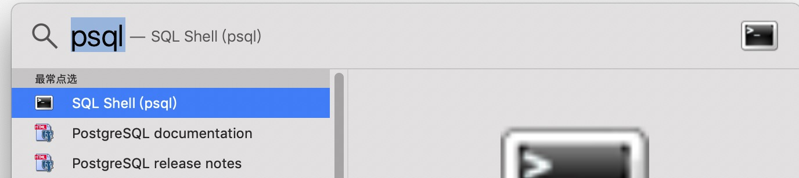
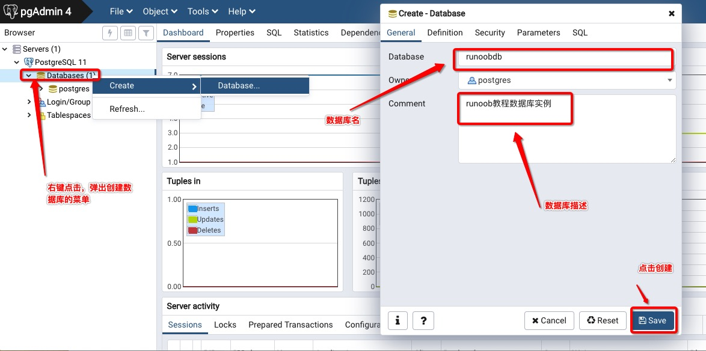
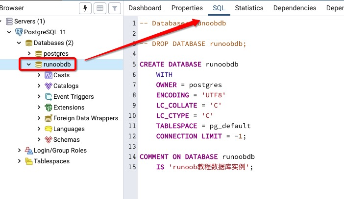
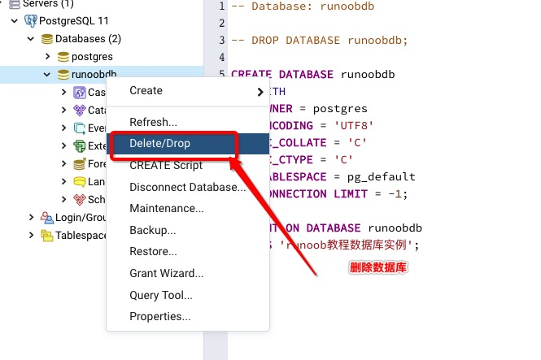

# PostgreSQL 教程

## PostgreSQL 简介

<div align="left"></div>

PostgreSQL 是一个免费的对象-关系数据库服务器(ORDBMS)，在灵活的BSD许可证下发行。

PostgreSQL 开发者把它念作 **`post-gress-Q-L`**。

PostgreSQL 的 Slogan 是 "世界上最先进的开源关系型数据库"。

---

### 什么是数据库？

数据库（Database）是按照数据结构来组织、存储和管理数据的仓库。

每个数据库都有一个或多个不同的 API 用于创建，访问，管理，搜索和复制所保存的数据。

我们也可以将数据存储在文件中，但是在文件中读写数据速度相对较慢。

所以，现在我们使用关系型数据库管理系统（RDBMS）来存储和管理的大数据量。所谓的关系型数据库，是建立在关系模型基础上的数据库，借助于集合代数等数学概念和方法来处理数据库中的数据。

ORDBMS（对象关系数据库系统）是面向对象技术与传统的关系数据库相结合的产物，查询处理是 ORDBMS 的重要组成部分，它的性能优劣将直接影响到DBMS 的性能。

ORDBMS在原来关系数据库的基础上，增加了一些新的特性。

RDBMS 是关系数据库管理系统,是建立实体之间的联系,最后得到的是关系表。

OODBMS 面向对象数据库管理系统,将所有实体都看着对象,并将这些对象类进行封装,对象之间的通信通过消息 OODBMS 对象关系数据库在实质上还是关系数据库 。

---

### ORDBMS 术语

在我们开始学习 PostgreSQL 数据库前，让我们先了解下 ORDBMS 的一些术语：

- **数据库:** 数据库是一些关联表的集合。
- **数据表:** 表是数据的矩阵。在一个数据库中的表看起来像一个简单的电子表格。
- **列:** 一列(数据元素) 包含了相同的数据, 例如邮政编码的数据。
- **行：**一行（=元组，或记录）是一组相关的数据，例如一条用户订阅的数据。
- **冗余**：存储两倍数据，冗余降低了性能，但提高了数据的安全性。
- **主键**：主键是唯一的。一个数据表中只能包含一个主键。你可以使用主键来查询数据。
- **外键：**外键用于关联两个表。
- **复合键**：复合键（组合键）将多个列作为一个索引键，一般用于复合索引。
- **索引：**使用索引可快速访问数据库表中的特定信息。索引是对数据库表中一列或多列的值进行排序的一种结构。类似于书籍的目录。
- **参照完整性:** 参照的完整性要求关系中不允许引用不存在的实体。与实体完整性是关系模型必须满足的完整性约束条件，目的是保证数据的一致性。

---

### PostgreSQL 特征

- **函数**：通过函数，可以在数据库服务器端执行指令程序。
- **索引**：用户可以自定义索引方法，或使用内置的 B 树，哈希表与 GiST 索引。
- **触发器**：触发器是由SQL语句查询所触发的事件。如：一个INSERT语句可能触发一个检查数据完整性的触发器。触发器通常由INSERT或UPDATE语句触发。 多版本并发控制：PostgreSQL使用多版本并发控制（MVCC，Multiversion concurrency control）系统进行并发控制，该系统向每个用户提供了一个数据库的"快照"，用户在事务内所作的每个修改，对于其他的用户都不可见，直到该事务成功提交。
- **规则**：规则（RULE）允许一个查询能被重写，通常用来实现对视图（VIEW）的操作，如插入（INSERT）、更新（UPDATE）、删除（DELETE）。
- **数据类型**：包括文本、任意精度的数值数组、JSON 数据、枚举类型、XML 数据等。
- **全文检索**：通过 Tsearch2 或 OpenFTS，8.3版本中内嵌 Tsearch2。
- **NoSQL**：JSON，JSONB，XML，HStore 原生支持，至 NoSQL 数据库的外部数据包装器。
- **数据仓库**：能平滑迁移至同属 PostgreSQL 生态的 GreenPlum，DeepGreen，HAWK 等，使用 FDW 进行 ETL。

### 相关资源

https://github.com/postgres-cn/pgdoc-cn/releases


## 安装 PostgreSQL

### Linux 上安装 PostgreSQL

PostgreSQL 官网 https://www.postgresql.org/

### Windows 上安装 PostgreSQL

这里使用 EnterpriseDB 来下载安装，EnterpriseDB 是全球唯一一家提供基于 PostgreSQL 企业级产品与服务的厂商。

下载地址：https://www.enterprisedb.com/downloads/postgres-postgresql-downloads。

### Mac OS 上安装 PostgreSQL

同上


## PostgreSQL 语法

默认情况下 PostgreSQL 安装完成后，自带了一个命令行工具 **SQL Shell(psql)**。

**Linux** 系统可以直接切换到 postgres 用户来开启命令行工具：

```shell
#  sudo -i -u postgres
```

**Windows** 系统一般在它的安装目录下：

Program Files → PostgreSQL 11.3 → SQL Shell(psql)

**Mac OS** 我们直接搜索就可以了找到：



进入命令行工具，我们可以使用 **\help** 来查看各个命令的语法 ：

```
postgres-# \help <command_name>
```

例如，我们查看下 select 语句的语法：

```shell
Server [localhost]:
Database [postgres]:
Port [5432]:
Username [postgres]:
用户 postgres 的口令：
psql (12.3)
输入 "help" 来获取帮助信息.

postgres=# \help SELECT
命令：       SELECT
描述：       从数据表或视图中读取数据
语法：
[ WITH [ RECURSIVE ] with查询语句(with_query) [, ...] ]
SELECT [ ALL | DISTINCT [ ON ( 表达式 [, ...] ) ] ]
    [ * | 表达式 [ [ AS ] 输出名称 ] [, ...] ]
    [ FROM from列表中项 [, ...] ]
    [ WHERE 条件 ]
    [ GROUP BY grouping_element [, ...] ]
    [ HAVING 条件 [, ...] ]
    [ WINDOW 窗口名称 AS ( 窗口定义 ) [, ...] ]
    [ { UNION | INTERSECT | EXCEPT } [ ALL | DISTINCT ] 查询 ]
    [ ORDER BY 表达式 [ ASC | DESC | USING 运算子 ] [ NULLS { FIRST | LAST } ] [, ...] ]
    [ LIMIT { 查询所用返回记录的最大数量 | ALL } ]
    [ OFFSET 起始值 [ ROW | ROWS ] ]
    [ FETCH { FIRST | NEXT } [ 查询所用返回记录的最大数量 ] { ROW | ROWS } ONLY ]
    [ FOR { UPDATE | NO KEY UPDATE | SHARE | KEY SHARE } [ OF 表名 [, ...] ] [ NOWAIT | SKIP LOCKED ] [...] ]

from 列表中的项可以是下列内容之一

    [ ONLY ] 表名 [ * ] [ [ AS ] 别名 [ ( 列的别名 [, ...] ) ] ]
                [ TABLESAMPLE sampling_method ( 参数 [, ...] ) [ REPEATABLE ( 种子 ) ] ]
    [ LATERAL ] ( 查询 ) [ AS ] 别名 [ ( 列的别名 [, ...] ) ]
    WITH查询语句名称(with_query_name) [ [ AS ] 别名 [ ( 列的别名 [, ...] ) ] ]
    [ LATERAL ] 函数名称 ( [ 参数 [, ...] ] )
                [ WITH ORDINALITY ] [ [ AS ] 别名 [ ( 列的别名 [, ...] ) ] ]
    [ LATERAL ] 函数名称 ( [ 参数 [, ...] ] ) [ AS ] 别名 ( 列定义 [, ...] )
    [ LATERAL ] 函数名称 ( [ 参数 [, ...] ] ) AS ( 列定义 [, ...] )
    [ LATERAL ] ROWS FROM( 函数名称 ( [ 参数 [, ...] ] ) [ AS ( 列定义 [, ...] ) ] [, ...] )
                [ WITH ORDINALITY ] [ [ AS ] 别名 [ ( 列的别名 [, ...] ) ] ]
    from列表中项 [ NATURAL ] 连接操作的类型 from列表中项 [ ON 用连接操作的条件 | USING ( 用于连接操作的列 [, ...] ) ]

并且grouping_element可以是下列之一：

    ( )
    表达式
    ( 表达式 [, ...] )
    ROLLUP ( { 表达式 | ( 表达式 [, ...] ) } [, ...] )
    CUBE ( { 表达式 | ( 表达式 [, ...] ) } [, ...] )
    GROUPING SETS ( grouping_element [, ...] )

with查询语句是：

    WITH查询语句名称(with_query_name) [ ( 列名称 [, ...] ) ] AS [ [ NOT ] MATERIALIZED ] ( 查询 | 值 | insert | update | delete )

TABLE [ ONLY ] 表名 [ * ]

URL: https://www.postgresql.org/docs/12/sql-select.html
```

### SQL 语句

一个 SQL 语句通常包含了关键字、标识符（字段）、常量、特殊符号等，下面是一个简单的 SQL 语句：

```sql
SELECT id, name FROM runoob
```

|          | SELECT |    id, name     |           FROM           | runoob |
| :------- | :----: | :-------------: | :----------------------: | :----: |
| 符号类型 | 关键字 | 标识符（字段）  |          关键字          | 标识符 |
| 描述     |  命令  | id 和 name 字段 | 语句，用于设置条件规则等 |  表名  |

------

### PostgreSQL 命令

#### ABORT

ABORT 用于退出当前事务。

```sql
ABORT [ WORK | TRANSACTION ]
```

#### ALTER AGGREGATE

修改一个聚集函数的定义 。

```sql
ALTER AGGREGATE _name_ ( _argtype_ [ , ... ] ) RENAME TO _new_name_
ALTER AGGREGATE _name_ ( _argtype_ [ , ... ] ) OWNER TO _new_owner_
ALTER AGGREGATE _name_ ( _argtype_ [ , ... ] ) SET SCHEMA _new_schema_
```

#### ALTER COLLATION

修改一个排序规则定义 。

```sql
ALTER COLLATION _name_ RENAME TO _new_name_
ALTER COLLATION _name_ OWNER TO _new_owner_
ALTER COLLATION _name_ SET SCHEMA _new_schema_
```

#### ALTER CONVERSION

修改一个编码转换的定义。

```sql
ALTER CONVERSION name RENAME TO new_name
ALTER CONVERSION name OWNER TO new_owner
```

#### ALTER DATABASE

修改一个数据库。

```sql
ALTER DATABASE name SET parameter { TO | = } { value | DEFAULT }
ALTER DATABASE name RESET parameter
ALTER DATABASE name RENAME TO new_name
ALTER DATABASE name OWNER TO new_owner
```

#### ALTER DEFAULT PRIVILEGES

定义默认的访问权限。

```sql
ALTER DEFAULT PRIVILEGES
    [ FOR { ROLE | USER } target_role [, ...] ]
    [ IN SCHEMA schema_name [, ...] ]
    abbreviated_grant_or_revoke

where abbreviated_grant_or_revoke is one of:

GRANT { { SELECT | INSERT | UPDATE | DELETE | TRUNCATE | REFERENCES | TRIGGER }
    [, ...] | ALL [ PRIVILEGES ] }
    ON TABLES
    TO { [ GROUP ] role_name | PUBLIC } [, ...] [ WITH GRANT OPTION ]
...
```

#### ALTER DOMAIN

修改一个域的定义。

```sql
ALTER DOMAIN name { SET DEFAULT expression | DROP DEFAULT }
ALTER DOMAIN name { SET | DROP } NOT NULL
ALTER DOMAIN name ADD domain_constraint
ALTER DOMAIN name DROP CONSTRAINT constraint_name [ RESTRICT | CASCADE ]
ALTER DOMAIN name OWNER TO new_owner
```

#### ALTER FUNCTION

修改一个函数的定义。

```sql
ALTER FUNCTION name ( [ type [, ...] ] ) RENAME TO new_name
ALTER FUNCTION name ( [ type [, ...] ] ) OWNER TO new_owner
```

#### ALTER GROUP

修改一个用户组。

```sql
ALTER GROUP groupname ADD USER username [, ... ]
ALTER GROUP groupname DROP USER username [, ... ]
ALTER GROUP groupname RENAME TO new_name
```

#### ALTER INDEX

修改一个索引的定义。

```sql
ALTER INDEX name OWNER TO new_owner
ALTER INDEX name SET TABLESPACE indexspace_name
ALTER INDEX name RENAME TO new_name
```

#### ALTER LANGUAGE

修改一个过程语言的定义。

```sql
ALTER LANGUAGE name RENAME TO new_name
```

#### ALTER OPERATOR

改变一个操作符的定义。

```sql
ALTER OPERATOR name ( { lefttype | NONE }, { righttype | NONE } )
OWNER TO new_owner
```

#### ALTER OPERATOR CLASS

修改一个操作符表的定义。

```sql
ALTER OPERATOR CLASS name USING index_method RENAME TO new_name
ALTER OPERATOR CLASS name USING index_method OWNER TO new_owner
```

#### ALTER SCHEMA

修改一个模式的定义。

```sql
ALTER SCHEMA name RENAME TO new_name
ALTER SCHEMA name OWNER TO new_owner
```

#### ALTER SEQUENCE

修改一个序列生成器的定义。

```sql
ALTER SEQUENCE name [ INCREMENT [ BY ] increment ]
[ MINVALUE minvalue | NO MINVALUE ]
[ MAXVALUE maxvalue | NO MAXVALUE ]
[ RESTART [ WITH ] start ] [ CACHE cache ] [ [ NO ] CYCLE ]
```

#### ALTER TABLE

修改表的定义。

```sql
ALTER TABLE [ ONLY ] name [ * ]
action [, ... ]
ALTER TABLE [ ONLY ] name [ * ]
RENAME [ COLUMN ] column TO new_column
ALTER TABLE name
RENAME TO new_name
```

其中 **action** 可以是以选项之一：

```sql
ADD [ COLUMN ] column_type [ column_constraint [ ... ] ]
DROP [ COLUMN ] column [ RESTRICT | CASCADE ]
ALTER [ COLUMN ] column TYPE type [ USING expression ]
ALTER [ COLUMN ] column SET DEFAULT expression
ALTER [ COLUMN ] column DROP DEFAULT
ALTER [ COLUMN ] column { SET | DROP } NOT NULL
ALTER [ COLUMN ] column SET STATISTICS integer
ALTER [ COLUMN ] column SET STORAGE { PLAIN | EXTERNAL | EXTENDED | MAIN }
ADD table_constraint
DROP CONSTRAINT constraint_name [ RESTRICT | CASCADE ]
CLUSTER ON index_name
SET WITHOUT CLUSTER
SET WITHOUT OIDS
OWNER TO new_owner
SET TABLESPACE tablespace_name
```

#### ALTER TABLESPACE

修改一个表空间的定义。

```sql
ALTER TABLESPACE name RENAME TO new_name
ALTER TABLESPACE name OWNER TO new_owner
```

#### ALTER TRIGGER

修改改变一个触发器的定义 。

```sql
ALTER TRIGGER name ON table RENAME TO new_name
```

#### ALTER TYPE

修改一个类型的定义 。

```sql
ALTER TYPE name OWNER TO new_owner
```

#### ALTER USER

修改数据库用户帐号 。

```sql
ALTER USER name [ [ WITH ] option [ ... ] ]
ALTER USER name RENAME TO new_name
ALTER USER name SET parameter { TO | = } { value | DEFAULT }
ALTER USER name RESET parameter
```

Where *option* can be −

```sql
[ ENCRYPTED | UNENCRYPTED ] PASSWORD 'password'
| CREATEDB | NOCREATEDB
| CREATEUSER | NOCREATEUSER
| VALID UNTIL 'abstime'
```

#### ANALYZE

收集与数据库有关的统计。

```sql
ANALYZE [ VERBOSE ] [ table [ (column [, ...] ) ] ]
```

#### BEGIN

开始一个事务块。

```sql
BEGIN [ WORK | TRANSACTION ] [ transaction_mode [, ...] ]
```

*transaction_mode* 可以是以下选项之一：

```sql
ISOLATION LEVEL { 
   SERIALIZABLE | REPEATABLE READ | READ COMMITTED
   | READ UNCOMMITTED
}
READ WRITE | READ ONLY
```

#### CHECKPOINT

强制一个事务日志检查点 。

```
CHECKPOINT
```

#### CLOSE

关闭游标。

```
CLOSE name
```

#### CLUSTER

根据一个索引对某个表盘簇化排序。

```sql
CLUSTER index_name ON table_name
CLUSTER table_name
CLUSTER
```

#### COMMENT

定义或者改变一个对象的注释。

```sql
COMMENT ON {
   TABLE object_name |
   COLUMN table_name.column_name |
   AGGREGATE agg_name (agg_type) |
   CAST (source_type AS target_type) |
   CONSTRAINT constraint_name ON table_name |
   CONVERSION object_name |
   DATABASE object_name |
   DOMAIN object_name |
   FUNCTION func_name (arg1_type, arg2_type, ...) |
   INDEX object_name |
   LARGE OBJECT large_object_oid |
   OPERATOR op (left_operand_type, right_operand_type) |
   OPERATOR CLASS object_name USING index_method |
   [ PROCEDURAL ] LANGUAGE object_name |
   RULE rule_name ON table_name |
   SCHEMA object_name |
   SEQUENCE object_name |
   TRIGGER trigger_name ON table_name |
   TYPE object_name |
   VIEW object_name
} 
IS 'text'
```

#### COMMIT

提交当前事务。

```sql
COMMIT [ WORK | TRANSACTION ]
```

#### COPY

在表和文件之间拷贝数据。

```
COPY table_name [ ( column [, ...] ) ]
FROM { 'filename' | STDIN }
[ WITH ]
[ BINARY ]
[ OIDS ]
[ DELIMITER [ AS ] 'delimiter' ]
[ NULL [ AS ] 'null string' ]
[ CSV [ QUOTE [ AS ] 'quote' ]
[ ESCAPE [ AS ] 'escape' ]
[ FORCE NOT NULL column [, ...] ]
COPY table_name [ ( column [, ...] ) ]
TO { 'filename' | STDOUT }
[ [ WITH ]
[ BINARY ]
[ OIDS ]
[ DELIMITER [ AS ] 'delimiter' ]
[ NULL [ AS ] 'null string' ]
[ CSV [ QUOTE [ AS ] 'quote' ]
[ ESCAPE [ AS ] 'escape' ]
[ FORCE QUOTE column [, ...] ]
```

#### CREATE AGGREGATE

定义一个新的聚集函数。

```
CREATE AGGREGATE name (
   BASETYPE = input_data_type,
   SFUNC = sfunc,
   STYPE = state_data_type
   [, FINALFUNC = ffunc ]
   [, INITCOND = initial_condition ]
)
```

#### CREATE CAST

定义一个用户定义的转换。

```
CREATE CAST (source_type AS target_type)
WITH FUNCTION func_name (arg_types)
[ AS ASSIGNMENT | AS IMPLICIT ]
CREATE CAST (source_type AS target_type)
WITHOUT FUNCTION
[ AS ASSIGNMENT | AS IMPLICIT ]
```

#### CREATE CONSTRAINT TRIGGER

定义一个新的约束触发器 。

```
CREATE CONSTRAINT TRIGGER name
AFTER events ON
table_name constraint attributes
FOR EACH ROW EXECUTE PROCEDURE func_name ( args )
```

#### CREATE CONVERSION

定义一个新的的编码转换。

```
CREATE [DEFAULT] CONVERSION name
FOR source_encoding TO dest_encoding FROM func_name
```

#### CREATE DATABASE

创建新数据库。

```
CREATE DATABASE name
[ [ WITH ] [ OWNER [=] db_owner ]
   [ TEMPLATE [=] template ]
   [ ENCODING [=] encoding ]
   [ TABLESPACE [=] tablespace ] 
]
```

#### CREATE DOMAIN

定义一个新域。

```
CREATE DOMAIN name [AS] data_type
[ DEFAULT expression ]
[ constraint [ ... ] ]
```

*constraint* 可以是以下选项之一：

```
[ CONSTRAINT constraint_name ]
{ NOT NULL | NULL | CHECK (expression) }
```

#### CREATE FUNCTION

定义一个新函数。

```
CREATE [ OR REPLACE ] FUNCTION name ( [ [ arg_name ] arg_type [, ...] ] )
RETURNS ret_type
{ LANGUAGE lang_name
   | IMMUTABLE | STABLE | VOLATILE
   | CALLED ON NULL INPUT | RETURNS NULL ON NULL INPUT | STRICT
   | [ EXTERNAL ] SECURITY INVOKER | [ EXTERNAL ] SECURITY DEFINER
   | AS 'definition'
   | AS 'obj_file', 'link_symbol'
} ...
[ WITH ( attribute [, ...] ) ]
```

#### CREATE GROUP

定义一个新的用户组。

```
CREATE GROUP name [ [ WITH ] option [ ... ] ]
Where option can be:
SYSID gid
| USER username [, ...]
```

#### CREATE INDEX

定义一个新索引。

```
CREATE [ UNIQUE ] INDEX name ON table [ USING method ]
( { column | ( expression ) } [ opclass ] [, ...] )
[ TABLESPACE tablespace ]
[ WHERE predicate ]
```

#### CREATE LANGUAGE

定义一种新的过程语言。

```
CREATE [ TRUSTED ] [ PROCEDURAL ] LANGUAGE name
HANDLER call_handler [ VALIDATOR val_function ]
```

#### CREATE OPERATOR

定义一个新的操作符。

```
CREATE OPERATOR name (
   PROCEDURE = func_name
   [, LEFTARG = left_type ] [, RIGHTARG = right_type ]
   [, COMMUTATOR = com_op ] [, NEGATOR = neg_op ]
   [, RESTRICT = res_proc ] [, JOIN = join_proc ]
   [, HASHES ] [, MERGES ]
   [, SORT1 = left_sort_op ] [, SORT2 = right_sort_op ]
   [, LTCMP = less_than_op ] [, GTCMP = greater_than_op ]
)
```

#### CREATE OPERATOR CLASS

定义一个新的操作符表。

```
CREATE OPERATOR CLASS name [ DEFAULT ] FOR TYPE data_type
USING index_method AS
{ OPERATOR strategy_number operator_name [ ( op_type, op_type ) ] [ RECHECK ]
   | FUNCTION support_number func_name ( argument_type [, ...] )
   | STORAGE storage_type
} [, ... ]
```

#### CREATE ROLE

定义一个新的数据库角色。

```
CREATE ROLE _name_ [ [ WITH ] _option_ [ ... ] ]

where `_option_` can be:

      SUPERUSER | NOSUPERUSER
    | CREATEDB | NOCREATEDB
    | CREATEROLE | NOCREATEROLE
...
```

#### CREATE RULE

定义一个新重写规则。

```
CREATE [ OR REPLACE ] RULE name AS ON event
TO table [ WHERE condition ]
DO [ ALSO | INSTEAD ] { NOTHING | command | ( command ; command ... ) }
```

#### CREATE SCHEMA

定义一个新模式。

```
CREATE SCHEMA schema_name
[ AUTHORIZATION username ] [ schema_element [ ... ] ]
CREATE SCHEMA AUTHORIZATION username
[ schema_element [ ... ] ]
```

#### CREATE SERVER

定义一个新的外部服务器。。

```
CREATE SERVER _server_name_ [ TYPE '_server_type_' ] [ VERSION '_server_version_' ]
    FOREIGN DATA WRAPPER _fdw_name_
    [ OPTIONS ( _option_ '_value_' [, ... ] ) ]
```

#### CREATE SEQUENCE

定义一个新序列发生器。

```
CREATE [ TEMPORARY | TEMP ] SEQUENCE name
[ INCREMENT [ BY ] increment ]
[ MINVALUE minvalue | NO MINVALUE ]
[ MAXVALUE maxvalue | NO MAXVALUE ]
[ START [ WITH ] start ] [ CACHE cache ] [ [ NO ] CYCLE ]
```

#### CREATE TABLE

定义一个新表。

```
CREATE [ [ GLOBAL | LOCAL ] { 
   TEMPORARY | TEMP } ] TABLE table_name ( { 
      column_name data_type [ DEFAULT default_expr ] [ column_constraint [ ... ] ]
      | table_constraint
      | LIKE parent_table [ { INCLUDING | EXCLUDING } DEFAULTS ] 
   } [, ... ]
)
[ INHERITS ( parent_table [, ... ] ) ]
[ WITH OIDS | WITHOUT OIDS ]
[ ON COMMIT { PRESERVE ROWS | DELETE ROWS | DROP } ]
[ TABLESPACE tablespace ]
```

*column_constraint* 可以是以下选项之一：

```
[ CONSTRAINT constraint_name ] { 
   NOT NULL |
   NULL |
   UNIQUE [ USING INDEX TABLESPACE tablespace ] |
   PRIMARY KEY [ USING INDEX TABLESPACE tablespace ] |
   CHECK (expression) |
   REFERENCES ref_table [ ( ref_column ) ]
   [ MATCH FULL | MATCH PARTIAL | MATCH SIMPLE ]
   [ ON DELETE action ] [ ON UPDATE action ] 
}
[ DEFERRABLE | NOT DEFERRABLE ] [ INITIALLY DEFERRED | INITIALLY IMMEDIATE ]
```

*table_constraint* 可以是以下选项之一：

```
[ CONSTRAINT constraint_name ]
{ UNIQUE ( column_name [, ... ] ) [ USING INDEX TABLESPACE tablespace ] |
PRIMARY KEY ( column_name [, ... ] ) [ USING INDEX TABLESPACE tablespace ] |
CHECK ( expression ) |
FOREIGN KEY ( column_name [, ... ] )
REFERENCES ref_table [ ( ref_column [, ... ] ) ]
[ MATCH FULL | MATCH PARTIAL | MATCH SIMPLE ]
[ ON DELETE action ] [ ON UPDATE action ] }
[ DEFERRABLE | NOT DEFERRABLE ] [ INITIALLY DEFERRED | INITIALLY IMMEDIATE ]
```

#### CREATE TABLE AS

从一条查询的结果中定义一个新表。

```
CREATE [ [ GLOBAL | LOCAL ] { TEMPORARY | TEMP } ] TABLE table_name
[ (column_name [, ...] ) ] [ [ WITH | WITHOUT ] OIDS ]
AS query
```

#### CREATE TABLESPACE

定义一个新的表空间。

```
CREATE TABLESPACE tablespace_name [ OWNER username ] LOCATION 'directory'
```

#### CREATE TRIGGER

定义一个新的触发器。

```
CREATE TRIGGER name { BEFORE | AFTER } { event [ OR ... ] }
ON table [ FOR [ EACH ] { ROW | STATEMENT } ]
EXECUTE PROCEDURE func_name ( arguments )
```

#### CREATE TYPE

定义一个新的数据类型。

```
CREATE TYPE name AS
( attribute_name data_type [, ... ] )
CREATE TYPE name (
INPUT = input_function,
OUTPUT = output_function
[, RECEIVE = receive_function ]
[, SEND = send_function ]
[, ANALYZE = analyze_function ]
[, INTERNALLENGTH = { internal_length | VARIABLE } ]
[, PASSEDBYVALUE ]
[, ALIGNMENT = alignment ]
[, STORAGE = storage ]
[, DEFAULT = default ]
[, ELEMENT = element ]
[, DELIMITER = delimiter ]
)
```

#### CREATE USER

创建一个新的数据库用户帐户。

```
CREATE USER name [ [ WITH ] option [ ... ] ]
```

*option* 可以是以下选项之一：

```
SYSID uid
| [ ENCRYPTED | UNENCRYPTED ] PASSWORD 'password'
| CREATEDB | NOCREATEDB
| CREATEUSER | NOCREATEUSER
| IN GROUP group_name [, ...]
| VALID UNTIL 'abs_time'
```

#### CREATE VIEW

定义一个视图。

```
CREATE [ OR REPLACE ] VIEW name [ ( column_name [, ...] ) ] AS query
```

#### DEALLOCATE

删除一个准备好的查询。

```
DEALLOCATE [ PREPARE ] plan_name
```

#### DECLARE

定义一个游标。

```
DECLARE name [ BINARY ] [ INSENSITIVE ] [ [ NO ] SCROLL ]
CURSOR [ { WITH | WITHOUT } HOLD ] FOR query
[ FOR { READ ONLY | UPDATE [ OF column [, ...] ] } ]
```

#### DELETE

删除一个表中的行。

```
DELETE FROM [ ONLY ] table [ WHERE condition ]
```

#### DROP AGGREGATE

删除一个用户定义的聚集函数。

```
DROP AGGREGATE name ( type ) [ CASCADE | RESTRICT ]
```

#### DROP CAST

删除一个用户定义的类型转换。

```
DROP CAST (source_type AS target_type) [ CASCADE | RESTRICT ]
```

#### DROP CONVERSION

删除一个用户定义的编码转换。

```
DROP CONVERSION name [ CASCADE | RESTRICT ]
```

#### DROP DATABASE

删除一个数据库。

```
DROP DATABASE name
```

#### DROP DOMAIN

删除一个用户定义的域。

```
DROP DOMAIN name [, ...] [ CASCADE | RESTRICT ]
```

#### DROP FUNCTION

删除一个函数。

```
DROP FUNCTION name ( [ type [, ...] ] ) [ CASCADE | RESTRICT ]
```

#### DROP GROUP

删除一个用户组。

```
DROP GROUP name
```

#### DROP INDEX

删除一个索引。

```
DROP INDEX name [, ...] [ CASCADE | RESTRICT ]
```

#### DROP LANGUAGE

删除一个过程语言。

```
DROP [ PROCEDURAL ] LANGUAGE name [ CASCADE | RESTRICT ]
```

#### DROP OPERATOR

删除一个操作符。

```
DROP OPERATOR name ( { left_type | NONE }, { right_type | NONE } )
[ CASCADE | RESTRICT ]
```

#### DROP OPERATOR CLASS

删除一个操作符表。

```
DROP OPERATOR CLASS name USING index_method [ CASCADE | RESTRICT ]
```

#### DROP ROLE

删除一个数据库角色。

```
DROP ROLE [ IF EXISTS ] _name_ [, ...]
```

#### DROP RULE

删除一个重写规则。

```
DROP RULE name ON relation [ CASCADE | RESTRICT ]
```

#### DROP SCHEMA

删除一个模式。

```
DROP SCHEMA name [, ...] [ CASCADE | RESTRICT ]
```

#### DROP SEQUENCE

删除一个序列。

```
DROP SEQUENCE name [, ...] [ CASCADE | RESTRICT ]
```

#### DROP TABLE

删除一个表。

```
DROP TABLE name [, ...] [ CASCADE | RESTRICT ]
```

#### DROP TABLESPACE

删除一个表空间。

```
DROP TABLESPACE tablespace_name
```

#### DROP TRIGGER

删除一个触发器定义。

```
DROP TRIGGER name ON table [ CASCADE | RESTRICT ]
```

#### DROP TYPE

删除一个用户定义数据类型。

```
DROP TYPE name [, ...] [ CASCADE | RESTRICT ]
```

#### DROP USER

删除一个数据库用户帐号。

```
DROP USER name
```

#### DROP VIEW

删除一个视图。

```
DROP VIEW name [, ...] [ CASCADE | RESTRICT ]
```

#### END

提交当前的事务。

```
END [ WORK | TRANSACTION ]
```

#### EXECUTE

执行一个准备好的查询。

```
EXECUTE plan_name [ (parameter [, ...] ) ]
```

#### EXPLAIN

显示一个语句的执行规划。

```
EXPLAIN [ ANALYZE ] [ VERBOSE ] statement
```

#### FETCH

用游标从查询中抓取行。

```
FETCH [ direction { FROM | IN } ] cursor_name
```

*direction* 可以是以下选项之一：

```
NEXT
PRIOR
FIRST
LAST
ABSOLUTE count
RELATIVE count
count
ALL
FORWARD
FORWARD count
FORWARD ALL
BACKWARD
BACKWARD count
BACKWARD ALL
```

#### GRANT

定义访问权限。

```
GRANT { { SELECT | INSERT | UPDATE | DELETE | RULE | REFERENCES | TRIGGER }
[,...] | ALL [ PRIVILEGES ] }
ON [ TABLE ] table_name [, ...]
TO { username | GROUP group_name | PUBLIC } [, ...] [ WITH GRANT OPTION ]

GRANT { { CREATE | TEMPORARY | TEMP } [,...] | ALL [ PRIVILEGES ] }
ON DATABASE db_name [, ...]
TO { username | GROUP group_name | PUBLIC } [, ...] [ WITH GRANT OPTION ]

GRANT { CREATE | ALL [ PRIVILEGES ] }
ON TABLESPACE tablespace_name [, ...]
TO { username | GROUP group_name | PUBLIC } [, ...] [ WITH GRANT OPTION ]

GRANT { EXECUTE | ALL [ PRIVILEGES ] }
ON FUNCTION func_name ([type, ...]) [, ...]
TO { username | GROUP group_name | PUBLIC } [, ...] [ WITH GRANT OPTION ]

GRANT { USAGE | ALL [ PRIVILEGES ] }
ON LANGUAGE lang_name [, ...]
TO { username | GROUP group_name | PUBLIC } [, ...] [ WITH GRANT OPTION ]

GRANT { { CREATE | USAGE } [,...] | ALL [ PRIVILEGES ] }
ON SCHEMA schema_name [, ...]
TO { username | GROUP group_name | PUBLIC } [, ...] [ WITH GRANT OPTION ]
```

#### INSERT

在表中创建新行，即插入数据。

```
INSERT INTO table [ ( column [, ...] ) ]
{ DEFAULT VALUES | VALUES ( { expression | DEFAULT } [, ...] ) | query }
```

#### LISTEN

监听一个通知。

```
LISTEN name
```

#### LOAD

加载或重载一个共享库文件。

```
LOAD 'filename'
```

#### LOCK

锁定一个表。

```
LOCK [ TABLE ] name [, ...] [ IN lock_mode MODE ] [ NOWAIT ]
```

*lock_mode* 可以是以下选项之一：

```
ACCESS SHARE | ROW SHARE | ROW EXCLUSIVE | SHARE UPDATE EXCLUSIVE
| SHARE | SHARE ROW EXCLUSIVE | EXCLUSIVE | ACCESS EXCLUSIVE
```

#### MOVE

定位一个游标。

```
MOVE [ direction { FROM | IN } ] cursor_name
```

#### NOTIFY

生成一个通知。

```
NOTIFY name
```

#### PREPARE

创建一个准备好的查询。

```
PREPARE plan_name [ (data_type [, ...] ) ] AS statement
```

#### REINDEX

重建索引。

```
REINDEX { DATABASE | TABLE | INDEX } name [ FORCE ]
```

#### RELEASE SAVEPOINT

删除一个前面定义的保存点。

```
RELEASE [ SAVEPOINT ] savepoint_name
```

#### RESET

把一个运行时参数值恢复为默认值。

```
RESET name
RESET ALL
```

#### REVOKE

删除访问权限。

```
REVOKE [ GRANT OPTION FOR ]
{ { SELECT | INSERT | UPDATE | DELETE | RULE | REFERENCES | TRIGGER }
[,...] | ALL [ PRIVILEGES ] }
ON [ TABLE ] table_name [, ...]
FROM { username | GROUP group_name | PUBLIC } [, ...]
[ CASCADE | RESTRICT ]

REVOKE [ GRANT OPTION FOR ]
{ { CREATE | TEMPORARY | TEMP } [,...] | ALL [ PRIVILEGES ] }
ON DATABASE db_name [, ...]
FROM { username | GROUP group_name | PUBLIC } [, ...]
[ CASCADE | RESTRICT ]

REVOKE [ GRANT OPTION FOR ]
{ CREATE | ALL [ PRIVILEGES ] }
ON TABLESPACE tablespace_name [, ...]
FROM { username | GROUP group_name | PUBLIC } [, ...]
[ CASCADE | RESTRICT ]

REVOKE [ GRANT OPTION FOR ]
{ EXECUTE | ALL [ PRIVILEGES ] }
ON FUNCTION func_name ([type, ...]) [, ...]
FROM { username | GROUP group_name | PUBLIC } [, ...]
[ CASCADE | RESTRICT ]

REVOKE [ GRANT OPTION FOR ]
{ USAGE | ALL [ PRIVILEGES ] }
ON LANGUAGE lang_name [, ...]
FROM { username | GROUP group_name | PUBLIC } [, ...]
[ CASCADE | RESTRICT ]

REVOKE [ GRANT OPTION FOR ]
{ { CREATE | USAGE } [,...] | ALL [ PRIVILEGES ] }
ON SCHEMA schema_name [, ...]
FROM { username | GROUP group_name | PUBLIC } [, ...]
[ CASCADE | RESTRICT ]
```

#### ROLLBACK

退出当前事务。

```
ROLLBACK [ WORK | TRANSACTION ]
```

#### ROLLBACK TO SAVEPOINT

回滚到一个保存点。

```
ROLLBACK [ WORK | TRANSACTION ] TO [ SAVEPOINT ] savepoint_name
```

#### SAVEPOINT

在当前事务里定义一个新的保存点。

```
SAVEPOINT savepoint_name
```

#### SELECT

从表或视图中取出若干行。

```
SELECT [ ALL | DISTINCT [ ON ( expression [, ...] ) ] ]
* | expression [ AS output_name ] [, ...]
[ FROM from_item [, ...] ]
[ WHERE condition ]
[ GROUP BY expression [, ...] ]
[ HAVING condition [, ...] ]
[ { UNION | INTERSECT | EXCEPT } [ ALL ] select ]
[ ORDER BY expression [ ASC | DESC | USING operator ] [, ...] ]
[ LIMIT { count | ALL } ]
[ OFFSET start ]
[ FOR UPDATE [ OF table_name [, ...] ] ]
```

*from_item* 可以是以下选项：

```
[ ONLY ] table_name [ * ] [ [ AS ] alias [ ( column_alias [, ...] ) ] ]
( select ) [ AS ] alias [ ( column_alias [, ...] ) ]
function_name ( [ argument [, ...] ] )
[ AS ] alias [ ( column_alias [, ...] | column_definition [, ...] ) ]
function_name ( [ argument [, ...] ] ) AS ( column_definition [, ...] )
from_item [ NATURAL ] join_type from_item
[ ON join_condition | USING ( join_column [, ...] ) ]
```

#### SELECT INTO

从一个查询的结果中定义一个新表。

```
SELECT [ ALL | DISTINCT [ ON ( expression [, ...] ) ] ]
* | expression [ AS output_name ] [, ...]
INTO [ TEMPORARY | TEMP ] [ TABLE ] new_table
[ FROM from_item [, ...] ]
[ WHERE condition ]
[ GROUP BY expression [, ...] ]
[ HAVING condition [, ...] ]
[ { UNION | INTERSECT | EXCEPT } [ ALL ] select ]
[ ORDER BY expression [ ASC | DESC | USING operator ] [, ...] ]
[ LIMIT { count | ALL } ]
[ OFFSET start ]
[ FOR UPDATE [ OF table_name [, ...] ] ]
```

#### SET

修改运行时参数。

```
SET [ SESSION | LOCAL ] name { TO | = } { value | 'value' | DEFAULT }
SET [ SESSION | LOCAL ] TIME ZONE { time_zone | LOCAL | DEFAULT }
```

#### SET CONSTRAINTS

设置当前事务的约束检查模式。

```
SET CONSTRAINTS { ALL | name [, ...] } { DEFERRED | IMMEDIATE }
```

#### SET SESSION AUTHORIZATION

为当前会话设置会话用户标识符和当前用户标识符。

```
SET [ SESSION | LOCAL ] SESSION AUTHORIZATION username
SET [ SESSION | LOCAL ] SESSION AUTHORIZATION DEFAULT
RESET SESSION AUTHORIZATION
```

#### SET TRANSACTION

开始一个事务块。

```
SET TRANSACTION transaction_mode [, ...]
SET SESSION CHARACTERISTICS AS TRANSACTION transaction_mode [, ...]
```

Where *transaction_mode* is one of −

```
ISOLATION LEVEL { SERIALIZABLE | REPEATABLE READ | READ COMMITTED
| READ UNCOMMITTED }
READ WRITE | READ ONLY
```

#### SHOW

显示运行时参数的值。

```
SHOW name
SHOW ALL
```

#### START TRANSACTION

开始一个事务块。

```
START TRANSACTION [ transaction_mode [, ...] ]
```

*transaction_mode* 可以是下面的选项之一：

```
ISOLATION LEVEL { SERIALIZABLE | REPEATABLE READ | READ COMMITTED
| READ UNCOMMITTED }
READ WRITE | READ ONLY
```

#### TRUNCATE

清空一个或一组表。

```
TRUNCATE [ TABLE ] name
```

#### UNLISTEN

停止监听通知信息。

```
UNLISTEN { name | * }
```

#### UPDATE

更新一个表中的行。

```
UPDATE [ ONLY ] table SET column = { expression | DEFAULT } [, ...]
[ FROM from_list ]
[ WHERE condition ]
```

#### VACUUM

垃圾收集以及可选地分析一个数据库。

```
VACUUM [ FULL ] [ FREEZE ] [ VERBOSE ] [ table ]
VACUUM [ FULL ] [ FREEZE ] [ VERBOSE ] ANALYZE [ table [ (column [, ...] ) ] ]
```

#### VALUES

计算一个或一组行。

```
VALUES ( _expression_ [, ...] ) [, ...]
    [ ORDER BY _sort_expression_ [ ASC | DESC | USING _operator_ ] [, ...] ]
    [ LIMIT { _count_ | ALL } ]
    [ OFFSET _start_ [ ROW | ROWS ] ]
    [ FETCH { FIRST | NEXT } [ _count_ ] { ROW | ROWS } ONLY ]
```


## PostgreSQL 数据类型

数据类型是我们在创建表的时候为每个字段设置的。

设置数据类型的好处：

PostgreSQL提 供了丰富的数据类型。用户可以使用 CREATE TYPE 命令在数据库中创建新的数据类型。PostgreSQL 的数据类型有很多种，下面我们具体来说明。

------

#### 数值类型

数值类型由 2 字节、4 字节或 8 字节的整数以及 4 字节或 8 字节的浮点数和可选精度的十进制数组成。

下表列出了可用的数值类型。

| 名字             | 存储长度 | 描述                 | 范围                                         |
| :--------------- | :------- | :------------------- | :------------------------------------------- |
| smallint         | 2 字节   | 小范围整数           | -32768 到 +32767                             |
| integer          | 4 字节   | 常用的整数           | -2147483648 到 +2147483647                   |
| bigint           | 8 字节   | 大范围整数           | -9223372036854775808 到 +9223372036854775807 |
| decimal          | 可变长   | 用户指定的精度，精确 | 小数点前 131072 位；小数点后 16383 位        |
| numeric          | 可变长   | 用户指定的精度，精确 | 小数点前 131072 位；小数点后 16383 位        |
| real             | 4 字节   | 可变精度，不精确     | 6 位十进制数字精度                           |
| double precision | 8 字节   | 可变精度，不精确     | 15 位十进制数字精度                          |
| smallserial      | 2 字节   | 自增的小范围整数     | 1 到 32767                                   |
| serial           | 4 字节   | 自增整数             | 1 到 2147483647                              |
| bigserial        | 8 字节   | 自增的大范围整数     | 1 到 9223372036854775807                     |

------

#### 货币类型

money 类型存储带有固定小数精度的货币金额。

numeric、int 和 bigint 类型的值可以转换为 money，不建议使用浮点数来处理处理货币类型，因为存在舍入错误的可能性。

| 名字  | 存储容量 | 描述     | 范围                                           |
| :---- | :------- | :------- | :--------------------------------------------- |
| money | 8 字节   | 货币金额 | -92233720368547758.08 到 +92233720368547758.07 |

------

#### 字符类型

下表列出了 PostgreSQL 所支持的字符类型：

| 序号 |                     名字 & 描述                      |
| :--- | :--------------------------------------------------: |
| 1    | **character varying(n), varchar(n)**变长，有长度限制 |
| 2    |      **character(n), char(n)**f定长,不足补空白       |
| 3    |               **text**变长，无长度限制               |

------

#### 日期/时间类型

下表列出了 PostgreSQL 支持的日期和时间类型。

| 名字                                      | 存储空间 | 描述                     | 最低值        | 最高值        | 分辨率         |
| :---------------------------------------- | :------- | :----------------------- | :------------ | :------------ | :------------- |
| timestamp [ (*p*) ] [ without time zone ] | 8 字节   | 日期和时间(无时区)       | 4713 BC       | 294276 AD     | 1 毫秒 / 14 位 |
| timestamp [ (*p*) ] with time zone        | 8 字节   | 日期和时间，有时区       | 4713 BC       | 294276 AD     | 1 毫秒 / 14 位 |
| date                                      | 4 字节   | 只用于日期               | 4713 BC       | 5874897 AD    | 1 天           |
| time [ (*p*) ] [ without time zone ]      | 8 字节   | 只用于一日内时间         | 00:00:00      | 24:00:00      | 1 毫秒 / 14 位 |
| time [ (*p*) ] with time zone             | 12 字节  | 只用于一日内时间，带时区 | 00:00:00+1459 | 24:00:00-1459 | 1 毫秒 / 14 位 |
| interval [ *fields* ] [ (*p*) ]           | 12 字节  | 时间间隔                 | -178000000 年 | 178000000 年  | 1 毫秒 / 14 位 |

------

#### 布尔类型

PostgreSQL 支持标准的 boolean 数据类型。

boolean 有"true"(真)或"false"(假)两个状态， 第三种"unknown"(未知)状态，用 NULL 表示。

| 名称    | 存储格式 | 描述       |
| :------ | :------- | :--------- |
| boolean | 1 字节   | true/false |

------

#### 枚举类型

枚举类型是一个包含静态和值的有序集合的数据类型。

PostgtesSQL中的枚举类型类似于 C 语言中的 enum 类型。

与其他类型不同的是枚举类型需要使用 CREATE TYPE 命令创建。

```sql
CREATE TYPE mood AS ENUM ('sad', 'ok', 'happy');
```

创建一周中的几天，如下所示:

```sql
CREATE TYPE week AS ENUM ('Mon', 'Tue', 'Wed', 'Thu', 'Fri', 'Sat', 'Sun');
```

就像其他类型一样，一旦创建，枚举类型可以用于表和函数定义。

```sql
CREATE TYPE mood AS ENUM ('sad', 'ok', 'happy');
CREATE TABLE person (
    name text,
    current_mood mood
);
INSERT INTO person VALUES ('Moe', 'happy');
SELECT * FROM person WHERE current_mood = 'happy';
 name | current_mood 
------+--------------
 Moe  | happy
(1 row)
```

------

#### 几何类型

几何数据类型表示二维的平面物体。

下表列出了 PostgreSQL 支持的几何类型。

最基本的类型：点。它是其它类型的基础。

| 名字    | 存储空间    | 说明                   | 表现形式               |
| :------ | :---------- | :--------------------- | :--------------------- |
| point   | 16 字节     | 平面中的点             | (x,y)                  |
| line    | 32 字节     | (无穷)直线(未完全实现) | ((x1,y1),(x2,y2))      |
| lseg    | 32 字节     | (有限)线段             | ((x1,y1),(x2,y2))      |
| box     | 32 字节     | 矩形                   | ((x1,y1),(x2,y2))      |
| path    | 16+16n 字节 | 闭合路径(与多边形类似) | ((x1,y1),...)          |
| path    | 16+16n 字节 | 开放路径               | [(x1,y1),...]          |
| polygon | 40+16n 字节 | 多边形(与闭合路径相似) | ((x1,y1),...)          |
| circle  | 24 字节     | 圆                     | <(x,y),r> (圆心和半径) |

------

#### 网络地址类型

PostgreSQL 提供用于存储 IPv4 、IPv6 、MAC 地址的数据类型。

用这些数据类型存储网络地址比用纯文本类型好， 因为这些类型提供输入错误检查和特殊的操作和功能。

| 名字    | 存储空间     | 描述                    |
| :------ | :----------- | :---------------------- |
| cidr    | 7 或 19 字节 | IPv4 或 IPv6 网络       |
| inet    | 7 或 19 字节 | IPv4 或 IPv6 主机和网络 |
| macaddr | 6 字节       | MAC 地址                |

在对 inet 或 cidr 数据类型进行排序的时候， IPv4 地址总是排在 IPv6 地址前面，包括那些封装或者是映射在 IPv6 地址里的 IPv4 地址， 比如 ::10.2.3.4 或 ::ffff:10.4.3.2。

------

#### 位串类型

位串就是一串 1 和 0 的字符串。它们可以用于存储和直观化位掩码。 我们有两种 SQL 位类型：bit(n) 和bit varying(n)， 这里的n是一个正整数。

bit 类型的数据必须准确匹配长度 n， 试图存储短些或者长一些的数据都是错误的。bit varying 类型数据是最长 n 的变长类型；更长的串会被拒绝。 写一个没有长度的bit 等效于 bit(1)， 没有长度的 bit varying 意思是没有长度限制。

------

#### 文本搜索类型

全文检索即通过自然语言文档的集合来找到那些匹配一个查询的检索。

PostgreSQL 提供了两种数据类型用于支持全文检索：

| 序号 |                         名字 & 描述                          |
| :--- | :----------------------------------------------------------: |
| 1    | **tsvector**<br/>tsvector 的值是一个无重复值的 lexemes 排序列表， 即一些同一个词的不同变种的标准化。 |
| 2    | **tsquery**<br/>tsquery 存储用于检索的词汇，并且使用布尔操作符 &(AND)，\|(OR)和!(NOT) 来组合它们，括号用来强调操作符的分组。 |

------

#### UUID 类型

uuid 数据类型用来存储 RFC 4122，ISO/IEF 9834-8:2005 以及相关标准定义的通用唯一标识符（UUID）。 （一些系统认为这个数据类型为全球唯一标识符，或GUID。） 这个标识符是一个由算法产生的 128 位标识符，使它不可能在已知使用相同算法的模块中和其他方式产生的标识符相同。 因此，对分布式系统而言，这种标识符比序列能更好的提供唯一性保证，因为序列只能在单一数据库中保证唯一。

UUID 被写成一个小写十六进制数字的序列，由分字符分成几组， 特别是一组8位数字+3组4位数字+一组12位数字，总共 32 个数字代表 128 位， 一个这种标准的 UUID 例子如下：

```
a0eebc99-9c0b-4ef8-bb6d-6bb9bd380a11
```

------

#### XML 类型

xml 数据类型可以用于存储XML数据。 将 XML 数据存到 text 类型中的优势在于它能够为结构良好性来检查输入值， 并且还支持函数对其进行类型安全性检查。 要使用这个数据类型，编译时必须使用 **`configure --with-libxml`**。

xml 可以存储由XML标准定义的格式良好的"文档"， 以及由 XML 标准中的 **XMLDecl? content** 定义的"内容"片段， 大致上，这意味着内容片段可以有多个顶级元素或字符节点。 xmlvalue IS DOCUMENT 表达式可以用来判断一个特定的 xml 值是一个完整的文件还是内容片段。

##### 创建XML值

使用函数 xmlparse: 来从字符数据产生 xml 类型的值：

```
XMLPARSE (DOCUMENT '<?xml version="1.0"?><book><title>Manual</title><chapter>...</chapter></book>')
XMLPARSE (CONTENT 'abc<foo>bar</foo><bar>foo</bar>')
```

------

#### JSON 类型

json 数据类型可以用来存储 JSON（JavaScript Object Notation）数据， 这样的数据也可以存储为 text，但是 json 数据类型更有利于检查每个存储的数值是可用的 JSON 值。

此外还有相关的函数来处理 json 数据：

|                   实例                   |      实例结果       |
| :--------------------------------------: | :-----------------: |
| array_to_json('{{1,5},{99,100}}'::int[]) |  [[1,5],[99,100]]   |
|        row_to_json(row(1,'foo'))         | {"f1":1,"f2":"foo"} |

------

#### 数组类型

PostgreSQL 允许将字段定义成变长的多维数组。

数组类型可以是任何基本类型或用户定义类型，枚举类型或复合类型。

##### 声明数组

创建表的时候，我们可以声明数组，方式如下：

```sql
CREATE TABLE sal_emp (
    name            text,
    pay_by_quarter  integer[],
    schedule        text[][]
);
```

pay_by_quarter 为一位整型数组、schedule 为二维文本类型数组。

我们也可以使用 "ARRAY" 关键字，如下所示：

```sql
CREATE TABLE sal_emp (
   name text,
   pay_by_quarter integer ARRAY[4],
   schedule text[][]
);
```

##### 插入值

插入值使用花括号 {}，元素在 {} 使用逗号隔开：

```sql
INSERT INTO sal_emp
    VALUES ('Bill',
    '{10000, 10000, 10000, 10000}',
    '{{"meeting", "lunch"}, {"training", "presentation"}}');

INSERT INTO sal_emp
    VALUES ('Carol',
    '{20000, 25000, 25000, 25000}',
    '{{"breakfast", "consulting"}, {"meeting", "lunch"}}');
```

##### 访问数组

现在我们可以在这个表上运行一些查询。

首先，我们演示如何访问数组的一个元素。 这个查询检索在第二季度薪水变化的雇员名：

```sql
SELECT name FROM sal_emp WHERE pay_by_quarter[1] <> pay_by_quarter[2];

 name
-------
 Carol
(1 row)
```

数组的下标数字是写在方括弧内的。

##### 修改数组

我们可以对数组的值进行修改：

```
UPDATE sal_emp SET pay_by_quarter = '{25000,25000,27000,27000}'
    WHERE name = 'Carol';
```

或者使用 ARRAY 构造器语法：

```
UPDATE sal_emp SET pay_by_quarter = ARRAY[25000,25000,27000,27000]
    WHERE name = 'Carol';
```

##### 数组中检索

要搜索一个数组中的数值，你必须检查该数组的每一个值。

比如：

```sql
SELECT * FROM sal_emp WHERE pay_by_quarter[1] = 10000 OR
                            pay_by_quarter[2] = 10000 OR
                            pay_by_quarter[3] = 10000 OR
                            pay_by_quarter[4] = 10000;
```

另外，你可以用下面的语句找出数组中所有元素值都等于 10000 的行：

```sql
SELECT * FROM sal_emp WHERE 10000 = ALL (pay_by_quarter);
```

或者，可以使用 generate_subscripts 函数。例如：

```sql
SELECT * FROM
   (SELECT pay_by_quarter,
           generate_subscripts(pay_by_quarter, 1) AS s
      FROM sal_emp) AS foo
 WHERE pay_by_quarter[s] = 10000;
```

------

#### 复合类型

复合类型表示一行或者一条记录的结构； 它实际上只是一个字段名和它们的数据类型的列表。PostgreSQL 允许像简单数据类型那样使用复合类型。比如，一个表的某个字段可以声明为一个复合类型。

##### 声明复合类型

下面是两个定义复合类型的简单例子：

```sql
CREATE TYPE complex AS (
    r       double precision,
    i       double precision
);

CREATE TYPE inventory_item AS (
    name            text,
    supplier_id     integer,
    price           numeric
);
```

语法类似于 CREATE TABLE，只是这里只可以声明字段名字和类型。

定义了类型，我们就可以用它创建表：

```sql
CREATE TABLE on_hand (
    item      inventory_item,
    count     integer
);

INSERT INTO on_hand VALUES (ROW('fuzzy dice', 42, 1.99), 1000);
```

##### 复合类型值输入

要以文本常量书写复合类型值，在圆括弧里包围字段值并且用逗号分隔他们。 你可以在任何字段值周围放上双引号，如果值本身包含逗号或者圆括弧， 你必须用双引号括起。

复合类型常量的一般格式如下：

```
'( val1 , val2 , ... )'
```

一个例子是:

```
'("fuzzy dice",42,1.99)'
```

##### 访问复合类型

要访问复合类型字段的一个域，我们写出一个点以及域的名字， 非常类似从一个表名字里选出一个字段。实际上，因为实在太像从表名字中选取字段， 所以我们经常需要用圆括弧来避免分析器混淆。比如，你可能需要从on_hand 例子表中选取一些子域，像下面这样：

```sql
SELECT item.name FROM on_hand WHERE item.price > 9.99;
```

这样将不能工作，因为根据 SQL 语法，item是从一个表名字选取的， 而不是一个字段名字。你必须像下面这样写：

```sql
SELECT (item).name FROM on_hand WHERE (item).price > 9.99;
```

或者如果你也需要使用表名字(比如，在一个多表查询里)，那么这么写：

```sql
SELECT (on_hand.item).name FROM on_hand WHERE (on_hand.item).price > 9.99;
```

现在圆括弧对象正确地解析为一个指向item字段的引用，然后就可以从中选取子域。

------

#### 范围类型

范围数据类型代表着某一元素类型在一定范围内的值。

例如，timestamp 范围可能被用于代表一间会议室被预定的时间范围。

PostgreSQL 内置的范围类型有：

- int4range — integer的范围
- int8range —bigint的范围
- numrange —numeric的范围
- tsrange —timestamp without time zone的范围
- tstzrange —timestamp with time zone的范围
- daterange —date的范围

此外，你可以定义你自己的范围类型。

```sql
CREATE TABLE reservation (room int, during tsrange);
INSERT INTO reservation VALUES
    (1108, '[2010-01-01 14:30, 2010-01-01 15:30)');

-- 包含
SELECT int4range(10, 20) @> 3;

-- 重叠
SELECT numrange(11.1, 22.2) && numrange(20.0, 30.0);

-- 提取上边界
SELECT upper(int8range(15, 25));

-- 计算交叉
SELECT int4range(10, 20) * int4range(15, 25);

-- 范围是否为空
SELECT isempty(numrange(1, 5));
```

范围值的输入必须遵循下面的格式：

```sql
(下边界,上边界)
(下边界,上边界]
[下边界,上边界)
[下边界,上边界]
空
```

圆括号或者方括号显示下边界和上边界是不包含的还是包含的。注意最后的格式是 空，代表着一个空的范围（一个不含有值的范围）。

```sql
-- 包括3，不包括7，并且包括二者之间的所有点
SELECT '[3,7)'::int4range;

-- 不包括3和7，但是包括二者之间所有点
SELECT '(3,7)'::int4range;

-- 只包括单一值4
SELECT '[4,4]'::int4range;

-- 不包括点（被标准化为‘空’）
SELECT '[4,4)'::int4range;
```

------

#### 对象标识符类型

PostgreSQL 在内部使用对象标识符(OID)作为各种系统表的主键。

同时，系统不会给用户创建的表增加一个 OID 系统字段(除非在建表时声明了WITH OIDS 或者配置参数default_with_oids设置为开启)。oid 类型代表一个对象标识符。除此以外 oid 还有几个别名：regproc, regprocedure, regoper, regoperator, regclass, regtype, regconfig, 和regdictionary。

| 名字          | 引用         | 描述               | 数值例子                              |
| :------------ | :----------- | :----------------- | :------------------------------------ |
| oid           | 任意         | 数字化的对象标识符 | 564182                                |
| regproc       | pg_proc      | 函数名字           | sum                                   |
| regprocedure  | pg_proc      | 带参数类型的函数   | sum(int4)                             |
| regoper       | pg_operator  | 操作符名           | +                                     |
| regoperator   | pg_operator  | 带参数类型的操作符 | *(integer,integer) 或 -(NONE,integer) |
| regclass      | pg_class     | 关系名             | pg_type                               |
| regtype       | pg_type      | 数据类型名         | integer                               |
| regconfig     | pg_ts_config | 文本搜索配置       | english                               |
| regdictionary | pg_ts_dict   | 文本搜索字典       | simple                                |

------

#### 伪类型

PostgreSQL类型系统包含一系列特殊用途的条目， 它们按照类别来说叫做伪类型。伪类型不能作为字段的数据类型， 但是它可以用于声明一个函数的参数或者结果类型。 伪类型在一个函数不只是简单地接受并返回某种SQL 数据类型的情况下很有用。

下表列出了所有的伪类型：

| 名字             | 描述                                               |
| :--------------- | :------------------------------------------------- |
| any              | 表示一个函数接受任何输入数据类型。                 |
| anyelement       | 表示一个函数接受任何数据类型。                     |
| anyarray         | 表示一个函数接受任意数组数据类型。                 |
| anynonarray      | 表示一个函数接受任意非数组数据类型。               |
| anyenum          | 表示一个函数接受任意枚举数据类型。                 |
| anyrange         | 表示一个函数接受任意范围数据类型。                 |
| cstring          | 表示一个函数接受或者返回一个空结尾的 C 字符串。    |
| internal         | 表示一个函数接受或者返回一种服务器内部的数据类型。 |
| language_handler | 一个过程语言调用处理器声明为返回language_handler。 |
| fdw_handler      | 一个外部数据封装器声明为返回fdw_handler。          |
| record           | 标识一个函数返回一个未声明的行类型。               |
| trigger          | 一个触发器函数声明为返回trigger。                  |
| void             | 表示一个函数不返回数值。                           |
| opaque           | 一个已经过时的类型，以前用于所有上面这些用途。     |


## PostgreSQL 创建数据库

PostgreSQL 创建数据库可以用以下三种方式：

- 1、使用 **CREATE DATABASE** SQL 语句来创建。
- 2、使用 **createdb** 命令来创建。
- 3、使用 **pgAdmin** 工具。

### CREATE DATABASE 创建数据库

CREATE DATABASE 命令需要在 PostgreSQL 命令窗口来执行，语法格式如下：

```sql
CREATE DATABASE dbname;
```

例如，我们创建一个 runoobdb 的数据库：

```sql
postgres=# CREATE DATABASE runoobdb;
```

### createdb 命令创建数据库

createdb 是一个 SQL 命令 CREATE DATABASE 的封装。

createdb 命令语法格式如下：

```sql
createdb [option...] [dbname [description]]
```

**参数说明：**

**dbname**：要创建的数据库名。

**description**：关于新创建的数据库相关的说明。

**options**：参数可选项，可以是以下值：

| 序号 | 选项 & 描述                                              |
| :--: | :------------------------------------------------------- |
|  1   | **-D tablespace**<br/>指定数据库默认表空间。             |
|  2   | **-e**<br/>将 createdb 生成的命令发送到服务端。          |
|  3   | **-E encoding**<br/>指定数据库的编码。                   |
|  4   | **-l locale**<br/>指定数据库的语言环境。                 |
|  5   | **-T template**<br/>指定创建此数据库的模板。             |
|  6   | **--help**<br/>显示 createdb 命令的帮助信息。            |
|  7   | **-h host**<br/>指定服务器的主机名。                     |
|  8   | **-p port**<br/>指定服务器监听的端口，或者 socket 文件。 |
|  9   | **-U username**<br/>连接数据库的用户名。                 |
|  10  | **-w**<br/>忽略输入密码。                                |
|  11  | **-W**<br/>连接时强制要求输入密码。                      |

接下来我们打开一个命令窗口，进入到 PostgreSQL 的安装目录，并进入到 bin 目录，createdb 命令位于 **PostgreSQL安装目录/bin** 下，执行创建数据库的命令：

```
$ cd /Library/PostgreSQL/11/bin/
$ createdb -h localhost -p 5432 -U postgres runoobdb
password ******
```

以上命令我们使用了超级用户 postgres 登录到主机地址为 localhost，端口号为 5432 的 PostgreSQL 数据库中并创建 runoobdb 数据库。

### pgAdmin 工具创建数据库

pgAdmin 工具提供了完整操作数据库的功能：




## PostgreSQL 选择数据库

上一章节我们讲了如何创建数据库，接下来我们来讨论如何去选择我们创建的数据库。

### 数据库的命令窗口

PostgreSQL 命令窗口中，我们可以命令提示符后面输入 SQL 语句：

```
postgres=#
```

使用 **`\l`** 用于查看已经存在的数据库：

```sql
postgres=# \l
                             List of databases
   Name    |  Owner   | Encoding | Collate | Ctype |   Access privileges   
-----------+----------+----------+---------+-------+-----------------------
 postgres  | postgres | UTF8     | C       | C     | 
 runoobdb  | postgres | UTF8     | C       | C     | 
 template0 | postgres | UTF8     | C       | C     | =c/postgres          +
           |          |          |         |       | postgres=CTc/postgres
 template1 | postgres | UTF8     | C       | C     | =c/postgres          +
           |          |          |         |       | postgres=CTc/postgres
(4 rows)
```

接下来我们可以使用 **`\c + 数据库名`** 来进入数据库：

```
postgres=# \c runoobdb
You are now connected to database "runoobdb" as user "postgres".
runoobdb=# 
```

### 系统命令行窗口

在系统的命令行查看，我么可以在连接数据库后面添加数据库名来选择数据库：

```shell
$ psql -h localhost -p 5432 -U postgress testdb
Password for user postgress: ****
psql (11.3)
Type "help" for help.
You are now connected to database "runoobdb" as user "postgres".
runoobdb=# 
```

### pgAdmin 工具

pgAdmin 工具更简单了，直接点击数据库选择就好了，还可以查看一些数据库额外的信息：




## PostgreSQL 删除数据库

PostgreSQL 删除数据库可以用以下三种方式：

- 1、使用 **DROP DATABASE** SQL 语句来删除。
- 2、使用 **dropdb** 命令来删除。
- 3、使用 **pgAdmin** 工具。

**注意：**删除数据库要谨慎操作，一旦删除，所有信息都会消失。

### DROP DATABASE 删除数据库

DROP DATABASE 会删除数据库的系统目录项并且删除包含数据的文件目录。

DROP DATABASE 只能由超级管理员或数据库拥有者执行。

DROP DATABASE 命令需要在 PostgreSQL 命令窗口来执行，语法格式如下：

```
DROP DATABASE [ IF EXISTS ] name
```

**参数说明：**

- **IF EXISTS**：如果数据库不存在则发出提示信息，而不是错误信息。
- **name**：要删除的数据库的名称。

例如，我们删除一个 runoobdb 的数据库：

```
postgres=# DROP DATABASE runoobdb;
```

### dropdb 命令删除数据库

dropdb 是 DROP DATABASE 的包装器。

dropdb 用于删除 PostgreSQL 数据库。

dropdb 命令只能由超级管理员或数据库拥有者执行。

dropdb 命令语法格式如下：

```
dropdb [connection-option...] [option...] dbname
```

**参数说明：**

**dbname**：要删除的数据库名。

**options**：参数可选项，可以是以下值：

| 序号 | 选项 & 描述                                                  |
| :--: | :----------------------------------------------------------- |
|  1   | **-e**<br/>显示 dropdb 生成的命令并发送到数据库服务器。      |
|  2   | **-i**<br/>在做删除的工作之前发出一个验证提示。              |
|  3   | **-V**<br/>打印 dropdb 版本并退出。                          |
|  4   | **--if-exists**<br/>如果数据库不存在则发出提示信息，而不是错误信息。 |
|  5   | **--help**<br/>显示有关 dropdb 命令的帮助信息。              |
|  6   | **-h host**<br/>指定运行服务器的主机名。                     |
|  7   | **-p port**<br/>指定服务器监听的端口，或者 socket 文件。     |
|  8   | **-U username**<br/>连接数据库的用户名。                     |
|  9   | **-w**<br/>连接数据库的用户名。                              |
|  10  | **-W**<br/>连接时强制要求输入密码。                          |
|  11  | **--maintenance-db=dbname**<br/>删除数据库时指定连接的数据库，默认为 postgres，如果它不存在则使用 template1。 |

接下来我们打开一个命令窗口，进入到 PostgreSQL 的安装目录，并进入到 bin 目录，dropdb 名位于 **PostgreSQL安装目录/bin** 下，执行删除数据库的命令：

```
$ cd /Library/PostgreSQL/11/bin/
$ dropdb -h localhost -p 5432 -U postgres runoobdb
password ******
```

以上命令我们使用了超级用户 postgres 登录到主机地址为 localhost，端口号为 5432 的 PostgreSQL 数据库中并删除 runoobdb 数据库。

### pgAdmin 工具删除据库

pgAdmin 工具提供了完整操作数据库的功能：




## PostgreSQL 创建表格

PostgreSQL 使用 CREATE TABLE 语句来创建数据库表格。

### 语法

**CREATE TABLE** 语法格式如下：

```sql
CREATE TABLE table_name(
   column1 datatype,
   column2 datatype,
   column3 datatype,
   .....
   columnN datatype,
   PRIMARY KEY( 一个或多个列 )
);
```

**CREATE TABLE** 是一个关键词，用于告诉数据库系统将创建一个数据表。

表名字必需在同一模式中的其它表、 序列、索引、视图或外部表名字中唯一。

**CREATE TABLE** 在当前数据库创建一个新的空白表，该表将由发出此命令的用户所拥有。

表格中的每个字段都会定义数据类型，如下：

### 实例

以下创建了一个表，表名为 **COMPANY** 表格，主键为 **ID**，**NOT NULL** 表示字段不允许包含 **NULL** 值：

```sql
CREATE TABLE COMPANY(
   ID INT PRIMARY KEY     NOT NULL,
   NAME           TEXT    NOT NULL,
   AGE            INT     NOT NULL,
   ADDRESS        CHAR(50),
   SALARY         REAL
);
```

接下来我们再创建一个表格，在后面章节会用到：

```sql
CREATE TABLE DEPARTMENT(
   ID INT PRIMARY KEY      NOT NULL,
   DEPT           CHAR(50) NOT NULL,
   EMP_ID         INT      NOT NULL
);
```

我们可以使用 **\d** 命令来查看表格是否创建成功：

```sql
runoobdb=# \d
           List of relations
 Schema |    Name    | Type  |  Owner   
--------+------------+-------+----------
 public | company    | table | postgres
 public | department | table | postgres
(2 rows)
```

**\d tablename** 查看表格信息：

```sql
runoobdb=# \d company
                  Table "public.company"
 Column  |     Type      | Collation | Nullable | Default 
---------+---------------+-----------+----------+---------
 id      | integer       |           | not null | 
 name    | text          |           | not null | 
 age     | integer       |           | not null | 
 address | character(50) |           |          | 
 salary  | real          |           |          | 
Indexes:
    "company_pkey" PRIMARY KEY, btree (id)
```


## PostgreSQL 删除表格

PostgreSQL 使用 DROP TABLE 语句来删除表格，包含表格数据、规则、触发器等，所以删除表格要慎重，删除后所有信息就消失了。

### 语法

**DROP TABLE** 语法格式如下：

```sql
DROP TABLE table_name;
```

### 实例

上一章节中我们创建了 COMPANY 和 DEPARTMENT 两个表格，我们可以先使用 **\d** 命令来查看表格是否创建成功：

```sql
runoobdb=# \d
           List of relations
 Schema |    Name    | Type  |  Owner   
--------+------------+-------+----------
 public | company    | table | postgres
 public | department | table | postgres
(2 rows)
```

从以上结果可以看出，我们表格已经创建成功，接下来我们删除这两个表格：

```sql
runoobdb=# drop table department, company;
DROP TABLE
```

再使用 **\d** 命令来查看就找不到表格了：

```sql
testdb=# \d
Did not find any relations.
```


## PostgreSQL 模式（SCHEMA）

PostgreSQL 模式（SCHEMA）可以看着是一个表的集合。

一个模式可以包含视图、索引、数据类型、函数和操作符等。

相同的对象名称可以被用于不同的模式中而不会出现冲突，例如 schema1 和 myschema 都可以包含名为 mytable 的表。

使用模式的优势：

- 允许多个用户使用一个数据库并且不会互相干扰。
- 将数据库对象组织成逻辑组以便更容易管理。
- 第三方应用的对象可以放在独立的模式中，这样它们就不会与其他对象的名称发生冲突。

模式类似于操作系统层的目录，但是模式不能嵌套。

### 语法

我们可以使用 **CREATE SCHEMA** 语句来创建模式，语法格式如下：

```
CREATE SCHEMA myschema.mytable (
...
);
```

### 实例

接下来我们连接到 runoobdb 来创建模式 myschema：

```
runoobdb=# create schema myschema;
CREATE SCHEMA
```

输出结果 "CREATE SCHEMA" 就代表模式创建成功。

接下来我们再创建一个表格：

```
runoobdb=# create table myschema.company(
   ID   INT              NOT NULL,
   NAME VARCHAR (20)     NOT NULL,
   AGE  INT              NOT NULL,
   ADDRESS  CHAR (25),
   SALARY   DECIMAL (18, 2),
   PRIMARY KEY (ID)
);
```

以上命令创建了一个空的表格，我们使用以下 SQL 来查看表格是否创建：

```
runoobdb=# select * from myschema.company;
 id | name | age | address | salary 
----+------+-----+---------+--------
(0 rows)
```

### 删除模式

删除一个为空的模式（其中的所有对象已经被删除）：

```
DROP SCHEMA myschema;
```

删除一个模式以及其中包含的所有对象：

```
DROP SCHEMA myschema CASCADE;
```


## PosrgreSQL INSERT INTO 语句

PostgreSQL INSERT INTO 语句用于向表中插入新记录。

我们可以插入一行也可以同时插入多行。

### 语法

INSERT INTO 语句语法格式如下：

```sql
INSERT INTO TABLE_NAME (column1, column2, column3,...columnN)
VALUES (value1, value2, value3,...valueN);
```

- column1, column2,...columnN 为表中字段名。
- value1, value2, value3,...valueN 为字段对应的值。

在使用 INSERT INTO 语句时，字段列必须和数据值数量相同，且顺序也要对应。

如果我们向表中的所有字段插入值，则可以不需要指定字段，只需要指定插入的值即可：

```sql
INSERT INTO TABLE_NAME VALUES (value1,value2,value3,...valueN);
```

下表列出执行插入后返回结果的说明：

| 序号 | 输出信息 & 描述                                              |
| :--: | :----------------------------------------------------------- |
|  1   | **INSERT oid 1**<br/>只插入一行并且目标表具有 OID的返回信息， 那么 oid 是分配给被插入行的 OID。 |
|  2   | **INSERT 0 #**<br/>插入多行返回的信息， # 为插入的行数。     |

### 实例

在 runoobdb 数据库中创建 COMPANY 表：

```sql
runoobdb=# CREATE TABLE COMPANY(
   ID INT PRIMARY KEY     NOT NULL,
   NAME           TEXT    NOT NULL,
   AGE            INT     NOT NULL,
   ADDRESS        CHAR(50),
   SALARY         REAL,
   JOIN_DATE      DATE
);
```

在 COMPANY 表中插入以下数据：

```sql
runoobdb=# INSERT INTO COMPANY (ID,NAME,AGE,ADDRESS,SALARY,JOIN_DATE) VALUES (1, 'Paul', 32, 'California', 20000.00,'2001-07-13');
INSERT 0 1
```

以下插入语句忽略 SALARY 字段：

```sql
runoobdb=# INSERT INTO COMPANY (ID,NAME,AGE,ADDRESS,JOIN_DATE) VALUES (2, 'Allen', 25, 'Texas', '2007-12-13');
INSERT 0 1
```

以下插入语句 JOIN_DATE 字段使用 DEFAULT 子句来设置默认值，而不是指定值：

```sql
runoobdb=# INSERT INTO COMPANY (ID,NAME,AGE,ADDRESS,SALARY,JOIN_DATE) VALUES (3, 'Teddy', 23, 'Norway', 20000.00, DEFAULT );
INSERT 0 1
```

以下实例插入多行：

```sql
runoobdb=# INSERT INTO COMPANY (ID,NAME,AGE,ADDRESS,SALARY,JOIN_DATE) VALUES (4, 'Mark', 25, 'Rich-Mond ', 65000.00, '2007-12-13' ), (5, 'David', 27, 'Texas', 85000.00, '2007-12-13');
INSERT 0 2
```

使用 SELECT 语句查询表格数据：

```sql
runoobdb=# SELECT * FROM company;

ID        NAME        AGE        ADDRESS     SALARY   JOIN_DATE
----      ----------  -----      ----------  -------      --------
1         Paul        32         California  20000.0      2001-07-13
2         Allen       25         Texas                    2007-12-13
3         Teddy       23         Norway      20000.0
4         Mark        25         Rich-Mond   65000.0      2007-12-13
5         David       27         Texas       85000.0      2007-12-13
```


## PosrgreSQL SELECT 语句

PostgreSQL SELECT 语句用于从数据库中选取数据。

结果被存储在一个结果表中，称为结果集。

### 语法

SELECT 语句语法格式如下：

```sql
SELECT column1, column2,...columnN FROM table_name;
```

- column1, column2,...columnN 为表中字段名。
- table_name 为表名。

如果我们想读取表中的所有数据可以使用以下 SQL 语句：

```sql
SELECT * FROM table_name;
```

在上一章节 **INSERT INTO** 语句 中，我们已经向表 company 插入了一些数据，使用 * 号可以读取该表的所有数据：

```sql
runoobdb=# SELECT * FROM company;

ID        NAME        AGE        ADDRESS     SALARY   JOIN_DATE
----      ----------  -----      ----------  -------      --------
1         Paul        32         California  20000.0      2001-07-13
2         Allen       25         Texas                    2007-12-13
3         Teddy       23         Norway      20000.0
4         Mark        25         Rich-Mond   65000.0      2007-12-13
5         David       27         Texas       85000.0      2007-12-13
```

我们也可以读取指定字段 ID 和 NAME：

```sql
runoobdb=# SELECT ID,NAME FROM company;
 id | name  
----+-------
  1 | Paul
  2 | Allen
  3 | Teddy
  4 | Mark
  5 | David
(5 rows)
```


## PostgreSQL 运算符

运算符是一种告诉编译器执行特定的数学或逻辑操作的符号。

PostgreSQL 运算符是一个保留关键字或字符，一般用在 WHERE 语句中，作为过滤条件。

常见的运算符有：

- 算术运算符
- 比较运算符
- 逻辑运算符
- 按位运算符

------

### 算术运算符

假设变量 a 为 2，变量 b 为 3，则：

| 运算符 |        描述        |        实例         |
| :----: | :----------------: | :-----------------: |
|   +    |         加         |   a + b 结果为 5    |
|   -    |         减         |   a - b 结果为 -1   |
|   *    |         乘         |   a * b 结果为 6    |
|   /    |         除         |   b / a 结果为 1    |
|   %    |     模（取余）     |   b % a 结果为 1    |
|   ^    |        指数        |   a ^ b 结果为 8    |
|  \|/   |       平方根       |  \|/ 25.0 结果为 5  |
| \|\|/  |       立方根       | \|\|/ 27.0 结果为 3 |
|   !    |        阶乘        |   5 ! 结果为 120    |
|   !!   | 阶乘（前缀操作符） |   !! 5 结果为 120   |

#### 实例

```sql
runoobdb=# select 2+3;
 ?column?
----------
        5
(1 row)


runoobdb=# select 2*3;
 ?column?
----------
        6
(1 row)


runoobdb=# select 10/5;
 ?column?
----------
        2
(1 row)


runoobdb=# select 12%5;
 ?column?
----------
        2
(1 row)


runoobdb=# select 2^3;
 ?column?
----------
        8
(1 row)


runoobdb=# select |/ 25.0;
 ?column?
----------
        5
(1 row)


runoobdb=# select ||/ 27.0;
 ?column?
----------
        3
(1 row)


runoobdb=# select 5 !;
 ?column?
----------
      120
(1 row)


runoobdb=# select !!5;
 ?column?
----------
      120
(1 row)
```

------

### 比较运算符

假设变量 a 为 10，变量 b 为 20，则：

| 运算符 |   描述   |        实例         |
| :----: | :------: | :-----------------: |
|   =    |   等于   | (a = b) 为 false。  |
|   !=   |  不等于  | (a != b) 为 true。  |
|   <>   |  不等于  | (a <> b) 为 true。  |
|   >    |   大于   | (a > b) 为 false。  |
|   <    |   小于   |  (a < b) 为 true。  |
|   >=   | 大于等于 | (a >= b) 为 false。 |
|   <=   | 小于等于 | (a <= b) 为 true。  |

#### 实例

```sql
-- This is the file to create COMPANY table and to populate it with 7 records.
-- Just copy and past them on psql prompt.
DROP TABLE COMPANY;
CREATE TABLE COMPANY(
   ID INT PRIMARY KEY     NOT NULL,
   NAME           TEXT    NOT NULL,
   AGE            INT     NOT NULL,
   ADDRESS        CHAR(50),
   SALARY         REAL
);
INSERT INTO COMPANY (ID,NAME,AGE,ADDRESS,SALARY)
VALUES (1, 'Paul', 32, 'California', 20000.00 );

INSERT INTO COMPANY (ID,NAME,AGE,ADDRESS,SALARY)
VALUES (2, 'Allen', 25, 'Texas', 15000.00 );

INSERT INTO COMPANY (ID,NAME,AGE,ADDRESS,SALARY)
VALUES (3, 'Teddy', 23, 'Norway', 20000.00 );

INSERT INTO COMPANY (ID,NAME,AGE,ADDRESS,SALARY)
VALUES (4, 'Mark', 25, 'Rich-Mond ', 65000.00 );

INSERT INTO COMPANY (ID,NAME,AGE,ADDRESS,SALARY)
VALUES (5, 'David', 27, 'Texas', 85000.00 );

INSERT INTO COMPANY (ID,NAME,AGE,ADDRESS,SALARY)
VALUES (6, 'Kim', 22, 'South-Hall', 45000.00 );

INSERT INTO COMPANY VALUES (7, 'James', 24, 'Houston', 10000.00 );
```

创建 COMPANY 表，数据内容如下：

```sql
runoobdb=# select * from COMPANY;
 id | name  | age | address   | salary
----+-------+-----+-----------+--------
  1 | Paul  |  32 | California|  20000
  2 | Allen |  25 | Texas     |  15000
  3 | Teddy |  23 | Norway    |  20000
  4 | Mark  |  25 | Rich-Mond |  65000
  5 | David |  27 | Texas     |  85000
  6 | Kim   |  22 | South-Hall|  45000
  7 | James |  24 | Houston   |  10000
(7 rows)
```

读取 SALARY 字段大于 50000 的数据：

```sql
runoobdb=# SELECT * FROM COMPANY WHERE SALARY > 50000;
 id | name  | age |address    | salary
----+-------+-----+-----------+--------
  4 | Mark  |  25 | Rich-Mond |  65000
  5 | David |  27 | Texas     |  85000
(2 rows)
```

读取 SALARY 字段等于 20000 的数据：

```sql
runoobdb=#  SELECT * FROM COMPANY WHERE SALARY = 20000;
 id | name  | age |  address    | salary
 ----+-------+-----+-------------+--------
   1 | Paul  |  32 | California  |  20000
   3 | Teddy |  23 | Norway      |  20000
(2 rows)
```

读取 SALARY 字段不等于 20000 的数据：

```sql
runoobdb=#  SELECT * FROM COMPANY WHERE SALARY != 20000;
 id | name  | age |  address    | salary
----+-------+-----+-------------+--------
  2 | Allen |  25 | Texas       |  15000
  4 | Mark  |  25 | Rich-Mond   |  65000
  5 | David |  27 | Texas       |  85000
  6 | Kim   |  22 | South-Hall  |  45000
  7 | James |  24 | Houston     |  10000
(5 rows)

runoobdb=# SELECT * FROM COMPANY WHERE SALARY <> 20000;
 id | name  | age | address    | salary
----+-------+-----+------------+--------
  2 | Allen |  25 | Texas      |  15000
  4 | Mark  |  25 | Rich-Mond  |  65000
  5 | David |  27 | Texas      |  85000
  6 | Kim   |  22 | South-Hall |  45000
  7 | James |  24 | Houston    |  10000
(5 rows)
```

读取 SALARY 字段大于等于 65000 的数据：

```sql
runoobdb=# SELECT * FROM COMPANY WHERE SALARY >= 65000;
 id | name  | age |  address  | salary
----+-------+-----+-----------+--------
  4 | Mark  |  25 | Rich-Mond |  65000
  5 | David |  27 | Texas     |  85000
(2 rows)
```

------

### 逻辑运算符

PostgreSQL 逻辑运算符有以下几种：

| 序号 | 运算符 & 描述                                                |
| :--: | ------------------------------------------------------------ |
|  1   | **AND**<br/>逻辑与运算符。如果两个操作数都非零，则条件为真。<br/>PostgresSQL 中的 WHERE 语句可以用 AND 包含多个过滤条件。 |
|  2   | **NOT**<br/>逻辑非运算符。用来逆转操作数的逻辑状态。<br/>如果条件为真则逻辑非运算符将使其为假。<br/>PostgresSQL 有 NOT EXISTS, NOT BETWEEN, NOT IN 等运算符。 |
|  3   | **OR**<br/>逻辑或运算符。如果两个操作数中有任意一个非零，则条件为真。<br/>PostgresSQL 中的 WHERE 语句可以用 OR 包含多个过滤条件。 |

SQL 使用三值的逻辑系统，包括 true、false 和 null，null 表示"未知"。

| *`a`* | *`b`* | *`a`* AND *`b`* | *`a`* OR *`b`* |
| :---: | :---: | :-------------: | :------------: |
| TRUE  | TRUE  |      TRUE       |      TRUE      |
| TRUE  | FALSE |      FALSE      |      TRUE      |
| TRUE  | NULL  |      NULL       |      TRUE      |
| FALSE | FALSE |      FALSE      |     FALSE      |
| FALSE | NULL  |      FALSE      |      NULL      |
| NULL  | NULL  |      NULL       |      NULL      |

| *`a`* | NOT *`a`* |
| :---: | :-------: |
| TRUE  |   FALSE   |
| FALSE |   TRUE    |
| NULL  |   NULL    |

#### 实例

创建 COMPANY 表，数据内容如下：

```sql
runoobdb=# select * from COMPANY;
 id | name  | age | address   | salary
----+-------+-----+-----------+--------
  1 | Paul  |  32 | California|  20000
  2 | Allen |  25 | Texas     |  15000
  3 | Teddy |  23 | Norway    |  20000
  4 | Mark  |  25 | Rich-Mond |  65000
  5 | David |  27 | Texas     |  85000
  6 | Kim   |  22 | South-Hall|  45000
  7 | James |  24 | Houston   |  10000
(7 rows)
```

读取 AGE 字段大于等于 25 且 SALARY 字段大于等于 6500 的数据：

```sql
runoobdb=# SELECT * FROM COMPANY WHERE AGE >= 25 AND SALARY >= 6500;
 id | name  | age |                      address                  | salary
----+-------+-----+-----------------------------------------------+--------
  1 | Paul  |  32 | California                                    |  20000
  2 | Allen |  25 | Texas                                         |  15000
  4 | Mark  |  25 | Rich-Mond                                     |  65000
  5 | David |  27 | Texas                                         |  85000
(4 rows)
```

读取 AGE 字段大于等于 25 或 SALARY 字段大于 6500 的数据：

```sql
runoobdb=# SELECT * FROM COMPANY WHERE AGE >= 25 OR SALARY >= 6500;
 id | name  | age |                      address                       | salary
----+-------+-----+----------------------------------------------------+--------
  1 | Paul  |  32 | California                                         |  20000
  2 | Allen |  25 | Texas                                              |  15000
  3 | Teddy |  23 | Norway                                             |  20000
  4 | Mark  |  25 | Rich-Mond                                          |  65000
  5 | David |  27 | Texas                                              |  85000
  6 | Kim   |  22 | South-Hall                                         |  45000
  7 | James |  24 | Houston                                            |  10000
(7 行记录)
```

读取 SALARY 字段不为 NULL 的数据：

```sql
runoobdb=#  SELECT * FROM COMPANY WHERE SALARY IS NOT NULL;
 id | name  | age |                      address                       | salary
----+-------+-----+----------------------------------------------------+--------
  1 | Paul  |  32 | California                                         |  20000
  2 | Allen |  25 | Texas                                              |  15000
  3 | Teddy |  23 | Norway                                             |  20000
  4 | Mark  |  25 | Rich-Mond                                          |  65000
  5 | David |  27 | Texas                                              |  85000
  6 | Kim   |  22 | South-Hall                                         |  45000
  7 | James |  24 | Houston                                            |  10000
(7 行记录)
```

------

### 位运算符

位运算符作用于位，并逐位执行操作。&、 | 和 ^ 的真值表如下所示：

|  p   |  q   | p & q | p \| q |
| :--: | :--: | :---: | :----: |
|  0   |  0   |   0   |   0    |
|  0   |  1   |   0   |   1    |
|  1   |  1   |   1   |   1    |
|  1   |  0   |   0   |   1    |

假设如果 A = 60，且 B = 13，现在以二进制格式表示，它们如下所示：

A = 0011 1100

B = 0000 1101

\-----------------

A&B = 0000 1100

A|B = 0011 1101

A^B = 0011 0001

~A = 1100 0011

下表显示了 PostgreSQL 支持的位运算符。假设变量 **A** 的值为 60，变量 **B** 的值为 13，则：

| 运算符 | 描述                                                         | 实例                                                         |
| :----- | :----------------------------------------------------------- | :----------------------------------------------------------- |
| &      | 按位与操作，按二进制位进行"与"运算。运算规则：`0&0=0;    0&1=0;     1&0=0;      1&1=1;` | (A & B) 将得到 12，即为 0000 1100                            |
| \|     | 按位或运算符，按二进制位进行"或"运算。运算规则：`0|0=0;    0|1=1;    1|0=1;     1|1=1;` | (A \| B) 将得到 61，即为 0011 1101                           |
| #      | 异或运算符，按二进制位进行"异或"运算。运算规则：`0#0=0;    0#1=1;    1#0=1;   1#1=0;` | (A # B) 将得到 49，即为 0011 0001                            |
| ~      | 取反运算符，按二进制位进行"取反"运算。运算规则：`~1=0;    ~0=1;` | (~A ) 将得到 -61，即为 1100 0011，一个有符号二进制数的补码形式。 |
| <<     | 二进制左移运算符。将一个运算对象的各二进制位全部左移若干位（左边的二进制位丢弃，右边补0）。 | A << 2 将得到 240，即为 1111 0000                            |
| >>     | 二进制右移运算符。将一个数的各二进制位全部右移若干位，正数左补0，负数左补1，右边丢弃。 | A >> 2 将得到 15，即为 0000 1111                             |

#### 实例

```sql
runoobdb=# select 60 | 13;
 ?column?
----------
       61
(1 row)


runoobdb=# select 60 & 13;
 ?column?
----------
       12
(1 row)


runoobdb=#  select  (~60);
 ?column?
----------
      -61
(1 row)


runoobdb=# select  (60 << 2);
 ?column?
----------
      240
(1 row)


runoobdb=# select  (60 >> 2);
 ?column?
----------
       15
(1 row)


runoobdb=#  select 60 # 13;
 ?column?
----------
       49
(1 row)
```


## PostgreSQL 表达式

表达式是由一个或多个的值、运算符、PostgresSQL 函数组成的。

PostgreSQL 表达式类似一个公式，我们可以将其应用在查询语句中，用来查找数据库中指定条件的结果集。

### 语法

SELECT 语句的语法格式如下：

```sql
SELECT column1, column2, columnN
FROM table_name
WHERE [CONDITION | EXPRESSION];
```

PostgreSQL 的表达式可以有不同类型，我们接下来会讲到。

### 布尔表达式

布尔表达式是根据一个指定条件来读取数据：

```sql
SELECT column1, column2, columnN
FROM table_name
WHERE SINGLE VALUE MATCHTING EXPRESSION;
```

创建 COMPANY 表，数据内容如下：

```sql
runoobdb# select * from COMPANY;
 id | name  | age | address   | salary
----+-------+-----+-----------+--------
  1 | Paul  |  32 | California|  20000
  2 | Allen |  25 | Texas     |  15000
  3 | Teddy |  23 | Norway    |  20000
  4 | Mark  |  25 | Rich-Mond |  65000
  5 | David |  27 | Texas     |  85000
  6 | Kim   |  22 | South-Hall|  45000
  7 | James |  24 | Houston   |  10000
(7 rows)
```

以下使用了布尔表达式（**SALARY=10000**）来查询数据：

```
runoobdb=# SELECT * FROM COMPANY WHERE SALARY = 10000;
 id | name  | age | address  | salary
----+-------+-----+----------+--------
  7 | James |  24 | Houston  |  10000
(1 row)
```

### 数字表达式

数字表达式常用于查询语句中的数学运算：

```sql
SELECT numerical_expression as  OPERATION_NAME
[FROM table_name WHERE CONDITION] ;
```

**numerical_expression** 是一个数学运算表达式，实例如下：

```sql
runoobdb=# SELECT (17 + 6) AS ADDITION ;
 addition 
----------
       23
(1 row)
```

此外 PostgreSQL 还内置了一些数学函数，如：

- avg() ： 返回一个表达式的平均值
- sum() ： 返回指定字段的总和
- count() ： 返回查询的记录总数

以下实例查询 COMPANY 表的记录总数：

```sql
runoobdb=# SELECT COUNT(*) AS "RECORDS" FROM COMPANY;
 RECORDS
---------
       7
(1 row)
```

### 日期表达式

日期表达式返回当前系统的日期和时间，可用于各种数据操作，以下实例查询当前时间：

```sql
runoobdb=# SELECT CURRENT_TIMESTAMP;
       current_timestamp       
-------------------------------
 2019-06-13 10:49:06.419243+08
(1 row)
```


## PosrgreSQL WHERE 子句

在 PostgreSQL 中，当我们需要根据指定条件从单张表或者多张表中查询数据时，就可以在 SELECT 语句中添加 WHERE 子句，从而过滤掉我们不需要数据。

WHERE 子句不仅可以用于 SELECT 语句中，同时也可以用于 UPDATE，DELETE 等等语句中。

### 语法

以下是 SELECT 语句中使用 WHERE 子句从数据库中读取数据的通用语法：

```sql
SELECT column1, column2, columnN
FROM table_name
WHERE [condition1]
```

我们可以在 WHERE 子句中使用比较运算符或逻辑运算符，例如 **>, <, =, LIKE, NOT** 等等。

创建 COMPANY 表，数据内容如下：

```sql
runoobdb# select * from COMPANY;
 id | name  | age | address   | salary
----+-------+-----+-----------+--------
  1 | Paul  |  32 | California|  20000
  2 | Allen |  25 | Texas     |  15000
  3 | Teddy |  23 | Norway    |  20000
  4 | Mark  |  25 | Rich-Mond |  65000
  5 | David |  27 | Texas     |  85000
  6 | Kim   |  22 | South-Hall|  45000
  7 | James |  24 | Houston   |  10000
(7 rows)
```

以下几个实例我们使用逻辑运算符来读取表中的数据。

### AND

找出 **AGE(年龄)** 字段大于等于 25，并且 **SALARY(薪资)** 字段大于等于 65000 的数据：

```sql
runoobdb=# SELECT * FROM COMPANY WHERE AGE >= 25 AND SALARY >= 65000;
 id | name  | age |  address   | salary
----+-------+-----+------------+--------
  4 | Mark  |  25 | Rich-Mond  |  65000
  5 | David |  27 | Texas      |  85000
(2 rows)
```

### OR

找出 **AGE(年龄)** 字段大于等于 25，或者 **SALARY(薪资)** 字段大于等于 65000 的数据：

```sql
runoobdb=# SELECT * FROM COMPANY WHERE AGE >= 25 OR SALARY >= 65000;
id | name  | age | address     | salary
----+-------+-----+-------------+--------
  1 | Paul  |  32 | California  |  20000
  2 | Allen |  25 | Texas       |  15000
  4 | Mark  |  25 | Rich-Mond   |  65000
  5 | David |  27 | Texas       |  85000
(4 rows)
```

### NOT NULL

在公司表中找出 **AGE(年龄)** 字段不为空的记录：

```sql
runoobdb=#  SELECT * FROM COMPANY WHERE AGE IS NOT NULL;
  id | name  | age | address    | salary
 ----+-------+-----+------------+--------
   1 | Paul  |  32 | California |  20000
   2 | Allen |  25 | Texas      |  15000
   3 | Teddy |  23 | Norway     |  20000
   4 | Mark  |  25 | Rich-Mond  |  65000
   5 | David |  27 | Texas      |  85000
   6 | Kim   |  22 | South-Hall |  45000
   7 | James |  24 | Houston    |  10000
(7 rows)
```

### LIKE

在 COMPANY 表中找出 **NAME(名字)** 字段中以 Pa 开头的的数据：

```sql
runoobdb=# SELECT * FROM COMPANY WHERE NAME LIKE 'Pa%';
id | name | age |address    | salary
----+------+-----+-----------+--------
  1 | Paul |  32 | California|  20000
```

### IN

以下 SELECT 语句列出了 **AGE(年龄)** 字段为 25 或 27 的数据：

```sql
runoobdb=# SELECT * FROM COMPANY WHERE AGE IN ( 25, 27 );
 id | name  | age | address    | salary
----+-------+-----+------------+--------
  2 | Allen |  25 | Texas      |  15000
  4 | Mark  |  25 | Rich-Mond  |  65000
  5 | David |  27 | Texas      |  85000
(3 rows)
```

### NOT IN

以下 SELECT 语句列出了 **AGE(年龄)** 字段不为 25 或 27 的数据：

```sql
runoobdb=# SELECT * FROM COMPANY WHERE AGE NOT IN ( 25, 27 );
 id | name  | age | address    | salary
----+-------+-----+------------+--------
  1 | Paul  |  32 | California |  20000
  3 | Teddy |  23 | Norway     |  20000
  6 | Kim   |  22 | South-Hall |  45000
  7 | James |  24 | Houston    |  10000
(4 rows)
```

### BETWEEN

以下 SELECT 语句列出了 **AGE(年龄)** 字段在 25 到 27 的数据：

```sql
runoobdb=# SELECT * FROM COMPANY WHERE AGE BETWEEN 25 AND 27;
 id | name  | age | address    | salary
----+-------+-----+------------+--------
  2 | Allen |  25 | Texas      |  15000
  4 | Mark  |  25 | Rich-Mond  |  65000
  5 | David |  27 | Texas      |  85000
(3 rows)
```

### 子查询

以下的 SELECT 语句使用了 SQL 的子查询，子查询语句中读取 **SALARY(薪资)** 字段大于 65000 的数据，然后通过 **EXISTS** 运算符判断它是否返回行，如果有返回行则读取所有的 **AGE(年龄)** 字段。

```sql
runoobdb=# SELECT AGE FROM COMPANY
        WHERE EXISTS (SELECT AGE FROM COMPANY WHERE SALARY > 65000);
 age
-----
  32
  25
  23
  25
  27
  22
  24
(7 rows)
```

以下的 SELECT 语句同样使用了 SQL 的子查询，子查询语句中读取 **SALARY(薪资)** 字段大于 65000 的 **AGE(年龄)** 字段数据，然后用 **>** 运算符查询大于该 **AGE(年龄)** 字段数据：

```sql
runoobdb=# SELECT * FROM COMPANY
        WHERE AGE > (SELECT AGE FROM COMPANY WHERE SALARY > 65000);
 id | name | age | address    | salary
----+------+-----+------------+--------
  1 | Paul |  32 | California |  20000
```


## PosrgreSQL AND & OR 运算符

在 PostgreSQL 中，AND 和 OR 也叫连接运算符，在查询数据时用于缩小查询范围，我们可以用 AND 或者 OR 指定一个或多个查询条件。

### AND

AND 运算符表示一个或者多个条件必须同时成立。

在 WHERE 子句中，AND 的使用语法如下：

```sql
SELECT column1, column2, columnN
FROM table_name
WHERE [condition1] AND [condition2]...AND [conditionN];
```

### 实例

创建 COMPANY 表，数据内容如下：

```sql
runoobdb# select * from COMPANY;
 id | name  | age | address   | salary
----+-------+-----+-----------+--------
  1 | Paul  |  32 | California|  20000
  2 | Allen |  25 | Texas     |  15000
  3 | Teddy |  23 | Norway    |  20000
  4 | Mark  |  25 | Rich-Mond |  65000
  5 | David |  27 | Texas     |  85000
  6 | Kim   |  22 | South-Hall|  45000
  7 | James |  24 | Houston   |  10000
(7 rows)
```

以下实例读取 AGE 字段大于 25 且 SALARY 字段大于等于 65000 的所有记录：

```sql
runoobdb=# SELECT * FROM COMPANY WHERE AGE >= 25 AND SALARY >= 65000;
 id | name  | age | address    | salary
----+-------+-----+------------+--------
  4 | Mark  |  25 | Rich-Mond  |  65000
  5 | David |  27 | Texas      |  85000
(2 rows)
```

### OR

OR 运算符表示多个条件中只需满足其中任意一个即可。

在 WHERE 子句中，OR 的使用语法如下：

```sql
SELECT column1, column2, columnN
FROM table_name
WHERE [condition1] OR [condition2]...OR [conditionN]
```

创建 COMPANY 表，数据内容如下：

```sql
runoobdb# select * from COMPANY;
 id | name  | age | address   | salary
----+-------+-----+-----------+--------
  1 | Paul  |  32 | California|  20000
  2 | Allen |  25 | Texas     |  15000
  3 | Teddy |  23 | Norway    |  20000
  4 | Mark  |  25 | Rich-Mond |  65000
  5 | David |  27 | Texas     |  85000
  6 | Kim   |  22 | South-Hall|  45000
  7 | James |  24 | Houston   |  10000
(7 rows)
```

以下实例读取 AGE 字段大于等于 25 或 SALARY 字段大于等于 65000 的所有记录：

```sql
runoobdb=# SELECT * FROM COMPANY WHERE AGE >= 25 OR SALARY >= 65000;
 id | name  | age | address    | salary
----+-------+-----+------------+--------
  1 | Paul  |  32 | California |  20000
  2 | Allen |  25 | Texas      |  15000
  4 | Mark  |  25 | Rich-Mond  |  65000
  5 | David |  27 | Texas      |  85000
(4 rows)
```


## PosrgreSQL UPDATE 语句

如果我们要更新在 PostgreSQL 数据库中的数据，我们可以用 **UPDATE** 来操作。

### 语法

以下是 UPDATE 语句修改数据的通用 SQL 语法：

```sql
UPDATE table_name
SET column1 = value1, column2 = value2...., columnN = valueN
WHERE [condition];
```

- 我们可以同时更新一个或者多个字段。
- 我们可以在 WHERE 子句中指定任何条件。

### 实例

创建 COMPANY 表，数据内容如下：

```sql
runoobdb# select * from COMPANY;
 id | name  | age | address   | salary
----+-------+-----+-----------+--------
  1 | Paul  |  32 | California|  20000
  2 | Allen |  25 | Texas     |  15000
  3 | Teddy |  23 | Norway    |  20000
  4 | Mark  |  25 | Rich-Mond |  65000
  5 | David |  27 | Texas     |  85000
  6 | Kim   |  22 | South-Hall|  45000
  7 | James |  24 | Houston   |  10000
(7 rows)
```

以下实例将更新 COMPANY 表中 id 为 3 的 salary 字段值：

```sql
runoobdb=# UPDATE COMPANY SET SALARY = 15000 WHERE ID = 3;
```

得到结果如下：

```sql
id | name  | age | address    | salary
----+-------+-----+------------+--------
  1 | Paul  |  32 | California |  20000
  2 | Allen |  25 | Texas      |  15000
  4 | Mark  |  25 | Rich-Mond  |  65000
  5 | David |  27 | Texas      |  85000
  6 | Kim   |  22 | South-Hall |  45000
  7 | James |  24 | Houston    |  10000
  3 | Teddy |  23 | Norway     |  15000
```

从结果上看，COMPANY 表中的 id 为 3 的 salary 字段值已被修改。

以下实例将同时更新 salary 字段和 address 字段的值：

```sql
runoobdb=# UPDATE COMPANY SET ADDRESS = 'Texas', SALARY=20000;
```

得到结果如下：

```sql
id | name  | age | address | salary
----+-------+-----+---------+--------
  1 | Paul  |  32 | Texas   |  20000
  2 | Allen |  25 | Texas   |  20000
  4 | Mark  |  25 | Texas   |  20000
  5 | David |  27 | Texas   |  20000
  6 | Kim   |  22 | Texas   |  20000
  7 | James |  24 | Texas   |  20000
  3 | Teddy |  23 | Texas   |  20000
(7 rows)
```


## PosrgreSQL DELETE 语句

你可以使用 DELETE 语句来删除 PostgreSQL 表中的数据。

### 语法

以下是 DELETE 语句删除数据的通用语法：

```sql
DELETE FROM table_name WHERE [condition];
```

如果没有指定 WHERE 子句，PostgreSQL 表中的所有记录将被删除。

一般我们需要在 WHERE 子句中指定条件来删除对应的记录，条件语句可以使用 AND 或 OR 运算符来指定一个或多个。

### 实例

创建 COMPANY 表，数据内容如下：

```sql
runoobdb# select * from COMPANY;
 id | name  | age | address   | salary
----+-------+-----+-----------+--------
  1 | Paul  |  32 | California|  20000
  2 | Allen |  25 | Texas     |  15000
  3 | Teddy |  23 | Norway    |  20000
  4 | Mark  |  25 | Rich-Mond |  65000
  5 | David |  27 | Texas     |  85000
  6 | Kim   |  22 | South-Hall|  45000
  7 | James |  24 | Houston   |  10000
(7 rows)
```

以下 SQL 语句将删除 ID 为 2 的数据：

```sql
runoobdb=# DELETE FROM COMPANY WHERE ID = 2;
```

得到结果如下：

```sql
 id | name  | age | address     | salary
----+-------+-----+-------------+--------
  1 | Paul  |  32 | California  |  20000
  3 | Teddy |  23 | Norway      |  20000
  4 | Mark  |  25 | Rich-Mond   |  65000
  5 | David |  27 | Texas       |  85000
  6 | Kim   |  22 | South-Hall  |  45000
  7 | James |  24 | Houston     |  10000
(6 rows)
```

从上面结果可以看出，id 为 2 的数据已被删除。

以下语句将删除整张 COMPANY 表：

```sql
DELETE FROM COMPANY;
```


## PosrgreSQL LIKE 子句

在 PostgreSQL 数据库中，我们如果要获取包含某些字符的数据，可以使用 **LIKE** 子句。

在 LIKE 子句中，通常与通配符结合使用，通配符表示任意字符，在 PostgreSQL 中，主要有以下两种通配符：

- 百分号 **`%`**
- 下划线 **`_`**

如果没有使用以上两种通配符，LIKE 子句和等号 **`=`** 得到的结果是一样的。

### 语法

以下是使用 LIKE 子句搭配百分号 **`%`** 和下划线 **`_`** 从数据库中获取数据的通用语法：

```sql
SELECT FROM table_name WHERE column LIKE 'XXXX%';
或者
SELECT FROM table_name WHERE column LIKE '%XXXX%';
或者
SELECT FROM table_name WHERE column LIKE 'XXXX_';
或者
SELECT FROM table_name WHERE column LIKE '_XXXX';
或者
SELECT FROM table_name WHERE column LIKE '_XXXX_';
```

你可以在 WHERE 子句中指定任何条件。

你可以使用 AND 或者 OR 指定一个或多个条件。

**XXXX** 可以是任何数字或者字符。

### 实例

下面是 LIKE 语句中演示了 **`%`** 和 **`_`** 的一些差别:

| 实例                              | 描述                                                   |
| :-------------------------------- | :----------------------------------------------------- |
| WHERE SALARY::text LIKE '200%'    | 找出 SALARY 字段中以 200 开头的数据。                  |
| WHERE SALARY::text LIKE '%200%'   | 找出 SALARY 字段中含有 200 字符的数据。                |
| WHERE SALARY::text LIKE '_00%'    | 找出 SALARY 字段中在第二和第三个位置上有 00 的数据。   |
| WHERE SALARY::text LIKE '2 *%* %' | 找出 SALARY 字段中以 2 开头的字符长度大于 3 的数据。   |
| WHERE SALARY::text LIKE '%2'      | 找出 SALARY 字段中以 2 结尾的数据                      |
| WHERE SALARY::text LIKE '_2%3'    | 找出 SALARY 字段中 2 在第二个位置上并且以 3 结尾的数据 |
| WHERE SALARY::text LIKE '2___3'   | 找出 SALARY 字段中以 2 开头，3 结尾并且是 5 位数的数据 |

在 PostgreSQL 中，LIKE 子句是只能用于对字符进行比较，因此在上面列子中，我们要将整型数据类型转化为字符串数据类型。

创建 COMPANY 表，数据内容如下：

```sql
runoobdb# select * from COMPANY;
 id | name  | age | address   | salary
----+-------+-----+-----------+--------
  1 | Paul  |  32 | California|  20000
  2 | Allen |  25 | Texas     |  15000
  3 | Teddy |  23 | Norway    |  20000
  4 | Mark  |  25 | Rich-Mond |  65000
  5 | David |  27 | Texas     |  85000
  6 | Kim   |  22 | South-Hall|  45000
  7 | James |  24 | Houston   |  10000
(7 rows)
```

下面实例将找出 AGE 以 2 开头的数据：

```sql
runoobdb=# SELECT * FROM COMPANY WHERE AGE::text LIKE '2%';
```

得到以下结果：

```
id | name  | age | address     | salary
 id | name  | age |                      address                       | salary
----+-------+-----+----------------------------------------------------+--------
  2 | Allen |  25 | Texas                                              |  15000
  3 | Teddy |  23 | Norway                                             |  20000
  4 | Mark  |  25 | Rich-Mond                                          |  65000
  5 | David |  27 | Texas                                              |  85000
  6 | Kim   |  22 | South-Hall                                         |  45000
  7 | James |  24 | Houston                                            |  10000
(6 行记录)
```

下面实例将找出 address 字段中含有 **-** 字符的数据：

```sql
runoobdb=# SELECT * FROM COMPANY WHERE ADDRESS  LIKE '%-%';
```

得到结果如下：

```sql
id | name | age |                      address              | salary
----+------+-----+-------------------------------------------+--------
  4 | Mark |  25 | Rich-Mond                                 |  65000
  6 | Kim  |  22 | South-Hall                                |  45000
(2 rows)
```


## PosrgreSQL LIMIT 子句

PostgreSQL 中的 **limit** 子句用于限制 SELECT 语句中查询的数据的数量。

### 语法

带有 LIMIT 子句的 SELECT 语句的基本语法如下：

```sql
SELECT column1, column2, columnN
FROM table_name
LIMIT [no of rows]
```

下面是 LIMIT 子句与 OFFSET 子句一起使用时的语法：

```sql
SELECT column1, column2, columnN 
FROM table_name
LIMIT [no of rows] OFFSET [row num]
```

### 实例

创建 COMPANY 表，数据内容如下：

```sql
runoobdb# select * from COMPANY;
 id | name  | age | address   | salary
----+-------+-----+-----------+--------
  1 | Paul  |  32 | California|  20000
  2 | Allen |  25 | Texas     |  15000
  3 | Teddy |  23 | Norway    |  20000
  4 | Mark  |  25 | Rich-Mond |  65000
  5 | David |  27 | Texas     |  85000
  6 | Kim   |  22 | South-Hall|  45000
  7 | James |  24 | Houston   |  10000
(7 rows)
```

下面实例将找出限定的数量的数据，即读取 4 条数据：

```sql
runoobdb=# SELECT * FROM COMPANY LIMIT 4;
```

得到以下结果：

```sql
 id | name  | age | address     | salary
----+-------+-----+-------------+--------
  1 | Paul  |  32 | California  |  20000
  2 | Allen |  25 | Texas       |  15000
  3 | Teddy |  23 | Norway      |  20000
  4 | Mark  |  25 | Rich-Mond   |  65000
(4 rows)
```

但是，在某些情况下，可能需要从一个特定的偏移开始提取记录。

下面是一个实例，从第三位开始提取 3 个记录：

```sql
runoobdb=# SELECT * FROM COMPANY LIMIT 3 OFFSET 2;
```

得到以下结果：

```sql
 id | name  | age | address   | salary
----+-------+-----+-----------+--------
  3 | Teddy |  23 | Norway    |  20000
  4 | Mark  |  25 | Rich-Mond |  65000
  5 | David |  27 | Texas     |  85000
(3 rows)
```


## PosrgreSQL ORDER BY 语句

在 PostgreSQL 中，**ORDER BY** 用于对一列或者多列数据进行升序（ASC）或者降序（DESC）排列。

### 语法

**ORDER BY** 子句的基础语法如下：

```sql
SELECT column-list
FROM table_name
[WHERE condition]
[ORDER BY column1, column2, .. columnN] [ASC | DESC];
```

您可以在 ORDER BY 中使用一列或者多列，但是必须保证要排序的列必须存在。

**ASC** 表示升序，**DESC** 表示降序。

### 实例

创建 COMPANY 表，数据内容如下：

```sql
runoobdb# select * from COMPANY;
 id | name  | age | address   | salary
----+-------+-----+-----------+--------
  1 | Paul  |  32 | California|  20000
  2 | Allen |  25 | Texas     |  15000
  3 | Teddy |  23 | Norway    |  20000
  4 | Mark  |  25 | Rich-Mond |  65000
  5 | David |  27 | Texas     |  85000
  6 | Kim   |  22 | South-Hall|  45000
  7 | James |  24 | Houston   |  10000
(7 rows)
```

下面实例将对结果根据 AGE 字段值进行升序排列：

```sql
runoobdb=# SELECT * FROM COMPANY ORDER BY AGE ASC;
```

得到以下结果：

```sql
 id | name  | age |                      address                       | salary 
----+-------+-----+----------------------------------------------------+--------
  6 | Kim   |  22 | South-Hall                                         |  45000
  3 | Teddy |  23 | Norway                                             |  20000
  7 | James |  24 | Houston                                            |  10000
  4 | Mark  |  25 | Rich-Mond                                          |  65000
  2 | Allen |  25 | Texas                                              |  15000
  5 | David |  27 | Texas                                              |  85000
  1 | Paul  |  32 | California                                         |  20000
(7 rows)
```

下面实例将对结果根据 NAME 字段值和 SALARY 字段值进行升序排序：

```sql
runoobdb=# SELECT * FROM COMPANY ORDER BY NAME, SALARY ASC;
```

得到以下结果：

```sql
 id | name  | age |                      address                       | salary 
----+-------+-----+----------------------------------------------------+--------
  2 | Allen |  25 | Texas                                              |  15000
  5 | David |  27 | Texas                                              |  85000
  7 | James |  24 | Houston                                            |  10000
  6 | Kim   |  22 | South-Hall                                         |  45000
  4 | Mark  |  25 | Rich-Mond                                          |  65000
  1 | Paul  |  32 | California                                         |  20000
  3 | Teddy |  23 | Norway                                             |  20000
(7 rows)
```

下面实例将对结果根据NAME字段值进行降序排列：

```sql
runoobdb=# SELECT * FROM COMPANY ORDER BY NAME DESC;
```

得到以下结果：

```sql
 id | name  | age |                      address                       | salary 
----+-------+-----+----------------------------------------------------+--------
  3 | Teddy |  23 | Norway                                             |  20000
  1 | Paul  |  32 | California                                         |  20000
  4 | Mark  |  25 | Rich-Mond                                          |  65000
  6 | Kim   |  22 | South-Hall                                         |  45000
  7 | James |  24 | Houston                                            |  10000
  5 | David |  27 | Texas                                              |  85000
  2 | Allen |  25 | Texas                                              |  15000
(7 rows)
```


## PosrgreSQL GROUP BY 语句

在 PostgreSQL 中，**GROUP BY** 语句和 SELECT 语句一起使用，用来对相同的数据进行分组。

GROUP BY 在一个 SELECT 语句中，放在 WHRER 子句的后面，ORDER BY 子句的前面。

### 语法

下面给出了 GROUP BY 子句的基本语法:

```
SELECT column-list
FROM table_name
WHERE [ conditions ]
GROUP BY column1, column2....columnN
ORDER BY column1, column2....columnN
```

GROUP BY 子句必须放在 WHERE 子句中的条件之后，必须放在 ORDER BY 子句之前。

在 GROUP BY 子句中，你可以对一列或者多列进行分组，但是被分组的列必须存在于列清单中。

### 实例

创建 COMPANY 表，数据内容如下：

```sql
runoobdb# select * from COMPANY;
 id | name  | age | address   | salary
----+-------+-----+-----------+--------
  1 | Paul  |  32 | California|  20000
  2 | Allen |  25 | Texas     |  15000
  3 | Teddy |  23 | Norway    |  20000
  4 | Mark  |  25 | Rich-Mond |  65000
  5 | David |  27 | Texas     |  85000
  6 | Kim   |  22 | South-Hall|  45000
  7 | James |  24 | Houston   |  10000
(7 rows)
```

下面实例将根据 NAME 字段值进行分组，找出每个人的工资总额：

```sql
runoobdb=# SELECT NAME, SUM(SALARY) FROM COMPANY GROUP BY NAME;
```

得到以下结果：

```sql
  name  |  sum
 -------+-------
  Teddy | 20000
  Paul  | 20000
  Mark  | 65000
  David | 85000
  Allen | 15000
  Kim   | 45000
  James | 10000
(7 rows)
```

现在我们添加使用下面语句在 CAMPANY 表中添加三条记录：

```sql
INSERT INTO COMPANY VALUES (8, 'Paul', 24, 'Houston', 20000.00);
INSERT INTO COMPANY VALUES (9, 'James', 44, 'Norway', 5000.00);
INSERT INTO COMPANY VALUES (10, 'James', 45, 'Texas', 5000.00);
```

现在 COMPANY 表中存在重复的名称，数据如下：

```
 id | name  | age | address      | salary
 ----+-------+-----+--------------+--------
   1 | Paul  |  32 | California   |  20000
   2 | Allen |  25 | Texas        |  15000
   3 | Teddy |  23 | Norway       |  20000
   4 | Mark  |  25 | Rich-Mond    |  65000
   5 | David |  27 | Texas        |  85000
   6 | Kim   |  22 | South-Hall   |  45000
   7 | James |  24 | Houston      |  10000
   8 | Paul  |  24 | Houston      |  20000
   9 | James |  44 | Norway       |   5000
  10 | James |  45 | Texas        |   5000
(10 rows)
```

现在再根据 NAME 字段值进行分组，找出每个客户的工资总额：

```sql
runoobdb=# SELECT NAME, SUM(SALARY) FROM COMPANY GROUP BY NAME ORDER BY NAME;
```

这时的得到的结果如下：

```sql
name  |  sum
-------+-------
 Allen | 15000
 David | 85000
 James | 20000
 Kim   | 45000
 Mark  | 65000
 Paul  | 40000
 Teddy | 20000
(7 rows)
```

下面实例将 ORDER BY 子句与 GROUP BY 子句一起使用：

```sql
runoobdb=#  SELECT NAME, SUM(SALARY) FROM COMPANY GROUP BY NAME ORDER BY NAME DESC;
```

得到以下结果：

```sql
name  |  sum
-------+-------
 Teddy | 20000
 Paul  | 40000
 Mark  | 65000
 Kim   | 45000
 James | 20000
 David | 85000
 Allen | 15000
(7 rows)
```


## PosrgreSQL WITH 子句

在 PostgreSQL 中，WITH 子句提供了一种编写辅助语句的方法，以便在更大的查询中使用。

WITH 子句有助于将复杂的大型查询分解为更简单的表单，便于阅读。这些语句通常称为通用表表达式（Common Table Express， CTE），也可以当做一个为查询而存在的临时表。

WITH 子句是在多次执行子查询时特别有用，允许我们在查询中通过它的名称(可能是多次)引用它。

WITH 子句在使用前必须先定义。

### 语法

WITH 查询的基础语法如下：

```sql
WITH
   name_for_summary_data AS (
      SELECT Statement)
   SELECT columns
   FROM name_for_summary_data
   WHERE conditions <=> (
      SELECT column
      FROM name_for_summary_data)
   [ORDER BY columns]
```

**name_for_summary_data** 是 WITH 子句的名称，**name_for_summary_data** 可以与现有的表名相同，并且具有优先级。

可以在 WITH 中使用数据 INSERT, UPDATE 或 DELETE 语句，允许您在同一个查询中执行多个不同的操作。

### WITH 递归

在 WITH 子句中可以使用自身输出的数据。

公用表表达式 (CTE) 具有一个重要的优点，那就是能够引用其自身，从而创建递归 CTE。递归 CTE 是一个重复执行初始 CTE 以返回数据子集直到获取完整结果集的公用表表达式。

### 实例

创建 COMPANY 表，数据内容如下：

```sql
runoobdb# select * from COMPANY;
 id | name  | age | address   | salary
----+-------+-----+-----------+--------
  1 | Paul  |  32 | California|  20000
  2 | Allen |  25 | Texas     |  15000
  3 | Teddy |  23 | Norway    |  20000
  4 | Mark  |  25 | Rich-Mond |  65000
  5 | David |  27 | Texas     |  85000
  6 | Kim   |  22 | South-Hall|  45000
  7 | James |  24 | Houston   |  10000
(7 rows)
```

下面将使用 WITH 子句在上表中查询数据：

```sql
With CTE AS
(Select 
 ID
, NAME
, AGE
, ADDRESS
, SALARY
FROM COMPANY )
Select * From CTE;
```

得到结果如下：

```sql
id | name  | age | address   | salary
----+-------+-----+-----------+--------
  1 | Paul  |  32 | California|  20000
  2 | Allen |  25 | Texas     |  15000
  3 | Teddy |  23 | Norway    |  20000
  4 | Mark  |  25 | Rich-Mond |  65000
  5 | David |  27 | Texas     |  85000
  6 | Kim   |  22 | South-Hall|  45000
  7 | James |  24 | Houston   |  10000
(7 rows)
```

接下来让我们使用 **RECURSIVE** 关键字和 WITH 子句编写一个查询，查找 **SALARY(工资)** 字段小于 20000 的数据并计算它们的和：

```sql
WITH RECURSIVE t(n) AS (
   VALUES (0)
   UNION ALL
   SELECT SALARY FROM COMPANY WHERE SALARY < 20000
)
SELECT sum(n) FROM t;
```

得到结果如下：

```sql
 sum
-------
 25000
(1 row)
```

下面我们建立一张和 COMPANY 表相似的 COMPANY1 表，使用 DELETE 语句和 WITH 子句删除 COMPANY 表中 **SALARY(工资)** 字段大于等于 30000 的数据，并将删除的数据插入 COMPANY1 表，实现将 COMPANY 表数据转移到 COMPANY1 表中：

```sql
CREATE TABLE COMPANY1(
   ID INT PRIMARY KEY     NOT NULL,
   NAME           TEXT    NOT NULL,
   AGE            INT     NOT NULL,
   ADDRESS        CHAR(50),
   SALARY         REAL
);


WITH moved_rows AS (
   DELETE FROM COMPANY
   WHERE
      SALARY >= 30000
   RETURNING *
)
INSERT INTO COMPANY1 (SELECT * FROM moved_rows);
```

得到结果如下：

```sql
INSERT 0 3
```

此时，CAMPANY 表和 CAMPANY1 表的数据如下：

```sql
runoobdb=# SELECT * FROM COMPANY;
 id | name  | age |  address   | salary
----+-------+-----+------------+--------
  1 | Paul  |  32 | California |  20000
  2 | Allen |  25 | Texas      |  15000
  3 | Teddy |  23 | Norway     |  20000
  7 | James |  24 | Houston    |  10000
(4 rows)


runoobdb=# SELECT * FROM COMPANY1;
 id | name  | age | address | salary
----+-------+-----+-------------+--------
  4 | Mark  |  25 | Rich-Mond   |  65000
  5 | David |  27 | Texas       |  85000
  6 | Kim   |  22 | South-Hall  |  45000
(3 rows)
```


## PosrgreSQL HAVING 子句

HAVING 子句可以让我们筛选分组后的各组数据。

WHERE 子句在所选列上设置条件，而 HAVING 子句则在由 GROUP BY 子句创建的分组上设置条件。

### 语法

下面是 HAVING 子句在 SELECT 查询中的位置：

```sql
SELECT
FROM
WHERE
GROUP BY
HAVING
ORDER BY
```

HAVING 子句必须放置于 GROUP BY 子句后面，ORDER BY 子句前面，下面是 HAVING 子句在 SELECT 语句中基础语法：

```sql
SELECT column1, column2
FROM table1, table2
WHERE [ conditions ]
GROUP BY column1, column2
HAVING [ conditions ]
ORDER BY column1, column2
```

### 实例

创建 COMPANY 表，数据内容如下：

```sql
runoobdb# select * from COMPANY;
 id | name  | age | address   | salary
----+-------+-----+-----------+--------
  1 | Paul  |  32 | California|  20000
  2 | Allen |  25 | Texas     |  15000
  3 | Teddy |  23 | Norway    |  20000
  4 | Mark  |  25 | Rich-Mond |  65000
  5 | David |  27 | Texas     |  85000
  6 | Kim   |  22 | South-Hall|  45000
  7 | James |  24 | Houston   |  10000
(7 rows)
```

下面实例将找出根据 NAME 字段值进行分组，并且 **name(名称)** 字段的计数少于 2 数据：

```sql
SELECT NAME FROM COMPANY GROUP BY name HAVING count(name) < 2;
```

得到以下结果：

```sql
  name
 -------
  Teddy
  Paul
  Mark
  David
  Allen
  Kim
  James
(7 rows)
```

我们往表里添加几条数据：

```sql
INSERT INTO COMPANY VALUES (8, 'Paul', 24, 'Houston', 20000.00);
INSERT INTO COMPANY VALUES (9, 'James', 44, 'Norway', 5000.00);
INSERT INTO COMPANY VALUES (10, 'James', 45, 'Texas', 5000.00);
```

此时，COMPANY 表的记录如下：

```sql
 id | name  | age | address      | salary
 ----+-------+-----+--------------+--------
   1 | Paul  |  32 | California   |  20000
   2 | Allen |  25 | Texas        |  15000
   3 | Teddy |  23 | Norway       |  20000
   4 | Mark  |  25 | Rich-Mond    |  65000
   5 | David |  27 | Texas        |  85000
   6 | Kim   |  22 | South-Hall   |  45000
   7 | James |  24 | Houston      |  10000
   8 | Paul  |  24 | Houston      |  20000
   9 | James |  44 | Norway       |   5000
  10 | James |  45 | Texas        |   5000
(10 rows)
```

下面实例将找出根据 name 字段值进行分组，并且名称的计数大于 1 数据：

```sql
runoobdb-# SELECT NAME FROM COMPANY GROUP BY name HAVING count(name) > 1;
```

得到结果如下：

```sql
 name
-------
 Paul
 James
(2 rows)
```


## PosrgreSQL DISTINCT

在 PostgreSQL 中，DISTINCT 关键字与 SELECT 语句一起使用，用于去除重复记录，只获取唯一的记录。

我们平时在操作数据时，有可能出现一种情况，在一个表中有多个重复的记录，当提取这样的记录时，DISTINCT 关键字就显得特别有意义，它只获取唯一一次记录，而不是获取重复记录。

### 语法

用于去除重复记录的 DISTINCT 关键字的基本语法如下：

```sql
SELECT DISTINCT column1, column2,.....columnN
FROM table_name
WHERE [condition]
```

### 实例

创建 COMPANY 表，数据内容如下：

```sql
runoobdb# select * from COMPANY;
 id | name  | age | address   | salary
----+-------+-----+-----------+--------
  1 | Paul  |  32 | California|  20000
  2 | Allen |  25 | Texas     |  15000
  3 | Teddy |  23 | Norway    |  20000
  4 | Mark  |  25 | Rich-Mond |  65000
  5 | David |  27 | Texas     |  85000
  6 | Kim   |  22 | South-Hall|  45000
  7 | James |  24 | Houston   |  10000
(7 rows)
```

让我们插入两条数据：

```sql
INSERT INTO COMPANY (ID,NAME,AGE,ADDRESS,SALARY)
VALUES (8, 'Paul', 32, 'California', 20000.00 );

INSERT INTO COMPANY (ID,NAME,AGE,ADDRESS,SALARY)
VALUES (9, 'Allen', 25, 'Texas', 15000.00 );
```

现在数据如下：

```sql
 id | name  | age | address    | salary
----+-------+-----+------------+--------
  1 | Paul  |  32 | California |  20000
  2 | Allen |  25 | Texas      |  15000
  3 | Teddy |  23 | Norway     |  20000
  4 | Mark  |  25 | Rich-Mond  |  65000
  5 | David |  27 | Texas      |  85000
  6 | Kim   |  22 | South-Hall |  45000
  7 | James |  24 | Houston    |  10000
  8 | Paul  |  32 | California |  20000
  9 | Allen |  25 | Texas      |  15000
(9 rows)
```

接下来我们找出 COMPANY 表中的所有 NAME：

```sql
runoobdb=# SELECT name FROM COMPANY;
```

得到结果如下：

```sql
 name
-------
 Paul
 Allen
 Teddy
 Mark
 David
 Kim
 James
 Paul
 Allen
(9 rows)
```

现在我们在 SELECT 语句中使用 DISTINCT 子句：

```sql
runoobdb=# SELECT DISTINCT name FROM COMPANY;
```

得到结果如下：

```sql
name
-------
 Teddy
 Paul
 Mark
 David
 Allen
 Kim
 James
(7 rows)
```

从结果可以看到，重复数据已经被删除。


# PostgreSQL高级

## PostgreSQL 约束

PostgreSQL 约束用于规定表中的数据规则。

如果存在违反约束的数据行为，行为会被约束终止。

约束可以在创建表时规定（通过 CREATE TABLE 语句），或者在表创建之后规定（通过 ALTER TABLE 语句）。

约束确保了数据库中数据的准确性和可靠性。

约束可以是列级或表级。列级约束仅适用于列，表级约束被应用到整个表。

以下是在 PostgreSQL 中常用的约束。

- **NOT NULL**：指示某列不能存储 NULL 值。
- **UNIQUE**：确保某列的值都是唯一的。
- **PRIMARY Key**：NOT NULL 和 UNIQUE 的结合。确保某列（或两个列多个列的结合）有唯一标识，有助于更容易更快速地找到表中的一个特定的记录。。
- **FOREIGN Key**： 保证一个表中的数据匹配另一个表中的值的参照完整性。
- **CHECK**： 保证列中的值符合指定的条件。
- **EXCLUSION** ：排他约束，保证如果将任何两行的指定列或表达式使用指定操作符进行比较，至少其中一个操作符比较将会返回 false 或空值。

### NOT NULL 约束

默认情况下，列可以保存为 NULL 值。如果您不想某列有 NULL 值，那么需要在该列上定义此约束，指定在该列上不允许 NULL 值。

NULL 与没有数据是不一样的，它代表着未知的数据。

#### 实例

下面实例创建了一张新表叫 COMPANY1，添加了 5 个字段，其中三个 ID，NAME，AGE 设置不接受空置：

```sql
CREATE TABLE COMPANY1(
   ID INT PRIMARY KEY     NOT NULL,
   NAME           TEXT    NOT NULL,
   AGE            INT     NOT NULL,
   ADDRESS        CHAR(50),
   SALARY         REAL
);
```

### UNIQUE 约束

UNIQUE 约束可以设置列是唯一的，避免同一列出现重复值。

#### 实例

下面实例创建了一张新表叫 COMPANY3，添加了 5 个字段，其中 AGE 设置为 UNIQUE，因此你不能添加两条有相同年龄的记录：

```sql
CREATE TABLE COMPANY3(
   ID INT PRIMARY KEY     NOT NULL,
   NAME           TEXT    NOT NULL,
   AGE            INT     NOT NULL UNIQUE,
   ADDRESS        CHAR(50),
   SALARY         REAL    DEFAULT 50000.00
);
```

### PRIMARY KEY

在设计数据库时，PRIMARY KEY 非常重要。

PRIMARY KEY 称为主键，是数据表中每一条记录的唯一标识。

设置 UNIQUE 的列可能有多个，但是一张表只有一列可以设置 PRIMARY KEY。

我们可以使用主键来引用表中的行，也可以通过把主键设置为其他表的外键，来创建表之间的关系。

主键是非空约束和唯一约束的组合。

一个表只能有一个主键，它可以由一个或多个字段组成，当多个字段作为主键，它们被称为复合键。

如果一个表在任何字段上定义了一个主键，那么在这些字段上不能有两个记录具有相同的值。

#### 实例

下面我们创建 COMAPNY4 表，其中 ID 作为主键：

```sql
CREATE TABLE COMPANY4(
   ID INT PRIMARY KEY     NOT NULL,
   NAME           TEXT    NOT NULL,
   AGE            INT     NOT NULL,
   ADDRESS        CHAR(50),
   SALARY         REAL
);
```

### FOREIGN KEY 约束

FOREIGN KEY 即外键约束，指定列(或一组列)中的值必须匹配另一个表的某一行中出现的值。

通常一个表中的 FOREIGN KEY 指向另一个表中的 UNIQUE KEY(唯一约束的键)，即维护了两个相关表之间的引用完整性。

#### 实例

下面实例创建了一张 COMPANY6 表，并添加了5个字段：

```sql
CREATE TABLE COMPANY6(
   ID INT PRIMARY KEY     NOT NULL,
   NAME           TEXT    NOT NULL,
   AGE            INT     NOT NULL,
   ADDRESS        CHAR(50),
   SALARY         REAL
);
```

下面实例创建一张 DEPARTMENT1 表，并添加 3 个字段，EMP_ID 就是外键，参照 COMPANY6 的 ID：

```sql
CREATE TABLE DEPARTMENT1(
   ID INT PRIMARY KEY      NOT NULL,
   DEPT           CHAR(50) NOT NULL,
   EMP_ID         INT      references COMPANY6(ID)
);
```

### CHECK 约束

CHECK 约束保证列中的所有值满足某一条件，即对输入一条记录要进行检查。如果条件值为 false，则记录违反了约束，且不能输入到表。

#### 实例

例如，下面实例建一个新的表 COMPANY5，增加了五列。在这里，我们为 SALARY 列添加 CHECK，所以工资不能为零：

```sql
CREATE TABLE COMPANY5(
   ID INT PRIMARY KEY     NOT NULL,
   NAME           TEXT    NOT NULL,
   AGE            INT     NOT NULL,
   ADDRESS        CHAR(50),
   SALARY         REAL    CHECK(SALARY > 0)
);
```

### EXCLUSION 约束

EXCLUSION 约束确保如果使用指定的运算符在指定列或表达式上比较任意两行，至少其中一个运算符比较将返回 false 或 null。

#### 实例

下面实例创建了一张 COMPANY7 表，添加 5 个字段，并且使用了 EXCLUDE 约束。

```sql
CREATE TABLE COMPANY7(
   ID INT PRIMARY KEY     NOT NULL,
   NAME           TEXT,
   AGE            INT  ,
   ADDRESS        CHAR(50),
   SALARY         REAL,
   EXCLUDE USING gist
   (NAME WITH =,  -- 如果满足 NAME 相同，AGE 不相同则不允许插入，否则允许插入
   AGE WITH <>)   -- 其比较的结果是如果整个表边式返回 true，则不允许插入，否则允许
);
```

这里，USING gist 是用于构建和执行的索引一种类型。

> 您需要为每个数据库执行一次 CREATE EXTENSION btree_gist 命令，这将安装 btree_gist 扩展，它定义了对纯标量数据类型的 EXCLUDE 约束。

由于我们已经强制执行了年龄必须相同，让我们通过向表插入记录来查看这一点：

```sql
INSERT INTO COMPANY7 VALUES(1, 'Paul', 32, 'California', 20000.00 );
INSERT INTO COMPANY7 VALUES(2, 'Paul', 32, 'Texas', 20000.00 );  
-- 此条数据的 NAME 与第一条相同，且 AGE 与第一条也相同，故满足插入条件
INSERT INTO COMPANY7 VALUES(3, 'Paul', 42, 'California', 20000.00 );
-- 此数据与上面数据的 NAME 相同，但 AGE 不相同，故不允许插入
```

前面两条顺利添加的 COMPANY7 表中，但是第三条则会报错：

```sql
ERROR:  duplicate key value violates unique constraint "company7_pkey"
DETAIL:  Key (id)=(3) already exists.
```

### 删除约束

删除约束必须知道约束名称，已经知道名称来删除约束很简单，如果不知道名称，则需要找到系统生成的名称，使用 **\d 表名** 可以找到这些信息。

通用语法如下：

```sql
ALTER TABLE table_name DROP CONSTRAINT some_name;
```


## PosrgreSQL JOIN

PostgreSQL JOIN 子句用于把来自两个或多个表的行结合起来，基于这些表之间的共同字段。

在 PostgreSQL 中，JOIN 有五种连接类型：

- CROSS JOIN ：交叉连接
- INNER JOIN：内连接
- LEFT OUTER JOIN：左外连接
- RIGHT OUTER JOIN：右外连接
- FULL OUTER JOIN：全外连接

接下来让我们创建两张表 **COMPANY** 和 **DEPARTMENT**。

### 实例

创建 COMPANY 表，数据内容如下：

```sql
runoobdb# select * from COMPANY;
 id | name  | age | address   | salary
----+-------+-----+-----------+--------
  1 | Paul  |  32 | California|  20000
  2 | Allen |  25 | Texas     |  15000
  3 | Teddy |  23 | Norway    |  20000
  4 | Mark  |  25 | Rich-Mond |  65000
  5 | David |  27 | Texas     |  85000
  6 | Kim   |  22 | South-Hall|  45000
  7 | James |  24 | Houston   |  10000
(7 rows)
```

我们往表里添加几条数据：

```sql
INSERT INTO COMPANY VALUES (8, 'Paul', 24, 'Houston', 20000.00);
INSERT INTO COMPANY VALUES (9, 'James', 44, 'Norway', 5000.00);
INSERT INTO COMPANY VALUES (10, 'James', 45, 'Texas', 5000.00);
```

此时，COMPANY 表的记录如下：

```sql
 id | name  | age | address      | salary
 ----+-------+-----+--------------+--------
   1 | Paul  |  32 | California   |  20000
   2 | Allen |  25 | Texas        |  15000
   3 | Teddy |  23 | Norway       |  20000
   4 | Mark  |  25 | Rich-Mond    |  65000
   5 | David |  27 | Texas        |  85000
   6 | Kim   |  22 | South-Hall   |  45000
   7 | James |  24 | Houston      |  10000
   8 | Paul  |  24 | Houston      |  20000
   9 | James |  44 | Norway       |   5000
  10 | James |  45 | Texas        |   5000
(10 rows)
```

创建一张 DEPARTMENT 表，添加三个字段：

```sql
CREATE TABLE DEPARTMENT(
   ID INT PRIMARY KEY      NOT NULL,
   DEPT           CHAR(50) NOT NULL,
   EMP_ID         INT      NOT NULL
);
```

向 DEPARTMENT 表插入三条记录：

```sql
INSERT INTO DEPARTMENT (ID, DEPT, EMP_ID) VALUES (1, 'IT Billing', 1 );

INSERT INTO DEPARTMENT (ID, DEPT, EMP_ID) VALUES (2, 'Engineering', 2 );

INSERT INTO DEPARTMENT (ID, DEPT, EMP_ID) VALUES (3, 'Finance', 7 );
```

此时，DEPARTMENT 表的记录如下：

```sql
 id | dept        | emp_id
----+-------------+--------
  1 | IT Billing  |  1
  2 | Engineering |  2
  3 | Finance     |  7
```

------

### 交叉连接

交叉连接（CROSS JOIN）把第一个表的每一行与第二个表的每一行进行匹配。如果两个输入表分别有 x 和 y 行，则结果表有 x*y 行。

由于交叉连接（CROSS JOIN）有可能产生非常大的表，使用时必须谨慎，只在适当的时候使用它们。

下面是 CROSS JOIN 的基础语法：

```sql
SELECT ... FROM table1 CROSS JOIN table2 ...
```

基于上面的表，我们可以写一个交叉连接（CROSS JOIN），如下所示：

```sql
runoobdb=# SELECT EMP_ID, NAME, DEPT FROM COMPANY CROSS JOIN DEPARTMENT;
```

得到结果如下：

```sql
runoobdb=# SELECT EMP_ID, NAME, DEPT FROM COMPANY CROSS JOIN DEPARTMENT;
 emp_id | name  |       dept
--------+-------+--------------------
      1 | Paul  | IT Billing
      1 | Allen | IT Billing
      1 | Teddy | IT Billing
      1 | Mark  | IT Billing
      1 | David | IT Billing
      1 | Kim   | IT Billing
      1 | James | IT Billing
      1 | Paul  | IT Billing
      1 | James | IT Billing
      1 | James | IT Billing
      2 | Paul  | Engineering
      2 | Allen | Engineering
      2 | Teddy | Engineering
      2 | Mark  | Engineering
      2 | David | Engineering
      2 | Kim   | Engineering
      2 | James | Engineering
      2 | Paul  | Engineering
      2 | James | Engineering
      2 | James | Engineering
      7 | Paul  | Finance
```

------

### 内连接

内连接（INNER JOIN）根据连接谓词结合两个表（table1 和 table2）的列值来创建一个新的结果表。查询会把 table1 中的每一行与 table2 中的每一行进行比较，找到所有满足连接谓词的行的匹配对。

当满足连接谓词时，A 和 B 行的每个匹配对的列值会合并成一个结果行。

内连接（INNER JOIN）是最常见的连接类型，是默认的连接类型。

INNER 关键字是可选的。

下面是内连接（INNER JOIN）的语法：

```sql
SELECT table1.column1, table2.column2...
FROM table1
INNER JOIN table2
ON table1.common_filed = table2.common_field;
```

基于上面的表，我们可以写一个内连接，如下所示：

```sql
runoobdb=# SELECT EMP_ID, NAME, DEPT FROM COMPANY INNER JOIN DEPARTMENT ON COMPANY.ID = DEPARTMENT.EMP_ID;
 emp_id | name  |        dept
--------+-------+--------------
      1 | Paul  | IT Billing
      2 | Allen | Engineering
      7 | James | Finance
(3 rows)
```

------

### 左外连接

外部连接是内部连接的扩展。SQL 标准定义了三种类型的外部连接: LEFT、RIGHT 和 FULL, PostgreSQL 支持所有这些。

对于左外连接，首先执行一个内连接。然后，对于表 T1 中不满足表 T2 中连接条件的每一行，其中 T2 的列中有 null 值也会添加一个连接行。因此，连接的表在 T1 中每一行至少有一行。

下面是左外连接（ LEFT OUTER JOIN ）的基础语法：

```sql
SELECT ... FROM table1 LEFT OUTER JOIN table2 ON conditional_expression ...
```

基于上面两张表，我们可以写个左外连接，如下：

```sql
runoobdb=# SELECT EMP_ID, NAME, DEPT FROM COMPANY LEFT OUTER JOIN DEPARTMENT ON COMPANY.ID = DEPARTMENT.EMP_ID;
 emp_id | name  |      dept
--------+-------+----------------
      1 | Paul  | IT Billing
      2 | Allen | Engineering
      7 | James | Finance
        | James | 
        | David | 
        | Paul  | 
        | Kim   | 
        | Mark  | 
        | Teddy | 
        | James | 
(10 rows)
```

------

### 右外连接

首先，执行内部连接。然后，对于表T2中不满足表T1中连接条件的每一行，其中T1列中的值为空也会添加一个连接行。这与左联接相反;对于T2中的每一行，结果表总是有一行。

下面是右外连接（ RIGHT OUT JOIN）的基本语法：

```sql
SELECT ... FROM table1 RIGHT OUTER JOIN table2 ON conditional_expression ...
```

基于上面两张表，我们建立一个右外连接：

```sql
runoobdb=# SELECT EMP_ID, NAME, DEPT FROM COMPANY RIGHT OUTER JOIN DEPARTMENT ON COMPANY.ID = DEPARTMENT.EMP_ID;
 emp_id | name  |    dept
--------+-------+-----------------
      1 | Paul  | IT Billing
      2 | Allen | Engineering
      7 | James | Finance
(3 rows)
```

------

### 外连接

首先，执行内部连接。然后，对于表 T1 中不满足表 T2 中任何行连接条件的每一行，如果 T2 的列中有 null 值也会添加一个到结果中。此外，对于 T2 中不满足与 T1 中的任何行连接条件的每一行，将会添加 T1 列中包含 null 值的到结果中。

下面是外连接的基本语法：

```sql
SELECT ... FROM table1 FULL OUTER JOIN table2 ON conditional_expression ...
```

基于上面两张表，可以建立一个外连接：

```sql
runoobdb=# SELECT EMP_ID, NAME, DEPT FROM COMPANY FULL OUTER JOIN DEPARTMENT ON COMPANY.ID = DEPARTMENT.EMP_ID;
 emp_id | name  |      dept
--------+-------+-----------------
      1 | Paul  | IT Billing
      2 | Allen | Engineering
      7 | James | Finance
        | James | 
        | David | 
        | Paul  | 
        | Kim   | 
        | Mark  | 
        | Teddy | 
        | James | 
(10 rows)
```


## PosrgreSQL UNION

PostgreSQL UNION 操作符合并两个或多个 SELECT 语句的结果。

UNION 操作符用于合并两个或多个 SELECT 语句的结果集。

请注意，UNION 内部的每个 SELECT 语句必须拥有相同数量的列。列也必须拥有相似的数据类型。同时，每个 SELECT 语句中的列的顺序必须相同。

### 语法

UNIONS 基础语法如下：

```sql
SELECT column1 [, column2 ]
FROM table1 [, table2 ]
[WHERE condition]

UNION

SELECT column1 [, column2 ]
FROM table1 [, table2 ]
[WHERE condition]
```

这里的条件语句可以根据您的需要设置任何表达式。

### 实例

创建 COMPANY 表，数据内容如下：

```sql
runoobdb# select * from COMPANY;
 id | name  | age | address   | salary
----+-------+-----+-----------+--------
  1 | Paul  |  32 | California|  20000
  2 | Allen |  25 | Texas     |  15000
  3 | Teddy |  23 | Norway    |  20000
  4 | Mark  |  25 | Rich-Mond |  65000
  5 | David |  27 | Texas     |  85000
  6 | Kim   |  22 | South-Hall|  45000
  7 | James |  24 | Houston   |  10000
(7 rows)
```

创建 DEPARTMENT 表，数据内容如下：

```sql
runoobdb=# SELECT * from DEPARTMENT;
id | dept        | emp_id
----+-------------+--------
  1 | IT Billing  |      1
  2 | Engineering |      2
  3 | Finance     |      7
  4 | Engineering |      3
  5 | Finance     |      4
  6 | Engineering |      5
  7 | Finance     |      6
(7 rows)
```

现在，我们在 SELECT 语句中使用 UNION 子句将两张表连接起来，如下所示：

```SQL
SELECT EMP_ID, NAME, DEPT FROM COMPANY INNER JOIN DEPARTMENT
   ON COMPANY.ID = DEPARTMENT.EMP_ID
   UNION
SELECT EMP_ID, NAME, DEPT FROM COMPANY LEFT OUTER JOIN DEPARTMENT
    ON COMPANY.ID = DEPARTMENT.EMP_ID;
```

得到结果如下：

```
 emp_id | name  |  dept
--------+-------+--------------
      5 | David | Engineering
      6 | Kim   | Finance
      2 | Allen | Engineering
      3 | Teddy | Engineering
      4 | Mark  | Finance
      1 | Paul  | IT Billing
      7 | James | Finance
(7 rows)
```

------

### UNION ALL 子句

UNION ALL 操作符可以连接两个有重复行的 SELECT 语句，默认地，UNION 操作符选取不同的值。如果允许重复的值，请使用 UNION ALL。

#### 语法

UINON ALL 子句基础语法如下：

```SQL
SELECT column1 [, column2 ]
FROM table1 [, table2 ]
[WHERE condition]

UNION ALL

SELECT column1 [, column2 ]
FROM table1 [, table2 ]
[WHERE condition]
```

这里的条件语句可以根据您的需要设置任何表达式。

#### 实例

现在，让我们把上面提到的两张表用 SELECT 语句结合 UNION ALL 子句连接起来：

```SQL
SELECT EMP_ID, NAME, DEPT FROM COMPANY INNER JOIN DEPARTMENT
   ON COMPANY.ID = DEPARTMENT.EMP_ID
   UNION ALL
SELECT EMP_ID, NAME, DEPT FROM COMPANY LEFT OUTER JOIN DEPARTMENT
    ON COMPANY.ID = DEPARTMENT.EMP_ID;
```

得到结果如下：

```sql
 emp_id | name  | dept
--------+-------+--------------
      1 | Paul  | IT Billing
      2 | Allen | Engineering
      7 | James | Finance
      3 | Teddy | Engineering
      4 | Mark  | Finance
      5 | David | Engineering
      6 | Kim   | Finance
      1 | Paul  | IT Billing
      2 | Allen | Engineering
      7 | James | Finance
      3 | Teddy | Engineering
      4 | Mark  | Finance
      5 | David | Engineering
      6 | Kim   | Finance
(14 rows)
```


## PosrgreSQL NULL

NULL 值代表遗漏的未知数据。

默认地，表的列可以存放 NULL 值。

本章讲解 IS NULL 和 IS NOT NULL 操作符。

### 语法

当创建表时，NULL 的基本语法如下：

```sql
CREATE TABLE COMPANY(
   ID INT PRIMARY KEY     NOT NULL,
   NAME           TEXT    NOT NULL,
   AGE            INT     NOT NULL,
   ADDRESS        CHAR(50),
   SALARY         REAL
);
```

这里，NOT NULL 表示强制字段始终包含值。这意味着，如果不向字段添加值，就无法插入新记录或者更新记录。

具有 NULL 值的字段表示在创建记录时可以留空。

在查询数据时，NULL 值可能会导致一些问题，因为一个未知的值去与其他任何值比较，结果永远是未知的。

另外无法比较 NULL 和 0，因为它们是不等价的。

### 实例

创建 COMPANY 表，数据内容如下：

```sql
runoobdb# select * from COMPANY;
 id | name  | age | address   | salary
----+-------+-----+-----------+--------
  1 | Paul  |  32 | California|  20000
  2 | Allen |  25 | Texas     |  15000
  3 | Teddy |  23 | Norway    |  20000
  4 | Mark  |  25 | Rich-Mond |  65000
  5 | David |  27 | Texas     |  85000
  6 | Kim   |  22 | South-Hall|  45000
  7 | James |  24 | Houston   |  10000
(7 rows)
```

接下来我们用 UPDATE 语句把几个可设置为空的字段设置为 NULL ：

```sql
runoobdb=# UPDATE COMPANY SET ADDRESS = NULL, SALARY = NULL where ID IN(6,7);
```

现在 COMPANY 表长这样：：

```sql
runoobdb=# select * from company;
 id | name  | age |         address     | salary 
----+-------+-----+---------------------+--------
  1 | Paul  |  32 | California          |  20000
  2 | Allen |  25 | Texas               |  15000
  3 | Teddy |  23 | Norway              |  20000
  4 | Mark  |  25 | Rich-Mond           |  65000
  5 | David |  27 | Texas               |  85000
  6 | Kim   |  22 |                     |       
  7 | James |  24 |                     |       
(7 rows)
```

**IS NOT NULL**

现在，我们用 IS NOT NULL 操作符把所有 SALARY（薪资） 值不为空的记录列出来：

```sql
runoobdb=# SELECT  ID, NAME, AGE, ADDRESS, SALARY FROM COMPANY WHERE SALARY IS NOT NULL;
```

得到结果如下：

```sql
 id | name  | age | address    | salary
----+-------+-----+------------+--------
  1 | Paul  |  32 | California |  20000
  2 | Allen |  25 | Texas      |  15000
  3 | Teddy |  23 | Norway     |  20000
  4 | Mark  |  25 | Rich-Mond  |  65000
  5 | David |  27 | Texas      |  85000
(5 rows)
```

**IS NULL**

IS NULL 用来查找为 NULL 值的字段。

下面是 IS NULL 操作符的用法，列出 SALARY（薪资） 值为空的记录：

```sql
runoobdb=#  SELECT  ID, NAME, AGE, ADDRESS, SALARY FROM COMPANY WHERE SALARY IS NULL;
```

得到结果如下：

```sql
id | name  | age | address | salary
----+-------+-----+---------+--------
  6 | Kim   |  22 |         |
  7 | James |  24 |         |
(2 rows)
```


## PostgreSQL 别名

我们可以用 SQL 重命名一张表或者一个字段的名称，这个名称就叫着该表或该字段的别名。

创建别名是为了让表名或列名的可读性更强。

SQL 中 使用 **AS** 来创建别名。

### 语法

表的别名语法:

```sql
SELECT column1, column2....
FROM table_name AS alias_name
WHERE [condition];
```

列的别名语法:

```sql
SELECT column_name AS alias_name
FROM table_name
WHERE [condition];
```

### 实例

创建 COMPANY 表，数据内容如下：

```sql
runoobdb# select * from COMPANY;
 id | name  | age | address   | salary
----+-------+-----+-----------+--------
  1 | Paul  |  32 | California|  20000
  2 | Allen |  25 | Texas     |  15000
  3 | Teddy |  23 | Norway    |  20000
  4 | Mark  |  25 | Rich-Mond |  65000
  5 | David |  27 | Texas     |  85000
  6 | Kim   |  22 | South-Hall|  45000
  7 | James |  24 | Houston   |  10000
(7 rows)
```

创建 DEPARTMENT 表，数据内容如下：

```sql
runoobdb=# SELECT * from DEPARTMENT;
 id | dept        | emp_id
----+-------------+--------
  1 | IT Billing  |      1
  2 | Engineering |      2
  3 | Finance     |      7
  4 | Engineering |      3
  5 | Finance     |      4
  6 | Engineering |      5
  7 | Finance     |      6
(7 rows)
```

下面我们分别用 C 和 D 表示 COMPANY 表和 DEPAERMENT 表的别名：

```sql
runoobdb=# SELECT C.ID, C.NAME, C.AGE, D.DEPT FROM COMPANY AS C, DEPARTMENT AS D WHERE  C.ID = D.EMP_ID;
```

得到结果如下：

```sql
 id | name  | age |  dept
----+-------+-----+------------
  1 | Paul  |  32 | IT Billing
  2 | Allen |  25 | Engineering
  7 | James |  24 | Finance
  3 | Teddy |  23 | Engineering
  4 | Mark  |  25 | Finance
  5 | David |  27 | Engineering
  6 | Kim   |  22 | Finance
(7 rows)
```

下面，我们用 COMPANY_ID 表示 ID 列，COMPANY_NAME 表示 NAME 列，来展示列别名的用法：

```sql
runoobdb=# SELECT C.ID AS COMPANY_ID, C.NAME AS COMPANY_NAME, C.AGE, D.DEPT  FROM COMPANY AS C, DEPARTMENT AS D WHERE  C.ID = D.EMP_ID;
```

得到结果如下：

```sql
company_id | company_name | age | dept
------------+--------------+-----+------------
      1     | Paul         |  32 | IT Billing
      2     | Allen        |  25 | Engineering
      7     | James        |  24 | Finance
      3     | Teddy        |  23 | Engineering
      4     | Mark         |  25 | Finance
      5     | David        |  27 | Engineering
      6     | Kim          |  22 | Finance
(7 rows)
```


## PostgreSQL 触发器

PostgreSQL 触发器是数据库的回调函数，它会在指定的数据库事件发生时自动执行/调用。

下面是关于 PostgreSQL 触发器几个比较重要的点：

- PostgreSQL 触发器可以在下面几种情况下触发：
  - 在执行操作之前（在检查约束并尝试插入、更新或删除之前）。
  - 在执行操作之后（在检查约束并插入、更新或删除完成之后）。
  - 更新操作（在对一个视图进行插入、更新、删除时）。
- 触发器的 FOR EACH ROW 属性是可选的，如果选中，当操作修改时每行调用一次；相反，选中 FOR EACH STATEMENT，不管修改了多少行，每个语句标记的触发器执行一次。
- WHEN 子句和触发器操作在引用 NEW.column-name 和 OLD.column-name 表单插入、删除或更新时可以访问每一行元素。其中 column-name 是与触发器关联的表中的列的名称。
- 如果存在 WHEN 子句，PostgreSQL 语句只会执行 WHEN 子句成立的那一行，如果没有 WHEN 子句，PostgreSQL 语句会在每一行执行。
- BEFORE 或 AFTER 关键字决定何时执行触发器动作，决定是在关联行的插入、修改或删除之前或者之后执行触发器动作。
- 要修改的表必须存在于同一数据库中，作为触发器被附加的表或视图，且必须只使用 tablename，而不是 database.tablename。
- 当创建约束触发器时会指定约束选项。这与常规触发器相同，只是可以使用这种约束来调整触发器触发的时间。当约束触发器实现的约束被违反时，它将抛出异常。

### 语法

创建触发器时的基础语法如下：

```sql
CREATE  TRIGGER trigger_name [BEFORE|AFTER|INSTEAD OF] event_name
ON table_name
[
 -- 触发器逻辑....
];
```

在这里，event_name 可以是在所提到的表 table_name 上的 INSERT、DELETE 和 UPDATE 数据库操作。您可以在表名后选择指定 FOR EACH ROW。

以下是在 UPDATE 操作上在表的一个或多个指定列上创建触发器的语法：

```sql
CREATE  TRIGGER trigger_name [BEFORE|AFTER] UPDATE OF column_name
ON table_name
[
 -- 触发器逻辑....
];
```

### 实例

让我们假设一个情况，我们要为被插入到新创建的 COMPANY 表（如果已经存在，则删除重新创建）中的每一个记录保持审计试验：

```sql
runoobdb=# CREATE TABLE COMPANY(
   ID INT PRIMARY KEY     NOT NULL,
   NAME           TEXT    NOT NULL,
   AGE            INT     NOT NULL,
   ADDRESS        CHAR(50),
   SALARY         REAL
);
```

为了保持审计试验，我们将创建一个名为 AUDIT 的新表。每当 COMPANY 表中有一个新的记录项时，日志消息将被插入其中：

```sql
runoobdb=# CREATE TABLE AUDIT(
   EMP_ID INT NOT NULL,
   ENTRY_DATE TEXT NOT NULL
);
```

在这里，ID 是 AUDIT 记录的 ID，EMP_ID 是来自 COMPANY 表的 ID，DATE 将保持 COMPANY 中记录被创建时的时间戳。所以，现在让我们在 COMPANY 表上创建一个触发器，如下所示：

```sql
runoobdb=# CREATE TRIGGER example_trigger AFTER INSERT ON COMPANY FOR EACH ROW EXECUTE PROCEDURE auditlogfunc();
```

auditlogfunc() 是 PostgreSQL 一个程序，其定义如下：

```sql
CREATE OR REPLACE FUNCTION auditlogfunc() RETURNS TRIGGER AS $example_table$
   BEGIN
      INSERT INTO AUDIT(EMP_ID, ENTRY_DATE) VALUES (new.ID, current_timestamp);
      RETURN NEW;
   END;
$example_table$ LANGUAGE plpgsql;
```

现在，我们开始往 COMPANY 表中插入数据：

```sql
runoobdb=# INSERT INTO COMPANY (ID,NAME,AGE,ADDRESS,SALARY) VALUES (1, 'Paul', 32, 'California', 20000.00 );
```

这时，COMPANY 表中插入了一条记录：

同时， AUDIT 表中也插入了一条记录，因为我们在插入 COMPANY 表时创建了一个触发器。相似的，我们也可以根据需求在更新和删除时创建触发器：

```sql
emp_id |          entry_date
--------+-------------------------------
      1 | 2013-05-05 15:49:59.968+05:30
(1 row)
```

### 列出触发器

你可以把从 pg_trigger 表中把当前数据库所有触发器列举出来：

```sql
runoobdb=# SELECT * FROM pg_trigger;
```

如果，你想列举出特定表的触发器，语法如下：

```sql
runoobdb=# SELECT tgname FROM pg_trigger, pg_class WHERE tgrelid=pg_class.oid AND relname='company';
```

得到结果如下：

```sql
 tgname
-----------------
 example_trigger
(1 row)
```

### 删除触发器

删除触发器基础语法如下：

```sql
drop trigger ${trigger_name} on ${table_of_trigger_dependent};
```

删除本文上表 company 上的触发器 example_trigger 的指令为：

```sql
drop trigger example_trigger on company;
```


## PostgreSQL 索引

索引是加速搜索引擎检索数据的一种特殊表查询。简单地说，索引是一个指向表中数据的指针。一个数据库中的索引与一本书的索引目录是非常相似的。

拿汉语字典的目录页（索引）打比方，我们可以按拼音、笔画、偏旁部首等排序的目录（索引）快速查找到需要的字。

索引有助于加快 SELECT 查询和 WHERE 子句，但它会减慢使用 UPDATE 和 INSERT 语句时的数据输入。索引可以创建或删除，但不会影响数据。

使用 CREATE INDEX 语句创建索引，它允许命名索引，指定表及要索引的一列或多列，并指示索引是升序排列还是降序排列。

索引也可以是唯一的，与 UNIQUE 约束类似，在列上或列组合上防止重复条目。

### CREATE INDEX 命令

CREATE INDEX （创建索引）的语法如下：

```sql
CREATE INDEX index_name ON table_name;
```

### 索引类型

#### 单列索引

单列索引是一个只基于表的一个列上创建的索引，基本语法如下：

```sql
CREATE INDEX index_name
ON table_name (column_name);
```

#### 组合索引

组合索引是基于表的多列上创建的索引，基本语法如下：

```sql
CREATE INDEX index_name
ON table_name (column1_name, column2_name);
```

不管是单列索引还是组合索引，该索引必须是在 WHEHE 子句的过滤条件中使用非常频繁的列。

如果只有一列被使用到，就选择单列索引，如果有多列就使用组合索引。

#### 唯一索引

使用唯一索引不仅是为了性能，同时也为了数据的完整性。唯一索引不允许任何重复的值插入到表中。基本语法如下：

```sql
CREATE UNIQUE INDEX index_name
on table_name (column_name);
```

#### 局部索引

局部索引 是在表的子集上构建的索引；子集由一个条件表达式上定义。索引只包含满足条件的行。基础语法如下：

```sql
CREATE INDEX index_name
on table_name (conditional_expression);
```

#### 隐式索引

隐式索引 是在创建对象时，由数据库服务器自动创建的索引。索引自动创建为主键约束和唯一约束。

### 实例

下面实例将在 COMPANY 表的 SALARY 列上创建索引：

```sql
# CREATE INDEX salary_index ON COMPANY (salary);
```

现在，用 **\d company** 命令列出 COMPANY 表的所有索引：

```shell
# \d company
```

得到的结果如下，company_pkey 是隐式索引 ，是表创建表时创建的：

```sql
runoobdb=# \d company
                  Table "public.company"
 Column  |     Type      | Collation | Nullable | Default 
---------+---------------+-----------+----------+---------
 id      | integer       |           | not null | 
 name    | text          |           | not null | 
 age     | integer       |           | not null | 
 address | character(50) |           |          | 
 salary  | real          |           |          | 
Indexes:
    "company_pkey" PRIMARY KEY, btree (id)
    "salary_index" btree (salary)
```

你可以使用 **\di** 命令列出数据库中所有索引：

```sql
runoobdb=# \di
                    List of relations
 Schema |      Name       | Type  |  Owner   |   Table    
--------+-----------------+-------+----------+------------
 public | company_pkey    | index | postgres | company
 public | department_pkey | index | postgres | department
 public | salary_index    | index | postgres | company
(3 rows)
```

### DROP INDEX （删除索引）

一个索引可以使用 PostgreSQL 的 DROP 命令删除。

```sql
DROP INDEX index_name;
```

您可以使用下面的语句来删除之前创建的索引：

```sql
# DROP INDEX salary_index;
```

删除后，可以看到 salary_index 已经在索引的列表中被删除：

```sql
runoobdb=# \di
                    List of relations
 Schema |      Name       | Type  |  Owner   |   Table    
--------+-----------------+-------+----------+------------
 public | company_pkey    | index | postgres | company
 public | department_pkey | index | postgres | department
(2 rows)
```

### 什么情况下要避免使用索引？

虽然索引的目的在于提高数据库的性能，但这里有几个情况需要避免使用索引。

使用索引时，需要考虑下列准则：

- 索引不应该使用在较小的表上。
- 索引不应该使用在有频繁的大批量的更新或插入操作的表上。
- 索引不应该使用在含有大量的 NULL 值的列上。
- 索引不应该使用在频繁操作的列上。


## PosrgreSQL ALTER TABLE 命令

在 PostgreSQL 中，**ALTER TABLE** 命令用于添加，修改，删除一张已经存在表的列。

另外你也可以用 **ALTER TABLE** 命令添加和删除约束。

### 语法

用 ALTER TABLE 在一张已存在的表上添加列的语法如下：

```sql
ALTER TABLE table_name ADD column_name datatype;
```

在一张已存在的表上 DROP COLUMN（删除列），语法如下：

```sql
ALTER TABLE table_name DROP COLUMN column_name;
```

修改表中某列的 DATA TYPE（数据类型），语法如下：

```sql
ALTER TABLE table_name ALTER COLUMN column_name TYPE datatype;
```

给表中某列添加 NOT NULL 约束，语法如下：

```sql
ALTER TABLE table_name MODIFY column_name datatype NOT NULL;
```

给表中某列 ADD UNIQUE CONSTRAINT（ 添加 UNIQUE 约束），语法如下：

```sql
ALTER TABLE table_name
ADD CONSTRAINT MyUniqueConstraint UNIQUE(column1, column2...);
```

给表中 ADD CHECK CONSTRAINT（添加 CHECK 约束），语法如下：

```sql
ALTER TABLE table_name
ADD CONSTRAINT MyUniqueConstraint CHECK (CONDITION);
```

给表 ADD PRIMARY KEY（添加主键），语法如下：

```sql
ALTER TABLE table_name
ADD CONSTRAINT MyPrimaryKey PRIMARY KEY (column1, column2...);
```

DROP CONSTRAINT （删除约束），语法如下：

```sql
ALTER TABLE table_name
DROP CONSTRAINT MyUniqueConstraint;
```

如果是 MYSQL ，代码是这样：

```sql
ALTER TABLE table_name
DROP INDEX MyUniqueConstraint;
```

DROP PRIMARY KEY （删除主键），语法如下：

```sql
ALTER TABLE table_name
DROP CONSTRAINT MyPrimaryKey;
```

如果是 MYSQL ，代码是这样：

```sql
ALTER TABLE table_name
DROP PRIMARY KEY;
```

### 实例

创建 COMPANY 表，数据内容如下：

```sql
runoobdb# select * from COMPANY;
 id | name  | age | address   | salary
----+-------+-----+-----------+--------
  1 | Paul  |  32 | California|  20000
  2 | Allen |  25 | Texas     |  15000
  3 | Teddy |  23 | Norway    |  20000
  4 | Mark  |  25 | Rich-Mond |  65000
  5 | David |  27 | Texas     |  85000
  6 | Kim   |  22 | South-Hall|  45000
  7 | James |  24 | Houston   |  10000
(7 rows)
```

下面实例在这张表中添加新的列：

```sql
runoobdb=# ALTER TABLE COMPANY ADD GENDER char(1);
```

现在表长这样：

```sql
 id | name  | age | address     | salary | gender
----+-------+-----+-------------+--------+--------
  1 | Paul  |  32 | California  |  20000 |
  2 | Allen |  25 | Texas       |  15000 |
  3 | Teddy |  23 | Norway      |  20000 |
  4 | Mark  |  25 | Rich-Mond   |  65000 |
  5 | David |  27 | Texas       |  85000 |
  6 | Kim   |  22 | South-Hall  |  45000 |
  7 | James |  24 | Houston     |  10000 |
(7 rows)
```

下面实例删除 GENDER 列：

```sql
runoobdb=# ALTER TABLE COMPANY DROP GENDER;
```

得到结果如下：

```sql
id | name  | age | address   | salary
----+-------+-----+-----------+--------
  1 | Paul  |  32 | California|  20000
  2 | Allen |  25 | Texas     |  15000
  3 | Teddy |  23 | Norway    |  20000
  4 | Mark  |  25 | Rich-Mond |  65000
  5 | David |  27 | Texas     |  85000
  6 | Kim   |  22 | South-Hall|  45000
  7 | James |  24 | Houston   |  10000
```


## PosrgreSQL TRUNCATE TABLE

PostgreSQL 中 TRUNCATE TABLE 用于删除表的数据，但不删除表结构。

也可以用 DROP TABLE 删除表，但是这个命令会连表的结构一起删除，如果想插入数据，需要重新建立这张表。

TRUNCATE TABLE 与 DELETE 具有相同的效果，但是由于它实际上并不扫描表，所以速度更快。 此外，TRUNCATE TABLE 可以立即释放表空间，而不需要后续 VACUUM 操作，这在大型表上非常有用。

PostgreSQL VACUUM 操作用于释放、再利用更新/删除行所占据的磁盘空间。

### 语法

TRUNCATE TABLE 基础语法如下：

```sql
TRUNCATE TABLE table_name;
```

### 实例

创建 COMPANY 表，数据内容如下：

```sql
runoobdb# select * from COMPANY;
 id | name  | age | address   | salary
----+-------+-----+-----------+--------
  1 | Paul  |  32 | California|  20000
  2 | Allen |  25 | Texas     |  15000
  3 | Teddy |  23 | Norway    |  20000
  4 | Mark  |  25 | Rich-Mond |  65000
  5 | David |  27 | Texas     |  85000
  6 | Kim   |  22 | South-Hall|  45000
  7 | James |  24 | Houston   |  10000
(7 rows)
```

下面实例使用了 TRUNCATE TABLE 来清除 COMPANY 表：

```sql
runoobdb=# TRUNCATE TABLE COMPANY;
```

得到结果如下：

```sql
runoobdb=# SELECT * FROM CUSTOMERS;
 id | name | age | address | salary
----+------+-----+---------+--------
(0 rows)
```


## PostgreSQL 视图

View（视图）是一张假表，只不过是通过相关的名称存储在数据库中的一个 PostgreSQL 语句。

View（视图）实际上是一个以预定义的 PostgreSQL 查询形式存在的表的组合。

View（视图）可以包含一个表的所有行或从一个或多个表选定行。

View（视图）可以从一个或多个表创建，这取决于要创建视图的 PostgreSQL 查询。

View（视图）是一种虚拟表，允许用户实现以下几点：

- 用户或用户组认为更自然或直观查找结构数据的方式。
- 限制数据访问，用户只能看到有限的数据，而不是完整的表。
- 汇总各种表中的数据，用于生成报告。

PostgreSQL 视图是只读的，因此可能无法在视图上执行 DELETE、INSERT 或 UPDATE 语句。但是可以在视图上创建一个触发器，当尝试 DELETE、INSERT 或 UPDATE 视图时触发，需要做的动作在触发器内容中定义。

### CREATE VIEW（创建视图）

在 PostgreSQL 用 CREATE VIEW 语句创建视图，视图创建可以从一张表，多张表或者其他视图。

CREATE VIEW 基础语法如下：

```sql
CREATE [TEMP | TEMPORARY] VIEW view_name AS
SELECT column1, column2.....
FROM table_name
WHERE [condition];
```

您可以在 SELECT 语句中包含多个表，这与在正常的 SQL SELECT 查询中的方式非常相似。如果使用了可选的 TEMP 或 TEMPORARY 关键字，则将在临时数据库中创建视图。

### 实例

创建 COMPANY 表，数据内容如下：

```sql
runoobdb# select * from COMPANY;
 id | name  | age | address   | salary
----+-------+-----+-----------+--------
  1 | Paul  |  32 | California|  20000
  2 | Allen |  25 | Texas     |  15000
  3 | Teddy |  23 | Norway    |  20000
  4 | Mark  |  25 | Rich-Mond |  65000
  5 | David |  27 | Texas     |  85000
  6 | Kim   |  22 | South-Hall|  45000
  7 | James |  24 | Houston   |  10000
(7 rows)
```

现在，下面是一个从 COMPANY 表创建视图的实例。视图只从 COMPANY 表中选取几列：

```sql
runoobdb=# CREATE VIEW COMPANY_VIEW AS
SELECT ID, NAME, AGE
FROM  COMPANY;
```

现在，可以查询 COMPANY_VIEW，与查询实际表的方式类似。下面是实例：

```sql
runoobdb# SELECT * FROM COMPANY_VIEW;
```

得到结果如下：

```
id | name  | age
----+-------+-----
  1 | Paul  |  32
  2 | Allen |  25
  3 | Teddy |  23
  4 | Mark  |  25
  5 | David |  27
  6 | Kim   |  22
  7 | James |  24
(7 rows)
```

### DROP VIEW （删除视图）

要删除视图，只需使用带有 view_name 的 DROP VIEW 语句。DROP VIEW 的基本语法如下：

```sql
runoobdb=# DROP VIEW view_name;
```

下面的命令将删除我们在前面创建的 COMPANY_VIEW 视图：

```sql
runoobdb=# DROP VIEW COMPANY_VIEW;
```


## PostgreSQL TRANSACTION 事务

TRANSACTION（事务）是数据库管理系统执行过程中的一个逻辑单位，由一个有限的数据库操作序列构成。

数据库事务通常包含了一个序列的对数据库的读/写操作。包含有以下两个目的：

- 为数据库操作序列提供了一个从失败中恢复到正常状态的方法，同时提供了数据库即使在异常状态下仍能保持一致性的方法。
- 当多个应用程序在并发访问数据库时，可以在这些应用程序之间提供一个隔离方法，以防止彼此的操作互相干扰。

当事务被提交给了数据库管理系统（DBMS），则 DBMS 需要确保该事务中的所有操作都成功完成且其结果被永久保存在数据库中，如果事务中有的操作没有成功完成，则事务中的所有操作都需要回滚，回到事务执行前的状态；同时，该事务对数据库或者其他事务的执行无影响，所有的事务都好像在独立的运行。

### 事务的属性

事务具有以下四个标准属性，通常根据首字母缩写为 ACID：

- 原子性（Atomicity）：事务作为一个整体被执行，包含在其中的对数据库的操作要么全部被执行，要么都不执行。
- 一致性（Consistency）：事务应确保数据库的状态从一个一致状态转变为另一个一致状态。一致状态的含义是数据库中的数据应满足完整性约束。
- 隔离性（Isolation）：多个事务并发执行时，一个事务的执行不应影响其他事务的执行。
- 持久性（Durability）：已被提交的事务对数据库的修改应该永久保存在数据库中。

### 例子

某人要在商店使用电子货币购买100元的东西，当中至少包括两个操作：

- 该人账户减少 100 元。
- 商店账户增加100元。

支持事务的数据库管理系统就是要确保以上两个操作（整个"事务"）都能完成，或一起取消，否则就会出现 100 元平白消失或出现的情况。

### 事务控制

使用下面的命令来控制事务：

BEGIN TRANSACTION：开始一个事务。

- **COMMIT**：事务确认，或者可以使用 END TRANSACTION 命令。
- **ROLLBACK**：事务回滚。

事务控制命令只与 INSERT、UPDATE 和 DELETE 一起使用。他们不能在创建表或删除表时使用，因为这些操作在数据库中是自动提交的。

### BEGIN TRANSACTION 命令

事务可以使用 BEGIN TRANSACTION 命令或简单的 BEGIN 命令来启动。此类事务通常会持续执行下去，直到遇到下一个 COMMIT 或 ROLLBACK 命令。不过在数据库关闭或发生错误时，事务处理也会回滚。以下是启动一个事务的简单语法：

```sql
BEGIN;

或者

BEGIN TRANSACTION;
```

### COMMIT 命令

COMMIT 命令是用于把事务调用的更改保存到数据库中的事务命令，即确认事务。

COMMIT 命令的语法如下：

```sql
COMMIT;

或者

END TRANSACTION;
```

### ROLLBACK 命令

ROLLBACK 命令是用于撤消尚未保存到数据库的事务命令，即回滚事务。

ROLLBACK 命令的语法如下：

```sql
ROLLBACK;
```

### 实例

创建 COMPANY 表，数据内容如下：

```sql
runoobdb# select * from COMPANY;
 id | name  | age | address   | salary
----+-------+-----+-----------+--------
  1 | Paul  |  32 | California|  20000
  2 | Allen |  25 | Texas     |  15000
  3 | Teddy |  23 | Norway    |  20000
  4 | Mark  |  25 | Rich-Mond |  65000
  5 | David |  27 | Texas     |  85000
  6 | Kim   |  22 | South-Hall|  45000
  7 | James |  24 | Houston   |  10000
(7 rows)
```

现在，让我们开始一个事务，并从表中删除 age = 25 的记录，最后，我们使用 ROLLBACK 命令撤消所有的更改。

```sql
runoobdb=# BEGIN;
DELETE FROM COMPANY WHERE AGE = 25;
ROLLBACK;
```

检查 COMPANY 表，仍然有以下记录：

```sql
 id | name  | age | address   | salary
----+-------+-----+-----------+--------
  1 | Paul  |  32 | California|  20000
  2 | Allen |  25 | Texas     |  15000
  3 | Teddy |  23 | Norway    |  20000
  4 | Mark  |  25 | Rich-Mond |  65000
  5 | David |  27 | Texas     |  85000
  6 | Kim   |  22 | South-Hall|  45000
  7 | James |  24 | Houston   |  10000
```

现在，让我们开始另一个事务，从表中删除 age = 25 的记录，最后我们使用 COMMIT 命令提交所有的更改。

```sql
runoobdb=# BEGIN;
DELETE FROM COMPANY WHERE AGE = 25;
COMMIT;
```

检查 COMPANY 表，记录已被删除：

```sql
id | name  | age | address    | salary
----+-------+-----+------------+--------
  1 | Paul  |  32 | California |  20000
  3 | Teddy |  23 | Norway     |  20000
  5 | David |  27 | Texas      |  85000
  6 | Kim   |  22 | South-Hall |  45000
  7 | James |  24 | Houston    |  10000
(5 rows)
```


## PostgreSQL LOCK（锁）

锁主要是为了保持数据库数据的一致性，可以阻止用户修改一行或整个表，一般用在并发较高的数据库中。

在多个用户访问数据库的时候若对并发操作不加控制就可能会读取和存储不正确的数据，破坏数据库的一致性。

数据库中有两种基本的锁：排它锁（Exclusive Locks）和共享锁（Share Locks）。

如果数据对象加上排它锁，则其他的事务不能对它读取和修改。

如果加上共享锁，则该数据库对象可以被其他事务读取，但不能修改。

### LOCK 命令语法

LOCK 命令基础语法如下：

```sql
LOCK [ TABLE ]
name
 IN
lock_mode
```

- name：要锁定的现有表的名称（可选模式限定）。如果只在表名之前指定，则只锁定该表。如果未指定，则锁定该表及其所有子表（如果有）。
- lock_mode：锁定模式指定该锁与哪个锁冲突。如果没有指定锁定模式，则使用限制最大的访问独占模式。可能的值是：ACCESS SHARE，ROW SHARE， ROW EXCLUSIVE， SHARE UPDATE EXCLUSIVE， SHARE，SHARE ROW EXCLUSIVE，EXCLUSIVE，ACCESS EXCLUSIVE。

一旦获得了锁，锁将在当前事务的其余时间保持。没有解锁表命令；锁总是在事务结束时释放。

### 死锁

当两个事务彼此等待对方完成其操作时，可能会发生死锁。尽管 PostgreSQL 可以检测它们并以回滚结束它们，但死锁仍然很不方便。为了防止应用程序遇到这个问题，请确保将应用程序设计为以相同的顺序锁定对象。

### 咨询锁

PostgreSQL 提供了创建具有应用程序定义含义的锁的方法。这些被称为咨询锁。由于系统不强制使用它们，所以正确使用它们取决于应用程序。咨询锁对于不适合 MVCC 模型的锁定策略非常有用。

例如，咨询锁的一个常见用途是模拟所谓"平面文件"数据管理系统中典型的悲观锁定策略。虽然存储在表中的标志可以用于相同的目的，但是通知锁更快，避免了表膨胀，并且在会话结束时由服务器自动清理。

### 实例

创建 COMPANY 表，数据内容如下：

```sql
runoobdb# select * from COMPANY;
 id | name  | age | address   | salary
----+-------+-----+-----------+--------
  1 | Paul  |  32 | California|  20000
  2 | Allen |  25 | Texas     |  15000
  3 | Teddy |  23 | Norway    |  20000
  4 | Mark  |  25 | Rich-Mond |  65000
  5 | David |  27 | Texas     |  85000
  6 | Kim   |  22 | South-Hall|  45000
  7 | James |  24 | Houston   |  10000
(7 rows)
```

下面的示例将 runoobdb 数据库中的 COMPANY 表锁定为 ACCESS EXCLUSIVE 模式。

LOCK 语句只在事务模式下工作。

```sql
runoobdb=#BEGIN;
LOCK TABLE company1 IN ACCESS EXCLUSIVE MODE;
```

上面操作将得到下面结果：

```sql
LOCK TABLE
```

上面的消息指示表被锁定，直到事务结束，并且要完成事务，您必须回滚或提交事务。


## PostgreSQL 子查询

子查询或称为内部查询、嵌套查询，指的是在 PostgreSQL 查询中的 WHERE 子句中嵌入查询语句。

一个 SELECT 语句的查询结果能够作为另一个语句的输入值。

子查询可以与 SELECT、INSERT、UPDATE 和 DELETE 语句一起使用，并可使用运算符如 =、<、>、>=、<=、IN、BETWEEN 等。

以下是子查询必须遵循的几个规则：

- 子查询必须用括号括起来。
- 子查询在 SELECT 子句中只能有一个列，除非在主查询中有多列，与子查询的所选列进行比较。
- ORDER BY 不能用在子查询中，虽然主查询可以使用 ORDER BY。可以在子查询中使用 GROUP BY，功能与 ORDER BY 相同。
- 子查询返回多于一行，只能与多值运算符一起使用，如 IN 运算符。
- BETWEEN 运算符不能与子查询一起使用，但是，BETWEEN 可在子查询内使用。

### SELECT 语句中的子查询使用

子查询通常与 SELECT 语句一起使用。基本语法如下：

```sql
SELECT column_name [, column_name ]
FROM   table1 [, table2 ]
WHERE  column_name OPERATOR
      (SELECT column_name [, column_name ]
      FROM table1 [, table2 ]
      [WHERE])
```

#### 实例

创建 COMPANY 表，数据内容如下：

```sql
runoobdb# select * from COMPANY;
 id | name  | age | address   | salary
----+-------+-----+-----------+--------
  1 | Paul  |  32 | California|  20000
  2 | Allen |  25 | Texas     |  15000
  3 | Teddy |  23 | Norway    |  20000
  4 | Mark  |  25 | Rich-Mond |  65000
  5 | David |  27 | Texas     |  85000
  6 | Kim   |  22 | South-Hall|  45000
  7 | James |  24 | Houston   |  10000
(7 rows)
```

现在，让我们在 SELECT 语句中使用子查询：

```sql
runoobdb=# SELECT * FROM COMPANY WHERE ID IN (SELECT ID FROM COMPANY  WHERE SALARY > 45000) ;
```

得到结果如下：

```sql
 id | name  | age |  address    | salary
----+-------+-----+-------------+--------
  4 | Mark  |  25 | Rich-Mond   |  65000
  5 | David |  27 | Texas       |  85000
(2 rows)
```

------

### INSERT 语句中的子查询使用

子查询也可以与 INSERT 语句一起使用。INSERT 语句使用子查询返回的数据插入到另一个表中。

在子查询中所选择的数据可以用任何字符、日期或数字函数修改。

基本语法如下：

```sql
INSERT INTO table_name [ (column1 [, column2 ]) ]
   SELECT [ *|column1 [, column2 ] ]
   FROM table1 [, table2 ]
   [ WHERE VALUE OPERATOR ]
```

#### 实例

假设 COMPANY_BKP 的结构与 COMPANY 表相似，且可使用相同的 CREATE TABLE 进行创建，只是表名改为 COMPANY_BKP。现在把整个 COMPANY 表复制到 COMPANY_BKP，语法如下：

```sql
runoobdb=# INSERT INTO COMPANY_BKP SELECT * FROM COMPANY  WHERE ID IN (SELECT ID FROM COMPANY) ;
```

------

### UPDATE 语句中的子查询使用

子查询可以与 UPDATE 语句结合使用。当通过 UPDATE 语句使用子查询时，表中单个或多个列被更新。

基本语法如下：

```sql
UPDATE table
SET column_name = new_value
[ WHERE OPERATOR [ VALUE ]
   (SELECT COLUMN_NAME
   FROM TABLE_NAME)
   [ WHERE) ]
```

#### 实例

假设，我们有 COMPANY_BKP 表，是 COMPANY 表的备份。

下面的实例把 COMPANY 表中所有 AGE 大于 27 的客户的 SALARY 更新为原来的 0.50 倍：

```sql
runoobdb=# UPDATE COMPANY SET SALARY = SALARY * 0.50 WHERE AGE IN (SELECT AGE FROM COMPANY_BKP WHERE AGE >= 27 );
```

这将影响两行，最后 COMPANY 表中的记录如下：

```sql
 id | name  | age | address     | salary
----+-------+-----+-------------+--------
  2 | Allen |  25 | Texas       |  15000
  3 | Teddy |  23 | Norway      |  20000
  4 | Mark  |  25 | Rich-Mond   |  65000
  6 | Kim   |  22 | South-Hall  |  45000
  7 | James |  24 | Houston     |  10000
  1 | Paul  |  32 | California  |  10000
  5 | David |  27 | Texas       |  42500
(7 rows)
```

------

### DELETE 语句中的子查询使用

子查询可以与 DELETE 语句结合使用，就像上面提到的其他语句一样。

基本语法如下：

```sql
DELETE FROM TABLE_NAME
[ WHERE OPERATOR [ VALUE ]
   (SELECT COLUMN_NAME
   FROM TABLE_NAME)
   [ WHERE) ]
```

#### 实例

假设，我们有 COMPANY_BKP 表，是 COMPANY 表的备份。

下面的实例删除 COMPANY 表中所有 AGE 大于或等于 27 的客户记录：

```sql
runoobdb=# DELETE FROM COMPANY WHERE AGE IN (SELECT AGE FROM COMPANY_BKP WHERE AGE > 27 );
```

这将影响两行，最后 COMPANY 表中的记录如下：

```sql
 id | name  | age | address     | salary
----+-------+-----+-------------+--------
  2 | Allen |  25 | Texas       |  15000
  3 | Teddy |  23 | Norway      |  20000
  4 | Mark  |  25 | Rich-Mond   |  65000
  6 | Kim   |  22 | South-Hall  |  45000
  7 | James |  24 | Houston     |  10000
  5 | David |  27 | Texas       |  42500
(6 rows)
```


## PosrgreSQL AUTO INCREMENT（自动增长）

AUTO INCREMENT（自动增长） 会在新记录插入表中时生成一个唯一的数字。

PostgreSQL 使用序列来标识字段的自增长，数据类型有 smallserial、serial 和 bigserial 。这些属性类似于 MySQL 数据库支持的 AUTO_INCREMENT 属性。

使用 MySQL 设置自动增长的语句如下:

```sql
CREATE TABLE IF NOT EXISTS `runoob_tbl`(
   `runoob_id` INT UNSIGNED AUTO_INCREMENT,
   `runoob_title` VARCHAR(100) NOT NULL,
   `runoob_author` VARCHAR(40) NOT NULL,
   `submission_date` DATE,
   PRIMARY KEY ( `runoob_id` )
)ENGINE=InnoDB DEFAULT CHARSET=utf8;
```

MySQL 是用 AUTO_INCREMENT 这个属性来标识字段的自增。

PostgreSQL 使用序列来标识字段的自增长：

```sql
CREATE TABLE runoob
(
    id serial NOT NULL,
    alttext text,
    imgurl text
)
```

SMALLSERIAL、SERIAL 和 BIGSERIAL 范围：

| 伪类型        | 存储大小 | 范围                          |
| :------------ | :------- | :---------------------------- |
| `SMALLSERIAL` | 2字节    | 1 到 32,767                   |
| `SERIAL`      | 4字节    | 1 到 2,147,483,647            |
| `BIGSERIAL`   | 8字节    | 1 到 922,337,2036,854,775,807 |

### 语法

SERIAL 数据类型基础语法如下：

```sql
CREATE TABLE tablename (
   colname SERIAL
);
```

### 实例

假定我们要创建一张 COMPANY 表，并创建下面几个字段：

```sql
runoobdb=# CREATE TABLE COMPANY(
   ID  SERIAL PRIMARY KEY,
   NAME           TEXT      NOT NULL,
   AGE            INT       NOT NULL,
   ADDRESS        CHAR(50),
   SALARY         REAL
);
```

现在往表中插入几条记录：

```sql
INSERT INTO COMPANY (NAME,AGE,ADDRESS,SALARY)
VALUES ( 'Paul', 32, 'California', 20000.00 );

INSERT INTO COMPANY (NAME,AGE,ADDRESS,SALARY)
VALUES ('Allen', 25, 'Texas', 15000.00 );

INSERT INTO COMPANY (NAME,AGE,ADDRESS,SALARY)
VALUES ('Teddy', 23, 'Norway', 20000.00 );

INSERT INTO COMPANY (NAME,AGE,ADDRESS,SALARY)
VALUES ( 'Mark', 25, 'Rich-Mond ', 65000.00 );

INSERT INTO COMPANY (NAME,AGE,ADDRESS,SALARY)
VALUES ( 'David', 27, 'Texas', 85000.00 );

INSERT INTO COMPANY (NAME,AGE,ADDRESS,SALARY)
VALUES ( 'Kim', 22, 'South-Hall', 45000.00 );

INSERT INTO COMPANY (NAME,AGE,ADDRESS,SALARY)
VALUES ( 'James', 24, 'Houston', 10000.00 );
```

查看 COMPANY 表的记录如下：

```sql
 id | name  | age | address    | salary
----+-------+-----+------------+--------
  1 | Paul  |  32 | California |  20000
  2 | Allen |  25 | Texas      |  15000
  3 | Teddy |  23 | Norway     |  20000
  4 | Mark  |  25 | Rich-Mond  |  65000
  5 | David |  27 | Texas      |  85000
  6 | Kim   |  22 | South-Hall |  45000
  7 | James |  24 | Houston    |  10000
```


## PostgreSQL PRIVILEGES（权限）

无论何时创建数据库对象，都会为其分配一个所有者，所有者通常是执行 create 语句的人。

对于大多数类型的对象，初始状态是只有所有者(或超级用户)才能修改或删除对象。要允许其他角色或用户使用它，必须为该用户设置权限。

在 PostgreSQL 中，权限分为以下几种：

- SELECT
- INSERT
- UPDATE
- DELETE
- TRUNCATE
- REFERENCES
- TRIGGER
- CREATE
- CONNECT
- TEMPORARY
- EXECUTE
- USAGE

根据对象的类型(表、函数等)，将指定权限应用于该对象。

要向用户分配权限，可以使用 GRANT 命令。

### GRANT 语法

GRANT 命令的基本语法如下：

```sql
GRANT privilege [, ...]
ON object [, ...]
TO { PUBLIC | GROUP group | username }
```

- privilege − 值可以为：SELECT，INSERT，UPDATE，DELETE， RULE，ALL。
- object − 要授予访问权限的对象名称。可能的对象有： table， view，sequence。
- PUBLIC − 表示所有用户。
- GROUP group − 为用户组授予权限。
- username − 要授予权限的用户名。PUBLIC 是代表所有用户的简短形式。

另外，我们可以使用 REVOKE 命令取消权限，REVOKE 语法：

```sql
REVOKE privilege [, ...]
ON object [, ...]
FROM { PUBLIC | GROUP groupname | username }
```

### 实例

为了理解权限，创建一个用户：

```sql
runoobdb=# CREATE USER runoob WITH PASSWORD 'password';
CREATE ROLE
```

信息 CREATE ROLE 表示创建了一个用户 "runoob"。

### 实例

创建 COMPANY 表，数据内容如下：

```sql
runoobdb# select * from COMPANY;
 id | name  | age | address   | salary
----+-------+-----+-----------+--------
  1 | Paul  |  32 | California|  20000
  2 | Allen |  25 | Texas     |  15000
  3 | Teddy |  23 | Norway    |  20000
  4 | Mark  |  25 | Rich-Mond |  65000
  5 | David |  27 | Texas     |  85000
  6 | Kim   |  22 | South-Hall|  45000
  7 | James |  24 | Houston   |  10000
(7 rows)
```

现在给用户 "runoob" 分配权限：

```sql
runoobdb=# GRANT ALL ON COMPANY TO runoob;
GRANT
```

信息 GRANT 表示所有权限已经分配给了 "runoob"。

下面撤销用户 "runoob" 的权限：

```sql
runoobdb=# REVOKE ALL ON COMPANY FROM runoob;
REVOKE
```

信息 REVOKE 表示已经将用户的权限撤销。

你也可以删除用户：

```sql
runoobdb=# DROP USER runoob;
DROP ROLE
```

信息 DROP ROLE 表示用户 "runoob" 已经从数据库中删除。


## PostgreSQL 时间/日期函数和操作符

### 日期/时间操做符

下表演示了基本算术操作符的行为(+,*, 等)：

| 操作符 | 例子                                                         | 结果                              |
| :----- | :----------------------------------------------------------- | :-------------------------------- |
| `+`    | `date '2001-09-28' + integer '7'`                            | `date '2001-10-05'`               |
| `+`    | `date '2001-09-28' + interval '1 hour'`                      | `timestamp '2001-09-28 01:00:00'` |
| `+`    | `date '2001-09-28' + time '03:00'`                           | `timestamp '2001-09-28 03:00:00'` |
| `+`    | `interval '1 day' + interval '1 hour'`                       | `interval '1 day 01:00:00'`       |
| `+`    | `timestamp '2001-09-28 01:00' + interval '23 hours'`         | `timestamp '2001-09-29 00:00:00'` |
| `+`    | `time '01:00' + interval '3 hours'`                          | `time '04:00:00'`                 |
| `-`    | `- interval '23 hours'`                                      | `interval '-23:00:00'`            |
| `-`    | `date '2001-10-01' - date '2001-09-28'`                      | `integer '3'` (days)              |
| `-`    | `date '2001-10-01' - integer '7'`                            | `date '2001-09-24'`               |
| `-`    | `date '2001-09-28' - interval '1 hour'`                      | `timestamp '2001-09-27 23:00:00'` |
| `-`    | `time '05:00' - time '03:00'`                                | `interval '02:00:00'`             |
| `-`    | `time '05:00' - interval '2 hours'`                          | `time '03:00:00'`                 |
| `-`    | `timestamp '2001-09-28 23:00' - interval '23 hours'`         | `timestamp '2001-09-28 00:00:00'` |
| `-`    | `interval '1 day' - interval '1 hour'`                       | `interval '1 day -01:00:00'`      |
| `-`    | `timestamp '2001-09-29 03:00' - timestamp '2001-09-27 12:00'` | `interval '1 day 15:00:00'`       |
| `*`    | `900 * interval '1 second'`                                  | `interval '00:15:00'`             |
| `*`    | `21 * interval '1 day'`                                      | `interval '21 days'`              |
| `*`    | `double precision '3.5' * interval '1 hour'`                 | `interval '03:30:00'`             |
| `/`    | `interval '1 hour' / double precision '1.5'`                 | `interval '00:40:00'`             |

### 日期/时间函数

| 函数                                                         | 返回类型                   | 描述                                                         | 例子                                                       | 结果                       |
| :----------------------------------------------------------- | :------------------------- | :----------------------------------------------------------- | :--------------------------------------------------------- | :------------------------- |
| `age(timestamp, timestamp)`                                  | `interval`                 | 减去参数后的"符号化"结果，使用年和月，不只是使用天           | `age(timestamp '2001-04-10', timestamp '1957-06-13')`      | `43 years 9 mons 27 days`  |
| `age(timestamp)`                                             | `interval`                 | 从`current_date`减去参数后的结果（在午夜）                   | `age(timestamp '1957-06-13')`                              | `43 years 8 mons 3 days`   |
| `clock_timestamp()`                                          | `timestamp with time zone` | 实时时钟的当前时间戳（在语句执行时变化）                     |                                                            |                            |
| `current_date`                                               | `date`                     | 当前的日期；                                                 |                                                            |                            |
| `current_time`                                               | `time with time zone`      | 当日时间；                                                   |                                                            |                            |
| `current_timestamp`                                          | `timestamp with time zone` | 当前事务开始时的时间戳；                                     |                                                            |                            |
| `date_part(text, timestamp)`                                 | `double precision`         | 获取子域(等效于`extract`)；                                  | `date_part('hour', timestamp '2001-02-16 20:38:40')`       | `20`                       |
| `date_part(text, interval)`                                  | `double precision`         | 获取子域(等效于`extract`)；                                  | `date_part('month', interval '2 years 3 months')`          | `3`                        |
| `date_trunc(text, timestamp)`                                | `timestamp`                | 截断成指定的精度；                                           | `date_trunc('hour', timestamp '2001-02-16 20:38:40')`      | `2001-02-16 20:00:00`      |
| `date_trunc(text, interval)`                                 | `interval`                 | 截取指定的精度，                                             | `date_trunc('hour', interval '2 days 3 hours 40 minutes')` | `2 days 03:00:00`          |
| `extract(field from timestamp)`                              | `double precision`         | 获取子域；                                                   | `extract(hour from timestamp '2001-02-16 20:38:40')`       | `20`                       |
| `extract(field from interval)`                               | `double precision`         | 获取子域；                                                   | `extract(month from interval '2 years 3 months')`          | `3`                        |
| `isfinite(date)`                                             | `boolean`                  | 测试是否为有穷日期(不是 +/-无穷)                             | `isfinite(date '2001-02-16')`                              | `true`                     |
| `isfinite(timestamp)`                                        | `boolean`                  | 测试是否为有穷时间戳(不是 +/-无穷)                           | `isfinite(timestamp '2001-02-16 21:28:30')`                | `true`                     |
| `isfinite(interval)`                                         | `boolean`                  | 测试是否为有穷时间间隔                                       | `isfinite(interval '4 hours')`                             | `true`                     |
| `justify_days(interval)`                                     | `interval`                 | 按照每月 30 天调整时间间隔                                   | `justify_days(interval '35 days')`                         | `1 mon 5 days`             |
| `justify_hours(interval)`                                    | `interval`                 | 按照每天 24 小时调整时间间隔                                 | `justify_hours(interval '27 hours')`                       | `1 day 03:00:00`           |
| `justify_interval(interval)`                                 | `interval`                 | 使用`justify_days`和`justify_hours`调整时间间隔的同时进行正负号调整 | `justify_interval(interval '1 mon -1 hour')`               | `29 days 23:00:00`         |
| `localtime`                                                  | `time`                     | 当日时间；                                                   |                                                            |                            |
| `localtimestamp`                                             | `timestamp`                | 当前事务开始时的时间戳；                                     |                                                            |                            |
| `make_date(year int, month int, day int)`                    | `date`                     | 为年、月和日字段创建日期                                     | `make_date(2013, 7, 15)`                                   | `2013-07-15`               |
| `make_interval(years int DEFAULT 0, months int DEFAULT 0, weeks int DEFAULT 0, days int DEFAULT 0, hours int DEFAULT 0, mins int DEFAULT 0, secs double precision DEFAULT 0.0)` | `interval`                 | 从年、月、周、天、小时、分钟和秒字段中创建间隔               | `make_interval(days := 10)`                                | `10 days`                  |
| `make_time(hour int, min int, sec double precision)`         | `time`                     | 从小时、分钟和秒字段中创建时间                               | `make_time(8, 15, 23.5)`                                   | `08:15:23.5`               |
| `make_timestamp(year int, month int, day int, hour int, min int, sec double precision)` | `timestamp`                | 从年、月、日、小时、分钟和秒字段中创建时间戳                 | `make_timestamp(2013, 7, 15, 8, 15, 23.5)`                 | `2013-07-15 08:15:23.5`    |
| `make_timestamptz(year int, month int, day int, hour int, min int, sec double precision, [ timezone text ])` | `timestamp with time zone` | 从年、月、日、小时、分钟和秒字段中创建带有时区的时间戳。 没有指定`timezone`时，使用当前的时区。 | `make_timestamptz(2013, 7, 15, 8, 15, 23.5)`               | `2013-07-15 08:15:23.5+01` |
| `now()`                                                      | `timestamp with time zone` | 当前事务开始时的时间戳；                                     |                                                            |                            |
| `statement_timestamp()`                                      | `timestamp with time zone` | 实时时钟的当前时间戳；                                       |                                                            |                            |
| `timeofday()`                                                | `text`                     | 与`clock_timestamp`相同，但结果是一个`text` 字符串；         |                                                            |                            |
| `transaction_timestamp()`                                    | `timestamp with time zone` | 当前事务开始时的时间戳；                                     |                                                            |                            |


## PostgreSQL 常用函数

PostgreSQL 内置函数也称为聚合函数，用于对字符串或数字数据执行处理。

下面是所有通用 PostgreSQL 内置函数的列表：

- COUNT 函数：用于计算数据库表中的行数。
- MAX 函数：用于查询某一特定列中最大值。
- MIN 函数：用于查询某一特定列中最小值。
- AVG 函数：用于计算某一特定列中平均值。
- SUM 函数：用于计算数字列所有值的总和。
- ARRAY 函数：用于输入值(包括null)添加到数组中。
- Numeric 函数：完整列出一个 SQL 中所需的操作数的函数。
- String 函数：完整列出一个 SQL 中所需的操作字符的函数。

------

### 数学函数

下面是PostgreSQL中提供的数学函数列表，需要说明的是，这些函数中有许多都存在多种形式，区别只是参数类型不同。除非特别指明，任何特定形式的函数都返回和它的参数相同的数据类型。

| 函数                        | 返回类型 | 描述                   | 例子            | 结果              |
| :-------------------------- | :------- | :--------------------- | :-------------- | :---------------- |
| abs(x)                      |          | 绝对值                 | abs(-17.4)      | 17.4              |
| cbrt(double)                |          | 立方根                 | cbrt(27.0)      | 3                 |
| ceil(double/numeric)        |          | 不小于参数的最小的整数 | ceil(-42.8)     | -42               |
| degrees(double)             |          | 把弧度转为角度         | degrees(0.5)    | 28.6478897565412  |
| exp(double/numeric)         |          | 自然指数               | exp(1.0)        | 2.71828182845905  |
| floor(double/numeric)       |          | 不大于参数的最大整数   | floor(-42.8)    | -43               |
| ln(double/numeric)          |          | 自然对数               | ln(2.0)         | 0.693147180559945 |
| log(double/numeric)         |          | 10为底的对数           | log(100.0)      | 2                 |
| log(b numeric,x numeric)    | numeric  | 指定底数的对数         | log(2.0, 64.0)  | 6.0000000000      |
| mod(y, x)                   |          | 取余数                 | mod(9,4)        | 1                 |
| pi()                        | double   | "π"常量                | pi()            | 3.14159265358979  |
| power(a double, b double)   | double   | 求a的b次幂             | power(9.0, 3.0) | 729               |
| power(a numeric, b numeric) | numeric  | 求a的b次幂             | power(9.0, 3.0) | 729               |
| radians(double)             | double   | 把角度转为弧度         | radians(45.0)   | 0.785398163397448 |
| random()                    | double   | 0.0到1.0之间的随机数值 | random()        |                   |
| round(double/numeric)       |          | 圆整为最接近的整数     | round(42.4)     | 42                |
| round(v numeric, s int)     | numeric  | 圆整为s位小数数字      | round(42.438,2) | 42.44             |
| sign(double/numeric)        |          | 参数的符号(-1,0,+1)    | sign(-8.4)      | -1                |
| sqrt(double/numeric)        |          | 平方根                 | sqrt(2.0)       | 1.4142135623731   |
| trunc(double/numeric)       |          | 截断(向零靠近)         | trunc(42.8)     | 42                |
| trunc(v numeric, s int)     | numeric  | 截断为s小数位置的数字  | trunc(42.438,2) | 42.43             |

### 三角函数列表

| 函数        | 描述              |
| :---------- | :---------------- |
| acos(x)     | 反余弦            |
| asin(x)     | 反正弦            |
| atan(x)     | 反正切            |
| atan2(x, y) | 正切 y/x 的反函数 |
| cos(x)      | 余弦              |
| cot(x)      | 余切              |
| sin(x)      | 正弦              |
| tan(x)      | 正切              |

------

### 字符串函数和操作符

下面是 PostgreSQL 中提供的字符串操作符列表：

| 函数                                                         | 返回类型 | 描述                                                         | 例子                                           | 结果                               |
| :----------------------------------------------------------- | :------- | :----------------------------------------------------------- | :--------------------------------------------- | :--------------------------------- |
| string 丨丨 string                                           | text     | 字串连接                                                     | 'Post' 丨丨 'greSQL'                           | PostgreSQL                         |
| bit_length(string)                                           | int      | 字串里二进制位的个数                                         | bit_length('jose')                             | 32                                 |
| char_length(string)                                          | int      | 字串中的字符个数                                             | char_length('jose')                            | 4                                  |
| convert(string using conversion_name)                        | text     | 使用指定的转换名字改变编码。                                 | convert('PostgreSQL' using iso_8859_1_to_utf8) | 'PostgreSQL'                       |
| lower(string)                                                | text     | 把字串转化为小写                                             | lower('TOM')                                   | tom                                |
| octet_length(string)                                         | int      | 字串中的字节数                                               | octet_length('jose')                           | 4                                  |
| overlay(string placing string from int [for int])            | text     | 替换子字串                                                   | overlay('Txxxxas' placing 'hom' from 2 for 4)  | Thomas                             |
| position(substring in string)                                | int      | 指定的子字串的位置                                           | position('om' in 'Thomas')                     | 3                                  |
| substring(string [from int] [for int])                       | text     | 抽取子字串                                                   | substring('Thomas' from 2 for 3)               | hom                                |
| substring(string from pattern)                               | text     | 抽取匹配 POSIX 正则表达式的子字串                            | substring('Thomas' from '…$')                  | mas                                |
| substring(string from pattern for escape)                    | text     | 抽取匹配SQL正则表达式的子字串                                | substring('Thomas' from '%#"o_a#"_' for '#')   | oma                                |
| trim([leading丨trailing 丨 both] [characters] from string)   | text     | 从字串string的开头/结尾/两边/ 删除只包含characters(默认是一个空白)的最长的字串 | trim(both 'x' from 'xTomxx')                   | Tom                                |
| upper(string)                                                | text     | 把字串转化为大写。                                           | upper('tom')                                   | TOM                                |
| ascii(text)                                                  | int      | 参数第一个字符的ASCII码                                      | ascii('x')                                     | 120                                |
| btrim(string text [, characters text])                       | text     | 从string开头和结尾删除只包含在characters里(默认是空白)的字符的最长字串 | btrim('xyxtrimyyx','xy')                       | trim                               |
| chr(int)                                                     | text     | 给出ASCII码的字符                                            | chr(65)                                        | A                                  |
| convert(string text, [src_encoding name,] dest_encoding name) | text     | 把字串转换为dest_encoding                                    | convert( 'text_in_utf8', 'UTF8', 'LATIN1')     | 以ISO 8859-1编码表示的text_in_utf8 |
| initcap(text)                                                | text     | 把每个单词的第一个子母转为大写，其它的保留小写。单词是一系列字母数字组成的字符，用非字母数字分隔。 | initcap('hi thomas')                           | Hi Thomas                          |
| length(string text)                                          | int      | string中字符的数目                                           | length('jose')                                 | 4                                  |
| lpad(string text, length int [, fill text])                  | text     | 通过填充字符fill(默认为空白)，把string填充为长度length。 如果string已经比length长则将其截断(在右边)。 | lpad('hi', 5, 'xy')                            | xyxhi                              |
| ltrim(string text [, characters text])                       | text     | 从字串string的开头删除只包含characters(默认是一个空白)的最长的字串。 | ltrim('zzzytrim','xyz')                        | trim                               |
| md5(string text)                                             | text     | 计算给出string的MD5散列，以十六进制返回结果。                | md5('abc')                                     |                                    |
| repeat(string text, number int)                              | text     | 重复string number次。                                        | repeat('Pg', 4)                                | PgPgPgPg                           |
| replace(string text, from text, to text)                     | text     | 把字串string里出现地所有子字串from替换成子字串to。           | replace('abcdefabcdef', 'cd', 'XX')            | abXXefabXXef                       |
| rpad(string text, length int [, fill text])                  | text     | 通过填充字符fill(默认为空白)，把string填充为长度length。如果string已经比length长则将其截断。 | rpad('hi', 5, 'xy')                            | hixyx                              |
| rtrim(string text [, character text])                        | text     | 从字串string的结尾删除只包含character(默认是个空白)的最长的字 | rtrim('trimxxxx','x')                          | trim                               |
| split_part(string text, delimiter text, field int)           | text     | 根据delimiter分隔string返回生成的第field个子字串(1 Base)。   | split_part('abc~@~def~@~ghi', '~@~', 2)        | def                                |
| strpos(string, substring)                                    | text     | 声明的子字串的位置。                                         | strpos('high','ig')                            | 2                                  |
| substr(string, from [, count])                               | text     | 抽取子字串。                                                 | substr('alphabet', 3, 2)                       | ph                                 |
| to_ascii(text [, encoding])                                  | text     | 把text从其它编码转换为ASCII。                                | to_ascii('Karel')                              | Karel                              |
| to_hex(number int/bigint)                                    | text     | 把number转换成其对应地十六进制表现形式。                     | to_hex(9223372036854775807)                    | 7fffffffffffffff                   |
| translate(string text, from text, to text)                   | text     | 把在string中包含的任何匹配from中的字符的字符转化为对应的在to中的字符。 | translate('12345', '14', 'ax')                 | a23x5                              |

------

### 类型转换相关函数

| 函数                            | 返回类型  | 描述                                                        | 实例                                         |
| :------------------------------ | :-------- | :---------------------------------------------------------- | :------------------------------------------- |
| to_char(timestamp, text)        | text      | 将时间戳转换为字符串                                        | to_char(current_timestamp, 'HH12:MI:SS')     |
| to_char(interval, text)         | text      | 将时间间隔转换为字符串                                      | to_char(interval '15h 2m 12s', 'HH24:MI:SS') |
| to_char(int, text)              | text      | 整型转换为字符串                                            | to_char(125, '999')                          |
| to_char(double precision, text) | text      | 双精度转换为字符串                                          | to_char(125.8::real, '999D9')                |
| to_char(numeric, text)          | text      | 数字转换为字符串                                            | to_char(-125.8, '999D99S')                   |
| to_date(text, text)             | date      | 字符串转换为日期                                            | to_date('05 Dec 2000', 'DD Mon YYYY')        |
| to_number(text, text)           | numeric   | 转换字符串为数字                                            | to_number('12,454.8-', '99G999D9S')          |
| to_timestamp(text, text)        | timestamp | 转换为指定的时间格式 time zone convert string to time stamp | to_timestamp('05 Dec 2000', 'DD Mon YYYY')   |
| to_timestamp(double precision)  | timestamp | 把UNIX纪元转换成时间戳                                      | to_timestamp(1284352323)                     |

