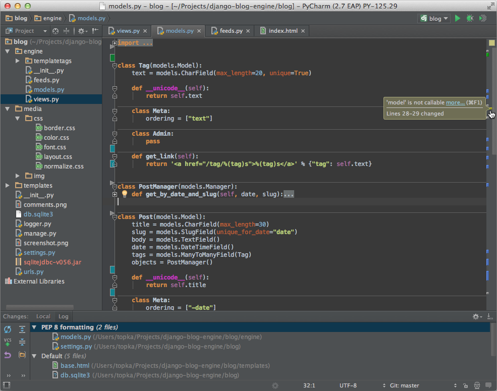
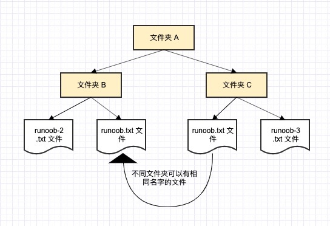

# Python 3 教程


Python 的 3.0 版本，常被称为 Python 3000，或简称 Py3k。相对于 Python 的早期版本，这是一个较大的升级。为了不带入过多的累赘，Python 3.0 在设计的时候没有考虑向下兼容。

Python 介绍及安装教程我们在[Python 2.X 版本的教程](https://www.runoob.com/python/python-tutorial.html)中已有介绍，这里就不再赘述。

你也可以点击 [Python2.x与3.x版本区别 ](https://www.runoob.com/python3/python-2x-3x.html)来查看两者的不同。

本教程主要针对 Python 3.x 版本的学习，如果你使用的是 Python 2.x 版本请移步至 [Python 2.X 版本的教程](https://www.runoob.com/python/python-tutorial.html)。

**官方宣布，2020 年 1 月 1 日， 停止 Python 2 的更新。**

------

## 查看 Python 版本

我们可以在命令窗口(Windows 使用 win+R 调出 cmd 运行框)使用以下命令查看我们使用的 Python 版本：

```
python -V
```

以上命令执行结果如下：

```
Python 3.3.2
```

你也可以进入Python的交互式编程模式，查看版本：

```
Python 3.3.2 (v3.3.2:d047928ae3f6, May 16 2013, 00:03:43) [MSC v.1600 32 bit (Intel)] on win32
Type "copyright", "credits" or "license()" for more information.
>>> 
```

------

## 第一个Python3.x程序

对于大多数程序语言，第一个入门编程代码便是"Hello World！"，以下代码为使用Python输出"Hello World！"：

## 实例(Python 3.0+)

\#!/usr/bin/python3  print("Hello, World!")


[运行实例 »](https://www.runoob.com/try/runcode.php?filename=HelloWorld&type=python3)

你可以将以上代码保存在 hello.py 文件中并使用 python 命令执行该脚本文件。

```
$ python3 hello.py
```

以上命令输出结果为：

```
Hello, World!
```

------

## 相关内容：

[Python 3.6.3 中文手册](https://www.runoob.com/manual/pythontutorial3/docs/html/)

[Python 2.X 版本的教程](https://www.runoob.com/python/python-tutorial.html)

## 笔记

关于实例中第一行代码**#!/usr/bin/python3** 的理解：

分成两种情况：

**（1）**如果调用python脚本时，使用:

```
python script.py 
```

**#!/usr/bin/python** 被忽略，等同于注释。

**（2）**如果调用python脚本时，使用:

```
./script.py 
```

**#!/usr/bin/python** 指定解释器的路径。

再解释一下第一行代码`**#!/usr/bin/python3**`

这句话仅仅在linux或unix系统下有作用，在windows下无论在代码里加什么都无法直接运行一个文件名后缀为.py的脚本，因为在windows下文件名对文件的打开方式起了决定性作用。

再解释一下第一行代码 **#!/usr/bin/python3**

这句话仅仅在 linux 或 unix 系统下有作用，在 windows 下无论在代码里加什么都无法直接运行一个文件名后缀为 .py 的脚本，因为在 windows 下文件名对文件的打开方式起了决定性作用。

这个理论不完全正确，至少我知道的不是这样，我在WIN下安装了 64 位的 python,然后下载了 32 位的 embeddable 版，然后在第一行加了这个，把脚本指向 32 位 python 的位置，然后运行正常，是按 32 位版的运行。

至于原因，现在 python 安装的时候会在 windows 目录下放两个文件 py.exe 和 pyw.exe，然后文件类型指向这个这两个文件，可能是由这两个文件判断由哪个 python.exe 去执行脚本。

脚本语言的第一行，目的就是指出，你想要你的这个文件中的代码用什么可执行程序去运行它，就这么简单。

**#!/usr/bin/python3** 是告诉操作系统执行这个脚本的时候，调用 /usr/bin 下的 python3 解释器；

**#!/usr/bin/env python3** 这种用法是为了防止操作系统用户没有将 python3 装在默认的 /usr/bin 路径里。当系统看到这一行的时候，首先会到 env 设置里查找 python3 的安装路径，再调用对应路径下的解释器程序完成操作。

**#!/usr/bin/python3** 相当于写死了 **python3** 路径;

**#!/usr/bin/env python3** 会去环境设置寻找 python3 目录，**推荐这种写法**。


# Python3 简介

Python 是一个高层次的结合了解释性、编译性、互动性和面向对象的脚本语言。

Python 的设计具有很强的可读性，相比其他语言经常使用英文关键字，其他语言的一些标点符号，它具有比其他语言更有特色语法结构。

- **Python 是一种解释型语言：** 这意味着开发过程中没有了编译这个环节。类似于PHP和Perl语言。
- **Python 是交互式语言：** 这意味着，您可以在一个 Python 提示符 **>>>** 后直接执行代码。
- **Python 是面向对象语言:** 这意味着Python支持面向对象的风格或代码封装在对象的编程技术。
- **Python 是初学者的语言：**Python 对初级程序员而言，是一种伟大的语言，它支持广泛的应用程序开发，从简单的文字处理到 WWW 浏览器再到游戏。


------

## Python 发展历史

Python 是由 Guido van Rossum 在八十年代末和九十年代初，在荷兰国家数学和计算机科学研究所设计出来的。

Python 本身也是由诸多其他语言发展而来的,这包括 ABC、Modula-3、C、C++、Algol-68、SmallTalk、Unix shell 和其他的脚本语言等等。

像 Perl 语言一样，Python 源代码同样遵循 GPL(GNU General Public License)协议。

现在 Python 是由一个核心开发团队在维护，Guido van Rossum 仍然占据着至关重要的作用，指导其进展。

Python 2.0 于 2000 年 10 月 16 日发布，增加了实现完整的垃圾回收，并且支持 Unicode。

Python 3.0 于 2008 年 12 月 3 日发布，此版不完全兼容之前的 Python 源代码。不过，很多新特性后来也被移植到旧的Python 2.6/2.7版本。

Python 3.0 版本，常被称为 Python 3000，或简称 Py3k。相对于 Python 的早期版本，这是一个较大的升级。

Python 2.7 被确定为最后一个 Python 2.x 版本，它除了支持 Python 2.x 语法外，还支持部分 Python 3.1 语法。


------

## Python 特点

- **1.易于学习：**Python有相对较少的关键字，结构简单，和一个明确定义的语法，学习起来更加简单。
- **2.易于阅读：**Python代码定义的更清晰。
- **3.易于维护：**Python的成功在于它的源代码是相当容易维护的。
- **4.一个广泛的标准库：**Python的最大的优势之一是丰富的库，跨平台的，在UNIX，Windows和Macintosh兼容很好。
- **5.互动模式：**互动模式的支持，您可以从终端输入执行代码并获得结果的语言，互动的测试和调试代码片断。
- **6.可移植：**基于其开放源代码的特性，Python已经被移植（也就是使其工作）到许多平台。
- **7.可扩展：**如果你需要一段运行很快的关键代码，或者是想要编写一些不愿开放的算法，你可以使用C或C++完成那部分程序，然后从你的Python程序中调用。
- **8.数据库：**Python提供所有主要的商业数据库的接口。
- **9.GUI编程：**Python支持GUI可以创建和移植到许多系统调用。
- **10.可嵌入:** 你可以将Python嵌入到C/C++程序，让你的程序的用户获得"脚本化"的能力。

------

## Python 应用

- Youtube - 视频社交网站
- Reddit - 社交分享网站
- Dropbox - 文件分享服务
- 豆瓣网 - 图书、唱片、电影等文化产品的资料数据库网站
- 知乎 - 一个问答网站
- 果壳 - 一个泛科技主题网站
- Bottle - Python微Web框架
- EVE - 网络游戏EVE大量使用Python进行开发
- Blender - 使用Python作为建模工具与GUI语言的开源3D绘图软件
- Inkscape - 一个开源的SVG矢量图形编辑器。
- ...


## 笔记

**优点**

-  简单 -- Python 是一种代表简单主义思想的语言。阅读一个良好的 Python 程序就感觉像是在读英语一样，尽管这个英语的要求非常严格！Python 的这种伪代码本质是它最大的优点之一。它使你能够专注于解决问题而不是去搞明白语言本身。
-  易学 -- 就如同你即将看到的一样，Python 极其容易上手。前面已经提到了，Python 有极其简单的语法。
-  免费、开源 -- Python 是 FLOSS（自由/开放源码软件）之一。简单地说，你可以自由地发布这个软件的拷贝、阅读它的源代码、对它做改动、把它的一部分用于新的自由软件中。FLOSS 是基于一个团体分享知识的概念。这是为什么 Python 如此优秀的原因之一——它是由一群希望看到一个更加优秀的 Python 的人创造并经常改进着的。
-  高层语言 -- 当你用 Python 语言编写程序的时候，你无需考虑诸如如何管理你的程序使用的内存一类的底层细节。
-  可移植性 -- 由于它的开源本质，Python 已经被移植在许多平台上（经过改动使它能够工作在不同平台上）。如果你小心地避免使用依赖于系统的特性，那么你的所有 Python 程序无需修改就可以在下述任何平台上面运行。这些平台包括 Linux、Windows、FreeBSD、Macintosh、Solaris、OS/2、Amiga、AROS、AS/400、BeOS、OS/390、z/OS、Palm OS、QNX、VMS、Psion、Acom RISC OS、VxWorks、PlayStation、Sharp Zaurus、Windows CE 甚至还有 PocketPC、Symbian 以及 Google 基于 Linux 开发的 Android 平台！
-  解释性 -- 这一点需要一些解释。一个用编译性语言比如 C 或 C++ 写的程序可以从源文件（即 C 或 C++ 语言）转换到一个你的计算机使用的语言（二进制代码，即0和1）。这个过程通过编译器和不同的标记、选项完成。当你运行你的程序的时候，连接/转载器软件把你的程序从硬盘复制到内存中并且运行。而 Python 语言写的程序不需要编译成二进制代码。你可以直接从源代码运行程序。在计算机内部，Python 解释器把源代码转换成称为字节码的中间形式，然后再把它翻译成计算机使用的机器语言并运行。事实上，由于你不再需要担心如何编译程序，如何确保连接转载正确的库等等，所有这一切使得使用 Python 更加简单。由于你只需要把你的 Python 程序拷贝到另外一台计算机上，它就可以工作了，这也使得你的 Python 程序更加易于移植。
-  面向对象 -- Python 既支持面向过程的编程也支持面向对象的编程。在“面向过程”的语言中，程序是由过程或仅仅是可重用代码的函数构建起来的。在“面向对象”的语言中，程序是由数据和功能组合而成的对象构建起来的。与其他主要的语言如 C++ 和 Java 相比，Python 以一种非常强大又简单的方式实现面向对象编程。
-  可扩展性 -- 如果你需要你的一段关键代码运行得更快或者希望某些算法不公开，你可以把你的部分程序用 C 或 C++ 编写，然后在你的 Python 程序中使用它们。
-  丰富的库 -- Python 标准库确实很庞大。它可以帮助你处理各种工作，包括正则表达式、文档生成、单元测试、线程、数据库、网页浏览器、CGI、FTP、电子邮件、XML、XML-RPC、HTML、WAV 文件、密码系统、GUI（图形用户界面）、Tk 和其他与系统有关的操作。记住，只要安装了 Python，所有这些功能都是可用的。这被称作 Python 的“功能齐全”理念。除了标准库以外，还有许多其他高质量的库，如 wxPython、Twisted 和 Python 图像库等等。
-  规范的代码 -- Python 采用强制缩进的方式使得代码具有极佳的可读性。

**缺点**

-  运行速度，有速度要求的话，用 C++ 改写关键部分吧。
-  国内市场较小（国内以 Python 来做主要开发的，目前只有一些 web2.0 公司）。但时间推移，目前很多国内软件公司，尤其是游戏公司，也开始规模使用他。
-  中文资料匮乏（好的 Python 中文资料屈指可数，现在应该变多了）。托社区的福，有几本优秀的教材已经被翻译了，但入门级教材多，高级内容还是只能看英语版。
-  构架选择太多（没有像 C# 这样的官方 .net 构架，也没有像 ruby 由于历史较短，构架开发的相对集中。Ruby on Rails 构架开发中小型web程序天下无敌）。不过这也从另一个侧面说明，python比较优秀，吸引的人才多，项目也多。

**Python 的主要运用领域有:**

-  **云计算**：云计算最热的语言，典型的应用OpenStack
-  **WEB开发**：许多优秀的WEB框架，许多大型网站是Python开发、YouTube、Dropbox、Douban……典型的Web框架包括Django
-  **科学计算和人工智能**：典型的图书馆NumPy、SciPy、Matplotlib、Enided图书馆、熊猫
-  **系统操作和维护**：操作和维护人员的基本语言
-  **金融**：定量交易、金融分析，在金融工程领域，Python不仅使用最多，而且使用最多，其重要性逐年增加。
-  **图形 GUI**：PyQT，WXPython，TkInter

**Python 在一些公司的运用有:**

-  **谷歌**：谷歌应用程序引擎，代码。Google.com、 Google 爬虫、Google 广告和其他项目正在广泛使用 Python。
-  **CIA**：美国中情局网站是用 Python 开发的。
-  **NASA**：美国航天局广泛使用 Python 进行数据分析和计算。
-  **YouTube**：世界上最大的视频网站 YouTube 是用 Python 开发的。
-  **Dropbox**：美国最大的在线云存储网站，全部用 Python 实现，每天处理 10 亿的文件上传和下载。
-  **Instagram**：美国最大的照片共享社交网站，每天有 3000 多万张照片被共享，所有这些都是用 Python 开发的。
-  **Facebook**：大量的基本库是通过 Python 实现的
-  **Red Hat/Centos**：世界上最流行的 Linux 发行版中的 Yum 包管理工具是用 Python 开发的
-  Douban：几乎所有公司的业务都是通过 Python 开发的。
-  知乎：中国最大的 Q＆A 社区，通过 Python 开发（国外 Quora）

除此之外，还有搜狐、金山、腾讯、盛大、网易、百度、阿里、淘宝、土豆、新浪、果壳等公司正在使用 Python 来完成各种任务。


# Python3 环境搭建

本章节我们将向大家介绍如何在本地搭建 Python3 开发环境。

Python3 可应用于多平台包括 Windows、Linux 和 Mac OS X。

- Unix (Solaris, Linux, FreeBSD, AIX, HP/UX, SunOS, IRIX, 等等。)
- Win 9x/NT/2000
- Macintosh (Intel, PPC, 68K)
- OS/2
- DOS (多个DOS版本)
- PalmOS
- Nokia 移动手机
- Windows CE
- Acorn/RISC OS
- BeOS
- Amiga
- VMS/OpenVMS
- QNX
- VxWorks
- Psion
- Python 同样可以移植到 Java 和 .NET 虚拟机上。


------

## Python3 下载

Python3 最新源码，二进制文档，新闻资讯等可以在 Python 的官网查看到：

Python 官网：https://www.python.org/

你可以在以下链接中下载 Python 的文档，你可以下载 HTML、PDF 和 PostScript 等格式的文档。

Python文档下载地址：https://www.python.org/doc/


------

## Python 安装

Python 已经被移植在许多平台上（经过改动使它能够工作在不同平台上）。

您需要下载适用于您使用平台的二进制代码，然后安装 Python。

如果您平台的二进制代码是不可用的，你需要使用C编译器手动编译源代码。

编译的源代码，功能上有更多的选择性， 为 Python 安装提供了更多的灵活性。

以下是各个平台安装包的下载地址：


**Source Code** 可用于 Linux 上的安装。

以下为不同平台上安装 Python3 的方法。

### Unix & Linux 平台安装 Python3:

以下为在 Unix & Linux 平台上安装 Python 的简单步骤：

- 打开WEB浏览器访问 https://www.python.org/downloads/source/
- 选择适用于 Unix/Linux 的源码压缩包。
- 下载及解压压缩包 **Python-3.x.x.tgz**，**3.x.x** 为你下载的对应版本号。
- 如果你需要自定义一些选项修改 *Modules/Setup*

以 **Python3.6.1** 版本为例：

```
# tar -zxvf Python-3.6.1.tgz
# cd Python-3.6.1
# ./configure
# make && make install
```

检查 Python3 是否正常可用：

```
# python3 -V
Python 3.6.1
```

### Window 平台安装 Python:

以下为在 Window 平台上安装 Python 的简单步骤。

打开 WEB 浏览器访问 https://www.python.org/downloads/windows/ ，一般就下载 executable installer，x86 表示是 32 位机子的，x86-64 表示 64 位机子的。


记得勾选 **Add Python 3.6 to PATH**。


按 **Win+R** 键，输入 cmd 调出命令提示符，输入 python:


也可以在开始菜单中搜索 **IDLE**：


### MAC 平台安装 Python:

MAC 系统都自带有 Python2.7 环境，你可以在链接 https://www.python.org/downloads/mac-osx/ 上下载最新版安装 Python 3.x。

你也可以参考源码安装的方式来安装。


------

## 环境变量配置

程序和可执行文件可以在许多目录，而这些路径很可能不在操作系统提供可执行文件的搜索路径中。

path(路径)存储在环境变量中，这是由操作系统维护的一个命名的字符串。这些变量包含可用的命令行解释器和其他程序的信息。

Unix或Windows中路径变量为PATH（UNIX区分大小写，Windows不区分大小写）。

在Mac OS中，安装程序过程中改变了python的安装路径。如果你需要在其他目录引用Python，你必须在path中添加Python目录。

### 在 Unix/Linux 设置环境变量

- 在 csh shell:

   

  输入

  ```
  setenv PATH "$PATH:/usr/local/bin/python"
  ```

  , 按下

   

  Enter

  。

- 在 bash shell (Linux) 输入 :

  ```
  export PATH="$PATH:/usr/local/bin/python" 
  ```

  按下

   

  Enter

   

  。

- 在 sh 或者 ksh shell 输入:

  ```
  PATH="$PATH:/usr/local/bin/python" 
  ```

  按下 Enter。

**注意:** /usr/local/bin/python 是 Python 的安装目录。

### 在 Windows 设置环境变量

在环境变量中添加Python目录：

**在命令提示框中(cmd) :** 输入

```
path=%path%;C:\Python 
```

按下"Enter"。


**注意:** C:\Python 是Python的安装目录。

也可以通过以下方式设置：

- 右键点击"计算机"，然后点击"属性"
- 然后点击"高级系统设置"
- 选择"系统变量"窗口下面的"Path",双击即可！
- 
- 然后在"Path"行，添加python安装路径即可(我的D:\Python32)，所以在后面，添加该路径即可。 **ps：记住，路径直接用分号"；"隔开！**
- 最后设置成功以后，在cmd命令行，输入命令"python"，就可以有相关显示。


------

## Python 环境变量

下面几个重要的环境变量，它应用于Python：

| 变量名        | 描述                                                         |
| :------------ | :----------------------------------------------------------- |
| PYTHONPATH    | PYTHONPATH是Python搜索路径，默认我们import的模块都会从PYTHONPATH里面寻找。 |
| PYTHONSTARTUP | Python启动后，先寻找PYTHONSTARTUP环境变量，然后执行此变量指定的文件中的代码。 |
| PYTHONCASEOK  | 加入PYTHONCASEOK的环境变量, 就会使python导入模块的时候不区分大小写. |
| PYTHONHOME    | 另一种模块搜索路径。它通常内嵌于的PYTHONSTARTUP或PYTHONPATH目录中，使得两个模块库更容易切换。 |


------

## 运行Python

有三种方式可以运行Python：

### 1、交互式解释器：

你可以通过命令行窗口进入python并开在交互式解释器中开始编写Python代码。

你可以在Unix，DOS或任何其他提供了命令行或者shell的系统进行python编码工作。

$ python # Unix/Linux

或者

C:>python # Windows/DOS

以下为Python命令行参数：

| 选项   | 描述                                                   |
| :----- | :----------------------------------------------------- |
| -d     | 在解析时显示调试信息                                   |
| -O     | 生成优化代码 ( .pyo 文件 )                             |
| -S     | 启动时不引入查找Python路径的位置                       |
| -V     | 输出Python版本号                                       |
| -X     | 从 1.6版本之后基于内建的异常（仅仅用于字符串）已过时。 |
| -c cmd | 执行 Python 脚本，并将运行结果作为 cmd 字符串。        |
| file   | 在给定的python文件执行python脚本。                     |

### 2、命令行脚本

在你的应用程序中通过引入解释器可以在命令行中执行Python脚本，如下所示：

$ python script.py # Unix/Linux

或者

C:>python script.py # Windows/DOS

**注意：**在执行脚本时，请检查脚本是否有可执行权限。

### 3、集成开发环境（IDE：Integrated Development Environment）: PyCharm

PyCharm 是由 JetBrains 打造的一款 Python IDE，支持 macOS、 Windows、 Linux 系统。

PyCharm 功能 : 调试、语法高亮、Project管理、代码跳转、智能提示、自动完成、单元测试、版本控制……

PyCharm 下载地址 : https://www.jetbrains.com/pycharm/download/

PyCharm 安装地址：[http://www.runoob.com/w3cnote/pycharm-windows-install.html](https://www.runoob.com/w3cnote/pycharm-windows-install.html)




## 笔记

**使用交互式 ipython 运行 Python**

ipython 是一个 python 的交互式 shell，比默认的 python shell 好用得多，支持变量自动补全，自动缩进，支持 bash shell 命令，内置了许多很有用的功能和函数。

此 ipython 中的 i 代表 “交互(interaction)”。

官方地址：https://ipython.org/install.html

安装:

```
pip install ipython
```

Linux 环境还可以使用以下命令安装：

```
# Ubuntu
sudo apt-get install ipython

# Centos
yum  install ipython
```

使用:

```
ipython
```

**如何在 cygwin 模拟器中安装 python3**

Cygwin 是一个在 windows 平台上运行的类 UNIX 模拟环境，是 cygnus solutions 公司开发的自由软件（该公司开发的著名工具还有 eCos，不过现已被 Redhat 收购）。它对于学习 UNIX/Linux 操作环境，或者从 UNIX 到 Windows 的应用程序移植，或者进行某些特殊的开发工作，尤其是使用 GNU 工具集在 Windows 上进行嵌入式系统开发，非常有用。

安装 cygwin：

**1.下载可执行文件 http://www.cygwin.com/setup-x86.exe**

\2. 选择 "Install from internet", 点击 Next。

\3. 根目录 C:\cygwin (不建议其他目录，特别带有空格的目录名）。 4. 选择下载网站，http://sourceware.mirror.tds.net 下载比较稳定。 5. 在 "Select Packages" 菜单中选择 "Category",添加以下包:

```
under Archive select zip and unzip
under Database, select postgresql
optional: under Editors select vim (if you want to be able to edit files with vi)
under Graphics, select gnuplot
under Libs, select libglib2.0_0
under Net select curl, inetutils, openssh, openssl
under Perl select perl, perl-XML-Simple, and perl-IO-Tty
under Python select python2
under Tcl select expect
```

\6. 点击 Next, 开始安装。

\7. 复制文件 moshell/examples/cygwin_install/cygwin_install.txt 到 C:/Cygwin (也可以在这个地址下载：http://newtran01.au.ao.ericsson.se/moshell/cygwin_install.txt)。

\8. Windows 下点击 开始 –> 运行。

在 "运行" 窗口, 输入 cmd , 然后按下回车键。

打开 DOS 窗口，在 DOS 窗口执行以下命令：

```
c:
cd cygwin
bin\perl.exe cygwin_install.txt
```

安装 python3

```
wget rawgit.com/transcode-open/apt-cyg/master/apt-cyg
install apt-cyg /bin
apt-cyg install python3
```

验证：

```
[~]$ python3
Python 3.6.8 (default, Feb 15 2019, 01:54:23)
[GCC 7.4.0] on cygwin
Type "help", "copyright", "credits" or "license" for more information.
>>>
```

mac安装py3 (身为一个优秀的程序员必须要配个mac)

1、安装/更新 brew [不知道brew的点进去了解一下](https://brew.sh/index_zh-cn)

```
/bin/bash -c "$(curl -fsSL https://raw.githubusercontent.com/Homebrew/install/master/install.sh)"
```

2、安装py3

```
brew install python3
```

3、由于mac在安装xcode时候会默认安装python2 所以需要改一下配置

(为啥不删除python2因为我胆小,为啥不用python2应为我喜欢新版本)

打开 配置文件

```
vim ~/.zshrc
```

增加配置信息(下面是我配置信息 路径自己改改)

```
alias python2='/System/Library/Frameworks/Python.framework/Versions/2.7/bin/python2.7' 
alias python3='/usr/local/Cellar/python/3.7.3/bin/python3.7' 
alias python=python3
```

刷新一下文件信息(不刷新的话 不会立即生效)

```
source ~/.zshrc
```

查看py版本

```
python --version       # Python 3.7.5
python2 --version      # Python 2.7.10    
```

再推荐一个开发工具vscode [官方下载地址]( https://code.visualstudio.com/ ) 

优点: **强大、开源、免费(狠重要)、插件多**


# Python3 基础语法

## 编码

默认情况下，Python 3 源码文件以 **UTF-8** 编码，所有字符串都是 unicode 字符串。 当然你也可以为源码文件指定不同的编码：

```
# -*- coding: cp-1252 -*-
```

上述定义允许在源文件中使用 Windows-1252 字符集中的字符编码，对应适合语言为保加利亚语、白罗斯语、马其顿语、俄语、塞尔维亚语。

------

## 标识符

- 第一个字符必须是字母表中字母或下划线 **_** 。
- 标识符的其他的部分由字母、数字和下划线组成。
- 标识符对大小写敏感。

在 Python 3 中，可以用中文作为变量名，非 ASCII 标识符也是允许的了。

------

## python保留字

保留字即关键字，我们不能把它们用作任何标识符名称。Python 的标准库提供了一个 keyword 模块，可以输出当前版本的所有关键字：

```
>>> import keyword
>>> keyword.kwlist
['False', 'None', 'True', 'and', 'as', 'assert', 'break', 'class', 'continue', 'def', 'del', 'elif', 'else', 'except', 'finally', 'for', 'from', 'global', 'if', 'import', 'in', 'is', 'lambda', 'nonlocal', 'not', 'or', 'pass', 'raise', 'return', 'try', 'while', 'with', 'yield']
```

------

## 注释

Python中单行注释以 **#** 开头，实例如下：

## 实例(Python 3.0+)

\#!/usr/bin/python3  # 第一个注释 print ("Hello, Python!") # 第二个注释

执行以上代码，输出结果为：

```
Hello, Python!
```

多行注释可以用多个 **#** 号，还有 **'''** 和 **"""**：

## 实例(Python 3.0+)

\#!/usr/bin/python3  # 第一个注释 # 第二个注释  ''' 第三注释 第四注释 '''  """ 第五注释 第六注释 """ print ("Hello, Python!")

执行以上代码，输出结果为：

```
Hello, Python!
```

------

## 行与缩进

python最具特色的就是使用缩进来表示代码块，不需要使用大括号 **{}** 。

缩进的空格数是可变的，但是同一个代码块的语句必须包含相同的缩进空格数。实例如下：

## 实例(Python 3.0+)

if True:    print ("True") else:    print ("False")

以下代码最后一行语句缩进数的空格数不一致，会导致运行错误：

```
if True:
    print ("Answer")
    print ("True")
else:
    print ("Answer")
  print ("False")    # 缩进不一致，会导致运行错误
```

以上程序由于缩进不一致，执行后会出现类似以下错误：

```
 File "test.py", line 6
    print ("False")    # 缩进不一致，会导致运行错误
                                      ^
IndentationError: unindent does not match any outer indentation level
```

------

## 多行语句

Python 通常是一行写完一条语句，但如果语句很长，我们可以使用反斜杠(\)来实现多行语句，例如：

```
total = item_one + \
        item_two + \
        item_three
```

在 [], {}, 或 () 中的多行语句，不需要使用反斜杠(\)，例如：

```
total = ['item_one', 'item_two', 'item_three',
        'item_four', 'item_five']
```

------

## 数字(Number)类型

python中数字有四种类型：整数、布尔型、浮点数和复数。

- **int** (整数), 如 1, 只有一种整数类型 int，表示为长整型，没有 python2 中的 Long。
- **bool** (布尔), 如 True。
- **float** (浮点数), 如 1.23、3E-2
- **complex** (复数), 如 1 + 2j、 1.1 + 2.2j

------

## 字符串(String)

- python中单引号和双引号使用完全相同。
- 使用三引号('''或""")可以指定一个多行字符串。
- 转义符 '\'
- 反斜杠可以用来转义，使用r可以让反斜杠不发生转义。。 如 r"this is a line with \n" 则\n会显示，并不是换行。
- 按字面意义级联字符串，如"this " "is " "string"会被自动转换为this is string。
- 字符串可以用 + 运算符连接在一起，用 * 运算符重复。
- Python 中的字符串有两种索引方式，从左往右以 0 开始，从右往左以 -1 开始。
- Python中的字符串不能改变。
- Python 没有单独的字符类型，一个字符就是长度为 1 的字符串。
- 字符串的截取的语法格式如下：**变量[头下标:尾下标:步长]**

```
word = '字符串'
sentence = "这是一个句子。"
paragraph = """这是一个段落，
可以由多行组成"""
```

## 实例(Python 3.0+)

\#!/usr/bin/python3  str='Runoob'  print(str)                 # 输出字符串 print(str[0:-1])           # 输出第一个到倒数第二个的所有字符 print(str[0])              # 输出字符串第一个字符 print(str[2:5])            # 输出从第三个开始到第五个的字符 print(str[2:])             # 输出从第三个开始后的所有字符 print(str * 2)             # 输出字符串两次 print(str + '你好')        # 连接字符串  print('------------------------------')  print('hello\nrunoob')      # 使用反斜杠(\)+n转义特殊字符 print(r'hello\nrunoob')     # 在字符串前面添加一个 r，表示原始字符串，不会发生转义

这里的 r 指 raw，即 raw string。

输出结果为：

```
Runoob
Runoo
R
noo
noob
RunoobRunoob
Runoob你好
------------------------------
hello
runoob
hello\nrunoob
```

------

## 空行

函数之间或类的方法之间用空行分隔，表示一段新的代码的开始。类和函数入口之间也用一行空行分隔，以突出函数入口的开始。

空行与代码缩进不同，空行并不是Python语法的一部分。书写时不插入空行，Python解释器运行也不会出错。但是空行的作用在于分隔两段不同功能或含义的代码，便于日后代码的维护或重构。

**记住：**空行也是程序代码的一部分。

------

## 等待用户输入

执行下面的程序在按回车键后就会等待用户输入：

## 实例(Python 3.0+)

\#!/usr/bin/python3  input("\n\n按下 enter 键后退出。")

以上代码中 ，"\n\n"在结果输出前会输出两个新的空行。一旦用户按下 enter 键时，程序将退出。

------

## 同一行显示多条语句

Python可以在同一行中使用多条语句，语句之间使用分号(;)分割，以下是一个简单的实例：


## 实例(Python 3.0+)

\#!/usr/bin/python3  import sys; x = 'runoob'; sys.stdout.write(x + '\n')

使用脚本执行以上代码，输出结果为：

```
runoob
```

使用交互式命令行执行，输出结果为：

```
>>> import sys; x = 'runoob'; sys.stdout.write(x + '\n')
runoob
7
```

此处的 7 表示字符数。

------

## 多个语句构成代码组

缩进相同的一组语句构成一个代码块，我们称之代码组。

像if、while、def和class这样的复合语句，首行以关键字开始，以冒号( : )结束，该行之后的一行或多行代码构成代码组。

我们将首行及后面的代码组称为一个子句(clause)。

如下实例：

```
if expression : 
   suite
elif expression : 
   suite 
else : 
   suite
```

------

## Print 输出

print 默认输出是换行的，如果要实现不换行需要在变量末尾加上 **end=""**：

## 实例(Python 3.0+)

\#!/usr/bin/python3  x="a" y="b" # 换行输出 print( x ) print( y )  print('---------') # 不换行输出 print( x, end=" " ) print( y, end=" " ) print()

以上实例执行结果为：

```
a
b
---------
a b
```

------

## import 与 from...import

在 python 用 **import** 或者 **from...import** 来导入相应的模块。

将整个模块(somemodule)导入，格式为： **import somemodule**

从某个模块中导入某个函数,格式为： **from somemodule import somefunction**

从某个模块中导入多个函数,格式为： **from somemodule import firstfunc, secondfunc, thirdfunc**

将某个模块中的全部函数导入，格式为： **from somemodule import \***

## 导入 sys 模块

import sys print('================Python import mode==========================') print ('命令行参数为:') for i in sys.argv:    print (i) print ('\n python 路径为',sys.path)

## 导入 sys 模块的 argv,path 成员

from sys import argv,path  #  导入特定的成员  print('================python from import===================================') print('path:',path) # 因为已经导入path成员，所以此处引用时不需要加sys.path

------

## 命令行参数

很多程序可以执行一些操作来查看一些基本信息，Python可以使用-h参数查看各参数帮助信息：

```
$ python -h
usage: python [option] ... [-c cmd | -m mod | file | -] [arg] ...
Options and arguments (and corresponding environment variables):
-c cmd : program passed in as string (terminates option list)
-d     : debug output from parser (also PYTHONDEBUG=x)
-E     : ignore environment variables (such as PYTHONPATH)
-h     : print this help message and exit

[ etc. ]
```

我们在使用脚本形式执行 Python 时，可以接收命令行输入的参数，具体使用可以参照 [Python 3 命令行参数](https://www.runoob.com/python3/python3-command-line-arguments.html)。


## 笔记

在 Windows 下可以不写第一行注释:

```
#!/usr/bin/python3
```

第一行注释标的是指向 python 的路径，告诉操作系统执行这个脚本的时候，调用 /usr/bin 下的 python 解释器。

此外还有以下形式（推荐写法）：

```
#!/usr/bin/env python3
```

这种用法先在 env（环境变量）设置里查找 python 的安装路径，再调用对应路径下的解释器程序完成操作。

关于注释，也可以使用 **''' '''** 的格式在三引号之间书写较长的注释；

**''' '''** 还可以用于在函数的首部对函数进行一个说明：

```
def example(anything):
    '''形参为任意类型的对象，
       这个示例函数会将其原样返回。
    '''
    return anything
```

## help() 函数

调用 python 的 help() 函数可以打印输出一个函数的文档字符串：

```
# 如下实例，查看 max 内置函数的参数列表和规范的文档
>>> help(max)
……显示帮助信息……
```

按下 **: q** 两个按键即退出说明文档

如果仅仅想得到文档字符串：

```
>>> print(max.__doc__)    # 注意，doc的前后分别是两个下划线
max(iterable, *[, default=obj, key=func]) -> value
max(arg1, arg2, *args, *[, key=func]) -> value

With a single iterable argument, return its biggest item. The
default keyword-only argument specifies an object to return if
the provided iterable is empty.
With two or more arguments, return the largest argument.
```

在 print 打印的时候双引号与单引号都可以当做定界符使用，且可以嵌套。

被嵌套的会被解释成为标点符号，反之一样。

代码实例：

```
print("Hello'World!")
```

这句代码执行时，外侧的双引号为定界符，里面的那个单引号为标点符号。

输出：

```
Hello'World!
print('Hello"World!')
```

这句代码执行时，外侧的单引号为定界符，里面的那个双引号为标点符号。

输出：

```
Hello"World!
```

### 要善用 help() 方法

通过命令 **help("print")** 我们知道这个方法里第三个为缺省参数 **sep=' '**。

这里表示我们使用分隔符为一个空格。

```
>>> help("print")
Help on built-in function print in module builtins:
print(...)
    print(value, ..., sep=' ', end='\n', file=sys.stdout, flush=False)
    Prints the values to a stream, or to sys.stdout by default.
    Optional keyword arguments:
    file:  a file-like object (stream); defaults to the current sys.stdout.
    sep:   string inserted between values, default a space.
    end:   string appended after the last value, default a newline.
    flush: whether to forcibly flush the stream.
```

所以在打印 dict 类的使用, 可以这样写:

```
>>> def getPairs(dict):
...     for k,v in dict.items() :
...             print(k,v,sep=':')
...
```

测试代码:

```
>>> getPairs({ x : x ** 3 for x in (1,2,3,4)})
1:1
2:8
3:27
4:64
>>>
```

“Windows 命令行窗口”下清屏，可用下面两种方法。

第一种方法，在命令行窗口输入：

```
>>> import os
>>> i=os.system("cls")
```

第二种方法，在命令行窗口输入：

```
>>> import subprocess
>>> i=subprocess.call("cls", shell=True)
```

关于 import 的小结，以 time 模块为例：

1、将整个模块导入，例如：**import time**，在引用时格式为：**time.sleep(1)**。

2、将整个模块中全部函数导入，例如：**from time import \***，在引用时格式为：**sleep(1)**。

3、将模块中特定函数导入，例如：**from time import sleep**，在引用时格式为：**sleep(1)**。

4、将模块换个别名，例如：**import time as abc**，在引用时格式为：**abc.sleep(1)**。

当字符串内容为浮点型要转换为整型时，无法直接用 int() 转换：

```
a='2.1'  # 这是一个字符串
print(int(a))
```

会报错 **"invalid literal for int() "**。

需要把字符串先转化成 float 型再转换成 int 型：

```
a='2.1'
print(int(float(a)))
```

输出 **2**。

# Python3 基本数据类型

Python 中的变量不需要声明。每个变量在使用前都必须赋值，变量赋值以后该变量才会被创建。

在 Python 中，变量就是变量，它没有类型，我们所说的"类型"是变量所指的内存中对象的类型。

等号（=）用来给变量赋值。

等号（=）运算符左边是一个变量名,等号（=）运算符右边是存储在变量中的值。例如：

## 实例(Python 3.0+)

\#!/usr/bin/python3

counter = 100      # 整型变量
miles  = 1000.0    # 浮点型变量
name   = "runoob"   # 字符串

**print** (counter)
**print** (miles)
**print** (name)


[运行实例 »](https://www.runoob.com/try/runcode.php?filename=basic_data_type1&type=python3)

执行以上程序会输出如下结果：

```
100
1000.0
runoob
```

### 多个变量赋值

Python允许你同时为多个变量赋值。例如：

```
a = b = c = 1
```

以上实例，创建一个整型对象，值为 1，从后向前赋值，三个变量被赋予相同的数值。

您也可以为多个对象指定多个变量。例如：

```
a, b, c = 1, 2, "runoob"
```

以上实例，两个整型对象 1 和 2 的分配给变量 a 和 b，字符串对象 "runoob" 分配给变量 c。

------

## 标准数据类型

Python3 中有六个标准的数据类型：

- Number（数字）
- String（字符串）
- List（列表）
- Tuple（元组）
- Set（集合）
- Dictionary（字典）

Python3 的六个标准数据类型中：

- **不可变数据（3 个）：**Number（数字）、String（字符串）、Tuple（元组）；
- **可变数据（3 个）：**List（列表）、Dictionary（字典）、Set（集合）。

------

## Number（数字）

Python3 支持 **int、float、bool、complex（复数）**。

在Python 3里，只有一种整数类型 int，表示为长整型，没有 python2 中的 Long。

像大多数语言一样，数值类型的赋值和计算都是很直观的。

内置的 type() 函数可以用来查询变量所指的对象类型。

```
>>> a, b, c, d = 20, 5.5, True, 4+3j
>>> print(type(a), type(b), type(c), type(d))
<class 'int'> <class 'float'> <class 'bool'> <class 'complex'>
```

此外还可以用 isinstance 来判断：

## 实例

\>>> a = 111
\>>> isinstance(a, int)
True
\>>>

isinstance 和 type 的区别在于：

- type()不会认为子类是一种父类类型。
- isinstance()会认为子类是一种父类类型。

```
>>> class A:
...     pass
... 
>>> class B(A):
...     pass
... 
>>> isinstance(A(), A)
True
>>> type(A()) == A 
True
>>> isinstance(B(), A)
True
>>> type(B()) == A
False
```

> **注意：**在 Python2 中是没有布尔型的，它用数字 0 表示 False，用 1 表示 True。到 Python3 中，把 True 和 False 定义成关键字了，但它们的值还是 1 和 0，它们可以和数字相加。

当你指定一个值时，Number 对象就会被创建：

```
var1 = 1
var2 = 10
```

您也可以使用del语句删除一些对象引用。

del语句的语法是：

```
del var1[,var2[,var3[....,varN]]]
```

您可以通过使用del语句删除单个或多个对象。例如：

```
del var
del var_a, var_b
```

### 数值运算

## 实例

\>>> 5 + 4 # 加法
9
\>>> 4.3 - 2 # 减法
2.3
\>>> 3 * 7 # 乘法
21
\>>> 2 / 4 # 除法，得到一个浮点数
0.5
\>>> 2 // 4 # 除法，得到一个整数
0
\>>> 17 % 3 # 取余
2
\>>> 2 ** 5 # 乘方
32

**注意：**

- 1、Python可以同时为多个变量赋值，如a, b = 1, 2。
- 2、一个变量可以通过赋值指向不同类型的对象。
- 3、数值的除法包含两个运算符：**/** 返回一个浮点数，**//** 返回一个整数。
- 4、在混合计算时，Python会把整型转换成为浮点数。

### 数值类型实例

| int    | float      | complex    |
| :----- | :--------- | :--------- |
| 10     | 0.0        | 3.14j      |
| 100    | 15.20      | 45.j       |
| -786   | -21.9      | 9.322e-36j |
| 080    | 32.3e+18   | .876j      |
| -0490  | -90.       | -.6545+0J  |
| -0x260 | -32.54e100 | 3e+26J     |
| 0x69   | 70.2E-12   | 4.53e-7j   |

Python还支持复数，复数由实数部分和虚数部分构成，可以用a + bj,或者complex(a,b)表示， 复数的实部a和虚部b都是浮点型

------

## String（字符串）

Python中的字符串用单引号 **'** 或双引号 **"** 括起来，同时使用反斜杠 **\** 转义特殊字符。

字符串的截取的语法格式如下：

```
变量[头下标:尾下标]
```

索引值以 0 为开始值，-1 为从末尾的开始位置。


加号 **+** 是字符串的连接符， 星号 ***** 表示复制当前字符串，与之结合的数字为复制的次数。实例如下：

## 实例

\#!/usr/bin/python3

str = 'Runoob'

**print** (str)      # 输出字符串
**print** (str[0:-1])   # 输出第一个到倒数第二个的所有字符
**print** (str[0])    # 输出字符串第一个字符
**print** (str[2:5])   # 输出从第三个开始到第五个的字符
**print** (str[2:])    # 输出从第三个开始的后的所有字符
**print** (str * 2)    # 输出字符串两次，也可以写成 print (2 * str)
**print** (str + "TEST") # 连接字符串

执行以上程序会输出如下结果：

```
Runoob
Runoo
R
noo
noob
RunoobRunoob
RunoobTEST
```

Python 使用反斜杠 **\** 转义特殊字符，如果你不想让反斜杠发生转义，可以在字符串前面添加一个 **r**，表示原始字符串：

## 实例

\>>> **print**('Ru**\n**oob')
Ru
oob
\>>> **print**(r'Ru**\n**oob')
Ru\noob
\>>>

另外，反斜杠(\)可以作为续行符，表示下一行是上一行的延续。也可以使用 **"""..."""** 或者 **'''...'''** 跨越多行。

注意，Python 没有单独的字符类型，一个字符就是长度为1的字符串。

## 实例

\>>> word = 'Python'
\>>> **print**(word[0], word[5])
P n
\>>> **print**(word[-1], word[-6])
n P

与 C 字符串不同的是，Python 字符串不能被改变。向一个索引位置赋值，比如word[0] = 'm'会导致错误。

**注意：**

- 1、反斜杠可以用来转义，使用r可以让反斜杠不发生转义。
- 2、字符串可以用+运算符连接在一起，用*运算符重复。
- 3、Python中的字符串有两种索引方式，从左往右以0开始，从右往左以-1开始。
- 4、Python中的字符串不能改变。

------

## List（列表）

List（列表） 是 Python 中使用最频繁的数据类型。

列表可以完成大多数集合类的数据结构实现。列表中元素的类型可以不相同，它支持数字，字符串甚至可以包含列表（所谓嵌套）。

列表是写在方括号 **[]** 之间、用逗号分隔开的元素列表。

和字符串一样，列表同样可以被索引和截取，列表被截取后返回一个包含所需元素的新列表。

列表截取的语法格式如下：

```
变量[头下标:尾下标]
```

索引值以 0 为开始值，-1 为从末尾的开始位置。


加号 **+** 是列表连接运算符，星号 ***** 是重复操作。如下实例：

## 实例

\#!/usr/bin/python3

list = [ 'abcd', 786 , 2.23, 'runoob', 70.2 ]
tinylist = [123, 'runoob']

**print** (list)       # 输出完整列表
**print** (list[0])     # 输出列表第一个元素
**print** (list[1:3])    # 从第二个开始输出到第三个元素
**print** (list[2:])     # 输出从第三个元素开始的所有元素
**print** (tinylist * 2)   # 输出两次列表
**print** (list + tinylist) # 连接列表

以上实例输出结果：

```
['abcd', 786, 2.23, 'runoob', 70.2]
abcd
[786, 2.23]
[2.23, 'runoob', 70.2]
[123, 'runoob', 123, 'runoob']
['abcd', 786, 2.23, 'runoob', 70.2, 123, 'runoob']
```

与Python字符串不一样的是，列表中的元素是可以改变的：

## 实例

\>>> a = [1, 2, 3, 4, 5, 6]
\>>> a[0] = 9
\>>> a[2:5] = [13, 14, 15]
\>>> a
[9, 2, 13, 14, 15, 6]
\>>> a[2:5] = []  # 将对应的元素值设置为 []
\>>> a
[9, 2, 6]

List 内置了有很多方法，例如 append()、pop() 等等，这在后面会讲到。

**注意：**

- 1、List写在方括号之间，元素用逗号隔开。
- 2、和字符串一样，list可以被索引和切片。
- 3、List可以使用+操作符进行拼接。
- 4、List中的元素是可以改变的。

Python 列表截取可以接收第三个参数，参数作用是截取的步长，以下实例在索引 1 到索引 4 的位置并设置为步长为 2（间隔一个位置）来截取字符串：


如果第三个参数为负数表示逆向读取，以下实例用于翻转字符串：

## 实例

**def** reverseWords(input):
   
  \# 通过空格将字符串分隔符，把各个单词分隔为列表
  inputWords = input.split(" ")
 
  \# 翻转字符串
  \# 假设列表 list = [1,2,3,4],  
  \# list[0]=1, list[1]=2 ，而 -1 表示最后一个元素 list[-1]=4 ( 与 list[3]=4 一样)
  \# inputWords[-1::-1] 有三个参数
  \# 第一个参数 -1 表示最后一个元素
  \# 第二个参数为空，表示移动到列表末尾
  \# 第三个参数为步长，-1 表示逆向
  inputWords=inputWords[-1::-1]
 
  \# 重新组合字符串
  output = ' '.join(inputWords)
   
  **return** output
 
**if** __name__ == "__main__":
  input = 'I like runoob'
  rw = reverseWords(input)
  **print**(rw)

输出结果为：

```
runoob like I
```

------

## Tuple（元组）

元组（tuple）与列表类似，不同之处在于元组的元素不能修改。元组写在小括号 **()** 里，元素之间用逗号隔开。

元组中的元素类型也可以不相同：

## 实例

\#!/usr/bin/python3

tuple = ( 'abcd', 786 , 2.23, 'runoob', 70.2 )
tinytuple = (123, 'runoob')

**print** (tuple)       # 输出完整元组
**print** (tuple[0])      # 输出元组的第一个元素
**print** (tuple[1:3])     # 输出从第二个元素开始到第三个元素
**print** (tuple[2:])     # 输出从第三个元素开始的所有元素
**print** (tinytuple * 2)   # 输出两次元组
**print** (tuple + tinytuple) # 连接元组

以上实例输出结果：

```
('abcd', 786, 2.23, 'runoob', 70.2)
abcd
(786, 2.23)
(2.23, 'runoob', 70.2)
(123, 'runoob', 123, 'runoob')
('abcd', 786, 2.23, 'runoob', 70.2, 123, 'runoob')
```

元组与字符串类似，可以被索引且下标索引从0开始，-1 为从末尾开始的位置。也可以进行截取（看上面，这里不再赘述）。

其实，可以把字符串看作一种特殊的元组。

## 实例

\>>> tup = (1, 2, 3, 4, 5, 6)
\>>> **print**(tup[0])
1
\>>> **print**(tup[1:5])
(2, 3, 4, 5)
\>>> tup[0] = 11 # 修改元组元素的操作是非法的
Traceback (most recent call last):
 File "<stdin>", line 1, **in** <module>
TypeError: 'tuple' object does **not** support item assignment
\>>>

虽然tuple的元素不可改变，但它可以包含可变的对象，比如list列表。

构造包含 0 个或 1 个元素的元组比较特殊，所以有一些额外的语法规则：

```
tup1 = ()    # 空元组
tup2 = (20,) # 一个元素，需要在元素后添加逗号
```

string、list 和 tuple 都属于 sequence（序列）。

**注意：**

- 1、与字符串一样，元组的元素不能修改。
- 2、元组也可以被索引和切片，方法一样。
- 3、注意构造包含 0 或 1 个元素的元组的特殊语法规则。
- 4、元组也可以使用+操作符进行拼接。

------

## Set（集合）

集合（set）是由一个或数个形态各异的大小整体组成的，构成集合的事物或对象称作元素或是成员。

基本功能是进行成员关系测试和删除重复元素。

可以使用大括号 **{ }** 或者 **set()** 函数创建集合，注意：创建一个空集合必须用 **set()** 而不是 **{ }**，因为 **{ }** 是用来创建一个空字典。

创建格式：

```
parame = {value01,value02,...}
或者
set(value)
```

## 实例

\#!/usr/bin/python3

sites = {'Google', 'Taobao', 'Runoob', 'Facebook', 'Zhihu', 'Baidu'}

**print**(sites)  # 输出集合，重复的元素被自动去掉

\# 成员测试
**if** 'Runoob' **in** sites :
  **print**('Runoob 在集合中')
**else** :
  **print**('Runoob 不在集合中')


\# set可以进行集合运算
a = set('abracadabra')
b = set('alacazam')

**print**(a)

**print**(a - b)   # a 和 b 的差集

**print**(a | b)   # a 和 b 的并集

**print**(a & b)   # a 和 b 的交集

**print**(a ^ b)   # a 和 b 中不同时存在的元素

以上实例输出结果：

```
{'Zhihu', 'Baidu', 'Taobao', 'Runoob', 'Google', 'Facebook'}
Runoob 在集合中
{'b', 'c', 'a', 'r', 'd'}
{'r', 'b', 'd'}
{'b', 'c', 'a', 'z', 'm', 'r', 'l', 'd'}
{'c', 'a'}
{'z', 'b', 'm', 'r', 'l', 'd'}
```

------

## Dictionary（字典）

字典（dictionary）是Python中另一个非常有用的内置数据类型。

列表是有序的对象集合，字典是无序的对象集合。两者之间的区别在于：字典当中的元素是通过键来存取的，而不是通过偏移存取。

字典是一种映射类型，字典用 **{ }** 标识，它是一个无序的 **键(key) : 值(value)** 的集合。

键(key)必须使用不可变类型。

在同一个字典中，键(key)必须是唯一的。

## 实例

\#!/usr/bin/python3

dict = {}
dict['one'] = "1 - 菜鸟教程"
dict[2]   = "2 - 菜鸟工具"

tinydict = {'name': 'runoob','code':1, 'site': 'www.runoob.com'}


**print** (dict['one'])    # 输出键为 'one' 的值
**print** (dict[2])      # 输出键为 2 的值
**print** (tinydict)      # 输出完整的字典
**print** (tinydict.keys())  # 输出所有键
**print** (tinydict.values()) # 输出所有值

以上实例输出结果：

```
1 - 菜鸟教程
2 - 菜鸟工具
{'name': 'runoob', 'code': 1, 'site': 'www.runoob.com'}
dict_keys(['name', 'code', 'site'])
dict_values(['runoob', 1, 'www.runoob.com'])
```

构造函数 dict() 可以直接从键值对序列中构建字典如下：

## 实例

\>>> dict([('Runoob', 1), ('Google', 2), ('Taobao', 3)])
{'Runoob': 1, 'Google': 2, 'Taobao': 3}
\>>> {x: x**2 **for** x **in** (2, 4, 6)}
{2: 4, 4: 16, 6: 36}
\>>> dict(Runoob=1, Google=2, Taobao=3)
{'Runoob': 1, 'Google': 2, 'Taobao': 3}
\>>>


另外，字典类型也有一些内置的函数，例如clear()、keys()、values()等。

**注意：**

- 1、字典是一种映射类型，它的元素是键值对。
- 2、字典的关键字必须为不可变类型，且不能重复。
- 3、创建空字典使用 **{ }**。

------

## Python数据类型转换

有时候，我们需要对数据内置的类型进行转换，数据类型的转换，你只需要将数据类型作为函数名即可。

以下几个内置的函数可以执行数据类型之间的转换。这些函数返回一个新的对象，表示转换的值。

| 函数                                                         | 描述                                                |
| :----------------------------------------------------------- | :-------------------------------------------------- |
| [int(x [,base\])](https://www.runoob.com/python3/python-func-int.html) | 将x转换为一个整数                                   |
| [float(x)](https://www.runoob.com/python3/python-func-float.html) | 将x转换到一个浮点数                                 |
| [complex(real [,imag\])](https://www.runoob.com/python3/python-func-complex.html) | 创建一个复数                                        |
| [str(x)](https://www.runoob.com/python3/python-func-str.html) | 将对象 x 转换为字符串                               |
| [repr(x)](https://www.runoob.com/python3/python-func-repr.html) | 将对象 x 转换为表达式字符串                         |
| [eval(str)](https://www.runoob.com/python3/python-func-eval.html) | 用来计算在字符串中的有效Python表达式,并返回一个对象 |
| [tuple(s)](https://www.runoob.com/python3/python3-func-tuple.html) | 将序列 s 转换为一个元组                             |
| [list(s)](https://www.runoob.com/python3/python3-att-list-list.html) | 将序列 s 转换为一个列表                             |
| [set(s)](https://www.runoob.com/python3/python-func-set.html) | 转换为可变集合                                      |
| [dict(d)](https://www.runoob.com/python3/python-func-dict.html) | 创建一个字典。d 必须是一个 (key, value)元组序列。   |
| [frozenset(s)](https://www.runoob.com/python3/python-func-frozenset.html) | 转换为不可变集合                                    |
| [chr(x)](https://www.runoob.com/python3/python-func-chr.html) | 将一个整数转换为一个字符                            |
| [ord(x)](https://www.runoob.com/python3/python-func-ord.html) | 将一个字符转换为它的整数值                          |
| [hex(x)](https://www.runoob.com/python3/python-func-hex.html) | 将一个整数转换为一个十六进制字符串                  |
| [oct(x)](https://www.runoob.com/python3/python-func-oct.html) | 将一个整数转换为一个八进制字符串                    |

## 笔记

## 元组（小拓展）

一般来说，函数的返回值一般为一个。

而函数返回多个值的时候，是以元组的方式返回的。

示例（命令行下）：

```
>>>def example(a,b):
...     return (a,b)
...
>>>type(example(3,4))
<class 'tuple'>
>>>
```

python中的函数还可以接收可变长参数，比如以 "*" 开头的的参数名，会将所有的参数收集到一个元组上。

例如：

```
def test(*args):
    print(args)
    return args

print(type(test(1,2,3,4)))    #可以看见其函数的返回值是一个元组
```

## 字典（小拓展）

python中的字典是使用了一个称为散列表（hashtable）的算法（不具体展开），

其特点就是：不管字典中有多少项，in操作符花费的时间都差不多。

如果把一个字典对象作为for的迭代对象，那么这个操作将会遍历字典的键：

```
def example(d):
    # d 是一个字典对象
    for c in d:
        print(c)
        #如果调用函数试试的话，会发现函数会将d的所有键打印出来;
        #也就是遍历的是d的键，而不是值.
```

针对楼上的 字典 拓展，做测试的时候，想要输出 kye:value的组合发现可以这样：

```
for c in dict:
    print(c,':',dict[c])
```

或者

```
for c in dict:
    print(c,end=':');
    print(dict[c])
```

于是发现 print()函数 其实可以 添加多个参数，用逗号 隔开。

本来想要用

```
for c in dict:
    print(c+':');
    print(dict[c])
```

这样的方式打印 key：value结果发现其实 key不一定是 string类型，所以 用+ 号会出问题。

在list的使用中，开始时很容易忽视的一点是：

```
list = [ 'abcd', 786 , 2.23, 'runoob', 70.2 ]
print (list[1:3])       # 从第二个开始输出到第三个元素
```

list[1:3] 其实输出的只有两个变量，即list中第二个元素到第三个元素，并不是第1 第2 第3三个元素，而且要注意的是

```
print (list[2])
print (list[2:3])
```

这两句话打印的内容其实是一样的，

```
2.23
[2.23]
```

但是第二句话有中括号

\------------------------------------------------------

以下是网友 [temmple_wang@qq.com](mailto:temmple_wang@qq.com) 的补充：

```
list = [ 'abcd', 786 , 2.23, 'runoob', 70.2 ]
print (list[1:3])       # 从第二个开始输出到第三个元素
# 获得结果 [786, 2.23]
```

其实我觉得可以这样理解：

```
print (list[1:3])       # 从数组下标为1的数开始获取直到数组下标为3（但不包含3）的数为止，输出这段
# 获得结果 [786, 2.23]
```

其实我们可以试验一下：

```
print (list[1:0])       # 没有输出的值
# 获得结果 []

print (list[1:1])       # 没有输出的值
# 获得结果 []

print (list[0:1])       # 没有输出的值
# 获得结果 ['abcd']
```

其实中括号里的值还可以为负数：

```
>>> print(arrtest[1:-1])    # 从下标为1的数开始，输出到下标为4但不包含4的所有值
[786, 2.23, 'runoob']
>>> print(arrtest[-3:-2])   # 从下标为2的数开始，输出到下标为3但不包含3的所有值
[2.23]
```

\----------------------------

list 补充:

```
list = [ 'abcd', 786 , 2.23, 'runoob', 70.2 ]
print (list[2])
print (list[2:3])
```

这两句话打印的内容其实是一样的:

```
2.23
[2.23]
```

但注意是不同的类型，用变量接收一下：

```
a = list[2]
b = list[2:3]
type(a) -> <class 'float'>
type(b) -> <class 'list'>
```

python 与 C 语言和 Java 语言的一点不同，表现在它的变量不需要声明变量类型，这是因为像 C 语言和 Java 语言来说，它们是静态的，而 python 是动态的，变量的类型由赋予它的值来决定，例如：

```
>>> a = 1
>>> a = 1.001
>>> a = "python"
>>> print(a)
python
>>> 
```

第一次为变量 a 赋值为整型，第二次赋值是浮点数，第三次是一个字符串，最后输出时只保留了最后一次的赋值。

type 是用于求一个未知数据类型对象，而 isinstance 是用于判断一个对象是否是已知类型。

type 不认为子类是父类的一种类型，而isinstance会认为子类是父类的一种类型。

可以用 isinstance 判断子类对象是否继承于父类，type 不行。

综合以上几点，type 与 isinstance 虽然都与数据类型相关，但两者其实用法不同，type 主要用于判断未知数据类型，isinstance 主要用于判断 A 类是否继承于 B 类：

```
# 判断子类对象是否继承于父类
class father(object):
    pass
class son(father):
    pass
if __name__ == '__main__':
    print (type(son())==father)
    print (isinstance(son(),father))
    print (type(son()))
    print (type(son))
```

运行结果：

```
False
True
<class '__main__.son'>
<type 'type'>
```

**字典（小拓展）**

输入 dict 的键值对，可直接用 **items()** 函数：

```
dict1 = {'abc':1,"cde":2,"d":4,"c":567,"d":"key1"}
for k,v in dict1.items():
    print(k,":",v)
```

**字典（小拓展）**

原文说 dict(d)创建一个字典。d 必须是一个序列 (key,value)元组。

其实d不一定必须为一个序列元组，如下：

```
>>> dict_1 = dict([('a',1),('b',2),('c',3)]) #元素为元组的列表
>>> dict_1
{'a': 1, 'b': 2, 'c': 3}
>>> dict_2 = dict({('a',1),('b',2),('c',3)})#元素为元组的集合
>>> dict_2
{'b': 2, 'c': 3, 'a': 1}
>>> dict_3 = dict([['a',1],['b',2],['c',3]])#元素为列表的列表
>>> dict_3
{'a': 1, 'b': 2, 'c': 3}
>>> dict_4 = dict((('a',1),('b',2),('c',3)))#元素为元组的元组
>>> dict_4
{'a': 1, 'b': 2, 'c': 3}
```

**集合与字典**

**无序：**集合是无序的，所以不支持索引；字典同样也是无序的，但由于其元素是由键（key）和值（value）两个属性组成的键值对，可以通过键（key）来进行索引

**元素唯一性：**集合是无重复元素的序列，会自动去除重复元素；字典因为其key唯一性，所以也不会出现相同元素

```
#coding=utf8  
''''' 
复数是由一个实数和一个虚数组合构成，表示为：x+yj 
一个负数时一对有序浮点数(x,y)，其中x是实数部分，y是虚数部分。 
Python语言中有关负数的概念： 
1、虚数不能单独存在，它们总是和一个值为0.0的实数部分一起构成一个复数 
2、复数由实数部分和虚数部分构成 
3、表示虚数的语法：real+imagej 
4、实数部分和虚数部分都是浮点数 
5、虚数部分必须有后缀j或J 
 
复数的内建属性： 
复数对象拥有数据属性，分别为该复数的实部和虚部。 
复数还拥有conjugate方法，调用它可以返回该复数的共轭复数对象。 
复数属性：real(复数的实部)、imag(复数的虚部)、conjugate()（返回复数的共轭复数） 
'''  
class Complex(object):  
    '''''创建一个静态属性用来记录类版本号'''  
    version=1.0  
    '''''创建个复数类，用于操作和初始化复数'''  
    def __init__(self,rel=15,img=15j):  
        self.realPart=rel  
        self.imagPart=img  
         
    #创建复数  
    def creatComplex(self):  
        return self.realPart+self.imagPart  
    #获取输入数字部分的虚部  
    def getImg(self):  
        #把虚部转换成字符串  
        img=str(self.imagPart)  
        #对字符串进行切片操作获取数字部分  
        img=img[:-1]   
        return float(img)    
                         
def test():  
    print "run test..........."  
    com=Complex()  
    Cplex= com.creatComplex()  
    if Cplex.imag==com.getImg():  
        print com.getImg()  
    else:  
        pass  
    if Cplex.real==com.realPart:  
        print com.realPart  
    else:  
        pass  
    #原复数  
    print "the religion complex is :",Cplex  
    #求取共轭复数  
    print "the conjugate complex is :",Cplex.conjugate()  
      
if __name__=="__main__":  
    test()
```

切片还可以设置步长

```
demo = [1,2,3,4,5,6]

new_demo = demo[1::2]  # 2 就是步长 意思是从索引为 1 的元素开始 每隔2个元素取一次元素
new_demo = [2,4,6] 

# 以索引为列  [索引] 和 [索引:索引:步长] 的区别
# demo[索引] 取出的原列表中索引对应的元素
# demo[索引:索引:步长] 切片得到的是一个新列表
```

**bool 型**

Python 中布尔值使用常量 **True** 和 **False** 来表示。

1、在数值上下文环境中，**True** 被当作 **1**，**False** 被当作 **0**，例如：

```
>>> True+3
4
>>> False+2
2
```

2、其他类型值转换 **bool** 值时除了 **''、""、''''''、""""""、0、()、[]、{}、None、0.0、0L、0.0+0.0j、False** 为 **False** 外，其他都为 **True** 例如：

```
>>> bool(-2)
True
>>> bool('')
False
```

对应**[一楼](https://www.runoob.com/python3/python3-data-type.html#11702)**，函数的参数为多个时，不一定是以元组的形式返回的，还是要看自己定义的返回形式是什么:

```
>>> def example(a,b):
...     return (a,b)
... 
>>> type(example(3,4))
<type 'tuple'>
>>> def example(a,b):
...     return a,b
... 
>>> type(example(3,4))
<type 'tuple'>
>>> def example(a,b):
...     return [a,b]
... 
>>> type(example(3,4))
<type 'list'>
```

针对楼上对一楼的观点提出的不同意见，但是一楼实际说的是返回值有多个时，而非楼上说的参数为多个。

```
>>> type(example(3,4))
<type 'tuple'>
>>> def example(a,b):
...     return [a,b]
... 
>>> type(example(3,4))
<type 'list'>
```

以上实际返回值也只有一个，一个 List 类型的参数。

一楼所说的返回值为多个是：

```
>>> type(example(3,4))
<type 'tuple'>
>>> def example(a,b):
...     return a,b
... 
>>> type(example(3,4))
<type 'tuple'>
```

**Bool 型小知识 :**

-  Python2 支持：int、float、long、complex（复数）
-  Python3 支持：int、float、bool、complex（复数）

Python3 废除了 long 类型，将 0 和 1 独立出来组成判断对错的 Bool 型，即 0 和 1 可以用来判断 flase 和 true。但是根本上并没有修改原则。这里的 Bool 型依然是 int 型的一部分，所以依然能当做数字参与运算，所以 Python3 里的 Bool 型是 int 型的一个特例而不是一个独立的类型。

注意：列表、元组、集合有所区别(新人特别容易入坑)。

列表和元组不会把相同的值合并，但是集合会把相同的合并。

```
>>> clist = ['tom','tom','jerry']                #测试列表功能
>>> print (clist）
['tom','tom','jerry']

>>>ctuple = ('tom','tom','jerry')           #测试元组功能
>>>print(ctuple)
('tom','tom','jerry') 

>>>cset = {'tom','tom','jerry'}                #测试集合功能
>>>print(cset)
{'tom','jerry'}
```

关于列表的创建细节补充：

```
>>> o = {1, 2, 3}
>>> type(o)
<class 'set'>
>>> o = {}
>>> type(o)
<class 'dict'>
```

关于字典推导式的一些案例：

'''

```
# 字典推导式
p = {i:str(i) for i in range(1,5)}
print("p:",p)
'''
p: {1: '1', 2: '2', 3: '3', 4: '4'}
'''

x = ['A','B','C','D']
y = ['a','b','c','d']
n = {i:j for i,j in zip(x,y)}
print("n:",n)
'''
n: {'A': 'a', 'B': 'b', 'C': 'c', 'D': 'd'}
'''

s = {x:x.strip() for x in ('he','she','I')}
print("s:",s)
'''
s: {'he': 'he', 'she': 'she', 'I': 'I'}
'''
```

**所有数据类型都是类。**

也就是说，int、str等数据类型不是函数，只是一个类罢了。

用int()、str()、list()等都是初始化相应的类，那么123456、"Runoob“、[1,2,3] 等都是相应数据类型的初始化结果。

有很多人和教学网站都认为int、str、list等数据类型都是函数，但这是错误的。type(int)的输出结果表明int是一个类。

# Python3 解释器

Linux/Unix的系统上，一般默认的 python 版本为 2.x，我们可以将 python3.x 安装在 **/usr/local/python3** 目录中。

安装完成后，我们可以将路径 **/usr/local/python3/bin** 添加到您的 Linux/Unix 操作系统的环境变量中，这样您就可以通过 shell 终端输入下面的命令来启动 Python3 。

```
$ PATH=$PATH:/usr/local/python3/bin/python3    # 设置环境变量
$ python3 --version
Python 3.4.0
```

在Window系统下你可以通过以下命令来设置Python的环境变量，假设你的Python安装在 C:\Python34 下:

```
set path=%path%;C:\python34
```

------

## 交互式编程

我们可以在命令提示符中输入"Python"命令来启动Python解释器：

```
$ python3
```

执行以上命令后，出现如下窗口信息：

```
$ python3
Python 3.4.0 (default, Apr 11 2014, 13:05:11) 
[GCC 4.8.2] on linux
Type "help", "copyright", "credits" or "license" for more information.
>>> 
```

在 python 提示符中输入以下语句，然后按回车键查看运行效果：

```
print ("Hello, Python!");
```

以上命令执行结果如下：

```
Hello, Python!
```

当键入一个多行结构时，续行是必须的。我们可以看下如下 if 语句：

```
>>> flag = True
>>> if flag :
...     print("flag 条件为 True!")
... 
flag 条件为 True!
```

------

## 脚本式编程

将如下代码拷贝至 **hello.py**文件中：

```
print ("Hello, Python!");
```

通过以下命令执行该脚本：

```
python3 hello.py
```

输出结果为：

```
Hello, Python!
```

在Linux/Unix系统中，你可以在脚本顶部添加以下命令让Python脚本可以像SHELL脚本一样可直接执行：

```
#! /usr/bin/env python3
```

然后修改脚本权限，使其有执行权限，命令如下：

```
$ chmod +x hello.py
```

执行以下命令：

```
./hello.py
```

输出结果为：

```
Hello, Python!
```

Python 解释器可不止一种哦，有 CPython、IPython、Jython、PyPy 等。

顾名思义，CPython 就是用 C 语言开发的了，是官方标准实现，拥有良好的生态，所以应用也就最为广泛了。

而 IPython 是在 CPython 的基础之上在交互式方面得到增强的解释器（http://ipython.org/）。

Jython 是专为 Java 平台设计的 Python 解释器（http://www.jython.org/），它把 Python 代码编译成 Java 字节码执行。

PyPy 是 Python 语言（2.7.13和3.5.3）的一种快速、兼容的替代实现（http://pypy.org/），以速度快著称。

**$ python test.py 运行失败**

在 cmd 窗口输入 **$ python test.py**，得到运行错误的提示：


- Python 的实际工作场景往往是 Unix 或者 Linux。而代码开头的 `$` 表示 UNIX 或 Mac OS 操作系统命令提示符。`$`的意思就是 “提示用户输入命令行”，`$` 本身不在输入的命令语句中。`$` 是不需要输入的。
- Python 的编程模式分为两种：**交互式**，**脚本式**。
- 交互式编程，需要我们打开 cmd 窗口（命令提示符窗口），在窗口中键入`python`,回车，这样就进入了交互式编程。此时我们直接输入 python 语句，就可以得到运行的结果： 
- 脚本式编程，就是我们先把 python 语句写好，保存在后缀为 .py 的文件里，然后从外部调用这个文件。它也可以使用 cmd 窗口进行调用，**与交互式编程不同的是，不要在cmd窗口内输入python加回车来进入交互模式**
- 如果我们要在cmd窗口调用test.py文件，只需要将**cmd路径目录转入test.py所在的文件夹，然后输入命令即可**
- 假设我们的test.py文件放在D盘，路径为：D:\Python27\Mytest\test.py 那么要在cmd窗口调用这个文件，我们需要将目录路径切换到D:\Python27\Mytest。使用**cd命令**即可做到。
  

以下是简单的补充：
cmd 窗口打开方式：右键开始菜单，选择‘命令提示符（管理员）’即可。或者从开始菜单->运行->输入cmd，回车。
关于 cd 命令：用于改变当前目录路径。使用方式：cd[空格][路径]
例如 cd d:/Python27/Mytest 转到该路径下
注意：如果当前盘符不是 D 盘，需要先转到 D 盘，输入 d: 回车即可。然后才可以使用 cd d:/Python27/Mytest


# Python3 注释

确保对模块, 函数, 方法和行内注释使用正确的风格

Python中的注释有单行注释和多行注释：

Python中单行注释以 **#** 开头，例如：：

\# 这是一个注释 print("Hello, World!")

多行注释用三个单引号 **'''** 或者三个双引号 **"""** 将注释括起来，例如:

### 1、单引号（'''）

\#!/usr/bin/python3  ''' 这是多行注释，用三个单引号 这是多行注释，用三个单引号  这是多行注释，用三个单引号 ''' print("Hello, World!")

### 2、双引号（"""）

\#!/usr/bin/python3  """ 这是多行注释，用三个双引号 这是多行注释，用三个双引号  这是多行注释，用三个双引号 """ print("Hello, World!")

以下实例我们可以输出函数的注释：

```
def a():
    '''这是文档字符串'''
    pass
print(a.__doc__)
```

输出结果为：

```
这是文档字符串
```

三个双引号赋值给字符串变量时，表示一种字符串的特殊写法。

```
>>> str="""I
... want
... you"""
>>> str
'I\nwant\nyou'
>>> print(str)
I
want
you
```

单引号在这里的用法与双引号相同。

# Python3 运算符

------

## 什么是运算符？

本章节主要说明Python的运算符。举个简单的例子 **4 +5 = 9** 。 例子中，**4** 和 **5** 被称为**操作数**，"**+**" 称为运算符。

Python语言支持以下类型的运算符:

- [算术运算符](https://www.runoob.com/python3/python3-basic-operators.html#ysf1)
- [比较（关系）运算符](https://www.runoob.com/python3/python3-basic-operators.html#ysf2)
- [赋值运算符](https://www.runoob.com/python3/python3-basic-operators.html#ysf3)
- [逻辑运算符](https://www.runoob.com/python3/python3-basic-operators.html#ysf4)
- [位运算符](https://www.runoob.com/python3/python3-basic-operators.html#ysf5)
- [成员运算符](https://www.runoob.com/python3/python3-basic-operators.html#ysf6)
- [身份运算符](https://www.runoob.com/python3/python3-basic-operators.html#ysf7)
- [运算符优先级](https://www.runoob.com/python3/python3-basic-operators.html#ysf8)

接下来让我们一个个来学习Python的运算符。

------

## Python算术运算符

以下假设变量a为10，变量b为21：

| 运算符 | 描述                                            | 实例                      |
| :----- | :---------------------------------------------- | :------------------------ |
| +      | 加 - 两个对象相加                               | a + b 输出结果 31         |
| -      | 减 - 得到负数或是一个数减去另一个数             | a - b 输出结果 -11        |
| *      | 乘 - 两个数相乘或是返回一个被重复若干次的字符串 | a * b 输出结果 210        |
| /      | 除 - x 除以 y                                   | b / a 输出结果 2.1        |
| %      | 取模 - 返回除法的余数                           | b % a 输出结果 1          |
| **     | 幂 - 返回x的y次幂                               | a**b 为10的21次方         |
| //     | 取整除 - 向下取接近商的整数                     | `>>> 9//2 4 >>> -9//2 -5` |

以下实例演示了Python所有算术运算符的操作：

## 实例(Python 3.0+)

\#!/usr/bin/python3  a = 21 b = 10 c = 0  c = a + b print ("1 - c 的值为：", c)  c = a - b print ("2 - c 的值为：", c)  c = a * b print ("3 - c 的值为：", c)  c = a / b print ("4 - c 的值为：", c)  c = a % b print ("5 - c 的值为：", c)  # 修改变量 a 、b 、c a = 2 b = 3 c = a**b  print ("6 - c 的值为：", c)  a = 10 b = 5 c = a//b  print ("7 - c 的值为：", c)

以上实例输出结果：

```
1 - c 的值为： 31
2 - c 的值为： 11
3 - c 的值为： 210
4 - c 的值为： 2.1
5 - c 的值为： 1
6 - c 的值为： 8
7 - c 的值为： 2
```

------

## Python比较运算符

以下假设变量a为10，变量b为20：

| 运算符 | 描述                                                         | 实例                  |
| :----- | :----------------------------------------------------------- | :-------------------- |
| ==     | 等于 - 比较对象是否相等                                      | (a == b) 返回 False。 |
| !=     | 不等于 - 比较两个对象是否不相等                              | (a != b) 返回 True。  |
| >      | 大于 - 返回x是否大于y                                        | (a > b) 返回 False。  |
| <      | 小于 - 返回x是否小于y。所有比较运算符返回1表示真，返回0表示假。这分别与特殊的变量True和False等价。注意，这些变量名的大写。 | (a < b) 返回 True。   |
| >=     | 大于等于 - 返回x是否大于等于y。                              | (a >= b) 返回 False。 |
| <=     | 小于等于 - 返回x是否小于等于y。                              | (a <= b) 返回 True。  |

以下实例演示了Python所有比较运算符的操作：

## 实例(Python 3.0+)

\#!/usr/bin/python3  a = 21 b = 10 c = 0  if ( a == b ):   print ("1 - a 等于 b") else:   print ("1 - a 不等于 b")  if ( a != b ):   print ("2 - a 不等于 b") else:   print ("2 - a 等于 b")  if ( a < b ):   print ("3 - a 小于 b") else:   print ("3 - a 大于等于 b")  if ( a > b ):   print ("4 - a 大于 b") else:   print ("4 - a 小于等于 b")  # 修改变量 a 和 b 的值 a = 5; b = 20; if ( a <= b ):   print ("5 - a 小于等于 b") else:   print ("5 - a 大于  b")  if ( b >= a ):   print ("6 - b 大于等于 a") else:   print ("6 - b 小于 a")

以上实例输出结果：

```
1 - a 不等于 b
2 - a 不等于 b
3 - a 大于等于 b
4 - a 大于 b
5 - a 小于等于 b
6 - b 大于等于 a
```

------

## Python赋值运算符

以下假设变量a为10，变量b为20：

| 运算符 | 描述                                                         | 实例                                                         |
| :----- | :----------------------------------------------------------- | :----------------------------------------------------------- |
| =      | 简单的赋值运算符                                             | c = a + b 将 a + b 的运算结果赋值为 c                        |
| +=     | 加法赋值运算符                                               | c += a 等效于 c = c + a                                      |
| -=     | 减法赋值运算符                                               | c -= a 等效于 c = c - a                                      |
| *=     | 乘法赋值运算符                                               | c *= a 等效于 c = c * a                                      |
| /=     | 除法赋值运算符                                               | c /= a 等效于 c = c / a                                      |
| %=     | 取模赋值运算符                                               | c %= a 等效于 c = c % a                                      |
| **=    | 幂赋值运算符                                                 | c **= a 等效于 c = c ** a                                    |
| //=    | 取整除赋值运算符                                             | c //= a 等效于 c = c // a                                    |
| :=     | 海象运算符，可在表达式内部为变量赋值。**Python3.8 版本新增运算符**。 | 在这个示例中，赋值表达式可以避免调用 len() 两次:`if (n := len(a)) > 10:    print(f"List is too long ({n} elements, expected <= 10)")` |

以下实例演示了Python所有赋值运算符的操作：

## 实例(Python 3.0+)

\#!/usr/bin/python3  a = 21 b = 10 c = 0  c = a + b print ("1 - c 的值为：", c)  c += a print ("2 - c 的值为：", c)  c *= a print ("3 - c 的值为：", c)  c /= a  print ("4 - c 的值为：", c)  c = 2 c %= a print ("5 - c 的值为：", c)  c **= a print ("6 - c 的值为：", c)  c //= a print ("7 - c 的值为：", c)

以上实例输出结果：

```
1 - c 的值为： 31
2 - c 的值为： 52
3 - c 的值为： 1092
4 - c 的值为： 52.0
5 - c 的值为： 2
6 - c 的值为： 2097152
7 - c 的值为： 99864
```

------

## Python位运算符

按位运算符是把数字看作二进制来进行计算的。Python中的按位运算法则如下：

下表中变量 a 为 60，b 为 13二进制格式如下：

```
a = 0011 1100

b = 0000 1101

-----------------

a&b = 0000 1100

a|b = 0011 1101

a^b = 0011 0001

~a  = 1100 0011
```

| 运算符 | 描述                                                         | 实例                                                         |
| :----- | :----------------------------------------------------------- | :----------------------------------------------------------- |
| &      | 按位与运算符：参与运算的两个值,如果两个相应位都为1,则该位的结果为1,否则为0 | (a & b) 输出结果 12 ，二进制解释： 0000 1100                 |
| \|     | 按位或运算符：只要对应的二个二进位有一个为1时，结果位就为1。 | (a \| b) 输出结果 61 ，二进制解释： 0011 1101                |
| ^      | 按位异或运算符：当两对应的二进位相异时，结果为1              | (a ^ b) 输出结果 49 ，二进制解释： 0011 0001                 |
| ~      | 按位取反运算符：对数据的每个二进制位取反,即把1变为0,把0变为1。**~x** 类似于 **-x-1** | (~a ) 输出结果 -61 ，二进制解释： 1100 0011， 在一个有符号二进制数的补码形式。 |
| <<     | 左移动运算符：运算数的各二进位全部左移若干位，由"<<"右边的数指定移动的位数，高位丢弃，低位补0。 | a << 2 输出结果 240 ，二进制解释： 1111 0000                 |
| >>     | 右移动运算符：把">>"左边的运算数的各二进位全部右移若干位，">>"右边的数指定移动的位数 | a >> 2 输出结果 15 ，二进制解释： 0000 1111                  |

以下实例演示了Python所有位运算符的操作：

## 实例(Python 3.0+)

\#!/usr/bin/python3  a = 60            # 60 = 0011 1100  b = 13            # 13 = 0000 1101  c = 0  c = a & b;        # 12 = 0000 1100 print ("1 - c 的值为：", c)  c = a | b;        # 61 = 0011 1101  print ("2 - c 的值为：", c)  c = a ^ b;        # 49 = 0011 0001 print ("3 - c 的值为：", c)  c = ~a;           # -61 = 1100 0011 print ("4 - c 的值为：", c)  c = a << 2;       # 240 = 1111 0000 print ("5 - c 的值为：", c)  c = a >> 2;       # 15 = 0000 1111 print ("6 - c 的值为：", c)

以上实例输出结果：

```
1 - c 的值为： 12
2 - c 的值为： 61
3 - c 的值为： 49
4 - c 的值为： -61
5 - c 的值为： 240
6 - c 的值为： 15
```

------

## Python逻辑运算符

Python语言支持逻辑运算符，以下假设变量 a 为 10, b为 20:

| 运算符 | 逻辑表达式 | 描述                                                         | 实例                    |
| :----- | :--------- | :----------------------------------------------------------- | :---------------------- |
| and    | x and y    | 布尔"与" - 如果 x 为 False，x and y 返回 False，否则它返回 y 的计算值。 | (a and b) 返回 20。     |
| or     | x or y     | 布尔"或" - 如果 x 是 True，它返回 x 的值，否则它返回 y 的计算值。 | (a or b) 返回 10。      |
| not    | not x      | 布尔"非" - 如果 x 为 True，返回 False 。如果 x 为 False，它返回 True。 | not(a and b) 返回 False |

以上实例输出结果：

## 实例(Python 3.0+)

\#!/usr/bin/python3  a = 10 b = 20  if ( a and b ):   print ("1 - 变量 a 和 b 都为 true") else:   print ("1 - 变量 a 和 b 有一个不为 true")  if ( a or b ):   print ("2 - 变量 a 和 b 都为 true，或其中一个变量为 true") else:   print ("2 - 变量 a 和 b 都不为 true")  # 修改变量 a 的值 a = 0 if ( a and b ):   print ("3 - 变量 a 和 b 都为 true") else:   print ("3 - 变量 a 和 b 有一个不为 true")  if ( a or b ):   print ("4 - 变量 a 和 b 都为 true，或其中一个变量为 true") else:   print ("4 - 变量 a 和 b 都不为 true")  if not( a and b ):   print ("5 - 变量 a 和 b 都为 false，或其中一个变量为 false") else:   print ("5 - 变量 a 和 b 都为 true")

以上实例输出结果：

```
1 - 变量 a 和 b 都为 true
2 - 变量 a 和 b 都为 true，或其中一个变量为 true
3 - 变量 a 和 b 有一个不为 true
4 - 变量 a 和 b 都为 true，或其中一个变量为 true
5 - 变量 a 和 b 都为 false，或其中一个变量为 false
```

------

## Python成员运算符

除了以上的一些运算符之外，Python还支持成员运算符，测试实例中包含了一系列的成员，包括字符串，列表或元组。

| 运算符 | 描述                                                    | 实例                                              |
| :----- | :------------------------------------------------------ | :------------------------------------------------ |
| in     | 如果在指定的序列中找到值返回 True，否则返回 False。     | x 在 y 序列中 , 如果 x 在 y 序列中返回 True。     |
| not in | 如果在指定的序列中没有找到值返回 True，否则返回 False。 | x 不在 y 序列中 , 如果 x 不在 y 序列中返回 True。 |

以下实例演示了Python所有成员运算符的操作：

## 实例(Python 3.0+)

\#!/usr/bin/python3  a = 10 b = 20 list = [1, 2, 3, 4, 5 ];  if ( a in list ):   print ("1 - 变量 a 在给定的列表中 list 中") else:   print ("1 - 变量 a 不在给定的列表中 list 中")  if ( b not in list ):   print ("2 - 变量 b 不在给定的列表中 list 中") else:   print ("2 - 变量 b 在给定的列表中 list 中")  # 修改变量 a 的值 a = 2 if ( a in list ):   print ("3 - 变量 a 在给定的列表中 list 中") else:   print ("3 - 变量 a 不在给定的列表中 list 中")

以上实例输出结果：

```
1 - 变量 a 不在给定的列表中 list 中
2 - 变量 b 不在给定的列表中 list 中
3 - 变量 a 在给定的列表中 list 中
```

------

## Python身份运算符

身份运算符用于比较两个对象的存储单元

| 运算符 | 描述                                        | 实例                                                         |
| :----- | :------------------------------------------ | :----------------------------------------------------------- |
| is     | is 是判断两个标识符是不是引用自一个对象     | **x is y**, 类似 **id(x) == id(y)** , 如果引用的是同一个对象则返回 True，否则返回 False |
| is not | is not 是判断两个标识符是不是引用自不同对象 | **x is not y** ， 类似 **id(a) != id(b)**。如果引用的不是同一个对象则返回结果 True，否则返回 False。 |

**注：** [id()](https://www.runoob.com/python/python-func-id.html) 函数用于获取对象内存地址。

以下实例演示了Python所有身份运算符的操作：

## 实例(Python 3.0+)

\#!/usr/bin/python3  a = 20 b = 20  if ( a is b ):   print ("1 - a 和 b 有相同的标识") else:   print ("1 - a 和 b 没有相同的标识")  if ( id(a) == id(b) ):   print ("2 - a 和 b 有相同的标识") else:   print ("2 - a 和 b 没有相同的标识")  # 修改变量 b 的值 b = 30 if ( a is b ):   print ("3 - a 和 b 有相同的标识") else:   print ("3 - a 和 b 没有相同的标识")  if ( a is not b ):   print ("4 - a 和 b 没有相同的标识") else:   print ("4 - a 和 b 有相同的标识")

以上实例输出结果：

```
1 - a 和 b 有相同的标识
2 - a 和 b 有相同的标识
3 - a 和 b 没有相同的标识
4 - a 和 b 没有相同的标识
```

> is 与 == 区别：
>
> is 用于判断两个变量引用对象是否为同一个， == 用于判断引用变量的值是否相等。
>
> \>>>a = [1, 2, 3] >>> b = a >>> b is a  True >>> b == a True >>> b = a[:] >>> b is a False >>> b == a True

------

## Python运算符优先级

以下表格列出了从最高到最低优先级的所有运算符：

| 运算符                   | 描述                                                   |
| :----------------------- | :----------------------------------------------------- |
| **                       | 指数 (最高优先级)                                      |
| ~ + -                    | 按位翻转, 一元加号和减号 (最后两个的方法名为 +@ 和 -@) |
| * / % //                 | 乘，除，求余数和取整除                                 |
| + -                      | 加法减法                                               |
| >> <<                    | 右移，左移运算符                                       |
| &                        | 位 'AND'                                               |
| ^ \|                     | 位运算符                                               |
| <= < > >=                | 比较运算符                                             |
| == !=                    | 等于运算符                                             |
| = %= /= //= -= += *= **= | 赋值运算符                                             |
| is is not                | 身份运算符                                             |
| in not in                | 成员运算符                                             |
| not and or               | 逻辑运算符                                             |

以下实例演示了Python所有运算符优先级的操作：

## 实例(Python 3.0+)

\#!/usr/bin/python3  a = 20 b = 10 c = 15 d = 5 e = 0  e = (a + b) * c / d       #( 30 * 15 ) / 5 print ("(a + b) * c / d 运算结果为：",  e)  e = ((a + b) * c) / d     # (30 * 15 ) / 5 print ("((a + b) * c) / d 运算结果为：",  e)  e = (a + b) * (c / d);    # (30) * (15/5) print ("(a + b) * (c / d) 运算结果为：",  e)  e = a + (b * c) / d;      #  20 + (150/5) print ("a + (b * c) / d 运算结果为：",  e)

以上实例输出结果：

```
(a + b) * c / d 运算结果为： 90.0
((a + b) * c) / d 运算结果为： 90.0
(a + b) * (c / d) 运算结果为： 90.0
a + (b * c) / d 运算结果为： 50.0
```

and 拥有更高优先级:

## 实例

x = True y = False z = False  if x or y and z:    print("yes") else:    print("no")

以上实例输出结果：

```
yes
```

> 注意：
>
> Pyhton3 已不支持 <> 运算符，可以使用 != 代替，如果你一定要使用这种比较运算符，可以使用以下的方式：
>
> ```
> >>> from __future__ import barry_as_FLUFL
> >>> 1 <> 2
> True
> ```


# Python3 数字(Number)

Python 数字数据类型用于存储数值。

数据类型是不允许改变的,这就意味着如果改变数字数据类型的值，将重新分配内存空间。

以下实例在变量赋值时 Number 对象将被创建：

```
var1 = 1
var2 = 10
```

您也可以使用del语句删除一些数字对象的引用。

del语句的语法是：

```
del var1[,var2[,var3[....,varN]]]
```

您可以通过使用del语句删除单个或多个对象的引用，例如：

```
del var
del var_a, var_b
```

Python 支持三种不同的数值类型：

- **整型(Int)** - 通常被称为是整型或整数，是正或负整数，不带小数点。Python3 整型是没有限制大小的，可以当作 Long 类型使用，所以 Python3 没有 Python2 的 Long 类型。
- **浮点型(float)** - 浮点型由整数部分与小数部分组成，浮点型也可以使用科学计数法表示（2.5e2 = 2.5 x 102 = 250）
- **复数( (complex))** - 复数由实数部分和虚数部分构成，可以用a + bj,或者complex(a,b)表示， 复数的实部a和虚部b都是浮点型。

我们可以使用十六进制和八进制来代表整数：

```
>>> number = 0xA0F # 十六进制
>>> number
2575

>>> number=0o37 # 八进制
>>> number
31
```

| int    | float      | complex    |
| :----- | :--------- | :--------- |
| 10     | 0.0        | 3.14j      |
| 100    | 15.20      | 45.j       |
| -786   | -21.9      | 9.322e-36j |
| 080    | 32.3e+18   | .876j      |
| -0490  | -90.       | -.6545+0J  |
| -0x260 | -32.54e100 | 3e+26J     |
| 0x69   | 70.2E-12   | 4.53e-7j   |

- Python支持复数，复数由实数部分和虚数部分构成，可以用a + bj,或者complex(a,b)表示， 复数的实部a和虚部b都是浮点型。


------

## Python 数字类型转换

有时候，我们需要对数据内置的类型进行转换，数据类型的转换，你只需要将数据类型作为函数名即可。

- **int(x)** 将x转换为一个整数。
- **float(x)** 将x转换到一个浮点数。
- **complex(x)** 将x转换到一个复数，实数部分为 x，虚数部分为 0。
- **complex(x, y)** 将 x 和 y 转换到一个复数，实数部分为 x，虚数部分为 y。x 和 y 是数字表达式。

以下实例将浮点数变量 a 转换为整数：

```
>>> a = 1.0
>>> int(a)
1
```

------

## Python 数字运算

Python 解释器可以作为一个简单的计算器，您可以在解释器里输入一个表达式，它将输出表达式的值。

表达式的语法很直白： **+**, **-**, ***** 和 **/**, 和其它语言（如Pascal或C）里一样。例如：

```
>>> 2 + 2
4
>>> 50 - 5*6
20
>>> (50 - 5*6) / 4
5.0
>>> 8 / 5  # 总是返回一个浮点数
1.6
```

**注意：**在不同的机器上浮点运算的结果可能会不一样。

在整数除法中，除法 **/** 总是返回一个浮点数，如果只想得到整数的结果，丢弃可能的分数部分，可以使用运算符 **//** ：

```
>>> 17 / 3  # 整数除法返回浮点型
5.666666666666667
>>>
>>> 17 // 3  # 整数除法返回向下取整后的结果
5
>>> 17 % 3  # ％操作符返回除法的余数
2
>>> 5 * 3 + 2 
17
```

**注意：****//** 得到的并不一定是整数类型的数，它与分母分子的数据类型有关系。

```
>>> 7//2
3
>>> 7.0//2
3.0
>>> 7//2.0
3.0
>>> 
```

等号 **=** 用于给变量赋值。赋值之后，除了下一个提示符，解释器不会显示任何结果。

```
>>> width = 20
>>> height = 5*9
>>> width * height
900
```

Python 可以使用 ***\*** 操作来进行幂运算：

```
>>> 5 ** 2  # 5 的平方
25
>>> 2 ** 7  # 2的7次方
128
```

变量在使用前必须先"定义"（即赋予变量一个值），否则会出现错误：

```
>>> n   # 尝试访问一个未定义的变量
Traceback (most recent call last):
  File "<stdin>", line 1, in <module>
NameError: name 'n' is not defined
```

不同类型的数混合运算时会将整数转换为浮点数：

```
>>> 3 * 3.75 / 1.5
7.5
>>> 7.0 / 2
3.5
```

在交互模式中，最后被输出的表达式结果被赋值给变量 **_** 。例如：

```
>>> tax = 12.5 / 100
>>> price = 100.50
>>> price * tax
12.5625
>>> price + _
113.0625
>>> round(_, 2)
113.06
```

此处， **_** 变量应被用户视为只读变量。


------

## 数学函数

| 函数                                                         | 返回值 ( 描述 )                                              |
| :----------------------------------------------------------- | :----------------------------------------------------------- |
| [abs(x)](https://www.runoob.com/python3/python3-func-number-abs.html) | 返回数字的绝对值，如abs(-10) 返回 10                         |
| [ceil(x)](https://www.runoob.com/python3/python3-func-number-ceil.html) | 返回数字的上入整数，如math.ceil(4.1) 返回 5                  |
| cmp(x, y)                                                    | 如果 x < y 返回 -1, 如果 x == y 返回 0, 如果 x > y 返回 1。 **Python 3 已废弃，使用 (x>y)-(x<y) 替换**。 |
| [exp(x)](https://www.runoob.com/python3/python3-func-number-exp.html) | 返回e的x次幂(ex),如math.exp(1) 返回2.718281828459045         |
| [fabs(x)](https://www.runoob.com/python3/python3-func-number-fabs.html) | 返回数字的绝对值，如math.fabs(-10) 返回10.0                  |
| [floor(x)](https://www.runoob.com/python3/python3-func-number-floor.html) | 返回数字的下舍整数，如math.floor(4.9)返回 4                  |
| [log(x)](https://www.runoob.com/python3/python3-func-number-log.html) | 如math.log(math.e)返回1.0,math.log(100,10)返回2.0            |
| [log10(x)](https://www.runoob.com/python3/python3-func-number-log10.html) | 返回以10为基数的x的对数，如math.log10(100)返回 2.0           |
| [max(x1, x2,...)](https://www.runoob.com/python3/python3-func-number-max.html) | 返回给定参数的最大值，参数可以为序列。                       |
| [min(x1, x2,...)](https://www.runoob.com/python3/python3-func-number-min.html) | 返回给定参数的最小值，参数可以为序列。                       |
| [modf(x)](https://www.runoob.com/python3/python3-func-number-modf.html) | 返回x的整数部分与小数部分，两部分的数值符号与x相同，整数部分以浮点型表示。 |
| [pow(x, y)](https://www.runoob.com/python3/python3-func-number-pow.html) | x**y 运算后的值。                                            |
| [round(x [,n\])](https://www.runoob.com/python3/python3-func-number-round.html) | 返回浮点数 x 的四舍五入值，如给出 n 值，则代表舍入到小数点后的位数。**其实准确的说是保留值将保留到离上一位更近的一端。** |
| [sqrt(x)](https://www.runoob.com/python3/python3-func-number-sqrt.html) | 返回数字x的平方根。                                          |


------

## 随机数函数

随机数可以用于数学，游戏，安全等领域中，还经常被嵌入到算法中，用以提高算法效率，并提高程序的安全性。

Python包含以下常用随机数函数：

| 函数                                                         | 描述                                                         |
| :----------------------------------------------------------- | :----------------------------------------------------------- |
| [choice(seq)](https://www.runoob.com/python3/python3-func-number-choice.html) | 从序列的元素中随机挑选一个元素，比如random.choice(range(10))，从0到9中随机挑选一个整数。 |
| [randrange ([start,\] stop [,step])](https://www.runoob.com/python3/python3-func-number-randrange.html) | 从指定范围内，按指定基数递增的集合中获取一个随机数，基数默认值为 1 |
| [random()](https://www.runoob.com/python3/python3-func-number-random.html) | 随机生成下一个实数，它在[0,1)范围内。                        |
| [seed([x\])](https://www.runoob.com/python3/python3-func-number-seed.html) | 改变随机数生成器的种子seed。如果你不了解其原理，你不必特别去设定seed，Python会帮你选择seed。 |
| [shuffle(lst)](https://www.runoob.com/python3/python3-func-number-shuffle.html) | 将序列的所有元素随机排序                                     |
| [uniform(x, y)](https://www.runoob.com/python3/python3-func-number-uniform.html) | 随机生成下一个实数，它在[x,y]范围内。                        |


------

## 三角函数

Python包括以下三角函数：

| 函数                                                         | 描述                                              |
| :----------------------------------------------------------- | :------------------------------------------------ |
| [acos(x)](https://www.runoob.com/python3/python3-func-number-acos.html) | 返回x的反余弦弧度值。                             |
| [asin(x)](https://www.runoob.com/python3/python3-func-number-asin.html) | 返回x的反正弦弧度值。                             |
| [atan(x)](https://www.runoob.com/python3/python3-func-number-atan.html) | 返回x的反正切弧度值。                             |
| [atan2(y, x)](https://www.runoob.com/python3/python3-func-number-atan2.html) | 返回给定的 X 及 Y 坐标值的反正切值。              |
| [cos(x)](https://www.runoob.com/python3/python3-func-number-cos.html) | 返回x的弧度的余弦值。                             |
| [hypot(x, y)](https://www.runoob.com/python3/python3-func-number-hypot.html) | 返回欧几里德范数 sqrt(x*x + y*y)。                |
| [sin(x)](https://www.runoob.com/python3/python3-func-number-sin.html) | 返回的x弧度的正弦值。                             |
| [tan(x)](https://www.runoob.com/python3/python3-func-number-tan.html) | 返回x弧度的正切值。                               |
| [degrees(x)](https://www.runoob.com/python3/python3-func-number-degrees.html) | 将弧度转换为角度,如degrees(math.pi/2) ， 返回90.0 |
| [radians(x)](https://www.runoob.com/python3/python3-func-number-radians.html) | 将角度转换为弧度                                  |


------

## 数学常量

| 常量 | 描述                                  |
| :--- | :------------------------------------ |
| pi   | 数学常量 pi（圆周率，一般以π来表示）  |
| e    | 数学常量 e，e即自然常数（自然常数）。 |


## 笔记

文中对于 **_** 提到，它代表了上一次的输出结果，**"用户应该将其视为只读变量"**，实际情况是你也可以对于**_** 赋值，**_=10** 是没有毛病的，但这样的结果会导致你在之后调用 **_** 的时候全部变成了10，除非你 **del _**。

**对于round:**

```
>>> round(10.5)
10
>>> round(11.5)
12
>>>
```

**Python 所谓的\**奇进偶弃\**，因为浮点数的表示在计算机中并不准确，用的时候可能要注意一下。**


**还可以参考这篇文章: [Python 中关于 round 函数的小坑](http://w3cnote/python-round-func-note.html)**

python 不支持复数转换为整数或浮点数

```
>>> float(4.5+0j)
Traceback (most recent call last):
  File "<pyshell#5>", line 1, in <module>
    float(4.5+0j)
TypeError: can't convert complex to float

>>> int(4+0j)
Traceback (most recent call last):
  File "<pyshell#6>", line 1, in <module>
    int(4+0j)
TypeError: can't convert complex to int
>>>
```

随机数函数中缺少 **randint,sample**

**random.randint(x,y)**　#随机生一个整数int类型，可以指定这个整数的范围

实例

```
>>> random.randint(1000,9999)
8449
```

**random.sample(sequence,length)** 可以从指定的序列中，随机的截取指定长度的片断，不修改原序列。

实例

```
>>> lst = random.sample('abcd1234',4)
>>> strs = ''.join(lst)
>>> strs
'a432'
>>>
```

由于上面大神的提出，我又看了一下

```
print(round(10.4)) #10
print(round(10.5)) #10
print(round(10.6)) #11
print()
print(round(11.4)) #11
print(round(11.5)) #12
print(round(11.6)) #12
```

由运行得出结论：

1. 当小数点左边为偶数：小数点右边X<6，舍
2. 当小数点左边为偶数：小数点右边X>=6，入
3. 当小数点左边为奇数：小数点右边X<5，舍
4. 当小数点左边为奇数：小数点右边X>=5，入

所以当小数点左边分别为奇数和偶数的时候，小数点右边的取舍也分别对应两种取舍标准

这是个坑啊！不知道小数点后两位是怎样的，有兴趣的小伙伴可以试一下，记得@我，谢谢！

关于round,接力分析，结论如下：

当个位为奇数，小数部分>=0.5入，其余为舍

当个位为偶数，小数部分>0.5入，其余为舍。

交互模式下的 example:

```
>>> round(10.49)
10
>>> round(10.50)
10
>>> round(10.51)
11
>>> round(11.50)
12
>>> round(11.49)
11
```

“4舍6入5看齐,奇进偶不进”我觉得并不是因为浮点数在计算机表示的问题。计算机浮点数的表示是 ieee 定义的标准规则，如果 python 中存在，没道理其他语言中不存在。事实上是因为该取舍方法比过去的 "四舍五入" 方法在科学计算中更准确。而国家标准也已经规定使用 “4舍6入5看齐,奇进偶不进” 取代"四舍五入".

从统计学的角度上来讲,如果大量数据无脑的采用四舍五入会造成统计结果偏大。而"奇进偶舍"可以将舍入误差降到最低。

奇进偶舍是一种比较精确比较科学的计数保留法，是一种数字修约规则。

其具体要求如下（以保留两位小数为例）：

-  （1）要求保留位数的后一位如果是4或者4以下的数字，则舍去， 例如 5.214保留两位小数为5.21。

-  （2）如果保留位数的后一位如果是6或者6以上的数字，则进上去， 例如5.216保留两位小数为5.22。

- 

   

  （3）如果保留位数是保留整数部分或保留一位小数，则要根据保留位来决定奇进偶舍：

  ```
  >>> round(5.215,2)#实际并没有进位
  5.21
  >>> round(5.225,2)
  5.22
  >>>
  >>> round(1.5)#此处进位
  2
  >>> round(1.5)==round(2.5)#偶数舍去
  True
  >>> round(1.15,1)
  1.1
  >>> round(1.25,1)
  1.2
  >>> round(1.151,1)
  1.2
  >>> round(1.251,1)
  1.3
  ```

-  (4) 如果保留位数的后一位如果是5，且该位数后有数字。则进上去，例如5.2152保留两位小数为5.22，5.2252保留两位小数为5.23，5.22500001保留两位小数为5.23。

从统计学的角度，“奇进偶舍”比“四舍五入”要科学，在大量运算时，它使舍入后的结果误差的均值趋于零，而不是像四舍五入那样逢五就入，导致结果偏向大数，使得误差产生积累进而产生系统误差，“奇进偶舍”使测量结果受到舍入误差的影响降到最低。

针对前面有人提到复数不能强转为int或者float的问题：

其实在Python中，复数提供了2个函数，一个函数是real，返回复数的实数部分，另一个函数是imag，返回复数的虚数部分。因为实数跟复数是差异很大的类型，所以不支持强制转换是可以理解的。因为在强制转换过程中，虚数部分到底该怎么转换，是没有定义的，而int和float只有实数部分，虚数部分该如何取舍？

```
>>> a = 4.1+0.3j
>>> a
(4.1+0.3j)
>>> a.real
4.1
>>> a.imag
0.3
```

Python3中已经不能使用cmp()函数了，被如下五个函数替代:

```
import operator       #首先要导入运算符模块

operator.gt(1,2)      #意思是greater than（大于）
operator.ge(1,2)      #意思是greater and equal（大于等于）
operator.eq(1,2)      #意思是equal（等于）
operator.le(1,2)      #意思是less and equal（小于等于）
operator.lt(1,2)      #意思是less than（小于）
```

fractions 模块提供了分数类型的支持。

构造函数：

```
class fractions.Fraction(numerator=0, denominator=1) 
class fractions.Fraction(int|float|str|Decimal|Fraction)
```

可以同时提供分子（numerator）和分母（denominator）给构造函数用于实例化Fraction类，但两者必须同时是int类型或者numbers.Rational类型，否则会抛出类型错误。当分母为0，初始化的时候会导致抛出异常ZeroDivisionError。

**分数类型：**

```
from fractions import Fraction

>>> x=Fraction(1,3)
>>> y=Fraction(4,6)
>>> x+y
Fraction(1, 1)

>>> Fraction('.25') 
Fraction(1, 4)
```

**浮点数与分数的转换：**

```
>>> f=2.5
>>> z=Fraction(*f.as_integer_ratio())
>>> z
Fraction(5, 2)
>>> x=Fraction(1,3)
>>> float(x)
0.3333333333333333
>>>
```

小数对象:

decimal 模块提供了一个 Decimal 数据类型用于浮点数计算，拥有更高的精度。

```
>>> import decimal
>>> decimal.getcontext().prec=4              # 指定精度（4位小数）
>>> decimal.Decimal(1) / decimal.Decimal(7)
Decimal('0.1429')
>>> with decimal.localcontext() as ctx:      # 小数上下文管理器
...     ctx.prec=2
...     decimal.Decimal('1.00') / decimal.Decimal('3.00')
... 
Decimal('0.33')
>>>
```

**关于Python整数比较的一些坑：**

Python中一切都是对象，对象比较可以用 **==** 或者 **is**。

**==** 比较的是两个对象的内容是否相等，默认会调用对象的 **__eq__()** 方法。

**is** 比较的是两个对象的 id 是否相等，也就是是否是同一个对象，是否指向同一个内存地址。

```
>>> a = 4
>>> b = 4
>>> a == b
True
>>> a is b
True
>>> a = 256
>>> b = 256
>>> a == b
True
>>> a is b
True
>>> a = 257
>>> b = 257
>>> a == b
True
>>> a is b
False
```

我们看到，前几组比较我们都可以理解显示的结果，但是最后当 a/b 都指向 257 这个整数对象的时候，用 is 比较以后的结果是 False。

这是因为 Python 处于对性能的考虑，内部作了优化，对于整数对象，把一些频繁使用的整数对象缓存起来，保存到一个叫 **small_ints** 的链表中。

在 Python 整个生命周期中，任何需要引用这些整数对象的地方，都不再重新创建新的整数对象，范围是 **[-5,256]**。

再看下面这个例子 ：

```
>>> a = 259
>>> def foo () :
...     b = 259
...     c = 259
...     print(a is b)
...     print(b is c)
...
>>> foo()
False
True
```

这是因为 Python 程序都是由代码块构成，代码块作为程序的一个最小基本单位来执行。一个模块文件/一个函数体/一个类/交互式命令中的单行代码都叫做一个代码块。

上面的程序中有两部分代码块，一个是名称 a 所在的代码块，一个是名称 b/c 所在的代码块。Python 的另一个优化的地方就是，如果在同一个代码块中创建的两个整数对象中，它们的值相等的话，那么这两个对象引用同一个整数对象。所以Python出于对性能的考虑，但凡是不可变的对象，在同一代码块中，只有值相等的对象就不会重复创建，而是直接引用已经存在的对象。不仅整数对象，字符串对象也遵循同样的原则。

有时候在编写程序的时候会用到进制转换，通常学校里面教的都是取余的方法其实有更加简便的方法，这里给大家分享一下。

二进制&十六进制转换表：

```
十六进制   0     1     2     3     4     5     6     7 
二进制   0000  0001  0010  0011  0100  0101  0110  0111
十进制     0     1     2     3     4     5     6     7
十六进制   8     9     A     B     C     D     E     F 
二进制   1000  1001  1010  1011  1100  1101  1110  1111
十进制     8     9     10    11    12    13    14    15
```

把这个表牢牢记住！然后用下面的方法转换，会有很高的效率。

转换方法：

取四合一法：从二进制小数点为分隔符，向左或向右每四位二进制合为一位十六进制。例子：

```
1011| 1001 |1011.1001
  B     9     B .  9
```

那最后的结果就是: **b9b.9**

```
注意：换算时不足四位的情况，可以向左或向右补0。
```

关于小数的四舍五入问题与电脑的二进制和十进制之间转换问题，这不仅是出现在小数上，也出现在一些除法上，例如：

**10/3=3.3333333333333335** 而不是约等于 **3.3333……**:

```
>>> 10/3
3.3333333333333335
```

还有就是 **0.1+0.1+0.1-0.3** 不会等于 **0**，而是等于 **5.551115123125783e-17**:

```
>>> 0.1+0.1+0.1-0.3
5.551115123125783e-17
```

补充上面关于 **cmp()** 函数的问题，官方文档中有如下描述： (**If you really need the cmp() functionality, you could use the expression (a > b) - (a < b) as the equivalent for cmp(a,b).**)

补充上面关于round()函数的问题，注意下面例子：

```
>>> round(1.05,1)
1.1
>>> round(1.15,1)
1.1
>>> round(1.55,1)
1.6
>>> round(2.05,1)
2.0
>>> round(2.15,1)
2.1
>>> round(2.55,1)
2.5
```

官方的解释是：这不是bug，而事关浮点数存储：

```
>>> from decimal import Decimal
>>> Decimal.from_float(1.05)
Decimal('1.0500000000000000444089209850062616169452667236328125')
>>> Decimal.from_float(1.15)
Decimal('1.149999999999999911182158029987476766109466552734375')
>>> Decimal.from_float(1.55)
Decimal('1.5500000000000000444089209850062616169452667236328125')
>>> Decimal.from_float(2.05)
Decimal('2.04999999999999982236431605997495353221893310546875')
>>> Decimal.from_float(2.15)
Decimal('2.149999999999999911182158029987476766109466552734375')
>>> Decimal.from_float(2.55)
Decimal('2.54999999999999982236431605997495353221893310546875')
```

尽量避免使用round()。

**数字与字符，列表之间的转换**

1、字符转为数字

```
var='1234'
num=int(var) # 如果是小数可用 float
```

2、字符转为列表

```
num_list=list(var)
```

3、列表转为数组

可以用 numpy 模块：

```
import numpy as np

num_array=np.array(num_list)
```

也可以是 **num_array=[int(i) for i in num_list]**。

一定要注意 **+=** 和 **=+** 的不同。

实例 1：

```
>>> a = 5
>>> a += 6
>>> a
11
```

以上实例与下面实例的效果一样：

```
>>> a = 5
>>> a = a + 6
>>> a
11
```

实例2：

```
>>> b = 5
>>> b =+ 6
>>> b
6
```

为什么会是 6 而不是 11 呢? 因为实例2与下面代码一样：

```
>>> b = 5
>>> b = +6  # 其实就是正数，只是一个赋值操作，+ 6 即为 +6，+6 为 6
>>> b
6
```

一定要分清 += 和 =+ 哦！另外要注意 Python 可是没有 a++ 指令的！

其实准确的进位规则是二进制浮点数的:

```
>>> round(1.5,0) # 1.5d -> 0x3FF8000000000000 -> 1.5, 按照5后为0处理，奇进偶不进
2.0
>>> round(2.5,0) # 2.5 -> 0x4004000000000000 -> 2.5,  按照5后为0处理，奇进偶不进
2.0
>>> round(1.15,1) #1.15 ->0x3FF2666666666666 -> 1.14999999999999991118215802999 按照4处理，退位
1.1
>>> round(1.25,1) # 1.25 ->0x3FF4000000000000 ->1.25 同2.5退位
1.2
>>>
```

可以认为进位首先计算的是与整数间的差距，如果差距相等，才会出现奇进偶不进。注意其中1.15由于进制问题到1.1和1.2距离不同，所以不是十进制的round结果。

```
>>> abs(1.25-1.2)==abs(1.25-1.2)
True
>>> abs(1.15-1.2)==abs(1.15-1.1)
False
```

# Python3 字符串

字符串是 Python 中最常用的数据类型。我们可以使用引号( **'** 或 **"** )来创建字符串。

创建字符串很简单，只要为变量分配一个值即可。例如：

var1 = 'Hello World!' var2 = "Runoob"

------

## Python 访问字符串中的值

Python 不支持单字符类型，单字符在 Python 中也是作为一个字符串使用。

Python 访问子字符串，可以使用方括号来截取字符串，如下实例：

## 实例(Python 3.0+)

\#!/usr/bin/python3  var1 = 'Hello World!' var2 = "Runoob"  print ("var1[0]: ", var1[0]) print ("var2[1:5]: ", var2[1:5])

以上实例执行结果：

```
var1[0]:  H
var2[1:5]:  unoo
```

------

## Python 字符串更新

你可以截取字符串的一部分并与其他字段拼接，如下实例：

## 实例(Python 3.0+)

\#!/usr/bin/python3  var1 = 'Hello World!'  print ("已更新字符串 : ", var1[:6] + 'Runoob!')

以上实例执行结果

```
已更新字符串 :  Hello Runoob!
```

------

## Python转义字符

在需要在字符中使用特殊字符时，python用反斜杠(\)转义字符。如下表：

| 转义字符    | 描述                                                         |
| :---------- | :----------------------------------------------------------- |
| \(在行尾时) | 续行符                                                       |
| \\          | 反斜杠符号                                                   |
| \'          | 单引号                                                       |
| \"          | 双引号                                                       |
| \a          | 响铃                                                         |
| \b          | 退格(Backspace)                                              |
| \000        | 空                                                           |
| \n          | 换行                                                         |
| \v          | 纵向制表符                                                   |
| \t          | 横向制表符                                                   |
| \r          | 回车                                                         |
| \f          | 换页                                                         |
| \oyy        | 八进制数，**yy** 代表的字符，例如：**\o12** 代表换行，其中 o 是字母，不是数字 0。 |
| \xyy        | 十六进制数，yy代表的字符，例如：\x0a代表换行                 |
| \other      | 其它的字符以普通格式输出                                     |

------

## Python字符串运算符

下表实例变量 a 值为字符串 "Hello"，b 变量值为 "Python"：

| 操作符 | 描述                                                         | 实例                            |
| :----- | :----------------------------------------------------------- | :------------------------------ |
| +      | 字符串连接                                                   | a + b 输出结果： HelloPython    |
| *      | 重复输出字符串                                               | a*2 输出结果：HelloHello        |
| []     | 通过索引获取字符串中字符                                     | a[1] 输出结果 **e**             |
| [ : ]  | 截取字符串中的一部分，遵循**左闭右开**原则，str[0:2] 是不包含第 3 个字符的。 | a[1:4] 输出结果 **ell**         |
| in     | 成员运算符 - 如果字符串中包含给定的字符返回 True             | **'H' in a** 输出结果 True      |
| not in | 成员运算符 - 如果字符串中不包含给定的字符返回 True           | **'M' not in a** 输出结果 True  |
| r/R    | 原始字符串 - 原始字符串：所有的字符串都是直接按照字面的意思来使用，没有转义特殊或不能打印的字符。 原始字符串除在字符串的第一个引号前加上字母 **r**（可以大小写）以外，与普通字符串有着几乎完全相同的语法。 | `print( r'\n' ) print( R'\n' )` |
| %      | 格式字符串                                                   | 请看下一节内容。                |

## 实例(Python 3.0+)

\#!/usr/bin/python3  a = "Hello" b = "Python"  print("a + b 输出结果：", a + b) print("a * 2 输出结果：", a * 2) print("a[1] 输出结果：", a[1]) print("a[1:4] 输出结果：", a[1:4])  if( "H" in a) :    print("H 在变量 a 中") else :    print("H 不在变量 a 中")  if( "M" not in a) :    print("M 不在变量 a 中") else :    print("M 在变量 a 中")  print (r'\n') print (R'\n')

以上实例输出结果为：

```
a + b 输出结果： HelloPython
a * 2 输出结果： HelloHello
a[1] 输出结果： e
a[1:4] 输出结果： ell
H 在变量 a 中
M 不在变量 a 中
\n
\n
```

------

## Python字符串格式化

Python 支持格式化字符串的输出 。尽管这样可能会用到非常复杂的表达式，但最基本的用法是将一个值插入到一个有字符串格式符 %s 的字符串中。

在 Python 中，字符串格式化使用与 C 中 sprintf 函数一样的语法。

## 实例(Python 3.0+)

\#!/usr/bin/python3  print ("我叫 %s 今年 %d 岁!" % ('小明', 10))

以上实例输出结果：

```
我叫 小明 今年 10 岁!
```

python字符串格式化符号:


| 符  号 | 描述                                 |
| :----- | :----------------------------------- |
| %c     | 格式化字符及其ASCII码                |
| %s     | 格式化字符串                         |
| %d     | 格式化整数                           |
| %u     | 格式化无符号整型                     |
| %o     | 格式化无符号八进制数                 |
| %x     | 格式化无符号十六进制数               |
| %X     | 格式化无符号十六进制数（大写）       |
| %f     | 格式化浮点数字，可指定小数点后的精度 |
| %e     | 用科学计数法格式化浮点数             |
| %E     | 作用同%e，用科学计数法格式化浮点数   |
| %g     | %f和%e的简写                         |
| %G     | %f 和 %E 的简写                      |
| %p     | 用十六进制数格式化变量的地址         |

格式化操作符辅助指令:

| 符号  | 功能                                                         |
| :---- | :----------------------------------------------------------- |
| *     | 定义宽度或者小数点精度                                       |
| -     | 用做左对齐                                                   |
| +     | 在正数前面显示加号( + )                                      |
| <sp>  | 在正数前面显示空格                                           |
| #     | 在八进制数前面显示零('0')，在十六进制前面显示'0x'或者'0X'(取决于用的是'x'还是'X') |
| 0     | 显示的数字前面填充'0'而不是默认的空格                        |
| %     | '%%'输出一个单一的'%'                                        |
| (var) | 映射变量(字典参数)                                           |
| m.n.  | m 是显示的最小总宽度,n 是小数点后的位数(如果可用的话)        |

Python2.6 开始，新增了一种格式化字符串的函数 [str.format()](https://www.runoob.com/python/att-string-format.html)，它增强了字符串格式化的功能。

------

## Python三引号

python三引号允许一个字符串跨多行，字符串中可以包含换行符、制表符以及其他特殊字符。实例如下

## 实例(Python 3.0+)

\#!/usr/bin/python3  para_str = """这是一个多行字符串的实例 多行字符串可以使用制表符 TAB ( \t )。 也可以使用换行符 [ \n ]。 """ print (para_str)

以上实例执行结果为：

```
这是一个多行字符串的实例
多行字符串可以使用制表符
TAB (    )。
也可以使用换行符 [ 
 ]。
```

三引号让程序员从引号和特殊字符串的泥潭里面解脱出来，自始至终保持一小块字符串的格式是所谓的WYSIWYG（所见即所得）格式的。

一个典型的用例是，当你需要一块HTML或者SQL时，这时用字符串组合，特殊字符串转义将会非常的繁琐。

errHTML = ''' <HTML><HEAD><TITLE> Friends CGI Demo</TITLE></HEAD> <BODY><H3>ERROR</H3> <B>%s</B><P> <FORM><INPUT TYPE=button VALUE=Back ONCLICK="window.history.back()"></FORM> </BODY></HTML> ''' cursor.execute(''' CREATE TABLE users (   login VARCHAR(8),  uid INTEGER, prid INTEGER) ''')

------

## f-string

f-string 是 python3.6 之后版本添加的，称之为字面量格式化字符串，是新的格式化字符串的语法。

之前我们习惯用百分号 (%):

## 实例

\>>> name = 'Runoob'
\>>> 'Hello %s' % name
'Hello Runoob'

f-string 格式化字符串以 f 开头，后面跟着字符串，字符串中的表达式用大括号 {} 包起来，它会将变量或表达式计算后的值替换进去，实例如下：

## 实例

\>>> name = 'Runoob'
\>>> f'Hello {name}' # 替换变量

\>>> f'{1+2}'     # 使用表达式
'3'

\>>> w = {'name': 'Runoob', 'url': 'www.runoob.com'}
\>>> f'{w["name"]}: {w["url"]}'
'Runoob: www.runoob.com'

用了这种方式明显更简单了，不用再去判断使用 %s，还是 %d。

在 Python 3.8 的版本中可以使用 **=** 符号来拼接运算表达式与结果：

## 实例

\>>> x = 1
\>>> **print**(f'{x+1}')  # Python 3.6
2

\>>> x = 1
\>>> **print**(f'{x+1=}')  # Python 3.8
'x+1=2'

------

## Unicode 字符串

在Python2中，普通字符串是以8位ASCII码进行存储的，而Unicode字符串则存储为16位unicode字符串，这样能够表示更多的字符集。使用的语法是在字符串前面加上前缀 **u**。

在Python3中，所有的字符串都是Unicode字符串。

------

## Python 的字符串内建函数

Python 的字符串常用内建函数如下：


| 序号 | 方法及描述                                                   |
| :--- | :----------------------------------------------------------- |
| 1    | [capitalize()](https://www.runoob.com/python3/python3-string-capitalize.html) 将字符串的第一个字符转换为大写 |
| 2    | [center(width, fillchar)](https://www.runoob.com/python3/python3-string-center.html) 返回一个指定的宽度 width 居中的字符串，fillchar 为填充的字符，默认为空格。 |
| 3    | [count(str, beg= 0,end=len(string))](https://www.runoob.com/python3/python3-string-count.html) 返回 str 在 string 里面出现的次数，如果 beg 或者 end 指定则返回指定范围内 str 出现的次数 |
| 4    | [bytes.decode(encoding="utf-8", errors="strict")](https://www.runoob.com/python3/python3-string-decode.html) Python3 中没有 decode 方法，但我们可以使用 bytes 对象的 decode() 方法来解码给定的 bytes 对象，这个 bytes 对象可以由 str.encode() 来编码返回。 |
| 5    | [encode(encoding='UTF-8',errors='strict')](https://www.runoob.com/python3/python3-string-encode.html) 以 encoding 指定的编码格式编码字符串，如果出错默认报一个ValueError 的异常，除非 errors 指定的是'ignore'或者'replace' |
| 6    | [endswith(suffix, beg=0, end=len(string))](https://www.runoob.com/python3/python3-string-endswith.html) 检查字符串是否以 obj 结束，如果beg 或者 end 指定则检查指定的范围内是否以 obj 结束，如果是，返回 True,否则返回 False. |
| 7    | [expandtabs(tabsize=8)](https://www.runoob.com/python3/python3-string-expandtabs.html) 把字符串 string 中的 tab 符号转为空格，tab 符号默认的空格数是 8 。 |
| 8    | [find(str, beg=0, end=len(string))](https://www.runoob.com/python3/python3-string-find.html) 检测 str 是否包含在字符串中，如果指定范围 beg 和 end ，则检查是否包含在指定范围内，如果包含返回开始的索引值，否则返回-1 |
| 9    | [index(str, beg=0, end=len(string))](https://www.runoob.com/python3/python3-string-index.html) 跟find()方法一样，只不过如果str不在字符串中会报一个异常。 |
| 10   | [isalnum()](https://www.runoob.com/python3/python3-string-isalnum.html) 如果字符串至少有一个字符并且所有字符都是字母或数字则返 回 True，否则返回 False |
| 11   | [isalpha()](https://www.runoob.com/python3/python3-string-isalpha.html) 如果字符串至少有一个字符并且所有字符都是字母或中文字则返回 True, 否则返回 False |
| 12   | [isdigit()](https://www.runoob.com/python3/python3-string-isdigit.html) 如果字符串只包含数字则返回 True 否则返回 False.. |
| 13   | [islower()](https://www.runoob.com/python3/python3-string-islower.html) 如果字符串中包含至少一个区分大小写的字符，并且所有这些(区分大小写的)字符都是小写，则返回 True，否则返回 False |
| 14   | [isnumeric()](https://www.runoob.com/python3/python3-string-isnumeric.html) 如果字符串中只包含数字字符，则返回 True，否则返回 False |
| 15   | [isspace()](https://www.runoob.com/python3/python3-string-isspace.html) 如果字符串中只包含空白，则返回 True，否则返回 False. |
| 16   | [istitle()](https://www.runoob.com/python3/python3-string-istitle.html) 如果字符串是标题化的(见 title())则返回 True，否则返回 False |
| 17   | [isupper()](https://www.runoob.com/python3/python3-string-isupper.html) 如果字符串中包含至少一个区分大小写的字符，并且所有这些(区分大小写的)字符都是大写，则返回 True，否则返回 False |
| 18   | [join(seq)](https://www.runoob.com/python3/python3-string-join.html) 以指定字符串作为分隔符，将 seq 中所有的元素(的字符串表示)合并为一个新的字符串 |
| 19   | [len(string)](https://www.runoob.com/python3/python3-string-len.html) 返回字符串长度 |
| 20   | [ljust(width[, fillchar\])](https://www.runoob.com/python3/python3-string-ljust.html) 返回一个原字符串左对齐,并使用 fillchar 填充至长度 width 的新字符串，fillchar 默认为空格。 |
| 21   | [lower()](https://www.runoob.com/python3/python3-string-lower.html) 转换字符串中所有大写字符为小写. |
| 22   | [lstrip()](https://www.runoob.com/python3/python3-string-lstrip.html) 截掉字符串左边的空格或指定字符。 |
| 23   | [maketrans()](https://www.runoob.com/python3/python3-string-maketrans.html) 创建字符映射的转换表，对于接受两个参数的最简单的调用方式，第一个参数是字符串，表示需要转换的字符，第二个参数也是字符串表示转换的目标。 |
| 24   | [max(str)](https://www.runoob.com/python3/python3-string-max.html) 返回字符串 str 中最大的字母。 |
| 25   | [min(str)](https://www.runoob.com/python3/python3-string-min.html) 返回字符串 str 中最小的字母。 |
| 26   | [replace(old, new [, max\])](https://www.runoob.com/python3/python3-string-replace.html) 把 将字符串中的 str1 替换成 str2,如果 max 指定，则替换不超过 max 次。 |
| 27   | [rfind(str, beg=0,end=len(string))](https://www.runoob.com/python3/python3-string-rfind.html) 类似于 find()函数，不过是从右边开始查找. |
| 28   | [rindex( str, beg=0, end=len(string))](https://www.runoob.com/python3/python3-string-rindex.html) 类似于 index()，不过是从右边开始. |
| 29   | [rjust(width,[, fillchar\])](https://www.runoob.com/python3/python3-string-rjust.html) 返回一个原字符串右对齐,并使用fillchar(默认空格）填充至长度 width 的新字符串 |
| 30   | [rstrip()](https://www.runoob.com/python3/python3-string-rstrip.html) 删除字符串字符串末尾的空格. |
| 31   | [split(str="", num=string.count(str))](https://www.runoob.com/python3/python3-string-split.html) 以 str 为分隔符截取字符串，如果 num 有指定值，则仅截取 num+1 个子字符串 |
| 32   | [splitlines([keepends\])](https://www.runoob.com/python3/python3-string-splitlines.html) 按照行('\r', '\r\n', \n')分隔，返回一个包含各行作为元素的列表，如果参数 keepends 为 False，不包含换行符，如果为 True，则保留换行符。 |
| 33   | [startswith(substr, beg=0,end=len(string))](https://www.runoob.com/python3/python3-string-startswith.html) 检查字符串是否是以指定子字符串 substr 开头，是则返回 True，否则返回 False。如果beg 和 end 指定值，则在指定范围内检查。 |
| 34   | [strip([chars\])](https://www.runoob.com/python3/python3-string-strip.html) 在字符串上执行 lstrip()和 rstrip() |
| 35   | [swapcase()](https://www.runoob.com/python3/python3-string-swapcase.html) 将字符串中大写转换为小写，小写转换为大写 |
| 36   | [title()](https://www.runoob.com/python3/python3-string-title.html) 返回"标题化"的字符串,就是说所有单词都是以大写开始，其余字母均为小写(见 istitle()) |
| 37   | [translate(table, deletechars="")](https://www.runoob.com/python3/python3-string-translate.html) 根据 str 给出的表(包含 256 个字符)转换 string 的字符, 要过滤掉的字符放到 deletechars 参数中 |
| 38   | [upper()](https://www.runoob.com/python3/python3-string-upper.html) 转换字符串中的小写字母为大写 |
| 39   | [zfill (width)](https://www.runoob.com/python3/python3-string-zfill.html) 返回长度为 width 的字符串，原字符串右对齐，前面填充0 |
| 40   | [isdecimal()](https://www.runoob.com/python3/python3-string-isdecimal.html) 检查字符串是否只包含十进制字符，如果是返回 true，否则返回 false。 |

## 笔记

字符串截取字符补充：

```
# 0、a,b为参数。从字符串指针为a的地方开始截取字符，到b的前一个位置（因为不包含b）
var1 = "hello world";
print(var1[a: b]);

# 1、如果a,b均不填写，默认取全部字符。即，下面这两个打印结果是一样的
print(var1[: ]);  # hello world
print(var1);      # hello world

# 2、如果a填写，b不填写（或填写的值大于指针下标），默认从a开始截取，至字符串最后一个位置
print(var1[3: ]); # lo world

# 3、如果a不填写， b填写，默认从0位置开始截取，至b的前一个位置
print(var1[: 8]); # hello wo

# 4、如果a为负数，默认从尾部某一位置，开始向后截取
print(var1[-2: ]); # ld

# 5、如果a>=b, 默认输出为空。
print(var1[3: 3]);
print(var1[3: 2]);
```

python字符串格式化符号 %f 可指定小数点后的精度。

```
>>> num=18.7254
>>> print("the price  is  %.2f" %num)
the price  is  18.73
>>> 
```

**python字符串格式化符号:**

%g 是 %f 和 %e 的简写是什么意思？到底是 %f 还是 %e？

对此我用代码测试了一下：

```
>>> a=100000
>>> print("%g"%(a))
100000
>>> a=10000000
>>> print("%g"%(a))
1e+07
>>> a=1000000
>>> print("%g"%(a))
1e+06
```

可以发现，%g 是自动选择输出格式的，在六位数的情况下就会以科学计数法方式输出，文章中说 %g 是 %f 和 %e 的简写，但是我发现上述不是科学计数法方式输出的时候输出的是一个整数，于是又进行了如下测试：

```
>>> a=100000.0
>>> print("%g"%(a))
100000
>>> print("%f"%(a))
100000.000000
>>>
```

发现 %g 在不是用 %e 输出的情况下和%f还是有区别的

对此我又做了如下测试：

```
>>> a=100000.1
>>> print("%g"%(a))
100000
>>> a=1.0
>>> print("%g"%(a))
1
>>> a=1.1
>>> print("%g"%(a))
1.1
```

发现在 a=100000.1 的时候输出的数并没有小数点后面的 1，对此我对比了 C 语言 %g 的格式输出，猜想 python 中应该如同 C 语言一样，%g 用于打印数据时，会去掉多余的零，至多保留六位有效数字。

**使用格式化符号进行进制转换**

```
>>> num=10
>>> print('十六进制：%#x' % num)    #使用%x将十进制num格式化为十六进制
十六进制：0xa
>>> print('二进制:', bin(num))      #使用bin将十进制num格式化为二进制
二进制: 0b1010
>>> print('八进制：%#o' % num)      #使用%o将十进制num格式化为八进制
八进制：0o12
```

上面使用格式化符号进行进制转换中，多加入了一个#号，目的是在转换结果头部显示当前进制类型，如不需要，可将#号去除，如下

```
>>> print('八进制：%o' % num)
八进制：12
>>> print('十六进制：%x' % num)
十六进制：a
```

字符串截取字符继续补充:

**[::2]** 表示的是从头到尾，步长为2。第一个冒号两侧的数字是指截取字符串的范围,第二个冒号后面是指截取的步长。

```
>>> L=['a','b','c','d','e','f','g']
>>> print(L[::2]) 
['a', 'c', 'e', 'g']
```

可以使用负数从字符串右边末尾向左边反向索引，最右侧索引值是 **-1**:

```
>>> str = "runoob"
>>> str[-4]
'n'
>>> 
```

字符串的分割还有partition()这种方式。

```
partition(sep)  --> (head,sep,tail)
```

从左向右遇到分隔符把字符串分割成两部分，返回头、分割符、尾三部分的三元组。如果没有找到分割符，就返回头、尾两个空元素的三元组。

```
s1 = "I'm a good sutdent."
#以'good'为分割符，返回头、分割符、尾三部分。
s2 = s1.partition('good')
#没有找到分割符'abc'，返回头、尾两个空元素的元组。
s3 = s1.partition('abc')

print(s1)
print(s2)
print(s3)
```

结果如下：

```
I'm a good sutdent.
("I'm a ", 'good', ' sutdent.')
("I'm a good sutdent.", '', '')
```

针对 Counter 的升级使用，示例如下：

```
#必须引用如下库
from collections import Counter

#定义两个字符串变量
Var1 = "1116122137143151617181920849510"
Var2 = "1987262819009787718192084951"

#以字典的形式，输出每个字符串中出现的字符及其数量
print (Counter(Var1))
print (Counter(Var2))
```

输出如下：

```
Counter({'1': 12, '2': 3, '6': 2, '3': 2, '7': 2, '4': 2, '5': 2, '8': 2, '9': 2, '0': 2})
Counter({'1': 5, '9': 5, '8': 5, '7': 4, '2': 3, '0': 3, '6': 1, '4': 1, '5': 1})
```

针对输出的结果，可以根据字典的定义进行其他必要的操作

**isdigit 和 isnumeric的区别?**

```
def dn():
    dgt=[]
    num=[]
    c=0
    for c in range(2**16):
            ch=chr(c)
            if ch.isdigit():dgt.append(ch)
            if ch.isnumeric():num.append(ch)
    print('digits:',dgt)
    print('numeric:',num)
dn()
```

以上代码执行输出结果为：

```
digits: ['0', '1', '2', '3', '4', '5', '6', '7', '8', '9', '²', '³', '¹', '٠', '١', '٢', '٣', '٤', '٥', '٦', '٧', '٨', '٩', '۰', '۱', '۲', '۳', '۴', '۵', '۶', '۷', '۸', '۹', '߀', '߁', '߂', '߃', '߄', '߅', '߆', '߇', '߈', '߉', '०', '१', '२', '३', '४', '५', '६', '७', '८', '९', '০', '১', '২', '৩', '৪', '৫', '৬', '৭', '৮', '৯', '੦', '੧', '੨', '੩', '੪', '੫', '੬', '੭', '੮', '੯', '૦', '૧', '૨', '૩', '૪', '૫', '૬', '૭', '૮', '૯', '୦', '୧', '୨', '୩', '୪', '୫', '୬', '୭', '୮', '୯', '௦', '௧', '௨', '௩', '௪', '௫', '௬', '௭', '௮', '௯', '౦', '౧', '౨', '౩', '౪', '౫', '౬', '౭', '౮', '౯', '೦', '೧', '೨', '೩', '೪', '೫', '೬', '೭', '೮', '೯', '൦', '൧', '൨', '൩', '൪', '൫', '൬', '൭', '൮', '൯', '෦', '෧', '෨', '෩', '෪', '෫', '෬', '෭', '෮', '෯', '๐', '๑', '๒', '๓', '๔', '๕', '๖', '๗', '๘', '๙', '໐', '໑', '໒', '໓', '໔', '໕', '໖', '໗', '໘', '໙', '༠', '༡', '༢', '༣', '༤', '༥', '༦', '༧', '༨', '༩', '၀', '၁', '၂', '၃', '၄', '၅', '၆', '၇', '၈', '၉', '႐', '႑', '႒', '႓', '႔', '႕', '႖', '႗', '႘', '႙', '፩', '፪', '፫', '፬', '፭', '፮', '፯', '፰', '፱', '០', '១', '២', '៣', '៤', '៥', '៦', '៧', '៨', '៩', '᠐', '᠑', '᠒', '᠓', '᠔', '᠕', '᠖', '᠗', '᠘', '᠙', '᥆', '᥇', '᥈', '᥉', '᥊', '᥋', '᥌', '᥍', '᥎', '᥏', '᧐', '᧑', '᧒', '᧓', '᧔', '᧕', '᧖', '᧗', '᧘', '᧙', '᧚', '᪀', '᪁', '᪂', '᪃', '᪄', '᪅', '᪆', '᪇', '᪈', '᪉', '᪐', '᪑', '᪒', '᪓', '᪔', '᪕', '᪖', '᪗', '᪘', '᪙', '᭐', '᭑', '᭒', '᭓', '᭔', '᭕', '᭖', '᭗', '᭘', '᭙', '᮰', '᮱', '᮲', '᮳', '᮴', '᮵', '᮶', '᮷', '᮸', '᮹', '᱀', '᱁', '᱂', '᱃', '᱄', '᱅', '᱆', '᱇', '᱈', '᱉', '᱐', '᱑', '᱒', '᱓', '᱔', '᱕', '᱖', '᱗', '᱘', '᱙', '⁰', '⁴', '⁵', '⁶', '⁷', '⁸', '⁹', '₀', '₁', '₂', '₃', '₄', '₅', '₆', '₇', '₈', '₉', '①', '②', '③', '④', '⑤', '⑥', '⑦', '⑧', '⑨', '⑴', '⑵', '⑶', '⑷', '⑸', '⑹', '⑺', '⑻', '⑼', '⒈', '⒉', '⒊', '⒋', '⒌', '⒍', '⒎', '⒏', '⒐', '⓪', '⓵', '⓶', '⓷', '⓸', '⓹', '⓺', '⓻', '⓼', '⓽', '⓿', '❶', '❷', '❸', '❹', '❺', '❻', '❼', '❽', '❾', '➀', '➁', '➂', '➃', '➄', '➅', '➆', '➇', '➈', '➊', '➋', '➌', '➍', '➎', '➏', '➐', '➑', '➒', '꘠', '꘡', '꘢', '꘣', '꘤', '꘥', '꘦', '꘧', '꘨', '꘩', '꣐', '꣑', '꣒', '꣓', '꣔', '꣕', '꣖', '꣗', '꣘', '꣙', '꤀', '꤁', '꤂', '꤃', '꤄', '꤅', '꤆', '꤇', '꤈', '꤉', '꧐', '꧑', '꧒', '꧓', '꧔', '꧕', '꧖', '꧗', '꧘', '꧙', '꧰', '꧱', '꧲', '꧳', '꧴', '꧵', '꧶', '꧷', '꧸', '꧹', '꩐', '꩑', '꩒', '꩓', '꩔', '꩕', '꩖', '꩗', '꩘', '꩙', '꯰', '꯱', '꯲', '꯳', '꯴', '꯵', '꯶', '꯷', '꯸', '꯹', '０', '１', '２', '３', '４', '５', '６', '７', '８', '９']
numeric: ['0', '1', '2', '3', '4', '5', '6', '7', '8', '9', '²', '³', '¹', '¼', '½', '¾', '٠', '١', '٢', '٣', '٤', '٥', '٦', '٧', '٨', '٩', '۰', '۱', '۲', '۳', '۴', '۵', '۶', '۷', '۸', '۹', '߀', '߁', '߂', '߃', '߄', '߅', '߆', '߇', '߈', '߉', '०', '१', '२', '३', '४', '५', '६', '७', '८', '९', '০', '১', '২', '৩', '৪', '৫', '৬', '৭', '৮', '৯', '৴', '৵', '৶', '৷', '৸', '৹', '੦', '੧', '੨', '੩', '੪', '੫', '੬', '੭', '੮', '੯', '૦', '૧', '૨', '૩', '૪', '૫', '૬', '૭', '૮', '૯', '୦', '୧', '୨', '୩', '୪', '୫', '୬', '୭', '୮', '୯', '୲', '୳', '୴', '୵', '୶', '୷', '௦', '௧', '௨', '௩', '௪', '௫', '௬', '௭', '௮', '௯', '௰', '௱', '௲', '౦', '౧', '౨', '౩', '౪', '౫', '౬', '౭', '౮', '౯', '౸', '౹', '౺', '౻', '౼', '౽', '౾', '೦', '೧', '೨', '೩', '೪', '೫', '೬', '೭', '೮', '೯', '൘', '൙', '൚', '൛', '൜', '൝', '൞', '൦', '൧', '൨', '൩', '൪', '൫', '൬', '൭', '൮', '൯', '൰', '൱', '൲', '൳', '൴', '൵', '൶', '൷', '൸', '෦', '෧', '෨', '෩', '෪', '෫', '෬', '෭', '෮', '෯', '๐', '๑', '๒', '๓', '๔', '๕', '๖', '๗', '๘', '๙', '໐', '໑', '໒', '໓', '໔', '໕', '໖', '໗', '໘', '໙', '༠', '༡', '༢', '༣', '༤', '༥', '༦', '༧', '༨', '༩', '༪', '༫', '༬', '༭', '༮', '༯', '༰', '༱', '༲', '༳', '၀', '၁', '၂', '၃', '၄', '၅', '၆', '၇', '၈', '၉', '႐', '႑', '႒', '႓', '႔', '႕', '႖', '႗', '႘', '႙', '፩', '፪', '፫', '፬', '፭', '፮', '፯', '፰', '፱', '፲', '፳', '፴', '፵', '፶', '፷', '፸', '፹', '፺', '፻', '፼', 'ᛮ', 'ᛯ', 'ᛰ', '០', '១', '២', '៣', '៤', '៥', '៦', '៧', '៨', '៩', '៰', '៱', '៲', '៳', '៴', '៵', '៶', '៷', '៸', '៹', '᠐', '᠑', '᠒', '᠓', '᠔', '᠕', '᠖', '᠗', '᠘', '᠙', '᥆', '᥇', '᥈', '᥉', '᥊', '᥋', '᥌', '᥍', '᥎', '᥏', '᧐', '᧑', '᧒', '᧓', '᧔', '᧕', '᧖', '᧗', '᧘', '᧙', '᧚', '᪀', '᪁', '᪂', '᪃', '᪄', '᪅', '᪆', '᪇', '᪈', '᪉', '᪐', '᪑', '᪒', '᪓', '᪔', '᪕', '᪖', '᪗', '᪘', '᪙', '᭐', '᭑', '᭒', '᭓', '᭔', '᭕', '᭖', '᭗', '᭘', '᭙', '᮰', '᮱', '᮲', '᮳', '᮴', '᮵', '᮶', '᮷', '᮸', '᮹', '᱀', '᱁', '᱂', '᱃', '᱄', '᱅', '᱆', '᱇', '᱈', '᱉', '᱐', '᱑', '᱒', '᱓', '᱔', '᱕', '᱖', '᱗', '᱘', '᱙', '⁰', '⁴', '⁵', '⁶', '⁷', '⁸', '⁹', '₀', '₁', '₂', '₃', '₄', '₅', '₆', '₇', '₈', '₉', '⅐', '⅑', '⅒', '⅓', '⅔', '⅕', '⅖', '⅗', '⅘', '⅙', '⅚', '⅛', '⅜', '⅝', '⅞', '⅟', 'Ⅰ', 'Ⅱ', 'Ⅲ', 'Ⅳ', 'Ⅴ', 'Ⅵ', 'Ⅶ', 'Ⅷ', 'Ⅸ', 'Ⅹ', 'Ⅺ', 'Ⅻ', 'Ⅼ', 'Ⅽ', 'Ⅾ', 'Ⅿ', 'ⅰ', 'ⅱ', 'ⅲ', 'ⅳ', 'ⅴ', 'ⅵ', 'ⅶ', 'ⅷ', 'ⅸ', 'ⅹ', 'ⅺ', 'ⅻ', 'ⅼ', 'ⅽ', 'ⅾ', 'ⅿ', 'ↀ', 'ↁ', 'ↂ', 'ↅ', 'ↆ', 'ↇ', 'ↈ', '↉', '①', '②', '③', '④', '⑤', '⑥', '⑦', '⑧', '⑨', '⑩', '⑪', '⑫', '⑬', '⑭', '⑮', '⑯', '⑰', '⑱', '⑲', '⑳', '⑴', '⑵', '⑶', '⑷', '⑸', '⑹', '⑺', '⑻', '⑼', '⑽', '⑾', '⑿', '⒀', '⒁', '⒂', '⒃', '⒄', '⒅', '⒆', '⒇', '⒈', '⒉', '⒊', '⒋', '⒌', '⒍', '⒎', '⒏', '⒐', '⒑', '⒒', '⒓', '⒔', '⒕', '⒖', '⒗', '⒘', '⒙', '⒚', '⒛', '⓪', '⓫', '⓬', '⓭', '⓮', '⓯', '⓰', '⓱', '⓲', '⓳', '⓴', '⓵', '⓶', '⓷', '⓸', '⓹', '⓺', '⓻', '⓼', '⓽', '⓾', '⓿', '❶', '❷', '❸', '❹', '❺', '❻', '❼', '❽', '❾', '❿', '➀', '➁', '➂', '➃', '➄', '➅', '➆', '➇', '➈', '➉', '➊', '➋', '➌', '➍', '➎', '➏', '➐', '➑', '➒', '➓', '⳽', '〇', '〡', '〢', '〣', '〤', '〥', '〦', '〧', '〨', '〩', '〸', '〹', '〺', '㆒', '㆓', '㆔', '㆕', '㈠', '㈡', '㈢', '㈣', '㈤', '㈥', '㈦', '㈧', '㈨', '㈩', '㉈', '㉉', '㉊', '㉋', '㉌', '㉍', '㉎', '㉏', '㉑', '㉒', '㉓', '㉔', '㉕', '㉖', '㉗', '㉘', '㉙', '㉚', '㉛', '㉜', '㉝', '㉞', '㉟', '㊀', '㊁', '㊂', '㊃', '㊄', '㊅', '㊆', '㊇', '㊈', '㊉', '㊱', '㊲', '㊳', '㊴', '㊵', '㊶', '㊷', '㊸', '㊹', '㊺', '㊻', '㊼', '㊽', '㊾', '㊿', '㐅', '㒃', '㠪', '㭍', '一', '七', '万', '三', '九', '二', '五', '亖', '亿', '什', '仟', '仨', '伍', '佰', '億', '兆', '兩', '八', '六', '十', '千', '卄', '卅', '卌', '叁', '参', '參', '叄', '四', '壱', '壹', '幺', '廾', '廿', '弌', '弍', '弎', '弐', '拾', '捌', '柒', '漆', '玖', '百', '肆', '萬', '貮', '貳', '贰', '阡', '陆', '陌', '陸', '零', '꘠', '꘡', '꘢', '꘣', '꘤', '꘥', '꘦', '꘧', '꘨', '꘩', 'ꛦ', 'ꛧ', 'ꛨ', 'ꛩ', 'ꛪ', 'ꛫ', 'ꛬ', 'ꛭ', 'ꛮ', 'ꛯ', '꠰', '꠱', '꠲', '꠳', '꠴', '꠵', '꣐', '꣑', '꣒', '꣓', '꣔', '꣕', '꣖', '꣗', '꣘', '꣙', '꤀', '꤁', '꤂', '꤃', '꤄', '꤅', '꤆', '꤇', '꤈', '꤉', '꧐', '꧑', '꧒', '꧓', '꧔', '꧕', '꧖', '꧗', '꧘', '꧙', '꧰', '꧱', '꧲', '꧳', '꧴', '꧵', '꧶', '꧷', '꧸', '꧹', '꩐', '꩑', '꩒', '꩓', '꩔', '꩕', '꩖', '꩗', '꩘', '꩙', '꯰', '꯱', '꯲', '꯳', '꯴', '꯵', '꯶', '꯷', '꯸', '꯹', '參', '拾', '兩', '零', '六', '陸', '什', '０', '１', '２', '３', '４', '５', '６', '７', '８', '９']
```

**IP 掩码换算**

代码：

```
b = '1'
bs_len = len(b)
while bs_len < 9:
    #global b
    b_b=b.ljust(8,'0')
    d=int(b_b,2)
    print('二进制 %s 相当于十进制 %s' %(b_b,d))
    b = b +"1"
    bs_len=len(b)
```

输出:

```
二进制 10000000 相当于十进制 128
二进制 11000000 相当于十进制 192
二进制 11100000 相当于十进制 224
二进制 11110000 相当于十进制 240
二进制 11111000 相当于十进制 248
二进制 11111100 相当于十进制 252
二进制 11111110 相当于十进制 254
二进制 11111111 相当于十进制 255
```


字符串与列表，元组的互相转换。

1、字符串转换为列表

```
var='菜鸟教程'
list=[]
list=[i for i in var]
```

2、列表转化为字符串

使用 join 来实现:

```
var1=' ,'.join(list)
```

3、字符串转化为元组，使用 tuple() 函数

```
tup=tuple(var)
```

字符串等倒序小测：

```
ch = "我给大佬点烟。"
ls = [0, 1, 2, 3, 4]
st = (0, 1, 2, 3, 4)
print(ch[::-1])
print(ls[::-1])
print(st[::-1])
```

输出:

```
。烟点佬大给我
[4, 3, 2, 1, 0]
(4, 3, 2, 1, 0)
```

# Python3 列表

序列是Python中最基本的数据结构。序列中的每个元素都分配一个数字 - 它的位置，或索引，第一个索引是0，第二个索引是1，依此类推。

Python有6个序列的内置类型，但最常见的是列表和元组。

序列都可以进行的操作包括索引，切片，加，乘，检查成员。

此外，Python已经内置确定序列的长度以及确定最大和最小的元素的方法。

列表是最常用的Python数据类型，它可以作为一个方括号内的逗号分隔值出现。

列表的数据项不需要具有相同的类型

创建一个列表，只要把逗号分隔的不同的数据项使用方括号括起来即可。如下所示：

list1 = ['Google', 'Runoob', 1997, 2000] list2 = [1, 2, 3, 4, 5 ] list3 = ["a", "b", "c", "d"]

与字符串的索引一样，列表索引从0开始。列表可以进行截取、组合等。

------

## 访问列表中的值

使用下标索引来访问列表中的值，同样你也可以使用方括号的形式截取字符，如下所示：

## 实例(Python 3.0+)

\#!/usr/bin/python3  list1 = ['Google', 'Runoob', 1997, 2000] list2 = [1, 2, 3, 4, 5, 6, 7 ]  print ("list1[0]: ", list1[0]) print ("list2[1:5]: ", list2[1:5])


[运行实例 »](https://www.runoob.com/try/runcode.php?filename=list_demo&type=python3)

以上实例输出结果：

```
list1[0]:  Google
list2[1:5]:  [2, 3, 4, 5]
```

------

## 更新列表

你可以对列表的数据项进行修改或更新，你也可以使用append()方法来添加列表项，如下所示：

## 实例(Python 3.0+)

\#!/usr/bin/python3  list = ['Google', 'Runoob', 1997, 2000]  print ("第三个元素为 : ", list[2]) list[2] = 2001 print ("更新后的第三个元素为 : ", list[2])

**注意：**我们会在接下来的章节讨论append()方法的使用

以上实例输出结果：

```
第三个元素为 :  1997
更新后的第三个元素为 :  2001
```

------

## 删除列表元素

可以使用 del 语句来删除列表的的元素，如下实例：

## 实例(Python 3.0+)

\#!/usr/bin/python3  list = ['Google', 'Runoob', 1997, 2000]  print ("原始列表 : ", list) del list[2] print ("删除第三个元素 : ", list)

以上实例输出结果：

```
原始列表 :  ['Google', 'Runoob', 1997, 2000]
删除第三个元素 :  ['Google', 'Runoob', 2000]
```

**注意：**我们会在接下来的章节讨论 remove() 方法的使用

------

## Python列表脚本操作符

列表对 + 和 * 的操作符与字符串相似。+ 号用于组合列表，* 号用于重复列表。

如下所示：

| Python 表达式                         | 结果                         | 描述                 |
| :------------------------------------ | :--------------------------- | :------------------- |
| len([1, 2, 3])                        | 3                            | 长度                 |
| [1, 2, 3] + [4, 5, 6]                 | [1, 2, 3, 4, 5, 6]           | 组合                 |
| ['Hi!'] * 4                           | ['Hi!', 'Hi!', 'Hi!', 'Hi!'] | 重复                 |
| 3 in [1, 2, 3]                        | True                         | 元素是否存在于列表中 |
| for x in [1, 2, 3]: print(x, end=" ") | 1 2 3                        | 迭代                 |

------

## Python列表截取与拼接

Python的列表截取与字符串操作类型，如下所示：

L=['Google', 'Runoob', 'Taobao']

操作：

| Python 表达式 | 结果                 | 描述                                               |
| :------------ | :------------------- | :------------------------------------------------- |
| L[2]          | 'Taobao'             | 读取第三个元素                                     |
| L[-2]         | 'Runoob'             | 从右侧开始读取倒数第二个元素: count from the right |
| L[1:]         | ['Runoob', 'Taobao'] | 输出从第二个元素开始后的所有元素                   |

\>>>L=['Google', 'Runoob', 'Taobao'] >>> L[2] 'Taobao' >>> L[-2] 'Runoob' >>> L[1:] ['Runoob', 'Taobao'] >>>

列表还支持拼接操作：

\>>>squares = [1, 4, 9, 16, 25] >>> squares += [36, 49, 64, 81, 100] >>> squares [1, 4, 9, 16, 25, 36, 49, 64, 81, 100] >>>

------

## 嵌套列表

使用嵌套列表即在列表里创建其它列表，例如：

\>>>a = ['a', 'b', 'c'] >>> n = [1, 2, 3] >>> x = [a, n] >>> x [['a', 'b', 'c'], [1, 2, 3]] >>> x[0] ['a', 'b', 'c'] >>> x[0][1] 'b'

------

## Python列表函数&方法

Python包含以下函数:

| 序号 | 函数                                                         |
| :--- | :----------------------------------------------------------- |
| 1    | [len(list)](https://www.runoob.com/python3/python3-att-list-len.html) 列表元素个数 |
| 2    | [max(list)](https://www.runoob.com/python3/python3-att-list-max.html) 返回列表元素最大值 |
| 3    | [min(list)](https://www.runoob.com/python3/python3-att-list-min.html) 返回列表元素最小值 |
| 4    | [list(seq)](https://www.runoob.com/python3/python3-att-list-list.html) 将元组转换为列表 |

Python包含以下方法:

| 序号 | 方法                                                         |
| :--- | :----------------------------------------------------------- |
| 1    | [list.append(obj)](https://www.runoob.com/python3/python3-att-list-append.html) 在列表末尾添加新的对象 |
| 2    | [list.count(obj)](https://www.runoob.com/python3/python3-att-list-count.html) 统计某个元素在列表中出现的次数 |
| 3    | [list.extend(seq)](https://www.runoob.com/python3/python3-att-list-extend.html) 在列表末尾一次性追加另一个序列中的多个值（用新列表扩展原来的列表） |
| 4    | [list.index(obj)](https://www.runoob.com/python3/python3-att-list-index.html) 从列表中找出某个值第一个匹配项的索引位置 |
| 5    | [list.insert(index, obj)](https://www.runoob.com/python3/python3-att-list-insert.html) 将对象插入列表 |
| 6    | [list.pop([index=-1\])](https://www.runoob.com/python3/python3-att-list-pop.html) 移除列表中的一个元素（默认最后一个元素），并且返回该元素的值 |
| 7    | [list.remove(obj)](https://www.runoob.com/python3/python3-att-list-remove.html) 移除列表中某个值的第一个匹配项 |
| 8    | [list.reverse()](https://www.runoob.com/python3/python3-att-list-reverse.html) 反向列表中元素 |
| 9    | [list.sort( key=None, reverse=False)](https://www.runoob.com/python3/python3-att-list-sort.html) 对原列表进行排序 |
| 10   | [list.clear()](https://www.runoob.com/python3/python3-att-list-clear.html) 清空列表 |
| 11   | [list.copy()](https://www.runoob.com/python3/python3-att-list-copy.html) 复制列表 |

## 笔记

python 创建二维列表，将需要的参数写入 cols 和 rows 即可

```
list_2d = [[0 for col in range(cols)] for row in range(rows)]
```

**实例：**

```
>>> list_2d = [ [0 for i in range(5)] for i in range(5)]
>>> list_2d[0].append(3)
>>> list_2d[0].append(5)
>>> list_2d[2].append(7)
>>> list_2d
[[0, 0, 0, 0, 0, 3, 5], [0, 0, 0, 0, 0], [0, 0, 0, 0, 0, 7], [0, 0, 0, 0, 0], [0, 0, 0, 0, 0]]
```

分享一个例子，刚学，错了别喷:

```
l = [i for i in range(0,15)]
print(l[::2])
```

我们可以看到l后面跟了两个冒号，还有个 2 ，效果：

```
>>> l = [i for i in range(0,15)]
>>> print(l[::2])
[0, 2, 4, 6, 8, 10, 12, 14]
```

我理解为:

```
l[start:end:span]
```

遍历 [start,end)，间隔为 span，当 span>0 时顺序遍历, 当 span<0 时，逆着遍历。

start 不输入则默认为 0，end 不输入默认为长度。

**列表的复制**

```
>>> a = [1, 2, 3]
>>> b = a
>>> c = []
>>> c = a
>>> d = a[:]
>>> a, b, c, d
([1, 2, 3], [1, 2, 3], [1, 2, 3], [1, 2, 3])
>>> b[0] = 'b'
>>> a, b, c, d
(['b', 2, 3], ['b', 2, 3], ['b', 2, 3], [1, 2, 3])
>>> id(a), id(b), id(c), id(d)
(140180778120200, 140180778120200, 140180778120200, 140180778122696)
>>> c[0] = 'c'
>>> a, b, c, d
(['c', 2, 3], ['c', 2, 3], ['c', 2, 3], [1, 2, 3])
>>> id(a), id(b), id(c), id(d)
(140180778120200, 140180778120200, 140180778120200, 140180778122696)
>>> d[0] = 'd'
>>> a, b, c, d
(['c', 2, 3], ['c', 2, 3], ['c', 2, 3], ['d', 2, 3])
>>> id(a), id(b), id(c), id(d)
(140180778120200, 140180778120200, 140180778120200, 140180778122696)
```

可以看到a b c 三个是同一id值，当改变当中任一列表元素的值后，三者会同步改变。

但d的元素值不会变，改变d的元素值其它三个变量内的元素值也不会变。

从a b c d 的id值来看，a b c 地址全一样，唯有d分配了新地址。

所以一般情况下想复制得到一个新列表并改变新列表内元素而不影响原列表，可以采用d的赋值方式。

这只是针对这种比较单一的普通列表。

**@sm** 同学提到的列表的复制问题，其实可以用copy模块里 copy()函数解决，实例如下：

```
import copy

a = [1,2,3,4]
b = a
d = copy.copy(a)
b[0] = 'b'
print(a,b,d)
print(id(a),id(b),id(d))
```

楼上两位同学说的都对,还有一个就是用list自带的copy()方法,把重新开辟内存空间存储新列表。

```
original_list=[0,1,2,3,4,5,6,7,8]
copy_list=original_list.copy()
copy_list=copy_list+['a','b','c']
print("original_list:",original_list)
print("copy_list modify:",copy_list)
```

运行结果

```
original_list: [0, 1, 2, 3, 4, 5, 6, 7, 8]
copy_list modify: [0, 1, 2, 3, 4, 5, 6, 7, 8, 'a', 'b', 'c']
```

空列表可以简单地通过两个中括号进行表示([])- 一里面什么东西都没有，但是，如果想创建一个占用十个元素空间，却不包括任何有用内容的列表，又该怎么办呢?首先可以类似于下面的方法，用某一个具体的值代替。

```
>>> list_empty = [0]*10
>>> list_empty
[0, 0, 0, 0, 0, 0, 0, 0, 0, 0]
```

这样就生成了一一个包括10个0的列表。然而，有时候可能会需要一个值来代表空一意味着没有在里面放置任何元素。这个时候就需要使用None。None 是一个Python的内建值，它的确切含意是"这里什么也没有"。因此，如果想初始化个长度为10的列表，可以按照下面的例子来实现:

```
>>> list_empty = [None]*10
>>> list_empty
[None, None, None, None, None, None, None, None, None, None]
```

这样就可以再去对list的各个元素进行初始化了

有时在取 list 中元素时可能会遇到以下情形：

```
>>> a=[]
>>> a[0]
Traceback (most recent call last):
  File "<stdin>", line 1, in <module>
IndexError: list index out of range
```

这种情况发生是因为只定义了一个空列表，没有进行任何的赋值，所以列表里什么也没有，而后面的报错也明确表示了索引超出范围，即写上的0其实是第一位值的位置，而此时是空列表没有赋值，故而报错。

而如果我们使用以下语句则不会报错：

```
>>> a[0:]
[]
```

这个不是什么小技巧，这是不一样的语句意义，这句话其实是把这个列表 a 里的所有值都输出，其效果和下面表达的最终结果是一致的。

```
>>> a[:]
[]
```

而这个语句并不能避免上面报错中超出索引范围的错误，这个根本就是两种不同的意义的语句。a[0:] 和 a[:] 在脚本输出时相当于 print(a) 的意思。这不是解决错误的方式，不能将它当成 trick 来用。

感觉少了列表推导式的讲解 (这个功能很方便的)

1、列表推导式书写形式：　　

```
[表达式 for 变量 in 列表]
或者
[表达式 for 变量 in 列表 if 条件]
```

2、举例说明：

```
#!/usr/bin/python
# -*- coding: utf-8 -*-

li = [1,2,3,4,5,6,7,8,9]
print ([x**2 for x in li])

print ([x**2 for x in li if x>5])

print (dict([(x,x*10) for x in li]))


print ([ (x, y) for x in range(10) if x % 2 if x > 3 for y in range(10) if y > 7 if y != 8 ])

vec=[2,4,6]
vec2=[4,3,-9]
sq = [vec[i]+vec2[i] for i in range(len(vec))]
print (sq)

print ([x*y for x in [1,2,3] for y in  [1,2,3]])

testList = [1,2,3,4]
def mul2(x):
    return x*2
print ([mul2(i) for i in testList])
```

结果：

```
[1, 4, 9, 16, 25, 36, 49, 64, 81]
[36, 49, 64, 81]
{1: 10, 2: 20, 3: 30, 4: 40, 5: 50, 6: 60, 7: 70, 8: 80, 9: 90}
[(5, 9), (7, 9), (9, 9)]
[6, 7, -3]
[1, 2, 3, 2, 4, 6, 3, 6, 9]
[2, 4, 6, 8]
```

3、总结：

我觉得就是通过 for 语句处理表达式里面的变量，如果还要加条件，就加 if 条件就可以了。

在此教程中未提到列表的切片，在这里简单的说明一下。

**格式：** **【start:end:step】**

-  start:起始索引，从0开始，-1表示结束
-  end：结束索引
-  step：步长，end-start，步长为正时，从左向右取值。步长为负时，反向取值

举例说明:

```
>>> a=[1,2,3,4]
>>> b='abcdef'
>>> print(a[1:2])
[2]
>>> print(b[2:])
cdef
>>> print(a[::-1])
[4, 3, 2, 1]
>>> print(b[::-1])
fedcba
```

如果不是同样追求语法细节的“老鸟”，这段代码的作用恐怕不能第一眼看出来，实际上为了更好的体现 pythonic 的代码是充分利用 python 库里的 reversed() 函数。

```
>>> print(list(reversed(a)))
[4, 3, 2, 1]
>>> print(list(reversed(b)))
['f', 'e', 'd', 'c', 'b', 'a']
```

**1 通过列表切片方式复制列表：**

1.1 列表复制

```
my_foods = ['pizza', 'falafel', 'carrot cake']
friend_foods = my_foods[:]
print("My favorite foods are:")
print(my_foods)
print("\nMy friend's favorite foods are:")
print(friend_foods)
```

输出：

```
My favorite foods are:
['pizza', 'falafel', 'carrot cake'] 
My friend's favorite foods are: 
['pizza', 'falafel', 'carrot cake']
```

1.2 验证确实实现了两个列表

```
my_foods.append('cannoli')
friend_foods.append('ice cream')
print("My favorite foods are:")
print(my_foods)
print("\nMy friend's favorite foods are:")
print(friend_foods)
```

输出：

```
My favorite foods are: 
 ['pizza', 'falafel', 'carrot cake', 'cannoli'] 
My friend's favorite foods are: 
 ['pizza', 'falafel', 'carrot cake', 'ice cream']
```

可以看出通过切片方式复制列表，结果是生成了两个列表。

**2 通过简单赋值方式复制列表：**

```
my_foods = ['pizza', 'falafel', 'carrot cake']
friend_foods = my_foods
my_foods.append('cannoli')
friend_foods.append('ice cream')
print("My favorite foods are:") 
print(my_foods) 
print("\nMy friend's favorite foods are:") 
print(friend_foods)
```

输出：

```
My favorite foods are: 
['pizza', 'falafel', 'carrot cake', 'cannoli', 'ice cream'] 
My friend's favorite foods are: 
['pizza', 'falafel', 'carrot cake', 'cannoli', 'ice cream']
```

可以看出两个列表是相同的，这并非我们想要的结果。

这个例子说明了 Python 列表是链式存储结构，并非顺序存储。

```
a=[1,2,3,4]
for i in range(len(a)):
    print(id(a[i]))
a[1]=100
print("----------")
for i in range(len(a)):
    print(id(a[i]))
```

输出结果：

```
4471499232
4471499264
4471499296
4471499328
----------
4471499232
4471502400
4471499296
4471499328
```

Python 列表函数&方法的对象不仅可以是字符串也可以是列表。

```
list1 = ["Googl",'Runoob',1997,2002]
list2 = [1,2,3,4,5,6]
list2.append(list1)print ("list2:",list2)
```

输出结果如下：

```
list2: [1, 2, 3, 4, 5, 6, ['Googl', 'Runoob', 1997, 2002]]
```

简单理解：python 在操作对象的时候，会根据自身对对象的定义进行操作，这里 list1 被定义的就是列表，那么 [list.append(obj)](http://www.runoob.com/python3/python3-att-list-append.html) 在操作 list1 时就作为列表追加。

**Python 中的 [:-1] 和 [::-1]**

1、案例解释

```
a='python'
b=a[::-1]
print(b) #nohtyp
c=a[::-2]
print(c) #nhy
#从后往前数的话，最后一个位置为-1
d=a[:-1]  #从位置0到位置-1之前的数
print(d)  #pytho
e=a[:-2]  #从位置0到位置-2之前的数
print(e)  #pyth
```

2、用法说明

```
b = a[i:j]   # 表示复制a[i]到a[j-1]，以生成新的list对象

a = [0,1,2,3,4,5,6,7,8,9]
b = a[1:3]   # [1,2]

# 当i缺省时，默认为0，即 a[:3]相当于 a[0:3]
# 当j缺省时，默认为len(alist), 即a[1:]相当于a[1:10]
# 当i,j都缺省时，a[:]就相当于完整复制一份a

b = a[i:j:s]    # 表示：i,j与上面的一样，但s表示步进，缺省为1.
# 所以a[i:j:1]相当于a[i:j]

# 当s<0时，i缺省时，默认为-1. j缺省时，默认为-len(a)-1
# 所以a[::-1]相当于 a[-1:-len(a)-1:-1]，也就是从最后一个元素到第一个元素复制一遍，即倒序。
```

列表遍历：

```
# 正序遍历：
list01 = ["Googl",'Runoob',1997,2002]
for i in range(len(list01)):  #用法1    
    print(list01[i])
for item in list01:  #用法2    
    print(item)
# 反向遍历

for i in range(len(list01) - 1, -1, -1):    
    print(list01[i])
```

# Python3 元组

Python 的元组与列表类似，不同之处在于元组的元素不能修改。

元组使用小括号，列表使用方括号。

元组创建很简单，只需要在括号中添加元素，并使用逗号隔开即可。

## 实例(Python 3.0+)

\>>>tup1 = ('Google', 'Runoob', 1997, 2000) >>> tup2 = (1, 2, 3, 4, 5 ) >>> tup3 = "a", "b", "c", "d"   #  不需要括号也可以 >>> type(tup3) <class 'tuple'>

创建空元组

```
tup1 = ()
```

元组中只包含一个元素时，需要在元素后面添加逗号，否则括号会被当作运算符使用：

## 实例(Python 3.0+)

\>>>tup1 = (50) >>> type(tup1)     # 不加逗号，类型为整型 <class 'int'>  >>> tup1 = (50,) >>> type(tup1)     # 加上逗号，类型为元组 <class 'tuple'>

元组与字符串类似，下标索引从0开始，可以进行截取，组合等。

------

## 访问元组

元组可以使用下标索引来访问元组中的值，如下实例:

## 实例(Python 3.0+)

\#!/usr/bin/python3  tup1 = ('Google', 'Runoob', 1997, 2000) tup2 = (1, 2, 3, 4, 5, 6, 7 )  print ("tup1[0]: ", tup1[0]) print ("tup2[1:5]: ", tup2[1:5])

以上实例输出结果：

```
tup1[0]:  Google
tup2[1:5]:  (2, 3, 4, 5)
```

------

## 修改元组

元组中的元素值是不允许修改的，但我们可以对元组进行连接组合，如下实例:

## 实例(Python 3.0+)

\#!/usr/bin/python3  tup1 = (12, 34.56) tup2 = ('abc', 'xyz')  # 以下修改元组元素操作是非法的。 # tup1[0] = 100  # 创建一个新的元组 tup3 = tup1 + tup2 print (tup3)

以上实例输出结果：

```
(12, 34.56, 'abc', 'xyz')
```

------

## 删除元组

元组中的元素值是不允许删除的，但我们可以使用del语句来删除整个元组，如下实例:

## 实例(Python 3.0+)

\#!/usr/bin/python3  tup = ('Google', 'Runoob', 1997, 2000)  print (tup) del tup print ("删除后的元组 tup : ") print (tup)

以上实例元组被删除后，输出变量会有异常信息，输出如下所示：

```
删除后的元组 tup : 
Traceback (most recent call last):
  File "test.py", line 8, in <module>
    print (tup)
NameError: name 'tup' is not defined
```

------

## 元组运算符

与字符串一样，元组之间可以使用 + 号和 * 号进行运算。这就意味着他们可以组合和复制，运算后会生成一个新的元组。

| Python 表达式                  | 结果                         | 描述         |
| :----------------------------- | :--------------------------- | :----------- |
| len((1, 2, 3))                 | 3                            | 计算元素个数 |
| (1, 2, 3) + (4, 5, 6)          | (1, 2, 3, 4, 5, 6)           | 连接         |
| ('Hi!',) * 4                   | ('Hi!', 'Hi!', 'Hi!', 'Hi!') | 复制         |
| 3 in (1, 2, 3)                 | True                         | 元素是否存在 |
| for x in (1, 2, 3): print (x,) | 1 2 3                        | 迭代         |

------

## 元组索引，截取

因为元组也是一个序列，所以我们可以访问元组中的指定位置的元素，也可以截取索引中的一段元素，如下所示：

元组：

```
L = ('Google', 'Taobao', 'Runoob')
```

| Python 表达式 | 结果                 | 描述                                 |
| :------------ | :------------------- | :----------------------------------- |
| L[2]          | 'Runoob'             | 读取第三个元素                       |
| L[-2]         | 'Taobao'             | 反向读取，读取倒数第二个元素         |
| L[1:]         | ('Taobao', 'Runoob') | 截取元素，从第二个开始后的所有元素。 |

运行实例如下：

```
>>> L = ('Google', 'Taobao', 'Runoob')
>>> L[2]
'Runoob'
>>> L[-2]
'Taobao'
>>> L[1:]
('Taobao', 'Runoob')
```

------

## 元组内置函数

Python元组包含了以下内置函数

| 序号 | 方法及描述                               | 实例                                                         |
| :--- | :--------------------------------------- | :----------------------------------------------------------- |
| 1    | len(tuple) 计算元组元素个数。            | `>>> tuple1 = ('Google', 'Runoob', 'Taobao') >>> len(tuple1) 3 >>> ` |
| 2    | max(tuple) 返回元组中元素最大值。        | `>>> tuple2 = ('5', '4', '8') >>> max(tuple2) '8' >>> `      |
| 3    | min(tuple) 返回元组中元素最小值。        | `>>> tuple2 = ('5', '4', '8') >>> min(tuple2) '4' >>> `      |
| 4    | tuple(iterable) 将可迭代系列转换为元组。 | `>>> list1= ['Google', 'Taobao', 'Runoob', 'Baidu'] >>> tuple1=tuple(list1) >>> tuple1 ('Google', 'Taobao', 'Runoob', 'Baidu')` |

### 关于元组是不可变的

所谓元组的不可变指的是元组所指向的内存中的内容不可变。

\>>> tup = ('r', 'u', 'n', 'o', 'o', 'b')
\>>> tup[0] = 'g'   # 不支持修改元素
Traceback (most recent call last):
 File "<stdin>", line 1, **in** <module>
TypeError: 'tuple' object does **not** support item assignment
\>>> id(tup)   # 查看内存地址
4440687904
\>>> tup = (1,2,3)
\>>> id(tup)
4441088800   # 内存地址不一样了

从以上实例可以看出，重新赋值的元组 tup，绑定到新的对象了，不是修改了原来的对象。


## 笔记

tuple和list非常类似，但是tuple一旦初始化就不能修改，比如同样是列出同学的名字：

代码如下：

```
>>> classmates = ('Michael', 'Bob', 'Tracy')
```

现在，classmates这个tuple不能变了，它也没有append()，insert()这样的方法。其他获取元素的方法和list是一样的，你可以正常地使用classmates[0]，classmates[-1]，但不能赋值成另外的元素。不可变的tuple有什么意义？因为tuple不可变，所以代码更安全。如果可能，能用tuple代替list就尽量用tuple。tuple的陷阱：当你定义一个tuple时，在定义的时候，tuple的元素就必须被确定下来，比如：

代码如下：

```
>>> t = (1, 2)
>>> t
(1, 2)
```

如果要定义一个空的tuple，可以写成()：

代码如下：

```
>>> t = ()
>>> t
()
```

但是，要定义一个只有1个元素的tuple，如果你这么定义：

代码如下：

```
>>> t = (1)
>>> t
1
```

定义的不是tuple，是1这个数！这是因为括号()既可以表示tuple，又可以表示数学公式中的小括号，这就产生了歧义，因此，Python规定，这种情况下，按小括号进行计算，计算结果自然是1。

所以，只有1个元素的tuple定义时必须加一个逗号 **,**来消除歧义：

代码如下:

```
>>> t = (1,)
>>> t
(1,)
```

Python在显示只有1个元素的tuple时，也会加一个逗号,，以免你误解成数学计算意义上的括号。

在来看一个"可变的"tuple：

代码如下:

```
>>> t = ('a', 'b', ['A', 'B'])
>>> t[2][0] = 'X'
>>> t[2][1] = 'Y'
>>> t
('a', 'b', ['X', 'Y'])
```

这个tuple定义的时候有3个元素，分别是'a'，'b'和一个list。不是说tuple一旦定义后就不可变了吗？怎么后来又变了？

别急，我们先看看定义的时候tuple包含的3个元素：当我们把list的元素'A'和'B'修改为'X'和'Y'后，tuple变为：表面上看，tuple的元素确实变了，但其实变的不是tuple的元素，而是list的元素。tuple一开始指向的list并没有改成别的list，所以，tuple所谓的"不变"是说，tuple的每个元素，指向永远不变。即指向'a'，就不能改成指向'b'，指向一个list，就不能改成指向其他对象，但指向的这个list本身是可变的！理解了"指向不变"后，要创建一个内容也不变的tuple怎么做？那就必须保证tuple的每一个元素本身也不能变。

tuple元素不可变有一种特殊情况，当元素是可变对象时。对象内部属性是可以修改的！tuple的不可变限制只是在一个纬度上：元素的类型。实现理解，tuple的元素所保存的内容（数值或内存地址）是不允许修改的，但地址映射的对象自身是可以修改的。

```
>>> a = (1,[3,2])
>>> a[1][0] = 1
>>> a
(1, [1, 2])
>>> a[1].append(3)
>>> a
(1, [1, 2, 3])
>>> del a[1][2]
>>> a
(1, [1, 2])
>>> del a[1]
Traceback (most recent call last):
  File "<stdin>", line 1, in <module>
TypeError: 'tuple' object doesn't support item deletion
>>> del a[1][1]
>>> del a[1][0]
>>> a
(1, [])
>>>
```

字符串是一种特殊的tuple,支持部分tuple的运算符

```
>>> a = '12345'
>>> a[2]
'3'
>>> a[3:]
'45'
>>> type(a)
<class 'str'>
>>> a*2
'1234512345'
>>> 6 in a
Traceback (most recent call last):
  File "<stdin>", line 1, in <module>
TypeError: 'in <string>' requires string as left operand, not int
>>> a
'12345'
>>> for x in a: print(x)
... 
1
2
3
4
5
```

**Python元组的升级版本 -- namedtuple(具名元组)**

因为元组的局限性：不能为元组内部的数据进行命名，所以往往我们并不知道一个元组所要表达的意义，所以在这里引入了 **collections.namedtuple** 这个工厂函数，来构造一个带字段名的元组。具名元组的实例和普通元组消耗的内存一样多，因为字段名都被存在对应的类里面。这个类跟普通的对象实例比起来也要小一些，因为 Python 不会用 __dict__ 来存放这些实例的属性。

namedtuple 对象的定义如以下格式：

```
collections.namedtuple(typename, field_names, verbose=False, rename=False) 
```

返回一个具名元组子类 typename，其中参数的意义如下：

-  **typename**：元组名称
-  **field_names**: 元组中元素的名称
-  **rename**: 如果元素名称中含有 python 的关键字，则必须设置为 rename=True
-  **verbose**: 默认就好

下面来看看声明一个具名元组及其实例化的方法：

```
import collections

# 两种方法来给 namedtuple 定义方法名
#User = collections.namedtuple('User', ['name', 'age', 'id'])
User = collections.namedtuple('User', 'name age id')
user = User('tester', '22', '464643123')

print(user)
```

**collections.namedtuple('User', 'name age id')** 创建一个具名元组，需要两个参数，一个是类名，另一个是类的各个字段名。后者可以是有多个字符串组成的可迭代对象，或者是有空格分隔开的字段名组成的字符串（比如本示例）。具名元组可以通过字段名或者位置来获取一个字段的信息。

输出结果：

```
User(name='tester', age='22', id='464643123')
```

**具名元组的特有属性:**

类属性 **_fields**：包含这个类所有字段名的元组 类方法 **_make(iterable)**：接受一个可迭代对象来生产这个类的实例 实例方法 **_asdict()**：把具名元组以 collections.OrdereDict 的形式返回，可以利用它来把元组里的信息友好的展示出来

```
from collections import namedtuple

# 定义一个namedtuple类型User，并包含name，sex和age属性。
User = namedtuple('User', ['name', 'sex', 'age'])

# 创建一个User对象
user = User(name='Runoob', sex='male', age=12)

# 获取所有字段名
print( user._fields )

# 也可以通过一个list来创建一个User对象，这里注意需要使用"_make"方法
user = User._make(['Runoob', 'male', 12])

print( user )
# User(name='user1', sex='male', age=12)

# 获取用户的属性
print( user.name )
print( user.sex )
print( user.age )

# 修改对象属性，注意要使用"_replace"方法
user = user._replace(age=22)
print( user )
# User(name='user1', sex='male', age=21)

# 将User对象转换成字典，注意要使用"_asdict"
print( user._asdict() )
# OrderedDict([('name', 'Runoob'), ('sex', 'male'), ('age', 22)])
```

以上实例输出结果为：

```
('name', 'sex', 'age')
User(name='Runoob', sex='male', age=12)
Runoob
male
12
User(name='Runoob', sex='male', age=22)
OrderedDict([('name', 'Runoob'), ('sex', 'male'), ('age', 22)])
```

**元组的一些特殊需求实现**

1、定义元组后，根据不同的情形增加新的元组内容

```
t1=(1,2,3)
for i in range(1,5):
    t2=(i,)
    t1=t1+t2
print(t1)
```

输出为：

```
(1, 2, 3, 1, 2, 3, 4)
```

2、修改元组内的特定位置的值

```
t1=(1,2,3)
for i in range(1,5):
    t2=(i,)
    t1=t1+t2
print(t1)

l1=list(t1)
print(l1)

l1[0]=9
print(l1)

t1=tuple(l1)
print(t1)
```

输出为：

```
(1, 2, 3, 1, 2, 3, 4)
[1, 2, 3, 1, 2, 3, 4]
[9, 2, 3, 1, 2, 3, 4]
(9, 2, 3, 1, 2, 3, 4)
```

元组所指向的内存实际上保存的是元组内数据的内存地址集合（即 **t[0], t[1]...t[n]** 的内存地址），且元组一旦建立，这个集合就不能增加修改删除，一旦集合内的地址发生改变，必须重新分配元组空间保存新的地址集（元组类似 C 语言里的指针数组，只不过这个数组不能被修改）。

测试下面代码：

```
print("连接前：")
t1=(1,2,"3")
t2=("4",5,["d1","d2"])
print("t1=",t1)
print("t2=",t2)
print("t1:",id(t1))
print("t2:",id(t2))
print("t1[0]:",id(t1[0]))
print("t1[1]:",id(t1[1]))
print("t1[2]:",id(t1[2]))
print("t2[0]:",id(t2[0]))
print("t2[1]:",id(t2[1]))
print("t2[2]:",id(t2[2]))
print("连接后：")
t1= t1+t2
print("t1(t1+t2):",id(t1))
print("t1[0]:",id(t1[0]))
print("t1[1]:",id(t1[1]))
print("t1[2]:",id(t1[2]))
print("t1[3]:",id(t1[3]))
print("t1[4]:",id(t1[4]))
print("t1[5]:",id(t1[5]))
t1[5].append("d3")
print("t1[5]增加d3:")
print("t1[5]=",t1[5])
print("t1[5]:",id(t1[5]))
print("t2=",t2)
```

输出：

```
连接前：
t1= (1, 2, '3')
t2= ('4', 5, ['d1', 'd2'])
t1: 1719219799168
t2: 1719219799528
t1[0]: 1378249760
t1[1]: 1378249792
t1[2]: 1719200188208
t2[0]: 1719199042336
t2[1]: 1378249888
t2[2]: 1719219441608
连接后：
t1(t1+t2): 1719222365256
t1[0]: 1378249760
t1[1]: 1378249792
t1[2]: 1719200188208
t1[3]: 1719199042336
t1[4]: 1378249888
t1[5]: 1719219441608
t1[5]增加d3:
t1[5]= ['d1', 'd2', 'd3']
t1[5]: 1719219441608
t2= ('4', 5, ['d1', 'd2', 'd3'])
```

测试结论：元组 **t1** 跟 **t2** 连接并赋值 **t1** 后，**t1** 地址发生变化（因地址集合变化），**t1[0], t1[1], t1[2], t2[0], t2[1], t2[2]** 地址不变且保存在连接后的 **t1**，元组内数据根据自身类型确定是否可修改值（**t1[0]..t1[4]** 分别为不可修改的数据类型，**t1[5]** 为可修改的列表），连接后 **t1[5]** 跟 **t2[2]** 地址一样，**t1[5]** 变化将会导致 **t2[2]** 变化。

通过间接方法修改元组：

```
tuple1 = (1,2,4,5)
tuple2 = tuple1[:2] + (3,) + tuple1[2:]
print(tuple2)
```

输出结果为：

```
(1, 2, 3, 4, 5)
```

**关于如何修改元组的几个脱裤子放屁的方法：**

```
# 方法一，赋值修改法
tup = (4,5,6,7,8) 
tup = ('谁', '说', '元', '组', '不', '能', '改')
print(tup)
#输出： ('谁', '说', '元', '组', '不', '能', '改')


#方法二、中间变量法
tup = (4, 6, 7,8, 9, 10 ,0)
tup = list(tup)
list2 = ['谁', '说', '元', '组', '不', '能', '改']
for i in range(7):
    tup[i] = list2[i]
print(tup)
#输出： ['谁', '说', '元', '组', '不', '能', '改']
```

**针对楼上的元组可以被修改的问题：**

元组本身是不能被修改的，楼上朋友的方法会创建一个新元组，只是旧元组的名字被重新赋予了新的元组而已，原来的元组还存在，并与新元组的id不一样。

```
>>> tup = (4,5,6,7,8)
>>> id(tup)
1953675198920
>>> tup = ('谁', '说', '元', '组', '不', '能', '改')
>>> id(tup)
195367
```

可以发现，这两个元组的id并不一样，只是引用同一个元组名可能会引起误解

**针对楼上的\**楼上的\**元组可以被修改的问题：**

```
# 方法二、中间变量法tup = (4, 6, 7, 8, 9, 10, 0)
print(id(tup), type(tup))
tup = list(tup)
print(id(tup), type(tup))
list2 = ['谁', '说', '元', '组', '不', '能', '改']
for i in range(7):
    tup[i] = list2[i]
print(tup)
print(id(tup), type(tup))

# 输出：
# ('谁', '说', '元', '组', '不', '能', '改')
# 1966736640800 <class 'tuple'>
# 1966738690368 <class 'list'>
# ['谁', '说', '元', '组', '不', '能', '改']
# 2260936151168 <class 'list'>
```

第二步就已经是列表了，所以后来改的是列表。

# Python3 字典

字典是另一种可变容器模型，且可存储任意类型对象。

字典的每个键值 **key=>value** 对用冒号 **:** 分割，每个对之间用逗号(**,**)分割，整个字典包括在花括号 **{}** 中 ,格式如下所示：

```
d = {key1 : value1, key2 : value2 }
```

键必须是唯一的，但值则不必。

值可以取任何数据类型，但键必须是不可变的，如字符串，数字。

一个简单的字典实例：

```
dict = {'Alice': '2341', 'Beth': '9102', 'Cecil': '3258'}
```

也可如此创建字典：

```
dict1 = { 'abc': 456 }
dict2 = { 'abc': 123, 98.6: 37 }
```

------

## 访问字典里的值

把相应的键放入到方括号中，如下实例:

## 实例

\#!/usr/bin/python3  dict = {'Name': 'Runoob', 'Age': 7, 'Class': 'First'}  print ("dict['Name']: ", dict['Name']) print ("dict['Age']: ", dict['Age'])

以上实例输出结果：

```
dict['Name']:  Runoob
dict['Age']:  7
```

如果用字典里没有的键访问数据，会输出错误如下：

## 实例

\#!/usr/bin/python3  dict = {'Name': 'Runoob', 'Age': 7, 'Class': 'First'}  print ("dict['Alice']: ", dict['Alice'])

以上实例输出结果：

```
Traceback (most recent call last):
  File "test.py", line 5, in <module>
    print ("dict['Alice']: ", dict['Alice'])
KeyError: 'Alice'
```


------

## 修改字典

向字典添加新内容的方法是增加新的键/值对，修改或删除已有键/值对如下实例:

## 实例

\#!/usr/bin/python3  dict = {'Name': 'Runoob', 'Age': 7, 'Class': 'First'}  dict['Age'] = 8               # 更新 Age dict['School'] = "菜鸟教程"  # 添加信息   print ("dict['Age']: ", dict['Age']) print ("dict['School']: ", dict['School'])

以上实例输出结果：

```
dict['Age']:  8
dict['School']:  菜鸟教程
```


------

## 删除字典元素

能删单一的元素也能清空字典，清空只需一项操作。

显示删除一个字典用del命令，如下实例：

## 实例

\#!/usr/bin/python3  dict = {'Name': 'Runoob', 'Age': 7, 'Class': 'First'}  del dict['Name'] # 删除键 'Name' dict.clear()     # 清空字典 del dict         # 删除字典  print ("dict['Age']: ", dict['Age']) print ("dict['School']: ", dict['School'])

但这会引发一个异常，因为用执行 del 操作后字典不再存在：

```
Traceback (most recent call last):
  File "test.py", line 9, in <module>
    print ("dict['Age']: ", dict['Age'])
TypeError: 'type' object is not subscriptable
```

**注：**del() 方法后面也会讨论。


### 字典键的特性

字典值可以是任何的 python 对象，既可以是标准的对象，也可以是用户定义的，但键不行。

两个重要的点需要记住：


1）不允许同一个键出现两次。创建时如果同一个键被赋值两次，后一个值会被记住，如下实例：


## 实例

\#!/usr/bin/python3  dict = {'Name': 'Runoob', 'Age': 7, 'Name': '小菜鸟'}  print ("dict['Name']: ", dict['Name'])

以上实例输出结果：

```
dict['Name']:  小菜鸟
```

2）键必须不可变，所以可以用数字，字符串或元组充当，而用列表就不行，如下实例：

## 实例

\#!/usr/bin/python3  dict = {['Name']: 'Runoob', 'Age': 7}  print ("dict['Name']: ", dict['Name'])

以上实例输出结果：

```
Traceback (most recent call last):
  File "test.py", line 3, in <module>
    dict = {['Name']: 'Runoob', 'Age': 7}
TypeError: unhashable type: 'list'
```


------

## 字典内置函数&方法

Python字典包含了以下内置函数：

| 序号 | 函数及描述                                                   | 实例                                                         |
| :--- | :----------------------------------------------------------- | :----------------------------------------------------------- |
| 1    | len(dict) 计算字典元素个数，即键的总数。                     | `>>> dict = {'Name': 'Runoob', 'Age': 7, 'Class': 'First'} >>> len(dict) 3 ` |
| 2    | str(dict) 输出字典，以可打印的字符串表示。                   | `>>> dict = {'Name': 'Runoob', 'Age': 7, 'Class': 'First'} >>> str(dict) "{'Name': 'Runoob', 'Class': 'First', 'Age': 7}" ` |
| 3    | type(variable) 返回输入的变量类型，如果变量是字典就返回字典类型。 | `>>> dict = {'Name': 'Runoob', 'Age': 7, 'Class': 'First'} >>> type(dict) <class 'dict'> ` |

Python字典包含了以下内置方法：

| 序号 | 函数及描述                                                   |
| :--- | :----------------------------------------------------------- |
| 1    | [radiansdict.clear()](https://www.runoob.com/python3/python3-att-dictionary-clear.html) 删除字典内所有元素 |
| 2    | [radiansdict.copy()](https://www.runoob.com/python3/python3-att-dictionary-copy.html) 返回一个字典的浅复制 |
| 3    | [radiansdict.fromkeys()](https://www.runoob.com/python3/python3-att-dictionary-fromkeys.html) 创建一个新字典，以序列seq中元素做字典的键，val为字典所有键对应的初始值 |
| 4    | [radiansdict.get(key, default=None)](https://www.runoob.com/python3/python3-att-dictionary-get.html) 返回指定键的值，如果键不在字典中返回 default 设置的默认值 |
| 5    | [key in dict](https://www.runoob.com/python3/python3-att-dictionary-in.html) 如果键在字典dict里返回true，否则返回false |
| 6    | [radiansdict.items()](https://www.runoob.com/python3/python3-att-dictionary-items.html) 以列表返回可遍历的(键, 值) 元组数组 |
| 7    | [radiansdict.keys()](https://www.runoob.com/python3/python3-att-dictionary-keys.html) 返回一个迭代器，可以使用 list() 来转换为列表 |
| 8    | [radiansdict.setdefault(key, default=None)](https://www.runoob.com/python3/python3-att-dictionary-setdefault.html) 和get()类似, 但如果键不存在于字典中，将会添加键并将值设为default |
| 9    | [radiansdict.update(dict2)](https://www.runoob.com/python3/python3-att-dictionary-update.html) 把字典dict2的键/值对更新到dict里 |
| 10   | [radiansdict.values()](https://www.runoob.com/python3/python3-att-dictionary-values.html) 返回一个迭代器，可以使用 list() 来转换为列表 |
| 11   | [pop(key[,default\])](https://www.runoob.com/python3/python3-att-dictionary-pop.html) 删除字典给定键 key 所对应的值，返回值为被删除的值。key值必须给出。 否则，返回default值。 |
| 12   | [popitem()](https://www.runoob.com/python3/python3-att-dictionary-popitem.html) 随机返回并删除字典中的最后一对键和值。 |

##  笔记

字典的键值是"只读"的，所以不能对键和值分别进行初始化，即以下定义是错的：

```
>>> dic = {}
>>> dic.keys = (1,2,3,4,5,6)
Traceback (most recent call last):
  File "<stdin>", line 1, in <module>
AttributeError: 'dict' object attribute 'keys' is read-only
>>> dic.values = ("a","b","c","d","e","f")
Traceback (most recent call last):
  File "<stdin>", line 1, in <module>
AttributeError: 'dict' object attribute 'values' is read-only
>>> 
```

字典是支持无限极嵌套的，如下面代码：

```
cities={
    '北京':{
        '朝阳':['国贸','CBD','天阶','我爱我家','链接地产'],
        '海淀':['圆明园','苏州街','中关村','北京大学'],
        '昌平':['沙河','南口','小汤山',],
        '怀柔':['桃花','梅花','大山'],
        '密云':['密云A','密云B','密云C']
    },
    '河北':{
        '石家庄':['石家庄A','石家庄B','石家庄C','石家庄D','石家庄E'],
        '张家口':['张家口A','张家口B','张家口C'],
        '承德':['承德A','承德B','承德C','承德D']
    }
}
```

可以使用如下方法进行列出

```
for i in cities['北京']:
    print(i)
```

将列出如下结果：

```
朝阳
海淀
昌平
怀柔
密云
for i in cities['北京']['海淀']:
    print(i)
```

输出如下结果：

```
圆明园
苏州街
中关村
北京大学
```

用字典记录学生名字和分数，再分级:

```
#!/usr/bin/python3

students= {}
write = 1
while write :
    name = str(input('输入名字:'))
    grade = int(input('输入分数:'))
    students[str(name)] = grade
    write= int(input('继续输入？\n 1/继续  0/退出'))
print('name  rate'.center(20,'-'))
for key,value in students.items():
    if value >= 90:
        print('%s %s  A'.center(20,'-')%(key,value))
    elif 89 > value >= 60 :
        print('%s %s  B'.center(20,'-')%(key,value))
    else:
        print('%s %s  C'.center(20,'-')%(key,value))
```

测试输出结果：

```
输入名字:a
输入分数:98
继续输入？
 1/继续  0/退出1
输入名字:b
输入分数:23
继续输入？
 1/继续  0/退出0
-----name  rate-----
------a 98  A------
------b 23  C------
```

字典可以通过以下方法调换 key和 value,当然要注意原始 value 的类型,必须是不可变类型：

```
dic = {
    'a': 1,
    'b': 2,
    'c': 3,
}

reverse = {v: k for k, v in dic.items()}

print(dic)
print(reverse)
```

输出如下：

```
{'a': 1, 'b': 2, 'c': 3}
{1: 'a', 2: 'b', 3: 'c'}
```

循环显示字典 key 与 value 值：

```
b= {'a':'runoob','b':'google'}
for i in b.values():
    print(i)
for c in b.keys():
    print(c)
```

执行输出结果为：

```
runoob
google
a
b
```

**字典字段的比较**

获取字典中最大的值及其键：

```
prices = {
    'A':123,
    'B':450.1,
    'C':12,
    'E':444,
}

max_prices = max(zip(prices.values(), prices.keys()))
print(max_prices) # (450.1, 'B')
```

Python3.x 中会碰到这样的问题：

```
>>> sites_link = {'runoog':'runoob.com', 'google':'google.com'}
>>> sides = sites_link.keys()
>>> print(sides[0])
Traceback (most recent call last):
  File "<stdin>", line 1, in <module>
TypeError: 'dict_keys' object does not support indexing
>>> 
```

原因说明及解决方法：

```
dict.values()
dict.keys()
```

在 python2.x dict.keys 返回一个列表，但是在在 Python 3.x 下，dict.keys 返回的是 dict_keys 对象，若需要转换为列表，请使用：

```
list(dict.values())
list(dict.keys())
```

修改上面实例：

```
>>> sites_link = {'runoog':'runoob.com', 'google':'google.com'}
>>> sides = sites_link.keys()
>>> list(sides)
['runoog', 'google']
>>>
```

通过 values 取到 key 的方法：

```
>>> dic={"a":1,"b":2,"c":3}
>>> list(dic.keys())[list(dic.values()).index(1)]
'a'
```

字典列表，即在列表中嵌套字典：

```
dict_0 = {'color': 'green', 'points': 5} 
dict_1 = {'color': 'yellow', 'points': 10} 
dict_2 = {'color': 'red', 'points': 15}
lists = [dict_0, dict_1, dict_2]
for dict in lists: 
    print(dict)
```

输出：

```
{'color': 'green', 'points': 5} 
{'color': 'yellow', 'points': 10} 
{'color': 'red', 'points': 15}
```

**字典推导式：**

格式：

```
{key:value for variable in iterable [if expression]}
```

执行步骤：

-  1、for 循环：遍历可迭代对象，将其值赋给变量。
-  2、if 语句：筛选满足 if 条件的结果。
-  3、存储结构：以键值对的方式存储在字典中。

dict.fromkeys() 存在一个坑：

例如:

```
l = [1,2,3]
d = {}.fromkeys(l , [])
```

这样得到的 d 是:

```
{1:[] , 2:[] , 3:[]}
```

其实这三个列表的地址是一样的，修改任意一个列表的值会导致所有列表的值都发生改变。

可以使用这种方法来解决：

```
d = {key : [] for key in l}
```

# Python3 集合

集合（set）是一个无序的不重复元素序列。

可以使用大括号 **{ }** 或者 **set()** 函数创建集合，注意：创建一个空集合必须用 **set()** 而不是 **{ }**，因为 **{ }** 是用来创建一个空字典。

创建格式：

```
parame = {value01,value02,...}
或者
set(value)
```

## 实例(Python 3.0+)

\>>> basket = {'apple', 'orange', 'apple', 'pear', 'orange', 'banana'}
\>>> **print**(basket)            # 这里演示的是去重功能
{'orange', 'banana', 'pear', 'apple'}
\>>> 'orange' **in** basket         # 快速判断元素是否在集合内
True
\>>> 'crabgrass' **in** basket
False

\>>> # 下面展示两个集合间的运算.
...
\>>> a = set('abracadabra')
\>>> b = set('alacazam')
\>>> a                  
{'a', 'r', 'b', 'c', 'd'}
\>>> a - b                # 集合a中包含而集合b中不包含的元素
{'r', 'd', 'b'}
\>>> a | b                # 集合a或b中包含的所有元素
{'a', 'c', 'r', 'd', 'b', 'm', 'z', 'l'}
\>>> a & b                # 集合a和b中都包含了的元素
{'a', 'c'}
\>>> a ^ b                # 不同时包含于a和b的元素
{'r', 'd', 'b', 'm', 'z', 'l'}

类似列表推导式，同样集合支持集合推导式(Set comprehension):

## 实例(Python 3.0+)

\>>> a = {x **for** x **in** 'abracadabra' **if** x **not** **in** 'abc'}
\>>> a
{'r', 'd'}

------

## 集合的基本操作

### 1、添加元素

**语法格式如下：**

```
s.add( x )
```

将元素 x 添加到集合 s 中，如果元素已存在，则不进行任何操作。

## 实例(Python 3.0+)

\>>> thisset = set(("Google", "Runoob", "Taobao"))
\>>> thisset.add("Facebook")
\>>> **print**(thisset)
{'Taobao', 'Facebook', 'Google', 'Runoob'}

还有一个方法，也可以添加元素，且参数可以是列表，元组，字典等，语法格式如下：

```
s.update( x )
```

x 可以有多个，用逗号分开。

## 实例(Python 3.0+)

\>>> thisset = set(("Google", "Runoob", "Taobao"))
\>>> thisset.update({1,3})
\>>> **print**(thisset)
{1, 3, 'Google', 'Taobao', 'Runoob'}
\>>> thisset.update([1,4],[5,6]) 
\>>> **print**(thisset)
{1, 3, 4, 5, 6, 'Google', 'Taobao', 'Runoob'}
\>>>

### 2、移除元素

**语法格式如下：**

```
s.remove( x )
```

将元素 x 从集合 s 中移除，如果元素不存在，则会发生错误。

## 实例(Python 3.0+)

\>>> thisset = set(("Google", "Runoob", "Taobao"))
\>>> thisset.remove("Taobao")
\>>> **print**(thisset)
{'Google', 'Runoob'}
\>>> thisset.remove("Facebook")  # 不存在会发生错误
Traceback (most recent call last):
 File "<stdin>", line 1, **in** <module>
KeyError: 'Facebook'
\>>>

此外还有一个方法也是移除集合中的元素，且如果元素不存在，不会发生错误。格式如下所示：

```
s.discard( x )
```

## 实例(Python 3.0+)

\>>> thisset = set(("Google", "Runoob", "Taobao"))
\>>> thisset.discard("Facebook") # 不存在不会发生错误
\>>> **print**(thisset)
{'Taobao', 'Google', 'Runoob'}

我们也可以设置随机删除集合中的一个元素，语法格式如下：

```
s.pop() 
```

## 脚本模式实例(Python 3.0+)

thisset = set(("Google", "Runoob", "Taobao", "Facebook"))
x = thisset.pop()

**print**(x)

输出结果：

```
$ python3 test.py 
Runoob
```

多次执行测试结果都不一样。

set 集合的 pop 方法会对集合进行无序的排列，然后将这个无序排列集合的左面第一个元素进行删除。

### 3、计算集合元素个数

**语法格式如下：**

```
len(s)
```

计算集合 s 元素个数。

## 实例(Python 3.0+)

\>>> thisset = set(("Google", "Runoob", "Taobao"))
\>>> len(thisset)
3

### 4、清空集合

**语法格式如下：**

```
s.clear()
```

清空集合 s。

## 实例(Python 3.0+)

\>>> thisset = set(("Google", "Runoob", "Taobao"))
\>>> thisset.clear()
\>>> **print**(thisset)
set()

### 5、判断元素是否在集合中存在

**语法格式如下：**

```
x in s
```

判断元素 x 是否在集合 s 中，存在返回 True，不存在返回 False。

## 实例(Python 3.0+)

\>>> thisset = set(("Google", "Runoob", "Taobao"))
\>>> "Runoob" **in** thisset
True
\>>> "Facebook" **in** thisset
False
\>>>

### 集合内置方法完整列表

| 方法                                                         | 描述                                                         |
| :----------------------------------------------------------- | :----------------------------------------------------------- |
| [add()](https://www.runoob.com/python3/ref-set-add.html)     | 为集合添加元素                                               |
| [clear()](https://www.runoob.com/python3/ref-set-clear.html) | 移除集合中的所有元素                                         |
| [copy()](https://www.runoob.com/python3/ref-set-copy.html)   | 拷贝一个集合                                                 |
| [difference()](https://www.runoob.com/python3/ref-set-difference.html) | 返回多个集合的差集                                           |
| [difference_update()](https://www.runoob.com/python3/ref-set-difference_update.html) | 移除集合中的元素，该元素在指定的集合也存在。                 |
| [discard()](https://www.runoob.com/python3/ref-set-discard.html) | 删除集合中指定的元素                                         |
| [intersection()](https://www.runoob.com/python3/ref-set-intersection.html) | 返回集合的交集                                               |
| [intersection_update()](https://www.runoob.com/python3/ref-set-intersection_update.html) | 返回集合的交集。                                             |
| [isdisjoint()](https://www.runoob.com/python3/ref-set-isdisjoint.html) | 判断两个集合是否包含相同的元素，如果没有返回 True，否则返回 False。 |
| [issubset()](https://www.runoob.com/python3/ref-set-issubset.html) | 判断指定集合是否为该方法参数集合的子集。                     |
| [issuperset()](https://www.runoob.com/python3/ref-set-issuperset.html) | 判断该方法的参数集合是否为指定集合的子集                     |
| [pop()](https://www.runoob.com/python3/ref-set-pop.html)     | 随机移除元素                                                 |
| [remove()](https://www.runoob.com/python3/ref-set-remove.html) | 移除指定元素                                                 |
| [symmetric_difference()](https://www.runoob.com/python3/ref-set-symmetric_difference.html) | 返回两个集合中不重复的元素集合。                             |
| [symmetric_difference_update()](https://www.runoob.com/python3/ref-set-symmetric_difference_update.html) | 移除当前集合中在另外一个指定集合相同的元素，并将另外一个指定集合中不同的元素插入到当前集合中。 |
| [union()](https://www.runoob.com/python3/ref-set-union.html) | 返回两个集合的并集                                           |
| [update()](https://www.runoob.com/python3/ref-set-update.html) | 给集合添加元素                                               |

## 笔记

**s.update( "字符串" ) 与 s.update( {"字符串"} ) 含义不同:**

-  **s.update( {"字符串"} )** 将字符串添加到集合中，有重复的会忽略。
-  **s.update( "字符串" )** 将字符串拆分单个字符后，然后再一个个添加到集合中，有重复的会忽略。

```
>>> thisset = set(("Google", "Runoob", "Taobao"))
>>> print(thisset)
{'Google', 'Runoob', 'Taobao'}
>>> thisset.update({"Facebook"})
>>> print(thisset) 
{'Google', 'Runoob', 'Taobao', 'Facebook'}
>>> thisset.update("Yahoo")
>>> print(thisset)
{'h', 'o', 'Facebook', 'Google', 'Y', 'Runoob', 'Taobao', 'a'}
>>>
```

**set() 中参数注意事项**

1.创建一个含有一个元素的集合

```
>>> my_set = set(('apple',))
>>> my_set
{'apple'}
```

2.创建一个含有多个元素的集合

```
>>> my_set = set(('apple','pear','banana'))
>>> my_set
{'apple', 'banana', 'pear'}
```

3.如无必要，不要写成如下形式

```
>>> my_set = set('apple')
>>> my_set
{'l', 'e', 'p', 'a'}
>>> my_set1 = set(('apple'))
>>> my_set1
{'l', 'e', 'p', 'a'}
```

集合用 set.pop() 方法删除元素的不一样的感想如下:

1、对于 python 中列表 list、tuple 类型中的元素，转换集合是，会去掉重复的元素如下:

```
>>> list = [1,1,2,3,4,5,3,1,4,6,5]
>>> set(list)
{1, 2, 3, 4, 5, 6}
>>> tuple = (2,3,5,6,3,5,2,5)
>>> set(tuple)
{2, 3, 5, 6}
```

2、集合对 list 和 tuple 具有排序(升序)，举例如下:

```
>>> set([9,4,5,2,6,7,1,8])
{1, 2, 4, 5, 6, 7, 8, 9}
>>> set([9,4,5,2,6,7,1,8])
{1, 2, 4, 5, 6, 7, 8, 9}
```

**3、集合的 set.pop() 的不同认为**

有人认为 set.pop() 是随机删除集合中的一个元素、我在这里说句非也！对于是字典和字符转换的集合是随机删除元素的。当集合是由列表和元组组成时、set.pop() 是从左边删除元素的如下:

列表实例：

```
set1 = set([9,4,5,2,6,7,1,8])
print(set1)
print(set1.pop())
print(set1)
```

输出结果:

```
{1, 2, 4, 5, 6, 7, 8, 9}
1
{2, 4, 5, 6, 7, 8, 9}
```

元组实例：

```
set1 = set((6,3,1,7,2,9,8,0))
print(set1)
print(set1.pop())
print(set1)
```

输出结果:

```
{0, 1, 2, 3, 6, 7, 8, 9}
0
{1, 2, 3, 6, 7, 8, 9}
```

```
>>> thisset = set(("Google", "Runoob", "Taobao", "Facebook"))
>>> y=set({'python'})
>>> print(y.union(thisset))
{'python', 'Taobao', 'Google', 'Facebook', 'Runoob'}
```

输出结果:

```
{'python', 'Google', 'Taobao', 'Facebook', 'Runoob'}
```

y 的集合里此时只含有一个元素 'python'，而如果不加花括号时，y 的集合里含有'p','y','t','h','o','n'五个元素。

```
>>> thisset = set(("Google", "Runoob", "Taobao", "Facebook"))
>>> y=set('python')
>>> print(y.union(thisset))
{'p', 'o', 'y', 'Taobao', 'h', 'Google', 'Facebook', 'Runoob', 'n', 't'}
```

也可以使用括号：

```
thisset = set(("Google", "Runoob", "Taobao", "Facebook"))
y=set(('python','love'))
print(y.union(thisset))
```

输出结果:

```
{'Facebook', 'Runoob', 'Taobao', 'python', 'love', 'Google'}
```

但是当 y 的集合里只有一个字符串时，结果与不加花括号一样。

列表的 sort 方法可以实现就地排序（无需创建新对象，字符串按首字母进行排序）：

```
a=[1, 51, 31, -3, 10]
a.sort()
print(a)

s=['a','ab','3e','z']
s.sort()
print(s)
```

输出：

```
[-3, 1, 10, 31, 51]
['3e', 'a', 'ab', 'z']
```

按集合中的字符长度进行排序:

```
a=[1, 51, 31, -3, 10]
a.sort()
print(a)

b=['a','ab','3ae','zaaa','1']
b.sort()
print(b)

c=['a','ab','3ae','zaaa','1']
c.sort(key=len)
print(c)
```

输出：

```
[-3, 1, 10, 31, 51]
['1', '3ae', 'a', 'ab', 'zaaa']
['a', '1', 'ab', '3ae', 'zaaa']
```

# Python3 编程第一步

在前面的教程中我们已经学习了一些 Python3 的基本语法知识，下面我们尝试来写一个斐波纳契数列。

## 实例(Python 3.0+)

\#!/usr/bin/python3  # Fibonacci series: 斐波纳契数列 # 两个元素的总和确定了下一个数 a, b = 0, 1 while b < 10:    print(b)    a, b = b, a+b

其中代码 **a, b = b, a+b** 的计算方式为先计算右边表达式，然后同时赋值给左边，等价于：

```
n=b
m=a+b
a=n
b=m
```

执行以上程序，输出结果为：

```
1
1
2
3
5
8
```

这个例子介绍了几个新特征。

第一行包含了一个复合赋值：变量 a 和 b 同时得到新值 0 和 1。最后一行再次使用了同样的方法，可以看到，右边的表达式会在赋值变动之前执行。右边表达式的执行顺序是从左往右的。

**输出变量值:**

```
>>> i = 256*256
>>> print('i 的值为：', i)
i 的值为： 65536
```

### end 关键字

关键字end可以用于将结果输出到同一行，或者在输出的末尾添加不同的字符，实例如下：

## 实例(Python 3.0+)

\#!/usr/bin/python3  # Fibonacci series: 斐波纳契数列 # 两个元素的总和确定了下一个数 a, b = 0, 1 while b < 1000:    print(b, end=',')    a, b = b, a+b

执行以上程序，输出结果为：

```
1,1,2,3,5,8,13,21,34,55,89,144,233,377,610,987,
```

print() sep 参数使用：

```
>>> a=10;b=388;c=98
>>> print(a,b,c,sep='@')
10@388@98
```

看了一下，目前还没有把递归单独拿出来讲解

下面使用递归方式求斐波纳契数列

其实递归就是函数内部调用自身。

使用 **print(fab(num)) #num** 是一个数字,可用递归方式求输入数字的斐波纳契结果

```
def fab(n):
    if n<1:
        print('输入有误！')
        return -1    
    if n==1 or n==2:
        return 1    
    else:
        return fab(n-1)+fab(n-2)
```

楼上说用递归的，单纯说递归还好，其实递归在很大程度上牺牲了空间换取了可读性。每次调用递归函数的时候都会创建一个函数栈，如果递归深度过大，则会造成溢出状况。原文中使用a,b = b,a+b 方法求斐波那契数列，占用空间少，来回只有两个变量的空间占用，很方便。

楼上给出了求取斐波那契数列第n项的方法,利用列表可以将前20项输出.但是递归算法重复计算太多,基本计算到第40项就卡住了,太浪费资源,利用列表记录n-1项,可以很大程度上减少重复计算量.利用字典记录也可以实现相同运算.

```
n=int(input('请输入一个整数:'))
def fab(n):
    if n<1:
        print('输入有误！')
        return -1    
    if n==1 or n==2:
        return 1
    else:
        return fab(n-1)+fab(n-2)
result=[]
for i in range(1,n+1):
    result.append(fab(i))

print(result)

n=int(input('请输入一个整数:')) 
dic = {0:0,1:1}
def fib(n):
    if n in dic:
        return dic[n]
    else:
        temp = fib(n-1)+fib(n-2)
        dic[n] = temp
        return temp
for i in range(n):
    print(fib(i+1),end=" " )
```

```
# r.py
import sys,getopt

#递归算法 填充斐波拉契数列
x,y=0,1
f_len,f_max=[],[]
f_len.append(x);f_len.append(y)
f_max.append(x);f_max.append(y)

#按最大个数填充
def Fsqe_Len(n):
    if len(f_len)<n:
        Fsqe_Len(n-1)
    m=f_len[n-1]+f_len[n-2]
    f_len.append(m)
    
#按最大值填充
def Fsqe_Max(fmx):
    fmlen=len(f_max)-1
    if f_max[fmlen]>fmx:
        del f_max[fmlen]
    else:
        m=f_max[fmlen-1]+f_max[fmlen]
        f_max.append(m)
        Fsqe_Max(fmx)
    
lens=int(input('Fsqe_Len 输入最大个数：'))
maxs=int(input('Fsqe_Max 输入最大值：'))
if __name__ == '__main__':
    Fsqe_Len(lens)
    Fsqe_Max(maxs)
    print(f_len)
    print(f_max)
```

```
# 取斐波那契数列第 n 项也可不必用递归
# 非递归算法求解第n项数斐波那契数列
a, b, i = 0, 1, 0
result = [ ]
n = int(input('输入一个大于 0 的整数: '))
while i < n:
    result.append(b)
    a, b = b, a+b
    i += 1
print(result[n-1])
```

关于递归和两个变量计算斐波那契：

```
import time
#计算递归斐波那契时间消耗
n=int(input('请输入一个整数:'))
start = time.time()
def fab(n):
    if n<1:
        print('输入有误！')
        return -1    
    if n==1 or n==2:
        return 1    
    else:
        return fab(n-1)+fab(n-2)
print(fab(n))
end = time.time()
print("运行时间:%.2f秒"%(end-start))
#计算两个变量时间消耗
start = time.time()
a, b = 0, 1
cn = 1
while cn < n:
    a, b = b, a+b
    cn += 1
print(b)
end = time.time()
print("运行时间:%.2f秒"%(end-start))
```

结果如下：

```
请输入一个整数:35
9227465
运行时间:3.37秒
9227465
运行时间:0.00秒
```

大于 30 以后两种方法的时间对比就很明显了，所以教程的方法还是省时省空间的。

接力关于递归和循环，这里采用尾递归的方法，不需要保存额外的栈帧，既保证了运行效率，又具有可读性。

```
#尾递归算法实现
import time
n=int(input('请输入一个整数:'))
a=0
b=1
start = time.time()
def F(n,a,b):
 if n==0:
    return a
 return F(n-1,b,a+b)
print(F(n,a,b))
end = time.time()
print("运行时间:%.2f秒"%(end-start))
```

测试结果为：

```
请输入一个整数:35
9227465
运行时间:0.00秒
```

# Python3 条件控制

Python 条件语句是通过一条或多条语句的执行结果（True 或者 False）来决定执行的代码块。

可以通过下图来简单了解条件语句的执行过程:


代码执行过程：


------

## if 语句

Python中if语句的一般形式如下所示：

if condition_1:    statement_block_1 elif condition_2:    statement_block_2 else:    statement_block_3

- 如果 "condition_1" 为 True 将执行 "statement_block_1" 块语句
- 如果 "condition_1" 为False，将判断 "condition_2"
- 如果"condition_2" 为 True 将执行 "statement_block_2" 块语句
- 如果 "condition_2" 为False，将执行"statement_block_3"块语句

Python 中用 **elif** 代替了 **else if**，所以if语句的关键字为：**if – elif – else**。

**注意：**

- 1、每个条件后面要使用冒号 **:**，表示接下来是满足条件后要执行的语句块。
- 2、使用缩进来划分语句块，相同缩进数的语句在一起组成一个语句块。
- 3、在Python中没有switch – case语句。

Gif 演示：


### 实例

以下是一个简单的 if 实例：

## 实例

\#!/usr/bin/python3  var1 = 100 if var1:    print ("1 - if 表达式条件为 true")    print (var1)  var2 = 0 if var2:    print ("2 - if 表达式条件为 true")    print (var2) print ("Good bye!")

执行以上代码，输出结果为：

```
1 - if 表达式条件为 true
100
Good bye!
```

从结果可以看到由于变量 var2 为 0，所以对应的 if 内的语句没有执行。

以下实例演示了狗的年龄计算判断：

## 实例

\#!/usr/bin/python3  age = int(input("请输入你家狗狗的年龄: ")) print("") if age <= 0:    print("你是在逗我吧!") elif age == 1:    print("相当于 14 岁的人。") elif age == 2:    print("相当于 22 岁的人。") elif age > 2:    human = 22 + (age -2)*5    print("对应人类年龄: ", human)  ### 退出提示 input("点击 enter 键退出")

将以上脚本保存在dog.py文件中，并执行该脚本：

```
$ python3 dog.py 
请输入你家狗狗的年龄: 1

相当于 14 岁的人。
点击 enter 键退出
```

以下为if中常用的操作运算符:

| 操作符 | 描述                     |
| :----- | :----------------------- |
| `<`    | 小于                     |
| `<=`   | 小于或等于               |
| `>`    | 大于                     |
| `>=`   | 大于或等于               |
| `==`   | 等于，比较两个值是否相等 |
| `!=`   | 不等于                   |

## 实例

\#!/usr/bin/python3  # 程序演示了 == 操作符 # 使用数字 print(5 == 6) # 使用变量 x = 5 y = 8 print(x == y)

以上实例输出结果：

```
False
False
```

high_low.py文件演示了数字的比较运算：

## 实例

\#!/usr/bin/python3   # 该实例演示了数字猜谜游戏 number = 7 guess = -1 print("数字猜谜游戏!") while guess != number:    guess = int(input("请输入你猜的数字："))     if guess == number:        print("恭喜，你猜对了！")    elif guess < number:        print("猜的数字小了...")    elif guess > number:        print("猜的数字大了...")

执行以上脚本，实例输出结果如下：

```
$ python3 high_low.py 
数字猜谜游戏!
请输入你猜的数字：1
猜的数字小了...
请输入你猜的数字：9
猜的数字大了...
请输入你猜的数字：7
恭喜，你猜对了！
```

------

## if 嵌套

在嵌套 if 语句中，可以把 if...elif...else 结构放在另外一个 if...elif...else 结构中。

```
if 表达式1:
    语句
    if 表达式2:
        语句
    elif 表达式3:
        语句
    else:
        语句
elif 表达式4:
    语句
else:
    语句
```

## 实例

\# !/usr/bin/python3  num=int(input("输入一个数字：")) if num%2==0:    if num%3==0:        print ("你输入的数字可以整除 2 和 3")    else:        print ("你输入的数字可以整除 2，但不能整除 3") else:    if num%3==0:        print ("你输入的数字可以整除 3，但不能整除 2")    else:        print  ("你输入的数字不能整除 2 和 3")

将以上程序保存到 test_if.py 文件中，执行后输出结果为：

```
$ python3 test.py 
输入一个数字：6
你输入的数字可以整除 2 和 3
```

## 笔记

以下实例 x 为 0-99 取一个数，y 为 0-199 取一个数,如果 x>y 则输出 x，如果 x 等于 y 则输出 x+y，否则输出y。

```
#!/usr/bin/python3
import random

x = random.choice(range(100))
y = random.choice(range(200))
if x > y:
    print('x:',x)
elif x == y:
    print('x+y:', x + y)
else:
    print('y:',y)
```

```
#!/usr/bin/python3

"""对上面例子的一个扩展"""

print("=======欢迎进入狗狗年龄对比系统========")
while True:
    try:
        age = int(input("请输入您家狗的年龄:"))
        print(" ")
        age = float(age)
        if age < 0:
            print("您在逗我？")
        elif age == 1:
            print("相当于人类14岁")
            break
        elif age == 2:
            print("相当于人类22岁")
            break
        else:
            human = 22 + (age - 2)*5
            print("相当于人类：",human)
            break
    except ValueError:
        print("输入不合法，请输入有效年龄")
###退出提示
input("点击 enter 键退出")
```

数字猜谜游戏优化

```
print('二、数字猜谜游戏')
print('数字猜谜游戏！')

a = 1
i = 0
while a != 20:
   a = int (input ('请输入你猜的数字：'))
   i += 1    
   if a == 20:
      if i<3:
         print('真厉害，这么快就猜对了！')
      else :
         print('总算猜对了，恭喜恭喜！')
   elif a < 20:
      print('你猜的数字小了，不要灰心，继续努力！')
   else :
      print('你猜的数字大了，不要灰心，继续加油！')
```

```
#!/usr/bin/python3

# 继续扩展，加入用户提示判断是否退出还是继续

print("=======欢迎进入狗狗年龄对比系统========")
control = "N"
while control=="N":
    try:
        age = int(input("请输入您家狗的年龄:"))
        #print(" ")
        age = float(age)
        if age < 0:
            print("您在逗我？")
        elif age == 1:
            print("相当于人类14岁")
            #break
        elif age == 2:
            print("相当于人类22岁")
            #break
        else:
            human = 22 + (age - 2)*5
            print("相当于人类：",human)
            #break
    except ValueError:
        print("输入不合法，请输入有效年龄")
    print("")
    control = input("退出(Y/N)？")
    print("")
###退出提示
input("点击 enter 键退出")
```

条件为假：**0**, **false**, **''**, **None**, 例子如下：

```
>>> a=0
>>> if a:
...     print(11)
... else:
...     print(22)
...
22

>>> a=None
>>> if a:
...     print(11)
... else:
...     print(22)
...
22
>>>
```

条件为真：**不为 0**, **True**, **'None'**, **字符串不为空串**

```
>>> a=2
>>> if a:
...     print(11)
... else:
...     print(22)
...
11
>>> a="None"
>>> if a:
...     print(11)
... else:
...     print(22)
...
11
>>> a='bbbb'
>>> if a:
...     print(11)
... else:
...     print(22)
...
11
>>>
```

使用判断语句来实现 BMI 的计算。

BMI 指数（即身体质量指数，简称体质指数又称体重，英文为 Body Mass Index，简称BMI），是用体重公斤数除以身高米数平方得出的数字

```
#!/usr/bin/env python3

print('----欢迎使用BMI计算程序----')
name=input('请键入您的姓名:')
height=eval(input('请键入您的身高(m):'))
weight=eval(input('请键入您的体重(kg):'))
gender=input('请键入你的性别(F/M)')
BMI=float(float(weight)/(float(height)**2))
#公式
if BMI<=18.4:
    print('姓名:',name,'身体状态:偏瘦')
elif BMI<=23.9:
    print('姓名:',name,'身体状态:正常')
elif BMI<=27.9:
    print('姓名:',name,'身体状态:超重')
elif BMI>=28:
    print('姓名:',name,'身体状态:肥胖')
import time;
#time模块
nowtime=(time.asctime(time.localtime(time.time())))
if gender=='F':
    print('感谢',name,'女士在',nowtime,'使用本程序,祝您身体健康!')
if gender=='M':
    print('感谢',name,'先生在',nowtime,'使用本程序,祝您身体健康!')
```

下表列出了不同数值类型的 true 和 false 情况：

|  类型  |       False       |           True           |
| :----: | :---------------: | :----------------------: |
|  布尔  |  False(与0等价)   |      True(与1等价)       |
|  数值  |      0,  0.0      |        非零的数值        |
| 字符串 | '', ""(空字符串)  |        非空字符串        |
|  容器  | [], (), {}, set() | 至少有一个元素的容器对象 |
|  None  |       None        |        非None对象        |

**if 的两种格式:**

可以括号限定代码域，加强代码可读性。

```
name ="pag"

if name == "pag":
  print(name=="pag")   # True

if (name == "pag"):{
  print(name == "pag") # True
}
```

> 来着 **[As000000](mailto:178592922@qq.com)** 的解读:
>
> if 可以括号限定代码域，加强代码可读性。
>
> 这种说法是不正确的，python 代码块只有缩进。
>
> 不妨把花括号里面多加一行，就发现会报错：
>
> ```
> if (name == "pag"):{
>   print(name == "pag")
>   print("line 2 of if condition")
> }
> ```
>
> 报错信息：
>
> ```
>   File "test.py", line 4
>     print("line 2 of if condition")
>         ^
> SyntaxError: invalid syntax
> ```
>
> 而 if 后花括号一条 print 语句之所以没报错，是因为花括号括起来的是一个集合，相当于条件为 True 的时候定义一个集合，我们不妨以相似的方式定义两个集合 aa，bb。
>
> ```
> name = "pag"
> aa={print(name == "pag")}
> bb={print(name == "pag"),"BBBB"}
> print(aa)
> print(bb)
> ```
>
> 输出结果如下：
>
> ```
> True
> True
> {None}
> {'BBBB', None}
> ```

取随机数扩展。取随机数直到两数相等，显示取数次数。

```
import random
x = random.choice(range(100))
y = random.choice(range(100))
b,c = x,y
a = 1
print(x,y)
while x != y:
 if x > y:
    print('x:',x)
 elif x == y:
    print('x+y:', x + y,'totall cal ',a,'times')
 else:
    print('y:',y)
 x = random.choice(range(100))
 y = random.choice(range(100))
 a = a+1
print('initialized data:',b,c,'x+y:', x + y,'total cal ',a,'times')
```

**[存在时间](https://www.runoob.com/python3/python3-conditional-statements.html#div-comment-35433)** 楼上的太复杂了，而且 elif 还不会执行到，优化如下：

```
import random
a = 0
while True:    
    x = random.choice(range(100))
    y = random.choice(range(100))
    a = a+1    
    if x > y:        
        print(x,'>',y)
    elif x < y:        
        print(x,'<',y)
    else:        
        print('x=y=', x, 'total cal ', a, 'times')
        break
```

如果 if 语句中的条件过长，可以用接续符 **\** 来换行。

例如：

```
if 2>1 and 3>2 and 4>3 and \
    5>4 and 6>5 and 7>6 and \
    8>7:
    print("OK")
```

**注意**: **\** 后的一行要缩进没有要求，可无序缩进，但我们保持代码的可读性一般设置同样的缩进格式。

实例:

```
# 查询 n 到 m 间的所有素数
def find_prime_number(n, m):
    if isinstance(n, int) and isinstance(m, int):
        if m <= 1:
            return "error range"
        if 1 >= n > m:
            return "error start"
        numbers = list()
        num = n
        while num <= m:
            i = 2
            while i < num:
                if (num % i == 0) and (num != i):
                    break
                else:
                    i += 1
            if num == i:
                numbers.append(num)
            num += 1
        return numbers
    else:
        return "error input"
print(find_prime_number(1, 100))
```

在 **if...elif...else** 的多个语句块中只会执行一个语句块，例如：

```
age = int(input("请输入你家狗狗的年龄: "))
print("")
if age <= 0:
    print("你是在逗我吧!")
elif 1 <= age <=2:      #与下一个elif条件重复，只执行符合条件的第一个语句块
    print("相当于 14 岁的人。")
elif age == 2:
    print("相当于 22 岁的人。")
elif age > 2:
    human = 22 + (age - 2) * 5    print("对应人类年龄: ", human)
```

因此，在写 elif 条件时一定要做到互不重复。

# Python3 循环语句

本章节将为大家介绍 Python 循环语句的使用。

Python 中的循环语句有 for 和 while。

Python 循环语句的控制结构图如下所示：


------

## while 循环

Python 中 while 语句的一般形式：

```
while 判断条件(condition)：
    执行语句(statements)……
```

执行流程图如下：


执行 Gif 演示：


同样需要注意冒号和缩进。另外，在 Python 中没有 do..while 循环。

以下实例使用了 while 来计算 1 到 100 的总和：

## 实例

\#!/usr/bin/env python3  n = 100  sum = 0 counter = 1 while counter <= n:    sum = sum + counter    counter += 1  print("1 到 %d 之和为: %d" % (n,sum))

执行结果如下：

```
1 到 100 之和为: 5050
```

### 无限循环

我们可以通过设置条件表达式永远不为 false 来实现无限循环，实例如下：

## 实例

\#!/usr/bin/python3  var = 1 while var == 1 :  # 表达式永远为 true   num = int(input("输入一个数字  :"))   print ("你输入的数字是: ", num)  print ("Good bye!")

执行以上脚本，输出结果如下：

```
输入一个数字  :5
你输入的数字是:  5
输入一个数字  :
```

你可以使用 **CTRL+C** 来退出当前的无限循环。

无限循环在服务器上客户端的实时请求非常有用。

### while 循环使用 else 语句

在 while … else 在条件语句为 false 时执行 else 的语句块。

语法格式如下：

```
while <expr>:
    <statement(s)>
else:
    <additional_statement(s)>
```

循环输出数字，并判断大小：

## 实例

\#!/usr/bin/python3  count = 0 while count < 5:   print (count, " 小于 5")   count = count + 1 else:   print (count, " 大于或等于 5")

执行以上脚本，输出结果如下：

```
0  小于 5
1  小于 5
2  小于 5
3  小于 5
4  小于 5
5  大于或等于 5
```

### 简单语句组

类似if语句的语法，如果你的while循环体中只有一条语句，你可以将该语句与while写在同一行中， 如下所示：

## 实例

\#!/usr/bin/python  flag = 1  while (flag): print ('欢迎访问菜鸟教程!')  print ("Good bye!")

**注意：**以上的无限循环你可以使用 CTRL+C 来中断循环。

执行以上脚本，输出结果如下：

```
欢迎访问菜鸟教程!
欢迎访问菜鸟教程!
欢迎访问菜鸟教程!
欢迎访问菜鸟教程!
欢迎访问菜鸟教程!
……
```

------

## for 语句

Python for循环可以遍历任何序列的项目，如一个列表或者一个字符串。

for循环的一般格式如下：

for <variable> in <sequence>:    <statements> else:    <statements>

**流程图：**


Python for 循环实例：

## 实例

\>>>languages = ["C", "C++", "Perl", "Python"]  >>> for x in languages: ...     print (x) ...  C C++ Perl Python >>>

以下 for 实例中使用了 break 语句，break 语句用于跳出当前循环体：

## 实例

\#!/usr/bin/python3  sites = ["Baidu", "Google","Runoob","Taobao"] for site in sites:    if site == "Runoob":        print("菜鸟教程!")        break    print("循环数据 " + site) else:    print("没有循环数据!") print("完成循环!")

执行脚本后，在循环到 "Runoob"时会跳出循环体：

```
循环数据 Baidu
循环数据 Google
菜鸟教程!
完成循环!
```

------

## range()函数

如果你需要遍历数字序列，可以使用内置range()函数。它会生成数列，例如:

## 实例

\>>>for i in range(5): ...     print(i) ... 0 1 2 3 4

你也可以使用range指定区间的值：

## 实例

\>>>for i in range(5,9) :    print(i)      5 6 7 8 >>>

也可以使range以指定数字开始并指定不同的增量(甚至可以是负数，有时这也叫做'步长'):

## 实例

\>>>for i in range(0, 10, 3) :    print(i)      0 3 6 9 >>>

负数：

## 实例

\>>>for i in range(-10, -100, -30) :    print(i)      -10 -40 -70 >>>

您可以结合range()和len()函数以遍历一个序列的索引,如下所示:

## 实例

\>>>a = ['Google', 'Baidu', 'Runoob', 'Taobao', 'QQ'] >>> for i in range(len(a)): ...     print(i, a[i]) ...  0 Google 1 Baidu 2 Runoob 3 Taobao 4 QQ >>>

还可以使用range()函数来创建一个列表：

## 实例

\>>>list(range(5)) [0, 1, 2, 3, 4] >>>

------

## break 和 continue 语句及循环中的 else 子句

**break 执行流程图：**


**continue 执行流程图：**


代码执行过程：


**break** 语句可以跳出 for 和 while 的循环体。如果你从 for 或 while 循环中终止，任何对应的循环 else 块将不执行。

**continue** 语句被用来告诉 Python 跳过当前循环块中的剩余语句，然后继续进行下一轮循环。

### 实例

while 中使用 break：

## 实例

n = 5
**while** n > 0:
  n -= 1
  **if** n == 2:
    **break**
  **print**(n)
**print**('循环结束。')

输出结果为：

```
4
3
循环结束。
```

while 中使用 continue：

## 实例

n = 5
**while** n > 0:
  n -= 1
  **if** n == 2:
    **continue**
  **print**(n)
**print**('循环结束。')

输出结果为：

```
4
3
1
0
循环结束。
```

更多实例如下：

## 实例

\#!/usr/bin/python3  for letter in 'Runoob':     # 第一个实例   if letter == 'b':      break   print ('当前字母为 :', letter)   var = 10                    # 第二个实例 while var > 0:                 print ('当期变量值为 :', var)   var = var -1   if var == 5:      break  print ("Good bye!")

执行以上脚本输出结果为：

```
当前字母为 : R
当前字母为 : u
当前字母为 : n
当前字母为 : o
当前字母为 : o
当期变量值为 : 10
当期变量值为 : 9
当期变量值为 : 8
当期变量值为 : 7
当期变量值为 : 6
Good bye!
```

以下实例循环字符串 Runoob，碰到字母 o 跳过输出：

## 实例

\#!/usr/bin/python3  for letter in 'Runoob':     # 第一个实例   if letter == 'o':        # 字母为 o 时跳过输出      continue   print ('当前字母 :', letter)  var = 10                    # 第二个实例 while var > 0:                 var = var -1   if var == 5:             # 变量为 5 时跳过输出      continue   print ('当前变量值 :', var) print ("Good bye!")

执行以上脚本输出结果为：

```
当前字母 : R
当前字母 : u
当前字母 : n
当前字母 : b
当前变量值 : 9
当前变量值 : 8
当前变量值 : 7
当前变量值 : 6
当前变量值 : 4
当前变量值 : 3
当前变量值 : 2
当前变量值 : 1
当前变量值 : 0
Good bye!
```

循环语句可以有 else 子句，它在穷尽列表(以for循环)或条件变为 false (以while循环)导致循环终止时被执行，但循环被 break 终止时不执行。

如下实例用于查询质数的循环例子:

## 实例

\#!/usr/bin/python3  for n in range(2, 10):    for x in range(2, n):        if n % x == 0:            print(n, '等于', x, '*', n//x)            break    else:        # 循环中没有找到元素        print(n, ' 是质数')

执行以上脚本输出结果为：

```
2  是质数
3  是质数
4 等于 2 * 2
5  是质数
6 等于 2 * 3
7  是质数
8 等于 2 * 4
9 等于 3 * 3
```

------

## pass 语句

Python pass是空语句，是为了保持程序结构的完整性。

pass 不做任何事情，一般用做占位语句，如下实例

## 实例

\>>>while True: ...     pass  # 等待键盘中断 (Ctrl+C)

最小的类:

## 实例

\>>>class MyEmptyClass: ...     pass

以下实例在字母为 o 时 执行 pass 语句块:

## 实例

\#!/usr/bin/python3  for letter in 'Runoob':    if letter == 'o':      pass      print ('执行 pass 块')   print ('当前字母 :', letter)  print ("Good bye!")

执行以上脚本输出结果为：

```
当前字母 : R
当前字母 : u
当前字母 : n
执行 pass 块
当前字母 : o
执行 pass 块
当前字母 : o
当前字母 : b
Good bye!
```

## 笔记

使用内置 enumerate 函数进行遍历:

```
for index, item in enumerate(sequence):
    process(index, item)
```

## 实例

```
>>> sequence = [12, 34, 34, 23, 45, 76, 89]
>>> for i, j in enumerate(sequence):
...     print(i, j)
... 
0 12
1 34
2 34
3 23
4 45
5 76
6 89
```

for 循环 1-100 所有整数的和

```
#!/usr/bin/env python3

n = 0
sum = 0
for n in range(0,101):# n 范围 0-100
    sum += n
print(sum)
```

使用循环嵌套来实现99乘法法则:

```
#!/usr/bin/python3

#外边一层循环控制行数
#i是行数
i=1
while i<=9:
     #里面一层循环控制每一行中的列数
     j=1
     while j<=i:
          mut =j*i
          print("%d*%d=%d"%(j,i,mut), end="  ")
          j+=1
     print("")
     i+=1
```

for 循环的嵌套使用实例：

```
#!/usr/bin/python3

for i in range(1,6):
   for j in range(1, i+1):
      print("*",end='')
   print('\r')
```

输出结果：

```
*
**
***
****
*****
```

1-100 的和:

```
>>> sum(range(101))
5050
```

while 循环语句和 for 循环语句使用 else 的区别：

- 1、如果 else 语句和 while 循环语句一起使用，则当条件变为 False 时，则执行 else 语句。
- 2.如果 else 语句和 for 循环语句一起使用，else 语句块只在 for 循环正常终止时执行！

**关于pass的作用：**

pass只是为了防止语法错误。

```
if a>1:
    pass #如果没有内容，可以先写pass，但是如果不写pass，就会语法错误
```

pass就是一条空语句。在代码段中或定义函数的时候，如果没有内容，或者先不做任何处理，直接跳过，就可以使用pass。

```
#十进制转化

while True:
    number = input('请输入一个整数(输入Q退出程序)：') 
    if number in ['q','Q']:
        break                #如果输入的是q或Q,结束退出
    elif not number.isdigit():
        print('您的输入有误！只能输入整数(输入Q退出程序)！请重新输入')
        continue         #如果输入的数字不是十进制,结束循环,重新开始
    else :
            number = int(number)
            print('十进制 --> 十六进制 ：%d -> 0x%x' %(number,number))
            print('十进制 -->   八进制 ：%d -> 0o%o' %(number,number))
            print('十进制 -->   二进制 ：%d ->'%number,bin(number))
```

**冒泡排序，python 版本**

解析：很经典的排序方式，从数组中的第0个元素开始，与后面一个元素进行比较，如果前面的元素大于后面的元素，就调换位置，循环到最后（即：a0与a1比较得到结果后，a1与a2比较...），最大的元素被换到数组最末尾，剔除掉最后一个元素，在余下的数组元素中进行上述操作，到最后，整个数组呈现从小到大的排序

```
# python 冒泡排序

def paixu(li) :
    max = 0
    for ad in range(len(li) - 1):
        for x in range(len(li) - 1 - ad):
            if li[x] > li[x + 1]:
                max = li[x]
                li[x] = li[x + 1]
                li[x + 1] = max
            else:
                max = li[x + 1]
    print(li)
paixu([41,23344,9353,5554,44,7557,6434,500,2000])
```

**猜拳小游戏**

```
import random
while 1:
    s=int(random.randint(1,3))
    if s==1:
        ind="石头"
    elif s==2:
        ind="剪刀"
    elif s==3:
        ind="布" 
    m=input('输入石头，剪刀，布，输入end结束游戏：')
    
    blist=['石头','剪刀','布']
    
    if(m not in blist) and (m!='end'):
        print("输入错误，重试：")
    elif(m=='end')and(m not in blist):
        print(ind)
        print("\n游戏退出")
        break
    elif m==ind:
        print("平")
    elif (m == '石头' and ind =='剪刀') or (m == '剪刀' and ind =='布') or (m == '布' and ind =='石头'):
        print ("电脑出了： " + ind +"，你赢了！")
    else:
        print ("电脑出了： " + ind +"，你输了！")
```

原九九乘法表逆时针输出：

```
<pre>for i in range(9,0,-1):
    for j in range (1,i):
        print("\t",end="")
    for k in range (i,10):
        print("%dx%d=%d" % (i,k,k*i), end="\t")
    print()
```

**彩票游戏**

```
import random

t1="开始游戏"
t2="结束游戏"
print(t1.center(50,"*"))
data1=[]
money=int(input("输入投入的金额："))
print("你现在余额为：%d元"%money)
while 1:
    for i in range(6):
        n = random.choice([0, 1])
        data1.append(n)
    if money<2:
        print("你的余额不足，请充值")
        m=input("输入投入的金额：")
        if int(m)==0:
            break
        else:
            money=int(m)
    while 1:
        j=int(input("输入购买彩票数量"))
        if money-j*2<0:
            print("购买后余额不足，请重新输入")
        else:
            money = money - j * 2
            print("你现在余额为：%d元" % money)
            break
    print("提示：中奖数据有六位数，每位数为0或者1")
    n2=input("请猜测中奖数据：（输入的数字为0或1）")
    print(str(data1))
    f=[]
    for x in n2:
        f.append(x)
    f1 = str(f)
    f2 = f1.split("'")
    f3 = "".join(f2)
    print("你猜测的数据为：", f3)
    if f3==str(data1):
        print("中奖数字为：",data1)
        print("恭喜你中大奖啦")
        money=money+j*100
        print("你现在余额为：%d元" % money)
    else:
        print("中奖数字为：", data1)
        print("没有中奖，请继续加油")
    con = input("请问还要继续么？结束请输入no,继续请任意输入字符：")
    if con=="no":
        break
    data1=[]
print(t2.center(50,"*"))
print("你的余额为：%d元"%money)
```

**生成直观的九连环解法：**

```
#!/usr/bin/python
x = ["-θ","-θ","-θ","-θ","-θ","-θ","-θ","-θ","-θ"]
y = ["—","—","—","—","—","—","—","—","—"]
def down(n, l): #拆解
    v = len(l) #计算数列个数用于改变数列对应位置
    if n>2:
        down(n-2, l) #拆下n-2的环
        l[v-n] = "—" #将v-n位"-θ"改为"—" 表示拆下
        for x in l:  #输出列表每一个元素
            print(x,end=' ')
        print() #换行
        up(n-2, l) #装上n-2位
        down(n-1, l)#拆下n-1位， 后面同理
    if n==2:
        l[v-2], l[v-1] ="—","—"
        for x in l:
            print(x,end=' ')
        print()
    if n<2:
        l[v-1] = "—"
        for x in l:
            print(x,end=' ')
        print()
def up(n, l):
    v = len(l)
    if n>2:
        up(n-1, l)
        down(n-2, l)
        l[v-n] = "-θ"
        for x in l:
            print(x,end=' ')
        print()
        up(n-2, l)
    if n==2:
        l[v-2], l[v-1] = "-θ","-θ"
        for x in l:
            print(x,end=' ')
        print()
    if n<2:
        l[v-1] ="-θ"
        for x in l:
            print(x,end=' ')
        print()

print("拆解\n")
for i in x:
    print(i,end=' ')
print()
down(9, x)
print('---------------------------------\n','装上\n')
for i in y:
    print(i,end=' ')
print()
up(9, y)
print("结束")
```

**九连环拆解，递归算法**

```
 def down(n):
    if n>2:
        down(n-2)
        print('卸下',n,'环')
        up(n-2)
        down(n-1)
    if n==2:
        print('卸下 {},{} 环'.format(n,n-1))    
    if n<2:
        print('卸下',n,'环') 
        
def up(n):
    if n>2:
        up(n-1)
        down(n-2)
        print("装上",n,"环")
        up(n-2)
    if n==2:
        print("装上 %d,%d 环" % (n,n-1))
        
    if n<2:
        print("装上",n,"环")
print("拆解")
down(2)
print('---------------------------------\n','装上')
up(3)
print("结束")
```

选择排序python版：

```
a=[1,5,4,2,2,21,12,7,0]
b=list(set(a))  # 建立新的列表，嵌套的是集合（除去冗余元素并自动排序）
c=[]  # 建立空列表，用来存放选择排序的数据
for j in b: #集合列表中选择元素
    for i in a: #列表中选择元素，
        if i ==j:
            c.append(i)

print(c)

'''
我输入的列表元素集合有：1，2，4，5，12，21（已排好序并除去冗余）
其中我依次选择集合中的各个数据，与原来列表的元素相比
如果相等，我就把a集合的相对应的数据存到空列表里
'''
```

当然，有一种更方便的排序方式：

```
a=[1,2,5,8,3,6,6,6,6,6]
a.sort()
print(a)
```

一个四位数 abcd，满足 abcd * 4 = dcba，求这个数:

```
for i in list(range(1000,2500)):
    num2 = i*4
    a = i //1000
    b = i % 1000//100
    c = i % 1000%100//10 
    d = i % 10 
    e = num2 //1000
    f = num2 % 1000//100
    g = num2 % 1000%100//10 
    h = num2 % 10 

    if a==h:
        if b==g:
            if c== f:
                if d==e:
                    print(num2,end=',')
```

# Python3 迭代器与生成器

------

## 迭代器

迭代是Python最强大的功能之一，是访问集合元素的一种方式。

迭代器是一个可以记住遍历的位置的对象。

迭代器对象从集合的第一个元素开始访问，直到所有的元素被访问完结束。迭代器只能往前不会后退。

迭代器有两个基本的方法：**iter()** 和 **next()**。

字符串，列表或元组对象都可用于创建迭代器：

## 实例(Python 3.0+)

\>>> list=[1,2,3,4]
\>>> it = iter(list)   # 创建迭代器对象
\>>> **print** (next(it))  # 输出迭代器的下一个元素
1
\>>> **print** (next(it))
2
\>>>

迭代器对象可以使用常规for语句进行遍历：

## 实例(Python 3.0+)

\#!/usr/bin/python3  list=[1,2,3,4] it = iter(list)    # 创建迭代器对象 for x in it:    print (x, end=" ")

执行以上程序，输出结果如下：

```
1 2 3 4
```

也可以使用 next() 函数：

## 实例(Python 3.0+)

\#!/usr/bin/python3  import sys         # 引入 sys 模块  list=[1,2,3,4] it = iter(list)    # 创建迭代器对象  while True:    try:        print (next(it))    except StopIteration:        sys.exit()

执行以上程序，输出结果如下：

```
1
2
3
4
```

### 创建一个迭代器

把一个类作为一个迭代器使用需要在类中实现两个方法 __iter__() 与 __next__() 。

如果你已经了解的面向对象编程，就知道类都有一个构造函数，Python 的构造函数为 __init__(), 它会在对象初始化的时候执行。

更多内容查阅：[Python3 面向对象](https://www.runoob.com/python3/python3-class.html)

__iter__() 方法返回一个特殊的迭代器对象， 这个迭代器对象实现了 __next__() 方法并通过 StopIteration 异常标识迭代的完成。

__next__() 方法（Python 2 里是 next()）会返回下一个迭代器对象。

创建一个返回数字的迭代器，初始值为 1，逐步递增 1：

## 实例(Python 3.0+)

class MyNumbers:  def __iter__(self):    self.a = 1    return self   def __next__(self):    x = self.a    self.a += 1    return x  myclass = MyNumbers() myiter = iter(myclass)  print(next(myiter)) print(next(myiter)) print(next(myiter)) print(next(myiter)) print(next(myiter))

执行输出结果为：

```
1
2
3
4
5
```

### StopIteration

StopIteration 异常用于标识迭代的完成，防止出现无限循环的情况，在 __next__() 方法中我们可以设置在完成指定循环次数后触发 StopIteration 异常来结束迭代。

在 20 次迭代后停止执行：

## 实例(Python 3.0+)

class MyNumbers:  def __iter__(self):    self.a = 1    return self   def __next__(self):    if self.a <= 20:      x = self.a      self.a += 1      return x    else:      raise StopIteration  myclass = MyNumbers() myiter = iter(myclass)  for x in myiter:  print(x)

执行输出结果为：

```
1
2
3
4
5
6
7
8
9
10
11
12
13
14
15
16
17
18
19
20
```

------

## 生成器


在 Python 中，使用了 yield 的函数被称为生成器（generator）。

跟普通函数不同的是，生成器是一个返回迭代器的函数，只能用于迭代操作，更简单点理解生成器就是一个迭代器。

在调用生成器运行的过程中，每次遇到 yield 时函数会暂停并保存当前所有的运行信息，返回 yield 的值, 并在下一次执行 next() 方法时从当前位置继续运行。

调用一个生成器函数，返回的是一个迭代器对象。

以下实例使用 yield 实现斐波那契数列：

## 实例(Python 3.0+)

\#!/usr/bin/python3  import sys  def fibonacci(n): # 生成器函数 - 斐波那契    a, b, counter = 0, 1, 0    while True:        if (counter > n):             return        yield a        a, b = b, a + b        counter += 1 f = fibonacci(10) # f 是一个迭代器，由生成器返回生成  while True:    try:        print (next(f), end=" ")    except StopIteration:        sys.exit()

执行以上程序，输出结果如下：

```
0 1 1 2 3 5 8 13 21 34 55
```

## 笔记

来看一下有yield和没有yield的情况会对生成器了解多点：

### 第一种：使用 yield

```
#!/usr/bin/python3

import sys

def fibonacci(n,w=0): # 生成器函数 - 斐波那契
    a, b, counter = 0, 1, 0
    while True:
        if (counter > n): 
            return
        yield a
        a, b = b, a + b
        print('%d,%d' % (a,b))
        counter += 1
f = fibonacci(10,0) # f 是一个迭代器，由生成器返回生成

while True:
    try:
        print (next(f), end=" ")
    except :
        sys.exit()
```

输出结果：

```
0 1,1
1 1,2
1 2,3
2 3,5
3 5,8
5 8,13
8 13,21
13 21,34
21 34,55
34 55,89
55 89,144
```

### 第二种：不使用 yield

```
#!/usr/bin/python3

import sys

def fibonacci(n,w=0): # 生成器函数 - 斐波那契
    a, b, counter = 0, 1, 0
    while True:
        if (counter > n): 
            return
        #yield a
        a, b = b, a + b
        print('%d,%d' % (a,b))
        counter += 1
f = fibonacci(10,0) # f 是一个迭代器，由生成器返回生成

while True:
    try:
        print (next(f), end=" ")
    except :
        sys.exit()
```

输出结果：

```
1,1
1,2
2,3
3,5
5,8
8,13
13,21
21,34
34,55
55,89
89,144
```

第二种没有yield时，函数只是简单执行，没有返回迭代器f。这里的迭代器可以用生成l列表来理解一下：

```
>>> l = [i for i in range(0,15)]
>>> print(l)
[0, 1, 2, 3, 4, 5, 6, 7, 8, 9, 10, 11, 12, 13, 14]
>>> m = (i for i in range(0,15))
>>> print(m)
<generator object <genexpr> at 0x104b6f258>
>>> for g in m:
...     print(g,end=', ')
... 
0, 1, 2, 3, 4, 5, 6, 7, 8, 9, 10, 11, 12, 13, 14,
```

这里的m就像上面的f一样，是迭代器。

**什么情况下需要使用 yield？**

一个函数 f，f 返回一个 list，这个 list 是动态计算出来的（不管是数学上的计算还是逻辑上的读取格式化），并且这个 list 会很大（无论是固定很大还是随着输入参数的增大而增大），这个时候，我们希望每次调用这个函数并使用迭代器进行循环的时候一个一个的得到每个 list 元素而不是直接得到一个完整的 list 来节省内存，这个时候 yield 就很有用。

具体怎么使用 yield 参考：[Python yield 使用浅析](https://www.runoob.com/w3cnote/python-yield-used-analysis.html)

以斐波那契函数为例，我们一般希望从 n 返回一个 n 个数的 list：

```
def fab(max): 
   n, a, b = 0, 0, 1 
   L = [] 
   while n < max: 
       L.append(b) 
       a, b = b, a + b 
       n = n + 1 
   return L
```

上面那个 fab 函数从参数 max 返回一个有 max 个元素的 list，当这个 max 很大的时候，会非常的占用内存。

一般我们使用的时候都是这个样子的，比如：

```
f = iter(fab(1000))
while True:
    try:
        print (next(f), end=" ")
    except StopIteration:
        sys.exit()
```

这样我们实际上是先生成了一个 1000 个元素的 list:f，然后我们再去使用这个 f。

现在，我们换一个方法：

因为我们实际使用的是 list 的遍历，也就是 list 的迭代器。那么我们可以让这个函数 fab 每次只返回一个迭代器——一个计算结果，而不是一个完整的 list：

```
def fab(max): 
    n, a, b = 0, 0, 1 
    while n < max: 
        yield b 
        # print b 
        a, b = b, a + b 
        n = n + 1 
```

这样，我们每次调用fab函数，比如这样：

```
for x in fab(1000):
    print(x)
```

或者 next 函数之类的，实际上的运行方式是每次的调用都在 yield 处中断并返回一个结果，然后再次调用的时候再恢复中断继续运行。

**对yield的测试结果：**

1. 打个比方的话，**yield**有点像断点。   加了**yield**的函数，每次执行到有**yield**的时候，会返回**yield**后面的值 并且函数会暂停，直到下次调用或迭代终止；
2. **yield**后面可以加多个数值（可以是任意类型），但返回的值是元组类型的。

```
def get():
    m = 0
    n = 2
    l = ['s',1,3]
    k = {1:1,2:2}
    p = ('2','s','t')
    while True:
        m += 1
        yield m
        yield m ,n ,l ,k ,p
        
it = get()
print(next(it)) #1
print(next(it)) #(1, 2, ['s', 1, 3], {1: 1, 2: 2}, ('2', 's', 't'))

print(next(it)) #2
print(type(next(it))) #<class 'tuple'>
```

```
def get():
    m = 0
    n = 2
    l = ['s',1,3]
    k = {1:1,2:2}
    p = ('2','s','t')
    while True:
        m += 1
        yield m
        yield m ,n ,l ,k ,p
        
it = get()
print(next(it)) #1
print(next(it)) #(1, 2, ['s', 1, 3], {1: 1, 2: 2}, ('2', 's', 't'))

print(next(it)) #2
print(type(next(it))) #<class 'tuple'>
```

如果再加一句:

```
print(type(next(it))) #<class 'int'>  #返回的是整形
```

所以返回值的类型，应该是当前调用时，yield 返回值的类型。

感谢楼上各位的实例，自己写了一个小例程，便于我这样的新手理解。

```
def myYield_1():
    a, i = 'yield', 0
    while True:
        print('before #%d' % i, end=", ")
        yield a, i
        print('after #%d' % i, end=", ")
        i += 1

def myYield_2():
    a, i = 'yield_a', 0
    b, i = 'yield_b', 0
    while True:
        print('before #%d' % i, end=", ")
        yield a, i
        yield b, i
        print('after #%d' % i, end=", ")
        i += 1

it1 = iter(myYield_1())
it2 = iter(myYield_2())

for i in range(10):
    print("next #%d" % i, end=": ")
    print(next(it1))
print('\n')
for i in range(10):
    print("next #%d" % i, end=": ")
    print(next(it2))
```

输出是这样的：

```
next #0: before #0, ('yield', 0)
next #1: after #0, before #1, ('yield', 1)
next #2: after #1, before #2, ('yield', 2)
next #3: after #2, before #3, ('yield', 3)
next #4: after #3, before #4, ('yield', 4)
next #5: after #4, before #5, ('yield', 5)
next #6: after #5, before #6, ('yield', 6)
next #7: after #6, before #7, ('yield', 7)
next #8: after #7, before #8, ('yield', 8)
next #9: after #8, before #9, ('yield', 9)


next #0: before #0, ('yield_a', 0)
next #1: ('yield_b', 0)
next #2: after #0, before #1, ('yield_a', 1)
next #3: ('yield_b', 1)
next #4: after #1, before #2, ('yield_a', 2)
next #5: ('yield_b', 2)
next #6: after #2, before #3, ('yield_a', 3)
next #7: ('yield_b', 3)
next #8: after #3, before #4, ('yield_a', 4)
next #9: ('yield_b', 4)
```

前文提到：字符串，列表或元组对象都可用于创建迭代器。

**字符串（Strings）：**

普通的旧字符串也是可迭代的。

```
for s in "hello":
    print s
```

输出结果为：

```
h
e
l
l
o
```

**列表（Lists）：**

这些可能是最明显的迭代。

```
for x in [None,3,4.5,"foo",lambda : "moo",object,object()]:
    print "{0}  ({1})".format(x,type(x))
```

输出结果为：

```
None  (<type 'NoneType'>)
3  (<type 'int'>)
4.5  (<type 'float'>)
foo  (<type 'str'>)
<function <lambda> at 0x7feec7fa7578>  (<type 'function'>)
<type 'object'>  (<type 'type'>)
<object object at 0x7feec7fcc090>  (<type 'object'>)
```

**元组（Tuples）：**

元组在某些基本方面与列表不同，注意到以下示例中的可迭代对象使用圆括号而不是方括号，但输出与上面列表示例的输出相同。

```
for x in (None,3,4.5,"foo",lambda : "moo",object,object()):
    print "{0}  ({1})".format(x,type(x))
```

输出结果为：

```
None  (<type 'NoneType'>)
3  (<type 'int'>)
4.5  (<type 'float'>)
foo  (<type 'str'>)
<function <lambda> at 0x7feec7fa7578>  (<type 'function'>)
<type 'object'>  (<type 'type'>)
<object object at 0x7feec7fcc090>  (<type 'object'>)
```

**字典（Dictionaries）：**

字典是键值对的无序列表。当您使用for循环遍历字典时，您的虚拟变量将使用各种键填充。

```
d = {
  'apples' : 'tasty',
  'bananas' : 'the best',
  'brussel sprouts' : 'evil',
  'cauliflower' : 'pretty good'
}

for sKey in d:
  print "{0} are {1}".format(sKey,d[sKey])
```

输出结果为：

```
brussel sprouts are evil
apples are tasty
cauliflower are pretty good
bananas are the best
```

也许不是这个顺序，字典是无序的！！！

使用自定义迭代器实现斐波那契数列

```
class Fibonacci:
  def __init__(self, count):
    self.count = count

  def __iter__(self):
    self.i = 0
    self.a, self.b = 0, 1
    return self

  def __next__(self):
  if self.i < self.count:
    self.i += 1
    a_old = self.a
    self.a, self.b = self.b, self.a + self.b
    return a_old
  else:
    raise StopIteration

for i in Fibonacci(10):
  print(i, end=" ")
```

如教程所说，迭代器和生成器算是 Python 一大特色，其核心是基于迭代器协议来的。

而平时我们经常使用的 **for in** 循环体，本质就是迭代器协议的一大应用。

同时 Python 内置的集合类型（字符、列表、元组、字典）都已经实现了迭代器协议，所以才能使用 for in 语句进行迭代遍历。for in 循环体在遇到 StopIteration 异常时，便终止迭代和遍历。

再说下可迭代、迭代器、生成器三个概念的联系和区别。

1、可迭代概念范围最大，生成器和迭代器肯定都可迭代，但可迭代不一定都是迭代器和生成器，比如上面说到的内置集合类数据类型。可以认为，在 Python 中，只要有集合特性的，都可迭代。

2、迭代器，迭代器特点是，均可以使用 for in 和 next 逐一遍历。

3、生成器，生成器一定是迭代器，也一定可迭代。

至于 Python 中为何要引入迭代器和生成器，除了节省内存空间外，也可以显著提升代码运行速度。

自定义迭代器类示例和说明如下：

```
class MyIter():
  def __init__(self):
    #为了示例，用一个简单的列表作为需迭代的数据集合，并且私有化可视情况变为其他类型集合
    self.__list1=[1,2,3,4]
    self.__index=0

  def __iter__(self):
    #该魔法方法，必须返回一个迭代器对象，如果self已经定义了__next__()魔法方法，则只需要返回self即可
    #因为如上面所述，生成器一定是迭代器
    return iter(self.list1)    

  def __next__(self):
    #此处的魔法函数，python会自动记忆每次迭代的位置，无需再使用yield来处理
    #在使用next(obj)时，会自动调用该魔法方法
    res=self.__list1[self.__index]
    self.__index+=1
    return res
```

以上为自定义迭代器类的机制。

下面再示例说明下，如何自定义生成器函数，因为大多数实战场景中，使用生成器函数可能会更多一些:

```
def my_gene_func():
  index=0
  li=[1,2,3,4,5]
  yield li[index]
  index+=1
```

调用以上函数时，会返回一个生成器对象，然后对该生成器对象，使用 next() 逐一返回:

```
gene=my_gene_func()
next(gene)
```

其实核心的概念还是记忆上次迭代的位置，类中直接使用 __next__ 魔法方法实现，函数中使用 yield 实现。且怀疑，类中的 __next__ 魔法方法底层也是使用 yield 来实现的。

迭代器和生成器具体应用场景，就凡是需要提升运行效率或节约内存资源，且遍历的数据是集合形式的，都可以考虑。

另外一个小众的使用场景，是变相实现协程的效果，即在同一个线程内，实现不同任务交替执行

```
def mytask1():
  print('task1 开始执行')
  '''
  task code
  '''
  yield

def mytask2():
  print('task2 开始执行')
  '''
  task code
  '''
  yield

gene1=mytask1()
gene2=mytask2()

for i in range(100):
  next(gene1)
  next(gene2)
```

# Python3 函数

函数是组织好的，可重复使用的，用来实现单一，或相关联功能的代码段。

函数能提高应用的模块性，和代码的重复利用率。你已经知道Python提供了许多内建函数，比如print()。但你也可以自己创建函数，这被叫做用户自定义函数。

------

## 定义一个函数

你可以定义一个由自己想要功能的函数，以下是简单的规则：

- 函数代码块以 **def** 关键词开头，后接函数标识符名称和圆括号 **()**。
- 任何传入参数和自变量必须放在圆括号中间，圆括号之间可以用于定义参数。
- 函数的第一行语句可以选择性地使用文档字符串—用于存放函数说明。
- 函数内容以冒号起始，并且缩进。
- **return [表达式]** 结束函数，选择性地返回一个值给调用方。不带表达式的return相当于返回 None。

------

### 语法

Python 定义函数使用 def 关键字，一般格式如下：

```
def 函数名（参数列表）:
    函数体
```

默认情况下，参数值和参数名称是按函数声明中定义的顺序匹配起来的。

### 实例

让我们使用函数来输出"Hello World！"：

\>>>def hello() :   print("Hello World!")     >>> hello() Hello World! >>>

更复杂点的应用，函数中带上参数变量:

## 实例(Python 3.0+)

\#!/usr/bin/python3  # 计算面积函数 def area(width, height):    return width * height  def print_welcome(name):    print("Welcome", name)  print_welcome("Runoob") w = 4 h = 5 print("width =", w, " height =", h, " area =", area(w, h))

以上实例输出结果：

```
Welcome Runoob
width = 4  height = 5  area = 20
```

------

## 函数调用

定义一个函数：给了函数一个名称，指定了函数里包含的参数，和代码块结构。

这个函数的基本结构完成以后，你可以通过另一个函数调用执行，也可以直接从 Python 命令提示符执行。

如下实例调用了 **printme()** 函数：

## 实例(Python 3.0+)

\#!/usr/bin/python3  # 定义函数 def printme( str ):   # 打印任何传入的字符串   print (str)   return  # 调用函数 printme("我要调用用户自定义函数!") printme("再次调用同一函数")

以上实例输出结果：

```
我要调用用户自定义函数!
再次调用同一函数
```

------

## 参数传递

在 python 中，类型属于对象，变量是没有类型的：

```
a=[1,2,3]

a="Runoob"
```

以上代码中，**[1,2,3]** 是 List 类型，**"Runoob"** 是 String 类型，而变量 a 是没有类型，她仅仅是一个对象的引用（一个指针），可以是指向 List 类型对象，也可以是指向 String 类型对象。

### 可更改(mutable)与不可更改(immutable)对象

在 python 中，strings, tuples, 和 numbers 是不可更改的对象，而 list,dict 等则是可以修改的对象。

- **不可变类型：**变量赋值 **a=5** 后再赋值 **a=10**，这里实际是新生成一个 int 值对象 10，再让 a 指向它，而 5 被丢弃，不是改变 a 的值，相当于新生成了 a。
- **可变类型：**变量赋值 **la=[1,2,3,4]** 后再赋值 **la[2]=5** 则是将 list la 的第三个元素值更改，本身la没有动，只是其内部的一部分值被修改了。

python 函数的参数传递：

- **不可变类型：**类似 C++ 的值传递，如 整数、字符串、元组。如 fun(a)，传递的只是 a 的值，没有影响 a 对象本身。如果在 fun(a)）内部修改 a 的值，则是新生成来一个 a。
- **可变类型：**类似 C++ 的引用传递，如 列表，字典。如 fun(la)，则是将 la 真正的传过去，修改后 fun 外部的 la 也会受影响

python 中一切都是对象，严格意义我们不能说值传递还是引用传递，我们应该说传不可变对象和传可变对象。

### python 传不可变对象实例

通过 **id()** 函数来查看内存地址变化：

## 实例(Python 3.0+)

def change(a):    print(id(a))   # 指向的是同一个对象    a=10    print(id(a))   # 一个新对象  a=1 print(id(a)) change(a)

以上实例输出结果为：

```
4379369136
4379369136
4379369424
```

可以看见在调用函数前后，形参和实参指向的是同一个对象（对象 id 相同），在函数内部修改形参后，形参指向的是不同的 id。

### 传可变对象实例

可变对象在函数里修改了参数，那么在调用这个函数的函数里，原始的参数也被改变了。例如：

## 实例(Python 3.0+)

\#!/usr/bin/python3  # 可写函数说明 def changeme( mylist ):   "修改传入的列表"   mylist.append([1,2,3,4])   print ("函数内取值: ", mylist)   return  # 调用changeme函数 mylist = [10,20,30] changeme( mylist ) print ("函数外取值: ", mylist)

传入函数的和在末尾添加新内容的对象用的是同一个引用。故输出结果如下：

```
函数内取值:  [10, 20, 30, [1, 2, 3, 4]]
函数外取值:  [10, 20, 30, [1, 2, 3, 4]]
```

------

## 参数

以下是调用函数时可使用的正式参数类型：

- 必需参数
- 关键字参数
- 默认参数
- 不定长参数

### 必需参数

必需参数须以正确的顺序传入函数。调用时的数量必须和声明时的一样。

调用 printme() 函数，你必须传入一个参数，不然会出现语法错误：

## 实例(Python 3.0+)

\#!/usr/bin/python3  #可写函数说明 def printme( str ):   "打印任何传入的字符串"   print (str)   return  # 调用 printme 函数，不加参数会报错 printme()

以上实例输出结果：

```
Traceback (most recent call last):
  File "test.py", line 10, in <module>
    printme()
TypeError: printme() missing 1 required positional argument: 'str'
```

### 关键字参数

关键字参数和函数调用关系紧密，函数调用使用关键字参数来确定传入的参数值。

使用关键字参数允许函数调用时参数的顺序与声明时不一致，因为 Python 解释器能够用参数名匹配参数值。

以下实例在函数 printme() 调用时使用参数名：

## 实例(Python 3.0+)

\#!/usr/bin/python3  #可写函数说明 def printme( str ):   "打印任何传入的字符串"   print (str)   return  #调用printme函数 printme( str = "菜鸟教程")

以上实例输出结果：

```
菜鸟教程
```

以下实例中演示了函数参数的使用不需要使用指定顺序：

## 实例(Python 3.0+)

\#!/usr/bin/python3  #可写函数说明 def printinfo( name, age ):   "打印任何传入的字符串"   print ("名字: ", name)   print ("年龄: ", age)   return  #调用printinfo函数 printinfo( age=50, name="runoob" )

以上实例输出结果：

```
名字:  runoob
年龄:  50
```

### 默认参数

调用函数时，如果没有传递参数，则会使用默认参数。以下实例中如果没有传入 age 参数，则使用默认值：

## 实例(Python 3.0+)

\#!/usr/bin/python3  #可写函数说明 def printinfo( name, age = 35 ):   "打印任何传入的字符串"   print ("名字: ", name)   print ("年龄: ", age)   return  #调用printinfo函数 printinfo( age=50, name="runoob" ) print ("------------------------") printinfo( name="runoob" )

以上实例输出结果：

```
名字:  runoob
年龄:  50
------------------------
名字:  runoob
年龄:  35
```

### 不定长参数

你可能需要一个函数能处理比当初声明时更多的参数。这些参数叫做不定长参数，和上述 2 种参数不同，声明时不会命名。基本语法如下：

```
def functionname([formal_args,] *var_args_tuple ):
   "函数_文档字符串"
   function_suite
   return [expression]
```

加了星号 ***** 的参数会以元组(tuple)的形式导入，存放所有未命名的变量参数。

## 实例(Python 3.0+)

\#!/usr/bin/python3   # 可写函数说明 def printinfo( arg1, *vartuple ):   "打印任何传入的参数"   print ("输出: ")   print (arg1)   print (vartuple)  # 调用printinfo 函数 printinfo( 70, 60, 50 )

以上实例输出结果：

```
输出: 
70
(60, 50)
```


如果在函数调用时没有指定参数，它就是一个空元组。我们也可以不向函数传递未命名的变量。如下实例：


## 实例(Python 3.0+)

\#!/usr/bin/python3  # 可写函数说明 def printinfo( arg1, *vartuple ):   "打印任何传入的参数"   print ("输出: ")   print (arg1)   for var in vartuple:      print (var)   return  # 调用printinfo 函数 printinfo( 10 ) printinfo( 70, 60, 50 )

以上实例输出结果：

```
输出:
10
输出:
70
60
50
```

还有一种就是参数带两个星号 ***\***基本语法如下：

```
def functionname([formal_args,] **var_args_dict ):
   "函数_文档字符串"
   function_suite
   return [expression]
```

加了两个星号 ***\*** 的参数会以字典的形式导入。

## 实例(Python 3.0+)

\#!/usr/bin/python3   # 可写函数说明 def printinfo( arg1, **vardict ):   "打印任何传入的参数"   print ("输出: ")   print (arg1)   print (vardict)  # 调用printinfo 函数 printinfo(1, a=2,b=3)

以上实例输出结果：

```
输出: 
1
{'a': 2, 'b': 3}
```

声明函数时，参数中星号 ***** 可以单独出现，例如:

```
def f(a,b,*,c):
    return a+b+c
```

如果单独出现星号 ***** 后的参数必须用关键字传入。

```
>>> def f(a,b,*,c):
...     return a+b+c
... 
>>> f(1,2,3)   # 报错
Traceback (most recent call last):
  File "<stdin>", line 1, in <module>
TypeError: f() takes 2 positional arguments but 3 were given
>>> f(1,2,c=3) # 正常
6
>>>
```

------

## 匿名函数

python 使用 lambda 来创建匿名函数。

所谓匿名，意即不再使用 def 语句这样标准的形式定义一个函数。

- lambda 只是一个表达式，函数体比 def 简单很多。
- lambda的主体是一个表达式，而不是一个代码块。仅仅能在lambda表达式中封装有限的逻辑进去。
- lambda 函数拥有自己的命名空间，且不能访问自己参数列表之外或全局命名空间里的参数。
- 虽然lambda函数看起来只能写一行，却不等同于C或C++的内联函数，后者的目的是调用小函数时不占用栈内存从而增加运行效率。

### 语法

lambda 函数的语法只包含一个语句，如下：

```
lambda [arg1 [,arg2,.....argn]]:expression
```

如下实例：

## 实例(Python 3.0+)

\#!/usr/bin/python3  # 可写函数说明 sum = lambda arg1, arg2: arg1 + arg2  # 调用sum函数 print ("相加后的值为 : ", sum( 10, 20 )) print ("相加后的值为 : ", sum( 20, 20 ))

以上实例输出结果：

```
相加后的值为 :  30
相加后的值为 :  40
```

------

## return语句

**return [表达式]** 语句用于退出函数，选择性地向调用方返回一个表达式。不带参数值的return语句返回None。之前的例子都没有示范如何返回数值，以下实例演示了 return 语句的用法：

## 实例(Python 3.0+)

\#!/usr/bin/python3  # 可写函数说明 def sum( arg1, arg2 ):   # 返回2个参数的和."   total = arg1 + arg2   print ("函数内 : ", total)   return total  # 调用sum函数 total = sum( 10, 20 ) print ("函数外 : ", total)

以上实例输出结果：

```
函数内 :  30
函数外 :  30
```

------

## 强制位置参数

Python3.8 新增了一个函数形参语法 / 用来指明函数形参必须使用指定位置参数，不能使用关键字参数的形式。

在以下的例子中，形参 a 和 b 必须使用指定位置参数，c 或 d 可以是位置形参或关键字形参，而 e 或 f 要求为关键字形参:

```
def f(a, b, /, c, d, *, e, f):
    print(a, b, c, d, e, f)
```

以下使用方法是正确的:

```
f(10, 20, 30, d=40, e=50, f=60)
```

以下使用方法会发生错误:

```
f(10, b=20, c=30, d=40, e=50, f=60)   # b 不能使用关键字参数的形式
f(10, 20, 30, 40, 50, f=60)           # e 必须使用关键字参数的形式
```

## 笔记

默认参数必须放在最后面，否则会报：

```
SyntaxError: non-default argument follows default argument
# 可写函数说明
def printinfo( age=35,name):   # 默认参数不在最后，会报错
    "打印任何传入的字符串"
    print("名字: ", name)
    print("年龄: ", age)
    return
```

**def(\**kwargs)** 把N个关键字参数转化为字典:

```
>>> def func(country,province,**kwargs):
...     print(country,province,kwargs)
... 
>>> func("China","Sichuan",city = "Chengdu", section = "JingJiang")
China Sichuan {'city': 'Chengdu', 'section': 'JingJiang'}
>>> 
```

lambda 匿名函数也是可以使用"**关键字参数**"进行参数传递

```
>>> g= lambda x,y : x**2+y**2
>>> g(2,3)
13
>>> g(y=3,x=2)
13
```

同样地，lambda 匿名函数也可以设定默认值

```
>>> g= lambda x=0,y=0 : x**2+y**2
>>> g(2,3)
13
>>> g(2)
4
>>> g(y=3)
9
```

**注意：**如果只打算给其中一部分参数设定默认值，那么应当将其放在靠后的位置（和定义函数时一样，避免歧义），否则会报错。

关于可更改与不可更改类型， 以及其它语言的值类型与引用类型的介绍，一直一来感觉都不太严谨， 说法是否正确有待验证。

简单的说就是，不可更改类型传到函数里重新赋值后，两次输出值不一样，而可更改类型传到函数里对对象的"属性" 重新赋值后输出值一样。

这里照搬一下例子：

```
# 可写函数说明
def changeme( mylist ):
   "修改传入的列表"
   mylist.append([1,2,3,4])
   print ("函数内取值: ", mylist)
   return
 
# 调用changeme函数
mylist = [10,20,30]
changeme( mylist )
print ("函数外取值: ", mylist)
```

请注意：上面特意用了引号标准的部分，对可变类型或者引用的操作修改的是传过来的对象的属性。

可以这么理解(例子有点随意)：我在画画，小明来了说他也要画，我让他和我一起画，他如果和我在同一个画板上画，那么我们两的画就会同时改变。 而如果他说不，我要另外用一块画板，然后重新拿了块画板画起来了，那么我们两的画自然就不一样了。

同理可更改类型 的属性进行操作，这只是对引用的内存块里面的值进行操作，引用并没变，自然所有引用它的对象的值都变了。而对不可更改的对象进行操作，因为它引用的内存块只是对应一个固定的值，不能进行修改，要重新复制实际上就是更新引用。

如果我们运行下面的例子，对可更改类型的引用进行修改，结果就不一样了。

```
# 可写函数说明
def changeme( mylist ):
   "修改传入的列表"
   mylist = [1,2,3,4]
   print ("函数内取值: ", mylist)
   return
 
# 调用changeme函数
mylist = [10,20,30]
changeme( mylist )
print ("函数外取值: ", mylist)
```

结果

```
函数内取值:  [1, 2, 3, 4]
函数外取值:  [10, 20, 30]
```

对于变量作用域，变量的访问以 **L（Local） –> E（Enclosing） –> G（Global） –>B（Built-in）** 的规则查找，即：在局部找不到，便会去局部外的局部找（例如闭包），再找不到就会去全局找，再者去内建中找。

观察以下几个例子，均从内部函数输出变量 x：

**1. 局部作用域**

```
x = int(3.3)

x = 0
def outer():
    x = 1
    def inner():
        x = 2
        print(x)
    inner()

outer()
```

执行结果为 2，因为此时直接在函数 inner 内部找到了变量 x。

**2.闭包函数外的函数中**

```
x = int(3.3)

x = 0
def outer():
    x = 1
    def inner():
        i = 2
        print(x)
    inner()

outer()
```

执行结果为 1，因为在内部函数 inner 中找不到变量 x，继续去局部外的局部——函数 outer 中找，这时找到了，输出 1。

**3.全局作用域**

```
x = int(3.3)
x = 0
def outer():
    o = 1
    def inner():
        i = 2
        print(x)
    inner()

outer()
```

执行结果为 0，在局部（inner函数）、局部的局部（outer函数）都没找到变量 x，于是访问全局变量，此时找到了并输出。

**4. 内建作用域**

```
x = int(3.3)
g = 0
def outer():
    o = 1
    def inner():
        i = 2
        print(x)
    inner()

outer()
```

执行结果为 3，在局部（inner函数）、局部的局部（outer函数）以及全局变量中都没有找到变量x，于是访问内建变量，此时找到了并输出。

**函数内可以访问全局变量，但不能更新(修改)其值！**

例 :

```
a = 10
def sum ( n ) :
   n += a
   print ('a = ', a, end = ' , ' )
   print ( 'n = ', n )
  
sum(3)
```

输出 :

```
a =  10 , n =  13
```

如果引用了还没更新的值则会报错 :

```
a = 10
def sum ( n ) :
   n += a
   a = 11
   print ('a = ', a, end = ' , ' )
   print ( 'n = ', n )
  
sum(3)
```

输出 :

...

```
UnboundLocalError: local variable 'a' referenced before assignment
```

可以加上 global 引用以更新变量值 :

```
a = 10
def sum ( n ) :
   global a
   n += a
   a = 11
   print ('a = ', a, end = ' , ' )
   print ( 'n = ', n )

sum ( 3 )
print ( '外 a = ', a )
```

输出:

a = 11 , n = 13 外 a = 11

函数也可以以一个函数为其参数:

```
def hello () :
  print ("Hello, world!")

def execute(f):
  "执行一个没有参数的函数"
  f()

execute(hello)
```

输出：

```
Hello, world!
```

可以通过 **函数名.__doc__** 的方式来显示函数的说明文档，感觉这个如果在阅读比较大的程序时应该会有用，同时也在提示自己在写函数时注意添加文档说明。

```
def add(a,b):
    "这是 add 函数文档"
    return a+b

print (add.__doc__)
```

输出结果为：

```
这是 add 函数文档
```

> 更多内容可参考：[Python 文档字符串(DocStrings)](https://www.runoob.com/w3cnote/python-docstrings.html)

函数返回值的注意事项: 不同于 C 语言，Python 函数可以返回多个值，多个值以元组的方式返回:

```
def fun(a,b):    
    "返回多个值，结果以元组形式表示"
    return a,b,a+b
print(fun(1,2))
```

输出结果为：

```
(1, 2, 3)
```

**函数的装饰器**

在不改变当前函数的情况下, 给其增加新的功能:

```
def log(pr):#将被装饰函数传入
    def wrapper():
        print("**********")      
        return pr()#执行被装饰的函数
    return wrapper#将装饰完之后的函数返回（返回的是函数名）
@log
def pr():
    print("我是小小洋")

pr()
```

回调函数和返回函数的实例就是装饰器。

> 更多内容可参考：[Python 函数装饰器](https://www.runoob.com/w3cnote/python-func-decorators.html)

1.内部函数，不修改全局变量可以访问全局变量

```
a = 10
def test():
    b = a + 2 #仅仅访问全局变量 a
    print(b)
test()
```

输出结果为：

```
12
```

2.内部函数，修改同名全局变量，则python会认为它是一个局部变量（同教程最后一个例子）

```
#!/usr/bin/python3
 
a = 10
def test():
    a = a + 1 #修改同名的全局变量，则认为是一个局部变量
    print(a)
test()
```

3.在内部函数修改同名全局变量之前调用变量名称（如print sum），则引发Unbound-LocalError

在这里补充一点关于 global 和 nonlocal 的知识：

nonlocal 只能修改外层函数的变量而不能修改外层函数所引用的全局变量，给一个例子如下：

```
x = 0
def outer():
    global x
    x = 1    
    def inner():
        nonlocal x
        x = 2        
        print(x)
    inner()

outer()
print(x)
```

结果会报错：

```
line 6
    nonlocal x
    ^
SyntaxError: no binding for nonlocal 'x' found
```

**global** 关键字会跳过中间层直接将嵌套作用域内的局部变量变为全局变量:

测试代码如下:

```
num = 20
def outer():
    num = 10
    def inner():
        global num
        print (num)
        num = 100
        print (num)
    inner()
    print(num)
outer()
print (num)
```

结果如下：

```
20
100
10
100
```

Python 定义一个 class 可以编写一个它的构造函数 _init_() 其中形参 self 在实例化时相当于 myname：

```
class demo:
    name = ""
    def _init_(self):
        self.ex()
        self.start()
    def inputName(self):
        global name
        name = input("輸入您的姓名：")
    def getFirstName(self):
        if len(name) <= 0:
            x = "別鬧！請輸入姓名！"
            return x
        else:
            x = name[0]
            return x
    def getLastName(self):
        if len(name) <= 1:
            y = "別鬧！長度不夠！"
            return y
        else:
            y = name[1:]
            return y
myname = demo()
myname.inputName()
print(myname.getFirstName())
print(myname.getLastName())
```

函数的参数分为**形参**和**实参**。

**1. 什么是形参**

对于函数来说，形式参数简称形参，是指在定义函数时，定义的一个变量名。

下面的代码中，x、y、z 就是形参。

```
#定义函数

def foo(x, y, z):
      print("x=", x)
      print("y=", y)
      print("z=", z)

#调用函数
foo(1,3,5)                #此处的1,3,5是实参
```

输出结果：

```
x= 1
y= 3
z= 5
```

形参的作用：是用来接收调用函数时输入的值。

**2. 什么是实参**

对于函数来说，实际参数简称实参。

是指在调用函数时传入的实际的数据，这会被绑定到函数的形参上。

函数调用时，将值绑定到变量名上，函数调用结束，解除绑定，并且实参将不再存在于程序中。

```
foo(5,2,0)
```

上面的 5、 2 和 0 都是实参。

在编写函数的过程中，可以显式指定函数的参数类型及返回值类型：

```
#!/usr/bin/env python3
# -*- coding: UTF-8 -*-

def function_demo(param_A: int, param_B: float, param_C: list, param_D: tuple) -> dict:
    pass
```

这种 **“将数据类型写死在代码中”** 的行为在集成开发环境/代码编辑器时尤为方便，通过显式地指定函数的参数类型和返回值，能够让智能补全组件提前获知标识符的数据类型，提供有利的辅助开发功能。

对于上面提到的向函数中传递函数对象的用法，我这里进一步补充。

**1.向函数传递的函数本身可以是有参数的:**

```
def demo(*p):
    i=0
    for var in p:
        var(i)
        i+=1
def d1(i):
    print("这里是第一个子函数,输入的数是",i)
def d2(i):
    print("这里是第二个子函数,输入的数是",i)
def d3(i):
    print("这里是第三个子函数,输入的数是",i)
def d4(i):
    print("这里是第四个子函数,输入的数是",i)
demo(d1,d2,d3,d4)
```

上面的代码执行起来没问题。

**2.就算你的函数是有参数的，将这个函数传递给另一个函数的时候也不能加参数，还是上面的例子:**

```
demo(d1(7),d2,d3,d4)
```

这样就会报错，因为此时 d1(7) 就是 d1() 的返回值，是不可以在方法内部传递参数并且调用。

# Python3 数据结构

本章节我们主要结合前面所学的知识点来介绍Python数据结构。

------

## 列表

Python中列表是可变的，这是它区别于字符串和元组的最重要的特点，一句话概括即：列表可以修改，而字符串和元组不能。

以下是 Python 中列表的方法：

| 方法              | 描述                                                         |
| :---------------- | :----------------------------------------------------------- |
| list.append(x)    | 把一个元素添加到列表的结尾，相当于 a[len(a):] = [x]。        |
| list.extend(L)    | 通过添加指定列表的所有元素来扩充列表，相当于 a[len(a):] = L。 |
| list.insert(i, x) | 在指定位置插入一个元素。第一个参数是准备插入到其前面的那个元素的索引，例如 a.insert(0, x) 会插入到整个列表之前，而 a.insert(len(a), x) 相当于 a.append(x) 。 |
| list.remove(x)    | 删除列表中值为 x 的第一个元素。如果没有这样的元素，就会返回一个错误。 |
| list.pop([i])     | 从列表的指定位置移除元素，并将其返回。如果没有指定索引，a.pop()返回最后一个元素。元素随即从列表中被移除。（方法中 i 两边的方括号表示这个参数是可选的，而不是要求你输入一对方括号，你会经常在 Python 库参考手册中遇到这样的标记。） |
| list.clear()      | 移除列表中的所有项，等于del a[:]。                           |
| list.index(x)     | 返回列表中第一个值为 x 的元素的索引。如果没有匹配的元素就会返回一个错误。 |
| list.count(x)     | 返回 x 在列表中出现的次数。                                  |
| list.sort()       | 对列表中的元素进行排序。                                     |
| list.reverse()    | 倒排列表中的元素。                                           |
| list.copy()       | 返回列表的浅复制，等于a[:]。                                 |

下面示例演示了列表的大部分方法：

## 实例

\>>> a = [66.25, 333, 333, 1, 1234.5]
\>>> **print**(a.count(333), a.count(66.25), a.count('x'))
2 1 0
\>>> a.insert(2, -1)
\>>> a.append(333)
\>>> a
[66.25, 333, -1, 333, 1, 1234.5, 333]
\>>> a.index(333)
1
\>>> a.remove(333)
\>>> a
[66.25, -1, 333, 1, 1234.5, 333]
\>>> a.reverse()
\>>> a
[333, 1234.5, 1, 333, -1, 66.25]
\>>> a.sort()
\>>> a
[-1, 1, 66.25, 333, 333, 1234.5]

注意：类似 insert, remove 或 sort 等修改列表的方法没有返回值。

------

## 将列表当做堆栈使用

列表方法使得列表可以很方便的作为一个堆栈来使用，堆栈作为特定的数据结构，最先进入的元素最后一个被释放（后进先出）。用 append() 方法可以把一个元素添加到堆栈顶。用不指定索引的 pop() 方法可以把一个元素从堆栈顶释放出来。例如：

## 实例

\>>> stack = [3, 4, 5]
\>>> stack.append(6)
\>>> stack.append(7)
\>>> stack
[3, 4, 5, 6, 7]
\>>> stack.pop()
7
\>>> stack
[3, 4, 5, 6]
\>>> stack.pop()
6
\>>> stack.pop()
5
\>>> stack
[3, 4]

------

## 将列表当作队列使用

也可以把列表当做队列用，只是在队列里第一加入的元素，第一个取出来；但是拿列表用作这样的目的效率不高。在列表的最后添加或者弹出元素速度快，然而在列表里插入或者从头部弹出速度却不快（因为所有其他的元素都得一个一个地移动）。

## 实例

\>>> **from** collections **import** deque
\>>> queue = deque(["Eric", "John", "Michael"])
\>>> queue.append("Terry")      # Terry arrives
\>>> queue.append("Graham")      # Graham arrives
\>>> queue.popleft()         # The first to arrive now leaves
'Eric'
\>>> queue.popleft()         # The second to arrive now leaves
'John'
\>>> queue              # Remaining queue in order of arrival
deque(['Michael', 'Terry', 'Graham'])

------

## 列表推导式

列表推导式提供了从序列创建列表的简单途径。通常应用程序将一些操作应用于某个序列的每个元素，用其获得的结果作为生成新列表的元素，或者根据确定的判定条件创建子序列。

每个列表推导式都在 for 之后跟一个表达式，然后有零到多个 for 或 if 子句。返回结果是一个根据表达从其后的 for 和 if 上下文环境中生成出来的列表。如果希望表达式推导出一个元组，就必须使用括号。

这里我们将列表中每个数值乘三，获得一个新的列表：

\>>> vec = [2, 4, 6]
\>>> [3*x **for** x **in** vec]
[6, 12, 18]

现在我们玩一点小花样：

\>>> [[x, x**2] **for** x **in** vec]
[[2, 4], [4, 16], [6, 36]]

这里我们对序列里每一个元素逐个调用某方法：

## 实例

\>>> freshfruit = ['  banana', '  loganberry ', 'passion fruit  ']
\>>> [weapon.strip() **for** weapon **in** freshfruit]
['banana', 'loganberry', 'passion fruit']

我们可以用 if 子句作为过滤器：

\>>> [3*x **for** x **in** vec **if** x > 3]
[12, 18]
\>>> [3*x **for** x **in** vec **if** x < 2]
[]

以下是一些关于循环和其它技巧的演示：

\>>> vec1 = [2, 4, 6]
\>>> vec2 = [4, 3, -9]
\>>> [x*y **for** x **in** vec1 **for** y **in** vec2]
[8, 6, -18, 16, 12, -36, 24, 18, -54]
\>>> [x+y **for** x **in** vec1 **for** y **in** vec2]
[6, 5, -7, 8, 7, -5, 10, 9, -3]
\>>> [vec1[i]*vec2[i] **for** i **in** range(len(vec1))]
[8, 12, -54]

列表推导式可以使用复杂表达式或嵌套函数：

\>>> [str(round(355/113, i)) **for** i **in** range(1, 6)]
['3.1', '3.14', '3.142', '3.1416', '3.14159']

------

## 嵌套列表解析

Python的列表还可以嵌套。

以下实例展示了3X4的矩阵列表：

\>>> matrix = [
...   [1, 2, 3, 4],
...   [5, 6, 7, 8],
...   [9, 10, 11, 12],
... ]

以下实例将3X4的矩阵列表转换为4X3列表：

\>>> [[row[i] **for** row **in** matrix] **for** i **in** range(4)]
[[1, 5, 9], [2, 6, 10], [3, 7, 11], [4, 8, 12]]

以下实例也可以使用以下方法来实现：

\>>> transposed = []
\>>> **for** i **in** range(4):
...   transposed.append([row[i] **for** row **in** matrix])
...
\>>> transposed
[[1, 5, 9], [2, 6, 10], [3, 7, 11], [4, 8, 12]]

另外一种实现方法：

\>>> transposed = []
\>>> **for** i **in** range(4):
...   # the following 3 lines implement the nested listcomp
...   transposed_row = []
...   **for** row **in** matrix:
...     transposed_row.append(row[i])
...   transposed.append(transposed_row)
...
\>>> transposed
[[1, 5, 9], [2, 6, 10], [3, 7, 11], [4, 8, 12]]

------

## del 语句

使用 del 语句可以从一个列表中依索引而不是值来删除一个元素。这与使用 pop() 返回一个值不同。可以用 del 语句从列表中删除一个切割，或清空整个列表（我们以前介绍的方法是给该切割赋一个空列表）。例如：

\>>> a = [-1, 1, 66.25, 333, 333, 1234.5]
\>>> **del** a[0]
\>>> a
[1, 66.25, 333, 333, 1234.5]
\>>> **del** a[2:4]
\>>> a
[1, 66.25, 1234.5]
\>>> **del** a[:]
\>>> a
[]

也可以用 del 删除实体变量：

```
>>> del a
```

------

## 元组和序列

元组由若干逗号分隔的值组成，例如：

\>>> t = 12345, 54321, 'hello!'
\>>> t[0]
12345
\>>> t
(12345, 54321, 'hello!')
\>>> # Tuples may be nested:
... u = t, (1, 2, 3, 4, 5)
\>>> u
((12345, 54321, 'hello!'), (1, 2, 3, 4, 5))

如你所见，元组在输出时总是有括号的，以便于正确表达嵌套结构。在输入时可能有或没有括号， 不过括号通常是必须的（如果元组是更大的表达式的一部分）。

------

## 集合

集合是一个无序不重复元素的集。基本功能包括关系测试和消除重复元素。

可以用大括号({})创建集合。注意：如果要创建一个空集合，你必须用 set() 而不是 {} ；后者创建一个空的字典，下一节我们会介绍这个数据结构。

以下是一个简单的演示：

\>>> basket = {'apple', 'orange', 'apple', 'pear', 'orange', 'banana'}
\>>> **print**(basket)            # 删除重复的
{'orange', 'banana', 'pear', 'apple'}
\>>> 'orange' **in** basket         # 检测成员
True
\>>> 'crabgrass' **in** basket
False

\>>> # 以下演示了两个集合的操作
...
\>>> a = set('abracadabra')
\>>> b = set('alacazam')
\>>> a                  # a 中唯一的字母
{'a', 'r', 'b', 'c', 'd'}
\>>> a - b                # 在 a 中的字母，但不在 b 中
{'r', 'd', 'b'}
\>>> a | b                # 在 a 或 b 中的字母
{'a', 'c', 'r', 'd', 'b', 'm', 'z', 'l'}
\>>> a & b                # 在 a 和 b 中都有的字母
{'a', 'c'}
\>>> a ^ b                # 在 a 或 b 中的字母，但不同时在 a 和 b 中
{'r', 'd', 'b', 'm', 'z', 'l'}

集合也支持推导式：

\>>> a = {x **for** x **in** 'abracadabra' **if** x **not** **in** 'abc'}
\>>> a
{'r', 'd'}

------

## 字典

另一个非常有用的 Python 内建数据类型是字典。

序列是以连续的整数为索引，与此不同的是，字典以关键字为索引，关键字可以是任意不可变类型，通常用字符串或数值。

理解字典的最佳方式是把它看做无序的键=>值对集合。在同一个字典之内，关键字必须是互不相同。

一对大括号创建一个空的字典：{}。

这是一个字典运用的简单例子：

\>>> tel = {'jack': 4098, 'sape': 4139}
\>>> tel['guido'] = 4127
\>>> tel
{'sape': 4139, 'guido': 4127, 'jack': 4098}
\>>> tel['jack']
4098
\>>> **del** tel['sape']
\>>> tel['irv'] = 4127
\>>> tel
{'guido': 4127, 'irv': 4127, 'jack': 4098}
\>>> list(tel.keys())
['irv', 'guido', 'jack']
\>>> sorted(tel.keys())
['guido', 'irv', 'jack']
\>>> 'guido' **in** tel
True
\>>> 'jack' **not** **in** tel
False

构造函数 dict() 直接从键值对元组列表中构建字典。如果有固定的模式，列表推导式指定特定的键值对：

\>>> dict([('sape', 4139), ('guido', 4127), ('jack', 4098)])
{'sape': 4139, 'jack': 4098, 'guido': 4127}

此外，字典推导可以用来创建任意键和值的表达式词典：

\>>> {x: x**2 **for** x **in** (2, 4, 6)}
{2: 4, 4: 16, 6: 36}

如果关键字只是简单的字符串，使用关键字参数指定键值对有时候更方便：

\>>> dict(sape=4139, guido=4127, jack=4098)
{'sape': 4139, 'jack': 4098, 'guido': 4127}

------

## 遍历技巧

在字典中遍历时，关键字和对应的值可以使用 items() 方法同时解读出来：

\>>> knights = {'gallahad': 'the pure', 'robin': 'the brave'}
\>>> **for** k, v **in** knights.items():
...   **print**(k, v)
...
gallahad the pure
robin the brave

在序列中遍历时，索引位置和对应值可以使用 enumerate() 函数同时得到：

\>>> **for** i, v **in** enumerate(['tic', 'tac', 'toe']):
...   **print**(i, v)
...
0 tic
1 tac
2 toe

同时遍历两个或更多的序列，可以使用 zip() 组合：

\>>> questions = ['name', 'quest', 'favorite color']
\>>> answers = ['lancelot', 'the holy grail', 'blue']
\>>> **for** q, a **in** zip(questions, answers):
...   **print**('What is your {0}?  It is {1}.'.format(q, a))
...
What **is** your name?  It **is** lancelot.
What **is** your quest?  It **is** the holy grail.
What **is** your favorite color?  It **is** blue.

要反向遍历一个序列，首先指定这个序列，然后调用 reversed() 函数：

\>>> **for** i **in** reversed(range(1, 10, 2)):
...   **print**(i)
...
9
7
5
3
1

要按顺序遍历一个序列，使用 sorted() 函数返回一个已排序的序列，并不修改原值：

\>>> basket = ['apple', 'orange', 'apple', 'pear', 'orange', 'banana']
\>>> **for** f **in** sorted(set(basket)):
...   **print**(f)
...
apple
banana
orange
pear

------

## 参阅文档

- [Python3 列表](https://www.runoob.com/python3/python3-list.html)
- [Python3 元组](https://www.runoob.com/python3/python3-tuple.html)
- [Python3 字典](https://www.runoob.com/python3/python3-dictionary.html)


# Python3 模块

在前面的几个章节中我们脚本上是用 python 解释器来编程，如果你从 Python 解释器退出再进入，那么你定义的所有的方法和变量就都消失了。

为此 Python 提供了一个办法，把这些定义存放在文件中，为一些脚本或者交互式的解释器实例使用，这个文件被称为模块。

模块是一个包含所有你定义的函数和变量的文件，其后缀名是.py。模块可以被别的程序引入，以使用该模块中的函数等功能。这也是使用 python 标准库的方法。

下面是一个使用 python 标准库中模块的例子。

## 实例(Python 3.0+)

\#!/usr/bin/python3 # 文件名: using_sys.py  import sys  print('命令行参数如下:') for i in sys.argv:   print(i)  print('\n\nPython 路径为：', sys.path, '\n')

执行结果如下所示：

```
$ python using_sys.py 参数1 参数2
命令行参数如下:
using_sys.py
参数1
参数2


Python 路径为： ['/root', '/usr/lib/python3.4', '/usr/lib/python3.4/plat-x86_64-linux-gnu', '/usr/lib/python3.4/lib-dynload', '/usr/local/lib/python3.4/dist-packages', '/usr/lib/python3/dist-packages'] 
```

- 1、import sys 引入 python 标准库中的 sys.py 模块；这是引入某一模块的方法。
- 2、sys.argv 是一个包含命令行参数的列表。
- 3、sys.path 包含了一个 Python 解释器自动查找所需模块的路径的列表。

------

## import 语句

想使用 Python 源文件，只需在另一个源文件里执行 import 语句，语法如下：

```
import module1[, module2[,... moduleN]
```

当解释器遇到 import 语句，如果模块在当前的搜索路径就会被导入。

搜索路径是一个解释器会先进行搜索的所有目录的列表。如想要导入模块 support，需要把命令放在脚本的顶端：

## support.py 文件代码

\#!/usr/bin/python3 # Filename: support.py  def print_func( par ):    print ("Hello : ", par)    return

test.py 引入 support 模块：

## test.py 文件代码

\#!/usr/bin/python3 # Filename: test.py  # 导入模块 import support  # 现在可以调用模块里包含的函数了 support.print_func("Runoob")

以上实例输出结果：

```
$ python3 test.py 
Hello :  Runoob
```

一个模块只会被导入一次，不管你执行了多少次import。这样可以防止导入模块被一遍又一遍地执行。

当我们使用import语句的时候，Python解释器是怎样找到对应的文件的呢？

这就涉及到Python的搜索路径，搜索路径是由一系列目录名组成的，Python解释器就依次从这些目录中去寻找所引入的模块。

这看起来很像环境变量，事实上，也可以通过定义环境变量的方式来确定搜索路径。

搜索路径是在Python编译或安装的时候确定的，安装新的库应该也会修改。搜索路径被存储在sys模块中的path变量，做一个简单的实验，在交互式解释器中，输入以下代码：

```
>>> import sys
>>> sys.path
['', '/usr/lib/python3.4', '/usr/lib/python3.4/plat-x86_64-linux-gnu', '/usr/lib/python3.4/lib-dynload', '/usr/local/lib/python3.4/dist-packages', '/usr/lib/python3/dist-packages']
>>> 
```

sys.path 输出是一个列表，其中第一项是空串''，代表当前目录（若是从一个脚本中打印出来的话，可以更清楚地看出是哪个目录），亦即我们执行python解释器的目录（对于脚本的话就是运行的脚本所在的目录）。

因此若像我一样在当前目录下存在与要引入模块同名的文件，就会把要引入的模块屏蔽掉。

了解了搜索路径的概念，就可以在脚本中修改sys.path来引入一些不在搜索路径中的模块。

现在，在解释器的当前目录或者 sys.path 中的一个目录里面来创建一个fibo.py的文件，代码如下：

## 实例

\# 斐波那契(fibonacci)数列模块  def fib(n):    # 定义到 n 的斐波那契数列    a, b = 0, 1    while b < n:        print(b, end=' ')        a, b = b, a+b    print()  def fib2(n): # 返回到 n 的斐波那契数列    result = []    a, b = 0, 1    while b < n:        result.append(b)        a, b = b, a+b    return result

然后进入Python解释器，使用下面的命令导入这个模块：

```
>>> import fibo
```

这样做并没有把直接定义在fibo中的函数名称写入到当前符号表里，只是把模块fibo的名字写到了那里。

可以使用模块名称来访问函数：

## 实例

\>>>fibo.fib(1000) 1 1 2 3 5 8 13 21 34 55 89 144 233 377 610 987 >>> fibo.fib2(100) [1, 1, 2, 3, 5, 8, 13, 21, 34, 55, 89] >>> fibo.__name__ 'fibo'

如果你打算经常使用一个函数，你可以把它赋给一个本地的名称：

```
>>> fib = fibo.fib
>>> fib(500)
1 1 2 3 5 8 13 21 34 55 89 144 233 377
```


------

## from … import 语句

Python 的 from 语句让你从模块中导入一个指定的部分到当前命名空间中，语法如下：

```
from modname import name1[, name2[, ... nameN]]
```

例如，要导入模块 fibo 的 fib 函数，使用如下语句：

```
>>> from fibo import fib, fib2
>>> fib(500)
1 1 2 3 5 8 13 21 34 55 89 144 233 377
```

这个声明不会把整个fibo模块导入到当前的命名空间中，它只会将fibo里的fib函数引入进来。


------

## from … import * 语句

把一个模块的所有内容全都导入到当前的命名空间也是可行的，只需使用如下声明：

```
from modname import *
```

这提供了一个简单的方法来导入一个模块中的所有项目。然而这种声明不该被过多地使用。

------

## 深入模块

模块除了方法定义，还可以包括可执行的代码。这些代码一般用来初始化这个模块。这些代码只有在第一次被导入时才会被执行。

每个模块有各自独立的符号表，在模块内部为所有的函数当作全局符号表来使用。

所以，模块的作者可以放心大胆的在模块内部使用这些全局变量，而不用担心把其他用户的全局变量搞混。

从另一个方面，当你确实知道你在做什么的话，你也可以通过 modname.itemname 这样的表示法来访问模块内的函数。

模块是可以导入其他模块的。在一个模块（或者脚本，或者其他地方）的最前面使用 import 来导入一个模块，当然这只是一个惯例，而不是强制的。被导入的模块的名称将被放入当前操作的模块的符号表中。

还有一种导入的方法，可以使用 import 直接把模块内（函数，变量的）名称导入到当前操作模块。比如:

```
>>> from fibo import fib, fib2
>>> fib(500)
1 1 2 3 5 8 13 21 34 55 89 144 233 377
```

这种导入的方法不会把被导入的模块的名称放在当前的字符表中（所以在这个例子里面，fibo 这个名称是没有定义的）。

这还有一种方法，可以一次性的把模块中的所有（函数，变量）名称都导入到当前模块的字符表:

```
>>> from fibo import *
>>> fib(500)
1 1 2 3 5 8 13 21 34 55 89 144 233 377
```

这将把所有的名字都导入进来，但是那些由单一下划线（_）开头的名字不在此例。大多数情况， Python程序员不使用这种方法，因为引入的其它来源的命名，很可能覆盖了已有的定义。

------

## __name__属性

一个模块被另一个程序第一次引入时，其主程序将运行。如果我们想在模块被引入时，模块中的某一程序块不执行，我们可以用__name__属性来使该程序块仅在该模块自身运行时执行。

```
#!/usr/bin/python3
# Filename: using_name.py

if __name__ == '__main__':
   print('程序自身在运行')
else:
   print('我来自另一模块')
```

运行输出如下：

```
$ python using_name.py
程序自身在运行
$ python
>>> import using_name
我来自另一模块
>>>
```

**说明：** 每个模块都有一个__name__属性，当其值是'__main__'时，表明该模块自身在运行，否则是被引入。

说明：**__name__** 与 **__main__** 底下是双下划线， **_ _** 是这样去掉中间的那个空格。

------

## dir() 函数

内置的函数 dir() 可以找到模块内定义的所有名称。以一个字符串列表的形式返回:

```
>>> import fibo, sys
>>> dir(fibo)
['__name__', 'fib', 'fib2']
>>> dir(sys)  
['__displayhook__', '__doc__', '__excepthook__', '__loader__', '__name__',
 '__package__', '__stderr__', '__stdin__', '__stdout__',
 '_clear_type_cache', '_current_frames', '_debugmallocstats', '_getframe',
 '_home', '_mercurial', '_xoptions', 'abiflags', 'api_version', 'argv',
 'base_exec_prefix', 'base_prefix', 'builtin_module_names', 'byteorder',
 'call_tracing', 'callstats', 'copyright', 'displayhook',
 'dont_write_bytecode', 'exc_info', 'excepthook', 'exec_prefix',
 'executable', 'exit', 'flags', 'float_info', 'float_repr_style',
 'getcheckinterval', 'getdefaultencoding', 'getdlopenflags',
 'getfilesystemencoding', 'getobjects', 'getprofile', 'getrecursionlimit',
 'getrefcount', 'getsizeof', 'getswitchinterval', 'gettotalrefcount',
 'gettrace', 'hash_info', 'hexversion', 'implementation', 'int_info',
 'intern', 'maxsize', 'maxunicode', 'meta_path', 'modules', 'path',
 'path_hooks', 'path_importer_cache', 'platform', 'prefix', 'ps1',
 'setcheckinterval', 'setdlopenflags', 'setprofile', 'setrecursionlimit',
 'setswitchinterval', 'settrace', 'stderr', 'stdin', 'stdout',
 'thread_info', 'version', 'version_info', 'warnoptions']
```

如果没有给定参数，那么 dir() 函数会罗列出当前定义的所有名称:

```
>>> a = [1, 2, 3, 4, 5]
>>> import fibo
>>> fib = fibo.fib
>>> dir() # 得到一个当前模块中定义的属性列表
['__builtins__', '__name__', 'a', 'fib', 'fibo', 'sys']
>>> a = 5 # 建立一个新的变量 'a'
>>> dir()
['__builtins__', '__doc__', '__name__', 'a', 'sys']
>>>
>>> del a # 删除变量名a
>>>
>>> dir()
['__builtins__', '__doc__', '__name__', 'sys']
>>>
```

------

## 标准模块

Python 本身带着一些标准的模块库，在 Python 库参考文档中将会介绍到（就是后面的"库参考文档"）。

有些模块直接被构建在解析器里，这些虽然不是一些语言内置的功能，但是他却能很高效的使用，甚至是系统级调用也没问题。

这些组件会根据不同的操作系统进行不同形式的配置，比如 winreg 这个模块就只会提供给 Windows 系统。

应该注意到这有一个特别的模块 sys ，它内置在每一个 Python 解析器中。变量 sys.ps1 和 sys.ps2 定义了主提示符和副提示符所对应的字符串:

```
>>> import sys
>>> sys.ps1
'>>> '
>>> sys.ps2
'... '
>>> sys.ps1 = 'C> '
C> print('Runoob!')
Runoob!
C> 
```

------

## 包

包是一种管理 Python 模块命名空间的形式，采用"点模块名称"。

比如一个模块的名称是 A.B， 那么他表示一个包 A中的子模块 B 。

就好像使用模块的时候，你不用担心不同模块之间的全局变量相互影响一样，采用点模块名称这种形式也不用担心不同库之间的模块重名的情况。

这样不同的作者都可以提供 NumPy 模块，或者是 Python 图形库。

不妨假设你想设计一套统一处理声音文件和数据的模块（或者称之为一个"包"）。

现存很多种不同的音频文件格式（基本上都是通过后缀名区分的，例如： .wav，:file:.aiff，:file:.au，），所以你需要有一组不断增加的模块，用来在不同的格式之间转换。

并且针对这些音频数据，还有很多不同的操作（比如混音，添加回声，增加均衡器功能，创建人造立体声效果），所以你还需要一组怎么也写不完的模块来处理这些操作。

这里给出了一种可能的包结构（在分层的文件系统中）:

```
sound/                          顶层包
      __init__.py               初始化 sound 包
      formats/                  文件格式转换子包
              __init__.py
              wavread.py
              wavwrite.py
              aiffread.py
              aiffwrite.py
              auread.py
              auwrite.py
              ...
      effects/                  声音效果子包
              __init__.py
              echo.py
              surround.py
              reverse.py
              ...
      filters/                  filters 子包
              __init__.py
              equalizer.py
              vocoder.py
              karaoke.py
              ...
```

在导入一个包的时候，Python 会根据 sys.path 中的目录来寻找这个包中包含的子目录。

目录只有包含一个叫做 __init__.py 的文件才会被认作是一个包，主要是为了避免一些滥俗的名字（比如叫做 string）不小心的影响搜索路径中的有效模块。

最简单的情况，放一个空的 :file:__init__.py就可以了。当然这个文件中也可以包含一些初始化代码或者为（将在后面介绍的） __all__变量赋值。

用户可以每次只导入一个包里面的特定模块，比如:

```
import sound.effects.echo
```

这将会导入子模块:sound.effects.echo。 他必须使用全名去访问:

```
sound.effects.echo.echofilter(input, output, delay=0.7, atten=4)
```

还有一种导入子模块的方法是:

```
from sound.effects import echo
```

这同样会导入子模块: echo，并且他不需要那些冗长的前缀，所以他可以这样使用:

```
echo.echofilter(input, output, delay=0.7, atten=4)
```

还有一种变化就是直接导入一个函数或者变量:

```
from sound.effects.echo import echofilter
```

同样的，这种方法会导入子模块: echo，并且可以直接使用他的 echofilter() 函数:

```
echofilter(input, output, delay=0.7, atten=4)
```

注意当使用 **from package import item** 这种形式的时候，对应的 item 既可以是包里面的子模块（子包），或者包里面定义的其他名称，比如函数，类或者变量。

import 语法会首先把 item 当作一个包定义的名称，如果没找到，再试图按照一个模块去导入。如果还没找到，抛出一个 **:exc:ImportError** 异常。

反之，如果使用形如 **import item.subitem.subsubitem** 这种导入形式，除了最后一项，都必须是包，而最后一项则可以是模块或者是包，但是不可以是类，函数或者变量的名字。

------

## 从一个包中导入*

设想一下，如果我们使用 from sound.effects import *会发生什么？

Python 会进入文件系统，找到这个包里面所有的子模块，一个一个的把它们都导入进来。

但是很不幸，这个方法在 Windows平台上工作的就不是非常好，因为Windows是一个大小写不区分的系统。

在这类平台上，没有人敢担保一个叫做 ECHO.py 的文件导入为模块 echo 还是 Echo 甚至 ECHO。

（例如，Windows 95就很讨厌的把每一个文件的首字母大写显示）而且 DOS 的 8+3 命名规则对长模块名称的处理会把问题搞得更纠结。

为了解决这个问题，只能烦劳包作者提供一个精确的包的索引了。

导入语句遵循如下规则：如果包定义文件 __init__.py 存在一个叫做 __all__ 的列表变量，那么在使用 from package import * 的时候就把这个列表中的所有名字作为包内容导入。


作为包的作者，可别忘了在更新包之后保证 __all__ 也更新了啊。你说我就不这么做，我就不使用导入*这种用法，好吧，没问题，谁让你是老板呢。这里有一个例子，在:file:sounds/effects/__init__.py中包含如下代码:


```
__all__ = ["echo", "surround", "reverse"]
```

这表示当你使用from sound.effects import *这种用法时，你只会导入包里面这三个子模块。

如果 **__all__** 真的没有定义，那么使用**from sound.effects import \***这种语法的时候，就不会导入包 sound.effects 里的任何子模块。他只是把包sound.effects和它里面定义的所有内容导入进来（可能运行__init__.py里定义的初始化代码）。

这会把 __init__.py 里面定义的所有名字导入进来。并且他不会破坏掉我们在这句话之前导入的所有明确指定的模块。看下这部分代码:

```
import sound.effects.echo
import sound.effects.surround
from sound.effects import *
```

这个例子中，在执行 from...import 前，包 sound.effects 中的 echo 和 surround 模块都被导入到当前的命名空间中了。（当然如果定义了 __all__ 就更没问题了）

通常我们并不主张使用 ***** 这种方法来导入模块，因为这种方法经常会导致代码的可读性降低。不过这样倒的确是可以省去不少敲键的功夫，而且一些模块都设计成了只能通过特定的方法导入。

记住，使用 **from Package import specific_submodule** 这种方法永远不会有错。事实上，这也是推荐的方法。除非是你要导入的子模块有可能和其他包的子模块重名。

如果在结构中包是一个子包（比如这个例子中对于包sound来说），而你又想导入兄弟包（同级别的包）你就得使用导入绝对的路径来导入。比如，如果模块sound.filters.vocoder 要使用包 sound.effects 中的模块 echo，你就要写成 from sound.effects import echo。

```
from . import echo
from .. import formats
from ..filters import equalizer
```

无论是隐式的还是显式的相对导入都是从当前模块开始的。主模块的名字永远是"__main__"，一个Python应用程序的主模块，应当总是使用绝对路径引用。

包还提供一个额外的属性__path__。这是一个目录列表，里面每一个包含的目录都有为这个包服务的__init__.py，你得在其他__init__.py被执行前定义哦。可以修改这个变量，用来影响包含在包里面的模块和子包。

这个功能并不常用，一般用来扩展包里面的模块。

## 笔记

```
from modname import *
```

这一句里的星号应该是沿用自正则中一样的意义，表示的是全部的意思，文中指出少用这种导入方式，我觉得是如果将一个模块的所有函数名导入当前命名空间中，如果不同模块包含了函数名相同的函数，或者是与自己编写得函数名相同将会导致混乱，而且在 debug 时还不容易发现。

回楼上：

在需要导入包中所有模块时，**import\*** 还是有意义的。

只需要在 **__init__.py** 文件里面将所有模块名定义在列表 **__ALL__** 中就能解决你最后的担忧。

回楼上，经测试，用：

```
from modname import *
```

这种方式进行导入，如果不同模块之间有相同的函数命名，最后导入的会覆盖前面的，也就是说只会调用到最后导入进的函数。

关于导入模块，自己写的程序，自己也可以把它保存下来，以后需要的时候导入使用，例如下面所示。

我有个代码名称为 test1.py，它的所在路径为 **D:\test** 下面。那我只需要完成以下步骤就可以把它作为模块 **import** 到其他代码中了。

-  1.**import sys**
-  2.**sys.path.append("D:\\test")**

在 test2.py 中我们就可以直接 **import test1.py** 了。成功导入后，test1中 的方法也就可以在 test2 中进行使用。

```
import test1
```

# Python3 输入和输出

在前面几个章节中，我们其实已经接触了 Python 的输入输出的功能。本章节我们将具体介绍 Python 的输入输出。

## 

## 输出格式美化

Python两种输出值的方式: 表达式语句和 print() 函数。

第三种方式是使用文件对象的 write() 方法，标准输出文件可以用 sys.stdout 引用。


如果你希望输出的形式更加多样，可以使用 str.format() 函数来格式化输出值。

如果你希望将输出的值转成字符串，可以使用 repr() 或 str() 函数来实现。

- **str()：** 函数返回一个用户易读的表达形式。
- **repr()：** 产生一个解释器易读的表达形式。

### 例如

\>>> s = 'Hello, Runoob'
\>>> str(s)
'Hello, Runoob'
\>>> repr(s)
"'Hello, Runoob'"
\>>> str(1/7)
'0.14285714285714285'
\>>> x = 10 * 3.25
\>>> y = 200 * 200
\>>> s = 'x 的值为： ' + repr(x) + ',  y 的值为：' + repr(y) + '...'
\>>> **print**(s)
x 的值为： 32.5, y 的值为：40000...
\>>> #  repr() 函数可以转义字符串中的特殊字符
... hello = 'hello, runoob**\n**'
\>>> hellos = repr(hello)
\>>> **print**(hellos)
'hello, runoob**\n**'
\>>> # repr() 的参数可以是 Python 的任何对象
... repr((x, y, ('Google', 'Runoob')))
"(32.5, 40000, ('Google', 'Runoob'))"

这里有两种方式输出一个平方与立方的表:

\>>> **for** x **in** range(1, 11):
...   **print**(repr(x).rjust(2), repr(x*x).rjust(3), end=' ')
...   # 注意前一行 'end' 的使用
...   **print**(repr(x*x*x).rjust(4))
...
 1  1   1
 2  4   8
 3  9  27
 4 16  64
 5 25 125
 6 36 216
 7 49 343
 8 64 512
 9 81 729
10 100 1000

\>>> **for** x **in** range(1, 11):
...   **print**('{0:2d} {1:3d} {2:4d}'.format(x, x*x, x*x*x))
...
 1  1   1
 2  4   8
 3  9  27
 4 16  64
 5 25 125
 6 36 216
 7 49 343
 8 64 512
 9 81 729
10 100 1000

**注意：**在第一个例子中, 每列间的空格由 print() 添加。

这个例子展示了字符串对象的 rjust() 方法, 它可以将字符串靠右, 并在左边填充空格。

还有类似的方法, 如 ljust() 和 center()。 这些方法并不会写任何东西, 它们仅仅返回新的字符串。

另一个方法 zfill(), 它会在数字的左边填充 0，如下所示：

\>>> '12'.zfill(5)
'00012'
\>>> '-3.14'.zfill(7)
'-003.14'
\>>> '3.14159265359'.zfill(5)
'3.14159265359'

str.format() 的基本使用如下:

\>>> **print**('{}网址： "{}!"'.format('菜鸟教程', 'www.runoob.com'))
菜鸟教程网址： "www.runoob.com!"

括号及其里面的字符 (称作格式化字段) 将会被 format() 中的参数替换。

在括号中的数字用于指向传入对象在 format() 中的位置，如下所示：

\>>> **print**('{0} 和 {1}'.format('Google', 'Runoob'))
Google 和 Runoob
\>>> **print**('{1} 和 {0}'.format('Google', 'Runoob'))
Runoob 和 Google

如果在 format() 中使用了关键字参数, 那么它们的值会指向使用该名字的参数。

\>>> **print**('{name}网址： {site}'.format(name='菜鸟教程', site='www.runoob.com'))
菜鸟教程网址： www.runoob.com

位置及关键字参数可以任意的结合:

\>>> **print**('站点列表 {0}, {1}, 和 {other}。'.format('Google', 'Runoob', other='Taobao'))
站点列表 Google, Runoob, 和 Taobao。

**!a** (使用 **ascii()**), **!s** (使用 **str()**) 和 **!r** (使用 **repr()**) 可以用于在格式化某个值之前对其进行转化:

\>>> **import** math
\>>> **print**('常量 PI 的值近似为： {}。'.format(math.pi))
常量 PI 的值近似为： 3.141592653589793。
\>>> **print**('常量 PI 的值近似为： {!r}。'.format(math.pi))
常量 PI 的值近似为： 3.141592653589793。

可选项 **:** 和格式标识符可以跟着字段名。 这就允许对值进行更好的格式化。 下面的例子将 Pi 保留到小数点后三位：

\>>> **import** math
\>>> **print**('常量 PI 的值近似为 {0:.3f}。'.format(math.pi))
常量 PI 的值近似为 3.142。

在 **:** 后传入一个整数, 可以保证该域至少有这么多的宽度。 用于美化表格时很有用。

\>>> table = {'Google': 1, 'Runoob': 2, 'Taobao': 3}
\>>> **for** name, number **in** table.items():
...   **print**('{0:10} ==> {1:10d}'.format(name, number))
...
Google   ==>      1
Runoob   ==>      2
Taobao   ==>      3

如果你有一个很长的格式化字符串, 而你不想将它们分开, 那么在格式化时通过变量名而非位置会是很好的事情。

最简单的就是传入一个字典, 然后使用方括号 **[]** 来访问键值 :

\>>> table = {'Google': 1, 'Runoob': 2, 'Taobao': 3}
\>>> **print**('Runoob: {0[Runoob]:d}; Google: {0[Google]:d}; Taobao: {0[Taobao]:d}'.format(table))
Runoob: 2; Google: 1; Taobao: 3

也可以通过在 table 变量前使用 ***\*** 来实现相同的功能：

\>>> table = {'Google': 1, 'Runoob': 2, 'Taobao': 3}
\>>> **print**('Runoob: {Runoob:d}; Google: {Google:d}; Taobao: {Taobao:d}'.format(**table))
Runoob: 2; Google: 1; Taobao: 3

------

## 旧式字符串格式化

**%** 操作符也可以实现字符串格式化。 它将左边的参数作为类似 **sprintf()** 式的格式化字符串, 而将右边的代入, 然后返回格式化后的字符串. 例如:

\>>> **import** math
\>>> **print**('常量 PI 的值近似为：%5.3f。' % math.pi)
常量 PI 的值近似为：3.142。

因为 str.format() 是比较新的函数， 大多数的 Python 代码仍然使用 % 操作符。但是因为这种旧式的格式化最终会从该语言中移除, 应该更多的使用 str.format().

------

## 读取键盘输入

Python提供了 input() 内置函数从标准输入读入一行文本，默认的标准输入是键盘。

input 可以接收一个Python表达式作为输入，并将运算结果返回。

## 实例

\#!/usr/bin/python3

str = input("请输入：");
**print** ("你输入的内容是: ", str)

这会产生如下的对应着输入的结果：

```
请输入：菜鸟教程
你输入的内容是:  菜鸟教程
```

------

## 读和写文件

open() 将会返回一个 file 对象，基本语法格式如下:

```
open(filename, mode)
```

- filename：包含了你要访问的文件名称的字符串值。
- mode：决定了打开文件的模式：只读，写入，追加等。所有可取值见如下的完全列表。这个参数是非强制的，默认文件访问模式为只读(r)。

不同模式打开文件的完全列表：

| 模式 | 描述                                                         |
| :--- | :----------------------------------------------------------- |
| r    | 以只读方式打开文件。文件的指针将会放在文件的开头。这是默认模式。 |
| rb   | 以二进制格式打开一个文件用于只读。文件指针将会放在文件的开头。 |
| r+   | 打开一个文件用于读写。文件指针将会放在文件的开头。           |
| rb+  | 以二进制格式打开一个文件用于读写。文件指针将会放在文件的开头。 |
| w    | 打开一个文件只用于写入。如果该文件已存在则打开文件，并从开头开始编辑，即原有内容会被删除。如果该文件不存在，创建新文件。 |
| wb   | 以二进制格式打开一个文件只用于写入。如果该文件已存在则打开文件，并从开头开始编辑，即原有内容会被删除。如果该文件不存在，创建新文件。 |
| w+   | 打开一个文件用于读写。如果该文件已存在则打开文件，并从开头开始编辑，即原有内容会被删除。如果该文件不存在，创建新文件。 |
| wb+  | 以二进制格式打开一个文件用于读写。如果该文件已存在则打开文件，并从开头开始编辑，即原有内容会被删除。如果该文件不存在，创建新文件。 |
| a    | 打开一个文件用于追加。如果该文件已存在，文件指针将会放在文件的结尾。也就是说，新的内容将会被写入到已有内容之后。如果该文件不存在，创建新文件进行写入。 |
| ab   | 以二进制格式打开一个文件用于追加。如果该文件已存在，文件指针将会放在文件的结尾。也就是说，新的内容将会被写入到已有内容之后。如果该文件不存在，创建新文件进行写入。 |
| a+   | 打开一个文件用于读写。如果该文件已存在，文件指针将会放在文件的结尾。文件打开时会是追加模式。如果该文件不存在，创建新文件用于读写。 |
| ab+  | 以二进制格式打开一个文件用于追加。如果该文件已存在，文件指针将会放在文件的结尾。如果该文件不存在，创建新文件用于读写。 |

下图很好的总结了这几种模式：


|    模式    |  r   |  r+  |  w   |  w+  |  a   |  a+  |
| :--------: | :--: | :--: | :--: | :--: | :--: | :--: |
|     读     |  +   |  +   |      |  +   |      |  +   |
|     写     |      |  +   |  +   |  +   |  +   |  +   |
|    创建    |      |      |  +   |  +   |  +   |  +   |
|    覆盖    |      |      |  +   |  +   |      |      |
| 指针在开始 |  +   |  +   |  +   |  +   |      |      |
| 指针在结尾 |      |      |      |      |  +   |  +   |

以下实例将字符串写入到文件 foo.txt 中：

## 实例

\#!/usr/bin/python3

\# 打开一个文件
f = open("/tmp/foo.txt", "w")

f.write( "Python 是一个非常好的语言。**\n**是的，的确非常好!!**\n**" )

\# 关闭打开的文件
f.close()

- 第一个参数为要打开的文件名。
- 第二个参数描述文件如何使用的字符。 mode 可以是 'r' 如果文件只读, 'w' 只用于写 (如果存在同名文件则将被删除), 和 'a' 用于追加文件内容; 所写的任何数据都会被自动增加到末尾. 'r+' 同时用于读写。 mode 参数是可选的; 'r' 将是默认值。

此时打开文件 foo.txt,显示如下：

```
$ cat /tmp/foo.txt 
Python 是一个非常好的语言。
是的，的确非常好!!
```

------

## 文件对象的方法

本节中剩下的例子假设已经创建了一个称为 f 的文件对象。

### f.read()

为了读取一个文件的内容，调用 f.read(size), 这将读取一定数目的数据, 然后作为字符串或字节对象返回。

size 是一个可选的数字类型的参数。 当 size 被忽略了或者为负, 那么该文件的所有内容都将被读取并且返回。

以下实例假定文件 foo.txt 已存在（上面实例中已创建）：

## 实例

\#!/usr/bin/python3

\# 打开一个文件
f = open("/tmp/foo.txt", "r")

str = f.read()
**print**(str)

\# 关闭打开的文件
f.close()

执行以上程序，输出结果为：

```
Python 是一个非常好的语言。
是的，的确非常好!!
```

### f.readline()

f.readline() 会从文件中读取单独的一行。换行符为 '\n'。f.readline() 如果返回一个空字符串, 说明已经已经读取到最后一行。

## 实例

\#!/usr/bin/python3

\# 打开一个文件
f = open("/tmp/foo.txt", "r")

str = f.readline()
**print**(str)

\# 关闭打开的文件
f.close()

执行以上程序，输出结果为：

```
Python 是一个非常好的语言。
```

### f.readlines()

f.readlines() 将返回该文件中包含的所有行。

如果设置可选参数 sizehint, 则读取指定长度的字节, 并且将这些字节按行分割。

## 实例

\#!/usr/bin/python3

\# 打开一个文件
f = open("/tmp/foo.txt", "r")

str = f.readlines()
**print**(str)

\# 关闭打开的文件
f.close()

执行以上程序，输出结果为：

```
['Python 是一个非常好的语言。\n', '是的，的确非常好!!\n']
```

另一种方式是迭代一个文件对象然后读取每行:

## 实例

\#!/usr/bin/python3

\# 打开一个文件
f = open("/tmp/foo.txt", "r")

**for** line **in** f:
  **print**(line, end='')

\# 关闭打开的文件
f.close()

执行以上程序，输出结果为：

```
Python 是一个非常好的语言。
是的，的确非常好!!
```

这个方法很简单, 但是并没有提供一个很好的控制。 因为两者的处理机制不同, 最好不要混用。

### f.write()

f.write(string) 将 string 写入到文件中, 然后返回写入的字符数。

## 实例

\#!/usr/bin/python3

\# 打开一个文件
f = open("/tmp/foo.txt", "w")

num = f.write( "Python 是一个非常好的语言。**\n**是的，的确非常好!!**\n**" )
**print**(num)
\# 关闭打开的文件
f.close()

执行以上程序，输出结果为：

```
29
```

如果要写入一些不是字符串的东西, 那么将需要先进行转换:

## 实例

\#!/usr/bin/python3

\# 打开一个文件
f = open("/tmp/foo1.txt", "w")

value = ('www.runoob.com', 14)
s = str(value)
f.write(s)

\# 关闭打开的文件
f.close()

执行以上程序，打开 foo1.txt 文件：

```
$ cat /tmp/foo1.txt 
('www.runoob.com', 14)
```

### f.tell()

f.tell() 返回文件对象当前所处的位置, 它是从文件开头开始算起的字节数。

### f.seek()

如果要改变文件当前的位置, 可以使用 f.seek(offset, from_what) 函数。

from_what 的值, 如果是 0 表示开头, 如果是 1 表示当前位置, 2 表示文件的结尾，例如：


- seek(x,0) ： 从起始位置即文件首行首字符开始移动 x 个字符
- seek(x,1) ： 表示从当前位置往后移动x个字符
- seek(-x,2)：表示从文件的结尾往前移动x个字符

from_what 值为默认为0，即文件开头。下面给出一个完整的例子：

\>>> f = open('/tmp/foo.txt', 'rb+')
\>>> f.write(b'0123456789abcdef')
16
\>>> f.seek(5)   # 移动到文件的第六个字节
5
\>>> f.read(1)
b'5'
\>>> f.seek(-3, 2) # 移动到文件的倒数第三字节
13
\>>> f.read(1)
b'd'


### f.close()

在文本文件中 (那些打开文件的模式下没有 b 的), 只会相对于文件起始位置进行定位。

当你处理完一个文件后, 调用 f.close() 来关闭文件并释放系统的资源，如果尝试再调用该文件，则会抛出异常。

\>>> f.close()
\>>> f.read()
Traceback (most recent call last):
 File "<stdin>", line 1, **in** ?
ValueError: I/O operation on closed file

当处理一个文件对象时, 使用 with 关键字是非常好的方式。在结束后, 它会帮你正确的关闭文件。 而且写起来也比 try - finally 语句块要简短:

\>>> **with** open('/tmp/foo.txt', 'r') **as** f:
...   read_data = f.read()
\>>> f.closed
True

文件对象还有其他方法, 如 isatty() 和 trucate(), 但这些通常比较少用。

------

## pickle 模块

python的pickle模块实现了基本的数据序列和反序列化。

通过pickle模块的序列化操作我们能够将程序中运行的对象信息保存到文件中去，永久存储。

通过pickle模块的反序列化操作，我们能够从文件中创建上一次程序保存的对象。

基本接口：

```
pickle.dump(obj, file, [,protocol])
```

有了 pickle 这个对象, 就能对 file 以读取的形式打开:

```
x = pickle.load(file)
```

**注解：**从 file 中读取一个字符串，并将它重构为原来的python对象。

**file:** 类文件对象，有read()和readline()接口。

## 实例 1

\#!/usr/bin/python3
**import** pickle

\# 使用pickle模块将数据对象保存到文件
data1 = {'a': [1, 2.0, 3, 4+6j],
     'b': ('string', u'Unicode string'),
     'c': None}

selfref_list = [1, 2, 3]
selfref_list.append(selfref_list)

output = open('data.pkl', 'wb')

\# Pickle dictionary using protocol 0.
pickle.dump(data1, output)

\# Pickle the list using the highest protocol available.
pickle.dump(selfref_list, output, -1)

output.close()

## 实例 2

\#!/usr/bin/python3
**import** pprint, pickle

\#使用pickle模块从文件中重构python对象
pkl_file = open('data.pkl', 'rb')

data1 = pickle.load(pkl_file)
pprint.pprint(data1)

data2 = pickle.load(pkl_file)
pprint.pprint(data2)

pkl_file.close()

python文件写入也可以进行网站爬虫,我的python版本是3.6，以下代码是打开project.txt文件，并向里面写入http://www.baidu.com网站代码。

```
from urllib import request

response = request.urlopen("http://www.baidu.com/")  # 打开网站
fi = open("project.txt", 'w')                        # open一个txt文件
page = fi.write(str(response.read()))                # 网站代码写入
fi.close()                                           # 关闭txt文件
```

input() 默认输入的为 str 格式，若用数学计算，则需要转换格式，例：

```
a=input('请输入数字:')
print(a*2)
```

假设输入数值为3，则上例中得出结果为：

```
33
```

若将代码修改为：

```
a=int(input('请输入数字:'))
print(a*2)
```

则结果为：

```
6
```

通过 pickle 序列化实现一个简单联系人信息管理：

```
import pickle
import os

datafile = 'person.data'
line = '======================================='
message = '''
=======================================
Welcome bookmark:
    press 1 to show list
    press 2 to add pepole
    press 3 to edit pepole
    press 4 to delete pepole
    press 5 to search pepole
    press 6 to show menu
    press 0 to quit
=======================================
'''
print(message)

class Person(object):
    """通讯录联系人"""
    def __init__(self, name, number):
        self.name = name
        self.number = number

# 获取数据
def get_data(filename=datafile):
    # 文件存在且不为空
    if os.path.exists(filename) and os.path.getsize(filename):
        with open(filename,'rb') as f:
            return pickle.load(f)
    return None
        
# 写入数据
def set_data(name, number, filename=datafile):

    personList = {} if get_data() == None else get_data()

    with open(filename,'wb') as f:
        personList[name] = Person(name,number)
        pickle.dump(personList,f)

# 保存字典格式的数据到文件
def save_data(dictPerson, filename=datafile):
    with open(filename,'wb') as f:
        pickle.dump(dictPerson,f)

# 显示所有联系人
def show_all():
    personList = get_data()
    if personList:
        for v in personList.values():
            print(v.name,v.number)
        print(line)
    else:
        print('not yet person,please add person')
        print(line)

# 添加联系人
def add_person(name,number):
    set_data(name,number)
    print('success add person')
    print(line)

# 编辑联系人
def edit_person(name,number):
    personList = get_data()
    if personList:
        personList[name] = Person(name,number)
        save_data(personList)
        print('success edit person')
        print(line)

# 删除联系人
def delete_person(name):
    personList = get_data()
    if personList:
        if name in personList:
            del personList[name]
            save_data(personList)
            print('success delete person')
        else:
            print(name,' is not exists in dict')
        print(line)


# 搜索联系人
def search_person(name):
    personList = get_data()
    if personList:
        if name in personList.keys():
            print(personList.get(name).name, personList.get(name).number)
        else:
            print('No this person of ',name)
        print(line)
        

while True:
    num = input('>>')

    if num == '1':
        print('show all personList:')
        show_all()
    elif num == '2':
        print('add person:')    
        name = input('input name>>')
        number = input('input number>>')
        add_person(name,number)
    elif num == '3':
        print('edit person:')
        name = input('input name>>')
        number = input('input number>>')
        edit_person(name,number)
    elif num == '4':
        print('delete person:')
        name = input('input name>>')
        delete_person(name)
    elif num == '5':
        print('search :')
        name = input('input name>>')
        search_person(name)
    elif num == '6':
        print(message)
    elif num == '0':
        break
    else:
        print('input error, please retry')
```

## 格式化输出

**1、整数的输出**

语法说明

格式化符号格式说明备注 %o 八进制 oct%d 十进制 dec%x 十六进制 hex。

举个栗子

```
print('%o' % 20) # 八进制24
print('%d' % 20) # 十进制20
print('%x' % 24) # 十六进制18
```

**2、浮点数输出**

语法说明

格式化符号说明备注 %f 保留小数点后面六位有效数字 float%e 保留小数点后面六位有效数字 %g 在保证六位有效数字的前提下，使用小数方式，否则使用科学计数法。

举个栗子：

```
print('%f' % 1.11)         # 默认保留6位小数1.110000
print('%.1f' % 1.11)       # 取1位小数1.1
print('%e' % 1.11)         # 默认6位小数，用科学计数法1.110000e+00
print('%.3e' % 1.11)       # 取3位小数，用科学计数法1.110e+00
print('%g' % 1111.1111)    # 默认6位有效数字1111.11
print('%.7g' % 1111.1111)  # 取7位有效数字1111.111
print('%.2g' % 1111.1111)  # 取2位有效数字，自动转换为科学计数法1.1e+03
```

**3、字符串输出**

语法说明

格式化符号说明备注 %s 字符串输出 string%10s 右对齐，占位符 10位%-10s 左对齐，占位符 10 位 %.2s 截取 2 位字符串 %10.2s10 位占位符，截取两位字符串。

举个栗子：

```
print('%s' % 'hello world')       # 字符串输出hello world
print('%20s' % 'hello world')     # 右对齐，取20位，不够则补位         hello world
print('%-20s' % 'hello world')    # 左对齐，取20位，不够则补位hello world         
print('%.2s' % 'hello world')     # 取2位he
print('%10.2s' % 'hello world')   # 右对齐，取2位        he
print('%-10.2s' % 'hello world')  # 左对齐，取2位he
```

将 mode 设置为 w+ 或 a+ 时，发现直接进行读操作，得到的内容都是空，但原因不太相同：

如果 mode 设置为 w+，即使没有执行 write 操作，也会将文件内容清空，因此这个时候直接进行读草稿，读到的是空内容。

```
f = open("E:\\administrator\\Desktop\\test.txt", "w+")
```

如果 mode 设置为 a+，文件指针位置默认在最后面，因为读内容时，是按照指针的位置往后读，所以如果指针位置在最后，那读出来的是空，在读之前，一定要注意确认好指针位置是对的。

```
f = open("E:\\administrator\\Desktop\\test.txt", "a+")
f.write("append content")
print(f.tell())  #此时指针在文件字符末尾处
f.seek(0)
print(f.tell())  # 指针回到0的位置
str = f.read()
print(str)
f.close()f = open("E:\\administrator\\Desktop\\test.txt", "w+")
```

对齐方式的取值：

- `<`：左对齐
- `>`：右对齐
- `^`：居中
- `=`：在正负号（如果有的话）和数字之间填充，该对齐选项仅对数字类型有效。它可以输出类似 `+0000120` 这样的字符串。

```
>>> print("|",format("RUNOOB","*>30"),"|")    #左对齐
| ************************RUNOOB |
>>> print("|",format("RUNOOB","*^30"),"|")    #居中对齐
| ************RUNOOB************ |
>>> print("|",format("RUNOOB","*<30"),"|")    #右对齐
| RUNOOB************************ |
>>> 
```

# Python3 File(文件) 方法

### open() 方法

Python open() 方法用于打开一个文件，并返回文件对象，在对文件进行处理过程都需要使用到这个函数，如果该文件无法被打开，会抛出 OSError。

**注意：**使用 open() 方法一定要保证关闭文件对象，即调用 close() 方法。

open() 函数常用形式是接收两个参数：文件名(file)和模式(mode)。

```
open(file, mode='r')
```

完整的语法格式为：

```
open(file, mode='r', buffering=-1, encoding=None, errors=None, newline=None, closefd=True, opener=None)
```

参数说明:

- file: 必需，文件路径（相对或者绝对路径）。
- mode: 可选，文件打开模式
- buffering: 设置缓冲
- encoding: 一般使用utf8
- errors: 报错级别
- newline: 区分换行符
- closefd: 传入的file参数类型
- opener:

mode 参数有：

| 模式 | 描述                                                         |
| :--- | :----------------------------------------------------------- |
| t    | 文本模式 (默认)。                                            |
| x    | 写模式，新建一个文件，如果该文件已存在则会报错。             |
| b    | 二进制模式。                                                 |
| +    | 打开一个文件进行更新(可读可写)。                             |
| U    | 通用换行模式（**Python 3 不支持**）。                        |
| r    | 以只读方式打开文件。文件的指针将会放在文件的开头。这是默认模式。 |
| rb   | 以二进制格式打开一个文件用于只读。文件指针将会放在文件的开头。这是默认模式。一般用于非文本文件如图片等。 |
| r+   | 打开一个文件用于读写。文件指针将会放在文件的开头。           |
| rb+  | 以二进制格式打开一个文件用于读写。文件指针将会放在文件的开头。一般用于非文本文件如图片等。 |
| w    | 打开一个文件只用于写入。如果该文件已存在则打开文件，并从开头开始编辑，即原有内容会被删除。如果该文件不存在，创建新文件。 |
| wb   | 以二进制格式打开一个文件只用于写入。如果该文件已存在则打开文件，并从开头开始编辑，即原有内容会被删除。如果该文件不存在，创建新文件。一般用于非文本文件如图片等。 |
| w+   | 打开一个文件用于读写。如果该文件已存在则打开文件，并从开头开始编辑，即原有内容会被删除。如果该文件不存在，创建新文件。 |
| wb+  | 以二进制格式打开一个文件用于读写。如果该文件已存在则打开文件，并从开头开始编辑，即原有内容会被删除。如果该文件不存在，创建新文件。一般用于非文本文件如图片等。 |
| a    | 打开一个文件用于追加。如果该文件已存在，文件指针将会放在文件的结尾。也就是说，新的内容将会被写入到已有内容之后。如果该文件不存在，创建新文件进行写入。 |
| ab   | 以二进制格式打开一个文件用于追加。如果该文件已存在，文件指针将会放在文件的结尾。也就是说，新的内容将会被写入到已有内容之后。如果该文件不存在，创建新文件进行写入。 |
| a+   | 打开一个文件用于读写。如果该文件已存在，文件指针将会放在文件的结尾。文件打开时会是追加模式。如果该文件不存在，创建新文件用于读写。 |
| ab+  | 以二进制格式打开一个文件用于追加。如果该文件已存在，文件指针将会放在文件的结尾。如果该文件不存在，创建新文件用于读写。 |

默认为文本模式，如果要以二进制模式打开，加上 **b** 。

### file 对象

file 对象使用 open 函数来创建，下表列出了 file 对象常用的函数：

| 序号 | 方法及描述                                                   |
| :--- | :----------------------------------------------------------- |
| 1    | [file.close()](https://www.runoob.com/python3/python3-file-close.html)关闭文件。关闭后文件不能再进行读写操作。 |
| 2    | [file.flush()](https://www.runoob.com/python3/python3-file-flush.html)刷新文件内部缓冲，直接把内部缓冲区的数据立刻写入文件, 而不是被动的等待输出缓冲区写入。 |
| 3    | [file.fileno()](https://www.runoob.com/python3/python3-file-fileno.html)返回一个整型的文件描述符(file descriptor FD 整型), 可以用在如os模块的read方法等一些底层操作上。 |
| 4    | [file.isatty()](https://www.runoob.com/python3/python3-file-isatty.html)如果文件连接到一个终端设备返回 True，否则返回 False。 |
| 5    | [file.next()](https://www.runoob.com/python3/python3-file-next.html)**Python 3 中的 File 对象不支持 next() 方法。**返回文件下一行。 |
| 6    | [file.read([size\])](https://www.runoob.com/python3/python3-file-read.html)从文件读取指定的字节数，如果未给定或为负则读取所有。 |
| 7    | [file.readline([size\])](https://www.runoob.com/python3/python3-file-readline.html)读取整行，包括 "\n" 字符。 |
| 8    | [file.readlines([sizeint\])](https://www.runoob.com/python3/python3-file-readlines.html)读取所有行并返回列表，若给定sizeint>0，返回总和大约为sizeint字节的行, 实际读取值可能比 sizeint 较大, 因为需要填充缓冲区。 |
| 9    | [file.seek(offset[, whence\])](https://www.runoob.com/python3/python3-file-seek.html)移动文件读取指针到指定位置 |
| 10   | [file.tell()](https://www.runoob.com/python3/python3-file-tell.html)返回文件当前位置。 |
| 11   | [file.truncate([size\])](https://www.runoob.com/python3/python3-file-truncate.html)从文件的首行首字符开始截断，截断文件为 size 个字符，无 size 表示从当前位置截断；截断之后后面的所有字符被删除，其中 windows 系统下的换行代表2个字符大小。 |
| 12   | [file.write(str)](https://www.runoob.com/python3/python3-file-write.html)将字符串写入文件，返回的是写入的字符长度。 |
| 13   | [file.writelines(sequence)](https://www.runoob.com/python3/python3-file-writelines.html)向文件写入一个序列字符串列表，如果需要换行则要自己加入每行的换行符。 |

## 笔记

检索指定路径下后缀是 **py** 的所有文件：

```
#!/usr/bin/python3

import os
import os.path

#path = 'D:/UC/'
ls = []

def getAppointFile(path,ls):
    fileList = os.listdir(path)
    try:
        for tmp in fileList:
            pathTmp = os.path.join(path,tmp)
            if True==os.path.isdir(pathTmp):
                getAppointFile(pathTmp,ls)
            elif pathTmp[pathTmp.rfind('.')+1:].upper()=='PY':
                ls.append(pathTmp)
    except PermissionError:
        pass

def main():

    while True:
        path = input('请输入路径:').strip()
        if os.path.isdir(path) == True:
            break

    getAppointFile(path,ls)
    #print(len(ls))
    print(ls)
    print(len(ls))

main()
```

获取文件后缀：

```
def getfile_fix(filename):
     return filename[filename.rfind('.')+1:]
print(getfile_fix('runoob.txt'))
```

用户输入"xxx.txt"类文档文件名

用户输入被替换的"待替换字"

用户输入替换目标"新的字"

用户判断是否全部替换 yes/no

```
def file_replace(file_name, rep_word, new_word):
    f_read = open(file_name)

    content = []
    count = 0

    for eachline in f_read:
        if rep_word in eachline:
            count = count+eachline.count(rep_word)
            eachline = eachline.replace(rep_word, new_word)
        content.append(eachline)    

    decide = input('\n文件 %s 中共有%s个【%s】\n您确定要把所有的【%s】替换为【%s】吗？\n【YES/NO】：' \
                   % (file_name, count, rep_word, rep_word, new_word))

    if decide in ['YES', 'Yes', 'yes']:
        f_write = open(file_name, 'w')
        f_write.writelines(content)
        f_write.close()

    f_read.close()


file_name = input('请输入文件名：')
rep_word = input('请输入需要替换的单词或字符：')
new_word = input('请输入新的单词或字符：')
file_replace(file_name, rep_word, new_word)
```

在上面的例子中，write(),read() 方法默认是写入到当前 .py 同文件夹下面的，此外 w+ 的使用方法：不能直接 write() 后，在进行读取，这样试读不到数据的，因为数据对象到达的地方为文件最后，读取是向后读的，因此，会读到空白，应该先把文件对象移到文件首位

```
f = open("forwrite.txt", "w+",encoding='utf-8')
f.write("可以 ，你做的很好！ 6666")  # 此时文件对象在最后一行，如果读取，将读不到数据
s=f.tell()     # 返回文件对象当前位置
f.seek(0,0)    # 移动文件对象至第一个字符
str=f.read()
print(s,str,len(str))
```

看上面分享的笔记，有个大佬打开文件然后没有关闭。。。

一般来说推荐以下方法：

```
#写
with open('test.txt', 'w', encoding='utf-8') as f:
    f.write('test')
#读
with open('test.txt', 'r', encoding='utf-8') as f:
    f.readlines()
```

执行完自动close，避免忘记关闭文件导致资源的占用。

由于文件读写时都有可能产生 IOError，一旦出错，后面的 f.close() 就不会调用。所以，为了保证无论是否出错都能正确的关闭文件，可以使用 **try...finally** 来实现：

```
try:
    f = open('/path/to/file', 'r')
    print(f.read())
finally:
    if f:
        f.close()
```

文本中替换字符串：

```
"""replace strings in text"""

import os

def Replace(file_name, rep_word, new_word):
    with open(file_name) as f:
        content = []
        count = 0

        for eachline in f:
            if rep_word in eachline:
                count += eachline.count(rep_word)
                eachline = eachline.replace(rep_word, new_word)
            content.append(eachline)

        decide = input('文件 {0} 中共有{1}个【{2}】\n您确定要把所有的【{3}】替换为【{4}】吗？\n【YES/NO】：'.format\
                (file_name, count, rep_word, rep_word, new_word))

        if decide in ['YES', 'Yes', 'yes']:
            with open(file_name, 'w') as f:
                f.writelines(content)
            print('Succeed!')
        else:
            print('Exit!')

if __name__ == '__main__':
    while True:
        file_name = input('请输入文件名：')

        if file_name in os.listdir():
            rep_word = input('请输入需要替换的单词或字符：')
            new_word = input('请输入新的单词或字符：')
            Replace(file_name, rep_word, new_word)
            break
        else:
            print('Do not find such a file {}'.format(file_name))
```

# Python3 OS 文件/目录方法

**os** 模块提供了非常丰富的方法用来处理文件和目录。常用的方法如下表所示：

| 序号 | 方法及描述                                                   |
| :--- | :----------------------------------------------------------- |
| 1    | [os.access(path, mode)](https://www.runoob.com/python3/python3-os-access.html) 检验权限模式 |
| 2    | [os.chdir(path)](https://www.runoob.com/python3/python3-os-chdir.html) 改变当前工作目录 |
| 3    | [os.chflags(path, flags)](https://www.runoob.com/python3/python3-os-chflags.html) 设置路径的标记为数字标记。 |
| 4    | [os.chmod(path, mode)](https://www.runoob.com/python3/python3-os-chmod.html) 更改权限 |
| 5    | [os.chown(path, uid, gid)](https://www.runoob.com/python3/python3-os-chown.html) 更改文件所有者 |
| 6    | [os.chroot(path)](https://www.runoob.com/python3/python3-os-chroot.html) 改变当前进程的根目录 |
| 7    | [os.close(fd)](https://www.runoob.com/python3/python3-os-close.html) 关闭文件描述符 fd |
| 8    | [os.closerange(fd_low, fd_high)](https://www.runoob.com/python3/python3-os-closerange.html) 关闭所有文件描述符，从 fd_low (包含) 到 fd_high (不包含), 错误会忽略 |
| 9    | [os.dup(fd)](https://www.runoob.com/python3/python3-os-dup.html) 复制文件描述符 fd |
| 10   | [os.dup2(fd, fd2)](https://www.runoob.com/python3/python3-os-dup2.html) 将一个文件描述符 fd 复制到另一个 fd2 |
| 11   | [os.fchdir(fd)](https://www.runoob.com/python3/python3-os-fchdir.html) 通过文件描述符改变当前工作目录 |
| 12   | [os.fchmod(fd, mode)](https://www.runoob.com/python3/python3-os-fchmod.html) 改变一个文件的访问权限，该文件由参数fd指定，参数mode是Unix下的文件访问权限。 |
| 13   | [os.fchown(fd, uid, gid)](https://www.runoob.com/python3/python3-os-fchown.html) 修改一个文件的所有权，这个函数修改一个文件的用户ID和用户组ID，该文件由文件描述符fd指定。 |
| 14   | [os.fdatasync(fd)](https://www.runoob.com/python3/python3-os-fdatasync.html) 强制将文件写入磁盘，该文件由文件描述符fd指定，但是不强制更新文件的状态信息。 |
| 15   | [os.fdopen(fd[, mode[, bufsize\]])](https://www.runoob.com/python3/python3-os-fdopen.html) 通过文件描述符 fd 创建一个文件对象，并返回这个文件对象 |
| 16   | [os.fpathconf(fd, name)](https://www.runoob.com/python3/python3-os-fpathconf.html) 返回一个打开的文件的系统配置信息。name为检索的系统配置的值，它也许是一个定义系统值的字符串，这些名字在很多标准中指定（POSIX.1, Unix 95, Unix 98, 和其它）。 |
| 17   | [os.fstat(fd)](https://www.runoob.com/python3/python3-os-fstat.html) 返回文件描述符fd的状态，像stat()。 |
| 18   | [os.fstatvfs(fd)](https://www.runoob.com/python3/python3-os-fstatvfs.html) 返回包含文件描述符fd的文件的文件系统的信息，Python 3.3 相等于 statvfs()。 |
| 19   | [os.fsync(fd)](https://www.runoob.com/python3/python3-os-fsync.html) 强制将文件描述符为fd的文件写入硬盘。 |
| 20   | [os.ftruncate(fd, length)](https://www.runoob.com/python3/python3-os-ftruncate.html) 裁剪文件描述符fd对应的文件, 所以它最大不能超过文件大小。 |
| 21   | [os.getcwd()](https://www.runoob.com/python3/python3-os-getcwd.html) 返回当前工作目录 |
| 22   | [os.getcwdu()](https://www.runoob.com/python3/python3-os-getcwdu.html) 返回一个当前工作目录的Unicode对象 |
| 23   | [os.isatty(fd)](https://www.runoob.com/python3/python3-os-isatty.html) 如果文件描述符fd是打开的，同时与tty(-like)设备相连，则返回true, 否则False。 |
| 24   | [os.lchflags(path, flags)](https://www.runoob.com/python3/python3-os-lchflags.html) 设置路径的标记为数字标记，类似 chflags()，但是没有软链接 |
| 25   | [os.lchmod(path, mode)](https://www.runoob.com/python3/python3-os-lchmod.html) 修改连接文件权限 |
| 26   | [os.lchown(path, uid, gid)](https://www.runoob.com/python3/python3-os-lchown.html) 更改文件所有者，类似 chown，但是不追踪链接。 |
| 27   | [os.link(src, dst)](https://www.runoob.com/python3/python3-os-link.html) 创建硬链接，名为参数 dst，指向参数 src |
| 28   | [os.listdir(path)](https://www.runoob.com/python3/python3-os-listdir.html) 返回path指定的文件夹包含的文件或文件夹的名字的列表。 |
| 29   | [os.lseek(fd, pos, how)](https://www.runoob.com/python3/python3-os-lseek.html) 设置文件描述符 fd当前位置为pos, how方式修改: SEEK_SET 或者 0 设置从文件开始的计算的pos; SEEK_CUR或者 1 则从当前位置计算; os.SEEK_END或者2则从文件尾部开始. 在unix，Windows中有效 |
| 30   | [os.lstat(path)](https://www.runoob.com/python3/python3-os-lstat.html) 像stat(),但是没有软链接 |
| 31   | [os.major(device)](https://www.runoob.com/python3/python3-os-major.html) 从原始的设备号中提取设备major号码 (使用stat中的st_dev或者st_rdev field)。 |
| 32   | [os.makedev(major, minor)](https://www.runoob.com/python3/python3-os-makedev.html) 以major和minor设备号组成一个原始设备号 |
| 33   | [os.makedirs(path[, mode\])](https://www.runoob.com/python3/python3-os-makedirs.html) 递归文件夹创建函数。像mkdir(), 但创建的所有intermediate-level文件夹需要包含子文件夹。 |
| 34   | [os.minor(device)](https://www.runoob.com/python3/python3-os-minor.html) 从原始的设备号中提取设备minor号码 (使用stat中的st_dev或者st_rdev field )。 |
| 35   | [os.mkdir(path[, mode\])](https://www.runoob.com/python3/python3-os-mkdir.html) 以数字mode的mode创建一个名为path的文件夹.默认的 mode 是 0777 (八进制)。 |
| 36   | [os.mkfifo(path[, mode\])](https://www.runoob.com/python3/python3-os-mkfifo.html) 创建命名管道，mode 为数字，默认为 0666 (八进制) |
| 37   | [os.mknod(filename[, mode=0600, device\])](https://www.runoob.com/python3/python3-os-mknod.html) 创建一个名为filename文件系统节点（文件，设备特别文件或者命名pipe）。 |
| 38   | [os.open(file, flags[, mode\])](https://www.runoob.com/python3/python3-os-open.html) 打开一个文件，并且设置需要的打开选项，mode参数是可选的 |
| 39   | [os.openpty()](https://www.runoob.com/python3/python3-os-openpty.html) 打开一个新的伪终端对。返回 pty 和 tty的文件描述符。 |
| 40   | [os.pathconf(path, name)](https://www.runoob.com/python3/python3-os-pathconf.html) 返回相关文件的系统配置信息。 |
| 41   | [os.pipe()](https://www.runoob.com/python3/python3-os-pipe.html) 创建一个管道. 返回一对文件描述符(r, w) 分别为读和写 |
| 42   | [os.popen(command[, mode[, bufsize\]])](https://www.runoob.com/python3/python3-os-popen.html) 从一个 command 打开一个管道 |
| 43   | [os.read(fd, n)](https://www.runoob.com/python3/python3-os-read.html) 从文件描述符 fd 中读取最多 n 个字节，返回包含读取字节的字符串，文件描述符 fd对应文件已达到结尾, 返回一个空字符串。 |
| 44   | [os.readlink(path)](https://www.runoob.com/python3/python3-os-readlink.html) 返回软链接所指向的文件 |
| 45   | [os.remove(path)](https://www.runoob.com/python3/python3-os-remove.html) 删除路径为path的文件。如果path 是一个文件夹，将抛出OSError; 查看下面的rmdir()删除一个 directory。 |
| 46   | [os.removedirs(path)](https://www.runoob.com/python3/python3-os-removedirs.html) 递归删除目录。 |
| 47   | [os.rename(src, dst)](https://www.runoob.com/python3/python3-os-rename.html) 重命名文件或目录，从 src 到 dst |
| 48   | [os.renames(old, new)](https://www.runoob.com/python3/python3-os-renames.html) 递归地对目录进行更名，也可以对文件进行更名。 |
| 49   | [os.rmdir(path)](https://www.runoob.com/python3/python3-os-rmdir.html) 删除path指定的空目录，如果目录非空，则抛出一个OSError异常。 |
| 50   | [os.stat(path)](https://www.runoob.com/python3/python3-os-stat.html) 获取path指定的路径的信息，功能等同于C API中的stat()系统调用。 |
| 51   | [os.stat_float_times([newvalue\])](https://www.runoob.com/python3/python3-os-stat_float_times.html) 决定stat_result是否以float对象显示时间戳 |
| 52   | [os.statvfs(path)](https://www.runoob.com/python3/python3-os-statvfs.html) 获取指定路径的文件系统统计信息 |
| 53   | [os.symlink(src, dst)](https://www.runoob.com/python3/python3-os-symlink.html) 创建一个软链接 |
| 54   | [os.tcgetpgrp(fd)](https://www.runoob.com/python3/python3-os-tcgetpgrp.html) 返回与终端fd（一个由os.open()返回的打开的文件描述符）关联的进程组 |
| 55   | [os.tcsetpgrp(fd, pg)](https://www.runoob.com/python3/python3-os-tcsetpgrp.html) 设置与终端fd（一个由os.open()返回的打开的文件描述符）关联的进程组为pg。 |
| 56   | os.tempnam([dir[, prefix]]) **Python3 中已删除。**返回唯一的路径名用于创建临时文件。 |
| 57   | os.tmpfile() **Python3 中已删除。**返回一个打开的模式为(w+b)的文件对象 .这文件对象没有文件夹入口，没有文件描述符，将会自动删除。 |
| 58   | os.tmpnam() **Python3 中已删除。**为创建一个临时文件返回一个唯一的路径 |
| 59   | [os.ttyname(fd)](https://www.runoob.com/python3/python3-os-ttyname.html) 返回一个字符串，它表示与文件描述符fd 关联的终端设备。如果fd 没有与终端设备关联，则引发一个异常。 |
| 60   | [os.unlink(path)](https://www.runoob.com/python3/python3-os-unlink.html) 删除文件路径 |
| 61   | [os.utime(path, times)](https://www.runoob.com/python3/python3-os-utime.html) 返回指定的path文件的访问和修改的时间。 |
| 62   | [os.walk(top[, topdown=True[, onerror=None[, followlinks=False\]]])](https://www.runoob.com/python3/python3-os-walk.html) 输出在文件夹中的文件名通过在树中游走，向上或者向下。 |
| 63   | [os.write(fd, str)](https://www.runoob.com/python3/python3-os-write.html) 写入字符串到文件描述符 fd中. 返回实际写入的字符串长度 |
| 64   | [os.path 模块](https://www.runoob.com/python3/python3-os-path.html) 获取文件的属性信息。 |
| 65   | [os.pardir()](https://www.runoob.com/python3/python3-os-pardir.html) 获取当前目录的父目录，以字符串形式显示目录名。 |

```
import os
import os.path
"""获取指定目录及其子目录下的 py 文件路径说明：l 用于存储找到的 py 文件路径 get_py 函数，递归查找并存储 py 文件路径于 l"""
l = []
def get_py(path,l):
    fileList = os.listdir(path)   #获取path目录下所有文件
    for filename in fileList:
        pathTmp = os.path.join(path,filename)   #获取path与filename组合后的路径
        if os.path.isdir(pathTmp):   #如果是目录
            get_py(pathTmp,l)        #则递归查找
        elif filename[-3:].upper()=='.PY':   #不是目录,则比较后缀名
            l.append(pathTmp)
path = input('请输入路径:').strip()
get_py(path,l)
print('在%s目录及其子目录下找到%d个py文件\n分别为：\n'%(path,len(l)))
for filepath in l:
    print(filepath+'\n')
```

显示所有视频格式文件，mp4，avi，rmvb

```
import os

def search_file(start_dir, target) :
    os.chdir(start_dir)
    
    for each_file in os.listdir(os.curdir) :
        ext = os.path.splitext(each_file)[1]
        if ext in target :
            vedio_list.append(os.getcwd() + os.sep + each_file + os.linesep) 
        if os.path.isdir(each_file) :
            search_file(each_file, target) # 递归调用
            os.chdir(os.pardir) # 递归调用后切记返回上一层目录

start_dir = input('请输入待查找的初始目录：')
program_dir = os.getcwd()

target = ['.mp4', '.avi', '.rmvb']
vedio_list = []

search_file(start_dir, target)

f = open(program_dir + os.sep + 'vedioList.txt', 'w')
f.writelines(vedio_list)
f.close()
```

**批量修改文件名**

python 对文件进行批量改名用到的是 os 模块中的 listdir 方法和 rename 方法。

-  os.listdir(dir) : 获取指定目录下的所有子目录和文件名
-  os.rename(原文件名，新文件名） : 对文件或目录改名

把混乱的文件名改成有序的文件名:

```
import os
path=input('请输入文件路径(结尾加上/)：')       

#获取该目录下所有文件，存入列表中
fileList=os.listdir(path)

n=0
for i in fileist:
    
    #设置旧文件名（就是路径+文件名）
    oldname=path+ os.sep + fileList[n]   # os.sep添加系统分隔符
    
    #设置新文件名
    newname=path+ + os.sep +'a'+str(n+1)+'.JPG'
    
    os.rename(oldname,newname)   #用os模块中的rename方法对文件改名
    print(oldname,'======>',newname)
    
    n+=1
```


**os.replace(old, new)** 将文件重命名。

首先创建两个文件：

-  1.txt 内容是1
-  2.txt 内容是2

```
import OS
os.replace('1.txt', '2.txt')
```

执行后发现只剩下一个：2.txt，但内容是 1。

所以 os.replace(file1,file2) 这个函数相当于用 file2 给 file1 重命名，并删除 file2。


# Python3 错误和异常

作为 Python 初学者，在刚学习 Python 编程时，经常会看到一些报错信息，在前面我们没有提及，这章节我们会专门介绍。

Python 有两种错误很容易辨认：语法错误和异常。

Python assert（断言）用于判断一个表达式，在表达式条件为 false 的时候触发异常。


## 语法错误

Python 的语法错误或者称之为解析错，是初学者经常碰到的，如下实例

\>>> **while** True **print**('Hello world')
 File "<stdin>", line 1, **in** ?
  **while** True **print**('Hello world')
          ^
SyntaxError: invalid syntax

这个例子中，函数 print() 被检查到有错误，是它前面缺少了一个冒号 **:** 。

语法分析器指出了出错的一行，并且在最先找到的错误的位置标记了一个小小的箭头。

## 异常

即便 Python 程序的语法是正确的，在运行它的时候，也有可能发生错误。运行期检测到的错误被称为异常。

大多数的异常都不会被程序处理，都以错误信息的形式展现在这里:

## 实例

\>>> 10 * (1/0)       # 0 不能作为除数，触发异常
Traceback (most recent call last):
 File "<stdin>", line 1, **in** ?
ZeroDivisionError: division by zero
\>>> 4 + spam*3       # spam 未定义，触发异常
Traceback (most recent call last):
 File "<stdin>", line 1, **in** ?
NameError: name 'spam' **is** **not** defined
\>>> '2' + 2        # int 不能与 str 相加，触发异常
Traceback (most recent call last):
 File "<stdin>", line 1, **in** <module>
TypeError: can only concatenate str (**not** "int") to str

异常以不同的类型出现，这些类型都作为信息的一部分打印出来: 例子中的类型有 ZeroDivisionError，NameError 和 TypeError。

错误信息的前面部分显示了异常发生的上下文，并以调用栈的形式显示具体信息。

## 异常处理

### try/except

异常捕捉可以使用 **try/except** 语句。


以下例子中，让用户输入一个合法的整数，但是允许用户中断这个程序（使用 Control-C 或者操作系统提供的方法）。用户中断的信息会引发一个 KeyboardInterrupt 异常。

**while** True:
  **try**:
    x = int(input("请输入一个数字: "))
    **break**
  **except** ValueError:
    **print**("您输入的不是数字，请再次尝试输入！")

try 语句按照如下方式工作；

- 首先，执行 try 子句（在关键字 try 和关键字 except 之间的语句）。
- 如果没有异常发生，忽略 except 子句，try 子句执行后结束。
- 如果在执行 try 子句的过程中发生了异常，那么 try 子句余下的部分将被忽略。如果异常的类型和 except 之后的名称相符，那么对应的 except 子句将被执行。
- 如果一个异常没有与任何的 except 匹配，那么这个异常将会传递给上层的 try 中。

一个 try 语句可能包含多个except子句，分别来处理不同的特定的异常。最多只有一个分支会被执行。

处理程序将只针对对应的 try 子句中的异常进行处理，而不是其他的 try 的处理程序中的异常。

一个except子句可以同时处理多个异常，这些异常将被放在一个括号里成为一个元组，例如:

**except** (RuntimeError, TypeError, NameError):
  **pass**

最后一个except子句可以忽略异常的名称，它将被当作通配符使用。你可以使用这种方法打印一个错误信息，然后再次把异常抛出。

**import** sys

**try**:
  f = open('myfile.txt')
  s = f.readline()
  i = int(s.strip())
**except** OSError **as** err:
  **print**("OS error: {0}".format(err))
**except** ValueError:
  **print**("Could not convert data to an integer.")
**except**:
  **print**("Unexpected error:", sys.exc_info()[0])
  **raise**

### try/except...else

**try/except** 语句还有一个可选的 **else** 子句，如果使用这个子句，那么必须放在所有的 except 子句之后。

else 子句将在 try 子句没有发生任何异常的时候执行。


以下实例在 try 语句中判断文件是否可以打开，如果打开文件时正常的没有发生异常则执行 else 部分的语句，读取文件内容：

**for** arg **in** sys.argv[1:]:
  **try**:
    f = open(arg, 'r')
  **except** IOError:
    **print**('cannot open', arg)
  **else**:
    **print**(arg, 'has', len(f.readlines()), 'lines')
    f.close()

使用 else 子句比把所有的语句都放在 try 子句里面要好，这样可以避免一些意想不到，而 except 又无法捕获的异常。

异常处理并不仅仅处理那些直接发生在 try 子句中的异常，而且还能处理子句中调用的函数（甚至间接调用的函数）里抛出的异常。例如:

\>>> **def** this_fails():
    x = 1/0
  
\>>> **try**:
    this_fails()
  **except** ZeroDivisionError **as** err:
    **print**('Handling run-time error:', err)
  
Handling run-time error: int division **or** modulo by zero

### try-finally 语句

try-finally 语句无论是否发生异常都将执行最后的代码。


以下实例中 finally 语句无论异常是否发生都会执行：

## 实例

**try**:
  runoob()
**except** AssertionError **as** error:
  **print**(error)
**else**:
  **try**:
    **with** open('file.log') **as** file:
      read_data = file.read()
  **except** FileNotFoundError **as** fnf_error:
    **print**(fnf_error)
**finally**:
  **print**('这句话，无论异常是否发生都会执行。')

------

## 抛出异常

Python 使用 raise 语句抛出一个指定的异常。

raise语法格式如下：

```
raise [Exception [, args [, traceback]]]
```


以下实例如果 x 大于 5 就触发异常:

x = 10
**if** x > 5:
  **raise** Exception('x 不能大于 5。x 的值为: {}'.format(x))

执行以上代码会触发异常：

```
Traceback (most recent call last):
  File "test.py", line 3, in <module>
    raise Exception('x 不能大于 5。x 的值为: {}'.format(x))
Exception: x 不能大于 5。x 的值为: 10
```

raise 唯一的一个参数指定了要被抛出的异常。它必须是一个异常的实例或者是异常的类（也就是 Exception 的子类）。

如果你只想知道这是否抛出了一个异常，并不想去处理它，那么一个简单的 raise 语句就可以再次把它抛出。

\>>> **try**:
    **raise** NameError('HiThere')
  **except** NameError:
    **print**('An exception flew by!')
    **raise**
  
An exception flew by!
Traceback (most recent call last):
 File "<stdin>", line 2, **in** ?
NameError: HiThere

------

## 用户自定义异常

你可以通过创建一个新的异常类来拥有自己的异常。异常类继承自 Exception 类，可以直接继承，或者间接继承，例如:

\>>> **class** MyError(Exception):
    **def** __init__(self, value):
      self.value = value
    **def** __str__(self):
      **return** repr(self.value)
  
\>>> **try**:
    **raise** MyError(2*2)
  **except** MyError **as** e:
    **print**('My exception occurred, value:', e.value)
  
My exception occurred, value: 4
\>>> **raise** MyError('oops!')
Traceback (most recent call last):
 File "<stdin>", line 1, **in** ?
__main__.MyError: 'oops!'

在这个例子中，类 Exception 默认的 __init__() 被覆盖。

当创建一个模块有可能抛出多种不同的异常时，一种通常的做法是为这个包建立一个基础异常类，然后基于这个基础类为不同的错误情况创建不同的子类:

**class** Error(Exception):
  """Base class for exceptions in this module."""
  **pass**

**class** InputError(Error):
  """Exception raised for errors in the input.

  Attributes:
    expression -- input expression in which the error occurred
    message -- explanation of the error
  """

  **def** __init__(self, expression, message):
    self.expression = expression
    self.message = message

**class** TransitionError(Error):
  """Raised when an operation attempts a state transition that's not
  allowed.

  Attributes:
    previous -- state at beginning of transition
    next -- attempted new state
    message -- explanation of why the specific transition is not allowed
  """

  **def** __init__(self, previous, next, message):
    self.previous = previous
    self.next = next
    self.message = message

大多数的异常的名字都以"Error"结尾，就跟标准的异常命名一样。

------

## 定义清理行为

try 语句还有另外一个可选的子句，它定义了无论在任何情况下都会执行的清理行为。 例如:

\>>> **try**:
...   **raise** KeyboardInterrupt
... **finally**:
...   **print**('Goodbye, world!')
...
Goodbye, world!
Traceback (most recent call last):
 File "<stdin>", line 2, **in** <module>
KeyboardInterrupt

以上例子不管 try 子句里面有没有发生异常，finally 子句都会执行。

如果一个异常在 try 子句里（或者在 except 和 else 子句里）被抛出，而又没有任何的 except 把它截住，那么这个异常会在 finally 子句执行后被抛出。

下面是一个更加复杂的例子（在同一个 try 语句里包含 except 和 finally 子句）:

\>>> **def** divide(x, y):
    **try**:
      result = x / y
    **except** ZeroDivisionError:
      **print**("division by zero!")
    **else**:
      **print**("result is", result)
    **finally**:
      **print**("executing finally clause")
  
\>>> divide(2, 1)
result **is** 2.0
executing **finally** clause
\>>> divide(2, 0)
division by zero!
executing **finally** clause
\>>> divide("2", "1")
executing **finally** clause
Traceback (most recent call last):
 File "<stdin>", line 1, **in** ?
 File "<stdin>", line 3, **in** divide
TypeError: unsupported operand type(s) **for** /: 'str' **and** 'str'

------

## 预定义的清理行为

一些对象定义了标准的清理行为，无论系统是否成功的使用了它，一旦不需要它了，那么这个标准的清理行为就会执行。

这面这个例子展示了尝试打开一个文件，然后把内容打印到屏幕上:

**for** line **in** open("myfile.txt"):
  **print**(line, end="")

以上这段代码的问题是，当执行完毕后，文件会保持打开状态，并没有被关闭。

关键词 with 语句就可以保证诸如文件之类的对象在使用完之后一定会正确的执行他的清理方法:

**with** open("myfile.txt") **as** f:
  **for** line **in** f:
    **print**(line, end="")

以上这段代码执行完毕后，就算在处理过程中出问题了，文件 f 总是会关闭。

------

## 相关内容

[Python assert（断言）](https://www.runoob.com/python3/python3-assert.html)

## 笔记

在 python3 中，处理带有参数的异常的方法如下：

```
# 定义函数
def temp_convert(var):
    try:
        return int(var)
    except (ValueError) as Argument:
        print ("参数没有包含数字\n", Argument)

# 调用函数
temp_convert("xyz");
```

异常是可以向后推移的，所以我们一般看到的报错的位置是相对靠后的，下例：

```
def test1():
    print('test1-1')
    print(num)
    print('test2-2')
def test2():
    print('test2-1')
    test1()
    print('test2-2')
def test3():
    try:
        print('test3-1')
        test1()
        print('test3-2')
    except Exception as result:
        print('检测出异常{}'.format(result))
    print('test3-2')
test3()
print('-------------')
test2()
```

with 是个好东西，打开文件的时候多使用它，可以避免很多问题。例如：

```
temp = os.open('test_text.txt', os.O_RDWR | os.O_CREAT)
temp_file = os.fdopen(temp, 'r')
print(str(temp_file.read()))
os.close(temp)
```

就可以简化成：

```
with open('test_text.txt', 'r') as f:
    print(f.read())
```

Python3 内置异常类型的结构:

```
BaseException
 +-- SystemExit
 +-- KeyboardInterrupt
 +-- GeneratorExit
 +-- Exception
      +-- StopIteration
      +-- StopAsyncIteration
      +-- ArithmeticError
      |    +-- FloatingPointError
      |    +-- OverflowError
      |    +-- ZeroDivisionError
      +-- AssertionError
      +-- AttributeError
      +-- BufferError
      +-- EOFError
      +-- ImportError
      |    +-- ModuleNotFoundError
      +-- LookupError
      |    +-- IndexError
      |    +-- KeyError
      +-- MemoryError
      +-- NameError
      |    +-- UnboundLocalError
      +-- OSError
      |    +-- BlockingIOError
      |    +-- ChildProcessError
      |    +-- ConnectionError
      |    |    +-- BrokenPipeError
      |    |    +-- ConnectionAbortedError
      |    |    +-- ConnectionRefusedError
      |    |    +-- ConnectionResetError
      |    +-- FileExistsError
      |    +-- FileNotFoundError
      |    +-- InterruptedError
      |    +-- IsADirectoryError
      |    +-- NotADirectoryError
      |    +-- PermissionError
      |    +-- ProcessLookupError
      |    +-- TimeoutError
      +-- ReferenceError
      +-- RuntimeError
      |    +-- NotImplementedError
      |    +-- RecursionError
      +-- SyntaxError
      |    +-- IndentationError
      |         +-- TabError
      +-- SystemError
      +-- TypeError
      +-- ValueError
      |    +-- UnicodeError
      |         +-- UnicodeDecodeError
      |         +-- UnicodeEncodeError
      |         +-- UnicodeTranslateError
      +-- Warning
           +-- DeprecationWarning
           +-- PendingDeprecationWarning
           +-- RuntimeWarning
           +-- SyntaxWarning
           +-- UserWarning
           +-- FutureWarning
           +-- ImportWarning
           +-- UnicodeWarning
           +-- BytesWarning
           +-- ResourceWarning
```

使用一个快捕捉多个异常：

```
def model_exception(x,y):
  try:
    b = name
    a =x/y
  except(ZeroDivisionError,NameError,TypeError):
    print('one of ZeroDivisionError or NameError or TypeError happend')

#调用函数结果
model_exception(2,0)
```

输出如下:

```
one of ZeroDivisionError or NameError or TypeError happend
```

捕获所有异常：

```
try:
   ...
except Exception as e:
   ...
   log('Reason:', e)       # Important!
```

这个将会捕获除了 SystemExit 、 KeyboardInterrupt 和 GeneratorExit 之外的所有异常。 如果你还想捕获这三个异常，将 Exception 改成 BaseException 即可。

# Python3 面向对象

Python从设计之初就已经是一门面向对象的语言，正因为如此，在Python中创建一个类和对象是很容易的。本章节我们将详细介绍Python的面向对象编程。

如果你以前没有接触过面向对象的编程语言，那你可能需要先了解一些面向对象语言的一些基本特征，在头脑里头形成一个基本的面向对象的概念，这样有助于你更容易的学习Python的面向对象编程。

接下来我们先来简单的了解下面向对象的一些基本特征。

------

## 面向对象技术简介

- **类(Class):** 用来描述具有相同的属性和方法的对象的集合。它定义了该集合中每个对象所共有的属性和方法。对象是类的实例。
- **方法：**类中定义的函数。
- **类变量：**类变量在整个实例化的对象中是公用的。类变量定义在类中且在函数体之外。类变量通常不作为实例变量使用。
- **数据成员：**类变量或者实例变量用于处理类及其实例对象的相关的数据。
- **方法重写：**如果从父类继承的方法不能满足子类的需求，可以对其进行改写，这个过程叫方法的覆盖（override），也称为方法的重写。
- **局部变量：**定义在方法中的变量，只作用于当前实例的类。
- **实例变量：**在类的声明中，属性是用变量来表示的，这种变量就称为实例变量，实例变量就是一个用 self 修饰的变量。
- **继承：**即一个派生类（derived class）继承基类（base class）的字段和方法。继承也允许把一个派生类的对象作为一个基类对象对待。例如，有这样一个设计：一个Dog类型的对象派生自Animal类，这是模拟"是一个（is-a）"关系（例图，Dog是一个Animal）。
- **实例化：**创建一个类的实例，类的具体对象。
- **对象：**通过类定义的数据结构实例。对象包括两个数据成员（类变量和实例变量）和方法。

和其它编程语言相比，Python 在尽可能不增加新的语法和语义的情况下加入了类机制。

Python中的类提供了面向对象编程的所有基本功能：类的继承机制允许多个基类，派生类可以覆盖基类中的任何方法，方法中可以调用基类中的同名方法。

对象可以包含任意数量和类型的数据。

## 类定义

语法格式如下：

class ClassName:    <statement-1>    .    .    .    <statement-N>

类实例化后，可以使用其属性，实际上，创建一个类之后，可以通过类名访问其属性。

## 类对象

类对象支持两种操作：属性引用和实例化。

属性引用使用和 Python 中所有的属性引用一样的标准语法：**obj.name**。

类对象创建后，类命名空间中所有的命名都是有效属性名。所以如果类定义是这样:

## 实例(Python 3.0+)

\#!/usr/bin/python3  class MyClass:    """一个简单的类实例"""    i = 12345    def f(self):        return 'hello world'  # 实例化类 x = MyClass()  # 访问类的属性和方法 print("MyClass 类的属性 i 为：", x.i) print("MyClass 类的方法 f 输出为：", x.f())

以上创建了一个新的类实例并将该对象赋给局部变量 x，x 为空的对象。

执行以上程序输出结果为：

```
MyClass 类的属性 i 为： 12345
MyClass 类的方法 f 输出为： hello world
```

------

类有一个名为 __init__() 的特殊方法（**构造方法**），该方法在类实例化时会自动调用，像下面这样：

def __init__(self):    self.data = []

类定义了 __init__() 方法，类的实例化操作会自动调用 __init__() 方法。如下实例化类 MyClass，对应的 __init__() 方法就会被调用:

```
x = MyClass()
```

当然， __init__() 方法可以有参数，参数通过 __init__() 传递到类的实例化操作上。例如:

## 实例(Python 3.0+)

\#!/usr/bin/python3  class Complex:    def __init__(self, realpart, imagpart):        self.r = realpart        self.i = imagpart x = Complex(3.0, -4.5) print(x.r, x.i)   # 输出结果：3.0 -4.5

### self代表类的实例，而非类

类的方法与普通的函数只有一个特别的区别——它们必须有一个额外的**第一个参数名称**, 按照惯例它的名称是 self。

class Test:    def prt(self):        print(self)        print(self.__class__)  t = Test() t.prt()

以上实例执行结果为：

```
<__main__.Test instance at 0x100771878>
__main__.Test
```

从执行结果可以很明显的看出，self 代表的是类的实例，代表当前对象的地址，而 self.class 则指向类。

self 不是 python 关键字，我们把他换成 runoob 也是可以正常执行的:

class Test:    def prt(runoob):        print(runoob)        print(runoob.__class__)  t = Test() t.prt()

以上实例执行结果为：

```
<__main__.Test instance at 0x100771878>
__main__.Test
```

------

## 类的方法

在类的内部，使用 **def** 关键字来定义一个方法，与一般函数定义不同，类方法必须包含参数 self, 且为第一个参数，self 代表的是类的实例。

## 实例(Python 3.0+)

\#!/usr/bin/python3  #类定义 class people:    #定义基本属性    name = ''    age = 0    #定义私有属性,私有属性在类外部无法直接进行访问    __weight = 0    #定义构造方法    def __init__(self,n,a,w):        self.name = n        self.age = a        self.__weight = w    def speak(self):        print("%s 说: 我 %d 岁。" %(self.name,self.age))  # 实例化类 p = people('runoob',10,30) p.speak()

执行以上程序输出结果为：

```
runoob 说: 我 10 岁。
```

------

## 继承

Python 同样支持类的继承，如果一种语言不支持继承，类就没有什么意义。派生类的定义如下所示:

class DerivedClassName(BaseClassName1):    <statement-1>    .    .    .    <statement-N>

BaseClassName（示例中的基类名）必须与派生类定义在一个作用域内。除了类，还可以用表达式，基类定义在另一个模块中时这一点非常有用:

```
class DerivedClassName(modname.BaseClassName):
```

## 实例(Python 3.0+)

\#!/usr/bin/python3  #类定义 class people:    #定义基本属性    name = ''    age = 0    #定义私有属性,私有属性在类外部无法直接进行访问    __weight = 0    #定义构造方法    def __init__(self,n,a,w):        self.name = n        self.age = a        self.__weight = w    def speak(self):        print("%s 说: 我 %d 岁。" %(self.name,self.age))  #单继承示例 class student(people):    grade = ''    def __init__(self,n,a,w,g):        #调用父类的构函        people.__init__(self,n,a,w)        self.grade = g    #覆写父类的方法    def speak(self):        print("%s 说: 我 %d 岁了，我在读 %d 年级"%(self.name,self.age,self.grade))    s = student('ken',10,60,3) s.speak()

执行以上程序输出结果为：

```
ken 说: 我 10 岁了，我在读 3 年级
```

------

## 多继承

Python同样有限的支持多继承形式。多继承的类定义形如下例:

class DerivedClassName(Base1, Base2, Base3):    <statement-1>    .    .    .    <statement-N>

需要注意圆括号中父类的顺序，若是父类中有相同的方法名，而在子类使用时未指定，python从左至右搜索 即方法在子类中未找到时，从左到右查找父类中是否包含方法。

## 实例(Python 3.0+)

\#!/usr/bin/python3  #类定义 class people:    #定义基本属性    name = ''    age = 0    #定义私有属性,私有属性在类外部无法直接进行访问    __weight = 0    #定义构造方法    def __init__(self,n,a,w):        self.name = n        self.age = a        self.__weight = w    def speak(self):        print("%s 说: 我 %d 岁。" %(self.name,self.age))  #单继承示例 class student(people):    grade = ''    def __init__(self,n,a,w,g):        #调用父类的构函        people.__init__(self,n,a,w)        self.grade = g    #覆写父类的方法    def speak(self):        print("%s 说: 我 %d 岁了，我在读 %d 年级"%(self.name,self.age,self.grade))  #另一个类，多重继承之前的准备 class speaker():    topic = ''    name = ''    def __init__(self,n,t):        self.name = n        self.topic = t    def speak(self):        print("我叫 %s，我是一个演说家，我演讲的主题是 %s"%(self.name,self.topic))  #多重继承 class sample(speaker,student):    a =''    def __init__(self,n,a,w,g,t):        student.__init__(self,n,a,w,g)        speaker.__init__(self,n,t)  test = sample("Tim",25,80,4,"Python") test.speak()   #方法名同，默认调用的是在括号中排前地父类的方法

执行以上程序输出结果为：

```
我叫 Tim，我是一个演说家，我演讲的主题是 Python
```

------

## 方法重写

如果你的父类方法的功能不能满足你的需求，你可以在子类重写你父类的方法，实例如下：

## 实例(Python 3.0+)

\#!/usr/bin/python3  class Parent:        # 定义父类   def myMethod(self):      print ('调用父类方法')  class Child(Parent): # 定义子类   def myMethod(self):      print ('调用子类方法')  c = Child()          # 子类实例 c.myMethod()         # 子类调用重写方法 super(Child,c).myMethod() #用子类对象调用父类已被覆盖的方法

[super() 函数](https://www.runoob.com/python/python-func-super.html)是用于调用父类(超类)的一个方法。

执行以上程序输出结果为：

```
调用子类方法
调用父类方法
```

**更多文档：**

[Python 子类继承父类构造函数说明](https://www.runoob.com/w3cnote/python-extends-init.html)

------

## 类属性与方法

### 类的私有属性

**__private_attrs**：两个下划线开头，声明该属性为私有，不能在类的外部被使用或直接访问。在类内部的方法中使用时 **self.__private_attrs**。

### 类的方法

在类的内部，使用 def 关键字来定义一个方法，与一般函数定义不同，类方法必须包含参数 **self**，且为第一个参数，**self** 代表的是类的实例。

**self** 的名字并不是规定死的，也可以使用 **this**，但是最好还是按照约定是用 **self**。

### 类的私有方法

**__private_method**：两个下划线开头，声明该方法为私有方法，只能在类的内部调用 ，不能在类的外部调用。**self.__private_methods**。

### 实例

类的私有属性实例如下：

## 实例(Python 3.0+)

\#!/usr/bin/python3  class JustCounter:    __secretCount = 0  # 私有变量    publicCount = 0    # 公开变量     def count(self):        self.__secretCount += 1        self.publicCount += 1        print (self.__secretCount)  counter = JustCounter() counter.count() counter.count() print (counter.publicCount) print (counter.__secretCount)  # 报错，实例不能访问私有变量

执行以上程序输出结果为：

```
1
2
2
Traceback (most recent call last):
  File "test.py", line 16, in <module>
    print (counter.__secretCount)  # 报错，实例不能访问私有变量
AttributeError: 'JustCounter' object has no attribute '__secretCount'
```

类的私有方法实例如下：

## 实例(Python 3.0+)

\#!/usr/bin/python3  class Site:    def __init__(self, name, url):        self.name = name       # public        self.__url = url   # private     def who(self):        print('name  : ', self.name)        print('url : ', self.__url)     def __foo(self):          # 私有方法        print('这是私有方法')     def foo(self):            # 公共方法        print('这是公共方法')        self.__foo()  x = Site('菜鸟教程', 'www.runoob.com') x.who()        # 正常输出 x.foo()        # 正常输出 x.__foo()      # 报错

以上实例执行结果：


### 类的专有方法：

- **__init__ :** 构造函数，在生成对象时调用
- **__del__ :** 析构函数，释放对象时使用
- **__repr__ :** 打印，转换
- **__setitem__ :** 按照索引赋值
- **__getitem__:** 按照索引获取值
- **__len__:** 获得长度
- **__cmp__:** 比较运算
- **__call__:** 函数调用
- **__add__:** 加运算
- **__sub__:** 减运算
- **__mul__:** 乘运算
- **__truediv__:** 除运算
- **__mod__:** 求余运算
- **__pow__:** 乘方

### 运算符重载

Python同样支持运算符重载，我们可以对类的专有方法进行重载，实例如下：

## 实例(Python 3.0+)

\#!/usr/bin/python3  class Vector:   def __init__(self, a, b):      self.a = a      self.b = b    def __str__(self):      return 'Vector (%d, %d)' % (self.a, self.b)      def __add__(self,other):      return Vector(self.a + other.a, self.b + other.b)  v1 = Vector(2,10) v2 = Vector(5,-2) print (v1 + v2)

以上代码执行结果如下所示:

```
Vector(7,8)
```

## 笔记

针对 **__str__** 方法给出一个比较直观的例子：

```
class people:
    def __init__(self,name,age):
        self.name=name
        self.age=age

    def __str__(self):
        return '这个人的名字是%s,已经有%d岁了！'%(self.name,self.age)

a=people('孙悟空',999)
print(a)
```

输出：

```
这个人的名字是孙悟空,已经有999岁了！
如果没有重载函数的话输出的就是一串看不懂的字符串：
<__main__.people object at 0x00000272A730D278>
```

最新的 Python3.7 中(2018.07.13)，对类的构造函数进行了精简。

3.7 版本：

```
from dataclasses import dataclass
@dataclass
class A:
  x:int
  y:int
  def add(self):
    return self.x + self.y
```

相当于以前的：

```
class A:
  def __init__(self,x,y):
    self.x = x
    self.y = y
  def add(self):
    return self.x + self.y
```

**Python3 中类的静态方法、普通方法、类方法**

**静态方法**: 用 @staticmethod 装饰的不带 self 参数的方法叫做静态方法，类的静态方法可以没有参数，可以直接使用类名调用。

**普通方法**: 默认有个self参数，且只能被对象调用。

**类方法**: 默认有个 cls 参数，可以被类和对象调用，需要加上 @classmethod 装饰器。

```
class Classname:
    @staticmethod
    def fun():
        print('静态方法')

    @classmethod
    def a(cls):
        print('类方法')

    # 普通方法
    def b(self):
        print('普通方法')


Classname.fun()
Classname.a()

C = Classname()
C.fun()
C.a()
C.b()
```

反向运算符重载：

- __radd__: 加运算
- __rsub__: 减运算
- __rmul__: 乘运算
- __rdiv__: 除运算
- __rmod__: 求余运算
- __rpow__: 乘方

复合重载运算符：

- __iadd__: 加运算
- __isub__: 减运算
- __imul__: 乘运算
- __idiv__: 除运算
- __imod__: 求余运算
- __ipow__: 乘方

运算符重载的时候：

```
#!/usr/bin/python3

class Vector:
    def __init__(self, a, b):
        self.a = a
        self.b = b
    def __str__(self):
        return 'Vector (%d, %d)' % (self.a, self.b)

    def __repr__(self):
        return 'Vector (%d, %d)' % (self.a, self.b)

    def __add__(self,other):
        if other.__class__ is Vector:
            return Vector(self.a + other.a, self.b + other.b)
        elif other.__class__ is int:
            return Vector(self.a+other,self.b)

    def __radd__(self,other):
        """反向算术运算符的重载
        __add__运算符重载可以保证V+int的情况下不会报错，但是反过来int+V就会报错，通过反向运算符重载可以解决此问题
        """

        if other.__class__ is int or other.__class__ is float:
            return Vector(self.a+other,self.b)
        else:
            raise ValueError("值错误")

    def __iadd__(self,other):
        """复合赋值算数运算符的重载
        主要用于列表，例如L1+=L2,默认情况下调用__add__，会生成一个新的列表，
        当数据过大的时候会影响效率，而此函数可以重载+=，使L2直接增加到L1后面
        """

        if other.__class__ is Vector:
            return Vector(self.a + other.a, self.b + other.b)
        elif other.__class__ is int:
            return Vector(self.a+other,self.b)
v1 = Vector(2,10)
v2 = Vector(5,-2)
print (v1 + v2)
print (v1+5)
print (6+v2)
```


**关于 __name__**

首先需要了解 __name__ 是属于 python 中的内置类属性，就是它会天生就存在与一个 python 程序中，代表对应程序名称。

比如所示的一段代码里面（这个脚本命名为 pcRequests.py），我只设了一个函数，但是并没有地方运行它，所以当 run 了这一段代码之后我们有会发现这个函数并没有被调用。但是当我们在运行这个代码时这个代码的 __name__ 的值为 __main__ （一段程序作为主线运行程序时其内置名称就是 __main__）。

```
import requests
class requests(object):
    def __init__(self,url):
        self.url=url
        self.result=self.getHTMLText(self.url)
    def getHTMLText(url):
        try:
            r=requests.get(url,timeout=30)
            r.raise_for_status()
            r.encoding=r.apparent_encoding
            return r.text
        except:
            return "This is a error."
print(__name__)
```

结果：

```
__main__
Process finished with exit code 0
```

当这个 pcRequests.py 作为模块被调用时，则它的 __name__ 就是它自己的名字：

```
import pcRequestspcRequestsc=pcRequestsc.__name__
```

结果：

```
'pcRequests'
```

看到这里应该能明白，自己的 __name__ 在自己用时就是 main，当自己作为模块被调用时就是自己的名字，就相当于：**我管自己叫我自己，但是在朋友眼里我就是小仙女一样**。

**Python3 类方法总结**

-  普通方法：对象访问
-  私有方法：两个下划线开头，只能在类内部访问
-  静态方法：类和对象访问，不能和其他方法重名，不然会相互覆盖，后面定义的会覆盖前面的
-  类方法：类和对象访问，不能和其他方法重名，不然会相互覆盖，后面定义的会覆盖前面的
-  多继承情况下：从左到右查找方法，找到为止，不然就抛出异常

```
class People:

    # 定义基本属性
    name=''
    age=0
    # 定义私有属性外部无法直接访问
    __weight=0
    def __init__(self,n,a,w):
        self.name = n
        self.age = a
        self.__weight = w
    def speak(self):
        print("%s say : i am %d."%(self.name,self.age))
p = People('Python',10,20)
p.speak()
# __weight无法直接访问
print(p.name,'--',p.age)#,'--',p.__weight)
```

**继承**

单继承:

```
class Student(People):
    grade=''
    def __init__(self,n,a,w,g):
        People.__init__(self,n,a,w)
        self.grade = g

    # 覆写父类方法
    def speak():
        print("%s 说: 我 %d 岁了，我在读 %d 年级"%(self.name,self.age,self.grade))

class Speak():
    topic=''
    name=''
    def __init__(self,n,t):
        self.name = n
        self.topic = t
    # 普通方法，对象调用
    def speak(self):
        print("我叫 %s，我是一个演说家，我演讲的主题是 %s"%(self.name,self.topic))

    # 私有方法，self调用
    def __song(self):
        print('唱一首歌自己听',self);

    # 静态方法，对象和类调用，不能和其他方法重名，不然会相互覆盖，后面定义的会覆盖前面的
    @staticmethod
    def song():
        print('唱一首歌给类听:静态方法');

    # 普通方法，对象调用
    def song(self):
        print('唱一首歌给你们听',self);
        
    # 类方法，对象和类调用，不能和其他方法重名，不然会相互覆盖，后面定义的会覆盖前面的
    @classmethod
    def song(self):
        print('唱一首歌给类听:类方法',self)
```

多继承:

```
class Sample(Speak,Student):
    a = ''
    def __init__(self,n,a,w,g,t):
        Student.__init__(self,n,a,w,g)
        Speak.__init__(self,n,t)
test = Sample('Song',24,56,7,'Python')
test.speak()
test.song()
Sample.song()
Sample.song()
test.song()

# test.__song() 无法访问私有方法
```

所有专有方法中，__init__()要求无返回值，或者返回 None。而其他方法，如__str__()、__add__()等，一般都是要返回值的，如下所示：

```
>>> class Complex:
...     def __init__(self, realpart, imagpart):
...         self.r = realpart
...         self.i = imagpart
...         return 'hello'
...
>>> x = Complex(3.0, -4.5)
Traceback (most recent call last):
  File "<stdin>", line 1, in <module>
TypeError: __init__() should return None, not 'str'
```

而对于 __str__()、__add__() 等。

```
def __str__(self):
        return 'Vector (%d, %d)' % (self.a, self.b)

def __repr__(self):
    return 'Vector (%d, %d)' % (self.a, self.b)

def __add__(self,other):
    if other.__class__ is Vector:
        return Vector(self.a + other.a, self.b + other.b)
    elif other.__class__ is int:
        return Vector(self.a+other,self.b)
```

类的专有方法中，也是存在默认优先级的，多个方法都有返回值，但一般优先取 __str__() 的返回值，如下面例子：

类的专有方法中，也是存在默认优先级的，多个方法都有返回值，但一般优先取 __str__() 的返回值，如下面例子：

```
class Vector:
    def __init__(self, a, b):
        self.a = a
        self.b = b
    def __repr__(self):
        return 'Vector (%d, %d)' % (self.b, self.a)
    def __str__(self):
        return 'Vector (%d, %d)' % (self.a, self.b)
    def __add__(self,other):
        return Vector(self.a + other.a, self.b + other.b)

v1 = Vector(2,10)
print (v1)
```

结果是 Vector(2,10)，而不是 Vector(10,2)。这里优先使用 __str__() 的返回值。

```
v1.__repr__()
```

结果是：**Vector(10,2)**

笔记中有位同学如下这样写道，但我认为不准确：

**最新的 Python3.7 中(2018.07.13)，对类的构造函数进行了精简。**

3.7 版本：

```
from dataclasses import dataclass
@dataclass
class A:
  x:int
  y:int
  def add(self):
    return self.x + self.y
```

相当于以前的：

```
class B:
  def __init__(self,x,y):
    self.x = x
    self.y = y
  def add(self):
    return self.x + self.y
```

实际上，对于类 A， 实例化时不需要参数；而对于类 B，实例化时需要输入 (x, y) 参数，这才是两者的核心区别。定义类时，若需要输入参数，则一般必须使用 __init__()方法；若不需要输入参数，是否使用 __init__() 方法都可以。

和版本是否对类的构造函数进行了精简，关系不大。

在 Python 中，方法分为三类实例方法、类方法、静态方法。三者区别看代码如下：

```
class Test(object):
    def InstanceFun(self):
        print("InstanceFun");
        print(self);
    @classmethod
    def ClassFun(cls):
        print("ClassFun");
        print(cls);
    @staticmethod
    def StaticFun():
        print("StaticFun");

t = Test();　　　　　
t.InstanceFun();　　　# 输出InstanceFun，打印对象内存地址“<__main__.Test object at 0x0293DCF0>”
Test.ClassFun();     # 输出ClassFun，打印类位置 <class '__main__.Test'>
Test.StaticFun();    # 输出StaticFun
t.StaticFun();       # 输出StaticFun
t.ClassFun();        # 输出ClassFun，打印类位置 <class '__main__.Test'>
Test.InstanceFun();     # 错误，TypeError: unbound method instanceFun() must be called with Test instance as first argument
Test.InstanceFun(t);    # 输出InstanceFun，打印对象内存地址“<__main__.Test object at 0x0293DCF0>”
t.ClassFun(Test);       # 错误   classFun() takes exactly 1 argument (2 given)   
```

可以看到，在 Python 中，两种方法的主要区别在于参数。实例方法隐含的参数为类实例 self，而类方法隐含的参数为类本身 cls。

静态方法无隐含参数，主要为了类实例也可以直接调用静态方法。

所以逻辑上类方法应当只被类调用，实例方法实例调用，静态方法两者都能调用。主要区别在于参数传递上的区别，实例方法悄悄传递的是self引用作为参数，而类方法悄悄传递的是 cls 引用作为参数。

Python 实现了一定的灵活性使得类方法和静态方法，都能够被实例和类二者调用。

类的二元方法运算符重载介绍的并不全面，文中介绍的全是正向方法，其实还有反向方法，就地方法。下面补充一些。

当解释器碰到 a+b 时，会做以下事情：

从 a 类中找 __add__ 若返回值不是 NotImplemented, 则调用 **a.__add__(b)**。

若 a 类中没有 __add__ 方法，则检查 b 有没有 __radd__ 。如果如果有，则调用 b.__radd__(a)，若没有，则返回 NotImplemented。

接上条，若 b 也没有 __radd__ 方法，则抛出 TypeError，在错误消息中知名操作数类型不支持。

比如：向量类 <Myvector> 应当有向量与整数的乘法:

```
>>>a = Myvector([1,2,3])
>>>print(a.value)
[1,2,3]
>>>b=3
>>>c = a*b   #此时调用Myvector.__mul__()
>>>print(c.value)
[3,6,9]
>>> d=b*a  #这句会出错。
```

期望得到 **b\*a** 也返回一个向量，b*a 应该等于 a*b。此时就需要在 Myvector 类中定义一个__rmul__方法。

```
def __rmul__(self, other):
    if isinstance(other, int):
        return Myvector([a*other for a in self.m])
```

每个运算符都有正向方法重载，反向方法重载。有一些有就地方法（即不返回新的对象，而是修改原本对象）。

**__str__函数**

**__str__** 是一个类的方法，在打印类对象，获取其属性信息时调用。打印一个实例化对象时，默认打印的其实时一个对象的地址，但是我们可以对其进行重载，打印我们想要的信息。例如上面的例子中进行的重载。

在类的方法中直接修改 self 是无效操作，即使 self 变量的地址与实例地址相同：

```
class C:
  def __init__(self, a):
    self.a = a
  def construct(self, a):
    c = C(a)
    self = c
  def getid(self):
    return id(self)

if __name__ == '__main__':
  c1 = C(2)
  c1.construct(3) # c1.a == 2
  print(id(c1) == c1.getid()) # True
```

事实上 class 的私有属性在外部也是可以访问的我们可以看下文中的例子。

```
#!/usr/bin/python3
class People:
    def __init__(self, name, age, ):
        self.name = name
        self.age = age
        self.__privater_var = 10  
  
    def intro(self):
        print(f'My name is {self.name},I\'m {self.age}')

    def get_var(self):
        print(self.__privater_var)

    def set_var(self, var):
        self.__privater_var = var

someone = People(name='jack', age=20)
someone.intro()
print(someone.age)
someone.get_var() # 通过get_var方法访问私有属性__privater_var，值为10
someone.set_var(30) # 通过set_var方法修改私有属性__privater_var，值为30
someone.get_var() # 再次通过get_var方法访问私有属性__privater_var，值为30
```

结果：

```
My name is jack,I'm 20
20
10
30
```

接下下来看看为什么我们使用someone.__privater_var会报错呢？

```
AttributeError: 'People' object has no attribute '__privater_var'
```

这里我们先使用 dir() 函数：

```
print(dir(someone)) #  获得当前someone的属性列表
```

结果：

```
['_People__privater_var', '__class__', '__delattr__', '__dict__', '__dir__', '__doc__', '__eq__', '__format__', '__ge__', '__getattribute__', '__gt__', '__hash__', '__init__', '__init_subclass__', '__le__', '__lt__', '__module__', '__ne__', '__new__', '__reduce__', '__reduce_ex__', '__repr__', '__setattr__', '__sizeof__', '__str__', '__subclasshook__', '__weakref__', 'age', 'get_var', 'intro', 'name', 'set_var']
```

从打印出的结果中，我们并没有找到'_peivater_var'但是我们看到一个'_People__privater_var'.有没有想到什么？原来是被重命名了。好，我们来试试：

```
print(someone._People__privater_var)
someone._People__privater_var = 40
print(someone._People__privater_var)
```

结果：

```
30
40
```

所以说，私有变量的属性是可以修改的。既然Python阻止访问，一般情况下就不要访问。

# Python3 命名空间和作用域

## 命名空间

先看看官方文档的一段话：

> A namespace is a mapping from names to objects.Most namespaces are currently implemented as Python dictionaries。

命名空间(Namespace)是从名称到对象的映射，大部分的命名空间都是通过 Python 字典来实现的。

命名空间提供了在项目中避免名字冲突的一种方法。各个命名空间是独立的，没有任何关系的，所以一个命名空间中不能有重名，但不同的命名空间是可以重名而没有任何影响。

我们举一个计算机系统中的例子，一个文件夹(目录)中可以包含多个文件夹，每个文件夹中不能有相同的文件名，但不同文件夹中的文件可以重名。



一般有三种命名空间：

- **内置名称（built-in names**）， Python 语言内置的名称，比如函数名 abs、char 和异常名称 BaseException、Exception 等等。
- **全局名称（global names）**，模块中定义的名称，记录了模块的变量，包括函数、类、其它导入的模块、模块级的变量和常量。
- **局部名称（local names）**，函数中定义的名称，记录了函数的变量，包括函数的参数和局部定义的变量。（类中定义的也是）


命名空间查找顺序:

假设我们要使用变量 runoob，则 Python 的查找顺序为：**局部的命名空间去 -> 全局命名空间 -> 内置命名空间**。

如果找不到变量 runoob，它将放弃查找并引发一个 NameError 异常:

```
NameError: name 'runoob' is not defined。
```

命名空间的生命周期：

命名空间的生命周期取决于对象的作用域，如果对象执行完成，则该命名空间的生命周期就结束。

因此，我们无法从外部命名空间访问内部命名空间的对象。

## 实例

\# var1 是全局名称
var1 = 5
**def** some_func():
 
  \# var2 是局部名称
  var2 = 6
  **def** some_inner_func():
 
    \# var3 是内嵌的局部名称
    var3 = 7

如下图所示，相同的对象名称可以存在于多个命名空间中。


------

## 作用域

> A scope is a textual region of a Python program where a namespace is directly accessible. "Directly accessible" here means that an unqualified reference to a name attempts to find the name in the namespace.

作用域就是一个 Python 程序可以直接访问命名空间的正文区域。

在一个 python 程序中，直接访问一个变量，会从内到外依次访问所有的作用域直到找到，否则会报未定义的错误。

Python 中，程序的变量并不是在哪个位置都可以访问的，访问权限决定于这个变量是在哪里赋值的。

变量的作用域决定了在哪一部分程序可以访问哪个特定的变量名称。Python的作用域一共有4种，分别是：

有四种作用域：

- **L（Local）**：最内层，包含局部变量，比如一个函数/方法内部。
- **E（Enclosing）**：包含了非局部(non-local)也非全局(non-global)的变量。比如两个嵌套函数，一个函数（或类） A 里面又包含了一个函数 B ，那么对于 B 中的名称来说 A 中的作用域就为 nonlocal。
- **G（Global）**：当前脚本的最外层，比如当前模块的全局变量。
- **B（Built-in）**： 包含了内建的变量/关键字等。，最后被搜索

规则顺序： **L –> E –> G –>gt; B**。

在局部找不到，便会去局部外的局部找（例如闭包），再找不到就会去全局找，再者去内置中找。


```
g_count = 0  # 全局作用域
def outer():
    o_count = 1  # 闭包函数外的函数中
    def inner():
        i_count = 2  # 局部作用域
```

内置作用域是通过一个名为 builtin 的标准模块来实现的，但是这个变量名自身并没有放入内置作用域内，所以必须导入这个文件才能够使用它。在Python3.0中，可以使用以下的代码来查看到底预定义了哪些变量:

```
>>> import builtins
>>> dir(builtins)
```

Python 中只有模块（module），类（class）以及函数（def、lambda）才会引入新的作用域，其它的代码块（如 if/elif/else/、try/except、for/while等）是不会引入新的作用域的，也就是说这些语句内定义的变量，外部也可以访问，如下代码：

```
>>> if True:
...  msg = 'I am from Runoob'
... 
>>> msg
'I am from Runoob'
>>> 
```

实例中 msg 变量定义在 if 语句块中，但外部还是可以访问的。

如果将 msg 定义在函数中，则它就是局部变量，外部不能访问：

```
>>> def test():
...     msg_inner = 'I am from Runoob'
... 
>>> msg_inner
Traceback (most recent call last):
  File "<stdin>", line 1, in <module>
NameError: name 'msg_inner' is not defined
>>> 
```

从报错的信息上看，说明了 msg_inner 未定义，无法使用，因为它是局部变量，只有在函数内可以使用。

### 全局变量和局部变量

定义在函数内部的变量拥有一个局部作用域，定义在函数外的拥有全局作用域。

局部变量只能在其被声明的函数内部访问，而全局变量可以在整个程序范围内访问。调用函数时，所有在函数内声明的变量名称都将被加入到作用域中。如下实例：

## 实例(Python 3.0+)

\#!/usr/bin/python3  total = 0 # 这是一个全局变量 # 可写函数说明 def sum( arg1, arg2 ):    #返回2个参数的和."    total = arg1 + arg2 # total在这里是局部变量.    print ("函数内是局部变量 : ", total)    return total  #调用sum函数 sum( 10, 20 ) print ("函数外是全局变量 : ", total)

以上实例输出结果：

```
函数内是局部变量 :  30
函数外是全局变量 :  0
```

### global 和 nonlocal关键字

当内部作用域想修改外部作用域的变量时，就要用到global和nonlocal关键字了。

以下实例修改全局变量 num：

## 实例(Python 3.0+)

\#!/usr/bin/python3  num = 1 def fun1():    global num  # 需要使用 global 关键字声明    print(num)     num = 123    print(num) fun1() print(num)

以上实例输出结果：

```
1
123
123
```

如果要修改嵌套作用域（enclosing 作用域，外层非全局作用域）中的变量则需要 nonlocal 关键字了，如下实例：

## 实例(Python 3.0+)

\#!/usr/bin/python3  def outer():    num = 10    def inner():        nonlocal num   # nonlocal关键字声明        num = 100        print(num)    inner()    print(num) outer()

以上实例输出结果：

```
100
100
```

另外有一种特殊情况，假设下面这段代码被运行：

## 实例(Python 3.0+)

\#!/usr/bin/python3  a = 10 def test():    a = a + 1    print(a) test()

以上程序执行，报错信息如下：

```
Traceback (most recent call last):
  File "test.py", line 7, in <module>
    test()
  File "test.py", line 5, in test
    a = a + 1
UnboundLocalError: local variable 'a' referenced before assignment
```

错误信息为局部作用域引用错误，因为 test 函数中的 a 使用的是局部，未定义，无法修改。

修改 a 为全局变量，通过函数参数传递，可以正常执行输出结果为：

## 实例(Python 3.0+)

\#!/usr/bin/python3  a = 10 def test(a):    a = a + 1    print(a) test(a)

执行输出结果为：

11

## 笔记

作为一个从 Java 过来的人来说，Python 的作用域有点奇葩，作为开发者，只需要关注全局作用域和局部作用域就好了，全局作用域就是说白了模块(单个 .py 文件中)直接声明的变量。

比如有个 demo.py 的文件，含有以下代码：

```
var_global='global_var'#这个var_global就是全局作用域
def globalFunc():
  var_local='local_var' #这个就是局部变量
class demo():
  class_demo_local_var='class member' #这里也是局部变量
  def localFunc(self):
    var_locals='local_func_var'#这里也是局部变量
```

以上只是说明了全局变量仅仅是在 .py 文件中直接声明的变量叫全局变量，还有在 .py 文件中直接写的逻辑代码块中，也是全局变量。也就是说在 if/elif/else/、try/except、for/while 等逻辑代码块中的变量。

这个教程中在介绍三种命令空间的时候，说查找变量的顺序为局部的命名空间去 -> 全局命名空间 -> 内置命名空间，但是我理解的变量查找顺序为：当前域 -> 外部域(如果有) -> 全局域 -> 内置域。

光说没有什么概念，我们来一段代码就清楚了。

我们以 demo1.py 为例子:

```
global_var='this  var  on  global space' 
'''
申明global_var这个位置就是全局域，也就是教程中所说的全局作用域，
同时它也是直接声明在文件中的，而不是声明在函数中或者类中的变量
'''
class demo():
  class_demo_local_var='class member' 
  '''
  虽然class_demo_local_var在这里是局部变量，这个局部变量的域相对于var_locals是外部域，
  所以可以直接被var_locals所在的更小的局部域访问
  '''
  def localFunc(self):
    var_locals='local_func_var'
    '''
    这里也是局部变量，但是相对于class_demo_local_var变量，却是更小的域，
    因此class_demo_local_var所在的哪个域无法访问到当前域来
    '''
    print(self.class_demo_local_var)#到这里会查找当前域中有没有class_demo_local_var这个变量，然后再到相对于当前域的外部域去查找变量
```

教程中写到 Python 中变量的查找顺序：**“在局部找不到，便会去局部外的局部找（例如闭包），再找不到就会去全局找，再去内置中找**。可以看一个具体的例子。

Python 的一个内建值 int，我们首先将其赋值为 0，然后定义一个函数 fun1()。

```
>>> int = 0
>>> def fun1():
    int = 1
    def fun2():
        int = 2
        print(int)
    fun2()
```

函数 fun1() 的作用就是调用函数 fun2() 来打印 int 的值。

调用函数 fun1()：

```
>>> fun1()
2
```

因为 local 中的 int = 2，函数将其打印出来。

将函数 fun2() 中的 int = 2 删除：

```
>>> int = 0
>>> def fun1():
    int = 1
    def fun2():
        print(int)
    fun2()
```

调用函数 fun1()：

```
>>> fun1()
1
```

因为 local 找不到 int 的值，就去上一层 non-local 寻找，发现 int = 1 并打印。

而进一步删除函数 fun1() 中的 int = 1：

```
>>> int = 0
>>> def fun1():
    def fun2():
        print(int)
    fun2()
```

调用函数 fun1()：

```
>>> fun1()
0
```

因为 local 和 non-local 都找不到 int 的值，便去 global 中寻找，发现 int = 0 并打印。

若删除 int = 0这一条件：

```
>>>del int
>>>def fun1():
        def fun2():
        print(int)
    fun2()
```

调用函数 fun1()：

```
>>> fun1()
<class 'int'>
```

因为 local、non-local、global 中都没有 int 的值，便去 built-in 中寻找 int 的值，即：

```
>>> int
<class 'int'>
```

# Python3 标准库概览

## 操作系统接口

os模块提供了不少与操作系统相关联的函数。

```
>>> import os
>>> os.getcwd()      # 返回当前的工作目录
'C:\\Python34'
>>> os.chdir('/server/accesslogs')   # 修改当前的工作目录
>>> os.system('mkdir today')   # 执行系统命令 mkdir 
0
```

建议使用 "import os" 风格而非 "from os import *"。这样可以保证随操作系统不同而有所变化的 os.open() 不会覆盖内置函数 open()。

在使用 os 这样的大型模块时内置的 dir() 和 help() 函数非常有用:

```
>>> import os
>>> dir(os)
<returns a list of all module functions>
>>> help(os)
<returns an extensive manual page created from the module's docstrings>
```

针对日常的文件和目录管理任务，:mod:shutil 模块提供了一个易于使用的高级接口:

```
>>> import shutil
>>> shutil.copyfile('data.db', 'archive.db')
>>> shutil.move('/build/executables', 'installdir')
```

------

## 文件通配符

glob模块提供了一个函数用于从目录通配符搜索中生成文件列表:

```
>>> import glob
>>> glob.glob('*.py')
['primes.py', 'random.py', 'quote.py']
```

------

## 命令行参数

通用工具脚本经常调用命令行参数。这些命令行参数以链表形式存储于 sys 模块的 argv 变量。例如在命令行中执行 "python demo.py one two three" 后可以得到以下输出结果:

```
>>> import sys
>>> print(sys.argv)
['demo.py', 'one', 'two', 'three']
```

------

## 错误输出重定向和程序终止

sys 还有 stdin，stdout 和 stderr 属性，即使在 stdout 被重定向时，后者也可以用于显示警告和错误信息。

```
>>> sys.stderr.write('Warning, log file not found starting a new one\n')
Warning, log file not found starting a new one
```

大多脚本的定向终止都使用 "sys.exit()"。

------

## 字符串正则匹配

re模块为高级字符串处理提供了正则表达式工具。对于复杂的匹配和处理，正则表达式提供了简洁、优化的解决方案:

```
>>> import re
>>> re.findall(r'\bf[a-z]*', 'which foot or hand fell fastest')
['foot', 'fell', 'fastest']
>>> re.sub(r'(\b[a-z]+) \1', r'\1', 'cat in the the hat')
'cat in the hat'
```

如果只需要简单的功能，应该首先考虑字符串方法，因为它们非常简单，易于阅读和调试:

```
>>> 'tea for too'.replace('too', 'two')
'tea for two'
```

------

## 数学

math模块为浮点运算提供了对底层C函数库的访问:

```
>>> import math
>>> math.cos(math.pi / 4)
0.70710678118654757
>>> math.log(1024, 2)
10.0
```

random提供了生成随机数的工具。

```
>>> import random
>>> random.choice(['apple', 'pear', 'banana'])
'apple'
>>> random.sample(range(100), 10)   # sampling without replacement
[30, 83, 16, 4, 8, 81, 41, 50, 18, 33]
>>> random.random()    # random float
0.17970987693706186
>>> random.randrange(6)    # random integer chosen from range(6)
4
```

------

## 访问 互联网

有几个模块用于访问互联网以及处理网络通信协议。其中最简单的两个是用于处理从 urls 接收的数据的 urllib.request 以及用于发送电子邮件的 smtplib:

```
>>> from urllib.request import urlopen
>>> for line in urlopen('http://tycho.usno.navy.mil/cgi-bin/timer.pl'):
...     line = line.decode('utf-8')  # Decoding the binary data to text.
...     if 'EST' in line or 'EDT' in line:  # look for Eastern Time
...         print(line)

<BR>Nov. 25, 09:43:32 PM EST

>>> import smtplib
>>> server = smtplib.SMTP('localhost')
>>> server.sendmail('soothsayer@example.org', 'jcaesar@example.org',
... """To: jcaesar@example.org
... From: soothsayer@example.org
...
... Beware the Ides of March.
... """)
>>> server.quit()
```

注意第二个例子需要本地有一个在运行的邮件服务器。

------

## 日期和时间

datetime模块为日期和时间处理同时提供了简单和复杂的方法。

支持日期和时间算法的同时，实现的重点放在更有效的处理和格式化输出。

该模块还支持时区处理:

```
>>> # dates are easily constructed and formatted
>>> from datetime import date
>>> now = date.today()
>>> now
datetime.date(2003, 12, 2)
>>> now.strftime("%m-%d-%y. %d %b %Y is a %A on the %d day of %B.")
'12-02-03. 02 Dec 2003 is a Tuesday on the 02 day of December.'

>>> # dates support calendar arithmetic
>>> birthday = date(1964, 7, 31)
>>> age = now - birthday
>>> age.days
14368
```

------

## 数据压缩

以下模块直接支持通用的数据打包和压缩格式：zlib，gzip，bz2，zipfile，以及 tarfile。

```
>>> import zlib
>>> s = b'witch which has which witches wrist watch'
>>> len(s)
41
>>> t = zlib.compress(s)
>>> len(t)
37
>>> zlib.decompress(t)
b'witch which has which witches wrist watch'
>>> zlib.crc32(s)
226805979
```

------

## 性能度量

有些用户对了解解决同一问题的不同方法之间的性能差异很感兴趣。Python 提供了一个度量工具，为这些问题提供了直接答案。

例如，使用元组封装和拆封来交换元素看起来要比使用传统的方法要诱人的多,timeit 证明了现代的方法更快一些。

```
>>> from timeit import Timer
>>> Timer('t=a; a=b; b=t', 'a=1; b=2').timeit()
0.57535828626024577
>>> Timer('a,b = b,a', 'a=1; b=2').timeit()
0.54962537085770791
```

相对于 timeit 的细粒度，:mod:profile 和 pstats 模块提供了针对更大代码块的时间度量工具。

------

## 测试模块

开发高质量软件的方法之一是为每一个函数开发测试代码，并且在开发过程中经常进行测试

doctest模块提供了一个工具，扫描模块并根据程序中内嵌的文档字符串执行测试。

测试构造如同简单的将它的输出结果剪切并粘贴到文档字符串中。

通过用户提供的例子，它强化了文档，允许 doctest 模块确认代码的结果是否与文档一致:

```
def average(values):
    """Computes the arithmetic mean of a list of numbers.

    >>> print(average([20, 30, 70]))
    40.0
    """
    return sum(values) / len(values)

import doctest
doctest.testmod()   # 自动验证嵌入测试
```

unittest模块不像 doctest模块那么容易使用，不过它可以在一个独立的文件里提供一个更全面的测试集:

```
import unittest

class TestStatisticalFunctions(unittest.TestCase):

    def test_average(self):
        self.assertEqual(average([20, 30, 70]), 40.0)
        self.assertEqual(round(average([1, 5, 7]), 1), 4.3)
        self.assertRaises(ZeroDivisionError, average, [])
        self.assertRaises(TypeError, average, 20, 30, 70)

unittest.main() # Calling from the command line invokes all tests
```

## 笔记

**关于urlopen的补充**

```
#处理get请求，不传data，则为get请求

import urllib
from urllib.request import urlopen
from urllib.parse import urlencode

url='http://www.xxx.com/login'
data={"username":"admin","password":123456}
req_data=urlencode(data)#将字典类型的请求数据转变为url编码
res=urlopen(url+'?'+req_data)#通过urlopen方法访问拼接好的url
res=res.read().decode()#read()方法是读取返回数据内容，decode是转换返回数据的bytes格式为str

print(res)
#处理post请求,如果传了data，则为post请求

import urllib
from urllib.request import Request
from urllib.parse import urlencode

url='http://www.xxx.com/login'
data={"username":"admin","password":123456}
data=urlencode(data)#将字典类型的请求数据转变为url编码
data=data.encode('ascii')#将url编码类型的请求数据转变为bytes类型
req_data=Request(url,data)#将url和请求数据处理为一个Request对象，供urlopen调用
with urlopen(req_data) as res:
    res=res.read().decode()#read()方法是读取返回数据内容，decode是转换返回数据的bytes格式为str

print(res)
```

时间和日期补充

常用时间处理方法

- 今天 `today = datetime.date.today()`
- 昨天 `yesterday = today - datetime.timedelta(days=1)`
- 上个月 `last_month = today.month - 1 if today.month - 1 else 12`
- 当前时间戳 `time_stamp = time.time()`
- 时间戳转datetime `datetime.datetime.fromtimestamp(time_stamp)`
- datetime转时间戳 `int(time.mktime(today.timetuple()))`
- datetime转字符串 `today_str = today.strftime("%Y-%m-%d")`
- 字符串转datetime `today = datetime.datetime.strptime(today_str, "%Y-%m-%d")`
- 补时差 `today + datetime.timedelta(hours=8)`

# Python3 实例

以下实例在 Python3.4.3 版本下测试通过：

- [Python Hello World 实例](https://www.runoob.com/python3/python3-helloworld.html)
- [Python 数字求和](https://www.runoob.com/python3/python3-add-number.html)
- [Python 平方根](https://www.runoob.com/python3/python3-square-root.html)
- [Python 二次方程](https://www.runoob.com/python3/python3-quadratic-roots.html)
- [Python 计算三角形的面积](https://www.runoob.com/python3/python3-area-triangle.html)
- [Python 计算圆的面积](https://www.runoob.com/python3/python3-area-of-a-circle.html)
- [Python 随机数生成](https://www.runoob.com/python3/python3-random-number.html)
- [Python 摄氏温度转华氏温度](https://www.runoob.com/python3/python3-celsius-fahrenheit.html)
- [Python 交换变量](https://www.runoob.com/python3/python3-swap-variables.html)
- [Python if 语句](https://www.runoob.com/python3/python3-if-example.html)
- [Python 判断字符串是否为数字](https://www.runoob.com/python3/python3-check-is-number.html)
- [Python 判断奇数偶数](https://www.runoob.com/python3/python3-odd-even.html)
- [Python 判断闰年](https://www.runoob.com/python3/python3-leap-year.html)
- [Python 获取最大值函数](https://www.runoob.com/python3/python3-largest-number.html)
- [Python 质数判断](https://www.runoob.com/python3/python3-prime-number.html)
- [Python 输出指定范围内的素数](https://www.runoob.com/python3/python3-prime-number-intervals.html)
- [Python 阶乘实例](https://www.runoob.com/python3/python3-factorial.html)
- [Python 九九乘法表](https://www.runoob.com/python3/python3-99-table.html)
- [Python 斐波那契数列](https://www.runoob.com/python3/python3-fibonacci-sequence.html)
- [Python 阿姆斯特朗数](https://www.runoob.com/python3/python3-armstrong-number.html)
- [Python 十进制转二进制、八进制、十六进制](https://www.runoob.com/python3/python3-conversion-binary-octal-hexadecimal.html)
- [Python ASCII码与字符相互转换](https://www.runoob.com/python3/python3-ascii-character.html)
- [Python 最大公约数算法](https://www.runoob.com/python3/python3-hcf.html)
- [Python 最小公倍数算法](https://www.runoob.com/python3/python3-lcm.html)
- [Python 简单计算器实现](https://www.runoob.com/python3/python3-calculator.html)
- [Python 生成日历](https://www.runoob.com/python3/python3-calendar.html)
- [Python 使用递归斐波那契数列](https://www.runoob.com/python3/python3-fibonacci-recursion.html)
- [Python 文件 IO](https://www.runoob.com/python3/python3-file-io.html)
- [Python 字符串判断](https://www.runoob.com/python3/python3-check-string.html)
- [Python 字符串大小写转换](https://www.runoob.com/python3/python3-upper-lower.html)
- [Python 计算每个月天数](https://www.runoob.com/python3/python3-month-days.html)
- [Python 获取昨天日期](https://www.runoob.com/python3/python3-get-yesterday.html)
- [Python list 常用操作](https://www.runoob.com/python3/python3-list-operator.html)
- [Python 约瑟夫生者死者小游戏](https://www.runoob.com/python3/python-joseph-life-dead-game.html)
- [Python 五人分鱼](https://www.runoob.com/python3/python-five-fish.html)
- [Python 实现秒表功能](https://www.runoob.com/python3/python-simplestopwatch.html)
- [Python 计算 n 个自然数的立方和](https://www.runoob.com/python3/python-cube-sum.html)
- [Python 计算数组元素之和](https://www.runoob.com/python3/python3-sum-array.html)
- [Python 数组翻转指定个数的元素](https://www.runoob.com/python3/python3-array-rotation.html)
- [Python 将列表中的头尾两个元素对调](https://www.runoob.com/python3/python-list-interchange.html)
- [Python 将列表中的指定位置的两个元素对调](https://www.runoob.com/python3/python3-list-swap-two-elements.html)
- [Python 翻转列表](https://www.runoob.com/python3/python-reversing-list.html)
- [Python 判断元素是否在列表中存在](https://www.runoob.com/python3/python-check-element-exists-in-list.html)
- [Python 清空列表](https://www.runoob.com/python3/python-clear-list.html)
- [Python 复制列表](https://www.runoob.com/python3/python-copy-list.html)
- [Python 计算元素在列表中出现的次数](https://www.runoob.com/python3/python-count-occurrences-element-list.html)
- [Python 计算列表元素之和](https://www.runoob.com/python3/python-sum-list.html)
- [Python 计算列表元素之积](https://www.runoob.com/python3/python-multiply-list.html)
- [Python 查找列表中最小元素](https://www.runoob.com/python3/python-min-list-element.html)
- [Python 查找列表中最大元素](https://www.runoob.com/python3/python-max-list-element.html)
- [Python 移除字符串中的指定位置字符](https://www.runoob.com/python3/pyhton-remove-ith-character-from-string.html)
- [Python 判断字符串是否存在子字符串](https://www.runoob.com/python3/python-check-substring-present-given-string.html)
- [Python 判断字符串长度](https://www.runoob.com/python3/python-string-length.html)
- [Python 使用正则表达式提取字符串中的 URL](https://www.runoob.com/python3/python-find-url-string.html)
- [Python 将字符串作为代码执行](https://www.runoob.com/python3/python-execute-string-code.html)
- [Python 字符串翻转](https://www.runoob.com/python3/python-string-reverse.html)
- [Python 对字符串切片及翻转](https://www.runoob.com/python3/python-slicing-rotate-string.html)
- [Python 按键(key)或值(value)对字典进行排序](https://www.runoob.com/python3/python-sort-dictionaries-by-key-or-value.html)
- [Python 计算字典值之和](https://www.runoob.com/python3/python-sum-dictionary.html)
- [Python 移除字典点键值(key/value)对](https://www.runoob.com/python3/python-remove-a-key-from-dictionary.html)
- [Python 合并字典](https://www.runoob.com/python3/python-merging-two-dictionaries.html)
- [Python 将字符串的时间转换为时间戳](https://www.runoob.com/python3/python-str-timestamp.html)
- [Python 获取几天前的时间](https://www.runoob.com/python3/python-get-dayago.html)
- [Python 将时间戳转换为指定格式日期](https://www.runoob.com/python3/python-timstamp-str.html)
- [Python 打印自己设计的字体](https://www.runoob.com/python3/python-your-font.html)
- [Python 二分查找](https://www.runoob.com/python3/python-binary-search.html)
- [Python 线性查找](https://www.runoob.com/python3/python-linear-search.html)
- [Python 插入排序](https://www.runoob.com/python3/python-insertion-sort.html)
- [Python 快速排序](https://www.runoob.com/python3/python-quicksort.html)
- [Python 选择排序](https://www.runoob.com/python3/python-selection-sort.html)
- [Python 冒泡排序](https://www.runoob.com/python3/python-bubble-sort.html)
- [Python 归并排序](https://www.runoob.com/python3/python-merge-sort.html)
- [Python 堆排序](https://www.runoob.com/python3/python-heap-sort.html)
- [Python 计数排序](https://www.runoob.com/python3/python-counting-sort.html)
- [Python 希尔排序](https://www.runoob.com/python3/python-shellsort.html)
- [Python 拓扑排序](https://www.runoob.com/python3/python-topological-sorting.html)

## 笔记

Python 计算笛卡尔积

计算多个集合的笛卡尔积，有规律可循，算法和代码也不难，但是很多语言都没有提供直接计算笛卡尔积的方法，需要自己写大段大段的代码计算笛卡尔积，python 提供了一种最简单的计算笛卡称积的方法(只需要一行代码)，详见下面的代码：

```
#!/usr/bin/python3
# -*- coding: utf-8 -*-
# @file   : Cartesian.py
# @author : shlian
# @date   : 2018/5/29
# @version: 1.0
# @desc   : 用python实现求笛卡尔积
import itertools

class cartesian(object):
    def __init__(self):
        self._data_list=[]

    def add_data(self,data=[]): #添加生成笛卡尔积的数据列表
        self._data_list.append(data)

    def build(self): #计算笛卡尔积
        for item in itertools.product(*self._data_list):
            print(item)

if __name__=="__main__":
    car=cartesian()
    car.add_data([1,2,3,4])
    car.add_data([5,6,7,8])
    car.add_data([9,10,11,12])
    car.build()
```

计算的结果如下：

```
(1, 5, 9)
(1, 5, 10)
(1, 5, 11)
(1, 5, 12)
(1, 6, 9)
(1, 6, 10)
(1, 6, 11)
(1, 6, 12)
(1, 7, 9)
(1, 7, 10)
(1, 7, 11)
(1, 7, 12)
(1, 8, 9)
(1, 8, 10)
(1, 8, 11)
(1, 8, 12)
(2, 5, 9)
(2, 5, 10)
(2, 5, 11)
(2, 5, 12)
(2, 6, 9)
(2, 6, 10)
(2, 6, 11)
(2, 6, 12)
(2, 7, 9)
(2, 7, 10)
(2, 7, 11)
(2, 7, 12)
(2, 8, 9)
(2, 8, 10)
(2, 8, 11)
(2, 8, 12)
(3, 5, 9)
(3, 5, 10)
(3, 5, 11)
(3, 5, 12)
(3, 6, 9)
(3, 6, 10)
(3, 6, 11)
(3, 6, 12)
(3, 7, 9)
(3, 7, 10)
(3, 7, 11)
(3, 7, 12)
(3, 8, 9)
(3, 8, 10)
(3, 8, 11)
(3, 8, 12)
(4, 5, 9)
(4, 5, 10)
(4, 5, 11)
(4, 5, 12)
(4, 6, 9)
(4, 6, 10)
(4, 6, 11)
(4, 6, 12)
(4, 7, 9)
(4, 7, 10)
(4, 7, 11)
(4, 7, 12)
(4, 8, 9)
(4, 8, 10)
(4, 8, 11)
(4, 8, 12)
```


