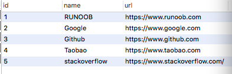

# Python3 正则表达式

正则表达式是一个特殊的字符序列，它能帮助你方便的检查一个字符串是否与某种模式匹配。

Python 自1.5版本起增加了re 模块，它提供 Perl 风格的正则表达式模式。

re 模块使 Python 语言拥有全部的正则表达式功能。

compile 函数根据一个模式字符串和可选的标志参数生成一个正则表达式对象。该对象拥有一系列方法用于正则表达式匹配和替换。

re 模块也提供了与这些方法功能完全一致的函数，这些函数使用一个模式字符串做为它们的第一个参数。

本章节主要介绍 Python 中常用的正则表达式处理函数，如果你对正则表达式不了解，可以查看我们的 [正则表达式 - 教程](https://www.runoob.com/regexp/regexp-tutorial.html)。

------

## re.match函数

re.match 尝试从字符串的起始位置匹配一个模式，如果不是起始位置匹配成功的话，match()就返回none。

**函数语法**：

```
re.match(pattern, string, flags=0)
```

函数参数说明：

| 参数    | 描述                                                         |
| :------ | :----------------------------------------------------------- |
| pattern | 匹配的正则表达式                                             |
| string  | 要匹配的字符串。                                             |
| flags   | 标志位，用于控制正则表达式的匹配方式，如：是否区分大小写，多行匹配等等。参见：[正则表达式修饰符 - 可选标志](https://www.runoob.com/python3/python3-reg-expressions.html#flags) |

匹配成功re.match方法返回一个匹配的对象，否则返回None。

我们可以使用group(num) 或 groups() 匹配对象函数来获取匹配表达式。

| 匹配对象方法 | 描述                                                         |
| :----------- | :----------------------------------------------------------- |
| group(num=0) | 匹配的整个表达式的字符串，group() 可以一次输入多个组号，在这种情况下它将返回一个包含那些组所对应值的元组。 |
| groups()     | 返回一个包含所有小组字符串的元组，从 1 到 所含的小组号。     |

## 实例

\#!/usr/bin/python  import re print(re.match('www', 'www.runoob.com').span())  # 在起始位置匹配 print(re.match('com', 'www.runoob.com'))         # 不在起始位置匹配

以上实例运行输出结果为：

```
(0, 3)
None
```

## 实例

\#!/usr/bin/python3 import re  line = "Cats are smarter than dogs" # .* 表示任意匹配除换行符（\n、\r）之外的任何单个或多个字符 matchObj = re.match( r'(.*) are (.*?) .*', line, re.M|re.I)  if matchObj:   print ("matchObj.group() : ", matchObj.group())   print ("matchObj.group(1) : ", matchObj.group(1))   print ("matchObj.group(2) : ", matchObj.group(2)) else:   print ("No match!!")

以上实例执行结果如下：

```
matchObj.group() :  Cats are smarter than dogs
matchObj.group(1) :  Cats
matchObj.group(2) :  smarter
```

------

## re.search方法

re.search 扫描整个字符串并返回第一个成功的匹配。

函数语法：

```
re.search(pattern, string, flags=0)
```

函数参数说明：

| 参数    | 描述                                                         |
| :------ | :----------------------------------------------------------- |
| pattern | 匹配的正则表达式                                             |
| string  | 要匹配的字符串。                                             |
| flags   | 标志位，用于控制正则表达式的匹配方式，如：是否区分大小写，多行匹配等等。参见：[正则表达式修饰符 - 可选标志](https://www.runoob.com/python3/python3-reg-expressions.html#flags) |

匹配成功re.search方法返回一个匹配的对象，否则返回None。

我们可以使用group(num) 或 groups() 匹配对象函数来获取匹配表达式。

| 匹配对象方法 | 描述                                                         |
| :----------- | :----------------------------------------------------------- |
| group(num=0) | 匹配的整个表达式的字符串，group() 可以一次输入多个组号，在这种情况下它将返回一个包含那些组所对应值的元组。 |
| groups()     | 返回一个包含所有小组字符串的元组，从 1 到 所含的小组号。     |

## 实例

\#!/usr/bin/python3  import re  print(re.search('www', 'www.runoob.com').span())  # 在起始位置匹配 print(re.search('com', 'www.runoob.com').span())         # 不在起始位置匹配

以上实例运行输出结果为：

```
(0, 3)
(11, 14)
```

## 实例

\#!/usr/bin/python3  import re  line = "Cats are smarter than dogs"  searchObj = re.search( r'(.*) are (.*?) .*', line, re.M|re.I)  if searchObj:   print ("searchObj.group() : ", searchObj.group())   print ("searchObj.group(1) : ", searchObj.group(1))   print ("searchObj.group(2) : ", searchObj.group(2)) else:   print ("Nothing found!!")

以上实例执行结果如下：

```
searchObj.group() :  Cats are smarter than dogs
searchObj.group(1) :  Cats
searchObj.group(2) :  smarter
```

------

## re.match与re.search的区别

re.match 只匹配字符串的开始，如果字符串开始不符合正则表达式，则匹配失败，函数返回 None，而 re.search 匹配整个字符串，直到找到一个匹配。

## 实例

\#!/usr/bin/python3  import re  line = "Cats are smarter than dogs"  matchObj = re.match( r'dogs', line, re.M|re.I) if matchObj:   print ("match --> matchObj.group() : ", matchObj.group()) else:   print ("No match!!")  matchObj = re.search( r'dogs', line, re.M|re.I) if matchObj:   print ("search --> matchObj.group() : ", matchObj.group()) else:   print ("No match!!")

以上实例运行结果如下：

```
No match!!
search --> matchObj.group() :  dogs
```

------

## 检索和替换

Python 的re模块提供了re.sub用于替换字符串中的匹配项。

语法：

```
re.sub(pattern, repl, string, count=0, flags=0)
```

参数：

- pattern : 正则中的模式字符串。
- repl : 替换的字符串，也可为一个函数。
- string : 要被查找替换的原始字符串。
- count : 模式匹配后替换的最大次数，默认 0 表示替换所有的匹配。
- flags : 编译时用的匹配模式，数字形式。

前三个为必选参数，后两个为可选参数。

## 实例

\#!/usr/bin/python3 import re  phone = "2004-959-559 # 这是一个电话号码"  # 删除注释 num = re.sub(r'#.*$', "", phone) print ("电话号码 : ", num)  # 移除非数字的内容 num = re.sub(r'\D', "", phone) print ("电话号码 : ", num)

以上实例执行结果如下：

```
电话号码 :  2004-959-559 
电话号码 :  2004959559
```

### repl 参数是一个函数

以下实例中将字符串中的匹配的数字乘于 2：

## 实例

\#!/usr/bin/python  import re  # 将匹配的数字乘于 2 def double(matched):    value = int(matched.group('value'))    return str(value * 2)  s = 'A23G4HFD567' print(re.sub('(?P<value>\d+)', double, s))

执行输出结果为：

```
A46G8HFD1134
```

### compile 函数

compile 函数用于编译正则表达式，生成一个正则表达式（ Pattern ）对象，供 match() 和 search() 这两个函数使用。

语法格式为：

```
re.compile(pattern[, flags])
```

参数：

- pattern : 一个字符串形式的正则表达式
- flags 可选，表示匹配模式，比如忽略大小写，多行模式等，具体参数为：
- - re.I 忽略大小写

  - re.L 表示特殊字符集 \w, \W, \b, \B, \s, \S 依赖于当前环境
  - re.M 多行模式
  - re.S 即为' . '并且包括换行符在内的任意字符（' . '不包括换行符）
  - re.U 表示特殊字符集 \w, \W, \b, \B, \d, \D, \s, \S 依赖于 Unicode 字符属性数据库
  - re.X 为了增加可读性，忽略空格和' # '后面的注释

### 实例

## 实例

\>>>import re >>> pattern = re.compile(r'\d+')                    # 用于匹配至少一个数字 >>> m = pattern.match('one12twothree34four')        # 查找头部，没有匹配 >>> print( m ) None >>> m = pattern.match('one12twothree34four', 2, 10) # 从'e'的位置开始匹配，没有匹配 >>> print( m ) None >>> m = pattern.match('one12twothree34four', 3, 10) # 从'1'的位置开始匹配，正好匹配 >>> print( m )                                        # 返回一个 Match 对象 <_sre.SRE_Match object at 0x10a42aac0> >>> m.group(0)   # 可省略 0 '12' >>> m.start(0)   # 可省略 0 3 >>> m.end(0)     # 可省略 0 5 >>> m.span(0)    # 可省略 0 (3, 5)

在上面，当匹配成功时返回一个 Match 对象，其中：

- `group([group1, …])` 方法用于获得一个或多个分组匹配的字符串，当要获得整个匹配的子串时，可直接使用 `group()` 或 `group(0)`；
- `start([group])` 方法用于获取分组匹配的子串在整个字符串中的起始位置（子串第一个字符的索引），参数默认值为 0；
- `end([group])` 方法用于获取分组匹配的子串在整个字符串中的结束位置（子串最后一个字符的索引+1），参数默认值为 0；
- `span([group])` 方法返回 `(start(group), end(group))`。

再看看一个例子：

## 实例

\>>>import re >>> pattern = re.compile(r'([a-z]+) ([a-z]+)', re.I)   # re.I 表示忽略大小写 >>> m = pattern.match('Hello World Wide Web') >>> print( m )                            # 匹配成功，返回一个 Match 对象 <_sre.SRE_Match object at 0x10bea83e8> >>> m.group(0)                            # 返回匹配成功的整个子串 'Hello World' >>> m.span(0)                             # 返回匹配成功的整个子串的索引 (0, 11) >>> m.group(1)                            # 返回第一个分组匹配成功的子串 'Hello' >>> m.span(1)                             # 返回第一个分组匹配成功的子串的索引 (0, 5) >>> m.group(2)                            # 返回第二个分组匹配成功的子串 'World' >>> m.span(2)                             # 返回第二个分组匹配成功的子串索引 (6, 11) >>> m.groups()                            # 等价于 (m.group(1), m.group(2), ...) ('Hello', 'World') >>> m.group(3)                            # 不存在第三个分组 Traceback (most recent call last):  File "<stdin>", line 1, in <module> IndexError: no such group

### findall

在字符串中找到正则表达式所匹配的所有子串，并返回一个列表，如果没有找到匹配的，则返回空列表。

**注意：** match 和 search 是匹配一次 findall 匹配所有。

语法格式为：

```
re.findall(pattern, string, flags=0)
或
pattern.findall(string[, pos[, endpos]])
```

参数：

- **pattern** 匹配模式。
- **string** 待匹配的字符串。
- **pos** 可选参数，指定字符串的起始位置，默认为 0。
- **endpos** 可选参数，指定字符串的结束位置，默认为字符串的长度。

查找字符串中的所有数字：

## 实例

import re  result1 = re.findall(r'\d+','runoob 123 google 456')  pattern = re.compile(r'\d+')   # 查找数字 result2 = pattern.findall('runoob 123 google 456') result3 = pattern.findall('run88oob123google456', 0, 10)  print(result1) print(result2) print(result3)

输出结果：

```
['123', '456']
['123', '456']
['88', '12']
```

### re.finditer

和 findall 类似，在字符串中找到正则表达式所匹配的所有子串，并把它们作为一个迭代器返回。

```
re.finditer(pattern, string, flags=0)
```

参数：

| 参数    | 描述                                                         |
| :------ | :----------------------------------------------------------- |
| pattern | 匹配的正则表达式                                             |
| string  | 要匹配的字符串。                                             |
| flags   | 标志位，用于控制正则表达式的匹配方式，如：是否区分大小写，多行匹配等等。参见：[正则表达式修饰符 - 可选标志](https://www.runoob.com/python3/python3-reg-expressions.html#flags) |

## 实例

import re  it = re.finditer(r"\d+","12a32bc43jf3")  for match in it:     print (match.group() )

输出结果：

```
12 
32 
43 
3
```

### re.split

split 方法按照能够匹配的子串将字符串分割后返回列表，它的使用形式如下：

```
re.split(pattern, string[, maxsplit=0, flags=0])
```

参数：

| 参数     | 描述                                                         |
| :------- | :----------------------------------------------------------- |
| pattern  | 匹配的正则表达式                                             |
| string   | 要匹配的字符串。                                             |
| maxsplit | 分隔次数，maxsplit=1 分隔一次，默认为 0，不限制次数。        |
| flags    | 标志位，用于控制正则表达式的匹配方式，如：是否区分大小写，多行匹配等等。参见：[正则表达式修饰符 - 可选标志](https://www.runoob.com/python3/python3-reg-expressions.html#flags) |

## 实例

\>>>import re >>> re.split('\W+', 'runoob, runoob, runoob.') ['runoob', 'runoob', 'runoob', ''] >>> re.split('(\W+)', ' runoob, runoob, runoob.')  ['', ' ', 'runoob', ', ', 'runoob', ', ', 'runoob', '.', ''] >>> re.split('\W+', ' runoob, runoob, runoob.', 1)  ['', 'runoob, runoob, runoob.']  >>> re.split('a*', 'hello world')   # 对于一个找不到匹配的字符串而言，split 不会对其作出分割 ['hello world']

------

## 正则表达式对象

### re.RegexObject

re.compile() 返回 RegexObject 对象。

### re.MatchObject

group() 返回被 RE 匹配的字符串。

- **start()** 返回匹配开始的位置
- **end()** 返回匹配结束的位置
- **span()** 返回一个元组包含匹配 (开始,结束) 的位置

------

## 正则表达式修饰符 - 可选标志

正则表达式可以包含一些可选标志修饰符来控制匹配的模式。修饰符被指定为一个可选的标志。多个标志可以通过按位 OR(|) 它们来指定。如 re.I | re.M 被设置成 I 和 M 标志：

| 修饰符 | 描述                                                         |
| :----- | :----------------------------------------------------------- |
| re.I   | 使匹配对大小写不敏感                                         |
| re.L   | 做本地化识别（locale-aware）匹配                             |
| re.M   | 多行匹配，影响 ^ 和 $                                        |
| re.S   | 使 . 匹配包括换行在内的所有字符                              |
| re.U   | 根据Unicode字符集解析字符。这个标志影响 \w, \W, \b, \B.      |
| re.X   | 该标志通过给予你更灵活的格式以便你将正则表达式写得更易于理解。 |

------

## 正则表达式模式

模式字符串使用特殊的语法来表示一个正则表达式：

字母和数字表示他们自身。一个正则表达式模式中的字母和数字匹配同样的字符串。

多数字母和数字前加一个反斜杠时会拥有不同的含义。

标点符号只有被转义时才匹配自身，否则它们表示特殊的含义。

反斜杠本身需要使用反斜杠转义。

由于正则表达式通常都包含反斜杠，所以你最好使用原始字符串来表示它们。模式元素(如 **r'\t'**，等价于 **\\t** )匹配相应的特殊字符。

下表列出了正则表达式模式语法中的特殊元素。如果你使用模式的同时提供了可选的标志参数，某些模式元素的含义会改变。

| 模式         | 描述                                                         |
| :----------- | :----------------------------------------------------------- |
| ^            | 匹配字符串的开头                                             |
| $            | 匹配字符串的末尾。                                           |
| .            | 匹配任意字符，除了换行符，当re.DOTALL标记被指定时，则可以匹配包括换行符的任意字符。 |
| [...]        | 用来表示一组字符,单独列出：[amk] 匹配 'a'，'m'或'k'          |
| [^...]       | 不在[]中的字符：[^abc] 匹配除了a,b,c之外的字符。             |
| re*          | 匹配0个或多个的表达式。                                      |
| re+          | 匹配1个或多个的表达式。                                      |
| re?          | 匹配0个或1个由前面的正则表达式定义的片段，非贪婪方式         |
| re{ n}       | 匹配n个前面表达式。例如，"o{2}"不能匹配"Bob"中的"o"，但是能匹配"food"中的两个o。 |
| re{ n,}      | 精确匹配n个前面表达式。例如，"o{2,}"不能匹配"Bob"中的"o"，但能匹配"foooood"中的所有o。"o{1,}"等价于"o+"。"o{0,}"则等价于"o*"。 |
| re{ n, m}    | 匹配 n 到 m 次由前面的正则表达式定义的片段，贪婪方式         |
| a\| b        | 匹配a或b                                                     |
| (re)         | 匹配括号内的表达式，也表示一个组                             |
| (?imx)       | 正则表达式包含三种可选标志：i, m, 或 x 。只影响括号中的区域。 |
| (?-imx)      | 正则表达式关闭 i, m, 或 x 可选标志。只影响括号中的区域。     |
| (?: re)      | 类似 (...), 但是不表示一个组                                 |
| (?imx: re)   | 在括号中使用i, m, 或 x 可选标志                              |
| (?-imx: re)  | 在括号中不使用i, m, 或 x 可选标志                            |
| (?#...)      | 注释.                                                        |
| (?= re)      | 前向肯定界定符。如果所含正则表达式，以 ... 表示，在当前位置成功匹配时成功，否则失败。但一旦所含表达式已经尝试，匹配引擎根本没有提高；模式的剩余部分还要尝试界定符的右边。 |
| (?! re)      | 前向否定界定符。与肯定界定符相反；当所含表达式不能在字符串当前位置匹配时成功。 |
| (?> re)      | 匹配的独立模式，省去回溯。                                   |
| \w           | 匹配数字字母下划线                                           |
| \W           | 匹配非数字字母下划线                                         |
| \s           | 匹配任意空白字符，等价于 [\t\n\r\f]。                        |
| \S           | 匹配任意非空字符                                             |
| \d           | 匹配任意数字，等价于 [0-9]。                                 |
| \D           | 匹配任意非数字                                               |
| \A           | 匹配字符串开始                                               |
| \Z           | 匹配字符串结束，如果是存在换行，只匹配到换行前的结束字符串。 |
| \z           | 匹配字符串结束                                               |
| \G           | 匹配最后匹配完成的位置。                                     |
| \b           | 匹配一个单词边界，也就是指单词和空格间的位置。例如， 'er\b' 可以匹配"never" 中的 'er'，但不能匹配 "verb" 中的 'er'。 |
| \B           | 匹配非单词边界。'er\B' 能匹配 "verb" 中的 'er'，但不能匹配 "never" 中的 'er'。 |
| \n, \t, 等。 | 匹配一个换行符。匹配一个制表符, 等                           |
| \1...\9      | 匹配第n个分组的内容。                                        |
| \10          | 匹配第n个分组的内容，如果它经匹配。否则指的是八进制字符码的表达式。 |

------

## 正则表达式实例

#### 字符匹配

| 实例   | 描述           |
| :----- | :------------- |
| python | 匹配 "python". |

#### 字符类

| 实例        | 描述                              |
| :---------- | :-------------------------------- |
| [Pp]ython   | 匹配 "Python" 或 "python"         |
| rub[ye]     | 匹配 "ruby" 或 "rube"             |
| [aeiou]     | 匹配中括号内的任意一个字母        |
| [0-9]       | 匹配任何数字。类似于 [0123456789] |
| [a-z]       | 匹配任何小写字母                  |
| [A-Z]       | 匹配任何大写字母                  |
| [a-zA-Z0-9] | 匹配任何字母及数字                |
| [^aeiou]    | 除了aeiou字母以外的所有字符       |
| [^0-9]      | 匹配除了数字外的字符              |

#### 特殊字符类

| 实例 | 描述                                                         |
| :--- | :----------------------------------------------------------- |
| .    | 匹配除 "\n" 之外的任何单个字符。要匹配包括 '\n' 在内的任何字符，请使用象 '[.\n]' 的模式。 |
| \d   | 匹配一个数字字符。等价于 [0-9]。                             |
| \D   | 匹配一个非数字字符。等价于 [^0-9]。                          |
| \s   | 匹配任何空白字符，包括空格、制表符、换页符等等。等价于 [ \f\n\r\t\v]。 |
| \S   | 匹配任何非空白字符。等价于 [^ \f\n\r\t\v]。                  |
| \w   | 匹配包括下划线的任何单词字符。等价于'[A-Za-z0-9_]'。         |
| \W   | 匹配任何非单词字符。等价于 '[^A-Za-z0-9_]'。                 |

## 笔记

正则表达式符号使用小总结：

1、[ ]：方括号。匹配需要的字符集合，如[1-3]或[123]都是匹配1、2或者3。

2、^：脱字符号。方括号中加入脱字符号，就是匹配未列出的所有其他字符，如[^a]匹配除a以外的所有其他字符。

3、\：反斜杠。和python字符串使用规则一样，可以匹配特殊字符本身，如\d表示匹配0到9的任意一个数字字符，而\\d则表示匹配\d本身。

4、*：星号。匹配前一个字符0到n次，如pytho*n可以匹配pythn、pytoon、pythooooon等。还有其它匹配重复字符的如？、+或{m,n}，其中{n,m}可以灵活使用，它表示匹配n次到m次。

**re.sub** 使用实例：改变日期的格式，如中国格式 2017-11-27 改为美国格式 11/27/2017:

```
>>> s = '2017-11-27'
>>> import re
>>> print(re.sub('(\d{4})-(\d{2})-(\d{2})',r'\2/\3/\1', s))
11/27/2017
>>> 
```

用 () 来划定原字符串的组，{} 中表示数字的个数，r 即后面的字符串为原始字符串，防止计算机将 \ 理解为转义字符，2，3，1 为输入的字符串三段的序号。

关于正则表达式 **\b** 模式，还有一点需要说明，**\b** 是指匹配一个单词边界，也就是指单词和空格间的位置。但事实上，**\b** 可以匹配的边界包括单词和特殊字符边界，比如 **$，#…** 等。

例如:

```
import re

ret = re.findall(r'o\b','hello nano$')
print(ret) #结果为['o', 'o']
```

**(?<name>exp)** 匹配 exp,并捕获文本到名称为 name 的组里，也可以写成 **(?'name'exp)**。

但是在Python中，为 **(?P<name>exp)**。 简单例子：

```
import re

pattern = re.compile(r'(?P<here>[a-z]+) ([a-z]+)', re.I)
m = pattern.match('Hello World word helo')
print (m.group('here'))
```

输出结果为：

```
Hello
```

命名组是便于使用的，可以替代需要记住组的数字，可以进行扩展使用。

**\b** 的用法也可以很灵活，在给定的字符串中，找到以小写字母开头的单词和单词数量。

```
import re

s="i Am a gOod boy  baby!!"
result=re.findall(r'\b[a-z][a-zA-Z]*\b',s)
print(result)
print("小写字母开头的单词个数：",len(result))
```

结果：

```
['i', 'a', 'gOod', 'boy', 'baby']
小写字母开头的单词个数： 5
```

**Python3 匹配 IP 地址实例**

```
import re
ip ='192.168.1.1'
trueIp =re.search(r'(([01]{0,1}\d{0,1}\d|2[0-4]\d|25[0-5])\.){3}([01]{0,1}\d{0,1}\d|2[0-4]\d|25[0-5])',ip)
print(trueIp)
```

输出结果：

```
192.168.1.1
```

re.sub 匹配标点符号、换行实例。

```
import re
s = "you're asking me out.that's so cute.what's your name again?"
print(re.sub(r"([.!?])", r"\1\n", s))
```

输出结果：

```
you're asking me out.
that's so cute.
what's your name again?
```

**Python re 模块的 sub 方法：re.sub()。**

用法：

```
re.sub(pattern, repl, string, count=0, flags=0)
```

在这里会容易出现的问题是，错误的将 flags 参数传入 count，例：

```
>>> re.sub('123.*', '123*', '123ab\nc', re.S)
'123*\nc'
```

是不是没有替换掉换行符后的字符？

正确的写法应该是当使用 re.sub() 的可选参数时，要传入所有可选参数。或者指定参数名，如下：

```
>>> re.sub('123.*', '123*', '123ab\nc', 0, re.S)
'123*'
>>> re.sub('123.*', '123*', '123ab\nc', flags = re.S)
'123*'
```

**2）re.Pattern.sub()**

re.Pattern 对象是匹配模对象，由 re.compile() 生成。

用法：

```
re.Pattern.sub(repl, string, count=0)
```

接上例：

```
>>> regex = re.compile('123.*', re.S)
>>> regex.sub('123*', '123ab\nc')
'123*'
```

这里 re.Pattern.sub() 不接受 flags 参数，因为 flags 是由 re.compile() 指定。

假如文本有个单纯重复了 2 次，利用正则保留一个输出:

```
>>> import re
>>> x='this is is ok ok'
>>> y= re.sub(r'(\w+)\s\1',r'\1',x)
>>> print(y)
this is ok
>>> 
```

# Python CGI编程

------

## 什么是CGI

CGI 目前由NCSA维护，NCSA定义CGI如下：

CGI(Common Gateway Interface),通用网关接口,它是一段程序,运行在服务器上如：HTTP服务器，提供同客户端HTML页面的接口。

------

## 网页浏览

为了更好的了解CGI是如何工作的，我们可以从在网页上点击一个链接或URL的流程：

- 1、使用你的浏览器访问URL并连接到HTTP web 服务器。
- 2、Web服务器接收到请求信息后会解析URL，并查找访问的文件在服务器上是否存在，如果存在返回文件的内容，否则返回错误信息。
- 3、浏览器从服务器上接收信息，并显示接收的文件或者错误信息。

CGI程序可以是Python脚本，PERL脚本，SHELL脚本，C或者C++程序等。

------

## CGI架构图


------

## Web服务器支持及配置

在你进行CGI编程前，确保您的Web服务器支持CGI及已经配置了CGI的处理程序。

Apache 支持CGI 配置：

设置好CGI目录：

```
ScriptAlias /cgi-bin/ /var/www/cgi-bin/
```

所有的HTTP服务器执行CGI程序都保存在一个预先配置的目录。这个目录被称为CGI目录，并按照惯例，它被命名为/var/www/cgi-bin目录。

CGI文件的扩展名为.cgi，python也可以使用.py扩展名。

默认情况下，Linux服务器配置运行的cgi-bin目录中为/var/www。

如果你想指定其他运行CGI脚本的目录，可以修改httpd.conf配置文件，如下所示：

```
<Directory "/var/www/cgi-bin">
   AllowOverride None
   Options +ExecCGI
   Order allow,deny
   Allow from all
</Directory>
```

在 AddHandler 中添加 .py 后缀，这样我们就可以访问 .py 结尾的 python 脚本文件：

```
AddHandler cgi-script .cgi .pl .py
```

------

## 第一个CGI程序

我们使用Python创建第一个CGI程序，文件名为hello.py，文件位于/var/www/cgi-bin目录中，内容如下：

```
#!/usr/bin/python3

print ("Content-type:text/html")
print ()                             # 空行，告诉服务器结束头部
print ('<html>')
print ('<head>')
print ('<meta charset="utf-8">')
print ('<title>Hello Word - 我的第一个 CGI 程序！</title>')
print ('</head>')
print ('<body>')
print ('<h2>Hello Word! 我是来自菜鸟教程的第一CGI程序</h2>')
print ('</body>')
print ('</html>')
```

文件保存后修改 hello.py，修改文件权限为 755：

```
chmod 755 hello.py 
```

以上程序在浏览器访问显示结果如下：


这个的hello.py脚本是一个简单的Python脚本，脚本第一行的输出内容"Content-type:text/html"发送到浏览器并告知浏览器显示的内容类型为"text/html"。

用 print 输出一个空行用于告诉服务器结束头部信息。

------

## HTTP头部

hello.py文件内容中的" Content-type:text/html"即为HTTP头部的一部分，它会发送给浏览器告诉浏览器文件的内容类型。

HTTP头部的格式如下：

```
HTTP 字段名: 字段内容
```

例如：

```
Content-type: text/html
```

以下表格介绍了CGI程序中HTTP头部经常使用的信息：

| 头                  | 描述                                                      |
| :------------------ | :-------------------------------------------------------- |
| Content-type:       | 请求的与实体对应的MIME信息。例如: Content-type:text/html  |
| Expires: Date       | 响应过期的日期和时间                                      |
| Location: URL       | 用来重定向接收方到非请求URL的位置来完成请求或标识新的资源 |
| Last-modified: Date | 请求资源的最后修改时间                                    |
| Content-length: N   | 请求的内容长度                                            |
| Set-Cookie: String  | 设置Http Cookie                                           |

------

## CGI环境变量

所有的CGI程序都接收以下的环境变量，这些变量在CGI程序中发挥了重要的作用：

| 变量名          | 描述                                                         |
| :-------------- | :----------------------------------------------------------- |
| CONTENT_TYPE    | 这个环境变量的值指示所传递来的信息的MIME类型。目前，环境变量CONTENT_TYPE一般都是：application/x-www-form-urlencoded,他表示数据来自于HTML表单。 |
| CONTENT_LENGTH  | 如果服务器与CGI程序信息的传递方式是POST，这个环境变量即使从标准输入STDIN中可以读到的有效数据的字节数。这个环境变量在读取所输入的数据时必须使用。 |
| HTTP_COOKIE     | 客户机内的 COOKIE 内容。                                     |
| HTTP_USER_AGENT | 提供包含了版本数或其他专有数据的客户浏览器信息。             |
| PATH_INFO       | 这个环境变量的值表示紧接在CGI程序名之后的其他路径信息。它常常作为CGI程序的参数出现。 |
| QUERY_STRING    | 如果服务器与CGI程序信息的传递方式是GET，这个环境变量的值即使所传递的信息。这个信息经跟在CGI程序名的后面，两者中间用一个问号'?'分隔。 |
| REMOTE_ADDR     | 这个环境变量的值是发送请求的客户机的IP地址，例如上面的192.168.1.67。这个值总是存在的。而且它是Web客户机需要提供给Web服务器的唯一标识，可以在CGI程序中用它来区分不同的Web客户机。 |
| REMOTE_HOST     | 这个环境变量的值包含发送CGI请求的客户机的主机名。如果不支持你想查询，则无需定义此环境变量。 |
| REQUEST_METHOD  | 提供脚本被调用的方法。对于使用 HTTP/1.0 协议的脚本，仅 GET 和 POST 有意义。 |
| SCRIPT_FILENAME | CGI脚本的完整路径                                            |
| SCRIPT_NAME     | CGI脚本的的名称                                              |
| SERVER_NAME     | 这是你的 WEB 服务器的主机名、别名或IP地址。                  |
| SERVER_SOFTWARE | 这个环境变量的值包含了调用CGI程序的HTTP服务器的名称和版本号。例如，上面的值为Apache/2.2.14(Unix) |

以下是一个简单的CGI脚本输出CGI的环境变量：

```
#!/usr/bin/python3

import os

print ("Content-type: text/html")
print ()
print ("<meta charset=\"utf-8\">")
print ("<b>环境变量</b><br>")
print ("<ul>")
for key in os.environ.keys():
    print ("<li><span style='color:green'>%30s </span> : %s </li>" % (key,os.environ[key]))
print ("</ul>")
```

将以上点保存为 test.py ,并修改文件权限为 755，执行结果如下：


------

## GET和POST方法

浏览器客户端通过两种方法向服务器传递信息，这两种方法就是 GET 方法和 POST 方法。

### 使用GET方法传输数据

GET方法发送编码后的用户信息到服务端，数据信息包含在请求页面的URL上，以"?"号分割, 如下所示：

```
http://www.test.com/cgi-bin/hello.py?key1=value1&key2=value2
```

有关 GET 请求的其他一些注释：

- GET 请求可被缓存
- GET 请求保留在浏览器历史记录中
- GET 请求可被收藏为书签
- GET 请求不应在处理敏感数据时使用
- GET 请求有长度限制
- GET 请求只应当用于取回数据

### 简单的url实例：GET方法

以下是一个简单的URL，使用GET方法向hello_get.py程序发送两个参数：

```
/cgi-bin/test.py?name=菜鸟教程&url=http://www.runoob.com
```

以下为hello_get.py文件的代码：

```
#!/usr/bin/python3

# CGI处理模块
import cgi, cgitb 

# 创建 FieldStorage 的实例化
form = cgi.FieldStorage() 

# 获取数据
site_name = form.getvalue('name')
site_url  = form.getvalue('url')

print ("Content-type:text/html")
print ()
print ("<html>")
print ("<head>")
print ("<meta charset=\"utf-8\">")
print ("<title>菜鸟教程 CGI 测试实例</title>")
print ("</head>")
print ("<body>")
print ("<h2>%s官网：%s</h2>" % (site_name, site_url))
print ("</body>")
print ("</html>")
```

文件保存后修改 hello_get.py，修改文件权限为 755：

```
chmod 755 hello_get.py 
```

浏览器请求输出结果：


### 简单的表单实例：GET方法

以下是一个通过HTML的表单使用GET方法向服务器发送两个数据，提交的服务器脚本同样是hello_get.py文件，hello_get.html 代码如下：

```
<!DOCTYPE html>
<html>
<head>
<meta charset="utf-8">
<title>菜鸟教程(runoob.com)</title>
</head>
<body>
<form action="/cgi-bin/hello_get.py" method="get">
站点名称: <input type="text" name="name">  <br />

站点 URL: <input type="text" name="url" />
<input type="submit" value="提交" />
</form>
</body>
</html>
```

默认情况下 cgi-bin 目录只能存放脚本文件，我们将 hello_get.html 存储在 test 目录下，修改文件权限为 755：

```
chmod 755 hello_get.html
```

Gif 演示如下所示：


### 使用POST方法传递数据

使用POST方法向服务器传递数据是更安全可靠的，像一些敏感信息如用户密码等需要使用POST传输数据。

以下同样是hello_get.py ，它也可以处理浏览器提交的POST表单数据:

```
#!/usr/bin/python3

# CGI处理模块
import cgi, cgitb 

# 创建 FieldStorage 的实例化
form = cgi.FieldStorage() 

# 获取数据
site_name = form.getvalue('name')
site_url  = form.getvalue('url')

print ("Content-type:text/html")
print ()
print ("<html>")
print ("<head>")
print ("<meta charset=\"utf-8\">")
print ("<title>菜鸟教程 CGI 测试实例</title>")
print ("</head>")
print ("<body>")
print ("<h2>%s官网：%s</h2>" % (site_name, site_url))
print ("</body>")
print ("</html>")
```

以下为表单通过POST方法（**method="post"**）向服务器脚本 hello_get.py 提交数据:

```
<!DOCTYPE html>
<html>
<head>
<meta charset="utf-8">
<title>菜鸟教程(runoob.com)</title>
</head>
<body>
<form action="/cgi-bin/hello_get.py" method="post">
站点名称: <input type="text" name="name">  <br />

站点 URL: <input type="text" name="url" />
<input type="submit" value="提交" />
</form>
</body>
</html>
</form>
```

Gif 演示如下所示：


### 通过CGI程序传递checkbox数据

checkbox用于提交一个或者多个选项数据，HTML代码如下：

```
<!DOCTYPE html>
<html>
<head>
<meta charset="utf-8">
<title>菜鸟教程(runoob.com)</title>
</head>
<body>
<form action="/cgi-bin/checkbox.py" method="POST" target="_blank">
<input type="checkbox" name="runoob" value="on" /> 菜鸟教程
<input type="checkbox" name="google" value="on" /> Google
<input type="submit" value="选择站点" />
</form>
</body>
</html>
```

以下为 checkbox.py 文件的代码：

```
#!/usr/bin/python3

# 引入 CGI 处理模块 
import cgi, cgitb 

# 创建 FieldStorage的实例 
form = cgi.FieldStorage() 

# 接收字段数据
if form.getvalue('google'):
   google_flag = "是"
else:
   google_flag = "否"

if form.getvalue('runoob'):
   runoob_flag = "是"
else:
   runoob_flag = "否"

print ("Content-type:text/html")
print ()
print ("<html>")
print ("<head>")
print ("<meta charset=\"utf-8\">")
print ("<title>菜鸟教程 CGI 测试实例</title>")
print ("</head>")
print ("<body>")
print ("<h2> 菜鸟教程是否选择了 : %s</h2>" % runoob_flag)
print ("<h2> Google 是否选择了 : %s</h2>" % google_flag)
print ("</body>")
print ("</html>")
```

修改 checkbox.py 权限：

```
chmod 755 checkbox.py
```

浏览器访问 Gif 演示图：


### 通过CGI程序传递Radio数据

Radio 只向服务器传递一个数据，HTML代码如下：

```
<!DOCTYPE html>
<html>
<head>
<meta charset="utf-8">
<title>菜鸟教程(runoob.com)</title>
</head>
<body>
<form action="/cgi-bin/radiobutton.py" method="post" target="_blank">
<input type="radio" name="site" value="runoob" /> 菜鸟教程
<input type="radio" name="site" value="google" /> Google
<input type="submit" value="提交" />
</form>
</body>
</html>
```

radiobutton.py 脚本代码如下：

```
#!/usr/bin/python3

# 引入 CGI 处理模块 
import cgi, cgitb 

# 创建 FieldStorage的实例 
form = cgi.FieldStorage() 

# 接收字段数据
if form.getvalue('site'):
   site = form.getvalue('site')
else:
   site = "提交数据为空"

print ("Content-type:text/html")
print ()
print ("<html>")
print ("<head>")
print ("<meta charset=\"utf-8\">")
print ("<title>菜鸟教程 CGI 测试实例</title>")
print ("</head>")
print ("<body>")
print ("<h2> 选中的网站是 %s</h2>" % site)
print ("</body>")
print ("</html>")
```

修改 radiobutton.py 权限：

```
chmod 755 radiobutton.py
```

浏览器访问 Gif 演示图：


### 通过CGI程序传递 Textarea 数据

Textarea 向服务器传递多行数据，HTML代码如下：

```
<!DOCTYPE html>
<html>
<head>
<meta charset="utf-8">
<title>菜鸟教程(runoob.com)</title>
</head>
<body>
<form action="/cgi-bin/textarea.py" method="post" target="_blank">
<textarea name="textcontent" cols="40" rows="4">
在这里输入内容...
</textarea>
<input type="submit" value="提交" />
</form>
</body>
</html>
```

textarea.py 脚本代码如下：

```
#!/usr/bin/python3

# 引入 CGI 处理模块 
import cgi, cgitb 

# 创建 FieldStorage的实例 
form = cgi.FieldStorage() 

# 接收字段数据
if form.getvalue('textcontent'):
   text_content = form.getvalue('textcontent')
else:
   text_content = "没有内容"

print ("Content-type:text/html")
print ()
print ("<html>")
print ("<head>")
print ("<meta charset=\"utf-8\">")
print ("<title>菜鸟教程 CGI 测试实例</title>")
print ("</head>")
print ("<body>")
print ("<h2> 输入的内容是：%s</h2>" % text_content)
print ("</body>")
print ("</html>")
```

修改 textarea.py 权限：

```
chmod 755 textarea.py
```

浏览器访问 Gif 演示图：


### 通过CGI程序传递下拉数据。

HTML 下拉框代码如下：

```
<!DOCTYPE html>
<html>
<head>
<meta charset="utf-8">
<title>菜鸟教程(runoob.com)</title>
</head>
<body>
<form action="/cgi-bin/dropdown.py" method="post" target="_blank">
<select name="dropdown">
<option value="runoob" selected>菜鸟教程</option>
<option value="google">Google</option>
</select>
<input type="submit" value="提交"/>
</form>
</body>
</html>
```

dropdown.py 脚本代码如下所示：

```
#!/usr/bin/python3

# 引入 CGI 处理模块 
import cgi, cgitb 

# 创建 FieldStorage的实例 
form = cgi.FieldStorage() 

# 接收字段数据
if form.getvalue('dropdown'):
   dropdown_value = form.getvalue('dropdown')
else:
   dropdown_value = "没有内容"

print ("Content-type:text/html")
print ()
print ("<html>")
print ("<head>")
print ("<meta charset=\"utf-8\">")
print ("<title>菜鸟教程 CGI 测试实例</title>")
print ("</head>")
print ("<body>")
print ("<h2> 选中的选项是：%s</h2>" % dropdown_value)
print ("</body>")
print ("</html>")
```

修改 dropdown.py 权限：

```
chmod 755 dropdown.py
```

浏览器访问 Gif 演示图：


------

## CGI中使用Cookie

在 http 协议一个很大的缺点就是不对用户身份的进行判断，这样给编程人员带来很大的不便， 而 cookie 功能的出现弥补了这个不足。

cookie 就是在客户访问脚本的同时，通过客户的浏览器，在客户硬盘上写入纪录数据 ，当下次客户访问脚本时取回数据信息，从而达到身份判别的功能，cookie 常用在身份校验中。

　

### cookie的语法

http cookie的发送是通过http头部来实现的，他早于文件的传递，头部set-cookie的语法如下：

```
Set-cookie:name=name;expires=date;path=path;domain=domain;secure 
```

- **name=name:** 需要设置cookie的值(name不能使用"**;**"和"**,**"号),有多个name值时用 "**;**" 分隔，例如：**name1=name1;name2=name2;name3=name3**。
- **expires=date:** cookie的有效期限,格式： expires="Wdy,DD-Mon-YYYY HH:MM:SS"
- 
- **path=path:** 设置cookie支持的路径,如果path是一个路径，则cookie对这个目录下的所有文件及子目录生效，例如： path="/cgi-bin/"，如果path是一个文件，则cookie指对这个文件生效，例如：path="/cgi-bin/cookie.cgi"。
- **domain=domain:** 对cookie生效的域名，例如：domain="www.runoob.com"
- **secure:** 如果给出此标志，表示cookie只能通过SSL协议的https服务器来传递。
- cookie的接收是通过设置环境变量HTTP_COOKIE来实现的，CGI程序可以通过检索该变量获取cookie信息。

------

## Cookie设置

Cookie的设置非常简单，cookie会在http头部单独发送。以下实例在cookie中设置了name 和 expires：

```
#!/usr/bin/python3
# 
print ('Content-Type: text/html')
print ('Set-Cookie: name="菜鸟教程";expires=Wed, 28 Aug 2016 18:30:00 GMT')
print ()
print ("""
<html>
  <head>
    <meta charset="utf-8">
    <title>菜鸟教程(runoob.com)</title>
  </head>
    <body>
        <h1>Cookie set OK!</h1>
    </body>
</html>
""")
```

将以上代码保存到 cookie_set.py，并修改 cookie_set.py 权限：

```
chmod 755 cookie_set.py
```

以上实例使用了 Set-Cookie 头信息来设置Cookie信息，可选项中设置了Cookie的其他属性，如过期时间Expires，域名Domain，路径Path。这些信息设置在 "Content-type:text/html"之前。

------

## 检索Cookie信息

Cookie信息检索页非常简单，Cookie信息存储在CGI的环境变量HTTP_COOKIE中，存储格式如下：

```
key1=value1;key2=value2;key3=value3....
```

以下是一个简单的CGI检索cookie信息的程序：

```
#!/usr/bin/python3

# 导入模块
import os
import http.cookies

print ("Content-type: text/html")
print ()

print ("""
<html>
<head>
<meta charset="utf-8">
<title>菜鸟教程(runoob.com)</title>
</head>
<body>
<h1>读取cookie信息</h1>
""")

if 'HTTP_COOKIE' in os.environ:
    cookie_string=os.environ.get('HTTP_COOKIE')
    c= http.cookies.SimpleCookie()
   # c=Cookie.SimpleCookie()
    c.load(cookie_string)

    try:
        data=c['name'].value
        print ("cookie data: "+data+"<br>")
    except KeyError:
        print ("cookie 没有设置或者已过去<br>")
print ("""
</body>
</html>
""")
```

将以上代码保存到 cookie_get.py，并修改 cookie_get.py 权限：

```
chmod 755 cookie_get.py
```

以上 cookie 设置颜色 Gif 如下所示：


### 文件上传实例

HTML设置上传文件的表单需要设置 **enctype** 属性为 **multipart/form-data**，代码如下所示：

```
<!DOCTYPE html>
<html>
<head>
<meta charset="utf-8">
<title>菜鸟教程(runoob.com)</title>
</head>
<body>
 <form enctype="multipart/form-data" 
                     action="/cgi-bin/save_file.py" method="post">
   <p>选中文件: <input type="file" name="filename" /></p>
   <p><input type="submit" value="上传" /></p>
   </form>
</body>
</html>
```

save_file.py脚本文件代码如下：

```
#!/usr/bin/python3

import cgi, os
import cgitb; cgitb.enable()

form = cgi.FieldStorage()

# 获取文件名
fileitem = form['filename']

# 检测文件是否上传
if fileitem.filename:
   # 设置文件路径 
   fn = os.path.basename(fileitem.filename)
   open('/tmp/' + fn, 'wb').write(fileitem.file.read())

   message = '文件 "' + fn + '" 上传成功'
   
else:
   message = '文件没有上传'
   
print ("""\
Content-Type: text/html\n
<html>
<head>
<meta charset="utf-8">
<title>菜鸟教程(runoob.com)</title>
</head>
<body>
   <p>%s</p>
</body>
</html>
""" % (message,))
```

将以上代码保存到 save_file.py，并修改 save_file.py 权限：

```
chmod 755 save_file.py
```

以上 cookie 设置颜色 Gif 如下所示：


如果你使用的系统是Unix/Linux，你必须替换文件分隔符，在window下只需要使用open()语句即可：

```
fn = os.path.basename(fileitem.filename.replace("\\", "/" ))
```

------

## 文件下载对话框

我们先在当前目录下创建 foo.txt 文件，用于程序的下载。

文件下载通过设置HTTP头信息来实现，功能代码如下：

```
#!/usr/bin/python3

# HTTP 头部
print ("Content-Disposition: attachment; filename=\"foo.txt\"")
print ()
# 打开文件
fo = open("foo.txt", "rb")

str = fo.read();
print (str)

# 关闭文件
fo.close()
```

## 笔记

第一个 cgi 程序这个部分，在英文的 linux 系统下，如果你按照教程的范文编写执行会抛出错误，解决办法有两个，一是修改程序，修改默认stdout，修改后的程序如下:

```
#!/usr/bin/python3

import sys
import io
sys.stdout = io.TextIOWrapper(sys.stdout.buffer, encoding='utf-8')

print ("Content-type:text/html")
print ()                             # 空行，告诉服务器结束头部
print ('<html>')
print ('<head>')
print ('<meta charset="utf-8">')
print ('<title>Hello Word - 我的第一个 CGI 程序！</title>')
print ('</head>')
print ('<body>')
print ('<h2>Hello Word! 我是来自菜鸟教程的第一CGI程序</h2>')
print ('</body>')
print ('</html>')
```

# Python MySQL - mysql-connector 驱动

MySQL 是最流行的关系型数据库管理系统，如果你不熟悉 MySQL，可以阅读我们的 [MySQL 教程。](https://www.runoob.com/mysql/mysql-tutorial.html)

本章节我们为大家介绍使用 **mysql-connector** 来连接使用 MySQL， **mysql-connector** 是 **MySQL** 官方提供的驱动器。

我们可以使用 **pip** 命令来安装 **mysql-connector**：

```
python -m pip install mysql-connector
```

使用以下代码测试 mysql-connector 是否安装成功：

## demo_mysql_test.py:

import mysql.connector

执行以上代码，如果没有产生错误，表明安装成功。

> 注**意：**如果你的 MySQL 是 8.0 版本，密码插件验证方式发生了变化，早期版本为 mysql_native_password，8.0 版本为 caching_sha2_password，所以需要做些改变：
>
> 先修改 my.ini 配置：
>
> ```
> [mysqld]
> default_authentication_plugin=mysql_native_password
> ```
>
> 然后在 mysql 下执行以下命令来修改密码：
>
> ```
> ALTER USER 'root'@'localhost' IDENTIFIED WITH mysql_native_password BY '新密码';
> ```
>
> 更多内容可以参考：[Python MySQL8.0 链接问题](https://www.runoob.com/note/45833)。

------

## 创建数据库连接

可以使用以下代码来连接数据库：

## demo_mysql_test.py:

import mysql.connector  mydb = mysql.connector.connect(  host="localhost",       # 数据库主机地址  user="yourusername",    # 数据库用户名  passwd="yourpassword"   # 数据库密码 )  print(mydb)

### 创建数据库

创建数据库使用 "CREATE DATABASE" 语句，以下创建一个名为 runoob_db 的数据库：

## demo_mysql_test.py:

import mysql.connector  mydb = mysql.connector.connect(  host="localhost",  user="root",  passwd="123456" )  mycursor = mydb.cursor()  mycursor.execute("CREATE DATABASE runoob_db")

创建数据库前我们也可以使用 "SHOW DATABASES" 语句来查看数据库是否存在：

## demo_mysql_test.py:

输出所有数据库列表：

import mysql.connector  mydb = mysql.connector.connect(  host="localhost",  user="root",  passwd="123456" )  mycursor = mydb.cursor()  mycursor.execute("SHOW DATABASES")  for x in mycursor:  print(x)

或者我们可以直接连接数据库，如果数据库不存在，会输出错误信息：

## demo_mysql_test.py:

import mysql.connector  mydb = mysql.connector.connect(  host="localhost",  user="root",  passwd="123456",  database="runoob_db" )

------

## 创建数据表

创建数据表使用 **"CREATE TABLE"** 语句，创建数据表前，需要确保数据库已存在，以下创建一个名为 **sites** 的数据表：

## demo_mysql_test.py:

import mysql.connector  mydb = mysql.connector.connect(  host="localhost",  user="root",  passwd="123456",  database="runoob_db" ) mycursor = mydb.cursor()  mycursor.execute("CREATE TABLE sites (name VARCHAR(255), url VARCHAR(255))")

执行成功后，我们可以看到数据库创建的数据表 sites，字段为 name 和 url。


**我们也可以使用 \**"SHOW TABLES"\** 语句来查看数据表是否已存在：**

## demo_mysql_test.py:

import mysql.connector  mydb = mysql.connector.connect(  host="localhost",  user="root",  passwd="123456",  database="runoob_db" ) mycursor = mydb.cursor()  mycursor.execute("SHOW TABLES")  for x in mycursor:  print(x)

### 主键设置

创建表的时候我们一般都会设置一个主键（PRIMARY KEY），我们可以使用 **"INT AUTO_INCREMENT PRIMARY KEY"** 语句来创建一个主键，主键起始值为 1，逐步递增。

如果我们的表已经创建，我们需要使用 **ALTER TABLE** 来给表添加主键：

## demo_mysql_test.py:

给 sites 表添加主键。

import mysql.connector  mydb = mysql.connector.connect(  host="localhost",  user="root",  passwd="123456",  database="runoob_db" ) mycursor = mydb.cursor()  mycursor.execute("ALTER TABLE sites ADD COLUMN id INT AUTO_INCREMENT PRIMARY KEY")

如果你还未创建 sites 表，可以直接使用以下代码创建。

## demo_mysql_test.py:

给表创建主键。

import mysql.connector  mydb = mysql.connector.connect(  host="localhost",  user="root",  passwd="123456",  database="runoob_db" ) mycursor = mydb.cursor()  mycursor.execute("CREATE TABLE sites (id INT AUTO_INCREMENT PRIMARY KEY, name VARCHAR(255), url VARCHAR(255))")

------

## 插入数据

插入数据使用 **"INSERT INTO"** 语句：

## demo_mysql_test.py:

向 sites 表插入一条记录。

import mysql.connector  mydb = mysql.connector.connect(  host="localhost",  user="root",  passwd="123456",  database="runoob_db" ) mycursor = mydb.cursor()  sql = "INSERT INTO sites (name, url) VALUES (%s, %s)" val = ("RUNOOB", "https://www.runoob.com") mycursor.execute(sql, val)  mydb.commit()    # 数据表内容有更新，必须使用到该语句  print(mycursor.rowcount, "记录插入成功。")

执行代码，输出结果为：

```
1 记录插入成功
```

### 批量插入

批量插入使用 **executemany()** 方法，该方法的第二个参数是一个元组列表，包含了我们要插入的数据：

## demo_mysql_test.py:

向 sites 表插入多条记录。

import mysql.connector  mydb = mysql.connector.connect(  host="localhost",  user="root",  passwd="123456",  database="runoob_db" ) mycursor = mydb.cursor()  sql = "INSERT INTO sites (name, url) VALUES (%s, %s)" val = [  ('Google', 'https://www.google.com'),  ('Github', 'https://www.github.com'),  ('Taobao', 'https://www.taobao.com'),  ('stackoverflow', 'https://www.stackoverflow.com/') ]  mycursor.executemany(sql, val)  mydb.commit()    # 数据表内容有更新，必须使用到该语句  print(mycursor.rowcount, "记录插入成功。")

执行代码，输出结果为：

```
4 记录插入成功。
```

执行以上代码后，我们可以看看数据表的记录：



如果我们想在数据记录插入后，获取该记录的 ID ，可以使用以下代码：

## demo_mysql_test.py:

import mysql.connector  mydb = mysql.connector.connect(  host="localhost",  user="root",  passwd="123456",  database="runoob_db" ) mycursor = mydb.cursor()  sql = "INSERT INTO sites (name, url) VALUES (%s, %s)" val = ("Zhihu", "https://www.zhihu.com") mycursor.execute(sql, val)  mydb.commit()  print("1 条记录已插入, ID:", mycursor.lastrowid)

执行代码，输出结果为：

```
1 条记录已插入, ID: 6
```

------

## 查询数据

查询数据使用 **SELECT** 语句：

## demo_mysql_test.py:

import mysql.connector  mydb = mysql.connector.connect(  host="localhost",  user="root",  passwd="123456",  database="runoob_db" ) mycursor = mydb.cursor()  mycursor.execute("SELECT * FROM sites")  myresult = mycursor.fetchall()     # fetchall() 获取所有记录  for x in myresult:  print(x)

执行代码，输出结果为：

```
(1, 'RUNOOB', 'https://www.runoob.com')
(2, 'Google', 'https://www.google.com')
(3, 'Github', 'https://www.github.com')
(4, 'Taobao', 'https://www.taobao.com')
(5, 'stackoverflow', 'https://www.stackoverflow.com/')
(6, 'Zhihu', 'https://www.zhihu.com')
```

也可以读取指定的字段数据：

## demo_mysql_test.py:

import mysql.connector  mydb = mysql.connector.connect(  host="localhost",  user="root",  passwd="123456",  database="runoob_db" ) mycursor = mydb.cursor()  mycursor.execute("SELECT name, url FROM sites")  myresult = mycursor.fetchall()  for x in myresult:  print(x)

执行代码，输出结果为：

```
('RUNOOB', 'https://www.runoob.com')
('Google', 'https://www.google.com')
('Github', 'https://www.github.com')
('Taobao', 'https://www.taobao.com')
('stackoverflow', 'https://www.stackoverflow.com/')
('Zhihu', 'https://www.zhihu.com')
```

如果我们只想读取一条数据，可以使用 **fetchone()** 方法：

## demo_mysql_test.py:

import mysql.connector  mydb = mysql.connector.connect(  host="localhost",  user="root",  passwd="123456",  database="runoob_db" ) mycursor = mydb.cursor()  mycursor.execute("SELECT * FROM sites")  myresult = mycursor.fetchone()  print(myresult)

执行代码，输出结果为：

```
(1, 'RUNOOB', 'https://www.runoob.com')
```

### where 条件语句

如果我们要读取指定条件的数据，可以使用 **where** 语句：

## demo_mysql_test.py

读取 name 字段为 RUNOOB 的记录：

import mysql.connector  mydb = mysql.connector.connect(  host="localhost",  user="root",  passwd="123456",  database="runoob_db" ) mycursor = mydb.cursor()  sql = "SELECT * FROM sites WHERE name ='RUNOOB'"  mycursor.execute(sql)  myresult = mycursor.fetchall()  for x in myresult:  print(x)

执行代码，输出结果为：

```
(1, 'RUNOOB', 'https://www.runoob.com')
```

也可以使用通配符 **%**：

## demo_mysql_test.py

import mysql.connector  mydb = mysql.connector.connect(  host="localhost",  user="root",  passwd="123456",  database="runoob_db" ) mycursor = mydb.cursor()  sql = "SELECT * FROM sites WHERE url LIKE '%oo%'"  mycursor.execute(sql)  myresult = mycursor.fetchall()  for x in myresult:  print(x)

执行代码，输出结果为：

```
(1, 'RUNOOB', 'https://www.runoob.com')
(2, 'Google', 'https://www.google.com')
```

为了防止数据库查询发生 SQL 注入的攻击，我们可以使用 **%s** 占位符来转义查询的条件：

## demo_mysql_test.py

import mysql.connector  mydb = mysql.connector.connect(  host="localhost",  user="root",  passwd="123456",  database="runoob_db" ) mycursor = mydb.cursor()  sql = "SELECT * FROM sites WHERE name = %s" na = ("RUNOOB", )  mycursor.execute(sql, na)  myresult = mycursor.fetchall()  for x in myresult:  print(x)

### 排序

查询结果排序可以使用 **ORDER BY** 语句，默认的排序方式为升序，关键字为 **ASC**，如果要设置降序排序，可以设置关键字 **DESC**。

## demo_mysql_test.py

按 name 字段字母的升序排序：

import mysql.connector  mydb = mysql.connector.connect(  host="localhost",  user="root",  passwd="123456",  database="runoob_db" ) mycursor = mydb.cursor()  sql = "SELECT * FROM sites ORDER BY name"  mycursor.execute(sql)  myresult = mycursor.fetchall()  for x in myresult:  print(x)

执行代码，输出结果为：

```
(3, 'Github', 'https://www.github.com')
(2, 'Google', 'https://www.google.com')
(1, 'RUNOOB', 'https://www.runoob.com')
(5, 'stackoverflow', 'https://www.stackoverflow.com/')
(4, 'Taobao', 'https://www.taobao.com')
(6, 'Zhihu', 'https://www.zhihu.com')
```

降序排序实例：

## demo_mysql_test.py

按 name 字段字母的降序排序：

import mysql.connector  mydb = mysql.connector.connect(  host="localhost",  user="root",  passwd="123456",  database="runoob_db" ) mycursor = mydb.cursor()  sql = "SELECT * FROM sites ORDER BY name DESC"  mycursor.execute(sql)  myresult = mycursor.fetchall()  for x in myresult:  print(x)

执行代码，输出结果为：

```
(6, 'Zhihu', 'https://www.zhihu.com')
(4, 'Taobao', 'https://www.taobao.com')
(5, 'stackoverflow', 'https://www.stackoverflow.com/')
(1, 'RUNOOB', 'https://www.runoob.com')
(2, 'Google', 'https://www.google.com')
(3, 'Github', 'https://www.github.com')
```

### Limit

如果我们要设置查询的数据量，可以通过 **"LIMIT"** 语句来指定

## demo_mysql_test.py

读取前 3 条记录：

import mysql.connector  mydb = mysql.connector.connect(  host="localhost",  user="root",  passwd="123456",  database="runoob_db" ) mycursor = mydb.cursor()  mycursor.execute("SELECT * FROM sites LIMIT 3")  myresult = mycursor.fetchall()  for x in myresult:  print(x)

执行代码，输出结果为：

```
(1, 'RUNOOB', 'https://www.runoob.com')
(2, 'Google', 'https://www.google.com')
(3, 'Github', 'https://www.github.com')
```

也可以指定起始位置，使用的关键字是 **OFFSET**：

## demo_mysql_test.py

从第二条开始读取前 3 条记录：

import mysql.connector  mydb = mysql.connector.connect(  host="localhost",  user="root",  passwd="123456",  database="runoob_db" ) mycursor = mydb.cursor()  mycursor.execute("SELECT * FROM sites LIMIT 3 OFFSET 1")  # 0 为 第一条，1 为第二条，以此类推  myresult = mycursor.fetchall()  for x in myresult:  print(x)

执行代码，输出结果为：

```
(2, 'Google', 'https://www.google.com')
(3, 'Github', 'https://www.github.com')
(4, 'Taobao', 'https://www.taobao.com')
```

------

## 删除记录

删除记录使用 **"DELETE FROM"** 语句：

## demo_mysql_test.py

删除 name 为 stackoverflow 的记录：

import mysql.connector  mydb = mysql.connector.connect(  host="localhost",  user="root",  passwd="123456",  database="runoob_db" ) mycursor = mydb.cursor()  sql = "DELETE FROM sites WHERE name = 'stackoverflow'"  mycursor.execute(sql)  mydb.commit()  print(mycursor.rowcount, " 条记录删除")

执行代码，输出结果为：

```
1  条记录删除
```

**注意：**要慎重使用删除语句，删除语句要确保指定了 WHERE 条件语句，否则会导致整表数据被删除。

为了防止数据库查询发生 SQL 注入的攻击，我们可以使用 **%s** 占位符来转义删除语句的条件：

## demo_mysql_test.py

import mysql.connector  mydb = mysql.connector.connect(  host="localhost",  user="root",  passwd="123456",  database="runoob_db" ) mycursor = mydb.cursor()  sql = "DELETE FROM sites WHERE name = %s" na = ("stackoverflow", )  mycursor.execute(sql, na)  mydb.commit()  print(mycursor.rowcount, " 条记录删除")

执行代码，输出结果为：

```
1  条记录删除
```

------

## 更新表数据

数据表更新使用 **"UPDATE"** 语句：

## demo_mysql_test.py

将 name 为 Zhihu 的字段数据改为 ZH：

import mysql.connector  mydb = mysql.connector.connect(  host="localhost",  user="root",  passwd="123456",  database="runoob_db" ) mycursor = mydb.cursor()  sql = "UPDATE sites SET name = 'ZH' WHERE name = 'Zhihu'"  mycursor.execute(sql)  mydb.commit()  print(mycursor.rowcount, " 条记录被修改")

执行代码，输出结果为：

```
1  条记录被修改
```

**注意：**UPDATE 语句要确保指定了 WHERE 条件语句，否则会导致整表数据被更新。

为了防止数据库查询发生 SQL 注入的攻击，我们可以使用 %s 占位符来转义更新语句的条件：

## demo_mysql_test.py

import mysql.connector  mydb = mysql.connector.connect(  host="localhost",  user="root",  passwd="123456",  database="runoob_db" ) mycursor = mydb.cursor()  sql = "UPDATE sites SET name = %s WHERE name = %s" val = ("Zhihu", "ZH")  mycursor.execute(sql, val)  mydb.commit()  print(mycursor.rowcount, " 条记录被修改")

执行代码，输出结果为：

```
1  条记录被修改
```

------

## 删除表

删除表使用 **"DROP TABLE"** 语句， **IF EXISTS** 关键字是用于判断表是否存在，只有在存在的情况才删除：

## demo_mysql_test.py

import mysql.connector  mydb = mysql.connector.connect(  host="localhost",  user="root",  passwd="123456",  database="runoob_db" ) mycursor = mydb.cursor()  sql = "DROP TABLE IF EXISTS sites"  # 删除数据表 sites  mycursor.execute(sql)


## 笔记

跟着菜鸟教程学习 Python3 进行到 python3 mysql(mysql-connector)，然后安装mysql-8.0.16，照着示例程序运行 python，遇到这个大大的问题：

```
authentication plugin 'calling_sha2_password' is not supported.
```

在网上找了无数答案，现在来总结一下。

根目录下新建 my.ini 文件，设置 MySQL 复制以下配置信息到新建的 my.ini 文件中。

```
[mysqld]
# 设置3306端口
port = 3306
# 设置mysql的安装目录
basedir=D:\\web\\mysql-8.0.16-winx64
# 设置 mysql数据库的数据的存放目录，MySQL 8+ 不需要以下配置，系统自己生成即可，否则有可能报错
# datadir=D:\\web\\sqldata
# 允许最大连接数
max_connections=20
# 服务端使用的字符集默认为8比特编码的latin1字符集
character-set-server=utf8
# 创建新表时将使用的默认存储引擎
default-storage-engine=INNODB
# 默认使用“mysql_native_password”插件认证
default_authentication_plugin=mysql_native_password
[mysql]
# 设置mysql客户端默认字符集
default-character-set=utf8
[client]
# 设置mysql客户端连接服务端时默认使用的端口
port=3306
default-character-set=utf8
```

　　

在 MySQL 8.0 中验证插件和密码加密方式发生了变化，caching_sha2_password 是默认的身份验证插件而不是之前版本的 mysql_native_password。

使用指令：

```
use mysql;

select plugin,authentication_string from user;
```

查看。

因此如果需要保持之前的验证方式并保持之前版本的密码加密方式需要在配置文件中修改，暂不支持动态修改，需要重启生效。即：

```
# 默认使用 mysql_native_password 插件认证
default_authentication_plugin=mysql_native_password　
```

将 8.0 已有的 sha2 密码修改为 sha1 的模式：

```
# 修改加密规则为永不过期
#注意：password 改为你的密码，别老老实实照抄，之前本人便以为 password 指代密码不用改变，结果一通指令下去，mysql 登不上了，只好重新初始化数据库
ALTER USER 'root'@'127.0.0.1' IDENTIFIED BY 'password' PASSWORD EXPIRE NEVER;

#更新一下用户的密码加密方式为之前版本的方式
ALTER USER 'root'@'127.0.0.1' IDENTIFIED WITH mysql_native_password BY 'password';　　　　

#刷新权限
FLUSH PRIVILEGES; 
```

重启，这是再看，已经修改了身份验证插件。

这时再稍稍修改实例程序，便可以连接了:

```
import mysql.connector

mydb=mysql.connector.connect(
    host="localhost",
    user="ly",
    passwd="123456",
    auth_plugin='mysql_native_password'
)

print(mydb)
```

楼上的问题：

```
authentication plugin 'calling_sha2_password' is not supported.
```

我也出现了，原因以及解决方法是：我安装的是 mysql-connector ，应该安装 mysql-connector-python。

安装：

```
python3 -m pip install mysql-connector
```

接上问题，出现：

```
authentication plugin 'calling_sha2_password' is not supported.
```

错误一般是因为connector与使用的python版本不匹配，python下应该使用下面的命令安装。

```
python -m pip install mysql-connector-python #这个是为系统默认的python版本安装
python3 -m pip install mysql-connector-python #这个是为python3版本安装，当你的电脑里有不同的python版本，而且默认版本不是python3时才使用
```

另外要注意，在python中连接MySQL时，首先要用"net start mysql"启动MySQL服务。否则会出现如下错误

```
mysql.connector.errors.InterfaceError: 2003: Can't connect to MySQL server on 'localhost:3306' (10061 由于目标计算机积极拒绝，无法连接。)
```

# Python3 MySQL 数据库连接 - PyMySQL 驱动

本文我们为大家介绍 Python3 使用 [PyMySQL](https://github.com/PyMySQL/PyMySQL) 连接数据库，并实现简单的增删改查。

### 什么是 PyMySQL？

PyMySQL 是在 Python3.x 版本中用于连接 MySQL 服务器的一个库，Python2中则使用mysqldb。

PyMySQL 遵循 Python 数据库 API v2.0 规范，并包含了 pure-Python MySQL 客户端库。

------

## PyMySQL 安装

在使用 PyMySQL 之前，我们需要确保 PyMySQL 已安装。

PyMySQL 下载地址：https://github.com/PyMySQL/PyMySQL。

如果还未安装，我们可以使用以下命令安装最新版的 PyMySQL：

```
$ pip3 install PyMySQL
```

如果你的系统不支持 pip 命令，可以使用以下方式安装：

1、使用 git 命令下载安装包安装(你也可以手动下载)：

```
$ git clone https://github.com/PyMySQL/PyMySQL
$ cd PyMySQL/
$ python3 setup.py install
```

2、如果需要制定版本号，可以使用 curl 命令来安装：

```
$ # X.X 为 PyMySQL 的版本号
$ curl -L https://github.com/PyMySQL/PyMySQL/tarball/pymysql-X.X | tar xz
$ cd PyMySQL*
$ python3 setup.py install
$ # 现在你可以删除 PyMySQL* 目录
```

**注意：**请确保您有root权限来安装上述模块。

> 安装的过程中可能会出现"ImportError: No module named setuptools"的错误提示，意思是你没有安装setuptools，你可以访问https://pypi.python.org/pypi/setuptools 找到各个系统的安装方法。
>
> Linux 系统安装实例：
>
> ```
> $ wget https://bootstrap.pypa.io/ez_setup.py
> $ python3 ez_setup.py
> ```

------

## 数据库连接

连接数据库前，请先确认以下事项：

- 您已经创建了数据库 TESTDB.
- 在TESTDB数据库中您已经创建了表 EMPLOYEE
- EMPLOYEE表字段为 FIRST_NAME, LAST_NAME, AGE, SEX 和 INCOME。
- 连接数据库TESTDB使用的用户名为 "testuser" ，密码为 "test123",你可以可以自己设定或者直接使用root用户名及其密码，Mysql数据库用户授权请使用Grant命令。
- 在你的机子上已经安装了 Python MySQLdb 模块。
- 如果您对sql语句不熟悉，可以访问我们的 [SQL基础教程](https://www.runoob.com/sql/sql-tutorial.html)

### 实例：

以下实例链接 Mysql 的 TESTDB 数据库：

## 实例(Python 3.0+)

\#!/usr/bin/python3  import pymysql  # 打开数据库连接 db = pymysql.connect("localhost","testuser","test123","TESTDB" )  # 使用 cursor() 方法创建一个游标对象 cursor cursor = db.cursor()  # 使用 execute()  方法执行 SQL 查询  cursor.execute("SELECT VERSION()")  # 使用 fetchone() 方法获取单条数据. data = cursor.fetchone()  print ("Database version : %s " % data)  # 关闭数据库连接 db.close()

执行以上脚本输出结果如下：

```
Database version : 5.5.20-log
```

------

## 创建数据库表

如果数据库连接存在我们可以使用execute()方法来为数据库创建表，如下所示创建表EMPLOYEE：

## 实例(Python 3.0+)

\#!/usr/bin/python3  import pymysql  # 打开数据库连接 db = pymysql.connect("localhost","testuser","test123","TESTDB" )  # 使用 cursor() 方法创建一个游标对象 cursor cursor = db.cursor()  # 使用 execute() 方法执行 SQL，如果表存在则删除 cursor.execute("DROP TABLE IF EXISTS EMPLOYEE")  # 使用预处理语句创建表 sql = """CREATE TABLE EMPLOYEE (         FIRST_NAME  CHAR(20) NOT NULL,         LAST_NAME  CHAR(20),         AGE INT,           SEX CHAR(1),         INCOME FLOAT )"""  cursor.execute(sql)  # 关闭数据库连接 db.close()

------

## 数据库插入操作

以下实例使用执行 SQL INSERT 语句向表 EMPLOYEE 插入记录：

## 实例(Python 3.0+)

\#!/usr/bin/python3  import pymysql  # 打开数据库连接 db = pymysql.connect("localhost","testuser","test123","TESTDB" )  # 使用cursor()方法获取操作游标  cursor = db.cursor()  # SQL 插入语句 sql = """INSERT INTO EMPLOYEE(FIRST_NAME,         LAST_NAME, AGE, SEX, INCOME)         VALUES ('Mac', 'Mohan', 20, 'M', 2000)""" try:   # 执行sql语句   cursor.execute(sql)   # 提交到数据库执行   db.commit() except:   # 如果发生错误则回滚   db.rollback()  # 关闭数据库连接 db.close()

以上例子也可以写成如下形式：

## 实例(Python 3.0+)

\#!/usr/bin/python3  import pymysql  # 打开数据库连接 db = pymysql.connect("localhost","testuser","test123","TESTDB" )  # 使用cursor()方法获取操作游标  cursor = db.cursor()  # SQL 插入语句 sql = "INSERT INTO EMPLOYEE(FIRST_NAME, \       LAST_NAME, AGE, SEX, INCOME) \       VALUES ('%s', '%s',  %s,  '%s',  %s)" % \       ('Mac', 'Mohan', 20, 'M', 2000) try:   # 执行sql语句   cursor.execute(sql)   # 执行sql语句   db.commit() except:   # 发生错误时回滚   db.rollback()  # 关闭数据库连接 db.close()

以下代码使用变量向SQL语句中传递参数:

```
..................................
user_id = "test123"
password = "password"

con.execute('insert into Login values( %s,  %s)' % \
             (user_id, password))
..................................
```

------

## 数据库查询操作

Python查询Mysql使用 fetchone() 方法获取单条数据, 使用fetchall() 方法获取多条数据。

- **fetchone():** 该方法获取下一个查询结果集。结果集是一个对象
- **fetchall():** 接收全部的返回结果行.
- **rowcount:** 这是一个只读属性，并返回执行execute()方法后影响的行数。

### 实例：

查询EMPLOYEE表中salary（工资）字段大于1000的所有数据：

## 实例(Python 3.0+)

\#!/usr/bin/python3  import pymysql  # 打开数据库连接 db = pymysql.connect("localhost","testuser","test123","TESTDB" )  # 使用cursor()方法获取操作游标  cursor = db.cursor()  # SQL 查询语句 sql = "SELECT * FROM EMPLOYEE \       WHERE INCOME > %s" % (1000) try:   # 执行SQL语句   cursor.execute(sql)   # 获取所有记录列表   results = cursor.fetchall()   for row in results:      fname = row[0]      lname = row[1]      age = row[2]      sex = row[3]      income = row[4]       # 打印结果      print ("fname=%s,lname=%s,age=%s,sex=%s,income=%s" % \             (fname, lname, age, sex, income )) except:   print ("Error: unable to fetch data")  # 关闭数据库连接 db.close()

以上脚本执行结果如下：

```
fname=Mac, lname=Mohan, age=20, sex=M, income=2000
```

------

## 数据库更新操作

更新操作用于更新数据表的的数据，以下实例将 TESTDB 表中 SEX 为 'M' 的 AGE 字段递增 1：

## 实例(Python 3.0+)

\#!/usr/bin/python3  import pymysql  # 打开数据库连接 db = pymysql.connect("localhost","testuser","test123","TESTDB" )  # 使用cursor()方法获取操作游标  cursor = db.cursor()  # SQL 更新语句 sql = "UPDATE EMPLOYEE SET AGE = AGE + 1 WHERE SEX = '%c'" % ('M') try:   # 执行SQL语句   cursor.execute(sql)   # 提交到数据库执行   db.commit() except:   # 发生错误时回滚   db.rollback()  # 关闭数据库连接 db.close()

------

## 删除操作

删除操作用于删除数据表中的数据，以下实例演示了删除数据表 EMPLOYEE 中 AGE 大于 20 的所有数据：

## 实例(Python 3.0+)

\#!/usr/bin/python3  import pymysql  # 打开数据库连接 db = pymysql.connect("localhost","testuser","test123","TESTDB" )  # 使用cursor()方法获取操作游标  cursor = db.cursor()  # SQL 删除语句 sql = "DELETE FROM EMPLOYEE WHERE AGE > %s" % (20) try:   # 执行SQL语句   cursor.execute(sql)   # 提交修改   db.commit() except:   # 发生错误时回滚   db.rollback()  # 关闭连接 db.close()

------

## 执行事务

事务机制可以确保数据一致性。

事务应该具有4个属性：原子性、一致性、隔离性、持久性。这四个属性通常称为ACID特性。

- 原子性（atomicity）。一个事务是一个不可分割的工作单位，事务中包括的诸操作要么都做，要么都不做。
- 一致性（consistency）。事务必须是使数据库从一个一致性状态变到另一个一致性状态。一致性与原子性是密切相关的。
- 隔离性（isolation）。一个事务的执行不能被其他事务干扰。即一个事务内部的操作及使用的数据对并发的其他事务是隔离的，并发执行的各个事务之间不能互相干扰。
- 持久性（durability）。持续性也称永久性（permanence），指一个事务一旦提交，它对数据库中数据的改变就应该是永久性的。接下来的其他操作或故障不应该对其有任何影响。

Python DB API 2.0 的事务提供了两个方法 commit 或 rollback。

### 实例

## 实例(Python 3.0+)

\# SQL删除记录语句 sql = "DELETE FROM EMPLOYEE WHERE AGE > %s" % (20) try:   # 执行SQL语句   cursor.execute(sql)   # 向数据库提交   db.commit() except:   # 发生错误时回滚   db.rollback()

对于支持事务的数据库， 在Python数据库编程中，当游标建立之时，就自动开始了一个隐形的数据库事务。

commit()方法游标的所有更新操作，rollback（）方法回滚当前游标的所有操作。每一个方法都开始了一个新的事务。

------

## 错误处理

DB API中定义了一些数据库操作的错误及异常，下表列出了这些错误和异常:

| 异常              | 描述                                                         |
| :---------------- | :----------------------------------------------------------- |
| Warning           | 当有严重警告时触发，例如插入数据是被截断等等。必须是 StandardError 的子类。 |
| Error             | 警告以外所有其他错误类。必须是 StandardError 的子类。        |
| InterfaceError    | 当有数据库接口模块本身的错误（而不是数据库的错误）发生时触发。 必须是Error的子类。 |
| DatabaseError     | 和数据库有关的错误发生时触发。 必须是Error的子类。           |
| DataError         | 当有数据处理时的错误发生时触发，例如：除零错误，数据超范围等等。 必须是DatabaseError的子类。 |
| OperationalError  | 指非用户控制的，而是操作数据库时发生的错误。例如：连接意外断开、 数据库名未找到、事务处理失败、内存分配错误等等操作数据库是发生的错误。 必须是DatabaseError的子类。 |
| IntegrityError    | 完整性相关的错误，例如外键检查失败等。必须是DatabaseError子类。 |
| InternalError     | 数据库的内部错误，例如游标（cursor）失效了、事务同步失败等等。 必须是DatabaseError子类。 |
| ProgrammingError  | 程序错误，例如数据表（table）没找到或已存在、SQL语句语法错误、 参数数量错误等等。必须是DatabaseError的子类。 |
| NotSupportedError | 不支持错误，指使用了数据库不支持的函数或API等。例如在连接对象上 使用.rollback()函数，然而数据库并不支持事务或者事务已关闭。 必须是DatabaseError的子类。 |

操作数据库与操作文件类似，在读取修改开始和结束时都需要进行连接（打开），断开（关闭）等固定操作，文件读写时可以使用 with （上下文管理器）来简化操作，数据库当然也是可以的：

```
#!/usr/bin/env python
# -*- coding:utf-8 -*-

#  以 pymysql 为例，实现通过 with 简化数据库操作
from pymysql import connect

class DB():
    def __init__(self, host='localhost', port=3306, db='', user='root', passwd='root', charset='utf8'):
    # 建立连接
        self.conn = connect(host=host, port=port, db=db, user=user, passwd=passwd, charset=charset)
    # 创建游标，操作设置为字典类型
        self.cur = self.conn.cursor(cursor = cursors.DictCursor)
 
    def __enter__(self):
    # 返回游标
        return self.cur
 
    def __exit__(self, exc_type, exc_val, exc_tb):
    # 提交数据库并执行
        self.conn.commit()
    # 关闭游标
        self.cur.close()
    # 关闭数据库连接
        self.conn.close()
```

我在楼上的基础上修改下，让初学者看的更明白点：

```
import pymysql

class DB():
    def __init__(self, host='localhost', port=3306, db='', user='root', passwd='root', charset='utf8'):
        # 建立连接 
        self.conn = pymysql.connect(host=host, port=port, db=db, user=user, passwd=passwd, charset=charset)
        # 创建游标，操作设置为字典类型        
        self.cur = self.conn.cursor(cursor = pymysql.cursors.DictCursor)

    def __enter__(self):
        # 返回游标        
        return self.cur

    def __exit__(self, exc_type, exc_val, exc_tb):
        # 提交数据库并执行        
        self.conn.commit()
        # 关闭游标        
        self.cur.close()
        # 关闭数据库连接        
        self.conn.close()


if __name__ == '__main__':
    with DB(host='192.168.68.129',user='root',passwd='zhumoran',db='text3') as db:
        db.execute('select * from course')
        print(db)
        for i in db:
            print(i)
```

我在楼上的基础上再补充，让初学者看的更明白点：

Python 对 with 的处理还很聪明。基本思想是with所求值的对象必须有一个 __enter__() 方法，一个 __exit__() 方法。

紧跟 with 后面的语句被求值后，返回对象的 __enter__() 方法被调用，这个方法的返回值将被赋值给as后面的变量。

当 with 后面的代码块全部被执行完之后，将调用前面返回对象的 __exit__() 方法。

db为游标，使不使用 fetchall() 方法查询结果都一样。

# Python3 网络编程

Python 提供了两个级别访问的网络服务。：

- 低级别的网络服务支持基本的 Socket，它提供了标准的 BSD Sockets API，可以访问底层操作系统Socket接口的全部方法。
- 高级别的网络服务模块 SocketServer， 它提供了服务器中心类，可以简化网络服务器的开发。

------

## 什么是 Socket?

Socket又称"套接字"，应用程序通常通过"套接字"向网络发出请求或者应答网络请求，使主机间或者一台计算机上的进程间可以通讯。

------

## socket()函数

Python 中，我们用 socket() 函数来创建套接字，语法格式如下：

```
socket.socket([family[, type[, proto]]])
```

### 参数

- family: 套接字家族可以是 AF_UNIX 或者 AF_INET
- type: 套接字类型可以根据是面向连接的还是非连接分为`SOCK_STREAM`或`SOCK_DGRAM`
- protocol: 一般不填默认为0.

### Socket 对象(内建)方法

| 函数                                 | 描述                                                         |
| :----------------------------------- | :----------------------------------------------------------- |
| 服务器端套接字                       |                                                              |
| s.bind()                             | 绑定地址（host,port）到套接字， 在AF_INET下,以元组（host,port）的形式表示地址。 |
| s.listen()                           | 开始TCP监听。backlog指定在拒绝连接之前，操作系统可以挂起的最大连接数量。该值至少为1，大部分应用程序设为5就可以了。 |
| s.accept()                           | 被动接受TCP客户端连接,(阻塞式)等待连接的到来                 |
| 客户端套接字                         |                                                              |
| s.connect()                          | 主动初始化TCP服务器连接，。一般address的格式为元组（hostname,port），如果连接出错，返回socket.error错误。 |
| s.connect_ex()                       | connect()函数的扩展版本,出错时返回出错码,而不是抛出异常      |
| 公共用途的套接字函数                 |                                                              |
| s.recv()                             | 接收TCP数据，数据以字符串形式返回，bufsize指定要接收的最大数据量。flag提供有关消息的其他信息，通常可以忽略。 |
| s.send()                             | 发送TCP数据，将string中的数据发送到连接的套接字。返回值是要发送的字节数量，该数量可能小于string的字节大小。 |
| s.sendall()                          | 完整发送TCP数据，完整发送TCP数据。将string中的数据发送到连接的套接字，但在返回之前会尝试发送所有数据。成功返回None，失败则抛出异常。 |
| s.recvfrom()                         | 接收UDP数据，与recv()类似，但返回值是（data,address）。其中data是包含接收数据的字符串，address是发送数据的套接字地址。 |
| s.sendto()                           | 发送UDP数据，将数据发送到套接字，address是形式为（ipaddr，port）的元组，指定远程地址。返回值是发送的字节数。 |
| s.close()                            | 关闭套接字                                                   |
| s.getpeername()                      | 返回连接套接字的远程地址。返回值通常是元组（ipaddr,port）。  |
| s.getsockname()                      | 返回套接字自己的地址。通常是一个元组(ipaddr,port)            |
| s.setsockopt(level,optname,value)    | 设置给定套接字选项的值。                                     |
| s.getsockopt(level,optname[.buflen]) | 返回套接字选项的值。                                         |
| s.settimeout(timeout)                | 设置套接字操作的超时期，timeout是一个浮点数，单位是秒。值为None表示没有超时期。一般，超时期应该在刚创建套接字时设置，因为它们可能用于连接的操作（如connect()） |
| s.gettimeout()                       | 返回当前超时期的值，单位是秒，如果没有设置超时期，则返回None。 |
| s.fileno()                           | 返回套接字的文件描述符。                                     |
| s.setblocking(flag)                  | 如果 flag 为 False，则将套接字设为非阻塞模式，否则将套接字设为阻塞模式（默认值）。非阻塞模式下，如果调用 recv() 没有发现任何数据，或 send() 调用无法立即发送数据，那么将引起 socket.error 异常。 |
| s.makefile()                         | 创建一个与该套接字相关连的文件                               |

------

## 简单实例

### 服务端

我们使用 socket 模块的 **socket** 函数来创建一个 socket 对象。socket 对象可以通过调用其他函数来设置一个 socket 服务。

现在我们可以通过调用 **bind(hostname, port)** 函数来指定服务的 *port(端口)*。

接着，我们调用 socket 对象的 *accept* 方法。该方法等待客户端的连接，并返回 *connection* 对象，表示已连接到客户端。

完整代码如下：

```
#!/usr/bin/python3
# 文件名：server.py

# 导入 socket、sys 模块
import socket
import sys

# 创建 socket 对象
serversocket = socket.socket(
            socket.AF_INET, socket.SOCK_STREAM) 

# 获取本地主机名
host = socket.gethostname()

port = 9999

# 绑定端口号
serversocket.bind((host, port))

# 设置最大连接数，超过后排队
serversocket.listen(5)

while True:
    # 建立客户端连接
    clientsocket,addr = serversocket.accept()      

    print("连接地址: %s" % str(addr))
    
    msg='欢迎访问菜鸟教程！'+ "\r\n"
    clientsocket.send(msg.encode('utf-8'))
    clientsocket.close()
```

### 客户端

接下来我们写一个简单的客户端实例连接到以上创建的服务。端口号为 9999。

**socket.connect(hosname, port )** 方法打开一个 TCP 连接到主机为 *hostname* 端口为 *port* 的服务商。连接后我们就可以从服务端获取数据，记住，操作完成后需要关闭连接。

完整代码如下：

```
#!/usr/bin/python3
# 文件名：client.py

# 导入 socket、sys 模块
import socket
import sys

# 创建 socket 对象
s = socket.socket(socket.AF_INET, socket.SOCK_STREAM) 

# 获取本地主机名
host = socket.gethostname() 

# 设置端口号
port = 9999

# 连接服务，指定主机和端口
s.connect((host, port))

# 接收小于 1024 字节的数据
msg = s.recv(1024)

s.close()

print (msg.decode('utf-8'))
```

现在我们打开两个终端，第一个终端执行 server.py 文件：

```
$ python3 server.py
```

第二个终端执行 client.py 文件：

```
$ python3 client.py 
欢迎访问菜鸟教程！
```

这时我们再打开第一个终端，就会看到有以下信息输出：

```
连接地址： ('192.168.0.118', 33397)
```

------

## Python Internet 模块

以下列出了 Python 网络编程的一些重要模块：

| 协议   | 功能用处                         | 端口号 | Python 模块                |
| :----- | :------------------------------- | :----- | :------------------------- |
| HTTP   | 网页访问                         | 80     | httplib, urllib, xmlrpclib |
| NNTP   | 阅读和张贴新闻文章，俗称为"帖子" | 119    | nntplib                    |
| FTP    | 文件传输                         | 20     | ftplib, urllib             |
| SMTP   | 发送邮件                         | 25     | smtplib                    |
| POP3   | 接收邮件                         | 110    | poplib                     |
| IMAP4  | 获取邮件                         | 143    | imaplib                    |
| Telnet | 命令行                           | 23     | telnetlib                  |
| Gopher | 信息查找                         | 70     | gopherlib, urllib          |

更多内容可以参阅官网的 [Python Socket Library and Modules](https://docs.python.org/3.0/library/socket.html)。

## 笔记

**TCP 服务端**

服务端结构：

```
tcps = socket() #创建服务器套接字
tcps.bind()      #把地址绑定到套接字
tcps.listen()      #监听链接
while True:      #服务器无限循环
    tcpc = tcps.accept() #接受客户端链接
    while True:         #通讯循环
        tcpc.recv()/tcpc.send() #对话(接收与发送)
    tcpc.close()    #关闭客户端套接字
tcps.close()        #关闭服务器套接字(可选)
```

时间戳服务端实例：

```
#!/usr/bin/python3
# -*-coding:utf-8 -*-
from socket import *
import time
COD = 'utf-8'
HOST = '192.168.164.141' # 主机ip
PORT = 21566 # 软件端口号
BUFSIZ = 1024
ADDR = (HOST, PORT)
SIZE = 10 
tcpS = socket(AF_INET, SOCK_STREAM) # 创建socket对象
tcpS.setsockopt(SOL_SOCKET,SO_REUSEADDR,1) #加入socket配置，重用ip和端口
tcpS.bind(ADDR) # 绑定ip端口号
tcpS.listen(SIZE)  # 设置最大链接数
while True:
    print("服务器启动，监听客户端链接")
    conn, addr = tcpS.accept() 
    print("链接的客户端", addr)
    while True:
        try:
            data = conn.recv(BUFSIZ) # 读取已链接客户的发送的消息
        except Exception:
            print("断开的客户端", addr)
            break
        print("客户端发送的内容:",data.decode(COD))
        if not data:
            break
        msg = time.strftime("%Y-%m-%d %X") #获取结构化事件戳
        msg1 = '[%s]:%s' % (msg, data.decode(COD))
        conn.send(msg1.encode(COD)) #发送消息给已链接客户端
    conn.close() #关闭客户端链接
tcpS.closel()
```

**TCP 客户端**

客户端结构：

```
tcpc = socket()    # 创建客户端套接字
tcpc.connect()    # 尝试连接服务器
while True:        # 通讯循环
    tcpc.send()/tcpc.recv()    # 对话(发送/接收)
tcpc.close()      # 关闭客户套接字
```

时间戳客户端实例：

```
#!/usr/bin/python3
# -*-coding:utf-8 -*-
from socket import *
from time import ctime
HOST = '192.168.164.141' #服务端ip
PORT = 21566 #服务端端口号
BUFSIZ = 1024
ADDR = (HOST, PORT)
tcpCliSock = socket(AF_INET, SOCK_STREAM) #创建socket对象
tcpCliSock.connect(ADDR) #连接服务器
while True:
    data = input('>>').strip()
    if not data:
        break
    tcpCliSock.send(data.encode('utf-8')) #发送消息
    data = tcpCliSock.recv(BUFSIZ) #读取消息
    if not data:
        break
    print(data.decode('utf-8'))
tcpCliSock.close() #关闭客户端
```

# Python3 SMTP发送邮件

SMTP（Simple Mail Transfer Protocol）即简单邮件传输协议,它是一组用于由源地址到目的地址传送邮件的规则，由它来控制信件的中转方式。

python的smtplib提供了一种很方便的途径发送电子邮件。它对smtp协议进行了简单的封装。

Python创建 SMTP 对象语法如下：

```
import smtplib

smtpObj = smtplib.SMTP( [host [, port [, local_hostname]]] )
```

参数说明：

- host: SMTP 服务器主机。 你可以指定主机的ip地址或者域名如:runoob.com，这个是可选参数。
- port: 如果你提供了 host 参数, 你需要指定 SMTP 服务使用的端口号，一般情况下SMTP端口号为25。
- local_hostname: 如果SMTP在你的本机上，你只需要指定服务器地址为 localhost 即可。

Python SMTP对象使用sendmail方法发送邮件，语法如下：

```
SMTP.sendmail(from_addr, to_addrs, msg[, mail_options, rcpt_options]
```

参数说明：

- from_addr: 邮件发送者地址。
- to_addrs: 字符串列表，邮件发送地址。
- msg: 发送消息

这里要注意一下第三个参数，msg是字符串，表示邮件。我们知道邮件一般由标题，发信人，收件人，邮件内容，附件等构成，发送邮件的时候，要注意msg的格式。这个格式就是smtp协议中定义的格式。

### 实例

以下是一个使用Python发送邮件简单的实例：

## 实例

\#!/usr/bin/python3  import smtplib from email.mime.text import MIMEText from email.header import Header  sender = 'from@runoob.com' receivers = ['429240967@qq.com']  # 接收邮件，可设置为你的QQ邮箱或者其他邮箱  # 三个参数：第一个为文本内容，第二个 plain 设置文本格式，第三个 utf-8 设置编码 message = MIMEText('Python 邮件发送测试...', 'plain', 'utf-8') message['From'] = Header("菜鸟教程", 'utf-8')     # 发送者 message['To'] =  Header("测试", 'utf-8')          # 接收者  subject = 'Python SMTP 邮件测试' message['Subject'] = Header(subject, 'utf-8')   try:    smtpObj = smtplib.SMTP('localhost')    smtpObj.sendmail(sender, receivers, message.as_string())    print ("邮件发送成功") except smtplib.SMTPException:    print ("Error: 无法发送邮件")

我们使用三个引号来设置邮件信息，标准邮件需要三个头部信息： **From**, **To**, 和 **Subject** ，每个信息直接使用空行分割。

我们通过实例化 smtplib 模块的 SMTP 对象 *smtpObj* 来连接到 SMTP 访问，并使用 *sendmail* 方法来发送信息。

执行以上程序，如果你本机安装sendmail，就会输出：

```
$ python3 test.py 
邮件发送成功
```

查看我们的收件箱(一般在垃圾箱)，就可以查看到邮件信息：


如果我们本机没有 sendmail 访问，也可以使用其他服务商的 SMTP 访问（QQ、网易、Google等）。

## 实例

\#!/usr/bin/python3  import smtplib from email.mime.text import MIMEText from email.header import Header  # 第三方 SMTP 服务 mail_host="smtp.XXX.com"  #设置服务器 mail_user="XXXX"    #用户名 mail_pass="XXXXXX"   #口令    sender = 'from@runoob.com' receivers = ['429240967@qq.com']  # 接收邮件，可设置为你的QQ邮箱或者其他邮箱  message = MIMEText('Python 邮件发送测试...', 'plain', 'utf-8') message['From'] = Header("菜鸟教程", 'utf-8') message['To'] =  Header("测试", 'utf-8')  subject = 'Python SMTP 邮件测试' message['Subject'] = Header(subject, 'utf-8')   try:    smtpObj = smtplib.SMTP()     smtpObj.connect(mail_host, 25)    # 25 为 SMTP 端口号    smtpObj.login(mail_user,mail_pass)    smtpObj.sendmail(sender, receivers, message.as_string())    print ("邮件发送成功") except smtplib.SMTPException:    print ("Error: 无法发送邮件")

------

## 使用Python发送HTML格式的邮件

Python发送HTML格式的邮件与发送纯文本消息的邮件不同之处就是将MIMEText中_subtype设置为html。具体代码如下：

## 实例

\#!/usr/bin/python3  import smtplib from email.mime.text import MIMEText from email.header import Header  sender = 'from@runoob.com' receivers = ['429240967@qq.com']  # 接收邮件，可设置为你的QQ邮箱或者其他邮箱  mail_msg = """ <p>Python 邮件发送测试...</p> <p><a href="http://www.runoob.com">这是一个链接</a></p> """ message = MIMEText(mail_msg, 'html', 'utf-8') message['From'] = Header("菜鸟教程", 'utf-8') message['To'] =  Header("测试", 'utf-8')  subject = 'Python SMTP 邮件测试' message['Subject'] = Header(subject, 'utf-8')   try:    smtpObj = smtplib.SMTP('localhost')    smtpObj.sendmail(sender, receivers, message.as_string())    print ("邮件发送成功") except smtplib.SMTPException:    print ("Error: 无法发送邮件")

执行以上程序，如果你本机安装sendmail，就会输出：

```
$ python3 test.py 
邮件发送成功
```

查看我们的收件箱(一般在垃圾箱)，就可以查看到邮件信息：


------

## Python 发送带附件的邮件

发送带附件的邮件，首先要创建MIMEMultipart()实例，然后构造附件，如果有多个附件，可依次构造，最后利用smtplib.smtp发送。

## 实例

\#!/usr/bin/python3  import smtplib from email.mime.text import MIMEText from email.mime.multipart import MIMEMultipart from email.header import Header  sender = 'from@runoob.com' receivers = ['429240967@qq.com']  # 接收邮件，可设置为你的QQ邮箱或者其他邮箱  #创建一个带附件的实例 message = MIMEMultipart() message['From'] = Header("菜鸟教程", 'utf-8') message['To'] =  Header("测试", 'utf-8') subject = 'Python SMTP 邮件测试' message['Subject'] = Header(subject, 'utf-8')  #邮件正文内容 message.attach(MIMEText('这是菜鸟教程Python 邮件发送测试……', 'plain', 'utf-8'))  # 构造附件1，传送当前目录下的 test.txt 文件 att1 = MIMEText(open('test.txt', 'rb').read(), 'base64', 'utf-8') att1["Content-Type"] = 'application/octet-stream' # 这里的filename可以任意写，写什么名字，邮件中显示什么名字 att1["Content-Disposition"] = 'attachment; filename="test.txt"' message.attach(att1)  # 构造附件2，传送当前目录下的 runoob.txt 文件 att2 = MIMEText(open('runoob.txt', 'rb').read(), 'base64', 'utf-8') att2["Content-Type"] = 'application/octet-stream' att2["Content-Disposition"] = 'attachment; filename="runoob.txt"' message.attach(att2)  try:    smtpObj = smtplib.SMTP('localhost')    smtpObj.sendmail(sender, receivers, message.as_string())    print ("邮件发送成功") except smtplib.SMTPException:    print ("Error: 无法发送邮件")

```
$ python3 test.py 
邮件发送成功
```

查看我们的收件箱(一般在垃圾箱)，就可以查看到邮件信息：


------

## 在 HTML 文本中添加图片

邮件的 HTML 文本中一般邮件服务商添加外链是无效的，正确添加图片的实例如下所示：

## 实例

\#!/usr/bin/python3  import smtplib from email.mime.image import MIMEImage from email.mime.multipart import MIMEMultipart from email.mime.text import MIMEText from email.header import Header  sender = 'from@runoob.com' receivers = ['429240967@qq.com']  # 接收邮件，可设置为你的QQ邮箱或者其他邮箱  msgRoot = MIMEMultipart('related') msgRoot['From'] = Header("菜鸟教程", 'utf-8') msgRoot['To'] =  Header("测试", 'utf-8') subject = 'Python SMTP 邮件测试' msgRoot['Subject'] = Header(subject, 'utf-8')  msgAlternative = MIMEMultipart('alternative') msgRoot.attach(msgAlternative)   mail_msg = """ <p>Python 邮件发送测试...</p> <p><a href="http://www.runoob.com">菜鸟教程链接</a></p> <p>图片演示：</p> <p></p> """ msgAlternative.attach(MIMEText(mail_msg, 'html', 'utf-8'))  # 指定图片为当前目录 fp = open('test.png', 'rb') msgImage = MIMEImage(fp.read()) fp.close()  # 定义图片 ID，在 HTML 文本中引用 msgImage.add_header('Content-ID', '<image1>') msgRoot.attach(msgImage)  try:    smtpObj = smtplib.SMTP('localhost')    smtpObj.sendmail(sender, receivers, msgRoot.as_string())    print ("邮件发送成功") except smtplib.SMTPException:    print ("Error: 无法发送邮件")

```
$ python3 test.py 
邮件发送成功
```

查看我们的收件箱(如果在垃圾箱可能需要移动到收件箱才可正常显示)，就可以查看到邮件信息：


------

## 使用第三方 SMTP 服务发送

这里使用了 QQ 邮箱(你也可以使用 163，Gmail等)的 SMTP 服务，需要做以下配置：


QQ 邮箱通过生成授权码来设置密码：


QQ 邮箱 SMTP 服务器地址：smtp.qq.com，ssl 端口：465。

以下实例你需要修改：发件人邮箱（你的QQ邮箱），密码，收件人邮箱（可发给自己）。

## QQ SMTP

\#!/usr/bin/python3  import smtplib from email.mime.text import MIMEText from email.utils import formataddr  my_sender='429240967@qq.com'    # 发件人邮箱账号 my_pass = 'xxxxxxxxxx'              # 发件人邮箱密码 my_user='429240967@qq.com'      # 收件人邮箱账号，我这边发送给自己 def mail():    ret=True    try:        msg=MIMEText('填写邮件内容','plain','utf-8')        msg['From']=formataddr(["FromRunoob",my_sender])  # 括号里的对应发件人邮箱昵称、发件人邮箱账号        msg['To']=formataddr(["FK",my_user])              # 括号里的对应收件人邮箱昵称、收件人邮箱账号        msg['Subject']="菜鸟教程发送邮件测试"                # 邮件的主题，也可以说是标题         server=smtplib.SMTP_SSL("smtp.qq.com", 465)  # 发件人邮箱中的SMTP服务器，端口是25        server.login(my_sender, my_pass)  # 括号中对应的是发件人邮箱账号、邮箱密码        server.sendmail(my_sender,[my_user,],msg.as_string())  # 括号中对应的是发件人邮箱账号、收件人邮箱账号、发送邮件        server.quit()  # 关闭连接    except Exception:  # 如果 try 中的语句没有执行，则会执行下面的 ret=False        ret=False    return ret  ret=mail() if ret:    print("邮件发送成功") else:    print("邮件发送失败")

```
$ python test.py 
邮件发送成功
```

发送成功后，登陆收件人邮箱即可查看：


更多内容请参阅：https://docs.python.org/3/library/email-examples.html。

## 笔记

```
message['From'] = Header("xxxxx@163.com", 'utf-8')
message['To'] = Header("xxxxx@qq.com,xxxxx@qq.com", 'utf-8')
smtpObj.sendmail("xxxxx@163.com", ["xxxxx@qq.com","xxxxx@qq.com"], message.as_string())
```

**注意点：**

From、To 要与 sendmail 中的前两个参数保持一致

To 多个邮箱用逗号隔开，sendmail 中的第二个参数要用 list

```
subject = 'Python SMTP 邮件测试'
message['Subject'] = Header(subject, 'utf-8')
```

**注意点：**subject 中不能含有 "test" 关键字，否则会被视为垃圾邮件

```
smtpObj.login(mail_user,mail_pass)
```

**注意点:** 如果使用授权码登录第三方邮件客户端，则此处的密码(mail_pass)使用授权码

在发送带附件的邮件的时候，例程中有一行代码如下：

```
att1 = MIMEText(open('test.txt', 'rb').read(), 'base64', 'utf-8')
```

这里的 test.txt 必须是在当前的工作目录下的，所以要时想发送这个附件，需要将这个附件移动到工作目录下。

或者还有一种方法就是，指定文件的路径：

```
path='D:/test/test.txt'
file=open(path,'rb')
att1=MIMEText(file.read(),'base64','utf-8')
```

也可以直接写成如下形式：

```
att1=MIMEText(open('D:/test/test.txt', 'rb').read(),'base64','utf-8')
```

在发送附件的时候，如果我使用：

```
att1 = MIMEText(open('test.txt', 'rb').read(), 'base64', 'utf-8')
```

会将 test.txt 文件的内容读取转换成文本发送出去，改成使用 MIMEApplication 就正常发送附件了。

```
from email.mime.application import MIMEApplication
# 构造附件1，传送当前目录下的 test.txt 文件
att1 = MIMEApplication(open('test.txt', 'rb').read())
att1["Content-Type"] = 'application/octet-stream'  # 这里的filename可以任意写，写什么名字，邮件中显示什么名字
att1["Content-Disposition"] = 'attachment; filename="不要点我.txt"'
msg.attach(att1)
```

我是用的是 163 邮箱发送的。

# Python3 多线程

多线程类似于同时执行多个不同程序，多线程运行有如下优点：

- 使用线程可以把占据长时间的程序中的任务放到后台去处理。
- 用户界面可以更加吸引人，比如用户点击了一个按钮去触发某些事件的处理，可以弹出一个进度条来显示处理的进度。
- 程序的运行速度可能加快。
- 在一些等待的任务实现上如用户输入、文件读写和网络收发数据等，线程就比较有用了。在这种情况下我们可以释放一些珍贵的资源如内存占用等等。

每个独立的线程有一个程序运行的入口、顺序执行序列和程序的出口。但是线程不能够独立执行，必须依存在应用程序中，由应用程序提供多个线程执行控制。

每个线程都有他自己的一组CPU寄存器，称为线程的上下文，该上下文反映了线程上次运行该线程的CPU寄存器的状态。

指令指针和堆栈指针寄存器是线程上下文中两个最重要的寄存器，线程总是在进程得到上下文中运行的，这些地址都用于标志拥有线程的进程地址空间中的内存。

- 线程可以被抢占（中断）。
- 在其他线程正在运行时，线程可以暂时搁置（也称为睡眠） -- 这就是线程的退让。

线程可以分为:

- **内核线程：**由操作系统内核创建和撤销。
- **用户线程：**不需要内核支持而在用户程序中实现的线程。

Python3 线程中常用的两个模块为：

- **_thread**
- **threading(推荐使用)**

thread 模块已被废弃。用户可以使用 threading 模块代替。所以，在 Python3 中不能再使用"thread" 模块。为了兼容性，Python3 将 thread 重命名为 "_thread"。


## 开始学习Python线程

Python中使用线程有两种方式：函数或者用类来包装线程对象。

函数式：调用 _thread 模块中的start_new_thread()函数来产生新线程。语法如下:

```
_thread.start_new_thread ( function, args[, kwargs] )
```

参数说明:

- function - 线程函数。
- args - 传递给线程函数的参数,他必须是个tuple类型。
- kwargs - 可选参数。

## 实例

\#!/usr/bin/python3

**import** _thread
**import** time

\# 为线程定义一个函数
**def** print_time( threadName, delay):
  count = 0
  **while** count < 5:
   time.sleep(delay)
   count += 1
   **print** ("%s: %s" % ( threadName, time.ctime(time.time()) ))

\# 创建两个线程
**try**:
  _thread.start_new_thread( print_time, ("Thread-1", 2, ) )
  _thread.start_new_thread( print_time, ("Thread-2", 4, ) )
**except**:
  **print** ("Error: 无法启动线程")

**while** 1:
  **pass**

执行以上程序输出结果如下：

```
Thread-1: Wed Apr  6 11:36:31 2016
Thread-1: Wed Apr  6 11:36:33 2016
Thread-2: Wed Apr  6 11:36:33 2016
Thread-1: Wed Apr  6 11:36:35 2016
Thread-1: Wed Apr  6 11:36:37 2016
Thread-2: Wed Apr  6 11:36:37 2016
Thread-1: Wed Apr  6 11:36:39 2016
Thread-2: Wed Apr  6 11:36:41 2016
Thread-2: Wed Apr  6 11:36:45 2016
Thread-2: Wed Apr  6 11:36:49 2016
```

执行以上程后可以按下 ctrl-c 退出。


------

## 线程模块

Python3 通过两个标准库 _thread 和 threading 提供对线程的支持。

_thread 提供了低级别的、原始的线程以及一个简单的锁，它相比于 threading 模块的功能还是比较有限的。

threading 模块除了包含 _thread 模块中的所有方法外，还提供的其他方法：

- threading.currentThread(): 返回当前的线程变量。
- threading.enumerate(): 返回一个包含正在运行的线程的list。正在运行指线程启动后、结束前，不包括启动前和终止后的线程。
- threading.activeCount(): 返回正在运行的线程数量，与len(threading.enumerate())有相同的结果。

除了使用方法外，线程模块同样提供了Thread类来处理线程，Thread类提供了以下方法:

- **run():** 用以表示线程活动的方法。

- start():

  启动线程活动。

  

- **join([time]):** 等待至线程中止。这阻塞调用线程直至线程的join() 方法被调用中止-正常退出或者抛出未处理的异常-或者是可选的超时发生。

- **isAlive():** 返回线程是否活动的。

- **getName():** 返回线程名。

- **setName():** 设置线程名。

------

## 使用 threading 模块创建线程

我们可以通过直接从 threading.Thread 继承创建一个新的子类，并实例化后调用 start() 方法启动新线程，即它调用了线程的 run() 方法：

## 实例

\#!/usr/bin/python3

**import** threading
**import** time

exitFlag = 0

**class** myThread (threading.Thread):
  **def** __init__(self, threadID, name, counter):
    threading.Thread.__init__(self)
    self.threadID = threadID
    self.name = name
    self.counter = counter
  **def** run(self):
    **print** ("开始线程：" + self.name)
    print_time(self.name, self.counter, 5)
    **print** ("退出线程：" + self.name)

**def** print_time(threadName, delay, counter):
  **while** counter:
    **if** exitFlag:
      threadName.exit()
    time.sleep(delay)
    **print** ("%s: %s" % (threadName, time.ctime(time.time())))
    counter -= 1

\# 创建新线程
thread1 = myThread(1, "Thread-1", 1)
thread2 = myThread(2, "Thread-2", 2)

\# 开启新线程
thread1.start()
thread2.start()
thread1.join()
thread2.join()
**print** ("退出主线程")

以上程序执行结果如下；

```
开始线程：Thread-1
开始线程：Thread-2
Thread-1: Wed Apr  6 11:46:46 2016
Thread-1: Wed Apr  6 11:46:47 2016
Thread-2: Wed Apr  6 11:46:47 2016
Thread-1: Wed Apr  6 11:46:48 2016
Thread-1: Wed Apr  6 11:46:49 2016
Thread-2: Wed Apr  6 11:46:49 2016
Thread-1: Wed Apr  6 11:46:50 2016
退出线程：Thread-1
Thread-2: Wed Apr  6 11:46:51 2016
Thread-2: Wed Apr  6 11:46:53 2016
Thread-2: Wed Apr  6 11:46:55 2016
退出线程：Thread-2
退出主线程
```

------

## 线程同步

如果多个线程共同对某个数据修改，则可能出现不可预料的结果，为了保证数据的正确性，需要对多个线程进行同步。

使用 Thread 对象的 Lock 和 Rlock 可以实现简单的线程同步，这两个对象都有 acquire 方法和 release 方法，对于那些需要每次只允许一个线程操作的数据，可以将其操作放到 acquire 和 release 方法之间。如下：

多线程的优势在于可以同时运行多个任务（至少感觉起来是这样）。但是当线程需要共享数据时，可能存在数据不同步的问题。

考虑这样一种情况：一个列表里所有元素都是0，线程"set"从后向前把所有元素改成1，而线程"print"负责从前往后读取列表并打印。

那么，可能线程"set"开始改的时候，线程"print"便来打印列表了，输出就成了一半0一半1，这就是数据的不同步。为了避免这种情况，引入了锁的概念。

锁有两种状态——锁定和未锁定。每当一个线程比如"set"要访问共享数据时，必须先获得锁定；如果已经有别的线程比如"print"获得锁定了，那么就让线程"set"暂停，也就是同步阻塞；等到线程"print"访问完毕，释放锁以后，再让线程"set"继续。

经过这样的处理，打印列表时要么全部输出0，要么全部输出1，不会再出现一半0一半1的尴尬场面。

## 实例

\#!/usr/bin/python3

**import** threading
**import** time

**class** myThread (threading.Thread):
  **def** __init__(self, threadID, name, counter):
    threading.Thread.__init__(self)
    self.threadID = threadID
    self.name = name
    self.counter = counter
  **def** run(self):
    **print** ("开启线程： " + self.name)
    \# 获取锁，用于线程同步
    threadLock.acquire()
    print_time(self.name, self.counter, 3)
    \# 释放锁，开启下一个线程
    threadLock.release()

**def** print_time(threadName, delay, counter):
  **while** counter:
    time.sleep(delay)
    **print** ("%s: %s" % (threadName, time.ctime(time.time())))
    counter -= 1

threadLock = threading.Lock()
threads = []

\# 创建新线程
thread1 = myThread(1, "Thread-1", 1)
thread2 = myThread(2, "Thread-2", 2)

\# 开启新线程
thread1.start()
thread2.start()

\# 添加线程到线程列表
threads.append(thread1)
threads.append(thread2)

\# 等待所有线程完成
**for** t **in** threads:
  t.join()
**print** ("退出主线程")

执行以上程序，输出结果为：

```
开启线程： Thread-1
开启线程： Thread-2
Thread-1: Wed Apr  6 11:52:57 2016
Thread-1: Wed Apr  6 11:52:58 2016
Thread-1: Wed Apr  6 11:52:59 2016
Thread-2: Wed Apr  6 11:53:01 2016
Thread-2: Wed Apr  6 11:53:03 2016
Thread-2: Wed Apr  6 11:53:05 2016
退出主线程
```

------

## 线程优先级队列（ Queue）

Python 的 Queue 模块中提供了同步的、线程安全的队列类，包括FIFO（先入先出)队列Queue，LIFO（后入先出）队列LifoQueue，和优先级队列 PriorityQueue。

这些队列都实现了锁原语，能够在多线程中直接使用，可以使用队列来实现线程间的同步。

Queue 模块中的常用方法:


- Queue.qsize() 返回队列的大小
- Queue.empty() 如果队列为空，返回True,反之False
- Queue.full() 如果队列满了，返回True,反之False
- Queue.full 与 maxsize 大小对应
- Queue.get([block[, timeout]])获取队列，timeout等待时间
- Queue.get_nowait() 相当Queue.get(False)
- Queue.put(item) 写入队列，timeout等待时间
- Queue.put_nowait(item) 相当Queue.put(item, False)
- Queue.task_done() 在完成一项工作之后，Queue.task_done()函数向任务已经完成的队列发送一个信号
- Queue.join() 实际上意味着等到队列为空，再执行别的操作

## 实例

\#!/usr/bin/python3

**import** queue
**import** threading
**import** time

exitFlag = 0

**class** myThread (threading.Thread):
  **def** __init__(self, threadID, name, q):
    threading.Thread.__init__(self)
    self.threadID = threadID
    self.name = name
    self.q = q
  **def** run(self):
    **print** ("开启线程：" + self.name)
    process_data(self.name, self.q)
    **print** ("退出线程：" + self.name)

**def** process_data(threadName, q):
  **while** **not** exitFlag:
    queueLock.acquire()
    **if** **not** workQueue.empty():
      data = q.get()
      queueLock.release()
      **print** ("%s processing %s" % (threadName, data))
    **else**:
      queueLock.release()
    time.sleep(1)

threadList = ["Thread-1", "Thread-2", "Thread-3"]
nameList = ["One", "Two", "Three", "Four", "Five"]
queueLock = threading.Lock()
workQueue = queue.Queue(10)
threads = []
threadID = 1

\# 创建新线程
**for** tName **in** threadList:
  thread = myThread(threadID, tName, workQueue)
  thread.start()
  threads.append(thread)
  threadID += 1

\# 填充队列
queueLock.acquire()
**for** word **in** nameList:
  workQueue.put(word)
queueLock.release()

\# 等待队列清空
**while** **not** workQueue.empty():
  **pass**

\# 通知线程是时候退出
exitFlag = 1

\# 等待所有线程完成
**for** t **in** threads:
  t.join()
**print** ("退出主线程")

以上程序执行结果：

```
开启线程：Thread-1
开启线程：Thread-2
开启线程：Thread-3
Thread-3 processing One
Thread-1 processing Two
Thread-2 processing Three
Thread-3 processing Four
Thread-1 processing Five
退出线程：Thread-3
退出线程：Thread-2
退出线程：Thread-1
退出主线程
```

## 笔记

在线程里，传递参数有三种方法：

**1、使用元组传递 threading.Thread(target=方法名，args=（参数1,参数2, ...）)**

```
import time
import threading

def song(a,b,c):
    print(a, b, c)
    for i in range(5):
        print("song")
        time.sleep(1)
if __name__ == "__main__":
    threading.Thread(target=song,args=(1,2,3)).start()
```

**2、使用字典传递 threading.Thread(target=方法名, kwargs={"参数名": 参数1, "参数名": 参数2, ...})**

```
threading.Thread(target=song,kwargs={"a":1,"c":3,"b":2}).start() #参数顺序可以变
```

**3、混合使用元组和字典 threading.Thread(target=方法名，args=（参数1, 参数2, ...）, kwargs={"参数名": 参数1,"参数名": 参数2, ...})**

```
threading.Thread(target=song,args=(1,),kwargs={"c":3,"b":2}).start()
```

上面那个理解不了，我这个应该更容易懂:

```
import time
import threading
# 使用 threading 模块创建线程
import queue
#优先级队列模块
#线程优先级队列(Queue)
exitFlag = 0
class myThread (threading.Thread):
    def __init__(self, threadID, name, q):
        threading.Thread.__init__(self)
        self.threadID = threadID
        self.name = name
        self.q = q
    def run(self):
        print ("开启线程：" + self.name)
        process_data(self.threadID,self.name, self.q)
        print ("退出线程：" + self.name)
def process_data(id,threadName, q):
    while not exitFlag:
        id += 1
        if id >= 4:
            data = q.get()
            print ("%s processing %s" % (threadName, data))
        time.sleep(1)
threadList = ["Thread-1", "Thread-2", "Thread-3"]
nameList = ["One", "Two", "Three", "Four", "Five"]
workQueue = queue.Queue(10)
threads = []
threadID = 1
# 填充队列
for word in nameList:
    workQueue.put(word)
# 创建新线程
for tName in threadList:
    thread = myThread(threadID, tName, workQueue)
    thread.start()
    threads.append(thread)
    threadID += 1
# 等待队列清空
while not workQueue.empty():
    pass
# 通知线程是时候退出
exitFlag = 1
# 等待所有线程完成
for t in threads:
    t.join()
print ("退出主线程")
```

# Python3 XML 解析

------

## 什么是 XML？

XML 指可扩展标记语言（e**X**tensible **M**arkup **L**anguage），标准通用标记语言的子集，是一种用于标记电子文件使其具有结构性的标记语言。 你可以通过本站学习 [XML 教程](https://www.runoob.com/xml/xml-tutorial.html)

XML 被设计用来传输和存储数据。

XML 是一套定义语义标记的规则，这些标记将文档分成许多部件并对这些部件加以标识。

它也是元标记语言，即定义了用于定义其他与特定领域有关的、语义的、结构化的标记语言的句法语言。

------

## Python 对 XML 的解析

常见的 XML 编程接口有 DOM 和 SAX，这两种接口处理 XML 文件的方式不同，当然使用场合也不同。

Python 有三种方法解析 XML，SAX，DOM，以及 ElementTree:

### 1.SAX (simple API for XML )

Python 标准库包含 SAX 解析器，SAX 用事件驱动模型，通过在解析 XML 的过程中触发一个个的事件并调用用户定义的回调函数来处理 XML 文件。

### 2.DOM(Document Object Model)

将 XML 数据在内存中解析成一个树，通过对树的操作来操作 XML。

本章节使用到的 XML 实例文件 **movies.xml** 内容如下：

```
<collection shelf="New Arrivals">
<movie title="Enemy Behind">
   <type>War, Thriller</type>
   <format>DVD</format>
   <year>2003</year>
   <rating>PG</rating>
   <stars>10</stars>
   <description>Talk about a US-Japan war</description>
</movie>
<movie title="Transformers">
   <type>Anime, Science Fiction</type>
   <format>DVD</format>
   <year>1989</year>
   <rating>R</rating>
   <stars>8</stars>
   <description>A schientific fiction</description>
</movie>
   <movie title="Trigun">
   <type>Anime, Action</type>
   <format>DVD</format>
   <episodes>4</episodes>
   <rating>PG</rating>
   <stars>10</stars>
   <description>Vash the Stampede!</description>
</movie>
<movie title="Ishtar">
   <type>Comedy</type>
   <format>VHS</format>
   <rating>PG</rating>
   <stars>2</stars>
   <description>Viewable boredom</description>
</movie>
</collection>
```

------

## Python 使用 SAX 解析 xml

SAX 是一种基于事件驱动的API。

利用 SAX 解析 XML 文档牵涉到两个部分: **解析器**和**事件处理器**。

解析器负责读取 XML 文档，并向事件处理器发送事件，如元素开始跟元素结束事件。

而事件处理器则负责对事件作出响应，对传递的 XML 数据进行处理。

- 1、对大型文件进行处理；
- 2、只需要文件的部分内容，或者只需从文件中得到特定信息。
- 3、想建立自己的对象模型的时候。

在 Python 中使用 sax 方式处理 xml 要先引入 xml.sax 中的 parse 函数，还有 xml.sax.handler 中的 ContentHandler。

### ContentHandler 类方法介绍

**characters(content) 方法**

调用时机：

从行开始，遇到标签之前，存在字符，content 的值为这些字符串。

从一个标签，遇到下一个标签之前， 存在字符，content 的值为这些字符串。

从一个标签，遇到行结束符之前，存在字符，content 的值为这些字符串。

标签可以是开始标签，也可以是结束标签。

**startDocument() 方法**

文档启动的时候调用。

**endDocument() 方法**

解析器到达文档结尾时调用。

**startElement(name, attrs) 方法**

遇到XML开始标签时调用，name 是标签的名字，attrs 是标签的属性值字典。

**endElement(name) 方法**

遇到XML结束标签时调用。

------

## make_parser 方法

以下方法创建一个新的解析器对象并返回。

```
xml.sax.make_parser( [parser_list] )
```

参数说明:

- **parser_list** - 可选参数，解析器列表

------

## parser 方法

以下方法创建一个 SAX 解析器并解析xml文档：

```
xml.sax.parse( xmlfile, contenthandler[, errorhandler])
```

参数说明:

- **xmlfile** - xml文件名
- **contenthandler** - 必须是一个 ContentHandler 的对象
- **errorhandler** - 如果指定该参数，errorhandler 必须是一个 SAX ErrorHandler 对象

------

## parseString 方法

parseString 方法创建一个 XML 解析器并解析 xml 字符串：

```
xml.sax.parseString(xmlstring, contenthandler[, errorhandler])
```

参数说明:

- **xmlstring** - xml字符串
- **contenthandler** - 必须是一个 ContentHandler 的对象
- **errorhandler** - 如果指定该参数，errorhandler 必须是一个 SAX ErrorHandler对象

------

## Python 解析XML实例

```
#!/usr/bin/python3

import xml.sax

class MovieHandler( xml.sax.ContentHandler ):
   def __init__(self):
      self.CurrentData = ""
      self.type = ""
      self.format = ""
      self.year = ""
      self.rating = ""
      self.stars = ""
      self.description = ""

   # 元素开始调用
   def startElement(self, tag, attributes):
      self.CurrentData = tag
      if tag == "movie":
         print ("*****Movie*****")
         title = attributes["title"]
         print ("Title:", title)

   # 元素结束调用
   def endElement(self, tag):
      if self.CurrentData == "type":
         print ("Type:", self.type)
      elif self.CurrentData == "format":
         print ("Format:", self.format)
      elif self.CurrentData == "year":
         print ("Year:", self.year)
      elif self.CurrentData == "rating":
         print ("Rating:", self.rating)
      elif self.CurrentData == "stars":
         print ("Stars:", self.stars)
      elif self.CurrentData == "description":
         print ("Description:", self.description)
      self.CurrentData = ""

   # 读取字符时调用
   def characters(self, content):
      if self.CurrentData == "type":
         self.type = content
      elif self.CurrentData == "format":
         self.format = content
      elif self.CurrentData == "year":
         self.year = content
      elif self.CurrentData == "rating":
         self.rating = content
      elif self.CurrentData == "stars":
         self.stars = content
      elif self.CurrentData == "description":
         self.description = content
  
if ( __name__ == "__main__"):
   
   # 创建一个 XMLReader
   parser = xml.sax.make_parser()
   # 关闭命名空间
   parser.setFeature(xml.sax.handler.feature_namespaces, 0)

   # 重写 ContextHandler
   Handler = MovieHandler()
   parser.setContentHandler( Handler )
   
   parser.parse("movies.xml")
```

以上代码执行结果如下：

```
*****Movie*****
Title: Enemy Behind
Type: War, Thriller
Format: DVD
Year: 2003
Rating: PG
Stars: 10
Description: Talk about a US-Japan war
*****Movie*****
Title: Transformers
Type: Anime, Science Fiction
Format: DVD
Year: 1989
Rating: R
Stars: 8
Description: A schientific fiction
*****Movie*****
Title: Trigun
Type: Anime, Action
Format: DVD
Rating: PG
Stars: 10
Description: Vash the Stampede!
*****Movie*****
Title: Ishtar
Type: Comedy
Format: VHS
Rating: PG
Stars: 2
Description: Viewable boredom
```

完整的 SAX API 文档请查阅[Python SAX APIs](http://docs.python.org/library/xml.sax.html)

------

## 使用xml.dom解析xml

文件对象模型（Document Object Model，简称DOM），是W3C组织推荐的处理可扩展置标语言的标准编程接口。

一个 DOM 的解析器在解析一个 XML 文档时，一次性读取整个文档，把文档中所有元素保存在内存中的一个树结构里，之后你可以利用DOM 提供的不同的函数来读取或修改文档的内容和结构，也可以把修改过的内容写入xml文件。

python中用xml.dom.minidom来解析xml文件，实例如下：

```
#!/usr/bin/python3

from xml.dom.minidom import parse
import xml.dom.minidom

# 使用minidom解析器打开 XML 文档
DOMTree = xml.dom.minidom.parse("movies.xml")
collection = DOMTree.documentElement
if collection.hasAttribute("shelf"):
   print ("Root element : %s" % collection.getAttribute("shelf"))

# 在集合中获取所有电影
movies = collection.getElementsByTagName("movie")

# 打印每部电影的详细信息
for movie in movies:
   print ("*****Movie*****")
   if movie.hasAttribute("title"):
      print ("Title: %s" % movie.getAttribute("title"))

   type = movie.getElementsByTagName('type')[0]
   print ("Type: %s" % type.childNodes[0].data)
   format = movie.getElementsByTagName('format')[0]
   print ("Format: %s" % format.childNodes[0].data)
   rating = movie.getElementsByTagName('rating')[0]
   print ("Rating: %s" % rating.childNodes[0].data)
   description = movie.getElementsByTagName('description')[0]
   print ("Description: %s" % description.childNodes[0].data)
```

以上程序执行结果如下：

```
Root element : New Arrivals
*****Movie*****
Title: Enemy Behind
Type: War, Thriller
Format: DVD
Rating: PG
Description: Talk about a US-Japan war
*****Movie*****
Title: Transformers
Type: Anime, Science Fiction
Format: DVD
Rating: R
Description: A schientific fiction
*****Movie*****
Title: Trigun
Type: Anime, Action
Format: DVD
Rating: PG
Description: Vash the Stampede!
*****Movie*****
Title: Ishtar
Type: Comedy
Format: VHS
Rating: PG
Description: Viewable boredom
```

完整的 DOM API 文档请查阅[Python DOM APIs](http://docs.python.org/library/xml.dom.html)。

# Python3 JSON 数据解析

JSON (JavaScript Object Notation) 是一种轻量级的数据交换格式。它基于ECMAScript的一个子集。

Python3 中可以使用 json 模块来对 JSON 数据进行编解码，它包含了两个函数：

- **json.dumps():** 对数据进行编码。
- **json.loads():** 对数据进行解码。

在json的编解码过程中，python 的原始类型与json类型会相互转换，具体的转化对照如下：

### Python 编码为 JSON 类型转换对应表：

| Python                                 | JSON   |
| :------------------------------------- | :----- |
| dict                                   | object |
| list, tuple                            | array  |
| str                                    | string |
| int, float, int- & float-derived Enums | number |
| True                                   | true   |
| False                                  | false  |
| None                                   | null   |

### JSON 解码为 Python 类型转换对应表：

| JSON          | Python |
| :------------ | :----- |
| object        | dict   |
| array         | list   |
| string        | str    |
| number (int)  | int    |
| number (real) | float  |
| true          | True   |
| false         | False  |
| null          | None   |

### json.dumps 与 json.loads 实例

以下实例演示了 Python 数据结构转换为JSON：

## 实例(Python 3.0+)

\#!/usr/bin/python3  import json  # Python 字典类型转换为 JSON 对象 data = {    'no' : 1,    'name' : 'Runoob',    'url' : 'http://www.runoob.com' }  json_str = json.dumps(data) print ("Python 原始数据：", repr(data)) print ("JSON 对象：", json_str)

执行以上代码输出结果为：

```
Python 原始数据： {'url': 'http://www.runoob.com', 'no': 1, 'name': 'Runoob'}
JSON 对象： {"url": "http://www.runoob.com", "no": 1, "name": "Runoob"}
```

通过输出的结果可以看出，简单类型通过编码后跟其原始的repr()输出结果非常相似。

接着以上实例，我们可以将一个JSON编码的字符串转换回一个Python数据结构：

## 实例(Python 3.0+)

\#!/usr/bin/python3  import json  # Python 字典类型转换为 JSON 对象 data1 = {    'no' : 1,    'name' : 'Runoob',    'url' : 'http://www.runoob.com' }  json_str = json.dumps(data1) print ("Python 原始数据：", repr(data1)) print ("JSON 对象：", json_str)  # 将 JSON 对象转换为 Python 字典 data2 = json.loads(json_str) print ("data2['name']: ", data2['name']) print ("data2['url']: ", data2['url'])

执行以上代码输出结果为：

```
Python 原始数据： {'name': 'Runoob', 'no': 1, 'url': 'http://www.runoob.com'}
JSON 对象： {"name": "Runoob", "no": 1, "url": "http://www.runoob.com"}
data2['name']:  Runoob
data2['url']:  http://www.runoob.com
```

如果你要处理的是文件而不是字符串，你可以使用 **json.dump()** 和 **json.load()** 来编码和解码JSON数据。例如：

## 实例(Python 3.0+)

\# 写入 JSON 数据 with open('data.json', 'w') as f:    json.dump(data, f)  # 读取数据 with open('data.json', 'r') as f:    data = json.load(f)

更多资料请参考：https://docs.python.org/3/library/json.html

# Python3 日期和时间

Python 程序能用很多方式处理日期和时间，转换日期格式是一个常见的功能。

Python 提供了一个 time 和 calendar 模块可以用于格式化日期和时间。

时间间隔是以秒为单位的浮点小数。

每个时间戳都以自从 1970 年 1 月 1 日午夜（历元）经过了多长时间来表示。

Python 的 time 模块下有很多函数可以转换常见日期格式。如函数 time.time() 用于获取当前时间戳, 如下实例:


## 实例

\#!/usr/bin/python3

**import** time # 引入time模块

ticks = time.time()
**print** ("当前时间戳为:", ticks)

以上实例输出结果：

```
当前时间戳为: 1459996086.7115328
```

时间戳单位最适于做日期运算。但是1970年之前的日期就无法以此表示了。太遥远的日期也不行，UNIX和Windows只支持到2038年。


------

## 什么是时间元组？

很多Python函数用一个元组装起来的9组数字处理时间:

| 序号 | 字段         | 值                                   |
| :--- | :----------- | :----------------------------------- |
| 0    | 4位数年      | 2008                                 |
| 1    | 月           | 1 到 12                              |
| 2    | 日           | 1到31                                |
| 3    | 小时         | 0到23                                |
| 4    | 分钟         | 0到59                                |
| 5    | 秒           | 0到61 (60或61 是闰秒)                |
| 6    | 一周的第几日 | 0到6 (0是周一)                       |
| 7    | 一年的第几日 | 1到366 (儒略历)                      |
| 8    | 夏令时       | -1, 0, 1, -1是决定是否为夏令时的旗帜 |

上述也就是struct_time元组。这种结构具有如下属性：

| 序号 | 属性     | 值                                                           |
| :--- | :------- | :----------------------------------------------------------- |
| 0    | tm_year  | 2008                                                         |
| 1    | tm_mon   | 1 到 12                                                      |
| 2    | tm_mday  | 1 到 31                                                      |
| 3    | tm_hour  | 0 到 23                                                      |
| 4    | tm_min   | 0 到 59                                                      |
| 5    | tm_sec   | 0 到 61 (60或61 是闰秒)                                      |
| 6    | tm_wday  | 0到6 (0是周一)                                               |
| 7    | tm_yday  | 一年中的第几天，1 到 366                                     |
| 8    | tm_isdst | 是否为夏令时，值有：1(夏令时)、0(不是夏令时)、-1(未知)，默认 -1 |


------

## 获取当前时间

从返回浮点数的时间戳方式向时间元组转换，只要将浮点数传递给如localtime之类的函数。

```
#!/usr/bin/python3

import time

localtime = time.localtime(time.time())
print ("本地时间为 :", localtime)
```

以上实例输出结果：

```
本地时间为 : time.struct_time(tm_year=2016, tm_mon=4, tm_mday=7, tm_hour=10, tm_min=28, tm_sec=49, tm_wday=3, tm_yday=98, tm_isdst=0)
```


------

## 获取格式化的时间

你可以根据需求选取各种格式，但是最简单的获取可读的时间模式的函数是asctime():

```
#!/usr/bin/python3

import time

localtime = time.asctime( time.localtime(time.time()) )
print ("本地时间为 :", localtime)
```

以上实例输出结果：

```
本地时间为 : Thu Apr  7 10:29:13 2016
```

------

## 格式化日期

我们可以使用 time 模块的 strftime 方法来格式化日期，：

```
time.strftime(format[, t])
#!/usr/bin/python3

import time

# 格式化成2016-03-20 11:45:39形式
print (time.strftime("%Y-%m-%d %H:%M:%S", time.localtime()))

# 格式化成Sat Mar 28 22:24:24 2016形式
print (time.strftime("%a %b %d %H:%M:%S %Y", time.localtime()))
  
# 将格式字符串转换为时间戳
a = "Sat Mar 28 22:24:24 2016"
print (time.mktime(time.strptime(a,"%a %b %d %H:%M:%S %Y")))
```

以上实例输出结果：

```
2016-04-07 10:29:46
Thu Apr 07 10:29:46 2016
1459175064.0
```

python中时间日期格式化符号：

- %y 两位数的年份表示（00-99）
- %Y 四位数的年份表示（000-9999）
- %m 月份（01-12）
- %d 月内中的一天（0-31）
- %H 24小时制小时数（0-23）
- %I 12小时制小时数（01-12）
- %M 分钟数（00=59）
- %S 秒（00-59）
- %a 本地简化星期名称
- %A 本地完整星期名称
- %b 本地简化的月份名称
- %B 本地完整的月份名称
- %c 本地相应的日期表示和时间表示
- %j 年内的一天（001-366）
- %p 本地A.M.或P.M.的等价符
- %U 一年中的星期数（00-53）星期天为星期的开始
- %w 星期（0-6），星期天为星期的开始
- %W 一年中的星期数（00-53）星期一为星期的开始
- %x 本地相应的日期表示
- %X 本地相应的时间表示
- %Z 当前时区的名称
- %% %号本身

------

## 获取某月日历

Calendar模块有很广泛的方法用来处理年历和月历，例如打印某月的月历：

```
#!/usr/bin/python3

import calendar

cal = calendar.month(2016, 1)
print ("以下输出2016年1月份的日历:")
print (cal)
```

以上实例输出结果：

```
以下输出2016年1月份的日历:
    January 2016
Mo Tu We Th Fr Sa Su
             1  2  3
 4  5  6  7  8  9 10
11 12 13 14 15 16 17
18 19 20 21 22 23 24
25 26 27 28 29 30 31
```


------

## Time 模块

Time 模块包含了以下内置函数，既有时间处理的，也有转换时间格式的：

| 序号 | 函数及描述                                                   | 实例                                                         |
| :--- | :----------------------------------------------------------- | :----------------------------------------------------------- |
| 1    | time.altzone 返回格林威治西部的夏令时地区的偏移秒数。如果该地区在格林威治东部会返回负值（如西欧，包括英国）。对夏令时启用地区才能使用。 | 以下实例展示了 altzone()函数的使用方法：`>>> import time >>> print ("time.altzone %d " % time.altzone) time.altzone -28800 ` |
| 2    | time.asctime([tupletime]) 接受时间元组并返回一个可读的形式为"Tue Dec 11 18:07:14 2008"（2008年12月11日 周二18时07分14秒）的24个字符的字符串。 | 以下实例展示了 asctime()函数的使用方法：`>>> import time >>> t = time.localtime() >>> print ("time.asctime(t): %s " % time.asctime(t)) time.asctime(t): Thu Apr  7 10:36:20 2016 ` |
| 3    | [time.clock()](https://www.runoob.com/python3/python3-att-time-clock.html) 用以浮点数计算的秒数返回当前的CPU时间。用来衡量不同程序的耗时，比time.time()更有用。 | [实例](https://www.runoob.com/python3/python3-att-time-clock.html)由于该方法依赖操作系统，在 Python 3.3 以后不被推荐，而在 3.8 版本中被移除，需使用下列两个函数替代。`time.perf_counter()  # 返回系统运行时间 time.process_time()  # 返回进程运行时间` |
| 4    | time.ctime([secs]) 作用相当于asctime(localtime(secs))，未给参数相当于asctime() | 以下实例展示了 ctime()函数的使用方法：`>>> import time >>> print ("time.ctime() : %s" % time.ctime()) time.ctime() : Thu Apr  7 10:51:58 2016` |
| 5    | time.gmtime([secs]) 接收时间戳（1970纪元后经过的浮点秒数）并返回格林威治天文时间下的时间元组t。注：t.tm_isdst始终为0 | 以下实例展示了 gmtime()函数的使用方法：`>>> import time >>> print ("gmtime :", time.gmtime(1455508609.34375)) gmtime : time.struct_time(tm_year=2016, tm_mon=2, tm_mday=15, tm_hour=3, tm_min=56, tm_sec=49, tm_wday=0, tm_yday=46, tm_isdst=0)` |
| 6    | time.localtime([secs] 接收时间戳（1970纪元后经过的浮点秒数）并返回当地时间下的时间元组t（t.tm_isdst可取0或1，取决于当地当时是不是夏令时）。 | 以下实例展示了 localtime()函数的使用方法：`>>> import time >>> print ("localtime(): ", time.localtime(1455508609.34375)) localtime():  time.struct_time(tm_year=2016, tm_mon=2, tm_mday=15, tm_hour=11, tm_min=56, tm_sec=49, tm_wday=0, tm_yday=46, tm_isdst=0)` |
| 7    | [time.mktime(tupletime)](https://www.runoob.com/python3/python3-att-time-mktime.html) 接受时间元组并返回时间戳（1970纪元后经过的浮点秒数）。 | [实例](https://www.runoob.com/python3/python3-att-time-mktime.html) |
| 8    | time.sleep(secs) 推迟调用线程的运行，secs指秒数。            | 以下实例展示了 sleep()函数的使用方法：`#!/usr/bin/python3 import time print ("Start : %s" % time.ctime()) time.sleep( 5 ) print ("End : %s" % time.ctime())` |
| 9    | time.strftime(fmt[,tupletime]) 接收以时间元组，并返回以可读字符串表示的当地时间，格式由fmt决定。 | 以下实例展示了 strftime()函数的使用方法：`>>> import time >>> print (time.strftime("%Y-%m-%d %H:%M:%S", time.localtime())) 2016-04-07 11:18:05` |
| 10   | time.strptime(str,fmt='%a %b %d %H:%M:%S %Y') 根据fmt的格式把一个时间字符串解析为时间元组。 | 以下实例展示了 strptime()函数的使用方法：`>>> import time >>> struct_time = time.strptime("30 Nov 00", "%d %b %y") >>> print ("返回元组: ", struct_time) 返回元组:  time.struct_time(tm_year=2000, tm_mon=11, tm_mday=30, tm_hour=0, tm_min=0, tm_sec=0, tm_wday=3, tm_yday=335, tm_isdst=-1)` |
| 11   | time.time( ) 返回当前时间的时间戳（1970纪元后经过的浮点秒数）。 | 以下实例展示了 time()函数的使用方法：`>>> import time >>> print(time.time()) 1459999336.1963577` |
| 12   | [time.tzset()](https://www.runoob.com/python3/python3-att-time-tzset.html) 根据环境变量TZ重新初始化时间相关设置。 | [实例](https://www.runoob.com/python3/python3-att-time-tzset.html) |
| 13   | **time.perf_counter()** 返回计时器的精准时间（系统的运行时间），包含整个系统的睡眠时间。由于返回值的基准点是未定义的，所以，只有连续调用的结果之间的差才是有效的。 | [实例](https://www.runoob.com/python3/python3-date-time.html#comment-35499) |
| 14   | **time.process_time()** 返回当前进程执行 CPU 的时间总和，不包含睡眠时间。由于返回值的基准点是未定义的，所以，只有连续调用的结果之间的差才是有效的。 |                                                              |

Time模块包含了以下2个非常重要的属性：

| 序号 | 属性及描述                                                   |
| :--- | :----------------------------------------------------------- |
| 1    | **time.timezone** 属性time.timezone是当地时区（未启动夏令时）距离格林威治的偏移秒数（>0，美洲;<=0大部分欧洲，亚洲，非洲）。 |
| 2    | **time.tzname** 属性time.tzname包含一对根据情况的不同而不同的字符串，分别是带夏令时的本地时区名称，和不带的。 |


------

## 日历（Calendar）模块

此模块的函数都是日历相关的，例如打印某月的字符月历。

星期一是默认的每周第一天，星期天是默认的最后一天。更改设置需调用calendar.setfirstweekday()函数。模块包含了以下内置函数：

| 序号 | 函数及描述                                                   |
| :--- | :----------------------------------------------------------- |
| 1    | **calendar.calendar(year,w=2,l=1,c=6)** 返回一个多行字符串格式的year年年历，3个月一行，间隔距离为c。 每日宽度间隔为w字符。每行长度为21* W+18+2* C。l是每星期行数。 |
| 2    | **calendar.firstweekday( )** 返回当前每周起始日期的设置。默认情况下，首次载入caendar模块时返回0，即星期一。 |
| 3    | **calendar.isleap(year)** 是闰年返回 True，否则为 false。`>>> import calendar >>> print(calendar.isleap(2000)) True >>> print(calendar.isleap(1900)) False` |
| 4    | **calendar.leapdays(y1,y2)** 返回在Y1，Y2两年之间的闰年总数。 |
| 5    | **calendar.month(year,month,w=2,l=1)** 返回一个多行字符串格式的year年month月日历，两行标题，一周一行。每日宽度间隔为w字符。每行的长度为7* w+6。l是每星期的行数。 |
| 6    | **calendar.monthcalendar(year,month)** 返回一个整数的单层嵌套列表。每个子列表装载代表一个星期的整数。Year年month月外的日期都设为0;范围内的日子都由该月第几日表示，从1开始。 |
| 7    | **calendar.monthrange(year,month)** 返回两个整数。第一个是该月的星期几，第二个是该月有几天。星期几是从0（星期一）到 6（星期日）。`>>> import calendar >>> calendar.monthrange(2014, 11) (5, 30)`(5, 30)解释：5 表示 2014 年 11 月份的第一天是周六，30 表示 2014 年 11 月份总共有 30 天。 |
| 8    | **calendar.prcal(year, w=0, l=0, c=6, m=3)** 相当于 print (calendar.calendar(year, w=0, l=0, c=6, m=3))。 |
| 9    | **calendar.prmonth(theyear, themonth, w=0, l=0)** 相当于 **print(calendar.month(theyear, themonth, w=0, l=0))**。 |
| 10   | **calendar.setfirstweekday(weekday)** 设置每周的起始日期码。0（星期一）到6（星期日）。 |
| 11   | **calendar.timegm(tupletime)** 和time.gmtime相反：接受一个时间元组形式，返回该时刻的时间戳（1970纪元后经过的浮点秒数）。 |
| 12   | **calendar.weekday(year,month,day)** 返回给定日期的日期码。0（星期一）到6（星期日）。月份为 1（一月） 到 12（12月）。 |


------

## 其他相关模块和函数

在Python中，其他处理日期和时间的模块还有：

- [time 模块](https://docs.python.org/3/library/time.html)
- [datetime模块](https://docs.python.org/3/library/datetime.html)

## 笔记

perf_counter 进度条实例：

```
import time

scale = 50 

print("执行开始".center(scale//2,"-"))  # .center() 控制输出的样式，宽度为 25//2，即 22，汉字居中，两侧填充 -

start = time.perf_counter() # 调用一次 perf_counter()，从计算机系统里随机选一个时间点A，计算其距离当前时间点B1有多少秒。当第二次调用该函数时，默认从第一次调用的时间点A算起，距离当前时间点B2有多少秒。两个函数取差，即实现从时间点B1到B2的计时功能。
for i in range(scale+1):   
    a = '*' * i             # i 个长度的 * 符号
    b = '.' * (scale-i)  # scale-i） 个长度的 . 符号。符号 * 和 . 总长度为50 
    c = (i/scale)*100  # 显示当前进度，百分之多少
    dur = time.perf_counter() - start    # 计时，计算进度条走到某一百分比的用时
    print("\r{:^3.0f}%[{}->{}]{:.2f}s".format(c,a,b,dur),end='')  # \r用来在每次输出完成后，将光标移至行首，这样保证进度条始终在同一行输出，即在一行不断刷新的效果；{:^3.0f}，输出格式为居中，占3位，小数点后0位，浮点型数，对应输出的数为c；{}，对应输出的数为a；{}，对应输出的数为b；{:.2f}，输出有两位小数的浮点数，对应输出的数为dur；end=''，用来保证不换行，不加这句默认换行。
    time.sleep(0.1)     # 在输出下一个百分之几的进度前，停止0.1秒
print("\n"+"执行结果".center(scale//2,'-'))
```

测试输出：

```
-----------执行开始----------
24 %[************->......................................]1.24s
```

```
#!/usr/bin/python

import time
import calendar


"""
    时间元组（年、月、日、时、分、秒、一周的第几日、一年的第几日、夏令时）
        一周的第几日: 0-6
        一年的第几日: 1-366
        夏令时: -1, 0, 1
"""

"""
    python中时间日期格式化符号：
    ------------------------------------
    %y 两位数的年份表示（00-99）
    %Y 四位数的年份表示（000-9999）
    %m 月份（01-12）
    %d 月内中的一天（0-31）
    %H 24小时制小时数（0-23）
    %I 12小时制小时数（01-12）
    %M 分钟数（00=59）
    %S 秒（00-59）
    %a 本地简化星期名称
    %A 本地完整星期名称
    %b 本地简化的月份名称
    %B 本地完整的月份名称
    %c 本地相应的日期表示和时间表示
    %j 年内的一天（001-366）
    %p 本地A.M.或P.M.的等价符
    %U 一年中的星期数（00-53）星期天为星期的开始
    %w 星期（0-6），星期天为星期的开始
    %W 一年中的星期数（00-53）星期一为星期的开始
    %x 本地相应的日期表示
    %X 本地相应的时间表示
    %Z 当前时区的名称  # 乱码
    %% %号本身
"""


# （1）当前时间戳
# 1538271871.226226
time.time()


# （2）时间戳 → 时间元组，默认为当前时间
# time.struct_time(tm_year=2018, tm_mon=9, tm_mday=3, tm_hour=9, tm_min=4, tm_sec=1, tm_wday=6, tm_yday=246, tm_isdst=0)
time.localtime()
time.localtime(1538271871.226226)


# （3）时间戳 → 可视化时间
# time.ctime(时间戳)，默认为当前时间
time.ctime(1538271871.226226)


# （4）时间元组 → 时间戳
# 1538271871
time.mktime((2018, 9, 30, 9, 44, 31, 6, 273, 0))


# （5）时间元组 → 可视化时间
# time.asctime(时间元组)，默认为当前时间
time.asctime()
time.asctime((2018, 9, 30, 9, 44, 31, 6, 273, 0))
time.asctime(time.localtime(1538271871.226226))


# （6）时间元组 → 可视化时间（定制）
# time.strftime(要转换成的格式，时间元组)
time.strftime("%Y-%m-%d %H:%M:%S", time.localtime())


# （7）可视化时间（定制） → 时间元祖
# time.strptime(时间字符串，时间格式)
print(time.strptime('2018-9-30 11:32:23', '%Y-%m-%d %H:%M:%S'))


# （8）浮点数秒数，用于衡量不同程序的耗时，前后两次调用的时间差
time.clock()
```

# Python3 内置函数

> **注意：**有些函数与 Python2.x 变化不大，会直接跳转到 Python2.x 教程下的内置函数说明，大家要注意下哈。

|                                                              |                                                              | 内置函数                                                     |                                                              |                                                              |
| :----------------------------------------------------------- | :----------------------------------------------------------- | :----------------------------------------------------------- | :----------------------------------------------------------- | :----------------------------------------------------------- |
| [abs()](https://www.runoob.com/python3/python3-func-number-abs.html) | [dict()](https://www.runoob.com/python/python-func-dict.html) | [help()](https://www.runoob.com/python/python-func-help.html) | [min()](https://www.runoob.com/python3/python3-func-number-min.html) | [setattr()](https://www.runoob.com/python/python-func-setattr.html) |
| [all()](https://www.runoob.com/python/python-func-all.html)  | [dir()](https://www.runoob.com/python/python-func-dir.html)  | [hex()](https://www.runoob.com/python3/python3-func-hex.html) | [next()](https://www.runoob.com/python/python-func-next.html) | [slice()](https://www.runoob.com/python/python-func-slice.html) |
| [any()](https://www.runoob.com/python/python-func-any.html)  | [divmod()](https://www.runoob.com/python3/python3-func-divmod.html) | [id()](https://www.runoob.com/python/python-func-id.html)    | object()                                                     | [sorted()](https://www.runoob.com/python3/python3-func-sorted.html) |
| [ascii()](https://www.runoob.com/python3/python3-func-ascii.html) | [enumerate()](https://www.runoob.com/python3/python3-func-enumerate.html) | [input()](https://www.runoob.com/python/python3-func-input.html) | [oct()](https://www.runoob.com/python/python3-func-oct.html) | [staticmethod()](https://www.runoob.com/python/python-func-staticmethod.html) |
| [bin()](https://www.runoob.com/python/python-func-bin.html)  | [eval()](https://www.runoob.com/python/python-func-eval.html) | [int()](https://www.runoob.com/python/python-func-int.html)  | [open()](https://www.runoob.com/python3/python3-func-open.html) | [str()](https://www.runoob.com/python/python-func-str.html)  |
| [bool()](https://www.runoob.com/python/python-func-bool.html) | [exec()](https://www.runoob.com/python3/python3-func-exec.html) | [isinstance()](https://www.runoob.com/python/python-func-isinstance.html) | [ord()](https://www.runoob.com/python3/python3-func-ord.html) | [sum()](https://www.runoob.com/python/python-func-sum.html)  |
| [bytearray()](https://www.runoob.com/python/python-func-bytearray.html) | [filter()](https://www.runoob.com/python3/python3-func-filter.html) | [issubclass()](https://www.runoob.com/python/python-func-issubclass.html) | [pow()](https://www.runoob.com/python3/python3-func-number-pow.html) | [super()](https://www.runoob.com/python/python-func-super.html) |
| [bytes()](https://www.runoob.com/python3/python3-func-bytes.html) | [float()](https://www.runoob.com/python/python-func-float.html) | [iter()](https://www.runoob.com/python/python-func-iter.html) | [print()](https://www.runoob.com/python/python-func-print.html) | [tuple()](https://www.runoob.com/python3/python3-func-tuple.html) |
| [callable()](https://www.runoob.com/python/python-func-callable.html) | [format()](https://www.runoob.com/python/att-string-format.html) | [len()](https://www.runoob.com/python3/python3-string-len.html) | [property()](https://www.runoob.com/python/python-func-property.html) | [type()](https://www.runoob.com/python/python-func-type.html) |
| [chr()](https://www.runoob.com/python3/python3-func-chr.html) | [frozenset()](https://www.runoob.com/python/python-func-frozenset.html) | [list()](https://www.runoob.com/python3/python3-att-list-list.html) | [range()](https://www.runoob.com/python3/python3-func-range.html) | [vars()](https://www.runoob.com/python/python-func-vars.html) |
| [classmethod()](https://www.runoob.com/python/python-func-classmethod.html) | [getattr()](https://www.runoob.com/python/python-func-getattr.html) | [locals()](https://www.runoob.com/python/python-func-locals.html) | [repr()](https://www.runoob.com/python/python-func-repr.html) | [zip()](https://www.runoob.com/python3/python3-func-zip.html) |
| [compile()](https://www.runoob.com/python/python-func-compile.html) | [globals()](https://www.runoob.com/python/python-func-globals.html) | [map()](https://www.runoob.com/python/python-func-map.html)  | [reversed()](https://www.runoob.com/python3/python3-func-reversed.html) | [__import__()](https://www.runoob.com/python/python-func-__import__.html) |
| [complex()](https://www.runoob.com/python/python-func-complex.html) | [hasattr()](https://www.runoob.com/python/python-func-hasattr.html) | [max()](https://www.runoob.com/python3/python3-func-number-max.html) | [round()](https://www.runoob.com/python3/python3-func-number-round.html) |                                                              |
| [delattr()](https://www.runoob.com/python/python-func-delattr.html) | [hash()](https://www.runoob.com/python/python-func-hash.html) | [memoryview()](https://www.runoob.com/python/python-func-memoryview.html) | [set()](https://www.runoob.com/python/python-func-set.html)  |                                                              |

## 笔记

**Python 调试方法**

**1、print**

```
print('here')
# 可以发现某段逻辑是否执行
# 打印出变量的内容
```

**2、assert**

```
assert false, 'blabla'
# 如果条件不成立，则打印出 'blabla' 并抛出AssertionError异常
```

**3、debugger**

可以通过 pdb、IDE 等工具进行调试。

调试的具体方法这里不展开。

Python 中有两个内置方法在这里也很有帮助：

-  locals: 执行 locals() 之后, 返回一个字典, 包含(current scope)当前范围下的局部变量。
-  globals: 执行 globals() 之后, 返回一个字典, 包含(current scope)当前范围下的全局变量。

# Python MongoDB

MongoDB 是目前最流行的 NoSQL 数据库之一，使用的数据类型 BSON（类似 JSON）。

MongoDB 数据库安装与介绍可以查看我们的 [MongoDB 教程。](https://www.runoob.com/mongodb/mongodb-tutorial.html)

------

## PyMongo

Python 要连接 MongoDB 需要 MongoDB 驱动，这里我们使用 PyMongo 驱动来连接。

### pip 安装

pip 是一个通用的 Python 包管理工具，提供了对 Python 包的查找、下载、安装、卸载的功能。

安装 pymongo:

```
$ python3 -m pip3 install pymongo
```

也可以指定安装的版本:

```
$ python3 -m pip3 install pymongo==3.5.1
```

更新 pymongo 命令：

```
$ python3 -m pip3 install --upgrade pymongo
```

### easy_install 安装

旧版的 Python 可以使用 easy_install 来安装，easy_install 也是 Python 包管理工具。

```
$ python -m easy_install pymongo
```

更新 pymongo 命令：

```
$ python -m easy_install -U pymongo
```

### 测试 PyMongo

接下来我们可以创建一个测试文件 demo_test_mongodb.py，代码如下：

## demo_test_mongodb.py 文件代码：

\#!/usr/bin/python3  import pymongo

执行以上代码文件，如果没有出现错误，表示安装成功。

------

## 创建数据库

### 创建一个数据库

创建数据库需要使用 MongoClient 对象，并且指定连接的 URL 地址和要创建的数据库名。

如下实例中，我们创建的数据库 runoobdb :

## 实例

\#!/usr/bin/python3  import pymongo  myclient = pymongo.MongoClient("mongodb://localhost:27017/") mydb = myclient["runoobdb"]

> **注意:** 在 MongoDB 中，数据库只有在内容插入后才会创建! 就是说，数据库创建后要创建集合(数据表)并插入一个文档(记录)，数据库才会真正创建。

### 判断数据库是否已存在

我们可以读取 MongoDB 中的所有数据库，并判断指定的数据库是否存在：

## 实例

\#!/usr/bin/python3  import pymongo  myclient = pymongo.MongoClient('mongodb://localhost:27017/')  dblist = myclient.list_database_names() # dblist = myclient.database_names()  if "runoobdb" in dblist:  print("数据库已存在！")

> **注意：**database_names 在最新版本的 Python 中已废弃，Python3.7+ 之后的版本改为了 list_database_names()。

------

## 创建集合

MongoDB 中的集合类似 SQL 的表。

### 创建一个集合

MongoDB 使用数据库对象来创建集合，实例如下：

## 实例

\#!/usr/bin/python3  import pymongo  myclient = pymongo.MongoClient("mongodb://localhost:27017/") mydb = myclient["runoobdb"]  mycol = mydb["sites"]

> **注意:** 在 MongoDB 中，集合只有在内容插入后才会创建! 就是说，创建集合(数据表)后要再插入一个文档(记录)，集合才会真正创建。

### 判断集合是否已存在

我们可以读取 MongoDB 数据库中的所有集合，并判断指定的集合是否存在：

## 实例

\#!/usr/bin/python3  import pymongo  myclient = pymongo.MongoClient('mongodb://localhost:27017/')  mydb = myclient['runoobdb']  collist = mydb. list_collection_names() # collist = mydb.collection_names() if "sites" in collist:   # 判断 sites 集合是否存在  print("集合已存在！")

> **注意：**collection_names 在最新版本的 Python 中已废弃，Python3.7+ 之后的版本改为了 list_collection_names()。

------

## 增、删、改、查等操作

下表列出了 MongoDB 的更多操作，详情可点击具体链接：

| 序号 | 功能                                                         |
| :--- | :----------------------------------------------------------- |
| 1    | [添加数据](https://www.runoob.com/python3/python-mongodb-insert-document.html) |
| 2    | [查询数据](https://www.runoob.com/python3/python-mongodb-query-document.html) |
| 3    | [修改数据](https://www.runoob.com/python3/python-mongodb-update-document.html) |
| 4    | [数据排序](https://www.runoob.com/python3/python-mongodb-sort.html) |
| 5    | [删除数据](https://www.runoob.com/python3/python-mongodb-delete-document.html) |

# Python uWSGI 安装配置

本文主要介绍如何部署简单的 WSGI 应用和常见的 Web 框架。

以 Ubuntu/Debian 为例，先安装依赖包：

```
apt-get install build-essential python-dev
```

### Python 安装 uWSGI

**1、通过 pip 命令：**

```
pip install uwsgi
```

**2、下载安装脚本：**

```
curl http://uwsgi.it/install | bash -s default /tmp/uwsgi
```

将 uWSGI 二进制安装到 /tmp/uwsgi ，你可以修改它。

**3、源代码安装：**

```
wget http://projects.unbit.it/downloads/uwsgi-latest.tar.gz
tar zxvf uwsgi-latest.tar.gz
cd uwsgi-latest
make
```

安装完成后，在当前目录下，你会获得一个 uwsgi 二进制文件。

------

## 第一个 WSGI 应用

让我们从一个简单的 "Hello World" 开始，创建文件 foobar.py，代码如下：

```
def application(env, start_response):
    start_response('200 OK', [('Content-Type','text/html')])
    return [b"Hello World"]
```

uWSGI Python 加载器将会搜索的默认函数 **application** 。

接下来我们启动 uWSGI 来运行一个 HTTP 服务器，将程序部署在HTTP端口 9090 上：

```
uwsgi --http :9090 --wsgi-file foobar.py
```

### 添加并发和监控

默认情况下，uWSGI 启动一个单一的进程和一个单一的线程。

你可以用 **--processes** 选项添加更多的进程，或者使用 **--threads** 选项添加更多的线程 ，也可以两者同时使用。

```
uwsgi --http :9090 --wsgi-file foobar.py --master --processes 4 --threads 2
```

以上命令将会生成 4 个进程, 每个进程有 2 个线程。

如果你要执行监控任务，可以使用 stats 子系统，监控的数据格式是 JSON：

```
uwsgi --http :9090 --wsgi-file foobar.py --master --processes 4 --threads 2 --stats 127.0.0.1:9191
```

我们可以安装 uwsgitop（类似 Linux top 命令） 来查看监控数据：

```
pip install uwsgitop
```

------

## 结合 Web 服务器使用

我们可以将 uWSGI 和 Nginx Web 服务器结合使用，实现更高的并发性能。

一个常用的nginx配置如下：

```
location / {
    include uwsgi_params;
    uwsgi_pass 127.0.0.1:3031;
}
```

以上代码表示使用 nginx 接收的 Web 请求传递给端口为 3031 的 uWSGI 服务来处理。

现在，我们可以生成 uWSGI 来本地使用 uwsgi 协议：

```
uwsgi --socket 127.0.0.1:3031 --wsgi-file foobar.py --master --processes 4 --threads 2 --stats 127.0.0.1:9191
```

如果你的 Web 服务器使用 HTTP，那么你必须告诉 uWSGI 本地使用 http 协议 (这与会自己生成一个代理的–http不同):

```
uwsgi --http-socket 127.0.0.1:3031 --wsgi-file foobar.py --master --processes 4 --threads 2 --stats 127.0.0.1:9191
```

### 部署 Django

Django 是最常使用的 Python web 框架，假设 Django 项目位于 /home/foobar/myproject:

uwsgi --socket 127.0.0.1:3031 --chdir /home/foobar/myproject/ --wsgi-file myproject/wsgi.py --master --processes 4 --threads 2 --stats 127.0.0.1:9191

**--chdir** 用于指定项目路径。

我们可以把以上的命令弄成一个 yourfile.ini 配置文件:

```
[uwsgi]
socket = 127.0.0.1:3031
chdir = /home/foobar/myproject/
wsgi-file = myproject/wsgi.py
processes = 4
threads = 2
stats = 127.0.0.1:9191
```

接下来你只需要执行以下命令即可：

```
uwsgi yourfile.ini
```

### 部署 Flask

Flask 是一个流行的 Python web 框架。

创建文件 myflaskapp.py ，代码如下：

```
from flask import Flask

app = Flask(__name__)

@app.route('/')
def index():
    return "<span style='color:red'>I am app 1</span>"
```

执行以下命令：

```
uwsgi --socket 127.0.0.1:3031 --wsgi-file myflaskapp.py --callable app --processes 4 --threads 2 --stats 127.0.0.1:9191
```


