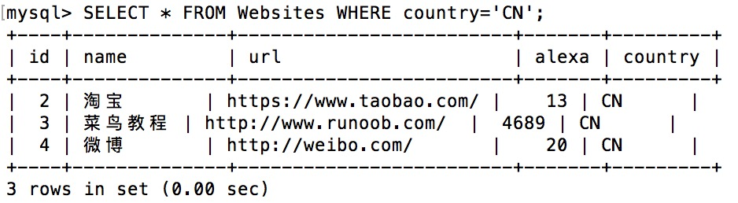
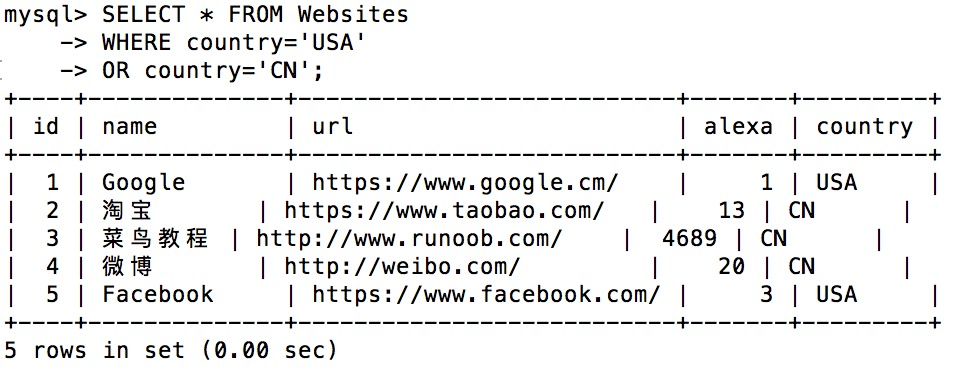
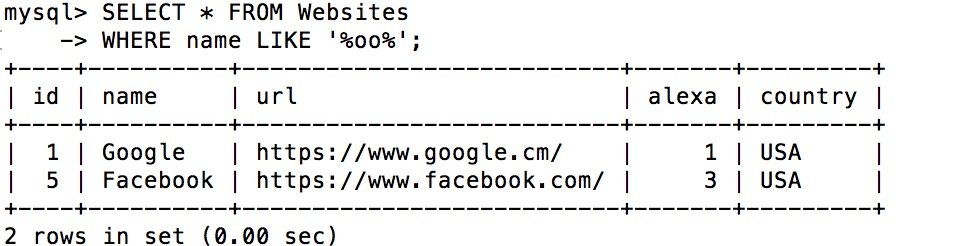
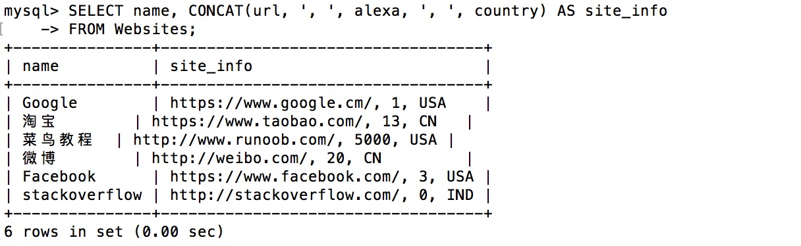

# SQL 教程

SQL 是用于访问和处理数据库的标准的计算机语言。

在本教程中，您将学到如何使用 SQL 访问和处理数据系统中的数据，这类数据库包括：MySQL、SQL Server、Access、Oracle、Sybase、DB2 等等。


## SQL 简介

SQL 是用于访问和处理数据库的标准的计算机语言。

### SQL 是什么？

- SQL，指结构化查询语言，全称是 Structured Query Language。
- SQL 让您可以访问和处理数据库。
- SQL 是一种 ANSI（American National Standards Institute 美国国家标准化组织）标准的计算机语言。

### SQL 能做什么？

- SQL 面向数据库执行查询
- SQL 可从数据库取回数据
- SQL 可在数据库中插入新的记录
- SQL 可更新数据库中的数据
- SQL 可从数据库删除记录
- SQL 可创建新数据库
- SQL 可在数据库中创建新表
- SQL 可在数据库中创建存储过程
- SQL 可在数据库中创建视图
- SQL 可以设置表、存储过程和视图的权限

### SQL 是一种标准 - 但是...

虽然 SQL 是一门 ANSI（American National Standards Institute 美国国家标准化组织）标准的计算机语言，但是仍然存在着多种不同版本的 SQL 语言。

然而，为了与 ANSI 标准相兼容，它们必须以相似的方式共同地来支持一些主要的命令（比如 SELECT、UPDATE、DELETE、INSERT、WHERE 等等）。

|  | **注释：**除了 SQL 标准之外，大部分 SQL 数据库程序都拥有它们自己的专有扩展！ |
| ----------------- | ------------------------------------------------------------ |
|                   |                                                              |

### 在您的网站中使用 SQL

要创建一个显示数据库中数据的网站，您需要：

- RDBMS 数据库程序（比如 MS Access、SQL Server、MySQL）
- 使用服务器端脚本语言，比如 PHP 或 ASP
- 使用 SQL 来获取您想要的数据
- 使用 HTML / CSS

### RDBMS

RDBMS 指关系型数据库管理系统，全称 Relational Database Management System。

RDBMS 是 SQL 的基础，同样也是所有现代数据库系统的基础，比如 MS SQL Server、IBM DB2、Oracle、MySQL 以及 Microsoft Access。

RDBMS 中的数据存储在被称为表的数据库对象中。

表是相关的数据项的集合，它由列和行组成。


## SQL 语法

### 数据库表

一个数据库通常包含一个或多个表。每个表有一个名字标识（例如:"Websites"）,表包含带有数据的记录（行）。

在本教程中，我们在 MySQL 的 RUNOOB 数据库中创建了 Websites 表，用于存储网站记录。

我们可以通过以下命令查看 "Websites" 表的数据：

```sql
mysql> use RUNOOB;
Database changed

mysql> set names utf8;
Query OK, 0 rows affected (0.00 sec)

mysql> SELECT * FROM Websites;
+----+--------------+---------------------------+-------+---------+
| id | name         | url                       | alexa | country |
+----+--------------+---------------------------+-------+---------+
| 1  | Google       | https://www.google.cm/    | 1     | USA     |
| 2  | 淘宝          | https://www.taobao.com/   | 13    | CN      |
| 3  | 菜鸟教程      | http://www.runoob.com/    | 4689  | CN      |
| 4  | 微博          | http://weibo.com/         | 20    | CN      |
| 5  | Facebook     | https://www.facebook.com/ | 3     | USA     |
+----+--------------+---------------------------+-------+---------+
5 rows in set (0.01 sec)
```

#### 解析

- **use RUNOOB;** 命令用于选择数据库。
- **set names utf8;** 命令用于设置使用的字符集。
- **SELECT \* FROM Websites;** 读取数据表的信息。
- 上面的表包含五条记录（每一条对应一个网站信息）和5个列（id、name、url、alexa 和country）。

------

### SQL 语句

您需要在数据库上执行的大部分工作都由 SQL 语句完成。

下面的 SQL 语句从 "Websites" 表中选取所有记录：

**实例**

```sql
SELECT * FROM Websites;
```

在本教程中，我们将为您讲解各种不同的 SQL 语句。

------

### 请记住...

- SQL 对大小写不敏感：SELECT 与 select 是相同的。

------

### SQL 语句后面的分号？

某些数据库系统要求在每条 SQL 语句的末端使用分号。

分号是在数据库系统中分隔每条 SQL 语句的标准方法，这样就可以在对服务器的相同请求中执行一条以上的 SQL 语句。

在本教程中，我们将在每条 SQL 语句的末端使用分号。

------

### 一些最重要的 SQL 命令

- **SELECT** - 从数据库中提取数据
- **UPDATE** - 更新数据库中的数据
- **DELETE** - 从数据库中删除数据
- **INSERT INTO** - 向数据库中插入新数据
- **CREATE DATABASE** - 创建新数据库
- **ALTER DATABASE** - 修改数据库
- **CREATE TABLE** - 创建新表
- **ALTER TABLE** - 变更（改变）数据库表
- **DROP TABLE** - 删除表
- **CREATE INDEX** - 创建索引（搜索键）
- **DROP INDEX** - 删除索引


## SQL SELECT 语句

SELECT 语句用于从数据库中选取数据。

结果被存储在一个结果表中，称为结果集。

### SQL SELECT 语法

```sql
SELECT column_name, column_name
FROM table_name;
```

与

```sql
SELECT  FROM table_name;
```

------

### 演示数据库

在本教程中，我们将使用 RUNOOB 样本数据库。

下面是选自 "Websites" 表的数据：

```sql
+----+--------------+---------------------------+-------+---------+
| id | name         | url                       | alexa | country |
+----+--------------+---------------------------+-------+---------+
| 1  | Google       | https://www.google.cm/    | 1     | USA     |
| 2  | 淘宝          | https://www.taobao.com/   | 13    | CN      |
| 3  | 菜鸟教程      | http://www.runoob.com/    | 4689  | CN      |
| 4  | 微博          | http://weibo.com/         | 20    | CN      |
| 5  | Facebook     | https://www.facebook.com/ | 3     | USA     |
+----+--------------+---------------------------+-------+---------+
```

------

### SELECT Column 实例

下面的 SQL 语句从 "Websites" 表中选取 "name" 和 "country" 列：

**实例**

```sql
SELECT name,country FROM Websites;
```

输出结果为:


------

### SELECT * 实例

下面的 SQL 语句从 "Websites" 表中选取所有列：

**实例**

```sql
SELECT * FROM Websites;
```

输出结果为:


------

### 结果集中的导航

大多数数据库软件系统都允许使用编程函数在结果集中进行导航，比如：Move-To-First-Record、Get-Record-Content、Move-To-Next-Record 等等。


## SQL SELECT DISTINCT 语句

------

SELECT DISTINCT 语句用于返回唯一不同的值。

在表中，一个列可能会包含多个重复值，有时您也许希望仅仅列出不同（distinct）的值。

DISTINCT 关键词用于返回唯一不同的值。

**SQL SELECT DISTINCT 语法**

```sql
SELECT DISTINCT column_name,column_name
FROM table_name;
```

------

在本教程中，我们将使用 RUNOOB 样本数据库。

下面是选自 "Websites" 表的数据：

```sql
+----+--------------+---------------------------+-------+---------+
| id | name         | url                       | alexa | country |
+----+--------------+---------------------------+-------+---------+
| 1  | Google       | https://www.google.cm/    | 1     | USA     |
| 2  | 淘宝          | https://www.taobao.com/   | 13    | CN      |
| 3  | 菜鸟教程      | http://www.runoob.com/    | 4689  | CN      |
| 4  | 微博          | http://weibo.com/         | 20    | CN      |
| 5  | Facebook     | https://www.facebook.com/ | 3     | USA     |
+----+--------------+---------------------------+-------+---------+
```

------

### SELECT DISTINCT 实例

下面的 SQL 语句仅从 "Websites" 表的 "country" 列中选取唯一不同的值，也就是去掉 "country" 列重复值：

**实例**

```sql
SELECT DISTINCT country FROM Websites;
```

输出结果：


## SQL WHERE 子句

------

WHERE 子句用于过滤记录。

WHERE 子句用于提取那些满足指定条件的记录。

### SQL WHERE 语法

```sql
SELECT column_name,column_name
FROM table_name
WHERE column_name operator value;
```

------

### 演示数据库

在本教程中，我们将使用 RUNOOB 样本数据库。

下面是选自 "Websites" 表的数据：

```sql
+----+--------------+---------------------------+-------+---------+
| id | name         | url                       | alexa | country |
+----+--------------+---------------------------+-------+---------+
| 1  | Google       | https://www.google.cm/    | 1     | USA     |
| 2  | 淘宝          | https://www.taobao.com/   | 13    | CN      |
| 3  | 菜鸟教程      | http://www.runoob.com/    | 4689  | CN      |
| 4  | 微博          | http://weibo.com/         | 20    | CN      |
| 5  | Facebook     | https://www.facebook.com/ | 3     | USA     |
+----+--------------+---------------------------+-------+---------+
```

------

### WHERE 子句实例

下面的 SQL 语句从 "Websites" 表中选取国家为 "CN" 的所有网站：

**实例**

```sql
SELECT * FROM Websites WHERE country='CN';
```

执行输出结果：



------

### 文本字段 vs. 数值字段

SQL 使用单引号来环绕文本值（大部分数据库系统也接受双引号）。

在上个实例中 'CN' 文本字段使用了单引号。

如果是数值字段，请不要使用引号。

**实例**

```sql
SELECT * FROM Websites WHERE id=1;
```

执行输出结果：


------

### WHERE 子句中的运算符

下面的运算符可以在 WHERE 子句中使用：

| 运算符  | 描述                                                       |
| :------ | :--------------------------------------------------------- |
| =       | 等于                                                       |
| <>      | 不等于。**注释：**在 SQL 的一些版本中，该操作符可被写成 != |
| >       | 大于                                                       |
| <       | 小于                                                       |
| >=      | 大于等于                                                   |
| <=      | 小于等于                                                   |
| BETWEEN | 在某个范围内                                               |
| LIKE    | 搜索某种模式                                               |
| IN      | 指定针对某个列的多个可能值                                 |


## SQL AND & OR 运算符

------

AND & OR 运算符用于基于一个以上的条件对记录进行过滤。

如果第一个条件和第二个条件都成立，则 AND 运算符显示一条记录。

如果第一个条件和第二个条件中只要有一个成立，则 OR 运算符显示一条记录。

------

### 演示数据库

在本教程中，我们将使用 RUNOOB 样本数据库。

下面是选自 "Websites" 表的数据：

```sql
+----+--------------+---------------------------+-------+---------+
| id | name         | url                       | alexa | country |
+----+--------------+---------------------------+-------+---------+
| 1  | Google       | https://www.google.cm/    | 1     | USA     |
| 2  | 淘宝          | https://www.taobao.com/   | 13    | CN      |
| 3  | 菜鸟教程      | http://www.runoob.com/    | 4689  | CN      |
| 4  | 微博          | http://weibo.com/         | 20    | CN      |
| 5  | Facebook     | https://www.facebook.com/ | 3     | USA     |
+----+--------------+---------------------------+-------+---------+
```

------

### AND 运算符实例

下面的 SQL 语句从 "Websites" 表中选取国家为 "CN" 且alexa排名大于 "50" 的所有网站：

**实例**

```sql
SELECT * FROM Websites 
WHERE country='CN' 
AND alexa > 50;
```

执行输出结果：


------

### OR 运算符实例

下面的 SQL 语句从 "Websites" 表中选取国家为 "USA" 或者 "CN" 的所有客户：

**实例**

```sql
SELECT * FROM 
Websites WHERE country='USA' 
OR country='CN';
```

执行输出结果：



------

### 结合 AND & OR

您也可以把 AND 和 OR 结合起来（使用圆括号来组成复杂的表达式）。

下面的 SQL 语句从 "Websites" 表中选取 alexa 排名大于 "15" 且国家为 "CN" 或 "USA" 的所有网站：

**实例**

```sql
SELECT * FROM 
Websites WHERE alexa > 15 
AND (country='CN' OR country='USA');
```

执行输出结果：


## SQL ORDER BY 关键字

------

ORDER BY 关键字用于对结果集进行排序。

ORDER BY 关键字用于对结果集按照一个列或者多个列进行排序。

ORDER BY 关键字默认按照升序对记录进行排序。如果需要按照降序对记录进行排序，您可以使用 DESC 关键字。

### SQL ORDER BY 语法

```sql
SELECT column_name,column_name
FROM table_name
ORDER BY column_name,column_name ASC|DESC;
```

------

### 演示数据库

在本教程中，我们将使用 RUNOOB 样本数据库。

下面是选自 "Websites" 表的数据：

```sql
+----+--------------+---------------------------+-------+---------+
| id | name         | url                       | alexa | country |
+----+--------------+---------------------------+-------+---------+
| 1  | Google       | https://www.google.cm/    | 1     | USA     |
| 2  | 淘宝          | https://www.taobao.com/   | 13    | CN      |
| 3  | 菜鸟教程      | http://www.runoob.com/    | 4689  | CN      |
| 4  | 微博          | http://weibo.com/         | 20    | CN      |
| 5  | Facebook     | https://www.facebook.com/ | 3     | USA     |
+----+--------------+---------------------------+-------+---------+
```

------

### ORDER BY 实例

下面的 SQL 语句从 "Websites" 表中选取所有网站，并按照 "alexa" 列排序：

**实例**

```sql
SELECT * FROM Websites 
ORDER BY alexa;
```

执行输出结果：


------

### ORDER BY DESC 实例

下面的 SQL 语句从 "Websites" 表中选取所有网站，并按照 "alexa" 列降序排序：

**实例**

```sql
SELECT * FROM Websites 
ORDER BY alexa DESC;
```

执行输出结果：


------

### ORDER BY 多列

下面的 SQL 语句从 "Websites" 表中选取所有网站，并按照 "country" 和 "alexa" 列排序：

**实例**

```sql
SELECT * FROM Websites 
ORDER BY country,alexa;
```

执行输出结果：


## SQL INSERT INTO 语句

------

INSERT INTO 语句用于向表中插入新记录。

### SQL INSERT INTO 语法

INSERT INTO 语句可以有两种编写形式。

第一种形式无需指定要插入数据的列名，只需提供被插入的值即可：

```sql
INSERT INTO table_name
VALUES (value1,value2,value3,...);
```

第二种形式需要指定列名及被插入的值：

```sql
INSERT INTO table_name (column1,column2,column3,...)
VALUES (value1,value2,value3,...);
```

------

### 演示数据库

在本教程中，我们将使用 RUNOOB 样本数据库。

下面是选自 "Websites" 表的数据：

```sql
+----+--------------+---------------------------+-------+---------+
| id | name         | url                       | alexa | country |
+----+--------------+---------------------------+-------+---------+
| 1  | Google       | https://www.google.cm/    | 1     | USA     |
| 2  | 淘宝          | https://www.taobao.com/   | 13    | CN      |
| 3  | 菜鸟教程      | http://www.runoob.com/    | 4689  | CN      |
| 4  | 微博          | http://weibo.com/         | 20    | CN      |
| 5  | Facebook     | https://www.facebook.com/ | 3     | USA     |
+----+--------------+---------------------------+-------+---------+
```

------

### INSERT INTO 实例

假设我们要向 "Websites" 表中插入一个新行。

我们可以使用下面的 SQL 语句：

**实例**

```sql
INSERT INTO Websites (name, url, alexa, country) 
VALUES ('百度','https://www.baidu.com/','4','CN');
```

执行以上 SQL，再读取 "Websites" 表，数据如下所示：


|  | **您是否注意到，我们没有向 id 字段插入任何数字？** id 列是自动更新的，表中的每条记录都有一个唯一的数字。 |
| ----------------- | ------------------------------------------------------------ |
|                   |                                                              |

------

### 在指定的列插入数据

我们也可以在指定的列插入数据。

下面的 SQL 语句将插入一个新行，但是只在 "name"、"url" 和 "country" 列插入数据（id 字段会自动更新）：

**实例**

```sql
INSERT INTO Websites (name, url, country) 
VALUES ('stackoverflow', 'http://stackoverflow.com/', 'IND');
```

执行以上 SQL，再读取 "Websites" 表，数据如下所示：


## SQL UPDATE 语句

------

UPDATE 语句用于更新表中的记录。

UPDATE 语句用于更新表中已存在的记录。

### SQL UPDATE 语法

```sql
UPDATE table_name
SET column1=value1,column2=value2,...
WHERE some_column=some_value;
```

|  | **请注意 SQL UPDATE 语句中的 WHERE 子句！** <br/>WHERE 子句规定哪条记录或者哪些记录需要更新。如果您省略了 WHERE 子句，所有的记录都将被更新！ |
| ----------------- | ------------------------------------------------------------ |
|                   |                                                              |

------

### 演示数据库

在本教程中，我们将使用 RUNOOB 样本数据库。

下面是选自 "Websites" 表的数据：

```sql
+----+--------------+---------------------------+-------+---------+
| id | name         | url                       | alexa | country |
+----+--------------+---------------------------+-------+---------+
| 1  | Google       | https://www.google.cm/    | 1     | USA     |
| 2  | 淘宝          | https://www.taobao.com/   | 13    | CN      |
| 3  | 菜鸟教程      | http://www.runoob.com/    | 4689  | CN      |
| 4  | 微博          | http://weibo.com/         | 20    | CN      |
| 5  | Facebook     | https://www.facebook.com/ | 3     | USA     |
+----+--------------+---------------------------+-------+---------+
```

------

### SQL UPDATE 实例

假设我们要把 "菜鸟教程" 的 alexa 排名更新为 5000，country 改为 USA。

我们使用下面的 SQL 语句：

**实例**

```sql
UPDATE Websites  
SET alexa='5000', country='USA'  
WHERE name='菜鸟教程';
```

执行以上 SQL，再读取 "Websites" 表，数据如下所示：


------

### Update 警告！

在更新记录时要格外小心！在上面的实例中，如果我们省略了 WHERE 子句，如下所示：

```sql
UPDATE Websites
SET alexa='5000', country='USA'
```

执行以上代码会将 Websites 表中所有数据的 alexa 改为 5000，country 改为 USA。

执行没有 WHERE 子句的 UPDATE 要慎重，再慎重。


## SQL DELETE 语句

------

DELETE 语句用于删除表中的记录。

DELETE 语句用于删除表中的行。

### SQL DELETE 语法

```sql
DELETE FROM table_name
WHERE some_column=some_value;
```

|  | **请注意 SQL DELETE 语句中的 WHERE 子句！** <br/>WHERE 子句规定哪条记录或者哪些记录需要删除。如果您省略了 WHERE 子句，所有的记录都将被删除！ |
| ----------------- | ------------------------------------------------------------ |
|                   |                                                              |

------

### 演示数据库

在本教程中，我们将使用 RUNOOB 样本数据库。

下面是选自 "Websites" 表的数据：

```sql
+----+--------------+---------------------------+-------+---------+
| id | name         | url                       | alexa | country |
+----+--------------+---------------------------+-------+---------+
| 1  | Google       | https://www.google.cm/    | 1     | USA     |
| 2  | 淘宝       | https://www.taobao.com/   | 13    | CN      |
| 3  | 菜鸟教程 | http://www.runoob.com/    | 4689  | CN      |
| 4  | 微博       | http://weibo.com/         | 20    | CN      |
| 5  | Facebook     | https://www.facebook.com/ | 3     | USA     |
+----+--------------+---------------------------+-------+---------+
```

------

### SQL DELETE 实例

假设我们要从 "Websites" 表中删除网站名为 "Facebook" 且国家为 USA 的网站。

我们使用下面的 SQL 语句：

**实例**

```sql
DELETE FROM Websites WHERE name='Facebook' AND country='USA';
```

执行以上 SQL，再读取 "Websites" 表，数据如下所示：


------

### 删除所有数据

您可以在不删除表的情况下，删除表中所有的行。这意味着表结构、属性、索引将保持不变：

```
DELETE FROM table_name;

或

DELETE * FROM table_name;
```

**注释：**在删除记录时要格外小心！因为您不能重来！


# SQL 高级教程

## SQL SELECT TOP, LIMIT, ROWNUM 子句

### SQL SELECT TOP 子句

SELECT TOP 子句用于规定要返回的记录的数目。

SELECT TOP 子句对于拥有数千条记录的大型表来说，是非常有用的。

> **注意:**并非所有的数据库系统都支持 SELECT TOP 语句。 MySQL 支持 LIMIT 语句来选取指定的条数数据， Oracle 可以使用 ROWNUM 来选取。

### SQL Server / MS Access 语法

```sql
SELECT TOP number|percent column_name(s)
FROM table_name;
```

### MySQL 语法

```sql
SELECT column_name(s)
FROM table_name
LIMIT number;
```

**实例**

```sql
SELECT *
FROM Persons
LIMIT 5;
```

### Oracle 语法

```sql
SELECT column_name(s)
FROM table_name
WHERE ROWNUM <= number;
```

**实例**

```sql
SELECT *
FROM Persons
WHERE ROWNUM <=5;
```

------

### 演示数据库

在本教程中，我们将使用 RUNOOB 样本数据库。

下面是选自 "Websites" 表的数据：

```sql
mysql> SELECT * FROM Websites;
+----+---------------+---------------------------+-------+---------+
| id | name          | url                       | alexa | country |
+----+---------------+---------------------------+-------+---------+
|  1 | Google        | https://www.google.cm/    |     1 | USA     |
|  2 | 淘宝          | https://www.taobao.com/   |    13 | CN      |
|  3 | 菜鸟教程       | http://www.runoob.com/    |  5000 | USA     |
|  4 | 微博           | http://weibo.com/         |    20 | CN      |
|  5 | Facebook      | https://www.facebook.com/ |     3 | USA     |
|  7 | stackoverflow | http://stackoverflow.com/ |     0 | IND     |
+----+---------------+---------------------------+-------+---------+
```

------

### MySQL SELECT LIMIT 实例

下面的 SQL 语句从 "Websites" 表中选取头两条记录：

**实例**

```sql
SELECT * FROM Websites LIMIT 2;
```

执行以上 SQL，数据如下所示：


------

### SQL SELECT TOP PERCENT 实例

在 Microsoft SQL Server 中还可以使用百分比作为参数。

下面的 SQL 语句从 websites 表中选取前面百分之 50 的记录：

**实例**

以下操作在 Microsoft SQL Server 数据库中可执行。

```sql
SELECT TOP 50 PERCENT * FROM Websites;
```


## SQL LIKE 操作符

LIKE 操作符用于在 WHERE 子句中搜索列中的指定模式。

### SQL LIKE 语法

```sql
SELECT column_name(s)
FROM table_name
WHERE column_name LIKE pattern;
```

### 演示数据库

在本教程中，我们将使用 RUNOOB 样本数据库。

下面是选自 "Websites" 表的数据：

```sql
+----+--------------+---------------------------+-------+---------+
| id | name         | url                       | alexa | country |
+----+--------------+---------------------------+-------+---------+
| 1  | Google       | https://www.google.cm/    | 1     | USA     |
| 2  | 淘宝          | https://www.taobao.com/   | 13    | CN      |
| 3  | 菜鸟教程      | http://www.runoob.com/    | 4689  | CN      |
| 4  | 微博          | http://weibo.com/         | 20    | CN      |
| 5  | Facebook     | https://www.facebook.com/ | 3     | USA     |
| 7  | stackoverflow | http://stackoverflow.com/ |   0 | IND     |
+----+---------------+---------------------------+-------+---------+
```

### SQL LIKE 操作符实例

下面的 SQL 语句选取 name 以字母 "G" 开始的所有客户：

**实例**

```sql
SELECT * FROM Websites
WHERE name LIKE 'G%';
```

执行输出结果：


**提示：**"%" 符号用于在模式的前后定义通配符（默认字母）。您将在下一章中学习更多有关通配符的知识。

下面的 SQL 语句选取 name 以字母 "k" 结尾的所有客户：

**实例**

```sql
SELECT * FROM Websites
WHERE name LIKE '%k';
```

执行输出结果：


下面的 SQL 语句选取 name 包含模式 "oo" 的所有客户：

**实例**

```sql
SELECT * FROM Websites
WHERE name LIKE '%oo%';
```

执行输出结果：



通过使用 NOT 关键字，您可以选取不匹配模式的记录。

下面的 SQL 语句选取 name 不包含模式 "oo" 的所有客户：

**实例**

```sql
SELECT * FROM Websites
WHERE name NOT LIKE '%oo%';
```

执行输出结果：


## SQL 通配符

通配符可用于替代字符串中的任何其他字符。

在 SQL 中，通配符与 SQL LIKE 操作符一起使用。

SQL 通配符用于搜索表中的数据。

在 SQL 中，可使用以下通配符：

| 通配符                         | 描述                       |
| :----------------------------- | :------------------------- |
| %                              | 替代 0 个或多个字符        |
| _                              | 替代一个字符               |
| [*charlist*]                   | 字符列中的任何单一字符     |
| [^*charlist*] 或 [!*charlist*] | 不在字符列中的任何单一字符 |

### 演示数据库

在本教程中，我们将使用 RUNOOB 样本数据库。

下面是选自 "Websites" 表的数据：

```sql
+----+--------------+---------------------------+-------+---------+
| id | name         | url                       | alexa | country |
+----+--------------+---------------------------+-------+---------+
| 1  | Google       | https://www.google.cm/    | 1     | USA     |
| 2  | 淘宝          | https://www.taobao.com/   | 13    | CN      |
| 3  | 菜鸟教程      | http://www.runoob.com/    | 4689  | CN      |
| 4  | 微博          | http://weibo.com/         | 20    | CN      |
| 5  | Facebook     | https://www.facebook.com/ | 3     | USA     |
| 7  | stackoverflow | http://stackoverflow.com/ |   0 | IND     |
+----+---------------+---------------------------+-------+---------+
```

### 使用 SQL % 通配符

下面的 SQL 语句选取 url 以字母 "https" 开始的所有网站：

**实例**

```sql
SELECT * FROM Websites
WHERE url LIKE 'https%';
```

执行输出结果：


下面的 SQL 语句选取 url 包含模式 "oo" 的所有网站：

**实例**

```sql
SELECT * FROM Websites
WHERE url LIKE '%oo%';
```

执行输出结果：


### 使用 SQL _ 通配符

下面的 SQL 语句选取 name 以一个任意字符开始，然后是 "oogle" 的所有客户：

**实例**

```sql
SELECT * FROM Websites
WHERE name LIKE '_oogle';
```

执行输出结果：


下面的 SQL 语句选取 name 以 "G" 开始，然后是一个任意字符，然后是 "o"，然后是一个任意字符，然后是 "le" 的所有网站：

**实例**

```sql
SELECT * FROM Websites
WHERE name LIKE 'G_o_le';
```

执行输出结果：


### 使用 SQL [charlist] 通配符

MySQL 中使用 **REGEXP** 或 **NOT REGEXP** 运算符 (或 RLIKE 和 NOT RLIKE) 来操作正则表达式。

下面的 SQL 语句选取 name 以 "G"、"F" 或 "s" 开始的所有网站：

**实例**

```sql
SELECT * FROM Websites
WHERE name REGEXP '^[GFs]';
```

执行输出结果：


下面的 SQL 语句选取 name 以 A 到 H 字母开头的网站：

**实例**

```sql
SELECT * FROM Websites
WHERE name REGEXP '^[A-H]';
```

执行输出结果：


下面的 SQL 语句选取 name 不以 A 到 H 字母开头的网站：

**实例**

```sql
SELECT * FROM Websites
WHERE name REGEXP '^[^A-H]';
```

执行输出结果：


## SQL IN 操作符

------

### IN 操作符

IN 操作符允许您在 WHERE 子句中规定多个值。

### SQL IN 语法

```sql
SELECT column_name(s)
FROM table_name
WHERE column_name IN (value1,value2,...);
```

### 演示数据库

在本教程中，我们将使用 RUNOOB 样本数据库。

下面是选自 "Websites" 表的数据：

```sql
+----+--------------+---------------------------+-------+---------+
| id | name         | url                       | alexa | country |
+----+--------------+---------------------------+-------+---------+
| 1  | Google       | https://www.google.cm/    | 1     | USA     |
| 2  | 淘宝          | https://www.taobao.com/   | 13    | CN      |
| 3  | 菜鸟教程      | http://www.runoob.com/    | 4689  | CN      |
| 4  | 微博          | http://weibo.com/         | 20    | CN      |
| 5  | Facebook     | https://www.facebook.com/ | 3     | USA     |
| 7  | stackoverflow | http://stackoverflow.com/ |   0 | IND     |
+----+---------------+---------------------------+-------+---------+
```

### IN 操作符实例

下面的 SQL 语句选取 name 为 "Google" 或 "菜鸟教程" 的所有网站：

**实例**

```sql
SELECT * FROM Websites
WHERE name IN ('Google','菜鸟教程');
```

执行输出结果：


## SQL BETWEEN 操作符

BETWEEN 操作符选取介于两个值之间的数据范围内的值。这些值可以是数值、文本或者日期。

### SQL BETWEEN 语法

```sql
SELECT column_name(s)
FROM table_name
WHERE column_name BETWEEN value1 AND value2;
```

### 演示数据库

在本教程中，我们将使用 RUNOOB 样本数据库。

下面是选自 "Websites" 表的数据：

```sql
+----+--------------+---------------------------+-------+---------+
| id | name         | url                       | alexa | country |
+----+--------------+---------------------------+-------+---------+
| 1  | Google       | https://www.google.cm/    | 1     | USA     |
| 2  | 淘宝          | https://www.taobao.com/   | 13    | CN      |
| 3  | 菜鸟教程      | http://www.runoob.com/    | 4689  | CN      |
| 4  | 微博          | http://weibo.com/         | 20    | CN      |
| 5  | Facebook     | https://www.facebook.com/ | 3     | USA     |
| 7  | stackoverflow | http://stackoverflow.com/ |   0 | IND     |
+----+---------------+---------------------------+-------+---------+
```

### BETWEEN 操作符实例

下面的 SQL 语句选取 alexa 介于 1 和 20 之间的所有网站：

**实例**

```sql
SELECT * FROM Websites
WHERE alexa BETWEEN 1 AND 20;
```

执行输出结果：


### NOT BETWEEN 操作符实例

如需显示不在上面实例范围内的网站，请使用 NOT BETWEEN：

**实例**

```sql
SELECT * FROM Websites
WHERE alexa NOT BETWEEN 1 AND 20;
```

执行输出结果：


### 带有 IN 的 BETWEEN 操作符实例

下面的 SQL 语句选取 alexa 介于 1 和 20 之间但 country 不为 USA 和 IND 的所有网站：

**实例**

```sql
SELECT * FROM Websites
WHERE (alexa BETWEEN 1 AND 20)
AND country NOT IN ('USA', 'IND');
```

执行输出结果：


### 带有文本值的 BETWEEN 操作符实例

下面的 SQL 语句选取 name 以介于 'A' 和 'H' 之间字母开始的所有网站：

**实例**

```sql
SELECT * FROM Websites
WHERE name BETWEEN 'A' AND 'H';
```

执行输出结果：


### 带有文本值的 NOT BETWEEN 操作符实例

下面的 SQL 语句选取 name 不介于 'A' 和 'H' 之间字母开始的所有网站：

**实例**

```sql
SELECT * FROM Websites
WHERE name NOT BETWEEN 'A' AND 'H';
```

执行输出结果：


### 示例表

下面是 "access_log" 网站访问记录表的数据，其中：

- **aid：**为自增 id。
- **site_id**：为对应 websites表的网站 id。
- **count**：访问次数。
- **date：**为访问日期。

```sql
mysql> SELECT * FROM access_log;
+-----+---------+-------+------------+
| aid | site_id | count | date       |
+-----+---------+-------+------------+
|   1 |       1 |    45 | 2016-05-10 |
|   2 |       3 |   100 | 2016-05-13 |
|   3 |       1 |   230 | 2016-05-14 |
|   4 |       2 |    10 | 2016-05-14 |
|   5 |       5 |   205 | 2016-05-14 |
|   6 |       4 |    13 | 2016-05-15 |
|   7 |       3 |   220 | 2016-05-15 |
|   8 |       5 |   545 | 2016-05-16 |
|   9 |       3 |   201 | 2016-05-17 |
+-----+---------+-------+------------+
9 rows in set (0.00 sec)
```

本教程使用到的 access_log 表 SQL 文件：[access_log.sql](http://static.runoob.com/download/access_log.sql)。

### 带有日期值的 BETWEEN 操作符实例

下面的 SQL 语句选取 date 介于 '2016-05-10' 和 '2016-05-14' 之间的所有访问记录：

**实例**

```sql
SELECT * FROM access_log
WHERE date BETWEEN '2016-05-10' AND '2016-05-14';
```

执行输出结果：


|  | **请注意，在不同的数据库中，BETWEEN 操作符会产生不同的结果！ **<br/>在某些数据库中，BETWEEN 选取介于两个值之间但不包括两个测试值的字段。 在某些数据库中，BETWEEN 选取介于两个值之间且包括两个测试值的字段。 在某些数据库中，BETWEEN 选取介于两个值之间且包括第一个测试值但不包括最后一个测试值的字段。<br/>**因此，请检查您的数据库是如何处理 BETWEEN 操作符！** |
| ----------------- | ------------------------------------------------------------ |
|                   |                                                              |


## SQL 别名

通过使用 SQL，可以为表名称或列名称指定别名。

基本上，创建别名是为了让列名称的可读性更强。

### 列的 SQL 别名语法

```sql
SELECT column_name AS alias_name
FROM table_name;
```

### 表的 SQL 别名语法

```sql
SELECT column_name(s)
FROM table_name AS alias_name;
```

### 演示数据库

在本教程中，我们将使用 RUNOOB 样本数据库。

下面是选自 "Websites" 表的数据：

```sql
+----+--------------+---------------------------+-------+---------+
| id | name         | url                       | alexa | country |
+----+--------------+---------------------------+-------+---------+
| 1  | Google       | https://www.google.cm/    | 1     | USA     |
| 2  | 淘宝          | https://www.taobao.com/   | 13    | CN      |
| 3  | 菜鸟教程      | http://www.runoob.com/    | 4689  | CN      |
| 4  | 微博          | http://weibo.com/         | 20    | CN      |
| 5  | Facebook     | https://www.facebook.com/ | 3     | USA     |
| 7  | stackoverflow | http://stackoverflow.com/ |   0 | IND     |
+----+---------------+---------------------------+-------+---------+
```

下面是 "access_log" 网站访问记录表的数据：

```sql
mysql> SELECT * FROM access_log;
+-----+---------+-------+------------+
| aid | site_id | count | date       |
+-----+---------+-------+------------+
|   1 |       1 |    45 | 2016-05-10 |
|   2 |       3 |   100 | 2016-05-13 |
|   3 |       1 |   230 | 2016-05-14 |
|   4 |       2 |    10 | 2016-05-14 |
|   5 |       5 |   205 | 2016-05-14 |
|   6 |       4 |    13 | 2016-05-15 |
|   7 |       3 |   220 | 2016-05-15 |
|   8 |       5 |   545 | 2016-05-16 |
|   9 |       3 |   201 | 2016-05-17 |
+-----+---------+-------+------------+
9 rows in set (0.00 sec)
```

### 列的别名实例

下面的 SQL 语句指定了两个别名，一个是 name 列的别名，一个是 country 列的别名。**提示：**如果列名称包含空格，要求使用双引号或方括号：

**实例**

```sql
SELECT name AS n, country AS c
FROM Websites;
```

执行输出结果：


在下面的 SQL 语句中，我们把三个列（url、alexa 和 country）结合在一起，并创建一个名为 "site_info" 的别名：

**实例**

```sql
SELECT name, CONCAT(url, ', ', alexa, ', ', country) AS site_info
FROM Websites;
```

执行输出结果：



### 表的别名实例

下面的 SQL 语句选取 "菜鸟教程" 的所访问记录。我们使用 "Websites" 和 "access_log" 表，并分别为它们指定表别名 "w" 和 "a"（通过使用别名让 SQL 更简短）：

**实例**

```sql
SELECT w.name, w.url, a.count, a.date
FROM Websites AS w, access_log AS a
WHERE a.site_id=w.id and w.name="菜鸟教程";
```

执行输出结果：


不带别名的相同的 SQL 语句：

**实例**

```sql
SELECT Websites.name, Websites.url, access_log.count, access_log.date
FROM Websites, access_log
WHERE Websites.id=access_log.site_id and Websites.name="菜鸟教程";
```

执行输出结果：


在下面的情况下，使用别名很有用：

- 在查询中涉及超过一个表
- 在查询中使用了函数
- 列名称很长或者可读性差
- 需要把两个列或者多个列结合在一起


## SQL 连接(JOIN)

SQL join 用于把来自两个或多个表的行结合起来。

下图展示了 LEFT JOIN、RIGHT JOIN、INNER JOIN、OUTER JOIN 相关的 7 种用法。

[](https://www.runoob.com/wp-content/uploads/2019/01/sql-join.png)

SQL JOIN 子句用于把来自两个或多个表的行结合起来，基于这些表之间的共同字段。

最常见的 JOIN 类型：**SQL INNER JOIN（简单的 JOIN）**。 SQL INNER JOIN 从多个表中返回满足 JOIN 条件的所有行。

### 演示数据库

在本教程中，我们将使用 RUNOOB 样本数据库。

下面是选自 "Websites" 表的数据：

```
+----+--------------+---------------------------+-------+---------+
| id | name         | url                       | alexa | country |
+----+--------------+---------------------------+-------+---------+
| 1  | Google       | https://www.google.cm/    | 1     | USA     |
| 2  | 淘宝          | https://www.taobao.com/   | 13    | CN      |
| 3  | 菜鸟教程      | http://www.runoob.com/    | 4689  | CN      |
| 4  | 微博          | http://weibo.com/         | 20    | CN      |
| 5  | Facebook     | https://www.facebook.com/ | 3     | USA     |
| 7  | stackoverflow | http://stackoverflow.com/ |   0 | IND     |
+----+---------------+---------------------------+-------+---------+
```

下面是 "access_log" 网站访问记录表的数据：

```sql
mysql> SELECT * FROM access_log;
+-----+---------+-------+------------+
| aid | site_id | count | date       |
+-----+---------+-------+------------+
|   1 |       1 |    45 | 2016-05-10 |
|   2 |       3 |   100 | 2016-05-13 |
|   3 |       1 |   230 | 2016-05-14 |
|   4 |       2 |    10 | 2016-05-14 |
|   5 |       5 |   205 | 2016-05-14 |
|   6 |       4 |    13 | 2016-05-15 |
|   7 |       3 |   220 | 2016-05-15 |
|   8 |       5 |   545 | 2016-05-16 |
|   9 |       3 |   201 | 2016-05-17 |
+-----+---------+-------+------------+
9 rows in set (0.00 sec)
```

请注意，"Websites" 表中的 "**id**" 列指向 "access_log" 表中的字段 "**site_id**"。上面这两个表是通过 "site_id" 列联系起来的。

然后，如果我们运行下面的 SQL 语句（包含 INNER JOIN）：

### 实例

```sql
SELECT Websites.id, Websites.name, access_log.count, access_log.date
FROM Websites
INNER JOIN access_log
ON Websites.id=access_log.site_id;
```

执行以上 SQL 输出结果如下：


### 不同的 SQL JOIN

在我们继续讲解实例之前，我们先列出您可以使用的不同的 SQL JOIN 类型：

- **INNER JOIN**：如果表中有至少一个匹配，则返回行
- **LEFT JOIN**：即使右表中没有匹配，也从左表返回所有的行
- **RIGHT JOIN**：即使左表中没有匹配，也从右表返回所有的行
- **FULL JOIN**：只要其中一个表中存在匹配，则返回行

## SQL INNER JOIN 关键字

INNER JOIN 关键字在表中存在至少一个匹配时返回行。

### SQL INNER JOIN 语法

```sql
SELECT column_name(s)
FROM table1
INNER JOIN table2
ON table1.column_name=table2.column_name;
```

或：

```sql
SELECT column_name(s)
FROM table1
JOIN table2
ON table1.column_name=table2.column_name;
```

**注释：**INNER JOIN 与 JOIN 是相同的。


### 演示数据库

在本教程中，我们将使用 RUNOOB 样本数据库。

下面是选自 "Websites" 表的数据：

```
+----+--------------+---------------------------+-------+---------+
| id | name         | url                       | alexa | country |
+----+--------------+---------------------------+-------+---------+
| 1  | Google       | https://www.google.cm/    | 1     | USA     |
| 2  | 淘宝          | https://www.taobao.com/   | 13    | CN      |
| 3  | 菜鸟教程      | http://www.runoob.com/    | 4689  | CN      |
| 4  | 微博          | http://weibo.com/         | 20    | CN      |
| 5  | Facebook     | https://www.facebook.com/ | 3     | USA     |
| 7  | stackoverflow | http://stackoverflow.com/ |   0 | IND     |
+----+---------------+---------------------------+-------+---------+
```

下面是 "access_log" 网站访问记录表的数据：

```
mysql> SELECT * FROM access_log;
+-----+---------+-------+------------+
| aid | site_id | count | date       |
+-----+---------+-------+------------+
|   1 |       1 |    45 | 2016-05-10 |
|   2 |       3 |   100 | 2016-05-13 |
|   3 |       1 |   230 | 2016-05-14 |
|   4 |       2 |    10 | 2016-05-14 |
|   5 |       5 |   205 | 2016-05-14 |
|   6 |       4 |    13 | 2016-05-15 |
|   7 |       3 |   220 | 2016-05-15 |
|   8 |       5 |   545 | 2016-05-16 |
|   9 |       3 |   201 | 2016-05-17 |
+-----+---------+-------+------------+
9 rows in set (0.00 sec)
```

### SQL INNER JOIN 实例

下面的 SQL 语句将返回所有网站的访问记录：

**实例**

```sql
SELECT Websites.name, access_log.count, access_log.date
FROM Websites
INNER JOIN access_log
ON Websites.id=access_log.site_id
ORDER BY access_log.count;
```

执行以上 SQL 输出结果如下：


**注释：**INNER JOIN 关键字在表中存在至少一个匹配时返回行。如果 "Websites" 表中的行在 "access_log" 中没有匹配，则不会列出这些行。


## SQL LEFT JOIN 关键字

LEFT JOIN 关键字从左表（table1）返回所有的行，即使右表（table2）中没有匹配。如果右表中没有匹配，则结果为 NULL。

### SQL LEFT JOIN 语法

```sql
SELECT column_name(s)
FROM table1
LEFT JOIN table2
ON table1.column_name*=*table2.column_name;
```

或：

```sql
SELECT column_name(s)
FROM table1
LEFT OUTER JOIN table2
ON table1.column_name=table2.column_name;
```

**注释：**在某些数据库中，LEFT JOIN 称为 LEFT OUTER JOIN。


### 演示数据库

在本教程中，我们将使用 RUNOOB 样本数据库。

下面是选自 "Websites" 表的数据：

```
+----+--------------+---------------------------+-------+---------+
| id | name         | url                       | alexa | country |
+----+--------------+---------------------------+-------+---------+
| 1  | Google       | https://www.google.cm/    | 1     | USA     |
| 2  | 淘宝          | https://www.taobao.com/   | 13    | CN      |
| 3  | 菜鸟教程      | http://www.runoob.com/    | 4689  | CN      |
| 4  | 微博          | http://weibo.com/         | 20    | CN      |
| 5  | Facebook     | https://www.facebook.com/ | 3     | USA     |
| 7  | stackoverflow | http://stackoverflow.com/ |   0 | IND     |
+----+---------------+---------------------------+-------+---------+
```

下面是 "access_log" 网站访问记录表的数据：

```
mysql> SELECT * FROM access_log;
+-----+---------+-------+------------+
| aid | site_id | count | date       |
+-----+---------+-------+------------+
|   1 |       1 |    45 | 2016-05-10 |
|   2 |       3 |   100 | 2016-05-13 |
|   3 |       1 |   230 | 2016-05-14 |
|   4 |       2 |    10 | 2016-05-14 |
|   5 |       5 |   205 | 2016-05-14 |
|   6 |       4 |    13 | 2016-05-15 |
|   7 |       3 |   220 | 2016-05-15 |
|   8 |       5 |   545 | 2016-05-16 |
|   9 |       3 |   201 | 2016-05-17 |
+-----+---------+-------+------------+
9 rows in set (0.00 sec)
```

------

### SQL LEFT JOIN 实例

下面的 SQL 语句将返回所有网站及他们的访问量（如果有的话）。

以下实例中我们把 Websites 作为左表，access_log 作为右表：

**实例**

```sql
SELECT Websites.name, access_log.count, access_log.date
FROM Websites
LEFT JOIN access_log
ON Websites.id=access_log.site_id
ORDER BY access_log.count DESC;
```

执行以上 SQL 输出结果如下：


**注释：**LEFT JOIN 关键字从左表（Websites）返回所有的行，即使右表（access_log）中没有匹配。


## SQL RIGHT JOIN 关键字

RIGHT JOIN 关键字从右表（table2）返回所有的行，即使左表（table1）中没有匹配。如果左表中没有匹配，则结果为 NULL。

### SQL RIGHT JOIN 语法

```sql
SELECT column_name(s)
FROM table1
RIGHT JOIN table2
ON table1.column_name=table2.column_name;
```

或：

```sql
SELECT column_name(s)
FROM table1
RIGHT OUTER JOIN table2
ON table1.column_name=table2.column_name;
```

**注释：**在某些数据库中，RIGHT JOIN 称为 RIGHT OUTER JOIN。


### 演示数据库

在本教程中，我们将使用 RUNOOB 样本数据库。

操作前先先在 access_log 表添加一条数据，该数据在 Websites 表没有对应的数据：

```sql
INSERT INTO `access_log` (`aid`, `site_id`, `count`, `date`) VALUES ('10', '6', '111', '2016-03-09');
```

下面是选自 "Websites" 表的数据：

```sql
+----+--------------+---------------------------+-------+---------+
| id | name         | url                       | alexa | country |
+----+--------------+---------------------------+-------+---------+
| 1  | Google       | https://www.google.cm/    | 1     | USA     |
| 2  | 淘宝          | https://www.taobao.com/   | 13    | CN      |
| 3  | 菜鸟教程      | http://www.runoob.com/    | 4689  | CN      |
| 4  | 微博          | http://weibo.com/         | 20    | CN      |
| 5  | Facebook     | https://www.facebook.com/ | 3     | USA     |
| 7  | stackoverflow | http://stackoverflow.com/ |   0 | IND     |
+----+---------------+---------------------------+-------+---------+
```

下面是 "access_log" 网站访问记录表的数据：

```sql
mysql> SELECT * FROM access_log;
+-----+---------+-------+------------+
| aid | site_id | count | date       |
+-----+---------+-------+------------+
|   1 |       1 |    45 | 2016-05-10 |
|   2 |       3 |   100 | 2016-05-13 |
|   3 |       1 |   230 | 2016-05-14 |
|   4 |       2 |    10 | 2016-05-14 |
|   5 |       5 |   205 | 2016-05-14 |
|   6 |       4 |    13 | 2016-05-15 |
|   7 |       3 |   220 | 2016-05-15 |
|   8 |       5 |   545 | 2016-05-16 |
|   9 |       3 |   201 | 2016-05-17 |
|  10 |       6 |   111 | 2016-03-19 |
+-----+---------+-------+------------+
9 rows in set (0.00 sec)
```

### SQL RIGHT JOIN 实例

下面的 SQL 语句将返回网站的访问记录。

以下实例中我们把 Websites 作为左表，access_log 作为右表：

**实例**

```sql
SELECT websites.name, access_log.count, access_log.date FROM websites RIGHT JOIN access_log ON access_log.site_id=websites.id ORDER BY access_log.count DESC;
```

执行以上 SQL 输出结果如下：


**注释：**RIGHT JOIN 关键字从右表（Websites）返回所有的行，即使左表（access_log）中没有匹配。


## SQL FULL OUTER JOIN 关键字

FULL OUTER JOIN 关键字只要左表（table1）和右表（table2）其中一个表中存在匹配，则返回行.

FULL OUTER JOIN 关键字结合了 LEFT JOIN 和 RIGHT JOIN 的结果。

### SQL FULL OUTER JOIN 语法

```sql
SELECT column_name(s)
FROM table1
FULL OUTER JOIN table2
ON table1.column_name=table2.column_name;
```


### 演示数据库

在本教程中，我们将使用 RUNOOB 样本数据库。

下面是选自 "Websites" 表的数据：

```sql
+----+--------------+---------------------------+-------+---------+
| id | name         | url                       | alexa | country |
+----+--------------+---------------------------+-------+---------+
| 1  | Google       | https://www.google.cm/    | 1     | USA     |
| 2  | 淘宝          | https://www.taobao.com/   | 13    | CN      |
| 3  | 菜鸟教程      | http://www.runoob.com/    | 4689  | CN      |
| 4  | 微博          | http://weibo.com/         | 20    | CN      |
| 5  | Facebook     | https://www.facebook.com/ | 3     | USA     |
| 7  | stackoverflow | http://stackoverflow.com/ |   0 | IND     |
+----+---------------+---------------------------+-------+---------+
```

下面是 "access_log" 网站访问记录表的数据：

```sql
+-----+---------+-------+------------+
| aid | site_id | count | date       |
+-----+---------+-------+------------+
|   1 |       1 |    45 | 2016-05-10 |
|   2 |       3 |   100 | 2016-05-13 |
|   3 |       1 |   230 | 2016-05-14 |
|   4 |       2 |    10 | 2016-05-14 |
|   5 |       5 |   205 | 2016-05-14 |
|   6 |       4 |    13 | 2016-05-15 |
|   7 |       3 |   220 | 2016-05-15 |
|   8 |       5 |   545 | 2016-05-16 |
|   9 |       3 |   201 | 2016-05-17 |
+-----+---------+-------+------------+
9 rows in set (0.00 sec)
```

### SQL FULL OUTER JOIN 实例

下面的 SQL 语句选取所有网站访问记录。

MySQL中不支持 FULL OUTER JOIN，你可以在 SQL Server 测试以下实例。

**实例**

```sql
SELECT Websites.name, access_log.count, access_log.date
FROM Websites
FULL OUTER JOIN access_log
ON Websites.id=access_log.site_id
ORDER BY access_log.count DESC;
```

**注释：**FULL OUTER JOIN 关键字返回左表（Websites）和右表（access_log）中所有的行。如果 "Websites" 表中的行在 "access_log" 中没有匹配或者 "access_log" 表中的行在 "Websites" 表中没有匹配，也会列出这些行。


## SQL UNION 操作符

UNION 操作符用于合并两个或多个 SELECT 语句的结果集。

请注意，UNION 内部的每个 SELECT 语句必须拥有相同数量的列。列也必须拥有相似的数据类型。同时，每个 SELECT 语句中的列的顺序必须相同。

### SQL UNION 语法

```sql
SELECT column_name(s) FROM table1
UNION
SELECT column_name(s) FROM table2;
```

**注释：**默认地，UNION 操作符选取不同的值。如果允许重复的值，请使用 UNION ALL。

### SQL UNION ALL 语法

```sql
SELECT column_name(s) FROM table1
UNION ALL
SELECT column_name(s) FROM table2;
```

**注释：**UNION 结果集中的列名总是等于 UNION 中第一个 SELECT 语句中的列名。

### 演示数据库

在本教程中，我们将使用 RUNOOB 样本数据库。

下面是选自 "Websites" 表的数据：

```sql
mysql> SELECT * FROM Websites;
+----+--------------+---------------------------+-------+---------+
| id | name         | url                       | alexa | country |
+----+--------------+---------------------------+-------+---------+
| 1  | Google       | https://www.google.cm/    | 1     | USA     |
| 2  | 淘宝          | https://www.taobao.com/   | 13    | CN      |
| 3  | 菜鸟教程      | http://www.runoob.com/    | 4689  | CN      |
| 4  | 微博          | http://weibo.com/         | 20    | CN      |
| 5  | Facebook     | https://www.facebook.com/ | 3     | USA     |
| 7  | stackoverflow | http://stackoverflow.com/ |   0 | IND     |
+----+---------------+---------------------------+-------+---------+
```

下面是 "apps" APP 的数据：

```sql
mysql> SELECT * FROM apps;
+----+------------+-------------------------+---------+
| id | app_name   | url                     | country |
+----+------------+-------------------------+---------+
|  1 | QQ APP     | http://im.qq.com/       | CN      |
|  2 | 微博 APP | http://weibo.com/       | CN      |
|  3 | 淘宝 APP | https://www.taobao.com/ | CN      |
+----+------------+-------------------------+---------+
3 rows in set (0.00 sec)
```

### SQL UNION 实例

下面的 SQL 语句从 "Websites" 和 "apps" 表中选取所有**不同的**country（只有不同的值）：

**实例**

```sql
SELECT country FROM Websites
UNION
SELECT country FROM apps
ORDER BY country;
```

执行以上 SQL 输出结果如下：


**注释：**UNION 不能用于列出两个表中所有的country。如果一些网站和APP来自同一个国家，每个国家只会列出一次。UNION 只会选取不同的值。请使用 UNION ALL 来选取重复的值！

### SQL UNION ALL 实例

下面的 SQL 语句使用 UNION ALL 从 "Websites" 和 "apps" 表中选取**所有的**country（也有重复的值）：

**实例**

```
SELECT country FROM Websites
UNION ALL
SELECT country FROM apps
ORDER BY country;
```

执行以上 SQL 输出结果如下：


### 带有 WHERE 的 SQL UNION ALL

下面的 SQL 语句使用 UNION ALL 从 "Websites" 和 "apps" 表中选取**所有的**中国(CN)的数据（也有重复的值）：

**实例**

```sql
SELECT country, name FROM Websites
WHERE country='CN'
UNION ALL
SELECT country, app_name FROM apps
WHERE country='CN'
ORDER BY country;
```

执行以上 SQL 输出结果如下：


## SQL SELECT INTO 语句

SELECT INTO 语句从一个表复制数据，然后把数据插入到另一个新表中。

> **注意：**
>
> MySQL 数据库不支持 SELECT ... INTO 语句，但支持 [INSERT INTO ... SELECT](https://www.runoob.com/sql/sql-insert-into-select.html) 。
>
> 当然你可以使用以下语句来拷贝表结构及数据：
>
> ```sql
> CREATE TABLE 新表
> AS
> SELECT * FROM 旧表 
> ```

### SQL SELECT INTO 语法

我们可以复制所有的列插入到新表中：

```sql
SELECT *
INTO newtable [IN externaldb]
FROM table1;
```

或者只复制希望的列插入到新表中：

```sql
SELECT column_name(s)
INTO newtable [IN externaldb]
FROM table1;
```

|  | **提示：**新表将会使用 SELECT 语句中定义的列名称和类型进行创建。您可以使用 AS 子句来应用新名称。 |
| ----------------- | ------------------------------------------------------------ |
|                   |                                                              |

### SQL SELECT INTO 实例

创建 Websites 的备份复件：

```sql
SELECT *
INTO WebsitesBackup2016
FROM Websites;
```

只复制一些列插入到新表中：

```sql
SELECT name, url
INTO WebsitesBackup2016
FROM Websites;
```

只复制中国的网站插入到新表中：

```sql
SELECT *
INTO WebsitesBackup2016
FROM Websites
WHERE country='CN';
```

复制多个表中的数据插入到新表中：

```sql
SELECT Websites.name, access_log.count, access_log.date
INTO WebsitesBackup2016
FROM Websites
LEFT JOIN access_log
ON Websites.id=access_log.site_id;
```

**提示：**SELECT INTO 语句可用于通过另一种模式创建一个新的空表。只需要添加促使查询没有数据返回的 WHERE 子句即可：

```sql
SELECT *
INTO newtable
FROM table1
WHERE 1=0;
```


## SQL INSERT INTO SELECT 语句

INSERT INTO SELECT 语句从一个表复制数据，然后把数据插入到一个已存在的表中。目标表中任何已存在的行都不会受影响。

### SQL INSERT INTO SELECT 语法

我们可以从一个表中复制所有的列插入到另一个已存在的表中：

```sql
INSERT INTO table2
SELECT * FROM table1;
```

或者我们可以只复制希望的列插入到另一个已存在的表中：

```sql
INSERT INTO table2
(column_name(s))
SELECT column_name(s)
FROM table1;
```

### 演示数据库

在本教程中，我们将使用 RUNOOB 样本数据库。

下面是选自 "Websites" 表的数据：

```
+----+--------------+---------------------------+-------+---------+
| id | name         | url                       | alexa | country |
+----+--------------+---------------------------+-------+---------+
| 1  | Google       | https://www.google.cm/    | 1     | USA     |
| 2  | 淘宝          | https://www.taobao.com/   | 13    | CN      |
| 3  | 菜鸟教程      | http://www.runoob.com/    | 4689  | CN      |
| 4  | 微博          | http://weibo.com/         | 20    | CN      |
| 5  | Facebook     | https://www.facebook.com/ | 3     | USA     |
| 7  | stackoverflow | http://stackoverflow.com/ |   0 | IND     |
+----+---------------+---------------------------+-------+---------+
```

下面是 "apps" APP 的数据：

```
mysql> SELECT * FROM apps;
+----+------------+-------------------------+---------+
| id | app_name   | url                     | country |
+----+------------+-------------------------+---------+
|  1 | QQ APP     | http://im.qq.com/       | CN      |
|  2 | 微博 APP | http://weibo.com/       | CN      |
|  3 | 淘宝 APP | https://www.taobao.com/ | CN      |
+----+------------+-------------------------+---------+
3 rows in set (0.00 sec)
```

### SQL INSERT INTO SELECT 实例

复制 "apps" 中的数据插入到 "Websites" 中：

**实例**

```sql
INSERT INTO Websites (name, country)
SELECT app_name, country FROM apps;
```

只复 QQ 的 APP 到 "Websites" 中：

**实例**

```sql
INSERT INTO Websites (name, country)
SELECT app_name, country FROM apps
WHERE id=1;
```

## SQL CREATE DATABASE 语句

CREATE DATABASE 语句用于创建数据库。

### SQL CREATE DATABASE 语法

```sql
CREATE DATABASE *dbname*;
```

### SQL CREATE DATABASE 实例

下面的 SQL 语句创建一个名为 "my_db" 的数据库：

```sql
CREATE DATABASE my_db;
```

数据库表可以通过 CREATE TABLE 语句来添加。


## SQL CREATE TABLE 语句

CREATE TABLE 语句用于创建数据库中的表。

表由行和列组成，每个表都必须有个表名。

### SQL CREATE TABLE 语法

```sql
CREATE TABLE table_name
(
column_name1 data_type(size),
column_name2 data_type(size),
column_name3 data_type(size),
....
);
```

column_name 参数规定表中列的名称。

data_type 参数规定列的数据类型（例如 varchar、integer、decimal、date 等等）。

size 参数规定表中列的最大长度。

**提示：**如需了解 MS Access、MySQL 和 SQL Server 中可用的数据类型，请访问我们完整的 [数据类型参考手册](https://www.runoob.com/sql/sql-datatypes.html)。

------

### SQL CREATE TABLE 实例

现在我们想要创建一个名为 "Persons" 的表，包含五列：PersonID、LastName、FirstName、Address 和 City。

我们使用下面的 CREATE TABLE 语句：

**实例**

```sql
CREATE TABLE Persons
(
PersonID int,
LastName varchar(255),
FirstName varchar(255),
Address varchar(255),
City varchar(255)
);
```

PersonID 列的数据类型是 int，包含整数。

LastName、FirstName、Address 和 City 列的数据类型是 varchar，包含字符，且这些字段的最大长度为 255 个字符。

空的 "Persons" 表如下所示：

| PersonID | LastName | FirstName | Address | City |
| :------- | :------- | :-------- | :------ | :--- |
|          |          |           |         |      |

**提示：**可使用 INSERT INTO 语句向空表写入数据。


## SQL 约束（Constraints）

SQL 约束用于规定表中的数据规则。

如果存在违反约束的数据行为，行为会被约束终止。

约束可以在创建表时规定（通过 CREATE TABLE 语句），或者在表创建之后规定（通过 ALTER TABLE 语句）。

### SQL CREATE TABLE + CONSTRAINT 语法

```sql
CREATE TABLE table_name
(
column_name1 data_type(size) constraint_name,
column_name2 data_type(size) constraint_name,
column_name3 data_type(size) constraint_name,
....
);
```

在 SQL 中，我们有如下约束：

- **NOT NULL** - 指示某列不能存储 NULL 值。
- **UNIQUE** - 保证某列的每行必须有唯一的值。
- **PRIMARY KEY** - NOT NULL 和 UNIQUE 的结合。确保某列（或两个列多个列的结合）有唯一标识，有助于更容易更快速地找到表中的一个特定的记录。
- **FOREIGN KEY** - 保证一个表中的数据匹配另一个表中的值的参照完整性。
- **CHECK** - 保证列中的值符合指定的条件。
- **DEFAULT** - 规定没有给列赋值时的默认值。

在下面的章节，我们会详细讲解每一种约束。


## SQL NOT NULL 约束

在默认的情况下，表的列接受 NULL 值。

NOT NULL 约束强制列不接受 NULL 值。

NOT NULL 约束强制字段始终包含值。这意味着，如果不向字段添加值，就无法插入新记录或者更新记录。

下面的 SQL 强制 "ID" 列、 "LastName" 列以及 "FirstName" 列不接受 NULL 值：

**实例**

```sql
CREATE TABLE Persons (
    ID int NOT NULL,
    LastName varchar(255) NOT NULL,
    FirstName varchar(255) NOT NULL,
    Age int 
);
```

### 添加 NOT NULL 约束

在一个已创建的表的 "Age" 字段中添加 NOT NULL 约束如下所示：

**实例**

```sql
ALTER TABLE Persons 
MODIFY Age int NOT NULL;
```

### 删除 NOT NULL 约束

在一个已创建的表的 "Age" 字段中删除 NOT NULL 约束如下所示：

**实例**

```sql
ALTER TABLE Persons MODIFY Age int NULL;
```


## SQL UNIQUE 约束

UNIQUE 约束唯一标识数据库表中的每条记录。

UNIQUE 和 PRIMARY KEY 约束均为列或列集合提供了唯一性的保证。

PRIMARY KEY 约束拥有自动定义的 UNIQUE 约束。

请注意，每个表可以有多个 UNIQUE 约束，但是每个表只能有一个 PRIMARY KEY 约束。

### CREATE TABLE 时的 SQL UNIQUE 约束

下面的 SQL 在 "Persons" 表创建时在 "P_Id" 列上创建 UNIQUE 约束：

**MySQL：**

```sql
CREATE TABLE Persons
(
P_Id int NOT NULL,
LastName varchar(255) NOT NULL,
FirstName varchar(255),
Address varchar(255),
City varchar(255),
UNIQUE (P_Id)
)
```

**SQL Server / Oracle / MS Access：**

```sql
CREATE TABLE Persons
(
P_Id int NOT NULL UNIQUE,
LastName varchar(255) NOT NULL,
FirstName varchar(255),
Address varchar(255),
City varchar(255)
)
```

如需命名 UNIQUE 约束，并定义多个列的 UNIQUE 约束，请使用下面的 SQL 语法：

**MySQL / SQL Server / Oracle / MS Access：**

```sql
CREATE TABLE Persons
(
P_Id int NOT NULL,
LastName varchar(255) NOT NULL,
FirstName varchar(255),
Address varchar(255),
City varchar(255),
CONSTRAINT uc_PersonID UNIQUE (P_Id,LastName)
)
```

### ALTER TABLE 时的 SQL UNIQUE 约束

当表已被创建时，如需在 "P_Id" 列创建 UNIQUE 约束，请使用下面的 SQL：

**MySQL / SQL Server / Oracle / MS Access：**

```sql
ALTER TABLE Persons
ADD UNIQUE (P_Id)
```

如需命名 UNIQUE 约束，并定义多个列的 UNIQUE 约束，请使用下面的 SQL 语法：

**MySQL / SQL Server / Oracle / MS Access：**

```sql
ALTER TABLE Persons
ADD CONSTRAINT uc_PersonID UNIQUE (P_Id,LastName)
```

### 撤销 UNIQUE 约束

如需撤销 UNIQUE 约束，请使用下面的 SQL：

**MySQL：**

```sql
ALTER TABLE Persons
DROP INDEX uc_PersonID
```

**SQL Server / Oracle / MS Access：**

```sql
ALTER TABLE Persons
DROP CONSTRAINT uc_PersonID
```


## SQL PRIMARY KEY 约束

PRIMARY KEY 约束唯一标识数据库表中的每条记录。

主键必须包含唯一的值。

主键列不能包含 NULL 值。

每个表都应该有一个主键，并且每个表只能有一个主键。

------

### CREATE TABLE 时的 SQL PRIMARY KEY 约束

下面的 SQL 在 "Persons" 表创建时在 "P_Id" 列上创建 PRIMARY KEY 约束：

**MySQL：**

```sql
CREATE TABLE Persons
(
P_Id int NOT NULL,
LastName varchar(255) NOT NULL,
FirstName varchar(255),
Address varchar(255),
City varchar(255),
PRIMARY KEY (P_Id)
)
```

**SQL Server / Oracle / MS Access：**

```sql
CREATE TABLE Persons
(
P_Id int NOT NULL PRIMARY KEY,
LastName varchar(255) NOT NULL,
FirstName varchar(255),
Address varchar(255),
City varchar(255)
)
```

如需命名 PRIMARY KEY 约束，并定义多个列的 PRIMARY KEY 约束，请使用下面的 SQL 语法：

**MySQL / SQL Server / Oracle / MS Access：**

```sql
CREATE TABLE Persons
(
P_Id int NOT NULL,
LastName varchar(255) NOT NULL,
FirstName varchar(255),
Address varchar(255),
City varchar(255),
CONSTRAINT pk_PersonID PRIMARY KEY (P_Id,LastName)
)
```

**注释：**在上面的实例中，只有一个主键 PRIMARY KEY（pk_PersonID）。然而，pk_PersonID 的值是由两个列（P_Id 和 LastName）组成的。

------

### ALTER TABLE 时的 SQL PRIMARY KEY 约束

当表已被创建时，如需在 "P_Id" 列创建 PRIMARY KEY 约束，请使用下面的 SQL：

**MySQL / SQL Server / Oracle / MS Access：**

```sql
ALTER TABLE Persons
ADD PRIMARY KEY (P_Id)
```

如需命名 PRIMARY KEY 约束，并定义多个列的 PRIMARY KEY 约束，请使用下面的 SQL 语法：

**MySQL / SQL Server / Oracle / MS Access：**

```sql
ALTER TABLE Persons
ADD CONSTRAINT pk_PersonID PRIMARY KEY (P_Id,LastName)
```

**注释：**如果您使用 ALTER TABLE 语句添加主键，必须把主键列声明为不包含 NULL 值（在表首次创建时）。

------

### 撤销 PRIMARY KEY 约束

如需撤销 PRIMARY KEY 约束，请使用下面的 SQL：

**MySQL：**

```sql
ALTER TABLE Persons
DROP PRIMARY KEY
```

**SQL Server / Oracle / MS Access：**

```sql
ALTER TABLE Persons
DROP CONSTRAINT pk_PersonID
```

## SQL FOREIGN KEY 约束

一个表中的 FOREIGN KEY 指向另一个表中的 UNIQUE KEY(唯一约束的键)。

让我们通过一个实例来解释外键。请看下面两个表：

"Persons" 表：

| P_Id | LastName  | FirstName | Address      | City      |
| :--- | :-------- | :-------- | :----------- | :-------- |
| 1    | Hansen    | Ola       | Timoteivn 10 | Sandnes   |
| 2    | Svendson  | Tove      | Borgvn 23    | Sandnes   |
| 3    | Pettersen | Kari      | Storgt 20    | Stavanger |

"Orders" 表：

| O_Id | OrderNo | P_Id |
| :--- | :------ | :--- |
| 1    | 77895   | 3    |
| 2    | 44678   | 3    |
| 3    | 22456   | 2    |
| 4    | 24562   | 1    |

请注意，"Orders" 表中的 "P_Id" 列指向 "Persons" 表中的 "P_Id" 列。

"Persons" 表中的 "P_Id" 列是 "Persons" 表中的 PRIMARY KEY。

"Orders" 表中的 "P_Id" 列是 "Orders" 表中的 FOREIGN KEY。

FOREIGN KEY 约束用于预防破坏表之间连接的行为。

FOREIGN KEY 约束也能防止非法数据插入外键列，因为它必须是它指向的那个表中的值之一。

------

### CREATE TABLE 时的 SQL FOREIGN KEY 约束

下面的 SQL 在 "Orders" 表创建时在 "P_Id" 列上创建 FOREIGN KEY 约束：

**MySQL：**

```sql
CREATE TABLE Orders
(
O_Id int NOT NULL,
OrderNo int NOT NULL,
P_Id int,
PRIMARY KEY (O_Id),
FOREIGN KEY (P_Id) REFERENCES Persons(P_Id)
)
```

**SQL Server / Oracle / MS Access：**

```sql
CREATE TABLE Orders
(
O_Id int NOT NULL PRIMARY KEY,
OrderNo int NOT NULL,
P_Id int FOREIGN KEY REFERENCES Persons(P_Id)
)
```

如需命名 FOREIGN KEY 约束，并定义多个列的 FOREIGN KEY 约束，请使用下面的 SQL 语法：

**MySQL / SQL Server / Oracle / MS Access：**

```sql
CREATE TABLE Orders
(
O_Id int NOT NULL,
OrderNo int NOT NULL,
P_Id int,
PRIMARY KEY (O_Id),
CONSTRAINT fk_PerOrders FOREIGN KEY (P_Id)
REFERENCES Persons(P_Id)
)
```

------

### ALTER TABLE 时的 SQL FOREIGN KEY 约束

当 "Orders" 表已被创建时，如需在 "P_Id" 列创建 FOREIGN KEY 约束，请使用下面的 SQL：

**MySQL / SQL Server / Oracle / MS Access：**

```sql
ALTER TABLE Orders
ADD FOREIGN KEY (P_Id)
REFERENCES Persons(P_Id)
```

如需命名 FOREIGN KEY 约束，并定义多个列的 FOREIGN KEY 约束，请使用下面的 SQL 语法：

**MySQL / SQL Server / Oracle / MS Access：**

```sql
ALTER TABLE Orders
ADD CONSTRAINT fk_PerOrders
FOREIGN KEY (P_Id)
REFERENCES Persons(P_Id)
```

------

### 撤销 FOREIGN KEY 约束

如需撤销 FOREIGN KEY 约束，请使用下面的 SQL：

**MySQL：**

```sql
ALTER TABLE Orders
DROP FOREIGN KEY fk_PerOrders
```

**SQL Server / Oracle / MS Access：**

```sql
ALTER TABLE Orders
DROP CONSTRAINT fk_PerOrders
```


## SQL CHECK 约束

CHECK 约束用于限制列中的值的范围。

如果对单个列定义 CHECK 约束，那么该列只允许特定的值。

如果对一个表定义 CHECK 约束，那么此约束会基于行中其他列的值在特定的列中对值进行限制。

### CREATE TABLE 时的 SQL CHECK 约束

下面的 SQL 在 "Persons" 表创建时在 "P_Id" 列上创建 CHECK 约束。CHECK 约束规定 "P_Id" 列必须只包含大于 0 的整数。

**MySQL：**

```
CREATE TABLE Persons
(
P_Id int NOT NULL,
LastName varchar(255) NOT NULL,
FirstName varchar(255),
Address varchar(255),
City varchar(255),
CHECK (P_Id>0)
)
```

**SQL Server / Oracle / MS Access：**

```
CREATE TABLE Persons
(
P_Id int NOT NULL CHECK (P_Id>0),
LastName varchar(255) NOT NULL,
FirstName varchar(255),
Address varchar(255),
City varchar(255)
)
```

如需命名 CHECK 约束，并定义多个列的 CHECK 约束，请使用下面的 SQL 语法：

**MySQL / SQL Server / Oracle / MS Access：**

```
CREATE TABLE Persons
(
P_Id int NOT NULL,
LastName varchar(255) NOT NULL,
FirstName varchar(255),
Address varchar(255),
City varchar(255),
CONSTRAINT chk_Person CHECK (P_Id>0 AND City='Sandnes')
)
```

### ALTER TABLE 时的 SQL CHECK 约束

当表已被创建时，如需在 "P_Id" 列创建 CHECK 约束，请使用下面的 SQL：

**MySQL / SQL Server / Oracle / MS Access:**

```
ALTER TABLE Persons
ADD CHECK (P_Id>0)
```

如需命名 CHECK 约束，并定义多个列的 CHECK 约束，请使用下面的 SQL 语法：

**MySQL / SQL Server / Oracle / MS Access：**

```
ALTER TABLE Persons
ADD CONSTRAINT chk_Person CHECK (P_Id>0 AND City='Sandnes')
```

### 撤销 CHECK 约束

如需撤销 CHECK 约束，请使用下面的 SQL：

**SQL Server / Oracle / MS Access：**

```
ALTER TABLE Persons
DROP CONSTRAINT chk_Person
```

**MySQL：**

```
ALTER TABLE Persons
DROP CHECK chk_Person
```


## SQL DEFAULT 约束

DEFAULT 约束用于向列中插入默认值。

如果没有规定其他的值，那么会将默认值添加到所有的新记录。


### CREATE TABLE 时的 SQL DEFAULT 约束

下面的 SQL 在 "Persons" 表创建时在 "City" 列上创建 DEFAULT 约束：

**My SQL / SQL Server / Oracle / MS Access：**

```
CREATE TABLE Persons
(
    P_Id int NOT NULL,
    LastName varchar(255) NOT NULL,
    FirstName varchar(255),
    Address varchar(255),
    City varchar(255) DEFAULT 'Sandnes'
)
```

通过使用类似 GETDATE() 这样的函数，DEFAULT 约束也可以用于插入系统值：

```
CREATE TABLE Orders
(
    O_Id int NOT NULL,
    OrderNo int NOT NULL,
    P_Id int,
    OrderDate date DEFAULT GETDATE()
)
```


### ALTER TABLE 时的 SQL DEFAULT 约束

当表已被创建时，如需在 "City" 列创建 DEFAULT 约束，请使用下面的 SQL：

**MySQL：**

```
ALTER TABLE Persons
ALTER City SET DEFAULT 'SANDNES'
```

**SQL Server / MS Access：**

```
ALTER TABLE Persons
ADD CONSTRAINT ab_c DEFAULT 'SANDNES' for City
```

**Oracle：**

```
ALTER TABLE Persons
MODIFY City DEFAULT 'SANDNES'
```


### 撤销 DEFAULT 约束

如需撤销 DEFAULT 约束，请使用下面的 SQL：

**MySQL：**

```
ALTER TABLE Persons
ALTER City DROP DEFAULT
```

**SQL Server / Oracle / MS Access：**

```
ALTER TABLE Persons
ALTER COLUMN City DROP DEFAULT
```

## SQL CREATE INDEX 语句

CREATE INDEX 语句用于在表中创建索引。

在不读取整个表的情况下，索引使数据库应用程序可以更快地查找数据。

### 索引

您可以在表中创建索引，以便更加快速高效地查询数据。

用户无法看到索引，它们只能被用来加速搜索/查询。

**注释：**更新一个包含索引的表需要比更新一个没有索引的表花费更多的时间，这是由于索引本身也需要更新。因此，理想的做法是仅仅在常常被搜索的列（以及表）上面创建索引。

### SQL CREATE INDEX 语法

在表上创建一个简单的索引。允许使用重复的值：

```sql
CREATE INDEX index_name
ON table_name (column_name)
```

### SQL CREATE UNIQUE INDEX 语法

在表上创建一个唯一的索引。不允许使用重复的值：唯一的索引意味着两个行不能拥有相同的索引值。Creates a unique index on a table. Duplicate values are not allowed:

```sql
CREATE UNIQUE INDEX index_name
ON table_name (column_name)
```

**注释：**用于创建索引的语法在不同的数据库中不一样。因此，检查您的数据库中创建索引的语法。

### CREATE INDEX 实例

下面的 SQL 语句在 "Persons" 表的 "LastName" 列上创建一个名为 "PIndex" 的索引：

```sql
CREATE INDEX PIndex
ON Persons (LastName)
```

如果您希望索引不止一个列，您可以在括号中列出这些列的名称，用逗号隔开：

```sql
CREATE INDEX PIndex
ON Persons (LastName, FirstName)
```


## SQL 撤销索引、撤销表以及撤销数据库

通过使用 DROP 语句，可以轻松地删除索引、表和数据库。

### DROP INDEX 语句

DROP INDEX 语句用于删除表中的索引。

### 用于 MS Access 的 DROP INDEX 语法：

```
DROP INDEX index_name ON table_name
```

### 用于 MS SQL Server 的 DROP INDEX 语法：

```
DROP INDEX table_name.index_name
```

### 用于 DB2/Oracle 的 DROP INDEX 语法：

```
DROP INDEX index_name
```

### 用于 MySQL 的 DROP INDEX 语法：

```
ALTER TABLE table_name DROP INDEX index_name
```

### DROP TABLE 语句

DROP TABLE 语句用于删除表。

```
DROP TABLE table_name
```

### DROP DATABASE 语句

DROP DATABASE 语句用于删除数据库。

```
DROP DATABASE database_name
```

### TRUNCATE TABLE 语句

如果我们仅仅需要删除表内的数据，但并不删除表本身，那么我们该如何做呢？

请使用 TRUNCATE TABLE 语句：

```
TRUNCATE TABLE table_name
```

## SQL ALTER TABLE 语句

ALTER TABLE 语句用于在已有的表中添加、删除或修改列。

### SQL ALTER TABLE 语法

如需在表中添加列，请使用下面的语法:

```
ALTER TABLE table_name
ADD column_name datatype
```

如需删除表中的列，请使用下面的语法（请注意，某些数据库系统不允许这种在数据库表中删除列的方式）：

```
ALTER TABLE table_name
DROP COLUMN column_name
```

要改变表中列的数据类型，请使用下面的语法：

**SQL Server / MS Access：**

```
ALTER TABLE table_name
ALTER COLUMN column_name datatype
```

**My SQL / Oracle：**

```
ALTER TABLE table_name
MODIFY COLUMN column_name datatype
```

Oracle 10G 之后版本:

```
ALTER TABLE table_name
MODIFY column_name datatype;
```

### SQL ALTER TABLE 实例

请看 "Persons" 表：

| P_Id | LastName  | FirstName | Address      | City      |
| :--- | :-------- | :-------- | :----------- | :-------- |
| 1    | Hansen    | Ola       | Timoteivn 10 | Sandnes   |
| 2    | Svendson  | Tove      | Borgvn 23    | Sandnes   |
| 3    | Pettersen | Kari      | Storgt 20    | Stavanger |

现在，我们想在 "Persons" 表中添加一个名为 "DateOfBirth" 的列。

我们使用下面的 SQL 语句：

```
ALTER TABLE Persons
ADD DateOfBirth date
```

请注意，新列 "DateOfBirth" 的类型是 date，可以存放日期。数据类型规定列中可以存放的数据的类型。如需了解 MS Access、MySQL 和 SQL Server 中可用的数据类型，请访问我们完整的 [数据类型参考手册](https://www.runoob.com/sql/sql-datatypes.html)。

现在，"Persons" 表将如下所示：

| P_Id | LastName  | FirstName | Address      | City      | DateOfBirth |
| :--- | :-------- | :-------- | :----------- | :-------- | :---------- |
| 1    | Hansen    | Ola       | Timoteivn 10 | Sandnes   |             |
| 2    | Svendson  | Tove      | Borgvn 23    | Sandnes   |             |
| 3    | Pettersen | Kari      | Storgt 20    | Stavanger |             |

### 改变数据类型实例

现在，我们想要改变 "Persons" 表中 "DateOfBirth" 列的数据类型。

我们使用下面的 SQL 语句：

```
ALTER TABLE Persons
ALTER COLUMN DateOfBirth year
```

请注意，现在 "DateOfBirth" 列的类型是 year，可以存放 2 位或 4 位格式的年份。

### DROP COLUMN 实例

接下来，我们想要删除 "Person" 表中的 "DateOfBirth" 列。

我们使用下面的 SQL 语句：

```sql
ALTER TABLE Persons
DROP COLUMN DateOfBirth
```

现在，"Persons" 表将如下所示：

| P_Id | LastName  | FirstName | Address      | City      |
| :--- | :-------- | :-------- | :----------- | :-------- |
| 1    | Hansen    | Ola       | Timoteivn 10 | Sandnes   |
| 2    | Svendson  | Tove      | Borgvn 23    | Sandnes   |
| 3    | Pettersen | Kari      | Storgt 20    | Stavanger |


## SQL AUTO INCREMENT 字段

Auto-increment 会在新记录插入表中时生成一个唯一的数字。

### AUTO INCREMENT 字段

我们通常希望在每次插入新记录时，自动地创建主键字段的值。

我们可以在表中创建一个 auto-increment 字段。

### 用于 MySQL 的语法

下面的 SQL 语句把 "Persons" 表中的 "ID" 列定义为 auto-increment 主键字段：

```sql
CREATE TABLE Persons
(
ID int NOT NULL AUTO_INCREMENT,
LastName varchar(255) NOT NULL,
FirstName varchar(255),
Address varchar(255),
City varchar(255),
PRIMARY KEY (ID)
)
```

MySQL 使用 AUTO_INCREMENT 关键字来执行 auto-increment 任务。

默认地，AUTO_INCREMENT 的开始值是 1，每条新记录递增 1。

要让 AUTO_INCREMENT 序列以其他的值起始，请使用下面的 SQL 语法：

```
ALTER TABLE Persons AUTO_INCREMENT=100
```

要在 "Persons" 表中插入新记录，我们不必为 "ID" 列规定值（会自动添加一个唯一的值）：

```
INSERT INTO Persons (FirstName,LastName)
VALUES ('Lars','Monsen')
```

上面的 SQL 语句会在 "Persons" 表中插入一条新记录。"ID" 列会被赋予一个唯一的值。"FirstName" 列会被设置为 "Lars"，"LastName" 列会被设置为 "Monsen"。

### 用于 SQL Server 的语法

下面的 SQL 语句把 "Persons" 表中的 "ID" 列定义为 auto-increment 主键字段：

```sql
CREATE TABLE Persons
(
ID int IDENTITY(1,1) PRIMARY KEY,
LastName varchar(255) NOT NULL,
FirstName varchar(255),
Address varchar(255),
City varchar(255)
)
```

MS SQL Server 使用 IDENTITY 关键字来执行 auto-increment 任务。

在上面的实例中，IDENTITY 的开始值是 1，每条新记录递增 1。

**提示：**要规定 "ID" 列以 10 起始且递增 5，请把 identity 改为 IDENTITY(10,5)。

要在 "Persons" 表中插入新记录，我们不必为 "ID" 列规定值（会自动添加一个唯一的值）：

```
INSERT INTO Persons (FirstName,LastName)
VALUES ('Lars','Monsen')
```

上面的 SQL 语句会在 "Persons" 表中插入一条新记录。"ID" 列会被赋予一个唯一的值。"FirstName" 列会被设置为 "Lars"，"LastName" 列会被设置为 "Monsen"。

### 用于 Access 的语法

下面的 SQL 语句把 "Persons" 表中的 "ID" 列定义为 auto-increment 主键字段：

```
CREATE TABLE Persons
(
ID Integer PRIMARY KEY AUTOINCREMENT,
LastName varchar(255) NOT NULL,
FirstName varchar(255),
Address varchar(255),
City varchar(255)
)
```

MS Access 使用 AUTOINCREMENT 关键字来执行 auto-increment 任务。

默认地，AUTOINCREMENT 的开始值是 1，每条新记录递增 1。

**提示：**要规定 "ID" 列以 10 起始且递增 5，请把 autoincrement 改为 AUTOINCREMENT(10,5)。

要在 "Persons" 表中插入新记录，我们不必为 "ID" 列规定值（会自动添加一个唯一的值）：

INSERT INTO Persons (FirstName,LastName)
VALUES ('Lars','Monsen')

上面的 SQL 语句会在 "Persons" 表中插入一条新记录。"ID" 列会被赋予一个唯一的值。"FirstName" 列会被设置为 "Lars"，"LastName" 列会被设置为 "Monsen"。

### 用于 Oracle 的语法

在 Oracle 中，代码稍微复杂一点。

您必须通过 sequence 对象（该对象生成数字序列）创建 auto-increment 字段。

请使用下面的 CREATE SEQUENCE 语法：

```
CREATE SEQUENCE seq_person
MINVALUE 1
START WITH 1
INCREMENT BY 1
CACHE 10
```

上面的代码创建一个名为 seq_person 的 sequence 对象，它以 1 起始且以 1 递增。该对象缓存 10 个值以提高性能。cache 选项规定了为了提高访问速度要存储多少个序列值。

要在 "Persons" 表中插入新记录，我们必须使用 nextval 函数（该函数从 seq_person 序列中取回下一个值）：

```
INSERT INTO Persons (ID,FirstName,LastName)
VALUES (seq_person.nextval,'Lars','Monsen')
```

上面的 SQL 语句会在 "Persons" 表中插入一条新记录。"ID" 列会被赋值为来自 seq_person 序列的下一个数字。"FirstName"列 会被设置为 "Lars"，"LastName" 列会被设置为 "Monsen"。


## SQL 视图（Views）

视图是可视化的表。

本章讲解如何创建、更新和删除视图。

### SQL CREATE VIEW 语句

在 SQL 中，视图是基于 SQL 语句的结果集的可视化的表。

视图包含行和列，就像一个真实的表。视图中的字段就是来自一个或多个数据库中的真实的表中的字段。

您可以向视图添加 SQL 函数、WHERE 以及 JOIN 语句，也可以呈现数据，就像这些数据来自于某个单一的表一样。

### SQL CREATE VIEW 语法

```sql
CREATE VIEW view_name AS
SELECT column_name(s)
FROM table_name
WHERE condition
```

**注释：**视图总是显示最新的数据！每当用户查询视图时，数据库引擎通过使用视图的 SQL 语句重建数据。

### SQL CREATE VIEW 实例

样本数据库 Northwind 拥有一些被默认安装的视图。

视图 "Current Product List" 会从 "Products" 表列出所有正在使用的产品（未停产的产品）。这个视图使用下面的 SQL 创建：

```sql
CREATE VIEW [Current Product List] AS
SELECT ProductID,ProductName
FROM Products
WHERE Discontinued=No
```

我们可以像这样查询上面这个视图：

```sql
SELECT * FROM [Current Product List]
```

Northwind 样本数据库的另一个视图会选取 "Products" 表中所有单位价格高于平均单位价格的产品：

```
CREATE VIEW [Products Above Average Price] AS
SELECT ProductName,UnitPrice
FROM Products
WHERE UnitPrice>(SELECT AVG(UnitPrice) FROM Products)
```

我们可以像这样查询上面这个视图：

```
SELECT * FROM [Products Above Average Price]
```

Northwind 样本数据库的另一个视图会计算在 1997 年每个种类的销售总数。请注意，这个视图会从另一个名为 "Product Sales for 1997" 的视图那里选取数据：

```
CREATE VIEW [Category Sales For 1997] AS
SELECT DISTINCT CategoryName,Sum(ProductSales) AS CategorySales
FROM [Product Sales for 1997]
GROUP BY CategoryName
```

我们可以像这样查询上面这个视图：

```
SELECT * FROM [Category Sales For 1997]
```

我们也可以向查询添加条件。现在，我们仅仅需要查看 "Beverages" 类的销售总数：

```
SELECT * FROM [Category Sales For 1997]
WHERE CategoryName='Beverages'
```


### SQL 更新视图

您可以使用下面的语法来更新视图：

### SQL CREATE OR REPLACE VIEW 语法

```
CREATE OR REPLACE VIEW view_name AS
SELECT column_name(s)
FROM table_name
WHERE condition
```

现在，我们希望向 "Current Product List" 视图添加 "Category" 列。我们将通过下列 SQL 更新视图：

```
CREATE VIEW [Current Product List] AS
SELECT ProductID,ProductName,Category
FROM Products
WHERE Discontinued=No
```


### SQL Server

```
ALTER VIEW [ schema_name . ] view_name [ ( column [ ,...n ] ) ] 
[ WITH <view_attribute> [ ,...n ] ] 
AS select_statement 
[ WITH CHECK OPTION ] [ ; ]

<view_attribute> ::= 
{ 
    [ ENCRYPTION ]
    [ SCHEMABINDING ]
    [ VIEW_METADATA ]     
} 
```

- **schema_name:** 视图所属架构的名称。
- **view_name:** 要更改的视图。
- **column:** 将成为指定视图的一部分的一个或多个列的名称（以逗号分隔）。


### SQL 撤销视图

您可以通过 DROP VIEW 命令来删除视图。

### SQL DROP VIEW 语法

```
DROP VIEW view_name
```


## SQL Date 函数

### SQL 日期（Dates）

当我们处理日期时，最难的任务恐怕是确保所插入的日期的格式，与数据库中日期列的格式相匹配。

只要您的数据包含的只是日期部分，运行查询就不会出问题。但是，如果涉及时间部分，情况就有点复杂了。

在讨论日期查询的复杂性之前，我们先来看看最重要的内建日期处理函数。

### MySQL Date 函数

下面的表格列出了 MySQL 中最重要的内建日期函数：

| 函数                                                         | 描述                                |
| :----------------------------------------------------------- | :---------------------------------- |
| [NOW()](https://www.runoob.com/sql/func-now.html)            | 返回当前的日期和时间                |
| [CURDATE()](https://www.runoob.com/sql/func-curdate.html)    | 返回当前的日期                      |
| [CURTIME()](https://www.runoob.com/sql/func-curtime.html)    | 返回当前的时间                      |
| [DATE()](https://www.runoob.com/sql/func-date.html)          | 提取日期或日期/时间表达式的日期部分 |
| [EXTRACT()](https://www.runoob.com/sql/func-extract.html)    | 返回日期/时间的单独部分             |
| [DATE_ADD()](https://www.runoob.com/sql/func-date-add.html)  | 向日期添加指定的时间间隔            |
| [DATE_SUB()](https://www.runoob.com/sql/func-date-sub.html)  | 从日期减去指定的时间间隔            |
| [DATEDIFF()](https://www.runoob.com/sql/func-datediff-mysql.html) | 返回两个日期之间的天数              |
| [DATE_FORMAT()](https://www.runoob.com/sql/func-date-format.html) | 用不同的格式显示日期/时间           |

### SQL Server Date 函数

下面的表格列出了 SQL Server 中最重要的内建日期函数：

| 函数                                                        | 描述                             |
| :---------------------------------------------------------- | :------------------------------- |
| [GETDATE()](https://www.runoob.com/sql/func-getdate.html)   | 返回当前的日期和时间             |
| [DATEPART()](https://www.runoob.com/sql/func-datepart.html) | 返回日期/时间的单独部分          |
| [DATEADD()](https://www.runoob.com/sql/func-dateadd.html)   | 在日期中添加或减去指定的时间间隔 |
| [DATEDIFF()](https://www.runoob.com/sql/func-datediff.html) | 返回两个日期之间的时间           |
| [CONVERT()](https://www.runoob.com/sql/func-convert.html)   | 用不同的格式显示日期/时间        |

### SQL Date 数据类型

**MySQL** 使用下列数据类型在数据库中存储日期或日期/时间值：

- DATE - 格式：YYYY-MM-DD
- DATETIME - 格式：YYYY-MM-DD HH:MM:SS
- TIMESTAMP - 格式：YYYY-MM-DD HH:MM:SS
- YEAR - 格式：YYYY 或 YY

**SQL Server** 使用下列数据类型在数据库中存储日期或日期/时间值：

- DATE - 格式：YYYY-MM-DD
- DATETIME - 格式：YYYY-MM-DD HH:MM:SS
- SMALLDATETIME - 格式：YYYY-MM-DD HH:MM:SS
- TIMESTAMP - 格式：唯一的数字

**注释：**当您在数据库中创建一个新表时，需要为列选择数据类型！

如需了解所有可用的数据类型，请访问我们完整的 [数据类型参考手册](https://www.runoob.com/sql/sql-datatypes.html)。

### SQL 日期处理

如果不涉及时间部分，那么我们可以轻松地比较两个日期！

假设我们有如下的 "Orders" 表：

| OrderId | ProductName            | OrderDate  |
| :------ | :--------------------- | :--------- |
| 1       | Geitost                | 2008-11-11 |
| 2       | Camembert Pierrot      | 2008-11-09 |
| 3       | Mozzarella di Giovanni | 2008-11-11 |
| 4       | Mascarpone Fabioli     | 2008-10-29 |

现在，我们希望从上表中选取 OrderDate 为 "2008-11-11" 的记录。

我们使用下面的 SELECT 语句：

```sql
SELECT * FROM Orders WHERE OrderDate='2008-11-11'
```

结果集如下所示：

| OrderId | ProductName            | OrderDate  |
| :------ | :--------------------- | :--------- |
| 1       | Geitost                | 2008-11-11 |
| 3       | Mozzarella di Giovanni | 2008-11-11 |

现在，假设 "Orders" 表如下所示（请注意 "OrderDate" 列中的时间部分）：

| OrderId | ProductName            | OrderDate           |
| :------ | :--------------------- | :------------------ |
| 1       | Geitost                | 2008-11-11 13:23:44 |
| 2       | Camembert Pierrot      | 2008-11-09 15:45:21 |
| 3       | Mozzarella di Giovanni | 2008-11-11 11:12:01 |
| 4       | Mascarpone Fabioli     | 2008-10-29 14:56:59 |

如果我们使用和上面一样的 SELECT 语句：

```
SELECT * FROM Orders WHERE OrderDate='2008-11-11'

或

SELECT * FROM Orders WHERE OrderDate='2008-11-11 00：00：00'
```

那么我们将得不到结果！因为表中没有"2008-11-11 00:00:00"日期。如果没有时间部分，默认时间为 00:00:00。

**提示：**如果您希望使查询简单且更易维护，那么请不要在日期中使用时间部分！


## SQL NULL 值

NULL 值代表遗漏的未知数据。默认地，表的列可以存放 NULL 值。

如果表中的某个列是可选的，那么我们可以在不向该列添加值的情况下插入新记录或更新已有的记录。这意味着该字段将以 NULL 值保存。

NULL 值的处理方式与其他值不同。

NULL 用作未知的或不适用的值的占位符。

**注释：**无法比较 NULL 和 0；它们是不等价的。

### SQL 的 NULL 值处理

请看下面的 "Persons" 表：

| P_Id | LastName  | FirstName | Address   | City      |
| :--- | :-------- | :-------- | :-------- | :-------- |
| 1    | Hansen    | Ola       |           | Sandnes   |
| 2    | Svendson  | Tove      | Borgvn 23 | Sandnes   |
| 3    | Pettersen | Kari      |           | Stavanger |

假如 "Persons" 表中的 "Address" 列是可选的。这意味着如果在 "Address" 列插入一条不带值的记录，"Address" 列会使用 NULL 值保存。

那么我们如何测试 NULL 值呢？

无法使用比较运算符来测试 NULL 值，比如 =、< 或 <>。

我们必须使用 IS NULL 和 IS NOT NULL 操作符。

### SQL IS NULL

我们如何仅仅选取在 "Address" 列中带有 NULL 值的记录呢？

我们必须使用 IS NULL 操作符：

```
SELECT LastName,FirstName,Address FROM Persons
WHERE Address IS NULL
```

结果集如下所示：

| LastName  | FirstName | Address |
| :-------- | :-------- | :------ |
| Hansen    | Ola       |         |
| Pettersen | Kari      |         |

**提示：**请始终使用 IS NULL 来查找 NULL 值。

### SQL IS NOT NULL

我们如何仅仅选取在 "Address" 列中不带有 NULL 值的记录呢？

我们必须使用 IS NOT NULL 操作符：

```
SELECT LastName,FirstName,Address FROM Persons
WHERE Address IS NOT NULL
```

结果集如下所示：

| LastName | FirstName | Address   |
| :------- | :-------- | :-------- |
| Svendson | Tove      | Borgvn 23 |

在下一节中，我们了解 ISNULL()、NVL()、IFNULL() 和 COALESCE() 函数。

## SQL NULL 函数

### SQL ISNULL()、NVL()、IFNULL() 和 COALESCE() 函数

请看下面的 "Products" 表：

| P_Id | ProductName | UnitPrice | UnitsInStock | UnitsOnOrder |
| :--- | :---------- | :-------- | :----------- | :----------- |
| 1    | Jarlsberg   | 10.45     | 16           | 15           |
| 2    | Mascarpone  | 32.56     | 23           |              |
| 3    | Gorgonzola  | 15.67     | 9            | 20           |

假如 "UnitsOnOrder" 是可选的，而且可以包含 NULL 值。

我们使用下面的 SELECT 语句：

```
SELECT ProductName,UnitPrice*(UnitsInStock+UnitsOnOrder)
FROM Products
```

在上面的实例中，如果有 "UnitsOnOrder" 值是 NULL，那么结果是 NULL。

微软的 ISNULL() 函数用于规定如何处理 NULL 值。

NVL()、IFNULL() 和 COALESCE() 函数也可以达到相同的结果。

在这里，我们希望 NULL 值为 0。

下面，如果 "UnitsOnOrder" 是 NULL，则不会影响计算，因为如果值是 NULL 则 ISNULL() 返回 0：

**SQL Server / MS Access**

```
SELECT ProductName,UnitPrice*(UnitsInStock+ISNULL(UnitsOnOrder,0))
FROM Products
```

**Oracle**

Oracle 没有 ISNULL() 函数。不过，我们可以使用 NVL() 函数达到相同的结果：

```
SELECT ProductName,UnitPrice*(UnitsInStock+NVL(UnitsOnOrder,0))
FROM Products
```

**MySQL**

MySQL 也拥有类似 ISNULL() 的函数。不过它的工作方式与微软的 ISNULL() 函数有点不同。

在 MySQL 中，我们可以使用 IFNULL() 函数，如下所示：

```
SELECT ProductName,UnitPrice*(UnitsInStock+IFNULL(UnitsOnOrder,0))
FROM Products
```

或者我们可以使用 COALESCE() 函数，如下所示：

```
SELECT ProductName,UnitPrice*(UnitsInStock+COALESCE(UnitsOnOrder,0))
FROM Products
```


## SQL 通用数据类型

数据类型定义列中存放的值的种类。

### SQL 通用数据类型

数据库表中的每个列都要求有名称和数据类型。Each column in a database table is required to have a name and a data type.

SQL 开发人员必须在创建 SQL 表时决定表中的每个列将要存储的数据的类型。数据类型是一个标签，是便于 SQL 了解每个列期望存储什么类型的数据的指南，它也标识了 SQL 如何与存储的数据进行交互。

下面的表格列出了 SQL 中通用的数据类型：

| 数据类型                           | 描述                                                         |
| :--------------------------------- | :----------------------------------------------------------- |
| CHARACTER(n)                       | 字符/字符串。固定长度 n。                                    |
| VARCHAR(n) 或 CHARACTER VARYING(n) | 字符/字符串。可变长度。最大长度 n。                          |
| BINARY(n)                          | 二进制串。固定长度 n。                                       |
| BOOLEAN                            | 存储 TRUE 或 FALSE 值                                        |
| VARBINARY(n) 或 BINARY VARYING(n)  | 二进制串。可变长度。最大长度 n。                             |
| INTEGER(p)                         | 整数值（没有小数点）。精度 p。                               |
| SMALLINT                           | 整数值（没有小数点）。精度 5。                               |
| INTEGER                            | 整数值（没有小数点）。精度 10。                              |
| BIGINT                             | 整数值（没有小数点）。精度 19。                              |
| DECIMAL(p,s)                       | 精确数值，精度 p，小数点后位数 s。例如：decimal(5,2) 是一个小数点前有 3 位数，小数点后有 2 位数的数字。 |
| NUMERIC(p,s)                       | 精确数值，精度 p，小数点后位数 s。（与 DECIMAL 相同）        |
| FLOAT(p)                           | 近似数值，尾数精度 p。一个采用以 10 为基数的指数计数法的浮点数。该类型的 size 参数由一个指定最小精度的单一数字组成。 |
| REAL                               | 近似数值，尾数精度 7。                                       |
| FLOAT                              | 近似数值，尾数精度 16。                                      |
| DOUBLE PRECISION                   | 近似数值，尾数精度 16。                                      |
| DATE                               | 存储年、月、日的值。                                         |
| TIME                               | 存储小时、分、秒的值。                                       |
| TIMESTAMP                          | 存储年、月、日、小时、分、秒的值。                           |
| INTERVAL                           | 由一些整数字段组成，代表一段时间，取决于区间的类型。         |
| ARRAY                              | 元素的固定长度的有序集合                                     |
| MULTISET                           | 元素的可变长度的无序集合                                     |
| XML                                | 存储 XML 数据                                                |

### SQL 数据类型快速参考手册

然而，不同的数据库对数据类型定义提供不同的选择。

下面的表格显示了各种不同的数据库平台上一些数据类型的通用名称：

| 数据类型            | Access                  | SQLServer                                            | Oracle           | MySQL       | PostgreSQL       |
| :------------------ | :---------------------- | :--------------------------------------------------- | :--------------- | :---------- | :--------------- |
| *boolean*           | Yes/No                  | Bit                                                  | Byte             | N/A         | Boolean          |
| *integer*           | Number (integer)        | Int                                                  | Number           | Int Integer | Int Integer      |
| *float*             | Number (single)         | Float Real                                           | Number           | Float       | Numeric          |
| *currency*          | Currency                | Money                                                | N/A              | N/A         | Money            |
| *string (fixed)*    | N/A                     | Char                                                 | Char             | Char        | Char             |
| *string (variable)* | Text (<256) Memo (65k+) | Varchar                                              | Varchar Varchar2 | Varchar     | Varchar          |
| *binary object*     | OLE Object Memo         | Binary (fixed up to 8K) Varbinary (<8K) Image (<2GB) | Long Raw         | Blob Text   | Binary Varbinary |

|  | **注释：**在不同的数据库中，同一种数据类型可能有不同的名称。即使名称相同，尺寸和其他细节也可能不同！ **请总是检查文档！** |
| ----------------- | ------------------------------------------------------------ |
|                   |                                                              |

## SQL 用于各种数据库的数据类型

Microsoft Access、MySQL 和 SQL Server 所使用的数据类型和范围。

### Microsoft Access 数据类型

| 数据类型      | 描述                                                         | 存储     |
| :------------ | :----------------------------------------------------------- | :------- |
| Text          | 用于文本或文本与数字的组合。最多 255 个字符。                |          |
| Memo          | Memo 用于更大数量的文本。最多存储 65,536 个字符。**注释：**无法对 memo 字段进行排序。不过它们是可搜索的。 |          |
| Byte          | 允许 0 到 255 的数字。                                       | 1 字节   |
| Integer       | 允许介于 -32,768 与 32,767 之间的全部数字。                  | 2 字节   |
| Long          | 允许介于 -2,147,483,648 与 2,147,483,647 之间的全部数字。    | 4 字节   |
| Single        | 单精度浮点。处理大多数小数。                                 | 4 字节   |
| Double        | 双精度浮点。处理大多数小数。                                 | 8 字节   |
| Currency      | 用于货币。支持 15 位的元，外加 4 位小数。**提示：**您可以选择使用哪个国家的货币。 | 8 字节   |
| AutoNumber    | AutoNumber 字段自动为每条记录分配数字，通常从 1 开始。       | 4 字节   |
| Date/Time     | 用于日期和时间                                               | 8 字节   |
| Yes/No        | 逻辑字段，可以显示为 Yes/No、True/False 或 On/Off。在代码中，使用常量 True 和 False （等价于 1 和 0）。**注释：**Yes/No 字段中不允许 Null 值 | 1 比特   |
| Ole Object    | 可以存储图片、音频、视频或其他 BLOBs（Binary Large OBjects）。 | 最多 1GB |
| Hyperlink     | 包含指向其他文件的链接，包括网页。                           |          |
| Lookup Wizard | 允许您创建一个可从下拉列表中进行选择的选项列表。             | 4 字节   |

### MySQL 数据类型

在 MySQL 中，有三种主要的类型：Text（文本）、Number（数字）和 Date/Time（日期/时间）类型。

**Text 类型：**

| 数据类型         | 描述                                                         |
| :--------------- | :----------------------------------------------------------- |
| CHAR(size)       | 保存固定长度的字符串（可包含字母、数字以及特殊字符）。在括号中指定字符串的长度。最多 255 个字符。 |
| VARCHAR(size)    | 保存可变长度的字符串（可包含字母、数字以及特殊字符）。在括号中指定字符串的最大长度。最多 255 个字符。**注释：**如果值的长度大于 255，则被转换为 TEXT 类型。 |
| TINYTEXT         | 存放最大长度为 255 个字符的字符串。                          |
| TEXT             | 存放最大长度为 65,535 个字符的字符串。                       |
| BLOB             | 用于 BLOBs（Binary Large OBjects）。存放最多 65,535 字节的数据。 |
| MEDIUMTEXT       | 存放最大长度为 16,777,215 个字符的字符串。                   |
| MEDIUMBLOB       | 用于 BLOBs（Binary Large OBjects）。存放最多 16,777,215 字节的数据。 |
| LONGTEXT         | 存放最大长度为 4,294,967,295 个字符的字符串。                |
| LONGBLOB         | 用于 BLOBs (Binary Large OBjects)。存放最多 4,294,967,295 字节的数据。 |
| ENUM(x,y,z,etc.) | 允许您输入可能值的列表。可以在 ENUM 列表中列出最大 65535 个值。如果列表中不存在插入的值，则插入空值。**注释：**这些值是按照您输入的顺序排序的。可以按照此格式输入可能的值： ENUM('X','Y','Z') |
| SET              | 与 ENUM 类似，不同的是，SET 最多只能包含 64 个列表项且 SET 可存储一个以上的选择。 |

**Number 类型：**

| 数据类型        | 描述                                                         |
| :-------------- | :----------------------------------------------------------- |
| TINYINT(size)   | 带符号-128到127 ，无符号0到255。                             |
| SMALLINT(size)  | 带符号范围-32768到32767，无符号0到65535, size 默认为 6。     |
| MEDIUMINT(size) | 带符号范围-8388608到8388607，无符号的范围是0到16777215。 size 默认为9 |
| INT(size)       | 带符号范围-2147483648到2147483647，无符号的范围是0到4294967295。 size 默认为 11 |
| BIGINT(size)    | 带符号的范围是-9223372036854775808到9223372036854775807，无符号的范围是0到18446744073709551615。size 默认为 20 |
| FLOAT(size,d)   | 带有浮动小数点的小数字。在 size 参数中规定显示最大位数。在 d 参数中规定小数点右侧的最大位数。 |
| DOUBLE(size,d)  | 带有浮动小数点的大数字。在 size 参数中规显示定最大位数。在 d 参数中规定小数点右侧的最大位数。 |
| DECIMAL(size,d) | 作为字符串存储的 DOUBLE 类型，允许固定的小数点。在 size 参数中规定显示最大位数。在 d 参数中规定小数点右侧的最大位数。 |

> **注意：**以上的 size 代表的并不是存储在数据库中的具体的长度，如 int(4) 并不是只能存储4个长度的数字。
>
> 实际上int(size)所占多少存储空间并无任何关系。int(3)、int(4)、int(8) 在磁盘上都是占用 4 btyes 的存储空间。就是在显示给用户的方式有点不同外，int(M) 跟 int 数据类型是相同的。
>
> 例如：
>
> 1、int的值为10 （指定zerofill）
>
> ```
> int（9）显示结果为000000010
> int（3）显示结果为010
> ```
>
> 就是显示的长度不一样而已 都是占用四个字节的空间

**Date 类型：**

| 数据类型    | 描述                                                         |
| :---------- | :----------------------------------------------------------- |
| DATE()      | 日期。格式：YYYY-MM-DD**注释：**支持的范围是从 '1000-01-01' 到 '9999-12-31' |
| DATETIME()  | *日期和时间的组合。格式：YYYY-MM-DD HH:MM:SS**注释：**支持的范围是从 '1000-01-01 00:00:00' 到 '9999-12-31 23:59:59' |
| TIMESTAMP() | *时间戳。TIMESTAMP 值使用 Unix 纪元('1970-01-01 00:00:00' UTC) 至今的秒数来存储。格式：YYYY-MM-DD HH:MM:SS**注释：**支持的范围是从 '1970-01-01 00:00:01' UTC 到 '2038-01-09 03:14:07' UTC |
| TIME()      | 时间。格式：HH:MM:SS**注释：**支持的范围是从 '-838:59:59' 到 '838:59:59' |
| YEAR()      | 2 位或 4 位格式的年。**注释：**4 位格式所允许的值：1901 到 2155。2 位格式所允许的值：70 到 69，表示从 1970 到 2069。 |

*即便 DATETIME 和 TIMESTAMP 返回相同的格式，它们的工作方式很不同。在 INSERT 或 UPDATE 查询中，TIMESTAMP 自动把自身设置为当前的日期和时间。TIMESTAMP 也接受不同的格式，比如 YYYYMMDDHHMMSS、YYMMDDHHMMSS、YYYYMMDD 或 YYMMDD。

### SQL Server 数据类型

**String 类型：**

| 数据类型       | 描述                                                 | 存储                      |
| :------------- | :--------------------------------------------------- | :------------------------ |
| char(n)        | 固定长度的字符串。最多 8,000 个字符。                | Defined width             |
| varchar(n)     | 可变长度的字符串。最多 8,000 个字符。                | 2 bytes + number of chars |
| varchar(max)   | 可变长度的字符串。最多 1,073,741,824 个字符。        | 2 bytes + number of chars |
| text           | 可变长度的字符串。最多 2GB 文本数据。                | 4 bytes + number of chars |
| nchar          | 固定长度的 Unicode 字符串。最多 4,000 个字符。       | Defined width x 2         |
| nvarchar       | 可变长度的 Unicode 字符串。最多 4,000 个字符。       |                           |
| nvarchar(max)  | 可变长度的 Unicode 字符串。最多 536,870,912 个字符。 |                           |
| ntext          | 可变长度的 Unicode 字符串。最多 2GB 文本数据。       |                           |
| bit            | 允许 0、1 或 NULL                                    |                           |
| binary(n)      | 固定长度的二进制字符串。最多 8,000 字节。            |                           |
| varbinary      | 可变长度的二进制字符串。最多 8,000 字节。            |                           |
| varbinary(max) | 可变长度的二进制字符串。最多 2GB。                   |                           |
| image          | 可变长度的二进制字符串。最多 2GB。                   |                           |

**Number 类型：**

| 数据类型     | 描述                                                         | 存储        |
| :----------- | :----------------------------------------------------------- | :---------- |
| tinyint      | 允许从 0 到 255 的所有数字。                                 | 1 字节      |
| smallint     | 允许介于 -32,768 与 32,767 的所有数字。                      | 2 字节      |
| int          | 允许介于 -2,147,483,648 与 2,147,483,647 的所有数字。        | 4 字节      |
| bigint       | 允许介于 -9,223,372,036,854,775,808 与 9,223,372,036,854,775,807 之间的所有数字。 | 8 字节      |
| decimal(p,s) | 固定精度和比例的数字。允许从 -10^38 +1 到 10^38 -1 之间的数字。p 参数指示可以存储的最大位数（小数点左侧和右侧）。p 必须是 1 到 38 之间的值。默认是 18。s 参数指示小数点右侧存储的最大位数。s 必须是 0 到 p 之间的值。默认是 0。 | 5-17 字节   |
| numeric(p,s) | 固定精度和比例的数字。允许从 -10^38 +1 到 10^38 -1 之间的数字。p 参数指示可以存储的最大位数（小数点左侧和右侧）。p 必须是 1 到 38 之间的值。默认是 18。s 参数指示小数点右侧存储的最大位数。s 必须是 0 到 p 之间的值。默认是 0。 | 5-17 字节   |
| smallmoney   | 介于 -214,748.3648 与 214,748.3647 之间的货币数据。          | 4 字节      |
| money        | 介于 -922,337,203,685,477.5808 与 922,337,203,685,477.5807 之间的货币数据。 | 8 字节      |
| float(n)     | 从 -1.79E + 308 到 1.79E + 308 的浮动精度数字数据。n 参数指示该字段保存 4 字节还是 8 字节。float(24) 保存 4 字节，而 float(53) 保存 8 字节。n 的默认值是 53。 | 4 或 8 字节 |
| real         | 从 -3.40E + 38 到 3.40E + 38 的浮动精度数字数据。            | 4 字节      |

**Date 类型：**

| 数据类型       | 描述                                                         | 存储      |
| :------------- | :----------------------------------------------------------- | :-------- |
| datetime       | 从 1753 年 1 月 1 日 到 9999 年 12 月 31 日，精度为 3.33 毫秒。 | 8 字节    |
| datetime2      | 从 1753 年 1 月 1 日 到 9999 年 12 月 31 日，精度为 100 纳秒。 | 6-8 字节  |
| smalldatetime  | 从 1900 年 1 月 1 日 到 2079 年 6 月 6 日，精度为 1 分钟。   | 4 字节    |
| date           | 仅存储日期。从 0001 年 1 月 1 日 到 9999 年 12 月 31 日。    | 3 bytes   |
| time           | 仅存储时间。精度为 100 纳秒。                                | 3-5 字节  |
| datetimeoffset | 与 datetime2 相同，外加时区偏移。                            | 8-10 字节 |
| timestamp      | 存储唯一的数字，每当创建或修改某行时，该数字会更新。timestamp 值基于内部时钟，不对应真实时间。每个表只能有一个 timestamp 变量。 |           |

**其他数据类型：**

| 数据类型         | 描述                                                         |
| :--------------- | :----------------------------------------------------------- |
| sql_variant      | 存储最多 8,000 字节不同数据类型的数据，除了 text、ntext 以及 timestamp。 |
| uniqueidentifier | 存储全局唯一标识符 (GUID)。                                  |
| xml              | 存储 XML 格式化数据。最多 2GB。                              |
| cursor           | 存储对用于数据库操作的指针的引用。                           |
| table            | 存储结果集，供稍后处理。                                     |


# SQL 函数

SQL 拥有很多可用于计数和计算的内建函数。

**SQL Aggregate 函数**

SQL Aggregate 函数计算从列中取得的值，返回一个单一的值。

有用的 Aggregate 函数：

- AVG() - 返回平均值
- COUNT() - 返回行数
- FIRST() - 返回第一个记录的值
- LAST() - 返回最后一个记录的值
- MAX() - 返回最大值
- MIN() - 返回最小值
- SUM() - 返回总和

**SQL Scalar 函数**

SQL Scalar 函数基于输入值，返回一个单一的值。

有用的 Scalar 函数：

- UCASE() - 将某个字段转换为大写
- LCASE() - 将某个字段转换为小写
- MID() - 从某个文本字段提取字符，MySql 中使用
- SubString(字段，1，end) - 从某个文本字段提取字符
- LEN() - 返回某个文本字段的长度
- ROUND() - 对某个数值字段进行指定小数位数的四舍五入
- NOW() - 返回当前的系统日期和时间
- FORMAT() - 格式化某个字段的显示方式

## SQL AVG() 函数

AVG() 函数返回数值列的平均值。

### SQL AVG() 语法

```
SELECT AVG(column_name) FROM table_name
```

### 演示数据库

在本教程中，我们将使用 RUNOOB 样本数据库。

下面是选自 "access_log" 表的数据：

```
+-----+---------+-------+------------+
| aid | site_id | count | date       |
+-----+---------+-------+------------+
|   1 |       1 |    45 | 2016-05-10 |
|   2 |       3 |   100 | 2016-05-13 |
|   3 |       1 |   230 | 2016-05-14 |
|   4 |       2 |    10 | 2016-05-14 |
|   5 |       5 |   205 | 2016-05-14 |
|   6 |       4 |    13 | 2016-05-15 |
|   7 |       3 |   220 | 2016-05-15 |
|   8 |       5 |   545 | 2016-05-16 |
|   9 |       3 |   201 | 2016-05-17 |
+-----+---------+-------+------------+
```

### SQL AVG() 实例

下面的 SQL 语句从 "access_log" 表的 "count" 列获取平均值：

**实例**

```
SELECT AVG(count) AS CountAverage FROM access_log;
```

执行以上 SQL 输出结果如下：


下面的 SQL 语句选择访问量高于平均访问量的 "site_id" 和 "count"：

**实例**

```
SELECT site_id, count FROM access_log
WHERE count > (SELECT AVG(count) FROM access_log);
```

执行以上 SQL 输出结果如下：


## SQL COUNT() 函数

COUNT() 函数返回匹配指定条件的行数。

### SQL COUNT(column_name) 语法

COUNT(column_name) 函数返回指定列的值的数目（NULL 不计入）：

```
SELECT COUNT(column_name) FROM table_name;
```

### SQL COUNT(*) 语法

COUNT(*) 函数返回表中的记录数：

```
SELECT COUNT(*) FROM table_name;
```

### SQL COUNT(DISTINCT column_name) 语法

COUNT(DISTINCT column_name) 函数返回指定列的不同值的数目：

```
SELECT COUNT(DISTINCT column_name) FROM table_name;
```

**注释：**COUNT(DISTINCT) 适用于 ORACLE 和 Microsoft SQL Server，但是无法用于 Microsoft Access。

### 演示数据库

在本教程中，我们将使用 RUNOOB 样本数据库。

下面是选自 "access_log" 表的数据：

```sql
+-----+---------+-------+------------+
| aid | site_id | count | date       |
+-----+---------+-------+------------+
|   1 |       1 |    45 | 2016-05-10 |
|   2 |       3 |   100 | 2016-05-13 |
|   3 |       1 |   230 | 2016-05-14 |
|   4 |       2 |    10 | 2016-05-14 |
|   5 |       5 |   205 | 2016-05-14 |
|   6 |       4 |    13 | 2016-05-15 |
|   7 |       3 |   220 | 2016-05-15 |
|   8 |       5 |   545 | 2016-05-16 |
|   9 |       3 |   201 | 2016-05-17 |
+-----+---------+-------+------------+
```

### SQL COUNT(column_name) 实例

下面的 SQL 语句计算 "access_log" 表中 "site_id"=3 的总访问量：

**实例**

```
SELECT COUNT(count) AS nums FROM access_log
WHERE site_id=3;
```

### SQL COUNT(*) 实例

下面的 SQL 语句计算 "access_log" 表中总记录数：

**实例**

```
SELECT COUNT(*) AS nums FROM access_log;
```

执行以上 SQL 输出结果如下：


### SQL COUNT(DISTINCT column_name) 实例

下面的 SQL 语句计算 "access_log" 表中不同 site_id 的记录数：

**实例**

```
SELECT COUNT(DISTINCT site_id) AS nums FROM access_log;
```

执行以上 SQL 输出结果如下：


## SQL FIRST() 函数

FIRST() 函数返回指定的列中第一个记录的值。

### SQL FIRST() 语法

```
SELECT FIRST(column_name) FROM table_name;
```

**注释：**只有 MS Access 支持 FIRST() 函数。

### SQL Server、MySQL 和 Oracle 中的 SQL FIRST() 工作区

### SQL Server 语法

```
SELECT TOP 1 column_name FROM table_name
ORDER BY column_name ASC;
```

**实例**

```
SELECT TOP 1 name FROM Websites
ORDER BY id ASC;
```

### MySQL 语法

```
SELECT column_name FROM table_name
ORDER BY column_name ASC
LIMIT 1;
```

**实例**

```
SELECT name FROM Websites
ORDER BY id ASC
LIMIT 1;
```

### Oracle 语法

```
SELECT column_name FROM table_name
ORDER BY column_name ASC
WHERE ROWNUM <=1;
```

**实例**

```
SELECT name FROM Websites
ORDER BY id ASC
WHERE ROWNUM <=1;
```

### 演示数据库

在本教程中，我们将使用 RUNOOB 样本数据库。

下面是选自 "Websites" 表的数据：

```sql
+----+--------------+---------------------------+-------+---------+
| id | name         | url                       | alexa | country |
+----+--------------+---------------------------+-------+---------+
| 1  | Google       | https://www.google.cm/    | 1     | USA     |
| 2  | 淘宝          | https://www.taobao.com/   | 13    | CN      |
| 3  | 菜鸟教程      | http://www.runoob.com/    | 4689  | CN      |
| 4  | 微博          | http://weibo.com/         | 20    | CN      |
| 5  | Facebook     | https://www.facebook.com/ | 3     | USA     |
|  6 | 百度         | https://www.baidu.com/    |     4 | CN      |
|  7 | stackoverflow | http://stackoverflow.com/ |     0 | IND     |
+----+---------------+---------------------------+-------+---------+
```

### SQL FIRST() 实例

下面的 SQL 语句选取 "Websites" 表的 "name" 列中第一个记录的值：

**实例**

```sql
SELECT name AS FirstSite FROM Websites LIMIT 1;
```

执行以上 SQL 结果如下所示：


## SQL LAST() 函数

LAST() 函数返回指定的列中最后一个记录的值。

### SQL LAST() 语法

```
SELECT LAST(column_name) FROM table_name;
```

**注释：**只有 MS Access 支持 LAST() 函数。

### SQL Server、MySQL 和 Oracle 中的 SQL LAST() 工作区

### SQL Server 语法

```
SELECT TOP 1 column_name FROM table_name
ORDER BY column_name DESC;
```

**实例**

```
SELECT TOP 1 name FROM Websites
ORDER BY id DESC;
```

### MySQL 语法

```
SELECT column_name FROM table_name
ORDER BY column_name DESC
LIMIT 1;
```

**实例**

```
SELECT name FROM Websites
ORDER BY id DESC
LIMIT 1;
```

### Oracle 语法

```
SELECT *column_name* FROM *table_name*
ORDER BY *column_name* DESC
WHERE ROWNUM <=1;
```

**实例**

```
SELECT name FROM Websites
ORDER BY id DESC
WHERE ROWNUM <=1;
```

### 演示数据库

在本教程中，我们将使用 RUNOOB 样本数据库。

下面是选自 "Websites" 表的数据：

```
+----+--------------+---------------------------+-------+---------+
| id | name         | url                       | alexa | country |
+----+--------------+---------------------------+-------+---------+
| 1  | Google       | https://www.google.cm/    | 1     | USA     |
| 2  | 淘宝          | https://www.taobao.com/   | 13    | CN      |
| 3  | 菜鸟教程      | http://www.runoob.com/    | 4689  | CN      |
| 4  | 微博          | http://weibo.com/         | 20    | CN      |
| 5  | Facebook     | https://www.facebook.com/ | 3     | USA     |
|  6 | 百度         | https://www.baidu.com/    |     4 | CN      |
|  7 | stackoverflow | http://stackoverflow.com/ |     0 | IND     |
+----+---------------+---------------------------+-------+---------+
```

### SQL LAST() 实例

下面的 SQL 语句选取 "Websites" 表的 "name" 列中最后一个记录的值：

**实例**

```sql
SELECT name FROM Websites
ORDER BY id DESC
LIMIT 1;
```

执行以上 SQL 结果如下所示：


## SQL MAX() 函数

MAX() 函数返回指定列的最大值。

### SQL MAX() 语法

```
SELECT MAX(column_name) FROM table_name;
```

### 演示数据库

在本教程中，我们将使用 RUNOOB 样本数据库。

下面是选自 "Websites" 表的数据：

```
+----+--------------+---------------------------+-------+---------+
| id | name         | url                       | alexa | country |
+----+--------------+---------------------------+-------+---------+
| 1  | Google       | https://www.google.cm/    | 1     | USA     |
| 2  | 淘宝          | https://www.taobao.com/   | 13    | CN      |
| 3  | 菜鸟教程      | http://www.runoob.com/    | 5000  | CN      |
| 4  | 微博          | http://weibo.com/         | 20    | CN      |
| 5  | Facebook     | https://www.facebook.com/ | 3     | USA     |
|  6 | 百度         | https://www.baidu.com/    |     4 | CN      |
|  7 | stackoverflow | http://stackoverflow.com/ |     0 | IND     |
+----+---------------+---------------------------+-------+---------+
```

### SQL MAX() 实例

下面的 SQL 语句从 "Websites" 表的 "alexa" 列获取最大值：

**实例**

```
SELECT MAX(alexa) AS max_alexa FROM Websites;
```

执行以上 SQL 结果如下所示：


## SQL MIN() 函数

MIN() 函数返回指定列的最小值。

### SQL MIN() 语法

```
SELECT MIN(column_name) FROM table_name;
```

### 演示数据库

在本教程中，我们将使用 RUNOOB 样本数据库。

下面是选自 "Websites" 表的数据：

```
+----+--------------+---------------------------+-------+---------+
| id | name         | url                       | alexa | country |
+----+--------------+---------------------------+-------+---------+
| 1  | Google       | https://www.google.cm/    | 1     | USA     |
| 2  | 淘宝          | https://www.taobao.com/   | 13    | CN      |
| 3  | 菜鸟教程      | http://www.runoob.com/    | 4689  | CN      |
| 4  | 微博          | http://weibo.com/         | 20    | CN      |
| 5  | Facebook     | https://www.facebook.com/ | 3     | USA     |
|  6 | 百度         | https://www.baidu.com/    |     4 | CN      |
|  7 | stackoverflow | http://stackoverflow.com/ |     0 | IND     |
+----+---------------+---------------------------+-------+---------+
```

### SQL MIN() 实例

下面的 SQL 语句从 "Websites" 表的 "alexa" 列获取最小值：

**实例**

```
SELECT MIN(alexa) AS min_alexa FROM Websites;
```

执行以上 SQL 结果如下所示：


## SQL SUM() 函数

SUM() 函数返回数值列的总数。

### SQL SUM() 语法

```sql
SELECT SUM(column_name) FROM table_name;
```

### 演示数据库

在本教程中，我们将使用 RUNOOB 样本数据库。

下面是选自 "access_log" 表的数据：

```sql
mysql> SELECT * FROM access_log;
+-----+---------+-------+------------+
| aid | site_id | count | date       |
+-----+---------+-------+------------+
|   1 |       1 |    45 | 2016-05-10 |
|   2 |       3 |   100 | 2016-05-13 |
|   3 |       1 |   230 | 2016-05-14 |
|   4 |       2 |    10 | 2016-05-14 |
|   5 |       5 |   205 | 2016-05-14 |
|   6 |       4 |    13 | 2016-05-15 |
|   7 |       3 |   220 | 2016-05-15 |
|   8 |       5 |   545 | 2016-05-16 |
|   9 |       3 |   201 | 2016-05-17 |
+-----+---------+-------+------------+
9 rows in set (0.00 sec)
```

### SQL SUM() 实例

下面的 SQL 语句查找 "access_log" 表的 "count" 字段的总数：

**实例**

```sql
SELECT SUM(count) AS nums FROM access_log;
```

执行以上 SQL 输出结果如下：


## SQL GROUP BY 语句

GROUP BY 语句用于结合聚合函数，根据一个或多个列对结果集进行分组。

### SQL GROUP BY 语法

```sql
SELECT column_name, aggregate_function(column_name)
FROM table_name
WHERE column_name operator value
GROUP BY column_name;
```

### 演示数据库

在本教程中，我们将使用 RUNOOB 样本数据库。

下面是选自 "Websites" 表的数据：

```sql
+----+--------------+---------------------------+-------+---------+
| id | name         | url                       | alexa | country |
+----+--------------+---------------------------+-------+---------+
| 1  | Google       | https://www.google.cm/    | 1     | USA     |
| 2  | 淘宝          | https://www.taobao.com/   | 13    | CN      |
| 3  | 菜鸟教程      | http://www.runoob.com/    | 4689  | CN      |
| 4  | 微博          | http://weibo.com/         | 20    | CN      |
| 5  | Facebook     | https://www.facebook.com/ | 3     | USA     |
| 7  | stackoverflow | http://stackoverflow.com/ |   0 | IND     |
+----+---------------+---------------------------+-------+---------+
```

下面是 "access_log" 网站访问记录表的数据：

```sql
mysql> SELECT * FROM access_log;
+-----+---------+-------+------------+
| aid | site_id | count | date       |
+-----+---------+-------+------------+
|   1 |       1 |    45 | 2016-05-10 |
|   2 |       3 |   100 | 2016-05-13 |
|   3 |       1 |   230 | 2016-05-14 |
|   4 |       2 |    10 | 2016-05-14 |
|   5 |       5 |   205 | 2016-05-14 |
|   6 |       4 |    13 | 2016-05-15 |
|   7 |       3 |   220 | 2016-05-15 |
|   8 |       5 |   545 | 2016-05-16 |
|   9 |       3 |   201 | 2016-05-17 |
+-----+---------+-------+------------+
9 rows in set (0.00 sec)
```

### GROUP BY 简单应用

统计 access_log 各个 site_id 的访问量：

**实例**

```sql
SELECT site_id, SUM(access_log.count) AS nums
FROM access_log GROUP BY site_id;
```

执行以上 SQL 输出结果如下：


### SQL GROUP BY 多表连接

下面的 SQL 语句统计有记录的网站的记录数量：

**实例**

```sql
SELECT Websites.name,COUNT(access_log.aid) AS nums FROM access_log
LEFT JOIN Websites
ON access_log.site_id=Websites.id
GROUP BY Websites.name;
```

执行以上 SQL 输出结果如下：


## SQL HAVING 子句

在 SQL 中增加 HAVING 子句原因是，WHERE 关键字无法与聚合函数一起使用。

HAVING 子句可以让我们筛选分组后的各组数据。

### SQL HAVING 语法

```sql
SELECT column_name, aggregate_function(column_name) 
FROM table_name 
WHERE column_name operator value 
GROUP BY column_name 
HAVING aggregate_function(column_name) operator value;
```

### 演示数据库

在本教程中，我们将使用 RUNOOB 样本数据库。

下面是选自 "Websites" 表的数据：

```sql
+----+--------------+---------------------------+-------+---------+
| id | name         | url                       | alexa | country |
+----+--------------+---------------------------+-------+---------+
| 1  | Google       | https://www.google.cm/    | 1     | USA     |
| 2  | 淘宝          | https://www.taobao.com/   | 13    | CN      |
| 3  | 菜鸟教程      | http://www.runoob.com/    | 4689  | CN      |
| 4  | 微博          | http://weibo.com/         | 20    | CN      |
| 5  | Facebook     | https://www.facebook.com/ | 3     | USA     |
| 7  | stackoverflow | http://stackoverflow.com/ |   0 | IND     |
+----+---------------+---------------------------+-------+---------+
```

下面是 "access_log" 网站访问记录表的数据：

```sql
mysql> SELECT * FROM access_log;
+-----+---------+-------+------------+
| aid | site_id | count | date       |
+-----+---------+-------+------------+
|   1 |       1 |    45 | 2016-05-10 |
|   2 |       3 |   100 | 2016-05-13 |
|   3 |       1 |   230 | 2016-05-14 |
|   4 |       2 |    10 | 2016-05-14 |
|   5 |       5 |   205 | 2016-05-14 |
|   6 |       4 |    13 | 2016-05-15 |
|   7 |       3 |   220 | 2016-05-15 |
|   8 |       5 |   545 | 2016-05-16 |
|   9 |       3 |   201 | 2016-05-17 |
+-----+---------+-------+------------+
9 rows in set (0.00 sec)
```

### SQL HAVING 实例

现在我们想要查找总访问量大于 200 的网站。

我们使用下面的 SQL 语句：

**实例**

```sql
SELECT Websites.name, Websites.url, SUM(access_log.count) AS nums FROM (access_log INNER JOIN Websites ON access_log.site_id=Websites.id) GROUP BY Websites.name HAVING SUM(access_log.count) > 200;
```

执行以上 SQL 输出结果如下：


现在我们想要查找总访问量大于 200 的网站，并且 alexa 排名小于 200。

我们在 SQL 语句中增加一个普通的 WHERE 子句：

**实例**

```sql
SELECT Websites.name, SUM(access_log.count) AS nums FROM Websites 
INNER JOIN access_log 
ON Websites.id=access_log.site_id 
WHERE Websites.alexa < 200  
GROUP BY Websites.name 
HAVING SUM(access_log.count) > 200;
```

执行以上 SQL 输出结果如下：


## SQL EXISTS 运算符

EXISTS 运算符用于判断查询子句是否有记录，如果有一条或多条记录存在返回 True，否则返回 False。

SQL EXISTS 语法

```sql
SELECT column_name(s)
FROM table_name
WHERE EXISTS
(SELECT column_name FROM table_name WHERE condition);
```

### 演示数据库

在本教程中，我们将使用 RUNOOB 样本数据库。

下面是选自 "Websites" 表的数据：

```sql
+----+--------------+---------------------------+-------+---------+
| id | name         | url                       | alexa | country |
+----+--------------+---------------------------+-------+---------+
| 1  | Google       | https://www.google.cm/    | 1     | USA     |
| 2  | 淘宝       | https://www.taobao.com/   | 13    | CN      |
| 3  | 菜鸟教程 | http://www.runoob.com/    | 4689  | CN      |
| 4  | 微博       | http://weibo.com/         | 20    | CN      |
| 5  | Facebook     | https://www.facebook.com/ | 3     | USA     |
+----+--------------+---------------------------+-------+---------+
```

下面是 "access_log" 网站访问记录表的数据：

```
mysql> SELECT * FROM access_log;
+-----+---------+-------+------------+
| aid | site_id | count | date       |
+-----+---------+-------+------------+
|   1 |       1 |    45 | 2016-05-10 |
|   2 |       3 |   100 | 2016-05-13 |
|   3 |       1 |   230 | 2016-05-14 |
|   4 |       2 |    10 | 2016-05-14 |
|   5 |       5 |   205 | 2016-05-14 |
|   6 |       4 |    13 | 2016-05-15 |
|   7 |       3 |   220 | 2016-05-15 |
|   8 |       5 |   545 | 2016-05-16 |
|   9 |       3 |   201 | 2016-05-17 |
+-----+---------+-------+------------+
9 rows in set (0.00 sec)
```

### SQL EXISTS 实例

现在我们想要查找总访问量(count 字段)大于 200 的网站是否存在。

我们使用下面的 SQL 语句：

**实例**

```sql
SELECT Websites.name, Websites.url  
FROM Websites  
WHERE EXISTS (SELECT count FROM access_log WHERE Websites.id = access_log.site_id AND count > 200);
```

执行以上 SQL 输出结果如下：


EXISTS 可以与 NOT 一同使用，查找出不符合查询语句的记录：

**实例**

```sql
SELECT Websites.name, Websites.url  
FROM Websites  
WHERE NOT EXISTS (SELECT count FROM access_log WHERE Websites.id = access_log.site_id AND count > 200);
```

执行以上 SQL 输出结果如下：


## SQL UCASE() 函数

UCASE() 函数把字段的值转换为大写。

### SQL UCASE() 语法

```
SELECT UCASE(column_name) FROM table_name;
```

### 用于 SQL Server 的语法

```
SELECT UPPER(column_name) FROM table_name;
```

### 演示数据库

在本教程中，我们将使用 RUNOOB 样本数据库。

下面是选自 "Websites" 表的数据：

```
+----+--------------+---------------------------+-------+---------+
| id | name         | url                       | alexa | country |
+----+--------------+---------------------------+-------+---------+
| 1  | Google       | https://www.google.cm/    | 1     | USA     |
| 2  | 淘宝          | https://www.taobao.com/   | 13    | CN      |
| 3  | 菜鸟教程      | http://www.runoob.com/    | 4689  | CN      |
| 4  | 微博          | http://weibo.com/         | 20    | CN      |
| 5  | Facebook     | https://www.facebook.com/ | 3     | USA     |
| 7  | stackoverflow | http://stackoverflow.com/ |   0 | IND     |
+----+---------------+---------------------------+-------+---------+
```

### SQL UCASE() 实例

下面的 SQL 语句从 "Websites" 表中选取 "name" 和 "url" 列，并把 "name" 列的值转换为大写：

**实例**

```
SELECT UCASE(name) AS site_title, url
FROM Websites;
```

执行以上 SQL 输出结果如下：


## SQL LCASE() 函数

LCASE() 函数把字段的值转换为小写。

### SQL LCASE() 语法

```
SELECT LCASE(column_name) FROM table_name;
```

### 用于 SQL Server 的语法

```
SELECT LOWER(column_name) FROM table_name;
```

### 演示数据库

在本教程中，我们将使用 RUNOOB 样本数据库。

下面是选自 "Websites" 表的数据：

```sql
+----+--------------+---------------------------+-------+---------+
| id | name         | url                       | alexa | country |
+----+--------------+---------------------------+-------+---------+
| 1  | Google       | https://www.google.cm/    | 1     | USA     |
| 2  | 淘宝          | https://www.taobao.com/   | 13    | CN      |
| 3  | 菜鸟教程      | http://www.runoob.com/    | 4689  | CN      |
| 4  | 微博          | http://weibo.com/         | 20    | CN      |
| 5  | Facebook     | https://www.facebook.com/ | 3     | USA     |
| 7  | stackoverflow | http://stackoverflow.com/ |   0 | IND     |
+----+---------------+---------------------------+-------+---------+
```

### SQL LCASE() 实例

下面的 SQL 语句从 "Websites" 表中选取 "name" 和 "url" 列，并把 "name" 列的值转换为小写：

**实例**

```
SELECT LCASE(name) AS site_title, url
FROM Websites;
```

执行以上 SQL 输出结果如下：


## SQL MID() 函数

MID() 函数用于从文本字段中提取字符。

### SQL MID() 语法

```
SELECT MID(column_name,start[,length]) FROM table_name;
```

| 参数        | 描述                                                        |
| :---------- | :---------------------------------------------------------- |
| column_name | 必需。要提取字符的字段。                                    |
| start       | 必需。规定开始位置（起始值是 1）。                          |
| length      | 可选。要返回的字符数。如果省略，则 MID() 函数返回剩余文本。 |

### 演示数据库

在本教程中，我们将使用 RUNOOB 样本数据库。

下面是选自 "Websites" 表的数据：

```
+----+--------------+---------------------------+-------+---------+
| id | name         | url                       | alexa | country |
+----+--------------+---------------------------+-------+---------+
| 1  | Google       | https://www.google.cm/    | 1     | USA     |
| 2  | 淘宝          | https://www.taobao.com/   | 13    | CN      |
| 3  | 菜鸟教程      | http://www.runoob.com/    | 4689  | CN      |
| 4  | 微博          | http://weibo.com/         | 20    | CN      |
| 5  | Facebook     | https://www.facebook.com/ | 3     | USA     |
| 7  | stackoverflow | http://stackoverflow.com/ |   0 | IND     |
+----+---------------+---------------------------+-------+---------+
```

### SQL MID() 实例

下面的 SQL 语句从 "Websites" 表的 "name" 列中提取前 4 个字符：

**实例**

```
SELECT MID(name,1,4) AS ShortTitle
FROM Websites;
```

执行以上 SQL 输出结果如下：


## SQL LEN() 函数

LEN() 函数返回文本字段中值的长度。

### SQL LEN() 语法

```sql
SELECT LEN(column_name) FROM table_name;
```

MySQL 中函数为 LENGTH():

```sql
SELECT LENGTH(column_name) FROM table_name;
```

### 演示数据库

在本教程中，我们将使用 RUNOOB 样本数据库。

下面是选自 "Websites" 表的数据：

```sql
+----+--------------+---------------------------+-------+---------+
| id | name         | url                       | alexa | country |
+----+--------------+---------------------------+-------+---------+
| 1  | Google       | https://www.google.cm/    | 1     | USA     |
| 2  | 淘宝          | https://www.taobao.com/   | 13    | CN      |
| 3  | 菜鸟教程      | http://www.runoob.com/    | 4689  | CN      |
| 4  | 微博          | http://weibo.com/         | 20    | CN      |
| 5  | Facebook     | https://www.facebook.com/ | 3     | USA     |
| 7  | stackoverflow | http://stackoverflow.com/ |   0 | IND     |
+----+---------------+---------------------------+-------+---------+
```

### SQL LEN() 实例

下面的 SQL 语句从 "Websites" 表中选取 "name" 和 "url" 列中值的长度：

**实例**

```sql
SELECT name, LENGTH(url) as LengthOfURL
FROM Websites;
```

执行以上 SQL 输出结果如下：


## SQL ROUND() 函数

ROUND() 函数用于把数值字段舍入为指定的小数位数。

### SQL ROUND() 语法

```sql
SELECT ROUND(column_name,decimals) FROM table_name;
```

| 参数        | 描述                         |
| :---------- | :--------------------------- |
| column_name | 必需。要舍入的字段。         |
| decimals    | 必需。规定要返回的小数位数。 |

### SQL ROUND() 实例

**ROUND(X)：** 返回参数X的四舍五入的一个整数。

```sql
mysql> select ROUND(-1.23);
        -> -1
mysql> select ROUND(-1.58);
        -> -2
mysql> select ROUND(1.58);
        -> 2
```

**ROUND(X,D)：** 返回参数X的四舍五入的有 D 位小数的一个数字。如果D为0，结果将没有小数点或小数部分。

```sql
mysql> select ROUND(1.298, 1);
        -> 1.3
mysql> select ROUND(1.298, 0);
        -> 1
```

注意：ROUND 返回值被变换为一个BIGINT!

## SQL NOW() 函数

NOW() 函数返回当前系统的日期和时间。

### SQL NOW() 语法

```
SELECT NOW() FROM table_name;
```

### 演示数据库

在本教程中，我们将使用 RUNOOB 样本数据库。

下面是选自 "Websites" 表的数据：

```
+----+--------------+---------------------------+-------+---------+
| id | name         | url                       | alexa | country |
+----+--------------+---------------------------+-------+---------+
| 1  | Google       | https://www.google.cm/    | 1     | USA     |
| 2  | 淘宝          | https://www.taobao.com/   | 13    | CN      |
| 3  | 菜鸟教程      | http://www.runoob.com/    | 4689  | CN      |
| 4  | 微博          | http://weibo.com/         | 20    | CN      |
| 5  | Facebook     | https://www.facebook.com/ | 3     | USA     |
| 7  | stackoverflow | http://stackoverflow.com/ |   0 | IND     |
+----+---------------+---------------------------+-------+---------+
```

### SQL NOW() 实例

下面的 SQL 语句从 "Websites" 表中选取 name，url，及当天日期：

**实例**

```
SELECT name, url, Now() AS date
FROM Websites;
```

执行以上 SQL 输出结果如下：


## SQL FORMAT() 函数

FORMAT() 函数用于对字段的显示进行格式化。

### SQL FORMAT() 语法

```sql
SELECT FORMAT(column_name,format) FROM table_name;
```

| 参数        | 描述                   |
| :---------- | :--------------------- |
| column_name | 必需。要格式化的字段。 |
| format      | 必需。规定格式。       |

### 演示数据库

在本教程中，我们将使用 RUNOOB 样本数据库。

下面是选自 "Websites" 表的数据：

```
+----+--------------+---------------------------+-------+---------+
| id | name         | url                       | alexa | country |
+----+--------------+---------------------------+-------+---------+
| 1  | Google       | https://www.google.cm/    | 1     | USA     |
| 2  | 淘宝          | https://www.taobao.com/   | 13    | CN      |
| 3  | 菜鸟教程      | http://www.runoob.com/    | 4689  | CN      |
| 4  | 微博          | http://weibo.com/         | 20    | CN      |
| 5  | Facebook     | https://www.facebook.com/ | 3     | USA     |
| 7  | stackoverflow | http://stackoverflow.com/ |   0 | IND     |
+----+---------------+---------------------------+-------+---------+
```

### SQL FORMAT() 实例

下面的 SQL 语句从 "Websites" 表中选取 name, url 以及格式化为 YYYY-MM-DD 的日期：

**实例**

```sql
SELECT name, url, DATE_FORMAT(Now(),'%Y-%m-%d') AS date
FROM Websites;
```

执行以上 SQL 输出结果如下：


## SQL 快速参考

------

| SQL 语句        | 语法                                                         |
| :-------------- | :----------------------------------------------------------- |
| AND / OR        | SELECT column_name(s) <br>FROM table_name <br/>WHERE condition <br/>AND\|OR condition |
| ALTER TABLE     | ALTER TABLE table_name <br/>ADD column_name datatype<br/>or<br/>ALTER TABLE table_name <br/>DROP COLUMN column_name |
| AS (alias)      | SELECT column_name AS column_alias <br/>FROM table_name<br/>or<br/>SELECT column_name <br/>FROM table_name AS table_alias |
| BETWEEN         | SELECT column_name(s) <br/>FROM table_name <br/>WHERE column_name <br/>BETWEEN value1 AND value2 |
| CREATE DATABASE | CREATE DATABASE database_name                                |
| CREATE TABLE    | CREATE TABLE table_name <br/>( <br/>column_name1 data_type, <br/>column_name2 data_type, <br/>column_name2 data_type, <br/>...<br/> ) |
| CREATE INDEX    | CREATE INDEX index_name <br/>ON table_name (column_name)<br/>or<br/>CREATE UNIQUE INDEX index_name <br/>ON table_name (column_name) |
| CREATE VIEW     | CREATE VIEW view_name AS <br/>SELECT column_name(s) <br/>FROM table_name <br/>WHERE condition |
| DELETE          | DELETE FROM table_name <br/>WHERE some_column=some_value<br/>or<br/>DELETE FROM table_name <br/>(**Note:** Deletes the entire table!!)<br/>DELETE * FROM table_name <br/>(**Note:** Deletes the entire table!!) |
| DROP DATABASE   | DROP DATABASE database_name                                  |
| DROP INDEX      | DROP INDEX table_name.index_name (SQL Server) <br/>DROP INDEX index_name ON table_name (MS Access) <br/>DROP INDEX index_name (DB2/Oracle) <br/>ALTER TABLE table_name <br/>DROP INDEX index_name (MySQL) |
| DROP TABLE      | DROP TABLE table_name                                        |
| GROUP BY        | SELECT column_name, aggregate_function(column_name) <br/>FROM table_name <br/>WHERE column_name operator value <br/>GROUP BY column_name |
| HAVING          | SELECT column_name, aggregate_function(column_name) <br/>FROM table_name <br/>WHERE column_name operator value <br/>GROUP BY column_name <br/>HAVING aggregate_function(column_name) operator value |
| IN              | SELECT column_name(s) <br/>FROM table_name <br/>WHERE column_name <br/>IN (value1,value2,..) |
| INSERT INTO     | INSERT INTO table_name <br/>VALUES (value1, value2, value3,....)<br/>*or*<br/>INSERT INTO table_name <br/>(column1, column2, column3,...) <br/>VALUES (value1, value2, value3,....) |
| INNER JOIN      | SELECT column_name(s) <br/>FROM table_name1 <br/>INNER JOIN table_name2 <br/>ON table_name1.column_name=table_name2.column_name |
| LEFT JOIN       | SELECT column_name(s) <br/>FROM table_name1 <br/>LEFT JOIN table_name2 <br/>ON table_name1.column_name=table_name2.column_name |
| RIGHT JOIN      | SELECT column_name(s) <br/>FROM table_name1 <br/>RIGHT JOIN table_name2 <br/>ON table_name1.column_name=table_name2.column_name |
| FULL JOIN       | SELECT column_name(s) <br/>FROM table_name1 <br/>FULL JOIN table_name2 <br/>ON table_name1.column_name=table_name2.column_name |
| LIKE            | SELECT column_name(s) <br/>FROM table_name <br/>WHERE column_name LIKE pattern |
| ORDER BY        | SELECT column_name(s) <br/>FROM table_name <br/>ORDER BY column_name [ASC\|DESC] |
| SELECT          | SELECT column_name(s) <br/>FROM table_name                   |
| SELECT *        | SELECT * <br/>FROM table_name                                |
| SELECT DISTINCT | SELECT DISTINCT column_name(s) <br/>FROM table_name          |
| SELECT INTO     | SELECT * <br/>INTO new_table_name [IN externaldatabase] <br/>FROM old_table_name<br/>*or*<br/>SELECT column_name(s) <br/>INTO new_table_name [IN externaldatabase] <br/>FROM old_table_name |
| SELECT TOP      | SELECT TOP number\|percent column_name(s) <br/>FROM table_name |
| TRUNCATE TABLE  | TRUNCATE TABLE table_name                                    |
| UNION           | SELECT column_name(s) FROM table_name1 <br/>UNION <br/>SELECT column_name(s) FROM table_name2 |
| UNION ALL       | SELECT column_name(s) FROM table_name1 <br/>UNION ALL <br/>SELECT column_name(s) FROM table_name2 |
| UPDATE          | UPDATE table_name <br/>SET column1=value, column2=value,... <br/>WHERE some_column=some_value |
| WHERE           | SELECT column_name(s) <br/>FROM table_name <br/>WHERE column_name operator value |


## SQL 主机

如果您想要您的网站存储数据在数据库并从数据库显示数据，您的 Web 服务器必须能使用 SQL 语言访问数据库系统。

如果您的 Web 服务器托管在互联网服务提供商（ISP，全称 Internet Service Provider），您必须寻找 SQL 主机计划。

最常见的 SQL 主机数据库是 MySQL、MS SQL Server 和 MS Access。

您可以在 Windows 和 Linux/UNIX 操作系统上运行 SQL 主机数据库。

下面是操作系统上对应运行的数据库系统的概览。

**MS SQL Server**

在 Windows 和 Linux 操作系统上运行。

**MySQL**

在 Windows, Mac OS X 和 Linux/UNIX 操作系统上运行。

**MS Access**（只建议用于小型网站）

只在 Windows OS 上运行。

## SQL 总结

本 SQL 教程已经向您讲解了用来访问和处理数据库系统的标准计算机语言。

我们已经学习了如何使用 SQL 在数据库中执行查询、获取数据、插入新的记录、删除记录以及更新记录。

我们已经学习了如何通过 SQL 创建数据库、表、索引，以及如何撤销它们。

我们已经学习了 SQL 中最重要的 Aggregate 函数。

SQL 是一种与数据库系统协同工作的标准语言，这些数据库系统包括 MS SQL Server、IBM DB2、Oracle、MySQL 和 MS Access 等等。

