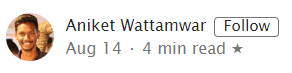
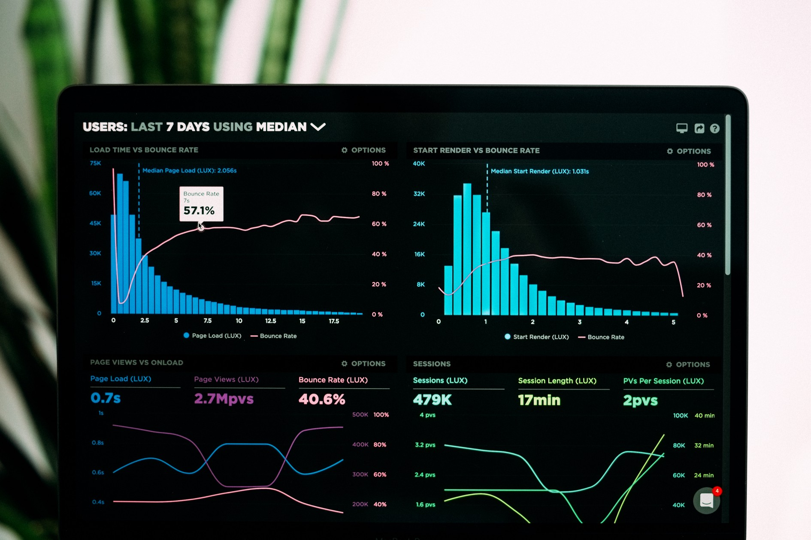

## [Data Visualization using Streamlit](https://towardsdatascience.com/data-visualization-using-streamlit-151f4c85c79a)

**Introduction to Streamlit**





Recently, I came across an open source framework — [Streamlit](https://www.streamlit.io/) which is used to create data apps. So I spent some time on the documentation and did some data visualization on a [Food Demand Forecasting Dataset](https://datahack.analyticsvidhya.com/contest/genpact-machine-learning-hackathon-1/#ProblemStatement).

> Streamlit’s open-source app framework is the easiest way for data scientists and machine learning engineers to create beautiful, performant apps in only a few hours! All in pure Python. All for free.
>
> [— streamlit](https://www.streamlit.io/)

To get started just type this command:

```
pip install streamlit
```

To check whether it was installed properly run the below command:

```
streamlit hello
```

If this appears on your browser, then streamlit is installed and working properly!


Now we will plot some simple charts using the dataset provided in the link above.

Importing the necessary libraries first and give a title.

```python
import streamlit as st
import pandas as pd
import numpy as np
import plotly.figure_factory as ff
import matplotlib.pyplot as plt

st.title(‘Food Demand Forecasting — Analytics Vidhya’)
```

In the dataset you will see 3 csv files and we will import that now using pandas. @st.cache is quite important here for smooth and fast functioning. Read about it in detail [here](https://docs.streamlit.io/en/stable/tutorial/create_a_data_explorer_app.html#effortless-caching).

```python
@st.cache
def load_data(nrows):
    data = pd.read_csv('train.csv', nrows=nrows)
    return data

@st.cache
def load_center_data(nrows):
    data = pd.read_csv('fulfilment_center_info.csv',nrows=nrows)
    return data

@st.cache
def load_meal_data(nrows):
    data = pd.read_csv('meal_info.csv',nrows=nrows)
    return data
```

Let’s call these functions now. I am right now taking only 1000 rows you can take your entire dataset.

```python
data_load_state = st.text('Loading data...')
weekly_data = load_data(1000)
center_info_data = load_center_data(1000)
meal_data = load_meal_data(1000)
```

First we will look at the **_Weekly Demand Data_**. We will be plotting bar chart, histograms, line chart and area chart.

**Bar Chart**

```python
st.subheader(‘Weekly Demand Data’)
st.write(weekly_data)

#Bar Chart
st.bar_chart(weekly_data[‘num_orders’])
```


**Histogram**

```python
#histogram
df = pd.DataFrame(weekly_data[:200], columns = [‘num_orders’,’checkout_price’,’base_price’])
df.hist()
plt.show()
st.pyplot()
```


**Line Chart**

```python
#Line Chart
st.line_chart(df)
```


**Area Chart**

```python
chart_data = pd.DataFrame(weekly_data[:40], columns=[‘num_orders’, ‘base_price’])
st.area_chart(chart_data)
```


Next csv file that we have is of **_Fulfillment information center._**

To display the raw data from the csv file I have added a checkbox and when it is checked it displays the raw data. Streamlit provides with simple and elegant syntax to do as you can see below.

```python
st.subheader(‘Fulfillment Center Information’)
if st.checkbox(‘Show Center Information data’):
    st.subheader(‘Center Information data’)
    st.write(center_info_data)
#st.write(center_info_data)
```


Plotting the bar chart for region code and center type in a way similar to weekly demand data.

```python
st.bar_chart(center_info_data[‘region_code’])
st.bar_chart(center_info_data[‘center_type’])
```


Next we will use plotly to see the distribution region code and center id.

```python
hist_data = [center_info_data[‘center_id’],center_info_data[‘region_code’]]
group_labels = [‘Center Id’, ‘Region Code’]
fig = ff.create_distplot(hist_data, group_labels, bin_size=[10, 25])
st.plotly_chart(fig, use_container_width=True)
```


The last csv file that we have is of meal data lets display the raw data of that too.

```python
st.subheader('Meal Information')
st.write(meal_data)
```

Here, a simple bar chart of the column cusine is plotted.

```python
st.bar_chart(meal_data[‘cuisine’])
```


Then to create button which on clicking displays the bar chart of the number of categories of meals will be shown. This can be done by writing the following code:

```python
agree = st.button(‘Click to see Categories of Meal’)
if agree:
 st.bar_chart(meal_data[‘category’])
```


To run your streamlit app just type the following command:

```
streamlit run appname.py
```

This will open up a browser and you can see all the visualisations.

Here is a screen recording on my computer.

[Aniket Wattamwar posted on LinkedInRecently, I came across Streamlit - an open source framework. So, I spent some time on the documentation and did some…www.linkedin.com](https://www.linkedin.com/posts/aniket-wattamwar-0a6658139_machinelearning-python-streamlit-activity-6699267657994162176-psWO)

You can find the entire code on my G[itHub](https://github.com/aniketwattamwar). You can connect with me here on other platforms as well — [Linktree](https://linktr.ee/aniketwattamwar)

Thank you.

Peace.


